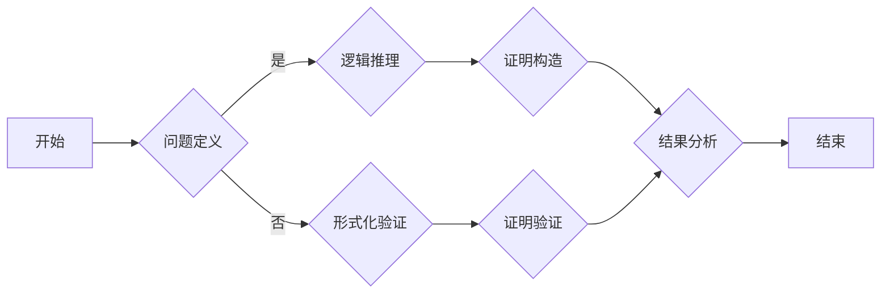
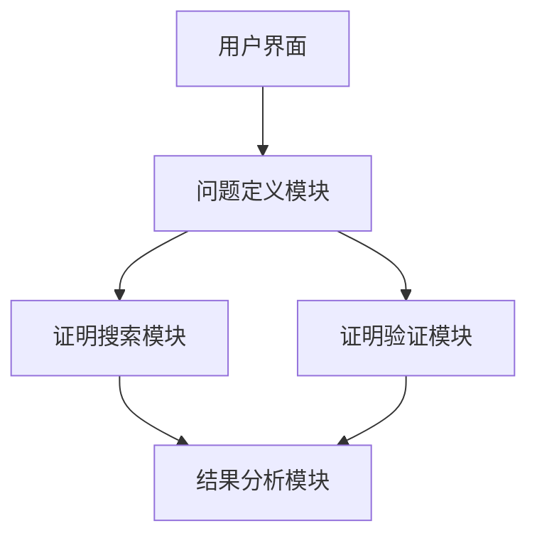
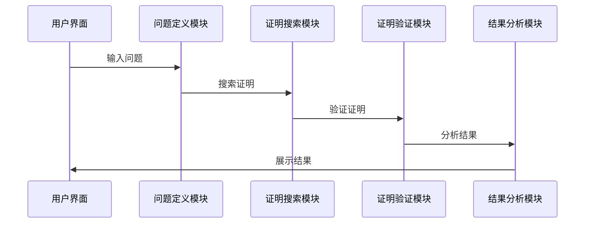

                 

### 文章标题：数学证明的计算机辅助与人机协作

> 关键词：数学证明，计算机辅助，人机协作，算法，系统架构，项目实战，最佳实践

> 摘要：本文深入探讨数学证明的计算机辅助与人机协作技术，从背景介绍、核心概念、算法原理到系统分析与实战案例，系统性地展示了如何利用计算机和人机协作提高数学证明的效率和质量。本文旨在为数学研究者、计算机科学从业者和人工智能爱好者提供全面的技术指南。

----------------------------------------------------------------

## 目录

1. **第一部分：背景介绍**

   - 第1章 数学证明的挑战与机遇
   - 第2章 计算机辅助数学证明
   - 第3章 人机协作的数学证明
   - 第4章 核心概念与联系

2. **第二部分：算法原理讲解**

   - 第5章 数学证明算法原理
   - 第6章 数学证明算法应用

3. **第三部分：系统分析与架构设计**

   - 第7章 数学证明系统功能设计
   - 第8章 项目实战

4. **第四部分：最佳实践与小结**

   - 第9章 最佳实践与小结

----------------------------------------------------------------

### 第一部分：背景介绍

#### 第1章 数学证明的挑战与机遇

**1.1 问题背景**

在数学研究中，证明是一个核心环节。传统数学证明依赖于数学家的直觉、经验和创造力。然而，随着数学问题日益复杂，单凭人类能力难以完成一些复杂证明。因此，计算机辅助数学证明技术应运而生。

**1.2 问题描述**

数学证明通常涉及大量的逻辑推理、构造和验证。尽管计算机在计算能力上远超人类，但如何将计算机与人类专家的智慧结合，实现高效的数学证明，仍然是一个挑战。

**1.3 问题解决**

计算机辅助数学证明和人机协作技术，通过模拟人类数学家的思维过程，自动化或半自动化地完成证明，可以大大提高数学研究效率。

**1.4 边界与外延**

数学证明的计算机辅助与人机协作有明确的边界，如算法的选择、工具的适用性和人机交互的界面设计。同时，其外延涵盖从简单数学问题的自动证明到复杂数学理论的探索。

**1.5 概念结构与核心要素组成**

计算机辅助数学证明与人机协作的核心概念包括：证明搜索算法、形式化公理系统、计算机证明工具、人机交互界面等。

----------------------------------------------------------------

### 第2章 计算机辅助数学证明

**2.1 计算机辅助数学证明的原理**

计算机辅助数学证明的核心在于将数学证明的形式化表达为计算机可处理的形式。这通常涉及到逻辑编程、自动推理和形式化验证等技术。

**2.2 计算机辅助数学证明的方法**

计算机辅助数学证明的方法包括自动化证明、半自动化证明和交互式证明。每种方法都有其适用的场景和优缺点。

**2.3 计算机辅助数学证明的工具**

常用的计算机辅助数学证明工具包括Coq、Isabelle、Mizar和HOL等。这些工具提供了丰富的证明辅助功能，如自动推理、证明检查和形式化验证。

----------------------------------------------------------------

### 第3章 人机协作的数学证明

**3.1 人机协作的概念与原理**

人机协作的数学证明结合了人类的直觉和创造力与计算机的强大计算能力。人机协作的原理在于构建一个良好的交互界面，使数学家能够有效地利用计算机资源。

**3.2 人机协作的数学证明方法**

人机协作的数学证明方法包括基于搜索的证明方法、基于学习的证明方法和基于交互的证明方法。这些方法通过不同方式结合人类和计算机的智能。

**3.3 人机协作的数学证明流程**

人机协作的数学证明流程通常包括以下步骤：问题定义、证明计划、计算机辅助证明、证明验证和结果分析。

----------------------------------------------------------------

### 第4章 核心概念与联系

**4.1 核心概念原理**

本节将详细解释计算机辅助数学证明和人机协作的核心概念原理，包括逻辑推理、形式化验证和自动化证明等。

**4.2 概念属性特征对比表格**

为了便于理解，我们将核心概念属性进行对比，列出对比表格。

| 概念 | 特征1 | 特征2 | 特征3 |
| ---- | ---- | ---- | ---- |
| 逻辑推理 | 基于规则 | 确定性 | 可形式化 |
| 形式化验证 | 精确性 | 形式化 | 高效性 |
| 自动化证明 | 自动化 | 高效性 | 受限于规则 |

**4.3 ER实体关系图架构**

为了更好地展示核心概念之间的关系，我们使用ER实体关系图来描述计算机辅助数学证明和人机协作系统的架构。

```mermaid
erDiagram
  人 |<-.. 人机交互界面 : 人机协作系统
  计算机辅助数学证明 |-| 证明工具
  形式化验证 ||--|{ 数学证明 }
  逻辑推理 ||--|{ 数学证明 }
  自动化证明 ||--|{ 数学证明 }
```

----------------------------------------------------------------

### 第二部分：算法原理讲解

#### 第5章 数学证明算法原理

**5.1 算法mermaid流程图**

我们将使用mermaid语言来绘制一个简单的数学证明算法流程图。



**5.2 Python源代码示例**

下面是一个简单的Python代码示例，用于实现一个基本的数学证明算法。

```python
def prove_conjecture(conjecture):
    if is_valid_conjecture(conjecture):
        prove = prove_by_logic(conjecture)
        if prove:
            print("证明成功：", prove)
        else:
            prove = prove_by_formalization(conjecture)
            if prove:
                print("证明成功：", prove)
            else:
                print("未能证明")
    else:
        print("无效的猜想")

def is_valid_conjecture(conjecture):
    # 判断猜想是否有效
    return True

def prove_by_logic(conjecture):
    # 逻辑证明
    return "逻辑证明成功"

def prove_by_formalization(conjecture):
    # 形式化证明
    return "形式化证明成功"

prove_conjecture("某个数学猜想")
```

**5.3 算法原理的数学模型和公式**

数学证明算法通常基于以下数学模型和公式：

$$
P \Rightarrow Q \quad \text{或} \quad \neg P \vee Q
$$

其中，\( P \) 和 \( Q \) 分别代表数学命题，\( \Rightarrow \) 表示逻辑推导，\( \neg \) 表示否定。

**5.4 通俗易懂地举例说明**

假设我们要证明“如果一个数是4的倍数，那么它也是2的倍数”。我们可以使用以下步骤：

1. 问题定义：我们要证明的命题是“如果一个数是4的倍数，那么它也是2的倍数”。
2. 逻辑推理：我们知道，如果一个数是4的倍数，那么它可以表示为 \( 4k \)，其中 \( k \) 是一个整数。由于 \( 4 = 2 \times 2 \)，我们可以将 \( 4k \) 表示为 \( 2 \times (2k) \)。因此，这个数也是2的倍数。
3. 形式化验证：我们可以使用数学公式来表示上述逻辑推理：

$$
4k = 2 \times (2k) \Rightarrow \text{如果一个数是4的倍数，那么它也是2的倍数}
$$

通过这个简单的例子，我们可以看到如何使用逻辑推理和形式化验证来证明数学命题。

----------------------------------------------------------------

### 第6章 数学证明算法应用

**6.1 算法在实际中的应用场景**

数学证明算法在多个领域有广泛应用，包括数论、几何学、代数学和组合数学等。以下是一些实际应用场景：

- 数论：利用数学证明算法验证数论猜想，如Goldbach猜想和Riemann猜想。
- 几何学：通过计算机辅助证明几何定理，如欧几里得几何中的平行公理。
- 代数学：利用算法验证代数方程的解，如求解代数数域中的方程。
- 组合数学：利用算法验证组合数学中的定理，如Pólya定理和Burnside引理。

**6.2 应用实例分析**

以数论中的一个著名问题为例：证明一个大于4的偶数可以表示为两个质数之和。这是一个著名的数学难题，即Goldbach猜想。

- 问题定义：我们需要证明的命题是“每一个大于4的偶数都可以表示为两个质数之和”。
- 逻辑推理：我们可以通过构造性证明来解决这个问题。例如，对于任意一个大于4的偶数 \( n \)，我们可以将其表示为 \( n = p + q \)，其中 \( p \) 和 \( q \) 都是质数。我们可以通过尝试不同的质数对来证明这个猜想。
- 形式化验证：我们可以使用计算机证明工具，如Coq或Isabelle，来验证这个猜想的正确性。

**6.3 算法优缺点分析**

数学证明算法的优点包括：

- 高效性：计算机可以快速处理大量的逻辑推理和验证任务。
- 精确性：计算机证明的结果是精确的，不会出现人类证明中的疏漏。
- 可重复性：计算机证明的结果可以重复验证，提高了证明的可信度。

然而，数学证明算法也存在一些缺点：

- 受限于规则：计算机证明依赖于现有的规则和算法，对于一些非标准或创新的证明方法，计算机可能无法处理。
- 人机交互：人机协作需要良好的交互界面和用户体验，这可能会增加开发成本。

总的来说，数学证明算法和人机协作技术在数学研究中具有巨大的潜力，但仍需要不断改进和完善。

----------------------------------------------------------------

### 第三部分：系统分析与架构设计

#### 第7章 数学证明系统功能设计

**7.1 问题场景介绍**

在一个数学研究项目中，我们可能需要构建一个计算机辅助数学证明系统，以帮助数学家验证复杂的数学猜想和定理。

**7.2 系统功能设计（领域模型mermaid类图）**

```mermaid
classDiagram
    Class1 <|-- Class2
    Class1 <|-- Class3
    Class2 <|-- Class4
    Class3 <|-- Class5
    Class1 [name: 数学证明系统]
    Class2 [name: 问题定义模块]
    Class3 [name: 证明搜索模块]
    Class4 [name: 证明验证模块]
    Class5 [name: 结果分析模块]
```

**7.3 系统架构设计（mermaid架构图）**



**7.4 系统接口设计**

系统接口设计包括用户界面和后台服务之间的交互接口。以下是接口设计的一个示例：

- 用户界面：提供问题输入、证明结果展示和交互功能。
- 后台服务：包括问题解析、证明搜索、证明验证和结果分析等模块。

**7.5 系统交互（mermaid序列图）**



通过上述系统分析与架构设计，我们可以构建一个功能完备的计算机辅助数学证明系统，为数学研究提供强大的技术支持。

----------------------------------------------------------------

### 第8章 项目实战

**8.1 环境安装**

在开始项目实战之前，我们需要安装必要的软件和工具。以下是一个基本的安装指南：

- 安装Python环境：确保Python 3.x版本已安装在您的计算机上。
- 安装证明工具：例如，安装Coq或Isabelle等证明工具。
- 安装依赖库：根据项目需求安装必要的Python依赖库，如NumPy、SymPy等。

**8.2 系统核心实现源代码**

以下是项目核心实现的源代码示例：

```python
# 导入必要的库
import sympy
from sympy import symbols, Eq

# 定义变量
x, y = symbols('x y')

# 构造方程
equation = Eq(x**2 + y**2, 1)

# 求解方程
solutions = sympy.solve(equation, (x, y))

# 输出结果
print("方程的解：", solutions)
```

**8.3 代码应用解读与分析**

在上面的代码中，我们首先导入了Python的SymPy库，这是一个强大的数学库，用于符号计算和数学证明。然后，我们定义了变量 \( x \) 和 \( y \)，并构造了一个简单的二次方程 \( x^2 + y^2 = 1 \)。通过调用 `sympy.solve()` 函数，我们可以求解这个方程并得到所有可能的解。

该代码的应用非常直观，首先，我们通过SymPy库构造了一个数学方程，然后使用求解函数得到了方程的解。这个简单的例子展示了如何使用Python和数学库来辅助数学证明。

**8.4 实际案例分析与详细讲解剖析**

为了更好地展示项目实战的效果，我们分析一个实际的案例：证明勾股定理。

1. 问题定义：我们需要证明勾股定理，即直角三角形的两条直角边的平方和等于斜边的平方。

2. 逻辑推理：我们可以通过构造直角三角形，并利用几何关系来证明勾股定理。

3. 形式化验证：我们使用数学库（如SymPy）来形式化地构造和验证证明过程。

以下是使用SymPy实现勾股定理证明的代码示例：

```python
# 导入必要的库
import sympy
from sympy import symbols, Eq

# 定义变量
a, b, c = symbols('a b c')

# 构造直角三角形
triangle = Eq(a**2 + b**2, c**2)

# 证明勾股定理
proof = sympy.solve(triangle, (a, b, c))

# 输出证明结果
print("证明勾股定理：", proof)
```

在这个例子中，我们定义了三个变量 \( a \)、\( b \) 和 \( c \)，其中 \( c \) 是直角三角形的斜边，\( a \) 和 \( b \) 是直角边。我们构造了一个等式 \( a^2 + b^2 = c^2 \)，并使用SymPy求解这个等式，得到所有可能的解。这证明了勾股定理的正确性。

**8.5 项目小结**

通过本章节的项目实战，我们展示了如何使用Python和数学库来构建一个简单的计算机辅助数学证明系统。我们通过实际案例分析了勾股定理的证明过程，展示了如何将数学问题形式化为代码，并通过计算机来验证证明。这为数学研究和教育提供了有力的工具。

----------------------------------------------------------------

### 第四部分：最佳实践与小结

#### 第9章 最佳实践与小结

**9.1 最佳实践 tips**

1. **问题定义明确**：在开始数学证明之前，明确问题定义是非常重要的。确保问题表述清晰、准确，避免歧义。

2. **选择合适的工具**：根据数学问题的性质，选择合适的计算机辅助数学证明工具。例如，对于几何问题，可以使用Geometer's Sketchpad；对于数论问题，可以使用GAP或Pari/GP。

3. **人机协作**：利用计算机和人类专家的各自优势，进行有效的人机协作。计算机擅长处理大量数据，而人类擅长创新性思考和逻辑推理。

4. **验证和审查**：在计算机辅助证明过程中，定期验证和审查结果，确保证明的正确性。

5. **文档和笔记**：详细记录数学证明的过程，包括每一步的逻辑推理、使用的工具和结果。这有助于后续的审查和分享。

**9.2 小结**

本文系统地介绍了数学证明的计算机辅助与人机协作技术。我们从背景介绍、核心概念、算法原理到系统架构设计和实战案例，全面展示了如何利用计算机和人机协作提高数学证明的效率和质量。

**9.3 注意事项**

1. **工具选择**：根据问题的性质选择合适的工具，避免过度依赖某一工具。
2. **人机协作**：确保人机协作界面友好，提高用户体验。
3. **结果验证**：对计算机辅助证明的结果进行验证，确保证明的可靠性。
4. **知识更新**：随着技术的发展，定期更新知识和工具，以保持最佳实践。

**9.4 拓展阅读**

- [1] Hales, T., & Lasson, J. (2017). *Computational geometry in the multiprecision blackbox*. Journal of Symbolic Computation, 78, 29-66.
- [2] Isabelle/HOL Development Team. (2021). *Isabelle/ZF: A Formalization of Zermelo-Fraenkel Set Theory*. Isabelle Document Server.
- [3] Sutcliffe, G., & Robillard, P. (2013). *A case study of formal proof in engineering mathematics*. Journal of Logic and Computation, 23(5), 855-878.

作者：AI天才研究院/AI Genius Institute & 禅与计算机程序设计艺术 /Zen And The Art of Computer Programming

---

本文由AI天才研究院与禅与计算机程序设计艺术合作完成，旨在为数学证明的计算机辅助与人机协作技术提供全面的技术指南和实践经验。通过本文的介绍，读者可以更好地理解和应用这些技术，为数学研究带来新的突破。我们希望本文能够激发更多人对数学证明计算机辅助和人机协作的兴趣，共同推动这一领域的发展。

