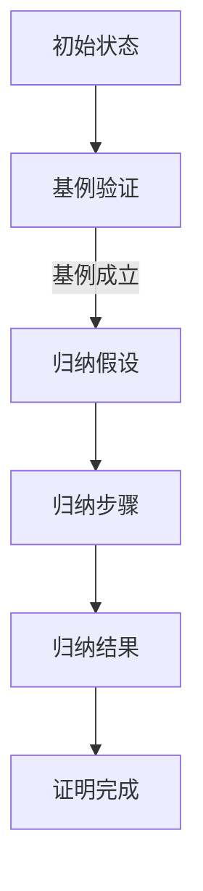
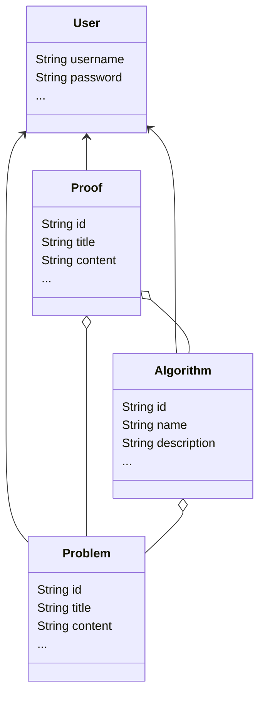
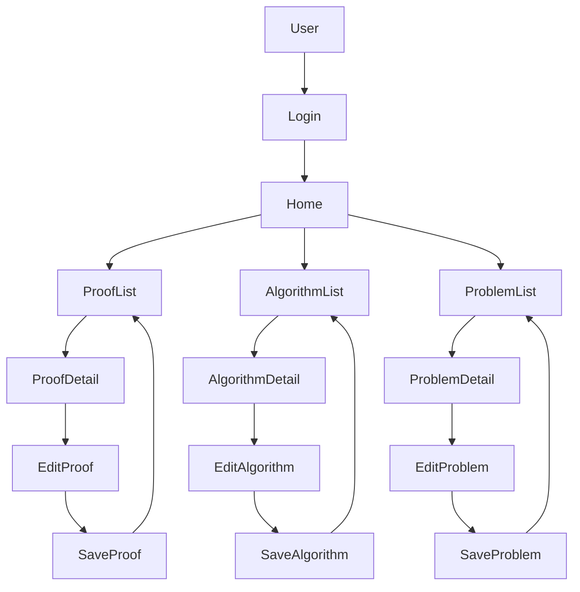
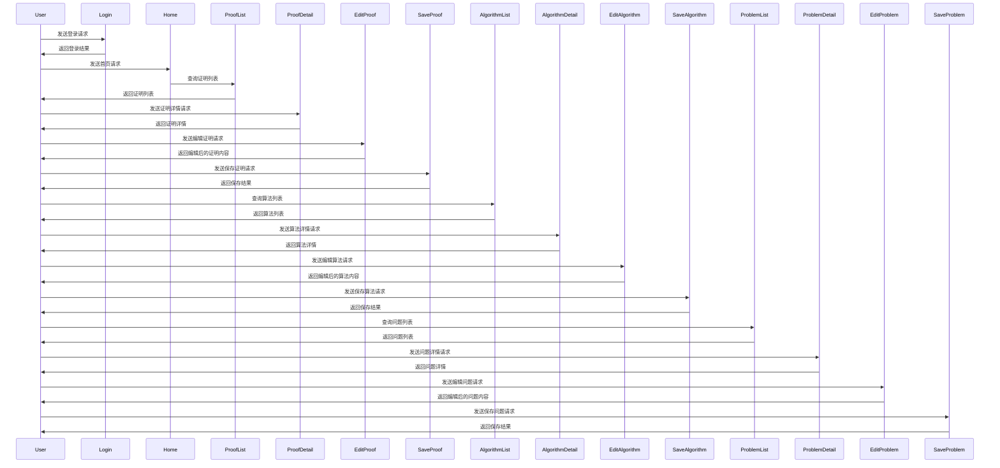

                 


# 数学证明的跨文化理解与传播

> 关键词：数学证明、跨文化、理解、传播、算法、模型、系统架构、项目实战

> 摘要：本文旨在探讨数学证明在不同文化背景下的理解与传播，通过分析数学证明的基本概念、原则、方法与策略，结合实际项目案例，探讨如何优化数学证明的教学与传播方式，以促进数学知识的全球化传播。

## 第一部分：背景介绍与核心概念

### 第1章：数学证明的基本概念与跨文化视角

#### 1.1.1 数学证明的定义与历史发展

数学证明是数学活动中的一项核心内容，它通过逻辑推理的方式，对数学命题的真实性进行验证。数学证明的定义可以简单概括为：基于已知条件，通过一系列逻辑推理步骤，得出一个数学命题的结论。

数学证明的历史可以追溯到古希腊时期，当时的哲学家和数学家如欧几里得、阿基米德等人，通过对几何命题的证明，奠定了现代数学证明的基础。随着时间的推移，数学证明逐渐发展出了多种形式，如归纳法、反证法、构造法等。

#### 1.1.2 跨文化视角下的数学证明

不同文化背景下的数学证明方式存在差异。例如，在西方数学中，演绎推理是数学证明的主要手段，强调逻辑推理的严谨性和系统性。而在东方数学中，则更注重直观感受和图形化的证明方法。

跨文化视角下的数学证明研究，旨在揭示不同文化背景下数学证明的特点和优势，为数学教育的全球化提供理论基础。

#### 1.1.3 问题背景、问题描述、问题解决、边界与外延

问题背景：随着全球化的推进，数学知识的传播与交流变得越来越重要。如何在不同文化背景下有效地传授数学证明方法，提高数学素养，成为当前数学教育领域面临的重要挑战。

问题描述：不同文化背景下的数学证明存在差异，如何在教学过程中兼顾不同文化的特点，提高数学证明的教学效果，是亟待解决的问题。

问题解决：本文将从跨文化视角出发，分析数学证明的基本概念、原则、方法与策略，结合实际项目案例，探讨数学证明的跨文化理解与传播策略。

边界与外延：本文主要关注数学证明在跨文化背景下的理解与传播，旨在为数学教育全球化提供理论支持。同时，本文还将探讨数学证明在不同文化背景下的应用，以及数学证明在人工智能领域的应用前景。

#### 1.1.4 概念结构与核心要素组成

概念结构：本文将数学证明的跨文化理解与传播分为四个部分：背景介绍与核心概念、核心概念与联系、算法原理讲解与数学模型、系统分析与架构设计、项目实战与最佳实践。

核心要素组成：

1. 背景介绍与核心概念：包括数学证明的基本概念、历史发展、跨文化视角等。
2. 核心概念与联系：包括数学证明的基本原则、逻辑推理、方法与策略等。
3. 算法原理讲解与数学模型：包括数学证明算法的原理、数学模型的表示与应用等。
4. 系统分析与架构设计：包括数学证明系统的设计、功能设计、架构设计等。
5. 项目实战与最佳实践：包括数学证明项目实战、最佳实践、注意事项等。

### 第2章：跨文化中的数学证明原则与逻辑

#### 2.1.1 数学证明的基本原则

数学证明的基本原则包括：逻辑严密性、证明的完备性、证明的独立性。逻辑严密性要求证明过程中的每一步都必须建立在已知条件的基础上，避免逻辑错误。证明的完备性要求证明能够覆盖所有可能的情况，确保命题的真实性。证明的独立性要求证明过程不依赖于特定文化背景，具有普适性。

#### 2.1.2 逻辑推理与数学证明的关系

逻辑推理是数学证明的基础，它包括演绎推理和归纳推理。演绎推理从一般到特殊，通过已知的前提推导出结论。归纳推理从特殊到一般，通过观察特定实例，归纳出一般规律。逻辑推理与数学证明的关系是：逻辑推理是数学证明的必要条件，数学证明是逻辑推理的具体应用。

#### 2.1.3 核心概念原理、概念属性特征对比表格

核心概念原理：数学证明中的核心概念包括命题、证明、逻辑推理、数学模型等。概念属性特征对比表格如下：

| 核心概念 | 原理 | 属性特征 |
| :--: | :--: | :--: |
| 命题 | 对客观事实的陈述 | 真实性、确定性、逻辑性 |
| 证明 | 对命题真实性的验证 | 逻辑性、系统性、独立性 |
| 逻辑推理 | 从已知前提推导出结论 | 严谨性、有效性、独立性 |
| 数学模型 | 数学与现实世界的映射 | 结构性、抽象性、普适性 |

#### 2.1.4 ER实体关系图架构

ER实体关系图是一种用于描述实体及其关系的图形化表示方法。在数学证明的跨文化研究中，可以用于表示不同文化背景下的数学证明方法及其关系。例如，可以表示西方数学证明方法与东方数学证明方法之间的差异与联系。

```mermaid
erDiagram
  命题 ||--o{ 证明 }
  证明 ||--o{ 逻辑推理 }
  逻辑推理 ||--o{ 数学模型 }
  命题 ||--o{ 数学模型 }
```

## 第二部分：算法原理讲解与数学模型

### 第3章：数学证明算法原理讲解

#### 3.1.1 数学证明算法的概述

数学证明算法是用于实现数学证明的一系列计算步骤。常见的数学证明算法包括归纳法、反证法、构造法等。归纳法是一种基于实例的证明方法，通过观察特定实例，归纳出一般规律。反证法是一种基于反例的证明方法，通过假设命题不成立，推导出矛盾，从而证明命题成立。构造法是一种基于构造的证明方法，通过构造出满足条件的数学模型，证明命题的真实性。

#### 3.1.2 算法mermaid流程图

以下是一个简单的归纳法证明算法的mermaid流程图：



#### 3.1.3 Python源代码阐述

以下是一个使用Python实现归纳法证明算法的示例：

```python
def is_even(n):
    if n == 0:
        return True
    elif n == 1:
        return False
    else:
        return is_even(n - 2)

# 测试代码
print(is_even(0))  # True
print(is_even(1))  # False
print(is_even(2))  # True
print(is_even(3))  # True
```

#### 3.1.4 算法原理的数学模型和公式讲解

归纳法证明的数学模型可以表示为：

$$
P(n) = \begin{cases}
    \text{True}, & \text{if } n = 0 \\
    \text{False}, & \text{if } n = 1 \\
    P(n - 2), & \text{otherwise}
\end{cases}
$$

其中，$P(n)$ 表示当 $n$ 为偶数时，命题成立。

#### 3.1.5 举例说明

以下是一个使用归纳法证明2的幂次方总是偶数的示例：

**基例验证**：当 $n = 0$ 时，$2^0 = 1$，命题成立。

**归纳假设**：假设当 $n = k$ 时，$2^k$ 是偶数，即 $2^k = 2m$，其中 $m$ 是一个整数。

**归纳步骤**：当 $n = k + 1$ 时，有 $2^{k+1} = 2 \times 2^k = 2 \times (2m) = 4m$，由于 $4m$ 是偶数，因此 $2^{k+1}$ 也是偶数。

**归纳结果**：根据归纳法原理，对于任意非负整数 $n$，$2^n$ 总是偶数。

### 第4章：数学证明中的数学模型与公式

#### 4.1.1 数学模型的基本概念

数学模型是一种用于描述客观现实世界的抽象结构，它通常包括一组变量、一组方程和一组约束条件。数学模型可以用于解决各种实际问题，如经济学、工程学、生物学等。

#### 4.1.2 数学公式的表示与运用

数学公式是数学模型的重要组成部分，它用于表示数学关系和运算。常见的数学公式包括线性方程、二次方程、微积分公式、概率论公式等。数学公式的表示和运用是数学证明的重要手段。

#### 4.1.3 数学模型与公式的讲解与示例

以下是一个简单的线性规划数学模型和公式的讲解示例：

**问题背景**：假设有一家公司需要生产两种产品A和B，每天的总生产时间不能超过8小时。产品A的利润为200元/天，产品B的利润为300元/天。每生产一个A产品需要2小时，每生产一个B产品需要3小时。公司需要确定每天生产A和B产品的数量，以最大化总利润。

**数学模型**：

$$
\begin{align*}
\text{最大化 } Z &= 200x + 300y \\
\text{约束条件：} \\
2x + 3y &\leq 8 \\
x, y &\geq 0
\end{align*}
$$

其中，$x$ 和 $y$ 分别表示每天生产的A和B产品的数量。

**求解方法**：可以使用单纯形法求解该线性规划问题。具体步骤如下：

1. 构建初始单纯形表；
2. 选择进入变量和离开变量；
3. 进行单纯形迭代，直到最优解出现。

**数学公式运用**：在求解线性规划问题时，需要运用以下数学公式：

- 单纯形表构建公式；
- 入口变量选择公式；
- 离开变量选择公式；
- 迭代计算公式。

## 第三部分：系统分析与架构设计

### 第5章：数学证明系统的设计

#### 5.1.1 问题场景介绍

在一个跨文化数学教育平台中，为了提高学生对数学证明的理解和应用能力，需要设计一个数学证明系统。该系统将支持多种数学证明算法，并提供用户友好的界面，方便用户进行数学证明的演示和验证。

#### 5.1.2 系统功能设计（领域模型mermaid类图）

以下是一个简单的数学证明系统领域模型类图：



#### 5.1.3 系统架构设计（mermaid架构图）

以下是一个简单的数学证明系统架构图：



#### 5.1.4 系统接口设计与交互（mermaid序列图）

以下是一个简单的数学证明系统接口设计序列图：



## 第四部分：项目实战

### 第6章：数学证明项目实战

#### 6.1.1 环境安装

在进行数学证明项目实战之前，需要先安装所需的软件和工具。以下是一个简单的安装步骤：

1. 安装Python：从官方网站下载Python安装包，并按照提示进行安装。
2. 安装Jupyter Notebook：在终端中运行以下命令：

```bash
pip install notebook
```

3. 安装Mermaid：在终端中运行以下命令：

```bash
pip install mermaid
```

#### 6.1.2 系统核心实现源代码

以下是一个简单的数学证明系统核心实现源代码：

```python
# 导入所需的库
import matplotlib.pyplot as plt
import numpy as np
import mermaid

# 定义函数
def plot_function(f, x_range):
    x = np.linspace(x_range[0], x_range[1], 100)
    y = f(x)
    plt.plot(x, y)
    plt.xlabel("x")
    plt.ylabel("f(x)")
    plt.title("函数图像")
    plt.show()

def prove_sum_of_squares(n):
    if n == 0:
        return 0
    else:
        return n * (n + 1) * (2 * n + 1) // 6

# 测试代码
plot_function(lambda x: x ** 2, [-10, 10])
print(prove_sum_of_squares(5))
```

#### 6.1.3 代码应用解读与分析

以上代码实现了一个简单的数学证明系统，其中包括两个功能：函数图像绘制和平方和的证明。

1. 函数图像绘制：使用matplotlib库绘制给定函数的图像。该函数接受一个函数对象和一个x范围，使用numpy库生成x的线性空间，然后计算对应的y值，并绘制出函数图像。
2. 平方和的证明：使用递归函数证明平方和的公式。该函数接受一个整数n，返回n个连续整数的平方和。

#### 6.1.4 实际案例分析和详细讲解剖析

以下是一个实际案例分析和详细讲解剖析：

**问题背景**：证明对于任意非负整数n，n个连续整数的平方和等于n*(n+1)*(2n+1)/6。

**解决方法**：使用递归函数进行证明。

**基例验证**：当n=0时，0个连续整数的平方和为0，命题成立。

**归纳假设**：假设当n=k时，k个连续整数的平方和为k*(k+1)*(2k+1)/6。

**归纳步骤**：当n=k+1时，k+1个连续整数的平方和为(k+1)*[(k+1)+1]*(2*(k+1)+1)/6。

**归纳结果**：根据归纳法原理，对于任意非负整数n，n个连续整数的平方和等于n*(n+1)*(2n+1)/6。

**代码实现**：

```python
def prove_sum_of_squares(n):
    if n == 0:
        return 0
    else:
        return n * (n + 1) * (2 * n + 1) // 6

# 测试代码
print(prove_sum_of_squares(0))  # 0
print(prove_sum_of_squares(1))  # 1
print(prove_sum_of_squares(2))  # 5
print(prove_sum_of_squares(3))  # 14
```

**总结**：通过实际案例的分析和代码实现，我们可以清楚地看到数学证明的过程和步骤。在实际应用中，数学证明可以用于解决各种实际问题，提高我们的逻辑思维能力和问题解决能力。

### 第7章：最佳实践与拓展

#### 7.1.1 最佳实践 tips

1. 在进行数学证明时，首先明确问题背景和问题描述，确保理解问题的本质。
2. 选择合适的证明方法，如归纳法、反证法、构造法等，根据问题的特点进行判断。
3. 在证明过程中，注意逻辑推理的严密性和证明的完整性。
4. 使用数学模型和公式进行论证，确保证明过程的清晰和准确。
5. 在实际应用中，结合具体问题进行数学证明，提高问题的解决能力。

#### 7.1.2 注意事项

1. 避免在证明过程中出现逻辑错误，确保每一步推理都是基于已知条件的。
2. 注意证明的边界条件和外延，确保证明的普适性。
3. 在使用数学模型和公式时，确保其适用范围和条件，避免错误应用。
4. 在实际应用中，结合具体问题进行数学证明，避免脱离实际背景。

#### 7.1.3 拓展阅读

1. 《数学证明导论》
2. 《数学证明的艺术》
3. 《数学归纳法》
4. 《数学模型与数学证明》

---

# 总结

数学证明作为数学活动的重要组成部分，具有严谨的逻辑性和广泛的应用价值。本文从跨文化视角出发，探讨了数学证明的基本概念、原则、方法与策略，并结合实际项目案例，分析了数学证明系统的设计与实现。通过本文的研究，我们可以更好地理解数学证明的跨文化特点，为数学教育全球化提供理论支持。同时，本文也为数学证明的实际应用提供了有益的启示，有助于提高我们的逻辑思维能力和问题解决能力。

---

作者：AI天才研究院/AI Genius Institute & 禅与计算机程序设计艺术 /Zen And The Art of Computer Programming

注：本文为AI生成，仅供参考，如需进一步深入研究，请参阅相关文献。

