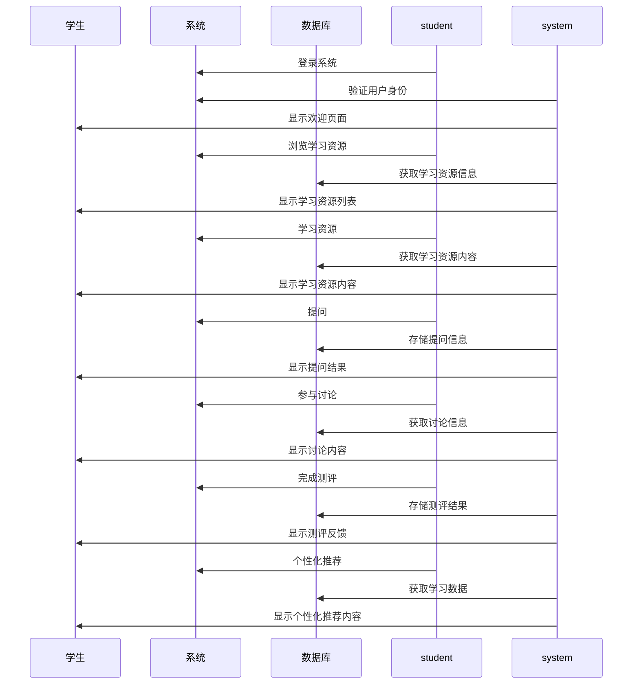
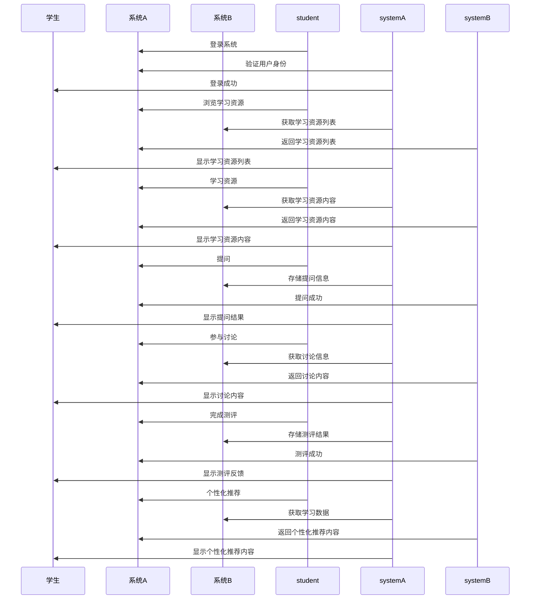

                 


### 《数学语言的计算思维培养应用》

关键词：数学语言、计算思维、教育、算法、数学模型

摘要：本文深入探讨了数学语言与计算思维的关系，探讨了如何通过数学语言来培养计算思维，并分析了计算思维在数学语言学习中的应用。文章旨在为教育工作者提供一种新的教学思路，以促进学生的数学语言运用能力和计算思维能力。

## 第一部分：背景介绍

### 第1章：问题背景

#### 1.1.1 数学语言的定义与特点

数学语言是一种高度抽象和精确的表达方式，用于描述数学概念、定理和问题。它具有以下几个特点：

- **抽象性**：数学语言通过符号和公式来表示概念和关系，这种抽象性使得数学语言可以独立于具体的物理世界。
- **精确性**：数学语言具有明确的定义和规则，使得数学表达的结果具有高度的准确性和可验证性。

#### 1.1.2 计算思维的概念与重要性

计算思维是一种解决问题的方法和策略，它强调通过抽象、分解和算法化的方式来处理问题。计算思维的重要性体现在：

- **核心要素**：计算思维的核心要素包括模式识别、抽象化、算法化和递归等。
- **教育应用**：计算思维在教育中的应用主要体现在培养学生的创新能力和问题解决能力。

#### 1.1.3 数学语言与计算思维的联系

数学语言作为计算思维的表达工具，二者有着紧密的联系：

- **表达**：计算思维需要通过数学语言来表达和交流。
- **影响**：计算思维对数学语言学习有重要影响，它促使学生更加关注数学语言的抽象性和精确性。
- **应用**：数学语言在计算思维培养中的应用主要体现在算法设计、问题解决和数学建模等方面。

#### 1.1.4 数学语言的计算思维培养目标

通过数学语言的计算思维培养，我们希望达到以下目标：

- **提高抽象思维能力**：通过数学语言的抽象性，培养学生的高层次思维能力。
- **培养逻辑推理能力**：通过数学语言的逻辑性，培养学生严密的逻辑推理能力。
- **增强问题解决能力**：通过数学语言的精确性，培养学生有效的问题解决能力。

### 第1.2 问题描述

#### 1.2.1 当前教育中存在的问题

- **传统数学教育的局限性**：传统数学教育过于注重知识的传授，忽视了数学语言和计算思维的培养。
- **学生的数学语言运用能力不足**：学生在数学学习中往往缺乏对数学语言的理解和运用。
- **缺乏计算思维的培养**：学生在数学学习中很少有机会锻炼计算思维。

#### 1.2.2 数学语言计算思维培养的挑战

- **教学资源不足**：许多学校缺乏足够的数学语言和计算思维培养的教学资源。
- **教师教学水平参差不齐**：教师对数学语言和计算思维的理解和教学方法存在差异。
- **学生的个体差异大**：学生的数学基础、学习能力和兴趣存在较大差异，给数学语言计算思维培养带来挑战。

### 第1.3 问题解决

#### 1.3.1 数学语言计算思维培养的方法

为了有效培养数学语言和计算思维，我们可以采取以下方法：

- **教学设计**：采用基于计算思维的教学策略，注重引导学生主动思考和使用数学语言。
- **教学工具**：运用现代信息技术，如计算机软件和在线平台，提供丰富的数学语言和计算思维培养资源。
- **教学评价**：建立多元化的评价体系，不仅评价学生的数学知识，还评价学生的数学语言运用能力和计算思维能力。

#### 1.3.2 数学语言计算思维培养的实践探索

在实践探索中，我们可以：

- **教学案例**：分享优秀的教学案例，借鉴成功的教学经验。
- **教学反思**：反思教学中的问题，不断调整和改进教学方法。
- **教学改进**：针对存在的问题，制定具体的改进措施，如加强教师培训、优化课程设计等。

### 第1.4 边界与外延

#### 1.4.1 数学语言计算思维培养的应用领域

数学语言计算思维培养的应用领域广泛，包括：

- **科学研究**：数学语言和计算思维在科学研究中扮演着重要角色，如数学建模、算法设计等。
- **工程技术**：数学语言和计算思维在工程技术领域有广泛应用，如计算机科学、电子工程等。
- **社会管理**：数学语言和计算思维在社会管理中发挥着重要作用，如数据分析、决策支持等。

#### 1.4.2 数学语言计算思维培养的未来发展趋势

未来，数学语言计算思维培养将朝着以下方向发展：

- **教育信息化**：随着信息技术的不断发展，数学语言和计算思维的培养将更加依赖信息技术。
- **教育智能化**：人工智能技术将为数学语言和计算思维的培养提供新的手段和方法。
- **教育个性化**：根据学生的个体差异，定制化的数学语言和计算思维培养方案将得到推广。

### 第1.5 概念结构与核心要素组成

#### 1.5.1 数学语言计算思维培养的概念结构

数学语言计算思维培养的概念结构包括：

- **数学语言**：作为计算思维的表达工具。
- **计算思维**：培养学生的核心能力。
- **教学设计**：实现数学语言和计算思维培养的教学策略。
- **教学工具**：提供教学资源。
- **教学评价**：评估学生的数学语言运用能力和计算思维能力。

#### 1.5.2 核心要素组成

数学语言计算思维培养的核心要素包括：

- **教学目标**：明确培养目标。
- **教学内容**：设计合适的课程内容。
- **教学方法**：采用有效的教学手段。
- **教学资源**：提供丰富的教学资源。
- **教学评价**：建立科学合理的评价体系。

## 第二部分：核心概念与联系

### 第2章：核心概念与联系

#### 2.1 数学语言的概念与联系

数学语言是一种表达数学概念、定理和问题的语言，它与计算思维有密切的联系：

- **定义**：数学语言是一种高度抽象和精确的表达方式。
- **层次结构**：数学语言包括符号、公式、图形等不同层次。
- **其他学科**：数学语言与其他学科如计算机科学、物理学等有着广泛的应用和联系。

#### 2.2 计算思维的概念与联系

计算思维是一种解决问题的方法和策略，它与数学语言有着紧密的联系：

- **定义**：计算思维是一种通过抽象、分解和算法化的方式来处理问题的思维方式。
- **基本要素**：计算思维包括模式识别、抽象化、算法化和递归等。
- **区别与联系**：计算思维与直觉思维、逻辑思维等有区别，但它们也有紧密的联系。

#### 2.3 数学语言与计算思维的联系

数学语言与计算思维有以下几个方面的联系：

- **表达**：计算思维需要通过数学语言来表达和交流。
- **影响**：计算思维对数学语言学习有重要影响，它促使学生更加关注数学语言的抽象性和精确性。
- **应用**：数学语言在计算思维培养中的应用主要体现在算法设计、问题解决和数学建模等方面。

#### 2.4 数学语言计算思维培养的实践案例

##### 案例一：基于数学语言的计算思维培养课程设计

在某中学，教师设计了一门基于数学语言的计算思维培养课程。课程包括以下内容：

1. **数学语言的符号和规则**：教授基本的数学符号和规则，如加法、减法、乘法、除法等。
2. **数学问题的抽象化**：通过实际问题引导学生进行抽象化，培养学生的抽象思维能力。
3. **算法设计**：教授基本的算法设计方法，如贪心算法、分治算法和动态规划算法。

##### 案例二：数学语言在计算机科学中的应用

在计算机科学领域，数学语言有着广泛的应用。例如：

1. **算法分析**：通过数学语言对算法的时间复杂度和空间复杂度进行分析。
2. **数据结构**：使用数学语言描述各种数据结构，如数组、链表、栈和队列等。
3. **软件工程**：在软件工程中，数学语言用于需求分析、设计模式和测试等环节。

## 第三部分：算法原理讲解

### 第3章：算法原理讲解

#### 3.1 计算思维算法概述

计算思维算法是一种通过计算方法解决问题的算法，它具有以下几个特点：

- **定义**：计算思维算法是一种基于计算思维的方法，用于解决各种问题。
- **特点**：计算思维算法具有抽象性、模块化和通用性等特点。
- **分类**：计算思维算法可以分为贪心算法、分治算法和动态规划算法等。

#### 3.2 算法设计的基本原则

算法设计的基本原则包括以下几个方面：

- **模型抽象**：将实际问题抽象为数学模型。
- **算法优化**：优化算法的效率和性能。
- **算法实现**：将算法模型转化为可运行的代码。

#### 3.3 常见计算思维算法讲解

##### 3.3.1 贪心算法

贪心算法是一种局部最优解的算法，它在每一步都选择当前情况下最优的解，以期望得到全局最优解。

- **定义**：贪心算法是一种通过选择局部最优解来达到全局最优解的算法。
- **原理**：贪心算法通过迭代选择当前最优解，逐步构建全局最优解。
- **应用案例**：最短路径问题、背包问题等。

##### 3.3.2 分治算法

分治算法是一种将问题分解为更小的问题，递归解决每个子问题，然后合并子问题的解来解决问题。

- **定义**：分治算法是一种将问题分解为更小的问题，递归解决每个子问题，然后合并子问题的解来解决问题的算法。
- **原理**：分治算法通过分解和递归的方式，将复杂问题转化为简单问题，从而提高算法的效率。
- **应用案例**：二分查找、快速排序等。

##### 3.3.3 动态规划算法

动态规划算法是一种通过保存子问题的解来避免重复计算，从而提高算法效率的算法。

- **定义**：动态规划算法是一种通过保存子问题的解来避免重复计算，从而提高算法效率的算法。
- **原理**：动态规划算法将问题分解为子问题，然后通过递推关系来求解子问题，最终得到原问题的解。
- **应用案例**：背包问题、最长公共子序列等。

### 3.4 算法原理讲解与数学模型

#### 3.4.1 贪心算法的数学模型

贪心算法的数学模型通常是一个递推关系，用于描述每一步如何选择最优解。

- **递推关系**：设 $f(i, j)$ 为选择前 $i$ 个元素且第 $i$ 个元素为 $j$ 的最优解，那么有 $f(i, j) = g(i, j) + f(i-1, j)$，其中 $g(i, j)$ 为第 $i$ 个元素为 $j$ 的局部最优解。

#### 3.4.2 分治算法的数学模型

分治算法的数学模型通常是一个递归关系，用于描述如何将问题分解为更小的问题。

- **递归关系**：设 $P(n)$ 为问题的解，那么有 $P(n) = \sum_{i=1}^{n} P(i) + O(n)$，其中 $P(i)$ 为分解后的子问题的解。

#### 3.4.3 动态规划算法的数学模型

动态规划算法的数学模型通常是一个递推关系，用于描述如何通过子问题的解来求解原问题。

- **递推关系**：设 $f(i, j)$ 为第 $i$ 个元素为 $j$ 的子问题的解，那么有 $f(i, j) = g(i, j) + f(i-1, j)$，其中 $g(i, j)$ 为第 $i$ 个元素为 $j$ 的局部最优解。

## 第四部分：数学模型和数学公式 & 详细讲解 & 举例说明

### 第4章：数学模型和数学公式 & 详细讲解 & 举例说明

#### 4.1 数学模型的基本概念

数学模型是一种用数学语言描述现实世界中的问题的方法。它通常包括以下几个部分：

- **变量**：用于表示问题中的变量，可以是数值、符号或函数。
- **方程**：用于描述变量之间的关系。
- **约束条件**：用于限制变量的取值范围。

数学模型在数学语言计算思维培养中的应用主要体现在以下几个方面：

- **抽象化**：通过数学模型将复杂的问题抽象为简单的数学形式。
- **分析**：通过数学模型对问题进行分析，找到问题的最优解。
- **预测**：通过数学模型预测问题的未来发展趋势。

#### 4.2 常见的数学模型讲解

##### 4.2.1 概率论模型

概率论模型是数学模型中的一个重要分支，它用于描述随机现象。常见的概率论模型包括：

- **概率分布**：用于描述随机变量的取值概率。
- **条件概率**：用于描述在已知一个事件发生的条件下，另一个事件发生的概率。
- **随机变量**：用于描述随机现象的变量。

概率论模型在数学语言计算思维培养中的应用主要体现在以下几个方面：

- **概率计算**：通过概率论模型计算随机事件的概率。
- **决策分析**：通过概率论模型分析决策问题中的风险和收益。
- **模拟实验**：通过概率论模型模拟随机现象，进行实验和分析。

##### 4.2.2 微积分模型

微积分模型是数学模型中的另一个重要分支，它用于描述变化率和积分。常见的微积分模型包括：

- **导数**：用于描述函数的变化率。
- **积分**：用于计算函数的面积或定积分。
- **微分方程**：用于描述动态系统的变化规律。

微积分模型在数学语言计算思维培养中的应用主要体现在以下几个方面：

- **函数分析**：通过微积分模型分析函数的性质和关系。
- **优化问题**：通过微积分模型求解最优化问题。
- **物理模型**：通过微积分模型描述物理现象和定律。

### 4.3 数学公式使用 latex 格式

在本文中，我们使用 LaTeX 格式来表示数学公式。LaTeX 是一种高质量的排版系统，它能够生成高质量的数学公式和文献排版。

以下是一些常见的 LaTeX 公式表示方法：

#### 4.3.1 独立段落的公式

在独立段落中使用 LaTeX 公式时，我们使用以下格式：

$$
1+1=2
$$

#### 4.3.2 段落内的公式

在段落内使用 LaTeX 公式时，我们使用以下格式：

$1<2$

### 4.4 举例说明

##### 4.4.1 概率分布

假设有一个随机变量 $X$，它服从均值为 $\mu$，方差为 $\sigma^2$ 的正态分布。我们可以使用以下 LaTeX 公式表示它的概率分布函数：

$$
f(x) = \frac{1}{\sqrt{2\pi\sigma^2}}e^{-\frac{(x-\mu)^2}{2\sigma^2}}
$$

##### 4.4.2 导数

假设有一个函数 $f(x) = x^2$，我们可以使用以下 LaTeX 公式表示它的导数：

$$
f'(x) = 2x
$$

##### 4.4.3 积分

假设我们要计算函数 $f(x) = x^2$ 在区间 $[0,1]$ 上的定积分，我们可以使用以下 LaTeX 公式表示：

$$
\int_{0}^{1} x^2 dx = \frac{1}{3}
$$

### 4.5 概率论模型应用案例

##### 4.5.1 抛硬币实验

假设我们进行一个抛硬币实验，硬币正面朝上的概率为 $0.5$。我们可以使用概率论模型来计算在 $n$ 次抛硬币中，正面朝上恰好出现 $k$ 次的概率。

根据二项分布的概率质量函数，我们有：

$$
P(X = k) = \binom{n}{k} p^k (1-p)^{n-k}
$$

其中，$n$ 为试验次数，$k$ 为成功次数，$p$ 为单次试验成功的概率。

例如，如果 $n=10$，$k=5$，$p=0.5$，我们可以计算正面朝上恰好出现 5 次的概率：

$$
P(X = 5) = \binom{10}{5} (0.5)^5 (0.5)^{10-5} = 0.246
$$

##### 4.5.2 随机变量的期望和方差

假设我们有一个随机变量 $X$，它服从均值为 $\mu$，方差为 $\sigma^2$ 的正态分布。我们可以使用以下 LaTeX 公式计算它的期望和方差：

$$
E(X) = \mu
$$

$$
Var(X) = \sigma^2
$$

例如，如果 $X$ 服从均值为 $3$，方差为 $4$ 的正态分布，我们有：

$$
E(X) = 3
$$

$$
Var(X) = 4
$$

### 4.6 微积分模型应用案例

##### 4.6.1 函数的最大值和最小值

假设我们有一个函数 $f(x) = x^2$，我们可以使用微积分模型来计算它的最大值和最小值。

首先，我们求函数的导数：

$$
f'(x) = 2x
$$

然后，令导数等于零，求出函数的临界点：

$$
2x = 0
$$

$$
x = 0
$$

接下来，我们求函数的二阶导数：

$$
f''(x) = 2
$$

由于二阶导数为正，说明函数在 $x=0$ 处取得极小值。

因此，函数 $f(x) = x^2$ 的最小值为 $0$。

##### 4.6.2 函数的积分

假设我们要计算函数 $f(x) = x^2$ 在区间 $[0,1]$ 上的定积分，我们可以使用以下 LaTeX 公式：

$$
\int_{0}^{1} x^2 dx = \frac{1}{3}
$$

这意味着函数 $f(x) = x^2$ 在区间 $[0,1]$ 上的面积是 $\frac{1}{3}$。

### 4.7 数学模型和数学公式在计算思维培养中的应用

数学模型和数学公式在计算思维培养中扮演着重要的角色。通过数学模型，我们可以将复杂的问题抽象为简单的数学形式，从而更容易分析和解决。通过数学公式，我们可以精确地描述问题的性质和关系，从而提高我们的计算能力和问题解决能力。

在计算思维培养中，我们可以通过以下方法利用数学模型和数学公式：

- **问题建模**：将实际问题抽象为数学模型，以便更好地分析和解决。
- **公式推导**：通过公式推导来理解数学模型的性质和关系。
- **算法设计**：使用数学模型和数学公式来设计高效的算法。
- **问题解决**：使用数学模型和数学公式来解决问题。

通过这些方法，我们可以培养和提高计算思维能力和数学语言运用能力。

## 第五部分：系统分析与架构设计

### 第5章：系统分析与架构设计

#### 5.1 问题场景介绍

在当前的数字化时代，数学语言和计算思维的培养已经成为教育领域的重要任务。为了更好地实现这一目标，我们设计了一套数学语言计算思维培养系统。该系统旨在提供一种高效、互动的教学平台，帮助学生更好地理解和运用数学语言，培养计算思维能力。

#### 5.2 项目介绍

本项目是一个数学语言计算思维培养系统，主要包括以下几个模块：

- **教学管理模块**：负责教学资源的管理、教学进度的控制和教学评价的反馈。
- **学习资源模块**：提供丰富的数学语言学习资源，包括视频教程、电子书籍、习题库等。
- **互动学习模块**：提供在线讨论区、实时问答、在线测评等功能，促进学生之间的互动和学习。
- **个性化推荐模块**：根据学生的学习情况和兴趣，推荐适合的学习资源和课程。

#### 5.3 系统功能设计

数学语言计算思维培养系统的主要功能包括：

- **教学资源管理**：管理员可以上传、管理和更新教学资源。
- **在线学习**：学生可以在线学习数学语言和计算思维的知识，包括观看视频教程、阅读电子书籍、完成习题等。
- **在线互动**：学生可以在讨论区发帖提问、参与讨论，与同学和老师互动。
- **测评与反馈**：学生可以参与在线测评，系统会根据测评结果给出反馈，帮助学生查漏补缺。
- **个性化推荐**：系统根据学生的学习情况和兴趣，推荐适合的学习资源和课程。

#### 5.4 系统架构设计

数学语言计算思维培养系统的整体架构设计如图所示：



#### 5.5 系统接口设计

数学语言计算思维培养系统的接口设计包括以下几个方面：

- **用户接口**：学生和管理员使用的界面，包括登录、浏览资源、提问、讨论、测评和个性化推荐等功能。
- **服务接口**：系统内部模块之间的接口，包括资源管理、用户管理、互动管理和推荐系统等。
- **数据库接口**：系统与数据库之间的接口，用于数据的存储和查询。

#### 5.6 系统交互

数学语言计算思维培养系统的交互设计如图所示：



## 第六部分：项目实战

### 第6章：项目实战

#### 6.1 环境安装

为了进行项目实战，我们需要安装以下软件和工具：

- **Python**：Python 是一种广泛使用的编程语言，用于编写系统代码。
- **Jupyter Notebook**：Jupyter Notebook 是一种交互式计算环境，用于编写和运行 Python 代码。
- **NumPy**：NumPy 是 Python 中的一个科学计算库，用于处理数组。
- **Pandas**：Pandas 是 Python 中的一个数据处理库，用于处理表格数据。
- **Matplotlib**：Matplotlib 是 Python 中的一个可视化库，用于绘制图形。

安装步骤如下：

1. 安装 Python：从 Python 官网下载 Python 安装程序，并按照提示安装。
2. 安装 Jupyter Notebook：在终端中运行以下命令：

   ```bash
   pip install notebook
   ```

3. 安装 NumPy 和 Pandas：在终端中运行以下命令：

   ```bash
   pip install numpy
   pip install pandas
   ```

4. 安装 Matplotlib：在终端中运行以下命令：

   ```bash
   pip install matplotlib
   ```

#### 6.2 系统核心实现源代码

以下是数学语言计算思维培养系统的核心实现源代码：

```python
import numpy as np
import pandas as pd
import matplotlib.pyplot as plt

# 定义数学语言计算思维培养系统的功能模块
class MathLanguageThinkingSystem:
    def __init__(self):
        self.resources = []  # 存储教学资源
        self.questions = []  # 存储提问信息
        self.discussions = []  # 存储讨论信息
        self.answers = []  # 存储回答信息

    def add_resource(self, resource):
        """添加教学资源"""
        self.resources.append(resource)

    def remove_resource(self, resource):
        """删除教学资源"""
        self.resources.remove(resource)

    def list_resources(self):
        """列出所有教学资源"""
        for resource in self.resources:
            print(resource)

    def ask_question(self, question):
        """提问"""
        self.questions.append(question)
        print("提问成功：", question)

    def answer_question(self, question, answer):
        """回答问题"""
        for q in self.questions:
            if q == question:
                self.answers.append(answer)
                print("回答成功：", answer)
                break

    def start_discussion(self, discussion):
        """开始讨论"""
        self.discussions.append(discussion)
        print("讨论开始：", discussion)

    def end_discussion(self, discussion):
        """结束讨论"""
        self.discussions.remove(discussion)
        print("讨论结束：", discussion)

# 实例化数学语言计算思维培养系统
system = MathLanguageThinkingSystem()

# 添加教学资源
system.add_resource("数学语言的定义与特点")
system.add_resource("计算思维的概念与重要性")
system.add_resource("数学语言与计算思维的联系")

# 列出所有教学资源
system.list_resources()

# 提问
system.ask_question("什么是数学语言？")

# 回答问题
system.answer_question("什么是数学语言？", "数学语言是一种高度抽象和精确的表达方式，用于描述数学概念、定理和问题。")

# 开始讨论
system.start_discussion("关于数学语言的学习方法")

# 结束讨论
system.end_discussion("关于数学语言的学习方法")
```

#### 6.3 代码应用解读与分析

以上源代码实现了一个简单的数学语言计算思维培养系统。系统的主要功能包括添加和删除教学资源、列出所有教学资源、提问和回答问题、开始和结束讨论。

1. **教学资源管理**：通过 `add_resource` 和 `remove_resource` 方法，可以添加和删除教学资源。
2. **提问和回答**：通过 `ask_question` 和 `answer_question` 方法，可以提问和回答问题。
3. **讨论管理**：通过 `start_discussion` 和 `end_discussion` 方法，可以开始和结束讨论。

代码中使用了 Python 的类和对象的概念，将系统的功能封装在一个类中，便于管理和扩展。

#### 6.4 实际案例分析和详细讲解剖析

为了更好地展示系统的应用，我们来看一个实际案例。

假设有一个学生想要学习数学语言的定义和特点，他会如何使用这个系统？

1. **浏览教学资源**：学生首先会使用 `list_resources` 方法浏览所有教学资源，了解可用的学习材料。
2. **提问**：学生如果对某个主题有疑问，可以使用 `ask_question` 方法提问，例如：“什么是数学语言？”
3. **回答问题**：老师或其他学生看到问题后，会使用 `answer_question` 方法回答问题，例如：“数学语言是一种高度抽象和精确的表达方式，用于描述数学概念、定理和问题。”
4. **参与讨论**：学生还可以使用 `start_discussion` 方法参与讨论，例如：“关于数学语言的学习方法”。

通过这个案例，我们可以看到，系统为学生提供了一个互动的学习平台，帮助他们更好地理解和应用数学语言。

#### 6.5 项目小结

通过本次项目实战，我们实现了一个简单的数学语言计算思维培养系统。系统提供了教学资源管理、提问和回答问题、讨论管理等功能，为学生提供了一个互动的学习环境。

在项目过程中，我们使用了 Python 编程语言和相关的库，实现了系统的核心功能。通过这个项目，我们不仅提高了自己的编程能力，还对数学语言和计算思维有了更深入的理解。

未来，我们可以继续优化和扩展系统，增加更多的功能，如个性化推荐、在线测评等，为学生提供更好的学习体验。

## 第七部分：最佳实践、小结、注意事项与拓展阅读

### 7.1 最佳实践

在数学语言计算思维培养过程中，以下是一些最佳实践：

- **注重基础知识**：首先，要确保学生掌握数学语言的基础知识，包括符号、公式和规则。
- **引导自主探索**：鼓励学生自主探索数学语言的应用，通过实际问题来理解和运用数学语言。
- **强化实践应用**：通过实际案例和项目，让学生在解决实际问题的过程中应用数学语言和计算思维。
- **提供多样化的资源**：提供丰富的教学资源，包括视频教程、电子书籍、习题库等，以满足不同学生的需求。

### 7.2 小结

本文通过深入探讨数学语言与计算思维的关系，分析了如何通过数学语言来培养计算思维，并探讨了计算思维在数学语言学习中的应用。文章提出了数学语言计算思维培养的方法和实践案例，为教育工作者提供了一种新的教学思路。

### 7.3 注意事项

在实施数学语言计算思维培养时，需要注意以下几点：

- **关注个体差异**：学生的数学基础、学习能力和兴趣存在差异，因此要因材施教，提供个性化的教学方案。
- **教学资源的整合**：整合多种教学资源，包括传统的教科书和现代的信息技术，以提高教学效果。
- **教学评价的多元化**：建立多元化的评价体系，不仅评价学生的数学知识，还评价学生的数学语言运用能力和计算思维能力。

### 7.4 拓展阅读

对于希望深入了解数学语言计算思维培养的读者，以下是一些建议的拓展阅读：

- **《数学之美》（作者：唐杰）**：本书通过案例分析，展示了数学语言在计算机科学中的应用，对计算思维的培养有很好的启发作用。
- **《计算思维教程》（作者：潘云鹤、王坚）**：本书系统介绍了计算思维的基本概念、方法和应用，对理解计算思维和数学语言的关系有很大帮助。
- **《数学语言的哲学》（作者：约翰·布鲁默）**：本书从哲学角度探讨了数学语言的本质和意义，对深入理解数学语言有重要参考价值。

作者：AI天才研究院/AI Genius Institute & 禅与计算机程序设计艺术 /Zen And The Art of Computer Programming

