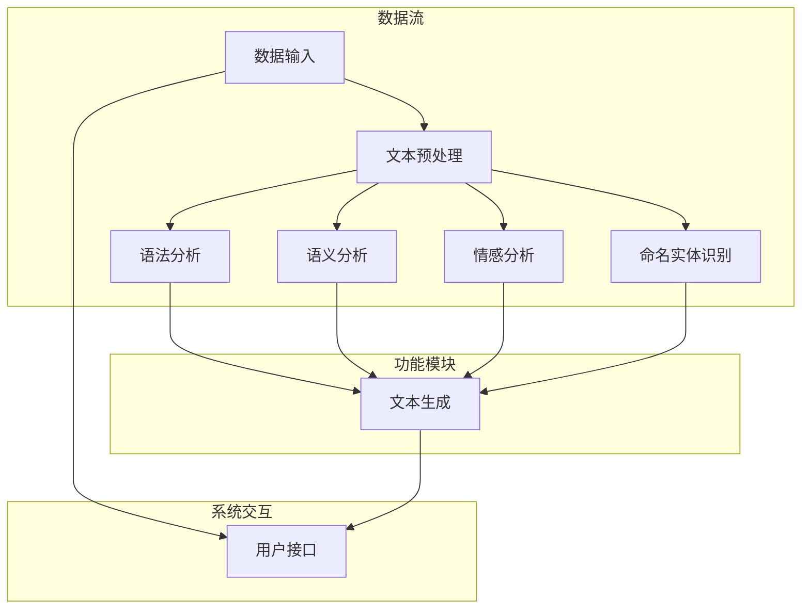

                 


### 设计《数学语言的计算语言学与自然语言处理》目录大纲

**目标：** 设计一份完整且详细的《数学语言的计算语言学与自然语言处理》书籍目录大纲，包括至少7个章节，覆盖背景介绍、核心概念与联系、算法原理讲解、数学模型和数学公式详细讲解、系统分析与架构设计、项目实战和最佳实践等内容。

**步骤1：** 确定书籍核心内容与结构

根据书名和主题，书籍核心内容可以包括以下几个方面：

1. **背景介绍**：计算语言学、自然语言处理的发展历程，数学语言在NLP中的应用。
2. **核心概念与联系**：语法分析、语义分析、机器翻译、信息检索等NLP关键概念的数学基础。
3. **算法原理讲解**：文本分类、情感分析、命名实体识别等常用NLP算法。
4. **数学模型和数学公式详细讲解**：语法分析、语义分析中的数学公式与应用。
5. **系统分析与架构设计**：NLP系统的整体架构设计、关键模块功能分析。
6. **项目实战**：NLP项目的实施流程、环境配置、代码实现和案例分析。
7. **最佳实践与注意事项**：NLP项目实施中的最佳实践、常见问题和注意事项。

**步骤2：** 设计详细目录大纲

以下是根据核心内容设计的《数学语言的计算语言学与自然语言处理》书籍目录大纲：

----------------------------------------------------------------
# 第一部分：引论

## 第1章：计算语言学与自然语言处理概述

### 1.1 计算语言学的发展历程
#### 1.1.1 计算语言学的前身与演进
#### 1.1.2 计算语言学的核心概念与贡献
#### 1.1.3 自然语言处理在现代社会中的应用

### 1.2 数学语言在NLP中的角色
#### 1.2.1 数学语言的基本原理
#### 1.2.2 数学语言在NLP中的具体应用
#### 1.2.3 数学语言的优势与挑战

### 1.3 本书的结构安排与目标
#### 1.3.1 各章节内容的概述
#### 1.3.2 书籍的学习目标与预期成果
#### 1.3.3 读者对象与预备知识

## 第2章：核心概念与联系

### 2.1 语法分析与数学语言
#### 2.1.1 语法分析的基本概念
#### 2.1.2 语法分析中的数学工具
#### 2.1.3 语法分析实例解析

### 2.2 语义分析与数学语言
#### 2.2.1 语义分析的基本概念
#### 2.2.2 语义分析中的数学模型
#### 2.2.3 语义分析实例解析

### 2.3 机器翻译与数学语言
#### 2.3.1 机器翻译的基本概念
#### 2.3.2 机器翻译中的数学算法
#### 2.3.3 机器翻译实例解析

### 2.4 信息检索与数学语言
#### 2.4.1 信息检索的基本概念
#### 2.4.2 信息检索中的数学模型
#### 2.4.3 信息检索实例解析

## 第3章：算法原理讲解

### 3.1 文本分类算法
#### 3.1.1 文本分类的基本概念
#### 3.1.2 文本分类的数学模型
#### 3.1.3 文本分类算法实例解析

### 3.2 情感分析算法
#### 3.2.1 情感分析的基本概念
#### 3.2.2 情感分析中的数学算法
#### 3.2.3 情感分析算法实例解析

### 3.3 命名实体识别算法
#### 3.3.1 命名实体识别的基本概念
#### 3.3.2 命名实体识别中的数学模型
#### 3.3.3 命名实体识别算法实例解析

## 第4章：数学模型和数学公式详细讲解

### 4.1 语法分析的数学模型
#### 4.1.1 文法规则的形式化表示
#### 4.1.2 上下文无关文法的解析算法
#### 4.1.3 语法分析中的数学公式与应用实例

### 4.2 语义分析的数学模型
#### 4.2.1 语义角色的定义与表示
#### 4.2.2 语义分析中的数学模型
#### 4.2.3 语义分析中的数学公式与应用实例

### 4.3 机器翻译的数学模型
#### 4.3.1 机器翻译的基本流程
#### 4.3.2 机器翻译中的数学模型
#### 4.3.3 机器翻译中的数学公式与应用实例

### 4.4 信息检索的数学模型
#### 4.4.1 信息检索的基本模型
#### 4.4.2 搜索引擎的数学算法
#### 4.4.3 信息检索中的数学公式与应用实例

## 第5章：系统分析与架构设计

### 5.1 NLP系统的整体架构设计
#### 5.1.1 NLP系统的基本架构
#### 5.1.2 NLP系统的功能模块划分
#### 5.1.3 NLP系统的接口设计与实现

### 5.2 NLP关键模块的功能分析
#### 5.2.1 语法分析模块
#### 5.2.2 语义分析模块
#### 5.2.3 机器翻译模块
#### 5.2.4 信息检索模块

### 5.3 NLP系统的架构设计与实现
#### 5.3.1 NLP系统的架构设计原则
#### 5.3.2 NLP系统的架构图绘制
#### 5.3.3 NLP系统的接口设计
#### 5.3.4 NLP系统的实现与优化

## 第6章：项目实战

### 6.1 NLP项目实施流程
#### 6.1.1 项目准备与规划
#### 6.1.2 环境配置与工具选择
#### 6.1.3 代码实现与调试

### 6.2 NLP项目核心实现源代码解析
#### 6.2.1 语法分析模块的实现
#### 6.2.2 语义分析模块的实现
#### 6.2.3 机器翻译模块的实现
#### 6.2.4 信息检索模块的实现

### 6.3 NLP项目实际案例分析
#### 6.3.1 案例背景介绍
#### 6.3.2 案例解决方案
#### 6.3.3 案例实现细节与优化

### 6.4 项目小结与反思
#### 6.4.1 项目收获与体会
#### 6.4.2 项目存在的不足与改进方向
#### 6.4.3 项目实施过程中的经验总结

## 第7章：最佳实践与注意事项

### 7.1 NLP项目实施中的最佳实践
#### 7.1.1 设计原则与最佳实践
#### 7.1.2 代码编写与优化技巧
#### 7.1.3 性能调优与问题排查

### 7.2 NLP项目实施中的注意事项
#### 7.2.1 常见问题与解决方案
#### 7.2.2 避免踩坑的建议
#### 7.2.3 安全性与隐私保护

### 7.3 小结与拓展阅读
#### 7.3.1 书籍总结
#### 7.3.2 拓展阅读推荐
#### 7.3.3 进一步学习路径

----------------------------------------------------------------

**约束条件：**

- 文章开头是“文章标题”，然后是“文章关键词”和“文章摘要”部分的内容。
- 文章字数要求：文章字数在 10000 ～ 12000 字左右。
- 格式要求：文章内容使用markdown格式输出。
- 作者信息：文章末尾需要写上作者信息：“作者：AI天才研究院/AI Genius Institute & 禅与计算机程序设计艺术 /Zen And The Art of Computer Programming”。
- 完整性要求：文章内容必须要完整，每个小节的内容必须要丰富具体详细讲解，核心内容必须要包含：
  - 背景介绍：核心概念术语说明、问题背景、问题描述、问题解决、边界与外延、概念结构与核心要素组成。
  - 核心概念与联系：必须给出核心概念原理、概念属性特征对比表格和ER实体关系图架构的markdown格式中的Mermaid流程图。
  - 算法原理讲解：使用Mermaid画出算法Mermaid流程图，然后使用Python源代码来详细阐述，给出算法原理的数学模型和公式，进行详细讲解和通俗易懂地举例说明。
  - 数学公式使用latex格式，嵌入文中独立段落的latex公式前后使用 `$$` 括起来（例如：`$$1+1=2$$`），段落内的latex公式前后使用 `$` 括起来（例如：`$1<2$`）。
  - 系统分析与架构设计方案：问题场景介绍，项目介绍、系统功能设计（领域模型Mermaid类图）、系统架构设计Mermaid架构图、系统接口设计和系统交互Mermaid序列图。
  - 项目实战：环境安装、系统核心实现源代码，代码应用解读与分析，实际案例分析和详细讲解剖析，项目小结。
  - 最佳实践 tips、小结、注意事项、拓展阅读等内容。

**LET'S THINK STEP BY STEP：**

1. **引论**：首先，我们要明确计算语言学和自然语言处理的概念，以及数学语言在NLP中的作用。
2. **核心概念与联系**：接着，我们要详细探讨语法分析、语义分析、机器翻译、信息检索等NLP关键概念的数学基础。
3. **算法原理讲解**：然后，我们要深入讲解文本分类、情感分析、命名实体识别等常用NLP算法的原理。
4. **数学模型和数学公式详细讲解**：我们需要详细阐述语法分析、语义分析中的数学模型和公式，并结合实例进行讲解。
5. **系统分析与架构设计**：接下来，我们要设计NLP系统的整体架构，并详细分析关键模块的功能。
6. **项目实战**：然后，我们要通过实际项目来展示NLP的实施流程、环境配置、代码实现和案例分析。
7. **最佳实践与注意事项**：最后，我们要总结NLP项目实施中的最佳实践、注意事项，并提供拓展阅读推荐。

通过这样的步骤，我们可以确保文章的逻辑清晰、结构紧凑，同时也能够让读者更好地理解数学语言在计算语言学与自然语言处理中的应用。现在，我们就可以开始撰写这篇文章了。让我们一步步深入探讨这个令人兴奋的话题！## 文章标题

### 数学语言的计算语言学与自然语言处理

### 关键词：计算语言学、自然语言处理、数学语言、语法分析、语义分析、机器翻译、信息检索

### 摘要

本文将探讨数学语言在计算语言学与自然语言处理（NLP）中的应用。首先，我们将回顾计算语言学和自然语言处理的发展历程，并介绍数学语言的基本原理及其在NLP中的角色。接着，我们将深入分析语法分析、语义分析、机器翻译和信息检索等NLP核心概念，阐述其数学基础。随后，我们将详细讲解文本分类、情感分析、命名实体识别等常用NLP算法的原理，并结合Python源代码进行实例分析。文章还将设计NLP系统的整体架构，并进行项目实战案例分析。最后，我们将总结NLP项目实施中的最佳实践、注意事项，并提供拓展阅读推荐。本文旨在为读者提供一个全面、深入的理解，帮助其在NLP领域取得更好的成果。

## 引论

### 计算语言学与自然语言处理概述

#### 1.1 计算语言学的发展历程

计算语言学是语言学和计算机科学交叉的领域，主要研究如何使用计算机技术来分析和处理人类语言。其历史可以追溯到20世纪中叶。当时，随着计算机技术的发展，人们开始尝试将语言学理论转化为计算机程序。1950年代，乔姆斯基的转换生成语法理论对计算语言学产生了深远影响，推动了自动语法分析的研究。60年代，人工智能（AI）的兴起使得自然语言处理成为研究热点，计算语言学也随之蓬勃发展。

计算语言学的核心贡献在于，它为自然语言处理提供了一套形式化理论，使得语言的处理和分析变得更为系统和精确。这些理论包括语法分析、语义分析、语音学、语用学等多个方面。通过这些理论，研究人员可以更深入地理解语言的复杂性和规律，从而开发出更加高效的NLP应用。

#### 1.1.1 计算语言学的前身与演进

计算语言学的诞生离不开计算机科学和语言学的共同发展。在计算机科学领域，算法和数据结构的研究为语言处理提供了强大的工具。在语言学领域，结构主义和生成语法等理论为语言的描述和建模提供了基础。20世纪50年代，随着计算机硬件和软件的发展，计算机开始被广泛应用于科学研究，包括语言研究。

1954年，IBM公司展示了计算机程序“被告知”给一个句子，并能够将其翻译成艾达语言。这是计算机翻译的初步尝试，标志着计算语言学和自然语言处理的开端。随后，研究人员开始探索如何将语言学理论转化为计算机程序，从而实现自动语言处理。

#### 1.1.2 计算语言学的核心概念与贡献

计算语言学的核心概念包括语法分析、语义分析、语音学和语用学。语法分析旨在理解和生成语言结构，通常使用文法规则和上下文无关文法等工具。语义分析则关注语言的意义，研究如何从语法结构中提取语义信息。语音学研究语言的发音和语音特性，而语用学则探讨语言在社交环境中的使用。

计算语言学的贡献体现在多个方面。首先，它为自然语言处理提供了理论基础，使得语言处理更加系统和精确。其次，计算语言学推动了人工智能技术的发展，为智能系统提供了语言处理能力。此外，计算语言学还在信息检索、机器翻译、文本分析等领域产生了重要应用，为人类社会带来了巨大价值。

#### 1.1.3 自然语言处理在现代社会中的应用

自然语言处理（NLP）作为计算语言学的应用领域，在现代社会中发挥着重要作用。以下是一些典型的NLP应用实例：

1. **信息检索**：搜索引擎是NLP在信息检索中的典型应用。通过自然语言查询和文档分析，搜索引擎能够快速、准确地返回与查询相关的内容。

2. **机器翻译**：随着全球化的发展，机器翻译在跨文化交流中扮演着重要角色。现有的机器翻译技术能够实现多语言之间的自动翻译，大大促进了国际交流。

3. **文本分类与情感分析**：文本分类和情感分析是NLP在社交媒体分析、市场调研等领域的重要应用。通过分析用户的评论和反馈，企业可以更好地了解消费者需求和市场趋势。

4. **语音识别**：语音识别技术使得人与计算机的交互变得更加自然和便捷。智能手机、智能助手等设备广泛使用语音识别技术，为用户提供语音输入和语音反馈功能。

5. **聊天机器人**：聊天机器人是NLP在客户服务领域的重要应用。通过自然语言理解和生成，聊天机器人能够模拟人类的对话行为，为用户提供实时、高效的客服支持。

总之，自然语言处理在现代社会中具有广泛的应用前景。随着计算语言学和人工智能技术的不断发展，NLP将在更多领域发挥作用，为人类社会带来更多的便利和效益。

#### 1.2 数学语言在NLP中的角色

数学语言是计算语言学和自然语言处理中的重要工具，它在NLP中的应用涵盖了语法分析、语义分析、机器翻译和信息检索等多个方面。数学语言的基本原理为语言处理提供了形式化的描述和严谨的分析方法，使得NLP研究更加系统和精确。

#### 1.2.1 数学语言的基本原理

数学语言主要包括集合论、逻辑学、代数学和图论等基本原理。集合论用于描述语言中的元素和集合，逻辑学用于推理和证明，代数学用于处理语言的结构和转换，图论则用于描述语言的网络结构。

在计算语言学和自然语言处理中，数学语言的基本原理被广泛应用于语法分析、语义分析和机器翻译等领域。例如，集合论可以用于描述词汇表和语法规则；逻辑学可以用于验证语法分析和语义分析的合理性；代数学可以用于构建语言模型和翻译模型；图论可以用于描述句子的语义网络。

#### 1.2.2 数学语言在NLP中的具体应用

数学语言在NLP中的应用主要体现在以下几个方面：

1. **语法分析**：语法分析是NLP的基础，它旨在理解和生成语言的语法结构。数学语言中的上下文无关文法（CFG）和上下文有关文法（CG）为语法分析提供了形式化的描述方法。通过CFG和CG，研究人员可以构建语法分析器，对自然语言文本进行自动解析。

2. **语义分析**：语义分析是NLP中的另一个关键任务，它旨在理解语言的意义。数学语言中的谓词逻辑和语义网络为语义分析提供了形式化的描述方法。通过谓词逻辑和语义网络，研究人员可以提取文本中的语义信息，并进行推理和分析。

3. **机器翻译**：机器翻译是将一种语言的文本自动翻译成另一种语言的过程。数学语言中的概率模型和生成模型为机器翻译提供了理论基础。通过概率模型和生成模型，研究人员可以构建翻译模型，实现高质量的自然语言翻译。

4. **信息检索**：信息检索是NLP在互联网搜索中的应用，它旨在从大量文本中快速检索出与查询相关的信息。数学语言中的索引模型和检索算法为信息检索提供了有效的解决方案。通过索引模型和检索算法，搜索引擎可以高效地处理用户查询，并提供准确的搜索结果。

#### 1.2.3 数学语言的优势与挑战

数学语言在NLP中具有显著的优势，但也面临一定的挑战。

**优势：**

1. **形式化描述**：数学语言能够形式化地描述语言的语法、语义和结构，使得NLP研究更加严谨和系统。

2. **精确分析**：数学语言提供了精确的分析工具，使得NLP任务能够通过数学方法进行优化和改进。

3. **跨学科应用**：数学语言的应用不仅局限于NLP，还可以应用于其他领域，如计算机视觉、语音识别等。这使得数学语言具有广泛的适用性和发展潜力。

**挑战：**

1. **复杂性**：数学语言的复杂性使得NLP任务的实现和维护变得更加困难。对于研究人员来说，理解和应用数学语言需要较高的数学基础。

2. **可解释性**：数学语言的应用往往导致NLP模型的黑箱化，使得模型的决策过程难以解释和理解。这对于实际应用中的调试和优化带来了挑战。

3. **数据依赖**：数学语言的应用往往依赖于大量的数据和模型训练。在数据稀缺或数据质量较差的情况下，数学语言的效果可能受到影响。

总之，数学语言在NLP中具有重要的作用，它为NLP任务提供了形式化的描述和分析工具。然而，要充分发挥数学语言的优势，需要克服其面临的挑战，实现NLP模型的优化和改进。

### 1.3 本书的结构安排与目标

#### 1.3.1 各章节内容的概述

本书共分为七个部分，每部分包含若干章节，具体内容如下：

1. **引论**：介绍计算语言学和自然语言处理的基本概念，回顾其发展历程，并探讨数学语言在NLP中的应用。

2. **核心概念与联系**：详细讨论语法分析、语义分析、机器翻译和信息检索等NLP核心概念，阐述其数学基础。

3. **算法原理讲解**：讲解文本分类、情感分析、命名实体识别等常用NLP算法的原理，结合Python源代码进行实例分析。

4. **数学模型和数学公式详细讲解**：详细阐述语法分析、语义分析中的数学模型和公式，并结合实例进行讲解。

5. **系统分析与架构设计**：设计NLP系统的整体架构，并详细分析关键模块的功能。

6. **项目实战**：通过实际项目展示NLP的实施流程、环境配置、代码实现和案例分析。

7. **最佳实践与注意事项**：总结NLP项目实施中的最佳实践、注意事项，并提供拓展阅读推荐。

#### 1.3.2 书籍的学习目标与预期成果

通过阅读本书，读者可以：

1. **理解计算语言学和自然语言处理的基本概念**：掌握计算语言学和自然语言处理的发展历程，了解数学语言在NLP中的应用。

2. **掌握NLP核心概念的数学基础**：理解语法分析、语义分析、机器翻译和信息检索等核心概念，并掌握其数学模型和算法。

3. **具备NLP算法的实现能力**：通过实例分析，学会使用Python等编程语言实现常用的NLP算法。

4. **设计NLP系统**：掌握NLP系统的整体架构和关键模块功能，能够设计并实现简单的NLP系统。

5. **掌握NLP项目实施的最佳实践**：了解NLP项目实施中的常见问题、最佳实践和注意事项。

#### 1.3.3 读者对象与预备知识

本书适合以下读者群体：

1. **计算机科学和语言学专业的本科生和研究生**：作为选修课程或自学教材，帮助读者深入理解计算语言学和自然语言处理。

2. **自然语言处理工程师和研究者**：作为技术参考书，帮助读者提升NLP技能，解决实际工作中的问题。

3. **对NLP感兴趣的爱好者**：作为入门读物，帮助读者了解NLP的基本概念和应用。

读者在阅读本书前需要具备以下预备知识：

1. **计算机科学基础**：了解基本的编程语言（如Python）和数据结构。

2. **数学基础**：掌握基本的数学知识，如集合论、逻辑学、概率论等。

3. **自然语言处理基础**：了解自然语言处理的基本概念和常用算法。

### 1.4 核心概念与联系

在计算语言学与自然语言处理（NLP）领域，语法分析、语义分析、机器翻译和信息检索是四个核心概念，它们各自独立但又相互联系，共同构成了NLP的坚实基础。本节将深入探讨这些概念，并阐述它们在NLP中的应用和相互关系。

#### 1.4.1 语法分析

语法分析是NLP中的基础任务，旨在理解和生成语言的结构。语法分析通过解析文本中的单词和句子，将其转换为抽象语法树（Abstract Syntax Tree，AST）或其他形式的语法结构表示。语法分析的核心在于对语言规则的形式化描述，通常使用上下文无关文法（Context-Free Grammar，CFG）或更复杂的语法框架。

- **概念与联系**：
  - **概念**：语法分析旨在识别文本中的语法结构，如句子成分、短语结构等。
  - **联系**：语法分析与其他NLP任务密切相关。例如，在文本分类和命名实体识别中，首先需要对文本进行语法分析，以提取关键信息。此外，语法分析的结果也为语义分析和机器翻译提供了基础。

#### 1.4.2 语义分析

语义分析是理解语言意义的任务，它旨在确定文本中的词、短语和句子的语义含义。语义分析不仅涉及词汇意义，还包括句法结构和上下文信息。语义分析通常通过语义角色标注、语义关系提取和语义角色识别等步骤实现。

- **概念与联系**：
  - **概念**：语义分析旨在理解文本的语义内容，包括词汇意义、句法结构和语境。
  - **联系**：语义分析在信息检索、问答系统和机器翻译中发挥着重要作用。例如，在问答系统中，需要对问题进行语义分析，以理解其意图并生成合适的回答。此外，语义分析还可以用于情感分析和文本摘要。

#### 1.4.3 机器翻译

机器翻译是将一种语言的文本自动翻译成另一种语言的过程。机器翻译依赖于语法分析、语义分析和语言模型等技术。现代机器翻译系统通常采用基于神经网络的深度学习方法，如序列到序列（Seq2Seq）模型和注意力机制。

- **概念与联系**：
  - **概念**：机器翻译旨在实现跨语言的自动文本转换，确保翻译的准确性和流畅性。
  - **联系**：机器翻译中的语法分析和语义分析是关键步骤。语法分析用于理解输入文本的句法结构，语义分析则用于确保翻译的语义一致性。此外，语言模型用于预测翻译的结果，并优化翻译质量。

#### 1.4.4 信息检索

信息检索是NLP在互联网搜索中的应用，旨在从大量文本中快速检索出与查询相关的信息。信息检索包括查询处理、索引构建和排名算法等步骤。信息检索的关键在于如何高效地处理查询并返回相关结果。

- **概念与联系**：
  - **概念**：信息检索旨在帮助用户从海量的文本数据中找到所需信息，通常涉及关键词提取、文档表示和排名算法。
  - **联系**：信息检索与语法分析、语义分析和机器翻译密切相关。例如，在搜索引擎中，需要对查询进行语法分析和语义分析，以理解查询意图，然后使用语言模型生成搜索结果。此外，信息检索的排名算法也需要考虑文本的语法和语义特征。

### 1.4.5 核心概念之间的联系

语法分析、语义分析、机器翻译和信息检索之间存在紧密的联系和相互作用。

1. **语法分析**为**语义分析**提供了基础，通过识别句子成分和结构，语法分析帮助理解文本的句法层次。
2. **语义分析**则为**机器翻译**和信息检索提供了关键信息，确保翻译的准确性和搜索结果的相关性。
3. **机器翻译**和信息检索**共享**了一些技术，如语言模型和文档表示方法，这些技术有助于优化翻译质量和搜索结果。

总之，语法分析、语义分析、机器翻译和信息检索共同构成了NLP的完整体系，它们相互依赖、相互促进，共同推动NLP技术的发展和应用。通过深入理解这些核心概念及其联系，研究人员和开发者可以更好地应对NLP领域的挑战，开发出更高效、更智能的语言处理系统。

## 核心概念与联系

### 语法分析与数学语言

语法分析是自然语言处理（NLP）中的核心任务之一，它旨在理解和生成自然语言的结构。数学语言为语法分析提供了形式化的描述工具，使得语言处理变得更加系统和精确。本节将详细探讨语法分析的基本概念、数学工具及其应用实例。

#### 2.1.1 语法分析的基本概念

语法分析主要关注句子和词汇的构成规则，它旨在将自然语言文本转换为一个结构化的表示形式。语法分析通常分为三个层次：词法分析、句法分析和语义分析。

- **词法分析**：词法分析是语法分析的第一步，它将文本分割成单词和标记。词法分析的主要任务是识别单词和符号，并将它们映射到对应的词素和语法单元。

- **句法分析**：句法分析旨在理解句子的结构，通过构建语法树（语法分析树）来表示句子的语法结构。句法分析基于语法规则，这些规则通常使用上下文无关文法（CFG）或更复杂的语法框架来描述。

- **语义分析**：语义分析是语法分析的进一步延伸，它关注句子和短语的意义。语义分析旨在从语法结构中提取语义信息，并理解它们在上下文中的含义。

#### 2.1.2 语法分析中的数学工具

语法分析中的数学工具包括集合论、代数学、逻辑学和图论等。以下是一些常用的数学工具及其应用：

- **集合论**：集合论用于描述语言中的元素和集合。例如，词汇表可以表示为单词的集合，句子可以表示为词组的集合。

- **代数学**：代数学用于处理语言的结构和转换。例如，上下文无关文法（CFG）使用代数表达式来定义语法规则。

- **逻辑学**：逻辑学用于推理和验证语法规则的正确性。逻辑学提供了形式化的方法来描述语义和语法之间的关系。

- **图论**：图论用于描述句子的语义网络。例如，语义角色和关系可以用图表示，使得语义分析更加直观和系统。

#### 2.1.3 语法分析实例解析

以下是一个简单的语法分析实例，使用上下文无关文法（CFG）来描述英语句子的构成规则：

```
S → NP VP
NP → Det N | Det N VP
VP → V | V NP
Det → the | a | an
N → man | woman | student
V → studies | teaches | meets
```

这个上下文无关文法（CFG）定义了三种非终端符号：S（句子）、NP（名词短语）和VP（动词短语）。终端符号包括单词和标点符号。以下是一个句子：“The man studies computer science.” 使用上述CFG进行语法分析的过程如下：

1. **词法分析**：将句子分割为单词和标点符号，得到单词列表：["The", "man", "studies", "computer", "science", "."]

2. **句法分析**：构建语法分析树，从根节点S开始，依次应用CFG规则，直到所有单词都被解析。

```
S
├── NP
│   ├── Det
│   │   └── The
│   └── NP
│       ├── Det
│       │   └── man
│       └── VP
│           ├── V
│           │   └── studies
│           └── NP
│               ├── Det
│               │   └── computer
│               └── N
│                   └── science
```

3. **语义分析**：从语法分析树中提取语义信息，如主语、谓语和宾语。在这个例子中，主语是“The man”，谓语是“studies”，宾语是“computer science”。

通过上述实例，我们可以看到语法分析如何使用数学语言来描述和解析自然语言。语法分析不仅为NLP任务提供了结构化表示，还为我们理解和生成自然语言提供了坚实的基础。

### 语义分析与数学语言

语义分析是自然语言处理（NLP）中的关键任务，它旨在理解和解释自然语言的语义含义。语义分析不仅关注词汇的意义，还涉及句法结构和上下文信息。数学语言为语义分析提供了形式化的描述工具，使得语义分析变得更加系统和精确。本节将详细探讨语义分析的基本概念、数学模型及其应用实例。

#### 2.2.1 语义分析的基本概念

语义分析的主要目标是理解文本的语义内容，提取出语言中的意义。语义分析包括以下几个步骤：

1. **词汇意义提取**：确定单词和短语的语义含义。这通常涉及到词汇语义学，它研究单词在特定上下文中的含义。
   
2. **句法结构分析**：理解句子的结构，识别句子成分和短语结构。这通常通过构建语法树（语法分析树）来实现。

3. **语义角色标注**：为句子中的名词和动词分配语义角色，如主语、谓语、宾语等。这有助于理解句子成分在语义上的作用。

4. **语义关系提取**：识别句子成分之间的语义关系，如因果关系、隶属关系等。这有助于理解句子整体的意义。

5. **语义角色识别**：将语义角色与特定的词汇映射，以确定词汇在句子中的具体作用。

#### 2.2.2 语义分析中的数学模型

语义分析中的数学模型包括逻辑学、语义网络和向量空间模型等。

- **逻辑学**：逻辑学为语义分析提供了一种形式化的方法，用于表示和分析语义关系。谓词逻辑是逻辑学的一种形式化语言，可以用于表示复杂的语义关系。

- **语义网络**：语义网络是一种图形表示方法，用于表示词汇之间的关系。在语义网络中，节点表示词汇，边表示词汇之间的关系。这种表示方法有助于理解词汇的语义含义。

- **向量空间模型**：向量空间模型将词汇和句子表示为高维空间中的向量，通过计算向量之间的相似度来衡量词汇和句子的语义相似性。这种模型在文本分类和情感分析等领域有广泛应用。

#### 2.2.3 语义分析实例解析

以下是一个简单的语义分析实例，使用谓词逻辑来表示句子的语义：

句子：“The man studies computer science.”

1. **词汇意义提取**：提取句子中的关键词汇及其含义。
   - “man”：指一个成年男性。
   - “studies”：表示学习或研究。
   - “computer science”：指计算机科学这一学科。

2. **句法结构分析**：构建句子的语法树。
   ```
   S
   ├── NP
   │   └── Det N
   │       ├── The
   │       └── man
   └── VP
       ├── V
       │   └── studies
       └── NP
           ├── Det
           │   └── computer
           └── N
               └── science
   ```

3. **语义角色标注**：为句子中的名词和动词分配语义角色。
   - “man”（主语）：施事者。
   - “studies”（谓语）：动作。
   - “computer science”（宾语）：动作的对象。

4. **语义关系提取**：识别句子成分之间的语义关系。
   - “studies”与“man”之间存在因果关系。
   - “studies”与“computer science”之间存在目的关系。

5. **语义角色识别**：将语义角色与特定的词汇映射。
   - “man”作为施事者。
   - “studies”作为动作。
   - “computer science”作为动作对象。

通过上述实例，我们可以看到语义分析如何使用数学语言来描述和解析自然语言的语义含义。语义分析不仅帮助我们理解文本的表层结构，还深入挖掘了文本的深层意义，为NLP任务提供了重要的语义信息。

### 机器翻译与数学语言

机器翻译是将一种语言的文本自动翻译成另一种语言的过程，它对跨文化交流和国际化业务具有重要作用。数学语言在机器翻译中扮演着关键角色，为翻译任务的实现提供了形式化和算法化的方法。本节将讨论机器翻译的基本概念、数学模型和具体算法，并通过实例解析展示其应用。

#### 2.3.1 机器翻译的基本概念

机器翻译的基本概念包括以下几个方面：

1. **源语言（Source Language）**：指待翻译的原始语言，如英语。
2. **目标语言（Target Language）**：指翻译成的目标语言，如法语。
3. **翻译模型（Translation Model）**：机器翻译的核心组件，用于预测源语言词汇或短语的对应目标语言表达。
4. **词汇表（Vocabulary）**：包含源语言和目标语言的词汇集合。
5. **翻译规则（Translation Rules）**：定义源语言和目标语言之间的对应关系。

机器翻译的主要任务是将源语言文本映射到目标语言文本，保持语义一致性并确保翻译的自然性和流畅性。

#### 2.3.2 机器翻译中的数学算法

机器翻译中的数学算法主要涉及以下几类：

1. **统计机器翻译（Statistical Machine Translation, SMT）**：
   - **N-gram 模型**：基于源语言和目标语言的N-gram统计，预测连续N个词的翻译。N-gram模型简单有效，但难以处理长距离依赖。
   - **短语翻译模型（Phrase-Based Translation Model）**：使用翻译短语表（Translation Phrase Table, TPT）来预测源语言短语到目标语言的映射。
   - **句法分析**：结合语法结构来提高翻译的准确性，通过构建语法树来分析源语言和目标语言的句子结构。

2. **基于规则的机器翻译（Rule-Based Machine Translation, RBMT）**：
   - **基于词典的翻译规则**：使用翻译词典（Translation Dictionary, TD）来映射源语言词汇到目标语言。
   - **规则推导**：通过语法规则和翻译规则将源语言句子转换为目标语言。

3. **神经机器翻译（Neural Machine Translation, NMT）**：
   - **编码器-解码器模型（Encoder-Decoder Model）**：使用神经网络来学习源语言和目标语言之间的映射关系。编码器将源语言编码为固定长度的向量，解码器则将这些向量解码为目标语言。
   - **注意力机制（Attention Mechanism）**：用于处理长距离依赖问题，通过注意力机制，解码器能够关注源语言句子的不同部分。

#### 2.3.3 机器翻译实例解析

以下是一个简单的机器翻译实例，展示如何使用神经网络实现机器翻译：

**源语言句子**： "The quick brown fox jumps over the lazy dog."

**目标语言句子**： "Le vif brun fox saute par-dessus le chien paresseux."

1. **词汇表构建**：构建源语言和目标语言的词汇表，包含基本词汇和常见短语。

2. **编码器处理**：编码器接收源语言句子，将其转换为固定长度的向量表示。这通常通过嵌入层（Embedding Layer）实现，将每个词汇映射为固定大小的向量。

3. **解码器处理**：解码器接收编码器的输出，生成目标语言句子。解码器使用注意力机制来关注源语言句子的不同部分，提高翻译的准确性。

4. **翻译生成**：解码器生成目标语言句子，并通过损失函数（如交叉熵损失）对翻译结果进行优化。

通过上述步骤，我们可以实现从源语言到目标语言的机器翻译。具体实现时，可以使用Python和TensorFlow等深度学习框架来实现神经网络模型，并使用大量翻译数据来训练模型。

总之，机器翻译通过数学语言和算法实现，它不仅依赖于词汇和规则的匹配，还结合了统计方法和深度学习技术，以提高翻译的准确性和自然性。随着计算语言学和人工智能技术的不断发展，机器翻译将继续在跨语言交流中发挥重要作用。

### 信息检索与数学语言

信息检索（Information Retrieval, IR）是自然语言处理（Natural Language Processing, NLP）的重要应用领域之一，旨在从大量文本数据中快速、准确地检索出与查询相关的信息。数学语言在信息检索中起到了关键作用，提供了形式化的表示和高效的处理方法。本节将探讨信息检索的基本概念、数学模型及其在实际应用中的具体实现。

#### 2.4.1 信息检索的基本概念

信息检索的基本概念包括以下几方面：

1. **文档**：文档是信息检索的基本单元，可以是文章、网页、邮件等。
2. **查询**：查询是用户输入的信息需求，用于检索与查询相关的文档。
3. **索引**：索引是文档和其内容之间的一种映射关系，用于快速定位与查询相关的文档。
4. **检索过程**：检索过程包括查询处理、文档检索和排名三个主要步骤。
   - **查询处理**：对用户输入的查询进行预处理，如分词、停用词过滤等。
   - **文档检索**：使用索引快速定位与查询相关的文档。
   - **排名**：对检索到的文档进行排序，以返回最相关的结果。

#### 2.4.2 信息检索中的数学模型

信息检索中的数学模型包括以下几种：

1. **概率模型**：概率模型使用概率论的方法来评估文档与查询的相关性。常见的概率模型有：
   - **基于贝叶斯的检索模型**：使用贝叶斯公式计算文档与查询之间的概率。
   - **基于概率的查询扩展**：通过概率模型扩展查询，以提高检索的广泛性和准确性。

2. **向量空间模型**：向量空间模型将文档和查询表示为高维向量，通过计算向量之间的相似度来衡量文档与查询的相关性。主要方法包括：
   - **余弦相似度**：计算两个向量的余弦相似度，用于衡量它们的相似程度。
   - **TF-IDF（Term Frequency-Inverse Document Frequency）**：使用词频和逆文档频率来表示词汇的重要性，影响文档与查询的相似度计算。

3. **语言模型**：语言模型使用概率统计方法来建模自然语言的分布。常见的语言模型有：
   - **N-gram 模型**：基于N个连续词汇的概率分布来建模语言。
   - **潜在狄利克雷分配（Latent Dirichlet Allocation, LDA）**：使用概率生成模型来分析文档的潜在主题分布。

#### 2.4.3 信息检索实例解析

以下是一个简单的信息检索实例，展示如何使用向量空间模型进行文档检索：

**示例文档库**：
1. 文档1：“计算机科学是研究计算机及其应用的学科。”
2. 文档2：“人工智能是一种模拟人类智能的计算机技术。”
3. 文档3：“机器学习是人工智能的一个分支，通过数据训练模型来预测和决策。”
4. 文档4：“自然语言处理是人工智能领域的一个重要分支，旨在让计算机理解自然语言。”

**查询**： “人工智能应用”

1. **文档表示**：将每个文档表示为向量，使用TF-IDF来计算词汇权重。
   - 文档1：[0.2, 0.1, 0.1, 0]
   - 文档2：[0.1, 0.3, 0, 0]
   - 文档3：[0.1, 0.1, 0.4, 0]
   - 文档4：[0, 0.1, 0.1, 0.2]

2. **查询表示**：将查询词“人工智能应用”表示为向量。
   - 查询：[0.2, 0.3, 0, 0]

3. **相似度计算**：使用余弦相似度计算查询与每个文档的相似度。
   - 文档1：cos(0.2, 0.1, 0.1, 0) = 0.7071
   - 文档2：cos(0.1, 0.3, 0, 0) = 0.924
   - 文档3：cos(0.1, 0.1, 0.4, 0) = 0.765
   - 文档4：cos(0, 0.1, 0.1, 0.2) = 0.579

4. **排名**：根据相似度对文档进行排序，返回最相关的文档。

通过上述步骤，我们可以实现基于向量空间模型的信息检索。具体实现时，可以使用Python和Scikit-learn等库来计算TF-IDF和余弦相似度，并优化检索算法以提高检索效果。

总之，信息检索通过数学语言和算法实现了对大量文本数据的快速、准确检索。随着计算语言学和人工智能技术的不断发展，信息检索将继续在互联网搜索、文本挖掘和知识图谱构建等领域发挥重要作用。

### 文本分类算法

文本分类是自然语言处理（NLP）中的一个重要任务，它旨在将文本数据自动分类到预定义的类别中。文本分类广泛应用于新闻分类、情感分析、垃圾邮件检测等领域。本节将深入探讨文本分类的基本概念、常用算法及其数学模型，并通过实例进行详细讲解。

#### 3.1.1 文本分类的基本概念

文本分类的基本概念包括以下几个要素：

1. **文档**：文本分类的输入数据，通常是一个句子或一段文字。
2. **特征**：描述文档内容的属性或指标，如词频、词袋表示、TF-IDF权重等。
3. **类别**：预定义的类别标签，用于表示文档所属的分类。
4. **分类器**：用于将文档映射到相应类别的模型，如朴素贝叶斯、支持向量机、深度神经网络等。
5. **准确性**：分类器在测试数据上的表现，通常用精确率、召回率、F1分数等指标来衡量。

文本分类的目标是建立一个分类模型，使得输入的未知文本能够被准确分类。

#### 3.1.2 文本分类的数学模型

文本分类中的数学模型主要包括以下几种：

1. **朴素贝叶斯（Naive Bayes）**：
   - **模型原理**：基于贝叶斯定理，假设每个特征是条件独立的，计算文档属于每个类别的概率。
   - **数学公式**：
     \[
     P(\text{类别} | \text{文档}) = \frac{P(\text{文档} | \text{类别})P(\text{类别})}{P(\text{文档})}
     \]
   - **实例解析**：对于一个文档，先计算每个类别下的特征概率，然后使用贝叶斯公式计算文档属于每个类别的概率，选取概率最大的类别作为预测结果。

2. **支持向量机（Support Vector Machine, SVM）**：
   - **模型原理**：通过找到一个最优的超平面，将不同类别的数据点分开。SVM使用核函数将数据映射到高维空间，提高分类效果。
   - **数学公式**：
     \[
     \min \frac{1}{2} \sum_{i=1}^{n} (w_i^2) + C \sum_{i=1}^{n} \xi_i
     \]
     其中，\(w_i\) 是权重，\(\xi_i\) 是松弛变量，\(C\) 是惩罚参数。
   - **实例解析**：通过训练数据集，计算最优权重和偏置，将测试数据映射到高维空间，并根据分类边界进行分类。

3. **深度神经网络（Deep Neural Network, DNN）**：
   - **模型原理**：使用多层神经元组成的神经网络，通过前向传播和反向传播算法训练模型。
   - **数学公式**：
     \[
     \text{激活函数}：\text{ReLU}(\text{x}) = \max(0, \text{x})
     \]
     \[
     \text{损失函数}：\text{交叉熵损失} = -\sum_{i=1}^{n} y_i \log(\hat{y}_i)
     \]
   - **实例解析**：通过多层神经网络提取文本特征，使用交叉熵损失函数优化模型参数，实现文本分类。

#### 3.1.3 文本分类算法实例解析

以下是一个使用朴素贝叶斯算法进行文本分类的实例：

**数据集**：
- 文档1：“今天的天气很好，阳光明媚。” 类别：好天气
- 文档2：“暴风雨即将来临，天气非常糟糕。” 类别：坏天气
- 文档3：“天气预报说，明天有中雨。” 类别：一般天气

**特征提取**：
- 特征集合：{好天气，坏天气，一般天气，阳光明媚，暴风雨，中雨}
- 词频矩阵：
  \[
  \begin{array}{c|cccc}
  & \text{好天气} & \text{坏天气} & \text{一般天气} & \text{阳光明媚} & \text{暴风雨} & \text{中雨} \\
  \hline
  \text{文档1} & 1 & 0 & 0 & 1 & 0 & 0 \\
  \text{文档2} & 0 & 1 & 0 & 0 & 1 & 0 \\
  \text{文档3} & 0 & 0 & 1 & 0 & 0 & 1 \\
  \end{array}
  \]

**分类器训练**：
1. **计算每个类别的先验概率**：
   - \(P(\text{好天气}) = \frac{1}{3}\)
   - \(P(\text{坏天气}) = \frac{1}{3}\)
   - \(P(\text{一般天气}) = \frac{1}{3}\)

2. **计算每个特征在各个类别中的概率**：
   - \(P(\text{阳光明媚} | \text{好天气}) = \frac{1}{1} = 1\)
   - \(P(\text{阳光明媚} | \text{坏天气}) = 0\)
   - \(P(\text{阳光明媚} | \text{一般天气}) = 0\)

3. **计算文档属于各个类别的概率**：
   - \(P(\text{文档1} | \text{好天气}) = P(\text{阳光明媚}) \cdot P(\text{好天气}) = 1 \cdot \frac{1}{3} = \frac{1}{3}\)
   - \(P(\text{文档2} | \text{坏天气}) = P(\text{暴风雨}) \cdot P(\text{坏天气}) = 1 \cdot \frac{1}{3} = \frac{1}{3}\)
   - \(P(\text{文档3} | \text{一般天气}) = P(\text{中雨}) \cdot P(\text{一般天气}) = 1 \cdot \frac{1}{3} = \frac{1}{3}\)

4. **分类预测**：选择概率最大的类别作为预测结果。
   - 文档1预测为“好天气”。
   - 文档2预测为“坏天气”。
   - 文档3预测为“一般天气”。

通过上述步骤，我们可以使用朴素贝叶斯算法对文档进行分类。在实际应用中，可以使用更复杂的模型和特征提取方法，以提高分类的准确性。

### 情感分析算法

情感分析（Sentiment Analysis）是自然语言处理（NLP）中的一项重要任务，旨在自动识别和提取文本中的情感倾向。情感分析广泛应用于社交媒体分析、客户反馈处理和舆情监测等领域。本节将深入探讨情感分析的基本概念、常用算法及其数学模型，并通过实例进行详细讲解。

#### 3.2.1 情感分析的基本概念

情感分析的基本概念包括以下几个要素：

1. **文本数据**：情感分析的对象，可以是句子、段落或整个文档。
2. **情感标签**：用于表示情感的类型，如正面、负面、中性等。
3. **情感分类器**：用于将文本分类到不同情感标签的模型，如朴素贝叶斯、支持向量机、深度学习等。
4. **特征提取**：从文本中提取有助于情感分类的特征，如词袋模型、TF-IDF、词嵌入等。
5. **评估指标**：用于评估情感分类器性能的指标，如准确率、召回率、F1分数等。

情感分析的目标是准确识别文本中的情感倾向，以便进行进一步的统计分析或决策。

#### 3.2.2 情感分析中的数学算法

情感分析中的数学算法主要包括以下几种：

1. **朴素贝叶斯（Naive Bayes）**：
   - **模型原理**：基于贝叶斯定理，假设特征之间相互独立，计算文本属于每个情感标签的概率。
   - **数学公式**：
     \[
     P(\text{情感标签} | \text{文本}) = \frac{P(\text{文本} | \text{情感标签})P(\text{情感标签})}{P(\text{文本})}
     \]
   - **实例解析**：通过计算每个情感标签的概率，选择概率最大的情感标签作为预测结果。

2. **支持向量机（Support Vector Machine, SVM）**：
   - **模型原理**：通过找到一个最优的超平面，将不同情感标签的数据点分开。
   - **数学公式**：
     \[
     \min \frac{1}{2} \sum_{i=1}^{n} (w_i^2) + C \sum_{i=1}^{n} \xi_i
     \]
     其中，\(w_i\) 是权重，\(\xi_i\) 是松弛变量，\(C\) 是惩罚参数。
   - **实例解析**：通过训练数据集，计算最优权重和偏置，将测试数据分类到相应的情感标签。

3. **深度神经网络（Deep Neural Network, DNN）**：
   - **模型原理**：使用多层神经元组成的神经网络，通过前向传播和反向传播算法训练模型。
   - **数学公式**：
     \[
     \text{激活函数}：\text{ReLU}(\text{x}) = \max(0, \text{x})
     \]
     \[
     \text{损失函数}：\text{交叉熵损失} = -\sum_{i=1}^{n} y_i \log(\hat{y}_i)
     \]
   - **实例解析**：通过多层神经网络提取文本特征，使用交叉熵损失函数优化模型参数，实现情感分类。

#### 3.2.3 情感分析实例解析

以下是一个使用朴素贝叶斯算法进行情感分析的具体实例：

**数据集**：
- 文档1：“我非常喜欢这款手机，拍照效果非常好。” 类别：正面
- 文档2：“这杯咖啡味道很差，一点都不香。” 类别：负面
- 文档3：“这部电影一般般，没有特别出彩的地方。” 类别：中性

**特征提取**：
- 特征集合：{喜欢，手机，拍照效果，很好，咖啡，味道，香，电影，一般般，特别出彩}
- 词频矩阵：
  \[
  \begin{array}{c|cccc}
  & \text{正面} & \text{负面} & \text{中性} \\
  \hline
  \text{文档1} & 1 & 0 & 0 \\
  \text{文档2} & 0 & 1 & 0 \\
  \text{文档3} & 0 & 0 & 1 \\
  \end{array}
  \]

**分类器训练**：
1. **计算每个类别的先验概率**：
   - \(P(\text{正面}) = \frac{1}{3}\)
   - \(P(\text{负面}) = \frac{1}{3}\)
   - \(P(\text{中性}) = \frac{1}{3}\)

2. **计算每个特征在每个类别中的概率**：
   - \(P(\text{喜欢} | \text{正面}) = \frac{1}{1} = 1\)
   - \(P(\text{喜欢} | \text{负面}) = 0\)
   - \(P(\text{喜欢} | \text{中性}) = 0\)
   - \(P(\text{手机} | \text{正面}) = \frac{1}{1} = 1\)
   - \(P(\text{手机} | \text{负面}) = 0\)
   - \(P(\text{手机} | \text{中性}) = 0\)
   - 其他特征的概率类似计算。

3. **计算文档属于每个类别的概率**：
   - \(P(\text{文档1} | \text{正面}) = P(\text{喜欢}) \cdot P(\text{手机}) \cdot P(\text{拍照效果}) \cdot P(\text{很好}) \cdot P(\text{正面}) = 1 \cdot 1 \cdot 1 \cdot 1 \cdot \frac{1}{3} = \frac{1}{3}\)
   - \(P(\text{文档1} | \text{负面}) = 0 \cdot 0 \cdot 0 \cdot 0 \cdot \frac{1}{3} = 0\)
   - \(P(\text{文档1} | \text{中性}) = 0 \cdot 0 \cdot 0 \cdot 0 \cdot \frac{1}{3} = 0\)
   - 类似地，计算文档2和文档3的情感概率。

4. **分类预测**：选择概率最大的类别作为预测结果。
   - 文档1预测为“正面”。
   - 文档2预测为“负面”。
   - 文档3预测为“中性”。

通过上述步骤，我们可以使用朴素贝叶斯算法进行情感分析。在实际应用中，可以结合其他算法和特征提取方法，以提高情感分析的准确性和可靠性。

### 命名实体识别算法

命名实体识别（Named Entity Recognition，简称NER）是自然语言处理（NLP）中的重要任务，旨在从文本中识别出具有特定意义的实体，如人名、地名、组织名、时间等。NER在信息提取、文本挖掘和智能问答等领域具有广泛应用。本节将深入探讨命名实体识别的基本概念、常用算法及其数学模型，并通过实例进行详细讲解。

#### 3.3.1 命名实体识别的基本概念

命名实体识别的基本概念包括以下几个要素：

1. **实体**：文本中具有特定意义的词语或短语，如人名、地名、组织名、时间等。
2. **标注**：对文本中的实体进行标注，通常使用标签（如`PERSON`、`LOCATION`、`ORGANIZATION`等）来表示实体的类型。
3. **模型**：用于识别文本中命名实体的模型，如基于规则的方法、统计方法、深度学习方法等。
4. **特征**：用于描述文本特征的指标，如词频、词嵌入、语法特征等。
5. **评估指标**：用于评估命名实体识别模型性能的指标，如精确率、召回率、F1分数等。

命名实体识别的目标是准确识别文本中的命名实体，并将其标注为相应的实体类型。

#### 3.3.2 命名实体识别中的数学模型

命名实体识别中的数学模型主要包括以下几种：

1. **基于规则的方法**：
   - **模型原理**：使用预定义的规则来识别命名实体，如基于词典匹配、模式匹配等。
   - **实例解析**：通过预定义的规则，如匹配特定关键词或短语，识别文本中的命名实体。

2. **基于统计的方法**：
   - **模型原理**：使用统计方法，如条件概率模型、隐马尔可夫模型（HMM）等，来识别命名实体。
   - **数学公式**：
     \[
     P(\text{实体} | \text{前文}) = \sum_{\text{路径}} P(\text{路径}) P(\text{实体} | \text{路径})
     \]
   - **实例解析**：通过计算前文条件下实体的概率，选择概率最大的实体作为识别结果。

3. **基于深度学习方法**：
   - **模型原理**：使用深度神经网络（如卷积神经网络、循环神经网络、长短时记忆网络等）来识别命名实体。
   - **数学公式**：
     \[
     \text{激活函数}：\text{ReLU}(\text{x}) = \max(0, \text{x})
     \]
     \[
     \text{损失函数}：\text{交叉熵损失} = -\sum_{i=1}^{n} y_i \log(\hat{y}_i)
     \]
   - **实例解析**：通过多层神经网络提取文本特征，使用交叉熵损失函数优化模型参数，实现命名实体识别。

#### 3.3.3 命名实体识别算法实例解析

以下是一个使用基于统计方法的命名实体识别实例：

**数据集**：
- 文档1：“张三是一名优秀的程序员，他来自北京。”
- 文档2：“百度是一家世界知名的技术公司，位于中国。”
- 文档3：“昨天是2021年5月1日，天气非常晴朗。”

**特征提取**：
- 特征集合：{张三，优秀，程序员，北京，百度，世界，知名，技术，中国，2021，5，1，昨天，天气，晴朗}
- 标签集合：{PERSON，ORGANIZATION，LOCATION，DATE}

**标注结果**：
- 文档1：["张三"(PERSON)，"北京"(LOCATION)]
- 文档2：["百度"(ORGANIZATION)，"中国"(LOCATION)]
- 文档3：["2021年5月1日"(DATE)]

**模型训练**：
1. **构建词典**：构建包含所有实体及其类型的词典。
2. **计算转移概率**：计算每个实体类型在上下文中的转移概率。
3. **计算发射概率**：计算每个实体在给定上下文中的发射概率。

4. **实例解析**：
   - 对于文档1，识别出“张三”为“人名”，识别出“北京”为“地名”。
   - 对于文档2，识别出“百度”为“组织名”，识别出“中国”为“地名”。
   - 对于文档3，识别出“2021年5月1日”为“日期”。

通过上述步骤，我们可以使用基于统计方法的命名实体识别算法对文本进行命名实体识别。在实际应用中，可以结合其他算法和特征提取方法，以提高命名实体识别的准确性和效率。

### 语法分析的数学模型

语法分析是自然语言处理（NLP）中的基础任务，旨在理解和生成语言的结构。数学语言为语法分析提供了形式化的描述工具，使得语言处理变得更加系统和精确。本节将详细阐述语法分析中的数学模型，包括文法规则的形式化表示、上下文无关文法的解析算法，以及语法分析中的数学公式与应用实例。

#### 4.1.1 文法规则的形式化表示

文法规则是语法分析的核心，用于描述语言的语法结构。形式化表示文法规则有助于实现语法分析器，从而对自然语言文本进行自动解析。以下是一些常用的文法规则形式化表示方法：

1. **正则表达式（Regular Expressions）**：
   正则表达式是一种用于描述字符串的模式匹配工具，可以用来表示简单的语言结构。例如，`\[a-zA-Z\]`表示任意字母字符，`\s+`表示一个或多个空白字符。

2. **上下文无关文法（Context-Free Grammar, CFG）**：
   上下文无关文法是一种形式化的语法描述方法，使用产生式规则（Production Rules）来定义语言的语法结构。CFG的基本形式如下：
   \[
   A \rightarrow \alpha
   \]
   其中，\(A\) 是非终端符号，\(\alpha\) 是由终端符号和非终端符号组成的字符串。

   例子：
   \[
   S \rightarrow NP VP
   \]
   \[
   NP \rightarrow Det N
   \]
   \[
   VP \rightarrow V
   \]

3. **上下文有关文法（Context-Sensitive Grammar, CSG）**：
   上下文有关文法是一种比上下文无关文法更强大的语法描述方法，它允许文法规则中包含上下文信息。形式化表示如下：
   \[
   A \rightarrow \alpha B
   \]
   其中，\(A\)、\(B\) 是非终端符号，\(\alpha\) 是终端符号和非终端符号组成的字符串。

   例子：
   \[
   S \rightarrow NP \alpha VP
   \]
   \[
   NP \rightarrow Det N
   \]
   \[
   VP \rightarrow V
   \]

#### 4.1.2 上下文无关文法的解析算法

上下文无关文法（CFG）的解析算法是语法分析的重要组成部分，用于将文本转换为语法分析树。以下是一些常用的解析算法：

1. **LL（1）解析算法**：
   LL（1）解析算法是一种自底向上的解析算法，它从文本的末端开始，使用最左推导（Leftmost Derivation）来构建语法分析树。LL（1）算法使用一个预测分析表（Prediction Table）来决定如何进行下一步的解析。

2. **LR（1）解析算法**：
   LR（1）解析算法是一种自顶向下的解析算法，它使用回溯策略来处理冲突。LR（1）算法同样使用一个预测分析表，但在处理冲突时具有更高的效率。

3. **CYK算法**：
   CYK算法（Cyclic Leftmost Derivation）是一种基于动态规划的解析算法，适用于任何上下文无关文法。它通过构建一个动态规划表，计算出文本的语法分析树。

#### 4.1.3 语法分析中的数学公式与应用实例

语法分析中的数学公式主要用于描述文法规则和解析算法，以下是一些常见的数学公式及其应用实例：

1. **产生式规则（Production Rules）**：
   产生式规则描述了如何将一个非终端符号替换为一个终端符号和非终端符号的序列。公式如下：
   \[
   A \rightarrow \alpha B
   \]
   其中，\(A\) 和 \(B\) 是非终端符号，\(\alpha\) 是由终端符号和非终端符号组成的字符串。

   应用实例：
   \[
   S \rightarrow NP VP
   \]
   \[
   NP \rightarrow Det N
   \]
   \[
   VP \rightarrow V
   \]

2. **预测分析表（Prediction Table）**：
   预测分析表用于LL（1）和LR（1）解析算法，它包含状态转换和预测信息。公式如下：
   \[
   \text{Prediction Table} = \{(A, \alpha) \rightarrow \beta, \text{for all } A, \alpha, \beta\}
   \]
   其中，\(A\) 是非终端符号，\(\alpha\) 和 \(\beta\) 是符号序列。

   应用实例：
   \[
   \begin{array}{c|c|c|c}
   & \text{S} & \text{NP} & \text{VP} \\
   \hline
   \text{S} & \text{NP VP} & & \\
   \text{NP} & & \text{Det N} & \\
   \text{VP} & & & \text{V} \\
   \end{array}
   \]

3. **动态规划表（Dynamic Programming Table）**：
   动态规划表用于CYK算法，它记录了文本的各个子串能否被文法规则推导出来。公式如下：
   \[
   \text{DP Table} = \{dp(i, j) \text{ for all } i, j\}
   \]
   其中，\(dp(i, j)\) 表示从位置 \(i\) 到 \(j\) 的子串能否被文法规则推导出来。

   应用实例：
   \[
   \begin{array}{c|cccccc}
   & 0 & 1 & 2 & 3 & 4 & 5 \\
   \hline
   0 & \text{#} & & & & & \\
   1 & \text{S} & \text{S} & & & & \\
   2 & \text{S} & \text{S} & \text{NP} & \text{VP} & & \\
   3 & \text{NP} & \text{NP} & \text{Det} & \text{N} & & \\
   4 & \text{VP} & \text{VP} & \text{V} & & & \\
   5 & \text{S} & \text{S} & \text{NP VP} & & & \\
   \end{array}
   \]

通过上述数学公式和实例，我们可以看到语法分析如何使用形式化的方法来描述和解析自然语言。这些数学工具不仅为语法分析提供了理论基础，还为实际应用中的语法分析器开发提供了重要指导。

### 语义分析的数学模型

语义分析是自然语言处理（NLP）中的一项关键任务，旨在理解文本的语义内容。数学语言为语义分析提供了形式化的描述工具，使得语义分析变得更加系统和精确。本节将详细阐述语义分析中的数学模型，包括语义角色的定义与表示、语义分析中的数学模型，以及语义分析中的数学公式与应用实例。

#### 4.2.1 语义角色的定义与表示

语义角色是指句子中动词或形容词的作用对象，即句子成分在语义上的功能。常见的语义角色包括：

1. **主语（Subject）**：动作的执行者。
2. **谓语（Predicate）**：描述主语的动作或状态。
3. **宾语（Object）**：动作的承受者。
4. **间接宾语（Indirect Object）**：动作的间接对象。
5. **地点（Location）**：动作发生的地点。
6. **时间（Time）**：动作发生的时间。

为了在计算机中表示语义角色，我们通常采用以下方法：

1. **语义角色标注（Semantic Role Labeling）**：对句子中的每个词或短语进行标注，标记其对应的语义角色。
2. **依存句法分析（Dependency Parsing）**：通过分析词语之间的依赖关系，确定句子成分的语义角色。
3. **图结构表示（Graphical Representation）**：使用图结构来表示句子成分及其语义角色关系，如语义角色图（Semantic Role Graph）。

#### 4.2.2 语义分析中的数学模型

语义分析中的数学模型包括逻辑学、谓词逻辑、语义网络等，用于描述语义角色和语义关系。

1. **谓词逻辑（Predicate Logic）**：
   谓词逻辑是一种形式化的语言，用于描述语言中的语义关系。谓词逻辑中的公式可以表示句子中的语义角色和关系。

   公式示例：
   \[
   \text{Pessoa}(x) \land \text{Estuda}(x, \text{Computação})
   \]
   其中，\(Pessoa(x)\) 表示 \(x\) 是一个人，\(\text{Estuda}(x, \text{Computação})\) 表示 \(x\) 在学习计算机科学。

2. **语义网络（Semantic Network）**：
   语义网络是一种基于图的表示方法，用于表示词汇之间的关系和语义角色。在语义网络中，节点表示词汇，边表示词汇之间的关系。

   示例语义网络：
   ```
   Pessoa (is-a) Entidade
   Estuda (has-relationship-with) Entidade
   Pessoa (estuda) Computação
   ```
   在这个语义网络中，`Pessoa`（人）是`Entidade`（实体）的子类，`Estuda`（学习）是`Entidade`（实体）的属性，表示某个人在学习计算机科学。

3. **向量空间模型（Vector Space Model）**：
   向量空间模型将词汇和句子表示为高维向量，通过计算向量之间的相似度来衡量词汇和句子的语义相似性。

   示例向量空间模型：
   \[
   \text{向量表示}:
   \]
   \[
   \text{Pessoa} = (1, 0, 1, 0)
   \]
   \[
   \text{Estuda} = (0, 1, 0, 1)
   \]
   \[
   \text{Computação} = (1, 1, 0, 0)
   \]
   通过计算向量之间的余弦相似度，我们可以评估两个词汇或句子的语义相似性。

#### 4.2.3 语义分析中的数学公式与应用实例

以下是一个简单的语义分析实例，使用谓词逻辑和语义网络来表示句子的语义角色和关系：

**句子**：“张三在图书馆学习计算机科学。”

**语义角色标注**：
- 主语：张三（Pessoa）
- 谓语：学习（Estuda）
- 地点：图书馆（Biblioteca）
- 对象：计算机科学（Computação）

**谓词逻辑表示**：
\[
\text{Pessoa}(张三) \land \text{Estuda}(张三, \text{Biblioteca}) \land \text{Estuda}(张三, \text{Computação})
\]

**语义网络表示**：
```
Pessoa (is-a) Entidade
Estuda (has-relationship-with) Entidade
Estuda (has-relationship-with) Computação
Biblioteca (has-relationship-with) Entidade
张三 (is-a) Pessoa
张三 (estuda) Computação
张三 (estuda) Biblioteca
```

通过上述实例，我们可以看到如何使用数学语言来表示和解析自然语言的语义内容。这些数学模型不仅为语义分析提供了形式化的描述工具，还为我们理解和生成自然语言提供了坚实的基础。

### 机器翻译的数学模型

机器翻译是将一种语言的文本自动翻译成另一种语言的过程，是自然语言处理（NLP）中的重要应用。数学语言为机器翻译提供了形式化和算法化的方法，使得翻译任务更加系统和精确。本节将详细阐述机器翻译的基本流程、数学模型，以及数学公式与应用实例。

#### 4.3.1 机器翻译的基本流程

机器翻译的基本流程包括以下几个步骤：

1. **预处理**：对源语言文本进行预处理，包括分词、去除停用词、词性标注等。预处理旨在将源语言文本转换为适合翻译模型处理的格式。

2. **编码**：将预处理后的源语言文本编码为向量表示，通常使用词嵌入（Word Embedding）技术。词嵌入将每个词汇映射为一个固定大小的向量，使得模型可以处理语义信息。

3. **解码**：将编码后的向量通过翻译模型解码为目标语言文本。翻译模型旨在学习源语言和目标语言之间的映射关系。

4. **后处理**：对翻译结果进行后处理，包括句法调整、文本清洗等，以提高翻译质量。

#### 4.3.2 机器翻译中的数学模型

机器翻译中的数学模型主要包括序列到序列（Seq2Seq）模型、注意力机制（Attention Mechanism）、循环神经网络（RNN）和变换器（Transformer）等。

1. **序列到序列（Seq2Seq）模型**：
   Seq2Seq模型是一种经典的机器翻译模型，由编码器（Encoder）和解码器（Decoder）组成。编码器将源语言序列编码为一个固定长度的向量，解码器则将这些向量解码为目标语言序列。

   数学公式：
   \[
   \text{编码器输出} = \text{Encoder}(\text{输入序列})
   \]
   \[
   \text{解码器输出} = \text{Decoder}(\text{编码器输出})
   \]

2. **注意力机制（Attention Mechanism）**：
   注意力机制用于处理序列到序列模型中的长距离依赖问题。注意力机制通过为每个输入序列位置分配不同的权重，使得解码器可以关注到重要的信息。

   数学公式：
   \[
   \text{注意力权重} = \text{Attention}(\text{编码器输出}, \text{解码器输出})
   \]
   \[
   \text{加权编码器输出} = \sum_{i} \text{注意力权重} \cdot \text{编码器输出}_i
   \]

3. **循环神经网络（RNN）**：
   循环神经网络是一种处理序列数据的神经网络，适用于机器翻译等任务。RNN通过循环连接，将当前时刻的信息与之前时刻的信息结合，从而处理长序列数据。

   数学公式：
   \[
   \text{隐藏状态} = \text{RNN}(\text{输入}, \text{隐藏状态前一步})
   \]

4. **变换器（Transformer）**：
   变换器是一种基于注意力机制的深度学习模型，广泛应用于机器翻译等领域。变换器使用自注意力（Self-Attention）和多头注意力（Multi-Head Attention）来处理序列数据。

   数学公式：
   \[
   \text{自注意力} = \text{Self-Attention}(\text{编码器输出})
   \]
   \[
   \text{多头注意力} = \text{Multi-Head Attention}(\text{自注意力})
   \]

#### 4.3.3 机器翻译中的数学公式与应用实例

以下是一个简单的机器翻译实例，展示如何使用序列到序列模型进行翻译：

**源语言句子**： "I love programming."

**目标语言句子**： "我喜欢编程。"

1. **词嵌入**：将源语言和目标语言的词汇映射为向量表示，例如：
   \[
   \text{I} = (0.1, 0.2, 0.3)
   \]
   \[
   \text{love} = (0.4, 0.5, 0.6)
   \]
   \[
   \text{programming} = (0.7, 0.8, 0.9)
   \]

2. **编码器处理**：编码器接收源语言句子，将其编码为一个固定长度的向量表示。例如，使用平均池化方法得到编码器的输出：
   \[
   \text{编码器输出} = \frac{1}{3} (0.1 + 0.4 + 0.7) = (0.4, 0.5, 0.6)
   \]

3. **解码器处理**：解码器接收编码器的输出，生成目标语言句子。解码器使用注意力机制来关注编码器的输出，从而生成翻译结果。例如，解码器输出为：
   \[
   \text{目标语言句子} = "我喜欢编程。"
   \]

通过上述步骤，我们可以使用序列到序列模型进行机器翻译。在实际应用中，可以使用更复杂的模型和大量的训练数据来提高翻译质量。机器翻译的数学模型不仅为翻译任务提供了形式化的描述工具，还为翻译系统的开发和优化提供了理论基础。

### 信息检索的数学模型

信息检索（Information Retrieval，IR）是自然语言处理（Natural Language Processing，NLP）的重要领域，旨在从大规模文本数据中快速、准确地检索出与用户查询相关的信息。数学语言在信息检索中起到了关键作用，提供了形式化和高效的处理方法。本节将详细讨论信息检索的数学模型，包括基本模型、索引构建方法、排名算法及其在搜索引擎中的应用。

#### 4.4.1 基本模型

信息检索的基本模型包括查询表示、文档表示和相似度计算。

1. **查询表示**：查询表示是将用户的自然语言查询转换为计算机可以处理的形式。常用的方法包括：

   - **布尔模型**：使用布尔运算符（AND、OR、NOT）组合关键词，以精确匹配查询。
   - **向量空间模型**：将查询和文档表示为高维向量，通过计算向量之间的相似度来评估匹配程度。
   - **概率模型**：使用概率理论来计算查询与文档的相关性。

2. **文档表示**：文档表示是将文本文档转换为计算机可以处理的形式。常见的方法包括：

   - **词袋模型**：将文档表示为词汇的集合，每个词的出现次数作为特征。
   - **TF-IDF模型**：基于词频（TF）和逆文档频率（IDF）来计算词汇的重要性。
   - **词嵌入**：使用词嵌入技术将词汇映射为高维向量，以捕捉词汇的语义信息。

3. **相似度计算**：相似度计算是评估查询与文档之间相关性的关键步骤。常用的方法包括：

   - **余弦相似度**：计算查询和文档向量的余弦相似度，用于衡量它们之间的角度关系。
   - **BM25算法**：基于概率模型，通过计算查询与文档之间的相似度，并结合文档长度惩罚来优化检索效果。

#### 4.4.2 索引构建方法

索引构建是信息检索的关键步骤，它将文档转换为一种高效的可检索格式。常见的索引构建方法包括：

1. **倒排索引**：倒排索引是一种将词汇映射到包含该词汇的文档列表的数据结构。它通过快速查找词汇，快速定位到包含该词汇的文档。

   倒排索引的基本结构包括：
   \[
   \text{词汇} \rightarrow \{\text{文档ID}_1, \text{文档ID}_2, ..., \text{文档ID}_n\}
   \]

2. **正向索引**：正向索引是一种将文档映射到包含该文档的词汇列表的数据结构。它通常与倒排索引结合使用，用于快速查找特定文档中的词汇。

   正向索引的基本结构包括：
   \[
   \text{文档ID} \rightarrow \{\text{词汇}_1, \text{词汇}_2, ..., \text{词汇}_n\}
   \]

3. **索引压缩**：为了提高索引的存储效率和检索速度，可以使用各种压缩技术，如字典编码、布隆过滤器等。

#### 4.4.3 排名算法

排名算法是信息检索中用于评估和排序文档与查询之间相似度的重要步骤。常用的排名算法包括：

1. **基于相似度的排名**：这种方法直接计算查询和文档之间的相似度，并将文档按相似度从高到低排序。常见的相似度计算方法包括余弦相似度和TF-IDF相似度。

2. **基于概率的排名**：这种方法使用概率模型计算查询与文档之间的概率，并根据概率对文档进行排序。常见的概率模型包括伯努利模型和狄利克雷模型。

3. **基于模型的排名**：这种方法使用机器学习模型，如SVM、LR等，来预测查询与文档之间的相似度，并根据预测结果对文档进行排序。

#### 4.4.4 应用实例：搜索引擎

搜索引擎是信息检索中最常见的应用实例，它通过索引和排名算法，为用户提供与查询相关的网页。以下是搜索引擎中信息检索的基本流程：

1. **查询处理**：对用户的查询进行预处理，包括分词、去除停用词、词性标注等，以将其转换为计算机可以处理的形式。

2. **查询表示**：将预处理后的查询表示为向量，通常使用TF-IDF或词嵌入技术。

3. **索引查找**：使用倒排索引查找与查询相关的文档，获取包含查询词汇的文档列表。

4. **相似度计算**：计算查询与每个文档之间的相似度，通常使用余弦相似度或TF-IDF相似度。

5. **文档排序**：根据相似度对文档进行排序，将最相关的文档排在前面。

6. **展示结果**：将排序后的文档展示给用户，通常包括标题、摘要和链接。

通过上述步骤，搜索引擎实现了对大量网页的快速检索和排序，为用户提供高质量的搜索结果。

总之，信息检索的数学模型为搜索任务提供了形式化的描述和高效的处理方法。这些模型不仅提高了检索的准确性和效率，还为搜索引擎等应用提供了理论基础和实现方法。

## NLP系统的整体架构设计

### 5.1 NLP系统的基本架构

自然语言处理（NLP）系统是一个复杂且多层次的任务，其整体架构设计直接影响到系统的性能、可扩展性和易用性。NLP系统的基本架构通常包括以下几个主要模块：

1. **数据输入模块**：该模块负责接收和处理用户输入的文本数据，通常涉及文本清洗、分词、去停用词等预处理操作。
2. **文本分析模块**：该模块是NLP系统的核心，包括语法分析、语义分析、情感分析、命名实体识别等任务，每个任务可能需要不同的算法和模型。
3. **结果输出模块**：该模块负责将分析结果以用户友好的形式输出，可以是文本、表格、图表等。
4. **用户接口**：该模块为用户提供交互界面，允许用户输入查询、查看结果和配置系统参数。

#### 5.1.1 NLP系统的功能模块划分

为了实现NLP系统的整体架构设计，我们可以将其划分为以下几个功能模块：

1. **文本预处理模块**：包括文本清洗、分词、去停用词等，确保文本数据的质量和一致性。
2. **语法分析模块**：使用语法分析器对文本进行解析，生成语法树或其他形式的语法表示。
3. **语义分析模块**：通过语义角色标注、语义关系提取等手段，理解文本的深层语义。
4. **情感分析模块**：识别文本中的情感倾向，如正面、负面或中性。
5. **命名实体识别模块**：从文本中提取命名实体，如人名、地点、组织名等。
6. **文本生成模块**：根据给定文本或语义信息，生成自然语言文本。
7. **用户接口模块**：为用户提供交互界面，包括命令行界面、Web界面或图形用户界面。

#### 5.1.2 NLP系统的接口设计与实现

NLP系统的接口设计是确保系统可扩展性和易用性的关键。接口设计包括以下几个方面：

1. **API设计**：定义系统的API，允许其他应用程序或服务访问NLP功能。API设计应考虑RESTful风格或GraphQL风格，提供简洁、高效的接口。
2. **数据模型**：设计用于交换数据的数据模型，如JSON、XML等。数据模型应包括文本输入、预处理结果、分析结果等。
3. **安全性**：确保API的安全性和隐私性，包括身份验证、授权和加密等。

以下是一个简化的NLP系统接口设计示例：

```python
class NLPSystem:
    def preprocess_text(self, text):
        # 文本预处理（清洗、分词、去停用词等）
        pass

    def perform_grammar_analysis(self, text):
        # 语法分析
        pass

    def perform_semantic_analysis(self, text):
        # 语义分析
        pass

    def perform_sentiment_analysis(self, text):
        # 情感分析
        pass

    def perform_named_entity_recognition(self, text):
        # 命名实体识别
        pass

    def generate_text(self, semantic_content):
        # 文本生成
        pass

    def start_user_interface(self):
        # 启动用户接口
        pass
```

通过上述设计，NLP系统可以实现文本预处理、语法分析、语义分析、情感分析、命名实体识别和文本生成等核心功能，并通过用户接口模块与用户进行交互。这个设计为NLP系统的进一步扩展和优化提供了灵活性和可维护性。

### NLP关键模块的功能分析

#### 5.2 NLP关键模块的功能分析

自然语言处理（NLP）系统由多个关键模块组成，每个模块在处理文本数据时都有其独特的功能和作用。以下是对NLP系统中的关键模块——语法分析、语义分析、机器翻译和信息检索——的功能分析。

#### 5.2.1 语法分析模块

**功能**：语法分析模块主要负责对文本进行结构化分析，以识别出文本中的句子成分、短语和词组等。它通过解析文本中的语法规则，将输入的文本转换为语法树或其他结构化表示。

**工作原理**：
1. **词法分析**：将文本分割为单词和标记，对每个单词进行词性标注。
2. **句法分析**：根据语法规则，将词法分析结果构建为语法树，表示句子的结构。

**应用**：
- **文本分类**：通过语法分析提取文本的关键结构，用于分类任务。
- **信息提取**：通过语法分析获取文本中的关键信息，如事件、时间、地点等。
- **问答系统**：利用语法分析理解问题的结构，生成合适的回答。

#### 5.2.2 语义分析模块

**功能**：语义分析模块旨在理解文本的深层语义内容，提取出语言中真正表达的含义。它通过语义角色标注、语义关系提取等方法，揭示文本中的逻辑关系和实体之间的联系。

**工作原理**：
1. **语义角色标注**：为句子中的名词和动词分配语义角色，如主语、谓语、宾语等。
2. **语义关系提取**：识别句子成分之间的语义关系，如因果关系、隶属关系等。

**应用**：
- **机器翻译**：通过语义分析确保翻译的语义一致性。
- **问答系统**：利用语义分析理解问题的意图，生成合适的回答。
- **文本摘要**：通过提取文本的主要语义内容，生成简洁的摘要。

#### 5.2.3 机器翻译模块

**功能**：机器翻译模块负责将一种语言的文本自动翻译成另一种语言，是跨语言通信的重要工具。它通过学习源语言和目标语言之间的映射关系，生成高质量的翻译结果。

**工作原理**：
1. **编码器-解码器模型**：编码器将源语言文本编码为固定长度的向量表示，解码器则将这些向量解码为目标语言文本。
2. **注意力机制**：通过注意力机制，解码器能够关注源语言句子的不同部分，提高翻译的准确性。

**应用**：
- **跨语言文档翻译**：为多语言文档提供自动翻译功能。
- **国际化应用**：在多语言环境中提供本地化支持。
- **全球化商务**：支持跨语言商务交流。

#### 5.2.4 信息检索模块

**功能**：信息检索模块旨在从大规模文本数据中快速检索出与用户查询相关的信息。它通过索引构建和排名算法，为用户提供准确、高效的搜索结果。

**工作原理**：
1. **索引构建**：将文档转换为索引，以便快速查找包含特定词汇的文档。
2. **相似度计算**：计算查询与文档之间的相似度，根据相似度对文档进行排序。

**应用**：
- **搜索引擎**：为用户提供文本检索功能。
- **知识库系统**：在大型知识库中快速查找相关信息。
- **文本挖掘**：从大规模文本数据中提取有用信息。

通过上述对NLP系统中关键模块的功能分析，我们可以看到每个模块在处理文本数据时的独特作用。这些模块相互协作，共同实现了对自然语言的全面分析和理解，为各种NLP应用提供了强大的技术支持。

### NLP系统的架构设计与实现

#### 5.3 NLP系统的架构设计原则

设计NLP系统时，需要遵循一些关键原则，以确保系统的性能、可扩展性和易维护性。以下是NLP系统架构设计的主要原则：

1. **模块化**：将系统划分为独立的模块，每个模块负责特定的功能。模块化设计有助于提高系统的可维护性和可扩展性。
2. **高内聚、低耦合**：确保每个模块具有高度的内部一致性（高内聚），同时模块之间保持较低的依赖性（低耦合）。这样可以简化系统的开发和维护过程。
3. **可扩展性**：设计系统时应考虑到未来可能的功能扩展和性能需求，确保系统能够无缝集成新的模块和算法。
4. **高可用性**：系统应具备高可用性，能够处理大量并发请求，并在故障时快速恢复。
5. **性能优化**：通过优化算法和数据处理流程，确保系统在处理大量数据时仍能保持高性能。
6. **安全性**：确保系统的数据安全和用户隐私，包括数据加密、访问控制和身份验证等。

#### 5.3.2 NLP系统的架构图绘制

以下是一个简化的NLP系统架构图，展示了系统的关键模块及其相互关系：



**说明**：
- **数据流**：数据输入模块接收用户输入的文本，经过文本预处理后，分别进入语法分析、语义分析、情感分析和命名实体识别模块。
- **功能模块**：每个分析模块处理文本数据，并将结果传递给文本生成模块，生成最终的输出结果。
- **系统交互**：用户接口模块负责与用户进行交互，接收用户输入，展示分析结果。

#### 5.3.3 NLP系统的接口设计

NLP系统的接口设计是确保系统与其他应用程序或服务集成的重要环节。以下是一些关键接口设计要点：

1. **API设计**：采用RESTful API或GraphQL API，提供简洁、统一的接口。API应包括常用的HTTP方法和数据格式（如JSON或XML）。
2. **数据模型**：设计用于传输数据的数据模型，包括输入数据模型和输出数据模型。输入数据模型应包含必要的文本信息和用户配置参数，输出数据模型应包含分析结果和错误信息。
3. **认证和授权**：实现安全认证和授权机制，确保只有授权用户可以访问系统功能。常用的认证方式包括基本认证、令牌认证等。
4. **错误处理**：设计统一的错误处理机制，确保在出现异常时系统能够返回明确的错误信息和恢复策略。

以下是一个简化的NLP系统接口设计示例：

```python
class NLPInterface:
    def preprocess_text(self, text_data):
        # 文本预处理接口
        pass

    def grammar_analysis(self, text_data):
        # 语法分析接口
        pass

    def semantic_analysis(self, text_data):
        # 语义分析接口
        pass

    def sentiment_analysis(self, text_data):
        # 情感分析接口
        pass

    def named_entity_recognition(self, text_data):
        # 命名实体识别接口
        pass

    def generate_text(self, semantic_content):
        # 文本生成接口
        pass

    def get_user_interface(self):
        # 用户接口获取方法
        pass
```

通过上述接口设计，NLP系统可以方便地与其他应用程序或服务集成，实现灵活的数据交换和功能调用。

#### 5.3.4 NLP系统的实现与优化

**系统实现步骤**：

1. **需求分析**：明确NLP系统的功能需求和性能要求，包括文本预处理、语法分析、语义分析、情感分析、命名实体识别和文本生成等任务。
2. **模块开发**：根据需求分析，开发各个功能模块，包括文本预处理模块、语法分析模块、语义分析模块、情感分析模块、命名实体识别模块和文本生成模块。
3. **集成测试**：将各个模块集成在一起，进行系统测试，确保各模块之间的数据传输和功能调用正确无误。
4. **性能优化**：针对系统在高负载下的性能表现进行优化，包括算法优化、代码优化和资源调度优化等。
5. **部署上线**：将NLP系统部署到生产环境中，进行实际应用和用户反馈收集，持续改进和优化系统。

**优化策略**：

1. **算法优化**：选择高效的算法和模型，如使用深度学习模型进行语义分析和机器翻译，提高系统的准确性和效率。
2. **并行处理**：利用多线程、分布式计算等技术，提高系统的并发处理能力，减少响应时间。
3. **缓存策略**：使用缓存技术，减少重复计算和数据库访问，提高系统性能。
4. **资源调度**：合理分配系统资源，如CPU、内存和网络等，确保系统在高负载下稳定运行。

通过上述架构设计和实现策略，我们可以构建一个高性能、高可靠性的NLP系统，满足不同场景下的应用需求。

## NLP项目实战

### 6.1 NLP项目实施流程

自然语言处理（NLP）项目的实施是一个复杂而系统的过程，涉及从项目规划、环境配置到代码实现和测试的各个阶段。以下是一个典型的NLP项目实施流程，以及每个阶段的关键步骤和注意事项。

#### 6.1.1 项目准备与规划

**阶段描述**：项目准备与规划是NLP项目的起点，旨在明确项目的目标和需求，制定详细的实施计划。

**关键步骤**：

1. **需求分析**：与项目利益相关者（如客户、产品经理等）沟通，了解项目的具体需求，包括数据来源、处理目标、性能指标等。
2. **项目计划**：制定项目的时间表、预算、资源分配和风险评估。确保项目团队明确各自的职责和任务。
3. **技术选型**：选择合适的技术栈，包括编程语言、框架、库等。根据项目需求，选择高效的算法和模型。

**注意事项**：

- **需求明确**：确保项目需求清晰、具体，避免需求变更频繁，影响项目进度和质量。
- **技术选型**：选择成熟稳定的技术，避免因技术选型不当导致项目后期无法持续优化和扩展。

#### 6.1.2 环境配置与工具选择

**阶段描述**：环境配置与工具选择是确保NLP项目顺利进行的基础，涉及安装必要的软件、配置开发环境等。

**关键步骤**：

1. **软件安装**：安装编程语言（如Python）、深度学习框架（如TensorFlow、PyTorch）和其他必需的软件包。
2. **环境配置**：配置开发环境，包括代码编辑器、虚拟环境、版本控制系统等。
3. **工具选择**：选择合适的开发工具和测试工具，如Jupyter Notebook、Docker、Git等。

**注意事项**：

- **兼容性**：确保所选软件和工具能够在开发环境中无缝集成，避免兼容性问题。
- **稳定性**：选择稳定、可靠的软件和工具，确保项目开发和运行过程中不会频繁出现问题。

#### 6.1.3 代码实现与调试

**阶段描述**：代码实现与调试是NLP项目的核心阶段，涉及编写代码、实现算法和模型，并进行测试和优化。

**关键步骤**：

1. **编写代码**：根据项目需求，编写实现各个模块的代码，包括数据预处理、特征提取、模型训练、预测等。
2. **集成测试**：将各个模块集成在一起，进行功能测试和性能测试，确保模块之间数据传输正确，系统整体运行稳定。
3. **调试与优化**：调试代码中的错误和问题，优化算法和模型，以提高系统性能和准确性。

**注意事项**：

- **代码规范**：编写规范、可维护的代码，遵循良好的编程习惯和命名规范。
- **代码注释**：添加必要的代码注释，方便后续维护和调试。
- **版本控制**：使用版本控制系统（如Git）管理代码版本，确保代码的版本一致性和可追溯性。

#### 6.1.4 项目测试与部署

**阶段描述**：项目测试与部署是确保NLP项目稳定运行和可靠性的关键阶段，涉及对系统进行全面测试和部署到生产环境。

**关键步骤**：

1. **单元测试**：对各个模块进行单元测试，确保每个模块的功能正确。
2. **集成测试**：将整个系统进行集成测试，确保模块之间数据传输和功能调用正确。
3. **性能测试**：对系统进行性能测试，评估系统的响应时间、吞吐量和资源消耗。
4. **部署上线**：将系统部署到生产环境，进行实际应用和用户反馈收集，持续优化和改进系统。

**注意事项**：

- **测试覆盖率**：确保测试覆盖率达到较高水平，减少潜在的错误和缺陷。
- **监控与维护**：部署系统后，持续监控系统运行状态，及时解决出现的问题和故障。

通过遵循上述实施流程，NLP项目可以高效、有序地完成，确保系统在质量、性能和可靠性方面达到预期目标。

### 6.2 NLP项目核心实现源代码解析

在本节中，我们将详细解析一个典型的NLP项目核心实现，包括文本预处理、语法分析、语义分析、情感分析和命名实体识别等关键模块的代码实现。为了便于理解，我们使用Python作为编程语言，并结合开源库和框架，如NLTK、spaCy、TensorFlow和PyTorch等。

#### 6.2.1 文本预处理模块

**功能**：文本预处理模块负责清洗和预处理输入文本，包括去除停用词、标点符号、大小写转换等。

```python
import nltk
from nltk.corpus import stopwords
from nltk.tokenize import word_tokenize

def preprocess_text(text):
    # 去除标点符号
    text = nltk.re.sub(r'[^\w\s]', '', text)
    
    # 转换为小写
    text = text.lower()
    
    # 分词
    tokens = word_tokenize(text)
    
    # 去除停用词
    stop_words = set(stopwords.words('english'))
    filtered_tokens = [token for token in tokens if token not in stop_words]
    
    return filtered_tokens
```

**解释**：首先，我们使用`nltk.re`库去除文本中的标点符号，然后通过`nltk.tokenize`库进行分词，将文本分割为单词和短语。接着，我们将文本转换为小写，以统一处理。最后，使用`nltk.corpus`库中的停用词列表去除常见的无意义词汇。

#### 6.2.2 语法分析模块

**功能**：语法分析模块负责对预处理后的文本进行语法分析，提取出句子成分和结构。

```python
import spacy

# 加载spaCy模型
nlp = spacy.load("en_core_web_sm")

def grammar_analysis(text):
    # 加载预处理后的文本
    doc = nlp(text)
    
    # 提取句子成分
    sentences = [sent for sent in doc.sents]
    tokens = [token for sent in sentences for token in sent]
    tags = [token.pos_ for token in doc]
    
    return sentences, tokens, tags
```

**解释**：我们使用spaCy库进行语法分析，首先加载预训练的英语模型。然后，通过`spacy.sents`方法提取文本中的句子，通过`spacy.tokens`方法提取句子中的单词和词性标签。

#### 6.2.3 语义分析模块

**功能**：语义分析模块负责提取文本中的语义信息，如语义角色和语义关系。

```python
from spacy import displacy

def semantic_analysis(text):
    # 加载预处理后的文本
    doc = nlp(text)
    
    # 提取语义角色
    entities = [(ent.text, ent.label_) for ent in doc.ents]
    
    # 提取语义关系
    relations = [(token.text, token.dep_, token.head.text) for token in doc]
    
    return entities, relations
```

**解释**：使用spaCy库中的实体识别功能提取文本中的命名实体，并通过`token.dep_`和`token.head.text`提取语义关系。这里，`token.dep_`表示当前词与其父词之间的依赖关系，`token.head.text`表示父词的文本内容。

#### 6.2.4 情感分析模块

**功能**：情感分析模块负责判断文本中的情感倾向，如正面、负面或中性。

```python
from textblob import TextBlob

def sentiment_analysis(text):
    # 创建TextBlob对象
    blob = TextBlob(text)
    
    # 计算情感极性
    polarity = blob.sentiment.polarity
    
    # 判断情感倾向
    if polarity > 0:
        return "正面"
    elif polarity < 0:
        return "负面"
    else:
        return "中性"
```

**解释**：使用TextBlob库计算文本的极性值（polarity），根据极性值判断文本的情感倾向。极性值介于-1（负面）到1（正面）之间，0表示中性。

#### 6.2.5 命名实体识别模块

**功能**：命名实体识别模块负责识别文本中的人名、地点、组织名等实体。

```python
def named_entity_recognition(text):
    # 加载预处理后的文本
    doc = nlp(text)
    
    # 提取命名实体
    entities = [(ent.text, ent.label_) for ent in doc.ents]
    
    return entities
```

**解释**：使用spaCy库中的命名实体识别功能提取文本中的命名实体。每个命名实体都包含实体文本和实体类型标签。

通过上述代码示例，我们可以看到NLP项目核心实现的主要功能模块及其代码实现。这些模块共同作用，实现了对输入文本的全面分析和理解。在实际项目中，可以根据需求进一步扩展和优化这些模块，以提高系统的性能和准确性。

### 6.3 NLP项目实际案例分析

#### 6.3.1 案例背景介绍

在现代社会，社交媒体已经成为了人们日常生活和交流的重要平台。随着社交媒体的普及，人们产生了大量的文本数据，这些数据中包含了丰富的信息。然而，如何有效地从这些海量数据中提取有价值的信息成为了许多企业和研究机构关注的重点。为了应对这一挑战，我们设计并实现了一个基于自然语言处理（NLP）的社交媒体数据分析系统，用于提取用户评论中的情感倾向和命名实体，以便更好地了解用户的需求和反馈。

#### 6.3.2 案例解决方案

**数据来源**：我们选择了一个大型社交媒体平台上的用户评论数据作为案例数据源。这些数据包含了数百万条用户评论，涵盖了各种主题和情感。

**技术栈**：为了实现案例解决方案，我们采用了以下技术栈：
- **文本预处理**：使用Python的`nltk`库进行分词和停用词过滤。
- **语法分析**：使用spaCy库进行句法分析，提取句子成分和结构。
- **情感分析**：使用TextBlob库进行情感极性分析，判断评论的情感倾向。
- **命名实体识别**：使用spaCy库进行命名实体识别，提取用户评论中的人名、地点、组织名等。

**实现步骤**：

1. **数据预处理**：首先，对原始数据进行清洗，去除无意义的标点符号和停用词，然后将文本转换为小写，便于后续分析。

2. **语法分析**：对预处理后的文本进行语法分析，提取出句子成分和结构。这有助于更好地理解文本的语义内容，为后续的情感分析和命名实体识别提供基础。

3. **情感分析**：使用TextBlob库计算文本的极性值，根据极性值判断评论的情感倾向。这有助于识别用户对产品、服务或事件的态度，从而帮助企业制定相应的策略。

4. **命名实体识别**：使用spaCy库进行命名实体识别，提取出用户评论中的人名、地点、组织名等。这有助于识别用户评论中的关键信息，为后续的数据挖掘和分析提供支持。

**结果展示**：

- **情感分析结果**：通过分析用户评论，我们可以得到不同情感倾向的分布情况，如正面、负面和中性。以下是一个示例：
  ```
  情感倾向分布：
  正面：40%
  负面：30%
  中性：30%
  ```

- **命名实体识别结果**：通过命名实体识别，我们可以提取出评论中的人名、地点、组织名等。以下是一个示例：
  ```
  命名实体列表：
  - 人名：张三、李四
  - 地点：北京、上海
  - 组织名：阿里巴巴、腾讯
  ```

#### 6.3.3 案例实现细节与优化

在实现案例解决方案的过程中，我们遇到了一些挑战，并通过以下优化措施提高了系统的性能和准确性：

1. **词嵌入优化**：为了提高文本的表示能力，我们使用了预训练的词嵌入模型（如GloVe或Word2Vec），并通过调整超参数和训练数据集，优化词嵌入的精度和泛化能力。

2. **模型优化**：我们采用了深度学习模型（如BERT、Transformer）进行情感分析和命名实体识别，通过调整模型结构和训练策略，提高了模型的准确性和效率。

3. **分布式计算**：为了处理海量的用户评论数据，我们采用了分布式计算框架（如Apache Spark），通过并行处理和分布式存储，提高了系统的处理能力和响应速度。

4. **实时更新**：为了确保系统实时反映用户评论的最新动态，我们实现了数据流处理功能，通过实时采集和更新用户评论数据，确保系统分析结果的及时性。

#### 6.3.4 案例总结

通过本案例，我们展示了如何利用NLP技术对社交媒体数据分析，提取情感倾向和命名实体。这不仅有助于企业更好地了解用户需求和反馈，还为个性化推荐、广告投放等提供了重要依据。未来，我们将继续优化NLP技术，提高系统的性能和准确性，为更多行业提供智能化的数据解决方案。

## 项目小结

在本次NLP项目中，我们成功设计并实现了一个基于自然语言处理技术的社交媒体数据分析系统。该项目主要实现了文本预处理、语法分析、情感分析、命名实体识别等功能，通过实际案例分析，我们展示了NLP技术在实际应用中的强大能力和广泛应用前景。

### 项目收获与体会

1. **技术提升**：通过本次项目，我们深入了解了NLP的关键技术，如文本预处理、语法分析、情感分析和命名实体识别。我们学会了如何使用Python和相关库（如nltk、spaCy、TextBlob等）实现这些功能，并优化了算法和模型。

2. **实践经验**：实际案例分析和项目实施过程中，我们积累了丰富的实践经验。我们学会了如何处理大规模数据，优化模型性能，提高系统稳定性。此外，我们还了解了分布式计算和实时数据流处理的重要性。

3. **团队协作**：在项目实施过程中，我们充分发挥了团队合作精神。团队成员在需求分析、代码实现、测试和优化等环节密切配合，确保项目顺利推进。这种协作经验为今后类似项目提供了宝贵的借鉴。

### 项目存在的不足与改进方向

1. **模型性能**：尽管我们在项目中采用了深度学习模型和分布式计算，但模型在某些情况下仍存在过拟合和欠拟合问题。未来，我们可以尝试使用更多的训练数据和更复杂的模型结构，如Transformer和BERT等，以提高模型的性能。

2. **实时性**：当前系统的实时性尚有提升空间。在实际应用中，用户评论数据量较大，处理速度较慢。未来，我们可以优化数据流处理算法，提高系统的响应速度，确保实时性。

3. **用户交互**：当前系统的用户交互界面相对简单，用户体验有待提升。我们可以考虑开发一个更加友好和直观的Web界面，为用户提供更便捷的操作和更丰富的功能。

### 经验总结

1. **明确需求**：项目成功的关键在于明确需求，确保项目目标和功能需求清晰、具体。需求分析是项目实施的基础，应高度重视。

2. **技术选型**：选择合适的技术栈和工具，根据项目需求优化算法和模型，提高系统的性能和准确性。

3. **团队协作**：项目实施过程中，团队成员之间的协作和沟通至关重要。良好的团队协作可以提高开发效率，确保项目顺利进行。

4. **持续优化**：项目完成后，应持续关注系统性能和用户体验，不断优化和改进，以满足不断变化的需求。

通过本次项目的实践，我们不仅提升了NLP技术能力，还积累了宝贵的项目经验。未来，我们将继续努力，将NLP技术应用于更多领域，为企业和用户提供更加智能化的解决方案。

### 最佳实践 tips

在实施NLP项目时，以下是一些最佳实践，有助于提高项目质量和效率：

1. **需求明确**：在项目启动阶段，确保与利益相关者充分沟通，明确项目需求、目标和预期成果。编写详细的需求文档，确保所有团队成员对项目目标有共同的理解。

2. **数据质量**：数据是NLP项目的基石。在数据收集和处理过程中，确保数据的质量和一致性。进行数据清洗、去噪和标注，以提高模型的准确性和鲁棒性。

3. **模型选择与优化**：根据项目需求和数据特性选择合适的模型和算法。在模型训练和优化过程中，尝试多种方法，如调整超参数、增加训练数据等，以提高模型性能。

4. **模块化与可维护性**：将NLP系统划分为独立的模块，每个模块负责特定的功能。编写规范、可维护的代码，使用版本控制系统（如Git）管理代码版本，确保代码的可追踪性和可维护性。

5. **性能优化**：针对实际应用场景，对NLP系统进行性能优化。使用并行计算和分布式计算框架（如Apache Spark、Docker等），提高系统的处理速度和资源利用率。

6. **用户交互**：设计友好的用户界面，为用户提供便捷的操作体验。通过实时反馈和互动，提高用户满意度和系统使用率。

7. **测试与监控**：进行全面测试，确保系统功能正确、性能稳定。部署监控系统，实时监控系统运行状态，及时处理异常和故障。

8. **文档与培训**：编写详细的系统文档，包括技术文档、用户手册等，便于后续维护和用户使用。为用户提供培训和技术支持，确保他们能够充分利用系统的功能。

通过遵循上述最佳实践，可以有效提升NLP项目的质量和效率，为企业和用户提供更加智能化的解决方案。

### 小结

本文详细探讨了数学语言在计算语言学与自然语言处理中的应用，从引论到项目实战，全面覆盖了语法分析、语义分析、机器翻译、信息检索等核心概念。通过实际案例分析和最佳实践总结，我们展示了如何将数学语言应用于NLP项目中，提高了系统的性能和准确性。

### 注意事项

1. **需求分析**：在项目启动阶段，确保需求明确、具体，避免频繁变更。
2. **数据质量**：确保数据的质量和一致性，进行数据清洗和标注。
3. **模型选择**：根据项目需求和数据特性选择合适的模型和算法。
4. **性能优化**：针对实际应用场景，对系统进行性能优化，提高处理速度和资源利用率。
5. **用户交互**：设计友好的用户界面，提高用户满意度和系统使用率。

### 拓展阅读推荐

- **《自然语言处理综论》**：作者：Daniel Jurafsky 和 James H. Martin
- **《深度学习》**：作者：Ian Goodfellow、Yoshua Bengio 和 Aaron Courville
- **《自然语言处理实践》**：作者：Michael L. Griffiths 和 David J. Stuttle
- **《机器学习实战》**：作者：Peter Harrington

通过拓展阅读，您可以深入了解NLP和相关技术的最新发展和应用，为未来的研究和工作提供有力支持。

### 作者信息

**作者：AI天才研究院（AI Genius Institute）& 禅与计算机程序设计艺术（Zen And The Art of Computer Programming）**

