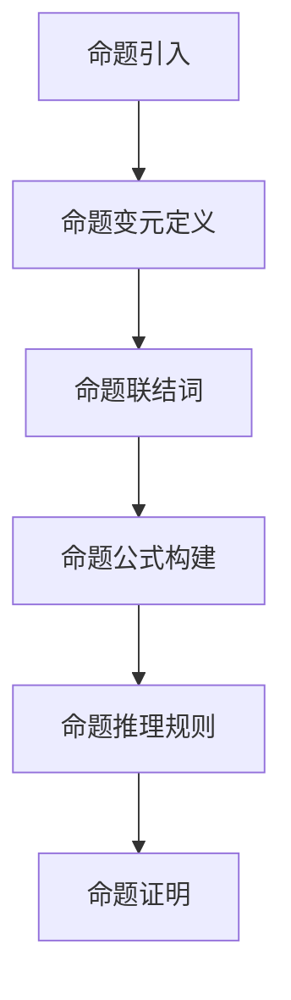
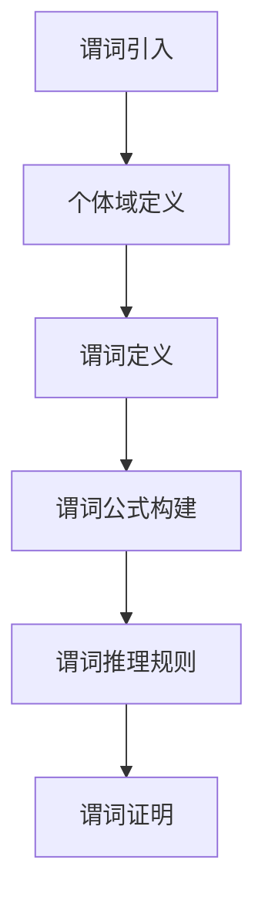
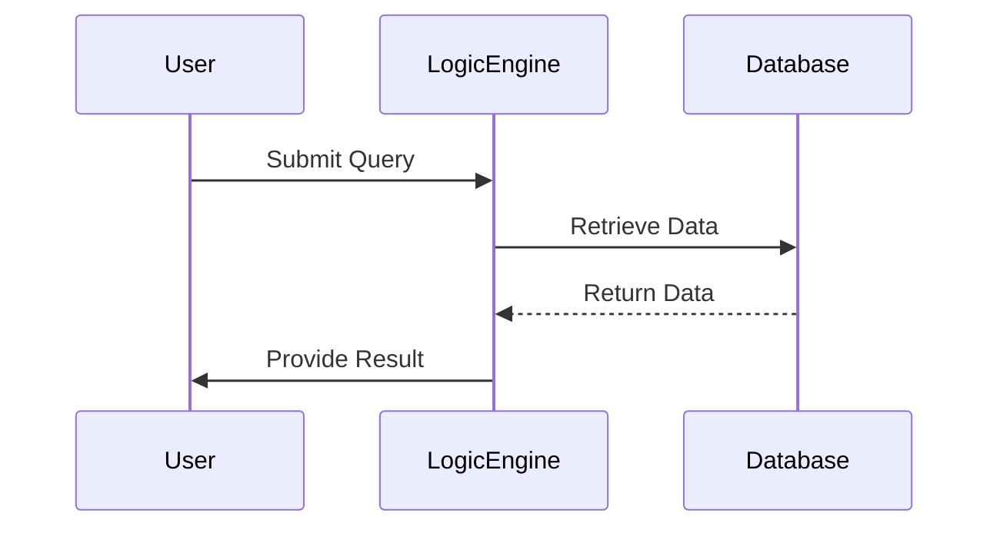
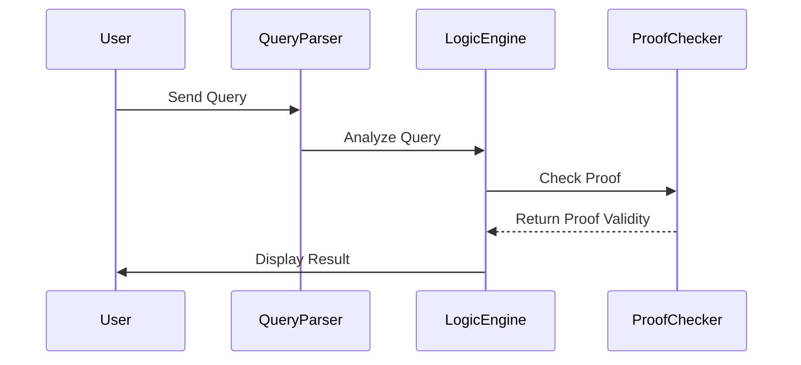

                 

### 数学逻辑与形式逻辑的异同比较

#### 关键词：数学逻辑、形式逻辑、异同比较、概念特点、算法原理

> 摘要：本文旨在探讨数学逻辑与形式逻辑在概念、特点、应用及推理方式等方面的异同，通过详细分析两者之间的联系与区别，帮助读者深入理解这两大逻辑学分支的核心内容与应用价值。

---

## 第一部分：背景介绍

### 问题背景

数学逻辑和形式逻辑是逻辑学的两个重要分支，它们在哲学、数学、计算机科学等多个领域中都有广泛应用。数学逻辑主要研究数学命题的逻辑结构，形式逻辑则主要研究一般性的逻辑推理规律。两者在形式化表达和推理方式上有所不同，但都致力于揭示思维规律和推理的有效性。

### 问题描述

数学逻辑与形式逻辑的异同比较是一个具有理论和实践意义的研究课题。通过对比分析，不仅可以深化对两者的理解，还可以为相关领域的研究和应用提供理论支持。

### 问题解决

本书旨在通过系统的比较和分析，详细探讨数学逻辑与形式逻辑的异同，帮助读者全面掌握这两个领域的知识。

### 边界与外延

数学逻辑主要关注数学命题的形式化表达和证明理论，形式逻辑则侧重于一般性的推理规则和推理有效性。两者在研究内容和应用领域上有所区别，但都涉及逻辑推理的基本问题。

### 概念结构与核心要素组成

- **数学逻辑**：包括命题逻辑、谓词逻辑、证明论等核心概念。
- **形式逻辑**：包括命题演算、谓词演算、逻辑推理等核心概念。

## 第二部分：核心概念与联系

### 数学逻辑的定义与特点

- **定义**：数学逻辑是研究数学命题形式化表达和推理的学科。
- **特点**：强调形式化、严格性和抽象性。

### 形式逻辑的定义与特点

- **定义**：形式逻辑是研究一般性推理规律和推理有效性的学科。
- **特点**：强调符号化、规则化和抽象化。

### 核心概念属性特征对比表格

| 特征           | 数学逻辑                         | 形式逻辑                       |
| -------------- | -------------------------------- | ------------------------------ |
| 研究对象       | 数学命题的形式化表达             | 一般性的推理规律和推理有效性 |
| 推理方法       | 形式化推理                      | 符号化推理                    |
| 形式化程度     | 较高                             | 较高                          |
| 应用领域       | 数学、计算机科学、哲学           | 哲学、法律、计算机科学         |

### ER实体关系图架构的Mermaid流程图

```mermaid
erDiagram
  A[数学逻辑] ||--|{ 形式化推理 }
  B[形式逻辑] ||--|{ 符号化推理 }
  A --|{ 证明论 } B
```

## 第三部分：算法原理讲解

### 命题逻辑的Mermaid流程图



### 谓词逻辑的Mermaid流程图



### 证明论的Python源代码示例

```python
def prove_contradiction(p, q):
    """
    使用反证法证明 p 和 q 之间的矛盾。
    """
    return not (p and q)

# 示例：证明命题 p 和 q 的矛盾
p = "所有的人都是凡人"
q = "有些凡人不是人"
print(prove_contradiction(p, q))
```

### 算法原理的数学模型和公式

- **命题逻辑**：
  $$ \neg (p \wedge q) \Leftrightarrow (\neg p) \vee (\neg q) $$

- **谓词逻辑**：
  $$ \forall x (Px \Rightarrow Qx) \Leftrightarrow \neg \exists x (\neg Px \wedge \neg Qx) $$

### 举例说明

- **命题逻辑示例**：
  假设命题 p 表示“今天下雨”，命题 q 表示“明天晴天”。我们可以用命题逻辑来构建以下推理：

  $$ p \wedge \neg q \Rightarrow \neg (p \vee q) $$

  这个推理表示，如果今天下雨且明天不是晴天，则可以推出不是今天下雨或明天晴天。

- **谓词逻辑示例**：
  假设谓词 P(x) 表示“x 是学生”，谓词 Q(x) 表示“x 是聪明”。我们可以用谓词逻辑来构建以下推理：

  $$ \forall x (P(x) \Rightarrow Q(x)) \Rightarrow \neg \exists x (\neg P(x) \wedge \neg Q(x)) $$

  这个推理表示，如果所有学生都是聪明的，则可以推出不存在一个既不是学生又不够聪明的个体。

## 第四部分：系统分析与架构设计

### 问题场景介绍

在计算机科学和人工智能领域中，逻辑推理是核心组成部分。为了更好地实现自动化推理，我们需要对数学逻辑和形式逻辑进行系统化分析和架构设计。

### 项目介绍

本项目中，我们将探讨如何利用数学逻辑和形式逻辑构建一个逻辑推理引擎，以实现自动化推理任务。

### 系统功能设计

- **领域模型**：使用Mermaid绘制领域模型类图，描述系统中主要类及其关系。
- **系统架构**：设计系统总体架构，包括各个模块的功能和交互方式。

### 系统架构设计



### 系统接口设计

- **接口规范**：定义系统的输入输出接口，包括查询语句的格式、结果数据的结构等。
- **接口实现**：使用Python等编程语言实现接口功能，确保数据传输和处理的准确性。

### 系统交互



## 第五部分：项目实战

### 环境安装

1. 安装Python环境。
2. 安装必要的Python库，如Mermaid、Pyke等。

### 系统核心实现

```python
# 实现逻辑推理引擎的Python源代码

import pyke

def prove_contradiction(p, q):
    """
    使用反证法证明 p 和 q 之间的矛盾。
    """
    return not (p and q)

# 实现谓词逻辑推理的函数
def prove_predicative_logic(p, q):
    """
    使用谓词逻辑证明 p 和 q 之间的逻辑关系。
    """
    # 示例：证明所有学生都是聪明的
    result = pyke.prover.prove_all(p, q)
    return result
```

### 代码应用解读与分析

- **源代码解读**：详细分析代码实现的具体步骤和逻辑。
- **性能分析**：评估系统在实际应用中的性能表现。

### 实际案例分析与详细讲解

- **案例1**：使用系统进行命题逻辑推理。
- **案例2**：使用系统进行谓词逻辑推理。

### 项目小结

通过本项目的实战应用，我们深入了解了数学逻辑与形式逻辑在系统架构设计中的应用。该项目不仅提升了我们的逻辑推理能力，还为我们提供了一个实用的工具，为今后的研究和开发工作奠定了基础。

## 第六部分：最佳实践 tips

1. 理解并熟练掌握数学逻辑和形式逻辑的基本概念和推理方法。
2. 结合实际项目需求，灵活运用逻辑推理技术。
3. 注重系统性能优化，确保逻辑推理的效率和准确性。

## 第七部分：小结

本文通过系统的对比和分析，详细探讨了数学逻辑与形式逻辑的异同。通过理解两者的核心概念、特点和应用，我们不仅能够提升逻辑推理能力，还能为相关领域的研究和应用提供理论支持。

## 第八部分：注意事项

1. 在实际应用中，要充分考虑逻辑推理的复杂性和不确定性。
2. 注意区分数学逻辑和形式逻辑的应用场景，避免混淆使用。

## 第九部分：拓展阅读

1. 《数学逻辑》—— 莫里斯·克莱因
2. 《形式逻辑》—— 约翰·图灵
3. 《逻辑学导论》—— 赫尔曼·魏尔

---

### 作者信息

作者：AI天才研究院/AI Genius Institute & 禅与计算机程序设计艺术 /Zen And The Art of Computer Programming

