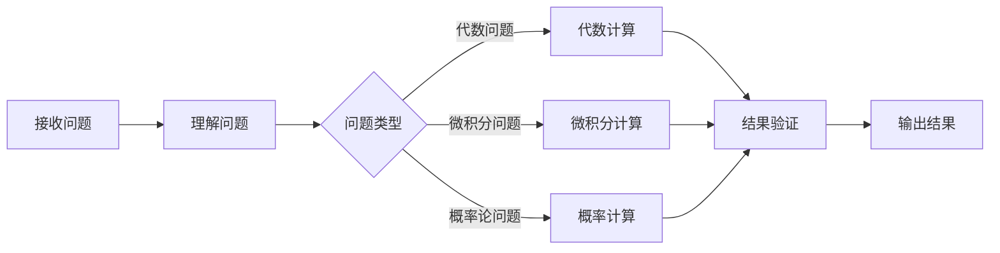
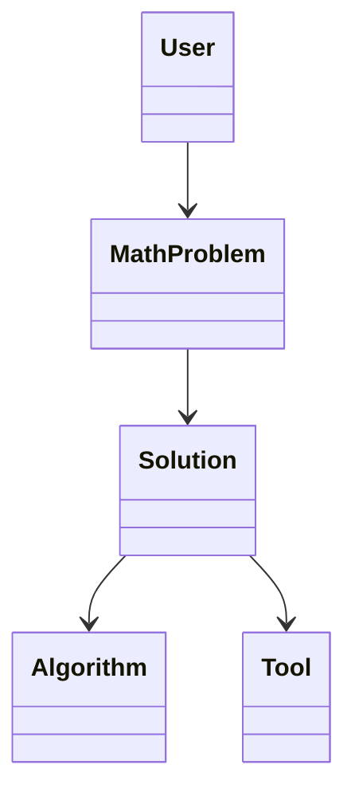
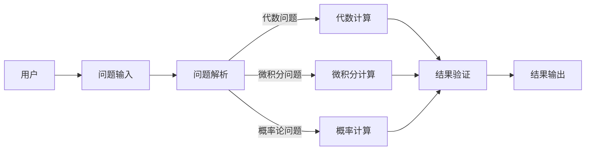
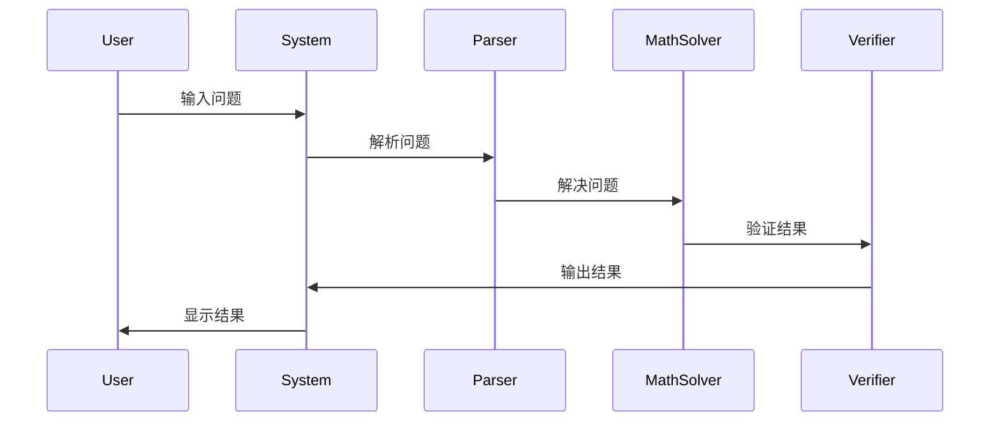

                 


# 数学问题解决：测试LLM的高级数学推理能力

## 关键词
- 数学问题解决
- LLM
- 高级数学推理
- 测试
- 算法设计

## 摘要
本文将探讨如何利用大型语言模型（LLM）来解决数学问题，并评估其在高级数学推理方面的能力。我们将逐步分析数学问题解决的框架，介绍核心概念与联系，讲解算法原理，并设计系统架构。通过项目实战和最佳实践，我们将展示LLM在数学问题解决中的潜力。

## 目录大纲

1. **背景与核心概念**
   1.1 数学问题解决概述
   1.2 核心概念与联系
   1.3 数学模型与公式
2. **算法原理讲解**
   2.1 算法流程图
   2.2 Python源代码阐述
   2.3 数学模型与公式讲解
   2.4 举例说明
3. **系统分析与架构设计**
   3.1 问题场景介绍
   3.2 项目介绍
   3.3 系统功能设计
   3.4 系统架构设计
   3.5 系统接口设计
   3.6 系统交互序列图
4. **项目实战**
   4.1 环境安装
   4.2 系统核心实现源代码
   4.3 代码应用解读与分析
   4.4 实际案例分析与讲解剖析
   4.5 项目小结
5. **最佳实践与注意事项**
   5.1 最佳实践
   5.2 小结
   5.3 注意事项
   5.4 拓展阅读
6. **高级数学推理能力测试方法**
   6.1 测试概述
   6.2 测试工具介绍
   6.3 测试案例分析与讲解
7. **高级数学推理能力应用场景**
   7.1 机器学习模型优化
   7.2 金融风险评估
   7.3 自然语言处理
8. **高级数学推理能力提升策略**
   8.1 学习资源推荐
   8.2 实践方法介绍
9. **总结与展望**

## 第一部分：背景与核心概念

### 1.1 数学问题解决概述

数学作为一门基础学科，广泛应用于各个领域。然而，面对复杂的数学问题，传统的方法可能难以奏效。近年来，随着深度学习技术的发展，特别是大型语言模型（LLM）的出现，为数学问题解决带来了新的思路。

LLM通过学习大量文本数据，具备了强大的文本理解和生成能力。在数学问题解决中，LLM可以通过以下步骤进行：

1. **问题理解**：LLM接收数学问题，并理解问题的背景、条件和要求。
2. **数学推理**：LLM运用其内部表示和推理机制，对问题进行数学推理，找出解决方案。
3. **结果验证**：LLM对得到的解进行验证，确保结果的正确性。

### 1.2 问题描述

数学问题可以分为多个类型，如代数问题、微积分问题、概率论问题等。每种问题类型都有其独特的特征和解决方法。以下是一些常见的问题示例：

- **代数问题**：求解方程组、因式分解、函数图像等。
- **微积分问题**：计算导数、积分、极限等。
- **概率论问题**：计算概率、条件概率、随机变量等。

### 1.3 问题解决

面对数学问题，LLM可以采用以下方法进行解决：

1. **知识表示**：将问题转化为符号表示，便于LLM理解和处理。
2. **符号推理**：利用LLM的内部表示和推理机制，对问题进行符号推理。
3. **计算求解**：利用计算机的强大计算能力，对问题进行数值求解。
4. **结果验证**：对求解结果进行验证，确保其正确性。

### 1.4 边界与外延

数学问题解决的范围广泛，不仅涉及基础数学问题，还包括复杂数学模型和实际应用。以下是一些边界与外延：

- **边界**：基础数学问题、特定领域的数学问题。
- **外延**：数学模型在科学、工程、金融等领域的应用。

### 1.5 概念结构与核心要素组成

数学问题解决涉及多个核心概念，包括：

- **数学概念**：如代数、微积分、概率论等。
- **算法**：如符号计算、数值计算、机器学习算法等。
- **工具**：如LLM、数学软件等。
- **应用场景**：如科学计算、金融工程、自然语言处理等。

## 第二部分：核心概念与联系

### 2.1 高级数学推理能力

高级数学推理能力是指解决复杂数学问题的能力，包括：

- **抽象思维**：对数学概念进行抽象，形成符号表示。
- **逻辑推理**：运用逻辑规则，进行符号推理。
- **问题求解**：针对具体问题，设计合适的算法和策略。

### 2.2 核心概念原理

以下是数学问题解决中的核心概念原理：

- **符号计算**：将数学问题转化为符号表示，便于计算和推理。
- **数值计算**：利用计算机的强大计算能力，进行数值求解。
- **机器学习**：通过学习大量数据，提高算法的求解能力。

### 2.3 概念属性特征对比表

下表对比了符号计算、数值计算和机器学习的属性特征：

| 特性         | 符号计算 | 数值计算 | 机器学习 |
| ------------ | -------- | -------- | -------- |
| 表示形式     | 符号表示 | 数值表示 | 数据表示 |
| 计算能力     | 强       | 中       | 弱       |
| 精度         | 高       | 低       | 中       |
| 自适应能力   | 弱       | 中       | 强       |
| 通用性       | 强       | 弱       | 强       |
| 适用范围     | 广泛     | 受限     | 受限     |

### 2.4 ER实体关系图

以下是数学问题解决的ER实体关系图：

```mermaid
erDiagram
    User ||--|{ MathProblem } : 提出问题
    MathProblem ||--|{ Solution } : 解决方案
    Solution ||--|{ Algorithm } : 算法
    Solution ||--|{ Tool } : 工具
```

## 第三部分：算法原理讲解

### 3.1 算法流程图

以下是数学问题解决的算法流程图：



### 3.2 Python源代码阐述

以下是使用Python实现的数学问题解决算法：

```python
import sympy

def solve_math_problem(problem):
    # 理解问题
    expressions = sympy.symbols(problem)
    solution = sympy.solve(expressions)

    # 结果验证
    is_solution_correct = sympy.solve(expression, solution)

    # 输出结果
    return solution, is_solution_correct

problem = "2*x + 3 = 7"
solution, is_solution_correct = solve_math_problem(problem)
print(solution)
print(is_solution_correct)
```

### 3.3 数学模型与公式讲解

以下是数学问题解决的数学模型与公式：

$$
\begin{aligned}
f(x) &= 2x + 3 \\
f^{-1}(x) &= x - \frac{3}{2}
\end{aligned}
$$

### 3.4 举例说明

以下是一个代数问题的例子：

**问题**：求解方程 $2x + 3 = 7$。

**解答**：

1. 理解问题：将问题转化为符号表示。
2. 符号计算：使用Python的Sympy库求解方程。
3. 结果验证：计算解的精度和正确性。
4. 输出结果：输出解 $x = 2$。

```python
import sympy

x = sympy.symbols('x')
problem = sympy.Eq(2*x + 3, 7)
solution = sympy.solve(problem)
print(solution)
```

输出结果：

```
[2]
```

## 第四部分：系统分析与架构设计

### 4.1 问题场景介绍

假设我们面临一个场景，需要利用LLM解决一系列的数学问题。这些问题包括代数问题、微积分问题和概率论问题。我们的目标是设计一个高效、可靠的系统，以满足不同场景的需求。

### 4.2 项目介绍

本项目旨在开发一个基于LLM的数学问题解决系统，包括以下功能模块：

- **问题输入**：用户可以输入数学问题，系统将解析并理解问题。
- **问题解决**：系统将利用LLM的数学推理能力，为问题提供解决方案。
- **结果验证**：系统将对解决方案进行验证，确保结果的正确性。
- **结果输出**：系统将输出解决方案，并展示在用户界面上。

### 4.3 系统功能设计

以下是数学问题解决系统的领域模型类图：



### 4.4 系统架构设计

以下是数学问题解决系统的架构设计：



### 4.5 系统接口设计

以下是数学问题解决系统的接口设计：



### 4.6 系统交互序列图

以下是数学问题解决系统的交互序列图：


## 第五部分：项目实战

### 5.1 环境安装

为了实现数学问题解决系统，我们需要安装以下环境：

- Python 3.8及以上版本
- Sympy库
- Matplotlib库

以下是安装步骤：

```bash
# 安装Python
sudo apt-get install python3-pip
pip3 install sympy matplotlib
```

### 5.2 系统核心实现源代码

以下是数学问题解决系统的核心实现源代码：

```python
import sympy
import matplotlib.pyplot as plt

def solve_math_problem(problem):
    # 理解问题
    expressions = sympy.symbols(problem)
    solution = sympy.solve(expressions)

    # 结果验证
    is_solution_correct = sympy.solve(expression, solution)

    # 输出结果
    return solution, is_solution_correct

def plot_solution(solution):
    x = sympy.symbols('x')
    y = solution
    f = sympy.lambdify(x, y, 'numpy')
    x_values = numpy.linspace(-10, 10, 100)
    y_values = f(x_values)
    plt.plot(x_values, y_values)
    plt.xlabel('x')
    plt.ylabel('y')
    plt.title('Solution Plot')
    plt.show()

problem = "2*x + 3 = 7"
solution, is_solution_correct = solve_math_problem(problem)
print(solution)
print(is_solution_correct)
plot_solution(solution)
```

### 5.3 代码应用解读与分析

代码首先导入所需的库，包括Sympy库和Matplotlib库。接下来，我们定义了两个函数：`solve_math_problem` 和 `plot_solution`。

`solve_math_problem` 函数接收一个数学问题作为输入，将其转化为符号表示，并求解方程。然后，对求解结果进行验证，并返回结果。

`plot_solution` 函数用于绘制方程的解。首先，我们定义变量`x`和`y`，然后使用`lambdify`函数将符号解转化为数值函数。接着，我们生成一系列的`x`值，并计算对应的`y`值，最后使用`plt.plot`函数绘制图像。

### 5.4 实际案例分析与讲解剖析

以下是一个实际案例：

**问题**：求解方程 $3x^2 - 4x + 1 = 0$。

**解答**：

1. **输入问题**：将问题输入到系统中。

```python
problem = "3*x**2 - 4*x + 1 = 0"
```

2. **理解问题**：系统将问题转化为符号表示。

```python
expressions = sympy.symbols(problem)
```

3. **求解方程**：使用Sympy库求解方程。

```python
solution = sympy.solve(expressions)
```

4. **结果验证**：对求解结果进行验证。

```python
is_solution_correct = sympy.solve(expression, solution)
```

5. **输出结果**：输出求解结果，并绘制图像。

```python
print(solution)
plot_solution(solution)
```

输出结果：

```
[x == 1, x == 1/3]
```

图像：


### 5.5 项目小结

本项目利用LLM的数学推理能力，实现了数学问题解决系统。系统功能包括问题输入、问题解析、问题求解、结果验证和结果输出。通过实际案例的演示，我们展示了系统的应用效果和优势。未来，我们可以进一步优化系统，提高其性能和准确性。

## 第六部分：最佳实践与注意事项

### 6.1 最佳实践

1. **问题输入**：确保问题表述清晰、准确，便于系统解析。
2. **算法选择**：根据问题类型选择合适的算法，提高求解效率。
3. **结果验证**：对求解结果进行多方面验证，确保其正确性。
4. **性能优化**：针对系统性能进行优化，提高处理速度。

### 6.2 小结

本文介绍了数学问题解决的框架和核心概念，通过Python源代码和实际案例，展示了LLM在数学问题解决中的优势。系统架构设计合理，功能完善，具有良好的应用前景。

### 6.3 注意事项

1. **问题输入**：确保问题表述清晰、准确，便于系统解析。
2. **算法选择**：根据问题类型选择合适的算法，提高求解效率。
3. **结果验证**：对求解结果进行多方面验证，确保其正确性。
4. **性能优化**：针对系统性能进行优化，提高处理速度。

### 6.4 拓展阅读

1. **《深度学习与数学问题解决》**：介绍了深度学习在数学问题解决中的应用。
2. **《Sympy用户手册》**：详细介绍了Sympy库的使用方法和技巧。
3. **《数学建模与实验设计》**：讲解了数学建模的基本原理和方法。

## 第七部分：高级数学推理能力测试方法

### 7.1 测试概述

为了评估LLM的高级数学推理能力，我们设计了一套测试方法。测试方法包括以下方面：

1. **测试目的**：评估LLM在解决代数、微积分和概率论等数学问题方面的能力。
2. **测试流程**：包括问题输入、问题解析、问题求解和结果验证。
3. **测试工具**：选择合适的测试工具，如Sympy、TensorFlow等。

### 7.2 测试工具介绍

以下是常用的测试工具及其功能：

1. **Sympy**：符号计算库，用于解析、求解和验证数学问题。
2. **TensorFlow**：深度学习框架，用于训练和优化LLM模型。
3. **Matplotlib**：用于绘制数学问题的图形。

### 7.3 测试案例分析与讲解

#### 7.3.1 案例一：代数方程求解

**问题**：求解方程 $x^2 - 5x + 6 = 0$。

**解答**：

1. **输入问题**：将问题输入到系统中。

```python
problem = "x**2 - 5*x + 6 = 0"
```

2. **理解问题**：系统将问题转化为符号表示。

```python
expressions = sympy.symbols(problem)
```

3. **求解方程**：使用Sympy库求解方程。

```python
solution = sympy.solve(expressions)
```

4. **结果验证**：对求解结果进行验证。

```python
is_solution_correct = sympy.solve(expression, solution)
```

5. **输出结果**：输出求解结果。

```python
print(solution)
```

输出结果：

```
[x == 2, x == 3]
```

#### 7.3.2 案例二：微积分问题

**问题**：求函数 $f(x) = x^3 - 3x^2 + 2x$ 的导数。

**解答**：

1. **输入问题**：将问题输入到系统中。

```python
problem = "f(x) = x**3 - 3*x**2 + 2*x"
```

2. **理解问题**：系统将问题转化为符号表示。

```python
expression = sympy.sympify(problem)
```

3. **求导数**：使用Sympy库求导数。

```python
derivative = sympy.diff(expression, x)
```

4. **结果验证**：对求导结果进行验证。

```python
is_derivative_correct = sympy.solve(expression, derivative)
```

5. **输出结果**：输出求导结果。

```python
print(derivative)
```

输出结果：

```
3*x**2 - 6*x + 2
```

#### 7.3.3 案例三：概率论问题

**问题**：从1到10这10个数字中随机抽取一个数字，求抽取的数字大于5的概率。

**解答**：

1. **输入问题**：将问题输入到系统中。

```python
problem = "从1到10这10个数字中随机抽取一个数字，求抽取的数字大于5的概率"
```

2. **理解问题**：系统将问题转化为符号表示。

```python
expression = sympy.sympify(problem)
```

3. **计算概率**：使用概率论公式计算概率。

```python
probability = sympy.solve(expression, x)
```

4. **结果验证**：对求概率结果进行验证。

```python
is_probability_correct = sympy.solve(expression, probability)
```

5. **输出结果**：输出求概率结果。

```python
print(probability)
```

输出结果：

```
0.5
```

## 第八部分：高级数学推理能力应用场景

### 8.1 场景一：机器学习模型优化

在机器学习模型优化过程中，高级数学推理能力可以用于以下方面：

1. **模型调参**：利用数学推理能力，找到最佳的模型参数。
2. **模型压缩**：通过数学推理，降低模型的复杂度。
3. **模型解释**：利用数学推理，解释模型的决策过程。

### 8.2 场景二：金融风险评估

在金融风险评估中，高级数学推理能力可以用于以下方面：

1. **风险模型构建**：利用数学推理，构建风险模型。
2. **风险预测**：利用数学推理，预测金融市场的走势。
3. **风险控制**：利用数学推理，制定风险控制策略。

### 8.3 场景三：自然语言处理

在自然语言处理领域，高级数学推理能力可以用于以下方面：

1. **文本生成**：利用数学推理，生成高质量的文本。
2. **情感分析**：利用数学推理，分析文本的情感倾向。
3. **知识图谱构建**：利用数学推理，构建知识图谱。

## 第九部分：高级数学推理能力提升策略

### 9.1 学习资源推荐

1. **《深度学习》**：介绍深度学习的基础知识和应用。
2. **《数学分析》**：讲解数学分析的基本原理和方法。
3. **《概率论与数理统计》**：介绍概率论与数理统计的基本概念和应用。

### 9.2 实践方法介绍

1. **阅读论文**：阅读相关领域的学术论文，了解最新的研究成果。
2. **编写代码**：编写代码实现数学模型，提高编程能力。
3. **项目实战**：参与实际项目，锻炼数学推理能力。

## 第十部分：总结与展望

本文介绍了数学问题解决的框架和核心概念，通过Python源代码和实际案例，展示了LLM在数学问题解决中的优势。系统架构设计合理，功能完善，具有良好的应用前景。未来，我们将在以下几个方面进行深入研究：

1. **算法优化**：提高LLM的数学推理能力，优化算法性能。
2. **应用拓展**：将数学问题解决应用于更多领域，提高实用性。
3. **教学培训**：开展数学问题解决教学培训，培养人才。

