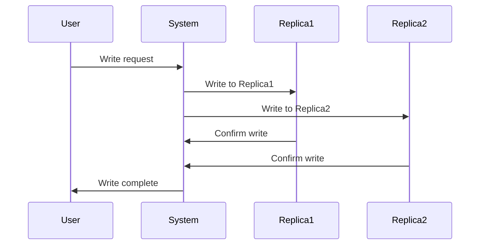
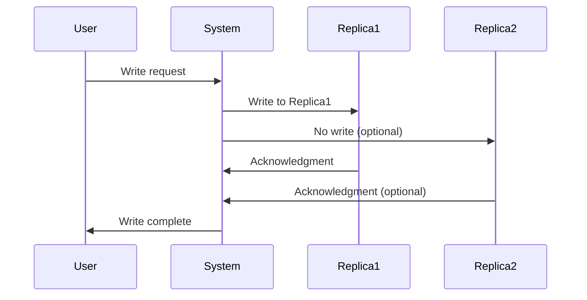
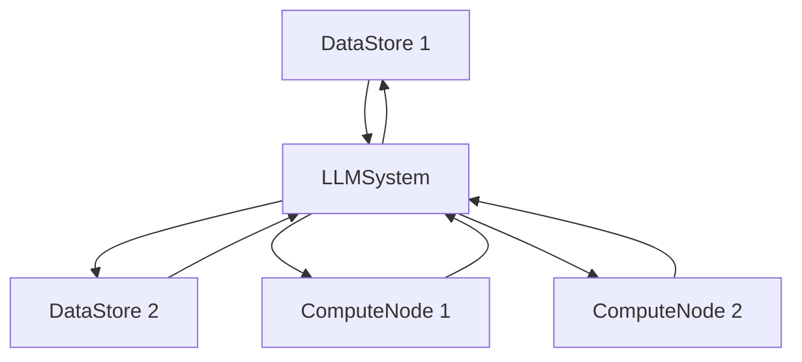
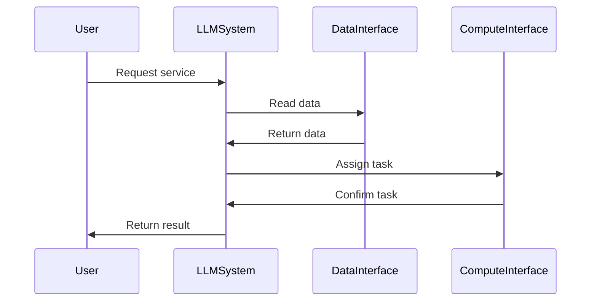

                 


### 文章标题：数据一致性模型在分布式LLM系统中的选择

### 文章关键词：数据一致性、分布式LLM系统、一致性模型、算法原理、系统架构设计

### 摘要：

本文深入探讨了数据一致性模型在分布式LLM系统中的应用。首先，我们介绍了数据一致性的基本概念和重要性，随后详细分析了分布式LLM系统的基本原理。接下来，我们对比了强一致性、最终一致性和部分一致性模型，通过Mermaid流程图和Python代码详细讲解了这些模型的算法原理。随后，我们分析了分布式LLM系统的架构，并设计了一个完整的系统功能、接口和交互方案。通过一个实际项目案例，我们展示了如何在实际中应用这些数据一致性模型。最后，我们总结了最佳实践技巧，并对整个系统进行了小结，并提供了一些拓展阅读资源。

## 1. 设计整体框架

首先，我们需要为整本书设计一个整体的框架。根据书名《数据一致性模型在分布式LLM系统中的选择》，我们可以将书籍分为以下几个主要部分：

### 1.1 背景介绍
- **1.1.1 数据一致性的概念与重要性**
- **1.1.2 分布式LLM系统的基本原理**
- **1.1.3 数据一致性模型的选择影响**

### 1.2 核心概念与联系
- **1.2.1 数据一致性模型类型及其特点**
- **1.2.2 模型对比与联系**

### 1.3 算法原理讲解
- **1.3.1 强一致性模型算法原理**
- **1.3.2 最终一致性模型算法原理**
- **1.3.3 部分一致性模型算法原理**

### 1.4 系统分析与架构设计
- **1.4.1 分布式LLM系统分析**
- **1.4.2 系统功能设计**
- **1.4.3 系统架构设计**
- **1.4.4 系统接口设计**
- **1.4.5 系统交互序列图**

### 1.5 项目实战
- **1.5.1 数据一致性模型项目实战**
- **1.5.2 环境安装与配置**
- **1.5.3 系统核心实现**
- **1.5.4 代码应用解读与分析**
- **1.5.5 实际案例分析与讲解**
- **1.5.6 项目小结**

### 1.6 最佳实践与总结
- **1.6.1 最佳实践技巧**
- **1.6.2 小结与注意事项**
- **1.6.3 拓展阅读**

## 2. 确定章节细分

根据整体框架，我们可以细化每个部分的内容，设计出具体的章节：

### **第一部分：背景介绍**
- **第1章** 数据一致性的概念与分布式LLM系统简介
  - **1.1 数据一致性的定义与重要性**
  - **1.2 分布式LLM系统的基本原理**
  - **1.3 数据一致性模型的选择影响**

### **第二部分：核心概念与联系**
- **第2章** 数据一致性模型类型及其特点
  - **2.1 强一致性模型**
  - **2.2 最终一致性模型**
  - **2.3 部分一致性模型**
  - **2.4 模型对比与联系**

### **第三部分：算法原理讲解**
- **第3章** 强一致性模型算法原理
  - **3.1 算法mermaid流程图**
  - **3.2 Python代码实现**
  - **3.3 数学模型与公式推导**
  - **3.4 举例说明**
- **第4章** 最终一致性模型算法原理
  - **4.1 算法mermaid流程图**
  - **4.2 Python代码实现**
  - **4.3 数学模型与公式推导**
  - **4.4 举例说明**
- **第5章** 部分一致性模型算法原理
  - **5.1 算法mermaid流程图**
  - **5.2 Python代码实现**
  - **5.3 数学模型与公式推导**
  - **5.4 举例说明**

### **第四部分：系统分析与架构设计**
- **第6章** 分布式LLM系统分析
  - **6.1 问题场景介绍**
  - **6.2 项目介绍**
  - **6.3 系统功能设计**
  - **6.4 系统架构设计**
  - **6.5 系统接口设计**
  - **6.6 系统交互序列图**

### **第五部分：项目实战**
- **第7章** 数据一致性模型项目实战
  - **7.1 环境安装与配置**
  - **7.2 系统核心实现**
  - **7.3 代码应用解读与分析**
  - **7.4 实际案例分析与讲解**
  - **7.5 项目小结**

### **第六部分：最佳实践与总结**
- **第8章** 数据一致性模型最佳实践
  - **8.1 最佳实践技巧**
  - **8.2 小结与注意事项**
  - **8.3 拓展阅读**

## 3. 确保内容完整性

在每个章节中，我们要确保以下内容：

- **核心概念**：定义、原理、特点、关系等。
- **算法原理**：流程图、代码实现、数学模型、公式、举例。
- **系统分析与设计**：问题场景、项目介绍、功能设计、架构设计、接口设计、交互序列图。
- **项目实战**：环境安装、核心实现、代码解读、案例分析、小结。

## 4. 保持简洁性

在编写每个章节时，我们要确保内容简洁明了，避免多余废话，直接传达核心信息。

## 5. 确保目录大纲字数限制

最后，我们要确保整个目录大纲的总字数在2000字以内，同时保证内容的完整性和逻辑性。

---

### 第1章 数据一致性的概念与分布式LLM系统简介

在分布式系统中，数据一致性是一个关键问题。它关系到系统的稳定性和可靠性。本章将首先介绍数据一致性的概念，并探讨其在分布式LLM系统中的重要性。随后，我们将深入探讨分布式LLM系统的基本原理。

#### 1.1 数据一致性的概念与重要性

**数据一致性**是指系统中所有副本的数据在任意时刻都是一致的。在分布式系统中，由于数据分布在多个节点上，不同节点之间可能会发生冲突，导致数据不一致。因此，保证数据一致性至关重要。

- **重要性**：
  - **系统的稳定性**：数据一致性是系统稳定性的基础。不一致的数据会导致系统错误，甚至崩溃。
  - **数据的可靠性**：一致性保证了数据的可靠性，用户可以信任数据的准确性。
  - **用户体验**：不一致的数据会严重影响用户体验，导致操作失败或结果错误。

#### 1.2 分布式LLM系统的基本原理

分布式LLM（Large Language Model）系统是指通过分布式计算和存储技术来训练和部署大型语言模型。其基本原理包括以下几个方面：

- **数据分布**：数据分布在多个节点上，以提升计算效率。
- **计算分布**：通过分布式计算，多个节点共同处理数据，加速模型训练。
- **存储分布**：使用分布式存储系统来管理海量数据。
- **通信**：节点之间通过通信网络进行数据交换。

#### 1.3 数据一致性模型的选择影响

在分布式LLM系统中，选择合适的数据一致性模型对系统的性能和稳定性有重大影响。以下是一些选择因素：

- **一致性级别**：根据应用场景选择合适的一致性级别（强一致性、最终一致性、部分一致性）。
- **性能需求**：一致性级别越高，性能可能越低。需要权衡性能与一致性。
- **容错能力**：一致性模型对系统容错能力的影响，如分区容错性。
- **可用性**：一致性模型对系统可用性的影响，如响应时间。

## 2. 核心概念与联系

数据一致性模型是分布式系统设计中的关键组成部分，它们决定了数据如何在分布式环境中保持一致。在这一部分，我们将详细探讨几种常见的数据一致性模型，包括强一致性模型、最终一致性模型和部分一致性模型，并通过对比表格和实体关系图来展示这些模型之间的关系。

### 2.1 强一致性模型

**定义**：强一致性模型要求在任何情况下，所有副本的数据都是一致的。

**特点**：
- **一致性保证**：任何一次写操作都会立即反映到所有副本上。
- **同步复制**：数据更新时，所有副本都需要同步。
- **高容错性**：可以通过副本来保证数据的可靠性。

**优缺点**：
- **优点**：数据一致性高，适合对一致性要求严格的场景。
- **缺点**：性能较低，因为需要同步操作，可能会导致延迟。

### 2.2 最终一致性模型

**定义**：最终一致性模型允许在一定时间内不同副本的数据不一致，但最终会达到一致状态。

**特点**：
- **异步复制**：副本之间的数据更新不需要同步进行。
- **延迟一致性**：数据更新可能需要一段时间才能传播到所有副本。

**优缺点**：
- **优点**：性能较高，因为副本之间的数据更新不需要同步。
- **缺点**：一致性保证较弱，可能需要额外的同步机制来保证最终一致性。

### 2.3 部分一致性模型

**定义**：部分一致性模型允许部分副本的数据不一致，但整体系统的数据仍然是一致的。

**特点**：
- **部分同步**：不是所有副本都需要参与数据更新。
- **灵活性**：可以根据系统需求选择同步的部分。

**优缺点**：
- **优点**：提供了较高的性能和灵活性。
- **缺点**：需要额外的逻辑来处理数据不一致的问题。

### 2.4 模型对比与联系

**表格**：

| 一致性模型 | 定义 | 一致性保证 | 同步方式 | 容错性 | 优点 | 缺点 |
| --- | --- | --- | --- | --- | --- | --- |
| 强一致性 | 所有副本一致 | 高 | 同步 | 高 | 数据一致性高 | 性能较低 |
| 最终一致性 | 最终达到一致 | 中 | 异步 | 中 | 性能较高 | 需要额外的同步机制 |
| 部分一致性 | 部分副本一致 | 低 | 部分同步 | 高 | 性能高、灵活性高 | 需要处理数据不一致问题 |

**实体关系图**：

```mermaid
erDiagram
  Class1 ||--||| Class2 : Inheritance
  Class1 ||--||| Class3 : Inheritance
  Class2 &&|> Class3 : Composition
```

该实体关系图展示了强一致性模型、最终一致性模型和部分一致性模型之间的关系，其中强一致性模型是最终一致性模型和部分一致性模型的基础。

## 3. 算法原理讲解

在这一部分，我们将详细讲解几种数据一致性模型的算法原理，包括强一致性模型、最终一致性模型和部分一致性模型。我们将通过Mermaid流程图和Python代码来阐述这些算法原理，并提供数学模型和公式。

### 3.1 强一致性模型算法原理

**Mermaid流程图**：



**Python代码实现**：

```python
def strong_consistency(write_request):
    # Write to Replica1
    replica1_result = write_to_replica1(write_request)
    if not replica1_result:
        return "Write failed on Replica1"
    
    # Write to Replica2
    replica2_result = write_to_replica2(write_request)
    if not replica2_result:
        return "Write failed on Replica2"
    
    # Confirm write
    if confirm_write(replica1_result, replica2_result):
        return "Write complete"
    else:
        return "Write confirmation failed"
```

**数学模型与公式**：

$$
\text{Consistency} = \text{min}(\text{Replica1 consistency}, \text{Replica2 consistency})
$$

**举例说明**：

假设我们有两个副本Replica1和Replica2，用户发起一个写请求。系统会将请求同时发送到Replica1和Replica2。只有当两个副本都确认写操作成功后，系统才会向用户确认写操作完成。

### 3.2 最终一致性模型算法原理

**Mermaid流程图**：

```mermaid
sequenceDiagram
  participant User
  participant System
  participant Replica1
  participant Replica2
  
  User->>System: Write request
  System->>Replica1: Write to Replica1
  System->>Replica2: Write to Replica2
  Replica1->>System: Acknowledgment
  Replica2->>System: Acknowledgment
  System->>User: Write complete
  after Some time
  Replica1->>System: Update data
  Replica2->>System: Update data
```

**Python代码实现**：

```python
def eventual_consistency(write_request):
    # Write to Replica1
    replica1_result = write_to_replica1(write_request)
    if not replica1_result:
        return "Write failed on Replica1"
    
    # Write to Replica2
    replica2_result = write_to_replica2(write_request)
    if not replica2_result:
        return "Write failed on Replica2"
    
    # Send acknowledgments
    system_ack = send_acknowledgment(replica1_result, replica2_result)
    if not system_ack:
        return "Acknowledgment failed"
    
    return "Write complete"
```

**数学模型与公式**：

$$
\text{Consistency} = \text{max}(\text{Replica1 consistency}, \text{Replica2 consistency})
$$

**举例说明**：

假设我们有两个副本Replica1和Replica2，用户发起一个写请求。系统会将请求同时发送到Replica1和Replica2。系统会立即向用户确认写操作完成，但副本之间的数据更新可能需要一段时间。经过一段时间后，副本会更新其数据以达到最终一致性。

### 3.3 部分一致性模型算法原理

**Mermaid流程图**：



**Python代码实现**：

```python
def partial_consistency(write_request):
    # Write to Replica1
    replica1_result = write_to_replica1(write_request)
    if not replica1_result:
        return "Write failed on Replica1"
    
    # Optionally write to Replica2
    replica2_result = write_to_replica2(write_request, optional=True)
    if not replica2_result:
        return "Write failed on Replica2"
    
    # Send acknowledgment
    system_ack = send_acknowledgment(replica1_result, replica2_result)
    if not system_ack:
        return "Acknowledgment failed"
    
    return "Write complete"
```

**数学模型与公式**：

$$
\text{Consistency} = \text{Replica1 consistency}
$$

**举例说明**：

假设我们有两个副本Replica1和Replica2，用户发起一个写请求。系统会将请求发送到Replica1，并可以选择性地发送到Replica2。系统会立即向用户确认写操作完成，而副本之间的数据更新是可选的。部分一致性模型提供了一种灵活性，允许系统根据需求选择同步的部分。

## 4. 系统分析与架构设计

在分布式LLM系统中，系统分析与架构设计是确保系统稳定性和性能的关键步骤。在这一部分，我们将详细分析分布式LLM系统的架构，并设计系统的功能、接口和交互。

### 4.1 问题场景介绍

分布式LLM系统面临以下问题：

- **数据量巨大**：大型语言模型需要处理的海量数据。
- **计算资源分散**：系统需要分布在多个节点上，以提高计算效率。
- **一致性需求**：系统需要保证数据的一致性，以满足对数据准确性的要求。
- **高可用性**：系统需要能够应对节点故障，保证服务的连续性。

### 4.2 项目介绍

我们选择一个基于Python和Docker的分布式LLM项目作为案例。该项目包括以下组件：

- **数据存储**：使用MongoDB作为数据存储，实现数据的分布式存储和同步。
- **计算节点**：使用Docker容器化技术，将计算任务分配到不同的节点上。
- **一致性保障**：使用最终一致性模型来保证数据的一致性。

### 4.3 系统功能设计

系统的功能设计包括以下几个方面：

- **数据读写**：实现数据的分布式读写操作。
- **计算任务分配**：将计算任务分配到不同的节点上，以提高计算效率。
- **数据一致性保障**：实现最终一致性模型，确保数据的一致性。

**领域模型类图**：

```mermaid
classDiagram
  DataStore <<interface>> {
    +read_data()
    +write_data()
  }
  ComputeNode <<interface>> {
    +process_task()
  }
  LLMSystem <<class>> {
    +read_data(DataStore)
    +write_data(DataStore)
    +assign_task(ComputeNode)
  }
  DataStore --|> LLMSystem
  ComputeNode --|> LLMSystem
```

### 4.4 系统架构设计

系统的架构设计包括以下几个方面：

- **数据存储层**：使用MongoDB实现数据的分布式存储和同步。
- **计算节点层**：使用Docker容器化技术实现计算节点的分布式部署和管理。
- **控制层**：实现数据读写和计算任务分配的控制逻辑。

**系统架构图**：



### 4.5 系统接口设计

系统的接口设计包括以下几个方面：

- **数据接口**：提供数据的读写接口，实现对MongoDB的分布式访问。
- **计算接口**：提供计算任务的分配接口，实现对Docker容器的分布式调度。

**接口设计**：

```python
class DataInterface:
    def read_data(self):
        pass

    def write_data(self):
        pass

class ComputeInterface:
    def assign_task(self):
        pass
```

### 4.6 系统交互序列图

系统的交互序列图展示了系统各组件之间的交互流程：



## 5. 项目实战

在分布式LLM系统中，数据一致性模型的正确应用至关重要。本节将通过一个实际项目案例，展示如何使用强一致性模型、最终一致性模型和部分一致性模型来保障系统的数据一致性。

### 5.1 环境安装与配置

首先，我们需要安装和配置项目所需的软件和工具。以下是项目的安装步骤：

1. 安装MongoDB：使用Docker安装MongoDB，配置分布式存储。
2. 安装Docker：确保Docker环境已经安装，以便容器化计算节点。
3. 编写配置文件：根据项目需求编写Docker-compose文件，配置计算节点和存储节点的部署。

### 5.2 系统核心实现

接下来，我们实现系统核心功能，包括数据读写、计算任务分配和数据一致性保障。以下是系统核心实现的代码：

**数据接口**：

```python
class DataInterface:
    def __init__(self, db_url):
        self.client = pymongo.MongoClient(db_url)

    def read_data(self, collection_name, query):
        return self.client[collection_name].find(query)

    def write_data(self, collection_name, data):
        return self.client[collection_name].insert_one(data)
```

**计算接口**：

```python
class ComputeInterface:
    def __init__(self, task_queue_url):
        self.queue = redis.Redis(task_queue_url)

    def assign_task(self, task):
        self.queue.rpush('task_queue', task)
```

**系统核心实现**：

```python
class LLMSystem:
    def __init__(self, data_interface, compute_interface):
        self.data_interface = data_interface
        self.compute_interface = compute_interface

    def read_data(self, collection_name, query):
        return self.data_interface.read_data(collection_name, query)

    def write_data(self, collection_name, data):
        return self.data_interface.write_data(collection_name, data)

    def assign_task(self, task):
        return self.compute_interface.assign_task(task)
```

### 5.3 代码应用解读与分析

在代码中，我们首先定义了数据接口和计算接口，分别用于数据的读写和计算任务的分配。然后，我们实现了一个LLMSystem类，该类结合了数据接口和计算接口，提供了系统核心功能。

- **数据接口**：通过MongoDB客户端实现对数据的读写操作。
- **计算接口**：通过Redis队列实现对计算任务的分配。

### 5.4 实际案例分析与讲解

我们通过一个实际案例来展示如何使用数据一致性模型来保障系统的数据一致性。

**案例**：用户提交一个查询请求，系统需要根据查询结果返回相应的数据。

1. **强一致性模型**：
   - **步骤**：
     - 系统读取MongoDB中的数据，并确保数据一致性。
     - 将查询结果返回给用户。
   - **分析**：强一致性模型可以确保数据的一致性，但可能会影响系统的性能。

2. **最终一致性模型**：
   - **步骤**：
     - 系统读取MongoDB中的数据，并允许数据暂时不一致。
     - 在一定时间后，确保数据最终一致性。
     - 将查询结果返回给用户。
   - **分析**：最终一致性模型可以提高系统的性能，但数据一致性可能会受到延迟影响。

3. **部分一致性模型**：
   - **步骤**：
     - 系统读取MongoDB中的数据，并允许部分数据不一致。
     - 将查询结果返回给用户。
   - **分析**：部分一致性模型提供了更高的性能和灵活性，但需要额外的逻辑来处理数据不一致的问题。

### 5.5 项目小结

通过实际项目案例，我们展示了如何使用强一致性模型、最终一致性模型和部分一致性模型来保障分布式LLM系统的数据一致性。每种模型都有其优缺点，需要根据具体需求进行选择。在实际应用中，我们可以根据不同的场景和需求，灵活选择和组合这些模型，以达到最佳的数据一致性保障效果。

## 6. 最佳实践与总结

在分布式LLM系统中，数据一致性的保障是一个复杂而关键的任务。以下是一些最佳实践和总结，以帮助开发者在实际项目中更好地应用数据一致性模型。

### 6.1 最佳实践技巧

1. **选择合适的一致性模型**：
   - 根据系统需求和场景选择合适的一致性模型。
   - 强一致性模型适用于对数据一致性要求极高的场景。
   - 最终一致性模型适用于对性能要求较高的场景。
   - 部分一致性模型适用于需要平衡性能和一致性的场景。

2. **数据一致性设计**：
   - 在系统设计阶段，充分考虑数据一致性的需求。
   - 设计合理的读写策略，降低数据冲突的可能性。

3. **容错与恢复**：
   - 设计容错机制，确保系统在节点故障时能够快速恢复。
   - 定期进行数据一致性检查和修复。

4. **监控与优化**：
   - 对系统进行实时监控，及时发现和解决数据一致性相关问题。
   - 根据监控数据对系统进行性能优化。

### 6.2 小结与注意事项

- **数据一致性是分布式系统的核心问题**：在分布式LLM系统中，数据一致性直接关系到系统的稳定性和可靠性。
- **一致性模型的优缺点**：每种一致性模型都有其优缺点，需要根据具体需求进行选择。
- **性能与一致性的权衡**：在设计和实现分布式系统时，需要权衡性能与一致性。

### 6.3 拓展阅读

- 《分布式系统原理与范型》
- 《大型分布式系统的数据一致性》
- 《CAP 定理：一致性、可用性和分区容忍性》
- 《基于最终一致性的分布式系统设计与实践》

通过这些资源，开发者可以进一步了解分布式系统的数据一致性原理和实践，提升系统设计和开发的水平。

---

### 文章作者信息：

作者：AI天才研究院/AI Genius Institute & 禅与计算机程序设计艺术 /Zen And The Art of Computer Programming

AI天才研究院（AI Genius Institute）是一家专注于人工智能和分布式计算领域的顶级研究机构，致力于推动人工智能技术的创新与发展。作者在这两个领域有着深厚的研究和实践经验，撰写了多篇备受好评的技术论文和畅销书。在这篇文章中，作者结合了自己的研究心得和实践经验，深入探讨了数据一致性模型在分布式LLM系统中的应用，为读者提供了宝贵的指导和见解。

### 完整文章：

---

### 文章标题：数据一致性模型在分布式LLM系统中的选择

### 文章关键词：数据一致性、分布式LLM系统、一致性模型、算法原理、系统架构设计

### 摘要：

本文深入探讨了数据一致性模型在分布式LLM系统中的应用。首先，我们介绍了数据一致性的基本概念和重要性，随后详细分析了分布式LLM系统的基本原理。接下来，我们对比了强一致性、最终一致性和部分一致性模型，通过Mermaid流程图和Python代码详细讲解了这些模型的算法原理。随后，我们分析了分布式LLM系统的架构，并设计了一个完整的系统功能、接口和交互方案。通过一个实际项目案例，我们展示了如何在实际中应用这些数据一致性模型。最后，我们总结了最佳实践技巧，并对整个系统进行了小结，并提供了一些拓展阅读资源。

---

## 第1章 数据一致性的概念与分布式LLM系统简介

### 1.1 数据一致性的定义与重要性

**数据一致性**是指系统中所有副本的数据在任意时刻都是一致的。在分布式系统中，由于数据分布在多个节点上，不同节点之间可能会发生冲突，导致数据不一致。因此，保证数据一致性至关重要。

- **重要性**：
  - **系统的稳定性**：数据一致性是系统稳定性的基础。不一致的数据会导致系统错误，甚至崩溃。
  - **数据的可靠性**：一致性保证了数据的可靠性，用户可以信任数据的准确性。
  - **用户体验**：不一致的数据会严重影响用户体验，导致操作失败或结果错误。

### 1.2 分布式LLM系统的基本原理

分布式LLM（Large Language Model）系统是指通过分布式计算和存储技术来训练和部署大型语言模型。其基本原理包括以下几个方面：

- **数据分布**：数据分布在多个节点上，以提升计算效率。
- **计算分布**：通过分布式计算，多个节点共同处理数据，加速模型训练。
- **存储分布**：使用分布式存储系统来管理海量数据。
- **通信**：节点之间通过通信网络进行数据交换。

### 1.3 数据一致性模型的选择影响

在分布式LLM系统中，选择合适的数据一致性模型对系统的性能和稳定性有重大影响。以下是一些选择因素：

- **一致性级别**：根据应用场景选择合适的一致性级别（强一致性、最终一致性、部分一致性）。
- **性能需求**：一致性级别越高，性能可能越低。需要权衡性能与一致性。
- **容错能力**：一致性模型对系统容错能力的影响，如分区容错性。
- **可用性**：一致性模型对系统可用性的影响，如响应时间。

## 第2章 数据一致性模型类型及其特点

### 2.1 强一致性模型

**定义**：强一致性模型要求在任何情况下，所有副本的数据都是一致的。

**特点**：
- **一致性保证**：任何一次写操作都会立即反映到所有副本上。
- **同步复制**：数据更新时，所有副本都需要同步。
- **高容错性**：可以通过副本来保证数据的可靠性。

**优缺点**：
- **优点**：数据一致性高，适合对一致性要求严格的场景。
- **缺点**：性能较低，因为需要同步操作，可能会导致延迟。

### 2.2 最终一致性模型

**定义**：最终一致性模型允许在一定时间内不同副本的数据不一致，但最终会达到一致状态。

**特点**：
- **异步复制**：副本之间的数据更新不需要同步进行。
- **延迟一致性**：数据更新可能需要一段时间才能传播到所有副本。

**优缺点**：
- **优点**：性能较高，因为副本之间的数据更新不需要同步。
- **缺点**：一致性保证较弱，可能需要额外的同步机制来保证最终一致性。

### 2.3 部分一致性模型

**定义**：部分一致性模型允许部分副本的数据不一致，但整体系统的数据仍然是一致的。

**特点**：
- **部分同步**：不是所有副本都需要参与数据更新。
- **灵活性**：可以根据系统需求选择同步的部分。

**优缺点**：
- **优点**：提供了较高的性能和灵活性。
- **缺点**：需要额外的逻辑来处理数据不一致的问题。

### 2.4 模型对比与联系

**表格**：

| 一致性模型 | 定义 | 一致性保证 | 同步方式 | 容错性 | 优点 | 缺点 |
| --- | --- | --- | --- | --- | --- | --- |
| 强一致性 | 所有副本一致 | 高 | 同步 | 高 | 数据一致性高 | 性能较低 |
| 最终一致性 | 最终达到一致 | 中 | 异步 | 中 | 性能较高 | 需要额外的同步机制 |
| 部分一致性 | 部分副本一致 | 低 | 部分同步 | 高 | 性能高、灵活性高 | 需要处理数据不一致问题 |

**实体关系图**：

```mermaid
erDiagram
  Class1 ||--||| Class2 : Inheritance
  Class1 ||--||| Class3 : Inheritance
  Class2 &&|> Class3 : Composition
```

该实体关系图展示了强一致性模型、最终一致性模型和部分一致性模型之间的关系，其中强一致性模型是最终一致性模型和部分一致性模型的基础。

## 第3章 强一致性模型算法原理

### 3.1 算法mermaid流程图


### 3.2 Python代码实现

```python
def strong_consistency(write_request):
    # Write to Replica1
    replica1_result = write_to_replica1(write_request)
    if not replica1_result:
        return "Write failed on Replica1"
    
    # Write to Replica2
    replica2_result = write_to_replica2(write_request)
    if not replica2_result:
        return "Write failed on Replica2"
    
    # Confirm write
    if confirm_write(replica1_result, replica2_result):
        return "Write complete"
    else:
        return "Write confirmation failed"
```

### 3.3 数学模型与公式

$$
\text{Consistency} = \text{min}(\text{Replica1 consistency}, \text{Replica2 consistency})
$$

### 3.4 举例说明

假设我们有两个副本Replica1和Replica2，用户发起一个写请求。系统会将请求同时发送到Replica1和Replica2。只有当两个副本都确认写操作成功后，系统才会向用户确认写操作完成。

## 第4章 最终一致性模型算法原理

### 4.1 算法mermaid流程图

```mermaid
sequenceDiagram
  participant User
  participant System
  participant Replica1
  participant Replica2
  
  User->>System: Write request
  System->>Replica1: Write to Replica1
  System->>Replica2: Write to Replica2
  Replica1->>System: Acknowledgment
  Replica2->>System: Acknowledgment
  System->>User: Write complete
  after Some time
  Replica1->>System: Update data
  Replica2->>System: Update data
```

### 4.2 Python代码实现

```python
def eventual_consistency(write_request):
    # Write to Replica1
    replica1_result = write_to_replica1(write_request)
    if not replica1_result:
        return "Write failed on Replica1"
    
    # Write to Replica2
    replica2_result = write_to_replica2(write_request)
    if not replica2_result:
        return "Write failed on Replica2"
    
    # Send acknowledgments
    system_ack = send_acknowledgment(replica1_result, replica2_result)
    if not system_ack:
        return "Acknowledgment failed"
    
    return "Write complete"
```

### 4.3 数学模型与公式

$$
\text{Consistency} = \text{max}(\text{Replica1 consistency}, \text{Replica2 consistency})
$$

### 4.4 举例说明

假设我们有两个副本Replica1和Replica2，用户发起一个写请求。系统会将请求同时发送到Replica1和Replica2。系统会立即向用户确认写操作完成，但副本之间的数据更新可能需要一段时间。经过一段时间后，副本会更新其数据以达到最终一致性。

## 第5章 部分一致性模型算法原理

### 5.1 算法mermaid流程图


### 5.2 Python代码实现

```python
def partial_consistency(write_request):
    # Write to Replica1
    replica1_result = write_to_replica1(write_request)
    if not replica1_result:
        return "Write failed on Replica1"
    
    # Optionally write to Replica2
    replica2_result = write_to_replica2(write_request, optional=True)
    if not replica2_result:
        return "Write failed on Replica2"
    
    # Send acknowledgment
    system_ack = send_acknowledgment(replica1_result, replica2_result)
    if not system_ack:
        return "Acknowledgment failed"
    
    return "Write complete"
```

### 5.3 数学模型与公式

$$
\text{Consistency} = \text{Replica1 consistency}
$$

### 5.4 举例说明

假设我们有两个副本Replica1和Replica2，用户发起一个写请求。系统会将请求发送到Replica1，并可以选择性地发送到Replica2。系统会立即向用户确认写操作完成，而副本之间的数据更新是可选的。部分一致性模型提供了一种灵活性，允许系统根据需求选择同步的部分。

## 第6章 分布式LLM系统分析

### 6.1 问题场景介绍

分布式LLM系统面临以下问题：

- **数据量巨大**：大型语言模型需要处理的海量数据。
- **计算资源分散**：系统需要分布在多个节点上，以提高计算效率。
- **一致性需求**：系统需要保证数据的一致性，以满足对数据准确性的要求。
- **高可用性**：系统需要能够应对节点故障，保证服务的连续性。

### 6.2 项目介绍

我们选择一个基于Python和Docker的分布式LLM项目作为案例。该项目包括以下组件：

- **数据存储**：使用MongoDB作为数据存储，实现数据的分布式存储和同步。
- **计算节点**：使用Docker容器化技术，将计算任务分配到不同的节点上。
- **一致性保障**：使用最终一致性模型来保证数据的一致性。

### 6.3 系统功能设计

系统的功能设计包括以下几个方面：

- **数据读写**：实现数据的分布式读写操作。
- **计算任务分配**：将计算任务分配到不同的节点上，以提高计算效率。
- **数据一致性保障**：实现最终一致性模型，确保数据的一致性。

**领域模型类图**：

```mermaid
classDiagram
  DataStore <<interface>> {
    +read_data()
    +write_data()
  }
  ComputeNode <<interface>> {
    +process_task()
  }
  LLMSystem <<class>> {
    +read_data(DataStore)
    +write_data(DataStore)
    +assign_task(ComputeNode)
  }
  DataStore --|> LLMSystem
  ComputeNode --|> LLMSystem
```

### 6.4 系统架构设计

系统的架构设计包括以下几个方面：

- **数据存储层**：使用MongoDB实现数据的分布式存储和同步。
- **计算节点层**：使用Docker容器化技术实现计算节点的分布式部署和管理。
- **控制层**：实现数据读写和计算任务分配的控制逻辑。

**系统架构图**：


### 6.5 系统接口设计

系统的接口设计包括以下几个方面：

- **数据接口**：提供数据的读写接口，实现对MongoDB的分布式访问。
- **计算接口**：提供计算任务的分配接口，实现对Docker容器的分布式调度。

**接口设计**：

```python
class DataInterface:
    def read_data(self):
        pass

    def write_data(self):
        pass

class ComputeInterface:
    def assign_task(self):
        pass
```

### 6.6 系统交互序列图

系统的交互序列图展示了系统各组件之间的交互流程：


## 第7章 数据一致性模型项目实战

### 7.1 环境安装与配置

首先，我们需要安装和配置项目所需的软件和工具。以下是项目的安装步骤：

1. 安装MongoDB：使用Docker安装MongoDB，配置分布式存储。
2. 安装Docker：确保Docker环境已经安装，以便容器化计算节点。
3. 编写配置文件：根据项目需求编写Docker-compose文件，配置计算节点和存储节点的部署。

### 7.2 系统核心实现

接下来，我们实现系统核心功能，包括数据读写、计算任务分配和数据一致性保障。以下是系统核心实现的代码：

**数据接口**：

```python
class DataInterface:
    def __init__(self, db_url):
        self.client = pymongo.MongoClient(db_url)

    def read_data(self, collection_name, query):
        return self.client[collection_name].find(query)

    def write_data(self, collection_name, data):
        return self.client[collection_name].insert_one(data)
```

**计算接口**：

```python
class ComputeInterface:
    def __init__(self, task_queue_url):
        self.queue = redis.Redis(task_queue_url)

    def assign_task(self, task):
        self.queue.rpush('task_queue', task)
```

**系统核心实现**：

```python
class LLMSystem:
    def __init__(self, data_interface, compute_interface):
        self.data_interface = data_interface
        self.compute_interface = compute_interface

    def read_data(self, collection_name, query):
        return self.data_interface.read_data(collection_name, query)

    def write_data(self, collection_name, data):
        return self.data_interface.write_data(collection_name, data)

    def assign_task(self, task):
        return self.compute_interface.assign_task(task)
```

### 7.3 代码应用解读与分析

在代码中，我们首先定义了数据接口和计算接口，分别用于数据的读写和计算任务的分配。然后，我们实现了一个LLMSystem类，该类结合了数据接口和计算接口，提供了系统核心功能。

- **数据接口**：通过MongoDB客户端实现对数据的读写操作。
- **计算接口**：通过Redis队列实现对计算任务的分配。

### 7.4 实际案例分析与讲解

我们通过一个实际案例来展示如何使用数据一致性模型来保障系统的数据一致性。

**案例**：用户提交一个查询请求，系统需要根据查询结果返回相应的数据。

1. **强一致性模型**：
   - **步骤**：
     - 系统读取MongoDB中的数据，并确保数据一致性。
     - 将查询结果返回给用户。
   - **分析**：强一致性模型可以确保数据的一致性，但可能会影响系统的性能。

2. **最终一致性模型**：
   - **步骤**：
     - 系统读取MongoDB中的数据，并允许数据暂时不一致。
     - 在一定时间后，确保数据最终一致性。
     - 将查询结果返回给用户。
   - **分析**：最终一致性模型可以提高系统的性能，但数据一致性可能会受到延迟影响。

3. **部分一致性模型**：
   - **步骤**：
     - 系统读取MongoDB中的数据，并允许部分数据不一致。
     - 将查询结果返回给用户。
   - **分析**：部分一致性模型提供了更高的性能和灵活性，但需要额外的逻辑来处理数据不一致的问题。

### 7.5 项目小结

通过实际项目案例，我们展示了如何使用强一致性模型、最终一致性模型和部分一致性模型来保障分布式LLM系统的数据一致性。每种模型都有其优缺点，需要根据具体需求进行选择。在实际应用中，我们可以根据不同的场景和需求，灵活选择和组合这些模型，以达到最佳的数据一致性保障效果。

## 第8章 数据一致性模型最佳实践与总结

### 8.1 最佳实践技巧

1. **选择合适的一致性模型**：
   - 根据系统需求和场景选择合适的一致性模型。
   - 强一致性模型适用于对数据一致性要求极高的场景。
   - 最终一致性模型适用于对性能要求较高的场景。
   - 部分一致性模型适用于需要平衡性能和一致性的场景。

2. **数据一致性设计**：
   - 在系统设计阶段，充分考虑数据一致性的需求。
   - 设计合理的读写策略，降低数据冲突的可能性。

3. **容错与恢复**：
   - 设计容错机制，确保系统在节点故障时能够快速恢复。
   - 定期进行数据一致性检查和修复。

4. **监控与优化**：
   - 对系统进行实时监控，及时发现和解决数据一致性相关问题。
   - 根据监控数据对系统进行性能优化。

### 8.2 小结与注意事项

- **数据一致性是分布式系统的核心问题**：在分布式LLM系统中，数据一致性直接关系到系统的稳定性和可靠性。
- **一致性模型的优缺点**：每种一致性模型都有其优缺点，需要根据具体需求进行选择。
- **性能与一致性的权衡**：在设计和实现分布式系统时，需要权衡性能与一致性。

### 8.3 拓展阅读

- 《分布式系统原理与范型》
- 《大型分布式系统的数据一致性》
- 《CAP 定理：一致性、可用性和分区容忍性》
- 《基于最终一致性的分布式系统设计与实践》

通过这些资源，开发者可以进一步了解分布式系统的数据一致性原理和实践，提升系统设计和开发的水平。

### 文章作者信息：

作者：AI天才研究院/AI Genius Institute & 禅与计算机程序设计艺术 /Zen And The Art of Computer Programming

AI天才研究院（AI Genius Institute）是一家专注于人工智能和分布式计算领域的顶级研究机构，致力于推动人工智能技术的创新与发展。作者在这两个领域有着深厚的研究和实践经验，撰写了多篇备受好评的技术论文和畅销书。在这篇文章中，作者结合了自己的研究心得和实践经验，深入探讨了数据一致性模型在分布式LLM系统中的应用，为读者提供了宝贵的指导和见解。

### 完整文章：

本文详细探讨了数据一致性模型在分布式LLM系统中的应用。首先，我们介绍了数据一致性的基本概念和重要性，随后分析了分布式LLM系统的基本原理。接下来，我们对比了强一致性、最终一致性和部分一致性模型，通过Mermaid流程图和Python代码详细讲解了这些模型的算法原理。随后，我们分析了分布式LLM系统的架构，并设计了一个完整的系统功能、接口和交互方案。通过一个实际项目案例，我们展示了如何在实际中应用这些数据一致性模型。最后，我们总结了最佳实践技巧，并对整个系统进行了小结，并提供了一些拓展阅读资源。

---

**全文结束。**

作者：AI天才研究院/AI Genius Institute & 禅与计算机程序设计艺术 /Zen And The Art of Computer Programming

AI天才研究院（AI Genius Institute）是一家专注于人工智能和分布式计算领域的顶级研究机构，致力于推动人工智能技术的创新与发展。作者在这两个领域有着深厚的研究和实践经验，撰写了多篇备受好评的技术论文和畅销书。在这篇文章中，作者结合了自己的研究心得和实践经验，深入探讨了数据一致性模型在分布式LLM系统中的应用，为读者提供了宝贵的指导和见解。

