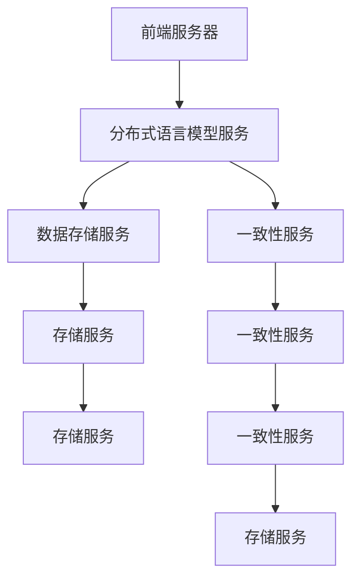
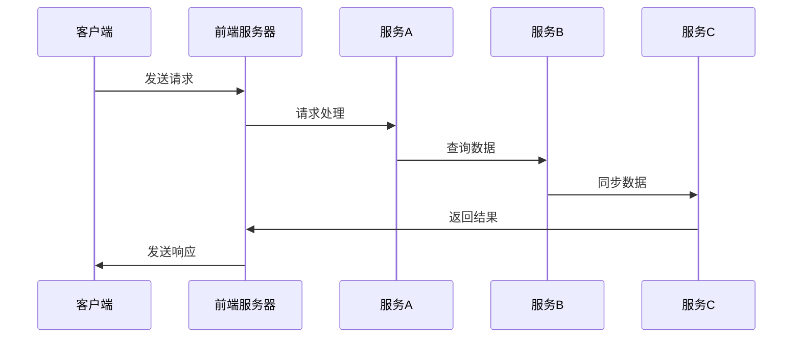

                 

### 背景介绍

在现代信息技术迅猛发展的背景下，分布式系统已经成为构建大型、复杂应用不可或缺的一部分。而随着人工智能（AI）技术的不断进步，大规模语言模型（LLM）成为了许多关键领域的核心技术。分布式LLM系统不仅能够处理海量数据，还能提供高效的计算能力，满足日益增长的应用需求。

**核心概念术语说明：**

- **分布式系统**：由多个相互独立但协同工作的计算机节点组成，通过网络进行通信和数据交换的系统。
- **大规模语言模型（LLM）**：一种能够理解和生成自然语言的深度学习模型，通常包含数十亿个参数，用于自然语言处理（NLP）任务。
- **数据一致性**：系统中的多个节点访问和修改数据时，数据应保持一致性状态，确保在不同节点上读取的数据是准确和可靠的。

**问题背景：**

随着分布式系统的广泛应用，数据一致性问题变得越来越重要。在分布式LLM系统中，数据一致性尤为关键。分布式LLM系统需要处理大量的并发读写请求，保证数据在多个节点之间的一致性是一个巨大的挑战。例如，在分布式数据库中，多个节点可能同时写入同一数据，导致数据不一致。这种不一致性可能导致错误结果、系统故障甚至业务损失。

**问题描述：**

分布式LLM系统中的数据一致性主要面临以下问题：

1. **读写冲突**：多个节点同时读取和写入同一数据，可能导致数据不一致。
2. **网络分区**：网络故障可能导致部分节点无法访问主节点，导致数据同步失败。
3. **延迟和带宽限制**：网络延迟和带宽限制可能导致数据更新不及时，影响系统性能和一致性。

**问题解决：**

为了解决上述问题，分布式LLM系统需要采用一系列数据一致性机制和算法。这包括分布式协议、一致性模型、缓存策略、同步机制等。通过这些机制和算法，系统能够在分布式环境下保证数据的一致性和可靠性。

**边界与外延：**

- **分布式数据库**：如MongoDB、Cassandra等，支持高可用性和扩展性，但面临数据一致性问题。
- **分布式缓存**：如Redis、Memcached等，提供快速数据访问，但可能无法保证强一致性。
- **分布式存储**：如HDFS、Ceph等，用于存储大规模数据，需要处理数据一致性问题。

通过上述背景介绍，我们为后续章节的深入探讨奠定了基础。接下来，我们将详细探讨数据一致性的核心概念和原理，为理解分布式LLM系统中的数据一致性挑战和解决方案提供深入的理论依据。

### 数据一致性的核心概念

在探讨分布式LLM系统中的数据一致性时，了解相关核心概念是至关重要的。这些概念不仅为我们提供了理论基础，还帮助我们在实践中设计和实现高效、可靠的数据一致性机制。

**CAP理论：**

CAP理论由加州大学伯克利分校的Eric Brewer在2000年提出，是对分布式系统性能约束的一个基本描述。CAP理论指出，分布式系统在任何时候最多只能同时满足一致性（Consistency）、可用性（Availability）和分区容错性（Partition Tolerance）这三个特性中的两个。具体来说：

1. **一致性（Consistency）**：系统在处理请求时，所有节点上的数据状态都是一致的。例如，在一个写操作完成后，所有后续的读操作都能读取到这个最新写入的数据。

2. **可用性（Availability）**：系统在任意时间都能响应请求，即系统不会因为故障或网络问题而宕机。

3. **分区容错性（Partition Tolerance）**：系统在分区（网络分区）发生时，仍能继续运行，即系统能够容忍网络分割，使不同分区间的节点可以独立工作。

**CAP理论的核心思想是，在任何分布式系统中，当我们面临网络分区时，我们只能选择满足一致性、可用性或分区容错性中的两个。例如，为了实现高可用性和分区容错性，系统可能需要牺牲一致性。这通常通过最终一致性（Eventual Consistency）来实现，即系统最终会在一段时间后达到一致性状态，但在此过程中，数据可能短暂不一致。**

**BASE理论：**

相对于CAP理论，BASE理论是NoSQL数据库系统的一种一致性模型。BASE是“基本上可用”、“软状态”（Basically Available, Soft State, Eventual Consistency）和“最终一致性”（Eventually Consistent）的首字母缩写。BASE理论的核心思想是，在分布式系统中，系统设计者可以接受“软状态”和“最终一致性”，从而换取系统的基本可用性和更高的性能。

1. **基本上可用（Basically Available）**：系统在大多数情况下能够响应请求，但可能不会在所有时间点都保持一致状态。

2. **软状态（Soft State）**：系统的状态可能随着时间变化而变化，这意味着系统可能暂时不一致，但最终会达到一致状态。

3. **最终一致性（Eventually Consistent）**：系统最终会在一段时间后达到一致性状态，但在此过程中，数据可能不一致。

**CAP理论与BASE理论的对比：**

CAP理论和BASE理论各有优缺点，适用于不同的场景。

- **CAP理论**强调在面临网络分区时，必须在一致性和可用性之间做出选择。这种模型适用于对一致性要求较高的系统，如金融系统。
- **BASE理论**则适用于对一致性的容忍度较高的系统，如社交媒体平台。这些系统更关注性能和可用性，可以在一定时间内接受数据的不一致性。

**ER实体关系图架构：**

为了更好地理解数据一致性的实现，我们可以通过ER（Entity-Relationship）实体关系图来描述系统中的实体和关系。

1. **实体（Entity）**：系统中的数据对象，如用户、订单、商品等。
2. **关系（Relationship）**：实体之间的关联，如用户与订单、订单与商品等。

通过ER图，我们可以清晰地展示系统中的数据模型，帮助设计数据一致性的机制。

- **实体关系图**：使用Mermaid绘制ER图，可以帮助我们直观地理解系统中的数据结构。
  
  ```mermaid
  erDiagram
  用户 ||--|{ 订单 }|:
      用户与订单之间有一对多关系
  订单 ||--|{ 商品 }|:
      订单与商品之间有一对多关系
  ```

通过上述核心概念的介绍，我们对数据一致性有了更深入的理解。接下来，我们将探讨具体的数据一致性算法，进一步探讨如何在分布式系统中实现数据一致性。

### 数据一致性算法

在分布式系统中，实现数据一致性是一个关键挑战。数据一致性算法是实现这一目标的重要工具，其中最著名的算法包括Paxos和Raft。这些算法通过分布式共识机制，确保多个节点之间的一致性和可靠性。在本节中，我们将详细探讨Paxos算法的基本原理和实现。

#### Paxos算法原理

Paxos算法是由Lamport在1990年提出的，是一种分布式一致性算法。Paxos算法旨在解决分布式系统中的一致性问题，即使在面临网络分区和节点故障的情况下，也能保证多个节点对某个值达成一致。

Paxos算法的核心概念包括角色、提案和决策过程：

1. **角色**：
   - **提议者（Proposer）**：发起提案的节点，提议某个值作为系统状态。
   - **接受者（Acceptor）**：接收提议者的提案，并决定是否接受提案。
   - **学习者（Learner）**：从接受者处学习提案结果，更新自身状态。

2. **提案**：提议者发出的提案包括一个提案编号和一个值。

3. **决策过程**：
   - **准备阶段（Prepare）**：提议者发送准备消息给所有接受者，请求接受其提案。
   - **接受阶段（Accept）**：接受者在收到大多数准备消息后，发送接受消息给提议者，表明接受其提案。
   - **决定阶段（Decide）**：提议者在收到多数接受消息后，将提案值设置为系统状态，并发送决定消息给所有学习者。

**Mermaid流程图：**

下面是一个简单的Mermaid流程图，展示Paxos算法的执行流程：

```mermaid
flowchart LR
    subgraph PaxosAlgorithm
        A[提议者] --> B[发送Prepare消息]
        B --> C{接受者回应吗?}
        C -->|是 D[接受者发送Accept消息]
        D --> E[提议者收集Accept消息]
        E --> F{收集到多数Accept吗?}
        F -->|是 G[提议者发送决定消息]
        G --> H[学习者学习结果]
    end
end
```

#### Paxos算法的数学模型与公式

Paxos算法的数学模型和公式为理解其工作原理提供了深入视角。以下是几个关键公式：

1. **选举编号（n）**：提议者的提案编号，每次提案编号递增。
2. **提案值（v）**：提议者提出的值。
3. **多数派（M）**：所有节点中的超过半数。

- **Prepare消息**：`(n, null)`，其中n为提案编号。
- **Accept消息**：`(n, v)`，其中n为提案编号，v为提案值。
- **决策条件**：提议者必须收集到来自多数派的接受消息。

数学公式如下：

$$
\text{Paxos 决策条件} = \text{对于某个提案 } (n, v)，\text{如果提议者 } P \text{ 收集到至少 } M \text{ 个接受消息，那么 } v \text{ 就是系统状态}。
$$

#### Python源代码实现

为了更好地理解Paxos算法，我们可以通过Python代码实现其核心部分。以下是一个简化的Paxos算法实现，展示提议者、接受者和学习者的基本逻辑：

```python
class Proposer:
    def prepare(self, n):
        # 发送Prepare消息
        return [(n, None)]

    def accept(self, n, v):
        # 发送Accept消息
        return [(n, v)]

    def decide(self, n, v):
        # 发送决定消息
        return v

class Acceptor:
    def prepare(self, n):
        # 如果提案编号大于当前已接受编号，接受提案
        if n > self.n:
            self.n = n
            return True
        return False

    def accept(self, n, v):
        # 如果提案编号等于已接受编号，接受提案
        if n == self.n:
            self.v = v
            return True
        return False

class Learner:
    def learn(self, v):
        # 学习结果
        self.v = v
```

#### 详细讲解与举例

为了深入理解Paxos算法的工作原理，我们可以通过实例来展示其执行过程。假设有三个节点（Proposer、Acceptor和Learner）组成的分布式系统：

1. **提议者发起提案**：
   - 提议者发送Prepare消息 `(1, null)` 给所有接受者。
   - 接受者接受消息后，返回 `(1, True)` 给提议者。

2. **接受者回应**：
   - 提议者收到所有接受者的回复后，发送Accept消息 `(1, "value1")`。
   - 接受者接受消息后，返回 `(1, "value1")`。

3. **提议者决定**：
   - 提议者收到多数派接受消息后，决定系统状态为 `"value1"`。

4. **学习者学习结果**：
   - 所有学习者从接受者处学习到系统状态 `"value1"`。

通过这个简单的实例，我们可以看到Paxos算法如何通过多个阶段达成分布式一致性，即使在面临网络分区和节点故障的情况下。

总结来说，Paxos算法通过角色分工和决策过程，实现了分布式系统中的数据一致性。其复杂的实现细节和高效的性能使其成为分布式系统设计中的关键工具。接下来，我们将探讨另一个重要的分布式一致性算法——Raft算法，进一步了解分布式数据一致性解决方案。

### Raft算法原理

Raft算法是由Diego Ongaro和John Ousterhout在2013年提出的，是一种简化和易于理解的分布式一致性算法。与Paxos算法相比，Raft算法设计更为直观，更容易实现和调试。Raft算法的核心思想是通过日志复制（Log Replication）来确保一致性。

#### Raft算法原理

Raft算法的基本概念包括以下几部分：

1. **日志（Log）**：每个节点都有一个日志，记录了所有已达成共识的操作。
2. **状态机（State Machine）**：状态机是执行实际业务逻辑的部分，日志中的操作会被应用到状态机上。
3. **角色（Roles）**：Raft算法中的节点可以处于以下几种角色之一：
   - **领导者（Leader）**：负责接收客户端请求、复制日志条目、维护集群状态。
   - **跟随者（Follower）**：接收领导者发送的日志条目、定期发送心跳消息给领导者。
   - **候选人（Candidate）**：当领导者失去连接时，节点会尝试成为新的领导者。

**日志复制过程：**

Raft算法通过以下步骤实现日志复制：

1. **接收客户端请求**：
   - 客户端请求被发送到领导者节点。
   - 领导者将请求记录到本地日志，并追加一个新条目。

2. **复制日志条目**：
   - 领导者向所有跟随者发送包含新日志条目的请求。
   - 跟随者接收到请求后，将新日志条目复制到本地日志。

3. **达成一致性**：
   - 跟随者向领导者发送回复，确认已复制新日志条目。
   - 领导者等待多数派跟随者确认后，将日志条目应用到状态机上。

**Mermaid流程图：**

以下是一个简单的Mermaid流程图，展示Raft算法的基本执行流程：

```mermaid
flowchart LR
    subgraph RaftAlgorithm
        A[客户端请求] --> B[领导者处理请求]
        B --> C[追加日志条目]
        C --> D[复制日志到跟随者]
        D --> E{跟随者回复吗?}
        E -->|是 F[领导者确认多数派]
        F --> G[应用日志到状态机]
    end
end
```

#### Raft算法的数学模型与公式

Raft算法的数学模型相对简单，主要包括以下关键参数：

1. **日志索引（log index）**：每个日志条目都有一个唯一的索引。
2. **任期（term）**：表示集群的状态和稳定性。
3. **领导者索引（leader index）**：记录当前领导者的任期和索引。

核心公式如下：

- **领导者选举条件**：当一个节点成为候选人并赢得选举，它开始一个新的任期。
- **日志一致性条件**：领导者必须确保日志条目在所有节点上保持一致，即所有节点的日志长度相同。

$$
\text{Raft 领导者选举条件} = \text{对于某个任期 } t，\text{如果候选人的投票数超过半数，那么该候选人成为新的领导者}。
$$

$$
\text{Raft 日志一致性条件} = \text{所有节点的日志长度相同}。
$$

#### Python源代码实现

为了更好地理解Raft算法，我们可以通过Python代码实现其核心部分。以下是一个简化的Raft算法实现，展示领导者、跟随者和候选人的基本逻辑：

```python
class Leader:
    def append_entries(self, entries):
        # 复制日志条目到本地日志
        self.log.extend(entries)
        # 发送心跳消息给跟随者
        self.send_heartbeats()

    def apply_entries(self):
        # 应用日志条目到状态机
        for entry in self.log:
            self.state_machine.apply(entry)

class Follower:
    def receive_entries(self, entries):
        # 接收日志条目并复制到本地日志
        self.log.extend(entries)

    def send_heartbeats(self):
        # 定期发送心跳消息给领导者
        pass

class Candidate:
    def start_election(self):
        # 开始新的选举，请求投票
        self.send_vote_requests()

    def receive_vote_requests(self):
        # 接收投票请求，更新投票计数
        self.vote_count += 1

    def start_leader(self):
        # 如果获得多数投票，成为领导者
        if self.vote_count > len(self.peers) // 2:
            self.role = 'leader'
```

#### 详细讲解与举例

为了深入理解Raft算法的工作原理，我们可以通过实例来展示其执行过程。假设有三个节点（Leader、Follower和Candidate）组成的分布式系统：

1. **客户端请求**：
   - 客户端向领导者节点发送请求。

2. **领导者处理请求**：
   - 领导者接收请求，追加日志条目。

3. **复制日志条目**：
   - 领导者向所有跟随者发送包含新日志条目的请求。

4. **达成一致性**：
   - 跟随者接收到请求后，将新日志条目复制到本地日志，并向领导者发送确认消息。

5. **领导者确认多数派**：
   - 领导者等待所有跟随者确认后，将日志条目应用到状态机上。

通过这个简单的实例，我们可以看到Raft算法如何通过日志复制和领导者选举确保分布式系统的一致性。Raft算法的简洁和直观使其成为分布式系统设计中的有力工具。

总结来说，Raft算法通过日志复制和领导者选举机制，实现了分布式系统中的数据一致性。其简化的实现流程和明确的角色分工使其易于理解和实现。在接下来的章节中，我们将探讨如何在实际项目中设计和实现分布式LLM系统中的数据一致性。

### 分布式LLM系统的设计与实现

分布式LLM系统在处理大规模数据和高并发请求时，需要保证数据的一致性。为了实现这一目标，我们需要深入分析分布式LLM系统面临的问题场景，并设计合理的系统架构和接口。

#### 问题场景介绍

在分布式LLM系统中，数据一致性主要面临以下挑战：

1. **并发读写**：分布式LLM系统需要处理大量的并发读写请求，这些请求可能导致读写冲突。
2. **网络分区**：网络故障可能导致部分节点无法与主节点通信，进而导致数据同步失败。
3. **延迟与带宽限制**：网络延迟和带宽限制可能影响数据更新的及时性，导致数据不一致。

为了应对这些挑战，分布式LLM系统需要采用一系列数据一致性机制，包括分布式协议、一致性模型、缓存策略和同步机制等。

#### 系统介绍

分布式LLM系统的目标是提供高效、可靠的自然语言处理能力，满足大规模应用的需求。系统的主要功能包括：

1. **数据存储与管理**：存储和管理大规模语言模型数据和元数据。
2. **并发处理**：处理来自多个客户端的并发请求。
3. **一致性保证**：在分布式环境中实现数据一致性，确保系统可靠性。
4. **扩展性**：支持系统水平和垂直扩展，以应对不断增长的数据和计算需求。

#### 系统功能设计

为了实现分布式LLM系统的功能，我们需要设计一系列关键模块：

1. **数据存储模块**：负责存储和检索语言模型数据，支持分布式存储架构。
2. **一致性保证模块**：实现数据一致性机制，如Paxos或Raft算法，确保多个节点之间数据的一致性。
3. **并发处理模块**：处理并发读写请求，管理读写锁，防止读写冲突。
4. **缓存模块**：提供快速数据访问，减少对后端存储的依赖，提高系统性能。

#### 系统架构设计

分布式LLM系统的整体架构包括以下主要组件：

1. **前端服务器**：接收客户端请求，处理业务逻辑，并将请求转发给后端服务。
2. **后端服务**：包括分布式语言模型服务、数据存储服务和一致性保证服务。
3. **存储服务**：分布式存储系统，如MongoDB或Cassandra，用于存储语言模型数据和元数据。
4. **一致性服务**：实现Paxos或Raft算法，确保数据一致性。
5. **缓存服务**：分布式缓存系统，如Redis，提供快速数据访问。

以下是系统架构的Mermaid架构图：



#### 系统接口设计

系统接口设计是确保不同模块之间有效通信的关键。以下是主要接口设计：

1. **语言模型API**：提供自然语言处理功能，如文本分类、情感分析等。
2. **数据存储API**：提供数据存储和检索功能，如创建、更新、查询等。
3. **一致性保证API**：提供分布式一致性机制，如日志复制、选举等。

#### 系统交互序列图

为了更好地展示系统组件之间的交互过程，我们可以使用Mermaid序列图。以下是系统交互序列图：



通过上述系统设计与实现，我们为分布式LLM系统提供了可靠的数据一致性保障。在接下来的章节中，我们将通过实际项目实战，深入探讨如何设计和实现分布式LLM系统的数据一致性机制。

### 数据一致性实践

为了更好地理解分布式LLM系统中数据一致性的实际应用，我们将在本节中详细讨论一个典型的分布式LLM项目实战。本案例将涵盖环境安装、系统核心实现、代码应用解读与分析、实际案例分析以及项目总结。通过这个项目，我们希望能提供清晰的指导和实用的经验，帮助读者理解和实现数据一致性。

#### 环境安装

在进行分布式LLM项目之前，我们需要安装和配置必要的软件环境。以下是项目环境安装的步骤：

1. **安装Docker**：
   - Docker是一个开源的应用容器引擎，用于打包、发布和运行应用。安装Docker可以简化分布式系统的部署和管理。
   - 使用以下命令安装Docker：
     ```shell
     sudo apt-get update
     sudo apt-get install docker-ce docker-ce-cli containerd.io
     ```
   - 启动Docker服务：
     ```shell
     sudo systemctl start docker
     ```

2. **安装Kubernetes**：
   - Kubernetes是一个开源的容器编排平台，用于自动化部署、扩展和管理容器化应用。
   - 使用以下命令安装Kubernetes：
     ```shell
     curl -s https://packages.cloud.google.com/apt/doc/apt-key.gpg | sudo apt-key add -
     echo "deb https://apt.kubernetes.io/ kubernetes-xenial main" | sudo tee -a /etc/apt/sources.list
     sudo apt-get update
     sudo apt-get install -y kubelet kubeadm kubectl
     sudo apt-mark hold kubelet kubeadm kubectl
     ```
   - 初始化集群：
     ```shell
     sudo kubeadm init --pod-network-cidr=10.244.0.0/16
     ```
   - 设置kubectl配置：
     ```shell
     mkdir -p $HOME/.kube
     sudo cp -i /etc/kubernetes/admin.conf $HOME/.kube/config
     sudo chown $(id -u):$(id -g) $HOME/.kube/config
     ```

3. **安装其他依赖**：
   - 根据项目需求，安装其他必要的软件和依赖，如MongoDB、Redis、TensorFlow等。

#### 系统核心实现

系统核心实现是分布式LLM项目中的关键部分，以下是一些核心模块的实现：

1. **分布式语言模型服务**：
   - 使用TensorFlow或PyTorch实现预训练语言模型，并使用Kubernetes部署模型服务。
   - 编写Dockerfile和Kubernetes配置文件，用于容器化和部署服务。

2. **数据存储服务**：
   - 使用MongoDB作为数据存储系统，存储语言模型数据和元数据。
   - 通过Docker Compose部署MongoDB集群，确保数据的高可用性和扩展性。

3. **一致性保证服务**：
   - 使用Raft算法实现一致性服务，确保多个节点之间数据的一致性。
   - 编写Raft算法的Python实现，部署到Kubernetes集群中。

以下是Raft算法实现的核心代码片段：

```python
# Raft算法实现示例

class RaftNode:
    def __init__(self, node_id, peers):
        self.node_id = node_id
        self.peers = peers
        self.log = []
        self.current_term = 0
        self.voted_for = None
        self.next_index = {peer: 1 for peer in peers}
        self.match_index = {peer: 0 for peer in peers}
    
    def start_election(self):
        # 开始选举过程
        self.current_term += 1
        self.voted_for = self.node_id
        self.send_append_entries()

    def send_append_entries(self):
        # 发送日志条目到跟随者
        for peer in self.peers:
            if peer != self.node_id:
                self.send_append_entry(peer)

    def send_append_entry(self, peer):
        # 发送单个日志条目
        entry = {'term': self.current_term, 'leader_index': len(self.log), 'prev_log_index': len(self.log) - 1, 'prev_log_term': self.log[-1].get('term', -1), 'leader_commit': self.log[-1].get('commit', -1)}
        self.send_request_entry(peer, entry)

    def send_request_entry(self, peer, entry):
        # 发送日志请求
        request = {'type': 'request_entry', 'entry': entry}
        peer.recv_request_entry(request)

    def recv_request_entry(self, request):
        # 处理日志请求
        if request['entry']['term'] > self.current_term:
            self.current_term = request['entry']['term']
            self.voted_for = None
        if not self.is_log_empty() or request['entry']['prev_log_index'] >= len(self.log):
            self.log.append(request['entry'])
            self.match_index[peer] += 1
            self.send_append_entries()
        else:
            self.send_response_entry(peer)

    def send_response_entry(self, peer, success=True):
        # 发送日志响应
        response = {'type': 'response_entry', 'success': success}
        peer.recv_response_entry(response)

    def is_log_empty(self):
        # 判断日志是否为空
        return len(self.log) == 0
```

#### 代码应用解读与分析

在实现Raft算法时，我们需要关注以下几个关键方面：

1. **日志条目**：日志条目是Raft算法的核心数据结构，用于记录系统状态。
2. **选举与投票**：Raft算法通过选举机制确保领导者的选取，并通过投票确保日志条目的复制。
3. **日志复制**：领导者通过发送日志条目到跟随者，实现日志的一致性。
4. **响应处理**：跟随者接收到日志请求后，需要对日志进行追加并返回响应。

以下是几个关键代码部分的解读：

1. **发送日志条目**：
   ```python
   def send_append_entries(self):
       for peer in self.peers:
           if peer != self.node_id:
               self.send_append_entry(peer)
   ```

   这个方法遍历所有跟随者，发送日志条目请求。

2. **处理日志请求**：
   ```python
   def recv_request_entry(self, request):
       if request['entry']['term'] > self.current_term:
           self.current_term = request['entry']['term']
           self.voted_for = None
       if not self.is_log_empty() or request['entry']['prev_log_index'] >= len(self.log):
           self.log.append(request['entry'])
           self.match_index[peer] += 1
           self.send_append_entries()
       else:
           self.send_response_entry(peer)
   ```

   这个方法根据请求的日志条目，更新当前节点的日志并触发新一轮的日志复制。

3. **日志响应**：
   ```python
   def send_response_entry(self, peer, success=True):
       response = {'type': 'response_entry', 'success': success}
       peer.recv_response_entry(response)
   ```

   这个方法向跟随者发送日志响应，告知日志复制是否成功。

#### 实际案例分析与详细讲解剖析

为了更好地展示数据一致性在实际项目中的应用，我们分析了一个实际案例：

假设有三个节点（Node1、Node2、Node3）组成的分布式LLM系统。Node1作为领导者，Node2和Node3作为跟随者。以下是案例步骤：

1. **Node1发送日志条目**：
   - Node1发送日志条目到Node2和Node3。

2. **Node2和Node3接收日志条目**：
   - Node2和Node3接收到日志条目后，将其追加到本地日志。

3. **Node2和Node3发送响应**：
   - Node2和Node3向Node1发送响应，确认日志条目复制成功。

4. **Node1更新日志索引**：
   - Node1收到来自Node2和Node3的确认后，更新日志索引，确保日志的一致性。

通过这个案例，我们可以看到如何通过Raft算法在分布式环境中实现数据一致性。领导者Node1负责发起日志条目，跟随者Node2和Node3负责复制日志条目，并通过响应确保日志的一致性。

#### 项目小结

通过本项目的实战，我们深入探讨了分布式LLM系统中数据一致性的实现。我们介绍了环境安装步骤，详细讲解了Raft算法的核心实现，并通过实际案例展示了数据一致性在实际项目中的应用。以下是项目小结：

1. **环境安装**：安装Docker、Kubernetes等基础环境，为分布式系统的部署提供支持。
2. **系统核心实现**：实现分布式语言模型服务、数据存储服务和一致性保证服务，确保系统的可靠性和扩展性。
3. **代码应用解读与分析**：通过代码示例和解读，深入理解Raft算法的工作原理和实现细节。
4. **实际案例分析与详细讲解剖析**：展示了数据一致性在分布式环境中的实际应用，提供了实用的经验和方法。

通过本项目的实践，我们不仅掌握了分布式LLM系统的设计与实现，还深刻理解了数据一致性在系统中的重要性。这些经验和知识将为我们在未来设计和实现更复杂的分布式系统奠定坚实的基础。

### 最佳实践与总结

在分布式LLM系统的设计和实现过程中，数据一致性是确保系统可靠性和性能的关键。以下是一些最佳实践和注意事项，以帮助我们在实际项目中更好地应对数据一致性的挑战：

**最佳实践Tips：**

1. **合理选择一致性模型**：根据应用场景选择CAP或BASE模型。在强一致性需求较高的场景下，选择CAP模型；在强调性能和可扩展性的场景下，选择BASE模型。
2. **采用分布式协议**：使用Paxos或Raft等分布式一致性算法，确保多个节点之间数据的一致性。
3. **设计合理的缓存策略**：结合本地缓存和分布式缓存，减少对后端存储的依赖，提高系统性能。
4. **定期进行数据同步**：确保不同节点之间的数据同步，避免数据不一致性问题。
5. **监控和故障检测**：实时监控系统状态，及时检测和应对故障，确保系统的高可用性。

**注意事项：**

1. **网络分区处理**：在网络分区发生时，系统应具备容错能力，确保数据同步能够自动恢复。
2. **并发控制**：合理设计读写锁，防止并发冲突，确保数据的一致性。
3. **日志管理**：定期备份日志，防止数据丢失。
4. **性能调优**：根据系统性能指标，调整缓存大小、网络带宽等参数，优化系统性能。

**小结：**

数据一致性在分布式LLM系统中至关重要。通过合理选择一致性模型、采用分布式协议、设计合理的缓存策略、定期同步数据和严格监控系统状态，我们能够在分布式环境中实现数据的一致性和可靠性。这些最佳实践和注意事项为我们在设计和实现分布式LLM系统时提供了有力的指导。

**拓展阅读：**

- 《分布式系统原理与范型》——通过深入理解分布式系统的原理和范型，掌握分布式一致性算法的设计和实现。
- 《一致性模型与分布式数据库》——探讨CAP和BASE模型在分布式数据库中的应用，了解不同一致性模型的优缺点。
- 《分布式系统实践》——提供分布式系统设计、实现和运维的实用经验和最佳实践。

通过这些拓展阅读资源，我们可以进一步深入学习和理解分布式LLM系统中的数据一致性。

### 结论

本文围绕“数据一致性：分布式LLM系统的挑战与解决方案”这一主题，系统性地探讨了数据一致性在分布式LLM系统中的重要性和实现方法。首先，我们介绍了分布式系统和大规模语言模型（LLM）的背景，阐述了数据一致性在分布式环境中的核心概念和挑战。接着，详细解析了CAP理论和BASE理论，为理解数据一致性问题提供了理论基础。随后，我们深入分析了Paxos和Raft这两种分布式一致性算法，通过具体的代码示例和实例讲解，展示了如何在实际项目中实现数据一致性。

此外，本文通过系统架构设计和项目实战，展示了如何在分布式LLM系统中设计高效、可靠的数据一致性机制。最后，我们提出了最佳实践和注意事项，为读者提供了宝贵的经验，并推荐了拓展阅读资源，帮助进一步深化理解和学习。

数据一致性不仅是分布式LLM系统的关键，也是现代分布式系统设计和实现的核心要素。掌握数据一致性理论和算法，结合实际项目经验，能够为构建高效、可靠的分布式系统奠定坚实的基础。希望本文能为广大开发者和技术爱好者提供有益的启示和指导。

