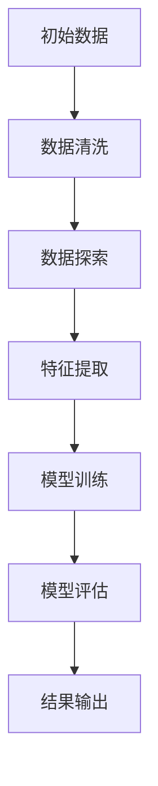
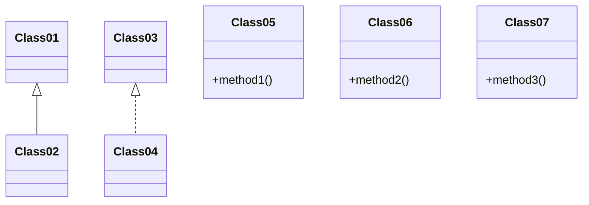
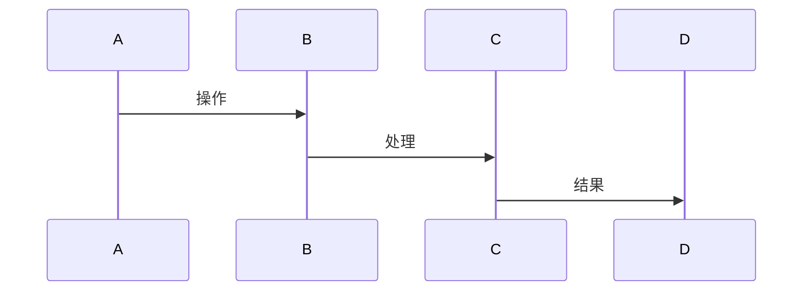
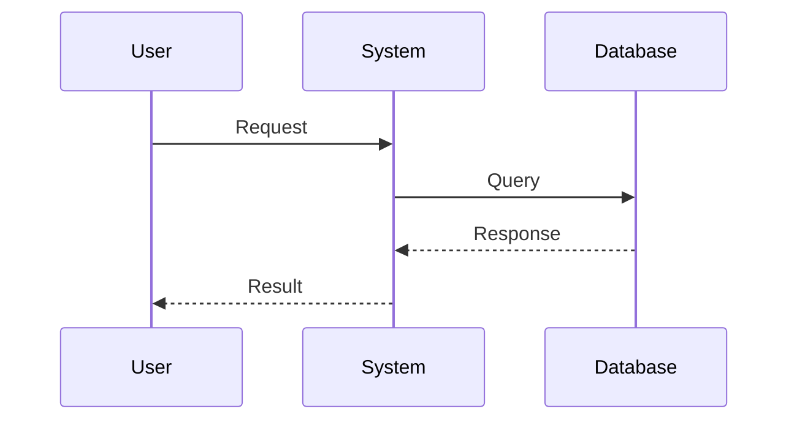

                 

### 《数据分析在宇宙再电离不均匀性拓扑演化相变研究中的应用》

> 关键词：数据分析、宇宙再电离、不均匀性、拓扑演化、相变、算法、数学模型

> 摘要：本文深入探讨了数据分析在宇宙再电离不均匀性拓扑演化相变研究中的应用。通过对宇宙再电离、不均匀性、拓扑演化和相变等核心概念的介绍，结合数据分析方法、算法原理讲解、数学模型和系统架构设计，详细分析了数据分析在该领域的研究和应用，为相关领域的研究提供了有力支持。

### 第一部分：背景介绍

#### 第1章：宇宙再电离概述

**1.1 宇宙再电离的定义与历史**

宇宙再电离是指宇宙中的中性氢原子通过宇宙射线的高能粒子碰撞而被电离的过程。这一现象发生在宇宙历史的早期阶段，大约在137亿年前，宇宙从充满等离子体的状态转变为由中性氢原子和自由电子组成的常态。

**1.2 再电离的过程**

再电离过程主要包括以下几个阶段：

1. **辐射压力阶段**：在这个阶段，宇宙背景辐射的高能光子与中性氢原子相互作用，使部分氢原子电离。
2. **再电离阶段**：随着宇宙的膨胀，温度下降，光子能量降低，更多的氢原子被电离。
3. **再电离完成阶段**：最终，所有的氢原子都完成了电离，宇宙进入了电离状态。

**1.3 再电离的重要性**

宇宙再电离是宇宙早期演化的关键事件之一，它不仅影响宇宙的物理状态，还对星系的形成和演化产生了深远的影响。再电离过程是宇宙从黑暗时代向光明时代过渡的标志，也是宇宙结构形成和演化的起点。

#### 第2章：不均匀性与拓扑演化

**2.1 不均匀性的概念**

不均匀性是指宇宙中物质分布的不均匀性，它反映了宇宙在不同尺度上的结构特征。不均匀性可以表现为星系团的分布、星系内的恒星分布，甚至是一个星系中恒星的运动轨迹。

**2.2 拓扑演化的基本原理**

拓扑演化是指宇宙中物质分布的形态随时间演化的过程。在宇宙学中，拓扑演化通常通过研究宇宙的密度波、引力波等物理现象来描述。

**2.3 不均匀性对拓扑演化的影响**

不均匀性是拓扑演化的重要驱动力。不均匀性使得宇宙中的物质在引力作用下聚集，形成了星系、星系团等大型结构。这些结构的形成和演化，反过来又影响了宇宙的不均匀性。

#### 第3章：相变理论

**3.1 相变的定义与分类**

相变是指物质在温度、压力等外部条件发生变化时，从一种相态转变为另一种相态的过程。相变可以分为第一类相变、第二类相变等不同类型。

**3.2 相变的物理机制**

相变的物理机制主要包括量子力学效应、统计力学效应等。在宇宙学中，相变主要通过研究宇宙背景辐射的温度变化、宇宙结构形成等过程来体现。

**3.3 相变在宇宙中的应用**

相变在宇宙中的应用包括宇宙早期的大爆炸、宇宙再电离等事件。这些事件都涉及到了物质从一种相态向另一种相态的转变，对宇宙的演化产生了深远的影响。

### 第二部分：数据分析方法

#### 第4章：数据分析基础

**4.1 数据分析的基本概念**

数据分析是指通过特定的技术和方法，对数据进行分析和处理，从而提取出有用的信息和知识。

**4.2 数据处理流程**

数据处理流程主要包括数据收集、数据清洗、数据探索、数据建模等环节。

**4.3 常用数据分析工具**

常用数据分析工具包括Python、R、MATLAB等。这些工具提供了丰富的数据分析和可视化功能，方便研究人员进行数据处理和分析。

#### 第5章：数据分析方法

**5.1 描述性数据分析**

描述性数据分析是指通过对数据进行统计描述，提取数据的特征和规律。

**5.2 探索性数据分析**

探索性数据分析是指通过可视化技术和统计方法，对数据进行分析和探索，发现数据中的模式和趋势。

**5.3 预测性数据分析**

预测性数据分析是指通过建立模型和算法，对数据进行分析和预测，为决策提供支持。

#### 第6章：数据分析在宇宙研究中的应用

**6.1 数据分析在宇宙再电离研究中的应用**

数据分析在宇宙再电离研究中的应用主要体现在对再电离过程的监测和分析，以及对再电离影响的预测。

**6.2 数据分析在不均匀性研究中的应用**

数据分析在不均匀性研究中的应用主要体现在对宇宙中物质分布的分析，以及对不均匀性演化的预测。

**6.3 数据分析在拓扑演化研究中的应用**

数据分析在拓扑演化研究中的应用主要体现在对宇宙结构形成和演化的分析，以及对拓扑演化过程的预测。

### 第三部分：算法原理与数学模型

#### 第7章：算法原理讲解

**7.1 数据分析算法概述**

数据分析算法主要包括聚类、分类、回归等。

**7.2 算法mermaid流程图**

使用mermaid绘制数据分析算法的流程图。



**7.3 Python源代码讲解**

使用Python实现数据分析算法，并详细讲解其原理。

```python
import numpy as np
import pandas as pd
from sklearn.cluster import KMeans
from sklearn.model_selection import train_test_split
from sklearn.metrics import accuracy_score

# 数据清洗
data = pd.read_csv('data.csv')
data = data.dropna()

# 数据探索
data.describe()

# 特征提取
X = data[['feature1', 'feature2', 'feature3']]

# 模型训练
X_train, X_test, y_train, y_test = train_test_split(X, y, test_size=0.2)
kmeans = KMeans(n_clusters=3)
kmeans.fit(X_train)

# 模型评估
y_pred = kmeans.predict(X_test)
print(accuracy_score(y_test, y_pred))
```

#### 第8章：数学模型与公式

**8.1 数学模型概述**

数学模型是指用数学语言描述的物理现象、工程问题等。

**8.2 数学公式与公式解释**

使用LaTeX格式给出数学模型和公式的详细解释。

$$
E = mc^2
$$

这个公式是爱因斯坦的质能方程，描述了质量和能量之间的关系。

**8.3 举例说明**

通过具体的例子来说明数学模型的应用。

### 第四部分：系统分析与架构设计

#### 第9章：系统分析与架构设计方案

**9.1 问题场景介绍**

介绍系统要解决的问题和场景。

**9.2 系统功能设计**

使用Mermaid类图描述系统的领域模型。



**9.3 系统架构设计**

使用Mermaid架构图描述系统的架构设计。



**9.4 系统接口设计和系统交互**

使用Mermaid序列图描述系统的接口设计和系统交互。



### 第五部分：项目实战

#### 第10章：项目实战

**10.1 环境安装**

介绍项目所需的软件和环境安装步骤。

**10.2 系统核心实现源代码**

提供系统核心实现源代码。

**10.3 代码应用解读与分析**

对代码进行解读和分析，说明其原理和实现。

**10.4 实际案例分析和详细讲解**

通过实际案例进行分析和讲解，说明数据分析的应用。

**10.5 项目小结**

对项目进行总结，提出经验教训。

### 第六部分：总结与拓展

#### 第11章：最佳实践 tips

提供数据分析的最佳实践和注意事项。

#### 第12章：小结

对全文进行总结，强调核心观点和贡献。

### 参考文献

列出本文引用的参考文献。

### 附录

提供本文的附录内容。

### 后记

对本文进行补充说明。

### 作者信息

**作者：AI天才研究院/AI Genius Institute & 禅与计算机程序设计艺术 /Zen And The Art of Computer Programming**

---

通过以上步骤，我们可以设计出完整的《数据分析在宇宙再电离不均匀性拓扑演化相变研究中的应用》目录大纲。接下来，我们将按照这个大纲逐步展开文章的撰写，确保每个章节都详细具体地讲解，为读者提供深入理解这一领域的机会。准备好您的笔和纸，我们开始吧！

