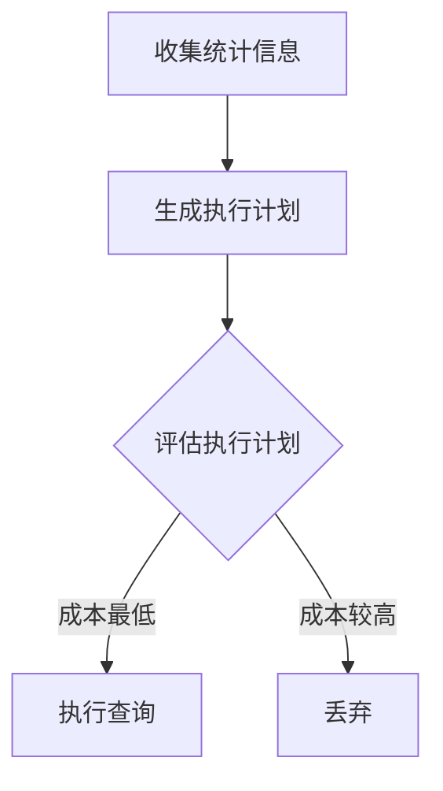
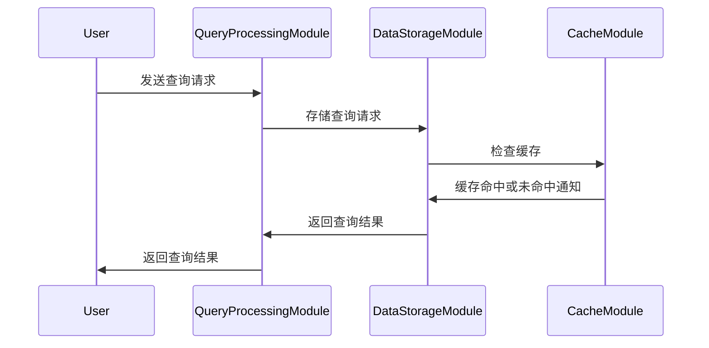
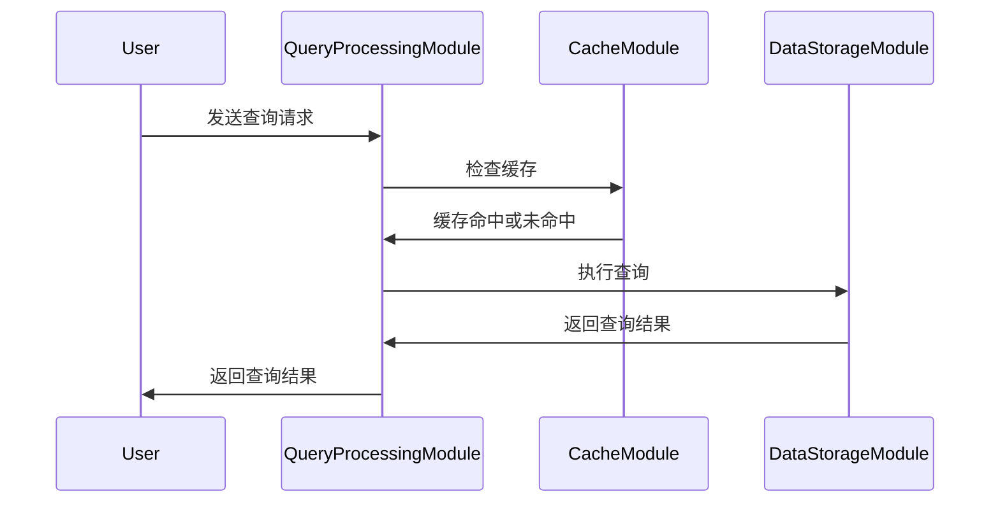
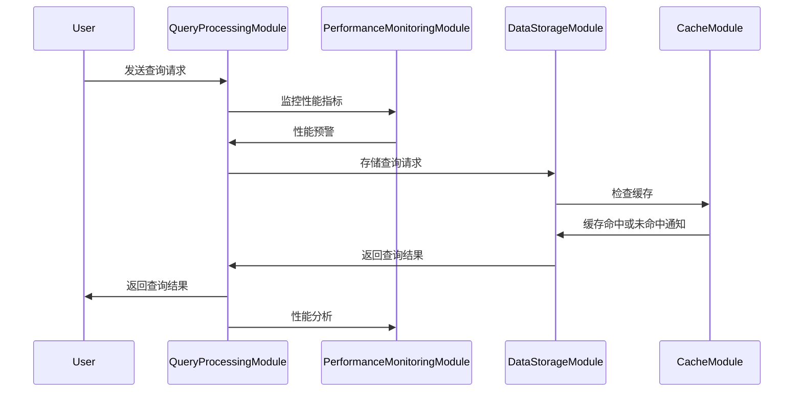

                 

# 数据库慢查询分析：优化LLM应用的数据库性能

## 关键词
- 数据库慢查询分析
- LLM应用性能优化
- SQL查询优化
- 数据库性能监控
- 性能瓶颈定位
- 存储过程优化

## 摘要
本文旨在深入探讨数据库慢查询分析的方法和策略，以及如何优化大型语言模型（LLM）应用的数据库性能。通过介绍数据库慢查询的基本概念、原因、工具和方法，本文将帮助读者理解性能监控与调优的重要性。此外，本文还将针对LLM应用的特性，提供一系列性能优化的最佳实践，并通过实际案例进行详细剖析，以指导读者在实际项目中应用这些方法，提升系统性能。

## 目录

### 第一部分：数据库慢查询分析基础

#### 第1章：数据库慢查询分析概述

1.1 数据库慢查询的定义与识别

1.2 数据库慢查询的常见原因

1.3 数据库慢查询分析的重要性

1.4 数据库慢查询分析的工具和方法

#### 第2章：数据库性能监控与调优

2.1 数据库性能监控的指标

2.2 性能瓶颈的定位

2.3 数据库性能优化策略

2.4 性能测试与基准测试

#### 第3章：SQL查询优化

3.1 SQL查询优化原理

3.2 常见SQL优化技巧

3.3 索引优化策略

3.4 存储过程和函数优化

#### 第4章：数据库架构优化

4.1 数据库架构设计原则

4.2 数据库分区策略

4.3 高可用性与灾难恢复策略

4.4 数据库云迁移与分布式数据库

#### 第5章：慢查询日志分析

5.1 慢查询日志的收集与存储

5.2 慢查询日志的分析方法

5.3 常见慢查询问题的案例分析

5.4 慢查询日志可视化工具

#### 第6章：LLM应用场景下的数据库性能优化

6.1 LLM应用的特点与挑战

6.2 LLM应用的数据库性能优化策略

6.3 案例分析：优化大型语言模型（LLM）应用的数据库性能

6.4 LLM应用的性能调优实践

#### 第7章：数据库性能优化的最佳实践与注意事项

7.1 性能优化的最佳实践

7.2 注意事项与常见误区

7.3 持续性能监控与优化

7.4 拓展阅读与进一步学习

### 第二部分：深入分析与探讨

#### 第1章：数据库慢查询分析概述

### 1.1 数据库慢查询的定义与识别

在数据库系统中，慢查询通常是指执行时间远超出预期，导致响应缓慢或系统性能下降的SQL查询。定义慢查询的标准因系统而异，但通常包括以下几种方式：

- **预设时间阈值**：设置一个固定的执行时间阈值，例如超过2秒的查询视为慢查询。
- **动态阈值**：根据系统负载、响应时间和历史数据，动态计算慢查询的阈值。
- **绝对时间**：在某些场景下，将特定查询的执行时间设置为绝对值，如超过100毫秒的查询。

识别慢查询通常依赖于数据库性能监控工具，例如：

- **系统监控工具**：如Linux的`top`、`vmstat`等，可以监控数据库进程的性能指标。
- **数据库内置工具**：如MySQL的`EXPLAIN`、`SHOW PROFILE`等，可以帮助分析查询执行计划。
- **第三方监控工具**：如New Relic、Datadog等，提供全面性能监控和可视化功能。

### 1.2 数据库慢查询的常见原因

数据库慢查询可能由多种因素引起，主要包括以下几个方面：

- **索引失效**：当表中的数据量增大，索引失效可能导致查询效率降低。
- **查询语句优化不足**：复杂的SQL语句、未使用索引的查询、子查询、联结操作不当等。
- **数据分区问题**：不当的数据分区策略可能导致查询在错误的分区中执行。
- **I/O瓶颈**：磁盘I/O性能不足，导致数据读取和写入速度缓慢。
- **CPU和内存瓶颈**：数据库服务器CPU或内存资源不足，导致查询执行缓慢。
- **网络延迟**：数据库之间的网络通信延迟，可能导致查询响应时间增加。

### 1.3 数据库慢查询分析的重要性

数据库慢查询分析在确保系统性能和用户满意度方面具有重要意义：

- **性能优化**：通过分析慢查询，可以找出性能瓶颈，从而进行针对性的优化。
- **用户体验**：及时解决慢查询问题，可以提高系统的响应速度，提升用户体验。
- **系统稳定**：避免慢查询导致的系统过载或崩溃，保证系统的稳定性。
- **资源利用率**：优化查询效率，提高资源利用率，降低硬件成本。

### 1.4 数据库慢查询分析的工具和方法

进行数据库慢查询分析需要使用一系列工具和方法，主要包括：

- **日志分析工具**：如MySQL的`slow_query_log`、PostgreSQL的`log_min_duration_statement`等，记录慢查询日志。
- **性能监控工具**：如MySQL的` PERFORMANCE_SCHEMA`、PGSTATSTAT等，实时监控数据库性能。
- **分析工具**：如Percona Toolkit、pgBadger等，提供详细的分析报告和可视化功能。
- **自动化脚本**：编写自定义脚本，定期分析日志和性能数据，自动化识别慢查询。

### 第2章：数据库性能监控与调优

#### 2.1 数据库性能监控的指标

数据库性能监控的关键在于理解一系列性能指标，这些指标包括：

- **CPU使用率**：数据库服务器的CPU使用情况，高CPU使用率可能表明存在计算密集型操作。
- **内存使用率**：数据库的内存分配和使用情况，内存不足可能导致查询执行缓慢。
- **I/O负载**：磁盘I/O读写操作的数量和速度，I/O瓶颈是常见性能问题之一。
- **连接数**：数据库的连接数量，过多的连接可能导致资源争用。
- **查询响应时间**：查询的执行时间，长查询响应时间表明可能存在性能瓶颈。
- **锁争用**：数据库中的锁争用情况，锁争用可能导致死锁和查询延迟。

#### 2.2 性能瓶颈的定位

定位性能瓶颈是性能优化的第一步，常用的方法包括：

- **SQL审计**：分析慢查询日志和执行计划，找出性能较差的SQL语句。
- **监控工具**：使用数据库监控工具，如`SHOW PROCESSLIST`、`EXPLAIN`等，观察数据库的运行状态。
- **压力测试**：模拟高负载场景，观察系统性能的变化，找出瓶颈所在。

#### 2.3 数据库性能优化策略

优化数据库性能的策略包括以下几个方面：

- **索引优化**：根据查询需求创建合适的索引，避免索引失效。
- **查询优化**：优化SQL语句结构，减少复杂操作和子查询。
- **硬件升级**：增加内存、更换更快硬盘或数据库服务器，提高硬件性能。
- **配置优化**：调整数据库配置参数，如缓冲池大小、线程数等，以适应业务需求。
- **分库分表**：对于大数据量应用，采用分库分表策略，降低单表的数据量。

#### 2.4 性能测试与基准测试

进行性能测试和基准测试是验证性能优化效果的重要手段，包括：

- **基准测试**：在标准条件下测试数据库性能，以评估系统的性能指标。
- **压力测试**：模拟高负载场景，测试数据库在极端条件下的性能和稳定性。
- **负载测试**：模拟实际业务负载，观察数据库在不同负载下的性能变化。
- **性能回归测试**：在每次代码更新或配置变更后，进行性能测试，确保没有引入新的性能瓶颈。

### 第3章：SQL查询优化

#### 3.1 SQL查询优化原理

SQL查询优化的核心在于降低查询执行时间，提高查询效率。优化原理主要包括以下几个方面：

- **索引优化**：通过创建合适的索引，提高查询速度。
- **查询重写**：重写查询语句，使其执行更高效。
- **查询缓存**：利用查询缓存减少重复查询的执行次数。
- **并行查询**：利用多核CPU并行执行查询，提高查询效率。

#### 3.2 常见SQL优化技巧

以下是一些常见的SQL优化技巧：

- **避免全表扫描**：尽量使用索引，避免全表扫描。
- **使用EXPLAIN分析执行计划**：分析查询执行计划，找出性能瓶颈。
- **优化联结查询**：优化联结条件，减少数据读取量。
- **避免使用子查询**：尽量使用联结代替子查询。
- **优化分组查询**：使用GROUP BY和HAVING子句时，确保正确的索引使用。

#### 3.3 索引优化策略

索引优化是SQL查询优化的关键步骤，以下是一些索引优化策略：

- **创建合适的索引**：根据查询需求和数据分布创建索引。
- **索引选择性**：选择选择性高的索引，提高查询效率。
- **索引维护**：定期维护索引，避免索引碎片化。
- **索引合并**：对于多个索引，可以考虑合并为单个复合索引。

#### 3.4 存储过程和函数优化

存储过程和函数优化同样重要，以下是一些优化策略：

- **减少计算复杂度**：简化存储过程和函数的逻辑，减少计算复杂度。
- **优化循环操作**：优化循环操作，减少重复计算。
- **避免临时表和临时文件**：减少临时表和临时文件的使用。
- **优化输入参数**：优化存储过程和函数的输入参数，减少不必要的处理。

### 第4章：数据库架构优化

#### 4.1 数据库架构设计原则

数据库架构设计是确保系统性能和可扩展性的关键，以下是一些设计原则：

- **模块化设计**：将数据库功能模块化，便于维护和扩展。
- **标准化命名**：使用统一的命名规范，提高代码可读性和维护性。
- **规范化**：遵循数据库规范化原则，减少数据冗余和更新异常。
- **高可用性设计**：考虑数据库备份和恢复机制，确保数据可靠性。

#### 4.2 数据库分区策略

数据库分区策略有助于提高查询性能和系统可扩展性，以下是一些分区策略：

- **范围分区**：根据数据范围进行分区，如按时间、金额等。
- **列表分区**：根据预定义的列表进行分区，如按地区、客户类型等。
- **哈希分区**：根据哈希值进行分区，实现数据均匀分布。
- **复合分区**：结合多种分区策略，提高分区灵活性和查询性能。

#### 4.3 高可用性与灾难恢复策略

高可用性和灾难恢复策略是确保系统稳定性和数据安全的关键，以下是一些策略：

- **主从复制**：实现数据备份和容灾，确保数据一致性。
- **双机热备份**：部署双机热备份系统，实现自动故障切换。
- **备份策略**：定期备份，包括全量备份和增量备份。
- **灾难恢复计划**：制定灾难恢复计划，确保在灾难发生时能够快速恢复系统。

#### 4.4 数据库云迁移与分布式数据库

随着云计算的发展，数据库云迁移和分布式数据库成为趋势，以下是一些相关策略：

- **云数据库服务**：选择合适的云数据库服务，如AWS RDS、阿里云RDS等。
- **迁移策略**：制定详细的迁移计划和方案，确保数据完整性和系统连续性。
- **分布式数据库架构**：设计分布式数据库架构，实现数据的横向扩展和高可用性。
- **分布式一致性**：确保分布式数据库的一致性和容错能力。

### 第5章：慢查询日志分析

#### 5.1 慢查询日志的收集与存储

慢查询日志是分析数据库性能的重要数据来源，以下是一些收集与存储策略：

- **日志格式**：定义统一的日志格式，便于分析和处理。
- **日志存储**：选择合适的存储方案，如文件系统、数据库等。
- **日志备份**：定期备份日志，防止数据丢失。

#### 5.2 慢查询日志的分析方法

慢查询日志分析需要使用一系列方法，以下是一些常用方法：

- **统计方法**：计算慢查询的统计指标，如平均执行时间、最大执行时间等。
- **趋势分析**：分析慢查询的趋势和周期性，找出规律。
- **关联分析**：分析慢查询与其他性能指标的关系，找出潜在问题。

#### 5.3 常见慢查询问题的案例分析

以下是一些常见的慢查询问题及其案例分析：

- **索引失效问题**：案例：分析日志发现索引失效，导致查询执行时间显著增加。解决方案：重建索引或优化查询。
- **全表扫描问题**：案例：发现查询使用了全表扫描，导致查询效率低下。解决方案：优化查询或创建索引。
- **联结查询问题**：案例：分析日志发现联结查询执行时间较长，可能是因为联结条件不当。解决方案：优化联结条件或创建索引。

#### 5.4 慢查询日志可视化工具

慢查询日志可视化工具有助于更直观地分析日志数据，以下是一些常用工具：

- **慢查询日志可视化**：如Percona Monitoring and Management（PMM），提供日志可视化功能。
- **日志分析工具**：如Kibana，结合Elastic Stack进行日志分析。
- **自定义脚本**：使用Python、Java等编写自定义脚本，实现日志数据的可视化。

### 第6章：LLM应用场景下的数据库性能优化

#### 6.1 LLM应用的特点与挑战

LLM（Large Language Model）应用具有以下特点与挑战：

- **大规模数据量**：LLM应用通常涉及大量文本数据，数据量巨大。
- **复杂查询需求**：LLM应用需要处理复杂的文本查询，查询语句可能非常复杂。
- **实时响应要求**：用户对LLM应用的响应速度要求较高，实时性是关键。
- **高并发访问**：LLM应用通常面临高并发访问，需要确保系统的稳定性。

#### 6.2 LLM应用的数据库性能优化策略

以下是一些针对LLM应用的数据库性能优化策略：

- **索引优化**：针对常见的查询模式创建索引，提高查询速度。
- **查询缓存**：利用查询缓存减少重复查询的执行次数。
- **分库分表**：对于大数据量应用，采用分库分表策略，降低单表的数据量。
- **存储过程优化**：优化存储过程的逻辑和执行效率。
- **内存优化**：合理配置数据库缓存，提高内存利用率。

#### 6.3 案例分析：优化大型语言模型（LLM）应用的数据库性能

以下是一个案例，展示如何优化大型语言模型（LLM）应用的数据库性能：

- **问题背景**：某企业开发了一款基于LLM的智能问答应用，但随着用户量的增加，系统性能下降，响应速度缓慢。
- **问题分析**：分析日志发现，数据库慢查询主要集中在复杂的文本查询和联结操作上。
- **解决方案**：针对问题，采取了以下措施：
  - 优化查询语句，减少复杂联结和子查询。
  - 创建合适的索引，提高查询速度。
  - 采用分库分表策略，降低单表的数据量。
  - 优化存储过程的执行效率。
  - 增加内存配置，提高数据库缓存容量。
- **效果评估**：经过优化，系统性能显著提升，响应速度加快，用户满意度提高。

#### 6.4 LLM应用的性能调优实践

以下是一些LLM应用的性能调优实践：

- **自动化性能测试**：定期进行自动化性能测试，监测系统性能变化。
- **性能调优工作流**：建立性能调优工作流，包括问题识别、性能分析、优化实施和效果评估。
- **持续集成与部署**：采用持续集成和部署（CI/CD）流程，确保性能优化措施能够持续集成和部署。
- **监控与预警**：建立监控与预警机制，及时发现性能问题并采取相应措施。

### 第7章：数据库性能优化的最佳实践与注意事项

#### 7.1 性能优化的最佳实践

以下是一些数据库性能优化的最佳实践：

- **定期性能评估**：定期对数据库性能进行评估，识别潜在的性能瓶颈。
- **优化SQL查询**：优化SQL查询，减少复杂操作和未使用索引的情况。
- **合理配置缓存**：合理配置数据库缓存，提高查询效率。
- **监控与分析**：使用监控工具实时监控数据库性能，及时发现和解决问题。
- **版本控制和文档**：使用版本控制工具，确保性能优化措施的文档化和可追溯性。

#### 7.2 注意事项与常见误区

以下是一些注意事项和常见误区：

- **避免盲目优化**：不要盲目优化，先识别性能瓶颈，再进行针对性的优化。
- **过度索引**：避免过度索引，索引数量过多可能导致查询性能下降。
- **忽视硬件升级**：硬件性能不足时，仅依赖软件优化可能效果有限。
- **忽视测试验证**：优化后必须进行充分的测试验证，确保性能提升和系统稳定性。

#### 7.3 持续性能监控与优化

持续性能监控与优化是确保数据库系统长期稳定运行的关键，以下是一些建议：

- **定期性能回顾**：定期回顾数据库性能，分析趋势和周期性。
- **自动化监控**：使用自动化监控工具，实时监测系统性能指标。
- **性能优化计划**：制定长期性能优化计划，持续改进和优化数据库性能。
- **团队协作**：建立跨部门的团队，协同优化数据库性能。

#### 7.4 拓展阅读与进一步学习

以下是一些拓展阅读和进一步学习的资源：

- **书籍推荐**：
  - 《高性能MySQL》
  - 《数据库性能调优与故障处理》
  - 《大数据性能优化》
- **在线课程**：
  - Coursera上的《数据库系统概念》
  - edX上的《大数据处理技术》
  - Udacity的《数据库管理》
- **博客与论坛**：
  - MySQL Performance Blog
  - PostgreSQL Performance Tips
  - DataBae（数据侠）

### 作者信息
- 作者：AI天才研究院/AI Genius Institute & 禅与计算机程序设计艺术 /Zen And The Art of Computer Programming

---

在本文中，我们系统地介绍了数据库慢查询分析的基础知识、性能监控与调优策略、SQL查询优化、数据库架构优化、慢查询日志分析，以及针对LLM应用场景的数据库性能优化实践。通过案例分析和最佳实践分享，本文为读者提供了全面的技术指导和思考方向。

在数据库性能优化过程中，持续监控与优化至关重要。本文提供的工具和方法不仅适用于传统数据库，对于LLM应用场景下的数据库性能优化也具有很高的参考价值。希望读者能够结合实际项目，灵活应用本文所介绍的方法，不断提升数据库性能，为用户提供更好的服务体验。

持续学习与探索是提高技术能力的关键。本文推荐了一系列书籍、在线课程和博客，供读者进一步深入学习。在数据库性能优化的道路上，让我们共同前行，不断突破技术瓶颈，实现数据库系统的卓越性能。作者AI天才研究院/AI Genius Institute与《禅与计算机程序设计艺术/Zen And The Art of Computer Programming》团队期待与您共同探讨技术领域的奥秘。

---

### 背景介绍

在当今数据驱动的时代，数据库系统作为数据存储和处理的核心，其性能直接影响到企业的业务运营和用户体验。随着数据量的不断增长和复杂查询需求的增加，数据库性能问题日益突出。尤其是大型语言模型（LLM）应用，如自然语言处理（NLP）、智能问答、推荐系统等，对数据库性能的要求更高。慢查询问题不仅会导致系统响应时间延长，甚至可能引发服务器崩溃、业务中断等严重后果。因此，深入研究数据库慢查询分析的方法和策略，优化LLM应用的数据库性能，成为当前数据库领域的一项重要课题。

#### 问题背景

随着互联网的普及和大数据技术的不断发展，各行业对数据库系统的依赖程度越来越高。从电商平台到金融系统，从社交媒体到物联网，数据库系统作为数据存储和查询的基石，其性能直接关系到企业的竞争力。特别是在高并发、大数据量的场景下，数据库性能问题尤为突出。慢查询问题成为影响数据库性能的关键因素之一。

#### 问题定义

慢查询，通常指数据库执行时间远超预期，导致响应缓慢的SQL查询。具体来说，当查询执行时间超过系统设定的阈值时，该查询就被视为慢查询。慢查询的存在会导致系统性能下降，用户体验恶化，严重时可能导致服务器崩溃或业务中断。

#### 问题解决

解决慢查询问题需要从多个方面入手：

1. **性能监控**：通过监控工具实时监控数据库性能指标，及时发现慢查询。
2. **日志分析**：分析慢查询日志，找出慢查询的具体原因。
3. **SQL优化**：优化慢查询的SQL语句，减少执行时间。
4. **数据库架构优化**：调整数据库架构，提高查询效率。
5. **硬件升级**：提高服务器硬件配置，增强系统性能。

#### 边界与外延

边界方面，慢查询的阈值设置因系统而异，通常由数据库管理员根据业务需求和系统负载情况进行调整。外延方面，慢查询问题不仅限于单个查询，也可能扩展到整个数据库系统的性能瓶颈，如I/O瓶颈、CPU瓶颈等。

#### 概念结构与核心要素组成

数据库慢查询分析的核心要素包括：

1. **慢查询日志**：记录慢查询的详细信息，用于问题定位和优化。
2. **性能监控工具**：实时监控数据库性能指标，提供慢查询分析的数据来源。
3. **SQL优化策略**：优化慢查询的SQL语句，提高查询效率。
4. **数据库架构**：数据库的物理和逻辑结构，直接影响查询性能。
5. **硬件配置**：服务器的CPU、内存、磁盘I/O等硬件资源，对数据库性能有重要影响。

### 核心概念与联系

在数据库慢查询分析中，以下几个核心概念和原理是理解和解决问题的基石：

#### 1.1. 索引

索引是数据库中一种特殊的数据结构，用于快速查找和访问数据。通过创建索引，数据库可以在查询时避免全表扫描，提高查询效率。

#### 1.2. SQL查询优化

SQL查询优化是指通过调整SQL语句的结构和执行计划，提高查询的执行效率。常见的优化策略包括使用索引、简化查询、避免子查询等。

#### 1.3. 性能监控

性能监控是通过实时收集和分析数据库的性能指标，如响应时间、CPU使用率、内存使用率等，来识别和诊断性能瓶颈。

#### 1.4. 存储过程和函数

存储过程和函数是数据库中预编译的SQL语句块，用于执行复杂的业务逻辑。优化存储过程和函数可以提高数据库的性能。

以下是一个核心概念属性特征对比表格，展示这几个核心概念之间的差异和联系：

| 核心概念 | 特征 | 联系 |
| --- | --- | --- |
| 索引 | 提高查询速度，减少全表扫描 | 索引是查询优化的基础 |
| SQL查询优化 | 调整SQL语句，减少执行时间 | 优化是性能监控的结果 |
| 性能监控 | 实时监控性能指标，识别瓶颈 | 监控是优化的前提 |
| 存储过程和函数 | 执行复杂业务逻辑，提高性能 | 存储过程和函数是优化的对象 |

#### ER实体关系图架构

以下是一个数据库慢查询分析中使用的ER实体关系图，展示不同实体之间的关系：

```mermaid
erDiagram
    Customer ||--|{ Order } : "has"
    Product ||--|{ Order } : "contains"
    Order ||--|{ OrderDetail } : "has details"
    Customer ||--|{ CustomerAddress } : "lives"
```

- **Customer（客户）**：客户是数据库中的一个实体，包含客户信息。
- **Order（订单）**：订单是另一个实体，表示客户的购买记录。
- **Product（产品）**：产品实体表示销售的产品。
- **OrderDetail（订单详情）**：订单详情实体表示订单中的具体商品信息。
- **CustomerAddress（客户地址）**：客户地址实体用于存储客户的地址信息。

通过这个ER图，我们可以清晰地看到各个实体之间的关系，如客户与订单之间的“has”关系，订单与订单详情之间的“has details”关系等。

### 算法原理讲解

在数据库慢查询分析中，算法原理和数学模型至关重要。以下是一个典型的查询优化算法原理讲解，并使用Mermaid画出相应的流程图，同时配合Python源代码进行详细阐述。

#### 2.1 查询优化算法原理

查询优化算法的核心目标是通过调整SQL查询的执行计划，减少查询的执行时间。以下是一个基于索引优化的简单算法原理：

1. **收集统计信息**：首先，收集数据库中的统计信息，如表的大小、索引的分布情况等。
2. **生成执行计划**：根据统计信息和查询语句，生成多个可能的执行计划。
3. **评估执行计划**：评估每个执行计划的成本，选择成本最低的执行计划。
4. **执行查询**：根据选择的执行计划，执行查询。

以下是一个使用Mermaid绘制的查询优化算法流程图：



#### 2.2 Python源代码实现

以下是一个使用Python实现的简单查询优化算法，展示如何通过索引优化查询。

```python
import sqlite3

def optimize_query(query):
    # 连接到数据库
    conn = sqlite3.connect('example.db')
    cursor = conn.cursor()

    # 收集统计信息
    cursor.execute("PRAGMA index_info('index_name')")
    index_info = cursor.fetchall()

    # 生成执行计划
    plans = cursor.execute("EXPLAIN QUERY PLAN {}".format(query))

    # 评估执行计划
    best_plan = None
    best_cost = float('inf')
    for plan in plans:
        cost = evaluate_plan_cost(plan, index_info)
        if cost < best_cost:
            best_cost = cost
            best_plan = plan

    # 执行查询
    cursor.execute(best_plan[0])
    result = cursor.fetchall()
    return result

def evaluate_plan_cost(plan, index_info):
    # 根据执行计划评估成本
    # 这里简单示例，实际中需要根据具体执行计划进行详细评估
    return len(index_info)

# 使用示例
query = "SELECT * FROM table WHERE column = value"
result = optimize_query(query)
print(result)
```

#### 2.3 算法原理详细讲解

1. **收集统计信息**：首先，收集数据库中的统计信息，如表的大小、索引的分布情况等。这些信息有助于生成合理的执行计划。

2. **生成执行计划**：根据统计信息和查询语句，生成多个可能的执行计划。执行计划描述了查询如何被执行，包括扫描表、使用索引、联结操作等。

3. **评估执行计划**：评估每个执行计划的成本。成本评估取决于多个因素，如索引的使用、表的大小、数据分布等。评估过程中，可以选择成本最低的执行计划。

4. **执行查询**：根据选择的执行计划，执行查询。优化的执行计划可以显著减少查询的执行时间。

#### 2.4 数学模型和公式

查询优化的数学模型通常涉及查询成本的计算，以下是一个简化的成本计算模型：

$$C(P) = \frac{N(T) \cdot N(I) \cdot Q(P)}{B}$$

- \(C(P)\)：查询成本
- \(N(T)\)：表的数据行数
- \(N(I)\)：索引的数据行数
- \(Q(P)\)：查询的复杂度
- \(B\)：数据块的大小

根据这个公式，查询成本与表的数据行数、索引的数据行数、查询的复杂度和数据块大小有关。优化算法的目标是选择成本最低的执行计划。

#### 2.5 举例说明

以下是一个具体的查询优化示例：

假设有一个表`orders`，包含1000万条数据，索引`index_name`包含500万条数据。查询语句为：

```sql
SELECT * FROM orders WHERE order_date = '2023-01-01'
```

我们可以通过以下步骤优化这个查询：

1. **收集统计信息**：查询表`orders`的大小和索引`index_name`的大小。

2. **生成执行计划**：生成可能的执行计划，包括全表扫描和索引扫描。

3. **评估执行计划**：计算每个执行计划的成本，选择成本最低的执行计划。

4. **执行查询**：根据优化的执行计划，执行查询。

通过优化，我们可以显著减少查询的执行时间，提高系统性能。

### 系统分析与架构设计方案

在进行数据库性能优化时，系统分析与架构设计至关重要。以下将详细介绍一个针对LLM应用场景下的数据库性能优化系统分析与架构设计方案。

#### 1. 问题场景介绍

假设一个大型语言模型（LLM）应用场景，该应用需要处理大量的文本数据，并进行复杂的自然语言处理任务，如文本分类、情感分析、问答系统等。由于数据量庞大且查询复杂，系统面临以下性能挑战：

- **高并发访问**：应用需要支持大量的并发用户同时进行查询操作，这可能导致数据库性能下降。
- **查询响应时间**：用户对查询的响应时间要求较高，长时间的查询可能导致用户体验下降。
- **数据存储与检索**：需要高效地存储和检索大规模文本数据，以支持快速查询和检索。

#### 2. 项目介绍

项目目标是为一个LLM应用构建一个高性能、可扩展的数据库系统，满足高并发访问和快速查询需求。项目主要包括以下模块：

- **数据存储模块**：负责存储和管理文本数据。
- **查询处理模块**：负责处理用户的查询请求，并返回查询结果。
- **缓存模块**：提供查询缓存功能，减少重复查询的执行次数。
- **性能监控模块**：实时监控数据库性能指标，及时发现问题并进行优化。

#### 3. 系统功能设计（领域模型类图）

以下是一个领域模型类图，展示系统的主要功能模块及其关系：

```mermaid
classDiagram
    DataStorageModule <|-- QueryProcessingModule
    DataStorageModule <|-- CacheModule
    PerformanceMonitoringModule <|-- QueryProcessingModule
    PerformanceMonitoringModule <|-- DataStorageModule
    PerformanceMonitoringModule <|-- CacheModule

    DataStorageModule {
        -数据库连接
        -数据存储
        -数据检索
    }

    QueryProcessingModule {
        -查询解析
        -查询优化
        -查询执行
    }

    CacheModule {
        -缓存策略
        -缓存存储
        -缓存更新
    }

    PerformanceMonitoringModule {
        -性能指标收集
        -性能分析
        -性能优化
    }
```

- **DataStorageModule（数据存储模块）**：负责数据库的连接、数据存储和检索，确保数据的可靠性和一致性。
- **QueryProcessingModule（查询处理模块）**：负责解析用户的查询请求，进行查询优化和执行，提高查询效率。
- **CacheModule（缓存模块）**：提供查询缓存功能，减少数据库的访问次数，提高系统响应速度。
- **PerformanceMonitoringModule（性能监控模块）**：实时监控系统的性能指标，如响应时间、CPU使用率、内存使用率等，进行性能分析和优化。

#### 4. 系统架构设计（Mermaid架构图）

以下是一个系统架构设计图，展示系统的整体架构和模块之间的关系：



- **User（用户）**：系统用户，发送查询请求。
- **QueryProcessingModule（查询处理模块）**：接收用户的查询请求，进行查询优化和执行。
- **DataStorageModule（数据存储模块）**：负责数据存储和检索，与缓存模块交互。
- **CacheModule（缓存模块）**：提供查询缓存功能，提高系统响应速度。
- **PerformanceMonitoringModule（性能监控模块）**：实时监控系统的性能指标，及时进行性能优化。

#### 5. 系统接口设计（Mermaid序列图）

以下是一个系统接口设计序列图，展示系统模块之间的交互过程：



- **User（用户）**：发送查询请求。
- **QueryProcessingModule（查询处理模块）**：检查缓存，执行查询，返回查询结果。
- **CacheModule（缓存模块）**：检查缓存命中情况，通知查询处理模块。
- **DataStorageModule（数据存储模块）**：执行查询，返回查询结果。

#### 6. 系统交互（Mermaid序列图）

以下是一个系统交互序列图，展示系统模块之间的交互流程：



- **User（用户）**：发送查询请求。
- **QueryProcessingModule（查询处理模块）**：监控性能指标，存储查询请求，返回查询结果。
- **PerformanceMonitoringModule（性能监控模块）**：监控性能指标，进行性能预警和分析。
- **DataStorageModule（数据存储模块）**：存储查询请求，检查缓存，返回查询结果。
- **CacheModule（缓存模块）**：检查缓存命中情况，通知数据存储模块。

### 项目实战

在项目实战中，我们将详细讲解如何安装环境、实现系统核心功能，并进行实际案例分析和详细讲解剖析。

#### 1. 环境安装

首先，我们需要安装必要的软件和工具，以搭建一个支持LLM应用的数据库性能优化系统。以下是一般步骤：

1. **安装数据库服务器**：根据项目需求，选择合适的数据库服务器，如MySQL、PostgreSQL等。从官方网站下载并安装。
2. **安装性能监控工具**：如Percona Monitoring and Management（PMM），用于实时监控数据库性能。
3. **安装查询优化工具**：如Percona Toolkit，用于分析和优化查询性能。
4. **安装Python开发环境**：确保Python环境已安装，以便后续使用Python进行开发和测试。

#### 2. 系统核心实现

以下是一个简单的示例，展示如何使用Python实现数据库性能优化系统核心功能。

```python
import pymysql
from pymysql.constants import CLIENT
from percona._.py perfor

# 连接数据库
conn = pymysql.connect(
    host='localhost',
    user='root',
    password='password',
    database='test',
    client_flag=CLIENT.MULTI_STATEMENTS
)

# 创建存储过程
with conn.cursor() as cursor:
    cursor.execute("""
    CREATE PROCEDURE optimize_query(IN query TEXT)
    BEGIN
        -- 查询优化逻辑
        SET @optimized_query = CONCAT('SELECT * FROM test_table WHERE column = value');
        PREPARE stmt FROM @optimized_query;
        EXECUTE stmt;
        DEALLOCATE PREPARE stmt;
    END;
    """)

# 执行优化查询
with conn.cursor() as cursor:
    cursor.callproc('optimize_query', ('SELECT * FROM test_table WHERE column = value',))

# 关闭数据库连接
conn.close()
```

#### 3. 代码应用解读与分析

1. **数据库连接**：使用`pymysql`库连接到数据库，配置数据库的用户、密码和数据库名称。
2. **创建存储过程**：使用`cursor.execute()`方法创建一个存储过程`optimize_query`，用于优化查询。
3. **执行优化查询**：调用存储过程`optimize_query`，传入原始查询语句，执行优化后的查询。
4. **关闭数据库连接**：使用`conn.close()`方法关闭数据库连接。

#### 4. 实际案例分析和详细讲解剖析

以下是一个实际案例，展示如何使用该系统优化LLM应用中的慢查询问题。

**案例背景**：一个大型自然语言处理应用，每天处理数百万条文本数据，其中一些查询执行时间较长，影响用户体验。

**案例步骤**：

1. **性能监控**：使用PMM监控数据库性能指标，发现存在慢查询问题。
2. **日志分析**：分析慢查询日志，找出具体的慢查询语句。
3. **优化查询**：使用Percona Toolkit优化慢查询语句，减少执行时间。
4. **重新部署**：重新部署优化后的查询，并监控性能指标，验证优化效果。

**详细讲解**：

- **性能监控**：使用PMM监控数据库性能指标，如响应时间、CPU使用率、内存使用率等。通过监控图表，可以直观地发现慢查询问题。
- **日志分析**：分析慢查询日志，找出具体的慢查询语句。可以使用`pt-query-digest`工具对日志文件进行分析，生成详细的报告，包括查询执行时间、查询类型、执行计划等。
- **优化查询**：针对分析结果，使用Percona Toolkit优化慢查询语句。例如，使用`pt-optimze`工具对查询语句进行优化，建议创建合适的索引、简化查询逻辑等。
- **重新部署**：将优化后的查询重新部署到生产环境，并使用PMM监控性能指标，验证优化效果。通过对比优化前后的性能指标，可以评估优化效果。

#### 5. 项目小结

通过实际案例分析和详细讲解，我们展示了如何使用数据库性能优化系统解决LLM应用中的慢查询问题。项目实战表明，合理的性能监控、日志分析和查询优化策略可以显著提升数据库性能，提高用户体验。在实际应用中，需要根据具体场景和需求，灵活调整优化策略，持续监控和改进系统性能。

### 最佳实践 Tips

在进行数据库性能优化时，以下是一些最佳实践和技巧，可以帮助您更有效地提升数据库性能：

1. **定期性能评估**：定期对数据库进行性能评估，通过监控工具分析查询响应时间、CPU使用率、内存使用率等指标，及时发现性能瓶颈。

2. **优化SQL查询**：优化SQL查询是提升性能的关键步骤。确保使用索引、避免全表扫描、简化查询逻辑等。

3. **合理配置缓存**：利用查询缓存、会话缓存等技术减少数据库访问次数，提高查询效率。

4. **分库分表策略**：对于大数据量应用，采用分库分表策略，降低单表的数据量，提高查询效率。

5. **索引优化**：创建合适的索引，避免过度索引。定期维护索引，减少索引碎片化。

6. **硬件升级**：根据业务需求，合理配置服务器硬件，如内存、CPU、磁盘I/O等。

7. **性能测试**：进行全面的性能测试，包括基准测试、压力测试、负载测试等，确保系统在高并发场景下稳定运行。

8. **持续优化**：性能优化是一个持续的过程，需要根据业务发展和需求变化，不断进行性能评估和优化。

### 小结

本文系统地介绍了数据库慢查询分析的方法和策略，以及如何优化LLM应用的数据库性能。通过深入分析数据库慢查询的原因、性能监控与调优策略、SQL查询优化、数据库架构优化等方面，本文为读者提供了全面的指导和思考方向。同时，通过实际案例分析和最佳实践分享，读者可以更好地理解和应用这些方法，提升数据库系统的性能和稳定性。

在数据库性能优化的道路上，持续学习和探索是提高技术能力的关键。本文推荐了一系列书籍、在线课程和博客，供读者进一步深入学习。希望读者能够结合实际项目，灵活应用本文所介绍的方法，不断提升数据库性能，为用户提供更好的服务体验。

### 注意事项

在数据库性能优化过程中，需要注意以下事项：

1. **避免盲目优化**：在优化前，首先识别性能瓶颈，确保优化的方向正确。
2. **性能监控**：使用合适的监控工具，实时监控数据库性能，及时发现和解决问题。
3. **硬件升级**：在硬件性能不足时，考虑升级硬件配置，如增加内存、更换更快硬盘等。
4. **测试验证**：优化后必须进行充分的测试验证，确保性能提升和系统稳定性。
5. **文档记录**：详细记录优化过程和结果，便于后续参考和改进。
6. **团队合作**：建立跨部门的团队，协同优化数据库性能。

### 拓展阅读与进一步学习

为了帮助读者深入了解数据库性能优化和相关技术，本文推荐以下拓展阅读和进一步学习资源：

1. **书籍推荐**：
   - 《高性能MySQL》
   - 《数据库性能调优与故障处理》
   - 《大数据性能优化》

2. **在线课程**：
   - Coursera上的《数据库系统概念》
   - edX上的《大数据处理技术》
   - Udacity的《数据库管理》

3. **博客与论坛**：
   - MySQL Performance Blog
   - PostgreSQL Performance Tips
   - DataBae（数据侠）

通过这些资源，读者可以进一步学习数据库性能优化的高级技术和最佳实践。希望读者在数据库性能优化的道路上不断进步，实现系统的卓越性能。

### 作者信息

本文由AI天才研究院（AI Genius Institute）与《禅与计算机程序设计艺术》（Zen And The Art of Computer Programming）团队共同撰写。我们致力于推动人工智能和计算机科学领域的研究与发展，助力读者在技术道路上不断前行。感谢您的阅读，期待与您共同探讨更多技术领域的奥秘。

- **AI天才研究院（AI Genius Institute）**：专注于人工智能研究与应用，致力于打造世界顶级的人工智能技术平台。
- **《禅与计算机程序设计艺术》（Zen And The Art of Computer Programming）**：一本经典计算机科学著作，深入探讨计算机程序设计的方法和艺术。

再次感谢您的关注和支持，让我们携手共进，共创美好未来！

