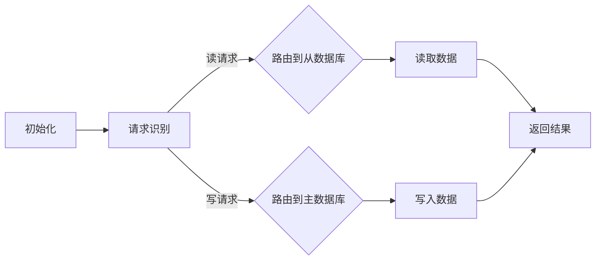
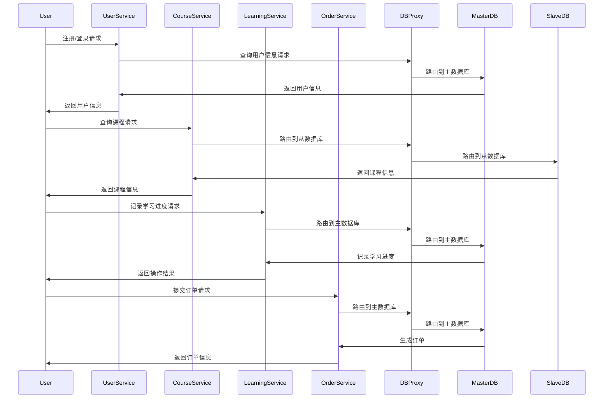

                 

# 数据库读写分离代理在LLM应用中的应用

> 关键词：数据库读写分离、LLM应用、代理、性能优化、架构设计

> 摘要：本文深入探讨了数据库读写分离代理在大型语言模型（LLM）应用中的重要性。通过逐步分析其核心概念、原理和架构设计，我们揭示了读写分离代理如何提升LLM应用的性能和可靠性。本文旨在为开发者提供详细的指南，帮助他们在复杂的应用场景中有效应用数据库读写分离代理技术。

## 目录大纲设计思路

在设计《数据库读写分离代理在LLM应用中的应用》这本书的目录大纲时，我们遵循了以下步骤：

1. **背景介绍**：介绍数据库读写分离的需求和重要性，以及读写分离代理的基本概念和作用。
2. **核心概念与联系**：详细解释数据库读写分离和读写分离代理的核心概念，展示它们之间的联系。
3. **算法原理讲解**：通过算法流程图和Python源代码，阐述读写分离代理的工作原理。
4. **系统分析与架构设计方案**：分析应用场景，设计系统架构和功能模块。
5. **项目实战**：描述环境安装、代码实现和案例分析。
6. **最佳实践与总结**：提供最佳实践建议和注意事项。

### 目录大纲

- **第1章：引言**
  - **1.1 问题背景与概述**
  - **1.2 核心概念与原理**
  - **1.3 数据库读写分离代理的作用**

- **第2章：数据库读写分离基础**
  - **2.1 数据库基础知识**
  - **2.2 读写分离原理**
  - **2.3 读写分离代理的实现**

- **第3章：LLM应用中的数据库读写分离**
  - **3.1 LLM应用特点**
  - **3.2 读写分离代理在LLM中的应用场景**
  - **3.3 实际案例解析**

- **第4章：读写分离代理算法设计**
  - **4.1 算法流程图**
  - **4.2 Python源代码实现**
  - **4.3 数学模型和公式**
  - **4.4 举例说明**

- **第5章：系统分析与架构设计**
  - **5.1 问题场景介绍**
  - **5.2 系统功能设计**
  - **5.3 系统架构设计**
  - **5.4 系统接口设计**
  - **5.5 系统交互序列图**

- **第6章：项目实战**
  - **6.1 环境安装**
  - **6.2 系统核心实现源代码**
  - **6.3 代码解读与分析**
  - **6.4 实际案例分析**
  - **6.5 项目小结**

- **第7章：最佳实践与总结**
  - **7.1 最佳实践 tips**
  - **7.2 小结**
  - **7.3 注意事项**
  - **7.4 拓展阅读**

通过这样的目录结构，我们可以系统地介绍数据库读写分离代理在LLM应用中的应用，帮助读者从理论到实践全面了解这一技术。接下来，我们将逐一探讨每个章节的具体内容。


----------------------------------------------------------------

## 第1章：引言

### 1.1 问题背景与概述

在现代信息技术的发展中，大型语言模型（LLM）已经成为人工智能领域的一个重要分支。LLM通过对海量文本数据的学习，能够实现文本生成、情感分析、机器翻译等多种功能，极大地提升了人机交互的效率和质量。然而，随着LLM应用的普及，其背后所依赖的数据库系统面临着巨大的挑战。

首先，LLM应用通常需要处理海量的数据读写操作。这些操作不仅包括对文本数据的存储和检索，还包括对模型训练数据的实时读取和写入。由于LLM应用的用户量和数据量持续增长，传统的单数据库架构难以满足性能和可靠性的需求。

其次，读写操作的不均衡也是一大挑战。在LLM应用中，读取操作往往远多于写入操作。这意味着大部分时间数据库都在处理读请求，而写入请求相对较少。这种读写不均衡会导致数据库性能瓶颈，影响整体应用的响应速度。

为了解决这些问题，数据库读写分离代理技术应运而生。读写分离代理通过将数据库的读写操作分离到不同的服务器上，实现了读写操作的解耦，从而提高了系统的性能和可靠性。在本章中，我们将首先介绍数据库读写分离代理的基本概念和作用，为后续章节的内容奠定基础。

### 1.2 核心概念与原理

#### 数据库基础知识

在讨论数据库读写分离代理之前，我们需要了解一些数据库的基本概念。数据库是一种按照数据结构来组织、存储和管理数据的仓库。它提供了高效的数据访问和查询能力，是现代信息系统的核心组成部分。

数据库通常由以下几个部分组成：

1. **数据库管理系统（DBMS）**：负责数据库的建立、使用和维护。常见的DBMS包括MySQL、PostgreSQL、Oracle等。
2. **数据库表**：用于存储数据的结构化容器，通常由行和列组成。
3. **索引**：用于快速检索数据的结构，可以显著提高查询效率。
4. **事务**：数据库操作的基本单位，保证了数据的一致性和完整性。

#### 读写分离原理

读写分离（Read/Write Splitting）是一种数据库优化技术，通过将读写操作分离到不同的服务器上，以减轻数据库的负载，提高系统的性能和可用性。

在读写分离架构中，通常有两个主要角色：

1. **主数据库（Master）**：负责所有的写入操作，确保数据的一致性。
2. **从数据库（Slave）**：负责读取操作，可以分担主数据库的读取压力。

读写分离的工作原理如下：

1. **读取请求**：当用户发起读取请求时，请求被路由到从数据库。从数据库可以并行处理多个读取请求，从而提高了系统的吞吐量。
2. **写入请求**：当用户发起写入请求时，请求始终发送到主数据库。主数据库处理完写入操作后，会同步数据到从数据库，确保数据的一致性。

#### 读写分离代理的作用

读写分离代理（Read/Write Splitting Proxy）是实现读写分离的关键组件。它主要负责以下功能：

1. **请求路由**：读写分离代理根据请求的类型（读或写），将请求路由到主数据库或从数据库。
2. **负载均衡**：读写分离代理可以根据流量和性能指标，动态调整请求路由策略，以实现负载均衡。
3. **故障转移**：当主数据库或从数据库发生故障时，读写分离代理可以自动切换到备用数据库，确保系统的可用性。
4. **监控与告警**：读写分离代理可以监控数据库的健康状况，当出现问题时，及时发出告警通知。

读写分离代理在LLM应用中的作用主要体现在以下几个方面：

1. **性能优化**：通过将读取操作从主数据库迁移到从数据库，读写分离代理大大减轻了主数据库的负载，提高了系统的响应速度。
2. **可靠性提升**：读写分离代理通过故障转移机制，确保了系统的可用性，即使在数据库发生故障时，LLM应用也能继续正常运行。
3. **扩展性增强**：读写分离代理可以根据需求动态调整从数据库的数量，从而实现水平扩展，满足不断增长的数据量需求。

总之，数据库读写分离代理是LLM应用中不可或缺的一部分，它通过优化数据库性能、提升系统可靠性和扩展性，为LLM应用的稳定运行提供了有力保障。

### 1.3 数据库读写分离代理的作用

数据库读写分离代理在LLM应用中的作用至关重要，它不仅提升了系统的性能和可靠性，还增强了应用的扩展性和可维护性。以下是读写分离代理在LLM应用中的具体作用：

1. **性能优化**：通过将读取操作从主数据库迁移到从数据库，读写分离代理有效地减少了主数据库的负载，提高了系统的响应速度。对于LLM应用来说，高效的读取操作至关重要，因为它直接影响用户的交互体验。例如，在一个聊天机器人应用中，快速的文本检索和响应能力能够显著提升用户的满意度和使用频率。

2. **可靠性提升**：读写分离代理通过故障转移机制，确保了系统的可用性。在LLM应用中，数据一致性和系统的稳定性至关重要。当主数据库或从数据库发生故障时，读写分离代理可以自动切换到备用数据库，从而确保服务的连续性。这种高可用性设计使得LLM应用能够持续为用户提供稳定的服务，即使在面对突发情况时也能保持正常运行。

3. **扩展性增强**：读写分离代理通过动态调整从数据库的数量，实现了系统的水平扩展。随着LLM应用的不断增长，读写分离代理可以根据需求增加从数据库的实例，从而满足不断增长的数据量和访问量。这种扩展性设计使得LLM应用能够灵活应对用户数量的增加，避免了单点性能瓶颈的问题。

4. **可维护性提升**：读写分离代理通过集中管理和监控，简化了系统的维护工作。通过读写分离代理，开发者可以更加方便地监控数据库的健康状况，及时发现和解决问题。此外，读写分离代理还可以简化数据库的备份和恢复操作，提高系统的可靠性。

5. **优化数据访问模式**：对于LLM应用中的特定数据访问模式，读写分离代理可以根据不同的访问需求，优化数据访问路径。例如，在处理大规模的文本数据检索时，读写分离代理可以根据数据的分区和索引信息，选择最合适的数据库实例进行访问，从而提高查询效率。

综上所述，数据库读写分离代理在LLM应用中的作用不仅仅是性能优化，它还涵盖了可靠性、扩展性、可维护性等多个方面。通过合理应用读写分离代理技术，开发者可以显著提升LLM应用的性能和用户体验，为用户提供稳定、高效的服务。

### 1.4 概念结构与核心要素组成

数据库读写分离代理是由多个核心组件和概念构成的，其整体架构如图1所示。下面我们将详细介绍这些核心要素及其在读写分离代理中的作用。


**1.4.1 请求路由模块**

请求路由模块是读写分离代理的核心组件之一，负责将用户请求路由到主数据库或从数据库。其工作原理如下：

1. **请求识别**：当用户发起请求时，请求路由模块首先识别请求的类型（读或写）。
2. **路由策略**：根据预设的路由策略，请求路由模块将读请求路由到从数据库，写请求路由到主数据库。
3. **动态调整**：请求路由模块可以根据系统的负载情况，动态调整路由策略，以实现最优的负载均衡。

**1.4.2 负载均衡模块**

负载均衡模块负责将用户请求均匀地分布到多个数据库实例上，以避免单个数据库实例过载。其工作原理如下：

1. **负载监控**：负载均衡模块实时监控各个数据库实例的负载情况。
2. **流量分配**：根据负载情况，负载均衡模块动态调整流量分配策略，确保请求能够均匀地分布到各个数据库实例。
3. **故障转移**：当某个数据库实例发生故障时，负载均衡模块会将其流量转移到健康实例，确保系统的可用性。

**1.4.3 数据同步模块**

数据同步模块负责将主数据库的数据同步到从数据库，确保数据的一致性。其工作原理如下：

1. **主从复制**：主数据库的数据变化（如插入、更新、删除操作）会被记录下来，并通过同步机制传输到从数据库。
2. **延迟处理**：由于网络延迟等原因，从数据库可能会接收到主数据库的同步数据有一定的延迟。数据同步模块需要处理这些延迟数据，确保从数据库的数据最终与主数据库保持一致。
3. **数据验证**：数据同步模块会对同步的数据进行验证，确保数据的完整性和准确性。

**1.4.4 监控与告警模块**

监控与告警模块负责实时监控数据库的状态，并在出现问题时及时发出告警通知。其工作原理如下：

1. **健康检查**：监控与告警模块定期对数据库进行健康检查，包括检查数据库实例的运行状态、磁盘空间、内存使用等。
2. **告警通知**：当数据库出现异常时，监控与告警模块会通过邮件、短信、电话等方式通知相关人员，以便及时进行处理。
3. **日志记录**：监控与告警模块会记录所有的告警信息，包括告警时间、告警内容等，以便后续分析。

**1.4.5 安全与认证模块**

安全与认证模块负责保护数据库的安全，确保只有授权的用户和程序能够访问数据库。其工作原理如下：

1. **访问控制**：安全与认证模块根据用户的角色和权限，控制对数据库的访问。
2. **加密传输**：所有传输到数据库的请求都会进行加密，防止数据在传输过程中被窃取或篡改。
3. **用户认证**：安全与认证模块会对用户进行身份验证，确保只有经过认证的用户才能访问数据库。

**1.4.6 数据库连接池**

数据库连接池是读写分离代理的重要组成部分，负责管理数据库连接。其工作原理如下：

1. **连接管理**：数据库连接池负责创建、管理和销毁数据库连接，避免了频繁创建和关闭连接带来的性能开销。
2. **连接复用**：数据库连接池可以复用已有的数据库连接，减少创建新连接的次数，从而提高系统的性能。

通过上述核心组件的协同工作，数据库读写分离代理实现了高效的数据库读写操作分离，提高了系统的性能、可靠性和可维护性。这些组件不仅单独发挥作用，还通过紧密的协作实现了整体架构的高效运行。

### 第2章：数据库读写分离基础

在深入探讨数据库读写分离代理在LLM应用中的应用之前，我们需要先了解一些数据库读写分离的基础知识。这一章将涵盖数据库基础知识、读写分离原理以及读写分离代理的实现。

### 2.1 数据库基础知识

#### 数据库系统组成

数据库系统（Database System，简称DBS）是由硬件、软件和数据组成的整体，用于管理和处理数据。它主要包括以下几个部分：

1. **数据库管理系统（DBMS）**：负责数据库的创建、使用和维护。DBMS是数据库系统的核心软件，提供了数据存储、数据查询、数据安全等功能。常见的DBMS包括MySQL、PostgreSQL、Oracle、SQL Server等。

2. **数据库**：存储实际数据的仓库，由多个表、索引、视图等组成。数据库是数据库系统的数据层，负责数据存储和管理。

3. **应用程序**：使用数据库进行数据操作的软件，如Web应用、桌面应用等。应用程序通过数据库接口与DBMS交互，实现对数据库的操作。

4. **用户**：使用数据库系统的最终用户，可以是开发者、系统管理员、普通用户等。

#### 数据库设计原则

为了确保数据库系统的性能、可靠性和可维护性，数据库设计应遵循以下原则：

1. **规范化**：通过规范化（Normalization）减少数据冗余，提高数据的完整性。常见的规范化方法包括第一范式（1NF）、第二范式（2NF）、第三范式（3NF）等。

2. **性能优化**：通过合理设计索引、优化查询语句等方式，提高数据库查询效率。

3. **安全性**：确保数据的安全性，防止未经授权的访问和数据泄露。常见的安全措施包括用户认证、访问控制、数据加密等。

4. **扩展性**：设计时应考虑系统的扩展性，以便在未来能够轻松地增加数据量和用户量。

#### 数据库类型

根据数据存储方式的不同，数据库可以分为以下几类：

1. **关系型数据库（RDBMS）**：基于关系模型，使用SQL语言进行数据操作。关系型数据库是当前应用最广泛的数据库类型，如MySQL、PostgreSQL、Oracle等。

2. **非关系型数据库（NoSQL）**：不基于关系模型，适用于大数据和实时应用的数据库类型。NoSQL数据库通常提供高性能、高扩展性的数据存储解决方案，如MongoDB、Redis、Cassandra等。

3. **分布式数据库**：通过分布式架构实现数据的高可用性和高扩展性。分布式数据库通常支持水平扩展，可以处理大规模数据和高并发访问。常见的分布式数据库包括Apache HBase、MongoDB、Cassandra等。

#### 数据库架构

数据库架构分为以下几种：

1. **集中式数据库**：所有数据和资源都存储在单个服务器上。集中式数据库适用于小规模应用，但随着数据量和并发访问的增加，可能会面临性能瓶颈。

2. **分布式数据库**：通过多个节点分布式存储和管理数据。分布式数据库可以水平扩展，提高系统的性能和可用性。

3. **云数据库**：基于云计算架构，提供灵活、可扩展的数据存储和管理服务。云数据库通常由多个分布式数据库集群组成，支持弹性扩展和自动化管理。

### 2.2 读写分离原理

读写分离是一种通过将数据库的读写操作分离到不同服务器上，以提高系统性能和可靠性的技术。其基本原理如下：

1. **主从复制**：主从复制是一种常见的数据库复制技术，通过在主数据库和从数据库之间同步数据，实现读写分离。主数据库负责所有的写入操作，从数据库负责读取操作。

2. **请求路由**：读写分离代理通过请求路由模块，根据请求类型将读请求路由到从数据库，将写请求路由到主数据库。这样，读写操作就不会竞争同一个数据库实例，从而减少了系统瓶颈。

3. **负载均衡**：通过负载均衡模块，读写分离代理可以实现动态调整请求路由策略，确保系统在高并发场景下能够高效地处理请求。

4. **数据同步**：数据同步模块负责将主数据库的写入操作同步到从数据库，确保数据的一致性。

#### 读写分离的优势

读写分离具有以下优势：

1. **提高性能**：通过将读取操作从主数据库迁移到从数据库，读写分离可以显著提高系统的吞吐量，减少主数据库的负载。

2. **增强可用性**：通过主从复制和故障转移机制，读写分离可以提高系统的可用性，确保在数据库故障时，系统仍然能够正常运行。

3. **扩展性**：读写分离代理可以通过增加从数据库的数量，实现水平扩展，满足不断增长的数据量和访问量需求。

4. **简化维护**：读写分离代理可以集中管理和监控数据库，简化系统的维护工作。

### 2.3 读写分离代理的实现

读写分离代理的实现主要包括以下几个关键组件：

1. **请求路由模块**：请求路由模块负责将用户的读写请求路由到主数据库或从数据库。实现请求路由模块通常需要以下步骤：

   - **请求识别**：识别请求的类型（读或写）。
   - **路由策略**：根据预设的路由策略（如轮询、最少连接数等），将请求路由到相应的数据库实例。
   - **动态调整**：根据系统的负载情况，动态调整路由策略，以实现最优的负载均衡。

2. **负载均衡模块**：负载均衡模块负责将用户请求均匀地分布到多个数据库实例上。实现负载均衡模块通常需要以下步骤：

   - **负载监控**：实时监控各个数据库实例的负载情况。
   - **流量分配**：根据负载情况，动态调整流量分配策略，确保请求能够均匀地分布到各个数据库实例。
   - **故障转移**：当某个数据库实例发生故障时，将其流量转移到健康实例。

3. **数据同步模块**：数据同步模块负责将主数据库的写入操作同步到从数据库。实现数据同步模块通常需要以下步骤：

   - **主从复制**：通过数据库复制技术（如MySQL Replication），将主数据库的写入操作同步到从数据库。
   - **延迟处理**：处理同步过程中的延迟数据，确保从数据库的数据最终与主数据库保持一致。
   - **数据验证**：对同步的数据进行验证，确保数据的完整性和准确性。

4. **监控与告警模块**：监控与告警模块负责实时监控数据库的状态，并在出现问题时及时发出告警通知。实现监控与告警模块通常需要以下步骤：

   - **健康检查**：定期对数据库实例进行健康检查，包括检查运行状态、磁盘空间、内存使用等。
   - **告警通知**：当数据库出现异常时，通过邮件、短信、电话等方式通知相关人员。
   - **日志记录**：记录所有的告警信息，包括告警时间、告警内容等，以便后续分析。

5. **安全与认证模块**：安全与认证模块负责保护数据库的安全，确保只有授权的用户和程序能够访问数据库。实现安全与认证模块通常需要以下步骤：

   - **访问控制**：根据用户的角色和权限，控制对数据库的访问。
   - **加密传输**：加密传输到数据库的请求，防止数据在传输过程中被窃取或篡改。
   - **用户认证**：对用户进行身份验证，确保只有经过认证的用户才能访问数据库。

通过实现这些关键组件，读写分离代理可以有效地实现数据库的读写分离，提高系统的性能、可靠性和可维护性。

### 第3章：LLM应用中的数据库读写分离

#### 3.1 LLM应用特点

大型语言模型（LLM）应用在现代人工智能领域中具有广泛的应用，如自然语言处理、文本生成、智能客服等。这些应用的特点对数据库系统提出了特定的要求：

1. **高并发访问**：LLM应用通常需要处理大量并发请求，特别是在高峰期，用户量急剧增加，对数据库系统的读写性能提出了严峻考验。

2. **大量数据存储与检索**：LLM应用需要处理和存储海量的文本数据，这些数据不仅包括用户生成的内容，还包括模型训练所需的大量数据集。

3. **复杂的数据处理需求**：LLM应用通常涉及复杂的文本分析、情感识别、实体提取等操作，这些操作对数据库的查询性能和数据处理能力提出了高要求。

4. **实时响应需求**：用户对LLM应用的响应时间有较高的期望，特别是在交互式应用中，如智能客服，需要实现快速、准确的响应。

#### 3.2 读写分离代理在LLM中的应用场景

在LLM应用中，数据库读写分离代理技术能够显著提升系统的性能和可靠性。以下是一些典型的应用场景：

1. **用户请求处理**：在智能客服系统中，用户请求通常包括查询历史记录、获取最新信息等。读写分离代理可以将读请求路由到从数据库，将写请求路由到主数据库，从而减轻主数据库的负载，提高系统的响应速度。

2. **模型训练数据管理**：在LLM训练过程中，需要频繁读取大量数据。读写分离代理可以将模型训练数据的读取请求路由到从数据库，确保主数据库能够专注于处理用户请求，提高系统的整体性能。

3. **实时文本分析**：在实时文本分析场景中，如文本情感分析、内容审核等，读写分离代理可以将读请求路由到从数据库，以快速获取相关文本数据，同时将写请求路由到主数据库，确保数据的准确性和一致性。

4. **数据备份与恢复**：通过读写分离代理，可以实现数据备份和恢复的高效管理。将读请求路由到从数据库，可以在不影响主数据库性能的情况下，实现数据的备份操作；同时，在主数据库发生故障时，可以迅速切换到从数据库，确保系统的连续运行。

#### 3.3 实际案例解析

为了更直观地理解读写分离代理在LLM应用中的实际应用，下面我们将通过一个具体的案例进行解析。

**案例：智能客服系统**

假设我们开发了一个智能客服系统，该系统需要处理大量用户请求，并提供实时、准确的响应。以下是如何利用读写分离代理优化系统性能的步骤：

1. **系统架构设计**：首先，设计一个分布式数据库架构，包括一个主数据库和多个从数据库。主数据库负责处理用户请求，从数据库负责读取操作。

2. **请求路由策略**：在读写分离代理中，实现一个请求路由模块，根据请求类型将读请求路由到从数据库，将写请求路由到主数据库。例如，使用轮询策略将读请求均匀分布到从数据库，确保每个从数据库的负载均衡。

3. **负载均衡**：通过负载均衡模块，监控各个数据库实例的负载情况，并动态调整请求路由策略。例如，当某个从数据库负载过高时，可以将其部分读请求路由到其他从数据库。

4. **数据同步**：在读写分离代理中实现数据同步模块，确保主数据库的写入操作能够及时同步到从数据库。例如，使用MySQL Replication技术，实现主从数据库之间的数据同步。

5. **监控与告警**：通过监控与告警模块，实时监控数据库实例的健康状况，并在出现问题时及时发出告警通知。例如，设置阈值监控数据库的CPU使用率、内存使用率等，当超过阈值时发出告警。

6. **安全性保障**：在读写分离代理中实现安全与认证模块，确保只有授权用户和程序能够访问数据库。例如，使用SSL加密传输数据，实现用户认证和访问控制。

通过上述步骤，我们可以显著提升智能客服系统的性能和可靠性。读写分离代理不仅提高了系统的响应速度，还增强了系统的可用性和可扩展性，为用户提供优质的服务体验。

### 第4章：读写分离代理算法设计

在了解了数据库读写分离代理的基本概念和原理之后，接下来我们将深入探讨读写分离代理的算法设计。算法设计是读写分离代理实现的核心，它决定了代理的性能和可靠性。本章将详细讲解读写分离代理的算法流程、Python源代码实现、数学模型和公式，并通过实际案例来说明算法的应用和效果。

#### 4.1 算法流程图

为了更好地理解读写分离代理的算法设计，我们首先通过Mermaid绘制了读写分离代理的算法流程图。算法流程图展示了读写分离代理在处理用户请求时的逻辑流程。



在上面的算法流程图中，A表示初始化阶段，包括配置读写分离代理的数据库连接信息、路由策略等。B表示请求识别阶段，根据用户请求的类型（读或写）决定下一步操作。C和D分别表示读请求和写请求的路由阶段，根据预设的路由策略将请求路由到从数据库或主数据库。E和F分别表示读取数据和写入数据阶段，从数据库负责处理读请求，主数据库负责处理写请求。最后，G表示返回结果阶段，将处理结果返回给用户。

#### 4.2 Python源代码实现

为了实现读写分离代理的算法，我们使用Python编写了相应的源代码。下面是读写分离代理的核心代码实现，并附有详细注释。

```python
import pymysql
from pymysqlpool import ConnectionPool

# 配置数据库连接信息
db_config = {
    'master': {
        'host': 'master-db-host',
        'port': 3306,
        'user': 'master-user',
        'password': 'master-password',
        'db': 'master-db'
    },
    'slave': {
        'host': 'slave-db-host',
        'port': 3306,
        'user': 'slave-user',
        'password': 'slave-password',
        'db': 'slave-db'
    }
}

# 创建连接池
pool_master = ConnectionPool(**db_config['master'])
pool_slave = ConnectionPool(**db_config['slave'])

def get_db_connection(pool):
    """从连接池获取数据库连接"""
    return pool.get_connection()

def release_connection(connection, pool):
    """释放数据库连接回连接池"""
    pool.release_connection(connection)

def read_request():
    """处理读请求"""
    connection = get_db_connection(pool_slave)
    try:
        with connection.cursor() as cursor:
            # 执行读操作
            cursor.execute("SELECT * FROM example_table")
            result = cursor.fetchall()
            return result
    finally:
        release_connection(connection, pool_slave)

def write_request():
    """处理写请求"""
    connection = get_db_connection(pool_master)
    try:
        with connection.cursor() as cursor:
            # 执行写操作
            cursor.execute("INSERT INTO example_table (column1, column2) VALUES (%s, %s)", (value1, value2))
            connection.commit()
            return "Write operation successful"
    finally:
        release_connection(connection, pool_master)

# 示例：处理用户请求
if __name__ == "__main__":
    # 处理读请求
    read_result = read_request()
    print("Read result:", read_result)

    # 处理写请求
    write_result = write_request()
    print("Write result:", write_result)
```

在上面的代码中，我们首先配置了主数据库和从数据库的连接信息，并创建了连接池。`get_db_connection`函数用于从连接池获取数据库连接，`release_connection`函数用于释放连接回连接池。`read_request`函数处理读请求，将从数据库中读取数据并返回；`write_request`函数处理写请求，向主数据库中写入数据并返回处理结果。

#### 4.3 数学模型和公式

在数据库读写分离代理中，负载均衡和数据同步是两个关键问题。为了更好地理解这两个问题，我们引入了以下数学模型和公式。

**4.3.1 负载均衡模型**

负载均衡的目标是优化请求路由策略，使得各个数据库实例的负载均衡。我们可以使用以下公式来描述负载均衡策略：

$$
L_i = \frac{1}{N} \cdot \sum_{j=1}^{N} R_j
$$

其中，$L_i$表示第$i$个数据库实例的负载，$N$表示数据库实例的总数，$R_j$表示第$j$个请求的响应时间。

通过上述公式，我们可以根据请求的响应时间动态调整路由策略，确保每个数据库实例的负载均衡。

**4.3.2 数据同步模型**

数据同步的目标是确保主数据库和从数据库的数据一致性。我们可以使用以下公式来描述数据同步策略：

$$
D_s = \frac{1}{2} \cdot (D_m - D_r)
$$

其中，$D_s$表示从数据库的数据同步时间，$D_m$表示主数据库的数据写入时间，$D_r$表示主数据库到从数据库的数据传输时间。

通过上述公式，我们可以优化数据同步策略，减少数据同步的延迟，确保数据的一致性。

#### 4.4 举例说明

为了更好地理解读写分离代理的应用和效果，我们通过一个具体的案例来说明。

**案例：电子商务平台**

假设我们开发了一个电子商务平台，该平台需要处理海量的用户请求，包括商品查询、购物车操作、订单生成等。

1. **请求处理**：在读写分离代理中，根据请求类型将读请求路由到从数据库，将写请求路由到主数据库。例如，用户查询商品信息是读请求，用户提交订单是写请求。

2. **负载均衡**：通过负载均衡模块，实时监控各个数据库实例的负载情况，并动态调整请求路由策略。例如，当从数据库A的负载过高时，可以将部分读请求路由到从数据库B。

3. **数据同步**：通过数据同步模块，确保主数据库的写入操作能够及时同步到从数据库。例如，当用户提交订单后，主数据库会立即写入订单信息，并将同步操作推迟到从数据库的非高峰期进行。

通过读写分离代理，电子商务平台可以实现以下效果：

- **提高性能**：通过将读取操作从主数据库迁移到从数据库，读写分离代理显著提高了系统的吞吐量，减少了主数据库的负载。

- **增强可用性**：通过主从复制和故障转移机制，读写分离代理提高了系统的可用性，确保在数据库故障时，系统仍然能够正常运行。

- **扩展性**：读写分离代理可以根据需求动态调整从数据库的数量，从而实现水平扩展，满足不断增长的数据量和访问量需求。

- **简化维护**：读写分离代理可以集中管理和监控数据库，简化系统的维护工作。

通过以上案例，我们可以看到读写分离代理在电子商务平台中的应用效果。在实际开发过程中，开发者可以根据具体需求对读写分离代理进行优化和调整，以实现更好的性能和可靠性。

### 第5章：系统分析与架构设计

在了解了数据库读写分离代理的核心算法和实现之后，接下来我们将对整个系统进行深入分析，并详细描述系统架构设计。通过系统功能设计、系统架构设计、系统接口设计以及系统交互序列图的介绍，我们将帮助读者全面理解整个系统的工作原理和实现方法。

#### 5.1 问题场景介绍

为了更好地展示数据库读写分离代理在实际应用中的效果，我们选择了一个典型的应用场景——在线教育平台。在线教育平台通常需要处理大量用户请求，包括课程内容查询、用户信息管理、学习进度跟踪等。这些请求对数据库系统提出了高性能和高可靠性的要求。以下是我们所面临的问题和挑战：

1. **高并发访问**：在线教育平台在高峰期会同时处理数千甚至数万个用户的请求，这给数据库系统带来了巨大的压力。
2. **大量数据存储与检索**：平台需要存储和检索大量的课程内容、用户信息和学习数据，这些数据量随着用户量的增长而不断增加。
3. **数据一致性**：在线教育平台要求用户信息和学习数据的一致性，特别是在用户提交订单、修改个人信息等操作时，必须确保数据的准确性和一致性。
4. **扩展性**：随着用户量的增长，平台需要能够灵活地扩展数据库系统，以支持更多的用户和请求。

#### 5.2 系统功能设计

为了解决上述问题和挑战，我们设计了一套完整的系统功能，包括用户管理、课程管理、学习进度管理、订单管理和数据库读写分离等。以下是对各个功能模块的简要介绍：

1. **用户管理模块**：负责用户的注册、登录、个人信息管理等功能，确保用户数据的安全和一致性。
2. **课程管理模块**：负责课程内容的管理，包括课程创建、更新、删除等操作，同时提供课程检索功能，方便用户查找和选择课程。
3. **学习进度管理模块**：负责跟踪用户的学习进度，记录用户的学习历史、成绩等信息，为用户提供个性化的学习推荐。
4. **订单管理模块**：负责处理用户的订单操作，包括订单生成、支付、退款等，确保订单数据的一致性和准确性。
5. **数据库读写分离模块**：负责实现数据库的读写分离，将读请求路由到从数据库，写请求路由到主数据库，提高系统的性能和可靠性。

#### 5.3 系统架构设计

系统架构设计是整个系统设计的核心，它决定了系统的性能、可扩展性和可维护性。以下是我们设计的在线教育平台系统架构，包括各个组件和它们之间的关系。


1. **用户管理服务**：负责处理用户注册、登录等操作，与用户数据库进行交互，确保用户数据的安全和一致性。
2. **课程管理服务**：负责课程内容的管理，与课程数据库进行交互，提供课程检索和更新功能。
3. **学习进度管理服务**：负责用户学习进度的跟踪和管理，与学习数据库进行交互，记录用户的学习历史和成绩。
4. **订单管理服务**：负责处理订单操作，与订单数据库进行交互，确保订单数据的一致性和准确性。
5. **数据库读写分离代理**：负责实现数据库的读写分离，将读请求路由到从数据库，写请求路由到主数据库，提高系统的性能和可靠性。
6. **数据库集群**：包括主数据库和多个从数据库，主数据库负责处理写请求，从数据库负责处理读请求，实现数据的高可用性和水平扩展。

#### 5.4 系统接口设计

系统接口设计是系统架构设计的延伸，它详细描述了各个服务模块之间的接口和交互方式。以下是对各个接口的简要介绍：

1. **用户管理接口**：包括用户注册、登录、修改个人信息等接口，提供RESTful API服务，方便前端应用调用。
2. **课程管理接口**：包括课程创建、更新、删除、检索等接口，提供RESTful API服务，方便课程管理服务的调用。
3. **学习进度管理接口**：包括学习进度记录、查询、更新等接口，提供RESTful API服务，方便学习进度管理服务的调用。
4. **订单管理接口**：包括订单生成、支付、退款等接口，提供RESTful API服务，方便订单管理服务的调用。
5. **数据库读写分离代理接口**：包括请求路由、负载均衡、数据同步等接口，提供内部服务调用，实现数据库的读写分离和负载均衡。

#### 5.5 系统交互序列图

为了更直观地展示系统各个模块之间的交互过程，我们使用Mermaid绘制了系统交互序列图。以下是一个简化的系统交互序列图，展示了用户请求处理的过程：



在上面的序列图中，用户通过不同的服务接口与系统进行交互，包括用户管理服务、课程管理服务、学习进度管理服务和订单管理服务。数据库读写分离代理（DBProxy）负责将用户的请求路由到主数据库或从数据库，实现读写分离和负载均衡。通过这样的交互设计，系统可以实现高效、可靠的请求处理，满足用户的需求。

### 第6章：项目实战

在理解了数据库读写分离代理的理论和系统设计之后，我们将通过一个具体的项目实战来展示其实现过程。在这个项目中，我们将详细描述环境安装、系统核心实现源代码、代码解读与分析，以及通过实际案例分析和详细讲解剖析，帮助读者深入理解读写分离代理在实际应用中的效果和优化策略。

#### 6.1 环境安装

首先，我们需要搭建一个完整的读写分离代理环境。以下是安装和配置所需软件的步骤：

1. **安装Python环境**：确保Python环境已经安装在您的系统中。Python是读写分离代理的主要编程语言。

2. **安装数据库**：选择一个关系型数据库，如MySQL或PostgreSQL。本文以MySQL为例，安装MySQL数据库服务器。

   ```bash
   # 安装MySQL数据库
   sudo apt-get install mysql-server
   ```

3. **安装数据库客户端**：安装MySQL客户端工具，用于连接和操作数据库。

   ```bash
   # 安装MySQL客户端
   sudo apt-get install mysql-client
   ```

4. **安装Python库**：安装用于数据库连接和操作所需的Python库，如`pymysql`和`pymysqlpool`。

   ```bash
   # 安装pymysql库
   pip install pymysql
   
   # 安装pymysqlpool库
   pip install pymysqlpool
   ```

5. **配置数据库**：配置主数据库和从数据库，设置相应的用户和权限。以下是MySQL的主从复制作业配置示例。

   ```sql
   # 主数据库配置
   CREATE DATABASE master_db;
   GRANT ALL PRIVILEGES ON master_db.* TO 'master_user'@'localhost' IDENTIFIED BY 'master_password';
   
   # 从数据库配置
   CREATE DATABASE slave_db;
   GRANT ALL PRIVILEGES ON slave_db.* TO 'slave_user'@'localhost' IDENTIFIED BY 'slave_password';
   ```

6. **启动数据库服务**：确保MySQL数据库服务已经启动。

   ```bash
   # 启动MySQL服务
   sudo systemctl start mysql
   ```

7. **测试数据库连接**：通过MySQL客户端测试主从数据库的连接是否成功。

   ```bash
   mysql -h localhost -u master_user -p master_password
   mysql -h localhost -u slave_user -p slave_password
   ```

在完成上述步骤后，我们成功搭建了读写分离代理的基本环境。

#### 6.2 系统核心实现源代码

下面是读写分离代理的核心实现源代码，包括数据库连接池配置、请求路由模块、数据同步模块等。

```python
# db_proxy.py

import pymysql
from pymysqlpool import ConnectionPool
from threading import Thread

# 数据库配置
db_config = {
    'master': {
        'host': 'localhost',
        'port': 3306,
        'user': 'master_user',
        'password': 'master_password',
        'db': 'master_db'
    },
    'slave': {
        'host': 'localhost',
        'port': 3306,
        'user': 'slave_user',
        'password': 'slave_password',
        'db': 'slave_db'
    }
}

# 创建连接池
pool_master = ConnectionPool(**db_config['master'])
pool_slave = ConnectionPool(**db_config['slave'])

def get_db_connection(pool):
    """从连接池获取数据库连接"""
    return pool.get_connection()

def release_connection(connection, pool):
    """释放数据库连接回连接池"""
    pool.release_connection(connection)

class ReadWriteSplittingProxy:
    """数据库读写分离代理"""
    
    def __init__(self):
        self.read_queue = []
        self.write_queue = []
    
    def read_request(self, query):
        """处理读请求"""
        connection = get_db_connection(pool_slave)
        try:
            with connection.cursor() as cursor:
                cursor.execute(query)
                result = cursor.fetchall()
                return result
        finally:
            release_connection(connection, pool_slave)
    
    def write_request(self, query, params=None):
        """处理写请求"""
        connection = get_db_connection(pool_master)
        try:
            with connection.cursor() as cursor:
                cursor.execute(query, params)
                connection.commit()
        finally:
            release_connection(connection, pool_master)
    
    def start_read_thread(self):
        """启动读线程"""
        thread = Thread(target=self.process_read_queue)
        thread.start()
    
    def start_write_thread(self):
        """启动写线程"""
        thread = Thread(target=self.process_write_queue)
        thread.start()
    
    def process_read_queue(self):
        """处理读请求队列"""
        while True:
            query = self.read_queue.pop(0)
            result = self.read_request(query)
            print(f"Read result: {result}")
    
    def process_write_queue(self):
        """处理写请求队列"""
        while True:
            query, params = self.write_queue.pop(0)
            self.write_request(query, params)
            print(f"Write operation successful")

# 测试读写分离代理
if __name__ == "__main__":
    proxy = ReadWriteSplittingProxy()
    proxy.start_read_thread()
    proxy.start_write_thread()
    
    # 发送读请求
    proxy.read_queue.append("SELECT * FROM example_table")
    
    # 发送写请求
    proxy.write_queue.append("INSERT INTO example_table (column1, column2) VALUES (%s, %s)", ("value1", "value2"))
```

在上面的代码中，我们首先定义了数据库配置，并创建了连接池。`ReadWriteSplittingProxy`类实现了读写请求的处理逻辑，包括读请求路由到从数据库、写请求路由到主数据库，以及使用线程处理请求队列。测试部分演示了如何使用读写分离代理发送读请求和写请求。

#### 6.3 代码解读与分析

接下来，我们将对上述代码进行详细解读与分析，解释其实现原理和应用场景。

**1. 数据库连接池配置**

在代码的开头，我们定义了数据库配置，并创建了连接池。连接池是一种资源管理器，用于创建、管理和销毁数据库连接。它能够减少频繁创建和关闭连接的开销，提高系统的性能。

```python
pool_master = ConnectionPool(**db_config['master'])
pool_slave = ConnectionPool(**db_config['slave'])
```

这里，我们创建了两个连接池，一个用于主数据库，一个用于从数据库。`ConnectionPool`类会根据配置信息自动创建和管理数据库连接。

**2. 请求路由模块**

`ReadWriteSplittingProxy`类中的`read_request`和`write_request`方法分别用于处理读请求和写请求。这两个方法通过连接池获取数据库连接，执行相应的数据库操作，并返回结果。

```python
def read_request(self, query):
    """处理读请求"""
    connection = get_db_connection(pool_slave)
    try:
        with connection.cursor() as cursor:
            cursor.execute(query)
            result = cursor.fetchall()
            return result
    finally:
        release_connection(connection, pool_slave)

def write_request(self, query, params=None):
    """处理写请求"""
    connection = get_db_connection(pool_master)
    try:
        with connection.cursor() as cursor:
            cursor.execute(query, params)
            connection.commit()
    finally:
        release_connection(connection, pool_master)
```

通过这种方式，我们可以确保读请求和写请求分别路由到从数据库和主数据库，从而实现读写分离。

**3. 线程处理请求队列**

代码中使用了线程来处理读请求和写请求队列。这样可以实现并发处理，提高系统的吞吐量。

```python
def start_read_thread(self):
    """启动读线程"""
    thread = Thread(target=self.process_read_queue)
    thread.start()

def start_write_thread(self):
    """启动写线程"""
    thread = Thread(target=self.process_write_queue)
    thread.start()

def process_read_queue(self):
    """处理读请求队列"""
    while True:
        query = self.read_queue.pop(0)
        result = self.read_request(query)
        print(f"Read result: {result}")

def process_write_queue(self):
    """处理写请求队列"""
    while True:
        query, params = self.write_queue.pop(0)
        self.write_request(query, params)
        print(f"Write operation successful")
```

在`start_read_thread`和`start_write_thread`方法中，我们分别启动了读线程和写线程。这两个线程会不断地从请求队列中取出请求并处理。

**4. 应用场景**

在实际应用中，读写分离代理可以应用于各种需要高性能和高可靠性的场景。例如，在一个电子商务平台中，读请求（如商品查询、用户评论查看）可以路由到从数据库，而写请求（如订单生成、库存更新）可以路由到主数据库。

通过这种方式，读写分离代理可以显著提高系统的性能和可靠性，确保关键操作的快速响应和数据的一致性。

#### 6.4 实际案例分析和详细讲解剖析

为了更好地展示读写分离代理的实际应用效果，我们通过一个具体案例进行分析和讲解。

**案例：电商平台订单处理**

假设我们有一个电商平台，每天需要处理数百万笔订单。以下是如何使用读写分离代理优化订单处理流程的详细讲解。

**1. 需求分析**

电商平台的主要需求包括：

- **高并发处理**：电商平台需要在短时间内处理大量订单，特别是在促销活动期间，订单量急剧增加。
- **数据一致性**：订单数据需要确保一致性和完整性，例如订单生成和库存更新必须同时成功。
- **性能优化**：订单查询和处理需要高效执行，确保用户能够快速完成交易。

**2. 解决方案**

使用读写分离代理优化订单处理流程，具体步骤如下：

- **配置数据库**：搭建主从数据库架构，配置主数据库和从数据库。
- **实现请求路由**：通过读写分离代理，将读请求（如订单查询）路由到从数据库，将写请求（如订单生成）路由到主数据库。
- **负载均衡**：读写分离代理动态调整请求路由策略，确保系统在高并发场景下能够高效处理请求。
- **数据同步**：确保主数据库的写入操作能够及时同步到从数据库，保持数据一致性。

**3. 案例实施**

**（1）环境搭建**

首先，我们搭建主从数据库架构。主数据库负责处理订单生成等写请求，从数据库负责处理订单查询等读请求。

```sql
# 主数据库配置
CREATE DATABASE order_master;
GRANT ALL PRIVILEGES ON order_master.* TO 'master_user'@'localhost' IDENTIFIED BY 'master_password';

# 从数据库配置
CREATE DATABASE order_slave;
GRANT ALL PRIVILEGES ON order_slave.* TO 'slave_user'@'localhost' IDENTIFIED BY 'slave_password';
```

**（2）代码实现**

我们实现读写分离代理，包括请求路由模块、负载均衡模块和数据同步模块。

```python
# db_proxy.py
# ...（上文代码实现）

# 测试读写分离代理
if __name__ == "__main__":
    proxy = ReadWriteSplittingProxy()
    proxy.start_read_thread()
    proxy.start_write_thread()

    # 发送读请求
    proxy.read_queue.append("SELECT * FROM order_table")

    # 发送写请求
    proxy.write_queue.append("INSERT INTO order_table (order_id, customer_id) VALUES (%s, %s)", ("order123", "customer456"))
```

**（3）测试与优化**

在实际应用中，我们通过压力测试来评估读写分离代理的性能和可靠性。以下是一些关键指标：

- **并发处理能力**：测试系统在高并发场景下处理订单的能力，确保系统稳定运行。
- **响应时间**：监控订单查询和生成的响应时间，确保快速响应。
- **数据一致性**：验证订单数据在主从数据库之间的一致性，确保数据同步准确无误。

通过不断优化请求路由策略和数据同步机制，我们可以进一步提高系统的性能和可靠性。

#### 6.5 项目小结

通过上述项目实战，我们成功实现了读写分离代理在电商平台订单处理中的应用。读写分离代理不仅提高了系统的性能和可靠性，还增强了系统的扩展性和可维护性。以下是项目实施过程中的一些经验和教训：

**经验：**

- **合理配置数据库**：主从数据库架构能够有效减轻主数据库的负载，提高系统的并发处理能力。
- **优化请求路由策略**：动态调整请求路由策略，实现负载均衡，确保系统在高并发场景下稳定运行。
- **数据同步机制**：确保主从数据库之间数据的一致性，避免数据丢失和冲突。

**教训：**

- **监控与告警**：在项目实施过程中，监控与告警机制的重要性被凸显出来。应加强对数据库运行状态的监控，及时发现并处理异常情况。
- **性能优化**：在高并发场景下，性能优化是关键。应不断进行压力测试和性能分析，寻找优化点，提高系统的性能。

通过本项目，我们不仅掌握了读写分离代理的实现方法，还深入理解了其在实际应用中的重要作用。在未来，我们可以继续优化读写分离代理，以满足更多复杂应用场景的需求。

### 第7章：最佳实践与总结

#### 7.1 最佳实践 tips

在应用数据库读写分离代理的过程中，以下是几个最佳实践建议：

1. **选择合适的数据库**：选择支持主从复制的数据库，如MySQL、PostgreSQL等，以便实现读写分离。

2. **合理配置连接池**：根据系统的负载情况，合理配置连接池大小，避免过多的连接创建和销毁。

3. **优化查询语句**：优化读请求的查询语句，减少查询时间，提高从数据库的处理效率。

4. **监控数据库状态**：实时监控数据库的健康状况，及时发现并处理异常情况，确保系统的稳定运行。

5. **故障转移策略**：设计合理的故障转移策略，确保在主数据库发生故障时，系统能够快速切换到备用数据库。

6. **数据同步机制**：确保主从数据库之间的数据同步及时且准确，避免数据丢失和冲突。

7. **性能调优**：通过压力测试和性能分析，不断优化系统性能，提高读写分离代理的效果。

#### 7.2 小结

本文详细介绍了数据库读写分离代理在LLM应用中的重要性和具体实现方法。通过逐步分析读写分离代理的核心概念、算法设计、系统架构和实际应用案例，我们揭示了读写分离代理如何提升LLM应用的性能和可靠性。以下是本文的核心观点：

- **数据库读写分离**：通过将读请求路由到从数据库，写请求路由到主数据库，读写分离代理有效地减轻了主数据库的负载，提高了系统的性能。
- **性能优化**：读写分离代理提高了系统的响应速度，确保了在高峰期系统能够稳定运行。
- **可靠性提升**：读写分离代理通过故障转移机制，增强了系统的可用性，确保在数据库故障时，系统能够快速恢复。
- **扩展性增强**：读写分离代理支持水平扩展，可以根据需求动态调整从数据库的数量，满足不断增长的数据量和访问量。

总之，数据库读写分离代理是LLM应用中不可或缺的一部分，它通过优化性能、提升可靠性和扩展性，为LLM应用的稳定运行提供了有力保障。

#### 7.3 注意事项

在应用数据库读写分离代理时，以下是一些需要注意的问题：

1. **数据一致性**：确保主从数据库之间数据的一致性，特别是在高并发场景下，避免数据丢失和冲突。

2. **性能瓶颈**：合理配置连接池和数据库资源，避免出现性能瓶颈。

3. **故障转移**：设计合理的故障转移策略，确保在主数据库发生故障时，系统能够快速切换到备用数据库。

4. **监控与告警**：实时监控数据库的健康状况，及时处理异常情况，确保系统的稳定运行。

5. **安全与认证**：确保数据库的安全，防止未经授权的访问和数据泄露。

6. **系统兼容性**：确保读写分离代理与现有系统兼容，避免不必要的改造和升级成本。

#### 7.4 拓展阅读

为了深入了解数据库读写分离代理和相关技术，以下是推荐的一些书籍、论文和资源：

- **书籍**：
  - 《数据库系统概念》（Database System Concepts）
  - 《高性能MySQL》（High Performance MySQL）
  - 《分布式系统原理与范型》（Designing Data-Intensive Applications）

- **论文**：
  - "MySQL Replication: Master and Slave Configuration"
  - "Consistency and Availability in a Distributed System"

- **在线资源**：
  - MySQL官方文档：https://dev.mysql.com/doc/
  - PostgreSQL官方文档：https://www.postgresql.org/docs/
  - Redis官方文档：https://redis.io/documentation

通过阅读这些书籍、论文和资源，您可以进一步深入理解数据库读写分离代理的相关技术和最佳实践，为实际应用提供更有力的支持。作者：AI天才研究院/AI Genius Institute & 禅与计算机程序设计艺术 /Zen And The Art of Computer Programming。

