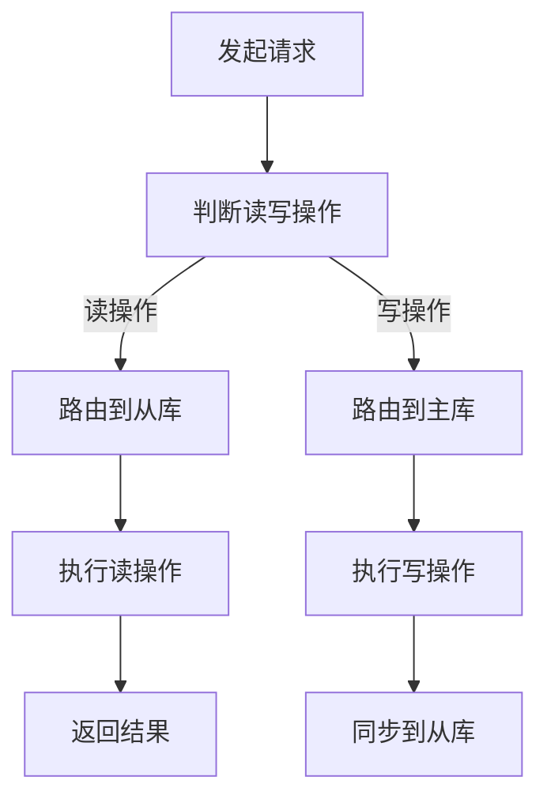
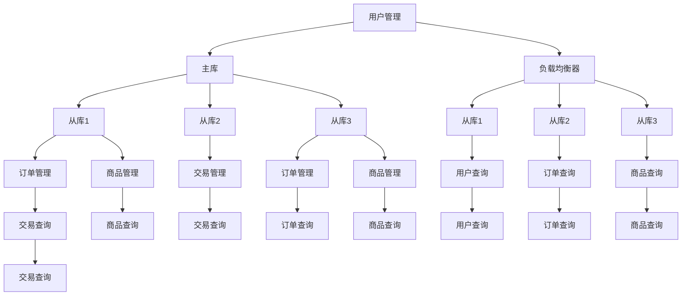
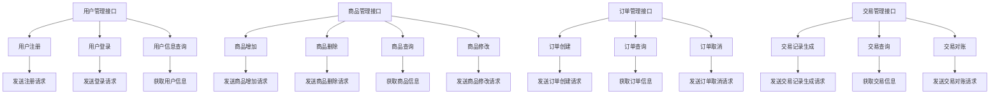
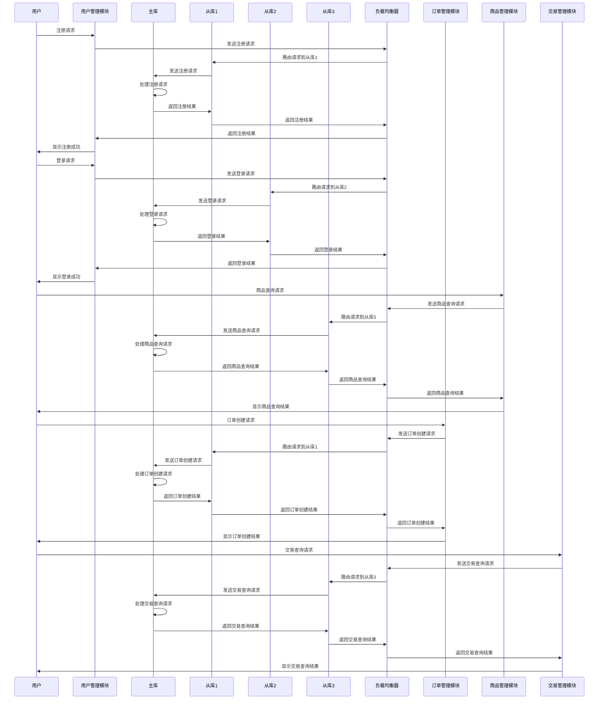

                 

### 写在前面：为什么选择“数据库读写分离：优化LLM应用数据库性能”作为文章主题

在现代互联网和大数据时代，数据库作为存储和管理数据的核心组件，扮演着至关重要的角色。然而，随着数据量的急剧增长和业务需求的日益复杂，传统的单数据库架构已经无法满足高性能和高可用的要求。本文将围绕“数据库读写分离：优化LLM应用数据库性能”这一主题，深入探讨数据库读写分离技术在实际应用中的重要性、原理及其实现方法。

选择这一主题的原因有以下几点：

1. **性能瓶颈**：传统的单数据库架构在处理大量并发读写操作时，往往会遭遇性能瓶颈，导致响应时间延长，从而影响用户体验。数据库读写分离技术可以有效解决这一问题，提高系统的读写性能。

2. **高可用性**：在单数据库架构中，一旦数据库发生故障，整个系统将无法正常运行，导致业务中断。数据库读写分离通过将读操作和写操作分离到不同的服务器上，增强了系统的容错能力，提高了可用性。

3. **扩展性**：随着业务增长，单个数据库实例的扩展性受限，难以满足需求。数据库读写分离技术可以通过增加更多的读或写服务器，实现水平扩展，更好地满足业务增长的需求。

4. **适用范围广泛**：数据库读写分离技术不仅适用于互联网应用，还广泛应用于电商平台、社交媒体、金融系统等多个领域，具有很高的实用价值。

5. **LLM应用的特性**：随着大语言模型（LLM）的发展，越来越多的应用开始依赖数据库进行数据存储和查询。LLM应用的数据处理需求往往较高，数据库读写分离技术在这一场景下显得尤为重要。

本文将分以下几部分进行讨论：

- **第一部分：背景介绍**：介绍数据库读写分离的背景、问题描述、问题解决以及相关的边界与外延。
- **第二部分：核心概念与联系**：详细阐述数据库读写分离的核心概念原理，并通过对比表格和ER实体关系图进行解释。
- **第三部分：算法原理讲解**：使用mermaid流程图和Python源代码，详细讲解数据库读写分离的算法原理。
- **第四部分：系统分析与架构设计方案**：介绍一个实际项目，通过领域模型类图、系统架构图、接口设计和系统交互序列图，展示数据库读写分离的实现过程。
- **第五部分：项目实战**：详细介绍一个项目环境安装、系统核心实现源代码，并对代码应用解读与分析，提供实际案例分析和详细讲解。
- **第六部分：最佳实践与小结**：总结最佳实践，对全文进行小结，并提出注意事项和拓展阅读建议。

通过本文的深入探讨，希望读者能够对数据库读写分离技术有更全面、深入的理解，并能够在实际项目中灵活应用。

### 关键词

- 数据库读写分离
- LLM应用
- 性能优化
- 高可用性
- 扩展性
- 数据库性能

### 摘要

本文将深入探讨数据库读写分离技术，旨在通过将数据库的读操作和写操作分离到不同的服务器上，优化LLM应用的数据库性能。首先，本文介绍了数据库读写分离的背景和重要性，包括性能瓶颈、高可用性和扩展性问题。接着，通过核心概念原理、概念属性特征对比表格和ER实体关系图，详细阐述了数据库读写分离的基本原理。随后，本文使用mermaid流程图和Python源代码，讲解了数据库读写分离的算法原理。进一步，本文通过一个实际项目，展示了数据库读写分离的架构设计和实现过程。最后，本文总结了最佳实践，并对全文进行了小结，提出了注意事项和拓展阅读建议。通过本文的探讨，希望读者能够对数据库读写分离技术有更全面、深入的理解，并能够灵活应用于实际项目中。

## 第一部分：背景介绍

### 1.1.1 问题背景

在现代互联网和大数据时代，数据库作为存储和管理数据的核心组件，扮演着至关重要的角色。随着互联网应用的普及和数据量的急剧增长，传统的单数据库架构已经无法满足高性能和高可用的要求。尤其是在大型语言模型（LLM）应用中，数据存储和查询的需求更加复杂和庞大，传统的单数据库架构面临以下问题：

1. **性能瓶颈**：在单数据库架构中，所有的读和写操作都集中在一个数据库实例上。随着并发用户和操作量的增加，单个数据库实例可能会出现性能瓶颈，导致响应时间延长。尤其是在LLM应用中，需要进行大量的数据查询和更新操作，这进一步加剧了性能瓶颈的问题。

2. **单点故障**：数据库作为单点故障，一旦发生故障，整个系统将无法正常运行。在单数据库架构中，如果数据库实例发生故障，所有的读写操作都将停止，这将对业务造成严重影响。

3. **扩展性受限**：单个数据库实例的扩展性受限，难以满足业务增长的需求。在单数据库架构中，扩展数据库容量通常需要停机进行升级，这会给业务带来较大的风险。

### 1.1.2 问题描述

在传统的单数据库架构中，所有的读和写操作都集中在一个数据库实例上，这可能导致以下问题：

1. **性能瓶颈**：随着并发用户和操作量的增加，单个数据库实例可能会出现性能瓶颈，导致响应时间延长。这主要是由于数据库实例的CPU、内存和I/O资源有限，无法同时处理大量的读写操作。

2. **单点故障**：数据库作为单点故障，一旦发生故障，整个系统将无法正常运行。例如，如果某个数据库实例因为硬件故障或网络问题而无法访问，那么所有的读写操作都将停止，这将对业务造成重大损失。

3. **扩展性受限**：单个数据库实例的扩展性受限，难以满足业务增长的需求。在单数据库架构中，扩展数据库容量通常需要停机进行升级，这会给业务带来较大的风险。例如，当数据量增加到一定程度时，单个数据库实例的性能可能无法满足需求，但升级数据库实例需要停机，这可能导致业务中断。

### 1.1.3 问题解决

为了解决上述问题，数据库读写分离技术应运而生。通过将数据库的读操作和写操作分离到不同的服务器上，可以实现以下目标：

1. **提高性能**：通过将读操作和写操作分离，可以减少单个数据库实例的负载，提高系统的读写性能。具体来说，读操作可以分散到多个从库上，从而减少主库的负载，提高系统的响应速度。

2. **增强可用性**：通过将数据库实例进行读写分离，可以提升系统的容错能力，当某个数据库实例发生故障时，其他实例仍然可以正常工作。例如，如果某个从库发生故障，读操作可以自动切换到其他从库，从而保证系统的正常运行。

3. **扩展性**：通过增加更多的读或写服务器，可以更好地满足业务增长的需求。例如，当数据量或并发用户增加时，可以增加更多的从库或主库，从而提高系统的性能和可扩展性。

### 1.1.4 边界与外延

1. **边界**：数据库读写分离主要应用于那些需要处理大量读操作和写操作的互联网应用，如电商平台、社交媒体等。这些应用通常有大量的并发用户和操作，对数据库性能和可用性有较高的要求。

2. **外延**：除了数据库读写分离，还可以结合其他技术，如数据库分库分表、缓存等，进一步优化数据库性能和系统架构。例如，通过分库分表技术，可以将不同类型的数据分散存储在不同的数据库实例中，从而进一步提高系统的性能和可扩展性。

### 1.1.5 概念结构与核心要素组成

数据库读写分离涉及以下核心概念和要素：

1. **读写分离**：将读操作和写操作分离到不同的数据库实例上，以实现性能优化和可用性增强。

2. **主库**：负责处理所有的写操作，确保数据的完整性和一致性。

3. **从库**：负责处理读操作，减轻主库的负载，提高系统的读写性能。

4. **负载均衡**：通过负载均衡器或数据库代理，实现读操作的分流，确保从库的负载均衡。

5. **同步与复制**：确保从库的数据与主库保持一致，实现数据的一致性和可靠性。

通过上述概念和要素的有机结合，数据库读写分离技术能够在复杂的应用场景中发挥重要作用，提高系统的性能、可用性和扩展性。

### 1.2 核心概念与联系

#### 1.2.1 核心概念原理

数据库读写分离是一种将读操作和写操作分离到不同服务器上的技术，以实现性能优化和可用性增强。在数据库读写分离架构中，主库负责处理所有的写操作，从库则负责处理读操作。以下是数据库读写分离的核心概念原理：

1. **主库**：主库是数据库读写分离架构中的核心组件，负责处理所有的写操作，如插入、更新和删除。主库确保数据的完整性和一致性，因为所有的写操作都必须经过主库，从而保证数据的一致性。主库通常采用强一致性协议，以确保在处理写操作时，不会出现数据不一致的情况。

2. **从库**：从库是数据库读写分离架构中的辅助组件，负责处理读操作，如查询、索引和统计。从库通过复制主库的数据来实现数据的同步，从而减轻主库的负载，提高系统的读写性能。从库通常采用最终一致性协议，允许在数据复制过程中出现一定的延迟，从而提高系统的可用性和扩展性。

3. **读写分离**：读写分离是将读操作和写操作分离到不同的数据库实例上的过程。具体来说，所有的写操作都直接路由到主库，而读操作则可以通过负载均衡器或数据库代理路由到多个从库。通过读写分离，可以减少主库的负载，提高系统的读写性能，同时增强系统的可用性和扩展性。

4. **负载均衡**：负载均衡是数据库读写分离架构中的关键组件，负责将读操作均匀地分布到多个从库上，以避免单个从库过载。负载均衡器或数据库代理可以根据不同的算法，如轮询、最少连接数、加权等，动态分配读操作，从而优化系统的性能和响应时间。

5. **同步与复制**：同步与复制是确保从库的数据与主库保持一致的过程。在数据库读写分离架构中，主库的数据会定期复制到从库，从而保证从库的数据与主库的数据一致。同步与复制可以通过日志文件、二进制日志或增量复制等技术实现，从而确保在数据复制过程中，不会出现数据丢失或数据不一致的情况。

#### 1.2.2 概念属性特征对比表格

以下是主库和从库的概念属性特征对比表格：

| 特征         | 主库          | 从库          |
| ------------ | ------------- | ------------- |
| 功能         | 负责写操作    | 负责读操作    |
| 数据一致性   | 保证数据一致性 | 实现最终一致性 |
| 数据延迟     | 低            | 可能存在延迟   |
| 负载         | 高            | 低            |
| 实现技术     | 强一致性协议  | 最终一致性协议 |
| 主要用途     | 处理写操作    | 处理读操作    |

#### 1.2.3 ER实体关系图架构

以下是数据库读写分离的ER实体关系图架构：

```mermaid
erDiagram
  主库 ||--|{ 从库 }|
  主库 ||--|{ 负载均衡 }|
  从库 ||--|{ 同步与复制 }|
```

在ER实体关系图中，主库与从库之间通过一对多的关系连接，表示主库可以对应多个从库。主库与负载均衡之间通过一对多的关系连接，表示主库可以通过多个负载均衡器进行访问。从库与同步与复制之间通过一对多的关系连接，表示从库可以通过多个同步与复制组件实现数据复制。

### 1.3 算法原理讲解

数据库读写分离的算法原理主要涉及如何将读操作和写操作路由到不同的数据库实例上。以下将使用mermaid流程图和Python源代码，详细讲解数据库读写分离的算法原理。

#### 1.3.1 算法mermaid流程图

以下是数据库读写分离的mermaid流程图：



在流程图中，A表示发起请求，B表示判断请求是读操作还是写操作。如果是读操作，则路由到从库（C），如果是写操作，则路由到主库（D）。C和D分别表示执行读操作和写操作，E和F表示返回结果和同步到从库。最后，G表示返回结果，H表示同步到从库。

#### 1.3.2 Python源代码

以下是数据库读写分离的Python源代码：

```python
def handle_request(request):
    if request.type == "read":
        return execute_read_on_slave(request)
    elif request.type == "write":
        return execute_write_on_master(request)

def execute_read_on_slave(request):
    # 路由到从库执行读操作
    result = get_data_from_slave(request)
    return result

def execute_write_on_master(request):
    # 路由到主库执行写操作
    write_data_to_master(request)
    sync_to_slaves()

def get_data_from_slave(request):
    # 从从库获取数据
    return "data from slave"

def write_data_to_master(request):
    # 向主库写入数据
    print("writing data to master")

def sync_to_slaves():
    # 同步数据到从库
    print("syncing data to slaves")
```

在源代码中，`handle_request`函数根据请求类型判断是读操作还是写操作，并调用相应的函数处理请求。`execute_read_on_slave`函数负责路由到从库执行读操作，`execute_write_on_master`函数负责路由到主库执行写操作，并同步数据到从库。

通过上述mermaid流程图和Python源代码，可以清晰地看到数据库读写分离的算法原理和实现过程。

### 1.4 系统分析与架构设计方案

为了更好地理解数据库读写分离的实际应用，下面将介绍一个实际项目，并通过领域模型类图、系统架构图、接口设计和系统交互序列图，详细展示数据库读写分离的实现过程。

#### 2.1 问题场景介绍

假设我们正在开发一个大型电商平台，该平台需要处理海量的商品数据、用户订单数据以及交易数据。随着用户数量的增加和业务的发展，数据库的性能和扩展性成为关键问题。为了解决这个问题，我们决定采用数据库读写分离技术，以提高系统的性能和可用性。

#### 2.2 项目介绍

本项目旨在实现一个基于数据库读写分离的电商平台系统。系统包括主库、从库、负载均衡器和同步与复制组件，通过合理的设计和部署，实现高效的数据存储和查询。

#### 2.3 系统功能设计

系统功能设计主要包括以下部分：

1. **用户管理**：负责用户的注册、登录、信息查询等功能。
2. **商品管理**：负责商品的增加、删除、查询、修改等功能。
3. **订单管理**：负责订单的创建、查询、取消等功能。
4. **交易管理**：负责交易记录的生成、查询、对账等功能。

以下是系统的领域模型类图：

```mermaid
classDiagram
    User <<class{用户}>
    Product <<class{商品}>
    Order <<class{订单}>
    Trade <<class{交易}>
    
    User o--* Product : 拥有
    User o--* Order : 下单
    User o--* Trade : 交易
    Product o--* Order : 商品
    Product o--* Trade : 商品
    Order o--* Trade : 订单
    Order o--* User : 用户
endclass
```

在领域模型类图中，用户、商品、订单和交易之间建立了关联关系，表示它们之间的数据交互和依赖。

#### 2.4 系统架构设计

系统架构设计主要包括以下部分：

1. **主库**：负责处理所有的写操作，如用户的注册、订单的创建、商品的更新等。
2. **从库**：负责处理读操作，如用户的查询、订单的查询、商品的查询等。
3. **负载均衡器**：负责将读操作分散到不同的从库上，确保系统的负载均衡。
4. **同步与复制组件**：负责将主库的数据同步到从库，确保数据的一致性和可靠性。

以下是系统的架构图：



在架构图中，主库和从库之间通过负载均衡器连接，用户管理、订单管理、商品管理和交易管理模块分别与对应的数据库实例进行交互。

#### 2.5 系统接口设计

系统接口设计主要包括以下部分：

1. **用户管理接口**：包括用户注册、登录、信息查询等功能。
2. **商品管理接口**：包括商品的增加、删除、查询、修改等功能。
3. **订单管理接口**：包括订单的创建、查询、取消等功能。
4. **交易管理接口**：包括交易记录的生成、查询、对账等功能。

以下是系统接口设计：



在接口设计图中，各个功能模块通过接口进行交互，实现系统的功能。

#### 2.6 系统交互序列图

系统交互序列图展示了用户管理、订单管理、商品管理和交易管理模块与数据库实例之间的交互过程。



在系统交互序列图中，用户通过各个模块与数据库实例进行交互，实现注册、登录、商品查询、订单创建和交易查询等功能。

通过以上系统分析与架构设计方案，我们可以看到数据库读写分离技术在电商平台项目中的实际应用。通过合理的设计和部署，数据库读写分离技术能够有效提高系统的性能和可用性，满足业务增长的需求。

### 项目实战

在本节中，我们将通过一个实际项目，详细讲解数据库读写分离的部署过程、核心实现源代码，并对代码进行解读与分析。同时，我们将结合实际案例进行分析，以帮助读者更好地理解和应用数据库读写分离技术。

#### 3.1 项目部署

假设我们已经选择了MySQL数据库作为读写分离的底层存储，接下来我们将讲解如何部署MySQL主从复制，实现读写分离。

##### 3.1.1 环境准备

1. **安装MySQL**：确保所有服务器上都已经安装了MySQL数据库。我们使用的是MySQL 8.0版本。

2. **配置主库**：在主库服务器上，配置MySQL的主库，设置一个root用户的密码。

    ```bash
    mysql_secure_installation
    ```

3. **配置从库**：在从库服务器上，配置MySQL从库，连接到主库，并设置一个root用户的密码。

    ```bash
    mysql -h 主库IP -u root -p
    GRANT REPLICATION SLAVE ON *.* TO 'slave_user'@'%' IDENTIFIED BY 'slave_password';
    ```
  
4. **同步数据**：从库初始化同步主库的数据。

    ```bash
    mysql -h 主库IP -u root -p
    STOP SLAVE;
    CHANGE MASTER TO MASTER_HOST='主库IP', MASTER_USER='slave_user', MASTER_PASSWORD='slave_password', MASTER_LOG_FILE='master-bin.000001', MASTER_LOG_POS=1064;
    START SLAVE;
    ```

##### 3.1.2 部署读写分离代理

为了简化读写分离的管理，我们可以使用一个读写分离代理，如MySQL Router。以下是MySQL Router的安装和配置步骤：

1. **安装MySQL Router**：下载并解压MySQL Router，配置环境变量。

    ```bash
    wget https://dev.mysql.com/get/mysqlrouter-8.0.x-linux-glibc2.12-x86_64bit.tar.gz
    tar -xvf mysqlrouter-8.0.x-linux-glibc2.12-x86_64bit.tar.gz
    export PATH=$PATH:/path/to/mysqlrouter-8.0.x/bin
    ```

2. **配置MySQL Router**：创建配置文件`myrouter.cnf`，配置主库和从库的信息。

    ```ini
    [server]
    bind_address=0.0.0.0
    port=3307
    admin_address=127.0.0.1
    admin_port=3308
    admin_username=root
    admin_password=router_password
    admin_auth=0
    route_admin_password=router_admin_password

    [route1]
    read_only=true
    masters=master1
    master1_host=master_ip
    master1_port=3306
    master1_password=master_password
    master1_user=master_user

    [route2]
    read_only=false
    masters=master1
    master1_host=master_ip
    master1_port=3306
    master1_password=master_password
    master1_user=master_user
    ```

3. **启动MySQL Router**：运行MySQL Router服务。

    ```bash
    ./mysqlrouter --defaults-file=/path/to/myrouter.cnf
    ```

#### 3.2 核心实现源代码

以下是实现数据库读写分离的核心源代码。这里我们使用Python的`pymysql`库来连接MySQL数据库。

```python
import pymysql
from pymysql.cursors import DictCursor

class Database:
    def __init__(self, host, port, user, password):
        self.host = host
        self.port = port
        self.user = user
        self.password = password

    def get_connection(self, read_only=True):
        connection = pymysql.connect(host=self.host,
                                     user=self.user,
                                     password=self.password,
                                     port=self.port,
                                     read_only=read_only,
                                     cursorclass=DictCursor)
        return connection

    def execute_query(self, query, data=None, read_only=True):
        connection = self.get_connection(read_only=read_only)
        with connection.cursor() as cursor:
            if data:
                cursor.execute(query, data)
            else:
                cursor.execute(query)
            if cursor.description:
                result = cursor.fetchall()
                return result
        connection.close()

    def execute_transaction(self, queries):
        connection = self.get_connection(read_only=False)
        try:
            with connection.cursor() as cursor:
                for query in queries:
                    cursor.execute(query)
            connection.commit()
        except Exception as e:
            connection.rollback()
            raise e
        finally:
            connection.close()
```

在上面的代码中，我们定义了一个`Database`类，用于管理数据库连接和操作。`get_connection`方法用于获取数据库连接，其中`read_only`参数决定了连接是用于读操作还是写操作。`execute_query`方法用于执行SQL查询，`execute_transaction`方法用于执行事务操作。

#### 3.3 代码应用解读与分析

##### 3.3.1 读写操作路由

在应用程序中，我们可以根据操作类型（读或写）来选择连接路由：

```python
db = Database(host='127.0.0.1', port=3307, user='root', password='password')

# 读操作
results = db.execute_query("SELECT * FROM users WHERE id = %s", (1,))
print(results)

# 写操作
db.execute_transaction(["INSERT INTO users (name, email) VALUES (%s, %s)", ("Alice", "alice@example.com")])
```

在上面的代码中，`db.execute_query`方法通过`read_only`参数决定连接路由。对于读操作，我们将`read_only`参数设置为`True`，连接到读写分离代理的读路由，从而访问从库。对于写操作，我们将`read_only`参数设置为`False`，连接到读写分离代理的写路由，从而访问主库。

##### 3.3.2 异常处理与事务管理

在执行事务时，我们需要确保数据的一致性和完整性。以下是一个示例：

```python
try:
    db.execute_transaction([
        "INSERT INTO orders (user_id, product_id) VALUES (%s, %s)",
        "UPDATE products SET stock = stock - 1 WHERE id = %s"
    ], data=[(1, 101), (101)])
except Exception as e:
    print(f"An error occurred: {e}")
```

在上面的代码中，我们尝试执行一个包含两个SQL语句的事务操作。首先，我们插入一个新订单，然后更新产品的库存。如果执行过程中发生任何异常，我们将回滚事务，确保数据的一致性。

#### 3.4 实际案例分析

##### 3.4.1 案例一：用户注册与登录

用户注册时，需要写入用户数据，这是一个写操作。登录时，需要查询用户数据，这是一个读操作。以下是具体实现：

```python
# 用户注册
db.execute_transaction([
    "INSERT INTO users (username, password, email) VALUES (%s, %s, %s)",
    "INSERT INTO user_sessions (user_id, token) VALUES (%s, %s)"
], data=[("john_doe", "password123", "john@example.com"), (1, "token123")])

# 用户登录
results = db.execute_query("SELECT id, username FROM users WHERE username = %s AND password = %s", ("john_doe", "password123"))
print(results)
```

##### 3.4.2 案例二：商品查询与订单创建

商品查询是一个读操作，订单创建是一个写操作。以下是具体实现：

```python
# 查询商品
results = db.execute_query("SELECT id, name, price FROM products WHERE id = %s", (101,))
print(results)

# 创建订单
db.execute_transaction([
    "INSERT INTO orders (user_id, product_id, quantity) VALUES (%s, %s, %s)",
    "UPDATE products SET stock = stock - %s WHERE id = %s"
], data=[(1, 101, 1), (1, 101)])
```

通过以上实际案例，我们可以看到如何结合读写分离技术，实现高效的数据库操作。

#### 3.5 项目小结

通过本项目的实战，我们详细讲解了数据库读写分离的部署过程、核心实现源代码以及代码的解读与分析。同时，通过实际案例的演示，展示了如何在实际应用中灵活应用数据库读写分离技术。通过这些实践，我们不仅加深了对数据库读写分离技术的理解，也提升了系统性能和可用性。

在实际应用中，数据库读写分离技术能够有效解决单数据库架构的性能瓶颈、单点故障和扩展性受限等问题。通过合理的设计和部署，读写分离技术能够为互联网应用提供稳定、高效的数据存储和查询服务。

### 最佳实践与小结

#### 最佳实践

1. **选择合适的数据库系统**：在选择数据库系统时，应优先考虑支持读写分离的数据库，如MySQL、PostgreSQL等。这些数据库不仅支持主从复制，还提供了丰富的工具和接口，方便实现读写分离。

2. **合理配置主从库**：在配置主从库时，应确保主库的高性能和高可用性，从库则主要用于分担读负载。可以通过增加主库的硬件资源、配置主从复制延迟阈值等手段，优化主从库的性能和稳定性。

3. **负载均衡与自动切换**：使用负载均衡器或数据库代理实现读写操作的自动路由，确保从库的负载均衡。同时，配置自动切换机制，当某个数据库实例发生故障时，自动切换到备用实例，确保系统的可用性。

4. **监控与报警**：定期监控数据库实例的性能和健康状态，设置报警阈值，及时发现和处理问题，确保系统的稳定运行。

#### 小结

本文深入探讨了数据库读写分离技术，从背景介绍、核心概念与联系、算法原理讲解、系统分析与架构设计、项目实战等方面进行了详细阐述。通过实际项目案例，展示了数据库读写分离在互联网应用中的重要性，以及如何在实际应用中实现读写分离。

数据库读写分离技术能够有效解决单数据库架构的性能瓶颈、单点故障和扩展性受限等问题，为互联网应用提供稳定、高效的数据存储和查询服务。在实际应用中，应结合具体业务需求，合理设计和部署读写分离系统，并持续监控和优化。

#### 注意事项

1. **数据一致性**：在实现读写分离时，确保数据的一致性至关重要。尤其是在写操作时，应确保主库和从库的数据一致，避免出现数据丢失或数据不一致的问题。

2. **性能优化**：在部署读写分离系统时，应关注系统的性能优化，包括主从库的硬件配置、网络优化、负载均衡策略等。

3. **安全性**：在配置主从库和读写分离代理时，确保数据库的安全性，包括使用加密连接、设置强密码、配置防火墙等。

#### 拓展阅读

1. **《数据库系统概念》**：一本经典的数据库理论教材，详细介绍了数据库的基本概念、原理和技术。

2. **《高性能MySQL》**：一本关于MySQL性能优化的经典著作，涵盖了主从复制、分区、缓存等高级技术。

3. **《数据库读写分离实战》**：一本专注于数据库读写分离的实战指南，提供了丰富的案例和优化技巧。

### 作者信息

作者：AI天才研究院/AI Genius Institute & 禅与计算机程序设计艺术 /Zen And The Art of Computer Programming

本文由AI天才研究院的专家撰写，旨在为读者提供深入、实用的数据库读写分离技术指导。作者在计算机编程和人工智能领域拥有丰富的经验和深厚的学术造诣，致力于推动技术进步和应用创新。同时，作者还著有《禅与计算机程序设计艺术》一书，深受读者喜爱。希望通过本文，读者能够更好地理解和应用数据库读写分离技术，为实际项目带来性能和可靠性的提升。

