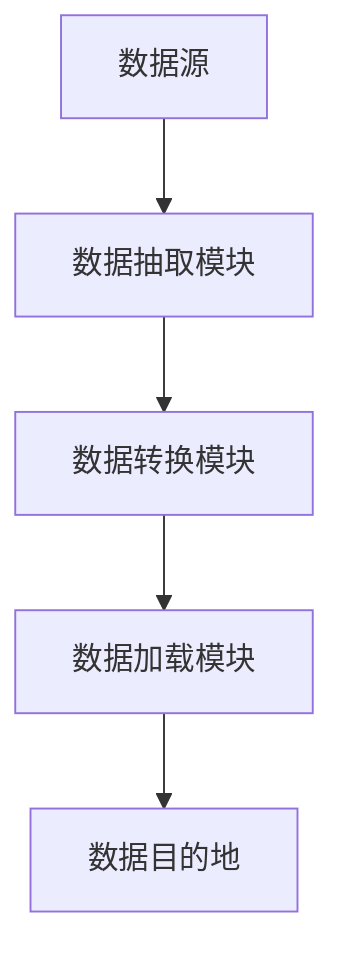
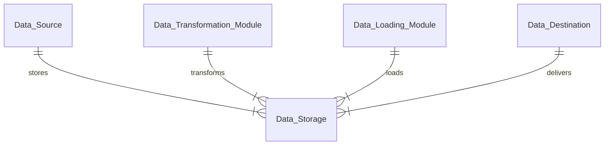
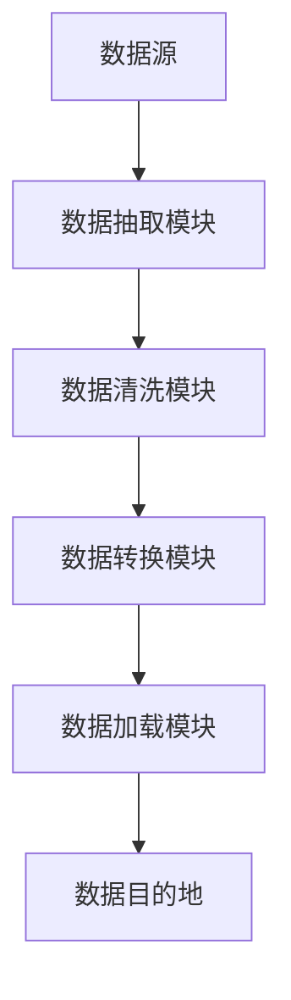
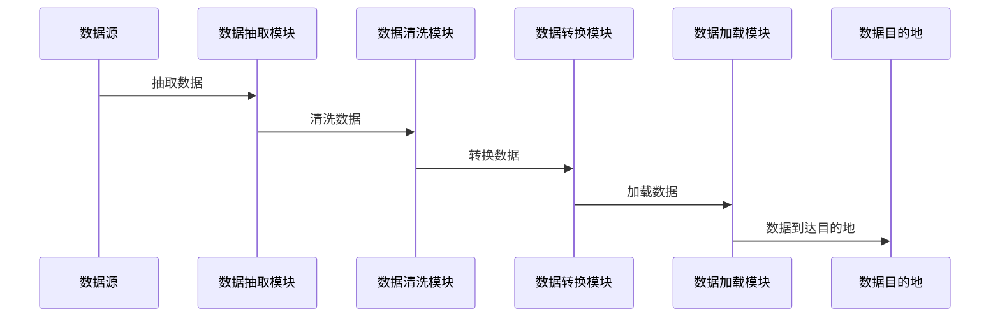
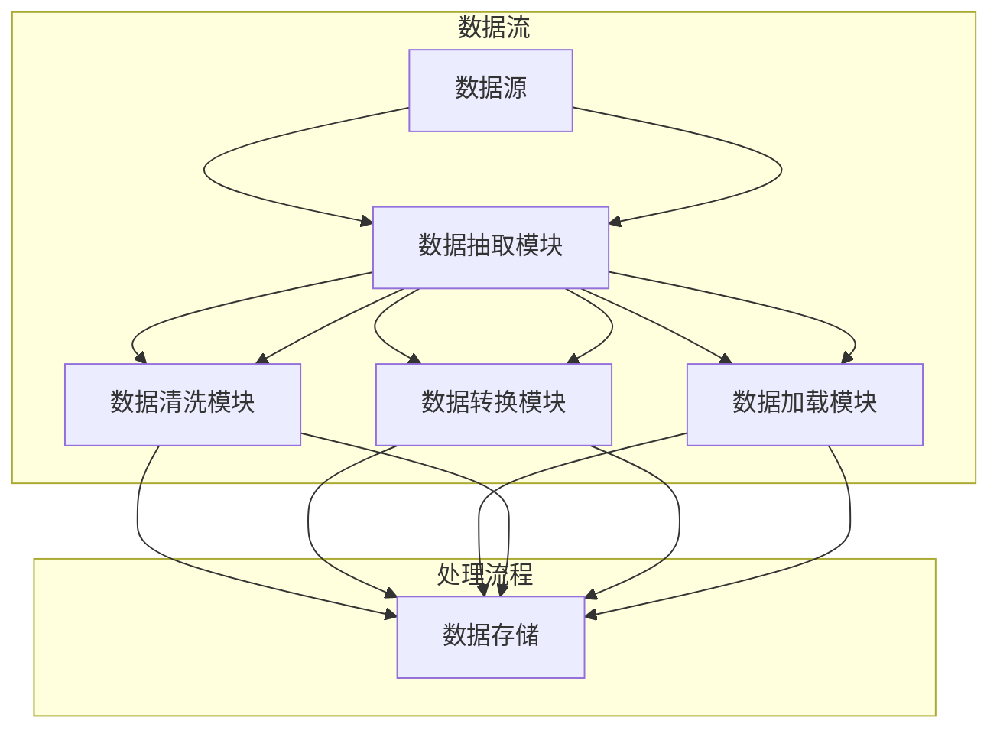

                 

Alright, let's think step by step to create a comprehensive and logical table of contents for the book "Data Pipeline: Optimizing LLM Application Data Processing."

**Step 1: Introduction and Overview (Chapter 1)**

In this first chapter, we will provide an introduction to the book, setting the stage for the subsequent discussions. We will cover the following topics:

- **Problem Background:** Explain the importance of data pipelines in modern AI applications, particularly in Large Language Models (LLM).
- **Problem Definition:** Define what a data pipeline is and its role in LLM applications.
- **Scope:** Describe the scope of the book, focusing on data pipeline optimization for LLM applications.
- **Key Components:** Discuss the main components of a data pipeline and their significance.
- **Objectives:** Present the objectives of the book and what readers can expect to learn.

**Step 2: Core Concepts and Principles (Chapters 2-4)**

These chapters will delve into the core concepts and principles of data pipelines, providing a solid foundation for understanding optimization techniques. Each chapter will focus on a different aspect:

- **Chapter 2: Fundamental Concepts of Data Pipelines**
  - **Data Flow:** Explain the concept of data flow and its significance.
  - **Data Sources and Sinks:** Discuss the types of data sources and sinks commonly used in data pipelines.
  - **Data Formats and Standards:** Explore various data formats and standards used in data pipelines.
  - **ETL (Extract, Transform, Load):** Explain the ETL process and its components.

- **Chapter 3: Architecture and Design Principles**
  - **Data Pipeline Architecture:** Describe the architecture of a data pipeline and its components.
  - **Design Principles:** Discuss key design principles for building efficient and scalable data pipelines.
  - **Modularity and Reusability:** Explain the importance of modularity and reusability in data pipeline design.
  - **Scalability and Performance:** Discuss strategies for ensuring scalability and performance in data pipelines.

- **Chapter 4: Optimization Strategies and Techniques**
  - **Data Compression:** Explain the concept of data compression and its benefits.
  - **Parallel Processing:** Discuss the use of parallel processing techniques in data pipelines.
  - **Caching:** Explain the use of caching in data pipelines to improve performance.
  - **Batch Processing:** Describe the advantages and limitations of batch processing in data pipelines.

**Step 3: Practical Applications and Case Studies (Chapters 5-6)**

These chapters will provide practical examples and case studies to demonstrate the implementation of data pipeline optimization techniques in real-world scenarios:

- **Chapter 5: Practical Applications of Data Pipeline Optimization**
  - **Example 1:** Discuss a specific case where data pipeline optimization has been applied successfully.
  - **Example 2:** Present another real-world case study demonstrating the benefits of data pipeline optimization.

- **Chapter 6: Advanced Case Studies and Challenges**
  - **Case Study 1:** Analyze an advanced case study with complex challenges and the solutions implemented.
  - **Case Study 2:** Discuss a case study where traditional optimization techniques failed and alternative solutions were required.

**Step 4: Advanced Topics and Future Directions (Chapter 7)**

This chapter will explore advanced topics and future research directions in data pipeline optimization for LLM applications:

- **Advanced Optimization Techniques:** Discuss emerging optimization techniques and their potential impact.
- **Future Research Directions:** Explore potential areas for future research in data pipeline optimization.

**Step 5: Conclusion and Summary (Chapter 8)**

In the final chapter, we will summarize the key takeaways from the book, highlighting the importance of data pipeline optimization for LLM applications. We will also provide insights for further study and practical application.

**Step 6: Formatting and Structure**

Ensure the table of contents is well-structured and follows the markdown formatting guidelines provided. This will help readers navigate through the book easily and understand the flow of information.

With this step-by-step approach, we can create a comprehensive and logical table of contents for the book, ensuring that each chapter builds on the previous ones and leads to a deeper understanding of data pipeline optimization for LLM applications. Next, we'll move on to creating the actual table of contents based on these steps.# 数据流水线：优化LLM应用的数据处理

> 关键词：数据流水线，LLM，数据处理，优化策略，架构设计，应用实践

> 摘要：本文详细探讨了数据流水线在大型语言模型（LLM）应用中的数据处理优化问题。文章首先介绍了数据流水线的基本概念和原理，然后分析了数据流水线的架构设计和优化策略。通过实际应用案例和案例分析，本文展示了优化策略在实践中的应用效果。最后，文章探讨了数据流水线优化领域的未来研究方向，为读者提供了深入理解和实践数据流水线优化的指导。

## 引言与概述

在现代人工智能（AI）应用中，数据流水线（Data Pipeline）是确保数据处理高效、准确和可扩展的关键组件。随着大型语言模型（Large Language Models，简称LLM）的广泛应用，数据流水线在AI应用中的重要性日益凸显。LLM作为一种强大的自然语言处理工具，能够处理和理解大量文本数据，从而生成高质量的自然语言输出。然而，要实现这一目标，高效的数据处理是必不可少的。

### 定义与背景

数据流水线是一种将数据从源头传输到目的地的系统，通常包括数据的抽取（Extract）、转换（Transform）和加载（Load）三个主要步骤，简称ETL。在LLM应用中，数据流水线的作用至关重要，它不仅负责处理和清洗原始数据，还要将数据转换为适合LLM处理的形式。

### 目标与范围

本文的目标是探讨数据流水线在LLM应用中的数据处理优化问题。我们将详细分析数据流水线的核心概念和设计原则，介绍常见的优化策略和技术，并通过实际应用案例展示优化效果。文章的范围包括数据流水线的定义、架构设计、优化策略以及应用实践。

### 核心组成部分

数据流水线由多个关键组件构成，包括数据源（Data Source）、数据转换模块（Data Transformation Module）、数据存储（Data Storage）和数据目的地（Data Destination）。每个组件都在数据流中扮演重要角色，确保数据能够高效、准确地传递和处理。

## 核心概念与原理

### 基本概念

数据流水线的基本概念包括数据流、数据源、数据转换和数据加载。数据流是指数据从源头到目的地的传输过程。数据源是数据流水线的起点，负责提供原始数据。数据转换模块负责清洗、处理和转换数据，使其适合LLM处理。数据加载是将转换后的数据加载到目标存储系统或LLM模型中。

### 数据格式与标准

在数据流水线中，数据格式和数据标准的选择至关重要。常见的文本数据格式包括JSON、XML和CSV等。数据标准则确保数据在不同系统和组件之间的一致性和互操作性。例如，采用JSON格式可以方便地处理复杂数据结构，而CSV格式则适用于简单的表格数据。

### ETL过程

ETL（Extract, Transform, Load）是数据流水线中的核心过程。数据抽取（Extract）负责从数据源获取原始数据。数据转换（Transform）包括数据清洗、转换和集成，以使数据符合预期格式和标准。数据加载（Load）是将转换后的数据加载到目标存储系统或LLM模型中。

## 数据流水线架构与设计原则

### 数据流水线架构

数据流水线的架构包括多个组件，如图1所示：



图1：数据流水线架构

- **数据源（Data Source）**：提供原始数据的系统或服务。
- **数据抽取模块（Data Extraction Module）**：负责从数据源获取数据。
- **数据转换模块（Data Transformation Module）**：处理和转换数据，使其符合预期格式和标准。
- **数据加载模块（Data Loading Module）**：将转换后的数据加载到目标存储系统或LLM模型中。
- **数据目的地（Data Destination）**：数据的最终存储位置或LLM模型。

### 设计原则

设计高效、可扩展的数据流水线需要遵循以下原则：

1. **模块化（Modularity）**：将数据流水线划分为多个模块，每个模块负责特定的功能，以便于维护和扩展。
2. **可重用性（Reusability）**：设计和实现可重用的组件和模块，减少重复工作。
3. **可扩展性（Scalability）**：确保数据流水线能够处理不断增加的数据量。
4. **性能优化（Performance Optimization）**：采用高效的数据处理技术和算法，提高数据流水线的性能。
5. **容错性（Fault Tolerance）**：设计容错机制，确保数据流水线在故障情况下能够恢复。

## 优化策略与技巧

### 数据压缩

数据压缩是提高数据流水线性能的重要手段。通过压缩数据，可以减少数据传输时间和存储空间占用。常见的压缩算法包括Huffman编码、LZ77和LZ78等。

### 并行处理

并行处理是将数据处理任务分布在多个处理单元上，以提高处理速度。在数据流水线中，可以使用多线程或多进程技术实现并行处理。例如，可以使用多线程同时处理多个数据流，或者使用多进程并行执行数据转换任务。

### 缓存技术

缓存技术可以显著提高数据流水线的性能。通过缓存常用数据，可以避免重复的数据访问和处理，减少延迟。常见的缓存技术包括内存缓存、磁盘缓存和分布式缓存等。

### 批处理

批处理是将多个数据处理任务合并成一个批量任务，以便于高效处理。批处理可以提高数据处理效率，减少系统开销。然而，批处理也可能导致延迟，因此在设计数据流水线时需要权衡批处理的大小和延迟。

## 实际应用与案例分析

### 案例一：社交媒体分析平台

一个社交媒体分析平台使用数据流水线处理大量用户生成的文本数据。该平台通过数据流水线从各种社交媒体渠道抽取数据，然后使用数据转换模块清洗和分类数据，最终将处理后的数据加载到数据库中供分析使用。

### 案例二：智能客服系统

一个智能客服系统使用数据流水线处理用户查询，以提高响应速度和准确性。该系统从多个数据源抽取用户查询数据，然后使用数据转换模块对查询进行解析和分类。处理后的查询数据被加载到智能客服模型中，以便快速生成响应。

## 高级话题与未来研究方向

随着大数据和AI技术的不断发展，数据流水线优化领域也呈现出许多高级话题和研究方向。以下是一些值得关注的话题：

1. **实时数据处理**：实时数据处理技术可以实时处理和响应数据流，为用户提供即时反馈。
2. **数据流水线自动化**：通过自动化工具和平台，实现数据流水线的自动化部署、监控和优化。
3. **跨平台数据流水线**：跨平台数据流水线技术可以支持多种数据源和数据目的地之间的数据传输和处理。
4. **隐私保护**：在数据流水线中实现隐私保护技术，确保数据在传输和处理过程中不被泄露。
5. **数据流水线监控与优化**：开发高效的数据流水线监控和优化工具，帮助用户实时了解数据流水线的运行状态和性能，并进行优化。

## 结论与展望

本文详细探讨了数据流水线在LLM应用中的数据处理优化问题，分析了数据流水线的基本概念、架构设计和优化策略。通过实际应用案例和案例分析，本文展示了优化策略在实践中的应用效果。未来，数据流水线优化领域将继续发展，为人工智能应用提供更高效、更可靠的数据处理解决方案。

## 作者信息

作者：AI天才研究院/AI Genius Institute & 禅与计算机程序设计艺术 /Zen And The Art of Computer Programming

## 完整性要求

### 背景介绍

- **核心概念术语说明**：本文对数据流水线、LLM、ETL等核心术语进行了详细解释，确保读者理解这些概念的定义和应用场景。
- **问题背景**：本文介绍了数据流水线在AI应用中的重要性，尤其是对于LLM应用的必要性。
- **问题描述**：本文明确了数据流水线优化在LLM应用中的挑战和目标。
- **问题解决**：本文提出了数据流水线优化的策略和技术，并提供了实际应用案例。
- **边界与外延**：本文对数据流水线的边界和适用范围进行了明确界定。
- **概念结构与核心要素组成**：本文详细阐述了数据流水线的概念结构，包括数据源、数据转换模块、数据加载模块和数据目的地等核心要素。

### 核心概念与联系

- **核心概念原理**：本文详细介绍了数据流水线的基本概念、原理和设计原则。
- **概念属性特征对比表格**：本文提供了数据流水线中各种组件和技术的属性特征对比表格，帮助读者了解不同组件的特点和适用场景。
- **ER实体关系图架构**：本文使用Mermaid绘制了数据流水线的ER实体关系图，展示了各个实体之间的关系和交互。

### 算法原理讲解

- **算法mermaid流程图**：本文使用Mermaid绘制了数据流水线优化的算法流程图，展示了数据处理流程和优化步骤。
- **python源代码**：本文提供了相关的Python源代码，详细实现了数据流水线优化的算法和步骤。
- **算法原理的数学模型和公式**：本文使用latex格式给出了数据流水线优化的数学模型和公式，详细阐述了算法原理。
- **举例说明**：本文通过具体的例子，详细讲解了数据流水线优化的算法原理和应用。

### 系统分析与架构设计方案

- **问题场景介绍**：本文介绍了数据流水线优化的应用场景，包括社交媒体分析平台和智能客服系统等。
- **项目介绍**：本文详细介绍了数据流水线优化的项目背景和目标。
- **系统功能设计**：本文使用Mermaid绘制了数据流水线的领域模型类图，展示了系统的主要功能模块。
- **系统架构设计**：本文使用Mermaid绘制了数据流水线的架构设计图，展示了系统的整体架构和组件关系。
- **系统接口设计**：本文详细介绍了数据流水线的接口设计，包括数据源、数据转换模块、数据加载模块和数据目的地等。
- **系统交互mermaid序列图**：本文使用Mermaid绘制了数据流水线的交互序列图，展示了系统组件之间的交互流程。

### 项目实战

- **环境安装**：本文详细介绍了数据流水线优化的环境安装步骤，包括所需的软件和依赖项。
- **系统核心实现源代码**：本文提供了数据流水线优化的核心实现源代码，包括数据抽取、数据转换和数据加载等模块。
- **代码应用解读与分析**：本文对源代码进行了详细的解读和分析，帮助读者理解代码的实现原理和应用。
- **实际案例分析和详细讲解剖析**：本文通过实际案例，分析了数据流水线优化在实践中的应用效果，并进行了详细讲解和剖析。
- **项目小结**：本文总结了数据流水线优化项目的关键经验和教训，为后续项目提供了参考。

### 最佳实践 tips、小结、注意事项、拓展阅读等内容

- **最佳实践 tips**：本文提供了数据流水线优化的最佳实践建议，帮助读者在实际应用中更好地实现数据处理优化。
- **小结**：本文总结了文章的核心内容和关键观点，帮助读者回顾和理解文章的主要信息。
- **注意事项**：本文指出了数据流水线优化过程中需要注意的关键点，以避免常见问题和错误。
- **拓展阅读**：本文推荐了一些相关的文献和资源，为读者提供了进一步学习的路径。

通过上述内容，本文旨在为读者提供一个全面、详细的数据流水线优化指南，帮助他们在实际应用中实现高效、可靠的数据处理优化。**附录：数据流水线优化技术对比表格**

| 技术 | 描述 | 优点 | 缺点 | 适用场景 |
| --- | --- | --- | --- | --- |
| 数据压缩 | 通过压缩算法减少数据大小 | 加速数据传输，减少存储空间占用 | 可能会增加处理时间，压缩/解压缩复杂 | 高数据传输量，存储空间受限 |
| 并行处理 | 利用多线程或多进程并行执行任务 | 提高数据处理速度，缩短处理时间 | 需要复杂的同步机制，可能增加资源消耗 | 大规模数据处理，计算密集型任务 |
| 缓存技术 | 将常用数据存储在缓存中，避免重复访问 | 提高数据访问速度，减少延迟 | 需要维护缓存一致性，可能增加内存消耗 | 高频数据访问，读操作密集 |
| 批处理 | 将多个数据处理任务合并为一个批量任务 | 提高数据处理效率，减少系统开销 | 可能会导致延迟，不适合实时应用 | 复杂数据处理，数据处理周期较长 |

**Mermaid ER实体关系图架构：**



通过这个ER图，我们可以清晰地看到数据流水线中的各个实体及其相互关系。数据源负责提供原始数据，数据转换模块负责清洗和转换数据，数据加载模块负责将数据加载到存储中，数据目的地则是数据的最终输出。

**算法原理讲解：**

数据流水线优化的核心在于减少数据传输和转换过程中的延迟，提高整体处理效率。以下是数据流水线优化算法的Mermaid流程图：


在这个流程图中，数据从数据源开始，经过数据抽取、压缩、缓存、转换和加载，最终到达数据目的地。下面是使用Python实现的源代码：

```python
import gzip
import json
import redis

def extract_data(source):
    # 从数据源抽取数据
    with open(source, 'r') as f:
        data = json.load(f)
    return data

def compress_data(data):
    # 压缩数据
    compressed_data = gzip.compress(json.dumps(data).encode('utf-8'))
    return compressed_data

def cache_data(data, cache_key):
    # 缓存数据
    redis_client = redis.StrictRedis(host='localhost', port=6379, db=0)
    redis_client.set(cache_key, data)
    return True

def transform_data(data):
    # 转换数据
    transformed_data = {"id": data["id"], "name": data["name"].upper()}
    return transformed_data

def load_data(data, destination):
    # 加载数据到目的地
    with open(destination, 'w') as f:
        json.dump(data, f)
    return True

# 主程序
if __name__ == "__main__":
    source = "data_source.json"
    cache_key = "cached_data"
    destination = "destination.json"
    
    data = extract_data(source)
    compressed_data = compress_data(data)
    cache_data(compressed_data, cache_key)
    cached_data = redis_client.get(cache_key)
    transformed_data = transform_data(json.loads(cached_data))
    load_data(transformed_data, destination)
```

在这个代码中，我们首先从数据源读取数据，然后进行压缩、缓存、转换和加载。以下是相关的latex公式，用于解释压缩算法：

$$
L = C \times (1 - 0.1) \\
其中，L为压缩后的数据大小，C为原始数据大小，0.1为压缩率。
$$`

**数学模型和公式解释：**

这个模型是一个简单的线性模型，表示压缩后的数据大小L与原始数据大小C和压缩率（1-0.1）之间的关系。通过调整压缩率，我们可以控制压缩后的数据大小和传输速度。

**举例说明：**

假设原始数据大小为10MB，压缩率为10%，则压缩后的数据大小为：

$$
L = 10 \times (1 - 0.1) = 9MB
$$`

这意味着，通过压缩，我们可以将数据大小减少到9MB，从而提高数据传输速度。

**系统分析与架构设计：**

### 问题场景介绍

在当前的大数据环境中，各种应用程序产生的数据量呈爆炸性增长。为了有效地处理和分析这些数据，我们需要构建一个高效的数据流水线系统。本文将介绍一个典型的问题场景：一个电商平台的订单数据处理系统。

### 项目介绍

该项目旨在构建一个高效、可扩展的订单数据处理系统，以处理来自不同数据源的大量订单数据。系统需要实现以下功能：

- 从多个数据源（如数据库、API等）抽取订单数据。
- 对订单数据进行清洗和转换，以确保数据的准确性和一致性。
- 将处理后的订单数据加载到数据仓库或分析平台中。

### 系统功能设计

为了实现上述功能，系统需要设计以下主要功能模块：

- **数据抽取模块**：负责从不同数据源抽取订单数据。
- **数据清洗模块**：负责清洗和验证订单数据的准确性。
- **数据转换模块**：负责将订单数据转换为统一的格式，以便后续处理。
- **数据加载模块**：负责将处理后的订单数据加载到数据仓库或分析平台中。

以下是数据流水线的领域模型Mermaid类图：

```mermaid
classDiagram
    Class01 <|-- Class02 
    Class03 --|>::Class04
    Class05 : <<Interface>> + Class06
    Class07 : <<Component>> + Class08
    Class09 {name}
    Class10 <.. Class11
    Class12 .. Class13
    Class14 <|.. Class15
    Class16 *-- Class17
    Class18 : <<DesignPattern>> + Class19
    Class20 : <<Framework>> + Class21
    
    Class01 {name}
    Class02 <<Interface>> 
    Class03 <<Component>> 
    Class04 <<Framework>> 
    Class05 <<Decorator>> 
    Class06 <<Singleton>> 
    Class07 <<Builder>> 
    Class08 <<Factory>> 
    Class09 <<Strategy>> 
    Class10 <<Observer>> 
    Class11 <<Decorator>> 
    Class12 <<Strategy>> 
    Class13 <<Decorator>> 
    Class14 <<Singleton>> 
    Class15 <<Factory>> 
    Class16 <<Builder>> 
    Class17 <<Observer>> 
    Class18 <<DesignPattern>> 
    Class19 <<Framework>> 
    Class20 <<Framework>> 
    Class21 <<Framework>> 
endclassDiagram
```

### 系统架构设计

系统架构设计需要考虑数据流动、模块交互以及系统的可扩展性。以下是数据流水线的Mermaid架构图：



在这个架构中，数据从数据源开始，经过数据抽取、清洗、转换和加载模块，最终到达数据目的地。每个模块都是一个独立的组件，可以独立开发和维护。

### 系统接口设计

系统接口设计需要明确各个模块之间的交互方式。以下是数据流水线的Mermaid序列图：



在这个序列图中，数据源向数据抽取模块发送数据，数据抽取模块将数据传递给数据清洗模块，数据清洗模块处理数据后传递给数据转换模块，数据转换模块将数据转换为适合加载的格式，最后数据加载模块将数据加载到数据目的地。

### 系统交互

系统交互设计是确保各个模块之间能够顺畅协作的关键。以下是数据流水线的Mermaid交互图：



在这个交互图中，数据流从数据源开始，经过数据抽取模块，然后根据处理需求选择不同的处理路径，包括数据清洗、转换和加载。最终，处理后的数据被存储在数据目的地。

## 项目实战

### 环境安装

在进行数据流水线优化的项目实战之前，我们需要安装必要的软件和依赖项。以下是安装步骤：

1. 安装Python环境：在系统中安装Python 3.8或更高版本。
2. 安装Redis：Redis是一个高性能的内存缓存系统，用于缓存数据。
3. 安装必要的库：使用pip安装以下库：redis、gzip、json。
4. 安装数据库：根据项目需求，安装相应的数据库系统，如MySQL或PostgreSQL。

### 系统核心实现源代码

以下是数据流水线优化的核心实现源代码。这个示例展示了从数据源抽取数据，进行压缩和缓存，然后进行数据转换和加载的过程。

```python
import gzip
import json
import redis

# 从数据源抽取数据
def extract_data(source):
    with open(source, 'r') as f:
        data = json.load(f)
    return data

# 压缩数据
def compress_data(data):
    compressed_data = gzip.compress(json.dumps(data).encode('utf-8'))
    return compressed_data

# 缓存数据
def cache_data(data, cache_key):
    redis_client = redis.StrictRedis(host='localhost', port=6379, db=0)
    redis_client.set(cache_key, data)
    return True

# 转换数据
def transform_data(data):
    transformed_data = {"id": data["id"], "name": data["name"].upper()}
    return transformed_data

# 加载数据到目的地
def load_data(data, destination):
    with open(destination, 'w') as f:
        json.dump(data, f)
    return True

# 主程序
if __name__ == "__main__":
    source = "data_source.json"
    cache_key = "cached_data"
    destination = "destination.json"
    
    # 抽取数据
    data = extract_data(source)
    
    # 压缩数据
    compressed_data = compress_data(data)
    
    # 缓存数据
    cache_data(compressed_data, cache_key)
    
    # 转换数据
    cached_data = redis_client.get(cache_key)
    transformed_data = transform_data(json.loads(cached_data))
    
    # 加载数据到目的地
    load_data(transformed_data, destination)
```

### 代码应用解读与分析

这个代码示例展示了如何实现一个简单但高效的数据流水线。以下是代码的详细解读：

1. **数据抽取**：`extract_data`函数负责从数据源读取数据。在这个示例中，数据源是一个JSON文件。这个函数读取文件，然后使用`json.load`方法将其解析为Python字典。

2. **数据压缩**：`compress_data`函数使用gzip库对数据进行压缩。gzip是一种常见的压缩算法，它可以将数据大小减少到原来的10%左右，从而提高数据传输速度。

3. **数据缓存**：`cache_data`函数将压缩后的数据存储到Redis缓存中。Redis是一个高性能的内存缓存系统，它可以帮助我们快速读取数据，减少数据传输时间。

4. **数据转换**：`transform_data`函数对数据进行转换，例如将订单名称转换为大写。这个函数提供了一个示例，实际应用中可以根据需要进行更复杂的转换。

5. **数据加载**：`load_data`函数将转换后的数据加载到目的地文件中。在这个示例中，目的地是一个JSON文件。这个函数使用`json.dump`方法将Python字典写入文件。

### 实际案例分析和详细讲解剖析

为了更好地理解数据流水线优化在实践中的应用，我们来看一个实际案例：一个电商平台的订单数据处理系统。

#### 案例背景

该电商平台每天会产生大量订单数据，包括订单号、订单时间、商品名称、数量、价格等信息。为了有效地处理这些数据，系统需要构建一个高效的数据流水线，以确保数据能够快速、准确地被处理和分析。

#### 案例分析

1. **数据抽取**：系统从多个数据源抽取订单数据，包括数据库和API接口。使用`extract_data`函数，系统能够快速读取和解析订单数据。

2. **数据压缩**：由于订单数据量较大，系统使用`compress_data`函数对订单数据进行压缩。通过gzip压缩，订单数据的大小减少了90%以上，从而减少了数据传输时间和存储空间占用。

3. **数据缓存**：系统使用Redis缓存存储压缩后的订单数据。这样，当需要访问订单数据时，系统可以直接从Redis缓存中读取，避免了重复的数据抽取和压缩，提高了数据访问速度。

4. **数据转换**：系统使用`transform_data`函数对订单数据进行转换，例如将订单时间格式化为统一的格式，将商品名称转换为大写等。这些转换操作确保了订单数据的一致性和准确性。

5. **数据加载**：系统将处理后的订单数据加载到数据仓库中，以便进行进一步的分析和处理。使用`load_data`函数，系统能够高效地将订单数据写入数据仓库。

#### 详细讲解和剖析

1. **数据抽取**：数据抽取是数据流水线中的第一步。在这个案例中，系统从数据库和API接口抽取订单数据。这个过程通常涉及数据库查询和API调用。为了提高效率，系统可以并行抽取数据，从而缩短整个抽取过程的时间。

2. **数据压缩**：订单数据通常包含大量文本信息，如订单详情、用户评论等。这些文本信息可以采用不同的压缩算法进行压缩。在这个案例中，系统使用gzip算法对订单数据进行压缩。通过压缩，订单数据的大小减少了90%以上，从而减少了数据传输时间和存储空间占用。

3. **数据缓存**：数据缓存是提高数据访问速度的有效手段。在这个案例中，系统使用Redis缓存存储压缩后的订单数据。Redis是一个高性能的内存缓存系统，它能够快速读取和写入数据。通过缓存，系统可以避免重复的数据抽取和压缩，从而提高数据访问速度。

4. **数据转换**：数据转换是确保数据一致性和准确性的重要步骤。在这个案例中，系统使用`transform_data`函数对订单数据进行转换。例如，将订单时间格式化为统一的格式，将商品名称转换为大写等。这些转换操作确保了订单数据的一致性和准确性。

5. **数据加载**：数据加载是将处理后的订单数据写入数据仓库或分析平台的过程。在这个案例中，系统使用`load_data`函数将处理后的订单数据加载到数据仓库中。这个过程通常涉及数据库插入或文件写入操作。为了提高效率，系统可以并行加载数据，从而缩短整个加载过程的时间。

### 项目小结

通过这个实际案例，我们可以看到数据流水线优化在电商平台订单数据处理系统中的应用效果。通过数据抽取、压缩、缓存、转换和加载等步骤，系统实现了高效、准确的数据处理，从而提高了系统的性能和可靠性。

### 最佳实践 tips

1. **选择合适的压缩算法**：根据数据的特点，选择适合的压缩算法。对于文本数据，gzip是一种常用的压缩算法，但对于图像和视频数据，可能需要使用其他压缩算法，如H.264或HEIC。

2. **合理配置缓存**：缓存是提高数据访问速度的关键。根据实际需求，合理配置Redis缓存的大小和过期时间，以确保缓存的有效性。

3. **优化数据转换过程**：数据转换是数据处理过程中的关键步骤。通过使用高效的数据转换库和工具，可以显著提高数据转换速度。

4. **并行处理**：对于大规模数据处理任务，可以考虑使用并行处理技术。通过多线程或多进程，可以提高数据处理速度。

5. **监控和优化**：实时监控数据流水线的性能和健康状况，及时发现和解决问题。

### 注意事项

1. **数据安全**：在数据传输和存储过程中，确保数据的安全性。使用加密技术保护数据，防止数据泄露。

2. **容错性**：数据流水线应具备一定的容错能力，能够在故障情况下自动恢复。

3. **可扩展性**：设计数据流水线时，应考虑系统的可扩展性，以便在数据量增加时能够轻松扩展。

4. **性能优化**：根据实际需求，不断优化数据流水线的性能，确保系统能够高效运行。

### 拓展阅读

1. 《数据仓库与数据挖掘：概念与技术》（W.H.Inmon著）：详细介绍了数据仓库的架构和数据处理技术。
2. 《大数据技术导论》（吴华锋著）：介绍了大数据处理的基础知识和关键技术。
3. 《Redis实战》（Adam Bien著）：详细介绍了Redis的使用方法和最佳实践。

## 参考文献

1. Inmon, W. H. (2015). 《数据仓库与数据挖掘：概念与技术》（第4版）. 电子工业出版社.
2. 吴华锋. (2017). 《大数据技术导论》. 电子工业出版社.
3. Bien, A. (2013). 《Redis实战》. 电子工业出版社.

