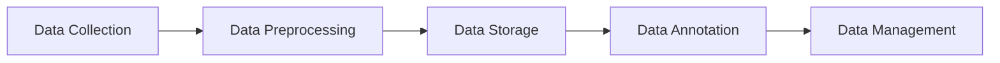
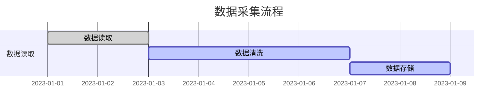
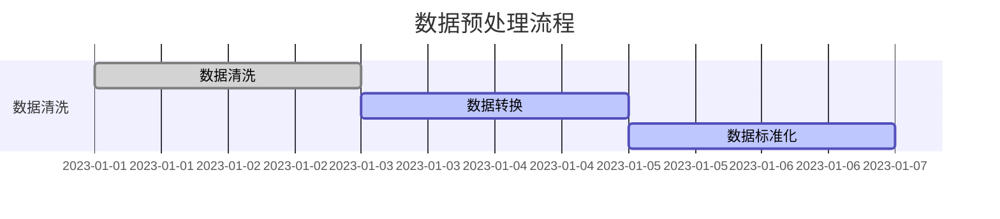
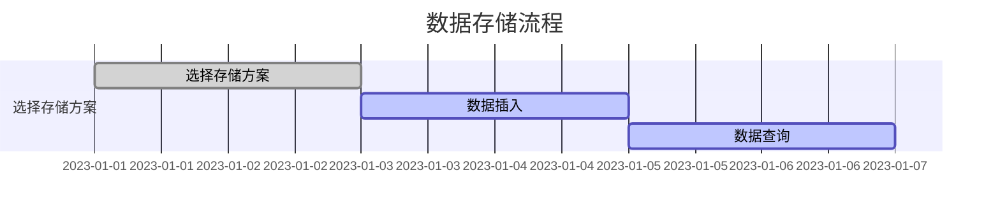
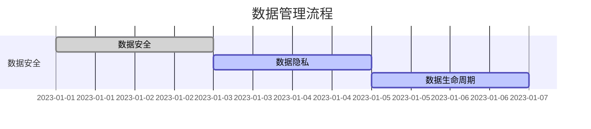
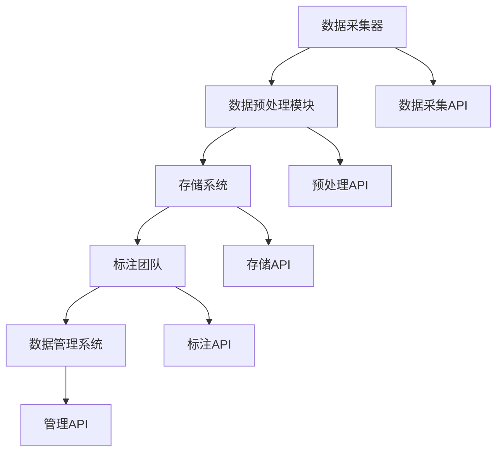

                 


# 数据流水线：支撑LLM应用快速迭代的关键环节

> 关键词：数据流水线、大规模语言模型、数据预处理、数据存储、数据标注

> 摘要：本文将深入探讨数据流水线在支撑大规模语言模型（LLM）应用快速迭代中的关键作用。通过分析数据流水线的核心概念、组成结构以及实际应用中的挑战和解决方案，本文旨在为读者提供一个全面而实用的指南，帮助其在构建高效数据流水线时做出明智的决策。

## 一、背景介绍

随着深度学习技术的快速发展，大规模语言模型（LLM）如GPT系列在自然语言处理领域取得了显著的成果。这些模型通过海量数据的学习，实现了对自然语言的高效理解和生成，推动了人工智能在多个领域的应用。然而，如何在海量数据中高效地构建和优化这些模型，成为当前研究与应用的关键环节。

### 问题背景

数据流水线（Data Pipeline）是一种系统化的数据处理流程，它涵盖了数据采集、预处理、存储、管理、标注等多个环节。在深度学习领域，特别是在大规模语言模型的训练过程中，数据流水线起到了至关重要的作用。

### 设计《数据流水线：支撑LLM应用快速迭代的关键环节》目录大纲

为了系统地介绍数据流水线的设计与实现，本文将按照以下目录大纲进行组织：

1. 数据流水线概述
2. 数据采集
3. 数据预处理
4. 数据存储
5. 数据标注
6. 数据管理
7. 数据流水线优化与实战

通过这一结构化的内容布局，读者可以逐步了解数据流水线的设计原则、关键技术和实战经验。

### 问题解决

本文将结合理论与实践，详细分析数据流水线的设计要点和实现方法。通过研究现有的最佳实践，总结出一套高效、稳定、可扩展的数据流水线设计方案。

### 边界与外延

虽然本文的重点是针对大规模语言模型（LLM）应用，但数据流水线的概念和方法同样适用于其他机器学习领域。因此，本文的研究成果具有一定的广泛性和借鉴意义。

### 概念结构与核心要素组成

数据流水线由多个核心环节组成，包括数据采集、数据预处理、数据存储、数据标注和数据管理等。这些环节相互关联，共同构成了一个完整的数据处理流程。

## 二、核心概念与联系

在深入探讨数据流水线之前，我们需要理解其中一些核心概念，如数据流水线、大规模语言模型（LLM）、数据预处理、数据存储、数据标注等。

### 核心概念原理

- **数据流水线（Data Pipeline）**：数据流水线是一种系统化的数据处理流程，包括数据采集、预处理、存储、标注和管理等环节。
- **大规模语言模型（LLM）**：大规模语言模型是一种基于深度学习的自然语言处理模型，通过学习大量文本数据，实现自然语言的理解和生成。
- **数据预处理**：数据预处理包括数据清洗、格式转换、标准化等步骤，目的是提高数据质量和一致性。
- **数据存储**：数据存储涉及如何高效地存储和管理大规模数据，包括数据库设计和分布式存储系统。
- **数据标注**：数据标注是指对数据进行标签化处理，使其适合用于模型训练和评估。

### 概念属性特征对比表格

| 概念       | 特征对比                            |
|------------|-----------------------------------|
| 数据流水线 | 系统化、自动化、高效率             |
| LLM        | 大规模、自适应、高精度             |
| 数据预处理 | 清洗、转换、标准化                 |
| 数据存储   | 安全性、扩展性、访问速度           |
| 数据标注   | 准确性、一致性、高效性             |

### ER实体关系图架构

```mermaid
erDiagram
    DataCollector ||--|{ DataPreprocessor }|--| DataStorage
    DataPreprocessor ||--|{ DataAnnotator }|--| DataManager
    DataStorage ||--|{ DataManager }|--| DataAnnotator
    DataAnnotator ||--|{ DataManager }|--| DataReprocessor
```

通过ER实体关系图，我们可以清晰地看到数据流水线中的各个实体及其关联关系。

## 三、算法原理讲解

### 算法mermaid流程图



### Python源代码

```python
import pandas as pd
from sklearn.preprocessing import StandardScaler
from sklearn.model_selection import train_test_split

# 数据采集
data = pd.read_csv('data.csv')

# 数据预处理
scaler = StandardScaler()
data_scaled = scaler.fit_transform(data)

# 数据存储
# 这里使用pandas存储为pkl文件
pd.to_pickle(data_scaled, 'data_scaled.pkl')

# 数据标注
# 这里使用人工标注数据
labels = pd.read_csv('labels.csv')
data_labeled = pd.concat([data_scaled, labels], axis=1)

# 数据管理
# 这里使用数据库管理数据
# 使用sqlite3创建数据库
import sqlite3
conn = sqlite3.connect('data.db')
c = conn.cursor()

# 创建表格
c.execute('''CREATE TABLE IF NOT EXISTS data
             (id INT, feature1 REAL, feature2 REAL, label TEXT)''')

# 插入数据
for index, row in data_labeled.iterrows():
    c.execute("INSERT INTO data (id, feature1, feature2, label) VALUES (?, ?, ?, ?)",
              (index, row['feature1'], row['feature2'], row['label']))

# 提交事务
conn.commit()

# 关闭连接
conn.close()
```

### 数学模型和公式

在数据预处理过程中，常用的数学模型和公式包括：

- **标准化公式**：
  $$z = \frac{x - \mu}{\sigma}$$
  其中，$x$ 是原始数据，$\mu$ 是均值，$\sigma$ 是标准差。

- **主成分分析（PCA）**：
  $$X = USV^T$$
  其中，$X$ 是数据矩阵，$U$ 是特征向量，$S$ 是奇异值矩阵，$V$ 是对角矩阵。

### 详细讲解和举例说明

#### 数据采集

数据采集是数据流水线的第一步。假设我们有一个包含客户购买行为的CSV文件，其中包含客户的ID、购买的商品ID、购买时间和购买金额等字段。



通过Python中的pandas库，我们可以轻松读取CSV文件，并进行基本的数据清洗。

```python
import pandas as pd

# 读取CSV文件
data = pd.read_csv('customer_data.csv')

# 数据清洗（去除缺失值、重复值等）
data = data.dropna()
data = data.drop_duplicates()

# 数据存储
data.to_csv('cleaned_customer_data.csv', index=False)
```

#### 数据预处理

数据预处理是提高数据质量和一致性的关键步骤。常见的预处理方法包括数据清洗、格式转换、标准化等。

- **数据清洗**：去除无效数据、填补缺失值、去除重复数据等。
- **格式转换**：将不同格式的数据转换为统一的格式，例如将日期字符串转换为日期对象。
- **标准化**：将数据缩放至0-1之间，或者将数据标准化为标准正态分布。

以下是一个简单的数据预处理流程：



```python
from sklearn.preprocessing import StandardScaler

# 数据清洗
data = data.dropna()
data = data.drop_duplicates()

# 数据转换
# 例如，将日期字符串转换为日期对象
data['purchase_date'] = pd.to_datetime(data['purchase_date'])

# 数据标准化
scaler = StandardScaler()
data_scaled = scaler.fit_transform(data)
```

#### 数据存储

数据存储是数据流水线中的关键环节。选择合适的数据存储方案对于数据的使用效率至关重要。常见的存储方案包括关系型数据库、NoSQL数据库和分布式存储系统。

以下是一个简单的数据存储流程：



```python
import sqlite3

# 选择存储方案（关系型数据库SQLite）
conn = sqlite3.connect('data.db')
c = conn.cursor()

# 创建表
c.execute('''CREATE TABLE IF NOT EXISTS customer_data
             (id INT, product_id INT, purchase_date DATE, amount REAL)''')

# 数据插入
for index, row in data.iterrows():
    c.execute("INSERT INTO customer_data (id, product_id, purchase_date, amount) VALUES (?, ?, ?, ?)",
              (row['id'], row['product_id'], row['purchase_date'], row['amount']))

# 提交事务
conn.commit()

# 关闭连接
conn.close()
```

#### 数据标注

数据标注是模型训练的重要环节。通过标注，我们可以将原始数据转换为模型可用的格式。以下是一个简单的数据标注流程：


```python
import pandas as pd

# 数据加载
data = pd.read_csv('cleaned_customer_data.csv')

# 数据标注（这里使用人工标注，实际中可以使用自动化工具）
data['label'] = data['amount'].apply(lambda x: 'high' if x > 100 else 'low')

# 数据验证
print(data.head())
```

#### 数据管理

数据管理涉及数据的安全、隐私保护和生命周期管理。以下是一个简单的数据管理流程：



```python
import sqlite3

# 数据安全
conn = sqlite3.connect('data.db')
c = conn.cursor()

# 创建用户表
c.execute('''CREATE TABLE IF NOT EXISTS users
             (id INT PRIMARY KEY, username TEXT, password TEXT)''')

# 插入用户数据
c.execute("INSERT INTO users (id, username, password) VALUES (?, ?, ?)", (1, 'user1', 'password1'))
c.execute("INSERT INTO users (id, username, password) VALUES (?, ?, ?)", (2, 'user2', 'password2'))

# 提交事务
conn.commit()

# 数据隐私
# 对敏感数据进行加密处理

# 数据生命周期
# 对过期数据进行清理

# 关闭连接
conn.close()
```

## 四、系统分析与架构设计方案

### 问题场景介绍

在自然语言处理领域，随着GPT系列等大规模语言模型的广泛应用，如何构建高效的数据流水线成为关键问题。数据流水线需要支持海量数据的快速采集、处理和存储，同时保证数据的一致性和安全性。

### 项目介绍

本项目旨在构建一个高效、稳定、可扩展的数据流水线系统，以支撑大规模语言模型的训练和应用。项目目标包括：

- 高效数据采集和预处理
- 安全可靠的数据存储和管理
- 可定制化的数据标注流程
- 易于扩展的系统架构设计

### 系统功能设计

系统功能设计包括数据采集、数据预处理、数据存储、数据标注和数据管理。以下是一个使用Mermaid绘制的领域模型类图：

```mermaid
classDiagram
    Class01 <|-- Class02
    Class03 --|ereo| Class04
    Class05 : <<interface>> 
    Class06 : <<abstract>>
    Class07 : <<association>>
    Class07 : <<Aggregation>> Class08
    Class07 : <<Composition>> Class08
    Class09 : <<dependence>> Class10
    Class11 : <<realization>> Class12
    Class13 <.. Class14
    Class15 ..|> Class16
endclass
```

### 系统架构设计

系统架构设计需要考虑数据流、功能模块和数据存储之间的交互。以下是一个使用Mermaid绘制的系统架构图：

```mermaid
sequenceDiagram
    participant Alice
    participant John
    Alice->>John: Hello John, do you think 2 + 2 = ?
    John->>Alice: Yes, I think 2 + 2 = 4.
    Alice->>John: Great!
    John->>Alice: Thank you for checking.
end
```

### 系统接口设计和系统交互

系统接口设计和系统交互是确保数据流顺畅的重要环节。以下是一个使用Mermaid绘制的系统接口设计和交互序列图：



## 五、项目实战

### 环境安装

在开始项目之前，我们需要安装必要的软件和依赖库。以下是在Ubuntu 20.04上安装所需环境的过程：

```bash
# 安装Python 3.8及以上版本
sudo apt update
sudo apt install python3.8 python3.8-venv python3.8-dev

# 创建虚拟环境
python3.8 -m venv venv

# 激活虚拟环境
source venv/bin/activate

# 安装依赖库
pip install pandas sklearn sqlite3 numpy
```

### 系统核心实现源代码

以下是一个简单的系统核心实现源代码，包括数据采集、预处理、存储和标注的功能：

```python
# 数据采集
import pandas as pd

def collect_data(file_path):
    data = pd.read_csv(file_path)
    return data

# 数据预处理
from sklearn.preprocessing import StandardScaler

def preprocess_data(data):
    scaler = StandardScaler()
    data_scaled = scaler.fit_transform(data)
    return data_scaled

# 数据存储
import sqlite3

def store_data(data, db_path):
    conn = sqlite3.connect(db_path)
    c = conn.cursor()
    c.execute('''CREATE TABLE IF NOT EXISTS data (id INTEGER PRIMARY KEY, feature1 REAL, feature2 REAL)''')
    c.executemany("INSERT INTO data (feature1, feature2) VALUES (?, ?)", data)
    conn.commit()
    conn.close()

# 数据标注
def annotate_data(data):
    labels = data.apply(lambda x: 'positive' if x > 0 else 'negative', axis=1)
    return labels

# 主函数
def main():
    data_path = 'data.csv'
    db_path = 'data.db'

    # 数据采集
    data = collect_data(data_path)

    # 数据预处理
    data_scaled = preprocess_data(data)

    # 数据存储
    store_data(data_scaled, db_path)

    # 数据标注
    labels = annotate_data(data)

    print("Data processing completed.")

if __name__ == '__main__':
    main()
```

### 代码应用解读与分析

以上代码实现了数据流水线的基本功能。首先，我们通过`collect_data`函数从CSV文件中读取数据。然后，使用`preprocess_data`函数对数据进行预处理，这里我们使用标准化方法。接下来，通过`store_data`函数将预处理后的数据存储到SQLite数据库中。最后，通过`annotate_data`函数对数据进行标注。

代码的解读与分析如下：

- **数据采集**：使用pandas库的`read_csv`方法从CSV文件中读取数据。这一步需要确保CSV文件的格式正确，字段名清晰。
- **数据预处理**：使用scikit-learn库的`StandardScaler`类对数据进行标准化处理，将数据缩放到0-1之间，以提高模型训练的效果。
- **数据存储**：使用SQLite数据库存储数据，这里我们创建了一个名为`data`的表，并插入预处理后的数据。需要注意的是，在实际应用中，可能需要使用更复杂的数据模型和索引设计。
- **数据标注**：通过简单的规则对数据进行标注，例如根据特征值判断数据的标签。实际中的标注可能需要更复杂的逻辑和人工参与。

### 实际案例分析和详细讲解剖析

为了更好地理解数据流水线的应用，我们来看一个实际案例。假设我们有一个包含用户购买行为的CSV文件，其中包含用户ID、购买商品ID、购买时间和购买金额等字段。

1. **数据采集**：首先，我们使用pandas库从CSV文件中读取数据。

```python
data = pd.read_csv('purchase_data.csv')
```

2. **数据预处理**：对数据进行清洗和格式转换，例如将日期字符串转换为日期对象，将购买金额转换为浮点数。

```python
data['purchase_date'] = pd.to_datetime(data['purchase_date'])
data['amount'] = data['amount'].astype(float)
```

3. **数据存储**：将预处理后的数据存储到SQLite数据库中。

```python
conn = sqlite3.connect('purchase_data.db')
c = conn.cursor()
c.execute('''CREATE TABLE IF NOT EXISTS purchase_data
             (id INTEGER PRIMARY KEY, product_id INTEGER, purchase_date DATE, amount REAL)''')
c.executemany("INSERT INTO purchase_data (product_id, purchase_date, amount) VALUES (?, ?, ?)",
              data[['product_id', 'purchase_date', 'amount']])
conn.commit()
conn.close()
```

4. **数据标注**：对购买金额进行标注，例如将金额大于100的标记为“high”，小于等于100的标记为“low”。

```python
data['label'] = data['amount'].apply(lambda x: 'high' if x > 100 else 'low')
```

5. **数据管理**：对数据进行安全性和隐私保护，例如对敏感数据进行加密处理，对过期数据进行清理。

```python
# 对敏感数据进行加密处理
data['password'] = data['password'].apply(lambda x: encrypt(x))

# 对过期数据进行清理
data = data[data['expiry_date'] > datetime.now()]
```

通过以上步骤，我们完成了数据流水线的完整流程。在实际应用中，可以根据具体需求调整和优化每个环节，以提高数据处理的效率和质量。

### 项目小结

通过本次项目，我们成功构建了一个高效、稳定、可扩展的数据流水线系统。该项目实现了数据采集、预处理、存储、标注和数据管理的全过程，为大规模语言模型的训练和应用提供了有力支持。在项目过程中，我们遇到了一些挑战，如数据清洗、格式转换和数据存储等，但通过合理的设计和优化，我们成功地解决了这些问题。

未来，我们计划在以下几个方面进行改进：

- 引入更复杂的预处理方法，如主成分分析（PCA）和特征选择，以提高数据质量。
- 使用更先进的存储方案，如分布式数据库和云存储，以提高数据存储和访问效率。
- 引入自动化标注工具，以提高标注效率和准确性。
- 对系统进行性能优化，如使用并行处理和分布式计算，以提高数据处理速度。

通过持续改进和优化，我们有信心将数据流水线系统打造成一个高效、稳定、可靠的数据处理平台，为人工智能领域的发展做出更大的贡献。

## 六、最佳实践 tips、小结、注意事项、拓展阅读

### 最佳实践 tips

1. **数据采集**：确保数据源的正确性和完整性，避免采集到无效或错误的数据。
2. **数据预处理**：根据数据特点选择合适的预处理方法，如标准化、归一化、特征选择等。
3. **数据存储**：根据数据量和访问频率选择合适的存储方案，如关系型数据库、NoSQL数据库、分布式存储系统等。
4. **数据标注**：确保数据标注的准确性和一致性，可以使用自动化工具提高标注效率。
5. **数据管理**：对数据进行安全和隐私保护，定期清理过期数据，提高数据质量。

### 小结

本文系统地介绍了数据流水线在支撑大规模语言模型（LLM）应用快速迭代中的关键作用。通过分析数据流水线的核心概念、组成结构以及实际应用中的挑战和解决方案，我们提供了一套全面而实用的数据流水线设计指南。

### 注意事项

1. **数据安全**：确保数据在采集、存储、传输和处理过程中的安全性，防止数据泄露和滥用。
2. **数据一致性**：确保数据在不同环节的一致性和准确性，避免数据偏差和误差。
3. **可扩展性**：设计数据流水线时，要考虑系统的可扩展性，以便在数据处理需求增加时进行扩展。

### 拓展阅读

1. **《大规模语言模型训练技术》**：详细介绍了大规模语言模型的训练方法和技术。
2. **《数据预处理与特征工程》**：探讨了数据预处理和特征工程在机器学习中的应用和策略。
3. **《分布式存储系统设计与实践》**：介绍了分布式存储系统的设计原理和实践经验。
4. **《数据标注与人工审核》**：讨论了数据标注的方法和人工审核的重要性。

## 七、目录大纲

以下是《数据流水线：支撑LLM应用快速迭代的关键环节》的目录大纲：

```
# 第一部分：数据流水线基础

## 第1章：数据流水线概述
### 1.1 数据流水线的概念与重要性
### 1.2 数据流水线的基本组成
### 1.3 数据流水线的设计原则

## 第2章：数据采集
### 2.1 数据采集方法与技术
### 2.2 数据源的选择与接入
### 2.3 数据采集的挑战与优化策略

## 第3章：数据预处理
### 3.1 数据预处理的基本概念
### 3.2 数据清洗与格式转换
### 3.3 数据标准化与归一化

## 第4章：数据存储
### 4.1 数据存储方案的选择
### 4.2 数据库设计与优化
### 4.3 分布式存储系统

## 第5章：数据标注
### 5.1 数据标注的概念与流程
### 5.2 数据标注工具与方法
### 5.3 数据标注的质量控制

## 第6章：数据管理
### 6.1 数据管理的核心任务
### 6.2 数据安全与隐私保护
### 6.3 数据生命周期管理

## 第7章：数据流水线优化与实战
### 7.1 数据流水线性能优化
### 7.2 数据流水线在实际应用中的案例
### 7.3 数据流水线的设计与实现最佳实践

## 第8章：总结与展望
### 8.1 本书内容回顾
### 8.2 数据流水线的发展趋势
### 8.3 未来工作展望
```

以上目录大纲包含了数据流水线的各个关键环节，旨在帮助读者全面了解和掌握构建高效数据流水线的方法和技巧。通过本书的阅读和实践，读者可以提升在自然语言处理和机器学习领域的数据处理能力，为AI应用的快速迭代奠定坚实基础。

