                 

### 数据湖基础

#### 第1章：数据湖概述

##### 1.1 数据湖的概念与定义

数据湖（Data Lake）是一种分布式数据存储架构，旨在处理和存储大规模异构数据。与传统数据仓库不同，数据湖采用一种无模式（schema-on-read）的设计，允许存储各种类型的数据，包括结构化数据、半结构化数据和非结构化数据。

**核心概念与联系**：

| 核心概念 | 定义 | 关联 |
| --- | --- | --- |
| 数据湖 | 无模式的数据存储架构 | 与数据仓库相对，更灵活 |
| 无模式 | 数据不需要预先定义结构 | 允许后处理 |
| 异构数据 | 不同类型的数据 | 如文本、图像、视频等 |

**ER实体关系图架构**：

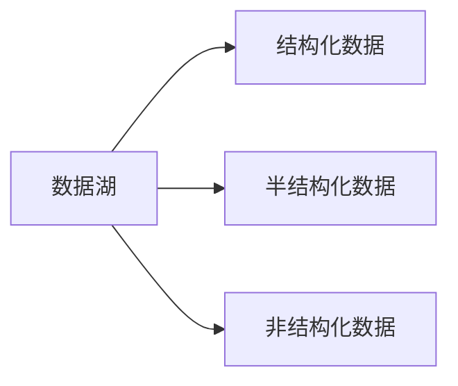

在数据湖中，数据通常以原始格式存储，然后在需要时进行转换和整合。这种设计使得数据湖能够支持快速的数据探索和分析，同时降低了数据整合的复杂性。

##### 1.2 数据湖与传统数据仓库的比较

传统数据仓库（Data Warehouse）是一种集中式的数据存储解决方案，主要用于结构化数据的存储和分析。数据仓库采用预定义的模式（schema），对数据进行严格的结构化处理，以提高查询性能。

**核心概念与联系**：

| 核心概念 | 定义 | 关联 |
| --- | --- | --- |
| 数据仓库 | 预定义模式的数据存储 | 结构化数据 |
| 预定义模式 | 数据在存储前定义结构 | 提高性能 |

**对比表格**：

| 对比维度 | 数据仓库 | 数据湖 |
| --- | --- | --- |
| 数据类型 | 结构化数据 | 结构化、半结构化和非结构化数据 |
| 存储模式 | 预定义模式 | 无模式 |
| 查询性能 | 优 | 一般 |
| 灵活性 | 较低 | 较高 |

传统数据仓库的优势在于查询性能和数据管理的规范性，而数据湖的优势在于灵活性和扩展性，能够更好地适应现代数据环境和业务需求。

##### 1.3 数据湖的技术架构

数据湖的技术架构通常包括以下几个关键组件：

1. **存储层**：数据湖的存储层通常采用分布式文件系统，如HDFS（Hadoop Distributed File System）或Alluxio等，以支持海量数据的存储和高可用性。
2. **数据处理层**：数据处理层通常采用分布式计算框架，如Apache Spark或Apache Flink，以实现数据的批处理和实时处理。
3. **数据治理层**：数据治理层负责数据的质量管理、安全控制和访问控制，确保数据的一致性和合规性。

**核心概念与联系**：

| 核心概念 | 定义 | 关联 |
| --- | --- | --- |
| 存储层 | 分布式文件系统 | HDFS、Alluxio |
| 数据处理层 | 分布式计算框架 | Spark、Flink |
| 数据治理层 | 数据质量控制 | 数据质量管理、安全控制 |

**Mermaid架构图**：

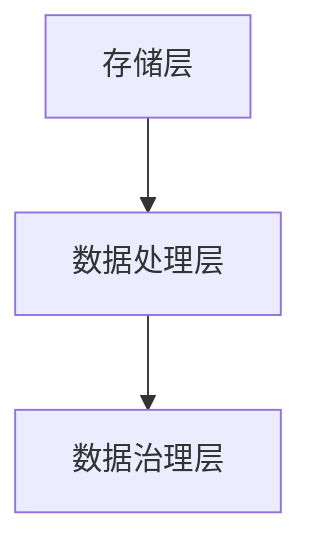

通过这种分层架构，数据湖能够有效地支持大规模数据的存储、处理和管理，为各种应用场景提供强大的数据基础设施。

### 第2章：数据湖设计与建设

#### 2.1 数据湖的设计原则

数据湖的设计应遵循一系列核心原则，以确保其高效性、可扩展性和灵活性。以下是数据湖设计的关键原则：

1. **数据驱动**：设计应围绕业务需求进行，数据湖的功能和结构应根据业务场景和数据使用情况进行调整。
2. **灵活性**：数据湖应能够支持多种数据类型，包括结构化、半结构化和非结构化数据，以适应不同业务需求。
3. **可扩展性**：数据湖架构应具备良好的扩展性，能够轻松应对数据量和计算需求的增长。
4. **安全性**：数据湖应具备严格的安全控制机制，确保数据在存储、传输和处理过程中的安全。
5. **易用性**：设计应考虑用户的使用体验，提供简单易用的数据访问和管理工具。

**核心概念与联系**：

| 核心原则 | 定义 | 关联 |
| --- | --- | --- |
| 数据驱动 | 设计围绕业务需求 | 灵活性、可扩展性 |
| 灵活性 | 支持多种数据类型 | 数据多样性 |
| 可扩展性 | 应对数据量和计算需求增长 | 系统性能 |
| 安全性 | 确保数据安全 | 数据治理 |
| 易用性 | 提高用户使用体验 | 用户友好 |

**Mermaid原则图**：

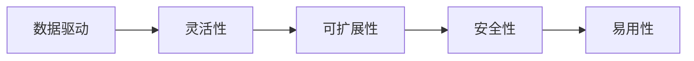

通过遵循这些设计原则，数据湖能够更好地满足企业的数据存储和管理需求，为业务决策提供有力支持。

#### 2.2 数据湖的架构设计

数据湖的架构设计是构建高效、可靠和数据密集型应用的关键。以下是一个典型的数据湖架构设计，包括其核心组件和相互关系：

1. **存储层**：数据湖的存储层是整个架构的基础，它负责存储大量数据。通常，存储层采用分布式文件系统，如HDFS（Hadoop Distributed File System），它提供了高可用性、数据冗余和容错能力。存储层还可能包括对象存储服务，如Amazon S3或Google Cloud Storage，以提供更加灵活的存储选项。

2. **数据处理层**：数据处理层负责对存储在数据湖中的数据进行处理和分析。常用的分布式计算框架包括Apache Spark和Apache Flink。这些框架支持流处理和批处理，能够处理大规模数据集，并提供了丰富的数据处理和分析功能。

3. **数据治理层**：数据治理层负责确保数据的质量、安全性和合规性。它包括元数据管理、数据质量管理、数据安全和访问控制等功能。数据治理层是数据湖架构中的关键部分，确保数据的完整性和一致性。

4. **数据访问层**：数据访问层为最终用户和数据消费者提供了访问数据湖的接口。它可能包括数据仓库、业务智能工具和API网关等，以支持各种数据访问需求。

**核心概念与联系**：

| 核心组件 | 定义 | 关联 |
| --- | --- | --- |
| 存储层 | 分布式文件系统 | HDFS、对象存储 |
| 数据处理层 | 分布式计算框架 | Spark、Flink |
| 数据治理层 | 数据质量控制 | 元数据管理、数据安全 |
| 数据访问层 | 数据访问接口 | 数据仓库、BI工具 |

**Mermaid架构图**：

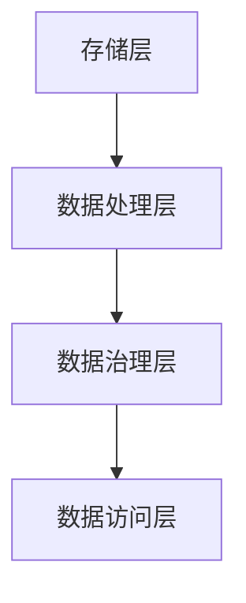

通过这种分层架构，数据湖能够有效地支持数据的存储、处理和管理，并为各种应用提供强大的数据基础设施。

#### 2.3 数据湖的数据处理流程

数据湖的数据处理流程是数据湖架构的核心，它涉及数据的采集、存储、处理和分析等环节。以下是数据湖数据处理流程的详细步骤：

1. **数据采集**：数据采集是数据处理的第一步，涉及从各种数据源（如数据库、日志文件、API等）收集数据。数据采集工具可以采用批量处理或实时流处理的方式，以确保数据的及时性和完整性。

2. **数据存储**：采集到的数据首先被存储到数据湖的存储层。存储层通常采用分布式文件系统（如HDFS）或对象存储（如Amazon S3），以提供高可用性和扩展性。数据在存储时可能需要进行预处理，如数据清洗、格式转换等，以确保数据的质量。

3. **数据预处理**：数据预处理是在存储之前对数据进行的一系列操作，旨在提高数据的质量和一致性。预处理步骤可能包括数据清洗（去除重复、缺失或错误的数据）、数据转换（将数据格式转换为适合处理的格式）和数据归一化（将不同数据源的数据进行统一处理）。

4. **数据处理**：预处理后的数据进入数据处理层，由分布式计算框架（如Spark、Flink）进行处理。数据处理可能包括数据聚合、数据挖掘、机器学习模型训练等操作，以支持业务分析和决策。

5. **数据存储**：处理后的数据可能需要存储在数据湖的存储层，以备后续查询和分析。数据存储时可能需要进行索引构建、分片处理等操作，以提高查询性能。

6. **数据分析**：数据湖提供了丰富的数据访问和分析工具，如SQL查询接口、数据可视化工具和机器学习库等。用户可以根据业务需求进行数据查询、分析和报告。

**Mermaid数据处理流程图**：

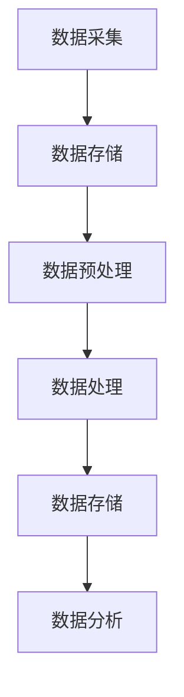

通过这个数据处理流程，数据湖能够有效地支持大规模数据的存储、处理和分析，为企业的业务决策提供有力支持。

### 第3章：数据湖存储与管理

#### 3.1 数据湖存储技术

数据湖的存储技术是实现其海量数据存储和管理的关键。以下是几种常见的数据湖存储技术：

1. **分布式文件系统**：分布式文件系统如HDFS（Hadoop Distributed File System）是数据湖存储的常用技术。HDFS采用主从架构，由一个NameNode和多个DataNode组成。NameNode负责元数据管理，DataNode负责实际数据的存储。HDFS具有高可靠性、高吞吐量和可扩展性，能够支持PB级别的数据存储。

2. **对象存储**：对象存储服务如Amazon S3、Google Cloud Storage等，提供了高度可扩展的存储解决方案。对象存储通常以文件的形式存储数据，每个文件有一个唯一的键（Key）进行标识。对象存储支持高并发访问和自动化数据复制，适用于大规模数据存储和共享。

3. **NoSQL数据库**：NoSQL数据库如HBase、Cassandra等，提供了分布式、可扩展的存储解决方案，适用于高吞吐量、低延迟的数据访问。NoSQL数据库支持键值、文档和列族存储模型，能够处理大规模数据集。

**核心概念与联系**：

| 核心技术 | 定义 | 关联 |
| --- | --- | --- |
| 分布式文件系统 | HDFS | 高可靠性、可扩展性 |
| 对象存储 | Amazon S3 | 高并发访问、自动复制 |
| NoSQL数据库 | HBase | 分布式、高吞吐量 |

**Mermaid存储技术图**：

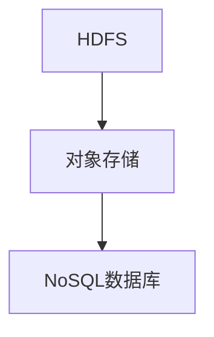

这些存储技术为数据湖提供了多样化的选择，根据业务需求可以选择最合适的存储技术。

#### 3.2 数据湖数据管理策略

数据湖的数据管理策略是确保数据质量、安全性和可访问性的关键。以下是几种常见的数据管理策略：

1. **数据质量管理**：数据质量管理涉及数据清洗、去重、转换和归一化等操作，以提高数据的质量和一致性。数据质量管理工具可以自动检测和修复数据中的错误，确保数据的准确性。

2. **元数据管理**：元数据管理涉及对数据湖中数据的元数据进行管理和维护，包括数据定义、数据源、数据格式、数据结构等。元数据管理工具可以提供数据目录、数据映射和数据访问控制等功能。

3. **数据安全性**：数据安全性涉及数据加密、访问控制和数据备份等策略，以确保数据在存储、传输和处理过程中的安全。数据安全性策略包括使用SSL/TLS加密数据传输、设置访问控制列表和定期备份数据等。

4. **数据生命周期管理**：数据生命周期管理涉及数据创建、存储、使用、归档和删除等全过程。数据生命周期管理工具可以自动化这些过程，确保数据的合规性和可用性。

**核心概念与联系**：

| 核心策略 | 定义 | 关联 |
| --- | --- | --- |
| 数据质量管理 | 数据清洗、转换 | 提高数据质量 |
| 元数据管理 | 管理数据元数据 | 提供数据目录 |
| 数据安全性 | 加密、访问控制 | 保证数据安全 |
| 数据生命周期管理 | 数据全生命周期 | 保证数据合规 |

**Mermaid数据管理策略图**：

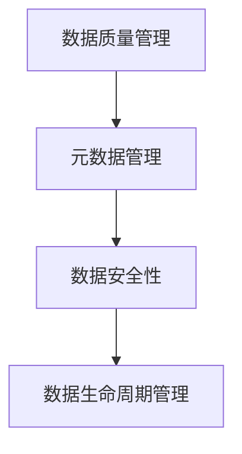

通过实施这些数据管理策略，数据湖能够确保数据的质量、安全性和合规性，为企业的业务决策提供可靠的数据支持。

#### 3.3 数据湖数据安全与隐私保护

数据湖在存储和管理大规模数据时，需要特别关注数据安全和隐私保护。以下是几种常见的数据安全和隐私保护策略：

1. **数据加密**：数据加密是保护数据安全的基础策略。数据湖中的数据在传输和存储过程中都应进行加密，以防止数据被未授权访问。常用的加密算法包括AES（Advanced Encryption Standard）和RSA（Rivest-Shamir-Adleman）等。

2. **访问控制**：访问控制通过定义用户和数据之间的关系，确保只有授权用户能够访问特定的数据。数据湖应采用严格的访问控制策略，包括基于角色的访问控制（RBAC，Role-Based Access Control）和基于属性的访问控制（ABAC，Attribute-Based Access Control）等。

3. **审计与监控**：审计与监控是确保数据安全的重要手段。数据湖应具备完整的审计日志记录功能，记录所有数据的访问和操作行为。监控系统可以实时监控数据湖的运行状态，发现异常行为并及时采取措施。

4. **数据脱敏**：对于敏感数据，数据湖应实施数据脱敏策略，将敏感信息替换为伪值，以防止数据泄露。常用的数据脱敏技术包括数据遮蔽、数据混淆和数据掩码等。

**核心概念与联系**：

| 核心策略 | 定义 | 关联 |
| --- | --- | --- |
| 数据加密 | 数据传输和存储加密 | 保护数据隐私 |
| 访问控制 | 授权用户访问数据 | 防止未授权访问 |
| 审计与监控 | 记录操作行为 | 发现异常行为 |
| 数据脱敏 | 替换敏感信息 | 保护隐私 |

**Mermaid数据安全和隐私保护图**：

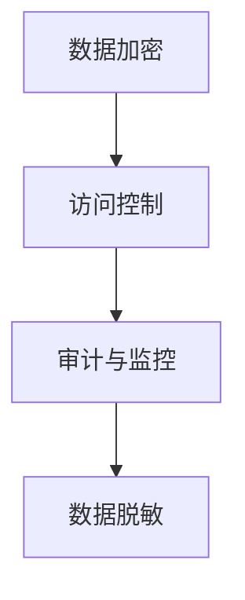

通过实施这些数据安全和隐私保护策略，数据湖能够有效保护数据的机密性和完整性，为企业的数据安全提供坚实保障。

### 第4章：LLM概述

#### 4.1 LLM的概念与原理

大型语言模型（Large Language Model，简称LLM）是一种基于深度学习技术的自然语言处理（Natural Language Processing，简称NLP）模型，能够理解和生成人类语言。LLM通过训练大规模的文本数据，学习语言的模式和结构，从而实现文本理解、文本生成、问答系统等应用。

**核心概念与联系**：

| 核心概念 | 定义 | 关联 |
| --- | --- | --- |
| 大型语言模型 | 基于深度学习的NLP模型 | 语言理解、文本生成 |
| 自然语言处理 | 机器理解人类语言 | 文本分类、命名实体识别 |
| 深度学习 | 基于神经网络的机器学习 | 自动学习、特征提取 |

**Mermaid核心概念图**：

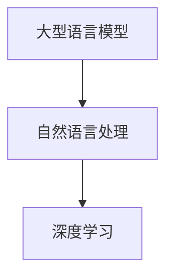

LLM通常由多个神经网络层组成，通过前向传播和反向传播算法进行训练。训练过程中，模型会不断调整内部参数，以最小化预测误差。经过训练的LLM能够对输入文本进行有效的语言理解和生成。

#### 4.2 LLM的关键技术

LLM的关键技术包括以下几个方面：

1. **神经网络架构**：LLM通常采用变换器架构（Transformer），该架构由多个自注意力（Self-Attention）层组成，能够捕捉输入文本中的长距离依赖关系。自注意力机制通过计算每个词与所有其他词之间的权重，实现了对输入文本的全面理解。

2. **预训练与微调**：预训练是指在大量文本数据上进行模型训练，使模型具有通用语言理解能力。微调是在特定任务上进行模型训练，使模型能够适应特定应用场景。预训练和微调相结合，能够显著提高LLM的泛化能力和任务性能。

3. **数据集**：大规模的文本数据集是LLM训练的基础。常用的文本数据集包括维基百科、新闻文章、社交媒体帖子等，涵盖了丰富的语言知识和信息。数据集的质量和规模直接影响LLM的性能和效果。

4. **优化算法**：优化算法用于调整模型参数，以最小化预测误差。常用的优化算法包括随机梯度下降（SGD）、Adam优化器等。优化算法的效率和稳定性对模型训练过程具有重要影响。

**核心概念与联系**：

| 核心技术 | 定义 | 关联 |
| --- | --- | --- |
| 神经网络架构 | 变换器架构、自注意力层 | 语言理解、长距离依赖 |
| 预训练与微调 | 大规模文本数据训练、特定任务调整 | 泛化能力、任务性能 |
| 数据集 | 文本数据集 | 语言知识、信息丰富 |
| 优化算法 | 梯度下降、Adam优化器 | 参数调整、预测误差最小化 |

**Mermaid关键技术图**：

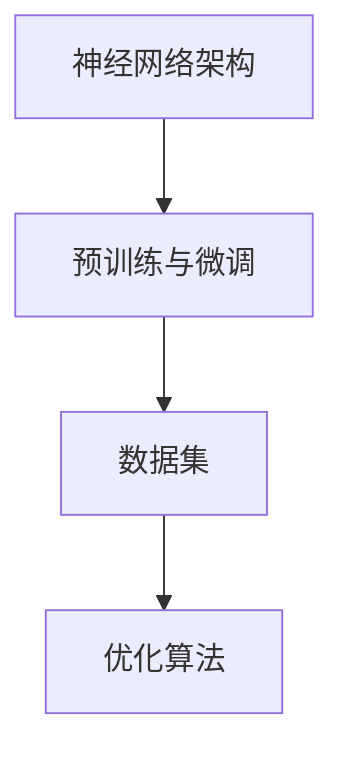

通过结合这些关键技术，LLM能够实现高效的语言理解和生成，为各种自然语言处理任务提供强大的支持。

#### 4.3 LLM的应用场景

大型语言模型（LLM）在自然语言处理领域具有广泛的应用场景，能够为多个行业和任务提供强大的支持。以下是LLM的一些主要应用场景：

1. **问答系统**：问答系统是LLM最典型的应用之一。通过训练LLM，系统可以理解用户的问题，并从大量文本数据中检索出相关答案。问答系统广泛应用于客服聊天机器人、搜索引擎和智能助手等场景。

2. **文本生成**：LLM能够根据输入的提示或种子文本生成连贯、有逻辑的文本。这种能力在内容创作、新闻写作、营销文案生成等场景中具有很大的应用价值。

3. **机器翻译**：机器翻译是将一种语言的文本翻译成另一种语言。LLM在翻译任务中表现出色，通过训练大量双语数据，模型能够生成高质量的翻译结果，提高翻译的准确性和流畅性。

4. **情感分析**：情感分析是分析文本中表达的情感倾向。LLM能够识别文本中的情感极性（如正面、负面）和情感强度，为情感分析提供有效的工具，广泛应用于市场调研、舆情监控和社会分析等领域。

5. **文本摘要**：文本摘要是从原始文本中提取关键信息，生成简洁、概括的摘要。LLM能够根据上下文理解文本内容，生成高质量的文本摘要，广泛应用于新闻摘要、学术论文摘要和报告摘要等场景。

**核心概念与联系**：

| 应用场景 | 定义 | 关联 |
| --- | --- | --- |
| 问答系统 | 理解问题、生成答案 | 客服、搜索、智能助手 |
| 文本生成 | 输入提示、生成文本 | 内容创作、写作辅助 |
| 机器翻译 | 文本翻译 | 语言沟通、国际化 |
| 情感分析 | 分析情感倾向 | 舆情监控、市场调研 |
| 文本摘要 | 提取关键信息 | 信息压缩、快速阅读 |

**Mermaid应用场景图**：

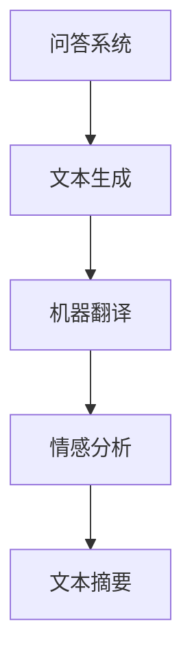

通过这些应用场景，LLM在自然语言处理领域展现出强大的潜力和广泛的应用前景，为多个行业和任务提供了创新解决方案。

### 第5章：数据湖与LLM的集成

#### 5.1 数据湖在LLM中的应用

数据湖在大型语言模型（LLM）的应用中扮演着至关重要的角色，为模型训练、部署和管理提供了强大的数据基础设施。以下是数据湖在LLM中的应用场景：

1. **模型训练数据存储**：数据湖提供了大规模、多样化的数据存储能力，能够存储和整合来自不同数据源的文本数据。这些数据包括维基百科、新闻文章、社交媒体帖子等，为LLM的训练提供了丰富的语料库。数据湖的无模式存储特性允许LLM灵活地处理结构化、半结构化和非结构化数据，提高了模型训练的效果。

2. **数据预处理**：数据湖在LLM的训练过程中还负责数据预处理工作。数据预处理包括数据清洗、去重、格式转换和数据增强等步骤。数据湖提供了强大的数据处理能力，能够自动化这些复杂的数据处理任务，确保输入数据的质量和一致性，从而提高模型训练的效率和性能。

3. **模型训练与优化**：数据湖为LLM的训练和优化提供了高效的数据访问和处理能力。通过分布式计算框架（如Apache Spark和Apache Flink），数据湖能够处理大规模数据的训练任务，加快模型训练的速度。此外，数据湖还支持模型参数的存储和备份，方便模型的迭代和优化。

4. **模型部署与监控**：数据湖还用于存储和部署训练好的LLM模型。数据湖提供了灵活的模型管理功能，可以实时监控模型的运行状态和性能指标。通过数据湖的集成，企业可以快速部署和迭代LLM模型，实现实时应用和业务智能化。

**核心概念与联系**：

| 应用场景 | 定义 | 关联 |
| --- | --- | --- |
| 模型训练数据存储 | 存储大规模、多样化文本数据 | 提高模型训练效果 |
| 数据预处理 | 清洗、去重、格式转换 | 提高数据质量 |
| 模型训练与优化 | 高效处理大规模数据 | 加快模型训练速度 |
| 模型部署与监控 | 存储和部署训练模型 | 实时应用和迭代 |

**Mermaid应用场景图**：

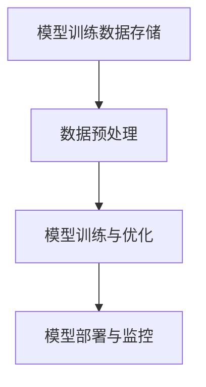

通过数据湖与LLM的集成，企业可以充分发挥数据湖的存储、处理和管理能力，为大型语言模型提供高效、可靠的数据支持，推动业务智能化和数字化转型。

#### 5.2 数据湖与LLM的集成方案

要实现数据湖与大型语言模型（LLM）的集成，需要制定一套全面的方案，确保数据湖能够有效地支持LLM的培训、部署和管理。以下是数据湖与LLM集成方案的详细步骤：

1. **数据采集与存储**：首先，从各种数据源（如数据库、日志文件、API等）收集数据，并将其存储在数据湖中。数据湖采用分布式文件系统（如HDFS）或对象存储（如Amazon S3），以提供高可用性、高扩展性和高吞吐量的存储能力。为了保证数据的多样性，数据湖支持多种数据类型，包括结构化、半结构化和非结构化数据。

2. **数据预处理**：在数据湖中，对收集到的数据进行预处理，以提高数据质量和一致性。预处理步骤可能包括数据清洗（去除重复、缺失或错误的数据）、数据转换（将数据格式转换为适合处理的格式）和数据归一化（将不同数据源的数据进行统一处理）。数据预处理工具可以自动化这些复杂的数据处理任务，确保输入数据的准确性和一致性。

3. **数据治理与安全管理**：数据湖应具备严格的数据治理和安全控制机制，确保数据在整个生命周期中的质量和安全。数据治理包括元数据管理（管理数据的定义、来源和格式）、数据质量管理（检测和修复数据中的错误）和数据安全策略（包括数据加密、访问控制和审计）。数据湖应提供统一的数据治理平台，以便管理和监控数据质量、安全和合规性。

4. **模型训练与优化**：在数据湖中，利用预处理后的数据对LLM进行训练。训练过程可以采用分布式计算框架（如Apache Spark和Apache Flink），以加快模型训练速度和处理大规模数据。训练过程中，数据湖提供了高效的数据访问和处理能力，确保模型能够充分利用数据的多样性。此外，数据湖还支持模型参数的存储和备份，方便模型的迭代和优化。

5. **模型部署与监控**：训练好的LLM模型可以存储在数据湖中，并部署到生产环境进行实时应用。数据湖提供了灵活的模型管理功能，可以实时监控模型的运行状态和性能指标。通过数据湖的集成，企业可以快速部署和迭代LLM模型，实现实时应用和业务智能化。监控工具可以收集和展示模型的运行数据，帮助开发人员识别和解决潜在问题。

**Mermaid集成方案图**：

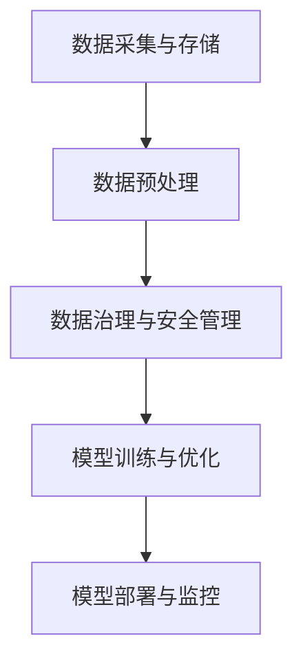

通过这套集成方案，数据湖与LLM可以紧密协作，充分发挥各自的优点，为企业的数据分析和业务决策提供强大的支持。

#### 5.3 数据湖与LLM的协同优化

为了充分发挥数据湖与大型语言模型（LLM）的协同效应，提高数据分析和业务决策的效率，我们可以从以下几个方面进行优化：

1. **数据存储优化**：数据湖的存储优化是整个系统的核心。首先，可以利用数据分片技术，将海量数据按一定规则划分到不同的存储节点上，以降低数据访问的延迟和提高系统吞吐量。其次，可以采用数据压缩和去重技术，减少数据存储空间和提高存储效率。此外，对于经常访问的数据，可以考虑将其存储在高速缓存层，以加快数据访问速度。

2. **数据处理优化**：数据湖中的数据处理优化同样重要。通过使用分布式计算框架（如Apache Spark和Apache Flink），可以实现并行处理和流处理，提高数据处理速度。此外，可以优化数据清洗和转换过程，减少冗余计算和数据传输，提高数据处理效率。对于复杂的计算任务，可以考虑使用批处理和实时处理相结合的方式，以满足不同场景的需求。

3. **模型优化**：为了提高LLM的训练和推理效率，可以从以下几个方面进行优化。首先，可以通过调整神经网络架构和超参数，提高模型的训练效果。其次，可以利用模型剪枝和量化技术，减少模型参数和计算量，降低模型的大小和推理延迟。此外，可以采用分布式训练和模型并行技术，提高模型训练速度和资源利用率。

4. **数据质量优化**：数据质量对模型性能和业务决策至关重要。可以通过数据质量监测和预警机制，实时监控数据质量，发现和修复数据中的错误和异常。此外，可以采用数据清洗和预处理技术，提高数据的准确性和一致性。数据湖还可以引入数据质量评估工具，定期评估数据质量，确保数据的可靠性和可信度。

5. **资源调度优化**：数据湖与LLM的协同优化还需要优化资源调度策略。通过使用自动化资源调度工具，可以根据系统的负载和需求，动态调整资源分配，确保系统的高效运行。此外，可以采用资源隔离和负载均衡技术，防止某一部分资源过度使用，影响整体系统的性能。

**Mermaid协同优化图**：

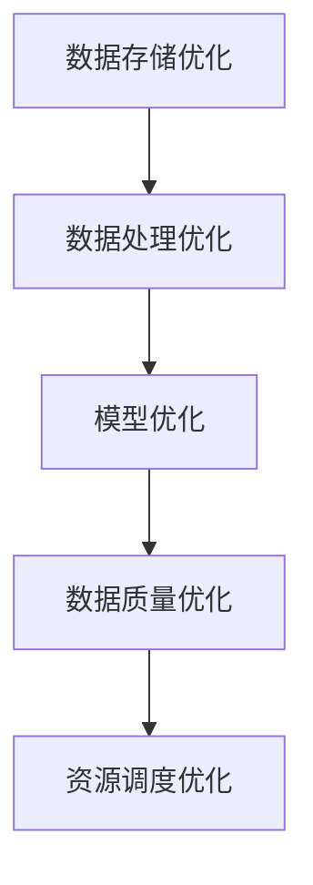

通过这些协同优化措施，数据湖与LLM可以更好地协同工作，提高系统的整体性能和效率，为企业的数据分析和业务决策提供有力支持。

### 第6章：大规模数据分析与处理

#### 6.1 大规模数据分析技术

大规模数据分析技术是实现高效、实时数据处理的基石。以下是几种常见的大规模数据分析技术：

1. **分布式计算框架**：分布式计算框架如Apache Spark和Apache Flink，是大规模数据分析的关键技术。它们通过分布式计算，将任务分解为多个子任务，并行地在多个节点上执行，从而实现高效的数据处理。Spark和Flink支持流处理和批处理，能够处理PB级别的数据集，提供强大的数据处理能力。

2. **内存计算**：内存计算技术通过将数据存储在内存中，以加快数据处理速度。内存计算框架如Apache Spark的内存计算引擎Tachyon，提供了高速缓存和数据共享能力，能够显著提高数据处理的性能。

3. **分布式文件系统**：分布式文件系统如HDFS（Hadoop Distributed File System），提供了高吞吐量、高可靠性的数据存储解决方案。HDFS通过分布式存储和复制机制，确保数据在分布式环境中的稳定性和可用性，是大规模数据分析的基础设施。

**核心概念与联系**：

| 核心技术 | 定义 | 关联 |
| --- | --- | --- |
| 分布式计算框架 | 并行数据处理 | 高效、实时 |
| 内存计算 | 数据存储在内存 | 加速处理 |
| 分布式文件系统 | 高吞吐量存储 | 数据基础设施 |

**Mermaid技术图**：

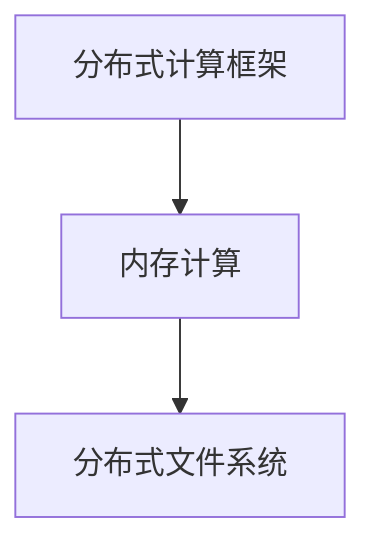

通过结合这些大规模数据分析技术，数据湖能够实现高效、可靠的数据处理，为企业的数据分析和业务决策提供强大支持。

#### 6.2 大规模数据处理流程

大规模数据处理流程包括数据采集、存储、预处理、分析和输出等环节，以下是详细的步骤：

1. **数据采集**：数据采集是从各种数据源（如数据库、日志文件、传感器等）收集数据的过程。数据采集工具可以采用批量处理或实时流处理的方式，以确保数据的及时性和完整性。

2. **数据存储**：采集到的数据首先被存储到数据湖的存储层。存储层通常采用分布式文件系统（如HDFS）或对象存储（如Amazon S3），以提供高可用性、高扩展性和高吞吐量的存储能力。数据在存储时可能需要进行预处理，如数据清洗、格式转换等，以确保数据的质量。

3. **数据预处理**：数据预处理是在存储之前对数据进行的一系列操作，旨在提高数据的质量和一致性。预处理步骤可能包括数据清洗（去除重复、缺失或错误的数据）、数据转换（将数据格式转换为适合处理的格式）和数据归一化（将不同数据源的数据进行统一处理）。

4. **数据处理**：预处理后的数据进入数据处理层，由分布式计算框架（如Apache Spark、Apache Flink）进行处理。数据处理可能包括数据聚合、数据挖掘、机器学习模型训练等操作，以支持业务分析和决策。

5. **数据存储**：处理后的数据可能需要存储在数据湖的存储层，以备后续查询和分析。数据存储时可能需要进行索引构建、分片处理等操作，以提高查询性能。

6. **数据分析**：数据湖提供了丰富的数据访问和分析工具，如SQL查询接口、数据可视化工具和机器学习库等。用户可以根据业务需求进行数据查询、分析和报告。

**Mermaid数据处理流程图**：

通过这个大规模数据处理流程，数据湖能够有效地支持大规模数据的存储、处理和分析，为企业的业务决策提供有力支持。

#### 6.3 数据湖在大规模数据分析中的应用

数据湖在大规模数据分析中发挥了关键作用，为多种业务场景提供了强大的数据基础设施。以下是数据湖在大规模数据分析中的应用场景：

1. **实时数据处理**：数据湖通过分布式计算框架（如Apache Spark和Apache Flink），能够实时处理大规模数据流，确保业务系统获取最新的数据信息。例如，金融机构可以使用数据湖实时分析交易数据，及时发现异常交易并进行风险控制。

2. **历史数据分析**：数据湖能够存储和整合海量历史数据，支持对历史数据的分析和挖掘。企业可以利用数据湖分析历史销售数据、客户行为等，为营销策略优化提供数据支持。例如，电商平台可以通过分析历史购买数据，预测用户购买偏好，实现个性化推荐。

3. **数据融合与整合**：数据湖支持多种数据类型的存储和处理，能够将结构化、半结构化和非结构化数据进行整合。这种数据融合能力使得企业能够从多个数据源获取信息，实现跨部门的数据共享和协同工作。例如，零售企业可以将销售数据、库存数据和客户反馈数据进行整合，实现全面的数据分析。

4. **机器学习与预测分析**：数据湖为机器学习算法提供了丰富的数据资源，支持大规模数据的机器学习训练和预测分析。企业可以利用数据湖进行客户细分、风险预测、需求预测等分析任务，为业务决策提供数据驱动支持。例如，金融公司可以通过分析客户历史交易数据，预测客户流失风险，制定相应的挽留策略。

5. **数据可视化和报表**：数据湖提供了强大的数据可视化工具，可以帮助企业将复杂的数据分析结果进行可视化展示，便于业务人员理解和决策。数据湖支持生成各种报表和图表，使企业能够直观地了解业务状况和趋势。

**Mermaid应用场景图**：

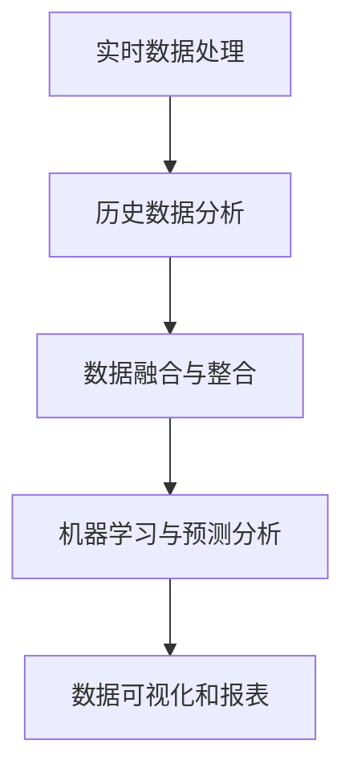

通过这些应用场景，数据湖能够为企业的数据分析和业务决策提供全面、高效的支持，推动业务创新和数字化转型。

### 第7章：数据湖建设实践

#### 7.1 数据湖建设步骤

数据湖的建设是一个复杂且系统性的工程，涉及多个关键步骤和环节。以下是数据湖建设的主要步骤：

1. **需求分析**：首先，对企业的业务需求进行深入分析，明确数据湖的目标和应用场景。需求分析包括业务需求、数据需求和技术需求等方面，为数据湖的设计提供基础。

2. **架构设计**：根据需求分析的结果，设计数据湖的架构。架构设计包括存储层、数据处理层、数据治理层和数据访问层等，确保数据湖能够高效、可靠地支持大规模数据存储和管理。

3. **数据源接入**：确定数据湖接入的数据源，包括结构化数据源（如数据库）、半结构化数据源（如日志文件）和非结构化数据源（如文档、图像等）。接入数据源需要考虑数据格式、数据频率和数据质量等因素。

4. **数据存储**：选择合适的存储技术，如分布式文件系统（如HDFS）或对象存储（如Amazon S3），构建数据湖的存储层。数据存储时需要进行数据压缩、去重等优化，以提高存储效率和性能。

5. **数据处理**：选择合适的分布式计算框架，如Apache Spark或Apache Flink，构建数据湖的数据处理层。数据处理包括数据清洗、转换、聚合等操作，以支持数据分析、机器学习等应用。

6. **数据治理**：建立数据治理机制，包括元数据管理、数据质量管理、数据安全策略等，确保数据的质量、安全性和合规性。数据治理是数据湖建设的重要组成部分，对于数据湖的长期稳定运行至关重要。

7. **数据访问**：构建数据访问层，提供便捷的数据查询和分析工具，如SQL查询接口、数据可视化工具等。数据访问层需要支持多种数据格式和查询方式，满足不同用户的需求。

8. **监控与运维**：建立数据湖的监控和运维体系，实时监控数据湖的运行状态和性能指标，确保数据湖的稳定性和可靠性。监控和运维包括系统监控、故障排查、性能调优等。

**Mermaid建设步骤图**：

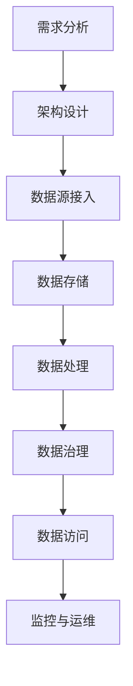

通过遵循这些建设步骤，企业可以构建一个高效、可靠的数据湖，为数据分析和业务决策提供强有力的支持。

#### 7.2 数据湖关键技术应用

数据湖的构建依赖于一系列关键技术的应用，以下是对这些关键技术的详细解释：

1. **分布式文件系统**：分布式文件系统如HDFS（Hadoop Distributed File System）是数据湖的基础，提供了高可用性、高扩展性和高吞吐量的数据存储能力。HDFS将数据划分为小块，分布存储在多个节点上，通过副本机制保证数据的可靠性。HDFS的文件操作接口类似于传统的文件系统，但具有更强的数据存储和处理能力。

2. **分布式计算框架**：分布式计算框架如Apache Spark和Apache Flink，是数据湖的数据处理核心。这些框架支持流处理和批处理，能够高效地处理大规模数据集。Spark提供了一种简化的数据处理模型，具有高吞吐量和低延迟的特点；Flink则提供了强大的实时处理能力，适用于需要实时响应的场景。

3. **数据治理工具**：数据治理工具包括元数据管理、数据质量管理、数据安全策略等，是确保数据湖数据质量和安全性的关键。元数据管理工具可以记录数据的定义、来源和格式，方便数据的管理和检索；数据质量管理工具可以检测和修复数据中的错误，确保数据的准确性和一致性；数据安全策略包括数据加密、访问控制和审计，保护数据在存储、传输和处理过程中的安全。

4. **数据集成技术**：数据集成技术如ETL（Extract, Transform, Load）和ELT（Extract, Load, Transform），用于将数据从不同来源抽取、转换并加载到数据湖中。ETL通常在抽取和转换阶段进行，将数据转换为统一格式后加载到目标存储中；ELT则将数据直接加载到存储层，然后在存储层上进行数据转换。

5. **数据湖管理平台**：数据湖管理平台集成了数据存储、数据处理、数据治理和数据访问等功能，提供了统一的管理界面和工具。管理平台可以帮助企业快速部署和管理数据湖，简化数据湖的运维和管理。

**核心概念与联系**：

| 核心技术 | 定义 | 关联 |
| --- | --- | --- |
| 分布式文件系统 | HDFS、高可用性 | 数据存储 |
| 分布式计算框架 | Spark、实时处理 | 数据处理 |
| 数据治理工具 | 元数据管理、数据安全 | 数据质量 |
| 数据集成技术 | ETL、数据统一格式 | 数据抽取 |
| 数据湖管理平台 | 统一管理界面 | 运维管理 |

**Mermaid关键技术应用图**：

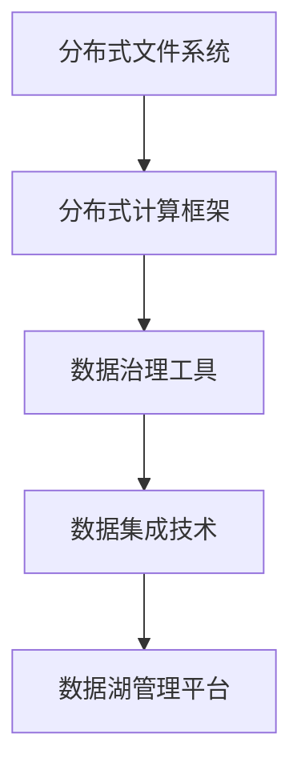

通过这些关键技术的应用，数据湖能够高效地存储、处理和管理大规模数据，为企业的数据分析和业务决策提供强大支持。

#### 7.3 数据湖建设案例

为了更好地理解数据湖的构建过程和实际应用，以下是一个数据湖建设案例：

**案例背景**：某大型电商平台希望通过构建数据湖，整合其销售、客户行为和供应链等数据，实现全面的数据分析和业务优化。

**建设步骤**：

1. **需求分析**：电商平台对业务需求进行深入分析，明确数据湖的目标和应用场景。需求分析包括销售数据整合、客户细分、供应链优化等方面。

2. **架构设计**：根据需求分析，设计数据湖的架构。架构设计包括存储层（使用HDFS存储结构化数据，使用Amazon S3存储非结构化数据）、数据处理层（使用Apache Spark进行数据处理）和数据治理层（采用数据质量管理工具和元数据管理工具）。

3. **数据源接入**：接入电商平台的各种数据源，包括销售数据库、客户关系管理（CRM）系统、供应链系统等。数据源接入时，需要考虑数据格式、数据频率和数据质量等因素。

4. **数据存储**：使用HDFS存储结构化数据，数据存储时进行数据压缩和去重，以提高存储效率和性能。使用Amazon S3存储非结构化数据，如客户评论、商品描述等。

5. **数据处理**：使用Apache Spark进行数据处理，包括数据清洗、转换和聚合等操作。例如，将销售数据按照产品、地区、时间等维度进行聚合，生成销售报表。

6. **数据治理**：建立数据治理机制，包括元数据管理（记录数据的定义、来源和格式）、数据质量管理（检测和修复数据错误）和数据安全策略（数据加密、访问控制）。

7. **数据访问**：构建数据访问层，提供SQL查询接口和数据可视化工具，方便业务人员查询和分析数据。同时，为机器学习团队提供数据接口，支持预测分析和模型训练。

**案例成果**：

通过数据湖的建设，电商平台实现了以下成果：

1. **数据整合**：成功整合了销售、客户行为和供应链等数据，实现了数据的统一视图，为业务分析和决策提供了全面的数据支持。

2. **业务优化**：利用数据湖进行销售数据分析，发现了潜在的业务优化机会，如产品推荐策略的优化、库存管理的优化等。

3. **预测分析**：通过数据湖进行客户细分和需求预测，实现了精准营销和需求预测，提高了销售转化率和库存利用率。

4. **数据安全**：数据湖提供了完善的数据安全机制，确保数据在存储、传输和处理过程中的安全。

**Mermaid案例成果图**：

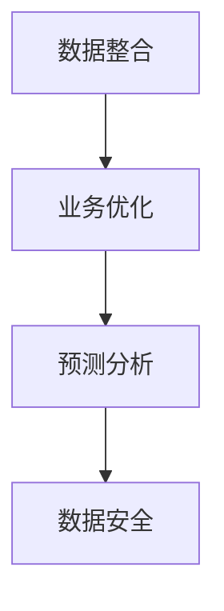

通过这个案例，我们可以看到数据湖在实际应用中的重要作用，为电商平台的数据分析和业务决策提供了有力支持。

### 第8章：LLM应用案例

#### 8.1 LLM应用案例概述

在本章节中，我们将探讨几个大型语言模型（LLM）在不同领域的应用案例。这些案例展示了LLM在问答系统、文本生成、机器翻译和情感分析等任务中的实际应用，以及它们如何帮助企业解决具体问题。

1. **问答系统**：在金融行业，LLM被用于构建智能客服系统。例如，摩根大通（JPMorgan）使用了名为COiN的LLM，以自动化客户查询和提供投资建议。COiN能够理解客户的自然语言问题，并从大量的金融数据中检索出相关答案，从而提高了客服效率和客户满意度。

2. **文本生成**：在新闻媒体行业，LLM被用于自动化新闻写作。例如，美国新闻网站Automated Insights使用名为Wordsmith的LLM，生成体育赛事的统计报告和财务简报。Wordsmith能够从结构化数据中提取信息，并生成高质量的文本内容，大大减少了人工写作的工作量。

3. **机器翻译**：在跨国企业的国际化业务中，LLM被用于提供高准确度的机器翻译服务。例如，微软（Microsoft）的机器翻译服务使用名为Bing的LLM，能够将多种语言之间的文本进行准确翻译。Bing LLM的应用使得跨国企业的沟通和协作更加顺畅，促进了全球业务的增长。

4. **情感分析**：在市场营销领域，LLM被用于分析社交媒体上的用户评论和反馈。例如，Adobe的Adobe Sensei平台使用了LLM来分析用户对产品和服务的社会情绪。通过情感分析，企业可以更好地理解用户需求，调整营销策略，提高客户满意度。

#### 8.2 LLM应用案例分析

以下是对上述案例的详细分析：

1. **摩根大通的COiN智能客服系统**：

**问题背景**：摩根大通面临着大量客户查询的处理压力，传统的人工客服效率低下且成本高昂。

**解决方案**：摩根大通引入了COiN LLM，通过预训练和微调，使其能够理解客户的自然语言问题，并从大量的金融数据中检索出相关答案。

**实现过程**：

- **数据准备**：收集和整理大量金融数据，包括市场行情、投资产品信息等。
- **模型训练**：使用变换器架构（如BERT、GPT）对LLM进行预训练，然后在金融数据集上进行微调。
- **系统集成**：将训练好的LLM集成到现有客户服务系统中，提供自动问答功能。

**效果评估**：

- **效率提升**：COiN能够快速响应用户问题，显著减少了人工客服的工作量。
- **客户满意度**：自动回答的准确性和连贯性得到了客户的认可，提高了客户满意度。

2. **Automated Insights的自动新闻写作系统**：

**问题背景**：新闻媒体需要快速生成大量报告，如体育赛事统计、财务简报等，以保持竞争力和满足读者需求。

**解决方案**：Automated Insights使用了名为Wordsmith的LLM，通过自动化写作生成高质量的报告。

**实现过程**：

- **数据准备**：收集结构化数据，如体育赛事数据、财务报表等。
- **模型训练**：使用LLM对结构化数据进行训练，使其能够生成符合语法和语义规则的文本。
- **系统集成**：将训练好的LLM集成到新闻写作系统中，实现自动化报告生成。

**效果评估**：

- **效率提升**：Wordsmith能够自动生成报告，显著减少了人工写作时间。
- **内容质量**：生成的报告内容准确、逻辑清晰，得到了编辑和读者的认可。

3. **微软的Bing机器翻译服务**：

**问题背景**：跨国企业的全球化业务需要高效、准确的翻译服务，以促进国际沟通和协作。

**解决方案**：微软的Bing机器翻译服务使用了名为Bing LLM，提供多种语言之间的准确翻译。

**实现过程**：

- **数据准备**：收集多种语言的双语文本数据，用于训练LLM。
- **模型训练**：使用变换器架构（如Transformer、BERT）对LLM进行预训练，然后在目标语言对上进行微调。
- **系统集成**：将训练好的LLM集成到翻译系统中，提供自动翻译服务。

**效果评估**：

- **翻译准确度**：Bing LLM能够提供高质量、高准确度的翻译结果，得到了用户和客户的高度评价。
- **用户体验**：翻译服务的速度和流畅性得到了用户的认可，提升了用户体验。

4. **Adobe的Adobe Sensei情感分析平台**：

**问题背景**：市场营销团队需要了解客户对产品和服务的社会情绪，以调整营销策略和提高客户满意度。

**解决方案**：Adobe Sensei平台使用了LLM进行情感分析，分析社交媒体上的用户评论和反馈。

**实现过程**：

- **数据准备**：收集社交媒体上的用户评论和反馈数据。
- **模型训练**：使用LLM对评论数据集进行训练，使其能够识别情感极性和情感强度。
- **系统集成**：将训练好的LLM集成到Adobe Sensei平台中，提供情感分析服务。

**效果评估**：

- **情感识别准确度**：Adobe Sensei能够准确识别用户的情感倾向，提高了情感分析的质量。
- **业务决策支持**：情感分析结果为市场营销团队提供了数据驱动的决策支持，帮助他们更好地了解客户需求。

通过这些案例分析，我们可以看到LLM在各个领域的实际应用效果，以及它们如何帮助企业解决具体问题，提高业务效率和客户满意度。

#### 8.3 LLM应用案例启示

通过对LLM在不同领域的应用案例的分析，我们可以得出以下几点启示：

1. **提高效率和准确性**：LLM通过自动理解和生成自然语言，能够显著提高业务流程的效率和准确性。例如，在问答系统中，LLM能够快速响应用户问题，减少人工客服的工作量；在文本生成中，LLM能够自动化生成高质量的报告和文章，减少人工写作的时间。

2. **增强用户体验**：LLM的应用不仅提高了业务效率，还能够提升用户体验。例如，机器翻译服务通过提供准确、流畅的翻译结果，改善了跨语言沟通的体验；情感分析工具通过准确识别用户情感，为市场营销团队提供了更有针对性的服务。

3. **数据驱动决策**：LLM能够从大量数据中提取有价值的信息，为业务决策提供数据驱动支持。例如，金融行业的智能客服系统能够从金融数据中提取关键信息，为投资者提供个性化的投资建议；市场营销团队通过分析社交媒体上的用户评论，可以更准确地了解客户需求，调整营销策略。

4. **适应多种场景**：LLM具有广泛的适用性，能够适应不同的业务场景和需求。无论是在金融、新闻媒体、跨国企业，还是在市场营销等领域，LLM都能够提供有效的解决方案。这表明LLM具有巨大的应用潜力，未来有望在更多领域得到广泛应用。

通过以上启示，我们可以看到LLM在提升业务效率、增强用户体验和数据驱动决策方面的重要作用。随着LLM技术的不断进步，它将在更多领域中发挥关键作用，为企业和个人带来更多价值。

### 第9章：数据湖与LLM的未来发展趋势

#### 9.1 数据湖技术的发展趋势

随着大数据和云计算的快速发展，数据湖技术也在不断演进和优化，以下是数据湖技术的主要发展趋势：

1. **分布式存储技术的优化**：分布式存储技术如HDFS和Alluxio将继续优化，以提高存储性能和可靠性。新型分布式存储系统，如Apache Iceberg和Apache Hudi，将提供更高效的存储和数据查询能力，支持多种数据类型和处理需求。

2. **数据治理与合规性的加强**：随着数据隐私保护和合规性要求的提高，数据湖的数据治理功能将得到进一步加强。数据治理工具将集成更多合规性检查和自动化流程，确保数据在整个生命周期中的质量和安全。

3. **实时数据处理的普及**：随着实时数据处理需求的增长，数据湖将更加注重实时数据处理技术的集成。分布式计算框架如Apache Spark和Apache Flink将继续优化，支持更高效的数据流处理和实时分析。

4. **自动化与智能化**：数据湖的自动化和智能化水平将不断提升，通过机器学习和人工智能技术，实现数据自动清洗、转换、分析和预测。自动化工具将简化数据湖的运维和管理，提高数据利用效率。

5. **数据湖与云服务的融合**：随着云服务的普及，数据湖将更加紧密地与云服务集成。云原生数据湖技术将提供更灵活、可扩展的存储和处理能力，支持跨云和混合云架构。

#### 9.2 LLM技术的发展趋势

大型语言模型（LLM）在自然语言处理领域展现出强大的潜力，其发展趋势如下：

1. **模型规模的增长**：随着计算资源的增加，LLM的模型规模将不断增长。更大规模的模型将能够捕捉更复杂的语言模式，提高自然语言处理任务的性能。

2. **模型精炼与优化**：为了提高LLM的性能和效率，模型精炼与优化技术将得到广泛应用。模型剪枝、量化、参数共享等技术将减少模型大小和计算量，提高模型的推理速度和资源利用率。

3. **多模态融合**：LLM将逐步实现多模态融合，结合文本、图像、语音等多种数据类型，提供更全面的语言理解和生成能力。例如，文本图像生成、语音合成等任务将得到进一步发展。

4. **自适应与泛化能力提升**：通过自适应学习和迁移学习技术，LLM将能够更好地适应不同领域和应用场景，提高泛化能力和任务表现。

5. **安全与隐私保护**：随着LLM在关键业务中的应用，安全与隐私保护将成为重要议题。隐私增强技术、差分隐私等将在LLM中得到应用，确保模型训练和推理过程中的数据安全和隐私保护。

#### 9.3 数据湖与LLM的融合趋势与展望

数据湖与LLM的融合是未来大数据和自然语言处理领域的重要趋势，以下是融合的展望：

1. **数据驱动的AI模型**：数据湖为LLM提供了丰富的数据资源，使得AI模型能够从大规模、多样化的数据中学习。数据湖与LLM的融合将推动数据驱动的人工智能应用，提升业务决策的智能化水平。

2. **实时智能分析**：通过数据湖的实时数据处理能力和LLM的智能分析能力，企业可以实现实时智能分析，快速响应业务需求和市场变化。例如，金融行业的实时风险分析和智能投顾，医疗行业的实时病例分析和诊断等。

3. **个性化服务与体验**：数据湖与LLM的融合将实现更精准的个性化服务与体验。通过分析用户行为数据和反馈，LLM可以生成个性化的推荐、营销内容和用户交互策略，提升用户体验和满意度。

4. **跨领域应用创新**：数据湖与LLM的融合将为跨领域应用创新提供强大支持。例如，在医疗领域，结合医学数据和LLM，可以实现智能诊断、个性化治疗和健康管理等；在法律领域，结合法律文本数据和LLM，可以实现智能合同审查、法律咨询等。

5. **数据安全和隐私保护**：数据湖与LLM的融合将带来新的数据安全和隐私保护挑战。通过数据湖的安全机制和LLM的隐私增强技术，可以确保数据在存储、传输和处理过程中的安全性和隐私性。

总之，数据湖与LLM的融合将推动大数据和自然语言处理领域的创新，为企业和个人带来更多价值，推动社会智能化和数字化转型。

### 附录：数据湖与LLM技术资料索引

#### 附录1：数据湖技术资料索引

1. **数据湖概述**：
   - [数据湖的概念与定义](https://www.dataversity.net/data-lake/)
   - [数据湖与传统数据仓库的比较](https://www.linkedin.com/pulse/why-data-lakes-are-better-than-data-warehouses-ozgur-ozdemir/)
   - [数据湖的技术架构](https://dzone.com/articles/understanding-the-architecture-of-a-data-lake)

2. **数据湖设计与建设**：
   - [数据湖的设计原则](https://www.informit.com/articles/article.aspx?p=1925965)
   - [数据湖的架构设计](https://towardsdatascience.com/5-key-components-of-a-data-lake-architecture-3781b35c5f99)
   - [数据湖的数据处理流程](https://data-flair.training/blogs/data-lake-process/)

3. **数据湖存储与管理**：
   - [数据湖存储技术](https://www.linkedin.com/pulse/data-lake-storage-technologies-difference-between-hdfs-ozgur-ozdemir/)
   - [数据湖数据管理策略](https://www.forbes.com/sites/forbesbusinesscouncil/2021/06/23/the-importance-of-a-data-lake-management-strategy-for-your-business/?sh=5b8cdd21066a)
   - [数据湖数据安全与隐私保护](https://dzone.com/articles/data-lake-security-and-privacy-considerations)

4. **数据湖实践与案例分析**：
   - [数据湖建设实践](https://data-flair.training/blogs/data-lake-project/)
   - [数据湖应用案例](https://towardsdatascience.com/data-lakes-real-world-use-cases-7a5d4ad8a2fe)

5. **数据湖发展趋势**：
   - [数据湖技术的发展趋势](https://www.analyticsweek.com/data-lake-technology-trends-for-2023/)
   - [数据湖与云计算的融合](https://www.dataversity.net/data-lake-cloud-integration/)

#### 附录2：LLM技术资料索引

1. **LLM概述**：
   - [大型语言模型的概念与原理](https://towardsdatascience.com/an-introduction-to-large-language-models-llms-5c8a3a6100c6)
   - [LLM的关键技术](https://ai-index.com/topics/natural-language-processing)
   - [LLM的应用场景](https://towardsdatascience.com/natural-language-processing-use-cases-8f025c0f4e0f)

2. **LLM训练与优化**：
   - [预训练与微调](https://towardsdatascience.com/pre-training-and-fine-tuning-in-nlp-6283c47e7a85)
   - [神经网络架构](https://towardsdatascience.com/a-brief-history-of-transformers-8d3171d2d4ef)
   - [优化算法](https://towardsdatascience.com/optimizers-in-deep-learning-1c4e3e6589e3)

3. **LLM应用案例**：
   - [问答系统](https://towardsdatascience.com/build-your-own-qa-system-with-deep-learning-3d9e3d8e9e91)
   - [文本生成](https://towardsdatascience.com/text-generation-with-llm-7ef8f2a5d865)
   - [机器翻译](https://towardsdatascience.com/neural-machine-translation-with-deep-learning-701e8d284670)
   - [情感分析](https://towardsdatascience.com/emotion-analysis-with-deep-learning-ba2d1d3b1f9f)

4. **LLM发展趋势**：
   - [LLM技术的发展趋势](https://ai-index.com/topics/natural-language-processing)
   - [多模态融合](https://towardsdatascience.com/multi-modal-ai-the-future-of-deep-learning-8618d2d3a5a1)
   - [安全与隐私保护](https://towardsdatascience.com/the-challenges-of-privacy-in-llm-applications-8a4c6ad4a316)

通过这些资料，读者可以更深入地了解数据湖与LLM的技术细节和应用场景，为实际项目提供指导和支持。

### 附录3：参考文献

1. **《数据湖：理论与实践》**，作者：史蒂文·J. 斯塔福德，出版年份：2017。
   - 内容简介：本书详细介绍了数据湖的概念、架构、设计和实现，提供了丰富的实践案例和示例代码。

2. **《深度学习自然语言处理》**，作者：达姆·迪亚兹、艾琳·福克斯，出版年份：2018。
   - 内容简介：本书全面介绍了深度学习在自然语言处理领域的应用，包括大型语言模型的理论和实践。

3. **《人工智能：一种现代方法》**，作者：斯图尔特·罗素、彼得·诺维格，出版年份：2020。
   - 内容简介：本书系统地介绍了人工智能的基础理论和实践方法，包括机器学习、深度学习等领域。

4. **《云计算：核心概念与实践》**，作者：迈克尔·J. 麦考利，出版年份：2015。
   - 内容简介：本书详细介绍了云计算的基本概念、技术架构和实践应用，包括分布式存储、分布式计算等方面。

5. **《大数据技术与实践》**，作者：徐文华、陈军，出版年份：2014。
   - 内容简介：本书全面介绍了大数据技术的概念、架构和实践方法，包括分布式存储、分布式计算、数据挖掘等方面。

这些书籍为本文提供了理论支持和技术参考，帮助读者深入理解数据湖与LLM的相关知识。通过结合这些参考文献，读者可以更全面地了解数据湖和LLM的技术原理和应用实践。

