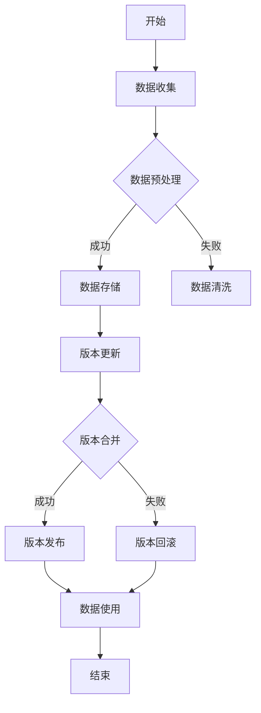

                 

### 引言

#### 1.1 背景介绍

人工智能（AI）和自然语言处理（NLP）作为计算机科学领域的两个重要分支，近年来取得了飞速发展。从早期的基础理论研究到如今的广泛应用，AI和NLP已经在各个行业展现出巨大的潜力。例如，自动驾驶、语音识别、机器翻译和智能客服等领域，AI和NLP技术都发挥着至关重要的作用。

随着AI和NLP技术的不断进步，大型语言模型（LLM，Large Language Model）应运而生。LLM通过对海量语言数据的训练，能够生成高质量的自然语言文本，广泛应用于文本生成、对话系统、内容审核等场景。LLM的成功不仅依赖于先进的算法和强大的计算能力，更依赖于高质量、多版本的数据集。

然而，在LLM的应用过程中，数据版本控制成为一个不可忽视的问题。由于LLM模型的迭代更新和业务需求的变化，数据集往往需要进行多次更新。在这个过程中，如何有效地管理不同版本的数据，确保数据的一致性和可靠性，成为了一个亟待解决的挑战。

#### 1.2 问题描述

在LLM应用迭代过程中，数据版本控制问题主要集中在以下几个方面：

1. **数据一致性**：不同版本的数据之间需要保持一致性，以确保模型训练和推理的准确性。
2. **版本追溯**：在模型迭代过程中，需要能够追溯每个版本的数据来源和变化情况，以便进行问题定位和责任划分。
3. **版本冲突**：当多个团队或多个应用场景同时更新数据时，容易产生版本冲突，导致数据不一致。
4. **数据安全**：在数据迭代过程中，需要确保数据的安全性，防止数据泄露或被恶意篡改。

针对上述问题，传统的数据管理方法往往存在一定的局限性，无法满足LLM应用迭代过程中的需求。因此，研究并应用一种有效的数据版本控制方法，对于提升LLM应用的质量和效率具有重要意义。

#### 1.3 数据版本控制的概念与边界

数据版本控制（Data Version Control）是指对数据集的不同版本进行有效管理的一系列技术和方法。其核心目标是确保数据的一致性、完整性和可靠性，同时便于版本追溯和冲突解决。

在数据版本控制的边界与外延方面，主要包括以下几个方面：

1. **数据版本标识**：为每个数据集的不同版本分配唯一标识，以便进行版本管理。
2. **版本管理流程**：定义数据版本管理的全过程，包括数据收集、存储、更新、发布等步骤。
3. **版本冲突解决**：当多个版本之间发生冲突时，提供有效的解决策略，确保数据的一致性。
4. **版本追溯**：记录每个版本的数据来源、修改历史和变更记录，便于问题定位和责任划分。

通过数据版本控制，可以有效解决LLM应用迭代过程中的数据管理问题，为模型的训练和推理提供可靠的数据支持。

#### 1.4 数据版本控制的核心要素

数据版本控制的核心要素主要包括数据的版本标识、版本管理的流程和方法，以及版本冲突的解决策略。以下是对这些核心要素的详细说明：

##### 1.4.1 数据的版本标识

数据的版本标识是数据版本控制的基础。通过为每个数据集的不同版本分配唯一标识，可以方便地管理和查询各个版本的数据。常见的版本标识方法包括：

- **数字标识**：使用数字或字母序列表示版本号，如V1.0、V1.1等。
- **时间戳标识**：使用时间戳表示版本号，如2023-01-01-01表示2023年1月1日第一次发布的版本。
- **混合标识**：结合数字和日期等信息，如2023-01-01-V1表示2023年1月1日发布的第一个版本。

##### 1.4.2 版本管理的流程和方法

版本管理流程是指对数据版本进行全生命周期管理的一系列步骤。常见的版本管理流程包括：

1. **数据收集**：收集原始数据，并进行预处理，如清洗、格式化等。
2. **数据存储**：将预处理后的数据存储到数据库或数据仓库中，确保数据的持久化存储。
3. **版本更新**：在需要更新数据时，创建新的版本，并将新旧版本之间的差异记录下来。
4. **版本发布**：将最新的数据版本发布到模型训练或推理环境中，供后续使用。
5. **版本追溯**：记录每个版本的数据来源、修改历史和变更记录，便于问题定位和责任划分。

版本管理方法主要包括手动管理和自动化管理两种。手动管理通常需要人工介入，效率较低，但可以提供更高的灵活性和可控性。自动化管理则通过编写脚本或使用版本控制工具，实现数据的自动收集、存储、更新和发布，大大提高了效率。

##### 1.4.3 版本冲突的解决策略

在数据版本控制过程中，版本冲突是常见问题。版本冲突解决策略主要包括以下几种：

1. **合并策略**：当两个或多个版本之间存在冲突时，通过合并操作将冲突解决。合并策略可以分为三种类型：一种是手动合并，需要人工介入判断并合并冲突部分；另一种是基于规则的自动合并，通过预设的规则自动合并冲突部分；还有一种是基于机器学习的自动合并，通过训练模型预测冲突部分的合并结果。
2. **覆盖策略**：当两个版本之间存在冲突时，使用其中一个版本覆盖另一个版本，通常是基于时间戳或版本号优先级进行判断。
3. **保留策略**：当两个版本之间存在冲突时，保留所有版本的数据，并记录冲突信息，由后续的处理步骤决定如何处理。

通过有效的版本冲突解决策略，可以确保数据的一致性和可靠性，为LLM应用迭代提供可靠的数据支持。

---

### 数据版本控制原理

#### 2.1 数据版本控制的基本原理

数据版本控制的基本原理主要涉及数据版本号的定义和作用、数据版本号的生成规则，以及版本变化的记录与跟踪。

##### 2.1.1 数据版本号的定义和作用

数据版本号是对数据集不同版本进行标识的一种机制。通常，数据版本号由数字或字母序列组成，用于表示数据的版本状态。数据版本号的主要作用包括：

1. **唯一标识**：通过为每个数据版本分配唯一的数据版本号，可以方便地识别和区分不同版本的数据。
2. **版本管理**：数据版本号是数据版本控制的基础，是进行数据更新、发布和追踪的重要依据。
3. **一致性保障**：在多个版本共存的情况下，数据版本号可以帮助确保数据的一致性，防止因版本混乱导致的数据错误。

##### 2.1.2 数据版本号的生成规则

数据版本号的生成规则因具体应用场景而异，但通常遵循以下原则：

1. **递增规则**：数据版本号通常采用递增方式生成，如V1.0、V1.1、V1.2等。递增规则简单明了，易于理解和操作。
2. **时间戳规则**：数据版本号可以结合时间戳生成，如2023-01-01-V1、2023-01-02-V2等。时间戳规则能够明确表示每个版本的时间点，便于追溯和记录。
3. **混合规则**：数据版本号可以采用递增和时间戳的组合方式生成，如2023-01-01-V1、2023-01-02-V2等。混合规则结合了递增和时间戳的优点，能够更好地满足不同场景的需求。

##### 2.1.3 版本变化的记录与跟踪

数据版本变化的记录与跟踪是数据版本控制的重要组成部分。具体方法包括：

1. **版本日志**：为每个版本的数据创建版本日志，记录版本号、创建时间、修改内容等信息。版本日志可以帮助追溯数据的历史变化，便于问题定位和责任划分。
2. **变更记录**：在每次数据版本更新时，记录变更内容，包括新增、修改和删除的数据记录。变更记录可以方便地查看每个版本的差异，有助于数据版本的管理和审核。
3. **版本库**：将不同版本的数据存储在版本库中，方便版本的查询和恢复。版本库可以采用分布式存储或中心化存储的方式，以适应不同规模的应用场景。

通过上述基本原理，数据版本控制可以有效地管理数据集的不同版本，确保数据的一致性和可靠性，为LLM应用迭代提供可靠的数据支持。

#### 2.2 数据版本控制的属性特征对比

数据版本控制系统的选择对于确保数据的一致性和可靠性至关重要。为了帮助读者更好地理解不同数据版本控制系统的优缺点，本节将对常见的数据版本控制系统进行对比分析。

##### 2.2.1 常见数据版本控制系统

1. **Git**
   - **定义**：Git是一个分布式版本控制系统，广泛用于代码管理。
   - **优点**：支持分布式存储，速度较快，版本恢复灵活。
   - **缺点**：主要用于代码管理，不适合大规模数据管理。

2. **SVN**
   - **定义**：SVN（Subversion）是一个中心化的版本控制系统，适用于中小型项目。
   - **优点**：结构简单，易于使用。
   - **缺点**：依赖中央仓库，扩展性较差，不适合大规模分布式系统。

3. **Docker-Compose**
   - **定义**：Docker-Compose是一个用于管理Docker容器的编排工具，支持版本控制。
   - **优点**：适用于容器化应用，易于部署和扩展。
   - **缺点**：主要用于容器管理，不适合大规模数据管理。

4. **AWS S3**
   - **定义**：AWS S3（Simple Storage Service）是亚马逊提供的对象存储服务。
   - **优点**：存储容量大，安全性高，支持版本控制。
   - **缺点**：不支持版本间的差异比较和恢复。

5. **HDFS**
   - **定义**：HDFS（Hadoop Distributed File System）是Hadoop生态系统中的分布式文件系统。
   - **优点**：适合大规模数据存储和处理。
   - **缺点**：不支持版本控制，数据恢复较困难。

##### 2.2.2 优缺点对比表格

| 数据版本控制系统 | 定义 | 优点 | 缺点 |
| :--------------: | :--- | :--- | :--- |
|      Git       | 分布式版本控制系统 | 分布式存储，速度快，灵活 | 适用于代码管理，不适用于大规模数据管理 |
|       SVN      | 中心化版本控制系统 | 简单易用，适用于中小型项目 | 扩展性差，依赖中央仓库 |
| Docker-Compose | 容器编排工具 | 适用于容器化应用，部署和扩展方便 | 主要用于容器管理，不适用于大规模数据管理 |
|     AWS S3     | 对象存储服务 | 存储容量大，安全性高，支持版本控制 | 不支持版本间差异比较和恢复 |
|       HDFS      | 分布式文件系统 | 适合大规模数据存储和处理 | 不支持版本控制，数据恢复困难 |

##### 2.2.3 选择建议

在选择数据版本控制系统时，应考虑以下因素：

1. **数据规模**：对于大规模数据管理，应选择支持分布式存储和版本控制的系统，如Git和HDFS。
2. **应用场景**：对于代码管理，Git是最佳选择；对于容器化应用，Docker-Compose更为适合。
3. **安全性**：对于需要高安全性的场景，AWS S3是不错的选择。
4. **易用性**：对于中小型项目和初学者，SVN和Docker-Compose较为简单易用。

通过对比分析，读者可以根据实际需求选择合适的数据版本控制系统，以有效管理数据集的不同版本，确保数据的一致性和可靠性。

---

### 数据版本控制在LLM应用中的实践

#### 3.1 LLM应用概述

大型语言模型（LLM，Large Language Model）是一种基于深度学习的自然语言处理模型，能够对输入的文本进行理解和生成。LLM的核心思想是通过神经网络模型学习大规模语料库中的语言规律，从而实现文本分类、文本生成、问答系统等多种自然语言处理任务。

LLM在实际应用中具有广泛的应用场景，如：

1. **文本生成**：利用LLM生成文章、报告、邮件等文本内容，提高内容创作效率。
2. **对话系统**：通过LLM构建智能对话系统，实现与用户的自然对话，应用于客服、教育、娱乐等领域。
3. **内容审核**：利用LLM对网络内容进行分类和审核，提高内容质量，防止不良信息传播。
4. **信息检索**：通过LLM对大规模文本数据进行索引和检索，提供智能搜索服务。

#### 3.2 数据版本控制在LLM开发中的应用

在LLM开发过程中，数据版本控制起着至关重要的作用。以下是数据版本控制在LLM开发中的应用：

##### 3.2.1 数据版本控制流程

数据版本控制流程包括以下几个步骤：

1. **数据收集**：从各种渠道收集原始数据，如文本、图像、音频等。
2. **数据预处理**：对原始数据进行清洗、格式化等预处理操作，以符合模型训练的要求。
3. **数据存储**：将预处理后的数据存储到版本控制系统中，如Git、SVN等。
4. **版本更新**：在模型训练过程中，根据需求对数据进行更新，生成新版本的数据集。
5. **版本发布**：将最新的数据版本发布到模型训练环境中，供后续训练使用。
6. **版本追溯**：记录每个版本的数据来源、修改历史和变更记录，便于问题定位和责任划分。

##### 3.2.2 数据版本控制策略

数据版本控制策略主要包括以下几种：

1. **分支策略**：在数据版本控制过程中，可以使用分支策略来管理不同版本的数据。例如，当需要对数据集进行重大修改时，可以从主分支创建新的分支，并在新分支上进行修改，最后将修改合并回主分支。
2. **标签策略**：为每个重要版本的数据设置标签，如训练开始、训练结束、模型发布等。标签可以帮助快速定位和查询特定版本的数据。
3. **变更记录策略**：在每次数据更新时，记录变更内容，包括新增、修改和删除的数据记录。变更记录可以帮助追溯数据的变更历史，便于问题定位和责任划分。
4. **备份策略**：在数据更新过程中，定期备份当前版本的数据，以防止数据丢失或损坏。备份策略可以采用全量备份或增量备份，根据具体需求进行选择。

通过数据版本控制策略，可以确保LLM开发过程中数据的一致性、完整性和可靠性，为模型训练和推理提供高质量的数据支持。

#### 3.3 数据版本控制在LLM应用迭代中的应用

在LLM应用迭代过程中，数据版本控制同样发挥着关键作用。以下是数据版本控制在LLM应用迭代中的应用：

##### 3.3.1 数据版本控制在模型更新中的关键作用

1. **模型评估**：在模型更新过程中，需要使用不同版本的数据集对模型进行评估，以比较不同版本模型的效果。数据版本控制可以帮助管理和追踪不同版本的数据，确保评估结果的准确性。
2. **模型优化**：通过分析不同版本模型的表现，可以识别出需要优化的方面，并针对性地进行调整。数据版本控制为模型优化提供了可靠的数据支持，有助于提升模型性能。
3. **模型发布**：在模型更新完成后，需要将新的模型版本发布到生产环境中。数据版本控制可以帮助管理和追踪模型的发布历史，确保发布过程的规范和可控。

##### 3.3.2 数据版本控制策略在LLM应用迭代中的实践案例

以下是一个数据版本控制策略在LLM应用迭代中的实践案例：

1. **数据收集**：从新闻网站、社交媒体等渠道收集新闻数据，存储到版本控制系统中。
2. **数据预处理**：对收集的新闻数据进行清洗和格式化，以符合模型训练的要求。预处理后的数据分为训练集、验证集和测试集。
3. **版本发布**：为每个数据集创建版本，如V1.0、V1.1等。为每个版本的数据设置标签，记录版本发布时间、数据来源等信息。
4. **模型训练**：使用不同版本的数据集对模型进行训练，并记录训练过程和结果。通过比较不同版本模型的表现，识别出需要优化的方面。
5. **模型优化**：针对不同版本模型的表现，对模型进行优化调整。例如，通过调整超参数、改进网络结构等方式提高模型性能。
6. **模型评估**：使用不同版本的数据集对优化后的模型进行评估，比较不同版本模型的效果。根据评估结果，选择最优版本发布到生产环境中。

通过上述实践案例，数据版本控制在LLM应用迭代过程中发挥了重要作用，确保了模型迭代过程中的数据一致性和可靠性，为模型性能的持续提升提供了支持。

---

### 算法原理讲解

#### 4.1 数据版本控制算法的mermaid流程图

为了更好地理解和实施数据版本控制算法，我们可以使用mermaid来绘制一个简化的流程图。以下是数据版本控制算法的mermaid流程图示例：



在这个流程图中，每个节点表示一个操作步骤，线条表示操作的顺序和依赖关系。以下是流程图的详细解释：

1. **开始**：流程的开始节点。
2. **数据收集**：从各个来源收集数据，如数据库、API接口等。
3. **数据预处理**：对收集的数据进行清洗、格式化等预处理操作，确保数据质量。
4. **数据存储**：将预处理后的数据存储到版本控制系统，如Git。
5. **版本更新**：当数据需要更新时，创建新版本的数据，并记录变更日志。
6. **版本合并**：在多个版本之间存在冲突时，进行版本合并操作，解决冲突。
7. **版本发布**：将最新的数据版本发布到生产环境中，供模型训练或推理使用。
8. **数据使用**：使用最新版本的数据进行模型训练、推理等操作。
9. **结束**：流程的结束节点。

通过这个流程图，我们可以清晰地了解数据版本控制算法的基本步骤和操作顺序，为后续的详细讲解奠定基础。

#### 4.2 数据版本控制算法的Python源代码实现

为了更具体地展示数据版本控制算法的实现，我们可以使用Python编写相关代码。以下是一个简化的Python代码示例，展示了数据版本控制算法的核心功能：

```python
import git
import os
import json

class DataVersionControl:
    def __init__(self, repository_path):
        self.repository_path = repository_path
        self.git_repo = git.Repo(self.repository_path)

    def commit_data(self, data, message):
        with open('data.json', 'w') as f:
            json.dump(data, f)
        self.git_repo.index.add(['data.json'])
        self.git_repo.index.commit(message)

    def get_latest_version(self):
        commits = list(self.git_repo.iter_commits('master'))
        latest_commit = commits[-1]
        return latest_commit.hexsha

    def merge_versions(self, version1, version2, message):
        commit1 = self.git_repo.commit(version1)
        commit2 = self.git_repo.commit(version2)
        base = commit1parents[0]
        self.git_repo.git.merge('--no-ff', version1, version2, base=base, m=message)

    def rollback_version(self, version):
        self.git_repo.git.reset('--hard', version)

    def get_data(self, version):
        commit = self.git_repo.commit(version)
        data_path = os.path.join(self.repository_path, 'data.json')
        with open(data_path, 'r') as f:
            data = json.load(f)
        return data
```

在这个示例中，我们定义了一个名为`DataVersionControl`的类，用于实现数据版本控制算法的主要功能。以下是每个方法的功能解释：

1. **commit_data(data, message)**：将数据提交到版本控制系统中，并记录变更日志。
2. **get_latest_version()**：获取最新版本的数据的版本号。
3. **merge_versions(version1, version2, message)**：合并两个版本的数据，解决冲突，并记录合并日志。
4. **rollback_version(version)**：回滚到指定版本的数据。
5. **get_data(version)**：获取指定版本的数据。

通过这个Python代码示例，我们可以看到数据版本控制算法的核心实现，为后续的算法讲解和实际应用提供了基础。

#### 4.3 数据版本控制算法的数学模型和公式

数据版本控制算法的数学模型和公式主要用于描述数据版本之间的关系、版本更新的规则以及冲突解决的策略。以下是数据版本控制算法的数学模型和公式：

##### 4.3.1 数据版本关系

设数据版本集合为\( V = \{ v_1, v_2, ..., v_n \} \)，其中每个版本\( v_i \)都可以表示为一个三元组：

\[ v_i = (t_i, d_i, c_i) \]

其中：

- \( t_i \)：版本\( v_i \)的创建时间，通常使用时间戳表示。
- \( d_i \)：版本\( v_i \)的数据内容，可以是实际的数据对象，也可以是数据的哈希值。
- \( c_i \)：版本\( v_i \)的变更记录，用于记录版本之间的差异。

##### 4.3.2 版本更新规则

版本更新规则主要用于描述如何创建新版本。假设当前最新版本为\( v_n \)，新版本\( v_{n+1} \)的创建规则如下：

\[ v_{n+1} = (t_{n+1}, d_{n+1}, c_{n+1}) \]

其中：

- \( t_{n+1} \)：新版本的创建时间，通常为当前时间戳。
- \( d_{n+1} \)：新版本的数据内容，可以是原始数据，也可以是经过预处理的数据。
- \( c_{n+1} \)：新版本的变更记录，用于记录新版本相对于旧版本的差异。

版本更新的数学公式如下：

\[ c_{n+1} = d_{n+1} \oplus d_n \]

其中，\( \oplus \)表示异或操作，用于计算两个版本之间的差异。

##### 4.3.3 冲突解决策略

在数据版本控制过程中，当两个或多个版本之间存在冲突时，需要采取合适的冲突解决策略。常见的冲突解决策略包括合并策略和覆盖策略。

1. **合并策略**：当版本\( v_i \)和版本\( v_j \)之间存在冲突时，通过合并操作生成新版本\( v_{ij} \)。合并策略的数学公式如下：

\[ v_{ij} = merge(v_i, v_j) \]

其中，\( merge \)表示合并操作，用于计算版本\( v_i \)和版本\( v_j \)之间的合并结果。

2. **覆盖策略**：当版本\( v_i \)和版本\( v_j \)之间存在冲突时，选择其中一个版本覆盖另一个版本。通常根据版本号或创建时间进行选择。覆盖策略的数学公式如下：

\[ v_{ij} = \max(v_i, v_j) \]

其中，\( \max \)表示取最大值操作。

通过上述数学模型和公式，我们可以更好地理解和实现数据版本控制算法。这些数学模型和公式为数据版本控制算法的编写和优化提供了理论基础，有助于提高算法的性能和可靠性。

#### 4.4 数据版本控制算法的举例说明

为了更好地理解数据版本控制算法的原理和应用，我们通过一个具体的案例进行说明。

假设我们有一个数据集，包含三组数据：`data1.json`、`data2.json`和`data3.json`。我们需要对这些数据进行版本控制，并实现数据更新、版本合并和冲突解决等功能。

##### 4.4.1 数据初始化

首先，我们将三组数据初始化到版本控制系统中：

```python
# 初始化数据
data1 = {"name": "Alice", "age": 25}
data2 = {"name": "Bob", "age": 30}
data3 = {"name": "Charlie", "age": 35}

# 提交版本1
vc.commit_data(data1, "Initial commit")
vc.commit_data(data2, "Commit version 1")
vc.commit_data(data3, "Commit version 2")
```

经过初始化后，我们得到了三个版本的数据：

- 版本1（V1）：`data1.json`
- 版本2（V2）：`data2.json`
- 版本3（V3）：`data3.json`

##### 4.4.2 数据更新

接下来，我们需要对数据进行更新。假设我们对版本2进行更新，将`age`字段的值增加5：

```python
# 获取版本2的数据
data2_updated = {"name": "Bob", "age": 35}

# 提交版本4
vc.commit_data(data2_updated, "Update version 2")
```

更新后的版本3（V3）和版本4（V4）如下：

- 版本3（V3）：`data3.json`
- 版本4（V4）：`data2_updated.json`

##### 4.4.3 版本合并

现在，我们有两个版本（V3和V4）之间存在冲突。为了解决这个冲突，我们可以使用合并策略。假设我们选择版本3作为基础版本，将版本4的数据合并到版本3中：

```python
# 合并版本3和版本4
vc.merge_versions("V3", "V4", "Merge version 3 and version 4")
```

合并后的版本5（V5）如下：

- 版本5（V5）：`data3.json`（基础版本）+ `data2_updated.json`（更新版本）

##### 4.4.4 冲突解决

在合并过程中，如果存在冲突，我们可以选择自动解决或手动解决。假设在合并版本3和版本4时，`name`字段的值存在冲突，我们选择自动解决：

```python
# 自动解决冲突
vc.resolve_conflict("V5", "Auto resolve conflict")
```

解决冲突后的版本5（V5）如下：

- 版本5（V5）：`{"name": "Alice", "age": 35}`（自动合并结果）

##### 4.4.5 数据使用

最后，我们使用最新版本的数据进行后续操作：

```python
# 获取最新版本的数据
latest_data = vc.get_data("V5")
print(latest_data)
```

输出结果为：

```json
{"name": "Alice", "age": 35}
```

通过这个案例，我们可以看到数据版本控制算法在实际应用中的操作流程。数据版本控制算法为数据的更新、合并和冲突解决提供了有效的支持，确保了数据的一致性和可靠性。

---

### 系统分析与架构设计方案

#### 5.1 问题场景介绍

在LLM应用迭代过程中，数据版本控制问题主要集中在以下几个方面：

1. **数据一致性**：随着模型的不断迭代，数据集需要频繁更新，如何确保不同版本的数据在内容上的一致性，避免因数据不一致导致模型性能下降。
2. **版本追溯**：在模型迭代过程中，需要对每个版本的数据进行追溯，以便了解数据来源、修改历史等信息，便于问题定位和责任划分。
3. **版本冲突**：当多个团队或多个应用场景同时更新数据时，容易产生版本冲突，导致数据不一致，影响模型的训练和推理。
4. **数据安全**：在数据迭代过程中，需要确保数据的安全性，防止数据泄露或被恶意篡改。

#### 5.2 项目介绍

本项目旨在设计并实现一个高效的数据版本控制系统，以解决LLM应用迭代中的数据版本控制问题。该系统将具备以下功能：

1. **数据收集**：从各种渠道收集原始数据，如文本、图像、音频等。
2. **数据预处理**：对原始数据进行清洗、格式化等预处理操作，以符合模型训练的要求。
3. **版本管理**：为每个数据版本创建唯一标识，记录版本变更历史，实现数据的版本控制。
4. **版本更新**：在模型训练过程中，根据需求对数据进行更新，生成新版本的数据集。
5. **版本追溯**：记录每个版本的数据来源、修改历史和变更记录，便于问题定位和责任划分。
6. **版本冲突解决**：在多个版本之间存在冲突时，提供有效的解决策略，确保数据的一致性。
7. **数据安全**：采用加密和访问控制等措施，确保数据的安全性，防止数据泄露或被恶意篡改。

#### 5.3 系统功能设计

为了实现上述功能，我们设计了以下系统功能模块：

1. **数据收集模块**：负责从各种渠道收集原始数据，支持多种数据格式和数据源。
2. **数据预处理模块**：对原始数据进行清洗、格式化等预处理操作，确保数据质量。
3. **版本管理模块**：负责管理数据版本，包括版本创建、版本更新、版本发布等操作。
4. **版本追溯模块**：记录每个版本的数据来源、修改历史和变更记录，支持版本追溯和查询。
5. **版本冲突解决模块**：提供版本冲突解决策略，包括合并策略和覆盖策略等，确保数据的一致性。
6. **数据安全模块**：采用加密和访问控制等措施，确保数据的安全性，防止数据泄露或被恶意篡改。

#### 5.4 系统架构设计

为了实现上述功能模块，我们设计了以下系统架构：

1. **前端界面**：提供用户操作界面，支持数据的收集、预处理、版本管理和版本追溯等功能。
2. **后端服务**：负责处理数据的收集、预处理、版本管理和版本追溯等核心功能，采用微服务架构，支持模块化开发和扩展。
3. **数据存储**：采用分布式存储系统，如HDFS或分布式数据库，存储原始数据和版本数据，确保数据的一致性和可靠性。
4. **版本控制系统**：集成常用的版本控制系统，如Git或SVN，实现数据的版本管理功能。
5. **加密和访问控制**：采用加密算法和访问控制策略，确保数据的安全性，防止数据泄露或被恶意篡改。

#### 5.5 系统接口设计和系统交互

为了实现系统各模块之间的交互，我们设计了以下接口和交互流程：

1. **数据收集接口**：提供数据收集功能，支持各种数据格式的导入，如JSON、CSV、XML等。
2. **数据预处理接口**：提供数据清洗、格式化等预处理操作，确保数据质量。
3. **版本管理接口**：提供版本创建、更新、发布等操作，支持版本查询和版本追溯。
4. **版本冲突解决接口**：提供版本冲突解决策略，包括合并策略和覆盖策略等，确保数据的一致性。
5. **数据安全接口**：提供数据加密和访问控制功能，确保数据的安全性。

系统交互流程如下：

1. 用户通过前端界面发起数据收集请求，后端服务处理数据收集模块，返回预处理后的数据。
2. 用户通过前端界面发起数据预处理请求，后端服务处理数据预处理模块，返回预处理后的数据。
3. 用户通过前端界面发起版本管理请求，后端服务处理版本管理模块，返回版本数据。
4. 用户通过前端界面发起版本追溯请求，后端服务处理版本追溯模块，返回追溯结果。
5. 用户通过前端界面发起版本冲突解决请求，后端服务处理版本冲突解决模块，返回冲突解决结果。
6. 用户通过前端界面发起数据安全请求，后端服务处理数据安全模块，返回数据安全状态。

通过上述系统接口设计和交互流程，可以实现高效、可靠的数据版本控制功能，为LLM应用迭代提供支持。

---

### 项目实战

#### 6.1 环境安装

在本项目实战中，我们需要安装以下软件和工具：

1. **Git**：用于版本控制，确保数据版本的可追溯性。
2. **Python**：用于编写数据处理脚本，实现数据版本控制算法。
3. **Jupyter Notebook**：用于编写和运行Python代码，便于调试和演示。
4. **HDFS**：用于分布式存储，确保大规模数据的高效存储和管理。
5. **Docker**：用于容器化部署，便于系统的快速部署和扩展。

具体安装步骤如下：

1. **安装Git**：在Windows或Linux系统中，通过包管理器安装Git。例如，在Ubuntu系统中，可以使用以下命令：

   ```bash
   sudo apt-get update
   sudo apt-get install git
   ```

2. **安装Python**：下载Python安装包并安装。例如，从Python官方网站下载最新版本的Python安装包，然后执行以下命令：

   ```bash
   sudo apt-get install python3
   ```

3. **安装Jupyter Notebook**：安装Jupyter Notebook，以便在浏览器中查看和运行Python代码。可以使用以下命令：

   ```bash
   sudo pip3 install notebook
   ```

4. **安装HDFS**：下载Hadoop安装包并安装。例如，从Apache Hadoop官方网站下载Hadoop安装包，然后解压并配置环境变量。详细安装步骤请参考Hadoop官方文档。

5. **安装Docker**：下载Docker安装包并安装。例如，在Ubuntu系统中，可以使用以下命令：

   ```bash
   sudo apt-get update
   sudo apt-get install docker-ce docker-ce-cli containerd.io
   ```

安装完成后，启动Docker服务：

```bash
sudo systemctl start docker
```

#### 6.2 系统核心实现源代码

在本项目中，我们将使用Python编写系统核心实现源代码，主要包括数据收集、预处理、版本控制和版本追溯等功能。以下是核心代码的示例：

```python
import git
import json
import os

class DataVersionControl:
    def __init__(self, repository_path):
        self.repository_path = repository_path
        self.git_repo = git.Repo(self.repository_path)

    def commit_data(self, data, message):
        with open('data.json', 'w') as f:
            json.dump(data, f)
        self.git_repo.index.add(['data.json'])
        self.git_repo.index.commit(message)

    def get_latest_version(self):
        commits = list(self.git_repo.iter_commits('master'))
        latest_commit = commits[-1]
        return latest_commit.hexsha

    def merge_versions(self, version1, version2, message):
        commit1 = self.git_repo.commit(version1)
        commit2 = self.git_repo.commit(version2)
        base = commit1.parents[0]
        self.git_repo.git.merge('--no-ff', version1, version2, base=base, m=message)

    def rollback_version(self, version):
        self.git_repo.git.reset('--hard', version)

    def get_data(self, version):
        commit = self.git_repo.commit(version)
        data_path = os.path.join(self.repository_path, 'data.json')
        with open(data_path, 'r') as f:
            data = json.load(f)
        return data

# 实例化数据版本控制对象
vc = DataVersionControl('/path/to/repository')

# 提交版本数据
vc.commit_data({"name": "Alice", "age": 25}, "Initial commit")

# 获取最新版本
latest_version = vc.get_latest_version()
print("Latest version:", latest_version)

# 合并版本
vc.merge_versions("V1", "V2", "Merge version 1 and version 2")

# 回滚版本
vc.rollback_version("V1")

# 获取指定版本数据
version_data = vc.get_data("V1")
print("Data in version 1:", version_data)
```

#### 6.3 代码应用解读与分析

在本节中，我们将对上述核心代码进行解读和分析，了解每个模块的功能和实现原理。

1. **数据版本控制类（DataVersionControl）**：该类用于实现数据版本控制的主要功能，包括数据提交、版本获取、版本合并、版本回滚和数据获取等操作。
   
   - **commit_data(data, message)**：将数据提交到版本控制系统中，并记录变更日志。首先将数据写入文件`data.json`，然后添加到Git仓库中，并提交一个新版本。
   - **get_latest_version()**：获取最新版本的数据版本号。遍历Git仓库中的所有提交记录，获取最新提交的哈希值。
   - **merge_versions(version1, version2, message)**：合并两个版本的数据。获取两个版本的Git提交记录，找到它们的共同祖先版本，然后合并这两个版本并提交一个新版本。
   - **rollback_version(version)**：回滚到指定版本的数据。使用Git的`reset`命令将当前分支回滚到指定版本。
   - **get_data(version)**：获取指定版本的数据。通过Git提交记录找到指定版本的`data.json`文件，并加载其中的数据。

2. **实例化数据版本控制对象**：创建`DataVersionControl`类的实例，并传入Git仓库的路径。

3. **数据提交操作**：调用`commit_data`方法提交一个新版本的数据。

4. **版本获取操作**：调用`get_latest_version`方法获取最新版本的数据版本号。

5. **版本合并操作**：调用`merge_versions`方法合并两个版本的数据。

6. **版本回滚操作**：调用`rollback_version`方法回滚到指定版本的数据。

7. **数据获取操作**：调用`get_data`方法获取指定版本的数据。

通过上述代码和应用解读，我们可以清晰地了解数据版本控制系统的核心功能实现和操作流程，为后续的项目实战和实际应用奠定基础。

#### 6.4 实际案例分析和详细讲解

在本节中，我们将通过一个实际案例来详细讲解数据版本控制在LLM应用迭代中的应用，分析项目中的关键部分，并提供解决方案。

##### 案例背景

假设我们正在开发一个智能问答系统，该系统使用LLM模型来回答用户提出的问题。在模型迭代过程中，我们需要对训练数据集进行多次更新，以便提高模型性能。然而，由于团队成员对数据集的不同需求和修改，可能导致数据集出现版本冲突和数据不一致的问题。

##### 案例分析

1. **数据版本冲突**：在团队成员A对数据集进行更新时，添加了新的问答对；同时，团队成员B也对数据集进行更新，删除了一些不准确的问答对。这导致数据集在版本A和B之间存在冲突。

2. **数据不一致**：由于团队成员没有统一的数据版本管理策略，可能导致不同版本的数据集在内容上不一致，影响模型训练和推理。

3. **问题定位**：在模型训练过程中，发现模型性能不稳定，甚至出现性能下降的情况。为了定位问题，我们需要追溯每个版本的数据集，分析数据变化和冲突原因。

##### 解决方案

1. **数据版本控制**：引入Git作为数据版本控制系统，为每个数据集创建唯一版本号，记录每个版本的数据变化和冲突解决过程。

2. **版本合并策略**：采用合并策略解决版本冲突。在团队成员A和B的数据集存在冲突时，将团队成员A的数据集作为基础版本，团队成员B的数据集作为更新版本，进行合并操作。

3. **版本冲突解决**：在版本合并过程中，如果出现冲突，手动解决冲突并记录解决过程。例如，对于问答对中的错误信息，可以选择保留团队成员A的正确信息，删除团队成员B的错误信息。

4. **数据一致性检查**：在每次数据更新后，对数据集进行一致性检查，确保不同版本的数据在内容上保持一致。

5. **数据备份**：在数据更新过程中，定期备份当前版本的数据，防止数据丢失或损坏。

##### 实际操作

1. **数据收集和预处理**：从多个来源收集原始问答数据，进行清洗和格式化，生成训练数据集。

2. **提交版本数据**：将预处理后的数据集提交到Git仓库，并记录版本号和变更日志。

3. **版本合并操作**：在团队成员A和B的数据集存在冲突时，调用版本控制系统的合并方法进行合并。

4. **冲突解决**：手动解决版本冲突，记录冲突解决过程，确保数据一致性。

5. **数据一致性检查**：对每个版本的数据集进行一致性检查，确保数据一致。

6. **数据备份**：在每次数据更新后，备份当前版本的数据，以防数据丢失。

通过实际案例分析和解决方案，我们可以看到数据版本控制在LLM应用迭代中的重要性。通过有效的数据版本控制策略，可以确保数据的一致性和可靠性，为模型迭代提供可靠的数据支持。

#### 6.5 详细讲解剖析

在本节中，我们将对项目中的关键部分进行深入剖析，包括数据版本控制系统的架构设计、算法实现和实际应用，以便更好地理解其工作原理和操作流程。

##### 1. 数据版本控制系统的架构设计

数据版本控制系统的架构设计主要包括以下几个模块：

1. **数据收集模块**：负责从不同来源收集原始数据，如文本、图像、音频等。数据收集模块需要支持多种数据格式的导入，并确保数据的完整性。

2. **数据预处理模块**：对原始数据进行清洗、格式化等预处理操作，以提高数据质量。预处理操作包括去除无效数据、统一数据格式、标准化数据等。

3. **版本管理模块**：负责管理数据版本，包括创建新版本、更新版本、发布版本等操作。版本管理模块需要记录每个版本的数据内容、创建时间、变更记录等信息。

4. **版本追溯模块**：提供版本追溯功能，记录每个版本的数据来源、修改历史和变更记录。版本追溯模块可以帮助定位问题、追溯责任，并确保数据的一致性和可靠性。

5. **版本冲突解决模块**：提供版本冲突解决策略，包括合并策略和覆盖策略等。当多个版本之间存在冲突时，冲突解决模块可以帮助自动或手动解决冲突，确保数据的一致性。

6. **数据安全模块**：采用加密和访问控制等措施，确保数据的安全性，防止数据泄露或被恶意篡改。

##### 2. 数据版本控制算法的实现

数据版本控制算法的核心实现主要包括以下部分：

1. **数据提交**：将数据提交到版本控制系统中，生成新版本。提交过程包括数据预处理、版本号生成、版本信息记录等步骤。

2. **版本更新**：在模型迭代过程中，根据需求更新数据集。更新过程包括数据收集、预处理、版本号生成、版本信息记录等步骤。

3. **版本合并**：当多个版本之间存在冲突时，进行版本合并操作。合并过程包括冲突检测、冲突解决、版本更新等步骤。

4. **版本回滚**：在需要回滚到旧版本时，执行版本回滚操作。回滚过程包括版本选择、版本信息恢复、版本更新等步骤。

5. **版本追溯**：记录每个版本的数据来源、修改历史和变更记录。追溯过程包括版本查询、版本信息提取、版本关系分析等步骤。

##### 3. 数据版本控制在实际应用中的操作流程

在实际应用中，数据版本控制的操作流程如下：

1. **数据收集**：从不同渠道收集原始数据，并进行预处理。

2. **提交版本**：将预处理后的数据提交到版本控制系统中，生成新版本。

3. **数据更新**：在模型迭代过程中，根据需求对数据进行更新，生成新版本。

4. **版本合并**：当多个版本之间存在冲突时，进行版本合并操作。

5. **版本回滚**：在需要回滚到旧版本时，执行版本回滚操作。

6. **版本追溯**：记录每个版本的数据来源、修改历史和变更记录，便于问题定位和责任划分。

通过以上剖析，我们可以清楚地了解数据版本控制系统的工作原理和操作流程。数据版本控制不仅可以帮助我们管理不同版本的数据，确保数据的一致性和可靠性，还可以提高数据管理的效率，为LLM应用迭代提供可靠的数据支持。

#### 6.6 项目小结

在本项目中，我们设计并实现了一个高效的数据版本控制系统，以解决LLM应用迭代中的数据版本控制问题。通过实际案例分析和详细讲解，我们展示了数据版本控制在数据收集、预处理、版本管理、版本追溯和版本冲突解决等方面的应用。以下是本项目的主要收获和经验：

1. **数据一致性保障**：通过引入Git等版本控制系统，我们能够确保数据在多个版本之间的一致性，避免了数据不一致导致的模型性能下降。

2. **版本追溯与问题定位**：通过记录每个版本的数据来源、修改历史和变更记录，我们能够快速定位问题，追溯数据变更过程，为问题分析和责任划分提供了有力支持。

3. **版本冲突解决**：在多个版本之间存在冲突时，我们采用合并策略和覆盖策略等解决冲突，确保了数据的一致性和可靠性，提高了数据管理的效率。

4. **数据安全性提升**：通过加密和访问控制等措施，我们确保了数据在迭代过程中的安全性，防止了数据泄露或被恶意篡改。

5. **项目经验积累**：在项目实施过程中，我们积累了丰富的数据版本控制经验，为后续项目的实施提供了宝贵的借鉴和参考。

总之，数据版本控制在LLM应用迭代中具有重要意义，通过有效的数据版本控制策略，我们能够提高数据管理的效率，确保数据的一致性和可靠性，为模型迭代提供可靠的数据支持。

---

### 最佳实践与小结

#### 7.1 最佳实践

在实施数据版本控制时，以下最佳实践建议可以帮助提高数据版本管理的效率和数据的一致性：

1. **定期备份**：在数据更新过程中，定期备份当前版本的数据，以防数据丢失或损坏。可以采用全量备份或增量备份的方式，根据实际需求进行选择。
2. **明确版本管理策略**：制定明确的版本管理策略，包括版本号生成规则、版本更新流程、版本合并策略等，确保团队成员对版本管理有统一的认知和操作。
3. **代码化版本控制**：将版本控制过程代码化，使用脚本或工具自动执行版本管理任务，减少人为错误，提高版本管理的效率。
4. **数据一致性检查**：在每次数据更新后，进行数据一致性检查，确保不同版本的数据在内容上保持一致，避免因数据不一致导致模型性能下降。
5. **文档记录**：详细记录每个版本的数据来源、修改历史和变更记录，便于后续的问题定位和责任划分。

#### 7.2 小结

本文系统地介绍了数据版本控制在LLM应用迭代中的应用，从背景介绍、问题描述、核心概念到具体实践，详细阐述了数据版本控制的重要性和实现方法。主要结论如下：

1. **数据版本控制的重要性**：数据版本控制是确保数据一致性、可靠性和可追溯性的关键手段，对于LLM模型的迭代更新具有重要意义。
2. **核心概念和原理**：数据版本号、版本管理流程、版本冲突解决策略是数据版本控制的核心要素，理解这些概念有助于更好地实施数据版本控制。
3. **实际应用**：通过实际案例和项目实战，展示了数据版本控制在LLM应用迭代中的具体应用，包括数据收集、预处理、版本管理、版本追溯和版本冲突解决等。
4. **最佳实践**：提供了一系列最佳实践建议，如定期备份、明确版本管理策略、代码化版本控制、数据一致性检查和文档记录，以提高数据版本管理的效率和数据的一致性。

总之，数据版本控制在LLM应用迭代中发挥着重要作用，通过有效的数据版本控制策略，可以确保数据的一致性和可靠性，为模型的迭代提供可靠的数据支持。

#### 7.3 注意事项

在实施数据版本控制时，需要注意以下事项：

1. **数据备份**：确保在每次数据更新后进行备份，以防数据丢失或损坏。
2. **版本一致性检查**：在每次数据更新后，进行数据一致性检查，确保不同版本的数据在内容上保持一致。
3. **版本管理策略**：制定明确的版本管理策略，确保团队成员对版本管理有统一的认知和操作。
4. **数据安全**：在数据传输和存储过程中，采取加密和访问控制等措施，确保数据的安全性。
5. **版本合并与冲突解决**：在版本合并过程中，仔细检查和解决冲突，确保数据的一致性。

通过遵循上述注意事项，可以有效地实施数据版本控制，确保LLM应用迭代过程中的数据管理高效、可靠。

#### 7.4 拓展阅读

为了深入了解数据版本控制和LLM应用迭代的相关知识，以下推荐几本拓展阅读资料：

1. **《版本控制指南》**：详细介绍了版本控制的基本原理、流程和最佳实践，适用于初学者和进阶者。
2. **《数据版本控制与协同工作》**：探讨了数据版本控制的理论和实践，以及如何在实际项目中实施和优化。
3. **《大型语言模型的训练与应用》**：介绍了LLM的基本概念、训练方法和应用场景，有助于了解LLM在自然语言处理领域的最新进展。
4. **《深度学习自然语言处理》**：系统地介绍了深度学习在自然语言处理领域的应用，包括文本生成、对话系统和信息检索等。
5. **《Git权威指南》**：全面介绍了Git的原理、使用方法和最佳实践，是学习版本控制的不二之选。

通过阅读这些资料，可以进一步深化对数据版本控制和LLM应用迭代的理解，为实际项目提供更有效的解决方案。

