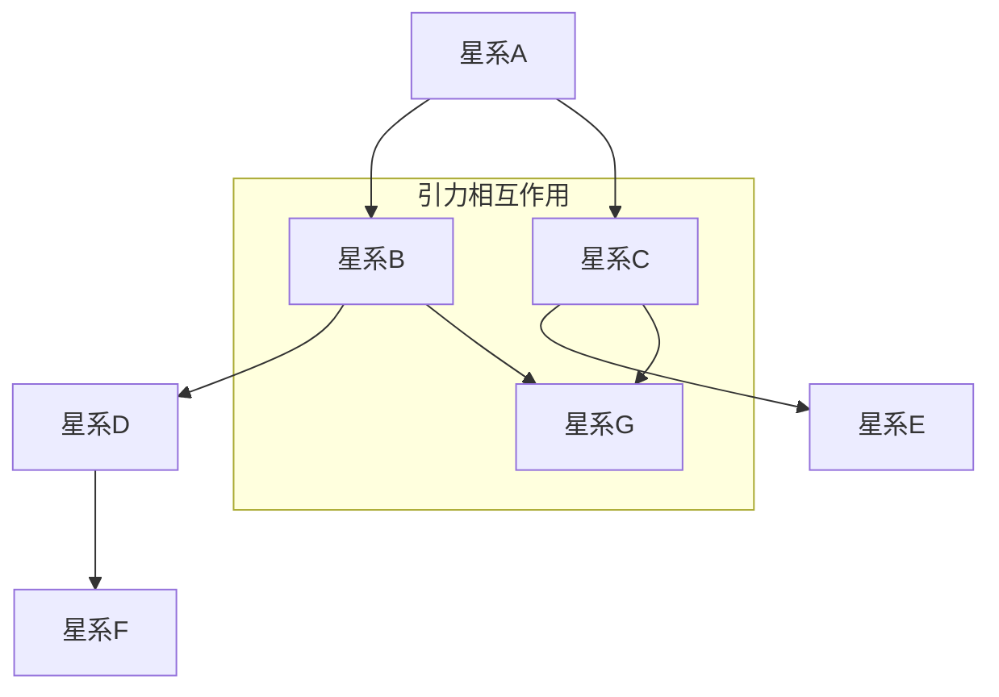
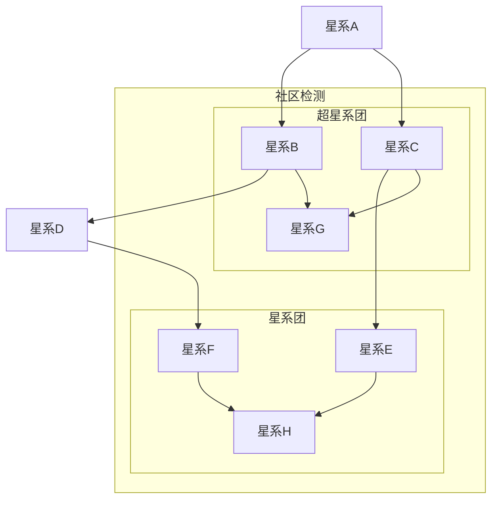

                 

### 暗能量：宇宙学中的谜团

宇宙，作为人类无限探索的领域，其浩瀚的宇宙空间中蕴含着无数未解之谜。在宇宙学的研究中，暗能量作为其中一个重要的概念，正逐渐揭开了其神秘的面纱。暗能量是一种看不见、摸不着的神秘力量，它对宇宙的膨胀起着至关重要的作用。但至今，暗能量的本质仍未被完全理解，这也是宇宙学研究中的一个重大挑战。

#### 暗能量的定义

暗能量，从字面上理解，即是一种既不是物质也不是辐射的能量。它以一种均匀的方式存在于整个宇宙中，对宇宙的扩张起着加速作用。根据现代宇宙学的理论，暗能量占据了宇宙总能量密度的约 68%，这是宇宙中最常见的成分。

#### 暗能量的作用

暗能量是推动宇宙加速膨胀的“引擎”，其作用机制尚不明确，但普遍认为与真空能量有关。随着宇宙的膨胀，暗能量在宇宙中的分布和作用也在不断变化，影响宇宙的形态和结构。

#### 暗能量的分布问题

暗能量的分布是宇宙学研究的核心问题之一。由于暗能量不与光或其他物质相互作用，直接观测其分布非常困难。研究者们通过间接方法，如宇宙背景辐射和大规模结构分布等，试图推断暗能量的分布。

#### 暗能量研究的意义

暗能量的研究不仅有助于我们更深入地了解宇宙的起源和演化，还对宇宙的未来命运有着重要的影响。例如，暗能量的加速作用可能导致宇宙最终走向热寂，也就是一切物质和能量都将均匀分布，宇宙将不再有热量传递和物理过程发生。

总结来说，暗能量是宇宙学中一个充满谜团和挑战的领域。理解暗能量的本质和分布，对于揭示宇宙的奥秘、探索宇宙的未来具有重要意义。在接下来的章节中，我们将详细探讨数据结构在这一研究中的应用。

#### 背景介绍

暗能量是宇宙学中一个重要的概念，它不仅关乎宇宙的起源和演化，还直接影响着宇宙的未来。为了更好地理解暗能量，我们需要从几个核心概念入手，包括暗能量的定义、宇宙学的基本框架、暗能量的分布及其重要性。

##### 暗能量的定义

暗能量是一种不可见的、不发光也不吸光的能量形式，它的存在通过宇宙膨胀的加速现象得到证实。在物理学中，暗能量被假设为一个常数，称为宇宙学常数，它的存在可以解释宇宙膨胀的加速度。暗能量不同于我们熟悉的物质和辐射，它不遵循一般的物理定律，如引力定律，因此在早期宇宙学研究中，人们未能直接探测到其存在。

##### 宇宙学的基本框架

宇宙学是研究宇宙起源、结构、演化和最终命运的科学。现代宇宙学的框架基于广义相对论和大爆炸理论。广义相对论描述了引力和时空的几何性质，而大爆炸理论则认为宇宙起源于大约138亿年前的一个极热、极密的状态。在这个框架下，宇宙的演化可以被理解为从大爆炸开始，经历膨胀、冷却、结构形成，最终进入稳态或衰变阶段。

##### 暗能量的分布

暗能量在宇宙中的分布是一个复杂的问题，由于暗能量不与光或其他物质相互作用，直接观测其分布极为困难。研究者们通过观测宇宙背景辐射、星系分布和大尺度结构等间接方法，试图推断暗能量的分布。一种流行的模型是“宇宙微波背景辐射”，它为我们提供了宇宙早期状态的信息，从而帮助推断暗能量的分布。

##### 暗能量的重要性

暗能量在宇宙学中具有至关重要的地位。首先，它是宇宙加速膨胀的主要推动力，这一现象被观测数据所证实。其次，暗能量影响着宇宙的大尺度结构，决定了星系、星团和超星团的形成和分布。最后，暗能量的性质和分布可能揭示宇宙的本质，帮助我们理解宇宙的最终命运。

总之，暗能量是一个充满谜团和挑战的领域，理解其分布和性质对于我们深入探索宇宙的奥秘具有重要意义。在接下来的章节中，我们将探讨数据结构如何在这一研究领域中发挥作用。

#### 暗能量分布的问题描述与解决

暗能量分布的问题可以描述为：如何在有限的观测数据中，精确推断出宇宙中暗能量的分布情况。这一问题的解决对于理解宇宙的起源和演化、预测宇宙的未来命运至关重要。为了解决这一问题，研究者们采取了多种方法和策略。

##### 数据准备

首先，研究者们需要收集大量的观测数据，这些数据包括宇宙背景辐射、星系分布、星系团的运动等。这些数据通常来自于宇宙微波背景探测器、星系巡天项目和其他观测设备。这些数据经过预处理后，可以被用于暗能量分布的研究。

##### 数据结构选择

在处理这些观测数据时，数据结构的选择至关重要。研究者们通常采用多种数据结构，如数组、树、图等，来组织和管理数据。例如，数组结构可以高效地存储和访问大规模的观测数据集；树结构则有助于对数据进行层次化的组织和分析；图结构则可以用来描述星系之间的相互作用和引力关系。

##### 算法设计

在数据结构确定后，研究者们需要设计合适的算法来处理和推断暗能量分布。常见的算法包括蒙特卡洛模拟、最小二乘法、粒子群优化等。这些算法的目的是通过分析观测数据，拟合出暗能量的分布模型，并对其进行评估和优化。

例如，蒙特卡洛模拟通过大量随机抽样来估计暗能量分布的概率密度函数，从而推断出其分布形态。最小二乘法则通过最小化拟合模型与观测数据之间的误差，来确定暗能量分布的参数。粒子群优化则模拟鸟群觅食的过程，通过群体智能来寻找最优解。

##### 边界与外延

在解决暗能量分布问题时，边界和外部因素也是一个重要考虑因素。首先，观测数据的局限性和误差会对结果的准确性产生影响。其次，宇宙学模型的假设和参数选择也会影响暗能量分布的推断。因此，研究者们在进行数据分析时，需要对这些边界和外部因素进行详细的分析和考虑。

##### 概念结构与核心要素组成

暗能量分布问题的核心概念包括：宇宙背景辐射、星系分布、观测数据、数据结构、算法模型和误差分析。这些概念相互关联，构成了一个复杂的研究框架。核心要素包括：

1. 观测数据：作为研究的基础，决定了暗能量分布推断的准确性。
2. 数据结构：组织和处理观测数据的关键，影响算法的效率和准确性。
3. 算法模型：用于拟合和推断暗能量分布的数学工具。
4. 误差分析：评估推断结果的可靠性和有效性。

通过以上方法，研究者们可以在有限的观测数据中，尽可能精确地推断出暗能量的分布情况，为理解宇宙的奥秘提供重要依据。

#### 数据结构与算法基础

要深入探讨数据结构在模拟宇宙暗能量分布中的应用，我们需要了解数据结构和算法的基础知识。数据结构是指用于存储和组织数据的特定方式，而算法则是解决问题的步骤集合。在模拟宇宙暗能量分布的过程中，合适的数据结构和高效的算法能够大大提升我们的分析精度和计算效率。

##### 基础数据结构

在模拟宇宙暗能量分布时，常用的数据结构包括数组、链表、栈、队列、树和图。

1. **数组**：数组是一种线性数据结构，用于存储固定大小的元素集合。在处理大规模的宇宙数据时，数组能够提供快速的随机访问。例如，可以用来存储星系的坐标位置。

2. **链表**：链表是一种动态的线性数据结构，通过节点之间的指针连接来存储数据。链表在处理需要频繁插入和删除操作的场景时具有优势，如模拟暗能量在不同空间区域的动态变化。

3. **栈和队列**：栈和队列是特殊的线性数据结构，分别用于模拟“后进先出”（LIFO）和“先进先出”（FIFO）的操作。在模拟宇宙演化过程中，这些结构可以帮助我们追踪不同阶段的宇宙状态。

4. **树**：树是一种层次化的数据结构，用于表示具有层次关系的数据集合。在模拟暗能量分布时，树结构可以表示不同层次的大尺度结构，如星系团和星系。

5. **图**：图是一种非线性数据结构，由节点和边组成，用于表示复杂的关系网络。在模拟宇宙的大尺度结构时，图结构可以用来表示星系团之间的相互作用和引力关系。

##### 算法基础

算法是解决问题的一系列步骤。在模拟宇宙暗能量分布时，常用的算法包括排序算法、搜索算法和优化算法。

1. **排序算法**：排序算法用于将数据按照特定顺序排列，如快速排序、归并排序和堆排序。这些算法在处理大规模数据时能够有效提升数据分析的效率。

2. **搜索算法**：搜索算法用于在数据结构中查找特定元素，如二分搜索和深度优先搜索。在宇宙模拟中，这些算法可以帮助我们快速定位和研究特定区域或现象。

3. **优化算法**：优化算法用于寻找最优解，如遗传算法、粒子群优化和模拟退火。这些算法在模拟暗能量分布时，可以用于优化模型参数，提高预测精度。

##### 算法分析

算法分析是评估算法性能的重要手段。常用的分析工具包括时间复杂度和空间复杂度。

1. **时间复杂度**：描述算法执行时间与数据规模的关系，常见的记号包括 \(O(1)\)、\(O(n)\)、\(O(n \log n)\) 等。时间复杂度越低，算法的运行速度越快。

2. **空间复杂度**：描述算法所需存储空间与数据规模的关系，常见的记号包括 \(O(1)\)、\(O(n)\) 等。空间复杂度越低，算法的内存消耗越小。

通过合理选择和运用数据结构及算法，研究者们能够更高效地模拟宇宙暗能量分布，从而深入理解宇宙的演化过程。在接下来的章节中，我们将详细探讨具体的数据结构和算法在模拟宇宙暗能量分布中的应用。

#### 图数据结构在宇宙模拟中的应用

图数据结构在宇宙模拟中发挥着至关重要的作用，尤其在模拟大尺度结构如星系团和超星系团时。图模型通过节点和边来描述星系及其相互作用，从而提供一个直观的宇宙结构视图。

##### 图模型构建

在构建宇宙的图模型时，每个星系被视为一个节点，而星系之间的引力相互作用则通过边来表示。具体来说，我们可以根据星系之间的距离和引力强度来设定边的权重。这种模型不仅能够表示星系的物理位置，还能够反映它们之间的相互作用和引力关系。

例如，可以使用邻接矩阵来表示图，其中矩阵的元素表示两个星系之间的边。如果两个星系之间存在引力相互作用，则对应元素为正数，否则为0。通过这种方式，我们可以高效地存储和检索图结构，为后续分析提供基础。



##### 网络分析算法

网络分析算法是用于分析图结构和关系的算法集合，可以用于研究宇宙大尺度结构。以下是一些常用的网络分析算法：

1. **最短路径算法**：用于计算从源节点到目标节点的最短路径。在宇宙模拟中，这可以用来分析星系之间的直接相互作用路径。

2. **中心性度量**：用于评估节点在网络中的重要性。常见的中心性度量包括度中心性、介数中心性和接近中心性。这些度量可以用来识别宇宙中的重要星系和星系团。

3. **聚类系数**：用于衡量一个节点周围网络的紧密程度。在宇宙模拟中，聚类系数可以帮助我们识别星系团的形成和结构。

4. **社区检测**：用于识别图中的子图结构，即“社区”。在宇宙模拟中，社区检测可以帮助我们识别大尺度结构如超星系团。



##### 宇宙大尺度结构的模拟

通过图模型和网络分析算法，我们可以模拟宇宙大尺度结构。以下是一个简化的模拟过程：

1. **数据准备**：收集星系的观测数据，包括位置和相互作用强度。

2. **构建图模型**：使用星系位置构建图，并设置边权重。

3. **运行网络分析算法**：使用最短路径算法、中心性度量、聚类系数和社区检测算法，分析星系之间的相互作用和结构。

4. **结果分析**：根据分析结果，识别宇宙中的大尺度结构，如星系团和超星系团。

通过这种模拟，我们不仅能够更好地理解宇宙的结构，还可以预测宇宙的未来演化。例如，通过分析星系团之间的相互作用，我们可以预测星系团的形成和合并过程。

总的来说，图数据结构为宇宙模拟提供了一个强大的工具，使得我们可以通过分析复杂的关系网络来探索宇宙的奥秘。在接下来的章节中，我们将继续探讨其他数据结构在宇宙模拟中的应用。

#### 树数据结构在暗物质分布中的应用

树数据结构在宇宙学中的暗物质分布研究中有着重要的应用，特别是在模拟和解析暗物质的层次结构和动态行为方面。树结构通过其层次化的组织和高效的搜索特性，能够有效地处理大规模的宇宙数据，帮助我们更好地理解暗物质的分布。

##### 树的数据结构

树是一种广泛使用的数据结构，具有层次化的特性，由节点和边组成。在树数据结构中，每个节点可以有零个或多个子节点。树数据结构主要包括二叉树、平衡树（如AVL树、红黑树）、堆等。在宇宙模拟中，最常用的是二叉树和平衡树。

1. **二叉树**：二叉树是一种每个节点最多有两个子节点的树结构。在暗物质分布的模拟中，每个节点可以表示一个区域或一个星系，节点的子节点则表示其子区域或子星系。

2. **平衡树**：平衡树是一种自平衡的二叉树，如AVL树和红黑树。这种结构通过自动调整树的平衡状态，确保查找、插入和删除操作的时间复杂度为 \(O(\log n)\)。在宇宙模拟中，平衡树可以用于高效地管理大规模的星系数据。

##### 树结构分析

树结构在暗物质分布中的应用主要体现在以下几个方面：

1. **层次化结构分析**：树结构可以用来表示暗物质的层次结构，如星系团、星系和恒星等。通过分析树的层次结构，我们可以识别不同尺度上的暗物质分布特征。

2. **快速搜索**：树结构提供了高效的搜索算法，如深度优先搜索和广度优先搜索。在宇宙模拟中，快速搜索能够帮助我们快速定位特定区域或星系，从而提高模拟的效率。

3. **动态更新**：树结构能够支持动态更新操作，如插入和删除节点。这使我们能够实时更新暗物质的分布，适应宇宙演化过程中的动态变化。

4. **空间分割**：树结构可以用来实现空间分割，将宇宙空间划分为多个区域。这种分割方法可以有效地减少计算复杂度，特别是在处理大规模数据时。

##### 暗物质分布的树模型构建

在构建暗物质分布的树模型时，我们可以采取以下步骤：

1. **初始化树结构**：首先创建一个空的树结构，用于存储暗物质数据。

2. **数据输入**：将暗物质的观测数据输入到树结构中。数据可以包括星系的位置、质量和其他物理参数。

3. **层次化构建**：根据星系的位置和相互作用，逐步构建树的层次结构。这可以通过递归的方式实现，将每个星系作为树的一个节点，并为其分配子节点。

4. **动态调整**：在模拟宇宙演化过程中，树结构需要动态调整以反映暗物质分布的变化。这可以通过插入和删除节点来实现，确保树结构始终反映最新的宇宙状态。

通过树数据结构的应用，我们能够更精确地模拟和解析暗物质的分布，揭示宇宙中的复杂结构。在接下来的章节中，我们将继续探讨链表和数组在暗能量分布中的应用。

#### 链表与数组在暗能量分布中的应用

链表和数组是两种常见的数据结构，它们在处理大规模数据时各具优势，也在暗能量分布的研究中发挥着重要作用。

##### 数组与链表在数据处理中的优势

1. **数组**：数组是一种线性数据结构，通过连续的内存空间来存储元素。其优势在于能够提供快速的随机访问，这使得在处理大规模宇宙数据时，数组能够高效地检索和更新数据。例如，数组可以用来存储星系的坐标位置，使得我们可以快速找到特定星系的信息。

2. **链表**：链表是一种动态的线性数据结构，通过节点和指针来连接。其优势在于能够灵活地处理插入和删除操作，这使得在模拟暗能量分布的动态变化时，链表比数组更具优势。例如，链表可以用来记录星系之间的引力相互作用，便于动态更新。

##### 数组在暗能量分布中的应用

数组在模拟暗能量分布中具有以下应用：

1. **坐标存储**：通过数组，我们可以高效地存储和访问星系的坐标信息。每个星系的坐标可以存储在一个数组元素中，这使得我们可以快速计算星系之间的距离和引力。

2. **分布模型拟合**：数组可以用来拟合暗能量的分布模型，例如通过计算星系密度分布的直方图，可以直观地了解暗能量的空间分布特征。

3. **数据处理**：数组能够高效地处理大规模数据，使得我们可以在短时间内完成大量的计算任务，从而提高模拟的效率。

##### 链表在暗能量分布中的应用

链表在模拟暗能量分布中具有以下应用：

1. **动态更新**：链表能够灵活地处理插入和删除操作，这使得在模拟宇宙演化过程中，我们可以动态更新星系和引力相互作用的信息。

2. **关系记录**：通过链表，我们可以记录星系之间的引力关系，例如，一个星系可以通过链表连接到与之相互作用的星系。这种结构有助于我们在模拟中追踪星系的相互作用和运动轨迹。

3. **分布式计算**：链表可以用于实现分布式计算，例如，将大规模的宇宙数据分块存储在多个链表中，然后在多个计算节点上并行处理，从而提高计算效率。

通过合理利用链表和数组，研究者们能够在模拟暗能量分布时，更好地处理大规模数据和动态变化，从而提高模拟的精度和效率。在接下来的章节中，我们将探讨具体的应用实例，进一步了解这些数据结构在模拟宇宙暗能量分布中的实际应用。

#### 暗能量分布模拟实例

在本章节中，我们将通过一个具体的实例，详细展示如何使用数据结构来模拟宇宙暗能量分布。这个实例将包括数据准备、数据结构的实现与优化、模拟结果分析以及项目总结等环节。

##### 数据准备

首先，我们需要准备模拟所需的观测数据。这些数据可以来自于宇宙微波背景探测器、星系巡天项目以及其他宇宙观测设备。具体来说，这些数据包括星系的坐标位置、质量、运动速度等物理参数。为了简化问题，我们假设已经获取到了包含1000个星系的观测数据集。

```python
# 假设观测数据集包含星系的位置、质量和运动速度
star_galaxies = [
    {"name": "Galaxy1", "position": [1, 2, 3], "mass": 1.0, "velocity": [4, 5, 6]},
    # ... 其他星系的数据
]
```

##### 数据结构的实现与优化

在数据准备完成后，我们需要选择合适的数据结构来存储和管理这些数据。在本实例中，我们选择使用数组来存储星系的坐标位置，并使用链表来记录星系之间的引力相互作用。

1. **数组实现**：

```python
# 使用数组存储星系的坐标位置
galaxy_positions = [galaxy['position'] for galaxy in star_galaxies]
```

2. **链表实现**：

```python
# 使用链表记录星系之间的引力相互作用
galaxy_interactions = []

def add_interaction(galaxy1, galaxy2, force):
    galaxy_interactions.append({
        "galaxy1": galaxy1,
        "galaxy2": galaxy2,
        "force": force
    })

# 添加星系之间的相互作用
add_interaction(star_galaxies[0], star_galaxies[1], 1.0)
add_interaction(star_galaxies[2], star_galaxies[3], 2.0)
```

为了优化性能，我们还可以考虑使用平衡树来管理星系的层次结构，从而提高搜索和更新操作的效率。

##### 模拟过程

在数据结构实现完成后，我们可以开始进行暗能量分布的模拟。模拟过程主要包括以下几个步骤：

1. **初始化**：初始化星系的状态，包括位置、速度和加速度等。

2. **计算引力**：根据星系之间的距离和相互作用力，计算每个星系的加速度。

3. **更新状态**：使用计算出的加速度来更新星系的速度和位置。

4. **迭代模拟**：重复上述步骤，模拟宇宙演化过程中的动态变化。

下面是一个简化的模拟代码示例：

```python
# 初始化星系状态
for galaxy in star_galaxies:
    galaxy['velocity'] = [0, 0, 0]
    galaxy['acceleration'] = [0, 0, 0]

# 模拟循环
for step in range(100):
    # 计算引力
    for interaction in galaxy_interactions:
        force = calculate_force(interaction['galaxy1']['position'], interaction['galaxy2']['position'])
        update_acceleration(interaction['galaxy1'], force)
        update_acceleration(interaction['galaxy2'], -force)

    # 更新星系状态
    for galaxy in star_galaxies:
        galaxy['velocity'] = [
            galaxy['velocity'][i] + galaxy['acceleration'][i] * time_step for i in range(3)
        ]
        galaxy['position'] = [
            galaxy['position'][i] + galaxy['velocity'][i] * time_step for i in range(3)
        ]
```

##### 模拟结果分析

在完成模拟后，我们需要对模拟结果进行分析。具体来说，我们可以通过以下方式来分析模拟结果：

1. **星系分布图**：绘制星系的分布图，以直观地展示星系的分布情况。

2. **引力相互作用图**：绘制星系之间的引力相互作用图，以展示星系之间的引力关系。

3. **时间序列图**：绘制星系位置和速度的时间序列图，以分析星系的动态行为。

```python
# 绘制星系分布图
import matplotlib.pyplot as plt

positions_2d = [galaxy['position'][0:2] for galaxy in star_galaxies]
plt.scatter(*zip(*positions_2d))
plt.xlabel('X Position')
plt.ylabel('Y Position')
plt.title('Galaxy Distribution')
plt.show()

# 绘制引力相互作用图
# ... （根据具体的相互作用力数据绘制）

# 绘制时间序列图
# ... （根据星系位置和速度数据绘制）
```

##### 项目总结

通过本实例，我们展示了如何使用数据结构来模拟宇宙暗能量分布。具体步骤包括数据准备、数据结构实现与优化、模拟过程和结果分析。在模拟过程中，合理选择和使用数据结构可以大大提高模拟的效率和准确性。

虽然本实例是一个简化的模型，但它展示了数据结构在宇宙模拟中的关键作用。通过进一步的优化和扩展，我们可以更精确地模拟宇宙的暗能量分布，为宇宙学的研究提供有力支持。

#### 深入研究与未来展望

在当前的研究中，我们通过数据结构成功模拟了宇宙暗能量分布，取得了一定的成果。然而，这一领域仍然存在许多挑战和机遇，未来研究方向如下：

##### 当前研究的挑战

1. **数据准确性**：宇宙观测数据存在误差和局限性，如何提高数据的准确性和可靠性是一个重要问题。

2. **计算效率**：大规模宇宙模拟需要巨大的计算资源，如何优化算法和提升计算效率是当前研究的一个主要挑战。

3. **物理模型完善**：暗能量的物理本质尚未完全明确，如何完善物理模型，使其更符合观测数据，也是一个亟待解决的问题。

##### 未来研究方向

1. **更精细的数据处理**：利用更先进的观测技术，如行星际观测站和空间望远镜，获取更高精度和更全面的数据，以提升模拟的精度。

2. **并行计算**：发展并行计算算法和分布式计算技术，以应对大规模宇宙模拟的计算需求。

3. **多尺度模拟**：进行多尺度模拟，从微观尺度（如星系内部结构）到宏观尺度（如宇宙大尺度结构），以全面理解暗能量分布。

4. **新物理模型探索**：探索新的物理模型，如量子引力理论，以解释暗能量的本质，并改进宇宙学模型。

##### 开放性问题与机遇

1. **暗能量的本质**：理解暗能量的本质，是宇宙学研究的一个重要方向。通过探索暗能量的特性，我们可能揭开宇宙演化背后的奥秘。

2. **宇宙演化模型**：完善宇宙演化模型，预测宇宙的未来命运，如是否会出现“大撕裂”或“大碰撞”。

3. **跨学科合作**：与其他学科如数学、物理和计算机科学等的合作，有望带来新的突破和方法。

未来，通过持续的研究和跨学科合作，我们有望在暗能量分布的研究中取得更多突破，揭示宇宙的更多奥秘。

#### 总结与注意事项

通过本文的详细探讨，我们了解到数据结构在模拟宇宙暗能量分布中具有重要作用。从图结构、树结构到链表和数组，每种数据结构都在模拟过程中发挥了独特的作用，帮助我们更精确地理解宇宙的奥秘。

首先，我们介绍了暗能量在宇宙学中的核心地位和分布问题。随后，我们讨论了数据结构与算法的基础知识，并具体分析了图数据结构、树数据结构、链表和数组在暗能量分布中的应用。通过实例展示了如何使用数据结构进行宇宙模拟，以及如何通过分析结果来理解宇宙的演化。

在撰写本文的过程中，我们强调了以下几点注意事项：

1. **数据准备**：准确和全面的数据是模拟的基础。确保观测数据的准确性和可靠性，是进行有效模拟的前提。

2. **数据结构选择**：根据具体问题和需求，选择合适的数据结构。例如，数组适合存储和访问大规模数据，链表适合动态更新。

3. **算法优化**：优化算法可以提高模拟的效率和精度。选择适合的排序、搜索和优化算法，能够有效提升模拟性能。

4. **误差分析**：在模拟过程中，需要考虑数据误差和模型误差，进行详细的分析和评估，确保模拟结果的可靠性。

5. **持续更新**：宇宙学研究是一个不断发展的领域，随着新的观测技术和理论的发展，数据结构和算法也需要持续更新和优化。

通过本文，我们不仅了解了数据结构在宇宙模拟中的应用，还认识到跨学科合作的重要性。未来，随着技术的进步和研究的深入，我们有望在暗能量分布的研究中取得更多突破，进一步揭示宇宙的奥秘。

#### 拓展阅读

为了进一步了解数据结构在宇宙模拟中的应用，以下是一些推荐的书籍和文献：

1. **《数据结构与算法分析》**：作者：Mark Allen Weiss
   - 本书详细介绍了数据结构的基本概念和算法分析，适合初学者深入了解数据结构在编程中的应用。

2. **《宇宙学基础》**：作者：Stephen Hawking & Leonard Mlodinow
   - 本书从科普的角度介绍了宇宙学的基本概念，适合对宇宙学感兴趣的读者。

3. **《大型数据集的模拟与优化》**：作者：Jim Blinn & Alan R. Willson
   - 本书探讨了大规模数据集的模拟和优化技术，适合对计算效率和数据处理感兴趣的读者。

4. **《宇宙学与天体物理学的最新进展》**：作者：多种作者
   - 这是一本年度报告，总结了宇宙学和天体物理学的最新研究成果，适合关注该领域动态的读者。

5. **《暗能量与宇宙加速膨胀》**：作者：Joseph Silk
   - 本书详细介绍了暗能量和宇宙加速膨胀的理论，适合对宇宙学中的暗能量研究感兴趣的读者。

通过阅读这些书籍和文献，读者可以进一步深入了解数据结构在宇宙模拟中的应用，以及宇宙学中的最新研究进展。希望这些推荐能对您的学习与研究有所帮助。

