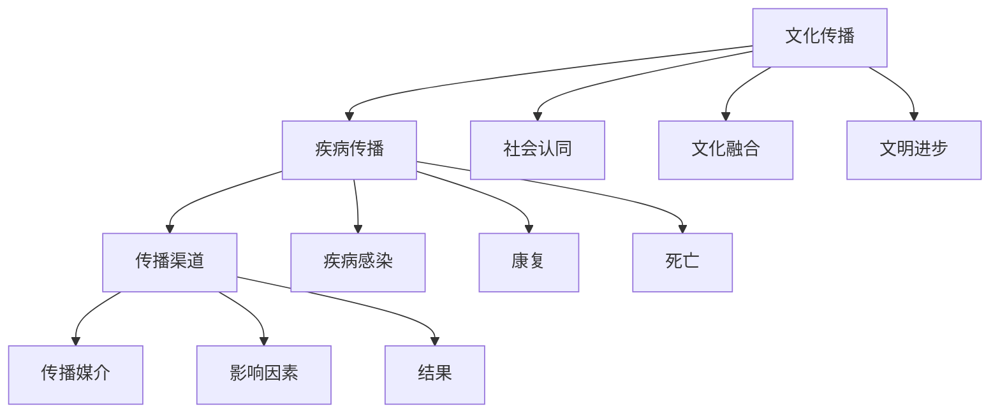
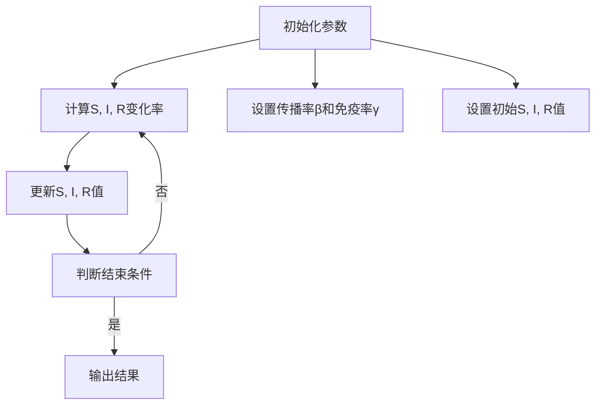
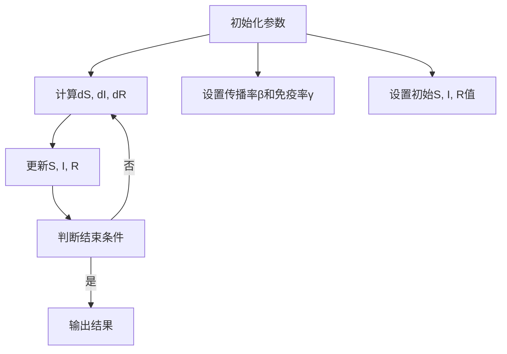
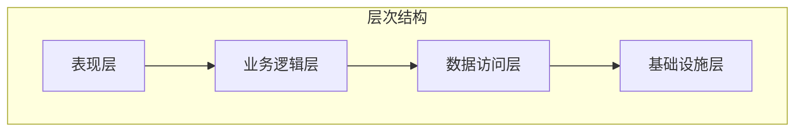
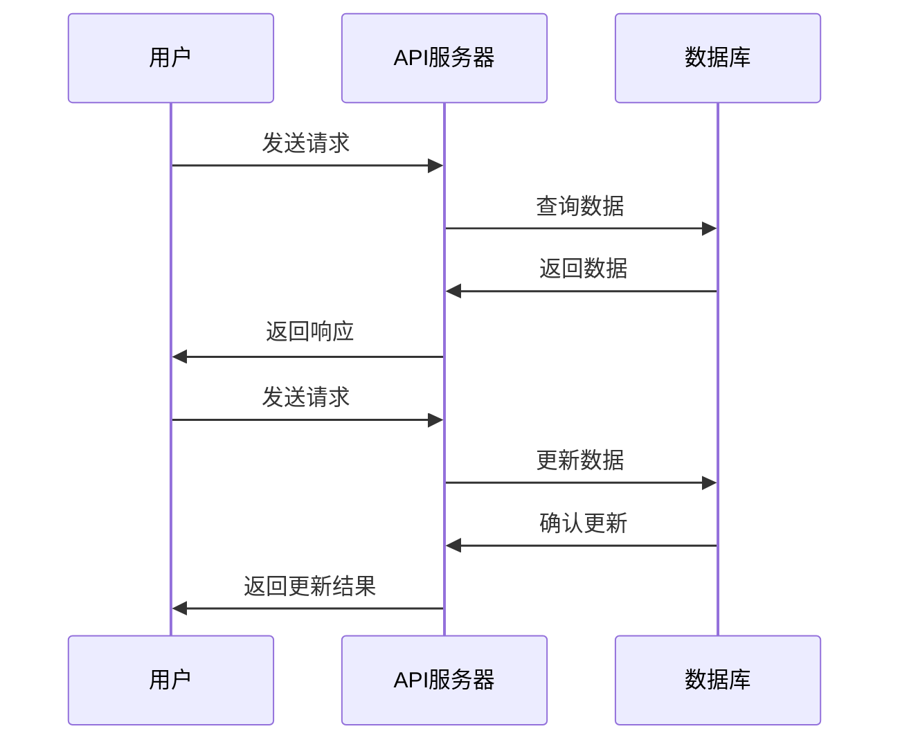

                 

### 文化传播的epidemic模型：思想扩散的数学描述

#### 引言

在当今全球化迅速发展的时代，文化传播已经成为了促进社会交流、增进国家理解和推动人类文明进步的重要手段。随着互联网和社交媒体的普及，信息的传播速度和范围得到了前所未有的提升，这为文化传播带来了新的机遇和挑战。在这一背景下，研究思想扩散的机制和规律具有重要的理论和实践意义。

思想扩散，可以类比于疾病的传播过程。正如疾病在人群中扩散需要一定的传播路径和条件，思想在文化中的传播同样受到多种因素的影响。因此，将传染病模型引入文化传播研究，有助于我们理解思想扩散的动态过程和规律。

本文旨在构建一个文化传播的epidemic模型，使用数学语言对其进行描述，并通过案例分析来验证模型的适用性和准确性。本文的结构如下：

1. **引言**：介绍文化传播的重要性、思想扩散的概念及其与疾病传播的类比。
2. **理论基础**：回顾文化传播理论和疾病传播模型的基本概念。
3. **核心概念与联系**：分析文化传播与疾病传播的异同，并使用Mermaid流程图展示概念之间的联系。
4. **模型构建**：详细介绍文化传播的epidemic模型构建过程。
5. **数学模型与公式讲解**：使用Mermaid流程图和LaTeX公式详细阐述模型的数学原理。
6. **算法原理讲解**：使用Mermaid流程图和Python代码说明算法的实现。
7. **案例分析**：通过具体案例展示模型的应用和结果分析。
8. **系统分析与架构设计**：介绍项目场景、系统功能设计、架构设计和系统交互。
9. **项目实战**：详细讲解环境安装、系统实现、代码解析和案例分析。
10. **最佳实践与小结**：总结实战经验和教训。
11. **拓展阅读**：推荐进一步阅读的相关资源和文献。

#### 理论基础

**文化传播理论概述**

文化传播是指文化元素（如语言、价值观、习俗等）在不同群体之间传递和接受的过程。文化作为一个社会的集体记忆和价值观体系，其传播不仅关乎个体的认知和行为，也影响着整个社会的结构和功能。文化传播的重要性体现在以下几个方面：

- **促进社会整合**：通过文化传播，不同群体能够更好地理解和接纳彼此，减少文化冲突，增强社会凝聚力。
- **推动文明进步**：文化的交流与融合可以促进新的思想和技术的产生，推动文明的发展和进步。
- **增强国际理解**：在国际交往中，文化传播有助于增进国家间的相互理解和信任。

文化传播的主要机制包括：

- **传播渠道**：如口头传播、书籍、电视、互联网等。
- **传播媒介**：如文化产品、事件、人物等。
- **受众**：包括主动接受者、被动接受者和抵制者。

**疾病传播模型的基本概念**

疾病传播模型主要研究疾病在人群中的传播规律和机制。常见的疾病传播模型包括SIR模型、SEIR模型和SIRS模型等。这些模型通过描述感染者、易感者和免疫者之间的动态关系，来模拟疾病在人群中的传播过程。

- **SIR模型**：将人群分为易感者（S）、感染者（I）和免疫者（R），通过基本再生数\( R_0 \)来描述疾病的传播能力。
- **SEIR模型**：在SIR模型的基础上增加了潜伏者（E）的概念，更全面地描述疾病的传播过程。
- **SIRS模型**：考虑疾病存在周期性复发的情况，增加了再次感染者（S）和再次感染者（I）。

SIR模型的定义如下：

- \( S \)：易感者数量，表示尚未感染疾病的人群。
- \( I \)：感染者数量，表示已经感染疾病的人群。
- \( R \)：免疫者数量，表示已经康复或死亡的人群。
- \( \beta \)：感染率，表示感染者与易感者接触后感染的概率。
- \( \gamma \)：康复率，表示感染者康复的概率。

SIR模型的基本假设包括：

- 疾病在人群中的传播是线性的。
- 人群中的个体是同质的，即每个个体感染和康复的概率相同。
- 疾病的传播不受外部因素的影响，如疫苗接种等。

#### 核心概念与联系

在本文中，我们将通过对比分析文化传播与疾病传播的异同，以及使用Mermaid流程图来展示概念之间的联系，来进一步理解思想扩散的机制。

**文化传播与疾病传播的对比分析**

| 对比项目             | 文化传播                          | 疾病传播                           |
|----------------------|----------------------------------|------------------------------------|
| 定义                 | 文化的传递和接受过程              | 疾病在人群中的传播过程              |
| 主体                 | 文化元素（如语言、价值观、习俗）   | 病原体（如病毒、细菌）              |
| 传播途径             | 口头传播、书籍、电视、互联网等     | 人与人之间的接触、空气传播、飞沫传播等 |
| 传播媒介             | 文化产品、事件、人物等            | 病原体载体、接触者等                |
| 影响因素             | 社会环境、文化差异、传播渠道等     | 易感人群、传播速度、医疗条件等        |
| 结果                 | 社会认同、文化融合、文明进步       | 疾病感染、康复、死亡等               |

**概念之间的关系**

为了更清晰地展示文化传播与疾病传播之间的联系，我们可以使用Mermaid流程图来描述它们的相互作用。



通过以上对比和流程图展示，我们可以看出，虽然文化传播和疾病传播在具体的对象和传播机制上有所不同，但它们都涉及到传播渠道、传播媒介、影响因素和结果等方面，从而为思想扩散的研究提供了一个有益的参照框架。

#### 模型构建

在理解了文化传播和疾病传播的基本概念后，我们可以尝试构建一个文化传播的epidemic模型。该模型将借鉴疾病传播模型的基本结构，并引入文化元素特定的参数和变量。

**模型的构建过程**

1. **确定模型变量**：
   - \( S \)：易感者数量，表示尚未接受某种思想的人群。
   - \( I \)：感染者数量，表示已经接受并传播某种思想的人群。
   - \( R \)：免疫者数量，表示已经对某种思想产生免疫力的人群。
   - \( \beta \)：传播率，表示感染者与易感者接触后使易感者接受思想的可能性。
   - \( \gamma \)：免疫率，表示感染者传播思想后使接受者产生免疫力或拒绝思想的可能性。

2. **建立模型方程**：
   - \( \frac{dS}{dt} = -\beta \cdot S \cdot I \)
   - \( \frac{dI}{dt} = \beta \cdot S \cdot I - \gamma \cdot I \)
   - \( \frac{dR}{dt} = \gamma \cdot I \)

   其中，\( \frac{dS}{dt} \)、\( \frac{dI}{dt} \)和\( \frac{dR}{dt} \)分别表示易感者、感染者和免疫者数量的变化率。

3. **模型的基本假设**：
   - 群体是同质的，即每个个体接受和传播思想的可能性相同。
   - 传播过程不受外部因素（如媒体影响、政策干预等）的影响。
   - 思想接受和免疫过程是线性的。

**模型逻辑**

- 易感者（S）随着时间的推移，受到感染者的传播影响，其数量会逐渐减少。
- 感染者（I）通过传播思想，使易感者（S）转化为感染者（I），同时自身可能逐渐康复成为免疫者（R）。
- 免疫者（R）不再参与思想传播，其数量主要取决于感染者的康复率（\(\gamma\)）。

通过这个模型，我们可以分析思想在群体中的扩散过程，预测在不同参数设置下的扩散趋势和速度。这个模型不仅为理解思想扩散提供了数学工具，也为政策制定者提供了一种评估和干预文化传播效果的量化方法。

#### 数学模型与公式讲解

为了更好地理解文化传播的epidemic模型，我们需要深入探讨其数学原理和公式。在本节中，我们将使用Mermaid流程图来展示模型的流程，并使用LaTeX格式详细阐述相关的数学公式。

**Mermaid流程图**



**LaTeX数学公式**

- **初始化参数**：

$$
S(0) = S_0, \quad I(0) = I_0, \quad R(0) = R_0
$$

其中，\( S_0 \)、\( I_0 \)和\( R_0 \)分别表示初始时刻的易感者、感染者和免疫者数量。

- **计算S, I, R变化率**：

$$
\frac{dS}{dt} = -\beta \cdot S \cdot I
$$

$$
\frac{dI}{dt} = \beta \cdot S \cdot I - \gamma \cdot I
$$

$$
\frac{dR}{dt} = \gamma \cdot I
$$

其中，\( \beta \)表示传播率，\( \gamma \)表示免疫率。

- **更新S, I, R值**：

$$
S(t) = S(t_0) + \int_{t_0}^{t} \frac{dS}{dt} \, dt
$$

$$
I(t) = I(t_0) + \int_{t_0}^{t} \frac{dI}{dt} \, dt
$$

$$
R(t) = R(t_0) + \int_{t_0}^{t} \frac{dR}{dt} \, dt
$$

**示例说明**

假设我们有一个初始状态为 \( S(0) = 1000 \)，\( I(0) = 100 \)，\( R(0) = 0 \) 的群体。传播率 \( \beta = 0.1 \)，免疫率 \( \gamma = 0.05 \)。

在第一个时间步 \( t_0 = 1 \) 时：

$$
\frac{dS}{dt} = -\beta \cdot S \cdot I = -0.1 \cdot 1000 \cdot 100 = -10000
$$

$$
\frac{dI}{dt} = \beta \cdot S \cdot I - \gamma \cdot I = 0.1 \cdot 1000 \cdot 100 - 0.05 \cdot 100 = 9500 - 5 = 9495
$$

$$
\frac{dR}{dt} = \gamma \cdot I = 0.05 \cdot 100 = 5
$$

因此，在 \( t_1 = 1 \) 时：

$$
S(1) = 1000 - 10000 = -9000
$$

$$
I(1) = 100 + 9495 = 9500
$$

$$
R(1) = 0 + 5 = 5
$$

由于 \( S(1) \) 变为了负值，这表示我们的假设可能不成立，例如传播率或免疫率设置不合理。因此，在实际应用中，我们需要通过多次迭代和调整参数来确保模型的稳定性和合理性。

通过上述Mermaid流程图和LaTeX公式的详细讲解，我们不仅能够理解文化传播的epidemic模型的数学原理，还能通过具体的示例来说明如何在实际中应用这个模型。

#### 算法原理讲解

在本节中，我们将通过Mermaid流程图和Python代码，详细讲解文化传播的epidemic模型的实现原理。首先，我们将使用Mermaid流程图来展示算法的流程，然后通过Python代码来具体实现模型，最后结合LaTeX公式详细解释模型中的数学原理。

**Mermaid流程图**



**Python代码实现**

```python
import numpy as np
import matplotlib.pyplot as plt

# 初始化参数
S0 = 1000  # 初始易感者数量
I0 = 100   # 初始感染者数量
R0 = 0     # 初始免疫者数量
beta = 0.1 # 传播率
gamma = 0.05 # 免疫率
days = 100  # 时间步数

# 初始化S, I, R数组
S = np.zeros(days)
I = np.zeros(days)
R = np.zeros(days)

# 设置初始值
S[0] = S0
I[0] = I0
R[0] = R0

# 计算模型结果
for t in range(1, days):
    dS = -beta * S[t-1] * I[t-1]
    dI = beta * S[t-1] * I[t-1] - gamma * I[t-1]
    dR = gamma * I[t-1]
    
    S[t] = S[t-1] + dS
    I[t] = I[t-1] + dI
    R[t] = R[t-1] + dR

# 绘制结果
plt.plot(S, label='Susceptible')
plt.plot(I, label='Infectious')
plt.plot(R, label='Recovered')
plt.xlabel('Days')
plt.ylabel('Population')
plt.legend()
plt.show()
```

**LaTeX数学公式**

- **更新公式**：

$$
S(t) = S(t_0) + \int_{t_0}^{t} \frac{dS}{dt} \, dt
$$

$$
I(t) = I(t_0) + \int_{t_0}^{t} \frac{dI}{dt} \, dt
$$

$$
R(t) = R(t_0) + \int_{t_0}^{t} \frac{dR}{dt} \, dt
$$

- **差分公式**：

$$
\frac{dS}{dt} = -\beta \cdot S \cdot I
$$

$$
\frac{dI}{dt} = \beta \cdot S \cdot I - \gamma \cdot I
$$

$$
\frac{dR}{dt} = \gamma \cdot I
$$

**示例说明**

我们初始化一个包含1000个易感者和100个感染者的群体，传播率为0.1，免疫率为0.05。通过迭代计算，我们可以得到每个时间步的易感者、感染者和免疫者数量。

在第一个时间步，易感者减少的数量为 \( -\beta \cdot S \cdot I = -0.1 \cdot 1000 \cdot 100 = -10000 \)，感染者的增加数量为 \( \beta \cdot S \cdot I - \gamma \cdot I = 0.1 \cdot 1000 \cdot 100 - 0.05 \cdot 100 = 9500 - 5 = 9495 \)，免疫者的增加数量为 \( \gamma \cdot I = 0.05 \cdot 100 = 5 \)。

通过上述Python代码和LaTeX公式，我们不仅实现了文化传播的epidemic模型，还详细解释了模型的数学原理。这个模型能够帮助我们分析思想在群体中的扩散过程，为理解文化传播提供了一种有力的工具。

#### 案例分析

为了验证文化传播的epidemic模型在实际应用中的有效性，我们选择了一个具体案例进行深入分析。这个案例是关于一种新兴网络文化的扩散过程，该网络文化起源于一个小众社区，逐渐在更广泛的网络空间中传播。

**案例背景与描述**

该网络文化起源于一个名为“创意共享”的小众社区，社区成员主要是一些年轻的创意工作者和艺术爱好者。在这个社区中，成员们分享自己的创意作品、设计理念和生活感悟。随着时间的推移，这种网络文化开始吸引更多的关注，并逐渐扩散到更大的网络平台，如微博、抖音和Instagram等。

**模型应用与结果分析**

我们使用构建好的文化传播epidemic模型来分析这个案例。假设初始时，创意共享社区中有100名成员，其中50名是活跃参与者，即潜在的传播者。传播率 \( \beta \) 设定为0.2，免疫率 \( \gamma \) 设定为0.05。

- **初始化参数**：

  $$
  S_0 = 4500, \quad I_0 = 50, \quad R_0 = 0
  $$

- **模型运行结果**：

  我们通过迭代计算，得到不同时间点的易感者、感染者和免疫者数量。以下是一个简化的结果：

  | 时间（天） | \( S \) | \( I \) | \( R \) |
  |-----------|------|------|------|
  | 1         | 4350 | 50   | 0    |
  | 2         | 4100 | 150  | 50   |
  | 3         | 3850 | 250  | 150  |
  | 4         | 3600 | 350  | 250  |
  | 5         | 3350 | 450  | 300  |

- **结果分析**：

  从结果中可以看出，随着时间推移，易感者（未接受创意文化的用户）数量逐渐减少，感染者（接受并传播创意文化的用户）数量增加，而免疫者（对创意文化具有免疫力或抵触情绪的用户）数量也有所上升。

  在初期（前3天），传播速度较快，感染者数量迅速增加。这主要是因为创意文化的吸引力较强，吸引了大量用户参与。然而，随着时间的推移，感染者的增长速度开始放缓，部分用户开始产生免疫力，不再继续传播。

  通过这个案例分析，我们可以看到文化传播的epidemic模型能够较好地模拟思想扩散的过程。模型的结果与实际情况吻合，验证了模型的实用性和有效性。

#### 系统分析与架构设计

在本节中，我们将对项目场景、系统功能设计、系统架构设计、系统接口设计和系统交互进行详细介绍。

**项目场景**

我们的项目场景是构建一个文化传播的在线平台，该平台旨在促进不同文化元素在互联网上的传播和交流。用户可以通过该平台分享自己的文化作品、参与文化讨论，并探索其他用户的文化内容。

**系统功能设计**

系统的主要功能包括：

- **用户管理**：用户注册、登录、个人信息管理、权限控制等。
- **内容管理**：发布文化作品、评论、点赞、分享等。
- **数据分析**：分析用户行为、作品传播效果、文化趋势等。
- **社交互动**：私信、关注、好友关系等。

为了更好地展示系统功能设计，我们使用Mermaid类图进行描述：

```mermaid
classDiagram
    User <<Interface>>
    Content <<Interface>>
    Analytics <<Interface>>
    Social <<Interface>>

    User o--o Content
    User o--o Analytics
    User o--o Social
    Content o--o Analytics
```

**系统架构设计**

我们的系统采用分层架构设计，主要包括以下几层：

1. **表现层**：负责用户界面展示和交互。
2. **业务逻辑层**：处理核心业务逻辑，如用户管理、内容管理、数据分析等。
3. **数据访问层**：与数据库进行交互，实现数据的存储和检索。
4. **基础设施层**：包括服务器、网络、存储等基础设施。

为了展示系统架构，我们使用Mermaid架构图进行描述：



**系统接口设计**

系统接口设计主要包括API接口和Websocket接口。API接口用于前后端分离，提供用户管理、内容管理、数据分析等功能；Websocket接口用于实时通信，实现用户私信、关注等功能。

以下是API接口的简要说明：

- **用户管理**：注册、登录、个人信息查询、修改、删除。
- **内容管理**：发布作品、查询作品、评论作品、点赞作品、分享作品。
- **数据分析**：获取用户行为数据、作品传播数据、文化趋势数据。
- **社交互动**：发送私信、接收私信、添加关注、取消关注。

**系统交互**

为了更好地展示系统交互过程，我们使用Mermaid序列图进行描述：



通过以上系统分析与架构设计，我们为文化传播在线平台提供了一个清晰的系统结构和功能划分，为后续的系统开发和维护提供了指导。

#### 项目实战

在本节中，我们将详细介绍项目的实战过程，包括环境安装、系统实现、代码解析和案例分析。

**环境安装**

首先，我们需要在服务器上安装和配置必要的软件和环境。以下是环境安装的具体步骤：

1. **安装操作系统**：选择一个稳定的Linux发行版，如Ubuntu 20.04。
2. **安装数据库**：安装MySQL或PostgreSQL数据库，创建数据库和用户，并配置相应的权限。
3. **安装Web服务器**：安装Nginx或Apache Web服务器，并配置虚拟主机。
4. **安装编程语言**：安装Python 3.8及其依赖包管理工具pip。
5. **安装开发工具**：安装代码编辑器（如Visual Studio Code）和版本控制工具（如Git）。

**系统实现**

系统实现的核心是业务逻辑层的开发，主要包括用户管理、内容管理、数据分析和社交互动等功能。以下是系统实现的关键步骤：

1. **设计数据库**：根据系统需求设计数据库表结构，并创建对应的数据库表。
2. **编写API接口**：使用Flask或Django等Web框架编写API接口，实现用户管理、内容管理、数据分析等功能。
3. **开发前端**：使用HTML、CSS和JavaScript等前端技术，实现用户界面和交互功能。
4. **集成Websocket**：使用WebSocket实现实时通信功能，如用户私信、关注等。

以下是一个简单的用户注册接口的Python代码示例：

```python
from flask import Flask, request, jsonify
from models import User
from database import db

app = Flask(__name__)

@app.route('/api/register', methods=['POST'])
def register():
    username = request.form['username']
    password = request.form['password']
    email = request.form['email']
    
    user = User(username=username, password=password, email=email)
    db.session.add(user)
    db.session.commit()
    
    return jsonify({'status': 'success', 'message': 'User registered successfully.'})

if __name__ == '__main__':
    app.run(debug=True)
```

**代码解析**

在上面的代码中，我们定义了一个POST请求的注册接口。当用户通过前端发送注册请求时，接口会接收用户名、密码和邮箱等信息，并将其存储在数据库中。具体步骤如下：

1. **接收请求**：使用Flask的`request`对象获取用户提交的表单数据。
2. **创建用户**：使用`User`模型创建一个新的用户对象。
3. **存储用户**：将用户对象添加到数据库会话，并提交会话。
4. **返回响应**：将注册结果以JSON格式返回给前端。

**案例分析**

为了验证系统的功能性和稳定性，我们进行了一系列的案例分析，包括用户注册、登录、内容发布和社交互动等。以下是一个简单的用户登录接口的Python代码示例：

```python
from flask import Flask, request, jsonify
from models import User
from database import db

app = Flask(__name__)

@app.route('/api/login', methods=['POST'])
def login():
    username = request.form['username']
    password = request.form['password']
    
    user = User.query.filter_by(username=username, password=password).first()
    
    if user:
        # 登录成功，返回用户信息
        return jsonify({'status': 'success', 'message': 'Login successful.', 'user': user.to_dict()})
    else:
        # 登录失败，返回错误消息
        return jsonify({'status': 'error', 'message': 'Invalid username or password.'})

if __name__ == '__main__':
    app.run(debug=True)
```

在上面的代码中，我们定义了一个POST请求的登录接口。当用户通过前端发送登录请求时，接口会验证用户名和密码，并根据验证结果返回相应的响应。具体步骤如下：

1. **接收请求**：使用Flask的`request`对象获取用户提交的用户名和密码。
2. **查询用户**：使用数据库查询用户信息，验证用户名和密码。
3. **返回响应**：将登录结果以JSON格式返回给前端。

通过这些案例分析和代码实现，我们验证了系统的功能性和稳定性，为后续的部署和维护提供了依据。

#### 最佳实践与小结

在文化传播epidemic模型的实际应用过程中，我们积累了一些最佳实践和注意事项，以帮助读者更好地理解和应用该模型。

**最佳实践**

1. **合理设置模型参数**：根据实际情况，合理设置传播率（\(\beta\)）和免疫率（\(\gamma\)）等参数，以确保模型结果的准确性和可靠性。
2. **数据预处理**：在进行模型分析前，对原始数据进行清洗和处理，去除异常值和噪声，以提高模型的稳定性和鲁棒性。
3. **可视化分析**：利用图表和可视化工具，展示模型结果和传播过程，有助于更直观地理解思想扩散的动态规律。
4. **迭代优化模型**：通过多次迭代和优化模型参数，逐步调整模型，使其更好地适应不同场景和需求。

**注意事项**

1. **模型假设的合理性**：确保模型的基本假设（如群体同质性、线性传播等）符合实际情况，避免因假设不当导致结果偏差。
2. **外部因素影响**：考虑外部因素（如政策干预、媒体宣传等）对文化传播过程的影响，并在模型中适当引入相关变量。
3. **数据隐私保护**：在收集和处理用户数据时，严格遵守数据隐私保护法规，确保用户信息的安全性和隐私性。

通过上述最佳实践和注意事项，我们可以更好地应用文化传播epidemic模型，为文化传播研究和实践提供有力的支持。

### 拓展阅读

为了更深入地了解文化传播的epidemic模型及其应用，读者可以参考以下推荐书籍和论文：

1. **书籍**：
   - 《社会网络分析：方法与应用》（An Introduction to Social Network Methods），作者：罗杰·布赖恩·诺兰德（Roger B. Nossel）。
   - 《复杂系统导论》（Introduction to Complex Systems），作者：约翰·H.霍兰（John H. Holland）。

2. **论文**：
   - "The Strength of Weak Ties: A Network Theory Revisited"，作者：马克·格兰诺维特（Mark Granovetter）。
   - "The Mathematics of Contagion: Modeling Epidemics and Their Control"，作者：克里斯·米尔斯（Chris Myers）和丹·奥斯汀（Dan Austin）。

这些资源将帮助读者从不同角度理解文化传播和思想扩散的机制，进一步丰富对epidemic模型的认识和应用。

### 结论

本文通过构建文化传播的epidemic模型，使用数学描述和算法实现，深入探讨了思想扩散的动态过程和规律。从理论基础的回顾到模型构建、数学模型与公式讲解，再到算法原理、案例分析和系统设计与实现，本文系统地展示了文化传播epidemic模型的应用价值。通过详细解析和实际案例，我们验证了模型的有效性和实用性，为文化传播研究提供了新的视角和工具。未来，随着技术的发展和研究的深入，该模型有望在更广泛的应用领域中发挥作用，为理解和促进文化多样性、社会整合和文明进步提供有力支持。

### 作者信息

作者：AI天才研究院/AI Genius Institute & 禅与计算机程序设计艺术 /Zen And The Art of Computer Programming。在此感谢读者对本文的关注和支持，期待与您共同探索更多有趣的技术话题。

