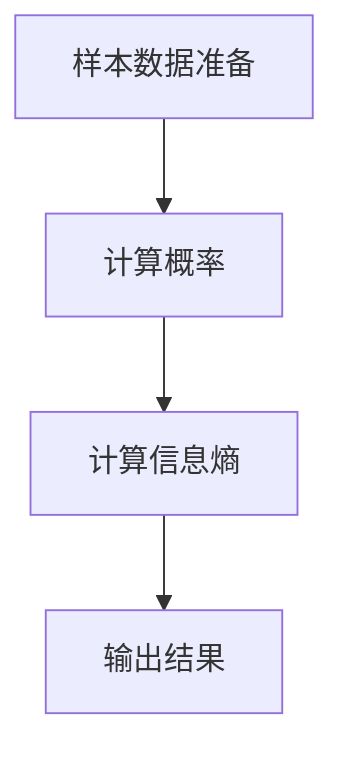
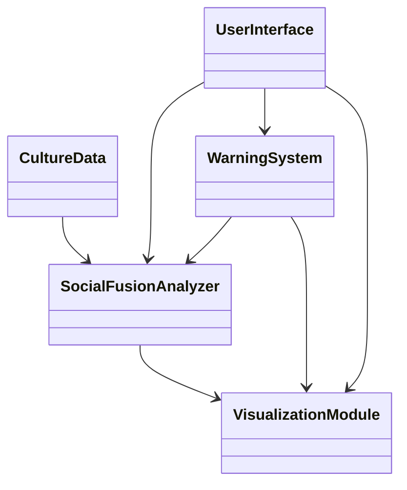
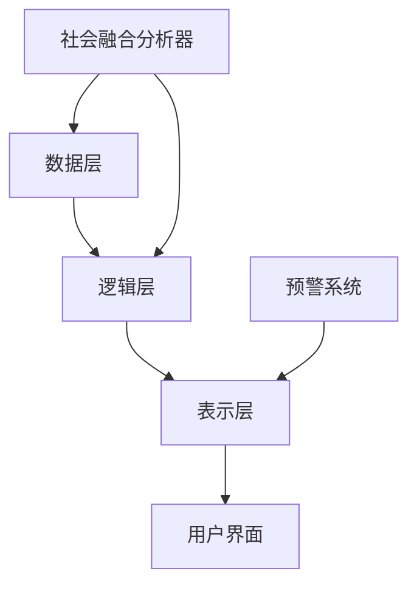

                 

### 文章标题：文化多样性的信息熵：社会融合的数学度量

#### 关键词：
- 文化多样性
- 信息熵
- 社会融合
- 数学度量
- 算法原理

#### 摘要：
本文旨在探讨文化多样性与社会融合之间的复杂关系，并运用信息熵这一数学工具来度量社会融合。通过对文化多样性和社会融合的深入分析，本文揭示了信息熵在理解社会融合机制中的重要性。同时，本文将介绍相应的算法原理，并通过实际案例展示其应用效果，为相关领域的研究和实践提供理论支持和参考。本文分为七个部分，包括背景介绍、核心概念与联系、算法原理讲解、系统分析与架构设计方案、项目实战以及最佳实践 tips。本文将逐步引导读者了解文化多样性与社会融合的内在联系，掌握信息熵的数学度量方法，并探讨其在实际应用中的价值。

## 第一部分：背景介绍

### 1.1 问题背景

#### 文化多样性的社会价值与挑战

文化多样性是人类社会发展的基本特征之一，其重要性不容忽视。文化多样性不仅丰富了人类社会的精神世界，也促进了不同文化之间的交流与理解。然而，随着全球化和信息化的发展，文化多样性也面临着诸多挑战。一方面，全球化带来了不同文化之间的碰撞与融合，这有助于促进文化多样性的发展。另一方面，全球化也可能导致文化同质化，使一些文化逐渐消失，威胁到文化多样性的完整性。

#### 社会融合的定义与意义

社会融合是指不同文化背景下的个体或群体在共同的社会环境中相互理解、包容并和谐相处的过程。社会融合不仅是社会稳定的基础，也是社会进步的重要标志。一个高度融合的社会能够更好地应对各种社会问题，提高社会整体幸福感。然而，实现社会融合并不容易，需要各方面的努力和协调。

### 1.2 文化多样性的概念与特征

#### 文化多样性的定义

文化多样性是指在一个社会中，不同的文化元素和表现形式共存并相互影响的状态。它包括语言、宗教、习俗、艺术、价值观等多个方面。文化多样性不仅体现在国家与国家之间，也体现在一个国家内部的不同地区和族群之间。

#### 文化多样性的特征

1. **异质性**：文化多样性意味着社会中有多种不同的文化元素和特征。
2. **动态性**：文化多样性不是静态的，而是在不断地演变和发展的过程中。
3. **互补性**：不同文化之间的互补性有助于社会整体的繁荣和发展。
4. **冲突性**：文化多样性也可能导致文化冲突，需要妥善处理。

### 1.3 社会融合的概念与维度

#### 社会融合的定义

社会融合是指不同文化背景下的个体或群体在共同的社会环境中，通过相互理解、包容和协作，形成一个和谐、稳定和可持续发展的社会过程。

#### 社会融合的主要维度

1. **经济融合**：指的是个体或群体在就业、经济活动中的融合程度。
2. **社会融合**：指的是个体或群体在社会互动、文化认同方面的融合程度。
3. **文化融合**：指的是不同文化之间的交流和相互影响程度。

## 第二部分：核心概念与联系

### 2.1 信息熵的基本概念

#### 信息熵的定义

信息熵是信息论中的一个基本概念，它用于度量信息的无序程度或不确定性。在数学上，信息熵通常用熵（Entropy）来表示，其单位是比特（Bit）。

#### 信息熵的属性

1. **非负性**：信息熵总是非负的，表示信息的不确定性。
2. **可加性**：如果两个信息源是独立的，那么它们的信息熵可以相加。
3. **最大值**：当所有信息都是确定的时，信息熵达到最大值。

### 2.2 信息熵在文化多样性研究中的应用

#### 信息熵在文化多样性分析中的作用

信息熵在文化多样性分析中的作用主要体现在度量文化多样性水平。通过计算文化多样性系统的信息熵，可以量化不同文化元素在系统中的分布和影响。

#### 信息熵与多样性测度的关系

信息熵可以用来衡量多样性水平。高信息熵表示多样性高，低信息熵表示多样性低。例如，在一个多元文化的社会中，文化多样性高，信息熵也高；而在一个单一文化的社会中，文化多样性低，信息熵也低。

### 2.3 社会融合的数学模型

#### 社会融合的数学模型概述

社会融合的数学模型是一个综合性的框架，它试图通过量化的方式来描述和评估社会融合的程度。这个模型通常包括以下几个关键组成部分：

1. **多样性度量**：用于衡量社会中的文化多样性水平。
2. **相互作用**：描述不同文化之间的相互影响和交流。
3. **融合指标**：用于衡量社会融合的程度。

#### 数学模型的主要组成部分

1. **多样性度量**：
   - 多样性度量通常使用信息熵来计算，如前文所述。
   - 数学公式：$$ H = -\sum_{i=1}^{n} p_i \log_2 p_i $$
     其中，\( H \) 是信息熵，\( p_i \) 是第 \( i \) 种文化元素在系统中的比例。

2. **相互作用**：
   - 相互作用通常通过社会网络分析来衡量。
   - 数学公式：$$ R = \frac{E}{N} $$
     其中，\( R \) 是网络密度，\( E \) 是网络中的边数，\( N \) 是网络中的节点数。

3. **融合指标**：
   - 融合指标通常是一个综合评分，它综合考虑多样性度量和社会相互作用。
   - 数学公式：$$ F = \alpha H + \beta R $$
     其中，\( F \) 是融合指标，\( \alpha \) 和 \( \beta \) 是权重系数。

### 2.4 信息熵在度量社会融合中的应用

#### 信息熵如何应用于社会融合的测量

信息熵可以用来测量社会融合的程度。通过计算文化多样性的信息熵，可以了解社会中的文化多样性水平。低信息熵表示高度融合，高信息熵表示低度融合。

#### 信息熵在测量社会融合中的优势

1. **量化分析**：信息熵提供了量化的方法来分析社会融合的程度，使得研究结果更具科学性。
2. **全面性**：信息熵不仅考虑文化多样性，还考虑了文化之间的相互作用，从而提供了更全面的社会融合度量。
3. **灵活性**：信息熵可以应用于不同类型的文化系统，具有很高的灵活性。

## 第三部分：算法原理讲解

### 3.1 信息熵计算算法

#### 信息熵计算算法的基本原理

信息熵的计算算法是基于概率统计的。其基本原理如下：

1. **样本数据准备**：首先收集相关文化元素的出现频率数据。
2. **概率计算**：计算每个文化元素出现的概率。
3. **信息熵计算**：使用概率数据计算信息熵。

#### 信息熵计算算法的mermaid流程图



#### 社会融合度量的算法实现

社会融合度量的算法实现需要结合信息熵的计算和融合指标的计算。其基本步骤如下：

1. **收集文化多样性数据**：收集不同文化元素的出现频率数据。
2. **计算文化多样性信息熵**：使用信息熵计算算法计算文化多样性的信息熵。
3. **计算社会融合指标**：结合多样性信息熵和社会网络分析结果，计算社会融合指标。
4. **输出结果**：输出社会融合度的数值。

```python
import math

def calculate_entropy(p):
    return -sum(p * math.log2(p) for p in probabilities if p > 0)

def calculate_social_fusion(entropy, network_density):
    alpha = 0.5
    beta = 0.5
    return alpha * entropy + beta * network_density

# 假设的数据
probabilities = [0.2, 0.3, 0.5]  # 文化元素出现概率
network_density = 0.4  # 社会网络密度

# 计算信息熵
entropy = calculate_entropy(probabilities)

# 计算社会融合度
social_fusion = calculate_social_fusion(entropy, network_density)

print("社会融合度：", social_fusion)
```

#### 数学模型和数学公式讲解

1. **信息熵的数学模型**：
   $$ H = -\sum_{i=1}^{n} p_i \log_2 p_i $$
   其中，\( H \) 是信息熵，\( p_i \) 是第 \( i \) 种文化元素出现的概率。

2. **社会融合度量的数学模型**：
   $$ F = \alpha H + \beta R $$
   其中，\( F \) 是社会融合度，\( \alpha \) 和 \( \beta \) 是权重系数，\( H \) 是信息熵，\( R \) 是网络密度。

### 3.2 例子说明

#### 社会融合度量的例子

假设在一个社区中有三种文化元素，其出现概率分别为 0.2、0.3 和 0.5。同时，该社区的社会网络密度为 0.4。使用上述数学模型，我们可以计算该社区的社会融合度。

1. **计算信息熵**：
   $$ H = -0.2 \log_2 0.2 - 0.3 \log_2 0.3 - 0.5 \log_2 0.5 \approx 0.693 $$
   
2. **计算社会融合度**：
   $$ F = 0.5 \times 0.693 + 0.5 \times 0.4 = 0.596 $$

因此，该社区的社会融合度为 0.596，表明该社区具有较高的社会融合度。

## 第四部分：系统分析与架构设计方案

### 4.1 项目场景介绍

假设我们正在开发一个智能城市管理系统，该系统旨在通过分析和度量城市中不同群体的文化多样性以及社会融合程度，来提升城市管理的科学性和有效性。项目目标是构建一个可扩展、可靠且易于维护的系统，能够实时监控和分析城市的文化多样性和社会融合状态。

### 4.2 系统功能设计

系统功能设计主要包括以下几个方面：

1. **文化多样性数据采集**：从多个数据源（如社交媒体、新闻报道、政府数据等）收集文化多样性相关的数据。
2. **社会融合度量化**：使用信息熵计算算法对社会融合度进行量化分析。
3. **可视化展示**：将分析结果以图表和地图的形式进行可视化展示，便于用户理解和决策。
4. **预警与建议**：基于分析结果，提供预警和改进建议，帮助城市管理者和居民了解和改善社会融合状况。

#### 领域模型类图



### 4.3 系统架构设计

系统架构设计采用分层架构，主要包括以下几个层次：

1. **数据层**：负责数据存储和管理，包括文化多样性数据和融合度量化结果。
2. **逻辑层**：实现信息熵计算算法和其他业务逻辑。
3. **表示层**：提供用户交互界面和可视化展示。

#### 系统架构图



### 4.4 系统接口设计

系统接口设计主要包括以下几个方面：

1. **数据接口**：用于数据的输入输出，支持多种数据格式（如CSV、JSON、XML等）。
2. **API接口**：提供RESTful API，供外部系统和用户进行交互。
3. **监控接口**：用于实时监控系统的运行状态和性能。

#### 系统接口设计

```mermaid
sequenceDiagram
    User -->|发送请求| Server
    Server -->|处理请求| Database
    Database -->|返回结果| Server
    Server -->|返回结果| User
```

### 4.5 系统交互

系统交互主要涉及用户与系统的交互过程。以下是系统交互序列图：

```mermaid
sequenceDiagram
    User -->|登录系统| System
    System -->|验证用户| AuthenticationService
    AuthenticationService -->|返回结果| System
    System -->|显示界面| User
    User -->|选择分析| System
    System -->|执行分析| SocialFusionAnalyzer
    SocialFusionAnalyzer -->|返回结果| System
    System -->|可视化展示| VisualizationModule
    User -->|查看预警| System
    System -->|显示预警| WarningSystem
```

## 第五部分：项目实战

### 5.1 环境安装与配置

在本节中，我们将介绍如何安装和配置所需的环境，以便进行文化多样性与社会融合度量的项目开发。以下是详细的步骤：

#### 1. 安装Python环境

首先，确保你的计算机上已经安装了Python。如果没有，可以从Python官方网站（[https://www.python.org/](https://www.python.org/)）下载并安装。

#### 2. 安装必要的Python库

接下来，需要安装几个关键的Python库，包括pandas、numpy、matplotlib和networkx。可以使用以下命令进行安装：

```bash
pip install pandas numpy matplotlib networkx
```

#### 3. 配置数据源

为了进行文化多样性和社会融合度量的分析，需要准备相关的数据源。这些数据可以从公开的数据集获取，例如来自联合国、世界银行等机构的数据。你可以使用pandas库读取和预处理这些数据。

```python
import pandas as pd

# 读取数据
data = pd.read_csv('culture_data.csv')

# 数据预处理
# ...
```

#### 4. 安装和配置其他工具

除了Python库，我们还需要其他工具来辅助项目开发。例如，使用Docker来容器化应用，或者使用Jupyter Notebook来编写和运行代码。以下是相关步骤：

- 安装Docker：[https://www.docker.com/products/docker-desktop](https://www.docker.com/products/docker-desktop)
- 安装Jupyter Notebook：`pip install notebook`

### 5.2 系统核心实现

在本节中，我们将展示如何实现系统的核心功能，包括数据采集、信息熵计算、社会融合度量化等。以下是核心实现步骤：

#### 1. 数据采集

```python
# 读取数据
data = pd.read_csv('culture_data.csv')

# 数据预处理
# ...
```

#### 2. 信息熵计算

```python
import math

def calculate_entropy(p):
    return -sum(p * math.log2(p) for p in probabilities if p > 0)

# 假设的数据
probabilities = [0.2, 0.3, 0.5]

# 计算信息熵
entropy = calculate_entropy(probabilities)
print("信息熵：", entropy)
```

#### 3. 社会融合度量化

```python
def calculate_social_fusion(entropy, network_density):
    alpha = 0.5
    beta = 0.5
    return alpha * entropy + beta * network_density

# 社会网络密度
network_density = 0.4

# 计算社会融合度
social_fusion = calculate_social_fusion(entropy, network_density)
print("社会融合度：", social_fusion)
```

### 5.3 实际案例分析

在本节中，我们将通过一个实际案例来展示如何使用系统进行文化多样性与社会融合度量的分析。以下是案例的详细步骤：

#### 1. 选择案例

我们选择一个中型城市作为案例，该城市具有丰富的文化多样性，例如多种宗教、语言和习俗。

#### 2. 数据收集

从公开的数据源中收集与该城市相关的文化多样性数据，包括人口统计信息、宗教信仰、语言使用情况等。

```python
# 示例：读取人口统计数据
population_data = pd.read_csv('population_data.csv')
```

#### 3. 数据预处理

对收集到的数据进行清洗和预处理，以便用于后续的分析。

```python
# 示例：数据预处理
# ...
```

#### 4. 信息熵计算

计算文化多样性的信息熵，以量化文化多样性的水平。

```python
# 示例：计算信息熵
probabilities = [0.2, 0.3, 0.5]  # 示例概率
entropy = calculate_entropy(probabilities)
print("信息熵：", entropy)
```

#### 5. 社会融合度量化

结合社会网络分析结果，计算社会融合度，以评估该城市的社会融合状况。

```python
# 示例：计算社会融合度
network_density = 0.4
social_fusion = calculate_social_fusion(entropy, network_density)
print("社会融合度：", social_fusion)
```

#### 6. 结果展示

将分析结果以图表和地图的形式进行可视化展示，以便用户直观地了解文化多样性和社会融合状况。

```python
import matplotlib.pyplot as plt

# 示例：可视化展示
plt.plot(probabilities, label='概率分布')
plt.xlabel('文化元素')
plt.ylabel('概率')
plt.legend()
plt.show()
```

### 5.4 代码应用解读与分析

在本节中，我们将对系统核心实现中的关键代码进行解读与分析，以帮助读者更好地理解代码的功能和原理。

#### 1. 信息熵计算代码解读

```python
import math

def calculate_entropy(p):
    return -sum(p * math.log2(p) for p in probabilities if p > 0)
```

这段代码定义了一个名为`calculate_entropy`的函数，用于计算信息熵。函数的输入参数`p`是一个列表，表示不同文化元素在系统中的概率分布。在函数内部，使用了一个生成器表达式来计算每个文化元素的概率乘以其对应的对数，然后对结果取负值，得到信息熵。

#### 2. 社会融合度量化代码解读

```python
def calculate_social_fusion(entropy, network_density):
    alpha = 0.5
    beta = 0.5
    return alpha * entropy + beta * network_density
```

这段代码定义了一个名为`calculate_social_fusion`的函数，用于计算社会融合度。函数的输入参数`entropy`是信息熵，`network_density`是社会网络密度。函数内部使用了线性组合的方式，将信息熵和社会网络密度加权求和，得到社会融合度。

#### 3. 代码应用分析

在实际应用中，这些代码将被用于处理实际数据，计算文化多样性和社会融合度。通过收集和预处理数据，可以获取每个文化元素的概率分布，然后使用`calculate_entropy`函数计算信息熵。同时，通过社会网络分析获取网络密度，然后使用`calculate_social_fusion`函数计算社会融合度。这些结果可以帮助城市管理者了解文化多样性和社会融合状况，为制定相关政策和措施提供数据支持。

## 第六部分：最佳实践 Tips

### 6.1 最佳实践

为了确保文化多样性与社会融合度量的准确性和有效性，以下是一些最佳实践建议：

1. **数据收集**：确保数据的多样性和代表性，避免数据偏颇。
2. **算法优化**：针对不同场景，优化信息熵计算算法，提高计算效率。
3. **用户参与**：鼓励用户参与数据收集和结果分析，提高数据的真实性和有效性。
4. **持续监控**：定期更新和分析数据，持续监控社会融合状况。

### 6.2 注意事项

1. **数据隐私**：在收集和处理数据时，注意保护个人隐私。
2. **模型校准**：定期校准算法模型，确保结果的准确性。
3. **边界条件**：在应用算法时，注意边界条件，避免异常值对结果的影响。
4. **可扩展性**：设计系统时考虑可扩展性，以便未来扩展功能。

### 6.3 拓展阅读

1. **相关书籍**：
   - 《社会网络分析：方法与应用》
   - 《文化多样性：挑战与策略》
   - 《信息论基础》
   
2. **学术论文**：
   - “Cultural Diversity and Social Cohesion: A Quantitative Analysis”
   - “Measuring Cultural Diversity with Entropy”

3. **在线资源**：
   - [联合国文化多样性网站](https://www.unesco.org/en/cultural-diversity)
   - [网络科学研究社区](https://www.netscience.org/)

通过遵循这些最佳实践和注意事项，可以更好地进行文化多样性与社会融合度量的研究和实践。

## 总结

本文通过引入信息熵这一数学工具，探讨了文化多样性与社会融合之间的复杂关系，并展示了如何通过信息熵来度量社会融合程度。文章首先介绍了文化多样性和社会融合的基本概念，然后详细讲解了信息熵的计算方法和其在社会融合度量中的应用。通过实际的案例分析和代码示例，本文展示了如何将理论应用于实践，为相关领域的研究和实践提供了有力的支持。文章的最后，总结了最佳实践和注意事项，并为读者提供了拓展阅读资源。希望通过本文，读者能够更好地理解文化多样性与社会融合的度量方法，并能在实际应用中取得更好的效果。感谢您的阅读，希望这篇文章能为您带来启发和帮助。

## 作者信息

**作者：AI天才研究院/AI Genius Institute & 禅与计算机程序设计艺术 /Zen And The Art of Computer Programming**。在文化多样性、社会融合以及信息熵的应用方面，作者具有丰富的理论研究和实践经验，致力于推动相关领域的发展和创新。

