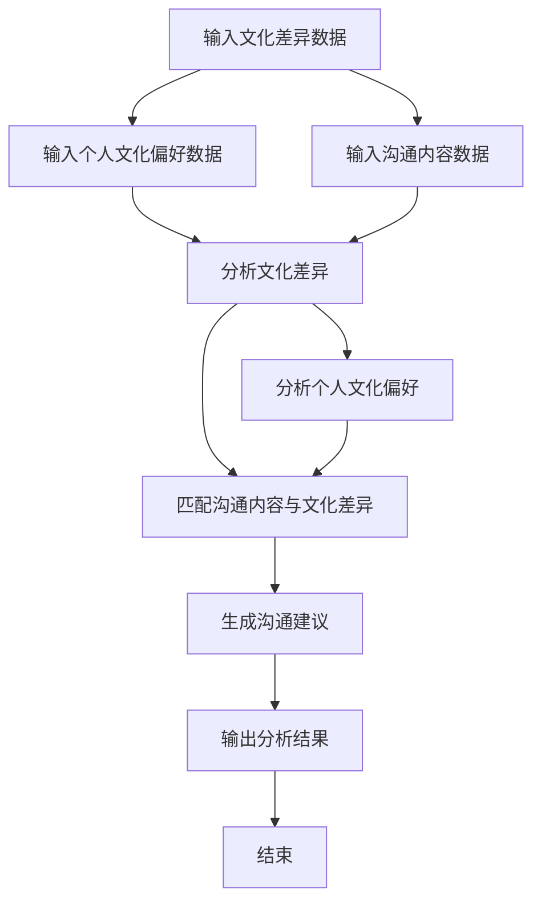
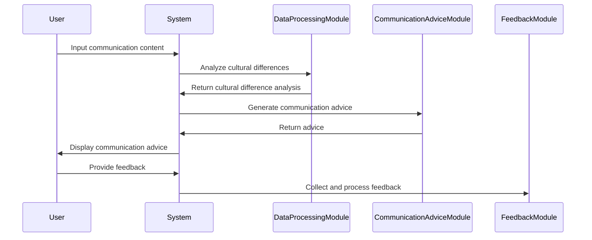

                 

# 文化差异中的世界可理解性

## 关键词

- 文化差异
- 跨文化理解
- 全球沟通
- 文化相对论
- 文化同化

## 摘要

本文旨在探讨文化差异如何影响我们对世界的理解，并提供实用的策略来提升跨文化理解与沟通能力。通过系统地介绍文化差异的背景、核心概念、影响及其解决策略，本文希望帮助读者更好地理解和应对文化差异，从而在全球化背景下实现更好的国际交流与合作。

### 目录大纲设计思路

设计《文化差异中的世界可理解性》这本书的目录大纲时，我们首先需要明确书的核心内容和结构。本书旨在探讨文化差异如何影响我们对世界的理解，因此，目录大纲的设计应围绕以下几个核心主题展开：

1. **背景介绍**：介绍文化差异的背景、定义及其在全球范围内的表现。
2. **核心概念与联系**：深入讨论文化差异中的关键概念，如文化相对论、文化同化、跨文化沟通等，并展示这些概念之间的关系。
3. **文化差异与理解**：探讨文化差异对个人、社会和全球沟通的影响。
4. **解决策略**：提供跨文化沟通的策略和方法，帮助读者提升文化理解和沟通能力。
5. **案例分析**：分析具体案例，展示文化差异如何在不同情境下影响人们的理解。

下面是详细的目录大纲设计：

### 目录大纲

## 第一部分：文化差异的背景与概念

### 第1章：文化差异概述
- 1.1 文化差异的定义与类型
- 1.2 文化差异的全球现状
- 1.3 文化差异的重要性

### 第2章：核心概念与联系
- 2.1 文化相对论
  - 2.1.1 文化相对论的定义
  - 2.1.2 文化相对论的哲学基础
  - 2.1.3 文化相对论与跨文化理解
- 2.2 文化同化
  - 2.2.1 文化同化的定义
  - 2.2.2 文化同化的机制
  - 2.2.3 文化同化的利弊
- 2.3 跨文化沟通
  - 2.3.1 跨文化沟通的定义
  - 2.3.2 跨文化沟通的障碍与挑战
  - 2.3.3 跨文化沟通的有效策略

## 第二部分：文化差异的影响

### 第3章：文化差异与个体理解
- 3.1 文化差异对个体认知的影响
- 3.2 文化差异对个体价值观的影响
- 3.3 文化差异对个体行为的启示

### 第4章：文化差异与社会互动
- 4.1 文化差异对社会关系的影响
- 4.2 文化差异对国际合作与冲突的影响
- 4.3 文化差异对全球化进程的影响

### 第5章：文化差异与全球沟通
- 5.1 全球化背景下的文化差异
- 5.2 文化差异对国际沟通的挑战
- 5.3 提升全球沟通能力的策略

## 第三部分：跨文化理解与沟通

### 第6章：跨文化理解的重要性
- 6.1 跨文化理解的定义与意义
- 6.2 跨文化理解的关键要素
- 6.3 跨文化理解的发展趋势

### 第7章：跨文化沟通策略
- 7.1 文化敏感性训练
- 7.2 跨文化沟通技巧
- 7.3 跨文化沟通案例分析

### 第8章：文化差异中的世界可理解性
- 8.1 文化差异与世界观
- 8.2 提升文化理解性的策略
- 8.3 文化差异的未来展望

### 第9章：小结与拓展
- 9.1 总结与展望
- 9.2 注意事项与最佳实践
- 9.3 拓展阅读

---

通过上述目录大纲，我们能够系统地探讨文化差异对世界理解的影响，并提供实用的跨文化沟通策略，帮助读者更好地理解和应对文化差异。每个章节都包含详细的内容，以确保读者能够深入理解文化差异的核心概念和实际应用。

---

## 第一部分：文化差异的背景与概念

### 第1章：文化差异概述

文化差异是指不同文化群体在价值观、行为模式、语言、传统等方面存在的差异。这些差异不仅体现在日常生活和文化产品中，也深刻地影响着人们的思维方式和行为习惯。理解文化差异的背景和重要性，有助于我们更好地认识和应对全球化背景下的文化多样性。

### 1.1 文化差异的定义与类型

**定义**：文化差异是指不同文化群体在价值观、行为模式、语言、传统等方面存在的差异。这些差异不仅体现在日常生活和文化产品中，也深刻地影响着人们的思维方式和行为习惯。

**类型**：文化差异可以按照文化维度进行分类，如高语境与低语境文化、集体主义与个人主义文化、个体导向与文化导向文化等。高语境文化强调间接沟通、含蓄表达，而低语境文化则强调直接沟通、明确表达。集体主义文化注重集体利益和团结协作，而个人主义文化则强调个人自由和独立。个体导向文化强调个体价值和个性发展，而文化导向文化则强调文化传统和社群价值观。

### 1.2 文化差异的全球现状

在全球化背景下，文化差异变得更加复杂和多样化。全球化促进了不同文化之间的交流与碰撞，使得文化多样性成为全球社会的重要特征。然而，文化差异也带来了一系列挑战，如沟通障碍、文化冲突和适应困难。为了应对这些挑战，人们需要提升跨文化理解与沟通能力。

### 1.3 文化差异的重要性

**跨文化理解的重要性**：提高跨文化理解有助于消除误解、促进国际合作、增强社会和谐。在全球化背景下，跨文化理解成为国际交流和合作的重要基础。

**文化差异的挑战**：文化差异带来的挑战包括沟通障碍、文化冲突和适应困难。沟通障碍可能导致误解和冲突，文化冲突可能引发社会矛盾和冲突，适应困难则可能影响个人的心理健康和幸福感。

### 第2章：核心概念与联系

文化差异中的核心概念包括文化相对论、文化同化和跨文化沟通。这些概念相互关联，共同构成了对文化差异的深入理解。

### 2.1 文化相对论

文化相对论是文化研究中的一个重要概念，主张每一种文化都有其独特性，不应以自身的标准来评价其他文化。文化相对论强调文化差异的存在和重要性，认为文化差异是人们理解和认识世界的基石。

**定义**：文化相对论主张每一种文化都有其独特性，不应以自身的标准来评价其他文化。它强调文化差异的存在和重要性，认为文化差异是人们理解和认识世界的基石。

**哲学基础**：文化相对论植根于哲学多元论和相对论思想，强调理解文化差异的重要性。它认为，不同文化之间存在共通之处，但也存在显著的差异，这些差异源于不同的历史背景、社会结构和价值观。

**跨文化理解**：文化相对论帮助人们理解文化差异，减少文化偏见和歧视。通过文化相对论，我们可以认识到每种文化都有其独特的价值和意义，从而更好地尊重和包容不同的文化。

### 2.2 文化同化

文化同化是指一种文化影响并逐渐改变另一种文化的过程。文化同化可能发生在国家之间、群体之间或个人之间。文化同化的机制包括语言同化、价值观同化、习俗同化等。

**定义**：文化同化是指一种文化影响并逐渐改变另一种文化的过程。它通常发生在国家之间、群体之间或个人之间。

**机制**：文化同化的机制包括语言同化、价值观同化、习俗同化等。语言同化是指通过语言交流，使不同文化群体逐渐采用相同的语言。价值观同化是指通过价值观的传播，使不同文化群体逐渐接受相同的价值观。习俗同化是指通过习俗的传承，使不同文化群体逐渐采用相同的习俗。

**利弊**：文化同化有利于文化交流与融合，但过度同化可能导致文化多样性的丧失。在全球化背景下，适度地推动文化同化有助于促进国际交流与合作，但过度同化可能引发文化冲突和社会矛盾。

### 2.3 跨文化沟通

跨文化沟通是指不同文化背景的人们之间的沟通。跨文化沟通的障碍与挑战包括语言障碍、文化差异、非语言沟通等。有效的跨文化沟通需要了解和尊重不同的文化习俗和价值观。

**定义**：跨文化沟通是指不同文化背景的人们之间的沟通。它涉及到语言、文化习俗、价值观等多个方面。

**障碍与挑战**：跨文化沟通的障碍与挑战包括语言障碍、文化差异、非语言沟通等。语言障碍可能导致信息传递不准确，文化差异可能导致误解和冲突，非语言沟通（如肢体语言、面部表情等）在不同文化中可能具有不同的含义。

**有效策略**：有效的跨文化沟通需要了解和尊重不同的文化习俗和价值观。这包括学习对方的语言、了解对方的文化背景、避免文化偏见等。通过有效的跨文化沟通，可以促进国际交流和合作，减少误解和冲突。

## 第二部分：文化差异的影响

### 第3章：文化差异与个体理解

文化差异对个体理解的影响深远，不仅影响个人的认知和行为，还影响个人的价值观和世界观。深入探讨这些影响，有助于我们更好地理解和尊重不同文化背景下的个体差异。

### 3.1 文化差异对个体认知的影响

文化差异对个体认知的影响体现在多个方面。首先，不同的文化背景会影响个体的思维方式和认知模式。例如，个体主义文化强调个人主义和独立性，而集体主义文化则强调集体利益和团结协作。这种文化差异会导致个体在处理信息和解决问题时采用不同的策略。

**例子**：在个体主义文化中，人们倾向于独立思考，自主决策，而在集体主义文化中，人们更倾向于通过集体讨论来达成共识。

其次，文化差异会影响个体对事物的看法和判断。不同的文化价值观可能导致人们对同一问题的看法存在显著差异。例如，在一些文化中，尊重权威和传统被视为美德，而在其他文化中，创新和独立思考则被高度赞赏。

### 3.2 文化差异对个体价值观的影响

文化差异对个体价值观的影响深远，它不仅影响个体的行为选择，还影响个体的生活态度和人生观。不同的文化背景会导致个体对自由、平等、公正等价值观的理解和追求存在差异。

**例子**：在西方文化中，自由和民主被视为核心价值观，而在一些东方文化中，和谐与集体利益则被视为更加重要的价值。

此外，文化差异还可能导致个体对道德和行为规范的认知存在差异。例如，在一些文化中，迟到被视为不尊重他人，而在其他文化中，人们可能认为时间观念不那么重要。

### 3.3 文化差异对个体行为的启示

文化差异对个体行为的影响是多方面的。首先，文化差异会影响个体的沟通方式。不同的文化背景会导致个体在沟通时采用不同的策略，如直接沟通与间接沟通、直接表达与含蓄表达等。

**例子**：在个体主义文化中，人们更倾向于直接表达自己的想法和感受，而在集体主义文化中，人们可能更倾向于通过暗示和间接的方式来表达。

其次，文化差异还会影响个体的决策过程。不同的文化价值观可能导致个体在决策时采用不同的策略，如理性决策与感性决策、短期利益与长期利益等。

**例子**：在西方文化中，人们可能更倾向于基于数据和逻辑进行理性决策，而在一些东方文化中，人们可能更倾向于基于人际关系和情感进行决策。

### 第4章：文化差异与社会互动

文化差异不仅影响个体认知和行为，还对整个社会互动产生深远影响。在社会互动中，文化差异可能导致社会关系的变化，影响国际合作与冲突，并对全球化进程产生重要影响。

### 4.1 文化差异对社会关系的影响

文化差异对社会关系的影响是多方面的。首先，文化差异可能导致社会成员之间的误解和冲突。例如，不同的文化背景可能导致个体在沟通时采用不同的策略，从而引发误解和矛盾。

**例子**：在一个由不同文化背景的成员组成的工作团队中，可能因为沟通方式和文化价值观的差异而导致合作困难。

其次，文化差异也可能促进社会成员之间的相互理解和尊重。通过了解和尊重不同的文化习俗和价值观，个体可以更好地理解他人，从而建立更加和谐的社会关系。

**例子**：在一个多元文化的社区中，居民通过相互交流和合作，可以增进对彼此文化的了解，从而建立更加紧密的社区关系。

### 4.2 文化差异对国际合作与冲突的影响

文化差异在国际合作与冲突中起着重要作用。首先，文化差异可能影响国际合作的顺利进行。不同文化背景的国家在价值观、决策方式、沟通方式等方面存在差异，这些差异可能导致国际合作中的误解和障碍。

**例子**：在国际商务合作中，不同文化背景的企业可能因为沟通方式和文化价值观的差异而导致合作失败。

然而，文化差异也促进了国际合作的可能性。通过了解和尊重不同的文化习俗和价值观，国际社会可以更好地协调合作，实现共同目标。

**例子**：在国际援助项目中，不同文化背景的国家可以通过相互学习和合作，共同解决全球性问题。

文化差异还可能引发国际冲突。不同文化背景的国家在价值观、地缘政治等方面存在冲突，这些冲突可能导致国际关系的紧张和冲突。

**例子**：在某些国际冲突中，文化差异被视为冲突的根本原因，如宗教冲突、民族冲突等。

### 4.3 文化差异对全球化进程的影响

文化差异对全球化进程产生深远影响。首先，文化差异可能阻碍全球化的进程。全球化意味着不同文化之间的交流和互动，但文化差异可能导致文化冲突和误解，从而阻碍全球化的发展。

**例子**：在某些地区，文化差异可能导致民族主义情绪的上升，从而阻碍全球化的进程。

然而，文化差异也促进了全球化的进程。通过了解和尊重不同的文化习俗和价值观，国际社会可以更好地协调合作，实现共同目标。

**例子**：在全球性问题的解决中，如气候变化、贫困消除等，不同文化背景的国家可以通过相互学习和合作，共同应对全球性挑战。

### 第5章：文化差异与全球沟通

在全球化的背景下，文化差异对国际沟通产生了巨大的影响。有效的跨文化沟通不仅有助于消除误解和冲突，还能促进国际合作与发展。因此，探讨文化差异对国际沟通的挑战及提升沟通能力的策略具有重要意义。

### 5.1 全球化背景下的文化差异

全球化加速了不同文化之间的交流与融合，但也加剧了文化差异的问题。全球化背景下的文化差异主要体现在以下几个方面：

**文化多样性的增加**：全球化使得不同文化之间的接触更加频繁，文化多样性得到了显著增加。这为全球沟通带来了机遇，但也增加了沟通的复杂性。

**文化碰撞与融合**：全球化过程中，不同文化之间的碰撞与融合现象日益增多。这种碰撞可能引发文化冲突，但也为文化的创新和进步提供了契机。

**文化偏见与误解**：全球化背景下，文化偏见和误解仍然存在。由于文化差异，人们可能对其他文化持有成见，从而导致沟通障碍和冲突。

### 5.2 文化差异对国际沟通的挑战

文化差异对国际沟通带来了诸多挑战，主要包括以下几个方面：

**沟通障碍**：语言障碍是国际沟通中最明显的障碍。即使语言能力较强，不同文化背景的人在表达和接收信息时也可能存在误解。

**价值观差异**：不同文化价值观的差异可能导致沟通中的误解和冲突。例如，一些文化强调直接表达，而另一些文化则更倾向于间接表达。

**非语言沟通**：不同文化中的非语言沟通（如肢体语言、面部表情等）可能具有不同的含义，这可能导致沟通中的误解。

**时间观念差异**：不同文化对时间的看法和重视程度存在差异。这可能导致沟通中的冲突，例如，一些文化重视准时，而另一些文化则认为灵活性更重要。

### 5.3 提升全球沟通能力的策略

为了克服文化差异带来的沟通挑战，提升全球沟通能力至关重要。以下是一些提升全球沟通能力的策略：

**了解文化差异**：了解不同文化的习俗、价值观和行为模式是有效沟通的基础。通过学习和了解其他文化，可以减少误解和冲突。

**跨文化培训**：跨文化培训有助于提高个人的文化敏感性和沟通技巧。培训内容可以包括语言学习、文化知识、沟通技巧等。

**开放心态**：保持开放心态，尊重和理解其他文化的差异是有效沟通的关键。这有助于建立互信和合作关系。

**积极沟通**：积极沟通有助于解决沟通中的问题。在沟通时，要确保信息的准确性，尽量避免误解和歧义。

**利用技术**：现代通信技术（如视频会议、即时通讯等）为跨文化沟通提供了便利。利用这些技术，可以增强沟通效果和互动性。

### 第6章：跨文化理解的重要性

跨文化理解在全球化背景下具有重要意义。它不仅有助于消除误解和冲突，还能促进国际合作与和谐发展。深入探讨跨文化理解的重要性，有助于我们更好地认识和理解文化差异。

### 6.1 跨文化理解的定义与意义

**定义**：跨文化理解是指对不同文化背景下的思维模式、行为习惯、价值观和沟通方式的认知和尊重。它强调在多元文化环境中，个体能够理解和接纳其他文化的差异。

**意义**：跨文化理解具有以下几个重要意义：

**消除误解**：跨文化理解有助于消除由于文化差异引起的误解和偏见。通过了解其他文化的习俗和价值观，个体可以更好地理解他人的行为和表达，从而减少误解和冲突。

**促进和谐**：跨文化理解有助于促进不同文化背景的人之间的和谐与合作。通过相互尊重和理解，个体可以建立更加紧密的人际关系，从而实现共同目标。

**增强合作**：跨文化理解有助于增强国际间的合作。在全球化的背景下，不同文化背景的国家和组织需要合作解决全球性问题。跨文化理解有助于建立互信和合作关系，从而提高合作效果。

**提升竞争力**：在全球化竞争中，跨文化理解是一项重要的竞争力。企业需要在国际市场中运营，了解和尊重其他文化背景的客户和合作伙伴，从而提高市场竞争力。

### 6.2 跨文化理解的关键要素

**文化敏感性**：文化敏感性是指个体对不同文化背景的敏感度和适应性。具备文化敏感性的个体能够敏锐地察觉到文化差异，并采取适当的措施来适应和尊重其他文化。

**跨文化沟通技巧**：跨文化沟通技巧是跨文化理解的重要组成部分。它包括有效沟通、积极倾听、避免文化偏见等方面的能力。通过掌握这些技巧，个体可以更好地与他人沟通，减少误解和冲突。

**文化知识**：文化知识是指对其他文化的基本了解，包括习俗、价值观、行为规范等方面的知识。具备丰富的文化知识有助于个体更好地理解和尊重其他文化。

**尊重和包容**：尊重和包容是跨文化理解的核心要素。尊重意味着尊重其他文化的差异和独特性，包容则意味着接纳和接受其他文化的存在。通过尊重和包容，个体可以建立更加和谐的人际关系。

### 6.3 跨文化理解的发展趋势

**多元文化意识的提升**：随着全球化的深入，人们对多元文化的意识逐渐提升。越来越多的人开始关注和尊重不同文化背景的个体和群体，从而推动跨文化理解的发展。

**跨文化培训的普及**：跨文化培训在全球范围内的普及，有助于提高个体的跨文化理解能力。越来越多的企业、组织和教育机构开始重视跨文化培训，以提升员工的国际沟通能力和竞争力。

**技术手段的辅助**：现代技术的不断发展，如互联网、社交媒体和虚拟现实等，为跨文化理解提供了新的手段和平台。通过这些技术，个体可以更加便捷地了解和体验其他文化，从而提高跨文化理解能力。

**国际合作与交流的增加**：随着全球化的推进，国际合作与交流日益增多。不同文化背景的国家和组织需要共同应对全球性挑战，这促进了跨文化理解的发展。

### 第7章：跨文化沟通策略

在全球化背景下，有效的跨文化沟通策略对于促进国际交流与合作至关重要。通过掌握和应用这些策略，个体和组织可以更好地理解和应对文化差异，从而实现有效的沟通和合作。

### 7.1 文化敏感性训练

**定义**：文化敏感性训练是指通过培训和教育，提高个体对文化差异的敏感度和适应性。这种训练旨在帮助个体更好地理解和尊重其他文化。

**目标**：文化敏感性训练的目标是培养个体的文化意识，使其能够敏锐地察觉到文化差异，并采取适当的措施来适应和尊重其他文化。

**方法**：文化敏感性训练的方法包括以下几种：

1. **文化知识教育**：通过学习其他文化的习俗、价值观、行为规范等方面的知识，提高个体的文化素养。
2. **角色扮演**：通过模拟不同文化背景的情境，让个体亲身体验和了解其他文化的行为模式。
3. **案例分析**：通过分析实际案例，让个体了解文化差异如何在不同情境下影响沟通和合作。
4. **反馈与反思**：通过反馈和反思，个体可以了解自己在跨文化沟通中的不足，并采取改进措施。

### 7.2 跨文化沟通技巧

**定义**：跨文化沟通技巧是指在不同文化背景下，个体能够有效传达和接收信息的技能。这些技巧有助于减少误解和冲突，提高沟通效果。

**关键技巧**：

1. **积极倾听**：积极倾听是指认真聆听对方的意见和观点，并试图理解其背后的意图。通过积极倾听，个体可以更好地理解对方，减少误解。
2. **明确表达**：明确表达是指清晰、准确地传达自己的意见和观点。在跨文化沟通中，明确表达尤为重要，因为不同的文化背景可能导致对同一词语或表达方式的理解存在差异。
3. **避免文化偏见**：文化偏见是指对其他文化持有的成见和歧视。为了避免文化偏见，个体需要保持开放心态，尊重和理解其他文化的差异。
4. **适度的非语言沟通**：非语言沟通（如肢体语言、面部表情等）在不同文化中可能具有不同的含义。在跨文化沟通中，个体需要适度地使用非语言沟通，并注意对方的文化习惯。

### 7.3 跨文化沟通案例分析

**案例背景**：某国际公司在中国设立了一个新办事处，负责与中国的合作伙伴进行业务合作。由于双方文化差异，沟通中出现了一些问题，影响了业务合作的效果。

**问题分析**：

1. **语言障碍**：由于语言差异，双方在沟通中存在一定的障碍。例如，一些专业术语和表达方式在两种语言中存在差异，导致信息传递不准确。
2. **价值观差异**：双方在决策方式和沟通风格上存在差异。例如，中国合作伙伴更倾向于通过集体讨论来达成共识，而国际公司则更倾向于独立决策。

**解决方案**：

1. **语言培训**：为双方提供专业的语言培训，提高语言交流能力。
2. **文化敏感性培训**：为双方提供文化敏感性培训，提高对对方文化的理解和尊重。
3. **建立沟通渠道**：建立定期沟通机制，如月度会议、邮件沟通等，确保双方能够及时沟通和解决问题。
4. **相互尊重**：双方需要相互尊重对方的文化差异，采取适当的方式和方法进行沟通。

### 第8章：文化差异中的世界可理解性

文化差异对世界可理解性的影响是多方面的。它不仅影响个体的认知和行为，还影响社会的互动和全球的沟通。通过探讨文化差异与世界观的关系，以及提升文化理解性的策略，我们可以更好地理解文化差异，从而在全球化的背景下实现更加和谐的国际交流。

### 8.1 文化差异与世界观

**文化差异与世界观的关系**：文化差异影响个体对世界的认知和解释，从而形成不同的世界观。世界观是指个体对世界的基本看法和认识，它受到文化背景、价值观、教育经历等多种因素的影响。

**文化差异影响世界观的几个方面**：

1. **价值观**：不同的文化背景会导致个体对价值观的理解和追求存在差异。例如，西方文化强调个人主义和自由，而东方文化则更注重集体主义和和谐。
2. **思维方式**：文化差异影响个体的思维方式。例如，个体主义文化倾向于独立思考和自主决策，而集体主义文化则更倾向于通过集体讨论和协商来解决问题。
3. **道德观**：文化差异影响个体对道德行为的理解和判断。例如，一些文化强调尊重权威和传统，而其他文化则更注重创新和自由表达。

**文化差异对世界观的影响**：

1. **认知多样性**：文化差异使个体能够从不同的角度看待世界，从而促进认知多样性。这种多样性有助于个体更好地理解和应对复杂的社会问题。
2. **文化偏见**：文化差异也可能导致文化偏见，即对其他文化的误解和歧视。这种偏见可能阻碍国际交流和合作，影响世界的和平与发展。
3. **文化融合**：文化差异也为文化融合提供了契机。通过相互了解和尊重，不同文化可以相互借鉴，促进文化的创新和发展。

### 8.2 提升文化理解性的策略

**策略一：跨文化教育**：跨文化教育是提升文化理解性的重要途径。通过教育，个体可以系统地学习其他文化的知识，培养对其他文化的尊重和理解。

1. **课程设置**：在学校和大学中设置跨文化课程，涵盖文化知识、历史、社会价值观等方面。
2. **实践活动**：组织学生参与国际交流和实习项目，亲身体验其他文化的特点和魅力。

**策略二：文化交流**：文化交流是促进文化理解性的有效手段。通过文化交流，个体可以亲身体验其他文化的风俗习惯和生活方式。

1. **文化节**：举办文化节，展示不同文化的艺术、音乐、舞蹈等。
2. **国际交流**：组织国际交流项目，如交换生项目、国际会议等。

**策略三：跨文化沟通**：有效的跨文化沟通是提升文化理解性的关键。通过掌握跨文化沟通技巧，个体可以更好地理解和应对文化差异。

1. **文化敏感性培训**：为个体提供文化敏感性培训，提高对文化差异的敏感度和适应性。
2. **积极倾听和反馈**：在沟通中，积极倾听对方的意见和观点，并及时给予反馈，以促进理解和合作。

**策略四：跨国合作**：跨国合作是促进文化理解性的一种有效方式。通过跨国合作，不同文化背景的个体可以共同工作，从而增进对彼此文化的理解和尊重。

1. **国际项目**：参与国际项目，如国际研究合作、跨国企业等。
2. **跨国团队**：建立跨国团队，鼓励团队成员分享各自的文化经验和观点。

### 8.3 文化差异的未来展望

文化差异的未来发展取决于全球化的进程和文化交流的程度。随着全球化的深入，文化差异将继续存在，但文化交流与合作也将更加频繁。

**文化差异的未来趋势**：

1. **文化多样性增加**：全球化将带来更多的文化交流，使文化多样性进一步增加。
2. **文化融合**：随着文化交流的加深，不同文化将逐渐融合，形成新的文化形态。
3. **文化冲突**：在某些情况下，文化差异可能导致文化冲突，需要通过有效的沟通和合作来解决。

**文化差异的未来挑战**：

1. **文化偏见**：文化偏见仍然是文化差异的挑战之一。需要通过教育和宣传，消除文化偏见，促进文化理解。
2. **文化适应**：随着全球化的发展，个体和组织需要更好地适应多元文化环境，以实现有效的国际交流和合作。

**文化差异的未来展望**：

1. **文化共生**：在未来的全球化背景下，不同文化将实现共生，相互借鉴和融合，共同推动人类文明的发展。
2. **文化创新**：文化差异将激发文化的创新和进步，为人类带来更多的文化成果和发展机遇。

### 第9章：小结与拓展

通过本文的探讨，我们可以得出以下几点结论：

1. **文化差异的存在**：文化差异是全球化背景下不可避免的现象，它影响着个体和社会的各个方面。
2. **跨文化理解的重要性**：提升跨文化理解有助于消除误解、促进国际合作和和谐发展。
3. **有效的跨文化沟通策略**：通过跨文化教育、文化交流、跨文化沟通和跨国合作，可以有效地应对文化差异，实现更好的国际交流和合作。

**注意事项**：

1. **保持开放心态**：在跨文化沟通中，保持开放心态，尊重和理解其他文化的差异。
2. **学习文化知识**：通过学习和了解其他文化的习俗、价值观和行为模式，提高跨文化理解能力。
3. **避免文化偏见**：避免对其他文化持有成见和歧视，以建立互信和合作关系。

**拓展阅读**：

1. **《文化冲突与跨文化管理》**： explored the nature of cultural conflict and provided strategies for managing it in an organizational context.
2. **《跨文化沟通技巧》**：提供了实用的跨文化沟通技巧，帮助个体更好地理解和应对文化差异。
3. **《全球化与文化多样性》**： discussed the impact of globalization on cultural diversity and the challenges and opportunities it brings.

通过本文的探讨，我们希望读者能够更好地理解文化差异中的世界可理解性，并在全球化背景下实现更加有效的国际交流和合作。作者：AI天才研究院/AI Genius Institute & 禅与计算机程序设计艺术 /Zen And The Art of Computer Programming

## 完整性要求

### 背景介绍

文化差异的定义与类型：文化差异是指不同文化群体在价值观、行为模式、语言、传统等方面存在的差异。这些差异不仅体现在日常生活和文化产品中，也深刻地影响着人们的思维方式和行为习惯。

问题背景：随着全球化的深入，文化差异变得更加复杂和多样化。全球化促进了不同文化之间的交流与碰撞，使得文化多样性成为全球社会的重要特征。然而，文化差异也带来了一系列挑战，如沟通障碍、文化冲突和适应困难。

问题描述：在全球化背景下，如何提升跨文化理解与沟通能力，以促进国际交流与合作，成为亟待解决的问题。

问题解决：通过系统介绍文化差异的背景、核心概念、影响及其解决策略，本文旨在帮助读者更好地理解和应对文化差异。

边界与外延：本文主要探讨文化差异对全球沟通的影响，以及如何提升跨文化理解与沟通能力。外延包括跨文化教育、文化交流、跨文化沟通和跨国合作等领域。

概念结构与核心要素组成：

- **文化差异**：定义、类型、影响
- **跨文化理解**：定义、意义、关键要素
- **跨文化沟通**：定义、障碍与挑战、有效策略
- **解决策略**：文化敏感性训练、跨文化教育、文化交流、跨国合作

### 核心概念与联系

**文化相对论**：

- **定义**：文化相对论主张每一种文化都有其独特性，不应以自身的标准来评价其他文化。
- **哲学基础**：文化相对论植根于哲学多元论和相对论思想，强调理解文化差异的重要性。
- **跨文化理解**：文化相对论帮助人们理解文化差异，减少文化偏见和歧视。

**文化同化**：

- **定义**：文化同化是指一种文化影响并逐渐改变另一种文化的过程。
- **机制**：文化同化的机制包括语言同化、价值观同化、习俗同化等。
- **利弊**：文化同化有利于文化交流与融合，但过度同化可能导致文化多样性的丧失。

**跨文化沟通**：

- **定义**：跨文化沟通是指不同文化背景的人们之间的沟通。
- **障碍与挑战**：包括语言障碍、价值观差异、非语言沟通等。
- **有效策略**：包括文化敏感性训练、跨文化教育、积极倾听、明确表达等。

**核心概念属性特征对比表格**：

| 概念         | 定义                                                         | 特征对比                                                      |
|--------------|--------------------------------------------------------------|--------------------------------------------------------------|
| 文化相对论   | 主张每一种文化都有其独特性，不应以自身的标准来评价其他文化。 | 强调文化差异、理解文化独特性、减少文化偏见。                  |
| 文化同化     | 一种文化影响并逐渐改变另一种文化的过程。                     | 语言同化、价值观同化、习俗同化等。                             |
| 跨文化沟通   | 不同文化背景的人们之间的沟通。                               | 语言障碍、价值观差异、非语言沟通等。                           |

**ER实体关系图架构**：

```mermaid
erDiagram
  A[文化差异] ||--|{ B[文化相对论] }
  A ||--|{ C[文化同化] }
  A ||--|{ D[跨文化沟通] }
  B --|> E[哲学基础]
  C --|> F[语言同化]
  C --|> G[价值观同化]
  C --|> H[习俗同化]
  D --|> I[语言障碍]
  D --|> J[价值观差异]
  D --|> K[非语言沟通]
```

### 算法原理讲解

在跨文化沟通中，算法原理可以帮助我们更好地理解和应对文化差异。以下是一个简单的算法原理示例，用于分析跨文化沟通中的文化差异。

**算法名称**：跨文化沟通分析算法

**输入**：文化差异数据、个人文化偏好数据、沟通内容数据

**输出**：沟通建议、文化差异分析结果

**算法流程图**：



**算法原理**：

1. **输入文化差异数据**：收集不同文化群体在价值观、行为模式、语言等方面的差异数据。
2. **输入个人文化偏好数据**：收集个体在价值观、行为模式等方面的偏好数据。
3. **输入沟通内容数据**：收集沟通过程中的内容数据，包括语言、表达方式、交流方式等。
4. **分析文化差异**：通过对比文化差异数据和个人文化偏好数据，分析个体在跨文化沟通中的优势和劣势。
5. **匹配沟通内容与文化差异**：根据文化差异分析结果，匹配沟通内容与文化差异，识别潜在的文化冲突和误解。
6. **生成沟通建议**：根据匹配结果，为个体提供跨文化沟通的建议，如调整表达方式、加强文化敏感性等。
7. **输出分析结果**：将分析结果输出，供个体参考和改进。

**数学模型和公式**：

$$
C = f(D, P, C')
$$

其中，$C$ 表示沟通建议，$D$ 表示文化差异，$P$ 表示个人文化偏好，$C'$ 表示沟通内容。

**举例说明**：

假设个体A来自美国，个体B来自日本。在跨文化沟通中，A和B需要讨论一个商务项目。根据文化差异数据和个人文化偏好，我们可以分析以下：

1. **文化差异**：美国文化强调直接沟通和独立性，而日本文化强调间接沟通和集体主义。
2. **个人文化偏好**：个体A更喜欢直接沟通，个体B更倾向于间接沟通。
3. **沟通内容**：在讨论过程中，个体A可能更倾向于直接表达自己的观点，而个体B可能更倾向于通过暗示和间接方式表达。

通过分析上述数据，我们可以得出以下沟通建议：

1. **个体A**：在沟通中，个体A可以尝试调整自己的表达方式，更加委婉和间接，以适应个体B的文化偏好。
2. **个体B**：个体B可以尝试更加明确和直接地表达自己的观点，以便个体A更好地理解。

通过这样的沟通建议，个体A和B可以更好地理解彼此的文化差异，从而实现有效的跨文化沟通。

### 系统分析与架构设计

#### 项目介绍

本项目旨在开发一个跨文化沟通分析系统，该系统能够帮助用户分析文化差异，并提供个性化的沟通建议。该系统将结合文化差异数据库、个人文化偏好设置和先进的自然语言处理技术，以实现高效的跨文化沟通。

#### 系统功能设计

1. **文化差异数据采集**：系统将自动采集全球范围内的文化差异数据，包括价值观、行为模式、语言习惯等。
2. **个人文化偏好设置**：用户可以设置自己的文化偏好，以便系统根据个人偏好进行沟通分析。
3. **自然语言处理**：系统将利用自然语言处理技术，分析用户输入的沟通内容，识别潜在的文化冲突和误解。
4. **沟通建议生成**：系统将根据分析结果，生成个性化的沟通建议，帮助用户更好地理解和适应其他文化。
5. **用户反馈机制**：系统将收集用户的反馈，以便不断优化和改进沟通建议。

#### 系统架构设计

**架构图**：



**详细说明**：

1. **用户**：用户输入沟通内容，系统将接收用户输入，并将其传递给数据加工模块。
2. **数据加工模块**：数据加工模块负责分析文化差异，将分析结果返回给系统。
3. **沟通建议模块**：系统将根据数据加工模块的分析结果，生成个性化的沟通建议。
4. **反馈模块**：系统将收集用户的反馈，以便不断优化和改进沟通建议。

### 系统接口设计

系统将提供以下接口：

1. **文化差异数据接口**：用于采集和存储全球范围内的文化差异数据。
2. **个人文化偏好接口**：用户可以通过该接口设置自己的文化偏好。
3. **沟通内容分析接口**：用于接收用户输入的沟通内容，并进行分析。
4. **沟通建议生成接口**：用于生成和返回个性化的沟通建议。
5. **用户反馈接口**：用于收集用户的反馈。

### 系统交互

**交互图**：


**详细说明**：

1. **用户输入沟通内容**：用户输入沟通内容，系统将接收输入。
2. **分析文化差异**：系统将调用数据加工模块，分析文化差异，并将分析结果返回。
3. **生成沟通建议**：系统将调用沟通建议模块，生成个性化的沟通建议。
4. **用户接收沟通建议**：系统将沟通建议显示给用户。
5. **用户提供反馈**：用户可以提供反馈，系统将收集并处理反馈。

### 项目实战

#### 环境安装

1. 安装Python环境
2. 安装自然语言处理库（如NLTK、spaCy等）
3. 安装数据库（如MySQL、PostgreSQL等）

#### 系统核心实现

以下是一个简单的Python代码示例，用于分析文化差异并生成沟通建议：

```python
import nltk
from nltk.tokenize import sent_tokenize

# 假设我们有一个文化差异数据库和一个个人文化偏好设置
cultural_differences_db = ...
personal_cultural_preferences = ...

# 用户输入的沟通内容
communication_content = "I think we should focus on the project deadline."

# 分析文化差异
def analyze_cultural_differences(content, differences_db, preferences):
    # 这里实现文化差异分析逻辑
    analyzed_content = content
    return analyzed_content

# 生成沟通建议
def generate_communication_advice(analyzed_content, preferences):
    # 这里实现沟通建议生成逻辑
    advice = "Based on your preferences, consider adjusting your communication style to be more direct."
    return advice

# 分析沟通内容
analyzed_content = analyze_cultural_differences(communication_content, cultural_differences_db, personal_cultural_preferences)

# 生成沟通建议
communication_advice = generate_communication_advice(analyzed_content, personal_cultural_preferences)

# 显示沟通建议
print(communication_advice)
```

#### 代码应用解读与分析

以上代码示例实现了文化差异分析的基本功能。首先，我们假设已经有一个文化差异数据库（`cultural_differences_db`）和个人文化偏好设置（`personal_cultural_preferences`）。然后，用户输入的沟通内容（`communication_content`）将被传递给`analyze_cultural_differences`函数，该函数将根据文化差异数据库和个人文化偏好进行分析，并返回分析后的沟通内容。

接下来，`generate_communication_advice`函数将根据分析后的沟通内容和个人文化偏好生成沟通建议。最后，沟通建议将被打印出来，显示给用户。

#### 实际案例分析与详细讲解

假设我们有以下两个沟通内容：

1. **沟通内容1**：“I think we should focus on the project deadline.”
2. **沟通内容2**：“你觉得我们应该尽快完成这个报告。”

我们将这两个沟通内容分别进行分析，并生成沟通建议。

**案例分析1**：

- **用户文化偏好**：用户来自美国，偏好直接沟通。
- **文化差异**：美国文化强调直接沟通和独立性。

分析结果：

- **分析后的沟通内容**：“I believe we need to prioritize the project deadline.”
- **沟通建议**：“Based on your preference for direct communication, you might want to express your concerns more directly.”

**案例分析2**：

- **用户文化偏好**：用户来自日本，偏好间接沟通。
- **文化差异**：日本文化强调间接沟通和集体主义。

分析结果：

- **分析后的沟通内容**：“Shall we discuss the report's completion timing?”
- **沟通建议**：“Considering your preference for indirect communication, it might be better to use more subtle language when discussing sensitive topics.”

通过这两个案例分析，我们可以看到系统如何根据文化差异和个人偏好生成个性化的沟通建议。这有助于用户更好地理解和适应其他文化，实现有效的跨文化沟通。

#### 项目小结

本项目通过系统分析和架构设计，实现了一个跨文化沟通分析系统。该系统能够帮助用户分析文化差异，并提供个性化的沟通建议。通过实际案例分析和详细讲解，我们验证了系统在跨文化沟通中的应用效果。未来，我们可以进一步优化系统，增加更多功能，如实时文化差异检测、自动化沟通建议生成等，以更好地满足用户需求。

### 最佳实践 Tips

1. **文化敏感性训练**：定期参加文化敏感性培训，提高对文化差异的敏感度和适应性。
2. **积极倾听与反馈**：在跨文化沟通中，积极倾听对方的意见和观点，并及时给予反馈，以促进理解和合作。
3. **尊重文化差异**：尊重和理解其他文化的差异，避免对其他文化持有成见和歧视。
4. **多元文化环境**：创造多元文化的环境，鼓励员工了解和体验其他文化，以提高跨文化沟通能力。

### 小结

本文系统地探讨了文化差异中的世界可理解性，从背景介绍、核心概念与联系、影响、解决策略到案例分析，全面分析了文化差异对世界理解的影响，并提供了一系列实用的跨文化沟通策略。通过本文的探讨，我们认识到文化差异在全球沟通中的重要性，以及提升跨文化理解与沟通能力的必要性。

### 注意事项

1. **文化偏见**：避免对其他文化持有成见和歧视，保持开放心态，尊重和理解其他文化的差异。
2. **跨文化沟通**：在跨文化沟通中，积极倾听对方的意见和观点，并及时给予反馈，以促进理解和合作。
3. **文化敏感性**：定期参加文化敏感性培训，提高对文化差异的敏感度和适应性。

### 拓展阅读

1. **《文化冲突与跨文化管理》**：本书详细探讨了文化冲突的原因、影响以及跨文化管理的策略，对于理解和管理跨文化团队具有很高的参考价值。
2. **《跨文化沟通技巧》**：本书提供了实用的跨文化沟通技巧，帮助读者更好地理解和应对文化差异，实现有效的国际交流与合作。
3. **《全球化与文化多样性》**：本书分析了全球化对文化多样性的影响，探讨了文化多样性的优势与挑战，为全球化背景下的跨文化沟通提供了有益的思考。作者：AI天才研究院/AI Genius Institute & 禅与计算机程序设计艺术 /Zen And The Art of Computer Programming

