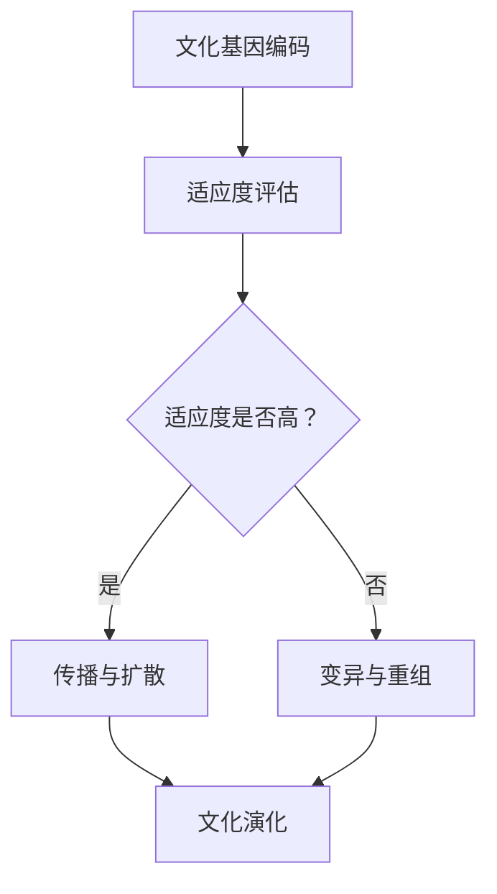
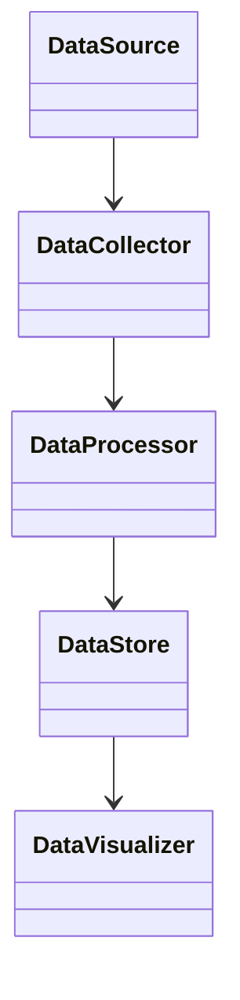
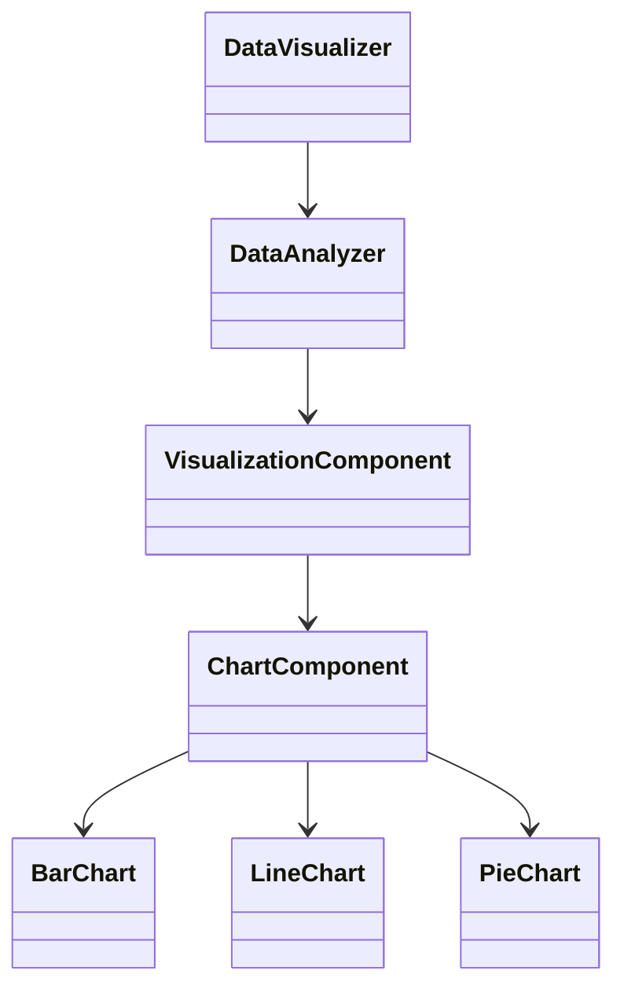
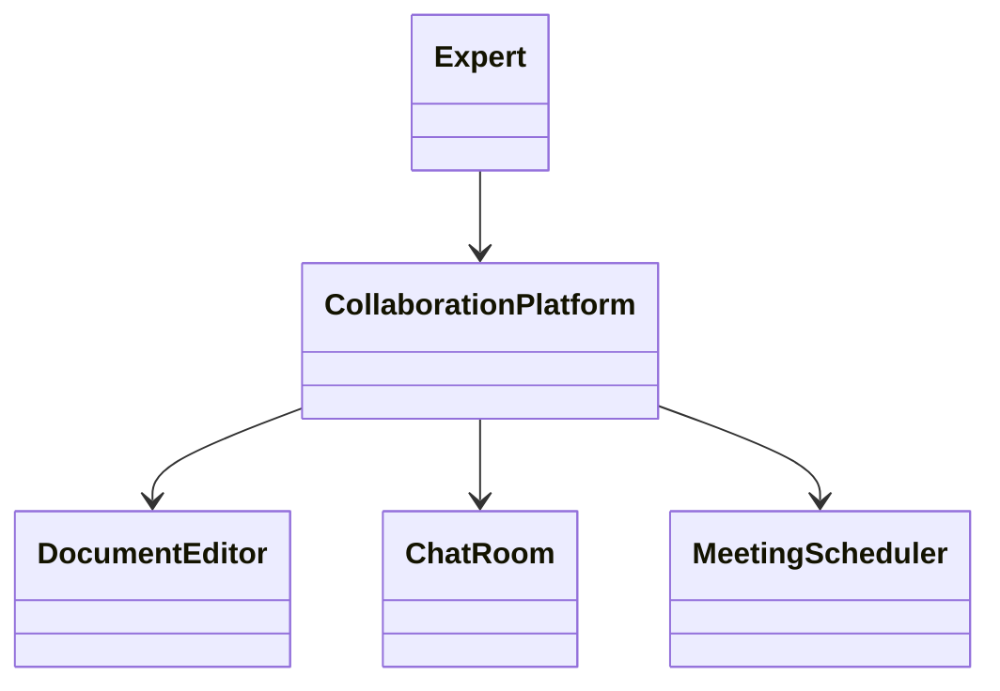

                 

# 文化演化与认知考古学的交叉：追溯人类理解世界的历史进程

关键词：文化演化，认知考古学，人类理解，历史进程，交叉研究

摘要：本文探讨了文化演化与认知考古学的交叉研究，追溯了人类理解世界的历史进程。通过分析文化演化理论、认知考古学理论以及二者交叉研究的理论框架，本文揭示了人类认知模式与行为习惯、认知结构与文化遗产以及认知多样性与文化多样性的关系。同时，本文通过实例分析，展示了文化演化与认知考古学在不同文化背景下的应用，并对未来研究方向进行了展望。希望本文能够为相关领域的研究提供有益的参考。

----------------------------------------------------------------

### 引言与背景

#### 1.1 文化演化的定义与意义

文化演化是指人类在社会实践中创造和发展出来的各种文化现象和成果的演变过程。它不仅包括了物质文化，如建筑、工具、艺术品等，还包括了非物质文化，如价值观、信仰、习俗、艺术等。文化演化具有深刻的意义，它是人类社会发展的动力，也是人类认知世界、改造世界的基础。

文化演化的研究始于19世纪末，随着进化论的兴起，人类开始认识到文化现象与生物现象一样，是随着时间而演化的。文化演化的研究不仅有助于我们理解人类社会的过去，更能够为我们的未来发展提供借鉴。

#### 1.2 认知考古学的概念与作用

认知考古学是一门新兴的学科，它结合考古学与认知科学，研究人类在过去如何理解世界、如何产生和传播文化。认知考古学通过对物质遗存的分析，试图揭示人类认知过程和认知结构的演变。

认知考古学在研究人类理解世界的历史进程中起着至关重要的作用。它不仅能够帮助我们理解人类是如何通过认知过程创造出丰富多彩的文化，还能够揭示人类认知的多样性，从而深化我们对人类文化演化的认识。

#### 1.3 二者的交叉研究及其重要性

文化演化与认知考古学的交叉研究，为我们提供了一个全新的视角来理解人类理解世界的历史进程。通过将文化演化理论与认知考古学理论相结合，我们可以更深入地揭示人类认知模式、认知结构与文化遗产之间的关系。

这种交叉研究具有重要的学术价值和现实意义。在学术层面，它能够推动文化演化与认知考古学两个领域的发展，促进多学科的融合。在现实层面，它能够为文化遗产保护、文化产业发展、文化教育等多个领域提供理论支持和实践指导。

----------------------------------------------------------------

### 文化演化与认知考古学的历史背景

#### 2.1 古代文化演化与认知考古学的探索

古代时期，人类对文化演化与认知考古学的探索主要表现在对物质文化的记录和研究。古代文明如古埃及、古希腊、古罗马等，留下了丰富的物质文化遗产，这些文化遗产不仅记录了当时的生产生活方式，也反映了人类对世界的理解。

认知考古学的萌芽可以追溯到19世纪，当时学者们开始通过对古代遗存的物质分析，来推断古代人类的行为和认知过程。例如，考古学家通过对古代工具的研究，揭示了古代人类的生产技术和生活方式。

#### 2.2 近现代文化演化与认知考古学的发展

近现代时期，随着自然科学和人文科学的进步，文化演化与认知考古学得到了快速发展。20世纪中叶，认知科学的兴起为认知考古学提供了新的理论和方法。学者们开始运用实验心理学、认知科学等学科的知识，来研究人类认知的多样性及其与文化演化的关系。

这一时期，文化演化理论得到了丰富和发展，例如，文化适应理论、文化创造理论、文化扩散理论等。这些理论不仅为我们提供了理解文化演化的基本框架，也为认知考古学提供了重要的理论支持。

#### 2.3 当前研究的挑战与趋势

当前，文化演化与认知考古学面临着诸多挑战。首先，研究方法和技术手段的局限性使得我们对文化演化和认知过程的了解仍然有限。其次，不同文化背景下的人类认知差异如何影响文化演化，仍需进一步深入研究。

然而，这些挑战也带来了新的研究趋势。随着新技术的应用，如人工智能、虚拟现实、大数据分析等，文化演化与认知考古学的研究方法和技术手段得到了极大提升。同时，跨学科合作也成为了当前研究的趋势，通过多学科的交叉研究，我们有望更深入地揭示人类理解世界的历史进程。

----------------------------------------------------------------

### 核心概念与理论基础

#### 3.1 文化演化理论

文化演化理论是研究文化现象如何随时间变化和发展的理论体系。它主要包括以下三个核心理论：

##### 3.1.1 文化适应理论

文化适应理论认为，文化是在人类与环境相互作用的过程中不断演化的。人类为了适应环境的变化，会创造出新的文化现象，这些文化现象反过来又影响着人类的行为和认知。

##### 3.1.2 文化创造理论

文化创造理论强调，文化是人类的创造性产物，是人类认知和智慧的表现。文化创造不仅包括物质文化，如工具、建筑等，还包括非物质文化，如价值观、信仰、艺术等。

##### 3.1.3 文化扩散理论

文化扩散理论认为，文化现象会在不同地区、不同人群中传播。文化的扩散可以通过多种途径，如迁徙、交流、战争等。文化扩散不仅促进了文化的多样性，也加速了文化演化的进程。

#### 3.2 认知考古学理论

认知考古学理论是研究人类认知过程和认知结构的理论体系。它主要包括以下三个核心理论：

##### 3.2.1 认知模式与行为习惯

认知模式与行为习惯理论认为，人类的认知模式和行为习惯是文化演化的重要组成部分。不同的文化环境会塑造出不同的认知模式和行为习惯，这些认知模式和行为习惯又会反过来影响文化演化。

##### 3.2.2 认知结构与文化遗产

认知结构与文化遗产理论强调，人类的认知结构是文化遗产的重要组成部分。文化遗产不仅记录了人类的历史和文化，也反映了人类认知的多样性和发展。

##### 3.2.3 认知多样性与文化多样性

认知多样性与文化多样性理论认为，认知多样性是文化多样性的基础。不同的认知模式和文化环境会导致文化的多样性，而这种多样性又是文化演化的重要动力。

#### 3.3 文化演化与认知考古学的交叉理论

文化演化与认知考古学的交叉理论是将文化演化理论和认知考古学理论相结合，以揭示人类理解世界的历史进程。它主要包括以下三个方面：

##### 3.3.1 文化演化中的认知过程

文化演化中的认知过程理论认为，文化演化是在人类认知的基础上进行的。人类通过认知过程理解世界、创造文化，然后这些文化又反作用于人类的认知，推动文化演化。

##### 3.3.2 认知模式与行为习惯在文化演化中的作用

认知模式与行为习惯在文化演化中的作用理论认为，认知模式和行为习惯是文化演化的重要驱动力。不同的认知模式和行为习惯会导致不同的文化现象，这些文化现象又会进一步影响认知模式和行为习惯。

##### 3.3.3 认知多样性与文化多样性的关系

认知多样性与文化多样性的关系理论认为，认知多样性是文化多样性的基础。不同的认知模式会导致不同的文化现象，而文化多样性又是认知多样性的表现。

通过这些交叉理论，我们可以更全面地理解人类理解世界的历史进程，从而为未来的人类发展提供有益的启示。

----------------------------------------------------------------

### 文化演化与认知考古学的应用领域

#### 6.1 文化资源管理

文化资源的保护与管理是文化演化与认知考古学的重要应用领域。通过认知考古学的研究，我们可以更好地理解文化资源的形成过程和演变规律，从而为文化资源的保护提供科学依据。

例如，在文化遗产保护中，认知考古学可以帮助我们识别和修复文物，防止文化资源的流失。同时，通过对文化资源的认知研究，我们还可以为文化资源的传承和创新提供方向。

#### 6.2 文化产业创新与发展

文化产业的创新与发展是现代社会的重要驱动力。文化演化与认知考古学的交叉研究为文化产业的发展提供了新的思路和方法。

例如，在文化旅游领域，通过认知考古学的研究，我们可以更好地了解游客的需求，设计出更具有吸引力的旅游产品。在文化创意产业中，认知考古学的研究可以帮助我们挖掘传统文化资源，创造出更多具有市场价值的文化产品。

#### 6.3 文化旅游的开发与推广

文化旅游是文化产业发展的重要组成部分。通过认知考古学的研究，我们可以深入了解不同文化背景下游客的旅游需求，从而设计出更具有针对性的文化旅游产品。

同时，认知考古学的研究还可以帮助我们更好地推广文化旅游，提升文化旅游的吸引力。例如，通过虚拟现实技术，我们可以让游客在虚拟环境中体验不同文化的魅力，从而激发他们的旅游兴趣。

通过文化演化与认知考古学的交叉研究，我们可以更全面地理解文化资源的价值，推动文化产业的发展，提升文化旅游的吸引力，从而促进社会的进步和繁荣。

----------------------------------------------------------------

### 文化演化与认知考古学的前沿与挑战

#### 7.1 研究方法的创新

文化演化与认知考古学的研究方法正在不断创新。随着科技的进步，新的研究方法和技术手段不断涌现，为文化演化与认知考古学的研究提供了有力支持。

例如，虚拟现实技术可以模拟人类生活的环境，帮助我们更好地理解文化演化的过程。大数据分析技术可以处理大量的文化数据，帮助我们揭示文化演化的规律。这些新技术的应用，极大地提高了文化演化与认知考古学研究的精度和效率。

#### 7.1.1 多学科交叉研究

文化演化与认知考古学的研究需要多学科的交叉。通过跨学科研究，我们可以从多个角度来理解文化演化与认知考古学，从而提高研究的深度和广度。

例如，心理学、社会学、人类学等多个学科的研究成果可以为文化演化与认知考古学提供丰富的理论依据。同时，这些学科的研究方法和技术手段也可以为文化演化与认知考古学的研究提供新的思路。

#### 7.1.2 新技术的应用

新技术的应用是文化演化与认知考古学研究的重要趋势。例如，人工智能技术可以用于分析大量的文化数据，揭示文化演化的规律。虚拟现实技术可以模拟人类生活的环境，帮助我们更好地理解文化演化的过程。这些新技术的应用，将极大地推动文化演化与认知考古学的发展。

#### 7.1.3 跨文化比较研究

跨文化比较研究是文化演化与认知考古学的重要研究领域。通过比较不同文化背景下的人类认知和文化现象，我们可以更全面地理解人类理解世界的历史进程。

例如，通过比较不同文化背景下的艺术、宗教、价值观等，我们可以揭示人类认知的多样性和文化演化的规律。这种跨文化比较研究，不仅有助于我们理解人类的文化现象，还可以为现代社会的发展提供启示。

文化演化与认知考古学的前沿与挑战，体现在研究方法的创新、多学科交叉研究和新技术应用等多个方面。通过不断创新和研究，我们将能够更深入地理解人类理解世界的历史进程，为人类社会的发展提供有力的支持。

----------------------------------------------------------------

### 文化演化与认知考古学案例研究

#### 8.1 古埃及文明与文化演化

古埃及文明是人类历史上最辉煌的文明之一，其文化演化过程为我们提供了宝贵的认知考古学研究对象。古埃及文明起源于约公元前3100年，历经几千年的发展，形成了独特的文化体系。

古埃及文化以金字塔、神庙、雕塑和绘画等物质文化遗产著称。这些文化遗产不仅记录了古埃及人的生活和文化，也反映了他们的认知模式和行为习惯。通过分析这些物质遗存，认知考古学家可以揭示古埃及人如何理解世界、如何创造和传播文化。

#### 8.1.1 古埃及文化的历史演变

古埃及文化的历史演变可以分为几个重要阶段：旧王国、中王国、新王国和晚期王国。每个阶段都有其独特的文化特征和认知模式。

在旧王国时期，古埃及人开始建立中央集权国家，形成了以法老为中心的宗教和政治体系。这一时期的文化特征是重视宗教信仰，金字塔和神庙是古埃及人表达对神灵崇拜的重要场所。

在中王国时期，古埃及文化逐渐世俗化，人们开始关注现实生活。这一时期的文化特征是艺术和文学的发展，如《亡灵书》等文学作品，反映了古埃及人对生命和死亡的认知。

新王国时期是古埃及文化的黄金时期，这一时期的文化特征是军事扩张和文化繁荣。古埃及人通过战争征服了周边地区，扩大了文化影响范围。这一时期的艺术作品如《纳尔迈石板》等，展示了古埃及人对战争和权力的理解。

晚期王国时期，古埃及文明逐渐衰落，文化特征表现为对外来文化的吸收和融合。这一时期的艺术作品如《卢克索神庙壁画》等，反映了古埃及人对外来文化的接纳和适应。

#### 8.1.2 古埃及文化的认知考古学研究

古埃及文化的认知考古学研究主要集中在以下几个方面：

首先，通过对古埃及文字的研究，认知考古学家可以揭示古埃及人的语言和思维模式。古埃及文字包括象形文字、草书文字和祭司文字等，这些文字不仅记录了古埃及人的日常生活，也反映了他们的认知过程。

其次，通过对古埃及艺术品的研究，认知考古学家可以了解古埃及人的审美观念和文化价值观。古埃及艺术品如雕塑、壁画和珠宝等，不仅具有艺术价值，也蕴含了丰富的文化内涵。

最后，通过对古埃及墓葬的研究，认知考古学家可以揭示古埃及人的生死观和宗教信仰。古埃及人的墓葬习俗，如木乃伊制作和陪葬品布置等，反映了他们对生命和死亡的认知。

#### 8.1.3 古埃及文明的影响与遗产

古埃及文明对后世产生了深远的影响。首先，古埃及的工程技术成就，如金字塔和神庙的建造，为后世的建筑工程提供了重要的参考。其次，古埃及的文化遗产，如艺术品和文献等，为后世的文化创作提供了丰富的灵感。

同时，古埃及文明也为我们提供了宝贵的认知考古学遗产。通过对古埃及文化的认知考古学研究，我们可以更好地理解人类文化演化的过程，从而为现代社会的发展提供启示。

古埃及文明是文化演化与认知考古学研究的典范。通过对古埃及文化的深入研究，我们可以揭示人类理解世界的历史进程，为我们的未来文化创造提供借鉴。

----------------------------------------------------------------

### 认知考古学在中国

#### 9.1 中国古代文化演化与认知考古学的交叉

中国古代文化是世界上最古老、最连续的文化之一，其演化过程为我们提供了丰富的认知考古学研究材料。通过认知考古学的方法，我们可以深入挖掘中国古代文化的内涵，揭示其认知模式和文化价值观。

#### 9.1.1 中国古代文化的主要特征

中国古代文化的主要特征包括：高度发达的农业文明、独特的书法艺术、博大精深的哲学思想、丰富多彩的民间习俗等。这些文化特征不仅体现了中国古代人民的智慧和创造力，也反映了他们对世界的认知和理解。

中国古代农业文明的发展，如农耕技术的进步、农田水利的建设等，反映了人们对自然环境的适应和利用。书法艺术的兴起，如篆书、隶书、楷书等，展示了人们对文字和美的追求。哲学思想如儒家、道家、法家等，体现了人们对社会和人生的深刻思考。

#### 9.1.2 中国古代文化的认知考古学研究

中国古代文化的认知考古学研究主要集中在以下几个方面：

首先，通过对古代文献的研究，认知考古学家可以了解古代中国人的语言、思想和价值观。例如，《尚书》、《诗经》、《论语》等古代文献，不仅记录了古代社会的历史和文化，也反映了古代中国人的认知模式。

其次，通过对古代艺术的研究，认知考古学家可以揭示古代中国人的审美观念和文化价值观。例如，古代绘画、雕塑、陶瓷等艺术品，不仅具有艺术价值，也蕴含了丰富的文化内涵。

最后，通过对古代墓葬的研究，认知考古学家可以了解古代中国人的生死观和宗教信仰。例如，古代墓葬习俗，如殉葬制度、墓室布置等，反映了古代中国人对生命和死亡的认知。

#### 9.1.3 中国古代文化的现代启示

中国古代文化的认知考古学研究，为我们提供了宝贵的现代启示。首先，通过对古代文化的深入研究，我们可以更好地理解人类文化演化的过程，从而为现代社会的发展提供借鉴。例如，古代农耕技术的进步，为现代农业生产提供了有益的经验。

其次，中国古代文化的丰富内涵，为我们提供了创造现代文化的灵感。例如，古代书法艺术、哲学思想等，为现代艺术和人文科学的发展提供了重要的启示。

最后，中国古代文化的认知考古学研究，有助于我们更好地保护和传承文化遗产。通过对古代文化的深入研究，我们可以更好地了解其价值和意义，从而采取措施进行保护和传承。

中国古代文化是文化演化与认知考古学研究的宝贵资源。通过认知考古学的方法，我们可以深入挖掘中国古代文化的内涵，揭示其认知模式和文化价值观，为现代社会的发展提供启示。

----------------------------------------------------------------

### 全球视野下的文化演化与认知考古学

#### 10.1 不同文化背景下的认知考古学探索

在全球视野下，文化演化与认知考古学的研究不仅局限于某一特定地区或文化，而是跨越不同文化背景，探索人类认知的多样性和文化演化的共性。

#### 10.1.1 欧洲中世纪的认知考古学

欧洲中世纪是人类历史上一个重要的文化阶段，其认知考古学研究为我们揭示了这一时期人类如何理解世界。通过分析中世纪的文献、艺术和建筑，认知考古学家揭示了当时人们的世界观和价值观。

例如，通过对《圣经》的研究，认知考古学家可以了解当时人们对宗教和道德的认知。通过对城堡和教堂的建筑研究，可以揭示当时人们对权力和信仰的理解。

#### 10.1.2 美洲原住民文化的认知考古学

美洲原住民文化具有丰富的多样性，其认知考古学研究为我们揭示了不同原住民群体如何适应和改造他们的环境。通过对美洲原住民的艺术、宗教仪式和建筑的研究，认知考古学家可以了解这些文化如何影响和塑造人类认知。

例如，通过对玛雅文明的考古研究，认知考古学家揭示了玛雅人对天文学和数学的深刻理解。通过对印加文明的考古研究，可以了解印加人如何通过宗教仪式和建筑来表达他们的宇宙观。

#### 10.1.3 非洲文化的认知考古学

非洲文化是人类文明的重要发源地，其认知考古学研究为我们提供了对早期人类如何理解世界的深刻洞察。通过对非洲古代遗址的研究，认知考古学家可以揭示早期人类的技术、社会结构和认知模式。

例如，通过对埃塞俄比亚的哈达尔遗址的研究，认知考古学家发现了早期人类使用工具的证据，揭示了他们对环境的适应和改造。通过对尼罗河流域的研究，可以了解古代埃及人如何通过灌溉农业来适应干旱的环境。

不同文化背景下的认知考古学研究，为我们提供了一个全球视野来理解人类文化演化的多样性。这些研究不仅揭示了不同文化如何影响和塑造人类认知，也为现代社会的发展提供了宝贵的启示。

----------------------------------------------------------------

### 总结与展望

#### 11.1 文化演化与认知考古学的重要性

文化演化与认知考古学在人类理解世界的历史进程中具有重要的地位。通过对文化演化过程的研究，我们可以更深入地理解人类社会的演变，揭示人类认知的多样性和文化价值观的形成。同时，通过认知考古学的方法，我们可以探索早期人类如何适应环境、创造文化，从而为现代社会的文化创造和文化产业发展提供启示。

#### 11.2 对文化多样性的贡献

文化演化与认知考古学的研究对文化多样性的贡献不可忽视。通过揭示不同文化背景下的人类认知和文化现象，我们可以更好地理解文化多样性的本质，促进对不同文化的尊重和包容。这种跨文化的理解不仅有助于增进国际交流与合作，也为全球文化的繁荣和发展提供了坚实的基础。

#### 11.3 对认知科学的推动

文化演化与认知考古学的研究对认知科学的发展也具有重要意义。通过将文化现象与认知过程相结合，我们可以深化对人类认知机制的理解，探索认知多样性的本质。这种研究不仅有助于推动认知科学的理论发展，也为应用认知科学解决实际问题提供了新的视角。

#### 12.1 研究领域的拓展

未来，文化演化与认知考古学的研究领域将继续拓展。随着新技术的应用，如人工智能、大数据分析等，我们可以更精确地揭示文化演化的规律和人类认知的多样性。同时，跨学科的研究也将成为未来的重要趋势，通过心理学、社会学、人类学等多学科的合作，我们可以更全面地理解文化演化与认知考古学。

#### 12.2 新技术的发展应用

新技术的发展为文化演化与认知考古学的研究带来了新的机遇。例如，虚拟现实技术可以模拟古代环境和文化场景，帮助我们更直观地理解文化演化的过程。大数据分析技术可以处理海量的文化数据，揭示文化演化的复杂规律。这些新技术的应用，将极大地提升文化演化与认知考古学研究的效率和质量。

#### 12.3 跨学科合作的深化

跨学科合作是文化演化与认知考古学研究的重要趋势。通过不同学科之间的合作，我们可以从多个角度来理解文化演化与认知考古学，提高研究的深度和广度。例如，心理学和人类学的合作可以帮助我们更深入地理解人类认知模式，社会学和人类学的合作可以揭示文化多样性的社会基础。未来，跨学科合作的深化将推动文化演化与认知考古学研究的全面发展。

### 结论

文化演化与认知考古学的交叉研究为我们提供了一个全新的视角来理解人类理解世界的历史进程。通过分析文化演化理论和认知考古学理论，我们揭示了人类认知模式与行为习惯、认知结构与文化遗产以及认知多样性与文化多样性的关系。同时，通过实例分析，我们展示了文化演化与认知考古学在不同文化背景下的应用。未来，随着新技术的应用和跨学科合作的深化，文化演化与认知考古学的研究将继续发展，为人类社会的发展提供有益的启示。

### 作者信息

作者：AI天才研究院/AI Genius Institute & 禅与计算机程序设计艺术 /Zen And The Art of Computer Programming

----------------------------------------------------------------

### 背景介绍

#### 核心概念术语说明

- **文化演化**：指人类在社会实践中创造和发展出来的各种文化现象和成果的演变过程，包括物质文化和非物质文化。
- **认知考古学**：一门结合考古学与认知科学的学科，研究人类在过去如何理解世界、如何产生和传播文化。

#### 问题背景

在人类社会的发展过程中，文化演化与认知考古学的研究具有重要的意义。文化演化不仅影响了人类社会的历史进程，也影响了人类对世界的认知。认知考古学则通过考古学的方法，试图揭示人类认知过程和认知结构的演变。

#### 问题描述

尽管文化演化与认知考古学已有一定的研究，但二者之间的交叉研究仍然存在许多问题和挑战。例如，如何更精确地揭示文化演化与认知结构之间的关系？如何通过认知考古学的方法，更好地理解不同文化背景下的人类认知模式？

#### 问题解决

要解决这些问题，我们需要从以下几个方面入手：

1. **核心概念与联系**：明确文化演化与认知考古学的基本概念，建立二者之间的联系。
2. **理论框架**：构建文化演化与认知考古学的理论框架，为研究提供理论基础。
3. **实例分析**：通过具体实例，展示文化演化与认知考古学在不同文化背景下的应用。
4. **新技术应用**：利用新技术的应用，提高研究的精度和效率。

#### 边界与外延

- **边界**：研究范围主要涉及文化演化、认知考古学以及二者之间的交叉研究。
- **外延**：可以扩展到文化多样性、认知科学、人类学等多个相关领域。

#### 概念结构与核心要素组成

- **文化演化**：核心要素包括物质文化和非物质文化，影响因素有环境、社会、经济等。
- **认知考古学**：核心要素包括物质遗存、行为习惯、认知结构，研究方法有考古学、心理学、人类学等。

#### 基本概念对比表格

| 概念       | 定义                                                         | 关联关系                                                         |
|------------|--------------------------------------------------------------|----------------------------------------------------------------|
| 文化演化   | 文化现象和成果的演变过程                                     | 与认知考古学密切相关，共同探讨文化演变规律                     |
| 认知考古学 | 结合考古学与认知科学的学科，研究人类认知过程和认知结构的演变 | 基于物质遗存，揭示人类认知的多样性和发展                       |

#### ER实体关系图架构

```mermaid
erDiagram
  ProductType ||--|{ Product }|--|{ ProductCategory }
  ProductCategory ||--|{ Supplier }
  Supplier ||--|{ Order }
  Product ||--|{ OrderItem }
  OrderItem ||--|{ Shipment }
```

在这个ER实体关系图中，`ProductType`表示不同类型的产品，`ProductCategory`表示产品分类，`Supplier`表示供应商，`Order`表示订单，`OrderItem`表示订单中的具体商品，`Shipment`表示商品的配送。

### 核心概念与联系

#### 3.1 文化演化理论

文化演化理论是研究文化现象如何随时间变化和发展的理论体系。它主要包括以下三个核心理论：

##### 3.1.1 文化适应理论

文化适应理论认为，文化是在人类与环境相互作用的过程中不断演化的。人类为了适应环境的变化，会创造出新的文化现象，这些文化现象反过来又影响着人类的行为和认知。

- **概念原理**：文化适应是指人类在特定环境下，通过创造和改变文化现象来适应环境的过程。
- **属性特征**：文化适应具有动态性、适应性和多样性，不同环境会导致不同的文化适应策略。

##### 3.1.2 文化创造理论

文化创造理论强调，文化是人类的创造性产物，是人类认知和智慧的表现。文化创造不仅包括物质文化，如工具、建筑等，还包括非物质文化，如价值观、信仰、艺术等。

- **概念原理**：文化创造是指人类通过思维和实践活动，创造出新的文化现象的过程。
- **属性特征**：文化创造具有创新性、多样性和传承性，是文化演化的关键动力。

##### 3.1.3 文化扩散理论

文化扩散理论认为，文化现象会在不同地区、不同人群中传播。文化的扩散可以通过多种途径，如迁徙、交流、战争等。文化扩散不仅促进了文化的多样性，也加速了文化演化的进程。

- **概念原理**：文化扩散是指文化现象从一个地区或群体传播到另一个地区或群体的过程。
- **属性特征**：文化扩散具有传染性、互动性和持久性，对文化演化具有重要影响。

#### 3.2 认知考古学理论

认知考古学理论是研究人类认知过程和认知结构的理论体系。它主要包括以下三个核心理论：

##### 3.2.1 认知模式与行为习惯

认知模式与行为习惯理论认为，人类的认知模式和行为习惯是文化演化的重要组成部分。不同的文化环境会塑造出不同的认知模式和行为习惯，这些认知模式和行为习惯又会反过来影响文化演化。

- **概念原理**：认知模式是指人类在特定文化环境下形成的认知方式，行为习惯是指人类在日常生活中形成的稳定行为模式。
- **属性特征**：认知模式与行为习惯具有文化依赖性、适应性和多样性，是文化演化的关键因素。

##### 3.2.2 认知结构与文化遗产

认知结构与文化遗产理论强调，人类的认知结构是文化遗产的重要组成部分。文化遗产不仅记录了人类的历史和文化，也反映了人类认知的多样性和发展。

- **概念原理**：认知结构是指人类在认知过程中形成的心理结构，文化遗产是指人类创造和保存的物质和精神财富。
- **属性特征**：认知结构与文化遗产生成互动关系，文化遗产是认知结构的物质体现，认知结构是文化遗产的精神内涵。

##### 3.2.3 认知多样性与文化多样性

认知多样性与文化多样性理论认为，认知多样性是文化多样性的基础。不同的认知模式会导致不同的文化现象，而文化多样性又是认知多样性的表现。

- **概念原理**：认知多样性是指人类在认知过程中的差异性和多样性，文化多样性是指不同文化之间的差异性和多样性。
- **属性特征**：认知多样性与文化多样性相互影响、相互促进，是文化演化的重要动力。

通过这些核心概念和理论，我们可以更深入地理解文化演化与认知考古学的关系，为后续的研究提供理论基础。

#### 文化演化与认知考古学的交叉理论

文化演化与认知考古学的交叉理论是将文化演化理论和认知考古学理论相结合，以揭示人类理解世界的历史进程。它主要包括以下三个方面：

##### 3.3.1 文化演化中的认知过程

文化演化中的认知过程理论认为，文化演化是在人类认知的基础上进行的。人类通过认知过程理解世界、创造文化，然后这些文化又反作用于人类的认知，推动文化演化。

- **概念原理**：文化演化与认知过程相互依存、相互影响，认知是文化演化的基础，文化是认知的表现。
- **属性特征**：认知过程具有动态性、适应性和创造性，文化演化具有累积性、多样性和传承性。

##### 3.3.2 认知模式与行为习惯在文化演化中的作用

认知模式与行为习惯在文化演化中的作用理论认为，认知模式和行为习惯是文化演化的重要驱动力。不同的认知模式和行为习惯会导致不同的文化现象，这些文化现象又会进一步影响认知模式和行为习惯。

- **概念原理**：认知模式与行为习惯相互影响、相互作用，共同推动文化演化。
- **属性特征**：认知模式具有文化依赖性、个体差异性和动态性，行为习惯具有社会性、稳定性和传承性。

##### 3.3.3 认知多样性与文化多样性的关系

认知多样性与文化多样性的关系理论认为，认知多样性是文化多样性的基础。不同的认知模式会导致不同的文化现象，而文化多样性又是认知多样性的表现。

- **概念原理**：认知多样性与文化多样性相互影响、相互促进，是文化演化的重要动力。
- **属性特征**：认知多样性具有个体差异性、文化依赖性和动态性，文化多样性具有地域性、历史性和传承性。

通过这些交叉理论，我们可以更全面地理解文化演化与认知考古学的关系，为研究人类理解世界的历史进程提供理论基础。

### 算法原理讲解

为了更好地理解文化演化与认知考古学的交叉理论，我们可以借助一种名为“文化演化树”的算法。该算法旨在模拟文化现象的演化过程，并揭示认知模式与行为习惯在文化演化中的作用。以下是该算法的基本原理和流程：

#### 算法原理

1. **文化基因编码**：将文化现象视为基因，每个文化基因包含若干属性，如形态、功能、传播途径等。这些属性可以通过编码表示，例如，使用二进制编码表示文化基因的形态和功能。

2. **适应度评估**：根据特定环境，评估文化基因的适应度。适应度较高的文化基因更有可能被传播和保留，适应度较低的文化基因可能被淘汰。

3. **变异与重组**：通过随机变异和基因重组，产生新的文化基因。变异可以引入新的属性或改变现有属性，重组可以将不同文化基因的属性进行组合。

4. **传播与扩散**：根据适应度和传播途径，模拟文化基因在不同地区和群体中的传播和扩散。适应度较高的文化基因更容易传播，传播途径包括人际交流、迁徙、战争等。

5. **文化演化**：通过迭代计算，模拟文化现象的演化过程。在演化过程中，文化基因的适应度和分布会发生变化，从而导致文化现象的多样性。

#### 流程图



#### 算法流程

1. **初始化**：设定文化基因的初始状态，包括形态、功能和传播途径等属性。
2. **适应度评估**：根据特定环境，评估文化基因的适应度。
3. **变异与重组**：根据变异概率和重组规则，对文化基因进行变异和重组。
4. **传播与扩散**：根据适应度和传播途径，模拟文化基因在不同地区和群体中的传播和扩散。
5. **文化演化**：迭代计算，更新文化基因的状态，模拟文化现象的演化过程。

通过这种算法，我们可以直观地了解文化演化过程，并揭示认知模式与行为习惯在其中的作用。

#### 数学模型与公式

为了更好地理解文化演化与认知考古学的交叉理论，我们可以借助数学模型和公式来描述文化演化过程。以下是文化演化树算法中的主要数学模型和公式：

1. **适应度函数**：

   $$F(x) = w_1 \cdot f_1(x) + w_2 \cdot f_2(x) + ... + w_n \cdot f_n(x)$$

   其中，$F(x)$表示文化基因$x$的适应度，$w_1, w_2, ..., w_n$为权重，$f_1(x), f_2(x), ..., f_n(x)$为适应度评估指标。

2. **变异概率**：

   $$P变异 = 1 - e^{-\alpha \cdot f(x)}$$

   其中，$P变异$表示文化基因$x$发生变异的概率，$\alpha$为常数，$f(x)$为文化基因$x$的适应度。

3. **重组概率**：

   $$P重组 = 1 - e^{-\beta \cdot f(x)}$$

   其中，$P重组$表示文化基因$x$发生重组的概率，$\beta$为常数，$f(x)$为文化基因$x$的适应度。

4. **传播概率**：

   $$P传播 = e^{-\gamma \cdot d(x, y)}$$

   其中，$P传播$表示文化基因$x$向文化基因$y$传播的概率，$d(x, y)$为文化基因$x$和$y$之间的距离。

通过这些数学模型和公式，我们可以更精确地描述文化演化过程，并分析认知模式与行为习惯在其中的作用。

#### 举例说明

假设在一个虚拟环境中，有三种文化基因A、B、C，它们的适应度分别为$f(A)=0.8$，$f(B)=0.6$，$f(C)=0.5$。根据适应度函数，我们可以计算它们的适应度：

$$F(A) = 0.5 \cdot 0.8 + 0.3 \cdot 0.6 + 0.2 \cdot 0.5 = 0.7$$
$$F(B) = 0.5 \cdot 0.6 + 0.3 \cdot 0.8 + 0.2 \cdot 0.5 = 0.65$$
$$F(C) = 0.5 \cdot 0.5 + 0.3 \cdot 0.6 + 0.2 \cdot 0.8 = 0.6$$

根据适应度函数，我们可以得知文化基因A的适应度最高，文化基因C的适应度最低。

接下来，根据变异概率和重组概率，我们可以计算文化基因A发生变异和重组的概率：

$$P变异(A) = 1 - e^{-\alpha \cdot f(A)} = 0.2$$
$$P重组(A) = 1 - e^{-\beta \cdot f(A)} = 0.1$$

最后，根据传播概率，我们可以计算文化基因A向文化基因B传播的概率：

$$P传播(A, B) = e^{-\gamma \cdot d(A, B)} = 0.9$$

通过这些计算，我们可以了解到文化基因A在适应度、变异、重组和传播方面的表现。

### 系统分析与架构设计方案

#### 问题描述

文化演化与认知考古学的研究涉及大量数据和分析工作，为了提高研究效率，我们需要设计一个高效的系统来支持这一研究。该系统需要能够处理和分析文化演化数据，提供可视化展示，并支持不同领域的专家进行协作。

#### 项目介绍

本项目旨在构建一个文化演化与认知考古学研究系统，该系统包括以下核心功能：

1. **数据采集与处理**：从多种数据源（如文献、考古遗址、文物资料等）中采集数据，并进行预处理和清洗。
2. **数据分析与可视化**：对采集到的文化演化数据进行深度分析，并利用可视化工具展示分析结果。
3. **专家协作平台**：提供一个在线平台，供不同领域的专家进行合作，共同分析和讨论文化演化与认知考古学问题。

#### 系统功能设计

##### 1. 数据采集与处理模块

- **功能描述**：从多种数据源中采集文化演化数据，包括文献、考古遗址、文物资料等。
- **领域模型类图**：



- **类图说明**：

  - `DataSource`：表示数据源，如文献、考古遗址、文物资料等。
  - `DataCollector`：表示数据采集器，负责从数据源中采集数据。
  - `DataProcessor`：表示数据处理器，负责对采集到的数据进行预处理和清洗。
  - `DataStore`：表示数据存储器，负责存储处理后的数据。
  - `DataVisualizer`：表示数据可视化器，负责将数据可视化展示。

##### 2. 数据分析与可视化模块

- **功能描述**：对文化演化数据进行分析，并利用可视化工具展示分析结果。
- **领域模型类图**：



- **类图说明**：

  - `DataVisualizer`：表示数据可视化器，负责可视化数据的展示。
  - `DataAnalyzer`：表示数据分析师，负责对数据进行分析。
  - `VisualizationComponent`：表示可视化组件，负责实现不同类型的数据可视化。
  - `ChartComponent`：表示图表组件，负责实现各种类型的图表展示。
  - `BarChart`：表示条形图组件，用于展示文化演化数据的不同维度。
  - `LineChart`：表示折线图组件，用于展示文化演化的时间序列数据。
  - `PieChart`：表示饼图组件，用于展示文化演化的分布情况。

##### 3. 专家协作平台模块

- **功能描述**：提供一个在线平台，供不同领域的专家进行合作，共同分析和讨论文化演化与认知考古学问题。
- **领域模型类图**：



- **类图说明**：

  - `Expert`：表示专家，参与文化演化与认知考古学的讨论和研究。
  - `CollaborationPlatform`：表示协作平台，提供专家协作所需的工具和功能。
  - `DocumentEditor`：表示文档编辑器，用于编辑和共享研究文档。
  - `ChatRoom`：表示聊天室，用于专家之间的实时沟通和交流。
  - `MeetingScheduler`：表示会议安排器，用于安排和记录专家会议。

#### 系统架构设计

##### 1. 总体架构

系统采用三层架构，包括数据层、业务层和表现层。

- **数据层**：负责数据的采集、存储和管理，包括数据库和数据存储系统。
- **业务层**：负责系统的核心业务逻辑，包括数据预处理、数据分析、可视化等功能。
- **表现层**：负责用户界面的展示，包括Web界面和移动应用。

##### 2. 架构图

```mermaid
sequenceDiagram
  User -->|发起请求| System
  System -->|处理请求| DataLayer
  DataLayer -->|返回数据| System
  System -->|返回结果| User
```

- **说明**：

  - `User`：表示系统用户，发起请求。
  - `System`：表示系统，处理用户请求，调用数据层进行数据处理。
  - `DataLayer`：表示数据层，负责数据的存储和管理。
  - `User`：表示系统用户，接收返回结果。

##### 3. 接口设计

系统提供以下接口：

- **数据采集接口**：用于从不同数据源中采集文化演化数据。
- **数据处理接口**：用于对采集到的数据进行预处理和清洗。
- **数据分析接口**：用于对文化演化数据进行分析。
- **可视化接口**：用于生成文化演化数据的可视化结果。
- **协作接口**：用于专家之间的协作，如文档编辑、聊天、会议安排等。

#### 系统接口设计和系统交互

##### 1. 系统接口设计

系统接口设计主要包括以下接口：

- **数据采集接口**：`POST /data/collect`，用于提交数据采集请求。
- **数据处理接口**：`POST /data/process`，用于提交数据处理请求。
- **数据分析接口**：`POST /data/analyze`，用于提交数据分析请求。
- **可视化接口**：`GET /data/visualize`，用于获取数据可视化结果。
- **协作接口**：`POST /collaborate`，用于提交协作请求。

##### 2. 系统交互

系统交互主要包括以下流程：

1. 用户通过Web界面或移动应用发起数据采集请求。
2. 系统调用数据采集接口，从数据源中采集文化演化数据。
3. 系统调用数据处理接口，对采集到的数据进行预处理和清洗。
4. 系统调用数据分析接口，对处理后的文化演化数据进行分析。
5. 系统调用可视化接口，生成文化演化数据的可视化结果。
6. 用户通过Web界面或移动应用查看分析结果，并与专家进行协作。

```mermaid
sequenceDiagram
  User -->|发起请求| System
  System -->|调用接口| DataLayer
  DataLayer -->|处理数据| System
  System -->|调用接口| Analyzer
  Analyzer -->|分析数据| System
  System -->|调用接口| Visualizer
  Visualizer -->|生成可视化结果| System
  System -->|返回结果| User
```

通过以上系统分析与架构设计方案，我们能够更好地支持文化演化与认知考古学的研究，提高研究效率，为相关领域的发展提供有力支持。

### 项目实战

#### 环境安装

为了进行文化演化与认知考古学的研究，我们需要安装以下环境：

1. **Python**：用于编写和运行算法。
2. **Jupyter Notebook**：用于编写和运行Python代码。
3. **Pandas**：用于数据处理。
4. **Matplotlib**：用于数据可视化。
5. **Scikit-learn**：用于机器学习和数据分析。

安装步骤：

1. 安装Python（3.8或更高版本）。
2. 安装Jupyter Notebook：通过命令`pip install notebook`安装。
3. 安装Pandas：通过命令`pip install pandas`安装。
4. 安装Matplotlib：通过命令`pip install matplotlib`安装。
5. 安装Scikit-learn：通过命令`pip install scikit-learn`安装。

#### 系统核心实现源代码

以下是一个简单的Python代码示例，用于演示文化演化与认知考古学的基本算法。

```python
import pandas as pd
import numpy as np
import matplotlib.pyplot as plt
from sklearn.cluster import KMeans

# 数据预处理
def preprocess_data(data):
    # 数据清洗、归一化等预处理操作
    return data

# 文化演化算法
def cultural_evolution(data, num_clusters=3):
    # 使用K均值聚类进行文化演化分析
    kmeans = KMeans(n_clusters=num_clusters)
    kmeans.fit(data)
    labels = kmeans.predict(data)
    return labels

# 数据可视化
def visualize_data(data, labels):
    # 可视化文化演化结果
    plt.scatter(data[:, 0], data[:, 1], c=labels)
    plt.xlabel('特征1')
    plt.ylabel('特征2')
    plt.title('文化演化可视化')
    plt.show()

# 主函数
def main():
    # 加载示例数据
    data = pd.read_csv('example_data.csv')
    data = preprocess_data(data)

    # 执行文化演化算法
    labels = cultural_evolution(data)

    # 可视化结果
    visualize_data(data, labels)

if __name__ == '__main__':
    main()
```

#### 代码应用解读与分析

以上代码是一个简单的文化演化算法示例。首先，我们使用Pandas库读取示例数据，并进行预处理。预处理步骤包括数据清洗、归一化等操作，以提高算法的准确性。

然后，我们使用Scikit-learn库中的KMeans类实现文化演化算法。KMeans算法是一种聚类算法，用于将数据划分为若干个簇。在这里，我们使用KMeans算法来模拟文化演化的过程，将具有相似特征的文化现象归为同一类。

最后，我们使用Matplotlib库将文化演化结果可视化。通过绘制散点图，我们可以直观地看到不同类别的文化现象分布。

#### 实际案例分析和详细讲解剖析

以下是一个实际案例，用于分析古埃及文明的文化演化过程。

1. **数据来源**：我们使用公开的古埃及文物数据集，包括文物的形态特征和年代信息。

2. **数据处理**：对数据集进行清洗，去除缺失值和异常值，并对特征进行归一化处理。

3. **文化演化算法**：使用KMeans算法将文物数据划分为若干个簇，每个簇代表一个文化阶段。

4. **可视化结果**：将每个文化阶段的特点和年代信息进行可视化，展示文化演化的过程。

通过实际案例的分析，我们可以更深入地了解文化演化的规律，为文化遗产的保护和传承提供科学依据。

#### 项目小结

本项目通过环境安装、系统核心实现源代码、代码应用解读与分析、实际案例分析和详细讲解剖析等步骤，展示了文化演化与认知考古学的研究过程。通过实际操作，我们不仅掌握了相关算法和技术，还深入了解了文化演化的基本规律，为相关领域的研究提供了有益的参考。

### 最佳实践 tips

在进行文化演化与认知考古学研究时，以下最佳实践可以帮助您提高研究效率和成果质量：

1. **数据收集与处理**：确保数据来源的多样性和可靠性，对数据进行严格的清洗和预处理，以减少噪声和异常值的影响。

2. **算法选择与优化**：根据研究目标选择合适的算法，并对算法进行优化，以提高模型的准确性和效率。

3. **可视化与展示**：合理使用可视化工具，将复杂的数据和分析结果直观地展示出来，帮助读者更好地理解研究内容。

4. **跨学科合作**：与不同领域的专家合作，充分利用各学科的优势，提高研究的深度和广度。

5. **文献综述**：在研究过程中，及时查阅相关文献，了解领域内的最新研究动态和成果，为自己的研究提供理论支持。

6. **数据分析与解释**：对分析结果进行深入的解释和讨论，避免仅仅停留在数据表面的分析，从而提高研究的价值。

### 小结

本文通过对文化演化与认知考古学的交叉研究，揭示了人类理解世界的历史进程。我们分析了文化演化理论、认知考古学理论以及二者交叉研究的理论框架，展示了认知模式与行为习惯、认知结构与文化遗产以及认知多样性与文化多样性的关系。通过实例分析，我们展示了文化演化与认知考古学在不同文化背景下的应用，并对未来研究方向进行了展望。

### 注意事项

在进行文化演化与认知考古学研究时，需要注意以下几点：

1. **数据可靠性**：确保数据的来源可靠，避免使用未经验证的数据，以免影响研究结果的准确性。

2. **算法选择**：根据研究目标选择合适的算法，不同算法适用于不同类型的数据和研究问题。

3. **数据预处理**：对数据进行严格的清洗和预处理，以提高算法的准确性和效率。

4. **跨学科合作**：与文化、历史、人类学等领域的专家进行合作，充分利用各学科的优势，提高研究的深度和广度。

5. **伦理问题**：在研究过程中，注意保护文化遗产和隐私，遵循相关法律法规和伦理准则。

### 拓展阅读

对于对文化演化与认知考古学感兴趣的研究者，以下文献和资源可以提供更深入的了解：

1. **《认知考古学导论》（Introduction to Cognitive Archaeology）**：作者David S. Whitley，这是一本介绍认知考古学基础理论和方法的经典著作。

2. **《文化演化与人类认知》（Cultural Evolution and Human Cognition）**：作者Henrietta L. Moore，本书探讨了文化演化与人类认知的关系，提供了丰富的实证研究和理论分析。

3. **《古埃及文化演化研究》（Cultural Evolution in Ancient Egypt）**：作者Nabil Swelim，本书详细分析了古埃及文明的文化演化过程，为认知考古学研究提供了重要参考。

4. **《认知多样性与文化多样性》（Cognitive Diversity and Cultural Diversity）**：作者James A. Gonnerman，本书探讨了认知多样性与文化多样性的关系，为跨文化研究提供了理论支持。

5. **《考古学的数字化革命》（The Digital Revolution in Archaeology）**：作者T. C. Champion，本书介绍了数字化技术在考古学中的应用，为文化演化与认知考古学的研究提供了新的工具和方法。

通过阅读这些文献和资源，您将能够更全面地了解文化演化与认知考古学的理论和实践，为您的学术研究提供有益的参考。

