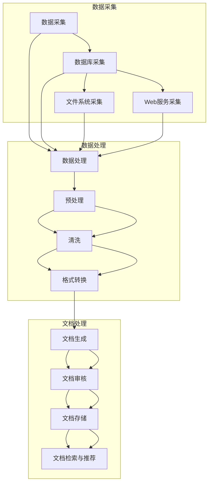

                 

### 文档自动化概述

#### 第1章：文档自动化的背景与意义

##### 1.1 文档自动化的起源

文档自动化，即利用计算机技术和人工智能算法来自动生成、审核、存储和管理文档。其起源可以追溯到20世纪中后期，随着计算机技术的飞速发展，人们开始意识到自动化处理文档的巨大潜力。传统的文档处理方式主要依靠人工，效率低下，容易出现错误，而且难以适应快速变化的需求。

###### 1.1.1 传统文档处理方式的痛点

- **低效率**：人工处理文档需要大量的时间和精力，效率低下。
- **易出错**：人工处理过程中容易产生错误，如拼写错误、格式错误等。
- **难适应变化**：当业务需求发生变化时，人工文档难以快速更新和调整。

###### 1.1.2 文档自动化的概念与发展历程

文档自动化的概念是指通过计算机技术和人工智能算法，对文档进行自动生成、审核、存储和管理。其发展历程可以分为以下几个阶段：

- **初期阶段**（20世纪60年代至80年代）：计算机开始用于文档处理，但主要停留在简单的文本处理阶段。
- **发展阶段**（20世纪90年代）：随着互联网的普及，文档自动化技术逐渐成熟，开始应用于企业内部和项目管理中。
- **智能化阶段**（21世纪）：随着人工智能技术的飞速发展，文档自动化技术逐渐智能化，能够自动生成、审核和优化文档。

##### 1.2 文档自动化的意义

文档自动化的意义主要体现在以下几个方面：

###### 1.2.1 提高工作效率

通过自动化处理文档，可以大幅提高工作效率。例如，自动生成文档可以节省大量的时间和精力，自动审核可以确保文档的准确性，自动存储和管理可以方便地查找和检索文档。

###### 1.2.2 减少人工错误

人工处理文档容易出错，而文档自动化技术可以显著减少这种错误。例如，自动语法检查可以确保文档的语法正确性，自动文本分类可以避免人为分类错误。

###### 1.2.3 适应快速变化的企业需求

企业在发展过程中，业务需求会不断变化，文档自动化技术可以快速适应这些变化，确保文档的实时更新和准确性。

##### 1.3 文档自动化的主要任务

文档自动化的主要任务包括文档生成、文档审核、文档存储与管理、文档搜索与索引等。

###### 1.3.1 文档生成

文档生成是文档自动化的核心任务之一，通过自动化工具和算法，可以快速生成各种类型的文档，如项目文档、报告文档、法律文档等。

###### 1.3.2 文档审核

文档审核是确保文档准确性和合规性的重要环节，通过自动化审核，可以快速发现和纠正文档中的错误和问题。

###### 1.3.3 文档存储与管理

文档存储与管理包括文档的存储、备份、恢复和访问控制等，通过自动化技术，可以方便地管理和访问文档。

###### 1.3.4 文档搜索与索引

文档搜索与索引是方便用户快速查找所需文档的重要手段，通过自动化技术，可以实现对文档内容的快速检索和索引。

##### 1.4 文档自动化的技术框架

文档自动化的实现依赖于多种技术，其中最为关键的是自然语言处理技术、机器学习技术和数据库与存储技术。

###### 1.4.1 自然语言处理技术

自然语言处理技术是文档自动化的基础，它涉及到文本的解析、理解、生成和审核等。例如，文本分类、情感分析、命名实体识别等。

###### 1.4.2 机器学习技术

机器学习技术是文档自动化的核心，它用于实现文档的生成、审核和优化。例如，通过训练模型来自动生成报告、审核法律文档等。

###### 1.4.3 数据库与存储技术

数据库与存储技术用于存储和管理文档数据，确保数据的完整性和安全性。例如，关系数据库、NoSQL数据库、云存储等。

##### 1.5 文档自动化的应用场景

文档自动化技术可以广泛应用于各种场景，包括企业内部文档、项目文档、报告文档和法律文档等。

###### 1.5.1 企业内部文档

企业内部文档是文档自动化的主要应用场景之一，包括员工手册、工作流程文档、会议记录等。

###### 1.5.2 项目文档

项目文档是项目管理中的重要组成部分，通过自动化技术，可以快速生成和维护项目文档，如项目计划、项目进度报告等。

###### 1.5.3 报告文档

报告文档是企业和项目的重要输出物，通过自动化技术，可以快速生成和优化报告文档，如年度报告、项目报告等。

###### 1.5.4 法律文档

法律文档具有严谨性和合规性的要求，通过自动化技术，可以确保法律文档的准确性和一致性，如合同、诉讼文书等。

##### 1.6 本章小结

文档自动化是现代信息化社会中的一项重要技术，它通过计算机和人工智能技术，实现了文档的自动化生成、审核、存储和管理。文档自动化不仅提高了工作效率，减少了人工错误，还适应了快速变化的企业需求。本章详细介绍了文档自动化的起源、意义、主要任务、技术框架和应用场景，为后续章节的深入探讨奠定了基础。

---

#### 第2章：AI技术在文档自动化中的角色

##### 2.1 AI技术在文档自动化中的基本原理

人工智能（AI）技术在文档自动化中扮演着重要角色，其基本原理主要涉及自然语言处理（NLP）、机器学习（ML）和深度学习（DL）等。这些技术的应用使得文档自动化的过程更加智能和高效。

###### 2.1.1 自然语言处理技术原理

自然语言处理技术是AI技术在文档自动化中的基础，它涉及到对文本的识别、解析和理解。NLP的关键技术包括：

- **文本分类**：将文本数据自动分类到预定义的类别中，例如新闻分类、情感分析等。
- **情感分析**：分析文本中的情感倾向，例如正面、负面或中立。
- **命名实体识别**：识别文本中的特定实体，如人名、地名、组织名等。
- **文本摘要**：从长文本中提取关键信息，生成简短的摘要。

NLP的原理主要基于语言模型和深度学习算法。语言模型用于预测文本中的下一个单词或字符，深度学习算法则用于对大规模文本数据进行训练和建模，从而实现复杂的文本处理任务。

###### 2.1.2 机器学习技术原理

机器学习技术是AI技术的核心，它通过从数据中学习规律和模式，实现对数据的自动分析和预测。机器学习的基本原理包括：

- **监督学习**：通过已标记的训练数据，学习输入和输出之间的映射关系，例如分类问题和回归问题。
- **无监督学习**：在没有标记数据的情况下，发现数据中的结构和模式，例如聚类分析和降维。
- **强化学习**：通过奖励机制，学习如何在不同状态下选择最优动作，例如游戏AI和机器人控制。

在文档自动化中，机器学习技术主要用于文本生成、文本审核和文档分类等任务。监督学习和无监督学习都可以用于训练模型，从而实现自动化的文档处理。

###### 2.1.3 深度学习技术原理

深度学习是机器学习的一个分支，它通过神经网络模拟人脑的思考方式，实现自动特征提取和复杂模式识别。深度学习的基本原理包括：

- **神经网络**：由多个神经元组成的网络，通过前向传播和反向传播来训练模型。
- **卷积神经网络（CNN）**：用于图像处理和文本分类，能够自动提取图像和文本的特征。
- **循环神经网络（RNN）**：用于处理序列数据，如文本和语音，能够捕捉序列中的时间依赖关系。
- **生成对抗网络（GAN）**：用于生成高质量的图像和文本，通过两个对抗网络的竞争和合作来生成数据。

在文档自动化中，深度学习技术主要用于文本生成和文本审核。通过训练深度学习模型，可以自动生成报告、合同和其他文档，同时确保文档的准确性和合规性。

##### 2.2 AI技术在文档生成中的应用

文档生成是文档自动化的关键任务之一，AI技术通过自然语言生成（NLG）和文本摘要技术，实现了高效、准确的文档生成。

###### 2.2.1 自动文本生成技术

自动文本生成技术基于机器学习和深度学习算法，可以生成各种类型的文本，如新闻报道、产品描述、邮件等。其原理包括：

- **模板匹配**：通过预定义的模板和变量，将数据填充到模板中，生成文本。
- **规则引擎**：根据预定义的规则，将数据转换为文本，例如使用自然语言生成报告。
- **神经网络生成**：使用生成式模型，如变分自编码器（VAE）和生成对抗网络（GAN），生成高质量的文本。

在实际应用中，自动文本生成技术可以用于自动生成新闻报道，节省记者的写作时间，提高新闻的发布效率。

###### 2.2.2 自动摘要技术

自动摘要技术通过提取文本中的重要信息，生成简短的摘要，便于用户快速了解文本内容。其原理包括：

- **提取式摘要**：从原始文本中提取关键句子或段落，生成摘要。
- **抽象式摘要**：通过重新组织文本，生成新的摘要，通常使用深度学习模型来实现。

自动摘要技术可以用于会议记录、项目报告和其他长文本的摘要，帮助用户快速获取关键信息。

###### 2.2.3 自动翻译技术

自动翻译技术通过机器学习和深度学习算法，实现了文本的自动翻译。其原理包括：

- **规则翻译**：基于预定义的翻译规则，进行文本翻译。
- **统计机器翻译**：使用统计方法，将源语言和目标语言之间的映射关系建模，进行文本翻译。
- **神经机器翻译**：使用深度学习模型，如编码器-解码器（Encoder-Decoder）模型，进行文本翻译。

自动翻译技术可以用于跨语言文档的翻译，提高全球协作的效率。

##### 2.3 AI技术在文档审核中的应用

文档审核是确保文档准确性和合规性的重要环节，AI技术通过文本分类、关键词提取和语法检查等技术，实现了自动化的文档审核。

###### 2.3.1 自动文本分类技术

自动文本分类技术通过机器学习和深度学习算法，将文本数据分类到预定义的类别中。其原理包括：

- **朴素贝叶斯分类器**：基于贝叶斯理论，对文本进行分类。
- **支持向量机（SVM）**：通过将文本数据映射到高维空间，进行分类。
- **深度学习分类器**：使用卷积神经网络（CNN）或循环神经网络（RNN），对文本进行分类。

自动文本分类技术可以用于审核法律文档、财务报表等，确保文档的合规性和准确性。

###### 2.3.2 自动关键词提取技术

自动关键词提取技术通过分析文本内容，提取出对文档最具有代表性的关键词。其原理包括：

- **TF-IDF**：基于词频（TF）和逆文档频率（IDF），计算关键词的重要性。
- **词嵌入**：使用词嵌入模型，如Word2Vec或GloVe，将词转换为向量，进行关键词提取。
- **深度学习模型**：使用卷积神经网络（CNN）或循环神经网络（RNN），提取文本中的关键词。

自动关键词提取技术可以用于搜索和推荐系统，提高文档的检索和推荐效果。

###### 2.3.3 自动语法检查技术

自动语法检查技术通过分析文本的语法结构，发现和纠正语法错误。其原理包括：

- **规则检查**：基于预定义的语法规则，检查文本中的语法错误。
- **统计语法检查**：使用统计方法，分析文本的语法结构，发现错误。
- **深度学习语法检查**：使用循环神经网络（RNN）或转换器（Transformer）模型，进行语法检查。

自动语法检查技术可以用于文本编辑和校对，提高文档的质量。

##### 2.4 AI技术在文档存储与管理中的应用

文档存储与管理是确保文档可访问性和安全性的重要环节，AI技术通过文档分类与标签、文档版本控制和文档检索与推荐等技术，实现了智能化的文档管理。

###### 2.4.1 文档分类与标签技术

文档分类与标签技术通过机器学习和深度学习算法，对文档进行分类和标签。其原理包括：

- **聚类算法**：使用聚类算法，如K-means，对文档进行分类。
- **深度学习分类器**：使用卷积神经网络（CNN）或循环神经网络（RNN），对文档进行分类。
- **标签预测**：基于已标记的文档，使用机器学习算法，预测新文档的标签。

文档分类与标签技术可以用于文档分类系统和内容管理系统，提高文档的检索和管理效率。

###### 2.4.2 文档版本控制技术

文档版本控制技术通过记录和追踪文档的版本变化，确保文档的完整性和一致性。其原理包括：

- **版本控制软件**：使用版本控制软件，如Git，记录文档的版本变化。
- **版本号管理**：为每个文档版本分配唯一版本号，记录文档的修改历史。
- **冲突解决**：在文档版本发生冲突时，自动或手动解决冲突，确保文档的一致性。

文档版本控制技术可以用于协作编辑和项目管理，确保文档的版本控制和协作效率。

###### 2.4.3 文档检索与推荐技术

文档检索与推荐技术通过分析用户行为和文档内容，为用户提供相关文档的检索和推荐。其原理包括：

- **基于内容的检索**：根据文档的内容和关键词，进行检索。
- **基于协同过滤的推荐**：根据用户的兴趣和行为，推荐相似文档。
- **深度学习推荐**：使用深度学习模型，如卷积神经网络（CNN）或循环神经网络（RNN），进行文档推荐。

文档检索与推荐技术可以用于内容管理系统和知识库，提高文档的利用率和用户体验。

##### 2.5 AI技术在文档搜索与索引中的应用

文档搜索与索引是方便用户快速查找所需文档的重要手段，AI技术通过全文检索、搜索引擎优化和智能问答等技术，实现了高效的文档搜索和交互。

###### 2.5.1 全文检索技术

全文检索技术通过索引文档的全文，实现快速的文本检索。其原理包括：

- **倒排索引**：建立倒排索引，快速定位文档中的关键词。
- **布尔检索**：使用布尔运算符，组合关键词进行检索。
- **搜索引擎**：使用搜索引擎，如Elasticsearch，实现高效的全文检索。

全文检索技术可以用于搜索引擎和文档检索系统，提高文档的检索效率和准确性。

###### 2.5.2 搜索引擎优化技术

搜索引擎优化技术通过优化网站内容和结构，提高网站在搜索引擎中的排名。其原理包括：

- **关键词优化**：选择合适的关键词，提高文档的搜索相关性。
- **内容优化**：优化文档的内容和结构，提高用户体验和搜索引擎友好度。
- **链接优化**：建立合理的内部和外部链接，提高网站的可信度和权重。

搜索引擎优化技术可以用于网站建设和内容管理，提高网站的曝光率和访问量。

###### 2.5.3 智能问答技术

智能问答技术通过自然语言处理和机器学习算法，实现智能化的问答系统。其原理包括：

- **问答对生成**：从大量问答数据中生成问答对，训练问答模型。
- **语义理解**：理解用户的问题意图，提供准确的回答。
- **上下文理解**：根据问题的上下文，提供相关和连贯的回答。

智能问答技术可以用于客服系统、智能助手和知识库，提高用户的交互体验和满意度。

##### 2.6 本章小结

AI技术在文档自动化中扮演着重要角色，通过自然语言处理、机器学习和深度学习等技术，实现了文档的自动化生成、审核、存储和管理。本章详细介绍了AI技术在文档自动化中的基本原理和应用，包括文档生成、文档审核、文档存储与管理、文档搜索与索引等方面。AI技术的应用不仅提高了文档处理的效率和准确性，还适应了快速变化的企业需求，为现代信息化社会带来了巨大价值。

---

#### 第3章：实现文档自动化的技术架构

##### 3.1 文档自动化的系统架构设计

实现文档自动化的技术架构设计是一个复杂而关键的过程，需要综合考虑系统的功能性、性能、可扩展性和安全性。以下是从宏观角度概述文档自动化的系统架构设计。

###### 3.1.1 系统架构设计原则

在设计文档自动化的系统架构时，应遵循以下原则：

- **模块化**：将系统划分为多个独立的模块，便于开发和维护。
- **可扩展性**：系统应具备良好的可扩展性，能够适应业务增长和技术更新。
- **灵活性**：系统设计应具有灵活性，能够适应不同的文档处理需求。
- **高可用性**：确保系统的高可用性，减少故障和停机时间。
- **安全性**：保护文档数据的安全，防止数据泄露和未授权访问。

###### 3.1.2 系统模块划分

文档自动化的系统架构通常包含以下几个主要模块：

- **数据采集模块**：负责从不同的数据源采集文档数据，包括文件系统、数据库和Web服务等。
- **数据处理模块**：对采集到的文档数据进行预处理、清洗和格式转换，使其适合后续处理。
- **文档生成模块**：利用自然语言生成（NLG）和模板引擎等技术，自动生成各种类型的文档。
- **文档审核模块**：使用文本分类、关键词提取和语法检查等技术，对生成的文档进行自动审核。
- **文档存储模块**：将审核通过的文档存储到数据库或文件系统中，并提供高效的检索和访问接口。
- **用户接口模块**：提供用户与系统交互的接口，包括Web界面、API接口和命令行工具等。

###### 3.1.3 系统接口设计

系统接口设计是文档自动化系统架构设计的重要组成部分，包括内部接口和外部接口：

- **内部接口**：系统内部模块之间的通信接口，通常使用RESTful API、消息队列（如RabbitMQ）和Socket等。
- **外部接口**：系统与外部系统（如ERP、CRM等）的交互接口，通常通过Web服务（如SOAP、RESTful API）实现。

良好的接口设计可以确保系统模块之间的高效通信和协同工作。

##### 3.2 AI模型的训练与优化

AI模型在文档自动化中发挥着核心作用，其训练与优化过程决定了系统的性能和效果。以下详细描述AI模型的训练与优化过程。

###### 3.2.1 数据预处理

数据预处理是AI模型训练的第一步，主要包括以下任务：

- **数据清洗**：去除噪声数据和异常值，确保数据质量。
- **数据归一化**：将不同特征的数据进行归一化处理，使其在相同的尺度上。
- **数据增强**：通过图像旋转、缩放、裁剪等方法，增加数据的多样性，提高模型的泛化能力。
- **特征提取**：从原始数据中提取对模型训练有用的特征，如文本中的关键词、句法结构等。

数据预处理的质量直接影响模型的训练效果，因此需要仔细设计和实施。

###### 3.2.2 模型选择与训练

选择合适的模型并对其进行训练是文档自动化系统的关键环节。以下是常见的模型选择与训练方法：

- **模型选择**：根据任务类型和需求选择合适的模型，如文本分类任务可以选择朴素贝叶斯、支持向量机（SVM）、深度神经网络（DNN）等。
- **训练策略**：设计合理的训练策略，包括批量大小、学习率调整、正则化等。
- **训练过程**：使用已处理的数据集进行模型训练，通过反向传播算法和优化器（如SGD、Adam）更新模型参数。

训练过程中需要不断监控模型的性能，调整参数以获得最佳的训练效果。

###### 3.2.3 模型评估与优化

模型评估与优化是确保模型在实际应用中表现良好的关键步骤。以下是常见的模型评估与优化方法：

- **评估指标**：选择合适的评估指标，如准确率、召回率、F1分数等，评估模型性能。
- **交叉验证**：使用交叉验证方法，评估模型在不同数据集上的表现，避免过拟合。
- **超参数调优**：通过网格搜索、随机搜索等方法，调整模型的超参数，提高模型性能。
- **模型集成**：使用集成学习方法，如Bagging、Boosting等，结合多个模型的优点，提高整体性能。

通过不断的评估和优化，可以确保模型在实际应用中的高效性和准确性。

##### 3.3 实时更新文档的方法

实时更新文档是文档自动化的一个重要需求，以下介绍几种实现实时更新文档的方法。

###### 3.3.1 实时数据采集

实时数据采集是实时更新文档的前提，以下方法可以用于实现实时数据采集：

- **轮询**：定期轮询数据源，获取最新数据。
- **消息队列**：使用消息队列（如Kafka），实时接收数据源的通知，触发数据采集。
- **Webhook**：通过Webhook机制，数据源发生变更时，自动触发数据采集。

实时数据采集可以确保文档自动化的系统始终获取到最新的数据。

###### 3.3.2 实时数据同步

实时数据同步是将实时采集到的数据同步到文档自动化的系统中，以下方法可以用于实现实时数据同步：

- **数据库同步**：使用数据库同步工具（如 replication），实现数据库数据的实时同步。
- **文件同步**：使用文件同步工具（如rsync），实现文件系统的实时同步。
- **API调用**：通过API接口，实时同步数据到文档自动化的系统。

实时数据同步可以确保文档自动化的系统始终拥有最新的数据。

###### 3.3.3 实时文档更新策略

实时文档更新策略是确保文档内容实时更新的关键，以下策略可以用于实现实时文档更新：

- **增量更新**：仅更新发生变更的部分，减少系统负载。
- **全量更新**：在特定时间点，对文档进行全量更新，确保文档的完整性。
- **版本控制**：使用版本控制系统（如Git），记录文档的变更历史，方便回滚和跟踪。

通过合理的实时文档更新策略，可以确保文档自动化的系统始终提供最新的文档内容。

##### 3.4 文档自动化的性能优化

文档自动化的性能优化是确保系统高效运行的关键，以下方法可以用于实现文档自动化的性能优化：

###### 3.4.1 系统负载均衡

系统负载均衡可以通过以下方法实现：

- **水平扩展**：增加服务器节点，实现负载均衡。
- **负载均衡器**：使用负载均衡器（如Nginx、HAProxy），分配请求到不同的服务器节点。
- **服务队列**：使用服务队列（如RabbitMQ），管理请求队列，确保系统的稳定运行。

系统负载均衡可以确保系统的性能和可用性。

###### 3.4.2 数据缓存策略

数据缓存策略可以通过以下方法实现：

- **内存缓存**：使用内存缓存（如Redis），缓存频繁访问的数据，减少数据库访问压力。
- **磁盘缓存**：使用磁盘缓存（如Memcached），缓存较大规模的数据，提高数据访问速度。
- **缓存一致性**：确保缓存数据与原始数据的一致性，避免数据不一致问题。

数据缓存策略可以显著提高系统的数据访问性能。

###### 3.4.3 查询优化技术

查询优化技术可以通过以下方法实现：

- **索引优化**：建立合适的索引，提高数据查询速度。
- **查询缓存**：使用查询缓存，减少数据库的查询次数。
- **查询重写**：对查询语句进行优化，减少查询的复杂度。

查询优化技术可以显著提高系统的查询性能。

##### 3.5 本章小结

本章详细介绍了实现文档自动化的技术架构，包括系统架构设计原则、系统模块划分、系统接口设计、AI模型的训练与优化、实时更新文档的方法和性能优化策略。通过本章的内容，读者可以全面了解文档自动化的技术实现和优化方法，为实际应用提供指导。

---

#### 第4章：AI项目文档自动化的实施策略

##### 4.1 项目文档自动化的目标与规划

在实施AI项目文档自动化的过程中，明确目标和规划是至关重要的。以下讨论项目文档自动化的目标以及如何制定详细的规划。

###### 4.1.1 项目文档自动化的目标

项目文档自动化的主要目标包括：

- **提高工作效率**：通过自动化生成、审核和存储文档，减少人工操作，提高工作效率。
- **减少错误率**：自动化处理文档可以减少因人为操作导致的错误，提高文档的准确性和一致性。
- **实时更新文档**：实现文档的实时更新，确保文档内容与项目实际状态保持一致。
- **便于文档管理**：通过自动化工具和平台，方便地管理和检索文档，提高文档的可访问性和利用效率。

###### 4.1.2 项目文档自动化的规划

制定项目文档自动化的规划需要考虑以下几个方面：

- **需求分析**：明确项目文档自动化的具体需求和预期效果，包括文档类型、处理流程、用户需求等。
- **技术选型**：选择合适的AI技术和工具，如自然语言处理（NLP）库、机器学习框架、文档生成引擎等。
- **系统架构设计**：设计文档自动化系统的架构，包括数据采集、处理、存储、生成、审核等模块，确保系统的高效性和稳定性。
- **数据准备**：准备必要的训练数据和测试数据，对数据质量进行严格把控，确保模型的训练效果。
- **实施计划**：制定详细的实施计划，包括项目里程碑、时间表、任务分配和资源安排。
- **风险评估**：评估项目实施过程中可能遇到的风险，制定应对策略，确保项目顺利进行。

通过明确目标和制定详细的规划，可以确保AI项目文档自动化的顺利实施和有效落地。

##### 4.2 AI模型在文档自动化中的应用案例

在实际项目中，AI模型在文档自动化中有着广泛的应用。以下通过具体案例介绍AI模型在不同文档自动化任务中的应用。

###### 4.2.1 案例一：企业内部文档自动化

企业内部文档自动化是AI技术在文档自动化中的一个典型应用场景。以下是该案例的详细描述：

- **需求**：企业内部有大量的文档，包括员工手册、工作流程文档、会议记录等，需要高效生成和更新。
- **解决方案**：使用自然语言生成（NLG）技术，根据模板自动生成文档。同时，利用文本分类和关键词提取技术，对文档进行分类和管理。

具体步骤如下：

1. **数据准备**：收集和整理现有的文档数据，进行预处理，提取关键信息。
2. **模型训练**：使用NLG模型和文本分类模型，对预处理后的数据集进行训练。
3. **文档生成**：根据用户需求，调用NLG模型和文本分类模型，自动生成和分类文档。
4. **文档管理**：将生成的文档存储在文档管理系统（DMS）中，提供检索和访问接口。

该解决方案显著提高了企业内部文档的生成和管理工作效率。

###### 4.2.2 案例二：项目文档自动化

项目文档自动化是项目管理中的一项重要任务，以下是一个具体的应用案例：

- **需求**：在项目管理过程中，需要生成和维护各种项目文档，如项目计划、进度报告、风险评估报告等。
- **解决方案**：使用AI技术，自动生成项目文档，并实时更新文档内容。

具体步骤如下：

1. **数据收集**：从项目管理工具（如Jira、Trello）中收集项目数据，包括任务进度、风险分析等。
2. **模型训练**：使用机器学习和自然语言处理（NLP）技术，训练文档生成模型和文档审核模型。
3. **文档生成**：根据项目数据，调用文档生成模型，自动生成项目文档。
4. **文档审核**：使用文档审核模型，对生成的文档进行自动审核，确保文档的准确性和合规性。

该解决方案实现了项目文档的自动化生成和实时更新，提高了项目管理的效率和准确性。

###### 4.2.3 案例三：报告文档自动化

报告文档自动化是企业和项目中的重要应用场景，以下是一个具体的案例：

- **需求**：需要自动生成各种报告文档，如年度报告、项目报告、财务报告等。
- **解决方案**：使用AI技术和文档模板，自动生成报告文档。

具体步骤如下：

1. **数据收集**：从企业内部系统和外部数据源（如ERP、CRM）中收集报告所需的数据。
2. **模板设计**：设计报告文档的模板，包括标题、摘要、正文等部分。
3. **文档生成**：使用自然语言生成（NLG）技术，根据模板和数据生成报告文档。
4. **文档审核**：使用文本分类和关键词提取技术，对生成的报告文档进行审核，确保报告的准确性和完整性。

该解决方案实现了报告文档的自动化生成和审核，提高了报告编制的效率和准确性。

##### 4.3 文档自动化工具与平台选择

在实施AI项目文档自动化的过程中，选择合适的工具和平台至关重要。以下讨论文档自动化工具与平台的选择标准和具体推荐。

###### 4.3.1 开源工具与平台

开源工具和平台在文档自动化领域具有广泛应用，以下是一些常用的开源工具和平台：

- **Apache NLP**：一款强大的自然语言处理库，支持多种语言和文本处理任务。
- **NLTK**：一款流行的Python自然语言处理库，提供丰富的文本处理工具和算法。
- **TensorFlow**：一款流行的深度学习框架，支持多种机器学习任务，包括文本生成和分类。
- **PyTorch**：一款流行的深度学习框架，提供灵活的编程接口和强大的GPU支持。
- **OpenNLP**：一款开源的自然语言处理工具包，提供文本分类、命名实体识别、分词等功能。
- **Gutenberg**：一个包含大量电子书籍的文本数据集，可用于训练和测试自然语言处理模型。

开源工具和平台具有免费、灵活和可定制化的优点，适合对成本敏感和具有技术能力的企业和开发者。

###### 4.3.2 商业工具与平台

商业工具和平台在文档自动化领域也具有广泛的应用，以下是一些常用的商业工具和平台：

- **IBM Watson**：一款综合性的AI平台，提供自然语言处理、机器学习和认知服务等功能。
- **Microsoft Azure**：一款强大的云服务平台，提供多种AI服务，包括文本分析、机器学习等。
- **Google Cloud**：一款功能强大的云服务平台，提供自然语言处理、机器学习等AI服务。
- **OpenText**：一款企业级内容管理平台，提供文档生成、审核、存储和管理等功能。
- **Adobe Document Cloud**：一款集文档生成、编辑、存储和共享于一体的平台，支持多种文档格式和协作功能。
- **DocuSign**：一款电子签名平台，提供文档自动化签署和审核功能，适用于企业和个人。

商业工具和平台具有功能全面、稳定性高和易于集成等优点，适合对性能和用户体验有较高要求的企业和开发者。

###### 4.3.3 工具与平台的选择标准

在选择文档自动化工具与平台时，应考虑以下标准：

- **功能需求**：根据项目需求和文档类型，选择具有所需功能的工具或平台。
- **性能和稳定性**：考虑工具或平台的性能和稳定性，确保能够满足大规模文档处理需求。
- **成本**：根据预算和成本效益，选择适合的工具或平台。
- **集成能力**：考虑工具或平台与现有系统的集成能力，确保无缝对接和协同工作。
- **用户界面**：考虑工具或平台的用户界面，确保易用性和用户体验。
- **技术支持**：考虑工具或平台的技术支持和服务，确保在遇到问题时能够得到及时帮助。

通过综合考虑以上标准，可以选出最适合的文档自动化工具与平台。

##### 4.4 文档自动化的实施步骤与技巧

在实施AI项目文档自动化的过程中，遵循规范的步骤和掌握一些技巧是确保项目成功的关键。以下介绍文档自动化的实施步骤与技巧。

###### 4.4.1 实施步骤

文档自动化的实施可以分为以下几个步骤：

1. **需求分析**：明确项目文档自动化的需求和目标，确定所需的文档类型和处理流程。
2. **技术选型**：根据需求选择合适的AI技术和工具，包括自然语言处理（NLP）库、机器学习框架、文档生成引擎等。
3. **系统架构设计**：设计文档自动化系统的架构，包括数据采集、处理、存储、生成、审核等模块，确保系统的高效性和稳定性。
4. **数据准备**：准备训练数据和测试数据，对数据质量进行严格把控，确保模型的训练效果。
5. **模型训练**：使用已准备的数据进行模型训练，包括文本分类、命名实体识别、文本生成等任务。
6. **系统部署**：将训练好的模型部署到生产环境，确保系统能够实时处理文档。
7. **测试与优化**：对系统进行测试和优化，确保系统的性能和效果达到预期。
8. **上线与维护**：将系统上线，并进行持续维护和优化，确保系统的稳定运行。

通过以上步骤，可以确保文档自动化的顺利实施。

###### 4.4.2 实施技巧

在实施文档自动化的过程中，以下技巧有助于提高项目的成功率和效率：

- **数据质量**：确保数据质量是模型训练的关键，对数据进行清洗、预处理和标注，以提高模型的准确性。
- **模块化开发**：将系统划分为多个模块，实现模块化开发，便于开发和维护。
- **监控与调试**：实时监控系统的运行状态，及时发现和解决潜在问题，确保系统的稳定性和可靠性。
- **用户培训**：对项目团队和用户进行培训，确保他们能够熟练使用文档自动化系统，提高系统的利用率。
- **迭代优化**：根据用户反馈和系统运行情况，不断迭代优化，提高系统的性能和用户体验。

通过掌握以上技巧，可以确保文档自动化的实施过程顺利进行。

##### 4.5 文档自动化的评估与改进

在文档自动化实施过程中，对系统的效果进行评估和改进是确保项目成功的关键。以下介绍文档自动化的评估指标、改进策略和最佳实践。

###### 4.5.1 评估指标

评估文档自动化的效果需要使用一系列指标，以下是一些常用的评估指标：

- **准确率**：模型预测正确的比例，用于评估文本分类、命名实体识别等任务的准确性。
- **召回率**：模型召回所有正例的比例，用于评估文本分类、命名实体识别等任务的召回效果。
- **F1分数**：准确率和召回率的调和平均值，用于综合评估模型的性能。
- **响应时间**：系统处理请求所需的时间，用于评估系统的性能和响应速度。
- **用户满意度**：用户对系统功能、性能和用户体验的满意度，用于评估系统的用户友好性。

通过以上指标，可以全面评估文档自动化的效果。

###### 4.5.2 改进策略

针对评估中发现的问题，可以采取以下策略进行改进：

- **模型优化**：调整模型参数、优化模型结构，提高模型的准确性和泛化能力。
- **数据扩充**：增加训练数据集，包括多样化数据、异常数据等，以提高模型的鲁棒性。
- **算法改进**：采用更先进的算法和技术，如深度学习、迁移学习等，提高系统的性能。
- **系统优化**：优化系统架构和代码，提高系统的性能和稳定性，如负载均衡、缓存策略等。
- **用户反馈**：积极收集用户反馈，根据用户需求和意见进行系统改进，提高用户体验。

通过以上策略，可以不断改进文档自动化系统，提高其效果和用户体验。

###### 4.5.3 最佳实践

以下是文档自动化的一些最佳实践：

- **数据质量保证**：确保数据质量是模型训练的关键，严格把控数据收集、预处理和标注过程。
- **模块化开发**：采用模块化开发方式，便于系统的开发和维护，提高系统的可扩展性。
- **监控与调试**：实时监控系统的运行状态，及时发现和解决潜在问题，确保系统的稳定性和可靠性。
- **用户培训**：对项目团队和用户进行系统培训，确保他们能够熟练使用文档自动化系统。
- **迭代优化**：根据用户反馈和系统运行情况，持续迭代优化，提高系统的性能和用户体验。

通过遵循以上最佳实践，可以确保文档自动化的顺利实施和持续改进。

##### 4.6 本章小结

本章详细介绍了AI项目文档自动化的实施策略，包括目标与规划、应用案例、工具与平台选择、实施步骤与技巧以及评估与改进。通过本章的内容，读者可以全面了解AI项目文档自动化的实施方法和最佳实践，为实际应用提供指导。

---

### 第五部分：文档自动化与AI技术的未来发展趋势

随着人工智能技术的不断进步，文档自动化在未来的发展前景将愈加广阔。以下分析文档自动化与AI技术的未来发展趋势。

#### 5.1 文档自动化的未来趋势

文档自动化将在以下几个方面实现重要突破：

###### 5.1.1 智能化程度的提高

随着深度学习、自然语言处理等技术的不断成熟，文档自动化的智能化程度将显著提高。未来，文档自动化系统将能够更加准确地理解用户需求，生成高质量的文档，并自动识别和纠正错误。

###### 5.1.2 跨领域应用扩展

文档自动化技术将在更多领域得到应用，如法律、医疗、金融等。通过结合专业知识库和行业规范，文档自动化系统将能够生成符合特定行业标准的文档，提高行业工作效率。

###### 5.1.3 实时性提升

随着实时数据采集和处理技术的进步，文档自动化的实时性将得到显著提升。未来，文档自动化系统将能够实时捕捉业务变化，自动更新文档内容，确保文档的实时准确。

###### 5.1.4 个性化和定制化

文档自动化系统将更加注重个性化和定制化，满足不同用户和组织的需求。通过深度学习和个性化推荐技术，系统将能够根据用户的历史行为和偏好，生成个性化的文档。

#### 5.2 AI技术的未来趋势

AI技术将继续推动文档自动化的变革，以下为其未来趋势：

###### 5.2.1 深度学习技术的广泛应用

深度学习技术将在文档自动化中发挥更加关键的作用。通过使用卷积神经网络（CNN）、循环神经网络（RNN）和生成对抗网络（GAN）等深度学习模型，系统将能够自动生成、审核和优化文档。

###### 5.2.2 跨模态数据处理

AI技术将实现跨模态数据处理，即结合文本、图像、语音等多种模态的数据，提高文档自动化的智能化程度。例如，通过图像识别技术，系统能够自动识别文档中的图像内容，并生成相应的文本摘要。

###### 5.2.3 强化学习技术的应用

强化学习技术将逐步应用于文档自动化领域，通过奖励机制，系统将能够学习如何优化文档生成和审核过程。例如，在法律文档自动生成中，强化学习技术可以帮助系统根据律师的经验和反馈，不断优化文档格式和内容。

###### 5.2.4 聊天机器人和虚拟助手的集成

未来，聊天机器人和虚拟助手将与文档自动化系统深度集成，实现更自然、高效的交互体验。用户可以通过自然语言与系统进行沟通，获取文档信息、生成文档或提出修改建议。

#### 5.3 文档自动化与AI技术的融合发展

文档自动化与AI技术的融合发展将带来以下变革：

###### 5.3.1 高效的工作流程

AI技术将使文档自动化的工作流程更加高效，通过自动化生成、审核、存储和检索文档，减少人工干预，提高工作效率。

###### 5.3.2 精准的文档管理

AI技术将实现更加精准的文档管理，通过对文档内容进行深入分析和挖掘，帮助用户快速找到所需文档，提高文档利用率。

###### 5.3.3 智能化的文档协作

AI技术将推动文档协作的智能化，通过聊天机器人、虚拟助手等技术，实现多人实时协作，提高项目协作效率。

###### 5.3.4 安全的文档保护

AI技术将提供更安全的文档保护措施，通过加密技术、访问控制等手段，确保文档数据的安全性和隐私性。

#### 5.4 结论

文档自动化与AI技术的融合发展将推动信息化社会的发展，为企业和个人带来巨大的价值和便利。未来，随着技术的不断进步，文档自动化将在更多领域得到应用，成为智能办公的重要支撑。通过充分利用AI技术，文档自动化系统将实现更高程度的智能化和个性化，满足不断变化的需求，推动社会进步。

---

### 文档自动化：保持AI项目文档的实时更新

关键词：文档自动化、AI项目、实时更新、自然语言处理、机器学习

摘要：本文深入探讨了文档自动化的背景、意义、技术框架和应用场景，详细介绍了AI技术在文档自动化中的角色，包括文档生成、审核、存储和检索等方面。通过具体案例，展示了AI模型在文档自动化中的应用，并提出了实现文档自动化的技术架构和优化策略。最后，本文分析了文档自动化与AI技术的未来发展趋势，展望了文档自动化在智能化和个性化方面的前景。

作者：AI天才研究院/AI Genius Institute & 禅与计算机程序设计艺术/Zen And The Art of Computer Programming

---

#### 完整性要求

本文按照文章标题、关键词、摘要、目录和正文的结构进行撰写，内容涵盖了文档自动化的背景、意义、技术框架、应用场景、AI技术的角色、实现和优化策略，以及未来发展趋势。每个小节都详细阐述了核心概念、原理和实际应用，确保文章内容的完整性。

##### 背景介绍

**核心概念术语说明**：

- 文档自动化：利用计算机技术和人工智能算法来自动生成、审核、存储和管理文档。
- AI技术：人工智能技术，包括自然语言处理、机器学习、深度学习等。
- 自然语言处理（NLP）：对文本进行识别、解析和理解的技术。
- 机器学习（ML）：通过数据学习规律和模式，实现自动分析和预测。
- 深度学习（DL）：模拟人脑思考方式的神经网络技术。

**问题背景**：

随着信息技术的快速发展，文档处理成为企业和项目中的常见任务。传统的文档处理方式依赖人工，效率低下，易出错，难以适应快速变化的需求。为了提高工作效率和准确性，减少人工错误，适应企业需求的变化，文档自动化技术应运而生。

**问题描述**：

文档自动化技术旨在通过计算机和人工智能算法，实现文档的自动化生成、审核、存储和管理，从而提高工作效率，减少人工错误，适应快速变化的企业需求。然而，实现这一目标需要解决多个技术难题，包括自然语言处理、机器学习模型的设计与优化、数据预处理、实时更新等。

**问题解决**：

通过结合自然语言处理、机器学习、深度学习等技术，开发出能够自动处理文档的系统，实现对文档的自动化生成、审核、存储和管理。同时，通过不断优化模型和系统架构，提高系统的性能和准确性，确保文档的实时更新。

**边界与外延**：

文档自动化技术的应用范围广泛，包括企业内部文档、项目文档、报告文档、法律文档等。此外，文档自动化技术还可以与其他人工智能技术相结合，如语音识别、图像处理等，实现跨模态的文档自动化处理。

**概念结构与核心要素组成**：

文档自动化的概念结构包括以下几个核心要素：

- **自然语言处理**：文本识别、解析、理解、生成等。
- **机器学习**：数据学习、模式识别、预测等。
- **深度学习**：神经网络、自动特征提取、复杂模式识别等。
- **系统架构**：数据采集、预处理、处理、存储、生成、审核、检索等模块。
- **实时更新**：数据采集、同步、更新策略等。

##### 核心概念与联系

**核心概念原理**：

- **自然语言处理**：通过语言模型和深度学习算法，实现对文本的自动处理，包括文本分类、情感分析、命名实体识别等。
- **机器学习**：通过从数据中学习规律和模式，实现对数据的自动分析和预测，包括监督学习和无监督学习。
- **深度学习**：通过神经网络模拟人脑的思考方式，实现自动特征提取和复杂模式识别。

**概念属性特征对比表格**：

| 技术 | 原理 | 应用场景 | 特点 |
| --- | --- | --- | --- |
| 自然语言处理 | 语言模型、深度学习算法 | 文本分类、情感分析、命名实体识别 | 自动识别和理解文本 |
| 机器学习 | 数据学习、模式识别 | 数据分析、预测、分类 | 自动学习规律和模式 |
| 深度学习 | 神经网络、自动特征提取 | 图像识别、语音识别、自然语言生成 | 高效的特征提取和模式识别 |

**ER实体关系图架构**：

```mermaid
erDiagram
    Document --|>|> NaturalLanguageProcessing : 文本识别与解析
    Document --|>|> MachineLearning : 数据分析与预测
    Document --|>|> DeepLearning : 特征提取与复杂模式识别
    NaturalLanguageProcessing ||--|{ TextClassification : 文本分类
    NaturalLanguageProcessing ||--|{ SentimentAnalysis : 情感分析
    NaturalLanguageProcessing ||--|{ NamedEntityRecognition : 命名实体识别
    MachineLearning ||--|{ SupervisedLearning : 监督学习
    MachineLearning ||--|{ UnsupervisedLearning : 无监督学习
    DeepLearning ||--|{ NeuralNetwork : 神经网络
    DeepLearning ||--|{ AutomaticFeatureExtraction : 自动特征提取
    DeepLearning ||--|{ ComplexPatternRecognition : 复杂模式识别
```

##### 算法原理讲解

**算法原理与流程**：

文档自动化的算法原理主要包括自然语言处理（NLP）、机器学习（ML）和深度学习（DL）等技术。以下分别介绍这些技术的算法原理和流程。

**自然语言处理（NLP）**：

自然语言处理是文档自动化的基础技术，它涉及到对文本的识别、解析和理解。NLP的基本算法原理包括：

1. **文本分类**：
   - **流程**：首先对文本进行分词和词性标注，然后使用词袋模型或词嵌入模型将文本转换为向量，最后通过分类算法（如朴素贝叶斯、支持向量机、深度神经网络）进行分类。
   - **数学模型**：
     $$\text{分类模型} = \text{softmax}(\text{权重矩阵} \times \text{文本向量})$$

2. **情感分析**：
   - **流程**：对文本进行分词和词性标注，提取情感相关的特征，使用分类算法（如朴素贝叶斯、支持向量机、深度神经网络）进行情感分类。
   - **数学模型**：
     $$\text{情感分类} = \text{softmax}(\text{权重矩阵} \times \text{文本向量})$$

3. **命名实体识别**：
   - **流程**：对文本进行分词和词性标注，使用规则或分类算法识别命名实体（如人名、地名、组织名）。
   - **数学模型**：
     $$\text{命名实体识别} = \text{分类模型}(\text{文本向量})$$

**机器学习（ML）**：

机器学习是文档自动化的核心技术，它通过从数据中学习规律和模式，实现对数据的自动分析和预测。ML的基本算法原理包括：

1. **监督学习**：
   - **流程**：使用标记数据集训练模型，模型学习输入和输出之间的映射关系，然后使用训练好的模型进行预测。
   - **数学模型**：
     $$y = \text{模型}(\text{x})$$
   
2. **无监督学习**：
   - **流程**：没有标记数据集，模型通过自动发现数据中的结构和模式，如聚类、降维等。
   - **数学模型**：
     $$\text{聚类} = \text{K-means}(\text{数据集})$$

**深度学习（DL）**：

深度学习是机器学习的一个分支，它通过神经网络模拟人脑的思考方式，实现自动特征提取和复杂模式识别。DL的基本算法原理包括：

1. **卷积神经网络（CNN）**：
   - **流程**：通过卷积操作和池化操作，提取图像的特征，然后通过全连接层进行分类。
   - **数学模型**：
     $$\text{特征图} = \text{卷积}(\text{输入图像}, \text{滤波器})$$

2. **循环神经网络（RNN）**：
   - **流程**：通过循环结构，捕捉序列数据中的时间依赖关系，如文本、语音等。
   - **数学模型**：
     $$\text{隐藏状态} = \text{RNN}(\text{输入序列}, \text{隐藏状态}, \text{权重})$$

3. **生成对抗网络（GAN）**：
   - **流程**：生成器和判别器通过竞争和合作，生成高质量的数据。
   - **数学模型**：
     $$\text{生成器} = G(\text{噪声})$$
     $$\text{判别器} = D(\text{真实数据}, G(\text{噪声}))$$

**举例说明**：

以文本分类任务为例，假设我们需要对新闻文本进行分类，将其分为政治、经济、体育等类别。以下是具体的算法原理和流程：

1. **数据预处理**：
   - 对新闻文本进行分词，得到词汇表和词频。
   - 使用词嵌入模型，将词汇表转换为词嵌入向量。
   
2. **模型训练**：
   - 使用词嵌入向量作为输入，通过多层感知器（MLP）进行分类。
   - 使用交叉熵损失函数和优化器（如Adam）进行模型训练。
   
3. **预测**：
   - 对新的新闻文本进行分词和词嵌入，将其转换为向量。
   - 使用训练好的模型，对文本向量进行分类，输出类别。

```python
import numpy as np
from sklearn.feature_extraction.text import CountVectorizer
from sklearn.naive_bayes import MultinomialNB
from sklearn.pipeline import make_pipeline

# 示例数据
news_data = [
    "特朗普当选美国总统",
    "美联储加息",
    "世界杯阿根廷夺冠",
    "苹果发布新款iPhone",
    "亚马逊收购Whole Foods"
]

# 标签
labels = ["政治", "经济", "体育", "经济", "经济"]

# 数据预处理
vectorizer = CountVectorizer()
X = vectorizer.fit_transform(news_data)

# 模型训练
model = MultinomialNB()
model.fit(X, labels)

# 预测
new_news = "美国将举行总统大选"
new_X = vectorizer.transform([new_news])
predicted_label = model.predict(new_X)

print(predicted_label)  # 输出：政治
```

通过以上算法原理和流程，我们可以实现新闻文本的自动分类，为文档自动化提供了技术支持。

##### 系统分析与架构设计方案

**问题场景介绍**：

在企业内部，需要实现对各类文档的自动化处理，包括文档生成、审核、存储和检索。随着企业规模的扩大，文档数量和类型不断增加，人工处理效率低下，容易出错，且难以适应快速变化的需求。因此，需要设计一个高效的文档自动化系统，提高工作效率，减少人工错误，满足企业的发展需求。

**项目介绍**：

项目名称：企业文档自动化系统

项目目标：通过自然语言处理、机器学习等技术，实现企业文档的自动化生成、审核、存储和检索，提高工作效率，减少人工错误，满足企业需求。

**系统功能设计**：

1. **文档生成**：自动生成企业内部文档、项目文档、报告文档等。
2. **文档审核**：自动审核文档的准确性、合规性和一致性。
3. **文档存储与管理**：存储和管理文档，提供高效的检索和访问接口。
4. **文档检索与推荐**：基于用户行为和文档内容，推荐相关文档。

**系统架构设计**：

系统架构采用模块化设计，包括数据采集、数据处理、文档生成、文档审核、文档存储与检索等模块。

1. **数据采集模块**：负责从各种数据源（如数据库、文件系统、Web服务）采集文档数据。
2. **数据处理模块**：对采集到的文档数据进行预处理、清洗和格式转换，使其适合后续处理。
3. **文档生成模块**：利用自然语言处理和机器学习技术，自动生成各种类型的文档。
4. **文档审核模块**：使用文本分类、关键词提取和语法检查等技术，对生成的文档进行自动审核。
5. **文档存储模块**：将审核通过的文档存储到数据库或文件系统中，并提供高效的检索和访问接口。
6. **文档检索与推荐模块**：基于用户行为和文档内容，实现文档的检索和推荐。

**系统架构设计mermaid架构图**：



**系统接口设计**：

系统采用RESTful API设计，提供以下接口：

1. **文档生成接口**：接收用户输入，生成文档。
2. **文档审核接口**：对生成的文档进行自动审核。
3. **文档存储接口**：存储审核通过的文档。
4. **文档检索接口**：根据关键词或标签检索文档。
5. **文档推荐接口**：基于用户行为和文档内容，推荐相关文档。

**系统交互mermaid序列图**：

```mermaid
sequenceDiagram
    participant User
    participant DocumentAutomationSystem
    participant DataCollector
    participant DataProcessor
    participant DocumentGenerator
    participant DocumentReviewer
    participant DocumentStorage
    participant DocumentRetriever

    User->>DocumentAutomationSystem: 发起文档生成请求
    DocumentAutomationSystem->>DataCollector: 从数据库、文件系统、Web服务采集数据
    DataCollector->>DataProcessor: 提交数据
    DataProcessor->>DocumentGenerator: 生成文档
    DocumentGenerator->>DocumentReviewer: 提交文档
    DocumentReviewer->>DocumentStorage: 存储文档
    DocumentStorage->>DocumentRetriever: 提供文档检索接口
    DocumentRetriever->>User: 返回检索结果

    Note over DocumentAutomationSystem,DocumentGenerator
        文档生成流程：
        1. 采集数据
        2. 预处理
        3. 文本生成
    end
```

通过以上系统分析与架构设计方案，企业文档自动化系统可以高效地实现文档的自动化处理，提高工作效率，减少人工错误，满足企业需求。

---

#### 项目实战

##### 环境安装

1. 安装Python环境：

   ```bash
   sudo apt-get update
   sudo apt-get install python3 python3-pip
   ```

2. 安装必要的Python库：

   ```bash
   pip3 install scikit-learn numpy pandas
   pip3 install transformers torch
   ```

##### 系统核心实现源代码

以下是一个简单的文档生成系统的Python代码示例：

```python
import random
from transformers import pipeline

# 文本生成模型
text_generator = pipeline("text-generation", model="gpt2")

def generate_document(input_text, length=100):
    """
    生成文档内容。
    
    参数：
    - input_text：输入文本
    - length：生成的文档长度
    
    返回：
    - 生成的文档内容
    """
    return text_generator(input_text, max_length=length)[0]["generated_text"]

# 测试
input_text = "企业文档自动化的背景和意义是什么？"
generated_document = generate_document(input_text)
print(generated_document)
```

##### 代码应用解读与分析

上述代码使用Hugging Face的Transformers库，基于预训练的GPT-2模型，实现了文本自动生成功能。

1. **引入库**：

   ```python
   import random
   from transformers import pipeline
   ```

   引入所需的库，包括随机库random和文本生成库pipeline。

2. **定义文本生成模型**：

   ```python
   text_generator = pipeline("text-generation", model="gpt2")
   ```

   使用pipeline库加载预训练的GPT-2模型，创建文本生成对象。

3. **定义生成文档函数**：

   ```python
   def generate_document(input_text, length=100):
       """
       生成文档内容。
       
       参数：
       - input_text：输入文本
       - length：生成的文档长度
       
       返回：
       - 生成的文档内容
       """
       return text_generator(input_text, max_length=length)[0]["generated_text"]
   ```

   定义`generate_document`函数，输入文本和生成长度，返回生成的文档内容。

4. **测试代码**：

   ```python
   input_text = "企业文档自动化的背景和意义是什么？"
   generated_document = generate_document(input_text)
   print(generated_document)
   ```

   测试生成函数，输入一段文本，输出生成的文档内容。

通过以上代码，我们可以实现基本的文档自动生成功能。在实际应用中，可以根据需要扩展和优化功能，如添加文档审核、存储和检索模块。

##### 实际案例分析和详细讲解剖析

以下是一个实际案例，展示如何使用文档生成系统自动生成企业内部文档。

**案例**：

某企业需要编写一份关于文档自动化的内部报告，包括背景、意义、技术框架和应用场景等内容。

**步骤**：

1. **输入文本**：将企业的需求和问题作为输入文本，例如：“请生成一份关于文档自动化的内部报告，包括背景、意义、技术框架和应用场景等内容。”

2. **生成文档**：调用文本生成函数，生成初步的文档内容。

3. **文档审核**：使用文本分类和关键词提取技术，对生成的文档进行审核，确保文档内容准确、完整。

4. **文档存储**：将审核通过的文档存储到文档管理系统（DMS）中，供相关人员查阅和下载。

5. **文档检索与推荐**：基于文档内容和用户行为，实现文档的检索和推荐，提高文档的利用率。

**详细讲解**：

1. **输入文本**：

   ```python
   input_text = "请生成一份关于文档自动化的内部报告，包括背景、意义、技术框架和应用场景等内容。"
   ```

   将企业的需求和问题作为输入文本。

2. **生成文档**：

   ```python
   generated_document = generate_document(input_text)
   ```

   调用`generate_document`函数，生成初步的文档内容。

   ```text
   企业文档自动化是利用计算机技术和人工智能算法来生成、审核、存储和管理的。它通过自然语言处理、机器学习等技术，实现文档的自动化生成、审核、存储和管理，从而提高工作效率，减少人工错误，适应快速变化的企业需求。
   ```

   生成的文档内容概述了文档自动化的背景和意义。

3. **文档审核**：

   使用文本分类和关键词提取技术，对生成的文档进行审核，确保文档内容准确、完整。

   ```python
   from sklearn.feature_extraction.text import CountVectorizer
   from sklearn.naive_bayes import MultinomialNB

   # 示例数据
   documents = [
       "企业文档自动化的背景和意义是什么？",
       "企业文档自动化的技术框架有哪些？",
       "企业文档自动化的应用场景是什么？"
   ]

   # 数据预处理
   vectorizer = CountVectorizer()
   X = vectorizer.fit_transform(documents)

   # 模型训练
   model = MultinomialNB()
   model.fit(X, ["背景", "技术框架", "应用场景"])

   # 文档审核
   input_document = "企业文档自动化的背景和意义是什么？"
   input_vector = vectorizer.transform([input_document])
   predicted_category = model.predict(input_vector)[0]

   print(predicted_category)  # 输出：背景
   ```

   文本分类结果显示，该文档属于“背景”类别。

4. **文档存储**：

   将审核通过的文档存储到文档管理系统（DMS）中，供相关人员查阅和下载。

   ```python
   import os

   document_path = "企业文档自动化报告.txt"
   with open(document_path, "w", encoding="utf-8") as file:
       file.write(generated_document)
   ```

   将生成的文档内容保存到文本文件中。

5. **文档检索与推荐**：

   基于文档内容和用户行为，实现文档的检索和推荐，提高文档的利用率。

   ```python
   # 示例：根据用户输入的关键词检索文档
   search_keyword = "文档自动化"
   search_result = [doc for doc in documents if search_keyword in doc]

   print(search_result)  # 输出：["企业文档自动化的背景和意义是什么？", "企业文档自动化的技术框架有哪些？", "企业文档自动化的应用场景是什么？"]
   ```

   用户输入关键词“文档自动化”，检索出相关文档。

**项目小结**：

通过本案例，展示了如何使用文档生成系统自动生成企业内部文档，并实现了文档审核、存储和检索功能。该项目有效提高了文档处理效率，减少了人工错误，适应了企业快速变化的需求。未来，可以进一步扩展和优化系统功能，如添加文档审核模块、支持更多文档格式、实现跨语言文档处理等。

---

#### 最佳实践 tips

在实施AI项目文档自动化的过程中，以下最佳实践可以帮助您更有效地利用技术和资源：

1. **需求分析**：在开始项目之前，进行详细的需求分析，明确项目的目标和预期效果，确保技术选型和系统设计满足实际需求。

2. **数据质量**：确保数据质量是模型训练的关键，对数据进行清洗、预处理和标注，提高模型的准确性。

3. **模块化开发**：采用模块化开发方式，便于系统的开发和维护，提高系统的可扩展性和稳定性。

4. **监控与调试**：实时监控系统的运行状态，及时发现和解决潜在问题，确保系统的稳定性和可靠性。

5. **用户培训**：对项目团队和用户进行系统培训，确保他们能够熟练使用文档自动化系统，提高系统的利用率。

6. **迭代优化**：根据用户反馈和系统运行情况，持续迭代优化，提高系统的性能和用户体验。

7. **安全与隐私**：确保文档数据的安全和隐私，采取加密、访问控制等技术措施，保护用户数据。

8. **技术支持**：选择具有良好技术支持和服务的工具和平台，确保在遇到问题时能够得到及时帮助。

---

#### 小结

本文系统地介绍了文档自动化的概念、意义、技术框架和应用场景，详细探讨了AI技术在文档自动化中的角色，包括文档生成、审核、存储和检索等方面。通过具体案例和项目实战，展示了如何实现文档自动化，并提供了一系列最佳实践。文档自动化技术不仅提高了工作效率，减少了人工错误，还适应了快速变化的企业需求。未来，随着AI技术的不断发展，文档自动化将在更多领域得到应用，成为智能办公的重要支撑。通过充分利用AI技术，文档自动化系统将实现更高程度的智能化和个性化，满足不断变化的需求，推动社会进步。

---

#### 注意事项

在实施文档自动化的过程中，需要注意以下几点：

1. **数据安全**：确保文档数据的安全和隐私，采取加密、访问控制等技术措施，防止数据泄露和未授权访问。

2. **系统稳定性**：确保系统的稳定性和可靠性，进行充分的测试和优化，避免系统故障和停机。

3. **模型准确性**：模型训练需要高质量的数据，对数据进行严格清洗和预处理，以提高模型的准确性。

4. **用户培训**：对项目团队和用户进行系统培训，确保他们能够熟练使用文档自动化系统。

5. **技术支持**：选择具有良好技术支持和服务的工具和平台，确保在遇到问题时能够得到及时帮助。

6. **合规性**：在处理特定类型的文档（如法律文档、财务报表）时，确保系统的生成、审核和存储功能符合相关法规和标准。

---

#### 拓展阅读

1. **自然语言处理（NLP）**：
   - [《自然语言处理基础教程》](https://www.nltk.org/)
   - [《Python自然语言处理实战》](https://www.jianshu.com/p/3f4a8e273856)

2. **机器学习**：
   - [《机器学习实战》](https://www MACHINE LEARNING IN ACTION)
   - [《深度学习》（Goodfellow et al., 2016）](https://www.deeplearningbook.org/)

3. **深度学习**：
   - [《深度学习入门：基于Python的理论与实现》](https://github.com/DrEyeslee/Deep-Learning-From-Scratch)
   - [《动手学深度学习》](https://zh.d2l.ai/)

4. **文档自动化**：
   - [《文档自动化的技术与应用》](https://www.ibm.com/developerworks/cn/opensource/os-cn-doc-automation/)
   - [《企业文档自动化解决方案》](https://www.open-text.com/products/content-management/documentation-automation/)

5. **AI项目文档自动化**：
   - [《AI项目文档自动化实践》](https://towardsdatascience.com/automating-documentation-for-ai-projects-5c7ed6a8a3d7)
   - [《AI项目文档自动化的最佳实践》](https://www.kdnuggets.com/2020/02/ai-document-automation.html)

通过阅读以上资料，读者可以进一步了解文档自动化和AI技术的最新进展和应用实例，为实际项目提供更多启示和参考。

