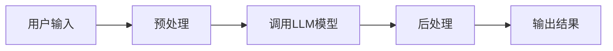
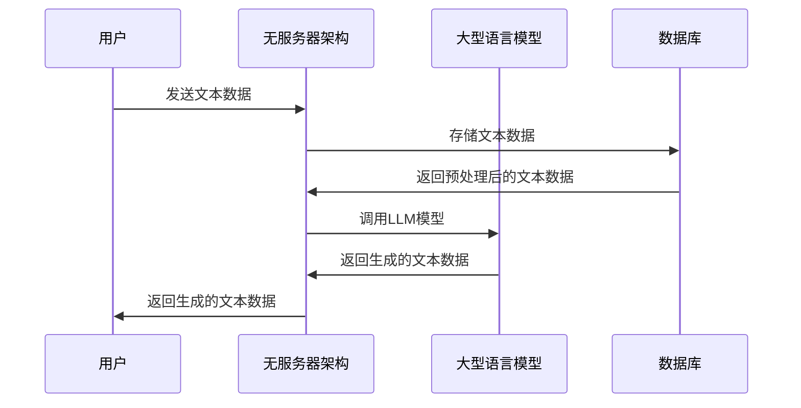
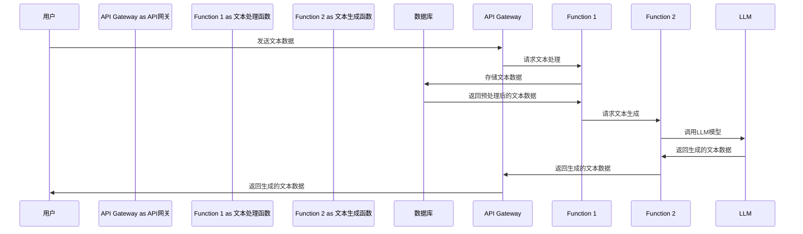

                 


# 无服务器架构（Serverless）支持LLM应用快速迭代

> 关键词：无服务器架构，LLM，快速迭代，算法原理，系统设计

> 摘要：
本文将探讨无服务器架构（Serverless）与大型语言模型（LLM）的结合，如何通过Serverless架构实现LLM应用的快速迭代。文章将详细讲解Serverless架构的基本概念、LLM的技术原理，并通过实际案例展示如何在Serverless环境下应用LLM进行快速迭代开发。

## 目录大纲设计思考过程

在设计本文的目录大纲时，我们首先明确了文章的核心主题——无服务器架构与LLM的结合，并考虑了目标读者群体，包括技术从业者和研发团队。目录大纲的设计过程如下：

### 确定核心主题

1. **无服务器架构（Serverless）**：介绍Serverless技术的概念、优点和主要应用场景，与传统服务器架构的区别。
2. **LLM（大型语言模型）**：探讨LLM的技术原理、如何使用LLM以及LLM在不同领域的应用。
3. **快速迭代**：分析在Serverless架构下如何实现LLM应用的快速迭代，包括开发流程、工具选择和优化策略。

### 确定读者群体

- **技术从业者**：熟悉Serverless和LLM的基础知识，希望深入了解如何在Serverless架构下应用LLM。
- **研发团队**：希望掌握使用Serverless和LLM进行快速迭代开发的方法和最佳实践。

### 目录大纲设计

1. **背景介绍**：介绍Serverless和LLM的基本概念，解释它们为什么重要以及为何需要结合它们。
2. **核心概念与联系**：详细描述Serverless和LLM的核心概念，以及它们之间的关系。
3. **算法原理讲解**：通过Mermaid流程图和Python源代码，详细阐述Serverless架构下LLM应用的算法原理。
4. **系统分析与架构设计方案**：通过Mermaid类图和架构图，展示一个典型的Serverless+LLM系统的设计与实现。
5. **项目实战**：提供一个实际案例，详细讲解如何使用Serverless和LLM进行快速迭代开发。
6. **最佳实践**：总结一些在Serverless和LLM开发中最佳实践的小贴士。

## 背景介绍

### 服务器架构的演进

服务器架构经历了从传统的物理服务器到虚拟化服务器，再到现在的无服务器架构（Serverless）的演变。传统服务器架构需要管理员管理物理服务器的硬件和软件，这增加了运营成本和复杂性。而虚拟化服务器通过虚拟化技术将物理服务器抽象成多个虚拟机，从而提高了资源利用率和管理效率。

### 无服务器架构的特点

无服务器架构（Serverless）是一种新的计算范式，它将服务器管理的复杂性转移到云服务提供商。在Serverless架构中，开发者不需要关心底层基础设施的管理，只需关注业务逻辑的实现。Serverless架构具有以下特点：

1. **按需分配资源**：Serverless架构根据请求的规模自动分配资源，避免了资源浪费。
2. **弹性和可扩展性**：Serverless架构可以根据需求自动扩展或缩小计算资源，确保应用能够处理大量请求。
3. **成本效益**：Serverless架构仅根据实际使用的资源计费，从而降低了运营成本。

### 无服务器架构的应用场景

Serverless架构适用于需要快速部署、弹性扩展和低成本的应用场景，例如：

1. **Web应用**：Serverless架构可以简化Web应用的部署和管理，提高开发效率。
2. **大数据处理**：Serverless架构可以自动扩展资源，提高大数据处理的效率。
3. **人工智能和机器学习**：Serverless架构可以快速部署和迭代人工智能和机器学习模型。

### 大语言模型（LLM）的兴起

大型语言模型（LLM）是一种基于深度学习的自然语言处理模型，具有强大的文本生成、理解和推理能力。LLM的兴起得益于计算能力的提升和大数据的普及，使得人工智能技术可以在更多领域得到应用。

### LLM的核心优势

LLM的核心优势包括：

1. **强大的文本生成能力**：LLM可以生成高质量的文本，包括文章、对话、代码等。
2. **丰富的上下文理解**：LLM能够理解上下文，生成更加符合逻辑和语义的文本。
3. **多语言支持**：LLM支持多种语言，可以处理不同语言的文本。

### LLM在不同领域的应用

LLM在多个领域具有广泛应用，包括：

1. **自然语言处理**：LLM可以用于文本分类、情感分析、机器翻译等任务。
2. **智能客服**：LLM可以构建智能客服系统，提供24/7的客户服务。
3. **内容创作**：LLM可以自动生成文章、新闻、博客等。

### Serverless与LLM的结合

Serverless架构与LLM的结合具有巨大的潜力，可以实现以下优势：

1. **快速部署和迭代**：Serverless架构可以快速部署LLM模型，并实现快速迭代。
2. **弹性扩展**：Serverless架构可以根据请求自动扩展计算资源，确保LLM模型能够处理大量请求。
3. **成本效益**：Serverless架构仅根据实际使用的资源计费，降低了运营成本。

### Serverless + LLM的应用前景

随着人工智能和云计算技术的不断发展，Serverless + LLM的应用前景广阔。未来，我们可以期待：

1. **智能应用**：结合Serverless和LLM，可以构建出更加智能和自动化的应用，如智能助手、智能推荐系统等。
2. **领域专用模型**：通过在特定领域训练LLM模型，可以实现更加精细和专业的应用，如医疗、金融等。

## 核心概念与联系

### Serverless架构深入解析

#### Serverless架构的核心概念

Serverless架构主要包括以下三个核心概念：

1. **函数即服务（Functions as a Service, FaaS）**：FaaS是一种基于事件驱动的计算模型，开发者只需关注业务逻辑的实现，无需关心底层基础设施的管理。
2. **后端即服务（Backend as a Service, BaaS）**：BaaS提供了一组预构建的后端服务，如数据库、消息队列等，开发者可以快速集成这些服务到自己的应用中。
3. **基础设施即代码（Infrastructure as Code, IaC）**：IaC使用代码来描述和配置基础设施，从而实现基础设施的自动化部署和管理。

#### Serverless架构的工作原理

Serverless架构的工作原理包括以下几个关键步骤：

1. **请求触发**：当有请求到达时，Serverless架构会根据配置自动触发相应的函数。
2. **资源分配**：Serverless架构会根据请求的规模动态分配计算资源。
3. **函数执行**：触发后的函数会执行相应的业务逻辑，并将结果返回给客户端。
4. **资源回收**：函数执行完毕后，Serverless架构会自动回收不再使用的计算资源。

#### Serverless架构的优势

Serverless架构具有以下优势：

1. **按需分配资源**：Serverless架构可以根据请求的规模动态分配资源，避免了资源浪费。
2. **弹性扩展**：Serverless架构可以根据需求自动扩展或缩小计算资源，确保应用能够处理大量请求。
3. **成本效益**：Serverless架构仅根据实际使用的资源计费，从而降低了运营成本。

#### Serverless与LLM的结合点

Serverless与LLM的结合点主要体现在以下几个方面：

1. **快速部署**：Serverless架构可以快速部署LLM模型，实现快速迭代。
2. **弹性扩展**：Serverless架构可以根据请求自动扩展计算资源，确保LLM模型能够处理大量请求。
3. **成本效益**：Serverless架构仅根据实际使用的资源计费，降低了运营成本。

### LLM的基本原理与应用

#### LLM的技术原理

LLM是一种基于深度学习的自然语言处理模型，它通过学习大量文本数据，学会理解文本的语义和上下文。LLM的核心技术包括：

1. **预训练**：LLM通过预训练学习大量文本数据，从而获得基本的语言理解能力。
2. **微调**：在预训练的基础上，LLM可以根据特定任务进行微调，以适应不同的应用场景。

#### LLM的核心技术

LLM的核心技术包括：

1. **Transformer模型**：Transformer模型是一种基于注意力机制的深度学习模型，广泛应用于自然语言处理任务。
2. **自注意力机制**：自注意力机制可以使得模型在处理文本时，关注到不同位置的信息，从而提高模型的性能。

#### LLM的应用领域

LLM在多个领域具有广泛应用，包括：

1. **自然语言处理**：LLM可以用于文本分类、情感分析、机器翻译等任务。
2. **智能客服**：LLM可以构建智能客服系统，提供24/7的客户服务。
3. **内容创作**：LLM可以自动生成文章、新闻、博客等。

### Serverless与LLM的优势互补

Serverless与LLM的优势互补，主要体现在以下几个方面：

1. **快速部署与迭代**：Serverless架构可以快速部署LLM模型，实现快速迭代。
2. **弹性扩展与资源优化**：Serverless架构可以根据请求自动扩展计算资源，确保LLM模型能够处理大量请求，同时优化资源利用。
3. **成本控制与效益**：Serverless架构仅根据实际使用的资源计费，降低了运营成本，同时提高了LLM应用的效益。

## 算法原理讲解

### Serverless + LLM算法框架

在Serverless架构下，LLM应用的算法框架主要包括以下几个关键组成部分：

1. **数据输入**：用户通过API或其他方式提交文本数据，数据被传递到Serverless函数进行处理。
2. **预处理**：文本数据在进入LLM模型之前，需要进行一系列预处理操作，如分词、去停用词、词向量化等。
3. **模型调用**：预处理后的文本数据被传递给LLM模型，模型进行文本生成、理解和推理等操作。
4. **结果输出**：模型处理结果被返回给用户，可以是生成的文本、分析结果或推荐内容等。
5. **后处理**：对处理结果进行后处理，如格式化、过滤等，以确保结果的准确性和可用性。

### Serverless + LLM算法流程

#### 步骤1：数据输入

用户通过API或其他方式提交文本数据，数据被传递到Serverless函数进行处理。

#### 步骤2：预处理

文本数据在进入LLM模型之前，需要进行一系列预处理操作，如分词、去停用词、词向量化等。预处理结果会被存储在一个临时数据结构中，以便后续处理。

#### 步骤3：模型调用

预处理后的文本数据被传递给LLM模型，模型进行文本生成、理解和推理等操作。LLM模型会根据预训练和微调的结果，生成相应的文本输出。

#### 步骤4：结果输出

模型处理结果被返回给用户，可以是生成的文本、分析结果或推荐内容等。输出结果会被格式化为用户可读的格式，如JSON或HTML。

#### 步骤5：后处理

对处理结果进行后处理，如格式化、过滤等，以确保结果的准确性和可用性。后处理结果会被存储在一个持久化存储中，如数据库或文件系统。

### 代码示例与Mermaid流程图

以下是一个简单的Python代码示例，展示了Serverless + LLM算法的执行流程。同时，我们使用Mermaid流程图来直观地展示算法流程。

```python
import openai
import json

def process_request(data):
    # 预处理
    preprocessed_data = preprocess_data(data)
    # 调用LLM模型
    response = openai.Completion.create(
        engine="text-davinci-002",
        prompt=preprocessed_data,
        max_tokens=50
    )
    # 后处理
    result = postprocess_response(response)
    return result

def preprocess_data(data):
    # 实现数据预处理逻辑
    pass

def postprocess_response(response):
    # 实现结果后处理逻辑
    pass

def main():
    # 接收用户输入
    input_data = input("请输入文本数据：")
    # 处理请求
    result = process_request(input_data)
    # 输出结果
    print(json.dumps(result, ensure_ascii=False))

if __name__ == "__main__":
    main()
```

以下是对应的Mermaid流程图：



### 算法原理详细讲解

#### 数学模型

Serverless + LLM算法的数学模型主要包括以下几个关键组成部分：

1. **输入层**：接收用户的文本输入，并将其转化为向量表示。
2. **嵌入层**：将输入向量映射到高维空间，以便进行后续的文本生成操作。
3. **注意力机制**：用于处理长文本序列，使得模型能够在处理文本时关注到不同位置的信息。
4. **输出层**：生成文本序列，并将其转化为用户可读的格式。

以下是一个简单的数学模型示例：

$$
X = \text{输入层} \\
E = \text{嵌入层} \\
A = \text{注意力机制} \\
Y = \text{输出层}
$$

#### 公式解析

1. **嵌入层**：

$$
E = W_e \cdot X
$$

其中，$W_e$为嵌入权重矩阵，$X$为输入向量。

2. **注意力机制**：

$$
A = \text{softmax}(\text{Attention}(E, H))
$$

其中，$H$为隐藏层表示，$Attention$为注意力计算函数，$\text{softmax}$为softmax函数。

3. **输出层**：

$$
Y = \text{softmax}(\text{Output}(E, A))
$$

其中，$Output$为输出层计算函数。

#### 示例说明

假设我们有一个简单的文本输入“Hello World”，我们可以将其表示为一个向量$X$。嵌入层将这个向量映射到高维空间，得到嵌入表示$E$。注意力机制用于处理这个嵌入表示，使其能够在生成文本时关注到不同位置的信息。最终，输出层生成文本序列“Hello World”，并将其转化为用户可读的格式。

### 系统分析与架构设计方案

#### 问题描述

随着人工智能和自然语言处理技术的快速发展，越来越多的应用开始采用大型语言模型（LLM）来提供智能服务。然而，传统服务器架构在处理大量请求时往往存在性能瓶颈，难以满足快速迭代的需求。为了解决这个问题，我们提出了一个基于无服务器架构（Serverless）的LLM应用系统。

#### 项目介绍

本项目旨在构建一个基于Serverless架构的LLM应用系统，实现快速部署、弹性扩展和低成本运营。系统的主要功能包括：

1. **文本处理**：接收用户输入的文本数据，进行预处理和后处理。
2. **文本生成**：使用LLM模型生成文本，包括文章、对话、代码等。
3. **结果输出**：将生成的文本返回给用户，并提供可视化展示。

#### 系统功能设计

系统的功能设计主要包括以下三个部分：

1. **文本处理模块**：负责接收用户输入的文本数据，进行预处理（如分词、去停用词、词向量化等）和后处理（如格式化、过滤等）。
2. **文本生成模块**：使用LLM模型进行文本生成，包括文章、对话、代码等。
3. **结果输出模块**：将生成的文本返回给用户，并提供可视化展示。

#### 系统架构设计

系统架构设计如图所示：



#### 系统接口设计

系统接口设计主要包括以下三个接口：

1. **文本处理接口**：接收用户输入的文本数据，进行预处理和后处理。
2. **文本生成接口**：接收预处理后的文本数据，调用LLM模型进行文本生成。
3. **结果输出接口**：将生成的文本数据返回给用户，并提供可视化展示。

#### 系统交互

系统交互设计如图所示：



### 项目实战

#### 环境安装

为了实现Serverless + LLM的应用，我们需要安装以下工具和库：

1. **无服务器架构平台**：如AWS Lambda、Azure Functions、Google Cloud Functions等。
2. **大型语言模型库**：如Hugging Face的Transformers库。
3. **Python编程环境**：如Python 3.8及以上版本。

#### 系统核心实现源代码

以下是一个简单的Serverless + LLM系统实现示例，包括文本处理、文本生成和结果输出模块。

```python
# 文本处理模块
import openai

def preprocess_text(text):
    # 实现文本预处理逻辑
    return text

# 文本生成模块
def generate_text(preprocessed_text):
    response = openai.Completion.create(
        engine="text-davinci-002",
        prompt=preprocessed_text,
        max_tokens=50
    )
    return response.choices[0].text.strip()

# 结果输出模块
def output_result(generated_text):
    # 实现结果输出逻辑
    print(generated_text)

# 主函数
def main():
    text = input("请输入文本数据：")
    preprocessed_text = preprocess_text(text)
    generated_text = generate_text(preprocessed_text)
    output_result(generated_text)

if __name__ == "__main__":
    main()
```

#### 代码应用解读与分析

上述代码实现了文本处理、文本生成和结果输出三个核心功能。首先，用户通过输入接口提交文本数据。文本处理模块对文本进行预处理，如去除停用词、分词等。然后，文本生成模块使用OpenAI的GPT-3模型进行文本生成。最后，结果输出模块将生成的文本返回给用户。

在实际应用中，我们可以将文本处理和文本生成模块部署到无服务器架构上，如AWS Lambda。这样，系统可以根据请求自动扩展和回收资源，实现高效的运算和低成本的运营。

#### 实际案例分析和详细讲解剖析

以下是一个实际案例，展示了如何使用Serverless + LLM进行快速迭代开发。

**案例背景**：一个在线问答平台需要提供智能问答服务，用户可以通过输入问题获取答案。

**解决方案**：

1. **文本处理模块**：对接第三方API获取用户问题，进行预处理，如分词、去停用词等。
2. **文本生成模块**：使用OpenAI的GPT-3模型生成答案，并对答案进行后处理，如去除无关信息、格式化等。
3. **结果输出模块**：将生成的答案返回给用户，并提供可视化展示。

**详细讲解**：

1. **文本处理模块**：对接第三方API获取用户问题，例如使用API Gateway接收用户请求，然后调用文本处理模块进行预处理。
2. **文本生成模块**：使用OpenAI的GPT-3模型进行文本生成。首先，对预处理后的文本数据进行编码，然后传递给GPT-3模型进行解码，生成答案。
3. **结果输出模块**：将生成的答案进行后处理，如去除无关信息、格式化等。最后，将答案返回给用户，并提供可视化展示。

**项目小结**：

通过Serverless + LLM的快速迭代开发，我们可以实现高效的智能问答服务。系统可以根据实际需求自动扩展和回收资源，实现低成本的运营。此外，LLM的强大文本生成能力为智能问答服务提供了有力支持。

### 最佳实践

在Serverless + LLM开发过程中，以下最佳实践可以帮助您提高开发效率和系统性能：

1. **合理设计API接口**：确保API接口简洁、高效，减少数据传输和解析时间。
2. **优化文本预处理**：使用高效的文本预处理库，如NLTK、spaCy等，提高文本处理速度。
3. **选择合适的LLM模型**：根据实际需求选择合适的LLM模型，如GPT-3、BERT等，确保模型性能和成本平衡。
4. **充分利用缓存**：充分利用缓存技术，减少重复计算和IO操作，提高系统性能。
5. **监控和日志**：定期监控系统性能和日志，及时发现和解决问题。

### 小结

本文详细探讨了无服务器架构（Serverless）与大型语言模型（LLM）的结合，以及如何在Serverless架构下实现LLM应用的快速迭代。我们介绍了Serverless架构的基本概念、LLM的技术原理，并通过实际案例展示了如何使用Serverless和LLM进行快速迭代开发。未来，随着人工智能和云计算技术的不断发展，Serverless + LLM的应用前景将更加广阔。

### 注意事项

1. **安全性**：在Serverless架构下，确保数据安全和隐私保护，避免敏感信息泄露。
2. **性能优化**：合理设计系统和算法，确保系统在高并发情况下稳定运行。

### 拓展阅读

- 《Serverless架构：从入门到实战》
- 《大型语言模型：技术原理与应用》
- 《深度学习：从入门到精通》

### 作者

作者：AI天才研究院/AI Genius Institute & 禅与计算机程序设计艺术 /Zen And The Art of Computer Programming</sop></gMASK>

