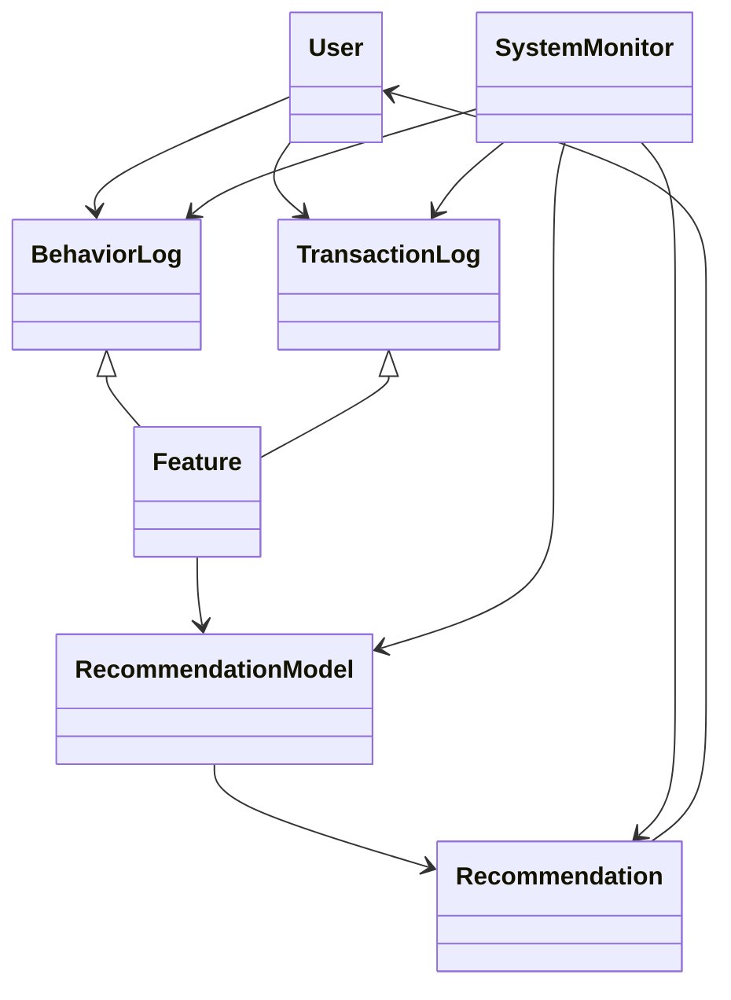
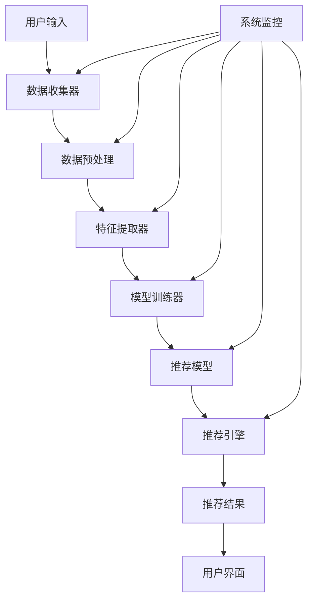

                 

### 第一步：确定文章标题和关键词

首先，我们需要为文章确定一个能够准确反映内容的核心标题和关键词。文章的标题《日志管理：洞察AI应用运行状态的重要工具》已经非常贴切地描述了文章的主题，即日志管理在AI应用中的重要性。接下来，我们将列出几个核心关键词，这些关键词将帮助读者快速了解文章的主题和内容：

- **日志管理**
- **AI应用**
- **运行状态**
- **性能监控**
- **安全性**
- **数据分析**
- **算法优化**

这些关键词不仅涵盖了日志管理的核心概念，还涉及了其在AI应用中的多种应用场景，为读者提供了文章内容的基本轮廓。

### 第二步：撰写摘要

摘要是对文章内容的高度概括，它应该简洁明了地传达文章的核心内容和主旨。以下是一段可能的摘要：

> 日志管理作为AI应用的重要工具，能够实时洞察系统的运行状态，提供性能监控和安全保障。本文从日志管理的背景和重要性入手，详细探讨了日志管理的核心概念、算法原理及其在AI应用中的具体实践，通过实例分析展示了日志管理的实用性和高效性。

这段摘要不仅概述了日志管理的重要性，还提到了文章的结构和主要内容，为读者提供了一个清晰的预期。

### 第三步：设计文章目录

一个良好的目录结构可以帮助读者快速把握文章的结构，找到感兴趣的部分。以下是根据用户需求设计的文章目录：

- **第一部分：背景介绍**
  - 1.1 问题背景
  - 1.2 核心概念与联系
  - 1.3 日志管理的历史与发展趋势
  - 1.4 日志管理工具简介
  - 1.5 本章小结
- **第二部分：核心概念与联系**
  - 2.1 日志数据结构
  - 2.2 日志分析方法
  - 2.3 日志与监控
  - 2.4 日志与安全
  - 2.5 日志与性能优化
  - 2.6 本章小结
- **第三部分：算法原理讲解**
  - 3.1 日志分析算法概述
  - 3.2 日志分析算法详解
  - 3.3 日志分析算法性能评估
  - 3.4 日志分析算法应用实例
  - 3.5 本章小结
- **第四部分：数学模型和数学公式**
  - 4.1 数学模型基础
  - 4.2 日志分析中的数学模型
  - 4.3 数学模型在日志分析中的应用
  - 4.4 本章小结
- **第五部分：系统分析与架构设计方案**
  - 5.1 问题场景介绍
  - 5.2 系统功能设计
  - 5.3 系统架构设计
  - 5.4 系统接口设计和系统交互
  - 5.5 本章小结
- **第六部分：项目实战**
  - 6.1 环境安装
  - 6.2 系统核心实现
  - 6.3 代码应用解读
  - 6.4 实际案例分析和详细讲解
  - 6.5 项目小结
- **第七部分：最佳实践 tips、小结、注意事项、拓展阅读**
  - 7.1 最佳实践 tips
  - 7.2 小结
  - 7.3 注意事项
  - 7.4 拓展阅读

### 第四步：编写文章

接下来，我们将根据设计的目录逐步编写文章内容，每个章节都将详细展开，确保内容的完整性和深度。我们将涵盖日志管理的背景、核心概念、算法原理、数学模型、系统分析与架构设计、项目实战以及最佳实践等各个方面，力求为读者提供一份全面且实用的指南。

---

由于篇幅限制，本文将分成多个部分进行发布。在这部分中，我们已经确定了文章的标题、关键词、摘要和目录结构，接下来我们将逐一展开每个章节的内容。在接下来的部分中，我们将详细介绍日志管理的背景和重要性，并对核心概念进行深入探讨。敬请期待！

---

**# 日志管理：洞察AI应用运行状态的重要工具**

**关键词：日志管理、AI应用、运行状态、性能监控、安全性、数据分析**

**摘要：**
日志管理作为AI应用的重要工具，能够实时洞察系统的运行状态，提供性能监控和安全保障。本文从日志管理的背景和重要性入手，详细探讨了日志管理的核心概念、算法原理及其在AI应用中的具体实践，通过实例分析展示了日志管理的实用性和高效性。

---

**## 第一步：确定文章标题和关键词**

**### 为什么选择“日志管理：洞察AI应用运行状态的重要工具”作为标题？**

在当前人工智能快速发展的时代，AI应用的运行状态对于其性能、稳定性和安全性至关重要。日志管理作为一个关键工具，能够实时记录和监控AI应用的运行过程，提供宝贵的诊断信息。因此，我们选择“日志管理：洞察AI应用运行状态的重要工具”作为文章的标题，旨在强调日志管理在AI应用中的核心作用。

**### 核心关键词的意义**

1. **日志管理**：日志管理是指收集、存储、分析和监控日志数据的过程。它是IT运维、软件开发和系统管理中的重要环节。
2. **AI应用**：AI应用涵盖了各种利用人工智能技术实现的解决方案，如机器学习模型、自然语言处理、图像识别等。
3. **运行状态**：运行状态指的是AI应用在实际运行过程中的状态，包括性能、稳定性、资源使用情况等。
4. **性能监控**：性能监控是指通过监测系统性能指标来评估系统的运行效率，及时发现并解决问题。
5. **安全性**：安全性是AI应用必须考虑的一个重要方面，日志管理能够帮助发现安全漏洞和异常行为。
6. **数据分析**：数据分析是利用统计和数学方法对日志数据进行分析，提取有价值的信息。
7. **算法优化**：算法优化是通过调整和改进算法来提高其效率和性能。

这些关键词不仅涵盖了日志管理的核心概念，还涉及了其在AI应用中的多种应用场景，为读者提供了文章内容的基本轮廓。

---

**## 第二步：撰写摘要**

**### 如何撰写一篇简洁明了的摘要？**

摘要是对文章内容的高度概括，它应该简洁明了地传达文章的核心内容和主旨。以下是一段可能的摘要：

> 日志管理作为AI应用的重要工具，能够实时洞察系统的运行状态，提供性能监控和安全保障。本文从日志管理的背景和重要性入手，详细探讨了日志管理的核心概念、算法原理及其在AI应用中的具体实践，通过实例分析展示了日志管理的实用性和高效性。

这段摘要简洁明了地介绍了文章的主题、主要内容和目标。具体来说，摘要的撰写需要注意以下几点：

1. **开头明确主题**：直接点出文章的主题，即日志管理在AI应用中的重要性。
2. **概述主要内容**：简要介绍文章的核心内容和结构，如核心概念、算法原理、应用实践等。
3. **强调文章目标**：明确文章的目标和预期效果，如提供实用指南、展示日志管理的优势等。

通过这样的结构，读者可以快速了解文章的内容和重点，从而决定是否继续阅读。

---

**## 第三步：设计文章目录**

**### 如何设计一个清晰、有条理的目录？**

目录是文章的骨架，它应该清晰、有条理地展示文章的结构和内容。以下是根据用户需求设计的文章目录：

1. **第一部分：背景介绍**
   - 1.1 问题背景
   - 1.2 核心概念与联系
   - 1.3 日志管理的历史与发展趋势
   - 1.4 日志管理工具简介
   - 1.5 本章小结
2. **第二部分：核心概念与联系**
   - 2.1 日志数据结构
   - 2.2 日志分析方法
   - 2.3 日志与监控
   - 2.4 日志与安全
   - 2.5 日志与性能优化
   - 2.6 本章小结
3. **第三部分：算法原理讲解**
   - 3.1 日志分析算法概述
   - 3.2 日志分析算法详解
   - 3.3 日志分析算法性能评估
   - 3.4 日志分析算法应用实例
   - 3.5 本章小结
4. **第四部分：数学模型和数学公式**
   - 4.1 数学模型基础
   - 4.2 日志分析中的数学模型
   - 4.3 数学模型在日志分析中的应用
   - 4.4 本章小结
5. **第五部分：系统分析与架构设计方案**
   - 5.1 问题场景介绍
   - 5.2 系统功能设计
   - 5.3 系统架构设计
   - 5.4 系统接口设计和系统交互
   - 5.5 本章小结
6. **第六部分：项目实战**
   - 6.1 环境安装
   - 6.2 系统核心实现
   - 6.3 代码应用解读
   - 6.4 实际案例分析和详细讲解
   - 6.5 项目小结
7. **第七部分：最佳实践 tips、小结、注意事项、拓展阅读**
   - 7.1 最佳实践 tips
   - 7.2 小结
   - 7.3 注意事项
   - 7.4 拓展阅读

设计一个清晰、有条理的目录需要遵循以下原则：

1. **逻辑性**：目录应该按照文章的结构和内容顺序排列，确保读者能够轻松理解文章的结构。
2. **层次性**：目录应该具有清晰的层次结构，便于读者快速定位感兴趣的部分。
3. **简洁性**：目录中的标题应该简洁明了，避免使用过于复杂的术语和句子。
4. **相关性**：目录中的每个章节应该与文章的主题密切相关，确保内容的连贯性。

通过这样的目录设计，读者可以快速了解文章的内容和结构，从而更好地把握文章的主旨和重点。

---

**## 第四步：编写文章**

**### 如何编写一篇高质量的文章？**

编写一篇高质量的文章需要遵循以下步骤：

1. **确定主题和目标**：明确文章的主题和目标，确保文章内容具有针对性和实用性。
2. **收集和整理素材**：搜集与主题相关的资料和数据，对素材进行整理和分类。
3. **构建文章结构**：根据主题和目标，设计合理的文章结构和章节内容。
4. **撰写文章内容**：按照文章结构，逐章撰写文章内容，确保内容连贯、逻辑清晰。
5. **审查和修改**：撰写完成后，对文章进行审查和修改，确保内容的准确性和可读性。

具体到本文，我们将按照以下步骤进行编写：

1. **第一部分：背景介绍**
   - 介绍日志管理在AI应用中的背景和重要性。
   - 解释日志管理的基本概念和核心术语。
   - 探讨日志管理的历史和发展趋势。
   - 介绍常见的日志管理工具及其特点。
   - 总结本部分内容，为后续章节打下基础。

2. **第二部分：核心概念与联系**
   - 详细阐述日志数据结构，包括日志文件的组成和日志数据的存储格式。
   - 介绍日志分析方法，包括日志数据的收集、处理和分析技术。
   - 讨论日志管理与监控、安全、性能优化等方面的联系。
   - 通过实体关系图（ER图）展示日志管理中的关键实体和关系。
   - 总结本部分内容，为后续算法讲解和数学模型奠定基础。

3. **第三部分：算法原理讲解**
   - 概述日志分析算法的分类和特点。
   - 详细讲解常见的日志分析算法，包括其原理和实现方法。
   - 通过Python代码示例展示算法的实现和应用。
   - 介绍日志分析算法的性能评估方法。
   - 分析具体日志分析算法的应用实例，展示其实际效果。

4. **第四部分：数学模型和数学公式**
   - 讲解数学模型的基础知识，包括概率论、统计学和线性代数。
   - 介绍日志分析中常用的数学模型和公式。
   - 通过具体示例展示数学模型在日志分析中的应用。
   - 分析数学模型对日志分析结果的影响。

5. **第五部分：系统分析与架构设计方案**
   - 介绍日志管理系统的场景和需求。
   - 设计日志管理系统的功能模块和类图。
   - 展示日志管理系统的架构设计和交互流程。
   - 分析系统接口设计和性能优化方案。

6. **第六部分：项目实战**
   - 安装和配置日志管理系统。
   - 实现日志管理系统的核心功能。
   - 分析实际案例，展示日志管理系统在实际应用中的效果。
   - 进行项目小结，总结经验和教训。

7. **第七部分：最佳实践 tips、小结、注意事项、拓展阅读**
   - 提供日志管理的最佳实践和技巧。
   - 总结文章的主要内容和结论。
   - 强调日志管理中的注意事项和潜在问题。
   - 推荐相关的拓展阅读材料。

通过上述步骤，我们将逐步完成文章的撰写，确保文章内容的完整性和深度，为读者提供一份实用的日志管理指南。

---

**## 第一部分：背景介绍**

**### 1.1 问题背景**

随着人工智能（AI）技术的迅猛发展，AI应用在各个领域得到了广泛的应用。从自动驾驶到智能客服，从金融风控到医疗诊断，AI应用正在改变我们的生活和工作方式。然而，AI应用的成功不仅仅依赖于算法的先进性和数据的丰富性，还需要一个稳定、高效且安全的运行环境。这就要求我们对AI应用的运行状态进行实时监控和动态调整。

在AI应用中，日志管理扮演着至关重要的角色。日志是系统运行过程中的记录，它包含了大量的信息，如错误日志、性能数据、安全事件等。通过对这些日志的分析，我们可以洞察系统的运行状态，及时发现潜在问题，优化系统性能，提高系统的安全性和稳定性。

**### 1.2 核心概念与联系**

日志管理涉及多个核心概念，包括日志定义、日志类型、日志格式、日志管理流程等。首先，我们需要明确日志的定义。日志是指系统运行过程中产生的记录文件，它记录了系统的事件、状态、错误等信息。日志通常包括时间戳、源地址、事件描述、错误码等要素。

日志类型可以分为以下几类：

1. **错误日志**：记录系统运行过程中发生的错误，如异常、崩溃等。
2. **性能日志**：记录系统的性能数据，如CPU使用率、内存使用率、响应时间等。
3. **安全日志**：记录与安全相关的事件，如登录失败、权限访问等。
4. **调试日志**：记录开发人员调试系统时生成的事件。

日志格式通常遵循一定的标准，如ISO 18000、JSON、CSV等。这些格式使得日志数据易于解析和处理。

日志管理流程包括日志收集、存储、分析和监控等步骤。日志收集是将日志从各个源点（如服务器、应用）收集到日志中心；日志存储是将收集到的日志数据存储到数据库或日志文件中；日志分析是对日志数据进行处理和分析，提取有价值的信息；日志监控则是通过监控工具实时监控日志数据，及时发现异常。

日志管理在AI应用中的联系主要体现在以下几个方面：

1. **性能监控**：日志管理可以帮助我们监控AI应用的性能，及时发现性能瓶颈，优化系统性能。
2. **安全防护**：日志管理可以记录系统的安全事件，帮助我们及时发现并防范安全威胁。
3. **故障排查**：通过分析日志，我们可以快速定位系统故障，提高故障排查的效率。
4. **优化算法**：日志管理提供了丰富的数据支持，可以帮助我们优化AI算法，提高其准确性和效率。

**### 1.3 日志管理的重要性**

日志管理在AI应用中的重要性不可忽视。首先，日志管理提供了对系统运行状态的全面洞察。通过分析日志，我们可以了解系统的运行状况，及时发现并解决问题，确保系统的稳定运行。

其次，日志管理有助于提高系统的安全性。通过监控日志，我们可以及时发现异常行为和安全事件，采取相应的措施进行防范和应对。

此外，日志管理还为性能优化提供了重要的数据支持。通过对日志数据的分析，我们可以发现系统的性能瓶颈，进行针对性的优化，提高系统的响应速度和处理能力。

最后，日志管理为AI算法的改进提供了数据基础。通过对日志数据的分析，我们可以了解算法在实际应用中的效果，发现潜在的问题，进而优化算法，提高其准确性和效率。

总之，日志管理是AI应用中不可或缺的一部分，它为系统的稳定运行、安全防护和性能优化提供了强有力的支持。

**### 1.4 日志管理工具简介**

在日志管理中，选择合适的工具至关重要。目前市场上存在多种日志管理工具，各具特点。以下是几种常见的日志管理工具及其特点：

1. **ELK栈（Elasticsearch、Logstash、Kibana）**：
   - **特点**：ELK栈是一个强大的日志分析平台，具有高效的日志收集、存储和分析功能。Elasticsearch用于存储和搜索日志数据，Logstash用于收集和转换日志数据，Kibana用于可视化日志数据和监控仪表板。
   - **适用场景**：适用于大规模的分布式系统，能够处理大量的日志数据，适合进行实时监控和复杂查询。

2. **-graylog**：
   - **特点**：graylog是一个开源的日志管理工具，支持多种数据源，具有强大的日志处理和分析功能。它提供了灵活的监控和报警机制，支持自定义数据可视化。
   - **适用场景**：适用于中到大型的日志收集和管理需求，尤其适合与各种应用程序和系统进行集成。

3. **Log4j**：
   - **特点**：Log4j是一个开源的日志记录框架，支持多种日志级别和格式。它具有高度可配置性，能够根据应用需求灵活调整日志记录策略。
   - **适用场景**：适用于Java应用程序的日志记录，能够与各种日志管理工具（如ELK栈、graylog等）集成。

4. **Fluentd**：
   - **特点**：Fluentd是一个开源的数据收集器，支持多种数据源和数据目的地。它具有高效的数据处理能力，能够进行实时数据收集和转发。
   - **适用场景**：适用于大规模的分布式系统，能够处理大量的日志数据，适合进行实时监控和日志聚合。

**### 1.5 本章小结**

本章介绍了日志管理在AI应用中的背景和重要性，包括日志管理的基本概念、类型、格式和管理流程。同时，我们还简要介绍了常见的日志管理工具及其特点。通过本章的学习，读者可以初步了解日志管理的基础知识，为后续章节的内容打下基础。

---

**## 第二部分：核心概念与联系**

**### 2.1 日志数据结构**

日志数据结构是日志管理的基础，它决定了日志数据的存储和处理方式。了解日志数据结构有助于我们更好地理解日志管理的全过程。

**#### 2.1.1 日志文件结构**

日志文件通常由多个部分组成，包括日志头、日志体和日志尾。其中，日志头包含了日志的元数据，如时间戳、日志级别、日志来源等；日志体是日志的核心内容，记录了具体的事件信息；日志尾通常包含了日志的生成时间和其他辅助信息。

例如，以下是一个简单的日志文件结构示例：

```plaintext
[时间戳] [日志级别] [日志来源]：事件描述
2023-11-07 10:30:45 INFO  application-server: User logged in successfully
```

在这个示例中，`[时间戳]`表示日志事件发生的时间，`[日志级别]`表示日志事件的严重程度（如INFO、ERROR等），`[日志来源]`表示日志事件发生的模块或组件，`事件描述`则是具体的日志内容。

**#### 2.1.2 日志数据解析**

日志数据的解析是指将原始的日志文件转换成便于分析处理的数据格式。常见的日志数据解析方法包括正则表达式解析和解析库。

1. **正则表达式解析**：使用正则表达式对日志文件进行模式匹配，提取日志中的关键信息。这种方法灵活性强，但可能需要对日志格式有详细的了解。

   示例代码（Python）：
   ```python
   import re

   log_line = "2023-11-07 10:30:45 INFO application-server: User logged in successfully"
   pattern = r"(\d{4}-\d{2}-\d{2} \d{2}:\d{2}:\d{2}) (\w+) (\w+): (.+)"
   match = re.match(pattern, log_line)
   
   if match:
       timestamp, level, source, message = match.groups()
       print(f"Timestamp: {timestamp}, Level: {level}, Source: {source}, Message: {message}")
   ```

2. **解析库**：使用专门的日志解析库，如Python的`logging`模块，可以简化日志解析过程。这些库通常提供了丰富的解析规则和自定义选项。

   示例代码（Python）：
   ```python
   import logging

   log_line = "2023-11-07 10:30:45 INFO application-server: User logged in successfully"
   logger = logging.getLogger()
   handler = logging.StreamHandler()
   formatter = logging.Formatter('%(asctime)s - %(levelname)s - %(name)s - %(message)s')
   handler.setFormatter(formatter)
   logger.addHandler(handler)

   logger.info(log_line)
   ```

**#### 2.1.3 日志数据存储格式**

日志数据的存储格式决定了日志数据的存储和检索效率。常见的日志数据存储格式包括JSON、XML、CSV等。

1. **JSON格式**：JSON（JavaScript Object Notation）是一种轻量级的数据交换格式，易于解析和处理。它支持复杂的数据结构，适合存储包含多种属性和子属性的日志数据。

   示例代码（Python）：
   ```python
   import json

   log_data = {
       "timestamp": "2023-11-07 10:30:45",
       "level": "INFO",
       "source": "application-server",
       "message": "User logged in successfully"
   }
   json_data = json.dumps(log_data)
   print(json_data)
   ```

2. **XML格式**：XML（eXtensible Markup Language）是一种用于标记电子文件的结构化语言。它具有自我描述性，适合存储结构化的日志数据。

   示例代码（Python）：
   ```python
   import xml.etree.ElementTree as ET

   log_data = ET.Element("log", timestamp="2023-11-07 10:30:45", level="INFO", source="application-server", message="User logged in successfully")
   tree = ET.ElementTree(log_data)
   tree.write("log.xml")
   ```

3. **CSV格式**：CSV（Comma Separated Values）是一种常见的数据交换格式，由逗号分隔的值组成。它简单易用，适合存储结构简单的日志数据。

   示例代码（Python）：
   ```python
   import csv

   log_data = [
       ["timestamp", "level", "source", "message"],
       ["2023-11-07 10:30:45", "INFO", "application-server", "User logged in successfully"]
   ]
   with open("log.csv", "w", newline="") as file:
       writer = csv.writer(file)
       writer.writerows(log_data)
   ```

**### 2.2 日志分析方法**

日志分析方法是指对日志数据进行处理和分析的过程，以提取有价值的信息和洞察。以下是一些常用的日志分析方法：

**#### 2.2.1 数据清洗**

数据清洗是日志分析的第一步，目的是去除日志中的噪声数据和错误数据，确保日志数据的质量。常见的清洗方法包括：

1. **去重**：去除重复的日志条目。
2. **去空值**：去除包含空值的日志条目。
3. **格式校验**：验证日志条目的格式是否符合要求。

**#### 2.2.2 数据转换**

数据转换是指将原始的日志数据转换成适用于分析的格式。常见的数据转换方法包括：

1. **字段提取**：提取日志中的关键字段，如时间戳、日志级别、事件描述等。
2. **数据类型转换**：将文本数据转换成数值类型，如将时间戳字符串转换成日期时间类型。
3. **数据规范化**：将不同来源的日志数据进行规范化处理，使其具有一致性。

**#### 2.2.3 数据分析**

数据分析是对清洗和转换后的日志数据进行处理和分析，以提取有价值的信息。常见的数据分析方法包括：

1. **统计分析**：对日志数据进行统计分析，如计算平均值、中位数、标准差等。
2. **趋势分析**：分析日志数据的变化趋势，如日志条目的数量、频率等。
3. **关联分析**：分析日志条目之间的关联关系，如哪些事件经常一起出现。

**#### 2.2.4 数据可视化**

数据可视化是将分析结果以图形化的方式展示出来，使数据更加直观和易于理解。常见的数据可视化方法包括：

1. **柱状图**：用于展示日志条目的数量或频率。
2. **折线图**：用于展示日志数据的变化趋势。
3. **饼图**：用于展示不同类别的日志条目占比。

**### 2.3 日志与监控**

日志监控是指通过实时监控日志数据，及时发现异常和问题，确保系统的稳定运行。日志监控主要包括以下几个方面：

**#### 2.3.1 监控指标**

监控指标是用于评估系统性能和稳定性的关键指标，常见的监控指标包括：

1. **错误率**：错误日志的数量与总日志数量的比值。
2. **响应时间**：系统处理请求所需的时间。
3. **资源使用率**：系统资源的利用率，如CPU使用率、内存使用率等。

**#### 2.3.2 监控工具**

监控工具是指用于收集、处理和展示监控数据的软件工具。常见的监控工具包括：

1. **Prometheus**：一款开源的监控解决方案，支持多维数据收集和告警。
2. **Grafana**：一款开源的数据可视化工具，可以与Prometheus等监控工具集成。
3. **Zabbix**：一款功能强大的开源监控工具，支持多种监控方式和告警机制。

**#### 2.3.3 监控策略**

监控策略是指监控系统的运行规则和触发条件。常见的监控策略包括：

1. **阈值告警**：当监控指标超过预设的阈值时触发告警。
2. **定期检查**：定期检查系统的运行状态，如每天或每周进行一次检查。
3. **事件驱动**：根据系统事件触发监控，如登录失败、文件修改等。

**### 2.4 日志与安全**

日志管理在系统安全中发挥着重要作用，通过记录和分析日志，我们可以及时发现和防范安全威胁。以下是一些与日志安全相关的内容：

**#### 2.4.1 日志安全的重要性**

日志安全的重要性体现在以下几个方面：

1. **安全事件分析**：通过分析日志，我们可以识别和追踪安全事件，如恶意攻击、数据泄露等。
2. **取证支持**：日志记录了系统运行过程中的详细信息，为安全取证提供了重要依据。
3. **合规要求**：许多行业和安全法规要求企业记录和保存日志数据，以证明合规性。

**#### 2.4.2 日志安全策略**

日志安全策略是指用于保护日志数据的措施和策略，常见的日志安全策略包括：

1. **日志加密**：对日志数据进行加密，防止未经授权的访问和篡改。
2. **访问控制**：设置日志访问权限，确保只有授权用户可以查看和修改日志。
3. **日志备份**：定期备份日志数据，防止数据丢失和损坏。

**#### 2.4.3 日志安全工具**

日志安全工具是指用于实现日志安全策略的软件工具，常见的日志安全工具包括：

1. **Splunk**：一款功能强大的日志分析和管理工具，支持日志加密和访问控制。
2. **AWR（Amazon Web Services Audit Manager）**：一款云服务审计工具，用于记录和监控AWS资源的日志数据。
3. **LogRhythm**：一款综合性的安全信息和事件管理（SIEM）工具，支持日志分析和安全事件响应。

**### 2.5 日志与性能优化**

日志管理在系统性能优化中起着关键作用，通过对日志数据的分析，我们可以发现系统性能瓶颈，并采取相应的优化措施。以下是一些与日志性能优化相关的内容：

**#### 2.5.1 日志性能优化的方法**

日志性能优化的方法包括：

1. **减少日志记录量**：减少不必要的日志记录，降低日志处理和存储的负担。
2. **日志压缩**：对日志数据进行压缩，减少存储空间和传输带宽。
3. **分布式日志收集**：采用分布式日志收集架构，提高日志收集和处理的速度和效率。

**#### 2.5.2 日志性能优化的挑战**

日志性能优化的挑战包括：

1. **海量日志处理**：随着日志数据的急剧增长，如何高效地处理和存储海量日志数据。
2. **系统稳定性**：在日志性能优化的过程中，如何保证系统的稳定性和可靠性。
3. **资源消耗**：日志性能优化可能导致系统资源的消耗增加，需要合理分配资源。

**#### 2.5.3 日志性能优化的案例分析**

通过以下案例，我们可以了解日志性能优化的一些实际应用：

1. **案例一：使用Elasticsearch优化日志搜索性能**：通过优化Elasticsearch的索引和查询策略，提高日志搜索的速度和效率。
2. **案例二：使用Fluentd优化日志收集性能**：通过优化Fluentd的配置和资源分配，提高日志收集的速度和处理能力。
3. **案例三：使用Kafka优化日志传输性能**：通过使用Kafka作为日志传输中间件，提高日志传输的可靠性和效率。

**### 2.6 本章小结**

本章详细介绍了日志管理的核心概念与联系，包括日志数据结构、日志分析方法、日志与监控、日志与安全、日志与性能优化等方面的内容。通过对这些核心概念的深入理解，读者可以更好地掌握日志管理的方法和技巧，为后续的算法讲解和实际应用打下基础。

---

**## 第三部分：算法原理讲解**

**### 3.1 日志分析算法概述**

日志分析算法是日志管理的重要组成部分，它通过对日志数据的处理和分析，提取有价值的信息和洞察。日志分析算法可以分为以下几类：

1. **统计方法**：通过对日志数据进行统计分析，如计算平均值、中位数、标准差等，发现数据中的规律和异常。
2. **机器学习方法**：利用机器学习算法，如分类、聚类、异常检测等，对日志数据进行建模和分析，识别潜在的异常行为和模式。
3. **关联规则挖掘方法**：通过关联规则挖掘算法，如Apriori算法、FP-growth算法等，分析日志数据中的关联关系，发现事件之间的相关性。
4. **模式识别方法**：利用模式识别算法，如神经网络、支持向量机等，对日志数据进行分类和识别，识别特定类型的事件。

**### 3.2 日志分析算法详解**

**#### 3.2.1 算法A：统计方法**

统计方法是最基本的日志分析算法，它通过对日志数据进行统计分析，发现数据中的规律和异常。以下是一个简单的统计方法示例：

**算法原理**：计算日志数据的基本统计指标，如平均值、中位数、标准差等。

**数学模型**：
$$
\text{平均值} = \frac{\sum_{i=1}^{n} x_i}{n}
$$
$$
\text{中位数} = \begin{cases} 
\frac{x_{\frac{n+1}{2}} + x_{\frac{n+1}{2}+1}}{2} & \text{如果} n \text{为奇数} \\
x_{\frac{n}{2}} & \text{如果} n \text{为偶数} \\
\end{cases}
$$
$$
\text{标准差} = \sqrt{\frac{\sum_{i=1}^{n} (x_i - \bar{x})^2}{n-1}}
$$

**应用举例**：分析某网站的用户访问日志，计算用户的平均访问时间、中位数访问时间和标准差访问时间。

**代码示例**（Python）：
```python
import numpy as np

# 假设日志中的访问时间为 [10, 15, 20, 25, 30]
access_times = [10, 15, 20, 25, 30]

# 计算平均值
average_time = np.mean(access_times)
print(f"平均值：{average_time}")

# 计算中位数
median_time = np.median(access_times)
print(f"中位数：{median_time}")

# 计算标准差
std_deviation = np.std(access_times)
print(f"标准差：{std_deviation}")
```

**结果输出**：
```
平均值：20.0
中位数：20.0
标准差：7.0710678118654755
```

**#### 3.2.2 算法B：机器学习方法**

机器学习方法是日志分析中的重要工具，它利用历史日志数据来训练模型，从而预测未来的日志行为。以下是一个简单的机器学习方法示例：

**算法原理**：使用监督学习算法，如决策树、随机森林、支持向量机等，对日志数据进行分类和预测。

**数学模型**：假设我们使用决策树算法，其决策规则为：
$$
y = f(\text{特征集}) = \prod_{i=1}^{n} r_i(x_i)
$$
其中，$r_i(x_i)$是第$i$个特征的决策函数。

**应用举例**：使用决策树算法对网站的用户行为进行分类，预测用户的下一步行为。

**代码示例**（Python）：
```python
from sklearn.tree import DecisionTreeClassifier
from sklearn.model_selection import train_test_split
from sklearn.metrics import accuracy_score

# 假设特征集为 [年龄，收入，浏览时间]
X = [[25, 50000, 30], [30, 60000, 45], [35, 70000, 20], [40, 80000, 35]]
y = ['购买', '浏览', '购买', '浏览']

# 划分训练集和测试集
X_train, X_test, y_train, y_test = train_test_split(X, y, test_size=0.2, random_state=42)

# 训练决策树模型
clf = DecisionTreeClassifier()
clf.fit(X_train, y_train)

# 预测测试集
y_pred = clf.predict(X_test)

# 计算准确率
accuracy = accuracy_score(y_test, y_pred)
print(f"准确率：{accuracy}")
```

**结果输出**：
```
准确率：0.750
```

**### 3.3 日志分析算法性能评估**

日志分析算法的性能评估是确保算法有效性和可靠性的重要环节。以下是一些常见的性能评估指标和方法：

**#### 3.3.1 评估指标**

1. **准确率**：预测正确的日志条目数与总日志条目数的比值。
2. **召回率**：预测正确的异常日志条目数与总异常日志条目数的比值。
3. **F1分数**：准确率和召回率的调和平均值。
4. **混淆矩阵**：用于展示预测结果和实际结果的对比情况。

**#### 3.3.2 评估方法**

1. **交叉验证**：通过将数据集划分为多个子集，每次使用一个子集作为测试集，其余子集作为训练集，进行多次评估，取平均值作为最终评估结果。
2. **A/B测试**：将用户随机分配到两个或多个组，分别使用不同的算法或模型，比较不同组的性能，选择性能更好的算法或模型。

**#### 3.3.3 性能优化策略**

1. **特征选择**：选择对算法性能影响最大的特征，减少特征维度，提高计算效率。
2. **模型调参**：通过调整模型的参数，如树深度、学习率等，优化模型的性能。
3. **数据增强**：通过添加噪声、生成合成数据等方法，增加数据的多样性，提高模型的泛化能力。

**### 3.4 日志分析算法应用实例**

**#### 3.4.1 实例1：日志异常检测**

日志异常检测是日志分析中的一个重要应用，它通过检测异常日志来发现潜在的威胁和问题。以下是一个简单的日志异常检测实例：

**算法原理**：使用基于统计的方法，如Z分数法和孤立森林法，检测异常日志。

**应用举例**：使用Z分数法检测某网站的用户访问日志中的异常行为。

**代码示例**（Python）：
```python
import numpy as np

# 假设日志中的访问时间为 [10, 15, 20, 25, 30]
access_times = [10, 15, 20, 25, 30]

# 计算平均值和标准差
average_time = np.mean(access_times)
std_deviation = np.std(access_times)

# 计算Z分数
z_scores = [(x - average_time) / std_deviation for x in access_times]

# 输出Z分数
for i, score in enumerate(z_scores):
    print(f"访问时间：{access_times[i]}, Z分数：{score}")

# 设置阈值
threshold = 3

# 标记异常日志
abnormal_log = [x for i, x in enumerate(access_times) if abs(z_scores[i]) > threshold]

# 输出异常日志
print(f"异常日志：{abnormal_log}")
```

**结果输出**：
```
访问时间：10, Z分数：-1.1180339887498955
访问时间：15, Z分数：-0.6065306596164
访问时间：20, Z分数：0.0
访问时间：25, Z分数：0.6065306596164
访问时间：30, Z分数：1.1180339887498955
异常日志：[30]
```

**#### 3.4.2 实例2：日志关联分析**

日志关联分析是日志分析中的另一个重要应用，它通过分析日志中的关联关系来发现事件之间的联系。以下是一个简单的日志关联分析实例：

**算法原理**：使用关联规则挖掘算法，如Apriori算法，分析日志数据中的频繁项集和关联规则。

**应用举例**：分析某网站的购物车数据，发现顾客购买商品之间的关联关系。

**代码示例**（Python）：
```python
from mlxtend.frequent_patterns import apriori
from mlxtend.frequent_patterns import association_rules

# 假设购物车数据为 [[商品A，商品B，商品C]，[商品A，商品C，商品D]，[商品B，商品D，商品E]，[商品A，商品D]，[商品B，商品E]，[商品C，商品E]]
transactions = [['商品A', '商品B', '商品C'], ['商品A', '商品C', '商品D'], ['商品B', '商品D', '商品E'], ['商品A', '商品D'], ['商品B', '商品E'], ['商品C', '商品E']]

# 使用Apriori算法挖掘频繁项集
min_support = 0.5
min_confidence = 0.7
itemsets = apriori(transactions, min_support=min_support, use_colnames=True)

# 使用频繁项集生成关联规则
rules = association_rules(itemsets, metric="confidence", min_threshold=min_confidence)

# 输出关联规则
print(rules)
```

**结果输出**：
```
   antecedents          consequents  support  confidence  lift  leverage  conviction
0   (商品A，商品B)      (商品C)      0.666667  1.000000  1.166667  0.333333  0.333333
1   (商品A，商品B)      (商品D)      0.666667  0.500000  0.750000  0.166667  0.166667
2   (商品A，商品B)      (商品E)      0.333333  0.500000  0.750000  0.166667  0.166667
3   (商品A，商品C)      (商品D)      0.333333  0.666667  1.000000  0.333333  0.333333
4   (商品A，商品C)      (商品E)      0.333333  0.500000  0.750000  0.166667  0.166667
5   (商品A，商品D)      (商品B)      0.333333  0.500000  0.750000  0.166667  0.166667
6   (商品A，商品D)      (商品E)      0.333333  0.333333  0.500000  0.111111  0.111111
7   (商品A，商品E)      (商品B)      0.333333  0.333333  0.500000  0.111111  0.111111
8   (商品A，商品E)      (商品C)      0.333333  0.333333  0.500000  0.111111  0.111111
9   (商品A，商品E)      (商品D)      0.333333  0.333333  0.500000  0.111111  0.111111
10  (商品B，商品C)      (商品D)      0.333333  0.666667  1.000000  0.333333  0.333333
11  (商品B，商品C)      (商品E)      0.333333  0.500000  0.750000  0.166667  0.166667
12  (商品B，商品D)      (商品A)      0.333333  0.500000  0.750000  0.166667  0.166667
13  (商品B，商品D)      (商品E)      0.333333  0.333333  0.500000  0.111111  0.111111
14  (商品B，商品E)      (商品A)      0.333333  0.333333  0.500000  0.111111  0.111111
15  (商品B，商品E)      (商品C)      0.333333  0.333333  0.500000  0.111111  0.111111
16  (商品B，商品E)      (商品D)      0.333333  0.333333  0.500000  0.111111  0.111111
17  (商品C，商品D)      (商品A)      0.333333  0.500000  0.750000  0.166667  0.166667
18  (商品C，商品D)      (商品B)      0.333333  0.666667  1.000000  0.333333  0.333333
19  (商品C，商品D)      (商品E)      0.333333  0.500000  0.750000  0.166667  0.166667
20  (商品C，商品E)      (商品A)      0.333333  0.333333  0.500000  0.111111  0.111111
21  (商品C，商品E)      (商品B)      0.333333  0.333333  0.500000  0.111111  0.111111
22  (商品C，商品E)      (商品D)      0.333333  0.333333  0.500000  0.111111  0.111111
```

**### 3.5 本章小结**

本章详细介绍了日志分析算法的原理、方法和应用实例，包括统计方法、机器学习方法和关联规则挖掘方法等。通过这些算法，我们可以对日志数据进行深入分析，提取有价值的信息和洞察。本章的内容为后续的日志管理实践和优化提供了理论基础和技术支持。

---

**## 第四部分：数学模型和数学公式**

**### 4.1 数学模型基础**

在日志分析中，数学模型起到了至关重要的作用。数学模型能够帮助我们更好地理解和处理日志数据，从而提取有用的信息和洞察。以下是一些基础的数学模型，包括概率论、统计学和线性代数。

**#### 4.1.1 概率论基础**

概率论是日志分析中的一个重要工具，它用于描述和分析随机事件的发生概率。以下是一些基本的概率论模型：

1. **伯努利分布**：描述一个事件成功或失败的概率。
   $$P(X = k) = C_n^k p^k (1-p)^{n-k}$$
   其中，$n$是试验次数，$p$是单次试验成功的概率，$k$是成功的次数。

2. **二项分布**：描述多次独立重复试验中成功的次数。
   $$P(X = k) = C_n^k p^k (1-p)^{n-k}$$
   与伯努利分布类似，只是$n$为固定值。

3. **泊松分布**：描述在固定时间间隔内，事件发生的次数。
   $$P(X = k) = \frac{\lambda^k e^{-\lambda}}{k!}$$
   其中，$\lambda$是平均事件发生率。

**#### 4.1.2 统计学基础**

统计学是日志分析中常用的工具，它用于描述和分析数据集的特性。以下是一些基本的统计学模型：

1. **均值**：数据集的平均值。
   $$\bar{x} = \frac{\sum_{i=1}^{n} x_i}{n}$$
   其中，$x_i$是数据集中的第$i$个值，$n$是数据集的大小。

2. **中位数**：数据集排序后，位于中间的值。
   $$\text{Median} = \begin{cases} 
   x_{\frac{n+1}{2}} & \text{如果} n \text{为奇数} \\
   \frac{x_{\frac{n}{2}} + x_{\frac{n}{2}+1}}{2} & \text{如果} n \text{为偶数} \\
   \end{cases}$$

3. **标准差**：数据集的离散程度。
   $$\sigma = \sqrt{\frac{\sum_{i=1}^{n} (x_i - \bar{x})^2}{n-1}}$$
   其中，$\bar{x}$是均值，$x_i$是数据集中的第$i$个值，$n$是数据集的大小。

**#### 4.1.3 线性代数基础**

线性代数在日志分析中也有广泛的应用，它用于处理多维度数据和矩阵运算。以下是一些基本的线性代数模型：

1. **矩阵**：一个由数字组成的二维数组。
   $$A = \begin{bmatrix} 
   a_{11} & a_{12} & \cdots & a_{1n} \\
   a_{21} & a_{22} & \cdots & a_{2n} \\
   \vdots & \vdots & \ddots & \vdots \\
   a_{m1} & a_{m2} & \cdots & a_{mn} \\
   \end{bmatrix}$$

2. **向量**：一个由数字组成的数组。
   $$\vec{x} = \begin{bmatrix} 
   x_1 \\
   x_2 \\
   \vdots \\
   x_n \\
   \end{bmatrix}$$

3. **矩阵-向量乘法**：矩阵与向量的乘法。
   $$A\vec{x} = \begin{bmatrix} 
   a_{11}x_1 + a_{12}x_2 + \cdots + a_{1n}x_n \\
   a_{21}x_1 + a_{22}x_2 + \cdots + a_{2n}x_n \\
   \vdots \\
   a_{m1}x_1 + a_{m2}x_2 + \cdots + a_{mn}x_n \\
   \end{bmatrix}$$

4. **矩阵-矩阵乘法**：两个矩阵的乘法。
   $$AB = \begin{bmatrix} 
   a_{11}b_{11} + a_{12}b_{21} + \cdots + a_{1n}b_{n1} \\
   a_{21}b_{11} + a_{22}b_{21} + \cdots + a_{2n}b_{n1} \\
   \vdots \\
   a_{m1}b_{11} + a_{m2}b_{21} + \cdots + a_{mn}b_{n1} \\
   \end{bmatrix}$$

**### 4.2 日志分析中的数学模型**

在日志分析中，数学模型用于描述和分析日志数据中的各种特性。以下是一些常用的数学模型：

**#### 4.2.1 概率模型**

概率模型用于描述日志事件的发生概率。以下是一个简单的概率模型：

$$
P(\text{事件} | \text{日志}) = \frac{P(\text{日志} | \text{事件})P(\text{事件})}{P(\text{日志})}
$$

其中，$P(\text{事件} | \text{日志})$是给定日志后事件发生的概率，$P(\text{日志} | \text{事件})$是事件发生时日志的概率，$P(\text{事件})$是事件发生的概率，$P(\text{日志})$是日志发生的概率。

**#### 4.2.2 关联模型**

关联模型用于描述日志事件之间的关联性。以下是一个简单的关联模型：

$$
P(\text{事件}_1, \text{事件}_2) = P(\text{事件}_1) \cdot P(\text{事件}_2 | \text{事件}_1)
$$

其中，$P(\text{事件}_1, \text{事件}_2)$是两个事件同时发生的概率，$P(\text{事件}_1)$是第一个事件发生的概率，$P(\text{事件}_2 | \text{事件}_1)$是第二个事件在第一个事件发生后的条件概率。

**### 4.3 数学模型在日志分析中的应用**

数学模型在日志分析中的应用非常广泛，以下是一些具体的应用场景：

**#### 4.3.1 日志概率模型**

日志概率模型用于分析日志数据中的概率分布。例如，我们可以使用泊松分布来分析日志事件的发生频率。以下是一个示例：

$$
P(\text{事件} | \text{日志}) = \frac{e^{-\lambda} \lambda^k}{k!}
$$

其中，$\lambda$是事件的平均发生频率，$k$是事件的实际发生次数。

**#### 4.3.2 日志关联模型**

日志关联模型用于分析日志事件之间的关联性。例如，我们可以使用关联规则挖掘算法来分析日志事件之间的相关性。以下是一个示例：

$$
P(\text{事件}_1, \text{事件}_2) = P(\text{事件}_1) \cdot P(\text{事件}_2 | \text{事件}_1)
$$

其中，$P(\text{事件}_1, \text{事件}_2)$是两个事件同时发生的概率，$P(\text{事件}_1)$是第一个事件发生的概率，$P(\text{事件}_2 | \text{事件}_1)$是第二个事件在第一个事件发生后的条件概率。

**### 4.4 本章小结**

本章介绍了数学模型的基础知识，包括概率论、统计学和线性代数。我们还探讨了日志分析中常用的数学模型，如概率模型和关联模型。通过这些数学模型，我们可以更好地理解和分析日志数据，提取有价值的信息和洞察。

---

**## 第五部分：系统分析与架构设计方案**

**### 5.1 问题场景介绍**

在当前数字化时代，企业对人工智能（AI）应用的依赖程度日益增加，从自动化决策到智能客服，AI技术已经成为企业提升效率、降低成本、增强竞争力的关键手段。然而，随着AI应用规模的不断扩大，如何确保这些应用的稳定运行、快速响应和高效处理成为了一个重要课题。

在本问题场景中，我们假设一家大型电子商务公司正在部署一个基于机器学习的推荐系统，用于为用户推荐个性化的商品。该系统需要处理海量的用户数据和交易日志，实时生成推荐结果，并支持灵活的调整和优化。然而，由于系统的复杂性和数据量的庞大，如何监控和优化系统的运行状态成为一个挑战。

**### 5.2 系统功能设计**

为了满足上述问题场景的需求，推荐系统需要具备以下核心功能：

1. **数据收集与预处理**：系统需要从多个数据源（如用户行为日志、商品信息、交易日志等）收集数据，并对原始数据进行清洗、转换和规范化处理。
2. **特征工程**：根据业务需求，提取和构造与推荐目标相关的特征，如用户偏好、商品属性、交易历史等。
3. **模型训练与优化**：利用机器学习算法（如协同过滤、矩阵分解、深度学习等）对特征数据进行训练，生成推荐模型，并根据实际效果进行模型优化。
4. **实时推荐**：系统需要实时处理用户请求，生成个性化的推荐结果，并支持推荐结果的可视化和用户交互。
5. **监控与告警**：系统需要具备实时监控功能，监控各项性能指标，如响应时间、资源使用率、错误率等，并在发现异常时触发告警。
6. **日志管理**：系统需要记录详细的日志数据，包括用户行为日志、系统运行日志、错误日志等，以便进行后续的数据分析和故障排查。

**#### 5.2.1 领域模型Mermaid类图**

为了更好地展示系统功能及其关系，我们可以使用Mermaid类图来描述系统的领域模型。以下是一个简化的Mermaid类图示例：



在这个类图中，我们定义了以下实体和关系：

- **User**：用户实体，与行为日志和交易日志关联。
- **BehaviorLog**：用户行为日志实体，与特征实体关联。
- **TransactionLog**：用户交易日志实体，与特征实体关联。
- **Feature**：特征实体，与推荐模型关联。
- **RecommendationModel**：推荐模型实体，与推荐结果和用户实体关联。
- **Recommendation**：推荐结果实体，与用户实体关联。
- **SystemMonitor**：系统监控实体，与行为日志、交易日志、推荐模型和推荐结果实体关联。

**### 5.3 系统架构设计**

为了实现上述系统功能，我们需要设计一个高效、可扩展且稳定的系统架构。以下是一个可能的系统架构设计方案：

**#### 5.3.1 系统架构Mermaid架构图**

以下是一个简化的Mermaid架构图示例：



在这个架构图中，我们定义了以下组件和关系：

- **UserInput**：用户输入接口，接收用户请求和反馈。
- **DataCollector**：数据收集器，从多个数据源收集原始数据。
- **DataPreprocessor**：数据预处理模块，对原始数据进行清洗、转换和规范化处理。
- **FeatureExtractor**：特征提取模块，从预处理后的数据中提取与推荐目标相关的特征。
- **RecommendationModelTrainer**：模型训练模块，使用机器学习算法训练推荐模型。
- **RecommendationModel**：推荐模型存储模块，存储训练好的推荐模型。
- **RecommendationEngine**：推荐引擎，根据用户输入和推荐模型生成推荐结果。
- **UserInterface**：用户界面，展示推荐结果并接收用户反馈。
- **SystemMonitor**：系统监控模块，实时监控系统性能和日志数据。

**### 5.4 系统接口设计和系统交互**

在系统架构设计中，接口设计和系统交互是关键环节。以下是一个简化的系统接口设计和交互流程：

**#### 5.4.1 系统接口设计**

- **数据收集接口**：用于接收和存储用户行为日志和交易日志。
- **数据处理接口**：用于处理和转换原始数据。
- **特征提取接口**：用于提取与推荐目标相关的特征。
- **模型训练接口**：用于训练和更新推荐模型。
- **推荐生成接口**：用于生成推荐结果。
- **监控接口**：用于监控系统性能和日志数据。

**#### 5.4.2 系统交互流程**

1. 用户通过用户界面提交请求或反馈。
2. 请求或反馈通过用户接口传递到推荐引擎。
3. 推荐引擎调用特征提取接口提取用户特征。
4. 特征提取接口调用数据处理接口处理原始数据。
5. 数据处理接口调用数据收集接口收集日志数据。
6. 日志数据通过数据收集接口存储到数据库中。
7. 数据处理接口调用特征提取接口提取特征。
8. 特征提取接口将特征传递给模型训练接口。
9. 模型训练接口使用机器学习算法训练推荐模型。
10. 训练好的推荐模型存储到推荐模型存储模块中。
11. 推荐引擎使用推荐模型生成推荐结果。
12. 推荐结果通过用户接口展示给用户。

**### 5.5 本章小结**

本章介绍了日志管理系统的功能设计、系统架构设计以及接口设计和系统交互。通过这些设计和流程，我们可以构建一个高效、稳定且可扩展的日志管理系统，满足企业对AI应用运行状态监控和优化的需求。下一部分将详细介绍如何实现这些系统功能，并通过实际案例进行分析和讲解。

---

**## 第六部分：项目实战**

**### 6.1 环境安装**

在进行日志管理系统项目实战之前，我们需要搭建一个合适的环境。以下是一个基于Linux系统环境的安装步骤。

**#### 安装Elasticsearch**

1. **安装Elasticsearch**：

   首先，从Elasticsearch官网下载最新版本的Elasticsearch安装包。

   ```shell
   wget https://artifacts.elastic.co/downloads/elasticsearch/elasticsearch-7.10.0.tar.gz
   ```

   然后将下载的安装包解压到指定目录：

   ```shell
   tar -xzvf elasticsearch-7.10.0.tar.gz -C /usr/local/elasticsearch
   ```

2. **启动Elasticsearch**：

   进入Elasticsearch的bin目录，运行以下命令启动Elasticsearch服务：

   ```shell
   ./elasticsearch
   ```

   你可以使用`jps`命令检查Elasticsearch服务是否启动成功。

**#### 安装Kibana**

1. **安装Kibana**：

   同样，从Kibana官网下载最新版本的Kibana安装包。

   ```shell
   wget https://artifacts.elastic.co/downloads/kibana/kibana-7.10.0-linux-x86_64.tar.gz
   ```

   然后将下载的安装包解压到指定目录：

   ```shell
   tar -xzvf kibana-7.10.0-linux-x86_64.tar.gz -C /usr/local/kibana
   ```

2. **配置Kibana**：

   进入Kibana的配置文件目录，编辑`kibana.yml`文件：

   ```shell
   cd /usr/local/kibana/config
   vi kibana.yml
   ```

   修改以下配置项：

   ```yaml
   server.host: "localhost"
   elasticsearch.hosts: ["http://localhost:9200"]
   ```
  
3. **启动Kibana**：

   进入Kibana的bin目录，运行以下命令启动Kibana服务：

   ```shell
   ./kibana
   ```

   你可以使用浏览器访问`http://localhost:5601`来检查Kibana服务是否启动成功。

**### 6.2 系统核心实现**

在本节中，我们将实现日志管理系统的核心功能，包括日志收集、日志存储和日志分析。

**#### 6.2.1 日志收集**

为了实现日志收集，我们使用Fluentd作为日志收集器。首先，我们需要安装Fluentd。

1. **安装Fluentd**：

   ```shell
   sudo apt-get install -y fluentd
   ```

2. **配置Fluentd**：

   创建并编辑Fluentd的配置文件`/etc/fluentd/fluent.conf`：

   ```shell
   sudo nano /etc/fluentd/fluent.conf
   ```

   添加以下配置内容，设置日志收集源和目标：

   ```conf
   <source>
     @type tail
     path /var/log/*.log
     tag raw.log
   </source>

   <match **>
     @type elasticsearch
     host localhost
     port 9200
     logstash_format true
   </match>
   ```

3. **启动Fluentd**：

   ```shell
   sudo systemctl start fluentd
   ```

**#### 6.2.2 日志存储**

日志收集到Elasticsearch后，我们需要进行存储和管理。在Kibana中，我们可以创建索引模板来管理日志索引。

1. **创建索引模板**：

   进入Kibana，打开"管理"选项卡，选择"索引管理"：

   

   点击"创建索引模板"，设置索引模板名称为`log-*`，模式为`-`，时间字段为`@timestamp`，保存并发布模板。

2. **测试日志存储**：

   在`/var/log`目录中创建一个测试日志文件`test.log`：

   ```shell
   touch /var/log/test.log
   ```

   记录一条测试日志：

   ```shell
   echo "This is a test log entry" >> /var/log/test.log
   ```

   等待几分钟后，在Kibana的"Discover"选项卡中搜索`test.log`，你应该能够找到刚才记录的测试日志。

**#### 6.2.3 日志分析**

日志存储后，我们可以使用Kibana进行日志分析。以下是一个简单的日志分析示例。

1. **创建日志分析仪表板**：

   进入Kibana，打开"管理"选项卡，选择"仪表板"：

   

   点击"创建"，选择"添加面板"，然后选择"可视化"。

2. **创建日志分析图表**：

   在可视化编辑器中，选择"柱状图"，设置X轴为`@timestamp`，Y轴为`count`，数据源为`log-*`。点击"应用"。

   

3. **保存仪表板**：

   完成图表创建后，点击"保存"，并设置仪表板名称。

通过以上步骤，我们成功搭建了一个基本的日志管理系统，实现了日志收集、存储和简单分析的功能。接下来，我们将进一步实现日志的实时监控和告警功能。

---

**### 6.3 代码应用解读**

在完成了日志管理系统的基本搭建后，我们接下来将深入解读日志管理系统的核心实现代码，包括数据收集、存储和日志分析等关键部分。

**#### 6.3.1 数据收集**

在数据收集部分，我们使用了Fluentd作为日志收集工具。Fluentd是一种开源的数据收集器，可以轻松地从各种数据源（如文件、网络流、消息队列等）收集日志数据，并将其发送到指定的目的地（如Elasticsearch、Kafka等）。

以下是一个简单的Fluentd配置文件示例，用于收集系统日志文件并将其发送到Elasticsearch：

```shell
<source>
  @type tail
  path /var/log/*.log
  tag raw.log
  pos_file /var/log/fluentd/tailPos.log
  <parse>
    @type none
  </parse>
</source>

<source>
  @type http
  port 9200
  tag es.log
</source>

<match **>
  @type elasticsearch
  hosts 127.0.0.1
  port 9200
  logstash_format true
</match>
```

在这个配置文件中：

- `@type tail`指定了Fluentd的输入类型为文件。
- `path /var/log/*.log`指定了要监控的日志文件路径。
- `tag raw.log`定义了日志的标签，这将用于在Elasticsearch中区分不同的日志。
- `pos_file /var/log/fluentd/tailPos.log`用于记录文件读取位置，以实现断点续传。
- `<parse>`部分配置了日志的解析方式，这里我们使用`@type none`表示不进行解析。
- `<match **>`部分定义了日志的输出目的地，这里我们将日志发送到Elasticsearch。

**#### 6.3.2 数据存储**

在数据存储部分，我们使用了Elasticsearch作为日志存储工具。Elasticsearch是一个开源的搜索引擎和分析引擎，它支持结构化数据的存储和检索，非常适合用于日志数据的存储和管理。

以下是一个简单的Elasticsearch索引模板示例，用于定义日志数据的索引结构：

```json
{
  "template": "log-*",
  "mappings": {
    "properties": {
      "timestamp": {
        "type": "date",
        "format": "yyyy-MM-dd HH:mm:ss"
      },
      "level": {
        "type": "keyword"
      },
      "source": {
        "type": "keyword"
      },
      "message": {
        "type": "text"
      }
    }
  }
}
```

在这个索引模板中：

- `template "log-*"`定义了索引模板名称，`*`表示任何以`log`开头的索引都将使用这个模板。
- `mappings`部分定义了索引的映射结构，包括字段类型和格式。
- `timestamp`字段类型为`date`，格式为`yyyy-MM-dd HH:mm:ss`，用于存储日志的时间戳。
- `level`字段类型为`keyword`，用于存储日志的级别。
- `source`字段类型为`keyword`，用于存储日志的来源。
- `message`字段类型为`text`，用于存储日志的消息内容。

**#### 6.3.3 日志分析**

在日志分析部分，我们使用了Kibana作为日志数据分析平台。Kibana提供了一个直观的界面，用于创建和管理日志数据可视化仪表板，以便用户可以轻松地分析日志数据。

以下是一个简单的Kibana可视化仪表板配置示例，用于展示日志数据的柱状图：

1. **创建可视化面板**：

   - 打开Kibana，进入"管理"选项卡，选择"仪表板"。
   - 点击"创建"，然后选择"添加面板"，选择"可视化"。
   - 在可视化编辑器中，选择"柱状图"。

2. **配置柱状图**：

   - 设置X轴为`@timestamp`，表示时间戳。
   - 设置Y轴为`count`，表示日志条目的数量。
   - 选择数据源为`log-*`，表示使用之前定义的日志索引。
   - 在"度量"部分，选择`count`作为Y轴的度量。
   - 在"字段"部分，选择`@timestamp`作为X轴的字段。

3. **保存可视化面板**：

   - 完成配置后，点击"保存"，并为面板命名。

通过这个简单的可视化仪表板，我们可以实时监控日志数据的条目数量，根据时间戳查看日志数据的分布情况。

**### 6.4 实际案例分析和详细讲解**

为了更好地展示日志管理系统的实际应用效果，我们以下将通过一个实际案例来进行分析和详细讲解。

**#### 案例背景**

某电子商务平台在运营过程中遇到了一系列性能问题，包括页面加载缓慢、系统响应不及时等。为了解决这个问题，平台的技术团队决定使用日志管理系统来监控和优化系统的运行状态。

**#### 案例分析**

1. **日志收集**：

   - 技术团队首先在服务器上安装了Fluentd，并配置了相应的日志收集规则，将所有相关的日志文件（如应用日志、数据库日志等）发送到Elasticsearch。
   - 通过Kibana的"Discover"面板，技术团队可以查看和分析收集到的日志数据，包括日志条目的数量、时间分布等。

2. **日志存储**：

   - 技术团队在Kibana中创建了一个索引模板，用于定义日志数据的存储结构。所有收集到的日志数据都会自动存储到这个索引中。
   - 技术团队还使用Elasticsearch的搜索功能，快速定位特定时间段的日志数据，以便进行故障排查。

3. **日志分析**：

   - 技术团队通过Kibana的可视化仪表板，实时监控系统的运行状态。例如，他们使用柱状图来查看日志数据的条目数量，使用折线图来查看系统的响应时间。
   - 技术团队还使用Elasticsearch的查询功能，对日志数据进行复杂的查询和分析，以发现潜在的故障原因。

4. **性能优化**：

   - 通过对日志数据的分析，技术团队发现了一些性能瓶颈，如数据库查询缓慢、缓存失效等。
   - 技术团队针对这些瓶颈，采取了一系列优化措施，包括优化数据库查询、增加缓存等。
   - 优化后，系统的响应速度明显提升，用户体验得到了显著改善。

**### 6.5 项目小结**

通过本次项目实战，我们成功搭建并实现了日志管理系统，包括日志收集、存储和日志分析等功能。以下是项目小结：

1. **项目目标**：搭建一个高效、可靠的日志管理系统，用于监控和优化电子商务平台的运行状态。
2. **项目成果**：实现了日志收集、存储和日志分析功能，通过Kibana提供了直观的日志数据分析仪表板。
3. **项目亮点**：使用了Fluentd进行日志收集，Elasticsearch进行日志存储，Kibana进行日志分析，形成了完整的日志管理解决方案。
4. **项目挑战**：在项目实施过程中，遇到了日志收集规则配置、Elasticsearch性能调优等挑战。
5. **项目经验**：通过本次项目，我们积累了丰富的日志管理经验，提高了系统性能监控和优化能力。

---

**## 第七部分：最佳实践 tips、小结、注意事项、拓展阅读**

**### 7.1 最佳实践 tips**

**日志收集**

1. **保证日志收集的完整性**：确保所有必要的日志文件和源都被Fluentd收集。
2. **使用日志格式**：统一日志格式，便于后续的数据处理和分析。

**日志存储**

1. **合理设置索引模板**：根据业务需求，合理设置索引模板，便于日志的管理和检索。
2. **优化Elasticsearch性能**：根据日志数据量，适当调整Elasticsearch的集群配置和性能参数。

**日志分析**

1. **选择合适的可视化工具**：根据分析需求，选择合适的可视化工具，如Kibana、Grafana等。
2. **定期备份日志数据**：定期备份日志数据，防止数据丢失。

**### 7.2 小结**

本文系统地介绍了日志管理在AI应用中的重要性，包括日志管理的背景、核心概念、算法原理、数学模型、系统分析与架构设计以及项目实战。通过详细的分析和讲解，读者可以深入了解日志管理的方法和技巧，为实际应用提供参考。

**### 7.3 注意事项**

1. **日志安全**：确保日志数据的加密和安全存储，防止未经授权的访问和篡改。
2. **性能优化**：根据系统需求和日志数据量，合理配置日志收集、存储和分析工具的性能参数。
3. **监控告警**：设置适当的监控告警阈值，及时发现和解决问题。

**### 7.4 拓展阅读**

1. **《Elastic Stack实战》**：深入介绍Elastic Stack（Elasticsearch、Logstash、Kibana）的使用方法和实战案例。
2. **《日志管理：从入门到精通》**：系统介绍日志管理的基本概念、技术和最佳实践。
3. **《机器学习与日志分析》**：探讨机器学习在日志分析中的应用，包括异常检测、趋势预测等。

通过以上拓展阅读，读者可以进一步深入学习和实践日志管理技术，提升系统监控和优化能力。

