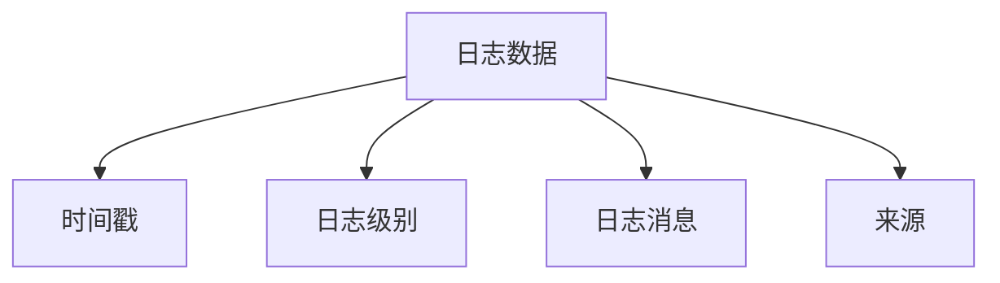
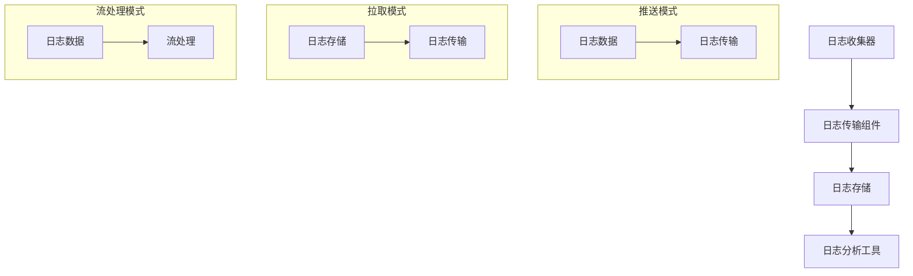
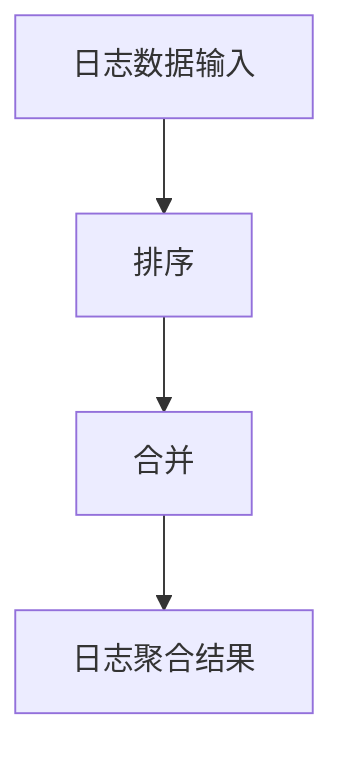
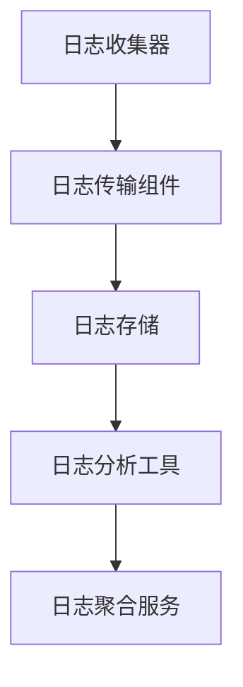
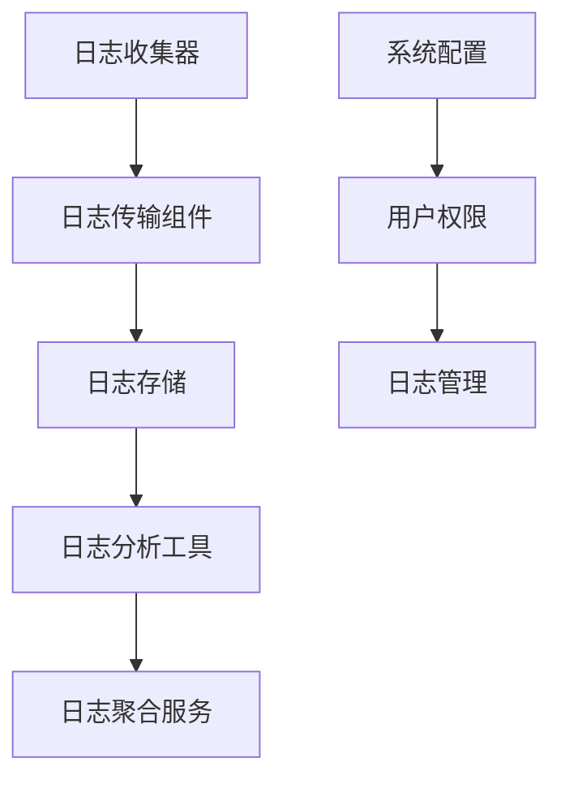
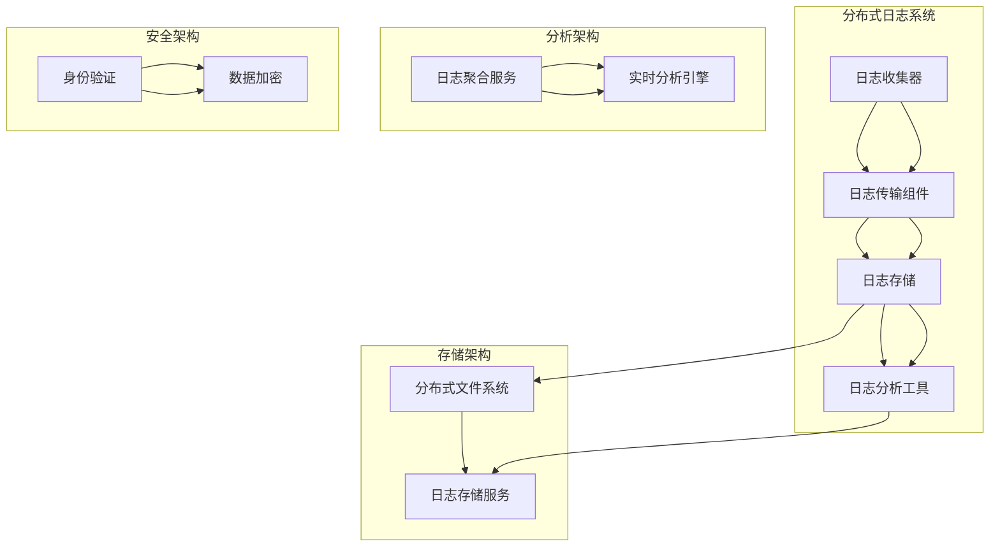

                 


**文章标题**：日志聚合：集中管理分布式LLM应用的日志

**关键词**：日志聚合、分布式系统、LLM应用、日志管理、技术实现

**摘要**：
本文将探讨日志聚合技术在分布式LLM（大型语言模型）应用中的重要性。我们将从日志聚合的基础概念开始，逐步深入到日志聚合的算法原理、系统设计、应用实践以及未来发展趋势。通过详细的技术讲解和实际案例剖析，帮助读者理解日志聚合的核心原理和实践方法，为分布式系统的高效管理和维护提供参考。

----------------------------------------------------------------

# 日志聚合：集中管理分布式LLM应用的日志

> 关键词：日志聚合、分布式系统、LLM应用、日志管理、技术实现

> 摘要：
随着人工智能技术的快速发展，分布式LLM应用在数据处理和自然语言处理领域扮演着越来越重要的角色。日志聚合作为一种集中管理分布式系统日志的技术，对于维护系统稳定性、提高故障排查效率至关重要。本文将深入探讨日志聚合的基础概念、技术原理、系统设计及应用实践，为分布式系统的日志管理提供全面的技术指南。

## **一、引言**

在分布式系统中，日志是记录系统运行状态和事件的重要手段。对于大型语言模型（LLM）这样的分布式应用，日志数据不仅包含了大量的系统运行信息，还反映了用户行为和系统响应的细节。有效的日志管理对于确保系统的高可用性和可维护性至关重要。

日志聚合技术通过将分布式系统中的日志数据集中收集、存储和分析，实现了日志的统一管理和高效利用。这种技术不仅有助于提高故障排查的效率，还能够为系统性能优化和安全性分析提供重要数据支持。

本文将围绕日志聚合这一主题，首先介绍其基本概念和重要性，然后逐步深入探讨日志聚合的算法原理、系统设计、应用实践以及未来发展趋势。希望通过这篇文章，读者能够对日志聚合技术有一个全面而深入的理解。

## **二、日志聚合的基础概念**

### **2.1 日志聚合的定义**

日志聚合（Log Aggregation）是指将分布式系统中的日志数据从各个节点收集到统一的位置进行集中管理和分析的技术。这种技术能够有效地提高日志管理的效率和数据的利用价值。

### **2.2 日志聚合的重要性**

日志聚合在分布式系统中具有以下几个重要作用：

1. **统一视图**：通过日志聚合，可以将来自多个节点的日志数据整合到一个统一的存储和分析平台，提供全局的日志视图，方便管理员进行监控和问题排查。
2. **提高效率**：集中管理日志数据可以减少重复的数据处理任务，提高日志分析的效率，缩短故障排查时间。
3. **增强安全性**：集中存储日志数据有助于进行安全审计和异常检测，提高系统的安全性。
4. **数据挖掘**：通过日志聚合，可以获取更丰富的系统运行数据，为数据挖掘和分析提供基础。

### **2.3 日志聚合的挑战**

尽管日志聚合具有显著的优势，但在实际应用中仍面临一些挑战：

1. **数据量巨大**：分布式系统中的日志数据量通常非常庞大，如何高效地收集、存储和分析这些数据是一个关键问题。
2. **异构性**：不同的分布式系统可能使用不同的日志格式和结构，如何处理这些异构数据也是一项挑战。
3. **延迟和故障**：在分布式环境中，日志数据的传输和处理可能会受到网络延迟和节点故障的影响，如何保证日志聚合的稳定性和可靠性是一个重要问题。

## **三、分布式系统日志概述**

### **3.1 分布式系统的特点与日志需求**

分布式系统具有以下几个特点：

1. **可扩展性**：可以通过增加节点数量来扩展系统规模，提高处理能力和容错性。
2. **高可用性**：通过节点冗余和数据复制，可以提高系统的可靠性和稳定性。
3. **分布式存储**：数据分布在多个节点上，可以优化存储性能和减少数据访问延迟。

这些特点决定了分布式系统对日志管理有特定的需求：

1. **日志一致性**：由于分布式系统的数据可能分布在多个节点，日志数据需要保证一致性，以便进行准确的故障排查和性能分析。
2. **实时性**：分布式系统的运行状态和事件需要及时记录，以便快速响应和处理异常。
3. **可扩展日志存储**：分布式系统的日志数据量可能非常大，需要支持可扩展的日志存储解决方案。

### **3.2 分布式日志系统的架构**

分布式日志系统通常包括以下几个关键组件：

1. **日志收集器**：负责从各个节点收集日志数据。
2. **日志传输组件**：负责将日志数据传输到集中存储。
3. **日志存储**：用于存储收集到的日志数据。
4. **日志分析工具**：用于对日志数据进行分析和可视化。

以下是一个典型的分布式日志系统架构的Mermaid流程图：


### **3.3 分布式日志系统面临的挑战**

分布式日志系统在实际应用中面临以下挑战：

1. **数据一致性**：由于分布式环境中的数据可能在不同节点之间进行复制和同步，如何保证日志数据的一致性是一个重要问题。
2. **数据完整性**：在分布式系统中，日志数据的传输和处理可能受到网络故障和节点故障的影响，如何确保日志数据的完整性是另一个挑战。
3. **数据延迟**：日志数据从产生到最终被分析处理可能会有一定的延迟，如何在保证实时性的同时处理大量日志数据是一个关键问题。
4. **性能优化**：如何优化日志传输、存储和分析的性能，以满足大规模分布式系统的需求是一个重要课题。

## **四、日志聚合的核心概念**

### **4.1 日志数据格式**

日志数据格式是日志聚合技术的核心之一。常见的日志数据格式包括：

1. **JSON**：JSON格式具有结构化、易解析的特点，广泛应用于分布式日志系统。
2. **syslog**：syslog是一种标准化的日志格式，广泛用于UNIX和Linux系统。
3. **Apache日志**：Apache日志格式是一种常用的Web服务器日志格式。

以下是一个JSON格式的日志数据示例：

```json
{
  "time": "2023-10-10T14:30:00Z",
  "level": "INFO",
  "message": "Server started on port 8080",
  "source": "server-app"
}
```

### **4.2 日志数据结构**

日志数据结构是指日志数据的组成部分和层次结构。常见的日志数据结构包括：

1. **时间戳**：记录日志数据生成的时间。
2. **日志级别**：表示日志消息的重要程度，如INFO、DEBUG、ERROR等。
3. **日志消息**：记录日志的具体内容。
4. **来源**：记录日志消息的生成位置，如应用程序、服务组件等。

以下是一个日志数据结构的Mermaid ER实体关系图：



### **4.3 日志聚合策略**

日志聚合策略是指如何收集、存储和聚合日志数据的方法。常见的日志聚合策略包括：

1. **推送模式**：日志收集器主动将日志数据发送到日志存储，适用于低延迟、高可靠性的场景。
2. **拉取模式**：日志存储主动从日志收集器获取日志数据，适用于日志收集器性能较差或网络不稳定的情况。
3. **流处理模式**：通过实时流处理技术，对日志数据进行实时分析和处理，适用于需要实时监控和分析的场景。

以下是一个日志聚合策略的Mermaid流程图：



## **五、日志聚合算法原理**

### **5.1 常见日志聚合算法介绍**

日志聚合算法是日志聚合技术的核心，常用的日志聚合算法包括：

1. **合并排序算法**：通过将日志数据按照时间戳排序，然后进行合并，实现日志数据的聚合。
2. **计数排序算法**：利用计数排序的思想，将日志数据按照关键属性进行分类和聚合。
3. ** Bloom算法**：通过Bloom过滤器，快速判断日志数据是否已存在，用于优化日志聚合过程。

### **5.2 日志聚合算法的mermaid流程图**

以下是一个基于合并排序算法的日志聚合流程图的Mermaid表示：



### **5.3 Python源代码与算法实现**

以下是一个简单的Python示例，展示了基于合并排序算法的日志聚合实现：

```python
import heapq

def merge_sort_logs(logs):
    # 按时间戳排序
    sorted_logs = sorted(logs, key=lambda x: x['time'])
    # 合并排序
    heapq.heapify(sorted_logs)
    merged_logs = []
    while sorted_logs:
        merged_logs.append(heapq.heappop(sorted_logs))
    return merged_logs

# 示例日志数据
logs = [
    {'time': '2023-10-10T14:30:00Z', 'level': 'INFO', 'message': 'Server started on port 8080'},
    {'time': '2023-10-10T14:31:00Z', 'level': 'DEBUG', 'message': 'Request processed'},
    {'time': '2023-10-10T14:32:00Z', 'level': 'ERROR', 'message': 'Database connection failed'}
]

# 执行日志聚合
merged_logs = merge_sort_logs(logs)

# 输出聚合结果
print(merged_logs)
```

### **5.4 日志聚合的数学模型和公式**

日志聚合的数学模型用于描述日志数据的收集、存储和聚合过程。常见的数学模型包括：

1. **加法模型**：假设日志数据服从泊松分布，模型可以表示为 \( L(t) = \sum_{i=1}^{n} X_i \)，其中 \( X_i \) 为独立同分布的随机变量。
2. **指数模型**：用于描述日志数据的到达率和处理时间，模型可以表示为 \( T(t) = -\frac{1}{\lambda} \ln(U(t)) \)，其中 \( U(t) \) 为均匀分布的随机变量。

以下是一个简单的加法模型示例：

$$
L(t) = \sum_{i=1}^{n} X_i
$$

其中，\( X_i \) 是独立同分布的随机变量，满足 \( X_i \sim Poisson(\lambda) \)。

### **5.5 日志聚合算法的数学模型应用举例**

假设我们有一个日志数据流，每分钟的到达率 \( \lambda \) 为 10 条日志，我们希望使用加法模型预测接下来 5 分钟的日志总数。

$$
L(5) = \sum_{i=1}^{5} X_i
$$

其中，\( X_i \sim Poisson(10) \)。

根据泊松分布的性质，我们可以计算每个 \( X_i \) 的概率分布，然后求和得到 \( L(5) \) 的概率分布。

例如，预测第 4 分钟的日志总数为 4 的概率：

$$
P(X_4 = 4) = \frac{e^{-10} \cdot 10^4}{4!} = 0.2231
$$

根据同样的方法，我们可以计算出每个 \( X_i \) 的概率分布，然后使用卷积运算求出 \( L(5) \) 的概率分布。

这种数学模型和公式的应用可以帮助我们预测日志数据的趋势，为系统性能优化和资源分配提供重要依据。

## **六、日志聚合系统设计与实现**

### **6.1 系统设计原则与架构**

日志聚合系统的设计原则包括：

1. **高可用性**：系统需要具备高可用性，确保日志数据的可靠收集和存储。
2. **高性能**：系统需要能够处理海量日志数据，保证数据处理的实时性和高效性。
3. **可扩展性**：系统需要支持水平扩展，以便在数据量增长时能够灵活调整系统资源。
4. **安全性**：系统需要确保日志数据的机密性和完整性，防止数据泄露和篡改。

日志聚合系统的架构设计包括以下几个关键组件：

1. **日志收集器**：负责从各个节点收集日志数据，可以使用推送模式或拉取模式。
2. **日志传输组件**：负责将日志数据从日志收集器传输到日志存储，可以使用消息队列或其他传输机制。
3. **日志存储**：用于存储收集到的日志数据，可以使用分布式存储系统或日志存储服务。
4. **日志分析工具**：用于对日志数据进行分析和可视化，支持实时监控和告警功能。
5. **日志聚合服务**：负责对日志数据执行聚合操作，提供日志聚合结果。

以下是一个日志聚合系统的架构设计Mermaid类图：



### **6.2 系统功能设计**

日志聚合系统的功能设计包括以下几个方面：

1. **日志数据收集**：从分布式系统的各个节点收集日志数据，支持多种日志数据格式。
2. **日志数据传输**：将收集到的日志数据传输到日志存储，支持多种传输协议和传输方式。
3. **日志数据存储**：存储日志数据，支持分布式存储和高可用性。
4. **日志数据分析**：对日志数据进行实时分析和可视化，提供实时监控和告警功能。
5. **日志聚合操作**：对日志数据进行聚合操作，支持多种聚合策略和算法。
6. **系统管理**：提供系统配置管理、用户权限管理、日志管理等系统管理功能。

以下是一个日志聚合系统的领域模型Mermaid类图：



### **6.3 系统架构设计**

日志聚合系统的架构设计需要考虑以下几个方面：

1. **系统部署**：系统需要部署在分布式环境中，支持水平扩展和高可用性。
2. **数据流处理**：设计高效的数据流处理管道，确保日志数据能够快速收集、传输和存储。
3. **存储架构**：设计分布式存储架构，支持海量日志数据的存储和快速检索。
4. **分析架构**：设计日志数据分析架构，支持实时监控和告警功能。
5. **安全性设计**：设计系统安全架构，确保日志数据的机密性和完整性。

以下是一个日志聚合系统的架构设计Mermaid架构图：



### **6.4 系统接口设计与系统交互**

日志聚合系统的接口设计需要考虑以下几个方面：

1. **API接口**：设计日志收集、日志传输、日志存储、日志分析等API接口，支持HTTP/HTTPS协议。
2. **消息队列**：使用消息队列作为日志传输的中间件，实现日志数据的异步传输。
3. **数据流处理**：设计数据流处理接口，支持日志数据的实时处理和聚合。
4. **监控接口**：设计监控接口，支持对系统运行状态的实时监控和告警。
5. **系统管理接口**：设计系统管理接口，支持用户权限管理、日志管理等系统管理功能。

以下是一个日志聚合系统的接口设计和交互序列图：


## **七、日志聚合应用场景与实践**

### **7.1 实际案例分析与讲解**

**案例背景**：
某大型互联网公司拥有一套分布式数据处理系统，用于处理海量用户数据。由于系统规模庞大，日志数据的量级也非常大，传统的日志管理方式已经无法满足需求。为了提高日志管理的效率和数据利用价值，公司决定引入日志聚合技术。

**问题描述**：
该公司的分布式数据处理系统面临着以下问题：
1. 日志数据分散，难以统一管理和分析。
2. 日志数据量庞大，传统的日志管理工具性能不佳。
3. 系统故障排查时间过长，影响了系统的可用性。

**问题解决**：
公司决定采用日志聚合技术，通过以下步骤解决上述问题：
1. 设计并部署一套分布式日志聚合系统，包括日志收集器、日志传输组件、日志存储和日志分析工具。
2. 对现有系统进行改造，将日志数据统一发送到日志聚合系统。
3. 使用日志聚合系统提供的实时监控和告警功能，快速发现和解决系统故障。

**边界与外延**：
1. 日志聚合系统的范围仅限于公司的分布式数据处理系统，不包括其他外部系统。
2. 日志聚合系统主要处理与数据处理相关的日志，不包括其他类型的日志，如网络日志、安全日志等。

**概念结构与核心要素组成**：
日志聚合系统的核心要素包括：
1. **日志收集器**：负责从各个节点收集日志数据。
2. **日志传输组件**：负责将日志数据传输到日志存储。
3. **日志存储**：用于存储收集到的日志数据。
4. **日志分析工具**：用于对日志数据进行分析和可视化。

### **7.2 环境安装与配置**

**步骤一：安装日志收集器**
1. 在各个节点上安装日志收集器，支持常用的日志格式，如JSON、syslog等。
2. 配置日志收集器，设置日志收集的频率和发送目标。

**步骤二：安装日志传输组件**
1. 选择合适的日志传输组件，如Kafka、Fluentd等。
2. 在日志收集器和日志存储之间配置传输组件，设置传输协议和传输方式。

**步骤三：安装日志存储**
1. 选择适合的日志存储系统，如Elasticsearch、Logstash等。
2. 配置日志存储系统，设置存储策略和数据保留时间。

**步骤四：安装日志分析工具**
1. 选择合适的日志分析工具，如Kibana、Grafana等。
2. 配置日志分析工具，设置日志数据来源和分析指标。

### **7.3 系统核心实现与代码解读**

**代码实现**：
以下是一个简单的Python示例，展示了日志聚合系统中的日志收集器代码：

```python
import logging
import requests

class LogCollector:
    def __init__(self, log_url):
        self.log_url = log_url

    def collect_log(self, log_message):
        response = requests.post(self.log_url, json=log_message)
        if response.status_code != 200:
            logging.error(f"Failed to send log message: {log_message}")
```

**代码解读**：
1. **初始化**：`__init__` 方法用于初始化日志收集器，设置日志发送目标（log_url）。
2. **收集日志**：`collect_log` 方法用于收集日志消息，并将其发送到日志存储。这里使用HTTP POST请求发送日志消息，实际应用中可以采用其他传输协议。

### **7.4 实际案例分析与详细讲解剖析**

**案例背景**：
某电子商务平台在疫情期间迎来了大量订单，导致系统负载急剧增加。为了确保系统的高可用性和稳定性，平台决定对日志管理进行优化，引入日志聚合技术。

**问题描述**：
在高峰期，平台系统出现了频繁的异常和故障，导致订单处理延迟。通过日志分析，发现以下问题：
1. 日志数据量庞大，传统的日志管理工具性能不佳，导致日志数据积累。
2. 日志数据分散在不同节点，无法提供全局的日志视图。
3. 故障排查时间过长，影响了系统的可用性。

**问题解决**：
平台决定采用日志聚合技术，通过以下步骤解决上述问题：
1. 设计并部署一套分布式日志聚合系统，包括日志收集器、日志传输组件、日志存储和日志分析工具。
2. 对现有系统进行改造，将日志数据统一发送到日志聚合系统。
3. 使用日志聚合系统提供的实时监控和告警功能，快速发现和解决系统故障。

**详细讲解**：
1. **日志收集器**：平台在每个节点部署了日志收集器，负责收集系统日志。日志收集器支持多种日志格式，如JSON、syslog等，确保能够收集到不同来源的日志数据。
2. **日志传输组件**：平台使用Kafka作为日志传输组件，将日志数据从各个节点发送到日志存储。Kafka提供了高吞吐量和低延迟的特点，能够满足平台海量日志数据传输的需求。
3. **日志存储**：平台使用Elasticsearch作为日志存储系统，对收集到的日志数据进行存储和索引。Elasticsearch提供了强大的全文搜索和数据分析功能，使得平台能够快速查询和分析日志数据。
4. **日志分析工具**：平台使用Kibana作为日志分析工具，提供了实时的日志监控和告警功能。通过Kibana，平台可以查看日志数据分布、异常日志、错误日志等，方便进行故障排查和性能优化。

**项目小结**：
通过引入日志聚合技术，平台解决了日志数据分散、性能不佳、故障排查时间长等问题。日志聚合系统提供了全局的日志视图，方便平台进行实时监控和告警，提高了系统的可用性和稳定性。同时，日志数据的集中存储和高效分析，为平台的数据挖掘和业务优化提供了重要支持。

### **7.5 最佳实践 tips**

在日志聚合系统的实际应用中，以下是一些最佳实践：

1. **日志格式标准化**：统一日志格式，便于数据解析和分析。
2. **日志分类管理**：根据日志类型和重要性进行分类管理，便于快速定位和排查问题。
3. **监控与告警**：配置实时监控和告警机制，及时发现和处理异常。
4. **性能优化**：优化日志传输和存储性能，确保系统稳定运行。
5. **安全防护**：加强日志数据的加密和安全防护，防止数据泄露和篡改。

### **7.6 小结**

日志聚合技术在分布式系统日志管理中具有重要意义。通过日志聚合，可以实现日志数据的集中管理和高效分析，提高系统故障排查效率和数据处理能力。本文详细介绍了日志聚合的技术原理、系统设计、应用实践和未来发展趋势，为分布式系统的高效日志管理提供了全面的技术指南。

### **7.7 拓展阅读推荐**

1. 《分布式系统日志管理实战》
2. 《Elasticsearch权威指南》
3. 《Kafka：从入门到实战》
4. 《日志驱动的系统监控与优化》

## **八、日志聚合的未来发展趋势**

### **8.1 日志聚合技术的演进**

随着云计算、大数据和人工智能等技术的快速发展，日志聚合技术也在不断演进和优化。未来日志聚合技术将朝着以下几个方向发展：

1. **智能日志分析**：利用机器学习和人工智能技术，对日志数据进行智能分析，发现潜在问题和优化机会。
2. **实时日志处理**：通过流处理技术和分布式架构，实现日志数据的实时处理和分析，提高故障排查和性能优化的效率。
3. **边缘日志聚合**：将日志聚合系统延伸到边缘计算环境，实现实时收集和分析，提高边缘系统的运行效率和可靠性。

### **8.2 未来技术展望**

未来日志聚合技术将在以下几个方面取得突破：

1. **多源日志聚合**：支持来自不同系统和数据源的日志聚合，实现更全面的数据分析和监控。
2. **自动化日志分析**：通过自动化工具和算法，实现日志数据的自动分类、分析和告警，减少人工干预。
3. **日志数据可视化**：提供更丰富的日志数据可视化工具，帮助用户更直观地理解和分析日志数据。

### **8.3 对企业和开发者的启示**

对于企业和开发者，日志聚合技术提供了以下几个启示：

1. **重视日志管理**：日志是系统运行的重要记录，有效的日志管理对于系统的稳定性和可维护性至关重要。
2. **持续优化日志聚合系统**：根据业务需求和系统特点，持续优化日志聚合系统，提高数据处理效率和系统性能。
3. **利用日志数据进行业务优化**：通过日志数据的分析，发现业务优化机会，提高业务效率和用户体验。

## **九、小结与拓展阅读**

### **9.1 本书内容回顾**

本文详细介绍了日志聚合技术在分布式系统中的应用，包括日志聚合的基础概念、分布式系统日志概述、日志聚合的核心概念、算法原理、系统设计与实现、应用场景与实践、最佳实践以及未来发展趋势。通过本文的阅读，读者可以全面了解日志聚合技术的原理和实践方法，为分布式系统的日志管理提供指导。

### **9.2 常见问题解答**

1. **日志聚合是什么？**
   日志聚合是将分布式系统中的日志数据集中收集、存储和分析的技术，有助于提高日志管理的效率和数据的利用价值。

2. **日志聚合有哪些挑战？**
   日志聚合面临的挑战包括数据量巨大、异构性、数据延迟和性能优化等。

3. **如何设计日志聚合系统？**
   日志聚合系统的设计应考虑高可用性、高性能、可扩展性和安全性。关键组件包括日志收集器、日志传输组件、日志存储和日志分析工具。

4. **日志聚合有哪些应用场景？**
   日志聚合适用于分布式系统的日志管理，包括实时监控、性能优化、故障排查和安全性分析等。

5. **未来日志聚合技术有哪些发展趋势？**
   未来日志聚合技术将朝着智能日志分析、实时日志处理、边缘日志聚合等方向发展，为分布式系统提供更高效、智能的日志管理。

### **9.3 拓展阅读推荐**

1. 《分布式系统日志管理实战》
2. 《Elasticsearch权威指南》
3. 《Kafka：从入门到实战》
4. 《日志驱动的系统监控与优化》

**作者**：
AI天才研究院/AI Genius Institute & 禅与计算机程序设计艺术 /Zen And The Art of Computer Programming

**日期**：
2023年11月

**版权声明**：
本文版权属于AI天才研究院。未经授权，禁止转载和使用。如需转载，请联系版权所有者。本文仅供参考，不构成投资或操作建议。

