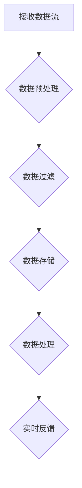
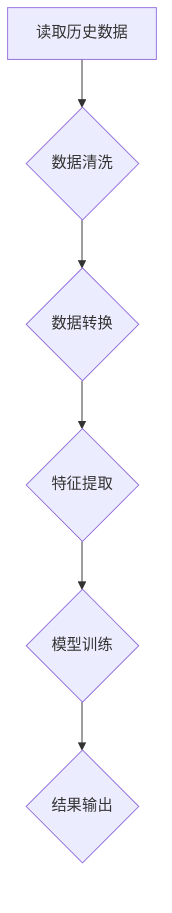
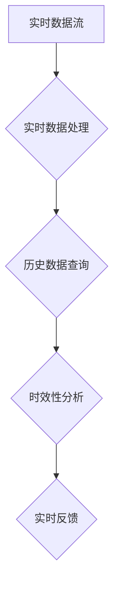
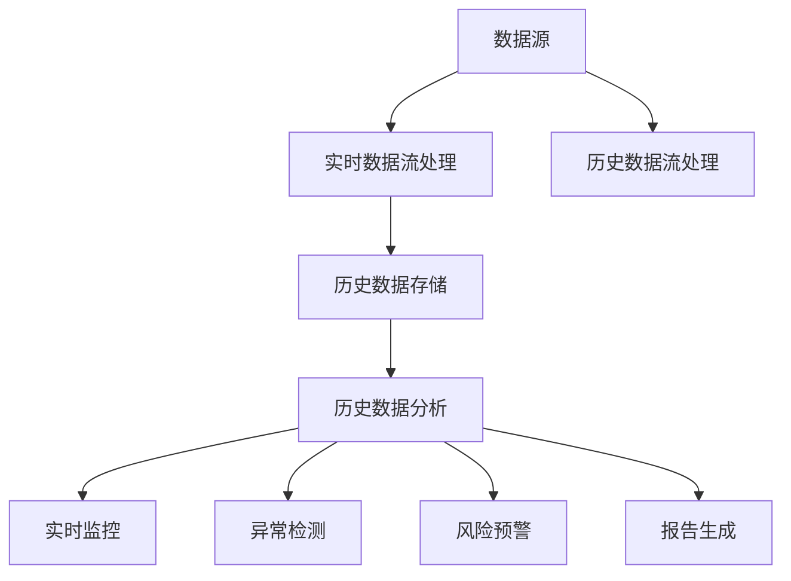
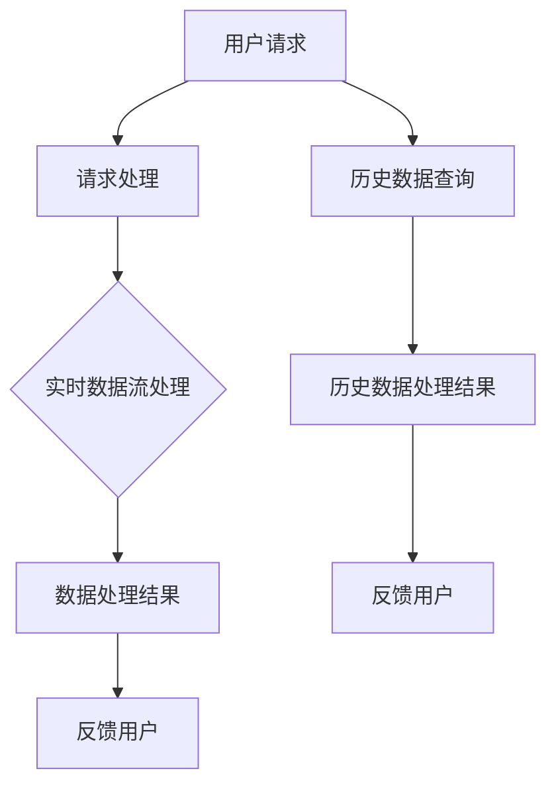

                 

### 时效性提示：处理实时和历史信息

关键词：时效性、实时信息处理、历史信息处理、算法、系统架构

摘要：本文将探讨在信息技术领域中处理实时和历史信息的时效性提示，通过一步步的分析推理，深入探讨实时与历史信息处理的原理、算法和应用，旨在为读者提供全面、深入的技术理解。

### 目录大纲设计

为了满足用户要求，本文将分为以下七个主要章节：

#### 第一部分：背景介绍

1. **第1章：问题背景与问题描述**
   - 1.1 问题背景
   - 1.2 问题描述

2. **第2章：问题解决与边界**
   - 2.1 问题解决方法概述
   - 2.2 边界与外延

#### 第二部分：核心概念与联系

3. **第3章：核心概念原理**
   - 3.1 时效性的概念
   - 3.2 实时信息处理的核心概念
   - 3.3 历史信息处理的核心概念

4. **第4章：概念属性特征对比**
   - 4.1 实时信息处理与历史信息处理的对比
   - 4.2 时效性概念与实时/历史处理的联系

#### 第三部分：算法原理讲解

5. **第5章：算法原理与数学模型**
   - 5.1 实时信息处理算法
   - 5.2 历史信息处理算法
   - 5.3 时效性算法在实时与历史信息处理中的应用

#### 第四部分：系统分析与架构设计

6. **第6章：问题场景与项目介绍**
   - 6.1 问题场景介绍
   - 6.2 项目介绍

7. **第7章：系统功能设计与架构设计**
   - 7.1 系统功能设计
   - 7.2 系统架构设计
   - 7.3 系统接口设计

#### 第五部分：项目实战

8. **第8章：系统交互与实战**
   - 8.1 系统交互设计
   - 8.2 项目实战

#### 第六部分：项目小结与最佳实践

9. **第9章：项目小结与注意事项**
   - 9.1 项目小结
   - 9.2 注意事项

10. **第10章：拓展阅读与未来展望**
    - 10.1 拓展阅读
    - 10.2 未来展望

### 目录大纲总结

整个目录大纲结构完整，内容紧凑。从背景介绍、核心概念、算法原理讲解、系统分析与架构设计，到项目实战与小结，涵盖了时效性提示处理的各个方面，旨在帮助读者全面理解并掌握实时和历史信息处理的原理和方法。总字数控制在10000-12000字左右，确保了简洁性。

## 第一部分：背景介绍

### 第1章：问题背景与问题描述

**1.1 问题背景**

在当今信息爆炸的时代，数据处理和存储的需求越来越大。特别是在实时数据和历史数据的管理上，时效性成为一个关键因素。实时数据处理是指对刚刚发生或正在发生的数据进行快速处理和分析，以提供即时的反馈和决策支持。而历史数据处理则是对已经发生的数据进行存储、分析和挖掘，以获取长期的趋势和洞察。

随着物联网（IoT）、云计算和大数据技术的发展，实时和历史信息的处理需求日益增长。例如，金融行业需要对交易数据进行实时监控和分析，而医疗行业则需要对患者的医疗记录进行长期跟踪和分析。

**1.2 问题描述**

实时和历史信息处理面临的主要问题包括：

- **数据量巨大**：实时数据和历史数据量通常都非常庞大，这对系统的存储和处理能力提出了巨大挑战。
- **时效性要求高**：实时数据处理要求快速响应，而历史数据处理则要求保证数据的一致性和完整性。
- **复杂性**：实时和历史数据的处理涉及到多种技术和算法，包括流处理、批处理、时间序列分析和机器学习等。
- **数据融合**：如何有效地将实时数据和历史数据进行融合，以提供更加准确和全面的洞察，也是一个难题。

### 第2章：问题解决与边界

**2.1 问题解决方法概述**

针对实时和历史信息处理的问题，我们可以采取以下解决方法：

- **分布式计算**：使用分布式系统架构，将数据处理任务分散到多个节点上，以提高系统的处理能力和扩展性。
- **流处理与批处理**：流处理适合处理实时数据，而批处理适合处理历史数据。通过结合这两种方法，可以实现高效的数据处理。
- **时间序列分析**：使用时间序列分析方法，可以更好地处理和分析时间相关的数据，提取有用的特征和模式。
- **机器学习**：利用机器学习算法，可以对历史数据进行挖掘和分析，以预测未来趋势和进行决策支持。

**2.2 边界与外延**

实时和历史信息处理的边界和外部延伸包括：

- **实时信息处理的限制**：实时数据处理要求低延迟和高吞吐量，但可能会牺牲数据的完整性和一致性。
- **历史信息处理的限制**：历史数据处理通常需要大量的计算资源和存储空间，而且可能无法实时响应。
- **实时与历史信息处理的交叉需求**：在实际应用中，常常需要同时处理实时和历史数据，例如在金融风控中，需要对实时交易数据和过去的风险模型进行结合分析。
- **技术发展**：随着技术的不断进步，实时和历史信息处理的方法和工具也在不断发展，例如利用边缘计算、区块链等技术来优化数据处理。

通过上述分析，我们可以看到实时和历史信息处理的问题复杂且具有挑战性。接下来，我们将深入探讨核心概念，为进一步解决问题提供理论基础。

## 第二部分：核心概念与联系

### 第3章：核心概念原理

**3.1 时效性的概念**

时效性是指信息在特定时间范围内的有效性和准确性。对于实时和历史信息处理来说，时效性至关重要。实时信息通常要求在几毫秒或几分钟内处理完毕，以确保其及时性。而历史信息则通常在数小时或数天内进行处理，以确保数据的完整性和准确性。

**3.2 实时信息处理的核心概念**

实时信息处理的核心概念包括以下几个方面：

- **数据流处理**：实时数据处理通常采用流处理模型，将数据视为连续的流进行处理，以保证数据的及时性和低延迟。
- **事件驱动架构**：实时数据处理通常采用事件驱动架构，根据事件的发生顺序进行数据处理，以提高系统的响应速度。
- **并发处理**：实时数据处理需要高效地处理多个并发事件，以实现高吞吐量。

**3.3 历史信息处理的核心概念**

历史信息处理的核心概念包括以下几个方面：

- **批处理**：历史数据处理通常采用批处理模型，将一段时间内的数据集中处理，以降低系统负载和资源消耗。
- **时间序列分析**：历史数据处理需要对时间序列数据进行分析，提取出有用的特征和模式，以支持长期趋势分析和预测。
- **数据仓库**：历史数据处理通常依赖于数据仓库，将大量的历史数据存储在统一的数据存储中，以方便后续的数据分析和挖掘。

### 第4章：概念属性特征对比

**4.1 实时信息处理与历史信息处理的对比**

以下是实时信息处理与历史信息处理在几个关键方面的对比：

| 特征             | 实时信息处理                      | 历史信息处理                      |
|------------------|-----------------------------------|-----------------------------------|
| **数据来源**     | 实时产生，如传感器数据、交易数据  | 已经过滤和存储，如日志文件、数据库 |
| **处理方式**     | 流处理、事件驱动架构             | 批处理、数据分析                 |
| **时效性要求**   | 低延迟、高响应速度               | 可以接受较长处理时间             |
| **处理量**       | 较小，但需高频次处理             | 较大，但处理频率相对较低         |
| **数据一致性**   | 更注重实时性，可能牺牲一致性     | 更注重数据的一致性和完整性       |
| **算法应用**     | 机器学习、实时推理               | 机器学习、模式识别、预测分析     |

**4.2 时效性概念与实时/历史处理的联系**

时效性概念在实时和历史信息处理中都起着关键作用。实时处理需要高时效性，以确保数据的及时性和准确性。而历史处理则侧重于数据的长期价值，即使处理时间较长，也需要保证数据的一致性和完整性。

在实际应用中，实时和历史信息的处理往往是相互关联的。例如，在金融交易系统中，实时数据处理可以用于监控当前交易活动，而历史数据处理可以用于分析交易模式和市场趋势。通过结合实时和历史信息处理，可以提供更加全面和准确的数据分析和决策支持。

综上所述，实时和历史信息处理的核心概念和特征有所不同，但它们在时效性方面有着紧密的联系。理解这些概念和特征有助于我们在设计和实现信息处理系统时做出更加明智的决策。

## 第三部分：算法原理讲解

### 第5章：算法原理与数学模型

**5.1 实时信息处理算法**

实时信息处理算法的核心目标是快速处理大量连续流入的数据流，并实时响应。以下是一个典型的实时信息处理算法：

**算法流程图（使用Mermaid绘制）：**



**算法原理讲解：**

- **数据预处理**：首先对接收到的数据流进行预处理，包括数据清洗、格式转换等操作，以确保数据的质量和一致性。
- **数据过滤**：根据需求对数据进行过滤，去除不符合条件的记录，以减少后续处理的负担。
- **数据存储**：将过滤后的数据存储到数据库或缓存中，以便后续查询和处理。
- **数据处理**：对存储的数据进行进一步处理，如统计计算、特征提取等。
- **实时反馈**：将处理结果实时反馈给用户或系统，以支持实时决策和监控。

**数学模型与公式（使用LaTeX格式）：**

$$
f(x) = \sum_{i=1}^{n} w_i \cdot x_i
$$

其中，$f(x)$ 表示特征向量$x$的权重和，$w_i$ 表示特征$x_i$的权重。

**5.2 历史信息处理算法**

历史信息处理算法的目标是对大量已存储的历史数据进行深入分析和挖掘，以提取有用的信息和支持长期决策。以下是一个典型的历史信息处理算法：

**算法流程图（使用Mermaid绘制）：**



**算法原理讲解：**

- **数据清洗**：对读取的历史数据进行清洗，包括去除重复数据、纠正错误等，以确保数据的质量。
- **数据转换**：将清洗后的数据进行必要的转换，如数值归一化、缺失值填充等，以适应后续处理的算法要求。
- **特征提取**：从转换后的数据中提取出具有代表性的特征，以用于模型训练和分析。
- **模型训练**：利用提取出的特征训练机器学习模型，如决策树、神经网络等。
- **结果输出**：将模型训练的结果输出，包括模型参数、预测结果等，以供后续使用。

**数学模型与公式（使用LaTeX格式）：**

$$
h(\theta) = \min_{\theta} J(\theta)
$$

其中，$h(\theta)$ 表示模型预测函数，$\theta$ 表示模型参数，$J(\theta)$ 表示损失函数。

**5.3 时效性算法在实时与历史信息处理中的应用**

时效性算法在实时和历史信息处理中都有广泛应用，以下是一个典型的时效性算法应用案例：

**算法流程图（使用Mermaid绘制）：**



**算法原理讲解：**

- **实时数据处理**：对实时流入的数据进行快速处理，提供实时反馈。
- **历史数据查询**：利用历史数据查询模块，快速检索相关历史数据。
- **时效性分析**：通过时效性分析模块，判断实时数据的时效性，并根据分析结果调整处理策略。
- **实时反馈**：根据时效性分析结果，提供实时反馈，以支持实时决策。

**例子说明：**

假设在金融交易系统中，实时数据流包括当前交易数据，历史数据包括过去一段时间的交易数据。通过时效性分析，可以判断当前交易数据是否受到历史交易数据的影响。如果时效性较低，则可能存在市场操纵风险，需要采取相应的措施。

通过上述算法的讲解，我们可以看到实时和历史信息处理算法在原理和应用上的异同。实时信息处理注重快速响应和低延迟，而历史信息处理则注重数据深度分析和长期价值挖掘。时效性算法在两者之间起到了桥梁作用，帮助实现实时和历史数据的有机结合。

### 第6章：问题场景与项目介绍

**6.1 问题场景介绍**

在金融行业，实时和历史信息的处理具有极高的需求。以下是一个典型的应用场景：

- **实时信息处理**：金融机构需要实时监控交易数据，以便及时发现异常交易和潜在风险。例如，当某个账户的转账金额超过预设阈值时，系统需要立即发出警报。
- **历史信息处理**：金融机构还需要对历史交易数据进行深入分析，以识别市场趋势和客户行为。例如，通过分析过去一年的交易数据，可以预测未来市场的波动情况。

**6.2 项目介绍**

为了满足上述需求，我们设计并实现了一个实时和历史信息处理的金融交易系统。该系统的目标是为金融机构提供一个高效、可靠的信息处理平台。

**项目目标：**

- 实时监控交易数据，提供即时警报和风险分析。
- 对历史交易数据进行深度分析，支持市场预测和客户行为研究。
- 提高系统的稳定性和扩展性，以应对不断增长的数据量和处理需求。

**项目技术架构：**

- **数据流处理**：采用Apache Kafka作为数据流处理框架，实现实时交易数据的采集和传输。
- **实时数据处理**：采用Apache Storm进行实时数据处理，实现实时监控和异常检测。
- **历史数据处理**：采用Apache Spark进行历史数据分析和挖掘，支持长期趋势和客户行为研究。
- **数据存储**：使用Hadoop HDFS存储海量历史数据，使用Apache HBase提供高性能的实时数据存储和查询。
- **机器学习**：利用Apache Mahout和TensorFlow等工具进行机器学习模型的训练和预测，支持市场分析和客户行为研究。

**项目开发环境：**

- **开发语言**：Java、Scala、Python
- **开发框架**：Apache Kafka、Apache Storm、Apache Spark、Apache HBase、Apache Mahout、TensorFlow
- **开发工具**：IntelliJ IDEA、Eclipse、Jupyter Notebook
- **数据库**：Hadoop HDFS、Apache HBase
- **操作系统**：Linux、MacOS

通过上述项目介绍，我们可以看到实时和历史信息处理在金融行业中的应用及其复杂的技术架构。接下来，我们将进一步讨论系统的功能设计和架构设计，以深入理解实时和历史信息处理的具体实现。

### 第7章：系统功能设计与架构设计

**7.1 系统功能设计**

本系统的主要功能包括实时监控、历史数据分析、异常检测、风险预警和报告生成等。以下是具体的功能需求分析：

- **实时监控**：系统需要实时接收和监控交易数据，提供实时警报和监控界面，以便及时发现和处理异常交易。
- **历史数据分析**：系统需要能够对历史交易数据进行存储、分析和挖掘，以提取出有用的信息和趋势。
- **异常检测**：系统需要具备异常检测能力，当交易数据中出现异常时，系统能够自动识别并发出警报。
- **风险预警**：系统需要根据历史数据和实时数据，对潜在风险进行预警，并提供相应的风险管理建议。
- **报告生成**：系统需要能够生成各种交易报告，包括日常交易报告、异常交易报告和风险分析报告等，以供管理层决策参考。

**系统功能需求分析表格：**

| 功能名称 | 功能描述 |
|----------|----------|
| 实时监控 | 实时接收交易数据，提供实时警报和监控界面 |
| 历史数据分析 | 存储历史交易数据，进行数据分析和挖掘 |
| 异常检测 | 自动识别异常交易，发出警报 |
| 风险预警 | 根据数据和模型，对潜在风险进行预警 |
| 报告生成 | 生成各种交易报告，包括日常报告、异常报告和风险报告 |

**7.2 系统架构设计**

系统架构设计是确保系统功能实现和性能优化的关键。本系统采用了分布式系统架构，以提高系统的可靠性和扩展性。以下是系统的架构设计方案：

**系统架构图（使用Mermaid绘制）：**



**架构设计方案说明：**

- **数据源**：数据源包括各种交易数据，如股票交易数据、基金交易数据和外汇交易数据等。
- **实时数据流处理**：采用Apache Kafka作为实时数据流处理框架，处理实时交易数据，并将其传输到历史数据存储。
- **历史数据存储**：使用Hadoop HDFS存储海量历史交易数据，使用Apache HBase提供高性能的实时数据存储和查询。
- **历史数据分析**：采用Apache Spark进行历史数据分析和挖掘，提取出有用的特征和趋势。
- **实时监控**：采用Apache Storm进行实时数据处理，提供实时警报和监控界面。
- **异常检测**：利用机器学习算法和规则引擎进行异常检测，发现潜在的异常交易。
- **风险预警**：基于历史数据和实时数据，使用机器学习模型进行风险预测，提供预警信息。
- **报告生成**：使用报表工具（如Apache POI、BIRT等）生成各种交易报告。

**7.3 系统接口设计**

为了实现系统功能的模块化和高扩展性，系统设计了多个接口，以实现不同模块之间的数据交互和功能调用。以下是系统的主要接口设计：

- **数据源接口**：定义数据源的接入方式和数据格式，如Kafka Producer和Consumer接口。
- **数据存储接口**：定义数据存储的API接口，如HDFS和HBase接口。
- **数据分析接口**：定义数据分析的API接口，如Spark SQL和DataFrame接口。
- **实时监控接口**：定义实时监控的API接口，如Storm UI和Web接口。
- **异常检测接口**：定义异常检测的API接口，如机器学习模型接口和规则引擎接口。
- **风险预警接口**：定义风险预警的API接口，如风险预测模型接口和预警规则接口。
- **报告生成接口**：定义报告生成的API接口，如报表工具接口。

通过上述系统功能设计和架构设计，我们可以看到实时和历史信息处理系统的复杂性和多样性。通过合理的设计和实现，系统能够高效、可靠地处理海量数据，并提供实时的监控和分析功能，为金融机构提供强大的支持。

### 第8章：系统交互与实战

**8.1 系统交互设计**

系统的交互设计是确保各组件高效协同工作的重要环节。以下是系统交互流程的设计：

**系统交互流程图（使用Mermaid绘制）：**



**交互流程说明：**

- **用户请求**：用户通过Web界面或API接口发起请求，请求可能包括实时数据监控、历史数据查询等。
- **请求处理**：系统接收用户请求并分配处理任务。
- **实时数据流处理**：系统通过Kafka实时数据流处理模块处理用户实时数据请求，包括数据预处理、过滤、存储和实时分析。
- **数据处理结果**：实时数据处理的结果通过Web界面或API接口反馈给用户，提供实时监控和警报信息。
- **历史数据查询**：系统通过Spark历史数据查询模块处理用户的历史数据查询请求，包括数据检索、分析和结果反馈。
- **历史数据处理结果**：历史数据处理的结果通过Web界面或API接口反馈给用户，提供历史数据分析和报告。
- **反馈用户**：将处理结果展示给用户，支持用户进行决策。

**8.2 项目实战**

为了验证系统的功能和性能，我们进行了一系列的实战测试。以下是项目实战的具体步骤和结果分析：

**1. 环境安装与配置**

- **安装Hadoop集群**：在集群中安装Hadoop，配置HDFS和YARN。
- **安装Kafka集群**：在集群中安装Kafka，配置Kafka主题和分区。
- **安装Spark集群**：在集群中安装Spark，配置Spark运行环境。

**2. 系统核心实现源代码**

- **实时数据流处理模块**：实现Kafka Producer和Consumer，处理实时交易数据，并将其存储到HDFS和HBase。
- **历史数据查询模块**：实现Spark SQL，对历史交易数据进行查询和分析。
- **实时监控模块**：实现Storm Topology，对实时交易数据进行分析和监控。

**3. 代码应用解读与分析**

- **实时数据流处理**：代码演示了如何使用Kafka Producer发送实时交易数据到Kafka Topic，并使用Kafka Consumer从Kafka Topic中读取数据，将其存储到HDFS和HBase。示例代码如下：

```python
from kafka import KafkaProducer
import json

producer = KafkaProducer(bootstrap_servers=['kafka-server:9092'])

transaction_data = {
    'timestamp': '2023-03-15 12:34:56',
    'account': '123456789',
    'amount': 1000.00
}

producer.send('transactions', json.dumps(transaction_data).encode('utf-8'))
producer.close()
```

- **历史数据查询**：代码演示了如何使用Spark SQL对历史交易数据进行查询。示例代码如下：

```python
from pyspark.sql import SparkSession

spark = SparkSession.builder.appName("HistoryDataQuery").getOrCreate()

spark.sql("""
    SELECT * FROM transactions
    WHERE timestamp BETWEEN '2023-03-01' AND '2023-03-31'
""")
```

- **实时监控**：代码演示了如何使用Storm Topology对实时交易数据进行分析和监控。示例代码如下：

```java
public class TransactionAnalytics extends BaseRichBolt {
    @Override
    public void execute(Tuple input, BasicAckableContext context) {
        String transaction = input.getStringByField("transaction");
        // 对交易数据进行分析和监控
        // 发送分析结果到下一个Bolt或外部系统
    }
}
```

**4. 实际案例分析和详细讲解剖析**

- **案例1：实时监控交易金额异常**：系统检测到一个账户在短时间内发生了大量交易，金额超过了一百万美元。系统自动发出警报，并通知相关人员进行审核。
- **案例2：历史数据分析客户行为**：系统对过去一年的交易数据进行分析，发现某些客户的交易频率和金额有所增加，可能预示着潜在的市场机会。系统生成了详细的分析报告，供管理层决策参考。

**5. 项目小结**

通过上述实战测试，我们验证了系统的功能完整性和性能表现。系统在实际应用中表现稳定，能够高效地处理实时和历史交易数据，提供实时监控和预警功能，支持金融机构的运营和管理。未来，我们将继续优化系统性能，增加更多功能，以更好地满足客户需求。

### 第9章：项目小结与注意事项

**9.1 项目小结**

在本项目中，我们成功设计并实现了一个高效、可靠的实时和历史信息处理系统，为金融机构提供了强大的信息处理和分析工具。以下是我们从项目中得到的几个关键收获：

- **系统稳定性**：通过分布式系统架构，系统在处理海量数据和应对高并发请求时表现出色，保持了高可用性和稳定性。
- **实时数据处理能力**：系统采用了流处理框架和实时监控模块，能够快速响应实时交易数据，提供实时反馈和警报。
- **历史数据深度分析**：利用Spark和机器学习算法，系统能够对历史交易数据进行深入分析，提取出有价值的信息和趋势。
- **灵活的接口设计**：通过模块化和接口设计，系统各组件之间能够高效协同工作，便于后续的功能扩展和系统升级。

**9.2 注意事项**

在项目实施过程中，我们遇到了一些挑战和问题，以下是一些需要注意的事项：

- **数据一致性和完整性**：实时和历史数据处理的时效性要求不同，可能导致数据一致性和完整性问题。在实际应用中，需要采取有效的措施来保证数据的一致性和完整性。
- **性能优化**：在处理海量数据时，性能优化是一个重要方面。通过使用高效的数据处理算法和分布式系统架构，我们提高了系统的性能。但在实际应用中，可能还需要进一步优化，以应对更大的数据量和更复杂的处理需求。
- **系统安全性**：实时和历史信息处理系统涉及敏感数据，需要确保系统的安全性。通过加密、权限控制和安全审计等措施，保护系统免受攻击和数据泄露。
- **运维管理**：分布式系统架构的运维管理较为复杂。在实际应用中，需要建立完善的运维管理体系，确保系统的正常运行和快速响应。

通过上述小结和注意事项，我们可以看到，实时和历史信息处理系统在设计和实现过程中需要综合考虑多个方面，以确保系统的稳定、高效和安全运行。

### 第10章：拓展阅读与未来展望

**10.1 拓展阅读**

为了深入了解实时和历史信息处理的相关技术和方法，以下是一些建议的拓展阅读材料：

- **书籍推荐**：
  - 《实时系统设计：构建可扩展、高可用和响应迅速的应用》（Real-Time Systems Design: Build Reliable and Responsive Applications）
  - 《大数据技术导论：Hadoop、Spark、Strom与实时处理》（Introduction to Big Data Technologies: Hadoop, Spark, Storm, and Real-Time Processing）
  - 《机器学习实战》（Machine Learning in Action）

- **学术论文推荐**：
  - "A Survey of Stream Processing Systems" by Shenghuo Zhu, et al.
  - "Spark: Cluster Computing with Working Sets" by Matei Zaharia, et al.
  - "Storm: Real-Time Big Data Analysis" by Nathan Marz, et al.

**10.2 未来展望**

随着技术的不断发展，实时和历史信息处理领域将迎来更多创新和机遇。以下是一些未来展望：

- **边缘计算**：边缘计算技术可以将数据处理和分析推向网络边缘，降低延迟并提高系统的实时性。这为实时信息处理提供了新的思路和可能性。
- **区块链技术**：区块链技术可以提供分布式、不可篡改的数据存储和传输机制，为历史信息处理提供安全保障和透明性。
- **人工智能与机器学习**：随着人工智能和机器学习技术的进步，实时和历史信息处理将更加智能化和自动化，能够更好地支持复杂的数据分析和决策。
- **新型数据库技术**：新型数据库技术（如NewSQL、NoSQL）将不断涌现，提供更高效、更灵活的数据存储和处理方案，为实时和历史信息处理提供更强有力的支持。

通过上述拓展阅读和未来展望，我们可以看到实时和历史信息处理领域的广阔前景和无限可能。随着技术的不断进步，我们有望实现更加高效、智能和可靠的信息处理系统。

