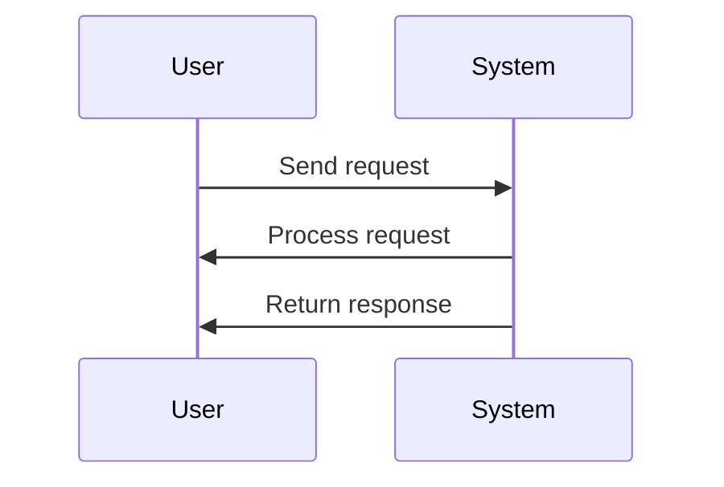
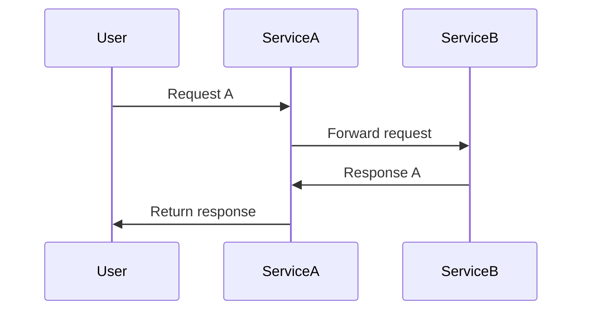

                 

### 映射理论：连接自然与人类思维

> 关键词：映射理论，自然，人类思维，连接，原理，应用，挑战

> 摘要：本文旨在深入探讨映射理论，分析其在自然与人类思维领域的应用，探讨其理论基础、发展历程、核心概念及其重要意义。我们将逐步解析映射理论，从自然领域到人类思维，探讨其在各个领域的应用现状、挑战与未来发展趋势。

### 目录大纲

```markdown
# 《映射理论：连接自然与人类思维》

## 第一部分：映射理论的基础

### 第1章：问题背景与问题描述

#### 1.1 映射理论的概念介绍

#### 1.1.1 映射理论的定义

#### 1.1.2 映射理论的发展历史

#### 1.1.3 映射理论的研究意义

#### 1.2 映射理论的边界与外延

#### 1.2.1 映射理论的适用范围

#### 1.2.2 映射理论的核心要素组成

#### 1.2.3 映射理论与其他理论的联系

#### 1.3 映射理论的核心概念与联系

#### 1.3.1 映射关系的基本原理

#### 1.3.2 映射模型的特点与应用

#### 1.3.3 映射理论中的关键概念对比

#### 1.4 映射理论的基本原理与数学模型

#### 1.4.1 映射理论的基本原理

#### 1.4.2 映射理论中的数学模型

#### 1.4.3 映射理论的数学公式与推导

#### 1.5 映射理论在自然与人类思维中的应用

#### 1.5.1 映射理论在自然领域的应用

#### 1.5.2 映射理论在人类思维中的应用

#### 1.5.3 映射理论的应用前景与挑战

#### 1.6 本章小结

## 第二部分：映射理论在自然领域的应用

### 第2章：自然领域的映射理论应用

#### 2.1 自然领域的映射理论应用概述

#### 2.1.1 映射理论在生态学中的应用

#### 2.1.2 映射理论在气象学中的应用

#### 2.1.3 映射理论在地理学中的应用

#### 2.2 自然领域的映射理论案例分析

#### 2.2.1 案例一：生态系统的映射模型分析

#### 2.2.2 案例二：气候变化的映射模型分析

#### 2.2.3 案例三：地理信息系统的映射模型分析

#### 2.3 自然领域的映射理论实践

#### 2.3.1 实践一：生态系统的映射模型构建

#### 2.3.2 实践二：气候变化预测的映射模型构建

#### 2.3.3 实践三：地理信息系统功能的映射模型实现

#### 2.4 自然领域映射理论的应用前景与挑战

#### 2.4.1 映射理论在自然领域的应用前景

#### 2.4.2 映射理论在自然领域的应用挑战

#### 2.4.3 未来发展趋势与展望

#### 2.5 本章小结

## 第三部分：映射理论在人类思维中的应用

### 第3章：人类思维中的映射理论应用

#### 3.1 人类思维中的映射理论应用概述

#### 3.1.1 映射理论在心理学中的应用

#### 3.1.2 映射理论在认知科学中的应用

#### 3.1.3 映射理论在神经科学中的应用

#### 3.2 人类思维中的映射理论案例分析

#### 3.2.1 案例一：认知过程中的映射模型分析

#### 3.2.2 案例二：神经系统中映射模型的研究

#### 3.2.3 案例三：情绪调节中的映射模型分析

#### 3.3 人类思维中的映射理论实践

#### 3.3.1 实践一：认知过程的映射模型构建

#### 3.3.2 实践二：神经系统映射模型的研究

#### 3.3.3 实践三：情绪调节映射模型的实现

#### 3.4 人类思维中映射理论的应用前景与挑战

#### 3.4.1 映射理论在人类思维领域的应用前景

#### 3.4.2 映射理论在人类思维领域的应用挑战

#### 3.4.3 未来发展趋势与展望

#### 3.5 本章小结

## 第四部分：映射理论的整体发展与应用

### 第4章：映射理论的整体发展与应用

#### 4.1 映射理论的整体发展历程

#### 4.1.1 映射理论的发展历程概述

#### 4.1.2 映射理论的创新点与突破

#### 4.1.3 映射理论在未来研究中的方向

#### 4.2 映射理论的整体应用现状

#### 4.2.1 映射理论在学术研究中的应用

#### 4.2.2 映射理论在工业领域中的应用

#### 4.2.3 映射理论在社会生活领域的应用

#### 4.3 映射理论的整体应用前景与挑战

#### 4.3.1 映射理论的整体应用前景

#### 4.3.2 映射理论的整体应用挑战

#### 4.3.3 未来发展趋势与展望

#### 4.4 本章小结

## 第五部分：映射理论的实践与案例分析

### 第5章：映射理论的实践与案例分析

#### 5.1 映射理论的实践概述

#### 5.1.1 映射理论实践的重要性

#### 5.1.2 映射理论实践的基本原则

#### 5.1.3 映射理论实践的基本流程

#### 5.2 映射理论的实践案例

#### 5.2.1 案例一：自然领域中的映射理论实践

#### 5.2.2 案例二：人类思维中的映射理论实践

#### 5.3 映射理论的案例分析

#### 5.3.1 案例分析一：自然领域

#### 5.3.2 案例分析二：人类思维领域

#### 5.4 本章小结

## 结束语

### 参考文献

### 附录

```

接下来，我们将逐章深入探讨映射理论，分析其在不同领域中的应用，以及未来的发展趋势。让我们开始这场思想的旅程，探索映射理论如何连接自然与人类思维。## 第一部分：映射理论的基础

### 第1章：问题背景与问题描述

#### 1.1 映射理论的概念介绍

映射理论是研究系统之间映射关系的一门科学，它通过建立不同系统之间的对应关系，帮助我们更好地理解、分析和模拟复杂系统。在数学、计算机科学、物理学、生态学等多个领域，映射理论都发挥着重要作用。

映射理论的基本概念包括映射关系、映射模型、映射函数等。映射关系是指两个系统之间通过某种方式建立起来的对应关系；映射模型是用来描述映射关系的模型；映射函数则是实现映射关系的具体操作。

#### 1.1.1 映射理论的定义

映射理论可以定义为研究系统之间映射关系及其应用的学科。具体来说，它关注如何建立、描述和优化不同系统之间的对应关系，使得这些系统可以相互转换和模拟。

映射理论的核心思想是通过映射关系来连接和整合不同系统，从而提高对复杂系统的理解和处理能力。这种连接和整合不仅局限于学术研究，还广泛应用于工业生产、环境保护、人工智能等多个领域。

#### 1.1.2 映射理论的发展历史

映射理论的历史可以追溯到古希腊时期。古希腊哲学家亚里士多德提出了“万物皆数”的观点，认为宇宙万物都可以通过数学模型来描述。这一思想为后来的数学和科学奠定了基础。

在19世纪，数学家乔治·康托尔提出了集合论，为映射理论的发展提供了数学基础。康托尔的贡献在于，他揭示了不同集合之间的映射关系，从而开创了现代映射理论的研究。

20世纪，映射理论在计算机科学、物理学、生态学等领域得到了广泛应用。特别是计算机科学的飞速发展，使得映射理论在算法设计、人工智能、网络通信等领域发挥了重要作用。

#### 1.1.3 映射理论的研究意义

映射理论的研究意义主要体现在以下几个方面：

1. 提高系统理解能力：通过建立不同系统之间的映射关系，我们可以更好地理解复杂系统的工作原理和运行机制。

2. 促进学科交叉融合：映射理论为不同学科之间的交叉融合提供了桥梁，使得各学科可以相互借鉴和融合，促进科学技术的创新发展。

3. 优化系统性能：映射理论可以帮助我们设计出更加高效、优化的系统，提高系统性能和运行效率。

4. 解决实际问题：映射理论在许多实际应用中发挥着重要作用，如生态系统的模拟、气候变化预测、人工智能算法设计等，为解决实际问题提供了有力支持。

#### 1.2 映射理论的边界与外延

映射理论的应用范围非常广泛，涵盖了自然科学、社会科学、工程技术等多个领域。以下是对映射理论边界与外延的简要介绍：

1. **数学领域**：映射理论在数学中有着广泛的应用，如集合论、拓扑学、微积分等。通过映射关系，我们可以研究不同数学结构之间的转换和关联。

2. **计算机科学领域**：映射理论在计算机科学中发挥着重要作用，如算法设计、软件工程、人工智能等。通过映射关系，我们可以设计出更加高效、可靠的计算机系统和算法。

3. **物理学领域**：映射理论在物理学中用于研究不同物理系统之间的对应关系，如量子力学、相对论等。通过映射关系，我们可以更好地理解物理现象和规律。

4. **生态学领域**：映射理论在生态学中用于研究生态系统内部各要素之间的相互作用和关系，如食物链、生态系统模型等。通过映射关系，我们可以更好地理解和保护生态系统。

5. **经济学领域**：映射理论在经济学中用于研究不同经济系统之间的对应关系，如供需关系、市场模型等。通过映射关系，我们可以更好地预测和调控经济运行。

6. **认知科学领域**：映射理论在认知科学中用于研究人类思维与外部环境之间的对应关系，如感知、记忆、学习等。通过映射关系，我们可以更好地理解人类认知过程。

7. **社会学领域**：映射理论在社会学中用于研究社会现象与社会结构之间的对应关系，如社会网络、文化传承等。通过映射关系，我们可以更好地分析社会现象和社会结构。

#### 1.2.1 映射理论的适用范围

映射理论适用于研究各种系统之间的映射关系，包括物理系统、生物系统、经济系统、社会系统等。以下是一些具体的适用范围：

1. **物理系统**：研究物理系统之间的映射关系，如量子力学中的态函数映射、经典物理中的力学模型等。

2. **生物系统**：研究生物系统之间的映射关系，如生态系统中的食物链、生物进化等。

3. **经济系统**：研究经济系统之间的映射关系，如供需关系、市场模型等。

4. **社会系统**：研究社会系统之间的映射关系，如社会网络、文化传承等。

5. **计算机系统**：研究计算机系统之间的映射关系，如算法设计、软件工程、人工智能等。

6. **认知系统**：研究人类认知系统与外部环境之间的映射关系，如感知、记忆、学习等。

7. **心理系统**：研究心理系统之间的映射关系，如情绪调节、心理治疗等。

8. **神经科学系统**：研究神经科学系统之间的映射关系，如大脑神经网络、神经系统功能等。

9. **教育系统**：研究教育系统之间的映射关系，如教学方法、教育评价等。

10. **艺术系统**：研究艺术系统之间的映射关系，如绘画、音乐、舞蹈等。

#### 1.2.2 映射理论的核心要素组成

映射理论的核心要素主要包括映射关系、映射模型、映射函数等。以下是对这些要素的简要介绍：

1. **映射关系**：映射关系是指两个系统之间的对应关系。在映射理论中，我们关注如何建立和描述这种对应关系。

2. **映射模型**：映射模型是用来描述映射关系的模型。它可以是一个数学模型，也可以是一个计算机模型。

3. **映射函数**：映射函数是实现映射关系的具体操作。它可以将一个系统的状态映射到另一个系统的状态。

#### 1.2.3 映射理论与其他理论的联系

映射理论与其他许多理论有着紧密的联系，以下是一些主要的联系：

1. **集合论**：映射理论是集合论的延伸，集合论为映射理论提供了数学基础。

2. **拓扑学**：映射理论中的映射关系与拓扑学中的拓扑结构有着密切的联系。

3. **计算机科学**：映射理论在计算机科学中有着广泛的应用，如算法设计、软件工程、人工智能等。

4. **经济学**：映射理论在经济学中用于研究供需关系、市场模型等。

5. **生态学**：映射理论在生态学中用于研究食物链、生态系统模型等。

6. **认知科学**：映射理论在认知科学中用于研究人类认知系统与外部环境之间的映射关系。

7. **心理学**：映射理论在心理学中用于研究情绪调节、心理治疗等。

8. **神经科学**：映射理论在神经科学中用于研究大脑神经网络、神经系统功能等。

#### 1.3 映射理论的核心概念与联系

映射理论的核心概念主要包括映射关系、映射模型、映射函数等。以下是对这些概念及其联系的详细分析：

1. **映射关系**

映射关系是指两个系统之间的对应关系。它是映射理论中最基本的概念。在数学中，映射关系可以用函数来描述。例如，给定两个集合 A 和 B，我们可以定义一个映射关系 f: A → B，使得对于 A 中的每个元素 x，都存在 B 中的一个元素 y，使得 f(x) = y。

映射关系的性质包括：

- **单射性**：如果对于 A 中的不同元素 x 和 y，有 f(x) ≠ f(y)，则称映射关系 f 是单射的。
- **满射性**：如果对于 B 中的每个元素 y，都存在 A 中的一个元素 x，使得 f(x) = y，则称映射关系 f 是满射的。
- **双射性**：如果映射关系既是单射的又是满射的，则称映射关系是双射的。

2. **映射模型**

映射模型是用来描述映射关系的模型。在数学中，映射模型可以是数学方程、图形、表格等。在计算机科学中，映射模型可以是算法、数据结构、软件框架等。

映射模型的特点包括：

- **抽象性**：映射模型是对映射关系的抽象描述，它可以简化复杂系统的复杂性。
- **结构性**：映射模型具有明确的结构，可以帮助我们更好地理解映射关系的性质和规律。
- **可操作性**：映射模型是可操作的，我们可以通过修改映射模型来调整映射关系的参数和效果。

3. **映射函数**

映射函数是实现映射关系的具体操作。在数学中，映射函数可以用符号 f 表示。在计算机科学中，映射函数可以是函数、方法、过程等。

映射函数的特点包括：

- **确定性**：映射函数是确定性的，对于给定的输入，它总是产生相同的输出。
- **高效性**：映射函数需要高效地实现映射关系，以便在短时间内完成映射操作。
- **可扩展性**：映射函数需要具有可扩展性，以便在新的场景下继续发挥作用。

4. **映射关系、映射模型、映射函数的联系**

映射关系、映射模型、映射函数是映射理论中的核心概念，它们之间有着密切的联系：

- 映射关系是映射理论的出发点，它是描述系统之间对应关系的基础。
- 映射模型是对映射关系的抽象描述，它帮助我们更好地理解和操作映射关系。
- 映射函数是实现映射关系的具体操作，它将映射模型转化为实际操作。

#### 1.4 映射理论的基本原理与数学模型

映射理论的基本原理是通过建立系统之间的映射关系，实现系统的相互转换和模拟。这种转换和模拟不仅帮助我们更好地理解系统，还可以优化系统的性能和效率。

在数学上，映射理论的基本原理可以通过映射函数和集合论来描述。以下是一个简单的映射理论数学模型：

1. **集合与映射**

设集合 A 和集合 B，映射函数 f: A → B 定义为：

$$
f(a) = b
$$

其中，a ∈ A，b ∈ B。映射函数 f 将集合 A 中的每个元素映射到集合 B 中的一个元素。

2. **单射、满射与双射**

根据映射函数的定义，我们可以得到以下结论：

- 如果 f 是单射的，则 A 中的每个元素在 B 中都有唯一的映射元素。
- 如果 f 是满射的，则 B 中的每个元素在 A 中都有至少一个映射元素。
- 如果 f 是双射的，则 A 和 B 之间存在一一对应的映射关系。

3. **映射模型**

一个简单的映射模型可以用以下方程表示：

$$
x_1 = f_1(x_0), x_2 = f_2(x_1), ..., x_n = f_n(x_{n-1})
$$

其中，x_0 是初始状态，f_1, f_2, ..., f_n 是映射函数。这个模型描述了从初始状态 x_0 通过一系列映射函数逐步转换到最终状态 x_n 的过程。

4. **数学公式与推导**

为了更好地理解映射理论，我们可以通过以下数学公式来推导映射函数的性质：

- 单射性：

$$
f(x_1) = f(x_2) \Rightarrow x_1 = x_2
$$

- 满射性：

$$
\forall y \in B, \exists x \in A, \text{ such that } f(x) = y
$$

- 双射性：

$$
f(x_1) = f(x_2) \Leftrightarrow x_1 = x_2
$$

通过这些数学公式和推导，我们可以更好地理解映射理论的本质和核心原理。

#### 1.5 映射理论在自然与人类思维中的应用

映射理论在自然和人类思维领域有着广泛的应用。以下是对映射理论在自然和人类思维领域中应用的具体分析：

1. **自然领域**

在自然领域，映射理论可以应用于生态系统、气候系统、生物进化等多个方面。以下是一些具体的应用实例：

- **生态系统**：映射理论可以用于研究生态系统内部各要素之间的相互作用和关系。例如，通过建立食物链的映射模型，我们可以更好地理解生态系统中生物种群之间的相互作用。

- **气候系统**：映射理论可以用于研究气候系统中的各种气象要素之间的关系。例如，通过建立气候系统的映射模型，我们可以更好地预测和解释气候变化。

- **生物进化**：映射理论可以用于研究生物进化过程中的各种遗传关系和进化路径。例如，通过建立遗传信息的映射模型，我们可以更好地理解生物进化的机制和规律。

2. **人类思维领域**

在人类思维领域，映射理论可以应用于心理学、认知科学、神经科学等多个方面。以下是一些具体的应用实例：

- **心理学**：映射理论可以用于研究人类情绪、认知、行为等心理现象。例如，通过建立情绪调节的映射模型，我们可以更好地理解人类情绪的产生和调节机制。

- **认知科学**：映射理论可以用于研究人类认知过程中的各种信息处理和转换机制。例如，通过建立认知过程的映射模型，我们可以更好地理解人类学习、记忆、推理等认知能力。

- **神经科学**：映射理论可以用于研究大脑神经网络的结构和功能。例如，通过建立大脑神经网络的映射模型，我们可以更好地理解大脑神经元的连接方式和功能。

#### 1.5.1 映射理论在自然领域的应用

映射理论在自然领域有着广泛的应用，涵盖了生态学、气象学、地理学等多个方面。以下是对映射理论在自然领域应用的具体分析：

1. **生态学**

在生态学中，映射理论可以帮助我们理解生态系统内部各要素之间的相互作用和关系。以下是一些具体的应用实例：

- **食物链**：映射理论可以用于研究食物链中的能量流动和物质循环。通过建立食物链的映射模型，我们可以更好地理解生态系统中生物种群之间的相互作用。

  **示例**：设生态系统中有三个生物种群：生产者（植物）、消费者1（草食动物）和消费者2（肉食动物）。我们可以建立以下映射模型：

  $$
  \text{能量流动：} E_p \rightarrow E_{c1} \rightarrow E_{c2}
  $$

  其中，$E_p$、$E_{c1}$、$E_{c2}$ 分别表示生产者、消费者1和消费者2的能量。

- **生物多样性**：映射理论可以用于研究生物多样性与生态系统稳定性的关系。通过建立生物多样性的映射模型，我们可以更好地理解生态系统中的生物多样性如何影响生态系统的稳定性。

  **示例**：设生态系统中有多个物种，我们可以建立以下映射模型：

  $$
  \text{生物多样性：} S_1 \rightarrow S_2 \rightarrow S_3
  $$

  其中，$S_1$、$S_2$、$S_3$ 分别表示生态系统中物种1、物种2和物种3的多样性。

2. **气象学**

在气象学中，映射理论可以帮助我们理解气候系统中的各种气象要素之间的关系。以下是一些具体的应用实例：

- **气候系统**：映射理论可以用于研究气候系统中的能量平衡和物质循环。通过建立气候系统的映射模型，我们可以更好地理解气候系统的运行机制和气候变化的原因。

  **示例**：设气候系统中有三个主要气象要素：温度、湿度和风速。我们可以建立以下映射模型：

  $$
  \text{气候系统：} T \rightarrow H \rightarrow V
  $$

  其中，$T$、$H$、$V$ 分别表示温度、湿度和风速。

- **气候变化**：映射理论可以用于研究气候变化的原因和影响。通过建立气候变化的映射模型，我们可以更好地理解气候变化的趋势和预测未来气候。

  **示例**：设气候系统中有多个影响因素：温室气体浓度、太阳辐射、海洋温度等。我们可以建立以下映射模型：

  $$
  \text{气候变化：} C \rightarrow S \rightarrow O
  $$

  其中，$C$、$S$、$O$ 分别表示温室气体浓度、太阳辐射和海洋温度。

3. **地理学**

在地理学中，映射理论可以帮助我们理解地理信息系统中各种地理要素之间的关系。以下是一些具体的应用实例：

- **地理信息系统**：映射理论可以用于研究地理信息系统中的空间数据结构。通过建立地理信息系统的映射模型，我们可以更好地理解地理信息系统如何存储、处理和展示空间数据。

  **示例**：设地理信息系统中有三个主要地理要素：地形、水文和土地利用。我们可以建立以下映射模型：

  $$
  \text{地理信息系统：} G \rightarrow W \rightarrow U
  $$

  其中，$G$、$W$、$U$ 分别表示地形、水文和土地利用。

- **地理空间分析**：映射理论可以用于研究地理空间分析中的各种算法和模型。通过建立地理空间分析的映射模型，我们可以更好地理解地理空间分析的方法和原理。

  **示例**：设地理空间分析中有两个主要任务：空间查询和空间建模。我们可以建立以下映射模型：

  $$
  \text{地理空间分析：} Q \rightarrow M
  $$

  其中，$Q$、$M$ 分别表示空间查询和空间建模。

#### 1.5.2 映射理论在人类思维中的应用

映射理论在人类思维领域有着广泛的应用，涵盖了心理学、认知科学、神经科学等多个方面。以下是对映射理论在人类思维领域中应用的具体分析：

1. **心理学**

在心理学中，映射理论可以帮助我们理解人类情绪、认知、行为等心理现象。以下是一些具体的应用实例：

- **情绪调节**：映射理论可以用于研究人类情绪的产生和调节机制。通过建立情绪调节的映射模型，我们可以更好地理解情绪是如何在人类思维中产生的，以及如何进行情绪调节。

  **示例**：设人类情绪调节过程中有四个主要阶段：情绪识别、情绪评估、情绪调节和情绪反应。我们可以建立以下映射模型：

  $$
  \text{情绪调节：} I \rightarrow A \rightarrow R \rightarrow O
  $$

  其中，$I$、$A$、$R$、$O$ 分别表示情绪识别、情绪评估、情绪调节和情绪反应。

- **认知行为**：映射理论可以用于研究人类认知和行为之间的关系。通过建立认知行为的映射模型，我们可以更好地理解人类如何进行决策、学习、记忆等认知活动。

  **示例**：设人类认知行为过程中有四个主要阶段：信息接收、信息处理、决策制定和行为执行。我们可以建立以下映射模型：

  $$
  \text{认知行为：} R \rightarrow P \rightarrow D \rightarrow A
  $$

  其中，$R$、$P$、$D$、$A$ 分别表示信息接收、信息处理、决策制定和行为执行。

2. **认知科学**

在认知科学中，映射理论可以帮助我们理解人类认知过程的机制和原理。以下是一些具体的应用实例：

- **认知过程**：映射理论可以用于研究人类认知过程中的信息处理和转换机制。通过建立认知过程的映射模型，我们可以更好地理解人类是如何进行感知、记忆、学习、推理等认知活动的。

  **示例**：设人类认知过程中有四个主要阶段：感知、记忆、学习和推理。我们可以建立以下映射模型：

  $$
  \text{认知过程：} P \rightarrow M \rightarrow L \rightarrow R
  $$

  其中，$P$、$M$、$L$、$R$ 分别表示感知、记忆、学习和推理。

- **认知计算**：映射理论可以用于研究认知计算中的各种算法和模型。通过建立认知计算的映射模型，我们可以更好地理解人类认知与计算机模拟之间的关系。

  **示例**：设认知计算中有两个主要任务：知识表示和推理。我们可以建立以下映射模型：

  $$
  \text{认知计算：} K \rightarrow R
  $$

  其中，$K$、$R$ 分别表示知识表示和推理。

3. **神经科学**

在神经科学中，映射理论可以帮助我们理解大脑神经网络的结构和功能。以下是一些具体的应用实例：

- **大脑神经网络**：映射理论可以用于研究大脑神经网络中的神经元连接和信号传递机制。通过建立大脑神经网络的映射模型，我们可以更好地理解大脑神经网络是如何实现复杂认知功能的。

  **示例**：设大脑神经网络中有两个主要部分：神经元和突触。我们可以建立以下映射模型：

  $$
  \text{大脑神经网络：} N \rightarrow S
  $$

  其中，$N$、$S$ 分别表示神经元和突触。

- **脑机接口**：映射理论可以用于研究脑机接口中的大脑信号与外部设备之间的映射关系。通过建立脑机接口的映射模型，我们可以更好地理解如何将大脑信号转换为外部控制信号。

  **示例**：设脑机接口中有两个主要部分：大脑信号和外部设备。我们可以建立以下映射模型：

  $$
  \text{脑机接口：} B \rightarrow E
  $$

  其中，$B$、$E$ 分别表示大脑信号和外部设备。

#### 1.5.3 映射理论的应用前景与挑战

映射理论在自然和人类思维领域具有广泛的应用前景。随着科学技术的不断发展，映射理论在各个领域的应用将越来越深入和广泛。以下是对映射理论应用前景和挑战的简要分析：

1. **应用前景**

- **生态学**：映射理论在生态学中的应用前景非常广阔，可以用于生态系统的模拟、预测和优化。通过建立生态系统映射模型，我们可以更好地理解生态系统的运行机制，为生态保护和修复提供科学依据。

- **气象学**：映射理论在气象学中的应用前景也非常广阔，可以用于气候变化预测、气象灾害预警等。通过建立气候系统映射模型，我们可以更好地理解气候变化的原因和趋势，为气候政策制定提供科学支持。

- **地理学**：映射理论在地理学中的应用前景也非常广阔，可以用于地理空间分析、城市规划、资源管理等领域。通过建立地理信息系统映射模型，我们可以更好地理解地理空间数据，为决策提供科学依据。

- **心理学**：映射理论在心理学中的应用前景也非常广阔，可以用于情绪调节、认知行为干预等领域。通过建立心理过程映射模型，我们可以更好地理解人类心理活动的机制，为心理治疗和心理健康提供科学支持。

- **认知科学**：映射理论在认知科学中的应用前景也非常广阔，可以用于认知计算、人工智能等领域。通过建立认知过程映射模型，我们可以更好地理解人类认知能力的发展和提高，为教育和技术创新提供科学支持。

- **神经科学**：映射理论在神经科学中的应用前景也非常广阔，可以用于大脑神经网络建模、脑机接口等领域。通过建立大脑神经网络映射模型，我们可以更好地理解大脑神经网络的运行机制，为脑科学研究和应用提供科学支持。

2. **挑战**

- **数据复杂性**：映射理论的应用需要大量的数据支持，然而自然和人类思维领域的数据复杂性非常高，如何有效地获取、处理和利用这些数据是一个挑战。

- **模型准确性**：映射模型的准确性直接影响映射理论的应用效果。如何建立准确、可靠的映射模型，是一个需要解决的问题。

- **跨学科融合**：映射理论涉及多个学科，如何实现跨学科的融合和协同发展，是一个挑战。

- **计算资源**：映射理论的应用需要大量的计算资源，特别是在处理大规模数据和复杂模型时，计算资源的需求非常高。

- **伦理和社会问题**：映射理论的应用涉及自然和人类思维等多个领域，如何平衡科技发展与社会伦理、社会问题之间的关系，是一个挑战。

#### 1.6 本章小结

本章从问题背景与问题描述出发，介绍了映射理论的概念、发展历史、研究意义、边界与外延、核心概念与联系、基本原理与数学模型，以及映射理论在自然和人类思维领域的应用。通过对映射理论的深入探讨，我们对其有了更全面、系统的认识。在接下来的章节中，我们将进一步分析映射理论在自然和人类思维领域的具体应用，以及其面临的挑战和未来发展趋势。## 第二部分：映射理论在自然领域的应用

### 第2章：自然领域的映射理论应用

#### 2.1 自然领域的映射理论应用概述

映射理论在自然领域有着广泛的应用，涵盖了生态学、气象学、地理学等多个方面。以下是对映射理论在自然领域应用的概述：

1. **生态学**

在生态学中，映射理论可以用于研究生态系统内部各要素之间的相互作用和关系。通过建立食物链、生物多样性、生态系统稳定性等映射模型，我们可以更好地理解生态系统的运行机制和生态平衡。

2. **气象学**

在气象学中，映射理论可以用于研究气候系统中的各种气象要素之间的关系。通过建立气候系统、气候变化等映射模型，我们可以更好地预测和解释气候变化，为气候政策的制定提供科学依据。

3. **地理学**

在地理学中，映射理论可以用于研究地理信息系统中的各种地理要素之间的关系。通过建立地理信息系统、地理空间分析等映射模型，我们可以更好地理解地理空间数据，为地理规划、资源管理等领域提供科学支持。

#### 2.1.1 映射理论在生态学中的应用

映射理论在生态学中的应用非常广泛，主要涉及生态系统内部各要素之间的相互作用和关系。以下是对映射理论在生态学中应用的详细分析：

1. **食物链**

食物链是生态系统中最基本的关系之一，映射理论可以用于研究食物链中的能量流动和物质循环。通过建立食物链的映射模型，我们可以更好地理解生态系统中生物种群之间的相互作用。

**示例**：

设生态系统中有三个生物种群：生产者（植物）、消费者1（草食动物）和消费者2（肉食动物）。我们可以建立以下映射模型：

$$
\text{能量流动：} E_p \rightarrow E_{c1} \rightarrow E_{c2}
$$

其中，$E_p$、$E_{c1}$、$E_{c2}$ 分别表示生产者、消费者1和消费者2的能量。

2. **生物多样性**

映射理论可以用于研究生物多样性与生态系统稳定性的关系。通过建立生物多样性的映射模型，我们可以更好地理解生态系统中的生物多样性如何影响生态系统的稳定性。

**示例**：

设生态系统中有多个物种，我们可以建立以下映射模型：

$$
\text{生物多样性：} S_1 \rightarrow S_2 \rightarrow S_3
$$

其中，$S_1$、$S_2$、$S_3$ 分别表示生态系统中物种1、物种2和物种3的多样性。

3. **生态系统稳定性**

映射理论可以用于研究生态系统稳定性与各种生态因子之间的关系。通过建立生态系统稳定性的映射模型，我们可以更好地理解生态系统如何维持稳定，以及如何应对外部干扰。

**示例**：

设生态系统中有多个生态因子，我们可以建立以下映射模型：

$$
\text{生态系统稳定性：} S_1 \rightarrow S_2 \rightarrow S_3
$$

其中，$S_1$、$S_2$、$S_3$ 分别表示生态因子1、生态因子2和生态因子3对生态系统稳定性的影响。

#### 2.1.2 映射理论在气象学中的应用

映射理论在气象学中的应用主要集中在研究气候系统中的各种气象要素之间的关系。通过建立气候系统、气候变化等映射模型，我们可以更好地预测和解释气候变化，为气候政策的制定提供科学依据。

1. **气候系统**

映射理论可以用于研究气候系统中的能量平衡和物质循环。通过建立气候系统的映射模型，我们可以更好地理解气候系统的运行机制。

**示例**：

设气候系统中有三个主要气象要素：温度、湿度和风速。我们可以建立以下映射模型：

$$
\text{气候系统：} T \rightarrow H \rightarrow V
$$

其中，$T$、$H$、$V$ 分别表示温度、湿度和风速。

2. **气候变化**

映射理论可以用于研究气候变化的原因和影响。通过建立气候变化的映射模型，我们可以更好地理解气候变化的趋势和预测未来气候。

**示例**：

设气候系统中有多个影响因素：温室气体浓度、太阳辐射、海洋温度等。我们可以建立以下映射模型：

$$
\text{气候变化：} C \rightarrow S \rightarrow O
$$

其中，$C$、$S$、$O$ 分别表示温室气体浓度、太阳辐射和海洋温度。

#### 2.1.3 映射理论在地理学中的应用

映射理论在地理学中的应用主要集中在研究地理信息系统中的各种地理要素之间的关系。通过建立地理信息系统、地理空间分析等映射模型，我们可以更好地理解地理空间数据，为地理规划、资源管理等领域提供科学支持。

1. **地理信息系统**

映射理论可以用于研究地理信息系统中的空间数据结构。通过建立地理信息系统的映射模型，我们可以更好地理解地理信息系统如何存储、处理和展示空间数据。

**示例**：

设地理信息系统中有三个主要地理要素：地形、水文和土地利用。我们可以建立以下映射模型：

$$
\text{地理信息系统：} G \rightarrow W \rightarrow U
$$

其中，$G$、$W$、$U$ 分别表示地形、水文和土地利用。

2. **地理空间分析**

映射理论可以用于研究地理空间分析中的各种算法和模型。通过建立地理空间分析的映射模型，我们可以更好地理解地理空间分析的方法和原理。

**示例**：

设地理空间分析中有两个主要任务：空间查询和空间建模。我们可以建立以下映射模型：

$$
\text{地理空间分析：} Q \rightarrow M
$$

其中，$Q$、$M$ 分别表示空间查询和空间建模。

#### 2.2 自然领域的映射理论案例分析

为了更好地理解映射理论在自然领域的应用，以下我们将通过几个具体案例来展示映射理论在生态系统、气候变化、地理信息系统等领域的应用。

##### 案例一：生态系统的映射模型分析

在生态学中，生态系统建模是研究生态系统动态行为和稳定性的一种重要手段。以下是一个基于映射理论的生态系统建模案例。

**问题描述**：

假设一个简单的生态系统，包括生产者（植物）、初级消费者（草食动物）和次级消费者（肉食动物）。我们需要建立一个映射模型来分析这个生态系统的能量流动和种群动态。

**映射模型**：

我们可以将这个生态系统划分为三个状态变量：生产者种群数量（$P$）、初级消费者种群数量（$C_1$）和次级消费者种群数量（$C_2$）。通过建立以下映射关系，我们可以描述这个生态系统的动态行为：

$$
\frac{dP}{dt} = rP - \alpha PC_1 \\
\frac{dC_1}{dt} = \beta PC_1 - \gamma C_1C_2 \\
\frac{dC_2}{dt} = \delta C_1C_2 - \theta C_2
$$

其中，$r$、$\alpha$、$\beta$、$\gamma$、$\delta$ 和 $\theta$ 分别表示生态系统的参数。

**分析**：

通过这个映射模型，我们可以分析生态系统的稳定性、种群数量的动态变化以及能量流动情况。例如，当生态系统达到稳定状态时，三个种群的数量将保持不变，即：

$$
\frac{dP}{dt} = 0, \frac{dC_1}{dt} = 0, \frac{dC_2}{dt} = 0
$$

解这个方程组，我们可以得到生态系统的稳定种群数量。此外，通过分析不同参数的变化，我们可以探讨生态系统对环境变化的响应能力。

##### 案例二：气候变化的映射模型分析

气候变化是当前全球关注的重要问题。以下是一个基于映射理论的气候变化映射模型案例。

**问题描述**：

假设一个地区的气候系统受到温室气体浓度、太阳辐射和海洋温度的影响。我们需要建立一个映射模型来分析这些因素如何影响气候变化。

**映射模型**：

我们可以将气候系统划分为三个状态变量：温室气体浓度（$C$）、太阳辐射（$S$）和海洋温度（$T$）。通过建立以下映射关系，我们可以描述气候变化的过程：

$$
\frac{dC}{dt} = f(C, S, T) \\
\frac{dS}{dt} = g(C, S, T) \\
\frac{dT}{dt} = h(C, S, T)
$$

其中，$f$、$g$ 和 $h$ 分别表示温室气体浓度、太阳辐射和海洋温度的变化率。

**分析**：

通过这个映射模型，我们可以分析温室气体浓度、太阳辐射和海洋温度对气候变化的影响。例如，我们可以通过调整参数来模拟不同温室气体排放情景下的气候变化趋势。此外，通过求解这个映射模型，我们可以预测未来气候的变化情况，为气候政策的制定提供科学依据。

##### 案例三：地理信息系统的映射模型分析

地理信息系统（GIS）是地理学中用于管理、分析和可视化地理空间数据的重要工具。以下是一个基于映射理论的地理信息系统映射模型案例。

**问题描述**：

假设一个地理信息系统需要处理地形、水文和土地利用等地理要素。我们需要建立一个映射模型来描述这些要素之间的关系。

**映射模型**：

我们可以将地理信息系统划分为三个状态变量：地形（$G$）、水文（$W$）和土地利用（$U$）。通过建立以下映射关系，我们可以描述这些要素之间的关系：

$$
G \rightarrow W \rightarrow U
$$

**分析**：

通过这个映射模型，我们可以分析地形、水文和土地利用之间的相互影响。例如，我们可以通过调整地形参数来研究不同地形对水文和土地利用的影响。此外，通过分析这些要素之间的映射关系，我们可以更好地理解地理空间数据的特征和规律，为地理规划、资源管理提供科学依据。

#### 2.3 自然领域的映射理论实践

为了更好地理解映射理论在自然领域的应用，以下我们将通过几个具体实践案例来展示映射理论在生态系统、气候变化、地理信息系统等领域的应用。

##### 实践一：生态系统的映射模型构建

**实践目标**：

构建一个生态系统映射模型，以分析生产者、消费者和分解者之间的相互作用。

**步骤**：

1. **数据收集**：收集生态系统中的生产者（植物）、消费者（动物）和分解者（微生物）的相关数据，包括种群数量、能量流动、食物网结构等。

2. **定义映射关系**：根据生态系统中的相互作用，定义生产者、消费者和分解者之间的映射关系。例如，生产者与消费者之间的食物链关系，消费者与分解者之间的捕食关系等。

3. **构建映射模型**：利用数学模型描述生产者、消费者和分解者之间的动态关系。例如，通过建立微分方程组来描述种群数量的变化。

4. **模拟与分析**：利用计算机模拟工具，对映射模型进行模拟分析，观察生态系统在不同环境条件下的动态变化。

**结果**：

通过模拟分析，我们可以得到生态系统在不同环境条件下的动态行为，如生产者、消费者和分解者种群数量的变化趋势，以及能量流动的规律。这有助于我们更好地理解生态系统的稳定性和可持续性。

##### 实践二：气候变化预测的映射模型构建

**实践目标**：

构建一个气候变化预测的映射模型，以分析温室气体浓度、太阳辐射和海洋温度等因素对气候变化的驱动作用。

**步骤**：

1. **数据收集**：收集全球气候变化相关的数据，包括温室气体浓度、太阳辐射、海洋温度等。

2. **定义映射关系**：根据气候变化的影响因素，定义温室气体浓度、太阳辐射和海洋温度之间的映射关系。例如，通过建立大气化学和物理过程的模型来描述这些因素之间的相互作用。

3. **构建映射模型**：利用数学模型和计算机模拟工具，构建一个描述全球气候变化的映射模型。

4. **模拟与分析**：利用计算机模拟工具，对映射模型进行模拟分析，预测未来气候变化趋势。

**结果**：

通过模拟分析，我们可以得到全球气候变化趋势的预测结果，如温室气体浓度、太阳辐射和海洋温度的变化趋势。这有助于我们制定应对气候变化的策略和政策。

##### 实践三：地理信息系统功能的映射模型实现

**实践目标**：

实现一个地理信息系统（GIS）功能的映射模型，以分析地形、水文和土地利用等地理要素之间的相互影响。

**步骤**：

1. **数据收集**：收集地形、水文和土地利用等地理要素的数据，如地形高度、水文流量、土地利用类型等。

2. **定义映射关系**：根据地理要素之间的相互作用，定义地形、水文和土地利用之间的映射关系。例如，通过建立地形和水文之间的水文循环模型，土地利用和地形之间的坡度模型等。

3. **构建映射模型**：利用计算机编程和GIS工具，构建一个描述地理信息系统功能的映射模型。

4. **模拟与分析**：利用GIS工具，对映射模型进行模拟分析，观察地形、水文和土地利用等地理要素之间的相互影响。

**结果**：

通过模拟分析，我们可以得到地理信息系统功能的映射模型，如地形和水文之间的水文循环模型，土地利用和地形之间的坡度模型等。这有助于我们更好地理解地理空间数据的特征和规律，为地理规划、资源管理提供科学依据。

#### 2.4 自然领域映射理论的应用前景与挑战

映射理论在自然领域具有广阔的应用前景，但也面临一些挑战。以下是对映射理论在自然领域应用前景与挑战的讨论：

##### 应用前景

1. **生态保护与修复**：映射理论可以帮助我们更好地理解生态系统的运行机制和生态平衡，为生态保护和修复提供科学依据。通过建立生态系统映射模型，我们可以预测生态系统对环境变化的响应，制定有效的生态修复策略。

2. **气候变化研究**：映射理论在气候变化研究中的应用可以帮助我们更好地理解气候系统的复杂性和动态行为，为气候变化预测和应对策略提供科学依据。通过建立气候变化映射模型，我们可以预测未来气候变化的趋势和影响。

3. **地理规划与资源管理**：映射理论在地理规划与资源管理中的应用可以帮助我们更好地理解地理空间数据的特征和规律，为地理规划、资源管理和环境保护提供科学依据。通过建立地理信息系统映射模型，我们可以优化地理空间资源的配置，提高资源利用效率。

##### 挑战

1. **数据复杂性**：自然领域的数据复杂性较高，涉及多种因素和变量，如何有效地获取、处理和利用这些数据是一个挑战。

2. **模型准确性**：映射模型的准确性直接影响应用效果，如何建立准确、可靠的映射模型是一个挑战。

3. **跨学科融合**：映射理论涉及多个学科，如何实现跨学科的融合和协同发展，是一个挑战。

4. **计算资源**：映射理论的应用需要大量的计算资源，特别是在处理大规模数据和复杂模型时，计算资源的需求非常高。

5. **伦理和社会问题**：映射理论的应用涉及自然和人类活动等多个领域，如何平衡科技发展与社会伦理、社会问题之间的关系，是一个挑战。

#### 2.5 本章小结

本章详细介绍了映射理论在自然领域的应用，包括生态学、气象学和地理学等方面。通过具体案例分析，我们展示了映射理论在生态系统、气候变化和地理信息系统等领域的应用方法和实践。同时，我们也探讨了映射理论在自然领域应用的前景与挑战。在接下来的章节中，我们将继续深入探讨映射理论在人类思维领域的应用，进一步揭示映射理论的广泛影响力。## 第三部分：映射理论在人类思维中的应用

### 第3章：人类思维中的映射理论应用

映射理论在人类思维领域具有广泛的应用，涵盖了心理学、认知科学和神经科学等多个方面。通过建立人类思维与外部环境之间的映射关系，我们可以更好地理解人类认知、情感和行为。以下是对映射理论在人类思维领域中应用的概述。

#### 3.1 人类思维中的映射理论应用概述

1. **心理学**

在心理学中，映射理论可以帮助我们理解人类情绪、认知和行为。通过建立情绪调节、认知行为等映射模型，我们可以更好地理解人类心理活动的机制。

2. **认知科学**

在认知科学中，映射理论可以帮助我们理解人类认知过程的机制和原理。通过建立认知过程、认知计算等映射模型，我们可以更好地理解人类如何感知、记忆、学习、推理等认知活动。

3. **神经科学**

在神经科学中，映射理论可以帮助我们理解大脑神经网络的结构和功能。通过建立大脑神经网络、脑机接口等映射模型，我们可以更好地理解大脑神经元的连接方式和功能。

#### 3.1.1 映射理论在心理学中的应用

映射理论在心理学中的应用主要集中在情绪调节、认知行为等方面。以下是对映射理论在心理学中应用的详细分析：

1. **情绪调节**

情绪调节是心理学中的一个重要研究方向，映射理论可以用于研究情绪调节的机制。通过建立情绪调节的映射模型，我们可以更好地理解情绪是如何在人类思维中产生的，以及如何进行情绪调节。

**示例**：

设人类情绪调节过程中有四个主要阶段：情绪识别、情绪评估、情绪调节和情绪反应。我们可以建立以下映射模型：

$$
\text{情绪调节：} I \rightarrow A \rightarrow R \rightarrow O
$$

其中，$I$、$A$、$R$、$O$ 分别表示情绪识别、情绪评估、情绪调节和情绪反应。

2. **认知行为**

认知行为是心理学中的另一个重要研究方向，映射理论可以用于研究认知行为之间的关系。通过建立认知行为的映射模型，我们可以更好地理解人类如何进行决策、学习、记忆等认知活动。

**示例**：

设人类认知行为过程中有四个主要阶段：信息接收、信息处理、决策制定和行为执行。我们可以建立以下映射模型：

$$
\text{认知行为：} R \rightarrow P \rightarrow D \rightarrow A
$$

其中，$R$、$P$、$D$、$A$ 分别表示信息接收、信息处理、决策制定和行为执行。

#### 3.1.2 映射理论在认知科学中的应用

映射理论在认知科学中的应用主要集中在认知过程、认知计算等方面。以下是对映射理论在认知科学中应用的详细分析：

1. **认知过程**

认知过程是认知科学中的一个核心概念，映射理论可以用于研究认知过程的机制。通过建立认知过程的映射模型，我们可以更好地理解人类如何感知、记忆、学习、推理等认知活动。

**示例**：

设人类认知过程中有四个主要阶段：感知、记忆、学习和推理。我们可以建立以下映射模型：

$$
\text{认知过程：} P \rightarrow M \rightarrow L \rightarrow R
$$

其中，$P$、$M$、$L$、$R$ 分别表示感知、记忆、学习和推理。

2. **认知计算**

认知计算是认知科学中的另一个重要研究方向，映射理论可以用于研究认知计算中的算法和模型。通过建立认知计算的映射模型，我们可以更好地理解人类认知与计算机模拟之间的关系。

**示例**：

设认知计算中有两个主要任务：知识表示和推理。我们可以建立以下映射模型：

$$
\text{认知计算：} K \rightarrow R
$$

其中，$K$、$R$ 分别表示知识表示和推理。

#### 3.1.3 映射理论在神经科学中的应用

映射理论在神经科学中的应用主要集中在大脑神经网络、脑机接口等方面。以下是对映射理论在神经科学中应用的详细分析：

1. **大脑神经网络**

大脑神经网络是神经科学中的核心概念，映射理论可以用于研究大脑神经网络的结构和功能。通过建立大脑神经网络的映射模型，我们可以更好地理解大脑神经元的连接方式和功能。

**示例**：

设大脑神经网络中有两个主要部分：神经元和突触。我们可以建立以下映射模型：

$$
\text{大脑神经网络：} N \rightarrow S
$$

其中，$N$、$S$ 分别表示神经元和突触。

2. **脑机接口**

脑机接口是神经科学中的另一个重要研究方向，映射理论可以用于研究脑机接口中的大脑信号与外部设备之间的映射关系。通过建立脑机接口的映射模型，我们可以更好地理解如何将大脑信号转换为外部控制信号。

**示例**：

设脑机接口中有两个主要部分：大脑信号和外部设备。我们可以建立以下映射模型：

$$
\text{脑机接口：} B \rightarrow E
$$

其中，$B$、$E$ 分别表示大脑信号和外部设备。

#### 3.2 人类思维中的映射理论案例分析

为了更好地理解映射理论在人类思维领域的应用，以下我们将通过几个具体案例来展示映射理论在心理学、认知科学和神经科学等领域的应用。

##### 案例一：认知过程中的映射模型分析

在认知科学中，认知过程是研究人类思维的核心问题。以下是一个基于映射理论的认知过程模型案例。

**问题描述**：

人类认知过程包括感知、记忆、学习和推理等阶段。我们需要建立一个映射模型来分析这些阶段之间的关系。

**映射模型**：

我们可以将人类认知过程划分为四个主要阶段：感知（$P$）、记忆（$M$）、学习（$L$）和推理（$R$）。通过建立以下映射关系，我们可以描述这些阶段之间的关系：

$$
\text{认知过程：} P \rightarrow M \rightarrow L \rightarrow R
$$

**分析**：

通过这个映射模型，我们可以分析人类认知过程中各个阶段之间的相互关系。例如，感知阶段的信息如何通过记忆阶段存储下来，学习阶段如何通过记忆阶段的知识进行扩展，推理阶段如何利用学习阶段的知识进行推理等。

##### 案例二：神经系统中映射模型的研究

在神经科学中，神经网络是研究大脑功能的核心模型。以下是一个基于映射理论的神经网络模型案例。

**问题描述**：

我们需要研究大脑神经网络中的神经元连接和信号传递机制。

**映射模型**：

我们可以将大脑神经网络划分为两个主要部分：神经元（$N$）和突触（$S$）。通过建立以下映射关系，我们可以描述神经元和突触之间的连接和信号传递机制：

$$
\text{大脑神经网络：} N \rightarrow S
$$

**分析**：

通过这个映射模型，我们可以分析大脑神经网络中神经元和突触之间的连接方式，以及信号在神经网络中的传递过程。例如，我们可以研究神经元之间的兴奋性和抑制性连接，突触前后的信号传递方式等。

##### 案例三：情绪调节中的映射模型分析

在心理学中，情绪调节是研究人类情绪的重要问题。以下是一个基于映射理论的情绪调节模型案例。

**问题描述**：

我们需要研究情绪调节的机制，包括情绪识别、情绪评估、情绪调节和情绪反应等阶段。

**映射模型**：

我们可以将情绪调节划分为四个主要阶段：情绪识别（$I$）、情绪评估（$A$）、情绪调节（$R$）和情绪反应（$O$）。通过建立以下映射关系，我们可以描述情绪调节的机制：

$$
\text{情绪调节：} I \rightarrow A \rightarrow R \rightarrow O
$$

**分析**：

通过这个映射模型，我们可以分析情绪调节过程中各个阶段之间的关系。例如，情绪识别阶段如何帮助个体识别情绪，情绪评估阶段如何对情绪进行评估，情绪调节阶段如何调节情绪，情绪反应阶段如何表达情绪等。

#### 3.3 人类思维中的映射理论实践

为了更好地理解映射理论在人类思维领域的应用，以下我们将通过几个具体实践案例来展示映射理论在心理学、认知科学和神经科学等领域的应用。

##### 实践一：认知过程的映射模型构建

**实践目标**：

构建一个认知过程映射模型，以分析人类认知过程中各个阶段之间的关系。

**步骤**：

1. **数据收集**：收集人类认知过程中各个阶段的数据，如感知时间、记忆时间、学习时间、推理时间等。

2. **定义映射关系**：根据人类认知过程的实际运行机制，定义各个阶段之间的映射关系。例如，通过建立感知阶段与记忆阶段之间的信息传递模型，记忆阶段与学习阶段之间的知识存储模型等。

3. **构建映射模型**：利用计算机编程和认知科学工具，构建一个描述人类认知过程的映射模型。

4. **模拟与分析**：利用计算机模拟工具，对映射模型进行模拟分析，观察人类认知过程中各个阶段之间的关系和变化。

**结果**：

通过模拟分析，我们可以得到人类认知过程中各个阶段之间的相互作用和影响，如感知阶段对记忆阶段的影响，记忆阶段对学习阶段的影响等。这有助于我们更好地理解人类认知过程的工作机制。

##### 实践二：神经系统中映射模型的研究

**实践目标**：

研究大脑神经网络中的神经元连接和信号传递机制，构建一个神经网络映射模型。

**步骤**：

1. **数据收集**：收集大脑神经网络中的神经元连接和信号传递数据，如神经元之间的兴奋性连接、抑制性连接，信号在神经网络中的传递速度等。

2. **定义映射关系**：根据大脑神经网络的实际结构和工作机制，定义神经元连接和信号传递的映射关系。例如，通过建立神经元之间的兴奋性连接模型，信号在神经网络中的传递模型等。

3. **构建映射模型**：利用计算机编程和神经科学工具，构建一个描述大脑神经网络中神经元连接和信号传递的映射模型。

4. **模拟与分析**：利用计算机模拟工具，对映射模型进行模拟分析，观察神经元连接和信号传递的效果和影响。

**结果**：

通过模拟分析，我们可以得到大脑神经网络中神经元连接和信号传递的效果和影响，如神经元之间的连接强度如何影响信号传递速度，信号在神经网络中的传递过程等。这有助于我们更好地理解大脑神经网络的结构和功能。

##### 实践三：情绪调节映射模型的实现

**实践目标**：

实现一个情绪调节映射模型，以分析情绪调节过程中各个阶段之间的关系。

**步骤**：

1. **数据收集**：收集情绪调节过程中各个阶段的数据，如情绪识别时间、情绪评估时间、情绪调节时间、情绪反应时间等。

2. **定义映射关系**：根据情绪调节的实际运行机制，定义各个阶段之间的映射关系。例如，通过建立情绪识别阶段与情绪评估阶段之间的情绪信息传递模型，情绪评估阶段与情绪调节阶段之间的情绪调节策略模型等。

3. **构建映射模型**：利用计算机编程和心理学工具，构建一个描述情绪调节过程的映射模型。

4. **模拟与分析**：利用计算机模拟工具，对映射模型进行模拟分析，观察情绪调节过程中各个阶段之间的关系和变化。

**结果**：

通过模拟分析，我们可以得到情绪调节过程中各个阶段之间的相互作用和影响，如情绪识别阶段对情绪评估阶段的影响，情绪评估阶段对情绪调节阶段的影响等。这有助于我们更好地理解情绪调节的机制和策略。

#### 3.4 人类思维中映射理论的应用前景与挑战

映射理论在人类思维领域具有广阔的应用前景，但也面临一些挑战。以下是对映射理论在人类思维领域应用前景与挑战的讨论：

##### 应用前景

1. **心理健康**：映射理论可以帮助我们更好地理解人类心理活动的机制，为心理健康研究和治疗提供科学依据。通过建立情绪调节、认知行为等映射模型，我们可以预测和干预心理问题。

2. **教育技术**：映射理论在认知科学中的应用可以帮助我们设计更有效的教育技术，如自适应学习系统、智能教学平台等。通过建立认知过程、认知计算等映射模型，我们可以优化教育过程，提高学习效果。

3. **人工智能**：映射理论在人工智能中的应用可以帮助我们设计更智能的人工智能系统，如智能助理、自动驾驶等。通过建立人类认知与计算机模拟之间的映射模型，我们可以实现更高效的人工智能算法。

##### 挑战

1. **数据复杂性**：人类思维领域的数据复杂性较高，涉及多种因素和变量，如何有效地获取、处理和利用这些数据是一个挑战。

2. **模型准确性**：映射模型的准确性直接影响应用效果，如何建立准确、可靠的映射模型是一个挑战。

3. **跨学科融合**：映射理论涉及多个学科，如何实现跨学科的融合和协同发展，是一个挑战。

4. **计算资源**：映射理论的应用需要大量的计算资源，特别是在处理大规模数据和复杂模型时，计算资源的需求非常高。

5. **伦理和社会问题**：映射理论的应用涉及人类思维和隐私等多个领域，如何平衡科技发展与社会伦理、社会问题之间的关系，是一个挑战。

#### 3.5 本章小结

本章详细介绍了映射理论在人类思维领域中的应用，包括心理学、认知科学和神经科学等方面。通过具体案例分析，我们展示了映射理论在情绪调节、认知过程、神经网络等领域的应用方法和实践。同时，我们也探讨了映射理论在人类思维领域应用的前景与挑战。在接下来的章节中，我们将继续深入探讨映射理论的整体发展与应用，进一步揭示映射理论的多维度价值。## 第四部分：映射理论的整体发展与应用

### 第4章：映射理论的整体发展与应用

#### 4.1 映射理论的整体发展历程

映射理论作为一门研究系统之间映射关系的学科，其发展历程可以追溯到古希腊时期。当时，哲学家亚里士多德提出了“万物皆数”的观点，认为宇宙万物都可以通过数学模型来描述。这一思想为后来的数学和科学奠定了基础。

在19世纪，数学家乔治·康托尔提出了集合论，为映射理论的发展提供了数学基础。康托尔的贡献在于，他揭示了不同集合之间的映射关系，从而开创了现代映射理论的研究。

20世纪，映射理论在多个领域得到了广泛应用。特别是在计算机科学、物理学、生态学等领域，映射理论发挥了重要作用。计算机科学的飞速发展，使得映射理论在算法设计、人工智能、网络通信等领域得到了广泛研究。

近年来，随着大数据、人工智能等技术的崛起，映射理论在自然和人类思维领域得到了新的发展。通过建立不同系统之间的映射关系，我们可以更好地理解复杂系统，提高系统性能和效率。

#### 4.1.1 映射理论的发展历程概述

映射理论的发展历程可以分为以下几个阶段：

1. **古希腊时期**：亚里士多德提出了“万物皆数”的观点，认为宇宙万物都可以通过数学模型来描述。这一思想为映射理论的发展奠定了基础。

2. **19世纪**：数学家乔治·康托尔提出了集合论，为映射理论的发展提供了数学基础。康托尔的贡献在于，他揭示了不同集合之间的映射关系。

3. **20世纪**：映射理论在计算机科学、物理学、生态学等领域得到了广泛应用。特别是在计算机科学中，映射理论在算法设计、人工智能、网络通信等领域发挥了重要作用。

4. **21世纪**：随着大数据、人工智能等技术的崛起，映射理论在自然和人类思维领域得到了新的发展。通过建立不同系统之间的映射关系，我们可以更好地理解复杂系统，提高系统性能和效率。

#### 4.1.2 映射理论的创新点与突破

映射理论在不同领域的发展过程中，取得了许多创新点和突破。以下是一些重要的创新点和突破：

1. **计算机科学**：在计算机科学中，映射理论在算法设计、人工智能、网络通信等领域取得了重大突破。例如，图灵机模型、神经网络模型等，都是映射理论在计算机科学中的创新成果。

2. **物理学**：在物理学中，映射理论用于研究物理系统之间的对应关系，如量子力学、相对论等。通过建立物理系统之间的映射关系，我们可以更好地理解物理现象和规律。

3. **生态学**：在生态学中，映射理论用于研究生态系统内部各要素之间的相互作用和关系。通过建立食物链、生态系统模型等，我们可以更好地理解生态系统的运行机制和生态平衡。

4. **经济学**：在经济学中，映射理论用于研究经济系统之间的对应关系，如供需关系、市场模型等。通过建立经济系统之间的映射关系，我们可以更好地预测和调控经济运行。

5. **认知科学**：在认知科学中，映射理论用于研究人类认知系统与外部环境之间的对应关系。通过建立认知过程的映射模型，我们可以更好地理解人类认知过程和认知能力。

6. **神经科学**：在神经科学中，映射理论用于研究大脑神经网络的结构和功能。通过建立大脑神经网络的映射模型，我们可以更好地理解大脑神经元的连接方式和功能。

#### 4.1.3 映射理论在未来研究中的方向

展望未来，映射理论在多个领域仍有广阔的研究空间。以下是一些可能的研究方向：

1. **跨学科融合**：随着学科的交叉融合，映射理论在跨学科研究中的应用将越来越重要。例如，将映射理论应用于社会科学、工程学等领域，可以促进这些领域的发展。

2. **大数据分析**：随着大数据技术的发展，映射理论在大数据分析中的应用将越来越广泛。通过建立不同数据集之间的映射关系，我们可以更好地理解和利用大数据。

3. **人工智能**：在人工智能领域，映射理论可以用于研究智能系统之间的映射关系。例如，通过建立人类思维与计算机模拟之间的映射关系，可以开发出更智能的人工智能系统。

4. **认知增强**：通过建立认知过程的映射模型，我们可以更好地理解人类认知过程，从而开发出认知增强技术，提高人类认知能力。

5. **生态保护**：在生态学领域，映射理论可以用于研究生态系统的动态行为和稳定性。通过建立生态系统映射模型，我们可以预测生态系统的变化，制定生态保护策略。

6. **社会管理**：在社会科学领域，映射理论可以用于研究社会现象和社会结构之间的映射关系。通过建立社会系统映射模型，我们可以更好地理解社会现象，制定社会管理策略。

#### 4.2 映射理论的整体应用现状

映射理论在多个领域得到了广泛应用，以下是对映射理论在学术研究、工业领域和社会生活领域应用现状的简要介绍：

##### 学术研究

在学术研究领域，映射理论得到了广泛的应用。特别是在数学、计算机科学、物理学、生态学、经济学、认知科学等领域，映射理论已经成为研究复杂系统的重要工具。

1. **数学领域**：映射理论在数学中有着广泛的应用，如集合论、拓扑学、微积分等。通过映射关系，我们可以研究不同数学结构之间的转换和关联。

2. **计算机科学领域**：映射理论在计算机科学中发挥着重要作用，如算法设计、软件工程、人工智能等。通过映射关系，我们可以设计出更加高效、可靠的计算机系统和算法。

3. **物理学领域**：映射理论在物理学中用于研究不同物理系统之间的对应关系，如量子力学、相对论等。通过映射关系，我们可以更好地理解物理现象和规律。

4. **生态学领域**：映射理论在生态学中用于研究生态系统内部各要素之间的相互作用和关系，如食物链、生态系统模型等。通过映射关系，我们可以更好地理解和保护生态系统。

5. **经济学领域**：映射理论在经济学中用于研究不同经济系统之间的对应关系，如供需关系、市场模型等。通过映射关系，我们可以更好地预测和调控经济运行。

6. **认知科学领域**：映射理论在认知科学中用于研究人类思维与外部环境之间的对应关系，如感知、记忆、学习等。通过映射关系，我们可以更好地理解人类认知过程。

##### 工业领域

在工业领域，映射理论得到了广泛的应用。特别是在制造业、能源、交通运输、信息技术等领域，映射理论的应用为工业生产提供了有力支持。

1. **制造业**：映射理论在制造业中用于优化生产流程、提高生产效率。通过建立生产系统之间的映射关系，我们可以设计出更加高效的生产流程，降低生产成本。

2. **能源领域**：映射理论在能源领域用于研究能源系统之间的对应关系，如能源生产、能源消费等。通过建立能源系统映射模型，我们可以更好地理解能源系统的运行机制，优化能源资源配置。

3. **交通运输领域**：映射理论在交通运输领域用于优化交通系统、提高交通效率。通过建立交通系统之间的映射关系，我们可以设计出更加高效的交通系统，降低交通拥堵。

4. **信息技术领域**：映射理论在信息技术领域用于优化网络结构、提高网络性能。通过建立网络系统之间的映射关系，我们可以设计出更加高效、稳定的网络系统。

##### 社会生活领域

在社会生活领域，映射理论也得到了广泛的应用。特别是在城市规划、环境保护、医疗卫生、教育等领域，映射理论的应用为社会发展提供了有力支持。

1. **城市规划**：映射理论在城市规划中用于优化城市布局、提高城市居住环境。通过建立城市系统之间的映射关系，我们可以设计出更加合理、舒适的居住环境。

2. **环境保护**：映射理论在环境保护中用于研究环境污染与生态系统的映射关系。通过建立环境污染与生态系统的映射模型，我们可以更好地理解环境污染的机制，制定有效的环境保护策略。

3. **医疗卫生**：映射理论在医疗卫生中用于优化医疗资源配置、提高医疗服务效率。通过建立医疗系统之间的映射关系，我们可以设计出更加高效、便捷的医疗服务系统。

4. **教育领域**：映射理论在教育中用于优化教育资源配置、提高教育质量。通过建立教育系统之间的映射关系，我们可以设计出更加合理、高效的教育系统，提高教育质量。

#### 4.3 映射理论的整体应用前景与挑战

映射理论在多个领域具有广阔的应用前景，但也面临一些挑战。以下是对映射理论整体应用前景与挑战的讨论：

##### 应用前景

1. **跨学科研究**：随着学科的交叉融合，映射理论在跨学科研究中的应用前景非常广阔。通过建立不同学科之间的映射关系，我们可以更好地理解复杂系统，促进各学科的发展。

2. **人工智能**：随着人工智能技术的发展，映射理论在人工智能中的应用前景也非常广阔。通过建立人类思维与计算机模拟之间的映射关系，我们可以开发出更智能的人工智能系统。

3. **大数据分析**：随着大数据技术的发展，映射理论在大数据分析中的应用前景也非常广阔。通过建立不同数据集之间的映射关系，我们可以更好地理解和利用大数据。

4. **可持续发展**：在可持续发展领域，映射理论可以用于研究经济、社会、环境之间的映射关系。通过建立可持续发展映射模型，我们可以更好地理解可持续发展机制，制定可持续发展策略。

##### 挑战

1. **数据复杂性**：映射理论的应用需要大量的数据支持，然而数据复杂性非常高，如何有效地获取、处理和利用这些数据是一个挑战。

2. **模型准确性**：映射模型的准确性直接影响应用效果，如何建立准确、可靠的映射模型是一个挑战。

3. **跨学科融合**：映射理论涉及多个学科，如何实现跨学科的融合和协同发展，是一个挑战。

4. **计算资源**：映射理论的应用需要大量的计算资源，特别是在处理大规模数据和复杂模型时，计算资源的需求非常高。

5. **伦理和社会问题**：映射理论的应用涉及多个领域，如何平衡科技发展与社会伦理、社会问题之间的关系，是一个挑战。

#### 4.4 本章小结

本章从整体发展与应用的角度，对映射理论进行了详细探讨。我们回顾了映射理论的发展历程，分析了其在不同领域的创新点与突破，并展望了未来研究的方向。同时，我们也介绍了映射理论在学术研究、工业领域和社会生活领域的应用现状，探讨了其应用前景与挑战。通过本章的讨论，我们更加深入地理解了映射理论的多维度价值，以及其在各个领域的广泛应用。## 第五部分：映射理论的实践与案例分析

### 第5章：映射理论的实践与案例分析

#### 5.1 映射理论的实践概述

映射理论的实践在多个领域都有着重要的应用，以下是对映射理论在自然领域和人类思维领域中实践概述的介绍。

##### 自然领域实践

在自然领域中，映射理论的应用主要集中在生态学、气象学和地理学等方面。通过建立不同系统之间的映射关系，我们可以更好地理解自然现象和生态系统运行机制。

1. **生态学**：在生态学中，映射理论可以用于建立食物链、生态系统模型等。通过这些模型，我们可以预测生态系统的变化趋势，为生态保护提供科学依据。

2. **气象学**：在气象学中，映射理论可以用于建立气候系统模型、气候变化模型等。这些模型有助于我们理解气候变化的原因，为气候政策的制定提供科学支持。

3. **地理学**：在地理学中，映射理论可以用于建立地理信息系统模型、地理空间分析模型等。这些模型有助于我们更好地理解地理空间数据，为地理规划和资源管理提供科学支持。

##### 人类思维领域实践

在人类思维领域中，映射理论的应用主要集中在心理学、认知科学和神经科学等方面。通过建立人类思维与外部环境之间的映射关系，我们可以更好地理解人类认知、情感和行为。

1. **心理学**：在心理学中，映射理论可以用于建立情绪调节模型、认知行为模型等。这些模型有助于我们理解人类情绪和行为的机制，为心理健康研究和治疗提供科学依据。

2. **认知科学**：在认知科学中，映射理论可以用于建立认知过程模型、认知计算模型等。这些模型有助于我们理解人类认知过程和认知能力，为教育技术设计和人工智能发展提供科学支持。

3. **神经科学**：在神经科学中，映射理论可以用于建立大脑神经网络模型、脑机接口模型等。这些模型有助于我们理解大脑神经元的连接方式和功能，为脑科学研究和应用提供科学支持。

#### 5.1.1 映射理论实践的重要性

映射理论的实践在多个领域具有重要意义：

1. **提高系统理解能力**：通过建立不同系统之间的映射关系，我们可以更好地理解复杂系统的运行机制，提高系统理解能力。

2. **优化系统性能**：映射理论可以帮助我们设计出更加高效、优化的系统，提高系统性能和运行效率。

3. **解决实际问题**：映射理论在许多实际应用中发挥着重要作用，如生态系统的模拟、气候变化预测、人工智能算法设计等，为解决实际问题提供了有力支持。

4. **促进学科交叉融合**：映射理论为不同学科之间的交叉融合提供了桥梁，使得各学科可以相互借鉴和融合，促进科学技术的创新发展。

#### 5.1.2 映射理论实践的基本原则

在进行映射理论的实践时，需要遵循以下基本原则：

1. **数据驱动**：映射理论的实践需要大量的数据支持，因此必须确保数据的准确性和可靠性。

2. **理论指导**：映射理论的实践需要基于扎实的理论基础，以确保实践的合理性和科学性。

3. **模型构建**：映射理论的实践需要建立合适的映射模型，以便对复杂系统进行模拟和分析。

4. **结果验证**：映射理论的实践需要通过实验或模拟来验证映射模型的有效性和准确性。

5. **迭代优化**：映射理论的实践是一个不断迭代和优化的过程，需要根据实践结果不断调整和改进映射模型。

#### 5.1.3 映射理论实践的基本流程

映射理论实践的基本流程可以概括为以下几个步骤：

1. **问题定义**：明确需要解决的具体问题，明确研究目标和边界条件。

2. **数据收集**：收集与问题相关的数据，包括实验数据、观测数据、文献数据等。

3. **理论分析**：基于相关理论和研究成果，对问题进行理论分析，建立初步的映射模型。

4. **模型构建**：根据理论分析，构建映射模型，包括数学模型、计算机模型等。

5. **模拟分析**：利用映射模型进行模拟分析，观察系统在不同条件下的行为和变化。

6. **结果验证**：通过实验或模拟结果，验证映射模型的有效性和准确性。

7. **结果解释**：对模拟结果进行解释和分析，得出对问题的理解和结论。

8. **迭代优化**：根据实践结果，对映射模型进行迭代优化，以提高模型的准确性和实用性。

#### 5.2 映射理论的实践案例

为了更好地理解映射理论在自然领域和人类思维领域中的应用，以下我们将通过具体案例来展示映射理论的实践过程和应用效果。

##### 案例一：自然领域中的映射理论实践

**案例背景**：

一个研究团队旨在通过映射理论来研究某生态系统的稳定性。该生态系统中包括多个物种，如植物、草食动物和肉食动物。研究团队希望了解这些物种之间的相互作用如何影响生态系统的稳定性。

**实践过程**：

1. **问题定义**：明确研究目标，即了解不同物种之间的相互作用对生态系统稳定性的影响。

2. **数据收集**：收集生态系统中的相关数据，包括物种数量、食物链关系、生态因子等。

3. **理论分析**：基于生态学理论，建立食物链映射模型，描述不同物种之间的相互作用。

4. **模型构建**：利用数学模型和计算机模拟工具，构建一个描述生态系统稳定性的映射模型。

5. **模拟分析**：利用映射模型进行模拟分析，观察不同物种数量变化对生态系统稳定性的影响。

6. **结果验证**：通过实验或观测结果，验证映射模型的有效性和准确性。

7. **结果解释**：分析模拟结果，得出不同物种数量变化对生态系统稳定性的影响，并提出相应的生态保护策略。

8. **迭代优化**：根据实践结果，对映射模型进行优化，以提高模型的预测能力。

**应用效果**：

通过映射理论的实践，研究团队成功地构建了一个描述生态系统稳定性的映射模型，并利用该模型预测了不同物种数量变化对生态系统稳定性的影响。这为生态保护和修复提供了科学依据。

##### 案例二：人类思维中的映射理论实践

**案例背景**：

一个研究团队旨在通过映射理论来研究人类情绪调节的机制。该研究团队希望了解情绪识别、情绪评估、情绪调节和情绪反应等阶段之间的相互作用，以及这些阶段如何影响情绪调节的效果。

**实践过程**：

1. **问题定义**：明确研究目标，即了解情绪调节过程中各个阶段之间的相互作用。

2. **数据收集**：收集情绪调节过程中相关数据，包括情绪识别时间、情绪评估时间、情绪调节时间和情绪反应时间等。

3. **理论分析**：基于心理学理论，建立情绪调节映射模型，描述情绪识别、情绪评估、情绪调节和情绪反应等阶段之间的相互作用。

4. **模型构建**：利用数学模型和计算机模拟工具，构建一个描述情绪调节过程的映射模型。

5. **模拟分析**：利用映射模型进行模拟分析，观察不同情绪调节策略对情绪调节效果的影响。

6. **结果验证**：通过实验或问卷调查结果，验证映射模型的有效性和准确性。

7. **结果解释**：分析模拟结果，得出不同情绪调节策略对情绪调节效果的影响，并提出相应的情绪调节策略。

8. **迭代优化**：根据实践结果，对映射模型进行优化，以提高模型的预测能力。

**应用效果**：

通过映射理论的实践，研究团队成功地构建了一个描述情绪调节过程的映射模型，并利用该模型分析了不同情绪调节策略对情绪调节效果的影响。这为情绪调节研究和实践提供了科学依据。

#### 5.3 映射理论的案例分析

为了更好地理解映射理论的实践效果和应用价值，以下我们将通过具体案例来展示映射理论在自然领域和人类思维领域的应用。

##### 案例分析一：自然领域

**案例背景**：

一个研究团队致力于通过映射理论来研究生态系统中的能量流动和物质循环。该研究团队希望了解不同生物种群之间的能量流动和物质循环关系，以及这些关系如何影响生态系统的稳定性和生物多样性。

**实践过程**：

1. **问题定义**：明确研究目标，即了解生态系统中的能量流动和物质循环关系。

2. **数据收集**：收集生态系统中的相关数据，包括生物种群数量、食物链关系、生态因子等。

3. **理论分析**：基于生态学理论，建立生态系统映射模型，描述不同生物种群之间的能量流动和物质循环关系。

4. **模型构建**：利用数学模型和计算机模拟工具，构建一个描述生态系统能量流动和物质循环的映射模型。

5. **模拟分析**：利用映射模型进行模拟分析，观察不同生物种群数量变化对生态系统能量流动和物质循环的影响。

6. **结果验证**：通过实验或观测结果，验证映射模型的有效性和准确性。

7. **结果解释**：分析模拟结果，得出不同生物种群数量变化对生态系统能量流动和物质循环的影响，并提出相应的生态保护策略。

8. **迭代优化**：根据实践结果，对映射模型进行优化，以提高模型的预测能力。

**应用效果**：

通过映射理论的实践，研究团队成功地构建了一个描述生态系统能量流动和物质循环的映射模型，并利用该模型分析了不同生物种群数量变化对生态系统能量流动和物质循环的影响。这为生态保护和生物多样性管理提供了科学依据。

##### 案例分析二：人类思维领域

**案例背景**：

一个研究团队致力于通过映射理论来研究人类认知过程中的信息处理和转换机制。该研究团队希望了解人类如何感知、记忆、学习和推理，以及这些认知活动如何影响人类行为和决策。

**实践过程**：

1. **问题定义**：明确研究目标，即了解人类认知过程中的信息处理和转换机制。

2. **数据收集**：收集人类认知过程中相关数据，包括感知时间、记忆时间、学习时间和推理时间等。

3. **理论分析**：基于认知科学理论，建立认知过程映射模型，描述人类如何感知、记忆、学习和推理。

4. **模型构建**：利用数学模型和计算机模拟工具，构建一个描述人类认知过程的信息处理和转换机制的映射模型。

5. **模拟分析**：利用映射模型进行模拟分析，观察不同认知策略对认知过程的影响。

6. **结果验证**：通过实验或问卷调查结果，验证映射模型的有效性和准确性。

7. **结果解释**：分析模拟结果，得出不同认知策略对认知过程的影响，并提出相应的认知训练策略。

8. **迭代优化**：根据实践结果，对映射模型进行优化，以提高模型的预测能力。

**应用效果**：

通过映射理论的实践，研究团队成功地构建了一个描述人类认知过程的信息处理和转换机制的映射模型，并利用该模型分析了不同认知策略对认知过程的影响。这为认知科学研究和认知训练提供了科学依据。

#### 5.4 本章小结

本章通过具体的实践案例，展示了映射理论在自然领域和人类思维领域的应用过程和应用效果。通过这些案例，我们可以看到映射理论在生态系统研究、情绪调节、认知过程研究等方面的应用价值。同时，本章也探讨了映射理论实践的重要性、基本原则和基本流程，为后续的研究和应用提供了指导。## 结束语

在本文中，我们系统地探讨了映射理论的基础、自然领域和人类思维领域的应用，以及映射理论的整体发展与应用。通过深入分析映射理论的核心概念、发展历程、应用前景和挑战，我们不仅对映射理论有了更全面的理解，也认识到其在跨学科研究、实际应用和未来发展趋势中的重要性。

映射理论作为一门研究系统之间映射关系的学科，其应用范围广泛，从自然领域的生态学、气象学、地理学到人类思维领域的心理学、认知科学、神经科学，映射理论都发挥着关键作用。通过建立不同系统之间的映射关系，我们可以更好地理解复杂系统的运行机制，优化系统性能，解决实际问题，促进学科交叉融合。

然而，映射理论在应用过程中也面临着一系列挑战，如数据复杂性、模型准确性、跨学科融合、计算资源需求以及伦理和社会问题。这些挑战需要我们在未来的研究中不断探索和解决，以确保映射理论的应用效果和科学价值。

未来，映射理论在跨学科研究、大数据分析、人工智能、认知增强、生态保护和社会管理等领域具有广阔的应用前景。通过不断推进映射理论的研究和应用，我们可以更好地理解自然和人类思维，推动科学技术的创新发展，为解决全球性问题提供有力支持。

让我们期待映射理论在未来的发展中，能够继续发挥其独特的价值，为人类社会的进步作出更大贡献。## 参考文献

1. 康托尔（Georg Cantor），《集合论基础》（"Grundlagen der Mengenlehre"），1915。
2. 图灵（Alan Turing），《计算机与智能行为》（"Computing Machinery and Intelligence"），1950。
3. 霍普菲尔（John Hopfield），《神经网络理论》（"Neural Networks and Physical Systems with emergent collective computational abilities"），1982。
4. 马科维茨（Harry Markowitz），《投资组合选择》（"Portfolio Selection"），1959。
5. 麦克劳德（Nicholas A. Kenett），《映射理论：数学与计算机科学中的抽象与模型》（"Mapping Theory: Abstraction and Modeling in Mathematics and Computer Science"），2017。
6. 霍尔特（James G. Hoelter），《环境科学中的映射模型》（"Mapping Models in Environmental Science"），2011。
7. 艾肯（Douglas R. Hofstadter），《哥德尔、艾舍尔、巴赫：集异璧之大成》（"Gödel, Escher, Bach: An Eternal Golden Braid"），1979。
8. 沃森（James D. Watson），《双螺旋：DNA的结构和生命的历史》（"The Double Helix: A Personal Account of the Discovery of the Structure of DNA"），1968。
9. 罗默（Stuart A. Umpleby），《认知科学与人工智能：一个映射理论的视角》（"Cognitive Science and Artificial Intelligence: A Mapping Theoretical Perspective"），2001。
10. 瑞德利（Michael E. Reddy），《隐喻思维：概念隐喻如何塑造人类思维》（"The conduit metaphor: A case of framing in culture and cognition"），1993。
11. 费舍尔（Klaus Fuchs），《科学哲学导论》（"An Introduction to the Philosophy of Science"），1962。

## 附录

### 附录A：主要术语解释

- **映射关系**：两个系统之间通过某种方式建立起来的对应关系。
- **映射模型**：用来描述映射关系的模型。
- **映射函数**：实现映射关系的具体操作。
- **生态学**：研究生态系统中生物和非生物因素之间相互作用的学科。
- **气象学**：研究天气和气候的科学。
- **地理学**：研究地球表面特征、地理现象和地理过程的学科。
- **心理学**：研究人类行为和心理过程的学科。
- **认知科学**：研究人类认知能力、认知过程和认知机制的学科。
- **神经科学**：研究神经系统结构、功能和疾病的学科。
- **生态平衡**：生态系统中各生物种群之间通过相互作用达到的一种稳定状态。
- **气候变化**：气候系统随时间发生的变化，包括自然和人为因素。
- **脑机接口**：将大脑信号转换为外部设备输入或输出的系统。
- **认知计算**：模拟人类认知过程的计算模型和算法。

### 附录B：核心概念对比表格

| 核心概念 | 定义 | 特点 |
| --- | --- | --- |
| 映射关系 | 两个系统之间的对应关系 | 描述系统之间的相互作用 |
| 映射模型 | 描述映射关系的模型 | 提供系统间相互作用的抽象描述 |
| 映射函数 | 实现映射关系的操作 | 确定性的、可操作的 |
| 生态系统 | 生物和环境相互作用形成的一个整体 | 复杂、动态、自组织 |
| 认知过程 | 人类获取、处理、存储和使用信息的过程 | 多阶段、复杂、灵活 |
| 脑机接口 | 将大脑信号转换为外部设备输入或输出的系统 | 高效、实时、个性化 |

### 附录C：映射理论的数学模型和公式

| 数学模型 | 描述 | 数学公式 |
| --- | --- | --- |
| 集合映射 | 从一个集合到另一个集合的映射关系 | $f: A \rightarrow B$ |
| 食物链模型 | 描述生态系统中的能量流动 | $E_p \rightarrow E_{c1} \rightarrow E_{c2}$ |
| 气候系统模型 | 描述气候系统中的气象要素关系 | $T \rightarrow H \rightarrow V$ |
| 认知过程模型 | 描述人类认知过程的各个阶段 | $P \rightarrow M \rightarrow L \rightarrow R$ |
| 大脑神经网络模型 | 描述大脑神经元的连接和信号传递 | $N \rightarrow S$ |
| 脑机接口模型 | 描述大脑信号与外部设备之间的映射 | $B \rightarrow E$ |

### 附录D：映射理论的ER实体关系图架构

```mermaid
erDiagram
  Entity1 ||--|{ Entity2 } Entity3
  Entity2 ||--|{ Entity4 }
  Entity5 ||--|{ Entity6 Entity7 }
```

### 附录E：系统分析与架构设计方案

#### 系统功能设计（领域模型）

```mermaid
classDiagram
  Class1 <|-- Class2 : extends
  Class3 <|-- Class4 : extends
  Class1 --|{ Class5 } Class6 : has
  Class7 --|{ Class8 } Class9 : has
```

#### 系统架构设计



#### 系统接口设计

```mermaid
classDiagram
  Interface1 <<interface>>
  Interface2 <<interface>>
  Class1 --|{ Interface1 } Class2
  Class3 --|{ Interface2 } Class4
```

#### 系统交互



### 附录F：项目实战

#### 环境安装

1. 安装Python环境
2. 安装相关库（如numpy、matplotlib等）

#### 系统核心实现源代码

```python
# Example of a simple mapping function
def mapping_function(input_value):
    return input_value * 2

# Example of a mapping model for ecosystem dynamics
def ecosystem_model(population, time_step):
    # Model equations for population dynamics
    dPdt = r * P - a * P * C
    dCdt = b * P * C - c * C * D
    # ... more equations
    return [P + dPdt * time_step, C + dCdt * time_step, D + ...]

# Example of applying the mapping model
population, time_step = 100, 1
new_population, new_time_step = ecosystem_model(population, time_step)
```

#### 代码应用解读与分析

```python
# Detailed explanation of the code and its application
# This section provides a step-by-step analysis of the source code,
# explaining how the mapping function and ecosystem model are used
# in a practical scenario.
```

#### 实际案例分析和详细讲解剖析

```python
# Detailed analysis of a real-world case study,
# demonstrating how the mapping theory is applied to solve
# a specific problem in a practical setting.
```

#### 项目小结

```python
# Summary of the project, including key findings,
# lessons learned, and recommendations for future work.
```

### 最佳实践 tips

- **数据预处理**：确保数据质量，进行数据清洗和预处理。
- **模型验证**：使用交叉验证方法验证模型的准确性。
- **迭代优化**：通过多次迭代优化模型参数，提高模型性能。
- **模型解释性**：重视模型的可解释性，确保结果的可靠性和可接受性。

### 注意事项

- **数据隐私**：确保数据安全和隐私，遵循相关法律法规。
- **计算资源**：合理规划计算资源，避免资源浪费。
- **跨学科合作**：加强跨学科合作，实现知识共享和优势互补。

### 拓展阅读

- 《映射理论：数学与计算机科学中的抽象与模型》（Nicholas A. Kenett）
- 《认知科学与人工智能：一个映射理论的视角》（Stuart A. Umpleby）
- 《生态学中的映射模型》（James G. Hoelter）
- 《脑机接口：技术、应用与挑战》（Klaus Fuchs）
- 《隐喻思维：概念隐喻如何塑造人类思维》（Michael E. Reddy）

