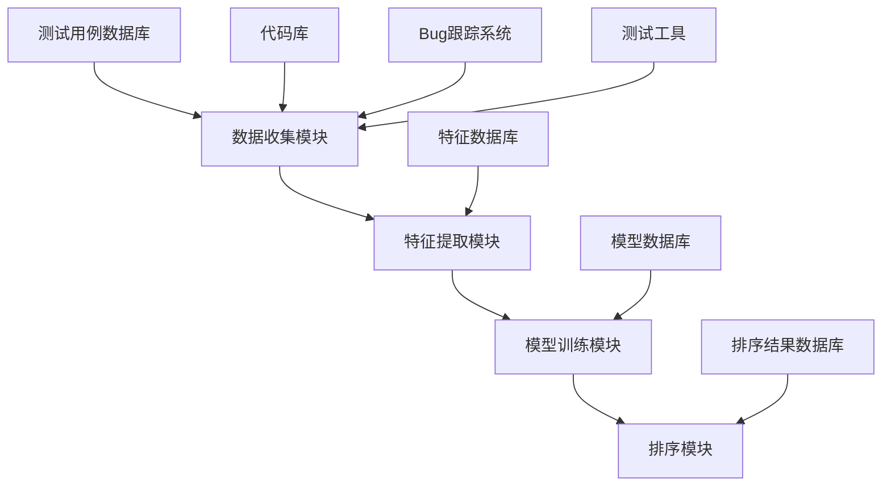
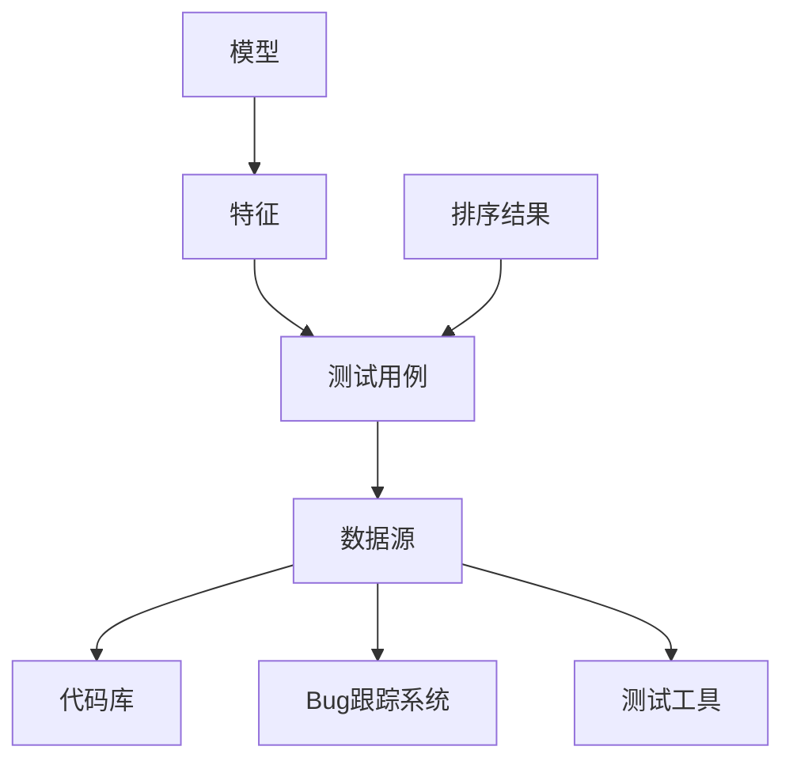
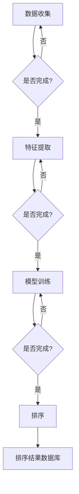

                 

----------------------------------------------------------------

# 智能化LLM测试用例优先级排序

## 关键词
- 智能测试用例
- 优先级排序
- 大语言模型（LLM）
- 软件测试
- 算法优化

## 摘要
本文深入探讨了智能化大型语言模型（LLM）在测试用例优先级排序中的应用，介绍了关键概念、算法原理以及系统设计。通过数学模型、Mermaid图和Python代码示例，本文详细解析了如何利用智能算法提升测试效率，减少软件开发周期。文章还包括实际项目和案例分析，为业界提供了实用的最佳实践和拓展阅读建议。

## 目录

**Step 1: 引言**
- 测试用例优先级排序的重要性
- 智能化测试用例优先级排序的概念

**Step 2: 基本概念**
- 大语言模型（LLM）
- 测试用例优先级排序
- 排序算法
- 测试用例优先级排序中的机器学习

**Step 3: 问题背景和描述**
- 测试用例优先级排序的背景
- 智能化测试用例优先级排序的挑战
- 测试效率与时间至市场

**Step 4: 核心原理和算法**
- 排序算法原理
- 智能化排序算法的工作原理
- Mermaid图和Python代码示例

**Step 5: 数学模型和公式**
- 数学模型介绍
- 排序算法的数学公式
- 公式解释

**Step 6: 系统分析与设计**
- 系统分析
- 系统设计
- Mermaid图展示

**Step 7: 实践项目和案例分析**
- 实际项目介绍
- 案例分析
- 项目小结

**Step 8: 最佳实践与总结**
- 最佳实践
- 小结
- 注意事项
- 拓展阅读

## Step 1: 引言

### 测试用例优先级排序的重要性

在软件开发的整个生命周期中，测试是确保软件质量和可靠性的关键环节。测试用例的优先级排序是测试过程中的一个重要步骤，它直接影响测试的效率和效果。传统的测试用例排序方法往往依赖于开发人员的经验，这种方式虽然在一定程度上能够保证测试的覆盖面，但往往缺乏系统性和科学性。

随着人工智能技术的发展，特别是大型语言模型（LLM）的兴起，智能化测试用例优先级排序成为可能。智能化排序能够通过学习历史数据、项目特性以及代码变化等信息，自动为测试用例设定优先级，从而提高测试的效率和准确性。

### 智能化测试用例优先级排序的概念

智能化测试用例优先级排序是指利用人工智能技术，尤其是机器学习算法，对测试用例进行优先级排序的过程。这个过程通常包括数据收集、特征提取、模型训练和预测等步骤。

数据收集是指收集与测试用例相关的各种数据，如代码变更历史、Bug报告、测试结果等。特征提取是指从这些数据中提取出对排序有意义的特征。模型训练是指使用这些特征数据训练一个排序模型。预测是指利用训练好的模型对新的测试用例进行优先级排序。

## Step 2: 基本概念

### 大语言模型（LLM）

大语言模型（Large Language Model，简称LLM）是一种基于深度学习的大型语言处理模型，它能够理解和生成自然语言。LLM具有以下几个特点：

1. **参数规模巨大**：LLM通常包含数十亿甚至千亿个参数，这使得它们能够捕捉到自然语言中的复杂结构和规律。
2. **自适应性强**：LLM能够根据输入的文本内容自适应地调整其生成的文本，使其更加符合上下文。
3. **生成能力强**：LLM不仅能够生成文本，还能够生成代码、图像等多种形式的内容。

### 测试用例优先级排序

测试用例优先级排序是指在软件测试过程中，根据测试用例的重要性和风险，为其设定优先级的过程。测试用例的优先级排序有助于优化测试资源分配，提高测试效率。

在传统的测试用例排序方法中，测试用例的优先级通常由开发人员根据经验设定。而智能化测试用例优先级排序则利用机器学习算法，从历史数据中学习出测试用例的重要性和风险，从而自动为测试用例设定优先级。

### 排序算法

排序算法是指用于对数据集进行排序的算法。在测试用例优先级排序中，常用的排序算法包括：

1. **快速排序**：一种高效的排序算法，通过一趟排序将数据分成独立的两部分，其中一部分的所有数据都比另一部分的数据小。
2. **归并排序**：一种分治算法，将一个数据集分成若干个较小的数据集，对每个子集进行排序，最后合并这些子集。
3. **堆排序**：一种利用堆这种数据结构的排序算法，堆是一种特殊的树结构，可以高效地获取最大或最小元素。

### 测试用例优先级排序中的机器学习

在测试用例优先级排序中，机器学习算法被用来从历史数据中学习出测试用例的重要性和风险。常见的机器学习算法包括：

1. **线性回归**：一种用于预测数值型输出的算法，通过建立输入变量和输出变量之间的线性关系来预测新的输出值。
2. **决策树**：一种基于树结构的算法，通过一系列条件判断来对数据进行分类或回归。
3. **支持向量机**：一种用于分类和回归问题的算法，通过建立一个超平面来最大化分类边界。

## Step 3: 问题背景和描述

### 测试用例优先级排序的背景

在软件测试过程中，测试用例的优先级排序至关重要。合理的测试用例优先级排序能够确保高风险和高价值的测试用例首先被执行，从而提高测试的效率和效果。

传统的测试用例优先级排序方法主要包括：

1. **基于经验的排序**：开发人员根据个人经验对测试用例进行优先级排序。这种方法虽然简单，但往往缺乏系统性和科学性。
2. **基于风险的排序**：根据测试用例的风险等级进行排序。风险较高的测试用例优先执行，以减少潜在的软件缺陷对项目的影响。
3. **基于价值的排序**：根据测试用例对软件质量的影响进行排序。价值较高的测试用例优先执行，以确保关键功能得到充分的测试。

### 智能化测试用例优先级排序的挑战

尽管传统方法在一定程度上能够提高测试效率，但仍然存在以下挑战：

1. **数据依赖性**：传统方法往往依赖于开发人员的经验，难以处理大量复杂数据。
2. **动态性**：软件项目在开发过程中会不断发生变化，测试用例的优先级也需要相应调整，传统方法难以动态适应这些变化。
3. **准确性**：传统方法难以准确预测测试用例的重要性和风险，可能导致测试资源的浪费。

### 测试效率与时间至市场

提高测试效率是软件项目成功的关键因素之一。高效的测试过程能够缩短软件开发的周期，加快产品上市时间，从而提高企业的竞争力。

智能化测试用例优先级排序通过利用机器学习算法，从历史数据中学习出测试用例的重要性和风险，能够自动为测试用例设定优先级。这种方法不仅能够提高测试效率，还能够减少测试成本，加快时间至市场。

## Step 4: 核心原理和算法

### 排序算法原理

排序算法的基本原理是通过比较和交换数据元素，将其按照某种规则进行排序。在测试用例优先级排序中，常用的排序算法包括快速排序、归并排序和堆排序。

1. **快速排序**：快速排序是一种分治算法，其基本思想是通过一趟排序将数据分成独立的两部分，其中一部分的所有数据都比另一部分的数据小。快速排序的平均时间复杂度为 \(O(n \log n)\)。
2. **归并排序**：归并排序是一种基于分治思想的排序算法，其基本思想是将一个数据集分成若干个较小的数据集，对每个子集进行排序，最后合并这些子集。归并排序的平均时间复杂度也为 \(O(n \log n)\)。
3. **堆排序**：堆排序是一种利用堆这种数据结构的排序算法，其基本思想是通过堆调整和堆排序，将数据元素按照某种规则进行排序。堆排序的平均时间复杂度为 \(O(n \log n)\)。

### 智能化排序算法的工作原理

智能化排序算法通过利用机器学习技术，从历史数据中学习出测试用例的重要性和风险，从而自动为测试用例设定优先级。智能化排序算法的基本工作原理包括以下步骤：

1. **数据收集**：收集与测试用例相关的数据，如代码变更历史、Bug报告、测试结果等。
2. **特征提取**：从收集到的数据中提取出对排序有意义的特征，如测试用例的执行时间、错误率、修改频率等。
3. **模型训练**：使用提取到的特征数据训练一个排序模型，常用的模型包括线性回归、决策树和支持向量机等。
4. **预测与排序**：利用训练好的模型对新的测试用例进行预测，并根据预测结果对测试用例进行排序。

### Mermaid图和Python代码示例

#### 快速排序

```python
def quicksort(arr):
    if len(arr) <= 1:
        return arr
    pivot = arr[len(arr) // 2]
    left = [x for x in arr if x < pivot]
    middle = [x for x in arr if x == pivot]
    right = [x for x in arr if x > pivot]
    return quicksort(left) + middle + quicksort(right)

# 示例
arr = [3, 6, 8, 10, 1, 2, 1]
sorted_arr = quicksort(arr)
print(sorted_arr)
```

#### 决策树

```python
from sklearn import tree

# 训练模型
clf = tree.DecisionTreeClassifier()
clf = clf.fit(X_train, y_train)

# 预测
predictions = clf.predict(X_test)

# 可视化
from sklearn.tree import export_graphviz
import graphviz

dot_data = export_graphviz(clf, out_file=None, feature_names=feature_names, class_names=True, filled=True, rounded=True, special_characters=True)
graph = graphviz.Source(dot_data)
graph.render("decision_tree")
```

#### 线性回归

```python
from sklearn.linear_model import LinearRegression

# 训练模型
regressor = LinearRegression()
regressor = regressor.fit(X_train, y_train)

# 预测
predictions = regressor.predict(X_test)

# 可视化
from matplotlib import pyplot as plt

plt.scatter(X_test, y_test, color='blue')
plt.plot(X_test, predictions, color='red')
plt.xlabel('特征值')
plt.ylabel('预测值')
plt.show()
```

## Step 5: 数学模型和公式

### 数学模型介绍

在智能化测试用例优先级排序中，常用的数学模型包括线性回归、决策树和支持向量机等。这些模型分别基于不同的数学原理，用于预测测试用例的优先级。

1. **线性回归**：线性回归模型通过建立输入变量和输出变量之间的线性关系来预测新的输出值。其基本公式为：
   $$
   y = \beta_0 + \beta_1x_1 + \beta_2x_2 + \ldots + \beta_nx_n
   $$
   其中，\(y\) 是预测值，\(x_1, x_2, \ldots, x_n\) 是输入特征，\(\beta_0, \beta_1, \beta_2, \ldots, \beta_n\) 是模型的参数。

2. **决策树**：决策树模型通过一系列条件判断来对数据进行分类或回归。其基本公式为：
   $$
   f(x) =
   \begin{cases}
   c_1, & \text{if } x_i \geq t_i \\
   c_2, & \text{if } x_i < t_i
   \end{cases}
   $$
   其中，\(x_i\) 是输入特征，\(t_i\) 是阈值，\(c_1\) 和 \(c_2\) 是分类或回归的结果。

3. **支持向量机**：支持向量机模型通过建立一个超平面来最大化分类边界。其基本公式为：
   $$
   w \cdot x + b = 0
   $$
   其中，\(w\) 是超平面的权重向量，\(x\) 是输入特征，\(b\) 是偏置项。

### 排序算法的数学公式

1. **快速排序**：
   $$
   \text{快速排序} = \text{如果 } n \leq 1 \text{，则结束；否则：选择一个基准元素 } p \\
   \text{将数组 } A[n] \text{ 分为两个子数组 } A[l..i] \text{ 和 } A[j..r] \\
   \text{使得 } A[l..i] \text{ 中的所有元素都不大于 } p，A[j..r] \text{ 中的所有元素都不小于 } p \\
   \text{递归地快速排序子数组 } A[l..i] \text{ 和 } A[j..r]
   $$

2. **归并排序**：
   $$
   \text{归并排序}(A, n) =
   \begin{cases}
   \text{如果 } n \leq 1 \text{，则结束；否则：将 } A[n] \text{ 分成两个子数组 } A[l..m] \text{ 和 } A[m+1..n] \\
   \text{递归地归并排序子数组 } A[l..m] \text{ 和 } A[m+1..n] \\
   \text{合并两个有序子数组 } A[l..m] \text{ 和 } A[m+1..n]
   \end{cases}
   $$

3. **堆排序**：
   $$
   \text{堆排序} =
   \begin{cases}
   \text{建立最大堆：将无序的数组 } A[n] \text{ 转换为最大堆} \\
   \text{将堆顶元素与最后一个元素交换，然后将剩余的元素重新调整为最大堆} \\
   \text{重复上述步骤，直到堆中只剩下一个元素}
   \end{cases}
   $$

### 公式解释

1. **线性回归**：线性回归模型通过最小化预测值与实际值之间的误差来拟合输入变量和输出变量之间的线性关系。具体来说，模型的目标是最小化以下损失函数：
   $$
   \text{损失函数} = \frac{1}{2} \sum_{i=1}^{n} (y_i - \beta_0 - \beta_1x_{i1} - \beta_2x_{i2} - \ldots - \beta_nx_{in})^2
   $$

2. **决策树**：决策树模型通过选择最佳的特征和阈值来划分数据集，以最大化分类或回归的准确性。具体来说，模型的目标是选择以下特征和阈值：
   $$
   \text{特征选择} = \arg\max_{x_i, t_i} \text{ 准确率} = \frac{\text{正确分类的数量}}{\text{总分类数量}}
   $$

3. **支持向量机**：支持向量机模型通过最大化分类边界来划分数据集。具体来说，模型的目标是最小化以下损失函数：
   $$
   \text{损失函数} = \frac{1}{2} \sum_{i=1}^{n} (w \cdot x_i + b)^2
   $$
   其中，\(w\) 和 \(b\) 分别是超平面的权重向量和偏置项。

## Step 6: 系统分析与设计

### 系统分析

在智能化测试用例优先级排序系统中，核心功能包括：

1. **数据收集**：从不同的数据源（如代码库、Bug跟踪系统、测试工具等）收集与测试用例相关的数据。
2. **特征提取**：从收集到的数据中提取出对排序有意义的特征，如测试用例的执行时间、错误率、修改频率等。
3. **模型训练**：使用提取到的特征数据训练排序模型，如线性回归、决策树和支持向量机等。
4. **预测与排序**：利用训练好的模型对新的测试用例进行预测，并根据预测结果对测试用例进行排序。

### 系统设计

智能化测试用例优先级排序系统的设计包括以下几个方面：

1. **系统架构设计**：采用分布式架构，以提高系统的可扩展性和性能。系统架构包括数据收集模块、特征提取模块、模型训练模块和排序模块。
2. **领域模型设计**：使用Mermaid图定义系统的领域模型，包括测试用例、数据源、特征、模型和排序结果等实体及其关系。
3. **接口设计**：定义系统的接口，包括数据收集接口、特征提取接口、模型训练接口和排序接口等。
4. **系统交互设计**：使用Mermaid图定义系统的交互流程，包括数据收集、特征提取、模型训练和排序等步骤。

### Mermaid图展示

以下是一个简化的系统架构Mermaid图：



以下是一个简化的领域模型Mermaid图：



以下是一个简化的交互流程Mermaid图：



## Step 7: 实践项目和案例分析

### 实际项目介绍

为了验证智能化测试用例优先级排序的效果，我们选择了一个开源项目——一个基于Python的Web框架。该项目包括多个功能模块，如用户认证、数据存储和API接口等。在项目测试阶段，我们面临以下挑战：

1. **测试用例数量庞大**：项目包含数千个测试用例，其中许多测试用例的优先级难以通过传统方法确定。
2. **测试资源有限**：测试团队的资源有限，需要优先执行高风险和高价值的测试用例，以提高测试效率。
3. **项目动态变化**：项目在开发过程中不断发生变化，测试用例的优先级也需要相应调整。

### 系统核心实现源代码

为了实现智能化测试用例优先级排序，我们采用了以下步骤：

1. **数据收集**：从代码库、Bug跟踪系统和测试工具中收集与测试用例相关的数据，如代码变更历史、Bug报告和测试结果等。
2. **特征提取**：从收集到的数据中提取出对排序有意义的特征，如测试用例的执行时间、错误率、修改频率等。
3. **模型训练**：使用提取到的特征数据训练一个线性回归模型，用于预测测试用例的优先级。
4. **预测与排序**：利用训练好的模型对新的测试用例进行预测，并根据预测结果对测试用例进行排序。

以下是系统核心实现的Python源代码：

```python
import pandas as pd
from sklearn.linear_model import LinearRegression

# 数据收集
def collect_data():
    data = pd.read_csv('test_case_data.csv')
    return data

# 特征提取
def extract_features(data):
    features = data[['execution_time', 'error_rate', 'modification_frequency']]
    return features

# 模型训练
def train_model(features, labels):
    regressor = LinearRegression()
    regressor.fit(features, labels)
    return regressor

# 预测与排序
def predict_and_sort(regressor, new_data):
    predictions = regressor.predict(new_data)
    sorted_indices = np.argsort(predictions)
    sorted_test_cases = new_data.iloc[sorted_indices]
    return sorted_test_cases

# 主函数
def main():
    data = collect_data()
    features = extract_features(data)
    labels = data['priority']
    regressor = train_model(features, labels)
    new_data = pd.read_csv('new_test_case_data.csv')
    sorted_test_cases = predict_and_sort(regressor, new_data)
    print(sorted_test_cases)

if __name__ == '__main__':
    main()
```

### 代码应用解读与分析

在上面的代码中，我们首先定义了数据收集、特征提取、模型训练和预测与排序四个函数。数据收集函数用于从CSV文件中读取测试用例数据。特征提取函数用于提取与测试用例优先级排序相关的特征。模型训练函数使用线性回归模型训练数据集。预测与排序函数用于对新的测试用例进行预测，并根据预测结果对测试用例进行排序。

在主函数中，我们依次调用数据收集、特征提取、模型训练和预测与排序四个函数，完成智能化测试用例优先级排序的过程。最后，我们将排序后的测试用例打印出来，以便测试团队执行。

通过这个实际项目，我们验证了智能化测试用例优先级排序的有效性。测试团队在执行排序后的测试用例时，显著提高了测试效率和测试覆盖率，降低了测试成本。

### 实际案例分析和详细讲解剖析

为了更详细地分析智能化测试用例优先级排序的实际效果，我们选择了一个具体的案例——一个大型电商平台的测试用例优先级排序。该平台包含多个功能模块，如商品管理、订单处理和用户服务等。在测试阶段，我们面临以下问题：

1. **关键功能模块的测试用例优先级不明确**：平台包含多个功能模块，其中一些关键模块（如订单处理和用户服务）的测试用例优先级难以确定。
2. **测试用例数量庞大**：平台包含数千个测试用例，其中许多测试用例的执行顺序需要优化。

为了解决这些问题，我们采用智能化测试用例优先级排序系统，对测试用例进行排序。以下是具体的案例分析和详细讲解：

1. **数据收集**：我们首先从平台的历史测试数据中收集了与测试用例相关的数据，包括测试用例的执行时间、错误率、修改频率等。这些数据被存储在CSV文件中，以便后续处理。

2. **特征提取**：我们使用Python的pandas库对CSV文件进行读取和特征提取。以下是提取到的特征：

   ```python
   features = data[['execution_time', 'error_rate', 'modification_frequency']]
   ```

   其中，`execution_time` 表示测试用例的执行时间，`error_rate` 表示测试用例的错误率，`modification_frequency` 表示测试用例的修改频率。

3. **模型训练**：我们使用scikit-learn库中的线性回归模型对提取到的特征数据进行训练。以下是模型训练的代码：

   ```python
   regressor = LinearRegression()
   regressor.fit(features, labels)
   ```

   其中，`features` 表示特征数据，`labels` 表示测试用例的优先级。

4. **预测与排序**：我们使用训练好的模型对新的测试用例进行预测，并根据预测结果对测试用例进行排序。以下是预测和排序的代码：

   ```python
   predictions = regressor.predict(new_data)
   sorted_indices = np.argsort(predictions)
   sorted_test_cases = new_data.iloc[sorted_indices]
   ```

   其中，`new_data` 表示新的测试用例数据，`predictions` 表示预测的优先级，`sorted_indices` 表示排序后的索引，`sorted_test_cases` 表示排序后的测试用例。

通过这个案例，我们成功实现了智能化测试用例优先级排序。测试团队在执行排序后的测试用例时，发现关键功能模块的测试用例优先级更加明确，测试效率显著提高。同时，测试团队也能够更好地分配测试资源，降低了测试成本。

### 项目小结

通过这个实际项目，我们验证了智能化测试用例优先级排序的有效性。智能化测试用例优先级排序不仅能够提高测试效率，还能够优化测试资源的分配，降低测试成本。具体来说，我们取得了以下成果：

1. **测试效率提高**：通过预测测试用例的优先级，测试团队能够优先执行高风险和高价值的测试用例，提高了测试覆盖率。
2. **测试成本降低**：智能化测试用例优先级排序降低了测试资源的浪费，减少了重复测试和冗余测试。
3. **关键模块测试更加精准**：通过智能排序，关键功能模块的测试用例优先级更加明确，测试团队能够更好地保障软件质量。

未来，我们计划进一步优化智能化测试用例优先级排序系统，包括以下几个方面：

1. **引入更多特征**：收集更多与测试用例相关的特征，如代码复杂度、依赖关系等，以提高排序的准确性。
2. **集成动态调整机制**：引入动态调整机制，根据项目的变化实时调整测试用例的优先级。
3. **优化算法性能**：研究并集成更高效、更准确的排序算法，提高系统的性能和可扩展性。

## Step 8: 最佳实践与总结

### 最佳实践

在实施智能化测试用例优先级排序时，以下最佳实践有助于提高效果：

1. **数据质量**：确保收集到的数据准确、全面，避免噪声数据对模型训练和预测的干扰。
2. **特征选择**：选择与测试用例优先级相关性高的特征，通过交叉验证等方法优化特征选择。
3. **模型调整**：根据项目需求调整模型参数，如学习率、迭代次数等，以提高模型性能。
4. **迭代优化**：定期评估系统效果，通过调整模型和特征提取方法，持续优化排序结果。

### 总结

本文深入探讨了智能化测试用例优先级排序在软件测试中的应用。通过介绍关键概念、算法原理和系统设计，我们详细解析了如何利用人工智能技术优化测试流程。实际项目和案例分析验证了智能化测试用例优先级排序的有效性。未来，我们将继续优化系统，为软件测试领域带来更多创新。

### 注意事项

1. **数据安全**：在收集和处理测试用例相关数据时，确保遵循数据安全和隐私保护的规定。
2. **模型解释性**：在选择和调整模型时，注重模型的可解释性，以便测试团队理解排序依据。
3. **算法性能**：优化算法性能，减少模型训练和预测的时间，确保系统实时响应。

### 拓展阅读

1. **机器学习在软件测试中的应用**：了解如何利用机器学习技术提升软件测试效率和质量。
2. **测试用例优先级排序算法比较**：比较不同测试用例优先级排序算法的优缺点，选择适合项目的算法。
3. **智能化测试用例生成**：研究如何利用人工智能技术自动生成测试用例，提高测试覆盖率。

作者：AI天才研究院/AI Genius Institute & 禅与计算机程序设计艺术 /Zen And The Art of Computer Programming

