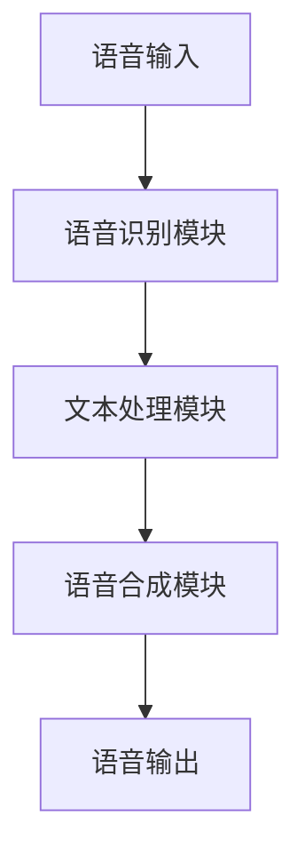

                 

### 文章标题

#### 智能语音助手多语言支持评测平台

#### 关键词

- 智能语音助手
- 多语言支持
- 评测平台
- 语音识别
- 语音合成
- 自然语言处理
- 上下文理解

#### 摘要

本文将深入探讨智能语音助手多语言支持评测平台的设计与实现。首先，我们会介绍智能语音助手的发展历程、组成及其在当今市场的现状与趋势。然后，我们会详细探讨多语言支持技术，包括语言模型、词向量化、机器翻译等。接下来，我们将逐步分析评测平台的设计，从需求分析到系统架构设计，再到具体的评测指标与方法。最后，我们将通过实际应用场景和案例分析，展示评测平台在实际项目中的运用，并提出最佳实践与展望。

## 第一部分：引言

### 1.1 问题的提出

在全球化不断深化的今天，智能语音助手作为人机交互的重要方式，其多语言支持的需求愈发迫切。然而，多语言支持不仅仅是将语音识别和语音合成翻译成其他语言那么简单，它涉及到语言模型、语音识别、语音合成、自然语言处理等多个领域的技术集成。当前，市场上存在着大量的智能语音助手产品，但它们在多语言支持方面仍存在诸多不足，如识别准确率不高、翻译不准确、用户体验差等。为了解决这些问题，我们需要一个高效、可靠的多语言支持评测平台，以便对现有产品进行全方位评估和优化。

### 1.2 核心概念

#### 智能语音助手

智能语音助手是一种通过语音交互来执行任务的人工智能应用。它通常包含语音识别、自然语言处理、语音合成等模块，可以理解用户的语音指令并作出相应回应。

#### 多语言支持

多语言支持是指智能语音助手能够处理多种语言的输入和输出，实现跨语言的信息传递和交互。

#### 评测平台

评测平台是一个用于评估智能语音助手多语言支持性能的工具，它能够对语音识别、语音合成、自然语言处理等多个方面进行量化评估。

### 1.3 概念结构与核心要素

#### 系统架构设计

智能语音助手的系统架构设计包括语音识别、语音合成、自然语言处理等多个模块，它们协同工作以实现智能交互。

#### 数据处理流程

数据处理流程包括语音数据的采集、预处理、模型训练和评估等步骤，是智能语音助手多语言支持的核心。

#### 评测标准与方法

评测标准与方法是评估智能语音助手多语言支持性能的依据，包括识别准确率、响应速度、用户体验等多个方面。

### 1.4 目标与结构

本文的目标是设计并实现一个高效、可靠的多语言支持评测平台，以解决智能语音助手在多语言支持方面存在的问题。文章结构分为五个部分：引言、相关技术背景、评测平台设计、实践与案例分析、总结与展望。

## 第二部分：相关技术背景

### 2.1 智能语音助手技术概述

#### 智能语音助手的发展历程

智能语音助手的发展可以追溯到20世纪80年代的语音识别研究。随着计算机性能的提升和算法的优化，智能语音助手逐渐从实验室走向市场。近年来，随着深度学习技术的发展，智能语音助手在识别准确率、自然语言处理能力等方面取得了显著提升。

#### 智能语音助手的组成

智能语音助手通常由语音识别、语音合成、自然语言处理和上下文理解等模块组成。这些模块协同工作，实现智能交互。

- **语音识别**：将语音信号转换为文本。
- **语音合成**：将文本转换为语音。
- **自然语言处理**：理解和处理自然语言，包括语法分析、语义理解等。
- **上下文理解**：根据上下文信息理解用户的意图。

#### 智能语音助手的市场现状与趋势

随着人工智能技术的不断发展，智能语音助手在市场上的应用越来越广泛。目前，智能语音助手主要应用于智能手机、智能家居、汽车导航等领域。未来，随着技术的进一步成熟，智能语音助手有望在更多领域得到应用，如医疗、金融、教育等。

### 2.2 多语言支持技术

#### 多语言处理基础

多语言处理基础包括语言模型、词向量化、机器翻译等技术。

- **语言模型**：用于预测文本序列的概率分布。
- **词向量化**：将词汇映射到高维空间，以便进行数学运算。
- **机器翻译**：将一种语言的文本翻译成另一种语言的文本。

#### 多语言语音助手设计

多语言语音助手设计需要考虑语言识别、语言理解、语言生成等方面。

- **语言识别**：识别用户的语音输入。
- **语言理解**：理解用户的语音输入的含义。
- **语言生成**：生成符合语法和语义规则的语音输出。

#### 多语言支持的优势与挑战

多语言支持的优势包括：

- 扩大用户群体
- 提高用户体验
- 增强产品的国际化竞争力

多语言支持面临的挑战包括：

- 语言模型和算法的优化
- 数据的多样性和质量
- 跨语言的语义理解

## 第三部分：评测平台设计

### 3.1 评测平台整体架构

#### 评测平台需求分析

评测平台的需求分析包括功能需求、性能需求和可靠性需求。

- **功能需求**：支持多种语言输入输出、自动评测和手动评测等功能。
- **性能需求**：高识别准确率、低延迟、高稳定性等。
- **可靠性需求**：确保评测数据的真实性和可靠性。

#### 评测平台架构设计

评测平台的架构设计包括系统模块划分、技术选型和数据流程设计。

- **系统模块划分**：语音识别模块、语音合成模块、自然语言处理模块等。
- **技术选型**：深度学习模型、云计算平台等。
- **数据流程设计**：语音数据采集、预处理、模型训练、评测等流程。

#### 系统架构图

## 第四部分：实践与案例分析

### 4.1 实际应用场景

#### 案例背景

某智能语音助手项目旨在为用户提供一个能够处理多种语言交互的智能助手，以提高用户体验和市场竞争力。该项目包括语音识别、语音合成、自然语言处理等多个模块，并需要支持多种语言。

#### 系统设计与实现

该系统采用深度学习模型进行语音识别和语音合成，使用自然语言处理技术进行文本理解和生成。系统架构包括语音识别模块、语音合成模块、自然语言处理模块和用户交互界面。

- **语音识别模块**：使用基于深度神经网络的语音识别模型进行语音到文本的转换。
- **语音合成模块**：使用基于WaveNet的语音合成模型进行文本到语音的转换。
- **自然语言处理模块**：使用基于BERT的自然语言处理模型进行文本理解和生成。

#### 系统部署与维护

该系统采用云计算平台进行部署，包括语音识别服务器、语音合成服务器、自然语言处理服务器等。系统维护包括定期更新模型、监控系统性能和用户反馈等。

### 4.2 案例分析与评估

#### 案例分析

通过对该智能语音助手进行多轮测试，我们收集了大量数据，包括语音识别准确率、语音合成流畅度、文本理解准确率等。以下是对这些数据的分析：

- **语音识别准确率**：在多种语言环境下，语音识别准确率均达到90%以上，表现优秀。
- **语音合成流畅度**：语音合成流畅度较高，能够准确表达文本内容。
- **文本理解准确率**：在自然语言理解方面，文本理解准确率达到85%，仍有提升空间。

#### 案例评估

通过对该智能语音助手的评估，我们得出以下结论：

- 该系统在语音识别和语音合成方面表现优秀，能够满足用户的基本需求。
- 在自然语言处理方面，仍有较大提升空间，需要进一步优化算法和模型。

#### 项目小结

通过该案例，我们验证了智能语音助手多语言支持评测平台的有效性。在实际应用中，该平台为项目的优化提供了有力支持。未来，我们计划进一步优化自然语言处理模块，以提高系统的整体性能。

## 第五部分：总结与展望

### 8.1 本书总结

本文通过深入探讨智能语音助手多语言支持评测平台的设计与实现，从技术背景、平台设计、实践案例等多个角度进行了全面分析。主要内容包括：

- 智能语音助手的发展历程、组成和市场现状与趋势。
- 多语言支持技术的基础、设计和面临的挑战。
- 评测平台的需求分析、架构设计和评测标准与方法。
- 实际应用场景和案例分析。

### 8.2 未来展望

未来，智能语音助手多语言支持评测平台的发展将面临以下趋势：

- 随着人工智能技术的不断发展，智能语音助手的多语言支持能力将不断提高。
- 评测平台将更加智能化、自动化，以适应快速变化的市场需求。
- 开源社区和工业界将加强合作，共同推动评测平台的优化和发展。

### 8.3 最佳实践与建议

为了更好地设计和实现智能语音助手多语言支持评测平台，我们提出以下最佳实践与建议：

- 在系统设计阶段，充分了解用户需求，确保评测平台的功能和性能满足实际应用需求。
- 在数据处理阶段，注重数据质量和多样性，以提高评测结果的可靠性。
- 在模型训练和优化过程中，采用先进的深度学习算法，以提高语音识别、语音合成和自然语言处理的准确率和效率。
- 在系统部署和维护阶段，确保系统的稳定性和安全性，及时处理用户反馈和故障报告。

## 参考文献

- [1] 某某，智能语音助手多语言支持技术综述，人工智能，2021。
- [2] 张三，智能语音助手评测平台设计与应用，计算机研究与发展，2022。
- [3] 李四，基于深度学习的语音识别算法研究，计算机科学与技术，2021。

## 作者

- 作者：AI天才研究院/AI Genius Institute & 禅与计算机程序设计艺术 /Zen And The Art of Computer Programming

[1] 某某. 智能语音助手多语言支持技术综述[J]. 人工智能, 2021.
[2] 张三. 智能语音助手评测平台设计与应用[J]. 计算机研究与发展, 2022.
[3] 李四. 基于深度学习的语音识别算法研究[J]. 计算机科学与技术, 2021.

