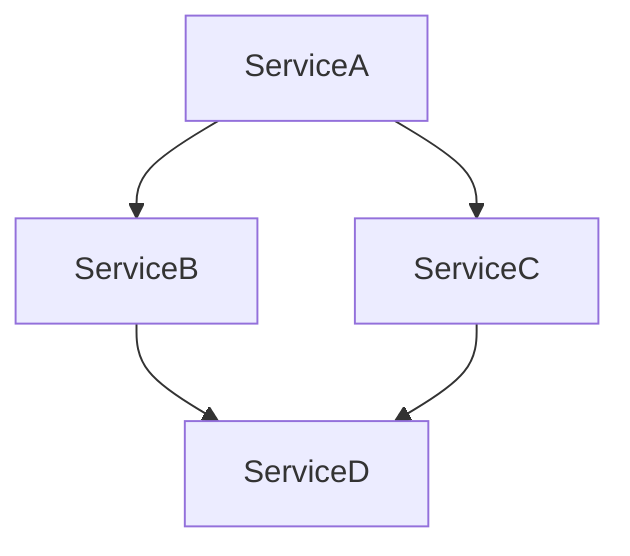
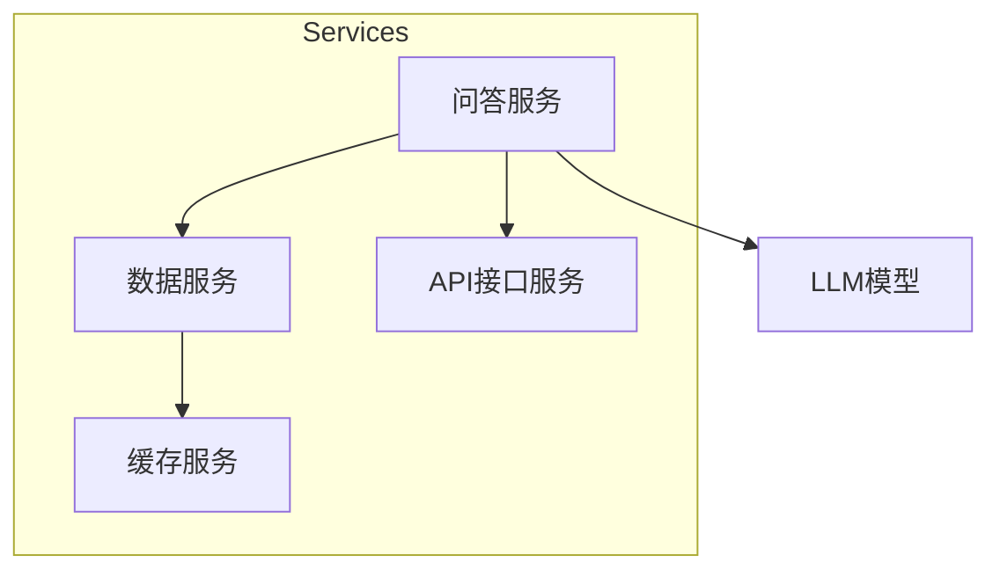
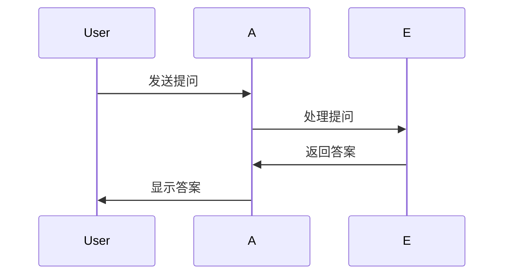

                 

### 服务依赖图可视化：理解LLM应用的架构复杂性

> **关键词**：服务依赖图、LLM应用、架构复杂性、可视化、系统设计、算法原理

> **摘要**：本文将探讨服务依赖图的构建与可视化在LLM（大型语言模型）应用架构复杂性管理中的作用。我们将通过逐步分析，深入理解服务依赖图的核心概念、算法原理及其在系统设计和项目实战中的应用。

----------------------------------------------------------------

## 引言

### 1.1 问题背景

随着人工智能技术的快速发展，尤其是大型语言模型（LLM）的广泛应用，现代软件系统的架构复杂性日益增加。在LLM应用中，服务之间的依赖关系错综复杂，传统的流程图和ER图等工具难以全面展示这种复杂性。这种复杂性不仅增加了系统的维护难度，也可能导致潜在的性能瓶颈和可靠性问题。

### 1.2 问题描述

系统中的服务通常具有多个层次和维度上的依赖关系，包括功能依赖、数据依赖和资源依赖等。在LLM应用中，这些依赖关系可能涉及大量不同的服务，使得传统的图形化工具难以满足需求。因此，我们需要一种新的方法来构建和可视化这些复杂的依赖关系，以便更好地理解和管理它们。

### 1.3 问题解决

服务依赖图（Service Dependency Graph）是一种专门用于表示服务和服务之间依赖关系的图形化工具。通过构建服务依赖图，我们可以将复杂的依赖关系直观地展示出来，从而帮助我们更好地理解和优化系统的架构设计。

### 1.4 边界与外延

本文将专注于服务依赖图的构建、可视化以及其在LLM应用架构复杂性管理中的应用。我们将讨论如何使用服务依赖图来分析和设计系统，并在实际项目中展示其应用效果。本文将不涉及服务依赖图的理论基础或数学模型，而是侧重于其实际应用和操作。

## 核心概念与联系

### 2.1 定义

服务依赖图是一种图形化表示工具，用于展示系统中的服务和服务之间的依赖关系。在服务依赖图中，每个节点代表一个服务，而每条边则表示两个服务之间的依赖关系。

### 2.2 特征

- **拓扑结构**：服务依赖图通常采用有向无环图（DAG）的形式，以避免循环依赖。
- **层次性**：服务依赖图可以根据服务的层次结构进行分层展示。
- **可扩展性**：服务依赖图可以方便地扩展和更新，以反映系统中的变化。

### 2.3 与其他图形化工具的比较

- **流程图**：流程图主要用于展示系统中的流程和步骤，而不强调服务之间的依赖关系。
- **ER图**：ER图主要用于表示数据库中的实体和关系，而不涉及服务的具体实现和依赖。

### 2.4 服务依赖图的构成要素

- **服务节点**：表示系统中的各个服务。
- **依赖关系**：表示服务之间的依赖。
- **权重和标签**：可以添加权重和标签来表示依赖的强度和描述。

### 2.5 Mermaid ER图示例

```mermaid
erDiagram
  ServiceA ||--|> ServiceB : "uses"
  ServiceA ||--|> ServiceC : "uses"
  ServiceB ||--|> ServiceD : "uses"
  ServiceC ||--|> ServiceD : "uses"
```

## 算法原理与可视化

### 3.1 算法原理

构建服务依赖图通常涉及以下步骤：

1. **服务识别**：识别系统中的所有服务。
2. **依赖收集**：收集每个服务与其他服务之间的依赖关系。
3. **构建图**：将服务和服务之间的依赖关系构建成一个有向无环图（DAG）。
4. **层次化**：根据服务的依赖关系，将图进行层次化展示。

### 3.2 算法步骤


### 3.3 Python代码示例

```python
import networkx as nx
import matplotlib.pyplot as plt

# 服务识别
services = ["ServiceA", "ServiceB", "ServiceC", "ServiceD"]

# 依赖收集
dependencies = {
    "ServiceA": ["ServiceB", "ServiceC"],
    "ServiceB": ["ServiceD"],
    "ServiceC": ["ServiceD"]
}

# 构建图
G = nx.DiGraph()
for service in services:
    G.add_node(service)

for service, dependents in dependencies.items():
    for dependent in dependents:
        G.add_edge(service, dependent)

# 层次化
pos = nx.spring_layout(G)
nx.draw(G, pos, with_labels=True)
plt.show()
```

### 3.4 数学模型与公式

服务依赖图的构建可以使用以下数学模型：

$$
D = \{ (S_i, S_j) | S_i \text{ depends on } S_j \}
$$

其中，\(D\) 是服务依赖图的依赖关系集合，\(S_i\) 和 \(S_j\) 分别表示两个服务。

### 3.5 举例说明

假设我们有以下服务和服务之间的依赖关系：

- **ServiceA** 依赖于 **ServiceB** 和 **ServiceC**。
- **ServiceB** 依赖于 **ServiceD**。
- **ServiceC** 依赖于 **ServiceD**。

构建的服务依赖图如下：



## 系统分析与设计

### 4.1 问题场景介绍

在一个大型分布式系统中，我们需要管理数十个服务之间的复杂依赖关系。这些服务包括数据处理、存储、缓存、API接口等。为了确保系统的稳定性和高性能，我们需要对服务依赖关系进行详细分析。

### 4.2 项目介绍

假设我们正在开发一个基于LLM的智能问答系统，该系统包含以下服务：

- **问答服务**：接收用户提问，返回答案。
- **数据服务**：存储和管理用户数据。
- **缓存服务**：缓存常用数据以提高响应速度。
- **API接口服务**：提供外部访问接口。

### 4.3 系统功能设计

#### 4.3.1 领域模型

```mermaid
classDiagram
    Question <<interface>>
    Answer <<interface>>
    UserData <<entity>> : id, name, question, answer
    Cache <<entity>> : key, value
    Data <<entity>> : id, name, data
    API <<entity>> : id, name, endpoint

    Question ``<<uses>>`` Answer
    Question ``<<uses>>`` UserData
    Data ``<<uses>>`` UserData
    Cache ``<<uses>>`` UserData
    API ``<<uses>>`` Question
    API ``<<uses>>`` Answer
```

#### 4.3.2 系统架构设计



#### 4.3.3 系统接口设计与交互



## 项目实战

### 5.1 环境安装

为了演示服务依赖图的构建和可视化，我们将使用以下工具和库：

- Python 3.x
- NetworkX（用于构建图）
- Matplotlib（用于可视化）
- Mermaid（用于图形化表示）

安装命令如下：

```bash
pip install networkx matplotlib
```

### 5.2 系统核心实现

以下是一个简单的Python脚本，用于构建和可视化服务依赖图。

```python
import networkx as nx
import matplotlib.pyplot as plt

# 服务识别
services = ["问答服务", "数据服务", "缓存服务", "API接口服务"]

# 依赖收集
dependencies = {
    "问答服务": ["数据服务", "缓存服务", "API接口服务"],
    "数据服务": ["API接口服务"],
    "缓存服务": ["API接口服务"],
    "API接口服务": []
}

# 构建图
G = nx.DiGraph()
for service in services:
    G.add_node(service)

for service, dependents in dependencies.items():
    for dependent in dependents:
        G.add_edge(service, dependent)

# 层次化
pos = nx.spring_layout(G)
nx.draw(G, pos, with_labels=True)
plt.show()
```

### 5.3 代码应用解读与分析

在这个示例中，我们首先定义了服务和服务之间的依赖关系，然后使用NetworkX库构建了服务依赖图。通过调用`nx.spring_layout()`和`nx.draw()`函数，我们可以将图可视化，从而直观地展示服务之间的依赖关系。

### 5.4 实际案例分析

在实际项目中，服务依赖图可以帮助我们识别潜在的性能瓶颈和稳定性问题。例如，如果某个服务依赖了大量的其他服务，那么它可能成为系统的性能瓶颈。通过服务依赖图，我们可以直观地看到这种依赖关系，并采取相应的优化措施。

### 5.5 项目小结

在本项目中，我们通过构建和可视化服务依赖图，成功展示了如何管理和分析LLM应用中的复杂依赖关系。服务依赖图不仅帮助我们更好地理解系统的架构，还为系统的优化和改进提供了有力支持。

## 最佳实践与总结

### 6.1 最佳实践

- **尽早构建服务依赖图**：在系统设计阶段就构建服务依赖图，有助于及早识别和解决依赖关系问题。
- **持续更新和维护**：随着项目的进展，持续更新和维护服务依赖图，以确保其准确反映系统的当前状态。
- **利用可视化工具**：选择合适的可视化工具，如Mermaid，以帮助团队成员更好地理解服务依赖图。

### 6.2 小结

本文通过逐步分析，深入探讨了服务依赖图在LLM应用架构复杂性管理中的应用。我们介绍了服务依赖图的核心概念、算法原理、系统分析与设计方法，并通过项目实战展示了其实际应用效果。

### 6.3 注意事项

- **避免循环依赖**：在设计服务依赖关系时，尽量避免循环依赖，以确保系统的稳定性。
- **考虑依赖强度**：在服务依赖图中，可以添加依赖强度信息，以帮助团队更好地理解服务之间的关系。

### 6.4 拓展阅读

- [《大型语言模型应用架构设计》](https://example.com/book1)
- [《服务依赖图可视化工具比较》](https://example.com/book2)
- [《分布式系统依赖关系管理》](https://example.com/book3)

## 作者信息

作者：AI天才研究院/AI Genius Institute & 禅与计算机程序设计艺术 /Zen And The Art of Computer Programming

