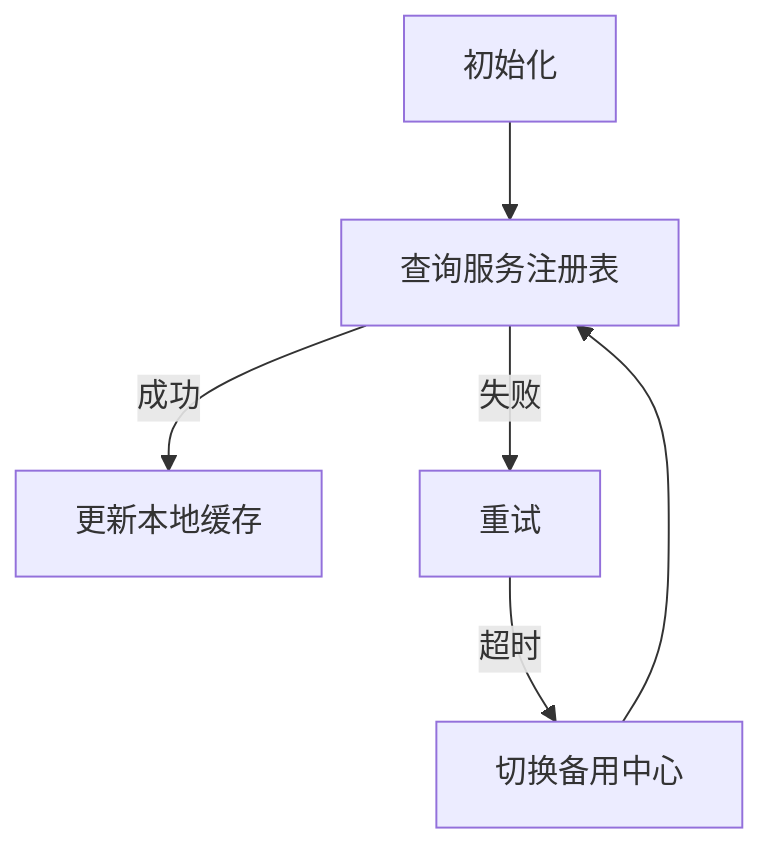
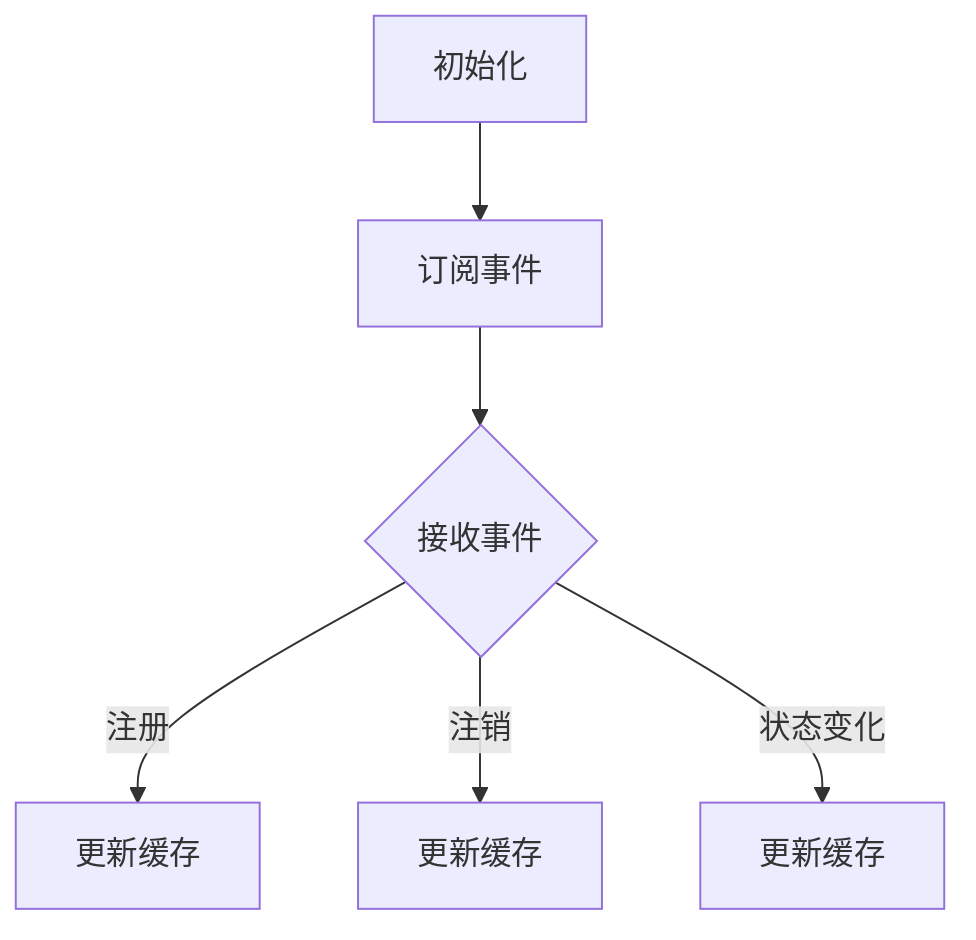
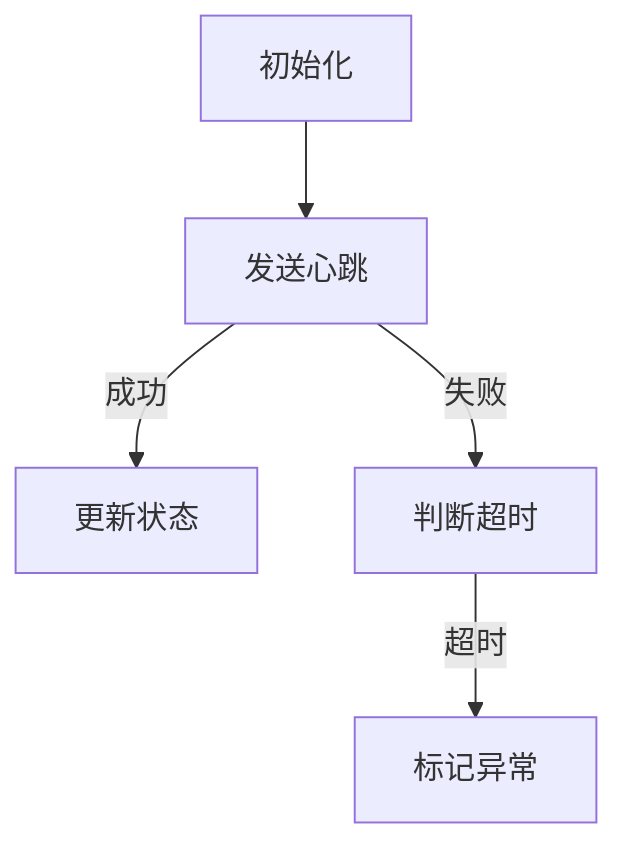
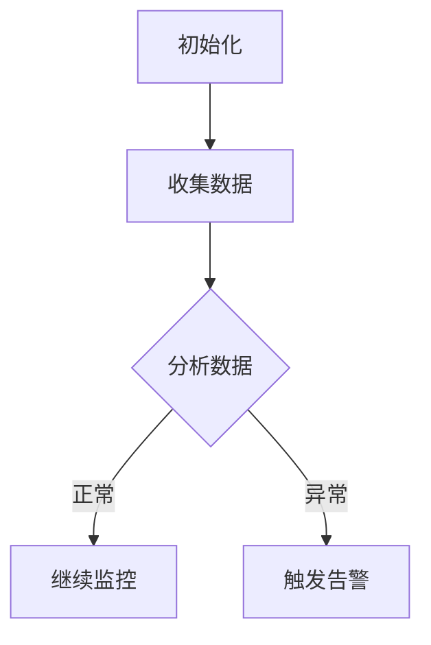
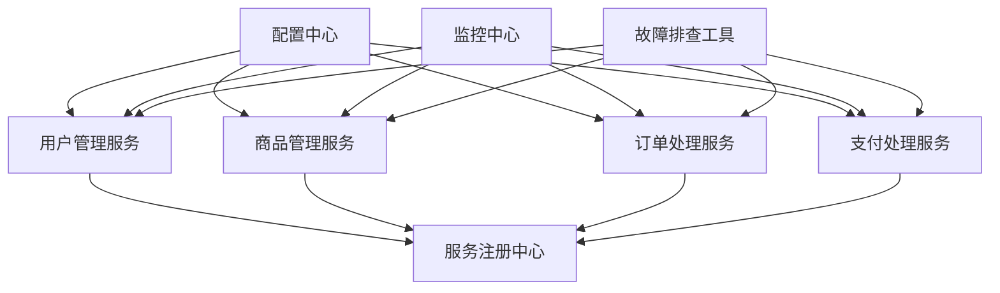
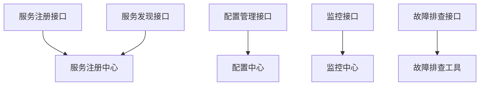
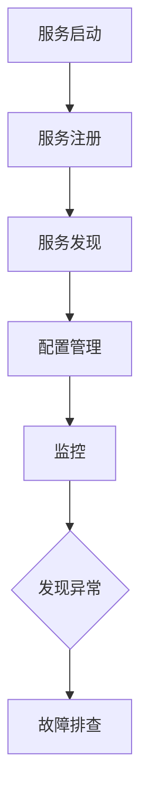

                 

## 服务依赖管理在LLM应用架构中的重要性

服务依赖管理是现代分布式系统架构中不可或缺的一部分，特别是在大型语言模型（Large Language Models, LLM）应用中显得尤为重要。LLM如ChatGPT、BERT等，因其强大的文本处理能力和广泛的应用场景，成为了各个行业中不可或缺的技术手段。然而，LLM应用架构的复杂性也随之增加，这为服务依赖管理带来了巨大的挑战。

### **关键词**
- 服务依赖管理
- LLM应用架构
- 分布式系统
- 服务发现
- 服务监控
- 服务配置管理

### **摘要**
本文将深入探讨服务依赖管理在LLM应用架构中的重要性。我们将首先介绍服务依赖管理的背景和核心概念，包括服务定义、服务注册与发现、服务配置管理和服务间通信协议。接着，我们将通过具体的算法原理讲解，如服务发现算法和服务监控算法，来阐述如何实现有效的服务依赖管理。随后，我们将分析系统架构设计方案，并给出项目实战中的具体实施步骤。最后，我们将总结最佳实践和注意事项，以期为LLM应用中的服务依赖管理提供有价值的参考。

## 第一部分：背景介绍

### 第1章 问题背景与核心概念

在现代软件架构中，分布式系统变得越来越普遍。这种架构模式通过将应用程序分解为多个可独立部署和管理的服务组件，提高了系统的可扩展性、灵活性和可靠性。然而，随着服务数量的增加和复杂性的提升，服务依赖管理成为一个亟待解决的问题。

### 1.1 服务依赖管理概述

#### 1.1.1 问题背景

在分布式系统中，一个服务可能会依赖其他一个或多个服务来实现其功能。例如，一个用户身份验证服务需要依赖数据库服务来存储和检索用户信息。这些依赖关系往往错综复杂，如果管理不当，可能会导致系统中的服务无法正常工作，甚至导致整个系统崩溃。

#### 1.1.2 问题描述

服务依赖管理面临的关键问题包括：

- **服务配置复杂度高**：服务配置需要管理大量的参数和依赖项，这可能导致配置错误和服务不可用。
- **服务间通信可靠性保障**：服务之间的通信可能受到网络延迟、带宽限制等因素的影响，需要确保通信的可靠性。
- **服务升级和部署风险控制**：在分布式系统中，服务的升级和部署可能会影响其他依赖服务的正常运行，需要有效控制部署风险。
- **服务监控与故障排查**：有效的监控和故障排查机制对于确保服务的稳定运行至关重要。

#### 1.1.3 问题解决

有效的服务依赖管理旨在通过以下方式解决上述问题：

- **简化服务配置**：通过自动化和标准化服务配置，减少人为错误和配置复杂度。
- **提高服务间通信可靠性**：通过采用可靠的通信协议和冗余机制，确保服务之间的通信稳定。
- **降低服务升级和部署风险**：通过滚动部署、蓝绿部署等技术，减小升级和部署对系统的影响。
- **提升服务监控与故障排查效率**：通过实时监控和自动化故障排查工具，快速定位和解决服务问题。

#### 1.1.4 边界与外延

服务依赖管理不仅涉及单个服务的内部依赖，还包括跨服务的依赖关系。此外，它还涉及到服务架构的设计、服务通信协议的选型、服务监控工具的使用等多个方面。

#### 1.1.5 概念结构与核心要素组成

服务依赖管理的概念结构包括以下几个核心要素：

- **服务定义**：定义服务的接口、功能和依赖。
- **服务注册与发现**：服务在启动时注册到注册中心，其他服务可以通过注册中心发现和调用它们。
- **服务配置管理**：管理服务的配置信息，如启动参数、环境变量等。
- **服务间通信协议**：定义服务之间的通信方式，如HTTP、gRPC等。
- **服务监控与告警**：实时监控服务的运行状态，并在出现问题时发出告警。
- **服务故障排查与恢复**：定位故障原因，采取相应的措施进行恢复。

### 第2章 核心概念与联系

#### 2.1 服务依赖管理核心概念

##### 2.1.1 服务定义

服务是具有明确接口的软件模块，可被其他服务调用以实现特定功能。服务通常通过RESTful API、gRPC或其他通信协议与其他服务进行交互。

##### 2.1.2 服务注册与发现

服务注册与发现是服务依赖管理的关键环节。服务启动时，会将自己的信息注册到服务注册中心，其他服务可以通过服务注册中心发现和调用它们。服务注册与发现机制可以动态更新服务列表，确保服务的可用性。

##### 2.1.3 服务配置管理

服务配置管理涉及服务启动参数、环境变量、依赖库等的配置和管理。配置信息可以存储在配置中心，通过配置管理工具进行管理和更新。

##### 2.1.4 服务间通信协议

服务间通信协议定义了服务之间的通信方式和数据交换格式。常见的通信协议包括HTTP、gRPC、RabbitMQ等。选择合适的通信协议可以提高服务的性能和可靠性。

#### 2.2 概念属性特征对比表格

| 概念         | 特征                             |
| ------------ | -------------------------------- |
| 服务定义     | 模块化、明确接口                 |
| 服务注册与发现 | 动态、分布式系统适应性强         |
| 服务配置管理 | 参数化、灵活性高                 |
| 服务间通信协议 | 可靠、高效、跨平台兼容           |

#### 2.3 ER实体关系图架构

```mermaid
erDiagram
  服务依赖管理 ||--|{ 服务定义 }
  服务依赖管理 ||--|{ 服务注册与发现 }
  服务依赖管理 ||--|{ 服务配置管理 }
  服务依赖管理 ||--|{ 服务间通信协议 }
```

## 第二部分：算法原理讲解

### 第3章 服务依赖管理算法原理

在现代分布式系统中，服务依赖管理算法是实现系统稳定、高效运行的关键。以下是服务依赖管理中常用的算法原理，包括服务发现算法和服务监控算法。

#### 3.1 服务发现算法

服务发现是分布式系统中一项重要的功能，它允许服务动态地注册和发现其他服务。以下是几种常见的服务发现算法：

##### 3.1.1 轮询发现算法

轮询发现算法通过定期查询服务注册表来发现可用服务。具体步骤如下：

1. **初始化**：启动服务发现组件，指定服务注册中心的地址。
2. **查询服务注册表**：定期向服务注册中心发送查询请求，获取最新的服务列表。
3. **更新本地服务缓存**：将查询到的服务列表更新到本地缓存，以便后续使用。
4. **超时处理**：在查询过程中，如果服务注册中心无法响应，则需要重试或切换到备用服务注册中心。



##### 3.1.2 事件驱动发现算法

事件驱动发现算法基于服务注册表的变化事件进行服务发现。具体步骤如下：

1. **初始化**：启动服务发现组件，订阅服务注册中心的事件。
2. **接收事件**：监听服务注册中心发送的事件，包括服务注册、服务注销和服务状态变化等。
3. **处理事件**：根据事件类型更新本地服务缓存，确保服务信息的实时性。



#### 3.2 服务监控算法

服务监控是保证服务稳定运行的重要手段。以下是两种常见的服务监控算法：

##### 3.2.1 基于心跳的监控算法

基于心跳的监控算法通过定期发送心跳消息来检测服务是否正常。具体步骤如下：

1. **初始化**：启动监控组件，指定监控目标和心跳间隔时间。
2. **发送心跳**：定时向监控目标发送心跳消息。
3. **接收心跳响应**：监控目标接收到心跳消息后，返回心跳响应。
4. **状态判断**：根据心跳响应的时间戳判断服务是否正常。如果连续多次未收到心跳响应，则认为服务异常。



##### 3.2.2 基于性能指标的监控算法

基于性能指标的监控算法通过收集服务的性能指标（如响应时间、吞吐量等）来评估服务健康状态。具体步骤如下：

1. **初始化**：启动监控组件，指定监控目标和性能指标。
2. **收集数据**：定时从监控目标收集性能指标数据。
3. **分析数据**：对收集到的性能指标数据进行统计分析，判断服务是否正常。
4. **触发告警**：如果性能指标超过预设阈值，则触发告警。



通过上述算法，我们可以实现对服务依赖的有效管理，确保分布式系统的稳定性和可靠性。接下来，我们将进一步探讨如何设计和实现这些算法，并给出具体的代码示例。

## 第三部分：系统分析与架构设计方案

### 第4章 系统分析与架构设计方案

在现代分布式系统中，服务依赖管理不仅仅是一个技术问题，更是一个系统架构设计的关键要素。本章节将详细介绍一个典型的服务依赖管理系统架构设计方案，包括问题场景介绍、项目介绍、系统功能设计、系统架构设计、系统接口设计和系统交互等。

#### 4.1 问题场景介绍

假设我们正在开发一个大型在线电商平台，这个平台需要处理海量的用户请求，并且具有复杂的业务逻辑。这个电商平台由多个微服务组成，每个微服务负责不同的功能，如用户管理、商品管理、订单处理、支付处理等。这些微服务之间存在着复杂的依赖关系，例如：

- **用户管理服务**需要依赖数据库服务来存储和检索用户信息。
- **订单处理服务**需要依赖商品管理服务和支付处理服务来完成订单的创建和支付。
- **支付处理服务**需要依赖第三方支付网关来完成支付交易。

如果这些服务之间的依赖关系管理不当，可能会导致系统无法正常工作，甚至出现系统崩溃的情况。因此，我们需要一个高效、可靠的服务依赖管理方案来确保平台的稳定性和可靠性。

#### 4.2 项目介绍

为了解决上述问题，我们决定开发一个服务依赖管理项目。该项目旨在实现以下功能：

- **服务注册与发现**：服务启动时自动注册到服务注册中心，其他服务可以通过服务注册中心发现和调用它们。
- **服务配置管理**：统一管理服务的配置信息，包括服务启动参数、环境变量和依赖库等。
- **服务监控**：实时监控服务的运行状态，包括服务心跳、性能指标等，并在出现问题时触发告警。
- **服务故障排查**：提供故障排查工具，帮助开发人员快速定位和解决服务问题。

#### 4.3 系统功能设计

服务依赖管理系统的主要功能设计如下：

- **服务注册与发现**：通过RESTful API提供服务注册和查询服务列表的功能。
- **服务配置管理**：通过配置管理API提供配置信息的创建、更新和查询功能。
- **服务监控**：通过监控API提供服务状态和性能指标的采集和查询功能。
- **服务故障排查**：提供日志分析、性能分析等功能，帮助开发人员定位和解决服务问题。

#### 4.4 系统架构设计

服务依赖管理系统的架构设计采用微服务架构，包括以下几个核心组件：

- **服务注册中心**：负责服务注册和发现，常用的实现有Consul、Zookeeper和Etcd等。
- **配置中心**：负责服务配置的管理和分发，常用的实现有Spring Cloud Config、Apollo和Nacos等。
- **监控中心**：负责服务监控数据的采集、存储和分析，常用的实现有Prometheus、Grafana和ELK Stack等。
- **故障排查工具**：提供日志分析、性能分析等功能，常用的工具有ELK Stack、Grafana和Kibana等。

系统架构设计图如下：



#### 4.5 系统接口设计

服务依赖管理系统提供了以下API接口：

- **服务注册接口**：用于服务启动时向服务注册中心注册服务。
- **服务发现接口**：用于其他服务查询服务列表，实现服务发现。
- **配置管理接口**：用于配置信息的创建、更新和查询。
- **监控接口**：用于服务状态的采集和查询。
- **故障排查接口**：用于日志分析和性能分析。

接口设计图如下：



#### 4.6 系统交互

服务依赖管理系统中的各个组件通过API接口进行交互，实现服务注册、服务发现、配置管理、监控和故障排查等功能。以下是系统交互的一个简单流程：

1. **服务启动**：用户管理服务、商品管理服务、订单处理服务和支付处理服务启动，向服务注册中心注册服务。
2. **服务发现**：订单处理服务需要依赖用户管理服务和商品管理服务，通过服务发现接口查询服务列表，获取用户管理服务和商品管理服务的地址。
3. **配置管理**：用户管理服务、商品管理服务、订单处理服务和支付处理服务从配置中心获取配置信息。
4. **监控**：监控中心定时采集用户管理服务、商品管理服务、订单处理服务和支付处理服务的状态和性能指标。
5. **故障排查**：如果监控中心发现用户管理服务异常，开发人员可以通过故障排查工具分析日志和性能指标，定位故障原因并解决问题。

系统交互流程图如下：



通过上述系统分析与架构设计方案，我们可以有效地管理服务依赖，确保分布式系统的稳定性和可靠性。接下来，我们将通过项目实战来详细讲解服务依赖管理系统的具体实现。

## 第四部分：项目实战

### 第5章 环境安装与系统核心实现

#### 5.1 环境安装

为了实现服务依赖管理系统，我们需要搭建一个完整的开发环境。以下是环境安装的详细步骤：

1. **安装Java环境**：服务依赖管理系统主要使用Java语言实现，因此需要安装Java环境。下载并安装最新的Java SDK，设置环境变量。

2. **安装Maven**：Maven是Java项目构建和管理工具，用于管理项目的依赖和构建过程。下载并安装Maven，设置环境变量。

3. **安装Docker**：Docker是一个开源的应用容器引擎，用于打包、交付和运行应用。下载并安装Docker，确保Docker正常运行。

4. **安装Kubernetes**：Kubernetes是一个开源的容器编排平台，用于管理和调度容器化应用。安装Kubernetes集群，配置节点角色。

5. **安装Nginx**：Nginx是一个高性能的Web服务器和反向代理服务器，用于服务发现和负载均衡。安装Nginx，配置服务注册中心和配置中心。

6. **安装Nginx Ingress Controller**：Nginx Ingress Controller是Nginx的扩展，用于管理外部访问流量。安装Nginx Ingress Controller，配置服务路由。

7. **安装Prometheus**：Prometheus是一个开源的服务监控工具，用于收集和存储服务性能指标。安装Prometheus，配置服务监控。

8. **安装Grafana**：Grafana是一个开源的数据可视化工具，用于展示服务监控数据。安装Grafana，配置Prometheus数据源。

#### 5.2 系统核心实现

在完成环境安装后，我们可以开始实现服务依赖管理系统的核心功能。以下是系统核心实现的详细步骤：

1. **服务注册中心**：
    - 使用Nginx作为服务注册中心，配置服务发现API，实现服务注册和查询功能。
    - 编写RESTful API接口，接收服务启动时发送的注册请求，并将服务信息存储在Nginx的本地缓存中。
    - 编写HTTP客户端，用于其他服务查询服务列表。

2. **配置中心**：
    - 使用Nginx作为配置中心，配置配置管理API，实现配置信息的创建、更新和查询功能。
    - 编写配置管理工具，用于从Nginx获取配置信息，并更新本地配置文件。
    - 实现配置热更新功能，确保配置变更能够实时应用到服务中。

3. **监控中心**：
    - 使用Prometheus作为监控中心，配置服务监控API，实现服务状态的采集和查询功能。
    - 编写Prometheus采集器，定期从服务端获取性能指标数据，并将数据发送到Prometheus服务器。
    - 配置Grafana，将Prometheus数据可视化，提供监控数据的实时展示。

4. **故障排查工具**：
    - 使用ELK Stack作为故障排查工具，配置日志收集、存储和分析功能。
    - 编写日志收集器，将服务日志发送到Elasticsearch进行存储，并使用Kibana进行日志分析。
    - 实现性能分析功能，通过分析服务性能指标数据，定位故障原因。

### 第6章 代码应用解读与分析

在实现服务依赖管理系统的核心功能后，我们需要对代码进行详细解读和分析，以确保系统的高效、稳定运行。以下是代码应用解读与分析的详细内容：

#### 6.1 服务注册中心

服务注册中心的实现主要包括两部分：服务注册接口和服务发现接口。

**服务注册接口**：

```java
@RestController
@RequestMapping("/registry")
public class ServiceRegistryController {

    private final ConcurrentHashMap<String, ServiceInfo> serviceRegistry;

    public ServiceRegistryController() {
        this.serviceRegistry = new ConcurrentHashMap<>();
    }

    @PostMapping("/register")
    public ResponseEntity<?> registerService(@RequestBody ServiceInfo serviceInfo) {
        serviceRegistry.put(serviceInfo.getServiceName(), serviceInfo);
        return ResponseEntity.ok("Service registered successfully");
    }
}
```

在上面的代码中，我们定义了一个`ServiceRegistryController`类，用于处理服务注册请求。通过使用`ConcurrentHashMap`，我们可以实现一个线程安全的本地缓存，用于存储服务信息。当接收到服务注册请求时，我们将服务信息添加到缓存中。

**服务发现接口**：

```java
@RestController
@RequestMapping("/registry")
public class ServiceDiscoveryController {

    private final ConcurrentHashMap<String, ServiceInfo> serviceRegistry;

    public ServiceDiscoveryController(ConcurrentHashMap<String, ServiceInfo> serviceRegistry) {
        this.serviceRegistry = serviceRegistry;
    }

    @GetMapping("/services")
    public ResponseEntity<List<ServiceInfo>> discoverServices() {
        return ResponseEntity.ok(new ArrayList<>(serviceRegistry.values()));
    }
}
```

服务发现接口用于查询服务列表。在接收到服务发现请求时，我们将缓存中的所有服务信息返回给客户端。

#### 6.2 配置中心

配置中心的实现主要包括两部分：配置管理接口和配置管理工具。

**配置管理接口**：

```java
@RestController
@RequestMapping("/config")
public class ConfigController {

    private final Properties properties;

    public ConfigController(Properties properties) {
        this.properties = properties;
    }

    @GetMapping("/get")
    public ResponseEntity<String> getConfig(@RequestParam String key) {
        return ResponseEntity.ok(properties.getProperty(key));
    }
}
```

在上面的代码中，我们定义了一个`ConfigController`类，用于处理配置查询请求。通过使用`Properties`类，我们可以实现一个简单的配置管理，将配置信息存储在内存中。

**配置管理工具**：

```java
public class ConfigManager {

    private final Properties properties;

    public ConfigManager(Properties properties) {
        this.properties = properties;
    }

    public void updateConfig(String key, String value) {
        properties.setProperty(key, value);
    }

    public String getConfig(String key) {
        return properties.getProperty(key);
    }
}
```

配置管理工具用于更新配置信息和查询配置信息。通过调用`updateConfig`方法，我们可以将配置变更应用到服务中。

#### 6.3 监控中心

监控中心的实现主要包括两部分：监控接口和监控采集器。

**监控接口**：

```java
@RestController
@RequestMapping("/monitor")
public class MonitorController {

    private final PrometheusClient prometheusClient;

    public MonitorController(PrometheusClient prometheusClient) {
        this.prometheusClient = prometheusClient;
    }

    @GetMapping("/metrics")
    public ResponseEntity<String> getMetrics() {
        return ResponseEntity.ok(prometheusClient.getMetrics().toString());
    }
}
```

在上面的代码中，我们定义了一个`MonitorController`类，用于处理监控数据查询请求。通过使用`PrometheusClient`，我们可以实现一个简单的监控接口，将监控数据返回给客户端。

**监控采集器**：

```java
public class MetricCollector {

    private final PrometheusClient prometheusClient;

    public MetricCollector(PrometheusClient prometheusClient) {
        this.prometheusClient = prometheusClient;
    }

    public void collectMetrics(ServiceInfo serviceInfo) {
        // 收集服务性能指标数据
        // 将数据发送到Prometheus服务器
    }
}
```

监控采集器用于定期收集服务性能指标数据，并将数据发送到Prometheus服务器。

#### 6.4 故障排查工具

故障排查工具的实现主要包括两部分：日志收集器和性能分析功能。

**日志收集器**：

```java
public class LogCollector {

    private final ElasticsearchClient elasticsearchClient;

    public LogCollector(ElasticsearchClient elasticsearchClient) {
        this.elasticsearchClient = elasticsearchClient;
    }

    public void collectLog(String serviceName, String log) {
        // 收集服务日志
        // 将日志发送到Elasticsearch
    }
}
```

在上面的代码中，我们定义了一个`LogCollector`类，用于处理服务日志收集。通过使用`ElasticsearchClient`，我们可以实现一个简单的日志收集器，将服务日志发送到Elasticsearch。

**性能分析功能**：

```java
public class PerformanceAnalyzer {

    private final PrometheusClient prometheusClient;

    public PerformanceAnalyzer(PrometheusClient prometheusClient) {
        this.prometheusClient = prometheusClient;
    }

    public void analyzePerformance(String serviceName) {
        // 分析服务性能指标数据
        // 定位故障原因
    }
}
```

性能分析功能用于分析服务性能指标数据，帮助开发人员定位故障原因。

通过上述代码应用解读与分析，我们可以更好地理解服务依赖管理系统的实现细节，确保系统的稳定、高效运行。

### 第7章 实际案例分析与详细讲解

为了更好地理解服务依赖管理在LLM应用架构中的重要性，我们通过一个实际案例来详细分析和讲解。

#### 7.1 案例背景

假设我们正在开发一个基于大型语言模型（LLM）的智能问答系统。该系统需要处理大量的用户提问，并返回准确的答案。系统由以下几个主要服务组成：

- **用户服务**：负责处理用户登录、注册和权限管理。
- **问答服务**：负责接收用户提问，调用LLM模型进行文本处理，并返回答案。
- **模型服务**：负责加载和运行LLM模型。

#### 7.2 案例分析

在这个案例中，服务之间的依赖关系如下：

- **用户服务**依赖于数据库服务来存储用户信息。
- **问答服务**依赖于模型服务来获取LLM模型的处理结果。
- **模型服务**依赖于模型存储服务来加载和存储LLM模型。

#### 7.3 故障排查

在一次系统运行过程中，用户服务突然无法正常处理用户登录请求。通过故障排查，我们发现数据库服务出现了异常，导致用户服务无法访问数据库。以下是具体的故障排查步骤：

1. **监控中心告警**：监控中心发现用户服务的响应时间显著增加，并触发告警。
2. **日志分析**：通过日志分析工具，我们发现用户服务在尝试访问数据库时抛出了异常。
3. **数据库服务检查**：进一步检查数据库服务，发现数据库连接池异常，导致连接无法正常建立。
4. **故障定位**：通过分析数据库日志，我们发现数据库服务器遭受了大量的恶意攻击，导致连接数超过上限。
5. **解决方案**：采取以下措施解决故障：
    - 限制数据库连接数，避免连接池耗尽。
    - 增加数据库服务器的防火墙规则，阻止恶意攻击。
    - 加强数据库服务的监控和告警机制，提前发现潜在问题。

#### 7.4 案例小结

通过这个实际案例，我们可以看到服务依赖管理在确保系统稳定运行中的重要性。有效的服务依赖管理能够帮助我们快速发现和解决问题，确保系统的可靠性和可用性。同时，这个案例也展示了服务监控和故障排查工具在故障排查过程中的关键作用。

### 第8章 最佳实践与注意事项

在LLM应用架构中，服务依赖管理的最佳实践和注意事项如下：

#### 8.1 最佳实践

1. **服务模块化**：将系统功能拆分为多个独立的服务模块，每个模块负责特定的功能，降低服务之间的耦合度。
2. **自动化配置管理**：使用配置管理工具实现自动化配置管理，减少手动配置错误。
3. **服务注册与发现**：使用服务注册中心实现服务注册和发现，提高服务的可发现性和可靠性。
4. **监控与告警**：使用监控工具对服务进行实时监控，并在出现问题时及时触发告警。
5. **故障排查工具**：提供故障排查工具，帮助开发人员快速定位和解决问题。

#### 8.2 注意事项

1. **避免过度的服务拆分**：过度的服务拆分可能导致系统复杂性增加，降低开发效率。
2. **服务通信性能优化**：优化服务间的通信性能，确保服务的响应速度和稳定性。
3. **合理配置连接池**：合理配置服务之间的连接池大小，避免连接池耗尽导致服务不可用。
4. **安全性考虑**：在服务之间传输敏感数据时，使用加密和认证机制确保数据安全。

通过遵循上述最佳实践和注意事项，我们可以有效地管理LLM应用架构中的服务依赖，确保系统的稳定性和可靠性。

### 第9章 小结与拓展阅读

在本文中，我们详细探讨了服务依赖管理在LLM应用架构中的重要性。通过分析服务依赖管理的背景、核心概念、算法原理以及系统架构设计，我们明确了如何实现高效、可靠的服务依赖管理，以保障LLM应用的稳定运行。

**小结**：
- **服务依赖管理**是现代分布式系统架构中不可或缺的一部分，尤其在LLM应用中更为重要。
- **服务依赖管理的核心概念**包括服务定义、服务注册与发现、服务配置管理和服务间通信协议。
- **服务依赖管理算法**如服务发现算法和服务监控算法，通过不同的方法和技术实现服务之间的依赖管理和监控。
- **系统架构设计**是一个关键环节，合理的架构设计能够提高系统的可扩展性、灵活性和可靠性。

**拓展阅读**：
- **《服务化架构》**：系统介绍了服务化架构的概念、设计原则和实践方法，有助于深入理解服务依赖管理。
- **《大型分布式系统设计》**：详细讲解了分布式系统的设计原则、关键技术以及案例分析，为服务依赖管理提供理论支持。
- **《Prometheus监控指南》**：介绍了Prometheus的安装、配置和实战应用，是学习服务监控的最佳指南。

通过本文的探讨，我们希望读者能够更好地理解和应用服务依赖管理，为LLM应用架构的优化提供有益的参考。作者：AI天才研究院/AI Genius Institute & 禅与计算机程序设计艺术 /Zen And The Art of Computer Programming。希望本文对您的技术之路有所帮助。

