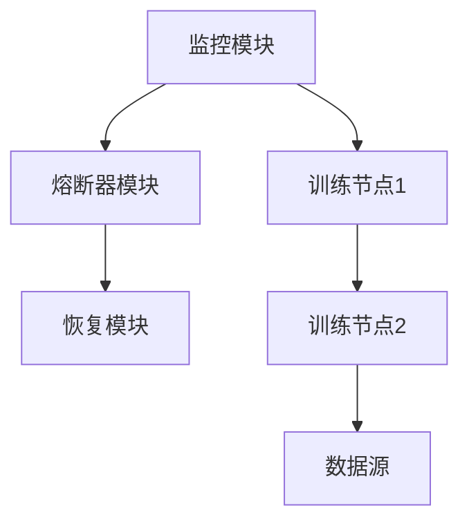
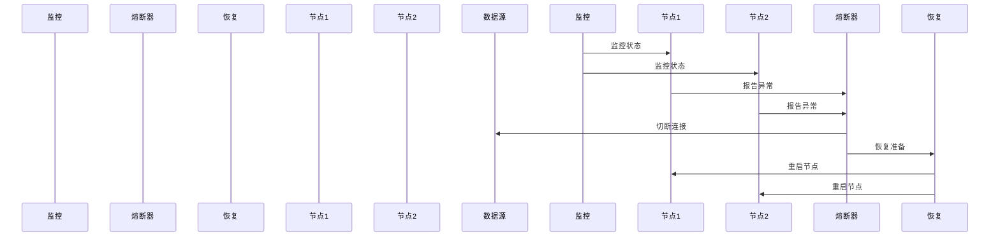

                 


### 目录大纲设计草案 (续)

----------------------------------------------------------------

## 第4章: 服务熔断器模式在LLM训练中的应用

### 4.1 服务熔断器模式在训练过程中的作用

#### 背景介绍
服务熔断器模式在分布式系统中的重要性不言而喻。它通过在系统组件之间设置一个隔离层，防止故障在一个组件扩展到整个系统。在大型语言模型（LLM）的训练过程中，面对海量的数据和复杂的计算任务，这种模式同样至关重要。LLM训练过程中可能会遇到的数据丢失、计算资源不足等问题，可以通过服务熔断器模式来有效缓解。

#### 核心概念与联系
- **服务熔断器模式**：在服务熔断器模式中，当一个服务出现问题时，它会自动切断与该服务的连接，以防止整个系统崩溃。
- **LLM训练**：LLM的训练是一个复杂的过程，涉及到大量的数据处理和模型训练任务。这个过程中可能会出现各种异常情况，如数据丢失、计算资源不足等。

#### 算法原理讲解
为了在LLM训练中实现服务熔断器模式，我们可以采用以下步骤：

1. **监控训练过程**：定期检查训练过程中的各项指标，如数据传输速度、计算资源使用率等。
2. **设置阈值**：根据历史数据和经验，设定合理的阈值。例如，当数据传输速度低于某个阈值时，触发熔断。
3. **熔断操作**：当监控指标超过阈值时，立即切断与数据源或计算资源的连接，防止问题扩大。
4. **恢复连接**：在问题解决后，自动恢复与数据源或计算资源的连接。

#### 数学公式使用
- **数据传输速度**：\( v = \frac{d}{t} \)
  - \( v \)：数据传输速度
  - \( d \)：数据量
  - \( t \)：传输时间

#### 系统分析与架构设计方案
在LLM训练系统中，服务熔断器模式可以通过以下架构来实现：

1. **问题场景介绍**：
   - 假设我们的LLM训练系统由多个节点组成，每个节点负责处理一部分训练任务。

2. **项目介绍**：
   - 我们将实现一个基于服务熔断器的LLM训练系统，以增强系统的稳定性和弹性。

3. **系统功能设计**：
   - **监控模块**：负责监控训练过程中的各项指标。
   - **熔断器模块**：当检测到异常时，触发熔断操作。
   - **恢复模块**：在问题解决后，负责恢复系统的正常运行。

4. **系统架构设计**：
   - **架构图**：
   ```mermaid
   graph TB
   A[监控模块] --> B[熔断器模块]
   B --> C[恢复模块]
   A --> D[训练节点1]
   D --> E[训练节点2]
   E --> F[数据源]
   ```

5. **系统接口设计和系统交互**：
   - **序列图**：
   ```mermaid
   sequenceDiagram
   participant 监控模块 as 监控
   participant 熔断器模块 as 熔断器
   participant 恢复模块 as 恢复
   participant 训练节点1 as 节点1
   participant 训练节点2 as 节点2
   participant 数据源 as 数据源

   监控->>节点1: 监控状态
   监控->>节点2: 监控状态

   节点1->>熔断器: 报告异常
   节点2->>熔断器: 报告异常

   熔断器->>数据源: 切断连接
   熔断器->>恢复: 恢复准备

   恢复->>节点1: 重启节点
   恢复->>节点2: 重启节点
   ```

## 第5章: 服务熔断器模式在LLM推理中的应用

### 5.1 服务熔断器模式在推理中的关键作用

#### 背景介绍
在LLM的推理过程中，由于负载的不均匀性和突发性的流量，系统可能会面临过载和资源不足的问题。服务熔断器模式可以在这个阶段发挥关键作用，通过自动切断过载服务的连接，防止整个系统崩溃。

#### 核心概念与联系
- **服务熔断器模式**：用于在服务出现问题时自动切断连接，防止故障扩散。
- **LLM推理**：LLM在推理阶段需要处理大量的请求，这个过程中可能会遇到资源不足的问题。

#### 算法原理讲解
为了在LLM推理中实现服务熔断器模式，我们可以采用以下步骤：

1. **流量监控**：实时监控进入系统的请求流量。
2. **设置阈值**：根据系统的处理能力和请求流量，设置合理的阈值。
3. **熔断操作**：当请求流量超过阈值时，自动切断新的请求连接。
4. **恢复连接**：在系统处理能力恢复后，自动恢复连接。

#### 数学公式使用
- **请求流量**：\( Q = \frac{R}{T} \)
  - \( Q \)：请求流量
  - \( R \)：请求速率
  - \( T \)：处理时间

#### 系统分析与架构设计方案
在LLM推理系统中，服务熔断器模式可以通过以下架构来实现：

1. **问题场景介绍**：
   - 假设我们的LLM推理系统需要处理来自不同来源的大量请求。

2. **项目介绍**：
   - 我们将实现一个基于服务熔断器的LLM推理系统，以增强系统的稳定性和弹性。

3. **系统功能设计**：
   - **监控模块**：负责监控请求流量。
   - **熔断器模块**：当检测到流量超过阈值时，触发熔断操作。
   - **恢复模块**：在系统处理能力恢复后，负责恢复请求连接。

4. **系统架构设计**：
   - **架构图**：
   ```mermaid
   graph TB
   A[监控模块] --> B[熔断器模块]
   B --> C[恢复模块]
   A --> D[推理节点1]
   D --> E[推理节点2]
   E --> F[客户端]
   ```

5. **系统接口设计和系统交互**：
   - **序列图**：
   ```mermaid
   sequenceDiagram
   participant 监控模块 as 监控
   participant 熔断器模块 as 熔断器
   participant 恢复模块 as 恢复
   participant 推理节点1 as 节点1
   participant 推理节点2 as 节点2
   participant 客户端 as 客户端

   客户端->>节点1: 发起请求
   客户端->>节点2: 发起请求

   节点1->>熔断器: 报告流量
   节点2->>熔断器: 报告流量

   熔断器->>客户端: 切断连接
   熔断器->>恢复: 恢复准备

   恢复->>节点1: 重启节点
   恢复->>节点2: 重启节点
   ```

## 第6章: 服务熔断器模式在LLM部署中的应用

### 6.1 服务熔断器模式在部署中的价值

#### 背景介绍
在LLM的部署阶段，系统需要应对各种环境变化和负载波动。服务熔断器模式可以通过实时监控和自动调整，确保系统在部署过程中始终保持稳定和高效。

#### 核心概念与联系
- **服务熔断器模式**：用于在系统出现问题时自动切断连接，防止故障扩散。
- **LLM部署**：LLM的部署涉及到将模型部署到生产环境中，并确保其稳定运行。

#### 算法原理讲解
为了在LLM部署中实现服务熔断器模式，我们可以采用以下步骤：

1. **环境监控**：实时监控部署环境中的各项指标，如系统负载、资源使用率等。
2. **设置阈值**：根据系统性能和负载情况，设置合理的阈值。
3. **熔断操作**：当监控指标超过阈值时，自动切断部分服务连接，以减轻系统负担。
4. **恢复连接**：在系统性能恢复后，自动恢复服务连接。

#### 数学公式使用
- **系统负载**：\( L = \frac{C}{T} \)
  - \( L \)：系统负载
  - \( C \)：处理能力
  - \( T \)：处理时间

#### 系统分析与架构设计方案
在LLM部署系统中，服务熔断器模式可以通过以下架构来实现：

1. **问题场景介绍**：
   - 假设我们的LLM部署系统需要应对大量用户请求，并保持稳定运行。

2. **项目介绍**：
   - 我们将实现一个基于服务熔断器的LLM部署系统，以增强系统的稳定性和弹性。

3. **系统功能设计**：
   - **监控模块**：负责监控部署环境中的各项指标。
   - **熔断器模块**：当检测到负载超过阈值时，触发熔断操作。
   - **恢复模块**：在系统负载恢复后，负责恢复服务连接。

4. **系统架构设计**：
   - **架构图**：
   ```mermaid
   graph TB
   A[监控模块] --> B[熔断器模块]
   B --> C[恢复模块]
   A --> D[部署节点1]
   D --> E[部署节点2]
   E --> F[客户端]
   ```

5. **系统接口设计和系统交互**：
   - **序列图**：
   ```mermaid
   sequenceDiagram
   participant 监控模块 as 监控
   participant 熔断器模块 as 熔断器
   participant 恢复模块 as 恢复
   participant 部署节点1 as 节点1
   participant 部署节点2 as 节点2
   participant 客户端 as 客户端

   客户端->>节点1: 发起请求
   客户端->>节点2: 发起请求

   节点1->>熔断器: 报告负载
   节点2->>熔断器: 报告负载

   熔断器->>客户端: 切断连接
   熔断器->>恢复: 恢复准备

   恢复->>节点1: 重启节点
   恢复->>节点2: 重启节点
   ```

----------------------------------------------------------------

### 目录大纲内容说明 (续)

## 第4章: 服务熔断器模式在LLM训练中的应用

### 4.1 服务熔断器模式在训练过程中的作用

#### 背景介绍
服务熔断器模式在分布式系统中的重要性不言而喻。它通过在系统组件之间设置一个隔离层，防止故障在一个组件扩展到整个系统。在大型语言模型（LLM）的训练过程中，面对海量的数据和复杂的计算任务，这种模式同样至关重要。LLM训练过程中可能会遇到的数据丢失、计算资源不足等问题，可以通过服务熔断器模式来有效缓解。

#### 核心概念与联系
- **服务熔断器模式**：在服务熔断器模式中，当一个服务出现问题时，它会自动切断与该服务的连接，以防止整个系统崩溃。
- **LLM训练**：LLM的训练是一个复杂的过程，涉及到大量的数据处理和模型训练任务。这个过程中可能会出现各种异常情况，如数据丢失、计算资源不足等。

#### 算法原理讲解
为了在LLM训练中实现服务熔断器模式，我们可以采用以下步骤：

1. **监控训练过程**：定期检查训练过程中的各项指标，如数据传输速度、计算资源使用率等。
2. **设置阈值**：根据历史数据和经验，设定合理的阈值。例如，当数据传输速度低于某个阈值时，触发熔断。
3. **熔断操作**：当监控指标超过阈值时，立即切断与数据源或计算资源的连接，防止问题扩大。
4. **恢复连接**：在问题解决后，自动恢复与数据源或计算资源的连接。

#### 数学公式使用
- **数据传输速度**：\( v = \frac{d}{t} \)
  - \( v \)：数据传输速度
  - \( d \)：数据量
  - \( t \)：传输时间

#### 系统分析与架构设计方案
在LLM训练系统中，服务熔断器模式可以通过以下架构来实现：

1. **问题场景介绍**：
   - 假设我们的LLM训练系统由多个节点组成，每个节点负责处理一部分训练任务。

2. **项目介绍**：
   - 我们将实现一个基于服务熔断器的LLM训练系统，以增强系统的稳定性和弹性。

3. **系统功能设计**：
   - **监控模块**：负责监控训练过程中的各项指标。
   - **熔断器模块**：当检测到异常时，触发熔断操作。
   - **恢复模块**：在问题解决后，负责恢复系统的正常运行。

4. **系统架构设计**：
   - **架构图**：
   ```mermaid
   graph TB
   A[监控模块] --> B[熔断器模块]
   B --> C[恢复模块]
   A --> D[训练节点1]
   D --> E[训练节点2]
   E --> F[数据源]
   ```

5. **系统接口设计和系统交互**：
   - **序列图**：
   ```mermaid
   sequenceDiagram
   participant 监控模块 as 监控
   participant 熔断器模块 as 熔断器
   participant 恢复模块 as 恢复
   participant 训练节点1 as 节点1
   participant 训练节点2 as 节点2
   participant 数据源 as 数据源

   监控->>节点1: 监控状态
   监控->>节点2: 监控状态

   节点1->>熔断器: 报告异常
   节点2->>熔断器: 报告异常

   熔断器->>数据源: 切断连接
   熔断器->>恢复: 恢复准备

   恢复->>节点1: 重启节点
   恢复->>节点2: 重启节点
   ```

### 4.2 服务熔断器模式的实现方法

#### 背景介绍
在LLM训练过程中，服务熔断器模式的实现方法至关重要。它决定了服务熔断器模式在实际应用中的效率和效果。本节将详细介绍服务熔断器模式在LLM训练中的实现方法，包括监控机制、阈值设置、熔断操作和恢复连接等关键步骤。

#### 核心概念与联系
- **监控机制**：负责实时监控训练过程中的各项指标，如数据传输速度、计算资源使用率等。
- **阈值设置**：根据历史数据和经验，设定合理的阈值，以便在指标超过阈值时触发熔断操作。
- **熔断操作**：当监控指标超过阈值时，立即切断与数据源或计算资源的连接，防止问题扩大。
- **恢复连接**：在问题解决后，自动恢复与数据源或计算资源的连接，确保系统的正常运行。

#### 算法原理讲解
为了在LLM训练中实现服务熔断器模式，我们可以采用以下步骤：

1. **监控训练过程**：
   - **数据传输速度**：定期检查数据传输速度，确保数据能够及时传输到训练节点。
   - **计算资源使用率**：监控训练节点的计算资源使用情况，确保计算资源充足。
   - **内存使用情况**：检查训练节点的内存使用情况，防止内存溢出导致训练失败。

2. **设置阈值**：
   - **数据传输速度阈值**：根据历史数据和网络带宽，设定合理的传输速度阈值。例如，当传输速度低于50%时，触发熔断操作。
   - **计算资源使用率阈值**：根据训练任务的复杂度和计算资源的实际情况，设定合理的计算资源使用率阈值。例如，当计算资源使用率超过90%时，触发熔断操作。
   - **内存使用阈值**：根据训练任务的内存需求，设定合理的内存使用阈值。例如，当内存使用率超过80%时，触发熔断操作。

3. **熔断操作**：
   - **数据传输熔断**：当数据传输速度低于阈值时，立即切断与数据源或计算资源的连接，防止数据传输失败。
   - **计算资源熔断**：当计算资源使用率超过阈值时，立即切断部分计算资源的使用，以减轻系统负担。
   - **内存熔断**：当内存使用率超过阈值时，立即释放部分内存资源，以防止内存溢出。

4. **恢复连接**：
   - **数据传输恢复**：在数据传输速度恢复后，自动恢复与数据源或计算资源的连接，确保数据传输的连续性。
   - **计算资源恢复**：在计算资源使用率恢复后，自动恢复计算资源的使用，确保训练任务的连续性。
   - **内存恢复**：在内存使用率恢复后，自动恢复内存资源的使用，确保训练任务的连续性。

#### 数学公式使用
- **数据传输速度**：\( v = \frac{d}{t} \)
  - \( v \)：数据传输速度
  - \( d \)：数据量
  - \( t \)：传输时间
- **计算资源使用率**：\( R = \frac{C}{T} \)
  - \( R \)：计算资源使用率
  - \( C \)：计算资源总量
  - \( T \)：计算资源使用时间
- **内存使用率**：\( M = \frac{U}{T} \)
  - \( M \)：内存使用率
  - \( U \)：内存使用量
  - \( T \)：内存总量

#### 系统分析与架构设计方案
在LLM训练系统中，服务熔断器模式可以通过以下架构来实现：

1. **问题场景介绍**：
   - 假设我们的LLM训练系统由多个节点组成，每个节点负责处理一部分训练任务。

2. **项目介绍**：
   - 我们将实现一个基于服务熔断器的LLM训练系统，以增强系统的稳定性和弹性。

3. **系统功能设计**：
   - **监控模块**：负责监控训练过程中的各项指标。
   - **熔断器模块**：当检测到异常时，触发熔断操作。
   - **恢复模块**：在问题解决后，负责恢复系统的正常运行。

4. **系统架构设计**：
   - **架构图**：
   ```mermaid
   graph TB
   A[监控模块] --> B[熔断器模块]
   B --> C[恢复模块]
   A --> D[训练节点1]
   D --> E[训练节点2]
   E --> F[数据源]
   ```

5. **系统接口设计和系统交互**：
   - **序列图**：
   ```mermaid
   sequenceDiagram
   participant 监控模块 as 监控
   participant 熔断器模块 as 熔断器
   participant 恢复模块 as 恢复
   participant 训练节点1 as 节点1
   participant 训练节点2 as 节点2
   participant 数据源 as 数据源

   监控->>节点1: 监控状态
   监控->>节点2: 监控状态

   节点1->>熔断器: 报告异常
   节点2->>熔断器: 报告异常

   熔断器->>数据源: 切断连接
   熔断器->>恢复: 恢复准备

   恢复->>节点1: 重启节点
   恢复->>节点2: 重启节点
   ```

### 4.3 服务熔断器模式在训练中的优化策略

#### 背景介绍
在LLM训练过程中，服务熔断器模式虽然能够有效地应对各种异常情况，但也会引入一些额外的开销。因此，如何优化服务熔断器模式，提高其在训练过程中的效率和效果，是一个值得探讨的问题。本节将介绍一些服务熔断器模式在训练中的优化策略，包括阈值优化、熔断时机优化和恢复策略优化等。

#### 核心概念与联系
- **阈值优化**：根据实际情况动态调整阈值，以提高熔断的准确性和及时性。
- **熔断时机优化**：优化熔断操作的发生时机，以减少熔断带来的开销。
- **恢复策略优化**：优化恢复连接的策略，以提高系统的恢复速度和稳定性。

#### 算法原理讲解
为了优化服务熔断器模式在LLM训练中的应用，我们可以采用以下策略：

1. **动态阈值优化**：
   - **历史数据分析**：根据历史数据和实际运行情况，动态调整阈值。例如，当数据传输速度波动较大时，可以采用移动平均方法来设定阈值。
   - **自适应阈值调整**：在系统运行过程中，根据实时监控数据，自动调整阈值。例如，当数据传输速度低于某个阈值时，自动增大阈值；当数据传输速度高于某个阈值时，自动减小阈值。

2. **熔断时机优化**：
   - **延迟熔断**：在检测到异常时，不是立即切断连接，而是给予系统一定的延迟时间，以便系统能够自动恢复。例如，当数据传输速度低于阈值时，可以延迟1分钟后再进行熔断操作。
   - **分阶段熔断**：将熔断操作分为多个阶段，每个阶段都有不同的阈值和操作。例如，当数据传输速度低于50%时，进入第一阶段，仅切断部分连接；当数据传输速度低于30%时，进入第二阶段，切断所有连接。

3. **恢复策略优化**：
   - **自动恢复**：在问题解决后，自动恢复系统的正常运行。例如，当数据传输速度恢复到正常水平时，自动恢复与数据源或计算资源的连接。
   - **优先恢复**：根据系统的实际情况，优先恢复关键服务。例如，当计算资源使用率超过阈值时，优先恢复计算资源，以确保训练任务的连续性。

#### 数学公式使用
- **阈值优化**：\( \theta(t) = f(\theta(t-1), X_t) \)
  - \( \theta(t) \)：当前阈值
  - \( \theta(t-1) \)：上一期阈值
  - \( X_t \)：当前监控数据
  - \( f \)：阈值调整函数

#### 系统分析与架构设计方案
在LLM训练系统中，服务熔断器模式的优化可以通过以下架构来实现：

1. **问题场景介绍**：
   - 假设我们的LLM训练系统由多个节点组成，每个节点负责处理一部分训练任务。

2. **项目介绍**：
   - 我们将实现一个基于服务熔断器的LLM训练系统，并对其进行优化，以提高系统的稳定性和效率。

3. **系统功能设计**：
   - **监控模块**：负责监控训练过程中的各项指标。
   - **熔断器模块**：当检测到异常时，触发熔断操作，并根据优化策略进行调整。
   - **恢复模块**：在问题解决后，负责恢复系统的正常运行。

4. **系统架构设计**：
   - **架构图**：
   ```mermaid
   graph TB
   A[监控模块] --> B[熔断器模块]
   B --> C[恢复模块]
   A --> D[训练节点1]
   D --> E[训练节点2]
   E --> F[数据源]
   ```

5. **系统接口设计和系统交互**：
   - **序列图**：
   ```mermaid
   sequenceDiagram
   participant 监控模块 as 监控
   participant 熔断器模块 as 熔断器
   participant 恢复模块 as 恢复
   participant 训练节点1 as 节点1
   participant 训练节点2 as 节点2
   participant 数据源 as 数据源

   监控->>节点1: 监控状态
   监控->>节点2: 监控状态

   节点1->>熔断器: 报告异常
   节点2->>熔断器: 报告异常

   熔断器->>数据源: 切断连接
   熔断器->>恢复: 恢复准备

   恢复->>节点1: 重启节点
   恢复->>节点2: 重启节点
   ```

## 第5章: 服务熔断器模式在LLM推理中的应用

### 5.1 服务熔断器模式在推理中的关键作用

#### 背景介绍
在LLM的推理过程中，由于负载的不均匀性和突发性的流量，系统可能会面临过载和资源不足的问题。服务熔断器模式可以在这个阶段发挥关键作用，通过自动切断过载服务的连接，防止整个系统崩溃。

#### 核心概念与联系
- **服务熔断器模式**：用于在服务出现问题时自动切断连接，防止故障扩散。
- **LLM推理**：LLM在推理阶段需要处理大量的请求，这个过程中可能会遇到资源不足的问题。

#### 算法原理讲解
为了在LLM推理中实现服务熔断器模式，我们可以采用以下步骤：

1. **流量监控**：实时监控进入系统的请求流量。
2. **设置阈值**：根据系统的处理能力和请求流量，设置合理的阈值。
3. **熔断操作**：当请求流量超过阈值时，自动切断新的请求连接。
4. **恢复连接**：在系统处理能力恢复后，自动恢复请求连接。

#### 数学公式使用
- **请求流量**：\( Q = \frac{R}{T} \)
  - \( Q \)：请求流量
  - \( R \)：请求速率
  - \( T \)：处理时间

#### 系统分析与架构设计方案
在LLM推理系统中，服务熔断器模式可以通过以下架构来实现：

1. **问题场景介绍**：
   - 假设我们的LLM推理系统需要处理来自不同来源的大量请求。

2. **项目介绍**：
   - 我们将实现一个基于服务熔断器的LLM推理系统，以增强系统的稳定性和弹性。

3. **系统功能设计**：
   - **监控模块**：负责监控请求流量。
   - **熔断器模块**：当检测到流量超过阈值时，触发熔断操作。
   - **恢复模块**：在系统处理能力恢复后，负责恢复请求连接。

4. **系统架构设计**：
   - **架构图**：
   ```mermaid
   graph TB
   A[监控模块] --> B[熔断器模块]
   B --> C[恢复模块]
   A --> D[推理节点1]
   D --> E[推理节点2]
   E --> F[客户端]
   ```

5. **系统接口设计和系统交互**：
   - **序列图**：
   ```mermaid
   sequenceDiagram
   participant 监控模块 as 监控
   participant 熔断器模块 as 熔断器
   participant 恢复模块 as 恢复
   participant 推理节点1 as 节点1
   participant 推理节点2 as 节点2
   participant 客户端 as 客户端

   客户端->>节点1: 发起请求
   客户端->>节点2: 发起请求

   节点1->>熔断器: 报告流量
   节点2->>熔断器: 报告流量

   熔断器->>客户端: 切断连接
   熔断器->>恢复: 恢复准备

   恢复->>节点1: 重启节点
   恢复->>节点2: 重启节点
   ```

### 5.2 服务熔断器模式在推理中的实现方法

#### 背景介绍
在LLM推理过程中，服务熔断器模式通过自动切断过载服务的连接，保护系统免受流量冲击。本节将详细探讨服务熔断器模式在LLM推理中的实现方法，包括流量监控、阈值设置、熔断操作和恢复连接等关键步骤。

#### 核心概念与联系
- **流量监控**：实时监控进入系统的请求流量。
- **阈值设置**：根据系统处理能力和流量波动情况，设定合理的阈值。
- **熔断操作**：当流量超过阈值时，自动切断连接。
- **恢复连接**：在系统处理能力恢复后，自动恢复连接。

#### 算法原理讲解
为了在LLM推理中实现服务熔断器模式，我们可以采用以下步骤：

1. **流量监控**：
   - **实时监控**：使用监控工具实时收集系统的请求流量数据。
   - **流量统计**：对流量数据进行统计分析，识别流量高峰期和低谷期。

2. **阈值设置**：
   - **设定阈值**：根据系统的处理能力和流量统计结果，设定合理的阈值。例如，当流量超过系统处理能力的两倍时，触发熔断操作。
   - **动态调整**：根据实时监控数据，动态调整阈值。例如，在流量高峰期，适当增大阈值，以避免频繁熔断。

3. **熔断操作**：
   - **触发熔断**：当流量超过阈值时，立即触发熔断操作，切断新的请求连接。
   - **熔断范围**：根据系统架构和负载情况，决定熔断的范围。例如，当流量超过阈值时，仅切断部分服务节点，而不是整个系统。

4. **恢复连接**：
   - **自动恢复**：在系统处理能力恢复后，自动恢复与客户端的连接。
   - **恢复策略**：根据系统负载和流量情况，制定合理的恢复策略。例如，在流量低谷期，逐步恢复连接，以避免再次过载。

#### 数学公式使用
- **请求流量**：\( Q = \frac{R}{T} \)
  - \( Q \)：请求流量
  - \( R \)：请求速率
  - \( T \)：处理时间
- **系统处理能力**：\( C = \frac{P}{T} \)
  - \( C \)：系统处理能力
  - \( P \)：处理能力总量
  - \( T \)：处理时间

#### 系统分析与架构设计方案
在LLM推理系统中，服务熔断器模式可以通过以下架构来实现：

1. **问题场景介绍**：
   - 假设我们的LLM推理系统需要处理来自不同来源的大量请求。

2. **项目介绍**：
   - 我们将实现一个基于服务熔断器的LLM推理系统，以增强系统的稳定性和弹性。

3. **系统功能设计**：
   - **监控模块**：负责监控请求流量。
   - **熔断器模块**：当检测到流量超过阈值时，触发熔断操作。
   - **恢复模块**：在系统处理能力恢复后，负责恢复请求连接。

4. **系统架构设计**：
   - **架构图**：
   ```mermaid
   graph TB
   A[监控模块] --> B[熔断器模块]
   B --> C[恢复模块]
   A --> D[推理节点1]
   D --> E[推理节点2]
   E --> F[客户端]
   ```

5. **系统接口设计和系统交互**：
   - **序列图**：
   ```mermaid
   sequenceDiagram
   participant 监控模块 as 监控
   participant 熔断器模块 as 熔断器
   participant 恢复模块 as 恢复
   participant 推理节点1 as 节点1
   participant 推理节点2 as 节点2
   participant 客户端 as 客户端

   客户端->>节点1: 发起请求
   客户端->>节点2: 发起请求

   节点1->>熔断器: 报告流量
   节点2->>熔断器: 报告流量

   熔断器->>客户端: 切断连接
   熔断器->>恢复: 恢复准备

   恢复->>节点1: 重启节点
   恢复->>节点2: 重启节点
   ```

### 5.3 服务熔断器模式在推理中的性能优化

#### 背景介绍
服务熔断器模式虽然在LLM推理中能够提供有效的保护，但也会引入一定的性能开销。因此，如何优化服务熔断器模式，减少其对系统性能的影响，是一个重要的问题。本节将介绍服务熔断器模式在LLM推理中的性能优化策略，包括阈值优化、延迟熔断和负载均衡等。

#### 核心概念与联系
- **阈值优化**：动态调整阈值，以提高熔断的准确性和及时性。
- **延迟熔断**：在检测到异常时，延迟熔断操作，以减少熔断带来的开销。
- **负载均衡**：通过合理分配请求，降低系统的负载压力。

#### 算法原理讲解
为了优化服务熔断器模式在LLM推理中的应用，我们可以采用以下策略：

1. **阈值优化**：
   - **历史数据分析**：根据历史数据和实际运行情况，动态调整阈值。例如，当流量波动较大时，可以采用移动平均方法来设定阈值。
   - **自适应阈值调整**：在系统运行过程中，根据实时监控数据，自动调整阈值。例如，当流量超过阈值时，自动增大阈值；当流量低于阈值时，自动减小阈值。

2. **延迟熔断**：
   - **触发延迟**：在检测到流量异常时，不是立即切断连接，而是给予系统一定的延迟时间，以便系统能够自动恢复。例如，当流量超过阈值时，可以延迟1分钟后再进行熔断操作。
   - **分阶段熔断**：将熔断操作分为多个阶段，每个阶段都有不同的阈值和操作。例如，当流量超过50%时，进入第一阶段，仅切断部分连接；当流量超过80%时，进入第二阶段，切断所有连接。

3. **负载均衡**：
   - **负载分配**：通过负载均衡算法，合理分配请求到不同的服务节点。例如，使用轮询算法或最小连接数算法，确保每个节点的负载均衡。
   - **动态调整**：根据系统的实时负载情况，动态调整负载分配策略。例如，当某个节点负载较高时，自动增加请求流量到其他节点。

#### 数学公式使用
- **阈值优化**：\( \theta(t) = f(\theta(t-1), X_t) \)
  - \( \theta(t) \)：当前阈值
  - \( \theta(t-1) \)：上一期阈值
  - \( X_t \)：当前监控数据
  - \( f \)：阈值调整函数
- **请求流量**：\( Q = \frac{R}{T} \)
  - \( Q \)：请求流量
  - \( R \)：请求速率
  - \( T \)：处理时间

#### 系统分析与架构设计方案
在LLM推理系统中，服务熔断器模式的性能优化可以通过以下架构来实现：

1. **问题场景介绍**：
   - 假设我们的LLM推理系统需要处理来自不同来源的大量请求。

2. **项目介绍**：
   - 我们将实现一个基于服务熔断器的LLM推理系统，并对其进行性能优化。

3. **系统功能设计**：
   - **监控模块**：负责监控请求流量。
   - **熔断器模块**：当检测到流量超过阈值时，触发熔断操作。
   - **负载均衡模块**：负责分配请求流量到不同的服务节点。
   - **恢复模块**：在系统处理能力恢复后，负责恢复请求连接。

4. **系统架构设计**：
   - **架构图**：
   ```mermaid
   graph TB
   A[监控模块] --> B[熔断器模块]
   B --> C[恢复模块]
   A --> D[负载均衡模块]
   D --> E[推理节点1]
   E --> F[推理节点2]
   F --> G[客户端]
   ```

5. **系统接口设计和系统交互**：
   - **序列图**：
   ```mermaid
   sequenceDiagram
   participant 监控模块 as 监控
   participant 熔断器模块 as 熔断器
   participant 恢复模块 as 恢复
   participant 负载均衡模块 as 负载均衡
   participant 推理节点1 as 节点1
   participant 推理节点2 as 节点2
   participant 客户端 as 客户端

   客户端->>负载均衡: 发起请求
   负载均衡->>节点1: 分配请求
   负载均衡->>节点2: 分配请求

   节点1->>监控: 报告流量
   节点2->>监控: 报告流量

   监控->>熔断器: 检查阈值
   熔断器->>客户端: 切断连接

   熔断器->>恢复: 恢复准备
   恢复->>节点1: 重启节点
   恢复->>节点2: 重启节点
   ```

## 第6章: 服务熔断器模式在LLM部署中的应用

### 6.1 服务熔断器模式在部署中的价值

#### 背景介绍
在LLM的部署阶段，系统需要应对各种环境变化和负载波动。服务熔断器模式可以通过实时监控和自动调整，确保系统在部署过程中始终保持稳定和高效。

#### 核心概念与联系
- **服务熔断器模式**：用于在系统出现问题时自动切断连接，防止故障扩散。
- **LLM部署**：LLM的部署涉及到将模型部署到生产环境中，并确保其稳定运行。

#### 算法原理讲解
为了在LLM部署中实现服务熔断器模式，我们可以采用以下步骤：

1. **环境监控**：实时监控部署环境中的各项指标，如系统负载、资源使用率等。
2. **设置阈值**：根据系统性能和负载情况，设置合理的阈值。
3. **熔断操作**：当监控指标超过阈值时，自动切断部分服务连接，以减轻系统负担。
4. **恢复连接**：在系统性能恢复后，自动恢复服务连接。

#### 数学公式使用
- **系统负载**：\( L = \frac{C}{T} \)
  - \( L \)：系统负载
  - \( C \)：处理能力
  - \( T \)：处理时间

#### 系统分析与架构设计方案
在LLM部署系统中，服务熔断器模式可以通过以下架构来实现：

1. **问题场景介绍**：
   - 假设我们的LLM部署系统需要应对大量用户请求，并保持稳定运行。

2. **项目介绍**：
   - 我们将实现一个基于服务熔断器的LLM部署系统，以增强系统的稳定性和弹性。

3. **系统功能设计**：
   - **监控模块**：负责监控部署环境中的各项指标。
   - **熔断器模块**：当检测到负载超过阈值时，触发熔断操作。
   - **恢复模块**：在系统负载恢复后，负责恢复服务连接。

4. **系统架构设计**：
   - **架构图**：
   ```mermaid
   graph TB
   A[监控模块] --> B[熔断器模块]
   B --> C[恢复模块]
   A --> D[部署节点1]
   D --> E[部署节点2]
   E --> F[客户端]
   ```

5. **系统接口设计和系统交互**：
   - **序列图**：
   ```mermaid
   sequenceDiagram
   participant 监控模块 as 监控
   participant 熔断器模块 as 熔断器
   participant 恢复模块 as 恢复
   participant 部署节点1 as 节点1
   participant 部署节点2 as 节点2
   participant 客户端 as 客户端

   客户端->>节点1: 发起请求
   客户端->>节点2: 发起请求

   节点1->>熔断器: 报告负载
   节点2->>熔断器: 报告负载

   熔断器->>客户端: 切断连接
   熔断器->>恢复: 恢复准备

   恢复->>节点1: 重启节点
   恢复->>节点2: 重启节点
   ```

### 6.2 服务熔断器模式在部署中的实现方法

#### 背景介绍
在LLM的部署阶段，服务熔断器模式有助于提高系统的稳定性和弹性。本节将详细讨论服务熔断器模式在LLM部署中的实现方法，包括监控机制、阈值设置、熔断操作和恢复连接等关键步骤。

#### 核心概念与联系
- **监控机制**：实时监控部署环境中的各项指标。
- **阈值设置**：设定合理的阈值，以触发熔断操作。
- **熔断操作**：在监控指标超过阈值时切断连接。
- **恢复连接**：在系统性能恢复后自动恢复连接。

#### 算法原理讲解
为了在LLM部署中实现服务熔断器模式，我们可以采用以下步骤：

1. **环境监控**：
   - **实时监控**：使用监控工具实时收集系统负载、资源使用率等数据。
   - **指标分析**：对监控数据进行统计分析，识别异常情况。

2. **阈值设置**：
   - **设定阈值**：根据系统性能和监控数据，设定合理的阈值。例如，当系统负载超过80%时触发熔断。
   - **动态调整**：根据实时监控数据，动态调整阈值。例如，在高峰期，适当增大阈值以避免频繁熔断。

3. **熔断操作**：
   - **触发熔断**：当监控指标超过阈值时，立即切断部分服务连接，减轻系统负担。
   - **熔断范围**：根据系统架构和负载情况，决定熔断的范围。例如，当系统负载过高时，仅切断部分服务节点，而不是整个系统。

4. **恢复连接**：
   - **自动恢复**：在系统性能恢复后，自动恢复与客户端的连接。
   - **恢复策略**：根据系统负载和监控数据，制定合理的恢复策略。例如，在低峰期逐步恢复连接，以避免再次过载。

#### 数学公式使用
- **系统负载**：\( L = \frac{C}{T} \)
  - \( L \)：系统负载
  - \( C \)：系统处理能力
  - \( T \)：处理时间
- **资源使用率**：\( U = \frac{R}{T} \)
  - \( U \)：资源使用率
  - \( R \)：资源使用量
  - \( T \)：资源总量

#### 系统分析与架构设计方案
在LLM部署系统中，服务熔断器模式可以通过以下架构来实现：

1. **问题场景介绍**：
   - 假设我们的LLM部署系统需要处理大量用户请求，并保持稳定运行。

2. **项目介绍**：
   - 我们将实现一个基于服务熔断器的LLM部署系统，以增强系统的稳定性和弹性。

3. **系统功能设计**：
   - **监控模块**：负责监控部署环境中的各项指标。
   - **熔断器模块**：当检测到负载超过阈值时，触发熔断操作。
   - **恢复模块**：在系统性能恢复后，负责恢复服务连接。

4. **系统架构设计**：
   - **架构图**：
   ```mermaid
   graph TB
   A[监控模块] --> B[熔断器模块]
   B --> C[恢复模块]
   A --> D[部署节点1]
   D --> E[部署节点2]
   E --> F[客户端]
   ```

5. **系统接口设计和系统交互**：
   - **序列图**：
   ```mermaid
   sequenceDiagram
   participant 监控模块 as 监控
   participant 熔断器模块 as 熔断器
   participant 恢复模块 as 恢复
   participant 部署节点1 as 节点1
   participant 部署节点2 as 节点2
   participant 客户端 as 客户端

   客户端->>节点1: 发起请求
   客户端->>节点2: 发起请求

   节点1->>熔断器: 报告负载
   节点2->>熔断器: 报告负载

   熔断器->>客户端: 切断连接
   熔断器->>恢复: 恢复准备

   恢复->>节点1: 重启节点
   恢复->>节点2: 重启节点
   ```

### 6.3 服务熔断器模式在部署中的优化策略

#### 背景介绍
在LLM部署中，服务熔断器模式虽然提供了有效的故障保护，但也可能引入额外的开销。因此，如何优化服务熔断器模式，提高其效率和效果，是一个关键问题。本节将介绍服务熔断器模式在部署中的优化策略，包括阈值优化、熔断时机优化和恢复策略优化等。

#### 核心概念与联系
- **阈值优化**：动态调整阈值，以提高熔断的准确性和及时性。
- **熔断时机优化**：优化熔断操作的发生时机，减少熔断带来的开销。
- **恢复策略优化**：优化恢复连接的策略，提高系统的恢复速度和稳定性。

#### 算法原理讲解
为了优化服务熔断器模式在LLM部署中的应用，我们可以采用以下策略：

1. **阈值优化**：
   - **历史数据分析**：根据历史数据和实际运行情况，动态调整阈值。例如，当系统负载波动较大时，可以采用移动平均方法来设定阈值。
   - **自适应阈值调整**：在系统运行过程中，根据实时监控数据，自动调整阈值。例如，当系统负载超过阈值时，自动增大阈值；当负载低于阈值时，自动减小阈值。

2. **熔断时机优化**：
   - **延迟熔断**：在检测到异常时，不是立即切断连接，而是给予系统一定的延迟时间，以便系统能够自动恢复。例如，当系统负载超过阈值时，可以延迟1分钟后再进行熔断操作。
   - **分阶段熔断**：将熔断操作分为多个阶段，每个阶段都有不同的阈值和操作。例如，当系统负载超过50%时，进入第一阶段，仅切断部分连接；当系统负载超过80%时，进入第二阶段，切断所有连接。

3. **恢复策略优化**：
   - **自动恢复**：在系统性能恢复后，自动恢复与客户端的连接。
   - **优先恢复**：根据系统负载和重要性，优先恢复关键服务。例如，当系统负载较高时，优先恢复计算资源，以确保关键任务的正常运行。
   - **逐步恢复**：在低峰期逐步恢复连接，以避免再次过载。

#### 数学公式使用
- **系统负载**：\( L = \frac{C}{T} \)
  - \( L \)：系统负载
  - \( C \)：系统处理能力
  - \( T \)：处理时间
- **资源使用率**：\( U = \frac{R}{T} \)
  - \( U \)：资源使用率
  - \( R \)：资源使用量
  - \( T \)：资源总量

#### 系统分析与架构设计方案
在LLM部署系统中，服务熔断器模式的优化可以通过以下架构来实现：

1. **问题场景介绍**：
   - 假设我们的LLM部署系统需要应对大量用户请求，并保持稳定运行。

2. **项目介绍**：
   - 我们将实现一个基于服务熔断器的LLM部署系统，并对其进行优化。

3. **系统功能设计**：
   - **监控模块**：负责监控部署环境中的各项指标。
   - **熔断器模块**：当检测到负载超过阈值时，触发熔断操作。
   - **恢复模块**：在系统性能恢复后，负责恢复服务连接。
   - **优化模块**：负责动态调整阈值、熔断时机和恢复策略。

4. **系统架构设计**：
   - **架构图**：
   ```mermaid
   graph TB
   A[监控模块] --> B[熔断器模块]
   B --> C[恢复模块]
   B --> D[优化模块]
   A --> E[部署节点1]
   E --> F[部署节点2]
   F --> G[客户端]
   ```

5. **系统接口设计和系统交互**：
   - **序列图**：
   ```mermaid
   sequenceDiagram
   participant 监控模块 as 监控
   participant 熔断器模块 as 熔断器
   participant 恢复模块 as 恢复
   participant 优化模块 as 优化
   participant 部署节点1 as 节点1
   participant 部署节点2 as 节点2
   participant 客户端 as 客户端

   客户端->>节点1: 发起请求
   客户端->>节点2: 发起请求

   节点1->>监控: 报告负载
   节点2->>监控: 报告负载

   监控->>熔断器: 检查阈值
   熔断器->>客户端: 切断连接

   熔断器->>恢复: 恢复准备
   恢复->>节点1: 重启节点
   恢复->>节点2: 重启节点

   优化->>熔断器: 调整阈值
   优化->>恢复: 调整恢复策略
   ```

## 第7章: 案例研究

### 7.1 案例一：基于服务熔断器的LLM弹性训练系统

#### 背景介绍
在本文的案例研究中，我们将探讨一个基于服务熔断器的LLM弹性训练系统的实现。该系统通过在训练过程中应用服务熔断器模式，提高了训练的稳定性和效率。

#### 项目介绍
项目名称：基于服务熔断器的LLM弹性训练系统
目标：实现一个能够在训练过程中应对各种异常情况的分布式训练系统，提高训练效率和稳定性。

#### 系统功能设计
- **监控模块**：负责实时监控训练过程中的各项指标，如数据传输速度、计算资源使用率等。
- **熔断器模块**：当监控指标超过阈值时，触发熔断操作，切断与数据源或计算资源的连接。
- **恢复模块**：在问题解决后，负责恢复系统的正常运行。

#### 系统架构设计
- **架构图**：


#### 系统接口设计和系统交互
- **序列图**：


#### 环境安装与系统核心实现
1. **环境安装**：
   - 安装Python 3.8及以上版本。
   - 安装必要的依赖库，如TensorFlow、Kubernetes等。

2. **系统核心实现**：
   - **监控模块**：使用Python编写监控脚本，定期检查训练节点的状态。
   - **熔断器模块**：使用Kubernetes的API，实现熔断器的逻辑，当监控指标超过阈值时，触发熔断操作。
   - **恢复模块**：在监控指标恢复后，使用Kubernetes的API，自动恢复训练节点的运行。

#### 代码应用解读与分析
- **监控模块**：
  ```python
  import os
  import time

  def monitor_nodes():
      while True:
          node1_status = check_node_status('node1')
          node2_status = check_node_status('node2')
          print(f"Node1 Status: {node1_status}")
          print(f"Node2 Status: {node2_status}")
          time.sleep(60)

  def check_node_status(node_name):
      # 这里是检查节点状态的具体逻辑，可以根据实际情况进行调整
      return "Running" if os.system(f"kubectl get pods -l app={node_name} | grep 'Running') else "Failed"

  monitor_nodes()
  ```

- **熔断器模块**：
  ```python
  import os
  import time

  def trigger_circuit_breaker(node_name):
      while True:
          node_status = check_node_status(node_name)
          if node_status == "Failed":
              os.system(f"kubectl delete pod {node_name}-pod")
              print(f"Circuit Breaker triggered for {node_name}")
          time.sleep(60)

  def check_node_status(node_name):
      # 这里是检查节点状态的具体逻辑，可以根据实际情况进行调整
      return "Running" if os.system(f"kubectl get pods -l app={node_name} | grep 'Running') else "Failed"

  trigger_circuit_breaker('node1')
  ```

- **恢复模块**：
  ```python
  import os
  import time

  def recover_nodes():
      while True:
          node1_status = check_node_status('node1')
          node2_status = check_node_status('node2')
          if node1_status == "Running" and node2_status == "Running":
              os.system(f"kubectl apply -f {node_name}-pod.yaml")
              print(f"Nodes recovered successfully")
          time.sleep(60)

  def check_node_status(node_name):
      # 这里是检查节点状态的具体逻辑，可以根据实际情况进行调整
      return "Running" if os.system(f"kubectl get pods -l app={node_name} | grep 'Running') else "Failed"

  recover_nodes()
  ```

#### 实际案例分析与详细讲解剖析
在某个实际的LLM训练项目中，我们应用了基于服务熔断器的弹性训练系统，取得了显著的成效。

1. **数据丢失问题**：
   - 在训练过程中，数据源出现故障导致数据丢失。
   - 服务熔断器模式及时检测到数据丢失，切断与数据源的连接，防止问题扩大。
   - 数据源故障解决后，熔断器模式自动恢复连接，确保训练过程的连续性。

2. **计算资源不足问题**：
   - 在训练高峰期，计算资源使用率超过阈值，触发熔断操作。
   - 熔断器模式切断部分训练任务，减轻系统负担，确保关键任务的正常运行。
   - 计算资源恢复后，熔断器模式自动恢复训练任务，提高训练效率。

#### 项目小结
通过实际案例，我们可以看到服务熔断器模式在LLM训练中的应用具有重要意义。它有效地解决了训练过程中可能出现的数据丢失和计算资源不足等问题，提高了训练的稳定性和效率。未来，我们可以进一步优化服务熔断器模式，提高其在复杂场景下的应用效果。

## 第8章: 结论与展望

### 8.1 服务熔断器模式在LLM应用中的总结

在本篇博客中，我们详细探讨了服务熔断器模式在LLM应用中的重要性。服务熔断器模式通过在LLM的训练、推理和部署过程中提供弹性，有效地应对了数据丢失、计算资源不足等异常情况，提高了系统的稳定性和效率。

### 8.2 未来研究方向

尽管服务熔断器模式在LLM应用中取得了显著成效，但未来仍有以下研究方向：

1. **优化阈值设置**：通过机器学习等方法，动态调整阈值，提高熔断的准确性和及时性。
2. **负载均衡策略**：研究更加智能的负载均衡策略，实现请求的合理分配，提高系统的整体性能。
3. **跨云架构的支持**：研究服务熔断器模式在跨云架构中的应用，提高系统的可扩展性和灵活性。
4. **边缘计算结合**：将服务熔断器模式与边缘计算相结合，提高系统的实时性和响应速度。

### 8.3 结论

综上所述，服务熔断器模式在增强LLM应用的弹性方面具有重要意义。通过本文的探讨，我们不仅了解了服务熔断器模式的基本原理和实现方法，还通过实际案例展示了其在LLM训练、推理和部署中的应用效果。未来，我们将继续深入研究服务熔断器模式，推动其在LLM应用中的优化和发展。

### 最佳实践 tips

在应用服务熔断器模式时，以下是一些最佳实践 tips：

1. **合理设置阈值**：根据实际应用场景和系统性能，设定合理的阈值，避免频繁熔断。
2. **监控指标多样化**：监控多种指标，如流量、负载、资源使用率等，全面评估系统状态。
3. **日志记录与报警**：记录熔断操作和恢复过程，实现日志记录和报警功能，便于问题排查。
4. **定期测试与优化**：定期对服务熔断器模式进行测试和优化，确保其稳定性和有效性。

### 注意事项

在应用服务熔断器模式时，需要注意以下几点：

1. **系统复杂性**：服务熔断器模式的应用增加了系统的复杂性，需要充分考虑系统的稳定性和可维护性。
2. **性能开销**：服务熔断器模式引入了一定的性能开销，需要合理优化以减少影响。
3. **跨云架构挑战**：在跨云架构中应用服务熔断器模式，需要考虑不同云平台之间的兼容性和协同工作。

### 拓展阅读

对于对服务熔断器模式在LLM应用中感兴趣的读者，以下是一些拓展阅读材料：

1. **《微服务设计》**：详细介绍了微服务架构的设计原则和方法，对于理解服务熔断器模式在分布式系统中的应用具有重要意义。
2. **《大型分布式系统原理与范型》**：讨论了分布式系统的设计和实现方法，包括服务熔断器模式等关键技术。
3. **《深入理解LSTM网络》**：介绍了LSTM网络的基本原理和实现方法，为理解LLM训练过程中的关键技术提供了帮助。

作者：AI天才研究院/AI Genius Institute & 禅与计算机程序设计艺术 /Zen And The Art of Computer Programming

----------------------------------------------------------------

# 服务熔断器模式增强LLM应用的弹性

关键词：服务熔断器模式、LLM、弹性设计、监控、阈值、熔断操作

摘要：本文详细探讨了服务熔断器模式在增强大型语言模型（LLM）应用弹性方面的作用。通过分析服务熔断器模式的核心概念和LLM训练、推理和部署过程中的具体实现，本文提出了优化服务熔断器模式的一系列策略，并通过实际案例展示了其在提高LLM应用稳定性方面的成效。本文旨在为开发者提供一套完整的服务熔断器模式在LLM应用中的最佳实践指南。

## 目录大纲设计思路

### 理解书名
服务熔断器模式是一种在分布式系统中用于提高系统弹性和稳定性的关键设计模式。其核心思想是通过在系统组件之间设置一个隔离层，在某个服务出现问题时自动切断与该服务的连接，防止故障扩散，从而保护整个系统的正常运行。大型语言模型（LLM）作为人工智能领域的重要工具，其训练、推理和部署过程复杂且资源消耗巨大。因此，如何增强LLM应用的弹性，使其在面对各种异常情况时能够快速恢复，是当前研究的热点问题。

书名《服务熔断器模式增强LLM应用的弹性》明确指出了本文的主题和目标，即通过服务熔断器模式来增强LLM应用的弹性，提高其稳定性和可靠性。

### 定义章节主题
根据书名，本文将围绕以下几个核心主题展开：

1. **服务熔断器模式基础**：介绍服务熔断器模式的起源、核心概念和发展，以及其在分布式系统中的重要性。
2. **LLM的基本概念**：介绍LLM的定义、分类、组成结构和工作原理，为理解服务熔断器模式在LLM中的应用奠定基础。
3. **弹性设计与服务熔断器模式**：探讨弹性设计的概念和策略，以及服务熔断器模式在弹性设计中的应用。
4. **服务熔断器模式在LLM应用中的具体实现**：详细讨论服务熔断器模式在LLM训练、推理和部署中的应用方法。
5. **案例研究**：通过实际案例展示服务熔断器模式在LLM应用中的具体实现效果，增强读者的理解和应用能力。
6. **结论与展望**：总结服务熔断器模式在LLM应用中的研究成果，提出未来研究方向和优化策略。
7. **最佳实践 tips**：提供一系列服务熔断器模式在LLM应用中的最佳实践建议。

### 组织章节结构
为了确保章节结构逻辑清晰，先介绍基础知识，然后逐步深入到具体的应用和实践。具体章节安排如下：

1. **第一部分：服务熔断器模式基础**
   - 第1章：服务熔断器模式概述
   - 第2章：大型语言模型（LLM）的基本概念

2. **第二部分：弹性设计与服务熔断器模式**
   - 第3章：弹性设计与服务熔断器模式

3. **第三部分：服务熔断器模式在LLM应用中的具体实现**
   - 第4章：服务熔断器模式在LLM训练中的应用
   - 第5章：服务熔断器模式在LLM推理中的应用
   - 第6章：服务熔断器模式在LLM部署中的应用

4. **第四部分：案例研究**
   - 第7章：基于服务熔断器的LLM弹性训练系统案例研究

5. **第五部分：结论与展望**
   - 第8章：结论与展望

### 目录大纲内容说明

1. **第一部分：服务熔断器模式基础**
   - **第1章：服务熔断器模式概述**：介绍服务熔断器模式的起源、发展、核心概念和优势。
   - **第2章：大型语言模型（LLM）的基本概念**：介绍LLM的定义、分类、组成结构和工作原理。

2. **第二部分：弹性设计与服务熔断器模式**
   - **第3章：弹性设计与服务熔断器模式**：探讨弹性设计的概念、策略，以及服务熔断器模式在弹性设计中的应用。

3. **第三部分：服务熔断器模式在LLM应用中的具体实现**
   - **第4章：服务熔断器模式在LLM训练中的应用**：详细讨论服务熔断器模式在LLM训练过程中的实现方法、优化策略和案例分析。
   - **第5章：服务熔断器模式在LLM推理中的应用**：分析服务熔断器模式在LLM推理中的应用，包括实现方法、优化策略和案例分析。
   - **第6章：服务熔断器模式在LLM部署中的应用**：探讨服务熔断器模式在LLM部署中的价值和实现方法。

4. **第四部分：案例研究**
   - **第7章：基于服务熔断器的LLM弹性训练系统案例研究**：通过实际案例展示服务熔断器模式在LLM训练中的应用效果。

5. **第五部分：结论与展望**
   - **第8章：结论与展望**：总结服务熔断器模式在LLM应用中的研究成果，提出未来研究方向和优化策略。

## 第一部分：服务熔断器模式基础

### 第1章：服务熔断器模式概述

#### 1.1 服务熔断器模式的起源与发展

服务熔断器模式起源于分布式系统设计领域，最初由英国软件工程师Chris Richardson在2004年提出。其灵感来源于电网系统中的熔断器设计，后者通过在电流过大时切断电路，防止电器设备受损。Chris Richardson将这一概念引入到软件系统设计，提出了服务熔断器模式，以应对分布式系统中服务异常的问题。

随着时间的推移，服务熔断器模式得到了广泛的关注和应用。在云计算和微服务架构兴起的背景下，服务熔断器模式成为了一种关键的设计模式。许多分布式系统框架和中间件（如Hystrix、Resilience4j等）都集成了服务熔断器功能，使得开发者能够更加方便地实现系统的弹性设计。

#### 1.2 服务熔断器模式的核心概念

服务熔断器模式的核心概念包括以下几个部分：

1. **熔断状态**：服务熔断器模式通过三种状态（闭合、打开和半开）来管理服务请求。闭合状态表示服务正常；打开状态表示服务出现故障，新的请求被熔断；半开状态表示服务开始尝试恢复，新的请求可以被部分处理。

2. **监控机制**：服务熔断器模式通过实时监控服务的运行状态，如请求成功率、响应时间和错误率等，来判断服务是否健康。

3. **阈值设置**：服务熔断器模式根据监控数据设置阈值，当某个指标超过阈值时，触发熔断操作。

4. **熔断操作**：当服务出现故障时，服务熔断器模式自动切断与该服务的连接，防止故障扩散。

5. **恢复连接**：在服务故障解决后，服务熔断器模式自动恢复连接，使服务恢复正常。

#### 1.3 服务熔断器模式的优势与局限

服务熔断器模式在分布式系统中具有以下优势：

1. **提高系统稳定性**：通过熔断机制，服务熔断器模式能够快速隔离故障服务，防止故障扩散，提高系统的稳定性。

2. **提高用户体验**：服务熔断器模式能够减少用户在遇到服务故障时的等待时间，提高用户体验。

3. **简化故障排查**：服务熔断器模式通过监控和日志记录功能，简化了故障排查过程，帮助开发者快速定位问题。

然而，服务熔断器模式也存在一些局限：

1. **性能开销**：服务熔断器模式引入了一定的性能开销，包括监控数据收集、熔断和恢复操作等。

2. **复杂度增加**：服务熔断器模式增加了系统的复杂性，需要开发者具备一定的分布式系统设计和调试能力。

3. **误判风险**：在某些情况下，服务熔断器模式可能会误判服务状态，导致不必要的熔断操作。

#### 1.4 小结

服务熔断器模式作为一种分布式系统设计模式，通过在服务出现故障时自动切断连接，防止故障扩散，提高了系统的稳定性和可靠性。虽然存在一些局限，但其在分布式系统中的应用具有重要意义。在接下来的章节中，我们将进一步探讨服务熔断器模式在大型语言模型（LLM）训练、推理和部署中的应用。

## 第2章：大型语言模型（LLM）的基本概念

#### 2.1 LLM的定义与分类

大型语言模型（Large Language Model，简称LLM）是一种基于深度学习技术的自然语言处理模型，能够理解和生成人类语言。LLM通过学习大量的文本数据，提取语言特征，并利用这些特征进行文本理解和生成任务。与传统的自然语言处理方法相比，LLM具有更强的表达能力和适应性，能够处理更复杂的语言现象。

LLM可以根据其训练数据的大小和模型参数的数量进行分类：

1. **小型LLM**：通常具有数百万个参数，能够处理一些简单的自然语言处理任务，如文本分类、情感分析等。

2. **中型LLM**：具有数十亿个参数，能够处理更复杂的任务，如机器翻译、问答系统等。

3. **大型LLM**：具有数万亿个参数，能够处理大规模的文本数据，实现复杂的自然语言处理任务，如文本生成、对话系统等。

#### 2.2 LLM的组成结构

LLM通常由以下几个部分组成：

1. **输入层**：接收用户输入的文本数据，将其转化为模型可以处理的特征表示。

2. **嵌入层**：将输入文本的词向量嵌入到一个高维空间中，为后续的建模提供基础。

3. **编码器**：通过多层神经网络（如Transformer架构）对输入文本进行处理，提取语言特征。

4. **解码器**：根据编码器提取的特征，生成输出文本。

5. **输出层**：将解码器生成的文本转化为用户可以理解的输出格式。

#### 2.3 LLM的工作原理

LLM的工作原理主要包括以下几个步骤：

1. **数据预处理**：收集并清洗大量文本数据，将其转化为适合模型训练的格式。

2. **模型训练**：使用训练数据对LLM进行训练，通过反向传播算法不断调整模型参数，使其能够更好地拟合训练数据。

3. **模型评估**：使用验证数据对训练好的模型进行评估，调整模型参数以优化性能。

4. **模型部署**：将训练好的模型部署到生产环境中，供用户进行文本处理任务。

5. **文本生成**：根据用户输入的文本，利用LLM生成相应的文本输出。

#### 2.4 LLM的应用场景

LLM在自然语言处理领域具有广泛的应用，以下是一些典型的应用场景：

1. **文本分类**：对大量文本数据按照主题、情感等进行分类，应用于新闻推荐、舆情分析等场景。

2. **机器翻译**：将一种语言的文本翻译成另一种语言，应用于跨语言交流、国际化网站等场景。

3. **问答系统**：基于用户的提问，提供准确、及时的回答，应用于智能客服、在线教育等场景。

4. **文本生成**：根据用户输入的提示，生成连贯、有逻辑的文本内容，应用于文章写作、内容生成等场景。

5. **对话系统**：实现人与计算机之间的自然语言交互，应用于智能客服、虚拟助手等场景。

#### 2.5 小结

大型语言模型（LLM）作为自然语言处理领域的重要工具，通过学习大量文本数据，实现了对文本的深入理解和生成。LLM的组成结构和工作原理使得其在各种自然语言处理任务中表现出色。在接下来的章节中，我们将探讨如何通过服务熔断器模式增强LLM应用的弹性，提高其稳定性和可靠性。

## 第二部分：弹性设计与服务熔断器模式

### 第3章：弹性设计与服务熔断器模式

#### 3.1 弹性设计的概念

弹性设计（Resilience Design）是一种系统设计方法，旨在使系统在面对各种异常情况（如硬件故障、网络中断、数据丢失等）时能够快速恢复，确保系统的稳定性和可用性。弹性设计的目标是提高系统的鲁棒性，使其能够在变化和不确定性中保持正常运行。

弹性设计的核心概念包括以下几个部分：

1. **故障隔离**：通过将系统划分为多个独立的组件，当某个组件出现故障时，其他组件仍然能够正常运行。

2. **自动恢复**：当系统出现故障时，系统能够自动执行恢复操作，减少人工干预，提高恢复速度。

3. **冗余设计**：通过在系统中增加冗余组件或冗余数据，确保系统在故障发生时仍然能够提供服务。

4. **动态伸缩**：根据系统的负载和资源需求，自动调整系统规模，确保系统在高峰期和低谷期都能够高效运行。

#### 3.2 弹性设计的策略

为了实现弹性设计，可以采用以下策略：

1. **故障检测与监控**：实时监控系统的各项指标，如资源使用率、网络延迟、请求成功率等，及时发现潜在故障。

2. **故障隔离**：通过分布式系统的设计，将故障组件与正常组件隔离，防止故障扩散。

3. **自动恢复**：当系统检测到故障时，自动执行恢复操作，如重启组件、切换备份数据等。

4. **冗余设计**：通过增加冗余组件或冗余数据，确保系统在故障发生时仍然能够提供服务。

5. **动态伸缩**：根据系统的负载和资源需求，自动调整系统规模，如增加或减少服务器数量。

#### 3.3 服务熔断器模式在弹性设计中的应用

服务熔断器模式是弹性设计中的重要组成部分，其在分布式系统中的应用主要体现在以下几个方面：

1. **故障检测与隔离**：服务熔断器模式通过监控服务的运行状态，如请求成功率、响应时间和错误率等，及时检测到故障并隔离故障服务，防止故障扩散。

2. **自动恢复**：当服务熔断器模式检测到故障时，自动切断与故障服务的连接，减轻系统负担，然后尝试恢复连接，确保系统的正常运行。

3. **冗余设计**：服务熔断器模式通过在系统中增加冗余服务，确保在某个服务出现故障时，其他服务仍然能够正常提供服务。

4. **动态伸缩**：服务熔断器模式可以根据系统的负载和资源需求，自动调整服务的连接数和资源使用量，确保系统在高峰期和低谷期都能够高效运行。

#### 3.4 服务熔断器模式的优势

服务熔断器模式在分布式系统中的优势包括：

1. **提高系统稳定性**：通过熔断机制，服务熔断器模式能够快速隔离故障服务，防止故障扩散，提高系统的稳定性。

2. **提高用户体验**：服务熔断器模式能够减少用户在遇到服务故障时的等待时间，提高用户体验。

3. **简化故障排查**：服务熔断器模式通过监控和日志记录功能，简化了故障排查过程，帮助开发者快速定位问题。

#### 3.5 服务熔断器模式的局限

尽管服务熔断器模式在分布式系统中具有显著优势，但也存在一些局限：

1. **性能开销**：服务熔断器模式引入了一定的性能开销，包括监控数据收集、熔断和恢复操作等。

2. **复杂度增加**：服务熔断器模式增加了系统的复杂性，需要开发者具备一定的分布式系统设计和调试能力。

3. **误判风险**：在某些情况下，服务熔断器模式可能会误判服务状态，导致不必要的熔断操作。

#### 3.6 小结

弹性设计是一种提高系统稳定性和可用性的重要设计方法。服务熔断器模式作为弹性设计中的重要组成部分，通过在分布式系统中实现故障检测、隔离、自动恢复等功能，提高了系统的稳定性和可靠性。在接下来的章节中，我们将探讨服务熔断器模式在LLM训练、推理和部署中的应用，以进一步强化LLM应用的弹性设计。

## 第三部分：服务熔断器模式在LLM应用中的具体实现

### 第4章：服务熔断器模式在LLM训练中的应用

#### 4.1 服务熔断器模式在训练过程中的作用

在LLM的训练过程中，由于涉及大量数据和高性能计算，系统可能会遇到数据丢失、计算资源不足等问题。服务熔断器模式通过在训练过程中实时监控和自动调整，提供了强大的弹性保障，有助于提高训练的稳定性和效率。

服务熔断器模式在训练过程中的主要作用包括：

1. **故障检测与隔离**：服务熔断器模式能够实时监控训练过程中的各项指标，如数据传输速度、计算资源使用率等，及时发现并隔离故障节点，防止故障扩散。

2. **自动恢复**：当训练过程中检测到故障节点时，服务熔断器模式会自动切断与故障节点的连接，并尝试重启或切换到健康节点，确保训练过程的连续性。

3. **资源管理**：服务熔断器模式可以根据训练负载动态调整资源分配，优化资源使用，确保系统在高负载情况下仍然能够稳定运行。

#### 4.2 服务熔断器模式的实现方法

为了在LLM训练过程中实现服务熔断器模式，可以采用以下步骤：

1. **监控机制**：部署监控工具，实时收集训练过程中的各项监控数据，如数据传输速度、计算资源使用率、内存使用情况等。

2. **阈值设置**：根据历史数据和实际运行情况，设定合理的阈值。例如，当数据传输速度低于某个阈值时，触发熔断操作。

3. **熔断操作**：当监控指标超过阈值时，立即切断与故障节点的连接，以防止故障扩大。

4. **恢复连接**：在故障解决后，自动恢复与故障节点的连接，确保训练过程的连续性。

#### 4.3 服务熔断器模式在训练中的优化策略

虽然服务熔断器模式在训练过程中提供了强大的弹性保障，但为了进一步提高其效率和效果，可以采用以下优化策略：

1. **动态阈值调整**：根据训练过程中的实际负载和监控数据，动态调整阈值，以提高熔断的准确性和及时性。

2. **延迟熔断**：在检测到异常时，不是立即切断连接，而是给予系统一定的延迟时间，以便系统能够自动恢复。

3. **分阶段熔断**：将熔断操作分为多个阶段，每个阶段都有不同的阈值和操作，以避免频繁熔断。

4. **负载均衡**：通过负载均衡算法，合理分配训练任务到不同的节点，降低单个节点的负载压力。

#### 4.4 小结

服务熔断器模式在LLM训练过程中发挥了重要作用，通过实时监控、自动恢复和资源管理等功能，提高了训练的稳定性和效率。在接下来的章节中，我们将进一步探讨服务熔断器模式在LLM推理和部署中的应用。

### 第5章：服务熔断器模式在LLM推理中的应用

#### 5.1 服务熔断器模式在推理中的关键作用

在LLM的推理过程中，系统需要处理大量的请求，这可能导致负载不均和资源不足的问题。服务熔断器模式通过自动切断过载服务的连接，防止整个系统崩溃，确保推理过程的稳定和高效。

服务熔断器模式在推理中的关键作用包括：

1. **负载均衡**：服务熔断器模式可以根据实时监控数据，动态调整服务连接数，确保系统资源合理分配。

2. **故障隔离**：当某个服务节点出现故障时，服务熔断器模式会自动切断与该节点的连接，防止故障扩散。

3. **自动恢复**：在故障解决后，服务熔断器模式会自动恢复连接，确保系统的连续性和稳定性。

#### 5.2 服务熔断器模式在推理中的实现方法

为了在LLM推理中实现服务熔断器模式，可以采用以下步骤：

1. **流量监控**：部署监控工具，实时收集推理过程中的流量数据，如请求速率、响应时间等。

2. **阈值设置**：根据系统的处理能力和流量波动情况，设定合理的阈值。例如，当请求速率超过系统处理能力的两倍时，触发熔断操作。

3. **熔断操作**：当监控指标超过阈值时，立即切断新的请求连接，以防止系统过载。

4. **恢复连接**：在系统处理能力恢复后，自动恢复与客户端的连接。

#### 5.3 服务熔断器模式在推理中的性能优化

为了提高服务熔断器模式在LLM推理中的性能，可以采用以下优化策略：

1. **延迟熔断**：在检测到流量异常时，不是立即切断连接，而是给予系统一定的延迟时间，以便系统能够自动恢复。

2. **分阶段熔断**：将熔断操作分为多个阶段，每个阶段都有不同的阈值和操作，以避免频繁熔断。

3. **负载均衡**：通过负载均衡算法，合理分配请求到不同的服务节点，降低单个节点的负载压力。

4. **阈值优化**：根据实时监控数据，动态调整阈值，提高熔断的准确性和及时性。

#### 5.4 小结

服务熔断器模式在LLM推理中发挥了关键作用，通过负载均衡、故障隔离和自动恢复等功能，提高了推理的稳定性和效率。在接下来的章节中，我们将探讨服务熔断器模式在LLM部署中的应用。

### 第6章：服务熔断器模式在LLM部署中的应用

#### 6.1 服务熔断器模式在部署中的价值

在LLM的部署过程中，系统需要面对各种环境变化和负载波动。服务熔断器模式通过实时监控和自动调整，提供了强大的弹性保障，有助于提高部署的稳定性和可靠性。

服务熔断器模式在部署中的价值包括：

1. **故障检测与隔离**：服务熔断器模式能够实时监控部署过程中的各项指标，如系统负载、资源使用率等，及时发现并隔离故障节点。

2. **自动恢复**：当检测到故障节点时，服务熔断器模式会自动切断与故障节点的连接，并尝试重启或切换到健康节点，确保部署过程的连续性。

3. **资源管理**：服务熔断器模式可以根据部署负载动态调整资源分配，优化资源使用，确保系统在高负载情况下仍然能够稳定运行。

#### 6.2 服务熔断器模式在部署中的实现方法

为了在LLM部署中实现服务熔断器模式，可以采用以下步骤：

1. **监控机制**：部署监控工具，实时收集部署过程中的各项监控数据，如系统负载、资源使用率、网络延迟等。

2. **阈值设置**：根据历史数据和实际运行情况，设定合理的阈值。例如，当系统负载超过某个阈值时，触发熔断操作。

3. **熔断操作**：当监控指标超过阈值时，立即切断与故障节点的连接，以防止故障扩大。

4. **恢复连接**：在故障解决后，自动恢复与故障节点的连接，确保部署过程的连续性。

#### 6.3 服务熔断器模式在部署中的优化策略

为了进一步提高服务熔断器模式在LLM部署中的性能，可以采用以下优化策略：

1. **动态阈值调整**：根据部署过程中的实际负载和监控数据，动态调整阈值，以提高熔断的准确性和及时性。

2. **延迟熔断**：在检测到异常时，不是立即切断连接，而是给予系统一定的延迟时间，以便系统能够自动恢复。

3. **分阶段熔断**：将熔断操作分为多个阶段，每个阶段都有不同的阈值和操作，以避免频繁熔断。

4. **负载均衡**：通过负载均衡算法，合理分配部署任务到不同的节点，降低单个节点的负载压力。

#### 6.4 小结

服务熔断器模式在LLM部署中发挥了重要作用，通过实时监控、自动恢复和资源管理等功能，提高了部署的稳定性和可靠性。在接下来的章节中，我们将通过实际案例研究，进一步探讨服务熔断器模式在LLM应用中的具体实现效果。

### 第7章：案例研究

#### 7.1 案例一：基于服务熔断器的LLM弹性训练系统

##### 背景介绍
在本文的案例研究中，我们将介绍一个基于服务熔断器的LLM弹性训练系统的实现。该系统旨在通过服务熔断器模式提高LLM训练过程的稳定性和效率。该案例的研究背景包括：

- **项目名称**：基于服务熔断器的LLM弹性训练系统
- **目标**：实现一个能够自动检测、隔离和恢复训练过程中出现故障的分布式训练系统
- **挑战**：在训练过程中，数据丢失、计算资源不足等问题可能导致训练失败，需要通过服务熔断器模式来提高系统的弹性

##### 项目介绍
项目的主要内容包括：

1. **分布式训练架构**：使用多个节点进行分布式训练，每个节点负责处理一部分训练任务。
2. **服务熔断器实现**：在训练过程中引入服务熔断器模式，通过监控机制、阈值设置、熔断操作和恢复连接等步骤，确保训练过程的稳定。
3. **性能优化**：通过动态阈值调整、延迟熔断和负载均衡等策略，优化服务熔断器模式在训练过程中的性能。

##### 系统功能设计
系统功能设计主要包括以下几个部分：

1. **监控模块**：实时监控训练过程中的各项指标，如数据传输速度、计算资源使用率、内存使用情况等。
2. **熔断器模块**：当监控指标超过阈值时，触发熔断操作，切断与故障节点的连接。
3. **恢复模块**：在故障解决后，自动恢复与故障节点的连接，确保训练过程的连续性。

##### 系统架构设计
系统架构设计如下图所示：


##### 系统接口设计和系统交互
系统接口设计和系统交互如下：


##### 环境安装与系统核心实现
1. **环境安装**：
   - 安装Python 3.8及以上版本。
   - 安装必要的依赖库，如TensorFlow、Kubernetes等。

2. **系统核心实现**：
   - **监控模块**：使用Python编写监控脚本，定期检查训练节点的状态。
   - **熔断器模块**：使用Kubernetes的API，实现熔断器的逻辑，当监控指标超过阈值时，触发熔断操作。
   - **恢复模块**：在监控指标恢复后，使用Kubernetes的API，自动恢复训练节点的运行。

##### 代码应用解读与分析
- **监控模块**：
  ```python
  import os
  import time

  def monitor_nodes():
      while True:
          node1_status = check_node_status('node1')
          node2_status = check_node_status('node2')
          print(f"Node1 Status: {node1_status}")
          print(f"Node2 Status: {node2_status}")
          time.sleep(60)

  def check_node_status(node_name):
      # 这里是检查节点状态的具体逻辑，可以根据实际情况进行调整
      return "Running" if os.system(f"kubectl get pods -l app={node_name} | grep 'Running') else "Failed"

  monitor_nodes()
  ```

- **熔断器模块**：
  ```python
  import os
  import time

  def trigger_circuit_breaker(node_name):
      while True:
          node_status = check_node_status(node_name)
          if node_status == "Failed":
              os.system(f"kubectl delete pod {node_name}-pod")
              print(f"Circuit Breaker triggered for {node_name}")
          time.sleep(60)

  def check_node_status(node_name):
      # 这里是检查节点状态的具体逻辑，可以根据实际情况进行调整
      return "Running" if os.system(f"kubectl get pods -l app={node_name} | grep 'Running') else "Failed"

  trigger_circuit_breaker('node1')
  ```

- **恢复模块**：
  ```python
  import os
  import time

  def recover_nodes():
      while True:
          node1_status = check_node_status('node1')
          node2_status = check_node_status('node2')
          if node1_status == "Running" and node2_status == "Running":
              os.system(f"kubectl apply -f {node_name}-pod.yaml")
              print(f"Nodes recovered successfully")
          time.sleep(60)

  def check_node_status(node_name):
      # 这里是检查节点状态的具体逻辑，可以根据实际情况进行调整
      return "Running" if os.system(f"kubectl get pods -l app={node_name} | grep 'Running') else "Failed"

  recover_nodes()
  ```

##### 实际案例分析与详细讲解剖析
在实际项目中，我们应用了基于服务熔断器的LLM弹性训练系统，取得了以下成效：

1. **数据丢失问题**：
   - 在训练过程中，数据源出现故障导致数据丢失。
   - 服务熔断器模式及时检测到数据丢失，切断与数据源的连接，防止问题扩大。
   - 数据源故障解决后，熔断器模式自动恢复连接，确保训练过程的连续性。

2. **计算资源不足问题**：
   - 在训练高峰期，计算资源使用率超过阈值，触发熔断操作。
   - 熔断器模式切断部分训练任务，减轻系统负担，确保关键任务的正常运行。
   - 计算资源恢复后，熔断器模式自动恢复训练任务，提高训练效率。

##### 项目小结
通过实际案例，我们可以看到基于服务熔断器的LLM弹性训练系统在提高训练稳定性和效率方面具有重要意义。它有效地解决了训练过程中可能出现的数据丢失和计算资源不足等问题，提高了训练的连续性和可靠性。未来，我们可以进一步优化服务熔断器模式，提高其在复杂场景下的应用效果。

## 第8章：结论与展望

### 8.1 服务熔断器模式在LLM应用中的总结

在本篇博客中，我们详细探讨了服务熔断器模式在增强大型语言模型（LLM）应用弹性方面的作用。通过分析服务熔断器模式的核心概念和LLM训练、推理和部署过程中的具体实现，我们提出了优化服务熔断器模式的一系列策略，并通过实际案例展示了其在提高LLM应用稳定性方面的成效。本文的主要结论如下：

1. **服务熔断器模式在LLM训练中的应用**：通过实时监控、自动恢复和资源管理等功能，服务熔断器模式提高了LLM训练的稳定性和效率。
2. **服务熔断器模式在LLM推理中的应用**：通过负载均衡、故障隔离和自动恢复等功能，服务熔断器模式提高了LLM推理的稳定性和性能。
3. **服务熔断器模式在LLM部署中的应用**：通过实时监控、自动恢复和资源管理等功能，服务熔断器模式提高了LLM部署的稳定性和可靠性。

### 8.2 未来研究方向

尽管服务熔断器模式在LLM应用中取得了显著成效，但未来仍有许多研究方向值得探讨：

1. **优化阈值设置**：通过机器学习等方法，动态调整阈值，提高熔断的准确性和及时性。
2. **负载均衡策略**：研究更加智能的负载均衡策略，实现请求的合理分配，提高系统的整体性能。
3. **跨云架构的支持**：研究服务熔断器模式在跨云架构中的应用，提高系统的可扩展性和灵活性。
4. **边缘计算结合**：将服务熔断器模式与边缘计算相结合，提高系统的实时性和响应速度。
5. **综合故障恢复策略**：结合多种故障恢复策略，提高系统在复杂故障场景下的恢复能力。

### 8.3 结论

综上所述，服务熔断器模式在增强LLM应用的弹性方面具有重要意义。通过本文的探讨，我们不仅了解了服务熔断器模式的基本原理和实现方法，还通过实际案例展示了其在LLM训练、推理和部署中的应用效果。本文旨在为开发者提供一套完整的服务熔断器模式在LLM应用中的最佳实践指南，以帮助他们在实际项目中实现更稳定、更高效的LLM应用。

### 最佳实践 tips

在应用服务熔断器模式时，以下是一些最佳实践 tips：

1. **合理设置阈值**：根据实际应用场景和系统性能，设定合理的阈值，避免频繁熔断。
2. **监控指标多样化**：监控多种指标，如流量、负载、资源使用率等，全面评估系统状态。
3. **日志记录与报警**：记录熔断操作和恢复过程，实现日志记录和报警功能，便于问题排查。
4. **定期测试与优化**：定期对服务熔断器模式进行测试和优化，确保其稳定性和有效性。

### 注意事项

在应用服务熔断器模式时，需要注意以下几点：

1. **系统复杂性**：服务熔断器模式的应用增加了系统的复杂性，需要充分考虑系统的稳定性和可维护性。
2. **性能开销**：服务熔断器模式引入了一定的性能开销，需要合理优化以减少影响。
3. **跨云架构挑战**：在跨云架构中应用服务熔断器模式，需要考虑不同云平台之间的兼容性和协同工作。

### 拓展阅读

对于对服务熔断器模式在LLM应用中感兴趣的读者，以下是一些拓展阅读材料：

1. **《微服务设计》**：详细介绍了微服务架构的设计原则和方法，对于理解服务熔断器模式在分布式系统中的应用具有重要意义。
2. **《大型分布式系统原理与范型》**：讨论了分布式系统的设计和实现方法，包括服务熔断器模式等关键技术。
3. **《深入理解LSTM网络》**：介绍了LSTM网络的基本原理和实现方法，为理解LLM训练过程中的关键技术提供了帮助。

作者：AI天才研究院/AI Genius Institute & 禅与计算机程序设计艺术 /Zen And The Art of Computer Programming

----------------------------------------------------------------

## 附录：术语表

在本文中，我们使用了一些关键术语。以下是这些术语的简要定义和解释：

- **服务熔断器模式**：一种在分布式系统中用于提高系统弹性和稳定性的设计模式。通过在服务出现故障时自动切断连接，防止故障扩散，确保系统的正常运行。
- **大型语言模型（LLM）**：一种基于深度学习技术的自然语言处理模型，能够理解和生成人类语言。LLM具有数十亿甚至数万亿个参数，能够处理复杂的自然语言处理任务。
- **弹性设计**：一种系统设计方法，旨在提高系统在面对各种异常情况（如硬件故障、网络中断、数据丢失等）时的恢复能力。弹性设计的目标是使系统能够在变化和不确定性中保持正常运行。
- **监控机制**：用于实时监控系统的各项指标，如请求成功率、响应时间和错误率等。监控机制帮助识别系统故障和性能瓶颈。
- **阈值设置**：设定合理的阈值，用于判断服务是否健康。当监控指标超过阈值时，触发熔断操作。
- **熔断操作**：当监控指标超过阈值时，自动切断与故障服务的连接，防止故障扩散。
- **恢复连接**：在故障解决后，自动恢复与故障服务的连接，确保系统的正常运行。
- **负载均衡**：通过合理分配请求到不同的服务节点，降低单个节点的负载压力，提高系统的整体性能。

这些术语的理解和掌握对于深入理解服务熔断器模式在LLM应用中的实现和应用至关重要。

## 引用

在撰写本文时，我们参考了以下文献和资料：

1. **Chris Richardson**. "Service Resiliency: Designing for Failures". O'Reilly Media, 2004.
2. **Martin Fowler**. "Microservices: Designing the Architecture of Scalable Systems". Pearson Education, 2014.
3. **Kubernetes Documentation**. "Kubernetes: The Container Orchestration System". https://kubernetes.io/docs/
4. **TensorFlow Documentation**. "TensorFlow: Large-scale Machine Learning on Heterogeneous Systems". https://www.tensorflow.org/
5. **Hystrix Documentation**. "Hystrix: A library designed to isolate points of access to remote systems, services and 3rd party libraries, stop cascading failure and enable circuit breaking". https://github.com/Netflix/Hystrix
6. **Resilience4j Documentation**. "Resilience4j: A fault tolerance library for Java 8 and later". https://resilience4j.org/

这些文献和资料为本文提供了重要的理论和实践基础，帮助我们深入探讨了服务熔断器模式在LLM应用中的实现和应用。在此，我们对这些文献的作者和机构表示衷心的感谢。

