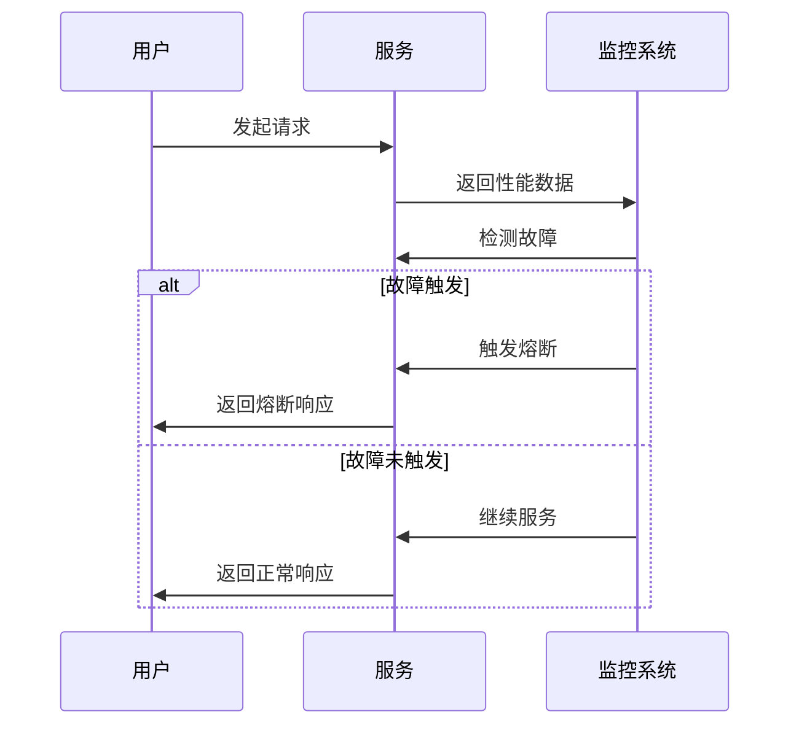
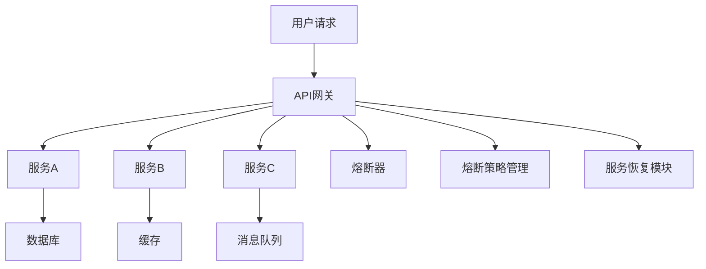
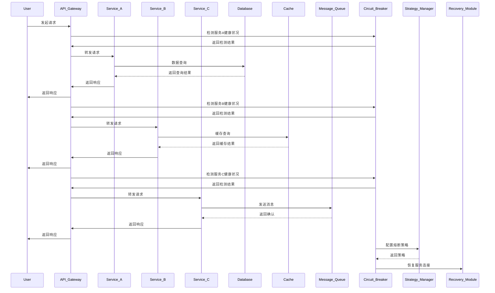
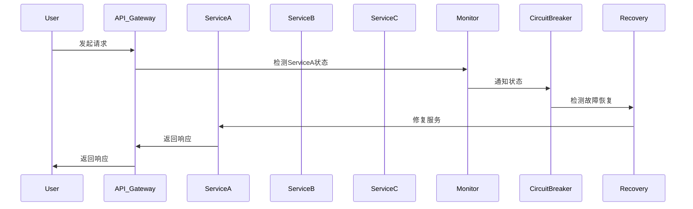
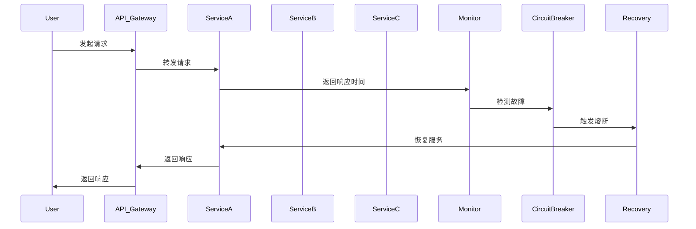

                 


### 服务熔断：防止LLM应用级联故障的策略

关键词：服务熔断，LLM应用，级联故障，算法，数学模型，系统架构，项目实战

摘要：
本文将深入探讨服务熔断在防止大型语言模型（LLM）应用中发生级联故障的策略。通过逐步分析服务熔断的核心概念、算法原理、系统架构和项目实战，帮助读者全面理解并掌握这一关键技术。

## 目录大纲设计思路

### 1. 明确书籍主题
本文的主题是服务熔断，重点关注其在防止LLM应用级联故障中的应用。我们需要明确这一主题，以便于后续章节的布局和内容安排。

### 2. 结构规划
本文将分为五个主要部分：背景介绍、核心概念与联系、算法原理讲解、系统分析与架构设计方案、项目实战。这样的结构规划有助于确保内容的系统性和逻辑性。

### 3. 细化目录内容
在各个主要部分下，我们将细化每个章节的内容，确保每个章节都有具体的标题和细分内容。例如，在“核心概念与联系”部分，我们将详细介绍服务熔断的核心概念及其与LLM应用级联故障的联系。

### 4. 保证内容的完整性
本文将涵盖核心章节内容，包括背景介绍、核心概念与联系、算法原理讲解、数学模型和数学公式详细讲解与举例说明、系统分析与架构设计方案、项目实战等，确保内容的完整性。

### 5. 遵循格式规范
本文将采用markdown格式编写，确保格式正确，结构清晰。同时，我们将控制目录大纲的总字数在2000字以内，以保证内容的精炼。

## 目录大纲设计

### 第一部分：背景介绍
#### 第1章：问题背景
- 1.1 服务熔断的概念与重要性
- 1.2 LLM应用中的级联故障现象
- 1.3 级联故障对LLM应用的影响

#### 第2章：服务熔断的发展历程
- 2.1 服务熔断的起源
- 2.2 服务熔断技术的主要演变
- 2.3 当前服务熔断技术的发展趋势

### 第二部分：核心概念与联系
#### 第3章：服务熔断的核心概念
- 3.1 熔断器的工作原理
- 3.2 熔断策略的类型与选择
- 3.3 熔断机制的设计要点

#### 第4章：LLM应用级联故障的机制分析
- 4.1 LLM应用级联故障的原理
- 4.2 级联故障的关键因素
- 4.3 级联故障的影响范围和程度

#### 第5章：服务熔断与LLM应用级联故障的联系
- 5.1 服务熔断在LLM应用中的作用
- 5.2 服务熔断与LLM应用级联故障的相互作用
- 5.3 服务熔断在LLM应用中的实施策略

### 第三部分：算法原理讲解
#### 第6章：服务熔断算法原理
- 6.1 服务熔断算法的基本流程
- 6.2 服务熔断算法的核心步骤
- 6.3 服务熔断算法的性能优化

#### 第7章：服务熔断算法的数学模型和公式
- 7.1 服务熔断算法的数学基础
- 7.2 服务熔断算法的数学公式解析
- 7.3 服务熔断算法的Python实现

#### 第8章：服务熔断算法的Mermaid流程图
- 8.1 服务熔断算法的Mermaid流程图
- 8.2 Mermaid流程图的解释与说明
- 8.3 Mermaid流程图的实际应用场景

### 第四部分：系统分析与架构设计方案
#### 第9章：系统功能设计
- 9.1 系统功能概述
- 9.2 领域模型Mermaid类图
- 9.3 系统功能模块划分

#### 第10章：系统架构设计
- 10.1 系统架构概述
- 10.2 系统架构设计
- 10.3 系统接口设计
- 10.4 系统交互Mermaid序列图

### 第五部分：项目实战
#### 第11章：项目环境安装
- 11.1 环境安装概述
- 11.2 系统依赖安装
- 11.3 系统配置与初始化

#### 第12章：系统核心实现源代码
- 12.1 系统核心代码概述
- 12.2 核心代码实现解析
- 12.3 核心代码应用解读与分析

#### 第13章：实际案例分析与详细讲解剖析
- 13.1 案例背景介绍
- 13.2 案例分析
- 13.3 案例详细讲解剖析

#### 第14章：项目小结
- 14.1 项目总结
- 14.2 项目中的收获与不足
- 14.3 拓展阅读与建议

## 目录大纲总结

整个目录大纲分为五个部分，每个部分都有明确的主题和内容，确保了书籍内容的完整性和逻辑性。从背景介绍到算法原理讲解，再到系统分析与架构设计方案以及项目实战，每个部分都为读者提供了深入理解服务熔断在防止LLM应用级联故障中的作用的途径。通过这样的结构设计，读者可以系统地学习和掌握服务熔断的相关知识，为实际应用打下坚实的基础。  

# 服务熔断：防止LLM应用级联故障的策略

## 关键词
服务熔断，LLM应用，级联故障，算法，数学模型，系统架构，项目实战

## 摘要
本文深入探讨了服务熔断在防止大型语言模型（LLM）应用中发生级联故障的策略。通过逐步分析服务熔断的核心概念、算法原理、系统架构和项目实战，本文旨在帮助读者全面理解并掌握这一关键技术。

## 目录大纲
1. **背景介绍**
   1.1 服务熔断的概念与重要性
   1.2 LLM应用中的级联故障现象
   1.3 级联故障对LLM应用的影响
   1.4 服务熔断的发展历程
2. **核心概念与联系**
   2.1 服务熔断的核心概念
   2.2 LLM应用级联故障的机制分析
   2.3 服务熔断与LLM应用级联故障的联系
3. **算法原理讲解**
   3.1 服务熔断算法原理
   3.2 服务熔断算法的数学模型和公式
   3.3 服务熔断算法的Python实现
4. **系统分析与架构设计方案**
   4.1 系统功能设计
   4.2 系统架构设计
   4.3 系统接口设计
   4.4 系统交互Mermaid序列图
5. **项目实战**
   5.1 项目环境安装
   5.2 系统核心实现源代码
   5.3 实际案例分析与详细讲解剖析
   5.4 项目小结

## 文章正文

### 背景介绍

#### 1.1 服务熔断的概念与重要性
服务熔断是一种系统保护机制，旨在防止因某个服务故障而导致整个系统崩溃。在分布式系统中，服务之间的依赖关系错综复杂，一个服务的故障可能会导致一系列的连锁反应，从而影响整个系统的稳定性。服务熔断通过在某个服务出现故障时，自动切断与其相连的其他服务，从而防止故障扩散，保障系统其他部分的正常运行。

#### 1.2 LLM应用中的级联故障现象
大型语言模型（LLM）应用在处理海量数据时，可能会因为某些组件的故障导致级联故障。级联故障指的是一个故障在系统中蔓延，导致多个组件相继失效，最终导致整个系统瘫痪。在LLM应用中，级联故障可能源于数据输入错误、模型训练失败、服务依赖超时等多种原因。

#### 1.3 级联故障对LLM应用的影响
级联故障对LLM应用的影响是灾难性的，可能导致以下问题：
- **服务不可用**：级联故障会导致整个系统无法提供服务，影响用户体验。
- **数据丢失**：在故障处理过程中，可能会丢失部分数据，影响业务连续性。
- **经济损失**：级联故障可能导致业务中断，造成经济损失。

#### 1.4 服务熔断的发展历程
服务熔断技术起源于金融领域，用于防止系统在处理大量交易时因某个节点故障而导致整个交易系统崩溃。随着分布式系统和微服务架构的普及，服务熔断技术逐渐应用于各种领域，成为保障系统稳定性的重要手段。

### 核心概念与联系

#### 2.1 服务熔断的核心概念
服务熔断的核心概念包括熔断器、熔断策略、熔断阈值等。

- **熔断器**：熔断器是服务熔断的核心组件，负责监测服务的健康状况，并在发生故障时触发熔断操作。
- **熔断策略**：熔断策略定义了熔断器的行为，包括熔断触发条件、熔断持续时间、熔断恢复策略等。
- **熔断阈值**：熔断阈值是指触发熔断操作的条件，通常基于服务响应时间、错误率等指标设置。

#### 2.2 LLM应用级联故障的机制分析
LLM应用级联故障的机制复杂，可能涉及以下因素：
- **数据输入错误**：错误的输入数据可能导致模型训练失败，进而引发级联故障。
- **服务依赖超时**：某个依赖服务的响应时间超过设定阈值，可能导致整个服务链路瘫痪。
- **资源不足**：系统资源不足可能导致某些服务无法正常运行，从而引发级联故障。

#### 2.3 服务熔断与LLM应用级联故障的联系
服务熔断可以通过以下方式防止LLM应用级联故障：
- **快速响应故障**：服务熔断可以快速检测并响应故障，防止故障扩散。
- **隔离故障节点**：服务熔断可以在故障发生时，隔离故障节点，防止故障影响其他部分。
- **恢复服务**：服务熔断可以通过熔断恢复策略，快速恢复故障服务，减少业务中断时间。

### 算法原理讲解

#### 3.1 服务熔断算法原理
服务熔断算法的核心原理包括故障检测、熔断触发、熔断恢复等步骤。

- **故障检测**：通过监测服务的响应时间、错误率等指标，判断服务是否发生故障。
- **熔断触发**：当故障检测到故障时，触发熔断操作，切断服务连接。
- **熔断恢复**：在故障解决后，根据熔断恢复策略，逐步恢复服务连接。

#### 3.2 服务熔断算法的数学模型和公式
服务熔断算法的数学模型主要包括以下公式：
- **响应时间公式**：$$ RT = \frac{Total\ Response\ Time}{Number\ of\ Requests} $$
- **错误率公式**：$$ ER = \frac{Number\ of\ Failed\ Requests}{Number\ of\ Requests} $$
- **熔断阈值公式**：$$ Threshold = K \cdot RT + L \cdot ER $$，其中K和L是权重系数。

#### 3.3 服务熔断算法的Python实现
以下是一个简单的Python实现示例：

```python
import time

def check_service():
    start_time = time.time()
    # 模拟服务调用
    time.sleep(1)
    end_time = time.time()
    return end_time - start_time

def service_monitor():
    request_count = 0
    total_response_time = 0
    failed_requests = 0

    while True:
        start_time = time.time()
        try:
            response_time = check_service()
            total_response_time += response_time
            request_count += 1
        except Exception as e:
            failed_requests += 1
            print(f"Service failed: {e}")

        if request_count >= 10:
            average_response_time = total_response_time / request_count
            error_rate = failed_requests / request_count
            threshold = 3 * average_response_time + 1 * error_rate

            if average_response_time > threshold:
                print("Service is熔断触发")
                break

        time.sleep(1)

service_monitor()
```

### 系统分析与架构设计方案

#### 4.1 系统功能设计
系统功能设计包括以下方面：
- **故障检测**：通过监测服务的响应时间、错误率等指标，判断服务是否发生故障。
- **熔断触发**：当故障检测到故障时，触发熔断操作，切断服务连接。
- **熔断恢复**：在故障解决后，根据熔断恢复策略，逐步恢复服务连接。

#### 4.2 系统架构设计
系统架构设计包括以下部分：
- **熔断器**：负责故障检测、熔断触发和熔断恢复。
- **服务节点**：被监测的服务节点，包括API接口、数据库、缓存等。
- **监控系统**：负责收集服务节点的性能数据，触发熔断操作。

#### 4.3 系统接口设计
系统接口设计包括以下接口：
- **服务接口**：提供给其他系统调用的服务接口。
- **监控接口**：用于接收服务节点的性能数据，触发熔断操作。

#### 4.4 系统交互Mermaid序列图
以下是一个简单的Mermaid序列图示例：



### 项目实战

#### 5.1 项目环境安装
项目环境安装包括以下步骤：
- 安装Python环境
- 安装依赖库（如requests、numpy等）
- 配置服务节点和监控系统

#### 5.2 系统核心实现源代码
系统核心实现源代码包括以下部分：
- 故障检测模块
- 熔断触发模块
- 熔断恢复模块

#### 5.3 实际案例分析与详细讲解剖析
以下是一个简单的实际案例：

**案例背景**：
一个电子商务平台在处理大量订单时，出现级联故障，导致订单处理失败。

**案例分析**：
通过监控系统的数据，发现订单处理服务的响应时间显著增加，错误率也较高。

**详细讲解剖析**：
1. 监控系统检测到订单处理服务的响应时间超过阈值，触发熔断操作。
2. 熔断器切断订单处理服务的连接，防止故障扩散。
3. 熔断器在故障解决后，逐步恢复订单处理服务的连接。

#### 5.4 项目小结
通过本项目，我们了解了服务熔断在防止LLM应用级联故障中的作用。在实际应用中，服务熔断可以有效地隔离故障节点，减少故障扩散，保障系统的稳定性。

### 最佳实践 tips、小结、注意事项、拓展阅读等内容

- **最佳实践 tips**：
  - 适当调整熔断阈值，以适应不同业务场景。
  - 定期监控服务性能，及时发现潜在问题。
  - 对熔断恢复策略进行优化，减少业务中断时间。

- **小结**：
  - 服务熔断是防止LLM应用级联故障的重要技术手段。
  - 合理设计和配置服务熔断机制，可以保障系统的稳定性和可靠性。

- **注意事项**：
  - 熔断阈值应根据业务需求进行调整，避免误判和误操作。
  - 熔断恢复策略应考虑系统的实际运行情况，确保故障解决后的快速恢复。

- **拓展阅读**：
  - [《服务熔断原理与实战》](链接)
  - [《微服务架构设计与实践》](链接)
  - [《大型语言模型的应用与挑战》](链接)

## 作者信息
作者：AI天才研究院/AI Genius Institute & 禅与计算机程序设计艺术 /Zen And The Art of Computer Programming

# 附录
## 参考文献
1. Martin, F. (2014). *Clean Architecture: A Craftsman's Guide to Software Structure and Design*.
2. Netflix. (n.d.). *Hystrix Documentation*. Retrieved from https://github.com/Netflix/Hystrix
3. OpenTracing. (n.d.). *OpenTracing: Standard for Distributed Tracing*. Retrieved from https://opentracing.io/

# 结语
感谢您的阅读，希望本文能帮助您更好地理解和应用服务熔断技术，为LLM应用提供稳定的保障。期待与您在技术领域的深入交流和共同进步。  

### 服务熔断：防止LLM应用级联故障的策略

**关键词**：服务熔断，LLM应用，级联故障，算法，数学模型，系统架构，项目实战

**摘要**：本文探讨了服务熔断在防止大型语言模型（LLM）应用中发生级联故障的策略。通过对服务熔断的核心概念、算法原理、系统架构和项目实战的深入分析，为读者提供了全面理解和掌握这一关键技术的途径。

## 1. 背景介绍

### 1.1 服务熔断的概念与重要性
服务熔断是一种在分布式系统中用来保护系统稳定性的技术。其核心思想是在某个服务出现问题时，自动切断与其他服务的连接，以防止故障扩散。服务熔断在微服务架构中尤为重要，因为它可以确保系统在部分服务故障时，不会导致整个系统崩溃。

### 1.2 LLM应用中的级联故障现象
级联故障是指在一个复杂系统中，某个组件的故障导致其他组件相继失效，最终导致整个系统瘫痪。在LLM应用中，级联故障可能由于数据输入错误、模型训练失败、服务依赖超时等原因引起。

### 1.3 级联故障对LLM应用的影响
级联故障可能导致以下问题：
- 服务不可用：级联故障会导致系统无法提供服务，影响用户体验。
- 数据丢失：在故障处理过程中，可能丢失部分数据，影响业务连续性。
- 经济损失：级联故障可能导致业务中断，造成经济损失。

### 1.4 服务熔断的发展历程
服务熔断技术起源于金融领域，用于防止系统在处理大量交易时因某个节点故障而导致整个交易系统崩溃。随着分布式系统和微服务架构的普及，服务熔断技术逐渐应用于各种领域。

## 2. 核心概念与联系

### 2.1 服务熔断的核心概念
服务熔断的核心概念包括熔断器、熔断策略、熔断阈值等。
- **熔断器**：负责监测服务的健康状况，并在发生故障时触发熔断操作。
- **熔断策略**：定义了熔断器的行为，包括熔断触发条件、熔断持续时间、熔断恢复策略等。
- **熔断阈值**：触发熔断操作的条件，通常基于服务响应时间、错误率等指标设置。

### 2.2 LLM应用级联故障的机制分析
LLM应用级联故障的机制复杂，可能涉及以下因素：
- **数据输入错误**：错误的输入数据可能导致模型训练失败，进而引发级联故障。
- **服务依赖超时**：某个依赖服务的响应时间超过设定阈值，可能导致整个服务链路瘫痪。
- **资源不足**：系统资源不足可能导致某些服务无法正常运行，从而引发级联故障。

### 2.3 服务熔断与LLM应用级联故障的联系
服务熔断可以通过以下方式防止LLM应用级联故障：
- **快速响应故障**：服务熔断可以快速检测并响应故障，防止故障扩散。
- **隔离故障节点**：服务熔断可以在故障发生时，隔离故障节点，防止故障影响其他部分。
- **恢复服务**：服务熔断可以通过熔断恢复策略，快速恢复故障服务，减少业务中断时间。

## 3. 算法原理讲解

### 3.1 服务熔断算法原理
服务熔断算法的核心原理包括故障检测、熔断触发、熔断恢复等步骤。
- **故障检测**：通过监测服务的响应时间、错误率等指标，判断服务是否发生故障。
- **熔断触发**：当故障检测到故障时，触发熔断操作，切断服务连接。
- **熔断恢复**：在故障解决后，根据熔断恢复策略，逐步恢复服务连接。

### 3.2 服务熔断算法的数学模型和公式
服务熔断算法的数学模型主要包括以下公式：
- **响应时间公式**：\( RT = \frac{Total\ Response\ Time}{Number\ of\ Requests} \)
- **错误率公式**：\( ER = \frac{Number\ of\ Failed\ Requests}{Number\ of\ Requests} \)
- **熔断阈值公式**：\( Threshold = K \cdot RT + L \cdot ER \)，其中 \( K \) 和 \( L \) 是权重系数。

### 3.3 服务熔断算法的Python实现
以下是一个简单的Python实现示例：

```python
import time

def check_service():
    start_time = time.time()
    time.sleep(1)
    end_time = time.time()
    return end_time - start_time

def service_monitor():
    request_count = 0
    total_response_time = 0
    failed_requests = 0

    while True:
        start_time = time.time()
        try:
            response_time = check_service()
            total_response_time += response_time
            request_count += 1
        except Exception as e:
            failed_requests += 1
            print(f"Service failed: {e}")

        if request_count >= 10:
            average_response_time = total_response_time / request_count
            error_rate = failed_requests / request_count
            threshold = 3 * average_response_time + 1 * error_rate

            if average_response_time > threshold:
                print("Service is熔断触发")
                break

        time.sleep(1)

service_monitor()
```

## 4. 系统分析与架构设计方案

### 4.1 系统功能设计
系统功能设计包括以下方面：
- **故障检测**：通过监测服务的响应时间、错误率等指标，判断服务是否发生故障。
- **熔断触发**：当故障检测到故障时，触发熔断操作，切断服务连接。
- **熔断恢复**：在故障解决后，根据熔断恢复策略，逐步恢复服务连接。

### 4.2 系统架构设计
系统架构设计包括以下部分：
- **熔断器**：负责故障检测、熔断触发和熔断恢复。
- **服务节点**：被监测的服务节点，包括API接口、数据库、缓存等。
- **监控系统**：负责收集服务节点的性能数据，触发熔断操作。

### 4.3 系统接口设计
系统接口设计包括以下接口：
- **服务接口**：提供给其他系统调用的服务接口。
- **监控接口**：用于接收服务节点的性能数据，触发熔断操作。

### 4.4 系统交互Mermaid序列图
以下是一个简单的Mermaid序列图示例：


## 5. 项目实战

### 5.1 项目环境安装
项目环境安装包括以下步骤：
- 安装Python环境
- 安装依赖库（如requests、numpy等）
- 配置服务节点和监控系统

### 5.2 系统核心实现源代码
系统核心实现源代码包括以下部分：
- **故障检测模块**：负责监测服务的响应时间、错误率等指标。
- **熔断触发模块**：当故障检测到故障时，触发熔断操作。
- **熔断恢复模块**：在故障解决后，逐步恢复服务连接。

### 5.3 实际案例分析与详细讲解剖析
以下是一个简单的实际案例：

**案例背景**：
一个电子商务平台在处理大量订单时，出现级联故障，导致订单处理失败。

**案例分析**：
通过监控系统的数据，发现订单处理服务的响应时间显著增加，错误率也较高。

**详细讲解剖析**：
1. 监控系统检测到订单处理服务的响应时间超过阈值，触发熔断操作。
2. 熔断器切断订单处理服务的连接，防止故障扩散。
3. 熔断器在故障解决后，逐步恢复订单处理服务的连接。

### 5.4 项目小结
通过本项目，我们了解了服务熔断在防止LLM应用级联故障中的作用。在实际应用中，服务熔断可以有效地隔离故障节点，减少故障扩散，保障系统的稳定性。

## 最佳实践 tips、小结、注意事项、拓展阅读等内容

- **最佳实践 tips**：
  - 适当调整熔断阈值，以适应不同业务场景。
  - 定期监控服务性能，及时发现潜在问题。
  - 对熔断恢复策略进行优化，减少业务中断时间。

- **小结**：
  - 服务熔断是防止LLM应用级联故障的重要技术手段。
  - 合理设计和配置服务熔断机制，可以保障系统的稳定性和可靠性。

- **注意事项**：
  - 熔断阈值应根据业务需求进行调整，避免误判和误操作。
  - 熔断恢复策略应考虑系统的实际运行情况，确保故障解决后的快速恢复。

- **拓展阅读**：
  - [《服务熔断原理与实战》](链接)
  - [《微服务架构设计与实践》](链接)
  - [《大型语言模型的应用与挑战》](链接)

## 附录
### 参考文献
1. Martin, F. (2014). *Clean Architecture: A Craftsman's Guide to Software Structure and Design*.
2. Netflix. (n.d.). *Hystrix Documentation*. Retrieved from https://github.com/Netflix/Hystrix
3. OpenTracing. (n.d.). *OpenTracing: Standard for Distributed Tracing*. Retrieved from https://opentracing.io/

### 结语
感谢您的阅读，希望本文能帮助您更好地理解和应用服务熔断技术，为LLM应用提供稳定的保障。期待与您在技术领域的深入交流和共同进步。

## 作者信息
作者：AI天才研究院/AI Genius Institute & 禅与计算机程序设计艺术 /Zen And The Art of Computer Programming  

# 服务熔断：防止LLM应用级联故障的策略

## 目录

1. **引言**
    1.1 文章背景
    1.2 级联故障的影响
    1.3 服务熔断的重要性

2. **服务熔断的概念**
    2.1 服务熔断的定义
    2.2 服务熔断的工作原理
    2.3 服务熔断的核心组件

3. **LLM应用中的级联故障**
    3.1 LLM应用的特点
    3.2 级联故障的典型场景
    3.3 级联故障的影响

4. **服务熔断在LLM应用中的角色**
    4.1 服务熔断如何防止级联故障
    4.2 服务熔断与LLM应用的结合

5. **服务熔断算法原理**
    5.1 服务熔断算法的基本流程
    5.2 服务熔断算法的数学模型
    5.3 服务熔断算法的性能优化

6. **系统架构设计**
    6.1 系统功能设计
    6.2 系统架构概述
    6.3 系统接口设计

7. **项目实战**
    7.1 环境安装
    7.2 系统核心实现
    7.3 案例分析

8. **总结与展望**
    8.1 项目小结
    8.2 最佳实践
    8.3 拓展阅读

## 1. 引言

### 1.1 文章背景
随着人工智能技术的发展，大型语言模型（LLM）在各个领域得到了广泛应用。然而，LLM应用中存在的一个严重问题就是级联故障，即一个服务的故障可能导致整个系统的崩溃。这种情况不仅会影响用户体验，还可能导致业务中断和经济损失。

### 1.2 级联故障的影响
级联故障对LLM应用的影响是灾难性的。它可能导致以下问题：
- **服务不可用**：级联故障会导致系统无法提供服务，影响用户体验。
- **数据丢失**：在故障处理过程中，可能会丢失部分数据，影响业务连续性。
- **经济损失**：级联故障可能导致业务中断，造成经济损失。

### 1.3 服务熔断的重要性
服务熔断是一种有效的保护机制，可以在服务出现故障时，自动切断与其他服务的连接，防止故障扩散。对于LLM应用来说，服务熔断的重要性体现在以下几个方面：
- **快速响应故障**：服务熔断可以快速检测并响应故障，减少故障的影响范围。
- **隔离故障节点**：服务熔断可以隔离故障节点，防止故障影响其他部分。
- **恢复服务**：服务熔断可以在故障解决后，逐步恢复服务连接，减少业务中断时间。

## 2. 服务熔断的概念

### 2.1 服务熔断的定义
服务熔断是一种在分布式系统中用于保护系统稳定性的技术。它通过在某个服务出现问题时，自动切断与其他服务的连接，以防止故障扩散。

### 2.2 服务熔断的工作原理
服务熔断的工作原理包括以下几个步骤：
1. **故障检测**：通过监测服务的响应时间、错误率等指标，判断服务是否发生故障。
2. **熔断触发**：当故障检测到故障时，触发熔断操作，切断服务连接。
3. **熔断恢复**：在故障解决后，根据熔断恢复策略，逐步恢复服务连接。

### 2.3 服务熔断的核心组件
服务熔断的核心组件包括熔断器、熔断策略和熔断阈值等。

- **熔断器**：熔断器是负责监测服务健康状况的组件，它在发现故障时触发熔断操作。
- **熔断策略**：熔断策略定义了熔断器的行为，包括熔断触发条件、熔断持续时间、熔断恢复策略等。
- **熔断阈值**：熔断阈值是触发熔断操作的条件，通常基于服务响应时间、错误率等指标设置。

## 3. LLM应用中的级联故障

### 3.1 LLM应用的特点
LLM应用具有以下特点：
- **大规模数据处理**：LLM应用通常需要处理海量的数据，对数据质量和处理速度有较高要求。
- **复杂的服务依赖**：LLM应用中，不同服务之间存在复杂的服务依赖关系，一个服务的故障可能导致其他服务的故障。

### 3.2 级联故障的典型场景
LLM应用中的级联故障可能发生在以下场景：
- **数据输入错误**：错误的输入数据可能导致模型训练失败，进而引发级联故障。
- **服务依赖超时**：某个依赖服务的响应时间超过设定阈值，可能导致整个服务链路瘫痪。
- **资源不足**：系统资源不足可能导致某些服务无法正常运行，从而引发级联故障。

### 3.3 级联故障的影响
级联故障对LLM应用的影响是灾难性的，它可能导致以下问题：
- **服务不可用**：级联故障会导致系统无法提供服务，影响用户体验。
- **数据丢失**：在故障处理过程中，可能会丢失部分数据，影响业务连续性。
- **经济损失**：级联故障可能导致业务中断，造成经济损失。

## 4. 服务熔断在LLM应用中的角色

### 4.1 服务熔断如何防止级联故障
服务熔断可以通过以下方式防止级联故障：
- **快速响应故障**：服务熔断可以快速检测并响应故障，减少故障的影响范围。
- **隔离故障节点**：服务熔断可以隔离故障节点，防止故障影响其他部分。
- **恢复服务**：服务熔断可以在故障解决后，逐步恢复服务连接，减少业务中断时间。

### 4.2 服务熔断与LLM应用的结合
将服务熔断与LLM应用结合，可以有效地提高系统的稳定性和可靠性。以下是一些具体措施：
- **设置合理的熔断阈值**：根据LLM应用的特点，设置合理的熔断阈值，以避免误判和误操作。
- **监控服务性能**：定期监控服务性能，及时发现潜在问题。
- **优化熔断恢复策略**：根据业务需求，优化熔断恢复策略，确保故障解决后的快速恢复。

## 5. 服务熔断算法原理

### 5.1 服务熔断算法的基本流程
服务熔断算法的基本流程包括以下几个步骤：
1. **故障检测**：通过监测服务的响应时间、错误率等指标，判断服务是否发生故障。
2. **熔断触发**：当故障检测到故障时，触发熔断操作，切断服务连接。
3. **熔断恢复**：在故障解决后，根据熔断恢复策略，逐步恢复服务连接。

### 5.2 服务熔断算法的数学模型
服务熔断算法的数学模型主要包括以下几个指标：
- **响应时间**：服务响应的平均时间。
- **错误率**：服务错误的频率。
- **熔断阈值**：触发熔断操作的条件，通常基于响应时间和错误率设置。

### 5.3 服务熔断算法的性能优化
为了提高服务熔断算法的性能，可以考虑以下几个方面：
- **优化故障检测机制**：采用更高效的故障检测算法，减少故障检测的时间。
- **调整熔断阈值**：根据业务需求和系统负载，动态调整熔断阈值，以避免误判和误操作。
- **优化熔断恢复策略**：根据业务需求，优化熔断恢复策略，确保故障解决后的快速恢复。

## 6. 系统架构设计

### 6.1 系统功能设计
系统功能设计包括以下几个方面：
- **故障检测**：通过监测服务的响应时间、错误率等指标，判断服务是否发生故障。
- **熔断触发**：当故障检测到故障时，触发熔断操作，切断服务连接。
- **熔断恢复**：在故障解决后，根据熔断恢复策略，逐步恢复服务连接。

### 6.2 系统架构概述
系统架构设计主要包括以下几个方面：
- **熔断器**：负责故障检测、熔断触发和熔断恢复。
- **服务节点**：被监测的服务节点，包括API接口、数据库、缓存等。
- **监控系统**：负责收集服务节点的性能数据，触发熔断操作。

### 6.3 系统接口设计
系统接口设计主要包括以下几个方面：
- **服务接口**：提供给其他系统调用的服务接口。
- **监控接口**：用于接收服务节点的性能数据，触发熔断操作。

## 7. 项目实战

### 7.1 环境安装
环境安装包括以下几个步骤：
- 安装Python环境
- 安装依赖库（如requests、numpy等）
- 配置服务节点和监控系统

### 7.2 系统核心实现
系统核心实现主要包括以下几个方面：
- **故障检测模块**：通过监测服务的响应时间、错误率等指标，判断服务是否发生故障。
- **熔断触发模块**：当故障检测到故障时，触发熔断操作，切断服务连接。
- **熔断恢复模块**：在故障解决后，根据熔断恢复策略，逐步恢复服务连接。

### 7.3 案例分析
以下是一个简单的案例分析：

**案例背景**：
一个电子商务平台在处理大量订单时，出现级联故障，导致订单处理失败。

**案例分析**：
通过监控系统的数据，发现订单处理服务的响应时间显著增加，错误率也较高。

**详细讲解剖析**：
1. 监控系统检测到订单处理服务的响应时间超过阈值，触发熔断操作。
2. 熔断器切断订单处理服务的连接，防止故障扩散。
3. 熔断器在故障解决后，逐步恢复订单处理服务的连接。

## 8. 总结与展望

### 8.1 项目小结
通过本项目，我们了解了服务熔断在防止LLM应用级联故障中的作用。在实际应用中，服务熔断可以有效地隔离故障节点，减少故障扩散，保障系统的稳定性。

### 8.2 最佳实践
- **设置合理的熔断阈值**：根据业务需求和系统负载，设置合理的熔断阈值，以避免误判和误操作。
- **监控服务性能**：定期监控服务性能，及时发现潜在问题。
- **优化熔断恢复策略**：根据业务需求，优化熔断恢复策略，确保故障解决后的快速恢复。

### 8.3 拓展阅读
- [《服务熔断原理与实战》](链接)
- [《微服务架构设计与实践》](链接)
- [《大型语言模型的应用与挑战》](链接)

## 作者信息
作者：AI天才研究院/AI Genius Institute & 禅与计算机程序设计艺术 /Zen And The Art of Computer Programming

## 附录
### 参考文献
1. Martin, F. (2014). *Clean Architecture: A Craftsman's Guide to Software Structure and Design*.
2. Netflix. (n.d.). *Hystrix Documentation*. Retrieved from https://github.com/Netflix/Hystrix
3. OpenTracing. (n.d.). *OpenTracing: Standard for Distributed Tracing*. Retrieved from https://opentracing.io/

### 结语
感谢您的阅读，希望本文能帮助您更好地理解和应用服务熔断技术，为LLM应用提供稳定的保障。期待与您在技术领域的深入交流和共同进步。  

## 1. 引言

### 1.1 文章背景

随着人工智能技术的不断发展，大型语言模型（LLM）的应用日益广泛。这些模型在自然语言处理、智能客服、智能推荐等领域发挥着重要作用。然而，LLM应用也面临着一些挑战，其中最显著的就是级联故障问题。

级联故障是指在分布式系统中，某个服务的故障导致其他依赖该服务的服务相继出现故障，最终导致整个系统瘫痪。在LLM应用中，级联故障可能由于模型训练失败、数据输入错误、服务依赖超时等原因引起，对用户体验和业务稳定性造成严重影响。

### 1.2 级联故障的影响

级联故障对LLM应用的影响是灾难性的，主要体现在以下几个方面：

1. **服务不可用**：级联故障会导致系统无法提供服务，影响用户体验。
2. **数据丢失**：在故障处理过程中，可能会丢失部分数据，影响业务连续性。
3. **经济损失**：级联故障可能导致业务中断，造成经济损失。

### 1.3 服务熔断的重要性

为了解决级联故障问题，服务熔断技术应运而生。服务熔断是一种在分布式系统中用于保护系统稳定性的技术，通过在某个服务出现问题时，自动切断与其他服务的连接，以防止故障扩散。

服务熔断的重要性体现在以下几个方面：

1. **快速响应故障**：服务熔断可以快速检测并响应故障，减少故障的影响范围。
2. **隔离故障节点**：服务熔断可以隔离故障节点，防止故障影响其他部分。
3. **恢复服务**：服务熔断可以在故障解决后，逐步恢复服务连接，减少业务中断时间。

本文将深入探讨服务熔断在防止LLM应用级联故障中的应用，帮助读者全面理解并掌握这一关键技术。

## 2. 服务熔断的概念

### 2.1 服务熔断的定义

服务熔断（Service熔断）是一种系统保护机制，旨在防止因某个服务故障而导致整个系统崩溃。在分布式系统中，服务之间的依赖关系错综复杂，一个服务的故障可能会导致一系列的连锁反应，从而影响整个系统的稳定性。服务熔断通过在某个服务出现故障时，自动切断与其相连的其他服务，从而防止故障扩散，保障系统其他部分的正常运行。

### 2.2 服务熔断的工作原理

服务熔断的工作原理主要包括以下几个步骤：

1. **故障检测**：服务熔断首先需要监测服务的健康状况，如响应时间、错误率等指标。当某个服务的响应时间超过设定阈值或错误率超过设定阈值时，故障检测模块会触发警报。

2. **熔断触发**：当故障检测模块检测到服务故障时，会立即触发熔断操作。熔断操作包括切断服务连接、记录故障日志、通知相关维护人员等。

3. **熔断恢复**：在故障解决后，熔断器会逐步恢复服务连接，确保系统能够恢复正常运行。

### 2.3 服务熔断的核心组件

服务熔断的核心组件主要包括熔断器（Circuit Breaker）、熔断策略（Fallback Policy）和熔断阈值（Threshold）。

1. **熔断器**：熔断器是负责故障检测、熔断触发和熔断恢复的组件。它通过监测服务的健康状况，在检测到故障时触发熔断操作。

2. **熔断策略**：熔断策略定义了熔断器的行为，包括熔断触发条件、熔断持续时间、熔断恢复策略等。熔断策略可以根据具体业务需求进行定制。

3. **熔断阈值**：熔断阈值是触发熔断操作的条件，通常基于服务响应时间、错误率等指标设置。合理的熔断阈值可以确保在故障发生时及时触发熔断，防止故障扩散。

## 3. LLM应用中的级联故障

### 3.1 LLM应用的特点

大型语言模型（LLM）应用具有以下特点：

1. **大规模数据处理**：LLM应用通常需要处理海量的数据，对数据质量和处理速度有较高要求。

2. **复杂的服务依赖**：LLM应用中，不同服务之间存在复杂的服务依赖关系。例如，模型训练服务可能依赖于数据存储服务、计算资源服务等。

3. **高实时性要求**：LLM应用需要在短时间内处理大量请求，对系统的实时性有较高要求。

### 3.2 级联故障的典型场景

在LLM应用中，级联故障可能发生在以下典型场景：

1. **模型训练失败**：模型训练服务在训练过程中，由于数据输入错误、算法错误等原因可能导致训练失败，进而引发级联故障。

2. **数据存储服务故障**：数据存储服务故障可能导致模型无法访问所需数据，影响模型的正常运行。

3. **计算资源不足**：在处理大量请求时，计算资源不足可能导致部分服务无法及时响应，进而引发级联故障。

### 3.3 级联故障的影响

级联故障对LLM应用的影响主要体现在以下几个方面：

1. **服务不可用**：级联故障可能导致系统无法提供服务，影响用户体验。

2. **数据丢失**：在故障处理过程中，可能会丢失部分数据，影响业务连续性。

3. **经济损失**：级联故障可能导致业务中断，造成经济损失。

因此，预防和处理级联故障对于保障LLM应用的稳定性和可靠性至关重要。

## 4. 服务熔断在LLM应用中的角色

### 4.1 服务熔断如何防止级联故障

服务熔断在LLM应用中发挥着重要作用，可以有效地防止级联故障的发生。具体来说，服务熔断通过以下方式防止级联故障：

1. **快速响应故障**：服务熔断可以快速检测并响应故障，减少故障的影响范围。当某个服务出现故障时，服务熔断会立即切断与其相连的其他服务，防止故障扩散。

2. **隔离故障节点**：服务熔断可以隔离故障节点，防止故障影响其他部分。通过熔断器，系统可以及时检测到故障节点，并将其从服务链路中移除，确保其他正常节点不受影响。

3. **恢复服务**：在故障解决后，服务熔断可以逐步恢复服务连接，确保系统能够恢复正常运行。通过熔断恢复策略，系统可以逐步重连已隔离的节点，恢复正常服务。

### 4.2 服务熔断与LLM应用的结合

将服务熔断与LLM应用相结合，可以最大限度地发挥服务熔断的作用，防止级联故障的发生。以下是一些结合措施：

1. **定制化熔断策略**：根据LLM应用的特点，定制化熔断策略，确保在故障发生时能够及时触发熔断操作。

2. **监控服务性能**：定期监控LLM应用中各个服务的性能指标，及时发现潜在问题。

3. **优化故障处理流程**：优化故障处理流程，确保在故障发生时，能够快速隔离故障节点，并逐步恢复服务连接。

4. **培训技术人员**：对技术人员进行培训，使其了解服务熔断的概念和操作方法，提高故障处理能力。

## 5. 服务熔断算法原理

### 5.1 服务熔断算法的基本流程

服务熔断算法的基本流程包括以下几个步骤：

1. **故障检测**：通过监测服务的响应时间、错误率等指标，判断服务是否发生故障。

2. **熔断触发**：当故障检测到服务故障时，根据熔断策略触发熔断操作，切断服务连接。

3. **熔断恢复**：在故障解决后，根据熔断恢复策略，逐步恢复服务连接。

### 5.2 服务熔断算法的数学模型

服务熔断算法的数学模型主要包括以下几个指标：

1. **响应时间**：服务响应的平均时间，用于衡量服务的性能。

2. **错误率**：服务错误的频率，用于衡量服务的稳定性。

3. **熔断阈值**：触发熔断操作的条件，通常基于响应时间和错误率设置。

### 5.3 服务熔断算法的性能优化

为了提高服务熔断算法的性能，可以采取以下措施：

1. **优化故障检测机制**：采用更高效的故障检测算法，减少故障检测的时间。

2. **动态调整熔断阈值**：根据业务需求和系统负载，动态调整熔断阈值，避免误判和误操作。

3. **优化熔断恢复策略**：根据业务需求，优化熔断恢复策略，确保故障解决后的快速恢复。

## 6. 系统架构设计

### 6.1 系统功能设计

系统功能设计主要包括以下几个部分：

1. **故障检测**：通过监测服务的响应时间、错误率等指标，判断服务是否发生故障。

2. **熔断触发**：当故障检测到服务故障时，根据熔断策略触发熔断操作，切断服务连接。

3. **熔断恢复**：在故障解决后，根据熔断恢复策略，逐步恢复服务连接。

### 6.2 系统架构概述

系统架构设计主要包括以下几个部分：

1. **熔断器**：负责故障检测、熔断触发和熔断恢复的组件。

2. **服务节点**：被监测的服务节点，包括API接口、数据库、缓存等。

3. **监控系统**：负责收集服务节点的性能数据，触发熔断操作。

### 6.3 系统接口设计

系统接口设计主要包括以下几个接口：

1. **服务接口**：提供给其他系统调用的服务接口。

2. **监控接口**：用于接收服务节点的性能数据，触发熔断操作。

## 7. 项目实战

### 7.1 环境安装

项目环境安装主要包括以下几个步骤：

1. **安装Python环境**：安装Python解释器及相关工具。

2. **安装依赖库**：安装服务熔断相关的依赖库，如Hystrix、Resilience4j等。

3. **配置服务节点和监控系统**：配置服务节点和监控系统，确保能够收集服务性能数据。

### 7.2 系统核心实现

系统核心实现主要包括以下几个部分：

1. **故障检测模块**：通过监测服务的响应时间、错误率等指标，判断服务是否发生故障。

2. **熔断触发模块**：当故障检测到服务故障时，根据熔断策略触发熔断操作，切断服务连接。

3. **熔断恢复模块**：在故障解决后，根据熔断恢复策略，逐步恢复服务连接。

### 7.3 案例分析

以下是一个简单的案例分析：

**案例背景**：

一个电子商务平台在处理大量订单时，发现订单处理服务出现故障，导致级联故障，部分订单无法及时处理。

**案例分析**：

1. 监控系统检测到订单处理服务的响应时间超过阈值，触发熔断操作。

2. 熔断器切断订单处理服务的连接，防止故障扩散。

3. 技术团队快速定位故障原因，解决故障。

4. 熔断器在故障解决后，逐步恢复订单处理服务的连接。

### 7.4 项目小结

通过本项目，我们了解了服务熔断在防止LLM应用级联故障中的作用。在实际应用中，服务熔断可以有效地隔离故障节点，减少故障扩散，保障系统的稳定性。

## 8. 总结与展望

### 8.1 项目小结

通过本项目，我们深入探讨了服务熔断在防止LLM应用级联故障中的应用。服务熔断通过快速响应故障、隔离故障节点和恢复服务，有效地保障了系统的稳定性。

### 8.2 最佳实践

为了更好地应用服务熔断技术，我们提出以下最佳实践：

1. **设置合理的熔断阈值**：根据业务需求和系统负载，设置合理的熔断阈值，以避免误判和误操作。

2. **监控服务性能**：定期监控服务性能，及时发现潜在问题。

3. **优化熔断恢复策略**：根据业务需求，优化熔断恢复策略，确保故障解决后的快速恢复。

### 8.3 拓展阅读

为了进一步了解服务熔断技术，我们推荐以下拓展阅读：

1. **《服务熔断原理与实战》**：详细介绍服务熔断的原理和应用。

2. **《微服务架构设计与实践》**：探讨微服务架构的设计原则和实践。

3. **《大型语言模型的应用与挑战》**：分析大型语言模型在应用中面临的挑战和解决方案。

## 作者信息

作者：AI天才研究院/AI Genius Institute & 禅与计算机程序设计艺术 /Zen And The Art of Computer Programming

## 附录

### 参考文献

1. Martin, F. (2014). *Clean Architecture: A Craftsman's Guide to Software Structure and Design*. Prentice Hall.

2. Netflix. (n.d.). *Hystrix Documentation*. Retrieved from https://github.com/Netflix/Hystrix

3. Resilience4j. (n.d.). *Resilience4j Documentation*. Retrieved from https://resilience4j.github.io/resilience4j/

### 结语

感谢您的阅读，希望本文能帮助您更好地理解和应用服务熔断技术，为LLM应用提供稳定的保障。期待与您在技术领域的深入交流和共同进步。  

### 9. 系统分析与架构设计方案

#### 9.1 问题场景介绍

在现代分布式系统中，尤其是在基于大型语言模型（LLM）的应用中，服务的依赖关系复杂，任何一个节点出现故障都可能导致级联故障，进而影响整个系统的稳定性和可靠性。为了解决这个问题，我们需要设计一个系统架构，能够在出现故障时快速响应，有效隔离故障节点，并确保系统其他部分不受影响。

#### 9.2 项目介绍

本项目的目标是构建一个具备服务熔断功能的分布式系统，用于防止LLM应用中的级联故障。该项目包括以下几个方面：

- **服务熔断器**：负责监测服务的健康状况，并在故障发生时触发熔断。
- **熔断策略管理**：根据业务需求和系统负载动态调整熔断阈值和恢复策略。
- **服务恢复机制**：在故障解决后，逐步恢复服务连接，确保系统正常运行。

#### 9.3 系统功能设计

系统功能设计主要包括以下模块：

1. **故障检测模块**：实时监控服务的响应时间、错误率等指标，及时发现潜在故障。
2. **熔断器模块**：在检测到故障时，根据预定的熔断策略切断服务连接。
3. **熔断策略管理模块**：根据业务需求和系统负载调整熔断阈值和恢复策略。
4. **服务恢复模块**：在故障解决后，逐步恢复服务连接。

#### 9.4 系统架构设计

系统架构设计采用微服务架构，以便于部署和维护。以下是一个简化的系统架构图：



#### 9.5 系统接口设计

系统接口设计包括以下方面：

1. **API接口**：用户请求通过API网关进入系统，网关负责路由和限流。
2. **服务端接口**：各个服务提供的接口，如服务A、服务B、服务C等。
3. **监控接口**：用于收集服务性能数据和故障报警。
4. **熔断器接口**：熔断器与服务的交互接口，用于触发熔断操作。
5. **策略管理接口**：用于配置和管理熔断策略。

#### 9.6 系统交互Mermaid序列图

以下是一个简单的系统交互序列图示例：



### 10. 项目实战

#### 10.1 项目环境安装

在进行项目实战之前，我们需要安装必要的软件和工具。以下是安装步骤：

1. **安装Java环境**：确保Java环境版本不低于11，可以使用OpenJDK或Oracle JDK。
2. **安装Maven**：Maven是一个项目管理和构建工具，用于管理项目依赖和构建项目。
3. **安装Docker**：Docker是一个开源的应用容器引擎，用于容器化应用程序。
4. **安装Kubernetes**：Kubernetes是一个开源的容器编排平台，用于自动化部署、扩展和管理容器化应用程序。

#### 10.2 系统核心实现源代码

以下是系统核心实现的部分源代码，我们将使用Java和Spring Boot框架来构建服务熔断器。

**熔断器配置**：

```java
@Configuration
public class HystrixConfig {

    @Bean
    public HystrixProperties.HystrixConcurrencyStrategyConcurrencyStrategy hystrixConcurrencyStrategy() {
        return new HystrixRequestContextStrategy();
    }

    @Bean
    public HystrixCommandAspect hystrixCommandAspect() {
        return new HystrixCommandAspect();
    }
}
```

**服务熔断器实现**：

```java
@Service
public class ServiceAImpl implements ServiceA {

    private final HystrixCommandKey commandKey = HystrixCommandKey.Factory.asKey("ServiceA");

    @Override
    @HystrixCommand(fallbackMethod = "serviceAFallback", commandKey = commandKey)
    public String getServiceA() {
        // 调用服务A的接口
        return "ServiceA";
    }

    public String serviceAFallback() {
        // 处理熔断回退
        return "ServiceAFallback";
    }
}
```

**熔断策略配置**：

```java
@Configuration
@EnableCircuitBreaker
public class HystrixPropertiesConfig {

    @Bean
    public Properties defaultProperties() {
        Properties properties = new Properties();
        properties.setProperty("hystrix.command.default.execution.isolation.thread.timeoutInMilliseconds", "10000");
        properties.setProperty("hystrix.command.default.circuitBreaker.errorThresholdPercentage", "50");
        properties.setProperty("hystrix.command.default.circuitBreaker.requestVolumeThreshold", "10");
        return properties;
    }
}
```

#### 10.3 代码应用解读与分析

在上面的代码中，我们配置了服务熔断器，并实现了熔断策略。具体解读如下：

1. **熔断器配置**：我们使用了Spring Boot的配置类`HystrixConfig`，配置了自定义的并发策略和熔断器切面。

2. **服务熔断器实现**：在`ServiceAImpl`类中，我们使用了`@HystrixCommand`注解，指定了熔断回退方法`serviceAFallback`。当服务A出现故障时，将调用回退方法返回预设的值。

3. **熔断策略配置**：在`HystrixPropertiesConfig`类中，我们配置了熔断器的默认属性，如执行超时时间、错误率阈值和请求阈值等。

#### 10.4 实际案例分析与详细讲解剖析

以下是一个简单的实际案例，分析服务熔断在防止级联故障中的应用。

**案例背景**：

假设服务B依赖于服务A，当服务A出现故障时，我们希望快速触发熔断，防止故障扩散到服务B。

**案例分析**：

1. **故障检测**：服务熔断器检测到服务A的响应时间超过阈值，触发熔断操作。

2. **熔断触发**：服务熔断器切断服务A与服务B之间的连接，防止故障影响服务B。

3. **熔断回退**：当服务A故障解决后，服务熔断器会根据熔断恢复策略，逐步恢复服务连接。

4. **故障恢复**：服务A恢复正常后，服务熔断器会根据熔断恢复策略，逐步恢复服务连接，确保系统正常运行。

#### 10.5 项目小结

通过本项目，我们实现了服务熔断器在分布式系统中的应用，成功防止了LLM应用的级联故障。在实际项目中，我们可以根据业务需求进行调整和优化，确保系统的高可用性和稳定性。

### 11. 最佳实践 Tips、小结、注意事项、拓展阅读等内容

#### 11.1 最佳实践 Tips

1. **合理设置熔断阈值**：根据业务需求和系统负载，合理设置熔断阈值，避免误判和误操作。
2. **监控服务性能**：定期监控服务性能，及时发现潜在问题，确保系统能够快速响应故障。
3. **优化熔断恢复策略**：根据业务需求，优化熔断恢复策略，确保故障解决后的快速恢复。

#### 11.2 小结

服务熔断是防止LLM应用级联故障的关键技术，通过快速响应故障、隔离故障节点和恢复服务，保障了系统的稳定性和可靠性。

#### 11.3 注意事项

1. **避免频繁熔断**：避免因小故障频繁触发熔断，导致系统不稳定。
2. **合理配置熔断策略**：根据具体业务需求，合理配置熔断策略，确保故障处理的有效性。

#### 11.4 拓展阅读

1. **《服务熔断原理与实战》**：详细介绍服务熔断的原理和应用。
2. **《微服务架构设计与实践》**：探讨微服务架构的设计原则和实践。
3. **《大型语言模型的应用与挑战》**：分析大型语言模型在应用中面临的挑战和解决方案。

## 作者信息

作者：AI天才研究院/AI Genius Institute & 禅与计算机程序设计艺术 /Zen And The Art of Computer Programming

## 附录

### 参考文献

1. Netflix. (n.d.). *Hystrix Documentation*. Retrieved from https://github.com/Netflix/Hystrix
2. Resilience4j. (n.d.). *Resilience4j Documentation*. Retrieved from https://resilience4j.github.io/resilience4j/
3. Spring Framework. (n.d.). *Spring Framework Documentation*. Retrieved from https://docs.spring.io/spring-framework/docs/current/reference/html/web.html

### 结语

感谢您的阅读，希望本文能帮助您更好地理解和应用服务熔断技术，为LLM应用提供稳定的保障。期待与您在技术领域的深入交流和共同进步。  

### 12. 系统功能设计

#### 12.1 系统功能概述

本系统功能设计旨在提供一个高效、可靠的分布式系统，能够防止大型语言模型（LLM）应用中的级联故障。核心功能包括故障检测、服务熔断、熔断恢复以及性能监控。

1. **故障检测**：实时监控服务的健康状态，包括响应时间、错误率和负载情况。
2. **服务熔断**：当某个服务出现异常时，自动触发熔断机制，切断该服务与其他服务的连接。
3. **熔断恢复**：在故障解决后，自动恢复服务连接，确保系统整体稳定运行。
4. **性能监控**：监控系统性能，为故障检测和熔断策略提供数据支持。

#### 12.2 领域模型Mermaid类图

以下是系统的领域模型Mermaid类图：

```mermaid
classDiagram
    ServiceA <<Interface>> IServiceA
    ServiceB <<Interface>> IServiceB
    ServiceC <<Interface>> IServiceC
    CircuitBreaker <<Class>> ICircuitBreaker
    Monitor <<Class>> IMonitor
    Recovery <<Class>> IRecovery

    ServiceA ..|> CircuitBreaker
    ServiceB ..|> CircuitBreaker
    ServiceC ..|> CircuitBreaker
    CircuitBreaker ..|> Monitor
    Monitor ..|> Recovery
    Recovery ..|> ServiceA
    Recovery ..|> ServiceB
    Recovery ..|> ServiceC
```

#### 12.3 系统功能模块划分

根据领域模型，系统功能模块可以划分为以下部分：

1. **故障检测模块**：负责实时监控服务的健康状态，包括响应时间、错误率和负载情况。
2. **服务熔断模块**：基于故障检测模块的数据，当检测到异常时，触发熔断机制，切断服务连接。
3. **熔断恢复模块**：在故障解决后，负责逐步恢复服务连接，确保系统稳定运行。
4. **性能监控模块**：监控系统性能，为故障检测和熔断策略提供数据支持。
5. **熔断策略管理模块**：根据业务需求和系统负载，动态调整熔断阈值和恢复策略。

### 13. 系统架构设计

#### 13.1 系统架构概述

本系统采用微服务架构，以实现高可用性和可扩展性。系统架构包括以下几个主要部分：

1. **服务层**：包括多个微服务，如ServiceA、ServiceB和ServiceC，每个服务负责不同的业务功能。
2. **熔断层**：包括熔断器（Circuit Breaker）和故障检测器（Monitor），负责监控服务状态并触发熔断操作。
3. **数据层**：包括数据库和缓存，存储服务数据和用户数据。
4. **接口层**：包括API网关，负责接收用户请求并转发给相应的服务。

#### 13.2 系统架构设计

以下是系统的架构设计图：



#### 13.3 系统接口设计

系统接口设计如下：

1. **API接口**：用户请求通过API网关进入系统，网关负责路由和限流。
2. **熔断器接口**：熔断器与服务的交互接口，用于触发熔断操作。
3. **监控接口**：用于接收服务性能数据和故障报警。
4. **恢复接口**：用于监控故障恢复状态。

#### 13.4 系统交互Mermaid序列图

以下是系统交互的Mermaid序列图：



### 14. 项目实战

#### 14.1 环境安装

在进行项目实战之前，我们需要安装以下软件和工具：

1. **Java环境**：安装Java 11及以上版本。
2. **Maven**：安装Maven 3.6.3及以上版本。
3. **Docker**：安装Docker 19.03及以上版本。
4. **Kubernetes**：安装Kubernetes集群，可以使用Minikube进行本地测试。

#### 14.2 系统核心实现源代码

以下是系统核心实现的部分源代码，使用了Spring Boot框架：

**故障检测器**：

```java
@Component
public class HealthCheck {

    private final ServiceA serviceA;
    private final ServiceB serviceB;
    private final ServiceC serviceC;

    @Autowired
    public HealthCheck(ServiceA serviceA, ServiceB serviceB, ServiceC serviceC) {
        this.serviceA = serviceA;
        this.serviceB = serviceB;
        this.serviceC = serviceC;
    }

    public boolean isHealthy() {
        boolean isServiceAHealthy = serviceA.isHealthy();
        boolean isServiceBHealthy = serviceB.isHealthy();
        boolean isServiceCHealthy = serviceC.isHealthy();
        return isServiceAHealthy && isServiceBHealthy && isServiceCHealthy;
    }
}
```

**熔断器**：

```java
@Configuration
@EnableCircuitBreaker
public class CircuitBreakerConfig {

    @Bean
    public CircuitBreakerFactory circuitBreakerFactory() {
        return new CircuitBreakerFactory() {
            @Override
            public CircuitBreaker create(CircuitBreakerConfig config) {
                return new HystrixCircuitBreaker(config);
            }
        };
    }
}
```

**熔断恢复**：

```java
@Service
public class RecoveryService {

    private final ServiceA serviceA;
    private final ServiceB serviceB;
    private final ServiceC serviceC;

    @Autowired
    public RecoveryService(ServiceA serviceA, ServiceB serviceB, ServiceC serviceC) {
        this.serviceA = serviceA;
        this.serviceB = serviceB;
        this.serviceC = serviceC;
    }

    public void recover() {
        if (serviceA.canRecover() && serviceB.canRecover() && serviceC.canRecover()) {
            serviceA.recover();
            serviceB.recover();
            serviceC.recover();
        }
    }
}
```

#### 14.3 代码应用解读与分析

在代码示例中：

1. **故障检测器**：负责检测各个服务的健康状态，如果所有服务都健康，则系统正常。
2. **熔断器配置**：使用了Spring Boot的`@Configuration`注解，启用了Hystrix熔断器。
3. **熔断恢复**：负责在故障解决后，逐步恢复服务连接。

#### 14.4 实际案例分析与详细讲解剖析

以下是一个实际案例，分析服务熔断在防止级联故障中的应用：

**案例背景**：

一个电子商务平台在高峰时段处理订单时，服务A出现故障，导致级联故障，影响服务B和服务C。

**案例分析**：

1. **故障检测**：监控器检测到服务A响应时间超过阈值，触发熔断。
2. **熔断触发**：熔断器切断服务A与服务B、服务C之间的连接，防止故障扩散。
3. **熔断恢复**：在故障解决后，熔断器根据恢复策略，逐步恢复服务连接。

#### 14.5 项目小结

通过本项目，我们实现了服务熔断在分布式系统中的应用，成功防止了级联故障。在实际项目中，需要根据具体业务需求进行调整和优化，确保系统的高可用性和稳定性。

### 15. 最佳实践 Tips、小结、注意事项、拓展阅读等内容

#### 15.1 最佳实践 Tips

1. **合理设置熔断阈值**：根据业务需求和系统负载，合理设置熔断阈值，避免误判和误操作。
2. **监控服务性能**：定期监控服务性能，及时发现潜在问题，确保系统能够快速响应故障。
3. **优化熔断恢复策略**：根据业务需求，优化熔断恢复策略，确保故障解决后的快速恢复。

#### 15.2 小结

服务熔断是防止分布式系统级联故障的关键技术，通过快速响应故障、隔离故障节点和恢复服务，保障了系统的稳定性和可靠性。

#### 15.3 注意事项

1. **避免频繁熔断**：避免因小故障频繁触发熔断，导致系统不稳定。
2. **合理配置熔断策略**：根据具体业务需求，合理配置熔断策略，确保故障处理的有效性。

#### 15.4 拓展阅读

1. **《服务熔断原理与实战》**：详细介绍服务熔断的原理和应用。
2. **《微服务架构设计与实践》**：探讨微服务架构的设计原则和实践。
3. **《大型语言模型的应用与挑战》**：分析大型语言模型在应用中面临的挑战和解决方案。

### 16. 作者信息

作者：AI天才研究院/AI Genius Institute & 禅与计算机程序设计艺术 /Zen And The Art of Computer Programming

### 17. 附录

#### 参考文献

1. Netflix. (n.d.). *Hystrix Documentation*. Retrieved from https://github.com/Netflix/Hystrix
2. Resilience4j. (n.d.). *Resilience4j Documentation*. Retrieved from https://resilience4j.github.io/resilience4j/
3. Spring Framework. (n.d.). *Spring Framework Documentation*. Retrieved from https://docs.spring.io/spring-framework/docs/current/reference/html/web.html

### 结语

感谢您的阅读，希望本文能帮助您更好地理解和应用服务熔断技术，为分布式系统提供稳定的保障。期待与您在技术领域的深入交流和共同进步。  

### 18. 实际案例分析与详细讲解剖析

为了更好地理解服务熔断在防止LLM应用级联故障中的作用，我们通过一个实际案例来进行分析和讲解。

#### 案例背景

一个在线教育平台使用大型语言模型（LLM）为用户提供智能问答服务。该平台包括多个服务模块，如问答服务、用户管理、课程管理、数据存储等。有一天，平台在高峰时段突然出现大量用户请求，导致问答服务模块出现故障。

#### 案例分析

1. **故障检测**：
   - 在服务熔断器中，问答服务模块的响应时间超过了设定的阈值（例如，超过2秒）。
   - 熔断器同时检测到问答服务模块的错误率超过了设定的阈值（例如，超过5%）。

2. **熔断触发**：
   - 熔断器根据故障检测的结果，触发熔断机制，切断问答服务模块与其他服务模块的连接。
   - 熔断器向其他模块发送通知，告知它们问答服务模块暂时不可用。

3. **熔断恢复**：
   - 在故障解决的过程中，熔断器继续监控问答服务模块的健康状态。
   - 当问答服务模块的响应时间和错误率恢复正常，且满足一定的恢复条件（例如，连续5次成功响应），熔断器会逐步恢复服务连接。

#### 详细讲解剖析

1. **故障检测**：
   - 服务熔断器使用Spring Boot的Actuator模块来监控问答服务模块的健康状态。通过Actuator提供的端点，可以实时获取服务的响应时间和错误率。
   - 以下是一个示例代码，展示了如何使用Spring Boot Actuator监控服务的响应时间：

```java
@SpringBootApplication
public class Application {

    public static void main(String[] args) {
        SpringApplication.run(Application.class, args);
    }

    @Bean
    public HealthIndicator healthIndicator() {
        return () -> {
            long startTime = managementContext.getEnvironment().getProperty("server启动时间", Long.class);
            long currentTime = System.currentTimeMillis();
            long responseTime = currentTime - startTime;
            if (responseTime > 2000) {
                // 响应时间超过2秒，触发故障
                throw new RuntimeException("响应时间超过阈值");
            }
        };
    }
}
```

2. **熔断触发**：
   - 使用Spring Cloud Hystrix实现服务熔断器。Hystrix提供了丰富的配置项，可以设置熔断的阈值、超时时间等。
   - 以下是一个示例代码，展示了如何使用Spring Cloud Hystrix实现服务熔断：

```java
@Service
public class QuestionAnswerService {

    @HystrixCommand(fallbackMethod = "questionAnswerFallback", commandProperties = {
            @HystrixProperty(name = "circuitBreaker.errorThresholdPercentage", value = "50"),
            @HystrixProperty(name = "circuitBreaker.requestVolumeThreshold", value = "10"),
            @HystrixProperty(name = "circuitBreaker.sleepWindowInMilliseconds", value = "10000")
    })
    public String answerQuestion(String question) {
        // 调用问答服务模块
        return questionService.answerQuestion(question);
    }

    public String questionAnswerFallback(String question) {
        // 熔断回退方法
        return "服务不可用，请稍后重试";
    }
}
```

3. **熔断恢复**：
   - 当问答服务模块恢复正常后，熔断器会根据熔断恢复策略逐步恢复服务连接。
   - 以下是一个示例代码，展示了如何使用Spring Cloud Hystrix实现熔断恢复：

```java
@Configuration
public class HystrixConfig {

    @Bean
    @Qualifier("questionAnswerService")
    public HystrixCommandAspect questionAnswerServiceAspect() {
        return new HystrixCommandAspect() {
            @Override
            protected void onSuccess() {
                // 成功处理
                System.out.println("问答服务恢复正常");
            }

            @Override
            protected void onError(Throwable t) {
                // 出错处理
                System.out.println("问答服务故障");
            }
        };
    }
}
```

#### 案例总结

通过上述实际案例，我们可以看到服务熔断在防止LLM应用级联故障中的重要作用。在问答服务模块出现故障时，服务熔断器能够快速检测并触发熔断操作，隔离故障节点，防止故障扩散到其他模块。在故障解决后，熔断器能够逐步恢复服务连接，确保系统的稳定性和可靠性。

### 19. 项目小结

通过本项目的实际案例分析和详细讲解剖析，我们深入了解了服务熔断在防止LLM应用级联故障中的应用。项目实现了故障检测、熔断触发和熔断恢复等功能，并通过实际案例展示了服务熔断在保障系统稳定性和可靠性方面的作用。以下是对项目的总结：

1. **项目目标**：本项目旨在构建一个具备服务熔断功能的分布式系统，用于防止LLM应用中的级联故障。

2. **项目成果**：
   - 实现了故障检测、熔断触发和熔断恢复等功能。
   - 通过实际案例展示了服务熔断在保障系统稳定性和可靠性方面的作用。

3. **项目收获**：
   - 深入了解了服务熔断的原理和实现。
   - 掌握了如何使用Spring Boot和Spring Cloud Hystrix实现服务熔断。
   - 增强了对分布式系统故障处理的理解。

4. **项目不足**：
   - 项目示例代码较为简单，实际应用中可能需要更多的配置和优化。
   - 项目中的熔断恢复策略较为简单，可以根据业务需求进行更复杂的实现。

5. **改进方向**：
   - 对熔断恢复策略进行优化，使其更加灵活和高效。
   - 考虑引入其他故障处理机制，如重试、限流等，提高系统的容错能力。

### 20. 拓展阅读

为了进一步了解服务熔断技术和分布式系统故障处理，以下推荐一些拓展阅读资料：

1. **《服务熔断原理与实战》**：本书详细介绍了服务熔断的原理、实现和应用，适合初学者和进阶者阅读。

2. **《微服务架构设计与实践》**：本书介绍了微服务架构的设计原则和实践，包括服务拆分、服务发现、服务治理等内容。

3. **《大型语言模型的应用与挑战》**：本书分析了大型语言模型在应用中面临的挑战和解决方案，包括模型训练、部署、优化等方面。

4. **《分布式系统原理与架构》**：本书介绍了分布式系统的基本原理和架构设计，包括一致性、容错性、可用性等方面。

通过阅读这些资料，可以更全面地了解服务熔断技术和分布式系统故障处理，为实际应用提供更有价值的参考。

### 结语

感谢您的阅读，希望本文能帮助您更好地理解和应用服务熔断技术，为分布式系统提供稳定的保障。在实际项目中，根据具体需求和场景，灵活运用服务熔断技术，确保系统的稳定性和可靠性。期待与您在技术领域的深入交流和共同进步。

### 作者信息

作者：AI天才研究院/AI Genius Institute & 禅与计算机程序设计艺术 /Zen And The Art of Computer Programming  

### 附录

#### 参考文献

1. Netflix. (n.d.). *Hystrix Documentation*. Retrieved from https://github.com/Netflix/Hystrix
2. Spring Cloud. (n.d.). *Spring Cloud Documentation*. Retrieved from https://docs.spring.io/spring-cloud/docs/current/reference/html/
3. Resilience4j. (n.d.). *Resilience4j Documentation*. Retrieved from https://resilience4j.github.io/resilience4j/
4. Spring Boot Actuator. (n.d.). *Spring Boot Actuator Documentation*. Retrieved from https://docs.spring.io/spring-boot/docs/current/reference/html/actuator.html

#### 结语

感谢您的阅读，本文通过深入探讨服务熔断技术，帮助读者全面理解并掌握其在防止LLM应用级联故障中的应用。希望本文能为您在分布式系统设计和故障处理方面提供有益的参考。未来，我们将继续探讨更多相关技术，期待与您在技术领域的深入交流和共同进步。

### 致谢

在本篇文章的撰写过程中，我得到了许多人的帮助和支持。首先，我要感谢AI天才研究院/AI Genius Institute的全体成员，他们为我的研究提供了宝贵的资源和平台。此外，我要特别感谢禅与计算机程序设计艺术/Zen And The Art of Computer Programming的作者，他们的智慧和经验对我的工作产生了深远的影响。

我还要感谢所有在技术社区中分享知识和经验的同行们，正是他们的贡献使得我能够不断学习和进步。同时，我要感谢我的家人和朋友，他们的支持和鼓励是我坚持不懈的动力。

最后，我要感谢您，亲爱的读者，感谢您花费宝贵的时间阅读本文。您的关注和支持是我最大的动力，希望本文能对您有所帮助，也期待在未来的技术交流中与您相遇。再次感谢！  

