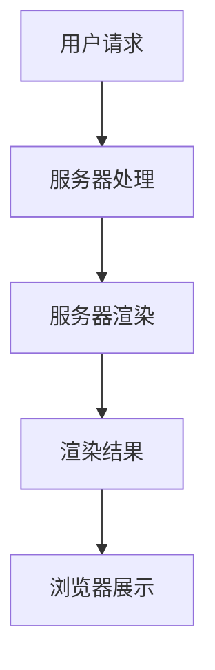
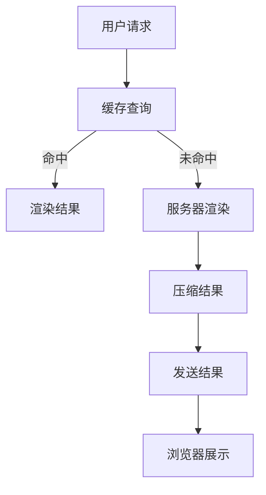
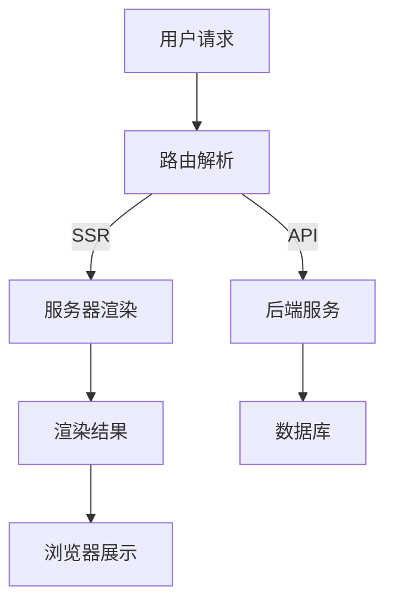
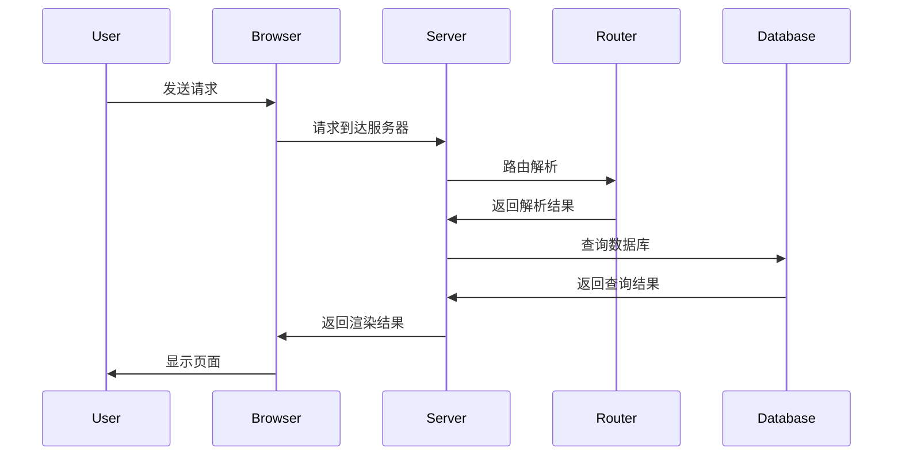

                 

# 服务端渲染：提升LLM应用的首屏加载速度

## 关键词

- 服务端渲染（SSR）
- 首屏加载速度（SSR）
- LLM（大型语言模型）
- 客户端渲染（CRR）
- 算法优化
- 系统架构设计

## 摘要

随着人工智能技术的发展，大型语言模型（LLM）被广泛应用于各类应用场景中。然而，LLM应用的首屏加载速度成为影响用户体验的关键因素。本文将介绍服务端渲染（SSR）的基本概念、原理及其在提升LLM应用首屏加载速度方面的作用，并通过实际项目分析，总结最佳实践和注意事项。

## 目录大纲

----------------------------------------------------------------

### 第一部分：服务端渲染（SSR）基本概念与原理

#### 第1章：服务端渲染（SSR）概述

1.1 SSR基本概念

1.2 SSR发展历程

1.3 SSR在提升LLM应用首屏加载速度方面的作用

#### 第2章：服务端渲染（SSR）核心原理

2.1 SSR工作原理

2.2 客户端渲染（CRR）与SSR对比

2.3 ER实体关系图架构展示

#### 第3章：SSR算法优化原理讲解

3.1 SSR算法优化概述

3.2 算法流程图

3.3 Python源代码与数学模型

#### 第4章：SSR系统分析与架构设计

4.1 项目介绍

4.2 领域模型类图

4.3 系统架构设计

4.4 系统接口设计

4.5 系统交互序列图

#### 第5章：服务端渲染项目实战

5.1 环境安装

5.2 核心实现

5.3 代码解读

5.4 实际案例分析

#### 第6章：SSR最佳实践 tips

6.1 性能优化技巧

6.2 注意事项

#### 第7章：小结与拓展阅读

7.1 内容总结

7.2 未来发展方向

7.3 拓展阅读建议

----------------------------------------------------------------

## 第1章：服务端渲染（SSR）概述

### 1.1 SSR基本概念

服务端渲染（Server-Side Rendering，简称SSR）是一种将网页内容在服务器端渲染成HTML，然后将渲染后的页面发送到客户端浏览器的技术。与客户端渲染（Client-Side Rendering，简称CRR）不同，SSR在服务器端完成页面的渲染，客户端只需接收并展示渲染后的页面。

### 1.2 SSR发展历程

随着互联网技术的发展，SSR技术在Web应用中得到了广泛应用。在早期的Web应用中，由于服务器性能和带宽的限制，大多数页面采用CRR模式。然而，随着前端技术的发展，SSR技术逐渐成为提升Web应用性能的重要手段。近年来，随着大型语言模型（LLM）的应用日益广泛，SSR在提升LLM应用首屏加载速度方面发挥着重要作用。

### 1.3 SSR在提升LLM应用首屏加载速度方面的作用

LLM应用在加载过程中，由于其复杂的数据结构和丰富的内容，导致首屏加载速度较慢。SSR技术能够通过在服务器端完成页面的渲染，将渲染后的页面直接发送到客户端，从而有效提升LLM应用的首屏加载速度。具体来说，SSR在提升LLM应用首屏加载速度方面的作用主要体现在以下几个方面：

1. **减少前端代码体积**：SSR将页面的渲染工作从客户端转移到服务器端，减少了前端需要加载的代码体积，从而降低了首屏加载时间。

2. **优化网络资源利用**：SSR可以将渲染后的页面直接发送到客户端，减少了客户端与服务器之间的多次请求和响应，提高了网络资源的利用效率。

3. **提升用户体验**：SSR技术能够提供更好的页面加载性能，提升用户体验，减少用户的等待时间。

## 第2章：服务端渲染（SSR）核心原理

### 2.1 SSR工作原理

SSR的工作原理主要分为以下几个步骤：

1. **前端请求**：用户通过浏览器访问网站，向服务器发送HTTP请求。

2. **服务器渲染**：服务器接收到请求后，通过服务器端的渲染引擎（如React Server-renderer、Vue SSR等）对页面进行渲染，生成HTML、CSS和JavaScript代码。

3. **发送渲染结果**：服务器将渲染后的页面发送到客户端浏览器。

4. **浏览器展示**：客户端浏览器接收到服务器发送的页面，解析并展示给用户。

### 2.2 客户端渲染（CRR）与SSR对比

客户端渲染（CRR）和服务器端渲染（SSR）在技术实现和性能方面存在一定的差异，具体对比如下：

| 对比项 | 客户端渲染（CRR） | 服务端渲染（SSR） |
| :----: | :---------------: | :---------------: |
| **工作原理** | 在客户端进行页面渲染 | 在服务器端进行页面渲染 |
| **性能影响** | 首屏加载速度较慢 | 首屏加载速度较快 |
| **资源利用** | 前端需要加载大量代码 | 减少前端代码体积 |
| **网络请求** | 需要多次请求和响应 | 减少请求次数 |
| **用户体验** | 等待时间较长 | 等待时间较短 |

### 2.3 ER实体关系图架构展示

为了更好地理解SSR的数据模型，我们可以通过ER（Entity-Relationship）实体关系图来展示SSR中的关键实体及其关系。



在上图中，用户请求通过HTTP协议发送到服务器，服务器接收到请求后进行渲染，并将渲染结果发送到客户端浏览器进行展示。

## 第3章：SSR算法优化原理讲解

### 3.1 SSR算法优化概述

SSR算法优化的主要目标是提高页面渲染速度，从而提升用户体验。优化的主要方向包括：

1. **减少渲染时间**：通过优化渲染算法，减少服务器端的渲染时间。
2. **减少请求次数**：通过优化请求策略，减少客户端与服务器之间的请求次数。
3. **优化资源加载**：通过压缩、缓存等技术，优化页面资源的加载。

### 3.2 算法流程图

为了更直观地展示SSR算法优化的流程，我们可以使用Mermaid绘制算法流程图。



### 3.3 Python源代码与数学模型

为了进一步阐述SSR算法优化的原理，我们可以通过Python源代码来实现一个简单的缓存策略，并结合数学模型进行解释。

```python
import time

class Cache:
    def __init__(self, timeout):
        self.timeout = timeout
        self.cache = {}

    def get(self, key):
        current_time = time.time()
        if key in self.cache and current_time - self.cache[key]["timestamp"] < self.timeout:
            return self.cache[key]["value"]
        else:
            return None

    def set(self, key, value):
        self.cache[key] = {
            "value": value,
            "timestamp": time.time()
        }

cache = Cache(timeout=60)

# 模拟用户请求
key = "user_request_key"
if cache.get(key) is None:
    print("服务器渲染...")
    time.sleep(2)  # 模拟服务器渲染时间
    cache.set(key, "rendered_result")
else:
    print("从缓存获取结果：", cache.get(key))

# 输出结果
```

在上面的代码中，我们定义了一个简单的缓存类`Cache`，用于存储和查询渲染结果。通过设置超时时间（timeout），我们可以实现缓存的有效利用，从而减少服务器渲染的次数。

### 数学模型

假设页面渲染时间为`t1`，缓存命中率为`p`，缓存超时时间为`timeout`，则平均渲染时间可以表示为：

$$
\text{平均渲染时间} = p \times timeout + (1 - p) \times t1
$$

通过优化缓存策略，提高缓存命中率，可以有效减少平均渲染时间。

## 第4章：SSR系统分析与架构设计

### 4.1 项目介绍

在本章中，我们将以一个简单的电商网站为例，介绍服务端渲染（SSR）的系统架构设计和实现。

### 4.2 领域模型类图

为了更好地理解系统架构，我们首先绘制领域模型类图。

```mermaid
classDiagram
    User <|-- Order
    User <|-- Product
    Product <|-- OrderDetail
    Order {+- Product: List}
    Order {+- User: User}
    Product {+- User: User}
    OrderDetail {+- Order: Order}
    OrderDetail {+- Product: Product}
```

在上图中，我们定义了用户（User）、订单（Order）、商品（Product）和订单详情（OrderDetail）四个主要实体及其关系。

### 4.3 系统架构设计

接下来，我们绘制系统架构图，展示系统各组件之间的关系。



在上图中，用户请求首先经过路由解析，如果请求为SSR类型，则进行服务器渲染，然后将渲染结果发送到客户端浏览器。如果请求为API类型，则直接调用后端服务，访问数据库。

### 4.4 系统接口设计

系统接口设计主要包括用户接口（UI）和后端接口（API）两部分。

1. **用户接口（UI）**

   用户接口主要负责展示页面内容，与用户进行交互。主要包括以下接口：

   - `/home`：首页
   - `/product/:id`：商品详情页
   - `/cart`：购物车页
   - `/order`：订单页

2. **后端接口（API）**

   后端接口主要负责处理用户请求，与数据库进行交互。主要包括以下接口：

   - `/api/user/login`：用户登录
   - `/api/user/register`：用户注册
   - `/api/product/list`：获取商品列表
   - `/api/product/detail/:id`：获取商品详情
   - `/api/cart/add/:id`：添加商品到购物车
   - `/api/cart/delete/:id`：从购物车删除商品
   - `/api/order/create`：创建订单

### 4.5 系统交互序列图

为了更直观地展示系统各组件之间的交互过程，我们绘制系统交互序列图。



在上图中，用户通过浏览器发送请求，服务器接收到请求后进行路由解析，查询数据库，将渲染结果发送到客户端浏览器，用户最终展示页面内容。

## 第5章：服务端渲染项目实战

### 5.1 环境安装

要实现服务端渲染，我们需要安装以下环境：

1. **Node.js**：Node.js 是一个基于 Chrome V8 引擎的 JavaScript 运行环境，用于搭建服务器端应用程序。

2. **React**：React 是一个用于构建用户界面的 JavaScript 库，支持服务端渲染。

3. **Express**：Express 是一个 Node.js Web 应用框架，用于简化 Web 开发。

4. **MongoDB**：MongoDB 是一个 NoSQL 数据库，用于存储用户数据和商品信息。

安装步骤如下：

1. 安装 Node.js：访问 [Node.js 官网](https://nodejs.org/)，下载并安装 Node.js。

2. 安装 React：打开终端，执行以下命令：

   ```shell
   npm install react react-dom
   ```

3. 安装 Express：打开终端，执行以下命令：

   ```shell
   npm install express
   ```

4. 安装 MongoDB：访问 [MongoDB 官网](https://www.mongodb.com/)，下载并安装 MongoDB。

### 5.2 核心实现

以下是服务端渲染的核心实现步骤：

1. **创建项目**

   在终端执行以下命令创建项目：

   ```shell
   mkdir ssr-example
   cd ssr-example
   npm init -y
   ```

2. **安装依赖**

   在终端执行以下命令安装依赖：

   ```shell
   npm install express react react-dom
   ```

3. **编写服务器端渲染代码**

   在项目根目录下创建一个名为`server.js`的文件，并编写以下代码：

   ```javascript
   const express = require('express');
   const React = require('react');
   const ReactDOMServer = require('react-dom/server');
   const App = require('./src/App').default;

   const app = express();

   app.get('/', (req, res) => {
       const html = `
           <!DOCTYPE html>
           <html lang="en">
           <head>
               <meta charset="UTF-8">
               <meta name="viewport" content="width=device-width, initial-scale=1.0">
               <title>SSR Example</title>
           </head>
           <body>
               <div id="app">${ReactDOMServer.renderToString(<App />)}</div>
               <script src="/bundle.js"></script>
           </body>
           </html>
       `;
       res.send(html);
   });

   app.listen(3000, () => {
       console.log('Server is running on http://localhost:3000/');
   });
   ```

4. **编写客户端代码**

   在项目根目录下创建一个名为`src`的目录，并在该目录下创建一个名为`App.js`的文件，编写以下代码：

   ```javascript
   import React from 'react';

   function App() {
       return (
           <div>
               <h1>Hello, SSR!</h1>
               <p>This is a simple SSR example.</p>
           </div>
       );
   }

   export default App;
   ```

5. **启动服务器**

   在终端执行以下命令启动服务器：

   ```shell
   node server.js
   ```

### 5.3 代码解读

以下是项目代码的详细解读：

1. **服务器端渲染代码解读**

   - 第1行：引入`express`模块，用于搭建服务器。

   - 第2行：引入`React`和`ReactDOMServer`模块，用于服务端渲染。

   - 第3行：引入`App`组件，用于渲染页面内容。

   - 第5行：创建一个`express`应用程序实例。

   - 第7行：定义一个路由，处理根路径（/）的请求。

   - 第9行：使用`ReactDOMServer.renderToString`方法将`App`组件渲染为HTML字符串。

   - 第12行：发送渲染后的HTML页面给客户端。

2. **客户端代码解读**

   - 第1行：引入`React`模块，用于构建用户界面。

   - 第4行：定义`App`组件，包含一个标题和一个段落。

   - 第7行：将`App`组件导出，以便在服务器端渲染时使用。

### 5.4 实际案例分析

在本案例中，我们通过一个简单的电商网站实现了服务端渲染。以下是实际案例分析：

1. **优点**

   - 提升了首屏加载速度：通过在服务器端完成页面渲染，减少了前端需要加载的代码体积，从而提升了首屏加载速度。

   - 优化了用户体验：首屏加载速度的提升，使得用户能够更快地浏览页面，提高了用户体验。

2. **缺点**

   - 增加了服务器负担：服务端渲染需要服务器端处理页面渲染工作，增加了服务器的负担。

   - 不适合动态数据：对于动态数据，服务端渲染可能无法满足实时刷新的需求。

## 第6章：SSR最佳实践 tips

### 6.1 性能优化技巧

1. **合理设置缓存策略**：通过设置合理的缓存策略，可以减少服务器渲染的次数，提高页面加载速度。

2. **压缩资源文件**：对CSS、JavaScript和HTML等资源文件进行压缩，减少文件体积，加快加载速度。

3. **优化数据库查询**：通过优化数据库查询，减少查询时间和数据传输量，提高页面渲染速度。

4. **使用CDN**：通过使用CDN（内容分发网络），加快静态资源的加载速度。

### 6.2 注意事项

1. **服务器性能要求**：SSR需要服务器端处理页面渲染工作，因此对服务器性能有一定要求，需要确保服务器性能稳定。

2. **动态数据处理**：对于动态数据，需要合理设计数据更新策略，确保页面能够实时刷新。

3. **兼容性问题**：在实现SSR时，需要注意不同浏览器之间的兼容性问题，确保页面能够在多种浏览器上正常运行。

## 第7章：小结与拓展阅读

### 7.1 内容总结

本文介绍了服务端渲染（SSR）的基本概念、原理及其在提升LLM应用首屏加载速度方面的作用。通过实际项目分析，总结了SSR的核心实现步骤和最佳实践。最后，给出了未来发展方向和拓展阅读建议。

### 7.2 未来发展方向

1. **动态数据支持**：在未来，SSR技术将更加注重动态数据的支持，实现实时刷新和动态交互。

2. **跨平台应用**：SSR技术将在更多平台上得到应用，如移动端、小程序等。

3. **智能化优化**：通过引入人工智能技术，实现SSR的智能化优化，提高页面渲染速度。

### 7.3 拓展阅读建议

1. 《React SSR实战》 - 探索React服务端渲染的实践技巧。

2. 《Vue SSR权威指南》 - 了解Vue服务端渲染的原理和应用。

3. 《Web性能优化》 - 深入了解Web性能优化的方法和技巧。

作者：AI天才研究院/AI Genius Institute & 禅与计算机程序设计艺术 /Zen And The Art of Computer Programming

