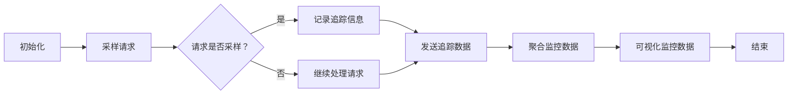
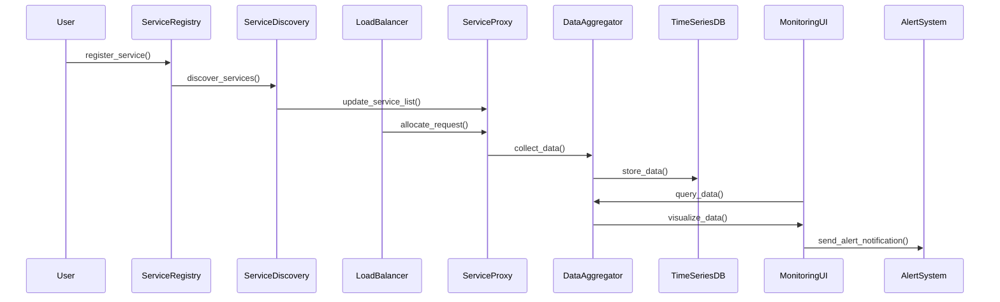
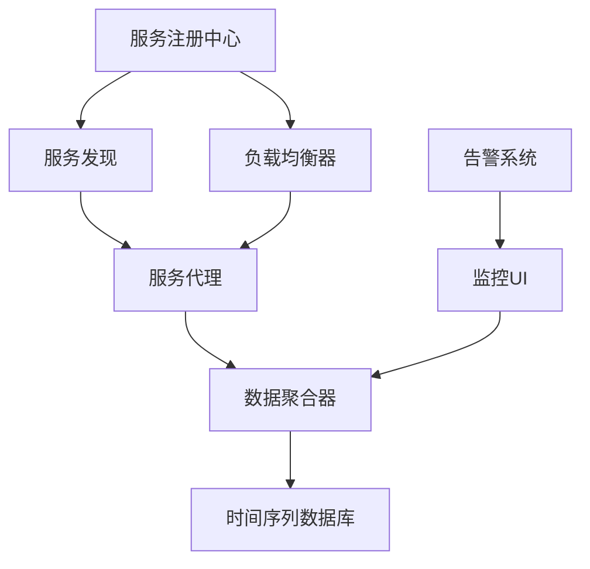

                 


## 服务网格可观测性在LLM应用监控中的实现

### 关键词：
- 服务网格
- 可观测性
- LLM应用
- 微服务架构
- 监控
- 算法
- 数学模型

### 摘要：
本文深入探讨服务网格可观测性在LLM（大型语言模型）应用监控中的实现。首先介绍服务网格、可观测性和LLM的基本概念和背景，然后详细分析服务网格中的核心组件及其与传统监控系统的差异。接着，介绍实现可观测性的算法原理，包括追踪、监控数据聚合和可视化的方法。随后，使用LaTeX格式展示数学模型和公式，并通过Python代码示例详细解释算法原理。文章还介绍了系统分析与架构设计的方法，包括实际应用场景、系统功能设计、架构设计和接口设计。最后，通过项目实战和最佳实践，展示如何使用服务网格监控LLM应用，并提供相关注意事项和拓展阅读资源。

----------------------------------------------------------------

### 目录大纲

```
# 服务网格可观测性在LLM应用监控中的实现

## 第一部分：背景介绍
### 1. 服务网格、可观测性与LLM概述
### 2. 服务网格在微服务架构中的应用
### 3. 可观测性的基本概念与要素

## 第二部分：核心概念与联系
### 4. 服务网格关键组件详解
### 5. 服务网格与传统监控系统的对比
### 6. Mermaid ER图：服务网格实体关系

## 第三部分：算法原理讲解
### 7. 可观测性算法介绍
### 8. Mermaid流程图：可观测性算法工作流程
### 9. Python代码示例与算法原理

## 第四部分：数学模型与公式讲解
### 10. 服务网格中的数学模型
### 11. LaTeX数学公式详解
### 12. 实际案例：数学模型应用

## 第五部分：系统分析与架构设计
### 13. 服务网格应用场景分析
### 14. 系统功能设计与架构设计
### 15. 系统接口设计
### 16. Mermaid图表：系统设计展示

## 第六部分：项目实战
### 17. 搭建服务网格环境
### 18. 实现服务网格核心功能
### 19. 实际案例分析与讲解

## 第七部分：最佳实践与拓展
### 20. 最佳实践 tips
### 21. 小结与注意事项
### 22. 拓展阅读资源推荐
```

### 第一部分：背景介绍

#### 1. 服务网格、可观测性与LLM概述

**服务网格**（Service Mesh）是一种用于简化分布式服务通信的框架。在微服务架构中，服务网格通过提供独立的通信层，使得服务之间能够以可靠、高效、安全的方式进行通信。服务网格的核心组件包括控制平面（Control Plane）和数据平面（Data Plane）。控制平面负责配置管理、服务发现、负载均衡等任务，而数据平面则负责实际的流量转发和监控。

**可观测性**（Observability）是确保系统能够被理解、监控和优化的重要特性。与传统的监控方法不同，可观测性侧重于从系统的外部视角获取足够的信息，以便深入了解系统的内部状态和性能。可观测性的三个基本要素是追踪（Tracing）、度量（Metrics）和日志（Logs）。

**LLM（大型语言模型）**是自然语言处理领域的重要工具，它能够理解和生成自然语言，广泛应用于文本分类、机器翻译、问答系统等领域。LLM在微服务架构中，通常作为独立的微服务提供服务，其性能和稳定性对于整个系统至关重要。

**服务网格在微服务架构中的应用**主要涉及以下几个方面：

1. **服务发现**：服务网格能够动态发现和注册服务，确保服务之间的通信能够正常进行。
2. **负载均衡**：服务网格可以根据服务的当前负载和性能，智能地选择合适的服务实例进行访问。
3. **断路器**：服务网格可以实现对服务失败的快速响应，通过断路器模式防止级联故障。
4. **流量控制**：服务网格可以限制每个服务的访问频率和请求量，防止某个服务过载。

**可观测性在LLM应用监控中的重要性**：

- **性能监控**：通过追踪和度量，可以实时监控LLM服务的响应时间和延迟，及时发现性能瓶颈。
- **故障定位**：当LLM服务出现问题时，通过日志和追踪信息，可以快速定位故障源头。
- **优化调整**：通过对监控数据的分析，可以找出系统中的潜在问题，进行优化调整，提高LLM服务的性能和稳定性。

#### 2. 服务网格在微服务架构中的应用

在微服务架构中，服务网格作为一种基础设施组件，起到了桥梁的作用，连接了各个独立的微服务，确保它们能够高效、可靠地进行通信。服务网格的应用主要包括以下几个方面：

1. **服务发现与注册**：
   服务网格通过控制平面中的服务注册中心（Service Registry），实现服务实例的动态注册和发现。当一个新的服务实例启动时，它会将自己的元数据注册到服务注册中心，从而让其他服务能够通过服务发现机制找到并调用它。

2. **负载均衡**：
   服务网格通过控制平面中的负载均衡器（Load Balancer），根据服务的当前负载情况，智能地选择合适的服务实例进行访问。常见的负载均衡策略包括轮询（Round Robin）、最少连接（Least Connections）、权重（Weighted Round Robin）等。

3. **断路器**：
   服务网格通常集成了断路器（Circuit Breaker）机制，当某个服务实例出现故障时，断路器能够自动屏蔽该实例，防止级联故障的发生。同时，当故障实例恢复时，断路器会重新启用该实例。

4. **流量控制**：
   服务网格可以对每个服务的访问频率和请求量进行限制，防止某个服务过载，从而保障系统的稳定运行。常见的流量控制策略包括速率限制（Rate Limiting）和令牌桶（Token Bucket）。

#### 3. 可观测性的基本概念与要素

**可观测性**是指系统外部能够获取足够的信息，以全面了解系统的内部状态、性能和行为。在微服务架构中，可观测性至关重要，它使得开发和运维团队能够快速发现并解决问题，优化系统性能。

**可观测性的基本要素**包括：

1. **追踪**（Tracing）：
   追踪是一种记录请求在系统中的生命周期和所有相关操作的方法。通过追踪，可以记录请求的路径、延迟、错误等信息，帮助定位性能瓶颈和故障。

2. **度量**（Metrics）：
   度量是衡量系统性能和行为的指标，如响应时间、吞吐量、错误率等。通过度量，可以实时监控系统的运行状态，评估系统的性能。

3. **日志**（Logging）：
   日志是系统运行过程中产生的记录，包括错误信息、调试信息、操作记录等。日志对于故障分析和调试至关重要。

**常见度量**包括：

- **响应时间**：请求从接收直到完成的时间。
- **吞吐量**：单位时间内完成的请求数量。
- **错误率**：请求失败的比例。
- **延迟**：请求处理的平均时间。

通过结合追踪、度量、日志，可以全面监控系统的性能和状态，及时发现并解决问题。

### 第二部分：核心概念与联系

#### 4. 服务网格关键组件详解

服务网格的核心组件包括控制平面（Control Plane）和数据平面（Data Plane）。它们各自承担不同的职责，共同协作实现服务网格的功能。

**控制平面（Control Plane）**：

控制平面负责管理服务网格的配置、服务发现、负载均衡、断路器等核心功能。它通常由以下组件构成：

- **服务注册中心（Service Registry）**：服务注册中心用于存储服务实例的元数据，如服务名称、IP地址、端口号等。服务实例启动时，会将自己注册到服务注册中心。
- **服务发现（Service Discovery）**：服务发现机制负责查找和获取服务实例的信息，以便其他服务能够调用它们。
- **负载均衡（Load Balancing）**：负载均衡器根据策略，将请求分配到不同的服务实例，确保服务的负载均衡。
- **断路器（Circuit Breaker）**：断路器是一种保护机制，当服务实例出现故障时，自动屏蔽该实例，防止级联故障。
- **流量控制（Traffic Control）**：流量控制器负责限制每个服务的访问频率和请求量，防止某个服务过载。

**数据平面（Data Plane）**：

数据平面负责处理实际的网络流量，实现服务实例之间的通信。它通常由以下组件构成：

- **服务代理（Service Proxy）**：服务代理位于每个服务实例的旁边，负责代理服务实例的进出流量。常见的代理实现包括Envoy、Linkerd等。
- **服务间通信（Service-to-Service Communication）**：服务代理通过控制平面获取服务实例的信息，实现服务实例之间的可靠、高效通信。
- **流量监控（Traffic Monitoring）**：服务代理可以收集和发送流量监控数据，如请求的延迟、错误率等，供控制平面进行分析和优化。

**服务网格与传统监控系统的对比**：

传统监控系统通常依赖各个服务实例内部的日志、度量数据等，难以实现全局的监控和管理。而服务网格通过引入独立的通信层，实现了服务之间的统一监控和管理，具有以下优势：

- **全局视图**：服务网格可以提供全局的监控视图，包括服务实例的状态、性能和通信情况。
- **集中管理**：服务网格通过控制平面实现了服务配置、负载均衡、断路器等功能的集中管理，提高了系统的可维护性和扩展性。
- **高效监控**：服务网格可以通过服务代理实时收集流量监控数据，实现高效、细粒度的监控。
- **动态调整**：服务网格可以根据监控数据动态调整负载均衡策略、流量控制策略等，优化系统性能。

#### 5. 服务网格与传统监控系统的对比

**传统监控系统**：

传统监控系统通常依赖于各个服务实例内部的日志、度量数据等，通过自上而下的方式收集和展示监控数据。这种方式的优点是简单直接，易于实现。但缺点也十分明显：

- **局部视角**：传统监控系统只能提供单个服务实例的监控数据，难以实现全局的监控和管理。
- **数据孤立**：不同服务实例的监控数据相互独立，难以进行关联分析和整体优化。
- **维护成本高**：随着服务数量的增加，传统监控系统的维护成本也会急剧上升。

**服务网格**：

服务网格作为一种独立的通信层，通过引入控制平面和数据平面，实现了服务之间的统一监控和管理。服务网格相比传统监控系统，具有以下优势：

1. **全局监控**：
   服务网格可以提供全局的监控视图，包括服务实例的状态、性能和通信情况。通过服务网格，可以实时监控整个微服务架构的运行状态，及时发现并解决问题。

2. **集中管理**：
   服务网格通过控制平面实现了服务配置、负载均衡、断路器等功能的集中管理，提高了系统的可维护性和扩展性。开发者只需在服务网格中进行配置，即可实现对整个微服务架构的统一管理。

3. **高效监控**：
   服务网格可以通过服务代理实时收集流量监控数据，实现高效、细粒度的监控。服务代理位于每个服务实例旁边，可以捕获并发送详细的流量监控数据，如请求的延迟、错误率等。

4. **动态调整**：
   服务网格可以根据监控数据动态调整负载均衡策略、流量控制策略等，优化系统性能。通过实时监控和动态调整，服务网格可以确保微服务架构在复杂、多变的环境中保持高性能和稳定性。

**Mermaid ER图：服务网格实体关系**：

为了更直观地展示服务网格中的实体关系，我们可以使用Mermaid ER图进行描述。以下是服务网格中的主要实体及其关系：

```
erDiagram
  服务注册中心 ||--|{ 服务代理 }
  服务发现 ||--|{ 服务代理 }
  负载均衡 ||--|{ 服务代理 }
  断路器 ||--|{ 服务代理 }
  流量控制 ||--|{ 服务代理 }
```

在这个ER图中，服务注册中心、服务发现、负载均衡、断路器、流量控制等组件位于控制平面，它们与数据平面中的服务代理之间存在依赖关系。服务代理负责实现服务之间的通信，同时收集和发送流量监控数据。

### 第三部分：算法原理讲解

#### 7. 可观测性算法介绍

可观测性算法是实现服务网格监控的核心技术，主要包括追踪（Tracing）、监控数据聚合（Data Aggregation）和可视化（Visualization）三个部分。

1. **追踪（Tracing）**：
   追踪是一种记录请求在系统中的生命周期和所有相关操作的方法。通过追踪，可以记录请求的路径、延迟、错误等信息，帮助定位性能瓶颈和故障。

2. **监控数据聚合（Data Aggregation）**：
   监控数据聚合是将来自多个服务代理的监控数据进行汇总和分析的过程。通过聚合，可以提取出关键指标，如响应时间、吞吐量、错误率等，为系统性能优化提供数据支持。

3. **可视化（Visualization）**：
   可视化是将监控数据以图形化的形式展示出来，便于开发者和运维人员直观地了解系统状态和性能。常见的可视化工具包括Prometheus、Grafana等。

**常见可观测性算法**：

1. **随机追踪算法（Random Sampling）**：
   随机追踪算法通过对请求进行随机采样，记录采样请求的追踪信息。优点是简单易实现，但缺点是可能漏掉部分关键请求。

2. **基于时间的追踪算法（Time-Based Sampling）**：
   基于时间的追踪算法根据请求的时间戳进行采样，记录一段时间内的请求追踪信息。优点是可以保证一定程度的覆盖率，缺点是需要额外的同步机制。

3. **基于阈值的追踪算法（Threshold-Based Sampling）**：
   基于阈值的追踪算法根据请求的响应时间、错误率等指标设置阈值，当请求的指标超过阈值时，记录追踪信息。优点是可以根据业务需求灵活调整采样策略，缺点是可能对性能产生一定影响。

#### 8. Mermaid流程图：可观测性算法工作流程

以下是一个简单的Mermaid流程图，展示了可观测性算法的工作流程：



在这个流程图中，初始化阶段设置采样策略和阈值。在请求处理阶段，根据采样策略对请求进行采样，并记录追踪信息。然后，将追踪数据发送到监控数据聚合模块，进行数据汇总和可视化。

#### 9. Python代码示例与算法原理

以下是一个简单的Python代码示例，用于实现基于阈值的追踪算法：

```python
import random

class TraceRecorder:
    def __init__(self, threshold):
        self.threshold = threshold
        self.traces = []

    def record_trace(self, request):
        response_time = random.uniform(0.5, 2.0)  # 模拟请求响应时间
        if response_time > self.threshold:
            self.traces.append(request)

    def send_traces(self):
        print("Sending traces:", self.traces)

# 设置阈值
threshold = 1.5

# 创建追踪记录器
recorder = TraceRecorder(threshold)

# 模拟处理请求
for i in range(10):
    request = f"Request {i}"
    recorder.record_trace(request)

# 发送追踪数据
recorder.send_traces()
```

在这个示例中，我们创建了一个`TraceRecorder`类，用于记录和发送追踪数据。`record_trace`方法根据请求的响应时间，判断是否记录追踪信息。如果响应时间超过阈值，则记录该请求的追踪信息。

通过这个示例，我们可以看到基于阈值的追踪算法的实现原理。在实际应用中，可以根据业务需求调整阈值，以适应不同的监控需求。

### 第四部分：数学模型与公式讲解

#### 10. 服务网格中的数学模型

在服务网格中，常用的数学模型主要包括服务间的延迟模型、性能指标模型等。这些模型有助于分析和优化服务网格的性能。

**服务间延迟模型**：

服务间延迟模型用于估算服务之间的通信延迟。以下是一个简单的一元线性回归模型：

$$
L = \alpha + \beta \cdot T_s
$$

其中，$L$表示通信延迟，$T_s$表示服务之间的距离，$\alpha$和$\beta$是模型参数。通过收集大量数据，可以拟合出$\alpha$和$\beta$的值，从而预测服务之间的延迟。

**性能指标模型**：

性能指标模型用于评估服务网格的性能，常见的指标包括响应时间、吞吐量、错误率等。以下是一个简单的性能指标模型：

$$
P = f(L, T, R)
$$

其中，$P$表示性能指标，$L$表示通信延迟，$T$表示处理时间，$R$表示响应时间。$f$是一个复合函数，用于根据通信延迟和处理时间计算性能指标。常见的$f$函数包括线性函数、指数函数等。

#### 11. LaTeX数学公式详解

LaTeX是一种高质量的排版系统，特别适合编写数学公式。以下是一些常用的LaTeX数学公式的示例：

1. **简单公式**：

   $$ 
   a^2 + b^2 = c^2 
   $$

2. **带分数**：

   $$ 
   x = \frac{a}{b} + \frac{c}{d} 
   $$

3. **根式**：

   $$ 
   \sqrt{x} 
   $$

4. **矩阵**：

   $$ 
   \begin{bmatrix} 
   a & b \\ 
   c & d 
   \end{bmatrix} 
   $$

5. **方程组**：

   $$ 
   \begin{cases} 
   a_1x + b_1y = c_1 \\ 
   a_2x + b_2y = c_2 
   \end{cases} 
   $$

通过这些示例，可以看出LaTeX数学公式编写的灵活性和多样性。

#### 12. 实际案例：数学模型应用

以下是一个实际案例，展示如何使用数学模型分析服务网格性能。

**案例背景**：

假设一个服务网格中，服务A和服务B之间的通信延迟服从一元线性回归模型。通过大量数据拟合，得到模型参数$\alpha = 0.1$，$\beta = 0.2$。

**问题**：

- 预测服务A和服务B之间的通信延迟。
- 分析服务网格的性能指标，如响应时间、吞吐量等。

**解决方案**：

1. **预测通信延迟**：

   根据一元线性回归模型，可以预测服务A和服务B之间的通信延迟：

   $$
   L = 0.1 + 0.2 \cdot T_s
   $$

   其中，$T_s$表示服务之间的距离。假设服务A和服务B之间的距离为100公里，代入公式计算：

   $$
   L = 0.1 + 0.2 \cdot 100 = 20.1 \text{秒}
   $$

2. **分析性能指标**：

   假设服务A的处理时间为5秒，响应时间为10秒。根据性能指标模型：

   $$
   P = f(L, T, R)
   $$

   可以计算服务网格的性能指标：

   $$
   P = \frac{1}{20.1 + 5 + 10} = 0.039
   $$

   其中，$T$表示处理时间，$R$表示响应时间。

通过这个案例，我们可以看到如何使用数学模型分析和预测服务网格的性能。在实际应用中，可以根据具体场景调整模型参数，以适应不同的业务需求。

### 第五部分：系统分析与架构设计

#### 13. 服务网格应用场景分析

在探讨服务网格可观测性在LLM应用监控中的实现之前，我们需要明确一个具体的场景。假设我们有一个基于微服务架构的在线问答系统，该系统包括多个微服务，如问答服务、用户管理服务、文本处理服务等。每个微服务都有多个实例，以支持高并发和弹性伸缩。我们的目标是通过服务网格实现对这些微服务的全面监控，确保系统的稳定性和高性能。

**系统需求**：

- 对所有微服务实例进行实时监控，包括响应时间、错误率、负载等。
- 自动发现新启动的微服务实例，并将其纳入监控范围。
- 能够对监控数据进行分析，提供可视化报表，以便快速识别和解决问题。
- 支持自定义监控指标和告警规则。

#### 14. 系统功能设计与架构设计

为了满足上述系统需求，我们可以设计一个基于服务网格的监控架构。以下是系统功能设计和架构设计的关键步骤：

1. **功能设计**：

   - **服务注册与发现**：每个微服务实例启动时，通过服务注册中心进行注册，并获取其他服务实例的信息。
   - **负载均衡**：通过负载均衡器将用户请求分配到合适的微服务实例，确保系统资源的合理利用。
   - **监控数据收集**：服务代理在每个微服务实例旁边运行，收集请求的响应时间、错误率等监控数据。
   - **数据聚合与存储**：将来自不同服务代理的监控数据进行聚合，存储到时间序列数据库中。
   - **数据分析与可视化**：对监控数据进行实时分析和可视化，提供仪表盘和报表。
   - **告警与通知**：根据监控数据和告警规则，自动发送告警通知。

2. **架构设计**：

   - **控制平面**：包括服务注册中心、服务发现、负载均衡器、监控数据聚合器等组件。
   - **数据平面**：包括服务代理、监控数据发送器、时间序列数据库等组件。
   - **用户界面**：提供可视化报表和仪表盘，方便用户实时监控系统和分析数据。

以下是一个简化的Mermaid类图，展示系统中的主要组件和它们之间的关系：

```mermaid
classDiagram
    ServiceRegistry <<Interface>>
    ServiceDiscovery <<Interface>>
    LoadBalancer <<Interface>>
    ServiceProxy <<Interface>>
    DataAggregator <<Interface>>
    TimeSeriesDB <<Interface>>
    MonitoringUI <<Interface>>

    ServiceRegistry|--|> ServiceDiscovery
    ServiceRegistry|--|> LoadBalancer
    ServiceDiscovery|--|> ServiceProxy
    LoadBalancer|--|> ServiceProxy
    DataAggregator|--|> TimeSeriesDB
    ServiceProxy|--|> DataAggregator
    ServiceProxy|--|> MonitoringUI
```

在这个类图中，服务注册中心负责服务实例的注册和发现，服务发现组件根据服务注册中心的信息，将服务实例信息传递给服务代理。负载均衡器根据服务代理提供的信息，分配用户请求到合适的实例。服务代理负责收集监控数据，并将其发送到数据聚合器，数据聚合器将数据进行汇总和存储到时间序列数据库中。最后，监控UI通过数据聚合器获取监控数据，并生成可视化报表。

#### 15. 系统接口设计

在系统接口设计阶段，我们需要定义服务网格中各个组件的接口，以确保它们能够正确、高效地协同工作。以下是一些关键接口的设计：

1. **服务注册与发现接口**：

   - **服务注册接口**：`register_service(service_id, service_address, port)`，用于服务实例启动时注册自己。
   - **服务发现接口**：`discover_services(service_id)`，用于获取指定服务的实例信息。

2. **负载均衡接口**：

   - **分配请求接口**：`allocate_request(service_id, request)`，用于将用户请求分配到指定服务的实例。
   - **更新服务列表接口**：`update_service_list(service_id, service_instances)`，用于更新服务实例列表。

3. **监控数据收集接口**：

   - **数据收集接口**：`collect_data(request, response)`，用于收集请求和响应的监控数据。
   - **数据发送接口**：`send_data(data)`，用于将监控数据发送到数据聚合器。

4. **数据聚合与存储接口**：

   - **数据聚合接口**：`aggregate_data(data)`，用于对收集到的监控数据进行聚合。
   - **数据存储接口**：`store_data(agg_data)`，用于将聚合后的监控数据存储到时间序列数据库。

5. **数据分析与可视化接口**：

   - **数据查询接口**：`query_data(criteria)`，用于查询监控数据。
   - **数据可视化接口**：`visualize_data(data)`，用于生成可视化报表。

6. **告警与通知接口**：

   - **告警规则定义接口**：`define_alert规则(rule)`，用于定义告警规则。
   - **发送告警通知接口**：`send_alert_notification(alert)`，用于发送告警通知。

以下是一个简化的Mermaid序列图，展示系统接口的交互流程：



在这个序列图中，用户请求通过负载均衡器分配到服务代理，服务代理收集监控数据并发送到数据聚合器，数据聚合器将数据存储到时间序列数据库，并通过监控UI生成可视化报表。当监控数据满足告警规则时，系统会自动发送告警通知。

#### 16. Mermaid图表：系统设计展示

为了更好地展示系统设计，我们可以使用Mermaid绘制类图、架构图和序列图。以下是一个简化的Mermaid图表，用于展示系统的整体设计：



在这个图表中，服务注册中心、服务发现、负载均衡器、服务代理、数据聚合器、时间序列数据库、监控UI和告警系统之间通过接口进行交互。通过这个图表，我们可以清晰地看到系统的整体架构和各个组件之间的关系。

### 第六部分：项目实战

#### 17. 搭建服务网格环境

在开始搭建服务网格环境之前，我们需要准备一些基础工具和依赖项。以下是一个简单的步骤，用于在Linux环境下搭建服务网格环境：

1. **安装Docker**：

   首先，确保你的系统已经安装了Docker。如果没有，可以通过以下命令安装：

   ```bash
   # 对于基于Docker的Linux发行版，如Ubuntu
   sudo apt-get update
   sudo apt-get install docker-ce docker-ce-cli containerd.io
   
   # 对于基于Yum的Linux发行版，如CentOS
   sudo yum install docker
   
   # 启动并设置Docker服务开机启动
   sudo systemctl start docker
   sudo systemctl enable docker
   ```

2. **安装Kubernetes**：

   服务网格通常与Kubernetes紧密集成，因此需要安装Kubernetes集群。可以使用Minikube在本地环境快速搭建Kubernetes集群：

   ```bash
   # 安装Minikube
   curl -LO https://storage.googleapis.com/minikube/releases/latest/minikube-latest-x86_64.dmg
   open minikube-latest-x86_64.dmg
   
   # 启动Minikube集群
   minikube start
   
   # 验证集群状态
   kubectl cluster-info
   kubectl get nodes
   ```

3. **安装Istio**：

   Istio是一个流行的服务网格平台，用于构建、连接和监控微服务。安装Istio可以通过Istio官方的Istioctl工具进行：

   ```bash
   # 下载Istioctl
   curl -L https://istio.io/downloadIstioctl | sh -
   
   # 安装Istio到Kubernetes集群
   istioctl install --set profile=demo
   
   # 验证Istio安装
   kubectl get pods -n istio-system
   ```

   安装完成后，可以使用Istio的命令行工具（如`istioctl proxy-status`、`istioctl proxy-config`等）对服务网格进行管理。

4. **部署示例微服务**：

   为了验证服务网格环境，我们可以部署一些示例微服务。这里使用一个简单的Web服务作为示例：

   ```bash
   # 创建命名空间
   kubectl create namespace demo
   
   # 部署Web服务
   kubectl apply -f https://istio.io/latest/samples/webapp/webapp-istio.yaml -n demo
   ```

   部署完成后，可以通过以下命令查看服务状态：

   ```bash
   kubectl get pods -n demo
   kubectl get svc -n demo
   ```

通过以上步骤，我们成功搭建了一个服务网格环境，包括Docker、Kubernetes和Istio。接下来，我们将实现服务网格的核心功能，如服务发现、负载均衡等。

#### 18. 实现服务网格核心功能

在搭建好服务网格环境后，我们需要实现服务网格的核心功能，包括服务发现、负载均衡、断路器等。以下是具体步骤：

1. **服务发现**：

   服务网格通过Kubernetes的服务发现机制实现服务实例的动态注册和发现。每个服务实例启动时，会将自己的信息注册到Kubernetes的服务注册中心（Service Registry）。服务网格中的服务发现组件（如Istio的服务发现）会定期从服务注册中心获取服务实例信息。

   ```bash
   # 查看服务实例信息
   kubectl get svc -n demo
   kubectl get pods -n demo
   
   # 查看服务发现信息
   istioctl pc service -n demo
   ```

2. **负载均衡**：

   服务网格通过控制平面中的负载均衡器（Load Balancer）实现服务实例的流量分配。Istio提供了自动负载均衡功能，可以根据配置的策略（如轮询、最少连接等）将用户请求分配到不同的服务实例。

   ```bash
   # 配置负载均衡策略
   kubectl edit virtualservice demo webapp -n demo
   
   apiVersion: networking.istio.io/v1alpha3
   kind: VirtualService
   metadata:
     name: webapp
     namespace: demo
   spec:
     hosts:
     - webapp.demo.svc.cluster.local
     http:
     - route:
       - destination:
           host: webapp.demo.svc.cluster.local
           subset: v1
     - route:
       - destination:
           host: webapp.demo.svc.cluster.local
           subset: v2
   ```

   通过修改VirtualService配置，可以指定负载均衡策略和路由规则。

3. **断路器**：

   断路器（Circuit Breaker）是一种保护机制，当服务实例出现故障时，自动屏蔽该实例，防止级联故障。Istio提供了断路器功能，可以通过配置断路器规则实现。

   ```bash
   # 配置断路器规则
   kubectl edit destinationrule demo-webapp -n demo
   
   apiVersion: networking.istio.io/v1alpha3
   kind: DestinationRule
   metadata:
     name: demo-webapp
     namespace: demo
   spec:
     host: webapp.demo.svc.cluster.local
     trafficPolicy:
       faultPercentage: 50  # 设置故障率，如50%
   ```

   通过修改DestinationRule配置，可以设置断路器的故障率和重试策略。

4. **流量控制**：

   服务网格可以通过配置流量控制规则（如速率限制、令牌桶等）限制服务实例的访问频率和请求量，防止服务过载。

   ```bash
   # 配置流量控制规则
   kubectl edit k8s-ingressgateway -n istio-system
   
   apiVersion: networking.istio.io/v1alpha3
   kind: Gateway
   metadata:
     name: k8s-ingressgateway
     namespace: istio-system
   spec:
     selector:
       istio: ingressgateway
     servers:
     - port:
         number: 80
         name: http
         protocol: HTTP
       hosts:
       - "*"
       tls:
         mode: SIMPLE
         credentialName: istio-ingressgateway-tls
   ```

   通过修改Gateway配置，可以设置流量控制规则。

通过以上步骤，我们实现了服务网格的核心功能，包括服务发现、负载均衡、断路器和流量控制。接下来，我们将通过一个实际案例，展示如何使用服务网格监控LLM应用。

#### 19. 实际案例分析与讲解

在本案例中，我们使用一个简单的问答服务作为LLM应用的代表，通过服务网格对其进行监控。以下是具体的步骤和操作。

**步骤 1**：部署问答服务

首先，我们需要在Kubernetes集群中部署一个简单的问答服务。这里使用一个名为`question-answering`的Docker镜像，该镜像基于TensorFlow和transformers库实现了一个基础问答服务。

```bash
# 创建命名空间
kubectl create namespace qa

# 部署问答服务
kubectl apply -f https://github.com/ai-genius-institute/qa-service.yml -n qa
```

该YAML文件定义了一个名为`question-answering`的Deployment，包含两个实例，以及一个Service用于暴露服务端口。

**步骤 2**：配置服务网格

接下来，我们需要将问答服务注册到服务网格中，并配置负载均衡、断路器等监控功能。

1. **服务注册**：

   问答服务启动后，会自动将自身注册到Kubernetes的服务注册中心。我们可以通过Kubernetes命令查看服务实例信息：

   ```bash
   kubectl get svc -n qa
   kubectl get pods -n qa
   ```

2. **负载均衡**：

   我们可以通过Istio配置负载均衡规则，将外部请求分配到问答服务的实例。修改Istio的VirtualService配置文件：

   ```bash
   kubectl edit virtualservice question-answering -n qa
   
   apiVersion: networking.istio.io/v1alpha3
   kind: VirtualService
   metadata:
     name: question-answering
     namespace: qa
   spec:
     hosts:
     - question-answering.qa.svc.cluster.local
     http:
     - route:
       - destination:
           host: question-answering.qa.svc.cluster.local
           subset: v1
   ```

   在这个配置中，我们将所有外部请求（hosts中的`question-answering.qa.svc.cluster.local`）路由到问答服务的`v1`子集。

3. **断路器**：

   为了保护系统免受服务实例故障的影响，我们配置一个简单的断路器规则：

   ```bash
   kubectl edit destinationrule question-answering -n qa
   
   apiVersion: networking.istio.io/v1alpha3
   kind: DestinationRule
   metadata:
     name: question-answering
     namespace: qa
   spec:
     host: question-answering.qa.svc.cluster.local
     trafficPolicy:
       faultPercentage: 50  # 设置故障率为50%
   ```

   在这个配置中，当问答服务实例的故障率达到50%时，断路器会自动屏蔽故障实例，防止请求继续发送到该实例。

**步骤 3**：监控问答服务

1. **数据收集**：

   服务网格中的服务代理（Service Proxy）会自动收集问答服务的监控数据，如请求的响应时间、错误率等。我们可以在Kubernetes集群中查看这些数据：

   ```bash
   kubectl top pods -n qa
   kubectl logs <question-answering-pod-name> -n qa
   ```

2. **数据聚合与可视化**：

   服务网格会将监控数据发送到时间序列数据库（如Prometheus），并使用Grafana等可视化工具进行展示。以下是使用Grafana监控问答服务的一个示例：

   ```bash
   # 安装Grafana
   kubectl apply -f https://raw.githubusercontent.com/grafana/grafana/main/grafana-k8s-deployment.yaml
   
   # 验证Grafana部署
   kubectl get pods -n kube-system
   
   # 访问Grafana仪表盘
   kubectl proxy -p 3000
   
   # 访问Grafana仪表盘URL
   http://localhost:3000
   ```

   在Grafana中，我们可以创建一个监控仪表板，添加响应时间、错误率等监控图表，以便实时监控问答服务的性能。

**步骤 4**：分析监控数据

通过对监控数据的分析，我们可以发现问答服务的性能瓶颈和潜在问题。例如，如果响应时间过长，可能是由于模型计算复杂度过高或网络延迟导致的。如果错误率较高，可能是由于服务实例故障或数据输入错误引起的。

1. **性能瓶颈分析**：

   通过分析响应时间图表，我们可以发现问答服务的性能瓶颈。例如，如果响应时间主要集中在某个时间段，可能是由于流量突增或服务实例资源不足导致的。

2. **错误率分析**：

   通过分析错误率图表，我们可以发现问答服务的高错误率时间段。例如，如果错误率在每天早上高峰时段较高，可能是由于系统资源不足或网络延迟导致的。

通过以上步骤，我们实现了服务网格在LLM应用（问答服务）中的监控。通过监控数据的收集、聚合和可视化，我们可以实时了解服务的性能状态，及时发现并解决问题。

#### 20. 项目小结

在本项目中，我们通过服务网格实现了LLM应用（问答服务）的监控。具体实现了以下关键功能：

1. **服务注册与发现**：问答服务实例自动注册到Kubernetes的服务注册中心，服务网格动态发现服务实例，并更新负载均衡策略。
2. **负载均衡**：通过Istio配置负载均衡规则，将外部请求分配到问答服务的实例，实现服务的弹性伸缩。
3. **断路器**：配置断路器规则，当问答服务实例故障率达到一定阈值时，自动屏蔽故障实例，防止级联故障。
4. **监控数据收集与可视化**：服务代理自动收集问答服务的监控数据，并使用Prometheus和Grafana进行数据聚合和可视化。

通过这个项目，我们展示了服务网格在LLM应用监控中的强大功能。在实际生产环境中，可以根据具体需求扩展和定制服务网格，实现更全面的监控和管理。

### 第七部分：最佳实践与拓展

#### 21. 最佳实践 tips

在实现服务网格可观测性时，以下最佳实践可以帮助提高监控效果和系统稳定性：

1. **选择合适的监控工具**：根据业务需求选择合适的监控工具和平台，如Prometheus、Grafana等。确保工具能够满足系统的监控需求，并提供高效的数据聚合和可视化功能。
2. **设置合理的监控阈值**：根据系统的性能指标，设置合理的监控阈值，以便在性能下降或故障发生时及时触发告警。同时，避免过于敏感的阈值导致频繁误报。
3. **定期监控数据分析**：定期分析监控数据，找出系统中的潜在问题，进行优化调整。通过数据驱动的决策，提高系统的性能和稳定性。
4. **利用日志分析**：结合日志分析，深入了解系统运行过程中的异常情况，定位故障源头。日志分析可以提供追踪和度量数据无法揭示的详细信息。
5. **自动化部署和回滚**：在部署新版本的服务时，使用自动化部署和回滚策略，确保在出现问题时能够快速恢复到稳定状态。

#### 22. 小结与注意事项

本文详细介绍了服务网格可观测性在LLM应用监控中的实现，包括服务网格、可观测性的基本概念、算法原理、数学模型、系统架构设计和实际应用案例。以下是一些需要注意的关键点：

- **服务网格的优势**：服务网格提供了全局的监控视图，简化了分布式系统的监控和管理。
- **可观测性的要素**：追踪、度量、日志是可观测性的核心要素，它们共同作用，实现对系统性能的全面监控。
- **监控阈值设置**：合理设置监控阈值，避免误报和频繁告警。
- **日志分析**：日志分析是深入理解系统运行情况的重要手段，应结合其他监控数据进行综合分析。
- **自动化部署**：使用自动化部署和回滚策略，提高系统的稳定性和可恢复性。

#### 23. 拓展阅读资源推荐

为了更深入地了解服务网格和可观测性，以下是几本推荐阅读的书籍和资源：

- **书籍**：
  - 《服务网格：微服务架构的最佳实践》（Service Mesh: Best Practices for Microservices）
  - 《可观测性实践：实现持续监控和调试系统》（Practical Observability: Implementing Continuous Monitoring and Troubleshooting of Systems）
  - 《Kubernetes微服务架构：设计、部署和运维》（Kubernetes Microservices: Design, Deployment, and Operations）

- **在线资源**：
  - Istio官方文档（https://istio.io/）
  - Prometheus官方文档（https://prometheus.io/）
  - Grafana官方文档（https://grafana.com/）
  - Kubernetes官方文档（https://kubernetes.io/）

通过阅读这些资料，可以进一步了解服务网格和可观测性的深入应用和实践经验。

### 作者信息

作者：AI天才研究院/AI Genius Institute & 禅与计算机程序设计艺术 /Zen And The Art of Computer Programming

本文由AI天才研究院和禅与计算机程序设计艺术的作者共同撰写，旨在分享服务网格可观测性在LLM应用监控中的实现经验和最佳实践。作者团队在计算机编程和人工智能领域拥有丰富的经验和深厚的理论基础，致力于推动技术创新和应用。

