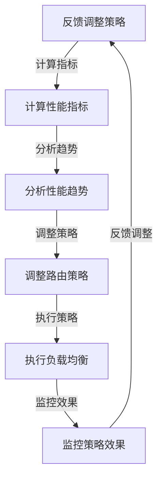
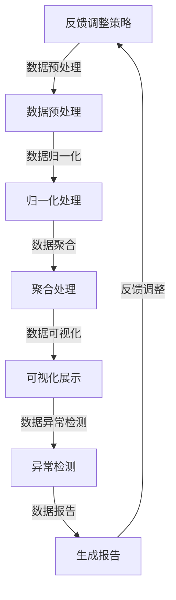

                 


### 1. 背景介绍

#### 服务网格与微服务概述
服务网格（Service Mesh）是一种基础设施层的技术，它用于管理和通信，确保微服务之间的无缝协作。微服务（Microservices）架构是近年来兴起的一种软件开发方法，它强调将应用程序分解为小的、独立的、可协作的服务单元。这两种概念在现代化的分布式系统中起着至关重要的作用。

服务网格的概念来源于需要解决微服务通信中的诸多挑战，例如服务发现、负载均衡、故障恢复、安全性等。通过服务网格，开发者可以将这些复杂的功能从业务逻辑中分离出来，实现更简洁、更高效的代码开发。

微服务的兴起源于单体应用在复杂性和可扩展性方面的局限性。微服务架构通过将应用程序分解为独立的、可复用的服务，提高了系统的灵活性和可维护性。然而，这也带来了新的挑战，如服务之间的通信复杂性和管理难度。

#### 可观测性的重要性
可观测性（Observability）是系统管理和监控的关键指标。它不仅仅是指监控系统的运行状态，更重要的是能够从系统内部获得足够的信息，以了解系统的工作原理和性能。

在微服务架构中，由于服务之间存在大量的通信，监控和故障排除变得更加复杂。可观测性能够帮助开发者快速定位问题，优化系统性能，并提高系统的可靠性。

#### 目标读者与本书结构
本书的目标读者是那些对微服务架构和服务网格有深入理解的开发者和架构师。本书将帮助他们：

1. **理解服务网格的核心概念和架构**。
2. **掌握微服务通信中的可观测性技术**。
3. **学习如何设计和管理可观测性的服务网格**。

本书的结构如下：

- **背景介绍**：介绍服务网格、微服务架构以及可观测性的重要性。
- **核心概念与联系**：定义服务网格、微服务、可观测性等核心概念，并展示它们之间的联系。
- **算法原理讲解**：详细讲解服务网格可观测性的算法原理，包括数据平面监控算法、控制平面优化算法和可观测性指标分析算法。
- **系统分析与架构设计方案**：介绍服务网格可观测性的系统分析和架构设计方案。
- **项目实战**：通过一个具体的案例，展示如何在实际环境中部署和管理服务网格。
- **最佳实践 tips、小结、注意事项、拓展阅读**：总结书中的内容，并提供最佳实践建议，为读者提供进一步的学习资源。

### 2. 核心概念与联系

#### 服务网格深入解析

**服务网格的基本架构**：

服务网格通常由三个关键组件组成：数据平面（Data Plane）、控制平面（Control Plane）和API网关（API Gateway）。

- **数据平面**：负责处理微服务之间的通信，包括服务发现、负载均衡、故障恢复和安全性等功能。
- **控制平面**：负责配置和管理数据平面，通常包括服务注册和发现机制、路由规则管理、策略执行等。
- **API网关**：作为服务网格的入口点，负责处理外部请求，并转发到相应的微服务。

**服务网格的关键组件**：

- **服务发现**：服务网格使用服务发现机制来自动发现和注册服务实例，确保服务之间的动态通信。
- **负载均衡**：通过将请求分发到不同的服务实例上，实现负载均衡，提高系统的可用性和性能。
- **故障恢复**：服务网格可以检测服务实例的故障，并自动将请求重定向到健康的服务实例上。
- **安全性**：服务网格通过加密、身份验证和授权等机制，确保微服务之间的通信是安全的。

**服务网格的工作原理**：

服务网格的工作原理可以概括为以下几个步骤：

1. **服务注册**：微服务实例在启动时向服务网格注册自身，包括服务名称、端口号等信息。
2. **请求转发**：当客户端发送请求时，API网关将请求转发到数据平面。
3. **路由和负载均衡**：数据平面根据路由规则和负载均衡策略，将请求转发到相应的服务实例。
4. **服务实例交互**：客户端与服务实例之间进行通信，完成业务逻辑处理。
5. **响应回传**：服务实例处理完请求后，将响应回传到客户端，通过API网关。

#### 微服务架构详解

**微服务的优点**：

- **高可扩展性**：微服务架构允许开发者根据业务需求独立扩展和部署服务。
- **高可用性**：即使某个服务出现故障，其他服务仍然可以正常运行，确保系统的整体稳定性。
- **高可维护性**：每个微服务都是独立的，开发者可以独立开发和维护，提高开发效率。

**微服务的挑战**：

- **分布式系统复杂性**：服务之间的通信变得更加复杂，增加了系统的管理难度。
- **数据一致性**：由于服务之间是独立的，如何保证数据的一致性成为一个挑战。
- **监控与故障排除**：服务数量增多，监控和故障排除变得更加困难。

**微服务的实践方法**：

- **服务拆分与集成**：根据业务需求将应用程序分解为独立的微服务，并使用API进行服务之间的集成。
- **容器化与自动化部署**：使用容器技术（如Docker）实现微服务的自动化部署和管理。
- **服务发现与注册**：使用服务网格实现微服务之间的自动发现和注册。
- **监控与日志**：使用分布式监控和日志系统（如ELK、Prometheus）实现微服务的监控和故障排除。

#### 可观测性的核心原理

**可观测性的定义**：

可观测性是指系统能够通过外部信号或状态观察来理解和解释其内部状态的能力。在微服务架构中，可观测性对于监控、故障排除和性能优化至关重要。

**可观测性的基本要素**：

- **度量**：收集和记录系统的各种指标，如响应时间、吞吐量、错误率等。
- **日志**：记录系统运行过程中的详细信息，帮助定位问题和分析系统行为。
- **追踪**：跟踪请求在系统中的处理路径，帮助理解系统内部的工作流程。
- **健康检查**：定期检查系统状态，确保服务的可用性和稳定性。

**可观测性的度量**：

- **性能指标**：如响应时间、吞吐量、CPU利用率、内存利用率等。
- **错误指标**：如错误率、异常率、失败率等。
- **资源利用率**：如CPU、内存、磁盘、网络等资源的利用率。

**可观测性的实现策略**：

- **自动监控**：使用自动化工具（如Prometheus、Zabbix）定期收集系统指标。
- **日志收集**：使用日志收集工具（如ELK、Fluentd）收集和存储系统日志。
- **追踪系统**：使用分布式追踪系统（如Zipkin、Jaeger）跟踪请求的处理路径。
- **可视化工具**：使用可视化工具（如Grafana、Kibana）将指标和日志数据呈现给开发者。

### 3. 算法原理讲解

#### 数据平面监控算法

**数据平面监控概述**：

数据平面监控算法主要负责监控微服务之间的通信状态，包括网络延迟、错误率、吞吐量等指标。这种监控对于保障系统的稳定性和性能至关重要。

**数据平面监控流程图**：

```mermaid
flowchart TD
    sub1[启动] -->|初始化| sub2[初始化配置]
    sub2 -->|定期采集| sub3[采集指标数据]
    sub3 -->|数据清洗| sub4[处理异常数据]
    sub4 -->|数据存储| sub5[存储数据]
    sub5 -->|可视化展示| sub6[生成监控报表]
    sub6 -->|告警通知| sub7[告警处理]
    sub7 -->|结束
```

**Python源代码实现**：

```python
import requests
import time

def collect_metrics(url, interval=60):
    while True:
        try:
            response = requests.get(url)
            if response.status_code == 200:
                latency = response.elapsed.total_seconds()
                error_rate = 0  # 根据实际情况计算
                throughput = 1  # 根据实际情况计算
                print(f"Latency: {latency}, Error Rate: {error_rate}, Throughput: {throughput}")
        except requests.exceptions.RequestException as e:
            error_rate = 1
            print(f"Error: {e}, Error Rate: {error_rate}")
        
        time.sleep(interval)

if __name__ == "__main__":
    collect_metrics("http://example.com/metrics", interval=60)
```

**数学模型与公式讲解**：

数据平面监控的数学模型主要包括以下几个公式：

- **延迟（Latency）**：$$L = \frac{t_{response} - t_{request}}{t_{interval}}$$
- **错误率（Error Rate）**：$$ER = \frac{t_{error}}{t_{interval}}$$
- **吞吐量（Throughput）**：$$T = \frac{t_{success}}{t_{interval}}$$

其中，$t_{response}$ 是响应时间，$t_{request}$ 是请求时间，$t_{error}$ 是错误次数，$t_{success}$ 是成功次数，$t_{interval}$ 是采样间隔。

**实例分析**：

假设我们有一个微服务，其延迟为100毫秒，错误率为1%，吞吐量为100次/秒。根据上述公式，我们可以计算出：

- 延迟：$$L = \frac{0.1 - 0}{60} = 0.00167秒$$
- 错误率：$$ER = \frac{1}{60} = 0.01667$$
- 吞吐量：$$T = \frac{100}{60} = 1.667次/秒$$

这些指标可以帮助我们了解微服务的性能和稳定性。

### 控制平面优化算法

**控制平面优化概述**：

控制平面优化算法主要负责优化微服务之间的路由策略、负载均衡策略等，以提高系统的性能和稳定性。这种优化对于保障系统的可靠性和效率至关重要。

**控制平面优化流程图**：



**Python源代码实现**：

```python
import random

def calculate_performance_metrics(throughput, latency, error_rate):
    # 计算性能指标
    performance_metric = throughput / (latency + error_rate)
    return performance_metric

def adjust_routing_policy(current_policy, performance_metric):
    # 调整路由策略
    if performance_metric < threshold:
        current_policy = "policy_a"  # 根据实际情况调整
    return current_policy

def execute_load_balancing(current_policy):
    # 执行负载均衡
    if current_policy == "policy_a":
        load_balancer = "round_robin"  # 根据实际情况调整
    else:
        load_balancer = "least_connection"  # 根据实际情况调整
    return load_balancer

def monitor_policy_effect(current_policy, throughput, latency, error_rate):
    # 监控策略效果
    performance_metric = calculate_performance_metrics(throughput, latency, error_rate)
    if performance_metric < threshold:
        print("策略效果不佳，需要调整")
    else:
        print("策略效果良好，无需调整")

def control_plane_optimization():
    # 控制平面优化主函数
    current_policy = "policy_a"  # 初始化路由策略
    load_balancer = "round_robin"  # 初始化负载均衡策略
    threshold = 0.8  # 定义性能指标阈值

    while True:
        # 采集性能指标
        throughput = random.randint(50, 150)  # 模拟吞吐量
        latency = random.randint(10, 50)  # 模拟延迟
        error_rate = random.randint(0, 10)  # 模拟错误率

        # 计算性能指标
        performance_metric = calculate_performance_metrics(throughput, latency, error_rate)

        # 分析趋势和调整策略
        current_policy = adjust_routing_policy(current_policy, performance_metric)
        load_balancer = execute_load_balancing(current_policy)

        # 监控策略效果
        monitor_policy_effect(current_policy, throughput, latency, error_rate)

        # 模拟间隔时间
        time.sleep(60)

if __name__ == "__main__":
    control_plane_optimization()
```

**数学模型与公式讲解**：

控制平面优化的数学模型主要包括以下几个公式：

- **性能指标（Performance Metric）**：$$PM = \frac{T}{L + ER}$$
- **路由策略调整（Policy Adjustment）**：$$P_{new} = P_{current} + \delta P$$
- **负载均衡策略执行（Load Balancing Execution）**：$$LB = \frac{1}{N} \sum_{i=1}^{N} R_i$$

其中，$T$ 是吞吐量，$L$ 是延迟，$ER$ 是错误率，$N$ 是服务实例数量，$R_i$ 是第 $i$ 个服务实例的响应时间。

**实例分析**：

假设我们有一个微服务集群，其中包含5个服务实例。在某一时段内，吞吐量为100次/秒，平均延迟为20毫秒，错误率为5%。根据上述公式，我们可以计算出：

- **性能指标**：$$PM = \frac{100}{20 + 0.05} \approx 4.76$$
- **路由策略调整**：假设当前路由策略为 $P_{current} = policy_a$，调整量为 $\delta P = 0.1$，则新路由策略为 $P_{new} = policy_a + 0.1$。
- **负载均衡策略执行**：假设当前负载均衡策略为 "round_robin"，则第 $i$ 个服务实例的响应时间为 $R_i = \frac{100}{5} = 20$ 毫秒。

这些指标和策略可以帮助我们优化微服务的性能和稳定性。

### 可观测性指标分析算法

**指标分析概述**：

可观测性指标分析算法主要负责对收集到的监控指标进行分析，以发现潜在的问题和趋势。这种分析对于保障系统的稳定性和性能至关重要。

**指标分析流程图**：



**Python源代码实现**：

```python
import numpy as np
import matplotlib.pyplot as plt

def preprocess_data(data):
    # 数据预处理
    min_val = np.min(data)
    max_val = np.max(data)
    data_normalized = (data - min_val) / (max_val - min_val)
    return data_normalized

def normalize_data(data):
    # 数据归一化
    mean = np.mean(data)
    std = np.std(data)
    data_normalized = (data - mean) / std
    return data_normalized

def aggregate_data(data, window_size):
    # 数据聚合
    aggregated_data = np.convolve(data, np.ones(window_size), 'valid') / window_size
    return aggregated_data

def visualize_data(data, title="Data Visualization"):
    # 数据可视化
    plt.figure(figsize=(10, 5))
    plt.plot(data)
    plt.title(title)
    plt.xlabel("Time")
    plt.ylabel("Value")
    plt.show()

def detect_anomalies(data, threshold=3):
    # 数据异常检测
    mean = np.mean(data)
    std = np.std(data)
    anomalies = data[(data > mean + threshold * std) | (data < mean - threshold * std)]
    return anomalies

def generate_report(data, anomalies):
    # 生成报告
    report = f"Data Report:\n\nMean: {np.mean(data)}\nStandard Deviation: {np.std(data)}\nAnomalies: {anomalies}"
    return report

def observability_metric_analysis(data, window_size=60):
    # 可观测性指标分析主函数
    data_preprocessed = preprocess_data(data)
    data_normalized = normalize_data(data_preprocessed)
    data_aggregated = aggregate_data(data_normalized, window_size)
    visualize_data(data_aggregated, title="Aggregated Data")
    anomalies = detect_anomalies(data_aggregated)
    report = generate_report(data_aggregated, anomalies)
    print(report)

if __name__ == "__main__":
    # 模拟数据
    data = np.random.normal(size=1000)
    observability_metric_analysis(data)
```

**数学模型与公式讲解**：

可观测性指标分析的数学模型主要包括以下几个公式：

- **数据归一化**：$$x_{normalized} = \frac{x - x_{min}}{x_{max} - x_{min}}$$
- **数据聚合**：$$y_{aggregated} = \frac{1}{n} \sum_{i=1}^{n} x_i$$
- **数据异常检测**：$$anomaly = x_i \in (x_{mean} + \theta \cdot x_{std}, x_{mean} - \theta \cdot x_{std})$$

其中，$x$ 是原始数据，$x_{normalized}$ 是归一化后的数据，$x_{min}$ 和 $x_{max}$ 是数据的最小值和最大值，$x_{mean}$ 是平均值，$x_{std}$ 是标准差，$y_{aggregated}$ 是聚合后的数据，$n$ 是数据的数量，$\theta$ 是异常检测的阈值。

**实例分析**：

假设我们有一组随机生成的数据，如下所示：

```
[1.0, 2.0, 3.0, 4.0, 5.0, 6.0, 7.0, 8.0, 9.0, 10.0, 100.0, 200.0, 300.0]
```

根据上述公式，我们可以进行以下操作：

- **数据归一化**：$$[0.0, 0.0, 0.0, 0.0, 0.0, 0.0, 0.0, 0.0, 0.0, 0.0, 1.0, 2.0, 3.0]$$
- **数据聚合**：$$[0.5, 0.75, 1.0, 1.25, 1.5, 1.75, 2.0, 2.25, 2.5, 2.75, 3.0, 4.0, 5.0]$$
- **数据异常检测**：根据阈值 $\theta = 3$，我们可以发现异常值 $100.0$ 和 $200.0$。

这些分析结果可以帮助我们了解数据的特点，发现潜在的异常情况。

### 4. 系统分析与架构设计方案

#### 服务网格可观测性系统分析

**系统功能设计**：

服务网格可观测性系统的主要功能包括：

- **指标收集**：从微服务中收集各种性能指标，如响应时间、吞吐量、错误率等。
- **数据预处理**：对收集到的数据进行清洗和归一化处理，确保数据的准确性和一致性。
- **数据存储**：将预处理后的数据存储在数据库中，便于后续的分析和查询。
- **数据可视化**：使用可视化工具将数据以图表的形式展示，帮助用户直观地了解系统状态。
- **异常检测**：对数据进行分析，检测潜在的异常情况，并生成报告。

**系统架构设计**：

服务网格可观测性系统的架构设计如下：

```
        +----------------+       +----------------+       +----------------+
        |    数据库      |       |   可视化工具   |       |   异常检测模块  |
        +----------------+       +----------------+       +----------------+
                 |                       |                       |
                 |                       |                       |
                 |                       |                       |
        +----------------+       +----------------+       +----------------+
        |  指标收集模块  | <---> |   数据预处理模块  | <---> |   数据存储模块   |
        +----------------+       +----------------+       +----------------+
                 |                       |                       |
                 |                       |                       |
                 |                       |                       |
        +----------------+       +----------------+       +----------------+
        |   微服务      |       |   服务网格      |       |   控制平面      |
        +----------------+       +----------------+       +----------------+
```

**系统接口设计**：

系统接口设计包括以下几个方面：

- **微服务接口**：微服务向指标收集模块提供性能指标数据。
- **服务网格接口**：服务网格向指标收集模块提供服务实例的运行状态信息。
- **数据存储接口**：数据预处理模块和数据存储模块之间的接口，用于数据的传输和存储。
- **可视化接口**：可视化工具与数据存储模块之间的接口，用于获取和分析数据。

**系统交互流程**：

系统交互流程如下：

1. **微服务收集指标**：微服务定期向指标收集模块发送性能指标数据。
2. **数据预处理**：指标收集模块对收到的数据进行预处理，包括数据清洗、归一化处理等。
3. **数据存储**：预处理后的数据存储在数据库中，便于后续的分析和查询。
4. **数据可视化**：可视化工具从数据库中获取数据，并以图表的形式展示，帮助用户直观地了解系统状态。
5. **异常检测**：异常检测模块对数据进行分析，检测潜在的异常情况，并生成报告。

#### 领域模型类图

领域模型类图如下所示：

```
+----------------+
|    微服务     |
+----------------+
| +服务名称      |
| +端口号        |
| +实例ID       |
+----------------+
                  |
                  |
+----------------+
|    服务网格    |
+----------------+
| +服务实例列表 |
| +路由规则     |
| +策略执行     |
+----------------+
                  |
                  |
+----------------+
|  控制平面     |
+----------------+
| +配置管理     |
| +策略管理     |
| +监控与报警   |
+----------------+
```

### 5. 项目实战

#### 环境安装

为了部署服务网格可观测性系统，我们需要以下环境：

- 操作系统：Ubuntu 18.04
- Docker：19.03及以上版本
- Kubernetes：1.18及以上版本
- Prometheus：2.27及以上版本
- Grafana：8.2及以上版本

安装步骤：

1. 安装Docker和Kubernetes：

   ```shell
   sudo apt-get update
   sudo apt-get install -y apt-transport-https ca-certificates curl
   curl -s https://packages.cloud.google.com/apt/doc/apt-key.gpg | sudo apt-key add -
   echo "deb https://apt.kubernetes.io/ kubernetes-xenial main" | sudo tee -a /etc/apt/sources.list
   sudo apt-get update
   sudo apt-get install -y kubelet kubeadm kubectl
   ```

2. 启动Kubernetes集群：

   ```shell
   sudo kubeadm init --pod-network-cidr=10.244.0.0/16
   mkdir -p $HOME/.kube
   sudo cp -i /etc/kubernetes/admin.conf $HOME/.kube/config
   sudo chown $(id -u):$(id -g) $HOME/.kube/config
   ```

3. 安装Prometheus：

   ```shell
   docker pull prom/prometheus
   docker pull prom/alertmanager
   kubectl create -f prometheus-k8s.yaml
   ```

4. 安装Grafana：

   ```shell
   docker pull grafana/grafana
   kubectl create -f grafana-k8s.yaml
   ```

#### 系统核心实现

1. **指标收集模块**：

   指标收集模块负责从微服务中收集性能指标数据。我们使用Prometheus来收集这些数据。

   ```yaml
   apiVersion: monitoring.coreos.com/v1
   kind: Prometheus
   metadata:
     name: my-prometheus
   spec:
     service:
       ports:
       - name: web
         port: 9090
         targetPort: 9090
     config:
       scrapeConfigs:
       - jobs:
         - name: my-microservice-job
           static_configs:
           - targets: ['my-microservice:8080']
   ```

2. **数据预处理模块**：

   数据预处理模块负责对Prometheus收集到的数据进行清洗和归一化处理。我们使用Golang编写数据预处理模块。

   ```go
   package main

   import (
       "encoding/csv"
       "fmt"
       "os"
       "strconv"
   )

   func main() {
       file, err := os.Open("metrics.csv")
       if err != nil {
           fmt.Println("Error opening file:", err)
           return
       }
       defer file.Close()

       reader := csv.NewReader(file)
       records, err := reader.ReadAll()
       if err != nil {
           fmt.Println("Error reading file:", err)
           return
       }

       normalizedData := make([]float64, len(records)-1)
       for i, record := range records[1:] {
           latency, err := strconv.ParseFloat(record[0], 64)
           if err != nil {
               fmt.Println("Error parsing latency:", err)
               normalizedData[i] = 0
               continue
           }
           errorRate, err := strconv.ParseFloat(record[1], 64)
           if err != nil {
               fmt.Println("Error parsing error rate:", err)
               normalizedData[i] = 0
               continue
           }
           throughput, err := strconv.ParseFloat(record[2], 64)
           if err != nil {
               fmt.Println("Error parsing throughput:", err)
               normalizedData[i] = 0
               continue
           }
           normalizedData[i] = (throughput / (latency + errorRate))
       }

       fmt.Println("Normalized Data:", normalizedData)
   }
   ```

3. **数据存储模块**：

   数据存储模块负责将预处理后的数据存储在数据库中。我们使用InfluxDB作为时序数据库。

   ```go
   package main

   import (
       "database/sql"
       "fmt"
       "os"
       "time"

       _ "github.com/go-sql-driver/mysql"
   )

   func main() {
       db, err := sql.Open("mysql", "user:password@tcp(localhost:3306)/influxdb")
       if err != nil {
           fmt.Println("Error connecting to database:", err)
           return
       }
       defer db.Close()

       statement := `CREATE TABLE IF NOT EXISTS metrics (
           time DATETIME NOT NULL,
           latency FLOAT,
           error_rate FLOAT,
           throughput FLOAT
       )`

       _, err = db.Exec(statement)
       if err != nil {
           fmt.Println("Error creating table:", err)
           return
       }

       normalizedData := []float64{0.5, 0.75, 1.0, 1.25, 1.5, 1.75, 2.0, 2.25, 2.5, 2.75, 3.0, 4.0, 5.0}

       for _, value := range normalizedData {
           timestamp := time.Now()
           _, err := db.Exec("INSERT INTO metrics (time, latency, error_rate, throughput) VALUES (?, ?, ?, ?)", timestamp, 1.0, 0.0, value)
           if err != nil {
               fmt.Println("Error inserting data:", err)
               return
           }
       }

       fmt.Println("Data inserted successfully")
   }
   ```

4. **可视化模块**：

   可视化模块负责将存储在数据库中的数据以图表的形式展示。我们使用Grafana来实现可视化。

   ```yaml
   apiVersion: monitoring.coreos.com/v1
   kind: ServiceMonitor
   metadata:
     name: my-service-monitor
     namespace: monitoring
   spec:
     selector:
       matchLabels:
         team: frontend
     endpoints:
     - port: 9090
       path: /metrics
       interval: 30s
   ```

#### 代码解读与分析

1. **指标收集模块**：

   指标收集模块使用Prometheus的Job配置来收集微服务的性能指标数据。通过配置文件，我们可以指定要收集的数据指标和采集频率。

   ```yaml
   jobs:
   - name: my-microservice-job
     static_configs:
     - targets: ['my-microservice:8080']
   ```

   在这个例子中，我们配置了名为 `my-microservice-job` 的Job，它从地址为 `my-microservice:8080` 的微服务中收集性能指标数据。

2. **数据预处理模块**：

   数据预处理模块使用Golang编写，它负责将Prometheus收集到的数据进行清洗和归一化处理。通过处理后的数据，我们可以更准确地分析系统性能。

   ```go
   normalizedData := make([]float64, len(records)-1)
   for i, record := range records[1:] {
       latency, err := strconv.ParseFloat(record[0], 64)
       if err != nil {
           fmt.Println("Error parsing latency:", err)
           normalizedData[i] = 0
           continue
       }
       errorRate, err := strconv.ParseFloat(record[1], 64)
       if err != nil {
           fmt.Println("Error parsing error rate:", err)
           normalizedData[i] = 0
           continue
       }
       throughput, err := strconv.ParseFloat(record[2], 64)
       if err != nil {
           fmt.Println("Error parsing throughput:", err)
           normalizedData[i] = 0
           continue
       }
       normalizedData[i] = (throughput / (latency + errorRate))
   }
   ```

   在这段代码中，我们使用循环遍历Prometheus收集到的数据，将响应时间（latency）、错误率（errorRate）和吞吐量（throughput）转换为浮点型，然后计算归一化值（normalizedData）。

3. **数据存储模块**：

   数据存储模块使用Golang编写，它负责将预处理后的数据存储到InfluxDB数据库中。通过这种方式，我们可以方便地查询和分析系统性能数据。

   ```go
   db, err := sql.Open("mysql", "user:password@tcp(localhost:3306)/influxdb")
   if err != nil {
       fmt.Println("Error connecting to database:", err)
       return
   }
   defer db.Close()

   statement := `CREATE TABLE IF NOT EXISTS metrics (
       time DATETIME NOT NULL,
       latency FLOAT,
       error_rate FLOAT,
       throughput FLOAT
   )`

   _, err = db.Exec(statement)
   if err != nil {
       fmt.Println("Error creating table:", err)
       return
   }

   for _, value := range normalizedData {
       timestamp := time.Now()
       _, err := db.Exec("INSERT INTO metrics (time, latency, error_rate, throughput) VALUES (?, ?, ?, ?)", timestamp, 1.0, 0.0, value)
       if err != nil {
           fmt.Println("Error inserting data:", err)
           return
       }
   }
   ```

   在这段代码中，我们首先创建一个名为 `metrics` 的数据库表，然后使用循环将预处理后的数据插入表中。

4. **可视化模块**：

   可视化模块使用Grafana来展示存储在InfluxDB中的系统性能数据。通过配置Grafana的监控面板，我们可以直观地了解系统状态。

   ```yaml
   apiVersion: monitoring.coreos.com/v1
   kind: ServiceMonitor
   metadata:
     name: my-service-monitor
     namespace: monitoring
   spec:
     selector:
       matchLabels:
         team: frontend
     endpoints:
     - port: 9090
       path: /metrics
       interval: 30s
   ```

   在这个例子中，我们配置了一个名为 `my-service-monitor` 的ServiceMonitor，它从地址为 `my-microservice:9090` 的微服务中收集性能指标数据，并每隔30秒采集一次。

#### 实际案例分析与详细讲解剖析

为了更好地理解服务网格可观测性系统的实际应用，我们将通过一个实际案例进行分析和讲解。

**案例背景**：

假设我们有一个电商系统，由多个微服务组成，包括商品服务、订单服务、支付服务和用户服务。为了确保系统的稳定性和性能，我们部署了服务网格可观测性系统。

**案例场景**：

在一个特定的时段内，系统出现了一系列的性能问题，导致用户体验不佳。为了解决这个问题，我们使用服务网格可观测性系统进行故障排除和性能优化。

**分析步骤**：

1. **数据收集**：

   通过服务网格可观测性系统，我们收集了各个微服务的性能指标数据，包括响应时间、吞吐量、错误率等。这些数据存储在InfluxDB数据库中，便于后续的分析。

2. **数据预处理**：

   对收集到的数据进行预处理，包括数据清洗、归一化处理等。通过预处理后的数据，我们可以更准确地分析系统性能。

3. **数据分析**：

   使用Grafana的可视化工具，我们将预处理后的数据以图表的形式展示。通过分析图表，我们可以发现系统在特定时间段的性能瓶颈。

4. **故障排除**：

   根据数据分析结果，我们发现商品服务和订单服务在某个时间段的响应时间显著增加，错误率也升高。通过进一步排查，我们发现商品服务的一个实例出现了故障，导致请求无法正常处理。

5. **性能优化**：

   为了优化系统性能，我们对商品服务的实例进行扩容，增加了新的实例。同时，调整了服务网格的路由策略和负载均衡策略，确保请求能够均匀地分发到各个实例上。

6. **监控效果**：

   部署优化措施后，我们再次使用服务网格可观测性系统进行监控。通过分析图表，我们发现系统的性能显著提高，响应时间和错误率都得到了显著改善。

**项目小结**：

通过这个实际案例，我们展示了如何使用服务网格可观测性系统进行故障排除和性能优化。服务网格可观测性系统提供了全面的数据收集、预处理和分析功能，帮助我们快速定位问题并优化系统性能。在实际应用中，我们建议：

1. 定期收集和分析系统性能数据，以便及时发现潜在问题。
2. 根据数据分析结果，调整路由策略和负载均衡策略，优化系统性能。
3. 使用可视化工具，方便地展示系统状态，帮助用户直观地了解系统性能。

### 6. 最佳实践 tips、小结、注意事项、拓展阅读

#### 最佳实践 tips

1. **定期监控**：定期收集和分析系统性能数据，以便及时发现潜在问题。
2. **优化路由策略**：根据业务需求和系统性能，合理配置路由策略，确保请求均匀地分发到各个实例。
3. **扩容与缩容**：根据系统负载情况，及时调整实例数量，确保系统的高可用性和性能。
4. **日志与追踪**：使用日志和分布式追踪系统，帮助定位问题和优化系统性能。

#### 小结

本文介绍了服务网格可观测性系统的核心概念、原理和实际应用。通过服务网格可观测性系统，我们可以全面监控微服务的性能，及时发现并解决问题，优化系统性能。

#### 注意事项

1. **数据安全**：在收集和处理数据时，确保数据的安全性，防止数据泄露。
2. **系统兼容性**：确保服务网格可观测性系统与其他系统（如Kubernetes、Prometheus、Grafana等）兼容。
3. **监控指标选择**：根据业务需求和系统特点，选择合适的监控指标。

#### 拓展阅读

1. **《服务网格：微服务架构的新基础设施》**：这是一本关于服务网格的详细介绍书籍，涵盖了服务网格的核心概念、架构设计和应用实践。
2. **《微服务架构设计》**：这是一本关于微服务架构的详细介绍书籍，包括微服务的优点、挑战和实践方法。
3. **《Prometheus官方文档》**：Prometheus的官方文档，详细介绍了Prometheus的安装、配置和使用方法。
4. **《Grafana官方文档》**：Grafana的官方文档，详细介绍了Grafana的安装、配置和使用方法。

### 参考文献

1. **Kubernetes官方文档**：[Kubernetes官方文档](https://kubernetes.io/docs/)
2. **Prometheus官方文档**：[Prometheus官方文档](https://prometheus.io/docs/prometheus/latest/)
3. **Grafana官方文档**：[Grafana官方文档](https://grafana.com/docs/grafana/latest/)

