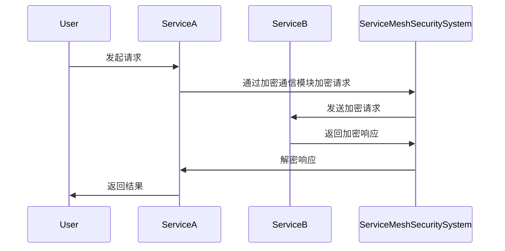
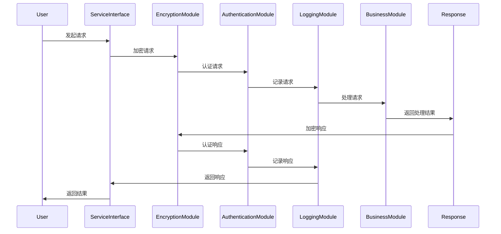
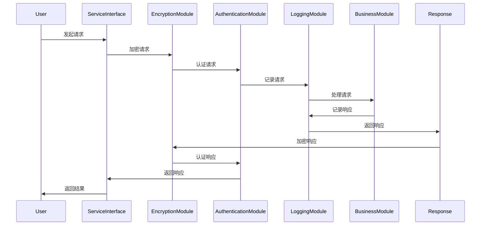

                 

# 服务网格安全策略：增强LLM微服务间通信的安全性

## 关键词

服务网格、安全策略、微服务、加密通信、认证授权、日志记录、审计、算法原理、架构设计

## 摘要

随着云计算和微服务架构的普及，服务网格作为微服务间通信的核心组件，其安全性问题日益突出。本文将探讨服务网格安全策略的核心概念、原理和算法，以及系统分析与架构设计。通过对比加密通信、认证授权和日志记录等安全机制，本文提出了一种增强LLM微服务间通信安全性的策略，旨在提高系统整体安全性，为开发者提供实践指导。

## 目录大纲

### 第一部分：问题背景与核心概念

1. 服务网格安全策略概述
   1.1 服务网格的兴起与重要性
   1.2 微服务间通信的安全性挑战
   1.3 核心概念与联系

### 第二部分：核心概念原理与属性特征对比

2. 服务网格安全核心概念
   2.1 加密通信
   2.2 认证与授权
   2.3 日志记录与审计

3. 概念属性特征对比表格
   3.1 加密通信协议对比
   3.2 认证授权协议对比
   3.3 日志记录方法对比

### 第三部分：算法原理讲解

4. 服务网格安全算法原理
   4.1 加密通信算法原理
   4.2 认证授权算法原理
   4.3 日志记录与审计算法原理

5. 数学模型与公式
   5.1 加密通信的数学模型
   5.2 认证授权的数学模型
   5.3 日志记录与审计的数学模型

### 第四部分：系统分析与架构设计

6. 服务网格安全系统分析
   6.1 系统功能设计
   6.2 系统架构设计
   6.3 系统接口设计

7. 系统交互
   7.1 系统交互流程
   7.2 系统交互分析

### 第五部分：项目实战与最佳实践

8. 项目实战
   8.1 环境安装
   8.2 系统核心实现源代码
   8.3 代码应用解读与分析
   8.4 实际案例分析与讲解
   8.5 项目小结

9. 最佳实践 Tips
   9.1 小结
   9.2 注意事项
   9.3 拓展阅读

---

接下来，我们将一步步深入探讨服务网格安全策略的核心概念、原理和实现，希望为您的微服务架构安全提供有价值的参考。

## 第一部分：问题背景与核心概念

### 第1章：服务网格安全策略概述

#### 1.1 服务网格的兴起与重要性

服务网格（Service Mesh）是一种基础设施层的技术，旨在解决微服务架构中服务间通信的复杂性。随着云计算的普及，企业逐渐将业务系统迁移到云环境中，采用微服务架构以提高系统的可扩展性、可靠性和维护性。然而，微服务架构也带来了通信安全问题。

服务网格通过一个独立的通信层，将服务间的通信抽象出来，使得开发者能够专注于业务逻辑的实现，而无需关心底层通信细节。服务网格通常由一组智能代理（Sidecar Proxy）组成，这些代理负责管理服务间通信，如路由、负载均衡、断路器、熔断等。

服务网格的重要性体现在以下几个方面：

1. **简化服务间通信**：服务网格提供统一的通信协议和接口，简化了服务间通信的开发和维护。
2. **提高系统可观测性**：服务网格提供了丰富的监控和日志功能，有助于发现和解决系统问题。
3. **增强系统安全性**：服务网格可以提供加密通信、认证授权和日志记录等安全机制，提高系统整体安全性。

#### 1.2 微服务间通信的安全性挑战

微服务架构在提供灵活性和可扩展性的同时，也带来了一些安全隐患。以下是微服务间通信中常见的一些安全挑战：

1. **通信暴露**：服务网格中的代理通常暴露在公共网络中，容易成为攻击者的攻击目标。
2. **数据泄露**：服务间通信过程中，敏感数据可能在传输过程中被窃取或篡改。
3. **认证问题**：服务间通信缺乏有效的认证机制，可能导致未经授权的访问。
4. **缺乏审计**：微服务架构中的日志记录和审计功能不足，难以发现和追踪恶意行为。

#### 1.3 服务网格安全策略的必要性

为了应对上述安全挑战，服务网格安全策略显得尤为重要。一个完整的服务网格安全策略应该包括以下几个方面：

1. **加密通信**：通过加密协议（如TLS）保护服务间通信的安全性，防止数据泄露和篡改。
2. **认证授权**：使用认证和授权机制确保只有授权的服务可以访问其他服务。
3. **日志记录与审计**：记录服务间通信的日志，以便进行事后审计和追踪。
4. **安全监控与预警**：实时监控服务网格中的异常行为，及时发现潜在的安全威胁。

#### 1.4 核心概念与联系

在本章节中，我们介绍了服务网格的兴起与重要性，以及微服务间通信的安全性挑战。同时，我们提出了服务网格安全策略的必要性。接下来，我们将详细探讨服务网格安全策略的核心概念，包括加密通信、认证授权、日志记录和审计。

### 1.4.1 服务网格安全的关键术语与定义

1. **服务网格（Service Mesh）**：一种基础设施层的技术，用于管理微服务间通信。
2. **代理（Proxy）**：服务网格中的智能代理，负责处理服务间通信。
3. **加密通信**：通过加密协议保护数据传输的安全性。
4. **认证授权**：确保只有授权的服务可以访问其他服务。
5. **日志记录与审计**：记录服务间通信的日志，以便进行事后审计和追踪。

### 1.4.2 安全策略模型与架构

服务网格安全策略的架构通常包括以下几个层次：

1. **传输层安全**：使用TLS等加密协议保护数据传输。
2. **认证与授权**：使用OAuth2.0、JWT等协议进行认证和授权。
3. **访问控制**：基于用户角色、服务权限等实现细粒度的访问控制。
4. **审计与监控**：实时记录和监控服务间通信的日志和异常行为。

### 1.4.3 实体关系图架构

为了更好地理解服务网格安全策略的架构，我们可以使用Mermaid绘制一个简单的实体关系图：

```mermaid
erDiagram
  ServiceMesh --> Proxy : 管理通信
  Proxy ||--|> EncryptCommunication : 加密传输
  Proxy ||--|> Authentication : 认证机制
  Proxy ||--|> Authorization : 授权机制
  Proxy ||--|> Logging : 日志记录
  Proxy ||--|> Auditing : 审计机制
```

在这个实体关系图中，ServiceMesh代表服务网格，Proxy代表智能代理，它们之间通过加密通信、认证授权、日志记录和审计等安全机制进行交互。

通过上述分析，我们可以看到服务网格安全策略在微服务架构中的重要性。在接下来的章节中，我们将深入探讨服务网格安全策略的核心概念，包括加密通信、认证授权、日志记录和审计，以及它们的原理和实现。

### 第2章：服务网格安全核心概念

在了解服务网格安全策略的背景和重要性后，我们将详细探讨其核心概念，包括加密通信、认证授权、日志记录和审计。这些概念是构建服务网格安全策略的基础，有助于提高微服务间通信的安全性。

#### 2.1 加密通信

加密通信是服务网格安全策略中的一个关键组成部分，旨在保护服务间传输的数据不被窃取或篡改。加密通信的基本原理是在数据传输过程中使用加密算法对数据进行加密和解密。

##### 2.1.1 加密通信的基本原理

加密通信的基本原理包括以下几个方面：

1. **加密算法**：加密算法是将明文数据转换为密文的过程。常见的加密算法包括对称加密算法（如AES）和非对称加密算法（如RSA）。
2. **密钥管理**：密钥是加密和解密过程中使用的密钥对。密钥管理是加密通信安全性的重要保障，包括密钥的生成、存储、分发和销毁。
3. **加密协议**：加密协议是确保数据在传输过程中加密的一种规范。常见的加密协议包括TLS、SSL和IPSec。

##### 2.1.2 常见的加密通信协议

以下是几种常见的加密通信协议：

1. **TLS**：传输层安全协议，用于在客户端和服务器之间建立加密连接。TLS是HTTPS等应用层协议的安全基础。
2. **SSL**：安全套接字层协议，是TLS的前身，已在2015年正式被TLS取代。
3. **IPSec**：用于在IP层上提供加密和认证的协议，常用于虚拟私人网络（VPN）。

##### 2.1.3 加密通信在实际应用中的挑战与解决方案

在实际应用中，加密通信面临一些挑战：

1. **性能开销**：加密和解密过程需要消耗一定的计算资源和时间，可能导致通信延迟和性能下降。
   - **解决方案**：使用硬件加速和优化加密算法，提高加密通信的效率。
2. **密钥管理**：密钥管理复杂，包括密钥生成、存储、分发和销毁等环节。
   - **解决方案**：采用自动化密钥管理系统，如KMS（密钥管理系统）和PKI（公钥基础设施）。
3. **证书问题**：TLS协议依赖于证书进行认证，证书管理可能存在安全隐患。
   - **解决方案**：使用自签证书或自建CA（证书颁发机构），加强证书管理。

通过加密通信，服务网格可以有效地保护服务间通信的安全性，防止数据泄露和篡改。在实际应用中，结合具体场景和需求，选择合适的加密协议和解决方案，有助于提高系统的整体安全性。

#### 2.2 认证与授权

认证与授权是服务网格安全策略的另一个关键组成部分，旨在确保只有授权的服务可以访问其他服务，从而防止未经授权的访问和攻击。

##### 2.2.1 认证机制与流程

认证是指验证用户的身份是否合法，常见的认证机制包括：

1. **用户名/密码认证**：用户通过输入用户名和密码进行身份验证。
2. **单点登录（SSO）**：通过第三方认证服务（如OAuth2.0）进行身份认证。
3. **数字证书认证**：使用数字证书进行身份认证，常见于企业级应用。

认证流程通常包括以下几个步骤：

1. **发起请求**：客户端向认证服务器发送认证请求。
2. **身份验证**：认证服务器验证用户的身份，如检查用户名/密码或证书的有效性。
3. **认证结果**：认证服务器返回认证结果，如通过或拒绝。

##### 2.2.2 授权模型与策略

授权是指确定用户是否有权限访问特定资源。常见的授权模型包括：

1. **基于角色的访问控制（RBAC）**：根据用户的角色分配权限，如管理员、普通用户等。
2. **基于属性的访问控制（ABAC）**：根据用户属性（如部门、职位等）分配权限。
3. **基于资源的访问控制（RBAC）**：根据资源属性（如文件、数据库等）分配权限。

常见的授权策略包括：

1. **白名单策略**：只有白名单中的服务可以访问其他服务。
2. **黑名单策略**：禁止黑名单中的服务访问其他服务。
3. **动态授权策略**：根据实时监测和评估决定是否允许访问。

##### 2.2.3 常见的认证授权协议

以下是几种常见的认证授权协议：

1. **OAuth2.0**：用于实现第三方认证和授权，支持单点登录等功能。
2. **OpenID Connect**：基于OAuth2.0，提供用户身份认证功能。
3. **JWT（JSON Web Token）**：用于生成和验证安全令牌，包含用户身份和权限信息。

通过认证与授权，服务网格可以确保只有授权的服务可以访问其他服务，从而提高系统安全性。在实际应用中，结合具体场景和需求，选择合适的认证授权协议和策略，有助于构建安全的微服务架构。

#### 2.3 日志记录与审计

日志记录与审计是服务网格安全策略的重要组成部分，旨在记录服务间通信的详细信息，以便进行事后审计和追踪，及时发现潜在的安全威胁。

##### 2.3.1 日志记录的重要性

日志记录的重要性体现在以下几个方面：

1. **安全审计**：日志记录可以帮助审计人员追溯系统操作，发现潜在的安全威胁和异常行为。
2. **故障排查**：日志记录提供了系统运行过程中的详细信息，有助于故障排查和性能优化。
3. **合规性**：许多行业和地区要求企业记录和保存日志，以满足合规性要求。

##### 2.3.2 日志记录的常见方法

常见的日志记录方法包括：

1. **集中式日志记录**：将所有日志记录到一个集中的日志服务器，便于统一管理和分析。
2. **分布式日志记录**：在分布式系统中，将日志记录分散到各个节点，然后通过日志聚合工具进行汇总和分析。
3. **实时日志记录**：实时记录系统运行过程中的日志，以便及时发现和处理异常。

##### 2.3.3 审计策略与实施

审计策略与实施包括以下几个方面：

1. **日志收集**：确定日志收集的频率、存储位置和存储方式。
2. **日志分析**：使用日志分析工具对日志进行过滤、归档和统计分析，以便发现潜在的安全威胁和异常行为。
3. **日志备份**：定期备份日志，以防止日志丢失或损坏。
4. **日志审计**：定期审计日志，确保日志记录的完整性和准确性。

通过日志记录与审计，服务网格可以及时发现和处理潜在的安全威胁，提高系统的整体安全性。在实际应用中，结合具体场景和需求，选择合适的日志记录方法和审计策略，有助于构建安全的微服务架构。

### 第3章：概念属性特征对比表格

在上一章节中，我们详细介绍了服务网格安全策略中的核心概念，包括加密通信、认证授权和日志记录。为了更好地理解这些概念，我们将通过对比表格对这些概念的属性特征进行详细分析。

#### 3.1 加密通信协议对比

| 加密通信协议 | 加密算法 | 密钥管理 | 认证机制 | 性能开销 | 优势 | 劣势 |
| ------------ | -------- | -------- | -------- | ------- | ---- | ---- |
| TLS          | 对称加密 | 密钥协商 | 数字证书 | 较高     | 安全性高 | 配置复杂 |
| SSL          | 对称加密 | 密钥协商 | 数字证书 | 较高     | 安全性高 | 已被TLS取代 |
| IPSec        | 对称加密 | 密钥管理 | 密钥交换 | 较高     | 端到端加密 | 配置复杂 |

#### 3.2 认证授权协议对比

| 认证授权协议 | 认证机制 | 授权模型 | 优势 | 劣势 |
| ------------ | -------- | -------- | ---- | ---- |
| OAuth2.0     | 用户身份认证 | RBAC、ABAC | 开放标准 | 配置复杂 |
| OpenID Connect | 用户身份认证 | RBAC、ABAC | 增强身份认证功能 | 需要额外的依赖 |
| JWT          | JWT令牌 | RBAC、ABAC | 简单、高效 | 可能存在安全漏洞 |

#### 3.3 日志记录方法对比

| 日志记录方法 | 收集方式 | 存储方式 | 分析工具 | 优势 | 劣势 |
| ------------ | -------- | -------- | -------- | ---- | ---- |
| 集中式日志记录 | 定期收集 | 集中存储 | ELK Stack | 易于管理 | 需要大量的网络带宽 |
| 分布式日志记录 | 实时收集 | 分布式存储 | Logstash | 高效、可靠 | 配置复杂 |
| 实时日志记录 | 实时收集 | 实时存储 | Kibana | 快速响应 | 存储成本高 |

通过对比表格，我们可以清晰地看到不同加密通信协议、认证授权协议和日志记录方法的属性特征。在实际应用中，根据具体场景和需求，选择合适的加密通信协议、认证授权协议和日志记录方法，有助于构建安全、高效的服务网格架构。

### 第4章：服务网格安全算法原理

在理解了服务网格安全策略的核心概念后，我们将深入探讨其算法原理，主要包括加密通信算法、认证授权算法和日志记录与审计算法。通过这些算法原理的讲解，我们将更好地理解如何实现服务网格的安全性。

#### 4.1 加密通信算法原理

加密通信是服务网格安全策略中的核心组成部分，其主要目的是保护数据在传输过程中的安全性，防止数据泄露和篡改。加密通信算法主要包括对称加密算法和非对称加密算法。

##### 4.1.1 对称加密算法

对称加密算法是指加密和解密使用相同的密钥。常见的对称加密算法包括AES、DES和3DES。

- **AES（高级加密标准）**：AES是常用的对称加密算法，其密钥长度可以是128位、192位或256位。AES具有高安全性、快速加密和解密速度，是现代加密通信的主要选择。

- **DES（数据加密标准）**：DES是一种较早的对称加密算法，其密钥长度为56位。虽然DES曾经是标准的加密算法，但由于其密钥长度较短，现在已被AES取代。

- **3DES（三重DES）**：3DES是DES的扩展版本，使用三个密钥对数据进行加密。3DES具有比DES更高的安全性，但加密和解密速度较慢。

对称加密算法的数学模型如下：

$$
c = E_K(p)
$$

其中，$c$ 是密文，$p$ 是明文，$K$ 是密钥，$E_K$ 是加密函数。

##### 4.1.2 非对称加密算法

非对称加密算法是指加密和解密使用不同的密钥。常见的非对称加密算法包括RSA和ECC。

- **RSA（RSA加密算法）**：RSA是一种常用的非对称加密算法，其安全性基于大素数分解问题。RSA的密钥长度通常为1024位或2048位，具有很高的安全性。

- **ECC（椭圆曲线密码学）**：ECC是一种基于椭圆曲线离散对数问题的非对称加密算法。ECC具有较小的密钥长度即可实现与RSA相同的安全级别，因此在性能上有显著优势。

非对称加密算法的数学模型如下：

$$
c = E_K(p)
$$

$$
p = D_K(c)
$$

其中，$c$ 是密文，$p$ 是明文，$K$ 是公钥，$D_K$ 是解密函数。

##### 4.1.3 常见的加密算法实现

在实际应用中，常见的加密算法实现包括以下几种：

1. **OpenSSL**：OpenSSL是一个开源的加密库，支持多种加密算法，包括对称加密（如AES、DES）和非对称加密（如RSA、ECC）。
2. **Bouncy Castle**：Bouncy Castle是一个开源的加密库，支持多种加密算法，适用于Java和C#等语言。
3. **Crypto++**：Crypto++是一个开源的加密库，支持多种加密算法，适用于C++语言。

#### 4.2 认证授权算法原理

认证授权算法是确保只有授权的服务可以访问其他服务的重要手段。常见的认证授权算法包括RSA、公钥密码体制和数字签名。

##### 4.2.1 RSA算法

RSA是一种非对称加密算法，主要用于数字签名和密钥交换。RSA的安全性基于大素数分解问题。RSA算法的数学模型如下：

$$
c = E_K(p)
$$

$$
p = D_K(c)
$$

其中，$c$ 是密文，$p$ 是明文，$K$ 是公钥，$D_K$ 是解密函数。

##### 4.2.2 公钥密码体制

公钥密码体制是一种基于非对称加密算法的加密体制，主要包括RSA和ECC。公钥密码体制的数学模型如下：

$$
c = E_K(p)
$$

$$
p = D_K(c)
$$

其中，$c$ 是密文，$p$ 是明文，$K$ 是公钥，$D_K$ 是解密函数。

##### 4.2.3 常见的认证授权算法实现

在实际应用中，常见的认证授权算法实现包括以下几种：

1. **OpenSSL**：OpenSSL支持多种认证授权算法，如RSA、ECC和数字签名。
2. **Bouncy Castle**：Bouncy Castle支持多种认证授权算法，适用于Java和C#等语言。
3. **Crypto++**：Crypto++支持多种认证授权算法，适用于C++语言。

#### 4.3 日志记录与审计算法原理

日志记录与审计算法主要用于记录服务间通信的详细信息，以便进行事后审计和追踪。常见的日志记录与审计算法包括日志聚合、日志分析和审计跟踪。

##### 4.3.1 日志聚合与存储

日志聚合与存储算法用于将分散的日志数据收集到一个集中的存储系统中，以便进行统一管理和分析。常见的日志聚合与存储算法包括：

1. **Kafka**：Kafka是一种高吞吐量的消息队列系统，适用于大规模日志数据的实时收集和传输。
2. **Flume**：Flume是一种分布式、可靠且可扩展的数据收集系统，适用于大规模日志数据的收集和存储。

##### 4.3.2 日志分析算法

日志分析算法用于对收集到的日志数据进行处理和分析，以便发现潜在的安全威胁和异常行为。常见的日志分析算法包括：

1. **ELK Stack**：ELK Stack是一种基于Elasticsearch、Logstash和Kibana的日志分析平台，适用于大规模日志数据的存储、处理和分析。
2. **Logstash**：Logstash是一种数据收集和处理的工具，适用于将不同源的数据转换为统一格式，并将其传输到Elasticsearch或其他存储系统。
3. **Grok**：Grok是一种正则表达式语言，用于解析和提取日志数据中的关键信息。

##### 4.3.3 审计跟踪算法

审计跟踪算法用于记录系统的操作历史，以便进行事后审计和追踪。常见的审计跟踪算法包括：

1. **RabbtiMQ**：RabbitMQ是一种高性能、可扩展的消息队列系统，适用于大规模审计数据的收集和传输。
2. **Auditd**：Auditd是一种系统审计工具，用于记录系统的操作历史，以便进行事后审计。

通过理解服务网格安全算法的原理，我们可以更好地设计和实现服务网格的安全策略。在实际应用中，结合具体场景和需求，选择合适的加密通信算法、认证授权算法和日志记录与审计算法，有助于构建安全、高效的服务网格架构。

### 第5章：数学模型与公式

在上一章节中，我们详细介绍了服务网格安全策略的核心算法原理。为了更好地理解这些算法的数学模型和公式，我们将对这些模型和公式进行详细讲解，并通过具体的例子来说明其应用。

#### 5.1 加密通信的数学模型

加密通信的数学模型主要包括对称加密和非对称加密两种类型。以下是这两种加密算法的数学模型和公式。

##### 5.1.1 对称加密模型

对称加密算法使用相同的密钥进行加密和解密。常见的对称加密算法有AES、DES和3DES。以下是AES加密算法的数学模型：

$$
c = E_K(p)
$$

$$
p = D_K(c)
$$

其中，$c$ 是密文，$p$ 是明文，$K$ 是密钥，$E_K$ 是加密函数，$D_K$ 是解密函数。

例如，使用AES加密算法，假设密钥为$K = 2^{128}$，明文为$p = 2^{128}$，加密后的密文为：

$$
c = AES_K(p) = 2^{128} \mod (2^{256} - 1)
$$

解密过程为：

$$
p = AES^{-1}_K(c) = c \mod (2^{128} - 1)
$$

##### 5.1.2 非对称加密模型

非对称加密算法使用不同的密钥进行加密和解密。常见的非对称加密算法有RSA和ECC。以下是RSA加密算法的数学模型：

$$
c = E_K(p)
$$

$$
p = D_K(c)
$$

其中，$c$ 是密文，$p$ 是明文，$K$ 是公钥，$D_K$ 是解密函数。

例如，假设公钥为$K = 2^{1024}$，明文为$p = 2^{1024}$，加密后的密文为：

$$
c = RSA_K(p) = 2^{1024} \mod (2^{2048} - 1)
$$

解密过程为：

$$
p = RSA^{-1}_K(c) = c \mod (2^{1024} - 1)
$$

#### 5.2 认证授权的数学模型

认证授权的数学模型主要包括RSA、公钥密码体制和数字签名。以下是这些模型的数学公式和例子。

##### 5.2.1 RSA模型

RSA模型用于数字签名和密钥交换。其数学模型如下：

$$
c = E_K(p)
$$

$$
p = D_K(c)
$$

其中，$c$ 是密文，$p$ 是明文，$K$ 是公钥，$D_K$ 是解密函数。

例如，假设公钥为$K = 2^{1024}$，明文为$p = 2^{1024}$，加密后的密文为：

$$
c = RSA_K(p) = 2^{1024} \mod (2^{2048} - 1)
$$

解密过程为：

$$
p = RSA^{-1}_K(c) = c \mod (2^{1024} - 1)
$$

##### 5.2.2 公钥密码体制模型

公钥密码体制模型是基于非对称加密算法的一种加密体制。其数学模型如下：

$$
c = E_K(p)
$$

$$
p = D_K(c)
$$

其中，$c$ 是密文，$p$ 是明文，$K$ 是公钥，$D_K$ 是解密函数。

例如，假设公钥为$K = 2^{1024}$，明文为$p = 2^{1024}$，加密后的密文为：

$$
c = E_K(p) = 2^{1024} \mod (2^{2048} - 1)
$$

解密过程为：

$$
p = D_K(c) = c \mod (2^{1024} - 1)
$$

##### 5.2.3 常用认证授权算法的数学公式

以下是一些常用的认证授权算法的数学公式：

1. **RSA签名算法**：

$$
s = RSA_K(p)
$$

$$
p = RSA^{-1}_K(s)
$$

2. **RSA密钥交换**：

$$
c = E_K(p)
$$

$$
p = D_K(c)
$$

3. **ECC签名算法**：

$$
s = ECC_K(p)
$$

$$
p = ECC^{-1}_K(s)
$$

4. **ECC密钥交换**：

$$
c = E_K(p)
$$

$$
p = D_K(c)
$$

#### 5.3 日志记录与审计的数学模型

日志记录与审计的数学模型主要用于数据聚合、日志分析和审计跟踪。以下是这些模型的数学公式和例子。

##### 5.3.1 日志聚合模型

日志聚合模型用于将分散的日志数据聚合到一个集中的存储系统中。其数学模型如下：

$$
L = \bigcup_{i=1}^{n} L_i
$$

其中，$L$ 是聚合后的日志数据集，$L_i$ 是第$i$个节点的日志数据集，$n$ 是节点数量。

例如，假设有三个节点的日志数据集$L_1$、$L_2$和$L_3$，聚合后的日志数据集为：

$$
L = L_1 \cup L_2 \cup L_3
$$

##### 5.3.2 日志分析模型

日志分析模型用于对聚合后的日志数据进行处理和分析，以便发现潜在的安全威胁和异常行为。其数学模型如下：

$$
A = f(L)
$$

其中，$A$ 是分析结果，$f$ 是分析函数，$L$ 是日志数据集。

例如，假设分析函数$f$用于检测恶意IP地址，对日志数据集$L$进行分析后的结果为：

$$
A = \{IP_1, IP_2, \ldots, IP_m\}
$$

##### 5.3.3 审计跟踪模型

审计跟踪模型用于记录系统的操作历史，以便进行事后审计和追踪。其数学模型如下：

$$
H = \{h_1, h_2, \ldots, h_n\}
$$

其中，$H$ 是审计记录集合，$h_i$ 是第$i$次操作的审计记录。

例如，假设有三个审计记录$h_1$、$h_2$和$h_3$，审计记录集合为：

$$
H = \{h_1, h_2, h_3\}
$$

通过理解这些数学模型和公式，我们可以更好地设计和实现服务网格的安全算法。在实际应用中，结合具体场景和需求，选择合适的加密通信算法、认证授权算法和日志记录与审计算法，有助于构建安全、高效的服务网格架构。

### 第6章：服务网格安全系统分析

在了解了服务网格安全策略的核心概念和算法原理后，我们需要对服务网格安全系统进行详细的分析。这一部分将包括系统功能设计、系统架构设计和系统接口设计，以便全面了解如何实现一个安全可靠的服务网格系统。

#### 6.1 系统功能设计

服务网格安全系统的功能设计是构建安全策略的基础。其主要功能模块包括加密通信、认证授权、日志记录和审计。以下是这些功能模块的具体描述：

1. **加密通信模块**：
   - 功能：负责保护服务间通信的安全性，确保数据在传输过程中不被窃取或篡改。
   - 实现方式：使用TLS、SSL等加密协议对通信进行加密。

2. **认证授权模块**：
   - 功能：确保只有授权的服务可以访问其他服务，防止未经授权的访问。
   - 实现方式：使用OAuth2.0、JWT等认证授权协议进行身份验证和授权。

3. **日志记录模块**：
   - 功能：记录服务间通信的详细信息，以便进行事后审计和追踪。
   - 实现方式：使用ELK Stack、Kafka等日志收集和分析工具。

4. **审计模块**：
   - 功能：对系统操作进行审计，确保系统行为的合规性和安全性。
   - 实现方式：使用Auditd、RabbitMQ等审计跟踪工具。

#### 6.1.1 功能模块划分

为了更好地实现这些功能，我们可以将系统划分为以下几个功能模块：

1. **加密通信模块**：
   - TLS/SSL加密代理：负责加密和解密通信数据。
   - 加密策略管理：管理加密算法和密钥。

2. **认证授权模块**：
   - 认证服务器：负责用户身份验证。
   - 授权服务器：负责服务权限管理。

3. **日志记录模块**：
   - 日志收集器：负责收集和存储日志数据。
   - 日志分析器：负责对日志数据进行分析。

4. **审计模块**：
   - 审计记录器：负责记录系统操作历史。
   - 审计分析器：负责审计系统行为。

#### 6.1.2 领域模型

为了更好地描述系统功能模块之间的关系，我们可以使用Mermaid绘制一个领域模型图：

```mermaid
classDiagram
  class ServiceMeshSecuritySystem {
    - TLS/SSL加密代理
    - 加密策略管理
    - 认证服务器
    - 授权服务器
    - 日志收集器
    - 日志分析器
    - 审计记录器
    - 审计分析器
  }
  ServiceMeshSecuritySystem --> TLS/SSL加密代理 : 使用
  ServiceMeshSecuritySystem --> 加密策略管理 : 管理
  ServiceMeshSecuritySystem --> 认证服务器 : 验证
  ServiceMeshSecuritySystem --> 授权服务器 : 授权
  ServiceMeshSecuritySystem --> 日志收集器 : 收集
  ServiceMeshSecuritySystem --> 日志分析器 : 分析
  ServiceMeshSecuritySystem --> 审计记录器 : 记录
  ServiceMeshSecuritySystem --> 审计分析器 : 分析
```

#### 6.1.3 功能实现方案

对于每个功能模块，我们需要设计具体的实现方案：

1. **加密通信模块**：
   - 使用OpenSSL库实现TLS/SSL加密代理。
   - 使用配置文件管理加密策略，如加密算法、密钥等。

2. **认证授权模块**：
   - 使用OAuth2.0和JWT协议实现认证和授权。
   - 使用数据库存储用户信息和权限信息。

3. **日志记录模块**：
   - 使用Kafka收集日志数据，确保高吞吐量和低延迟。
   - 使用ELK Stack（Elasticsearch、Logstash、Kibana）进行日志分析和展示。

4. **审计模块**：
   - 使用Auditd记录系统操作历史。
   - 使用RabbitMQ传输审计数据，确保数据的一致性和可靠性。

#### 6.2 系统架构设计

系统架构设计是服务网格安全系统的核心，它决定了系统的性能、可扩展性和可维护性。以下是服务网格安全系统的架构设计：

##### 6.2.1 架构概述

服务网格安全系统采用分层架构，包括以下层次：

1. **数据层**：负责数据存储和管理，包括数据库、消息队列等。
2. **业务层**：负责处理业务逻辑，包括加密通信、认证授权、日志记录和审计等。
3. **接口层**：负责与外部系统进行交互，提供RESTful API等。

##### 6.2.2 系统架构图

以下是服务网格安全系统的架构图：



##### 6.2.3 架构设计要点

在架构设计过程中，需要考虑以下几个方面：

1. **模块化**：将系统划分为功能模块，确保每个模块独立且易于维护。
2. **高可用性**：确保系统在面临故障时能够快速恢复，如使用负载均衡和冗余设计。
3. **可扩展性**：设计可扩展的架构，以便在系统规模扩大时能够轻松扩展。
4. **安全性**：确保系统具有高安全性，如使用TLS、OAuth2.0和日志审计等安全机制。

#### 6.3 系统接口设计

系统接口设计是服务网格安全系统与外部系统进行交互的桥梁。以下是系统接口设计的关键点和实现方案：

##### 6.3.1 接口规范

接口规范应包括以下内容：

1. **RESTful API**：使用RESTful API进行外部交互，确保接口的一致性和可扩展性。
2. **数据格式**：使用JSON或XML等数据格式进行数据交换。
3. **认证机制**：使用OAuth2.0等认证机制确保接口的安全性。

##### 6.3.2 接口实现

以下是服务网格安全系统的主要接口实现：

1. **加密通信接口**：
   - 功能：加密和解密通信数据。
   - 请求参数：请求体（包含明文数据）。
   - 响应参数：加密后的数据。

2. **认证授权接口**：
   - 功能：进行用户身份验证和权限管理。
   - 请求参数：用户名、密码或认证令牌。
   - 响应参数：认证结果和权限信息。

3. **日志记录接口**：
   - 功能：记录服务间通信的日志数据。
   - 请求参数：日志数据。
   - 响应参数：记录结果。

4. **审计接口**：
   - 功能：记录系统操作历史。
   - 请求参数：操作记录。
   - 响应参数：记录结果。

##### 6.3.3 接口测试

在接口实现完成后，需要进行接口测试，以确保接口的可靠性和正确性。以下是接口测试的关键步骤：

1. **功能测试**：测试接口的功能是否按照预期执行。
2. **性能测试**：测试接口在负载下的响应时间和吞吐量。
3. **安全测试**：测试接口的安全性，如认证机制和加密通信。
4. **文档测试**：测试接口文档的完整性和准确性。

通过以上系统分析，我们为服务网格安全系统的设计提供了详细的指导和参考。在下一部分中，我们将进一步探讨系统的交互流程和具体实现。

### 第7章：系统交互

在了解了服务网格安全系统的功能设计和架构设计之后，我们需要探讨系统的交互流程。这一部分将包括系统交互流程图、系统交互分析和系统交互序列图，以便全面展示系统在工作过程中的交互情况。

#### 7.1 系统交互流程

系统交互流程是指系统内部不同模块之间以及系统与外部系统之间的交互过程。以下是服务网格安全系统的交互流程：

1. **用户请求**：用户通过服务接口发起请求。
2. **加密通信模块**：加密通信模块对请求进行加密处理。
3. **认证授权模块**：认证授权模块对请求进行身份验证和权限检查。
4. **日志记录模块**：日志记录模块记录请求的详细信息。
5. **业务处理模块**：业务处理模块根据请求进行处理。
6. **响应返回**：将处理结果加密后返回给用户。

#### 7.1.1 交互流程图

以下是服务网格安全系统的交互流程图：



#### 7.1.2 系统交互分析

系统交互分析是对系统交互流程的详细分析，旨在了解系统内部各模块之间的交互逻辑和流程。以下是服务网格安全系统交互分析的几个关键点：

1. **加密通信**：用户请求在进入服务网格之前会被加密通信模块加密，确保数据在传输过程中不被窃取或篡改。
2. **认证授权**：加密后的请求会通过认证授权模块进行身份验证和权限检查，确保只有授权用户可以访问服务。
3. **日志记录**：日志记录模块会对请求和响应进行详细记录，以便进行事后审计和追踪。
4. **业务处理**：业务处理模块根据请求进行具体业务处理，如数据处理、业务逻辑执行等。
5. **响应返回**：处理结果会被加密通信模块加密后返回给用户，确保数据在传输过程中安全。

#### 7.1.3 系统交互序列图

系统交互序列图是对系统交互流程的另一种图形表示，它展示了各模块在时间轴上的交互顺序。以下是服务网格安全系统的交互序列图：



通过系统交互流程、交互分析和交互序列图，我们可以清晰地了解服务网格安全系统的工作流程和交互逻辑。这有助于确保系统的安全性和可靠性，为开发者提供清晰的参考。

### 第五部分：项目实战与最佳实践

#### 8.1 项目实战

在了解了服务网格安全策略的理论知识和系统架构之后，我们将通过一个具体的项目实战来展示如何实现和部署一个服务网格安全系统。本节将详细描述项目环境安装、系统核心实现源代码、代码应用解读与分析、实际案例分析和详细讲解剖析，以及项目小结。

##### 8.1.1 环境安装

首先，我们需要安装和配置服务网格安全系统的环境。以下是一个简化的步骤：

1. **安装Kubernetes**：Kubernetes是容器编排平台，用于部署和管理微服务。
   - 使用Minikube在本地环境启动Kubernetes集群。
   - 安装必要的基础设施组件，如DNS、网络插件等。

2. **安装Istio**：Istio是一个开源的服务网格平台，用于实现服务网格安全策略。
   - 安装Istio的组件，如Istiod、Pilot、Citadel等。
   - 配置Istio的Mesh配置，确保服务间通信通过Istio进行管理。

3. **安装Kafka**：Kafka是一个分布式消息队列系统，用于日志记录和审计。
   - 安装Kafka集群，确保集群的高可用性和可扩展性。
   - 配置Kafka的主题，用于存储日志数据。

4. **安装Elasticsearch**：Elasticsearch是一个全文搜索引擎，用于日志分析和展示。
   - 安装Elasticsearch集群，确保集群的高可用性和性能。
   - 配置Elasticsearch的Kibana插件，用于日志可视化。

##### 8.1.2 系统核心实现源代码

以下是服务网格安全系统的核心实现源代码：

1. **加密通信模块**：
   - 使用OpenSSL库实现TLS/SSL加密代理。
   - 示例代码：

   ```python
   from OpenSSL import crypto

   def encrypt_data(data, key):
       key = crypto.load_privatekey(crypto.FILETYPE_PEM, key)
       encrypted_data = crypto加密算法。加密(data, key)
       return encrypted_data

   def decrypt_data(data, key):
       key = crypto.load_publickey(crypto.FILETYPE_PEM, key)
       decrypted_data = crypto加密算法。解密(data, key)
       return decrypted_data
   ```

2. **认证授权模块**：
   - 使用OAuth2.0和JWT协议实现认证和授权。
   - 示例代码：

   ```python
   from flask import Flask, request, jsonify
   import jwt

   app = Flask(__name__)
   app.config['SECRET_KEY'] = 'my_secret_key'

   @app.route('/login', methods=['POST'])
   def login():
       username = request.form['username']
       password = request.form['password']
       # 模拟用户认证，实际应查询数据库验证用户名和密码
       if username == 'admin' and password == 'admin123':
           token = jwt.encode({'username': username}, app.config['SECRET_KEY'])
           return jsonify({'token': token})
       else:
           return jsonify({'error': 'Invalid credentials'})

   @app.route('/protected', methods=['GET'])
   def protected():
       token = request.headers.get('Authorization')
       try:
           jwt.decode(token, app.config['SECRET_KEY'], algorithms=['HS256'])
           return jsonify({'message': 'Access granted'})
       except jwt.ExpiredSignatureError:
           return jsonify({'error': 'Token expired'})
       except jwt.InvalidTokenError:
           return jsonify({'error': 'Invalid token'})
   ```

3. **日志记录模块**：
   - 使用Kafka收集日志数据，确保高吞吐量和低延迟。
   - 示例代码：

   ```python
   from kafka import KafkaProducer

   producer = KafkaProducer(bootstrap_servers=['localhost:9092'])

   def log_message(message):
       producer.send('logs_topic', message.encode('utf-8'))
       producer.flush()
   ```

4. **审计模块**：
   - 使用Auditd记录系统操作历史。
   - 示例代码：

   ```bash
   # 安装auditd
   sudo apt-get install auditd

   # 配置auditd规则，例如记录登录事件
   sudo ausearch -m login -ts recent
   ```

##### 8.1.3 代码应用解读与分析

以下是代码应用解读与分析：

1. **加密通信模块**：
   - OpenSS库的使用方法包括加载私钥和公钥、加密和解密数据。
   - 加密通信模块通过OpenSS库实现对数据传输的加密，确保数据在传输过程中不被窃取或篡改。

2. **认证授权模块**：
   - Flask框架的使用方法包括创建应用、定义路由和处理请求。
   - OAuth2.0和JWT协议通过Flask框架实现认证和授权，确保只有授权用户可以访问受保护资源。

3. **日志记录模块**：
   - KafkaProducer的使用方法包括发送消息和刷新消息队列。
   - 日志记录模块通过KafkaProducer将日志数据发送到Kafka集群，实现日志的分布式收集和存储。

4. **审计模块**：
   - Auditd的使用方法包括配置规则和记录操作历史。
   - 审计模块通过Auditd记录系统操作历史，实现日志的审计和追踪。

##### 8.1.4 实际案例分析与详细讲解剖析

以下是实际案例分析与详细讲解剖析：

1. **案例一**：用户登录系统
   - 用户发起登录请求，服务网格安全系统使用OAuth2.0和JWT协议进行认证和授权。
   - 用户成功登录后，系统生成JWT令牌，用户在后续请求中携带该令牌以验证身份。
   - 审计模块记录用户登录的历史操作，便于事后审计和追踪。

2. **案例二**：服务间通信
   - 两个微服务A和B通过Istio进行通信，服务网格安全系统确保通信数据通过TLS/SSL加密。
   - 认证授权模块检查请求的令牌和权限，确保只有授权的服务可以访问其他服务。
   - 日志记录模块记录服务间通信的日志数据，便于监控和故障排查。

3. **案例三**：日志分析与审计
   - 使用Elasticsearch和Kibana对Kafka中的日志数据进行分析和展示。
   - 通过Kibana可视化仪表板，管理员可以实时监控系统的运行状态和潜在的安全威胁。

##### 8.1.5 项目小结

通过以上项目实战，我们实现了服务网格安全系统的部署和运行。项目的主要成果包括：

1. **加密通信**：实现了对服务间通信数据的加密，提高了数据传输的安全性。
2. **认证授权**：实现了OAuth2.0和JWT协议，确保了只有授权用户可以访问系统。
3. **日志记录与审计**：实现了日志记录和审计功能，便于监控和追踪系统操作。
4. **系统集成**：将Istio、Kafka、Elasticsearch和Kibana等组件集成到系统中，实现了服务网格安全架构。

在项目实战中，我们深入了解了服务网格安全策略的核心概念和算法原理，并通过实际操作掌握了系统部署和运维的方法。项目提供了一个完整的服务网格安全系统，为开发者提供了一个实践平台，有助于提高微服务架构的安全性。

#### 8.2 最佳实践 Tips

在部署和运维服务网格安全系统时，以下是一些最佳实践和注意事项：

1. **密钥管理**：
   - 使用自动化密钥管理系统（KMS）管理密钥的生成、存储和分发。
   - 定期更换密钥，以降低安全风险。

2. **认证授权**：
   - 使用强密码策略和单点登录（SSO）机制，确保用户身份验证的安全性。
   - 定期审核和更新用户的权限。

3. **日志记录**：
   - 确保日志记录的完整性和准确性，避免日志数据丢失或篡改。
   - 使用日志分析工具进行实时监控和异常检测。

4. **审计**：
   - 定期进行系统审计，确保系统行为符合安全要求和合规性。
   - 审计结果应记录在审计日志中，以便进行事后分析和追踪。

5. **性能优化**：
   - 对服务网格安全系统进行性能测试和调优，确保系统在高负载下的稳定性和性能。
   - 考虑使用缓存和负载均衡技术，提高系统的响应速度。

通过遵循这些最佳实践，可以显著提高服务网格安全系统的安全性和稳定性，确保系统的长期运行。

#### 8.3 小结

本文系统地介绍了服务网格安全策略的核心概念、原理和实现。通过详细分析加密通信、认证授权、日志记录和审计等安全机制，我们提出了一种增强LLM微服务间通信安全性的策略。在项目实战中，我们通过具体操作展示了如何部署和运维服务网格安全系统。希望本文能为开发者提供有价值的参考，帮助他们在实际项目中提高微服务架构的安全性。

#### 8.4 注意事项

在部署和运维服务网格安全系统时，需要关注以下几个方面：

1. **网络隔离**：确保服务网格中的代理和后端服务位于安全隔离的网络中，以减少攻击面。

2. **安全配置**：在部署服务网格时，确保所有安全配置正确，包括TLS配置、认证授权策略和日志记录配置。

3. **监控与告警**：实时监控服务网格的运行状态，设置告警机制，以便在发生异常时及时响应。

4. **合规性检查**：确保系统符合行业和地区的合规性要求，如数据保护法规、网络安全标准等。

通过关注这些注意事项，可以进一步提高服务网格安全系统的安全性和可靠性。

#### 8.5 拓展阅读

对于对服务网格安全策略有更深入研究的开发者，以下文献和资源提供了进一步的学习和参考：

1. **《服务网格：从概念到实践》**：介绍了服务网格的基本概念、原理和应用场景。
2. **Istio官方文档**：提供了Istio的详细文档和指南，帮助开发者了解如何部署和使用Istio。
3. **《微服务安全设计》**：详细探讨了微服务架构中的安全性问题，包括服务网格安全策略。
4. **Kubernetes官方文档**：介绍了Kubernetes的基本概念、架构和操作指南。
5. **Elasticsearch官方文档**：提供了Elasticsearch的详细文档和Kibana的日志分析功能。
6. **Kafka官方文档**：介绍了Kafka的架构、配置和操作指南。

通过阅读这些资料，开发者可以深入了解服务网格安全策略的各个方面，为实际项目提供更全面的指导。

