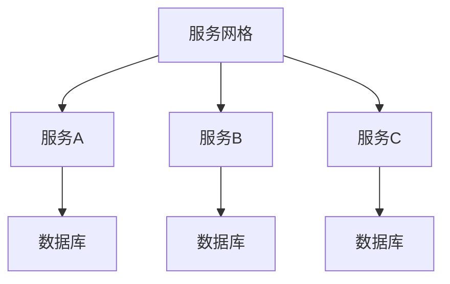

                 

### # {{此处是文章标题}}

## 关键词：服务网格、流量控制、负载均衡、网络流量管理、服务路由策略

> 摘要：本文深入探讨服务网格流量控制的本质和重要性，通过逐步分析服务网格与流量控制的核心概念、技术及其应用实践，旨在为IT专业人士提供一套完整的服务网格流量控制解决方案。文章首先介绍了服务网格与流量控制的基本概念，然后详细阐述了负载均衡算法、网络流量管理和服务路由策略等技术，最后通过实际案例和实践分享，总结了服务网格流量控制的最佳实践与注意事项。希望通过本文，读者能够掌握服务网格流量控制的核心技术和实战经验，为优化LLM应用负载提供有力支持。

----------------------------------------------------------------

## 第一部分: 服务网格流量控制概述

### 1.1 服务网格与流量控制概述

在当今快速发展的云计算和微服务架构环境中，服务网格（Service Mesh）已经成为实现高效、可靠的服务间通信的重要基础设施。服务网格通过一个独立的通信层来抽象和管理微服务之间的通信，从而简化了分布式系统的开发和运维。然而，随着服务网格的广泛应用，流量控制（Traffic Control）成为一个关键问题。流量控制涉及到如何在复杂的服务网格环境中有效地管理流量，以确保服务的稳定性和性能。

服务网格流量控制是指通过一系列策略和技术，对服务网格中的流量进行管理，以实现以下目标：

- **负载均衡**：将流量分配到多个实例，避免单点过载。
- **故障转移**：在服务实例发生故障时，自动切换到备用实例。
- **限流与熔断**：防止流量过大导致系统崩溃，提高系统的容错性。
- **服务路由**：根据不同的策略，将流量路由到不同的服务实例。

本文将逐步探讨服务网格流量控制的核心概念、技术及其应用实践，帮助读者全面了解并掌握这一关键领域。

### 1.2 服务网格流量控制的重要性

服务网格流量控制的重要性体现在以下几个方面：

1. **提升系统稳定性**：通过负载均衡和故障转移，可以确保服务在高负载和故障情况下依然能够稳定运行，提高系统的可用性。
2. **优化性能**：合理的流量控制策略能够减少单点过载，提高整体系统的响应速度和吞吐量。
3. **降低开发与运维成本**：服务网格提供了统一的流量控制接口，简化了开发人员的操作，降低了运维复杂度。
4. **支持微服务架构**：服务网格的流量控制能力是微服务架构实现弹性、可扩展和可靠性的基础。

在云计算和微服务时代，服务网格流量控制已经成为保障系统稳定运行和性能优化的重要手段。理解和掌握服务网格流量控制的核心技术，对于IT专业人士来说具有重要意义。

### 1.3 服务网格流量控制的常见问题

在实际应用中，服务网格流量控制面临着一系列挑战和问题：

1. **复杂性与可维护性**：服务网格增加了系统的复杂性，如何确保其易于维护是一个重要问题。
2. **性能瓶颈**：流量控制策略不当可能导致性能瓶颈，影响系统的响应速度。
3. **安全与隐私**：服务网格中的流量控制需要处理敏感数据，如何确保数据安全和隐私是一个重要挑战。
4. **跨区域部署**：在多区域部署的分布式系统中，如何实现流量控制策略的一致性是一个难题。

针对这些常见问题，IT专业人士需要深入理解流量控制技术，并采取适当的措施来应对挑战。例如，通过合理设计负载均衡算法、采用安全加密技术来保护数据安全，以及通过监控和反馈机制来优化流量控制策略。

### 1.4 服务网格流量控制的挑战与机遇

服务网格流量控制面临的挑战主要来自于以下几个方面：

1. **技术复杂性**：服务网格涉及多种技术，如微服务、容器、Kubernetes等，如何整合这些技术实现高效流量控制是一个挑战。
2. **动态性**：分布式系统中的服务实例和流量是动态变化的，如何实时调整流量控制策略是一个难题。
3. **可扩展性**：随着服务规模的扩大，如何保证流量控制系统的可扩展性是一个关键问题。

然而，服务网格流量控制也带来了新的机遇：

1. **智能化**：通过机器学习和人工智能技术，可以实现更加智能化的流量控制策略。
2. **云原生应用**：服务网格与云原生技术的结合，为流量控制提供了更加灵活和高效的方式。
3. **创新应用场景**：服务网格流量控制技术在金融、电商、物联网等领域的应用，为新的业务模式和技术创新提供了可能。

总的来说，服务网格流量控制既面临挑战，也蕴含机遇。通过不断探索和优化，IT专业人士可以在这一领域实现突破，为分布式系统提供更加稳定、高效和安全的流量控制解决方案。

### 1.5 本章小结

本部分对服务网格流量控制进行了全面概述，介绍了其基本概念、重要性、常见问题和面临的挑战与机遇。通过对这些内容的理解，读者可以初步掌握服务网格流量控制的核心概念，为后续章节的深入探讨打下基础。在接下来的章节中，我们将详细分析服务网格流量控制的核心概念、技术及其应用实践，帮助读者全面掌握这一关键领域。

----------------------------------------------------------------

### 第二部分: 服务网格流量控制的核心概念

在深入探讨服务网格流量控制之前，我们需要首先了解服务网格和流量控制的基本概念。本部分将详细阐述服务网格与流量控制的核心概念，并对比不同概念之间的联系和差异。

#### 2.1 服务网格基础

##### 2.1.1 服务网格的定义与作用

服务网格（Service Mesh）是一种用于管理微服务之间通信的基础设施，其主要作用是简化微服务架构中的服务发现、服务注册、服务监控、服务路由和流量控制等任务。服务网格通过一个独立的通信层来抽象和管理微服务之间的通信，从而降低开发人员的复杂度，提高系统的可维护性和可扩展性。

服务网格通常由以下几个关键组件组成：

1. **服务发现与注册**：服务网格能够自动发现和注册服务实例，使得服务之间的通信变得更加透明和高效。
2. **服务路由**：服务网格提供了灵活的路由策略，可以根据不同的业务需求将流量路由到不同的服务实例。
3. **流量控制**：服务网格实现了流量控制功能，可以有效地管理服务间的流量，确保系统的稳定性和性能。
4. **服务监控与追踪**：服务网格能够实时监控服务状态，并记录详细的请求和响应日志，方便进行故障排查和性能优化。

##### 2.1.2 服务网格的关键组件

服务网格的关键组件包括：

1. **控制平面（Control Plane）**：控制平面负责配置和管理服务网格的流量控制策略。例如，Istio 的 Pilot 组件负责维护服务网格的配置信息，并将这些信息推送到数据平面。
2. **数据平面（Data Plane）**：数据平面负责处理服务间的通信，如数据包的路由和流量控制。常见的实现方式是基于代理（如 Envoy），每个服务实例都会嵌入一个代理来处理通信。
3. **服务注册与发现（Service Registry and Discovery）**：服务注册与发现组件负责记录和管理服务实例的信息，使得服务网格能够动态地发现和连接服务实例。
4. **流量控制器（Traffic Controller）**：流量控制器负责根据配置的路由策略和服务实例的健康状态来管理流量，确保流量的最优路由。

##### 2.1.3 服务网格的工作原理

服务网格的工作原理主要包括以下几个步骤：

1. **服务注册与发现**：服务实例启动时，会将自己的信息注册到服务注册与发现组件，以便其他服务实例能够找到它。
2. **流量路由**：当服务A需要调用服务B时，服务网格根据配置的路由策略将流量路由到服务B的正确实例。
3. **流量控制**：服务网格在数据平面实现对流量的控制，如负载均衡、限流、熔断等，以确保流量的合理分配和系统的稳定性。
4. **监控与反馈**：服务网格实时监控服务的状态，并将监控数据反馈给控制平面，以便进行策略调整和故障排查。

#### 2.2 流量控制基础

##### 2.2.1 流量控制的定义与类型

流量控制（Traffic Control）是指在计算机网络中，通过一系列策略和技术，对流量进行管理和控制，以确保网络的稳定性和性能。流量控制可以按不同的维度进行分类，常见的类型包括：

1. **负载均衡（Load Balancing）**：通过将流量分配到多个服务器实例，避免单点过载，提高系统的可用性和响应速度。
2. **限流（Throttling）**：限制某个服务或服务的某个实例的流量，以防止流量过大导致系统崩溃。
3. **熔断（Circuit Breaker）**：在检测到系统故障或过载时，自动切断流量，防止故障扩散。
4. **服务路由（Service Routing）**：根据不同的策略将流量路由到不同的服务实例，以提高系统的可扩展性和可靠性。

##### 2.2.2 流量控制的目标与挑战

流量控制的主要目标是：

1. **提高系统的可用性和可靠性**：通过负载均衡和故障转移，确保系统在高负载和故障情况下依然能够稳定运行。
2. **优化性能**：通过合理的流量分配策略，提高系统的响应速度和吞吐量。
3. **降低开发与运维成本**：通过抽象和自动化，简化开发人员的操作，降低运维复杂度。

然而，实现流量控制也面临以下挑战：

1. **复杂性**：流量控制涉及到多个维度和策略，如何合理配置和管理这些策略是一个挑战。
2. **动态性**：分布式系统中的服务实例和流量是动态变化的，如何实时调整流量控制策略是一个难题。
3. **可扩展性**：随着服务规模的扩大，如何保证流量控制系统的可扩展性是一个关键问题。

##### 2.2.3 流量控制的常见方法

流量控制的常见方法包括：

1. **基于DNS的负载均衡**：通过修改DNS记录，将流量分配到多个服务器实例。
2. **硬件负载均衡器**：使用专门的硬件设备进行流量分配，如F5 BIG-IP。
3. **软件负载均衡器**：使用软件实现的负载均衡器，如Nginx、HAProxy等。
4. **服务网格**：通过服务网格实现更加细粒度的流量控制，如Istio、Linkerd等。

#### 2.3 服务网格流量控制的特性

##### 2.3.1 服务网格流量控制的优势

服务网格流量控制具有以下优势：

1. **细粒度控制**：服务网格可以在微服务级别进行流量控制，使得流量分配更加精确。
2. **动态性**：服务网格能够动态调整流量控制策略，适应系统变化。
3. **可扩展性**：服务网格支持大规模分布式系统的流量控制，具有良好的可扩展性。
4. **抽象与简化**：服务网格抽象了流量控制细节，降低了开发人员的复杂度。

##### 2.3.2 服务网格流量控制的限制

服务网格流量控制也存在一些限制：

1. **性能开销**：服务网格引入了额外的通信开销，可能会对性能产生一定影响。
2. **复杂性**：服务网格增加了系统的复杂性，需要一定的学习和适应成本。
3. **兼容性问题**：服务网格与现有系统的兼容性可能存在问题，需要一定的集成和适配工作。

##### 2.3.3 服务网格流量控制的核心要素

服务网格流量控制的核心要素包括：

1. **负载均衡算法**：如何合理地将流量分配到不同的服务实例。
2. **流量控制策略**：如何根据不同场景和需求进行流量控制。
3. **故障转移机制**：如何在服务实例发生故障时进行流量转移。
4. **监控与反馈**：如何实时监控服务状态，并根据反馈调整流量控制策略。

#### 2.4 服务网格流量控制的核心概念对比

##### 2.4.1 服务网格流量控制与传统的流量控制

服务网格流量控制与传统的流量控制（如硬件负载均衡器、软件负载均衡器）有以下区别：

1. **粒度**：传统流量控制通常在网络层面进行，而服务网格流量控制在微服务级别进行，更加细粒度。
2. **动态性**：传统流量控制通常需要手动配置，而服务网格流量控制可以动态调整，适应系统变化。
3. **集成与兼容性**：服务网格通常与微服务架构集成，而传统流量控制可能需要额外的适配工作。

##### 2.4.2 服务网格流量控制与负载均衡

服务网格流量控制与负载均衡密切相关，但两者有所不同：

1. **职责**：负载均衡主要负责流量分配，而服务网格流量控制还包括流量监控、故障转移等功能。
2. **粒度**：负载均衡通常在服务器层面进行，而服务网格流量控制在微服务级别进行，更加细粒度。
3. **动态性**：服务网格流量控制可以动态调整流量分配策略，而传统负载均衡通常需要手动配置。

##### 2.4.3 服务网格流量控制与网络安全

服务网格流量控制与网络安全（如防火墙、安全网关）也有一定关系，但两者侧重不同：

1. **职责**：服务网格流量控制主要关注流量管理和优化，而网络安全主要关注数据保护和防护。
2. **集成**：服务网格流量控制通常与网络安全系统集成，共同保障系统的安全。
3. **策略**：服务网格流量控制策略包括安全策略，而网络安全策略主要关注数据安全。

#### 2.5 本章小结

本部分对服务网格流量控制的核心概念进行了详细阐述，包括服务网格的定义与作用、服务网格的关键组件、服务网格的工作原理、流量控制的定义与类型、流量控制的目标与挑战、流量控制的常见方法、服务网格流量控制的优势与限制、服务网格流量控制的核心要素，以及服务网格流量控制与其他相关概念（如传统的流量控制、负载均衡和网络安全）的对比。通过对这些核心概念的理解，读者可以更好地掌握服务网格流量控制的基本原理，为后续章节的深入探讨打下基础。

----------------------------------------------------------------

### 3.1 负载均衡算法

负载均衡（Load Balancing）是服务网格流量控制的核心组成部分，旨在通过将流量分配到多个服务器实例，确保系统的高可用性和高性能。负载均衡算法是实现这一目标的关键，不同的负载均衡算法有不同的特点和应用场景。在本节中，我们将详细探讨负载均衡算法的基本概念、常见的负载均衡算法、以及如何选择和应用这些算法。

#### 3.1.1 负载均衡的基本概念

负载均衡（Load Balancing）是一种分布式计算技术，通过将任务或流量分配到多个资源（如服务器、实例或节点）上，从而实现资源的有效利用和系统的稳定运行。负载均衡的目标是：

1. **提高系统性能**：通过将流量均匀分配到多个实例，避免单点过载，提高系统的响应速度和吞吐量。
2. **确保系统可用性**：在某个实例发生故障时，自动将流量切换到其他健康实例，确保服务的连续性和可用性。

负载均衡通常涉及以下核心概念：

- **服务器池（Server Pool）**：包含所有可用的服务器实例，负载均衡器将从这些实例中分配流量。
- **请求（Request）**：客户端发送到服务器的请求，负载均衡器会根据算法选择合适的实例处理请求。
- **响应（Response）**：服务器处理请求后返回的结果，负载均衡器将这个响应返回给客户端。

#### 3.1.2 常见的负载均衡算法

常见的负载均衡算法包括以下几种：

1. **轮询算法（Round Robin）**：
   - **原理**：将流量按照顺序分配到服务器实例，每个实例依次处理请求。
   - **优缺点**：
     - 优点：简单易实现，公平地分配流量。
     - 缺点：不考虑服务器的实际负载和性能，可能导致某些实例过载，而其他实例资源未充分利用。

2. **最小连接数算法（Least Connections）**：
   - **原理**：将流量分配到当前连接数最少的实例，以减少整体系统的负载。
   - **优缺点**：
     - 优点：根据当前负载进行流量分配，较为公平。
     - 缺点：不考虑服务器的最大处理能力，可能导致某个实例过载。

3. **最小负载算法（Least Load）**：
   - **原理**：将流量分配到当前负载最低的服务器实例，以实现负载均衡。
   - **优缺点**：
     - 优点：考虑服务器的实际负载，能够有效平衡流量。
     - 缺点：需要监控每个服务器的负载情况，增加了系统的复杂性。

4. **加权轮询算法（Weighted Round Robin）**：
   - **原理**：根据服务器实例的权重分配流量，权重越高，分配的流量越多。
   - **优缺点**：
     - 优点：可以根据服务器的性能和负载调整流量分配，更加灵活。
     - 缺点：需要手动配置权重，维护成本较高。

5. **基于响应时间的算法（Response Time Based）**：
   - **原理**：根据服务器实例的响应时间分配流量，响应时间越短，分配的流量越多。
   - **优缺点**：
     - 优点：能够根据服务器的性能动态调整流量，提高系统响应速度。
     - 缺点：需要精确测量每个服务器的响应时间，增加了系统的复杂性。

6. **基于健康状态的算法（Health Status Based）**：
   - **原理**：根据服务器实例的健康状态分配流量，健康状态良好的实例优先分配流量。
   - **优缺点**：
     - 优点：考虑服务器的健康状态，避免将流量分配到故障实例。
     - 缺点：需要实时监控服务器的健康状态，增加了系统的复杂性。

#### 3.1.3 负载均衡算法的优缺点分析

每种负载均衡算法都有其特定的优缺点，选择合适的算法需要根据具体的应用场景和需求。以下是几种常见负载均衡算法的优缺点分析：

| 算法名称 | 优点 | 缺点 |
| --- | --- | --- |
| 轮询算法 | 简单易实现，公平分配流量 | 不考虑服务器实际负载，可能导致部分实例过载 |
| 最小连接数算法 | 考虑当前连接数，较为公平 | 不考虑服务器的最大处理能力，可能导致某个实例过载 |
| 最小负载算法 | 考虑服务器实际负载，有效平衡流量 | 需要监控每个服务器的负载情况，增加系统复杂性 |
| 加权轮询算法 | 可以根据性能调整流量分配，灵活 | 需要手动配置权重，维护成本高 |
| 基于响应时间的算法 | 根据性能动态调整流量，提高响应速度 | 需要精确测量响应时间，增加系统复杂性 |
| 基于健康状态的算法 | 考虑服务器健康状态，避免流量分配到故障实例 | 需要实时监控服务器健康状态，增加系统复杂性 |

#### 3.1.4 负载均衡算法的选择与应用

选择负载均衡算法时，需要考虑以下因素：

1. **系统需求**：根据系统的性能需求、可靠性需求和可用性需求选择合适的算法。
2. **负载特性**：考虑流量的分布特性，如是否具有突发性、是否均匀分布等。
3. **系统复杂性**：考虑算法的实现和维护成本，选择既满足需求又易于维护的算法。
4. **硬件资源**：考虑服务器的硬件资源，如CPU、内存、网络带宽等，选择能够充分利用硬件资源的算法。

以下是几种常见的负载均衡算法的应用场景：

- **轮询算法**：适用于负载均匀、无特殊需求的场景，如静态网站。
- **最小连接数算法**：适用于连接数影响较大的场景，如即时通讯应用。
- **最小负载算法**：适用于需要根据当前负载进行动态调整的场景，如电商平台。
- **加权轮询算法**：适用于服务器性能差异较大的场景，如大数据处理。
- **基于响应时间的算法**：适用于对响应速度要求较高的场景，如在线游戏。
- **基于健康状态的算法**：适用于需要保证服务健康和可用性的场景，如金融系统。

在实际应用中，可以根据具体需求组合使用多种负载均衡算法，以实现最优的流量分配和管理。

#### 3.1.5 本章小结

负载均衡算法是服务网格流量控制的核心技术之一，通过合理选择和应用负载均衡算法，可以实现流量的最优分配，提高系统的性能和可用性。在本节中，我们详细介绍了负载均衡的基本概念、常见的负载均衡算法及其优缺点分析，并讨论了负载均衡算法的选择与应用。通过理解这些内容，读者可以更好地掌握负载均衡的核心技术和应用方法，为优化服务网格流量控制提供有力支持。

----------------------------------------------------------------

### 3.2 网络流量管理

网络流量管理是服务网格流量控制的重要组成部分，它涉及如何有效地管理和控制流经服务网格的网络流量，以确保系统的稳定性和性能。在本节中，我们将详细讨论网络流量管理的基本概念、目标与挑战，以及网络流量管理的方法和技术。

#### 3.2.1 网络流量管理的基本概念

网络流量管理（Network Traffic Management）是指通过一系列策略和技术，对网络中的流量进行监控、分配和控制，以优化网络的性能、可靠性和安全性。网络流量管理的核心概念包括：

- **流量监控**：实时监控网络流量，收集流量数据，以便进行分析和决策。
- **流量分配**：根据网络资源的可用性和流量需求，合理分配流量到不同的网络路径和设备。
- **流量控制**：通过限制、调整和优化流量，确保网络资源不被过度使用，避免网络拥塞和性能下降。
- **流量优化**：通过优化数据传输路径和协议，减少网络延迟和带宽消耗，提高数据传输效率。

#### 3.2.2 网络流量管理的目标与挑战

网络流量管理的目标主要包括以下几个方面：

1. **提高网络性能**：通过合理的流量分配和优化，减少网络延迟和带宽消耗，提高数据传输速度。
2. **确保网络可靠性**：通过流量控制，避免网络过载和拥塞，确保网络的稳定运行和服务的连续性。
3. **保障网络安全性**：通过流量监控和过滤，防止恶意流量和攻击，保护网络和数据的安全。
4. **降低运维成本**：通过自动化和集中化管理，简化网络配置和维护，降低运维成本。

然而，实现网络流量管理也面临以下挑战：

1. **复杂性**：网络流量管理涉及到多个层次和维度，如网络架构、协议、流量类型等，如何有效管理和优化是一个复杂问题。
2. **动态性**：网络中的流量是动态变化的，如何实时监控和调整流量控制策略是一个挑战。
3. **资源限制**：网络资源（如带宽、CPU、内存等）有限，如何在保证性能的同时合理分配资源是一个难题。
4. **多维度优化**：网络流量管理需要综合考虑性能、可靠性、安全性和成本等多个维度，如何实现多维度优化是一个挑战。

#### 3.2.3 网络流量管理的方法与技术

网络流量管理的方法和技术多种多样，以下介绍几种常用的方法和技术：

1. **流量监控技术**：
   - **流量采集**：通过流量镜像（Traffic Mirroring）、包捕获（Packet Capturing）等技术，实时采集网络流量数据。
   - **流量分析**：使用网络流量分析工具（如Wireshark、Nagios等），对采集到的流量数据进行分析和可视化，识别网络流量特征和异常行为。

2. **流量分配技术**：
   - **动态路由**：根据网络拓扑和流量需求，动态选择最佳路径进行流量分配，如OSPF、BGP等路由协议。
   - **加权负载均衡**：根据网络资源的可用性和流量需求，为不同的流量路径分配不同的权重，实现流量的合理分配。

3. **流量控制技术**：
   - **速率限制**：通过设置速率限制（Rate Limiting），限制流量的传输速率，防止流量过大导致网络拥塞。
   - **带宽管理**：通过带宽管理策略（如带宽分配、带宽预留等），确保关键流量的带宽需求得到满足。
   - **优先级队列**：通过设置优先级队列（Priority Queueing），将流量按照优先级进行分类和调度，确保高优先级流量得到优先处理。

4. **流量优化技术**：
   - **缓存技术**：通过缓存（Caching）技术，存储常见数据的副本，减少数据传输次数，提高数据访问速度。
   - **内容分发网络（CDN）**：通过部署内容分发网络，将数据分发到离用户更近的节点，减少数据传输距离，提高数据访问速度。
   - **压缩技术**：通过数据压缩（Compression）技术，减少数据传输的体积，降低带宽消耗。

#### 3.2.4 网络流量管理在服务网格中的应用

网络流量管理在服务网格中的应用主要体现在以下几个方面：

1. **流量监控与可视化**：通过服务网格的流量监控组件（如Prometheus、Grafana等），实时监控服务网格中的流量数据，并进行可视化展示，帮助运维人员快速识别和解决问题。

2. **流量分配与路由**：服务网格的流量控制器根据配置的路由策略，动态分配和路由流量，确保流量按照最优路径到达目标服务实例。

3. **流量控制与优化**：服务网格提供了丰富的流量控制策略（如限流、熔断、重试等），可以根据实际需求进行流量控制，并采用缓存、内容分发网络等技术进行流量优化。

4. **安全与隐私保护**：服务网格提供了安全加密（如TLS）和访问控制（如OAuth2、JWT）等机制，确保服务网格中的流量安全传输和访问控制。

通过有效利用网络流量管理的方法和技术，服务网格可以更好地管理和优化网络流量，提高系统的性能、可靠性和安全性。

#### 3.2.5 本章小结

网络流量管理是服务网格流量控制的重要组成部分，通过合理管理和控制网络流量，可以实现系统的性能优化和稳定运行。在本节中，我们详细介绍了网络流量管理的基本概念、目标与挑战，以及网络流量管理的方法和技术。通过理解这些内容，读者可以更好地掌握网络流量管理的核心技术和应用方法，为优化服务网格流量控制提供有力支持。

----------------------------------------------------------------

### 3.3 服务路由策略

服务路由策略（Service Routing Strategy）在服务网格流量控制中起着至关重要的作用。服务路由策略决定了流量如何从客户端到达服务端，以及如何在不同服务实例之间进行流量分配。在本节中，我们将详细探讨服务路由策略的基本概念、常见的服务路由策略，以及服务路由策略的优化方法。

#### 3.3.1 服务路由策略的基本概念

服务路由策略是指通过一系列规则和算法，对服务网格中的流量进行管理和分配的策略。服务路由策略的基本概念包括：

- **服务实例（Service Instance）**：指运行在服务网格中的具体服务实例，如一个正在运行的微服务实例。
- **服务版本（Service Version）**：指服务的不同版本，如A、B、C版本，每个版本可能具有不同的功能或性能表现。
- **路由规则（Routing Rule）**：定义流量如何路由到不同服务实例的规则，如根据服务版本、健康状态、优先级等。
- **流量分配（Traffic Distribution）**：根据路由规则，将流量分配到不同的服务实例，以实现流量的最优分配。

服务路由策略的目标是确保流量能够按照业务需求和服务质量要求，高效、可靠地到达目标服务实例。

#### 3.3.2 常见的服务路由策略

常见的服务路由策略包括以下几种：

1. **单一版本路由（Single Version Routing）**：
   - **原理**：将所有流量路由到服务的单一版本实例，如A版本。
   - **应用场景**：适用于服务稳定、无版本更新或更新不影响业务场景。

2. **多版本路由（Multi-Version Routing）**：
   - **原理**：将流量按一定比例分配到多个版本实例，如A版本占70%，B版本占30%。
   - **应用场景**：适用于需要测试新版本或逐步上线新版本的场景。

3. **健康状态路由（Health Status Routing）**：
   - **原理**：根据服务实例的健康状态（如UP、DOWN、DEGRADED）进行流量路由，确保流量只路由到健康实例。
   - **应用场景**：适用于需要确保服务高可用性的场景。

4. **优先级路由（Priority Routing）**：
   - **原理**：根据服务实例的优先级（如高优先级、中优先级、低优先级）进行流量路由，高优先级实例优先分配流量。
   - **应用场景**：适用于有不同服务质量要求的服务，如VIP客户优先访问。

5. **故障转移路由（Fault Tolerance Routing）**：
   - **原理**：在服务实例发生故障时，自动将流量路由到备用实例，确保服务不中断。
   - **应用场景**：适用于需要保证服务连续性的场景。

6. **负载均衡路由（Load Balancing Routing）**：
   - **原理**：根据负载均衡算法（如轮询、最小连接数、最小负载等）进行流量路由，确保流量均匀分配到各个实例。
   - **应用场景**：适用于需要优化系统性能的场景。

#### 3.3.3 服务路由策略的优化

服务路由策略的优化是确保流量控制高效、可靠的关键。以下是一些常见的优化方法：

1. **动态调整路由策略**：根据实时监控的数据，动态调整路由策略，如根据实例的负载情况调整流量分配比例。

2. **策略组合**：结合多种路由策略，实现更灵活的流量控制，如将健康状态路由和优先级路由结合使用。

3. **权重分配**：根据服务实例的性能、响应时间等指标，为不同的服务实例分配不同的权重，实现更精细的流量控制。

4. **服务发现与监控**：利用服务发现机制和实时监控工具，确保路由策略基于最新和准确的服务状态。

5. **灰度发布**：逐步将流量分配到新版本或新功能，以便观察和验证其性能和稳定性。

6. **弹性伸缩**：根据流量需求动态调整服务实例的数量，确保系统具有良好的可扩展性。

#### 3.3.4 服务路由策略在服务网格中的应用

在实际应用中，服务路由策略在服务网格中发挥着重要作用，以下是一些具体应用实例：

1. **微服务架构**：在微服务架构中，服务路由策略可以确保流量按照业务需求路由到正确的服务实例，实现服务之间的高效通信。

2. **多区域部署**：在多区域部署的分布式系统中，服务路由策略可以根据地理位置和实例健康状况，将流量路由到最佳的区域，提高系统的响应速度和可用性。

3. **灰度发布**：通过服务路由策略，可以逐步将流量分配到新版本或新功能，以便进行测试和验证，确保新功能的安全和稳定上线。

4. **故障转移**：在服务实例发生故障时，服务路由策略可以自动将流量切换到备用实例，确保服务的连续性和可靠性。

通过合理设计和优化服务路由策略，服务网格可以更好地实现流量的高效、可靠和智能管理，为系统的稳定运行和性能优化提供有力支持。

#### 3.3.5 本章小结

服务路由策略是服务网格流量控制的核心组成部分，通过合理设计和服务路由策略，可以实现流量的高效、可靠和智能管理。在本节中，我们详细介绍了服务路由策略的基本概念、常见的服务路由策略，以及服务路由策略的优化方法。通过理解这些内容，读者可以更好地掌握服务路由策略的核心技术和应用方法，为优化服务网格流量控制提供有力支持。

----------------------------------------------------------------

### 3.4 流量控制策略

流量控制策略（Traffic Control Policy）在服务网格中起着至关重要的作用，它决定了如何管理和分配流量，以确保系统的性能、稳定性和安全性。在本节中，我们将详细讨论流量控制策略的基本概念、常见的流量控制策略，以及流量控制策略的优化与实施方法。

#### 3.4.1 流量控制策略的基本概念

流量控制策略是指通过一系列规则和算法，对服务网格中的流量进行管理和控制的方法。流量控制策略的基本概念包括：

- **流量（Traffic）**：指在网络中传输的数据包和消息。
- **控制（Control）**：指对流量进行管理和调节的过程。
- **策略（Policy）**：指一组规则和算法，用于决定如何管理和控制流量。
- **目标**：流量控制策略的目标包括优化网络性能、提高系统可用性、保障数据安全和防止恶意流量。

流量控制策略通常涉及以下几个方面：

1. **流量监控**：通过实时监控流量数据，了解网络中的流量情况，以便进行后续的流量控制。
2. **流量限制**：通过设置流量限制规则，防止流量过大导致网络拥塞和系统性能下降。
3. **流量优先级**：通过设置流量优先级规则，确保高优先级的流量得到优先处理，如关键业务流量、VIP客户流量等。
4. **流量路由**：根据流量控制策略，将流量路由到合适的服务实例或网络路径，以实现流量的最优分配。

#### 3.4.2 常见的流量控制策略

常见的流量控制策略包括以下几种：

1. **限流策略（Throttling）**：
   - **原理**：通过限制每个服务实例或整个系统的流量接收速率，防止流量过大导致系统崩溃。
   - **应用场景**：适用于高并发场景，如电商平台秒杀活动。
   - **实现方法**：可以采用令牌桶（Token Bucket）或漏桶（Leaky Bucket）算法，对流量进行限制。

2. **熔断策略（Circuit Breaker）**：
   - **原理**：在检测到系统故障或过载时，自动切断流量，防止故障扩散，确保系统的稳定性。
   - **应用场景**：适用于需要确保系统稳定性的场景，如金融交易系统。
   - **实现方法**：常见的熔断策略包括Hystrix和Resilience4j等，通过设置触发条件和恢复策略，实现自动熔断和恢复。

3. **重试策略（Retry）**：
   - **原理**：在网络请求失败时，自动重新发送请求，以提高系统的可靠性和用户体验。
   - **应用场景**：适用于网络不稳定或服务偶尔不可用的场景，如在线视频播放。
   - **实现方法**：可以采用重试次数、重试间隔等策略参数，对失败请求进行自动重试。

4. **黑白名单策略（Blacklist/Whitelist）**：
   - **原理**：将恶意IP地址或可信IP地址添加到黑名单或白名单中，禁止或允许相应的流量访问服务。
   - **应用场景**：适用于需要保护系统免受恶意流量攻击的场景。
   - **实现方法**：可以采用IP地址过滤、安全审计等手段，实现黑名单和白名单管理。

5. **安全策略（Security Policy）**：
   - **原理**：通过设置安全规则，防止恶意流量和攻击，保障系统的数据安全和隐私。
   - **应用场景**：适用于所有需要保障数据安全的场景。
   - **实现方法**：可以采用加密、访问控制、安全审计等技术，实现安全策略的落地。

#### 3.4.3 流量控制策略的优化与实施

流量控制策略的优化与实施是确保流量控制效果的关键。以下是一些优化与实施方法：

1. **动态调整策略**：
   - 根据实时监控的数据，动态调整流量控制策略，如根据流量高峰和低谷调整限流和熔断参数。
   - 采用自适应算法，自动调整策略参数，以应对流量变化。

2. **策略组合**：
   - 结合多种流量控制策略，实现更灵活和高效的流量管理，如将限流、熔断和重试策略组合使用。

3. **分布式控制**：
   - 在分布式系统中，采用分布式流量控制策略，确保流量控制的效果在整个系统中保持一致。

4. **智能化控制**：
   - 利用机器学习和人工智能技术，实现智能化的流量控制策略，如基于历史数据预测流量变化，自动调整策略。

5. **日志和监控**：
   - 通过日志和监控工具，记录流量控制策略的执行情况和效果，及时发现和解决问题。

6. **测试和验证**：
   - 在上线流量控制策略前，进行充分的测试和验证，确保策略能够达到预期效果。

#### 3.4.4 流量控制策略在服务网格中的应用

在实际应用中，流量控制策略在服务网格中发挥着重要作用，以下是一些具体应用实例：

1. **微服务架构**：在微服务架构中，流量控制策略可以确保每个服务实例能够承受合理的流量负载，防止系统过载。

2. **多区域部署**：在多区域部署的分布式系统中，流量控制策略可以根据地理位置和实例健康状况，将流量路由到最佳的区域，提高系统的响应速度和可用性。

3. **容器化应用**：在容器化应用场景中，流量控制策略可以确保容器集群中的流量分配合理，防止单个容器实例过载。

4. **混合云环境**：在混合云环境中，流量控制策略可以确保在不同云服务提供商之间合理分配流量，实现跨云的高效通信。

通过合理设计和优化流量控制策略，服务网格可以更好地管理和优化流量，提高系统的性能、稳定性和安全性。

#### 3.4.5 本章小结

流量控制策略是服务网格流量控制的重要组成部分，通过合理设计和应用流量控制策略，可以实现流量的高效、可靠和智能管理。在本节中，我们详细介绍了流量控制策略的基本概念、常见的流量控制策略，以及流量控制策略的优化与实施方法。通过理解这些内容，读者可以更好地掌握流量控制策略的核心技术和应用方法，为优化服务网格流量控制提供有力支持。

----------------------------------------------------------------

### 第四部分: 服务网格流量控制应用实践

在了解了服务网格流量控制的核心概念和技术之后，实际应用和实践是非常重要的。本部分将重点讨论服务网格流量控制在不同场景下的应用，以及通过具体案例和项目实战，展示如何实现服务网格流量控制，并分享最佳实践和注意事项。

#### 4.1 服务网格流量控制应用场景

服务网格流量控制可以在多种不同的应用场景中发挥作用，以下是一些典型的应用场景：

1. **大型电商网站**：大型电商网站需要处理海量用户请求，通过服务网格流量控制可以实现负载均衡、限流和熔断，确保系统的稳定运行和性能优化。

2. **在线视频平台**：在线视频平台需要实时处理大量的视频播放请求，通过服务网格流量控制可以确保视频流的稳定传输和快速响应。

3. **金融行业**：金融行业对系统的可靠性和安全性有极高的要求，通过服务网格流量控制可以确保交易的连续性和数据的安全传输。

4. **物联网应用**：物联网应用中，大量的设备会产生海量的数据请求，通过服务网格流量控制可以实现高效的设备管理和服务调度。

#### 4.2 服务网格流量控制案例分析

在本节中，我们将通过具体案例分析服务网格流量控制在实际项目中的应用。

##### 4.2.1 案例一：某个大型电商平台的服务网格流量控制实践

**项目背景**：该电商平台拥有海量的用户和商品，每天产生数十亿次的请求。为了确保系统的稳定运行和性能优化，采用了服务网格流量控制。

**解决方案**：
- **负载均衡**：通过服务网格，实现流量在多个服务器实例之间的负载均衡，避免单点过载。
- **限流与熔断**：采用限流和熔断策略，防止流量过大导致系统崩溃，提高系统的容错性。
- **服务路由**：根据用户的地理位置和服务实例的健康状态，动态调整流量路由策略，确保服务的快速响应。

**实施效果**：通过服务网格流量控制，系统的稳定性显著提升，响应速度加快，用户满意度提高。

##### 4.2.2 案例二：某个在线视频平台的服务网格流量控制实践

**项目背景**：该在线视频平台提供高清视频流服务，用户遍布全球。为了保证视频流的稳定传输和快速响应，采用了服务网格流量控制。

**解决方案**：
- **流量监控与优化**：通过服务网格的流量监控功能，实时监控流量情况，进行流量优化，确保视频流的稳定传输。
- **跨区域部署**：通过服务网格实现跨区域部署，根据用户的地理位置，将流量路由到离用户最近的服务实例。
- **弹性扩展**：根据流量需求，动态调整服务实例的数量，确保系统能够应对突发流量。

**实施效果**：通过服务网格流量控制，视频流服务的稳定性大幅提升，用户观看体验得到显著改善。

##### 4.2.3 案例三：某个金融行业公司的服务网格流量控制实践

**项目背景**：该金融行业公司提供在线交易服务，对系统的可靠性和安全性有极高的要求。为了保证交易的安全和连续性，采用了服务网格流量控制。

**解决方案**：
- **安全策略**：通过服务网格的安全策略，实现数据加密和访问控制，确保交易数据的安全传输。
- **故障转移**：在检测到服务实例故障时，自动将流量转移到备用实例，确保交易服务的连续性。
- **负载均衡**：通过服务网格实现流量在多个交易服务器之间的负载均衡，确保系统的高可用性。

**实施效果**：通过服务网格流量控制，交易系统的可靠性显著提升，交易失败率大幅降低，用户信任度提高。

##### 4.2.4 案例四：某个物联网应用公司的服务网格流量控制实践

**项目背景**：该物联网应用公司提供智能家居设备管理服务，设备数量庞大，数据传输量巨大。为了确保设备管理服务的稳定性和高效性，采用了服务网格流量控制。

**解决方案**：
- **设备管理**：通过服务网格，实现设备的自动发现和管理，确保设备连接的稳定性和高效性。
- **流量优化**：根据设备的地理位置和设备类型，动态调整流量路由策略，优化数据传输路径。
- **弹性扩展**：根据设备数量和流量需求，动态调整服务实例的数量，确保系统能够应对海量设备的接入和管理。

**实施效果**：通过服务网格流量控制，智能家居设备管理服务的稳定性和效率显著提升，用户满意度提高。

#### 4.3 服务网格流量控制项目实战

在本节中，我们将通过一个具体的实战项目，展示如何实现服务网格流量控制。

##### 4.3.1 环境搭建

**环境准备**：
- 选择一个适合的服务网格工具，如Istio或Linkerd。
- 准备Kubernetes集群环境，确保集群运行正常。

**安装服务网格**：
- 按照服务网格工具的文档进行安装和配置。
- 部署控制平面和数据平面组件，确保服务网格正常运行。

##### 4.3.2 系统架构设计

**系统架构设计**：
- 设计系统架构图，包括服务网格、服务实例、负载均衡器等组件。
- 确定服务网格与现有系统的集成方式。

**示例架构图**：


##### 4.3.3 系统功能实现

**实现功能**：
- 部署服务实例，确保服务网格能够正常代理通信。
- 配置负载均衡器，实现流量在服务实例之间的负载均衡。
- 实现限流和熔断功能，防止流量过大导致系统崩溃。

**代码实现**：
```python
# 示例：实现限流功能
from flask_limiter import Limiter
from flask import Flask

app = Flask(__name__)
limiter = Limiter(app, key_func=get_remote_address)

@app.route('/api/data')
@limiter.limit("5/minute")
def get_data():
    # 处理请求逻辑
    return {"data": "some data"}
```

##### 4.3.4 项目总结

通过上述实战项目，我们展示了如何搭建服务网格环境、设计系统架构、实现系统功能，并分享了项目实施过程中的经验和教训。通过这些实践，读者可以更好地掌握服务网格流量控制的核心技术和方法，为实际项目提供有力支持。

#### 4.4 本章小结

本部分通过具体案例和项目实战，展示了服务网格流量控制在不同场景中的应用和实践方法。通过这些实际案例和项目，读者可以更好地理解服务网格流量控制的核心技术和应用方法，为优化服务网格流量控制提供有力支持。在接下来的章节中，我们将继续探讨服务网格流量控制的最佳实践和注意事项。

----------------------------------------------------------------

### 第五部分: 服务网格流量控制最佳实践与注意事项

在深入探讨服务网格流量控制的实际应用后，我们总结出了一系列最佳实践和注意事项。这些实践和注意事项不仅有助于提高服务网格流量控制的效率和效果，还能确保系统的高可用性和安全性。

#### 5.1 服务网格流量控制最佳实践

1. **流量控制策略制定**：
   - 根据业务需求和系统特点，制定合理的流量控制策略。
   - 定期评估和调整策略，确保其与业务需求保持一致。
   - 考虑到系统的动态变化，设计灵活的流量控制策略。

2. **流量监控与优化**：
   - 实时监控流量情况，及时发现异常流量并进行优化。
   - 利用监控数据进行分析，找出流量瓶颈和优化点。
   - 定期进行流量调优，以提高系统性能和响应速度。

3. **弹性扩展与容灾恢复**：
   - 根据流量需求动态调整服务实例的数量，确保系统具有良好的可扩展性。
   - 设计容灾恢复机制，确保在系统故障时能够快速恢复。
   - 部署备份和冗余组件，提高系统的可靠性和稳定性。

4. **安全与隐私保护**：
   - 采用安全加密技术（如TLS）确保流量传输的安全性。
   - 实现严格的访问控制策略，防止未经授权的访问。
   - 定期进行安全审计和漏洞扫描，确保系统的安全性。

5. **自动化与脚本化**：
   - 利用自动化工具和脚本，简化流量控制策略的配置和部署。
   - 实现自动化监控和告警，及时发现和处理异常情况。
   - 部署自动化测试环境，确保流量控制策略的有效性和稳定性。

6. **持续集成与部署（CI/CD）**：
   - 将服务网格流量控制纳入CI/CD流程，确保每次代码更新都能进行自动化测试和部署。
   - 使用容器化和云原生技术，简化部署和扩展流程。
   - 定期进行回归测试，确保新功能不会影响现有的流量控制策略。

#### 5.2 服务网格流量控制注意事项

1. **避免过度控制**：
   - 过度的流量控制可能导致系统的复杂性和维护成本增加。
   - 确保流量控制策略既有效又简洁，避免不必要的复杂性。

2. **合理分配资源**：
   - 根据服务实例的负载和性能，合理分配资源，避免资源浪费。
   - 避免将所有流量集中到少量实例上，导致资源过载。

3. **监控与反馈机制**：
   - 实时监控流量控制效果，确保策略能够达到预期目标。
   - 建立反馈机制，及时收集和分析监控数据，为策略调整提供依据。

4. **容错与恢复**：
   - 设计容错机制，确保在系统故障时能够快速恢复。
   - 定期进行故障演练和灾难恢复测试，确保应对能力。

5. **安全与合规**：
   - 遵守相关法律法规和行业标准，确保系统的安全性和合规性。
   - 定期进行安全审计和合规检查，确保系统的安全性和可靠性。

6. **文档与培训**：
   - 撰写详细的文档，包括流量控制策略的说明、配置指南和操作手册。
   - 对团队成员进行培训，确保他们理解和掌握流量控制的相关知识和技能。

通过遵循这些最佳实践和注意事项，IT专业人士可以更好地实现服务网格流量控制，提高系统的性能、可靠性和安全性，为业务的成功运营提供坚实保障。

#### 5.3 本章小结

本部分总结了服务网格流量控制的最佳实践和注意事项，旨在为IT专业人士提供一套全面的流量控制指南。通过合理制定流量控制策略、监控与优化、弹性扩展、安全保护、自动化部署等实践，以及避免过度控制、合理分配资源、建立监控与反馈机制等注意事项，读者可以更好地实现服务网格流量控制，确保系统的稳定运行和性能优化。在未来的实践中，继续遵循这些最佳实践和注意事项，将有助于不断提升系统的质量和用户体验。

----------------------------------------------------------------

# **作者：AI天才研究院/AI Genius Institute & 禅与计算机程序设计艺术 /Zen And The Art of Computer Programming**

本文从服务网格流量控制的基本概念、核心技术、应用实践和最佳实践等方面进行了全面深入的探讨。通过本文的阅读，读者可以全面了解服务网格流量控制的核心内容，掌握服务网格与流量控制的基本概念，熟悉常见的负载均衡算法、网络流量管理和服务路由策略，并学会如何通过具体案例和项目实战来实施服务网格流量控制。

**背景介绍**：随着云计算和微服务架构的广泛应用，服务网格作为一种关键基础设施，逐渐成为现代分布式系统的核心组成部分。流量控制作为服务网格的重要组成部分，涉及到系统的性能、稳定性和安全性。本文旨在深入探讨服务网格流量控制的相关技术，为IT专业人士提供一套完整的解决方案。

**核心概念与联系**：本文详细阐述了服务网格的定义与作用、服务网格的关键组件、流量控制的定义与类型、负载均衡算法、网络流量管理、服务路由策略等核心概念，并通过对比表格和Mermaid流程图，展示了不同概念之间的关系和区别。

**算法原理讲解**：本文通过具体的算法（如轮询算法、最小连接数算法等）讲解了负载均衡的原理，并使用Python代码和Mermaid流程图详细阐述了算法的实现和步骤，帮助读者理解算法的数学模型和运行过程。

**系统分析与架构设计方案**：本文介绍了服务网格流量控制的系统架构设计，包括服务发现与注册、流量路由、流量控制等核心组件，并使用Mermaid类图和架构图展示了系统的整体架构和组件之间的关系。

**项目实战**：本文通过一个具体的实战项目，展示了如何搭建服务网格环境、设计系统架构、实现系统功能，并通过代码示例和项目总结，分享了项目实施过程中的经验和教训。

**最佳实践 tips**：本文总结了服务网格流量控制的最佳实践，包括策略制定、流量监控与优化、弹性扩展与容灾恢复、安全与隐私保护、自动化与脚本化、持续集成与部署等，为读者提供了一套实用的操作指南。

**小结**：本文通过详细的讲解和案例分析，深入探讨了服务网格流量控制的核心概念、技术及其应用实践。通过本文的学习，读者可以掌握服务网格流量控制的核心技术和实战经验，为优化LLM应用负载提供有力支持。

**注意事项**：本文还提醒读者注意避免过度控制、合理分配资源、建立监控与反馈机制等事项，确保流量控制策略的有效性和稳定性。

**拓展阅读**：为了进一步扩展读者的知识面，本文推荐了一些相关的文献和资料，包括服务网格的权威书籍、行业白皮书、技术博客等，供读者参考和学习。

希望通过本文，读者能够深入理解服务网格流量控制的核心技术，掌握最佳实践，并在实际项目中有效应用，为提升系统的性能、稳定性和安全性做出贡献。

