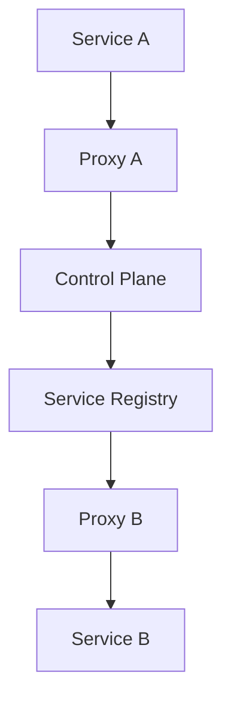

                 

# 服务网格（Service Mesh）在LLM应用架构中的应用

## 关键词

- 服务网格（Service Mesh）
- 大型语言模型（LLM）
- 应用架构
- 微服务
- 自动化

## 摘要

随着大型语言模型（LLM）的广泛应用，如何有效地管理和优化其应用架构成为一个关键问题。服务网格（Service Mesh）作为一种专门用于服务间通信和管理的解决方案，正逐渐成为LLM应用架构中的重要组成部分。本文将探讨服务网格在LLM应用架构中的应用，包括其核心概念、架构设计、关键技术以及实际案例，以期为读者提供全面的技术指导。

## 引言

### 服务网格与LLM应用

随着云计算和微服务架构的普及，服务间通信和管理变得越来越复杂。大型语言模型（LLM）作为一种复杂的应用，其对服务间通信的效率和可靠性提出了更高的要求。服务网格（Service Mesh）作为一种新型的服务管理框架，旨在解决微服务架构中的通信问题，为LLM应用提供高效、可靠、安全的服务管理能力。

### 问题背景与意义

在LLM应用中，服务网格可以提供以下几个方面的优势：

1. **服务发现与负载均衡**：服务网格能够自动发现服务实例，并实现负载均衡，提高服务的可用性和响应速度。
2. **服务隔离与故障转移**：服务网格能够实现服务的隔离，降低服务故障对整个系统的影响，并实现故障转移，提高系统的可靠性。
3. **安全与监控**：服务网格能够提供统一的安全策略和监控能力，确保服务的安全和性能。

因此，研究服务网格在LLM应用架构中的应用具有重要意义。

### 边界与外延

本文将围绕服务网格的核心概念、架构设计、关键技术以及实际案例进行探讨。具体包括：

1. **服务网格的核心概念**：介绍服务网格的基本概念，包括其起源、发展历程和应用场景。
2. **服务网格的架构设计**：分析服务网格的架构设计，包括其核心组件、工作原理和关键技术。
3. **服务网格在LLM应用中的关键技术和应用**：探讨服务网格在LLM应用中的关键技术和实际应用，包括服务发现、负载均衡、服务隔离、故障转移、安全与监控等方面。
4. **服务网格的实际案例**：通过实际案例介绍服务网格在LLM应用中的成功实践。

### 概念结构与核心要素组成

本文将从以下三个方面展开：

1. **服务网格的基本概念和原理**：介绍服务网格的基本概念，包括其起源、发展历程和应用场景。
2. **服务网格的架构设计**：分析服务网格的架构设计，包括其核心组件、工作原理和关键技术。
3. **服务网格在LLM应用中的实际应用**：探讨服务网格在LLM应用中的实际应用，包括服务发现、负载均衡、服务隔离、故障转移、安全与监控等方面。

## 第一部分：服务网格的基本概念和原理

### 1.1 服务网格的起源和发展历程

服务网格（Service Mesh）这一概念起源于2016年，由Linkerd项目首次提出。Linkerd是一个基于HTTP/2的通信框架，旨在解决微服务架构中的服务间通信问题。随后，Istio项目于2017年发布，进一步推动了服务网格技术的发展。Istio采用了智能代理（sidecar proxy）的方式，实现了服务网格的核心功能。

### 1.2 服务网格的基本概念

服务网格（Service Mesh）是一种专门用于管理服务间通信的框架，其核心目标是实现服务间的高效、可靠、安全的通信。服务网格通过智能代理（sidecar proxy）对服务进行封装，提供了一套统一的通信协议和API，从而简化了服务间通信的复杂性。

### 1.3 服务网格的应用场景

服务网格适用于需要高并发、高可用、高可靠性的场景，如大型在线交易系统、分布式搜索引擎、云原生应用等。在LLM应用中，服务网格可以提供以下应用场景：

1. **服务发现与负载均衡**：服务网格能够自动发现服务实例，并实现负载均衡，提高服务的可用性和响应速度。
2. **服务隔离与故障转移**：服务网格能够实现服务的隔离，降低服务故障对整个系统的影响，并实现故障转移，提高系统的可靠性。
3. **安全与监控**：服务网格能够提供统一的安全策略和监控能力，确保服务的安全和性能。

### 1.4 服务网格的基本架构

服务网格的基本架构包括以下核心组件：

1. **智能代理（sidecar proxy）**：智能代理是服务网格的核心组件，负责代理服务间通信，提供统一的通信协议和API。
2. **控制平面（Control Plane）**：控制平面负责管理智能代理，提供服务注册、服务发现、负载均衡、故障转移等功能。
3. **数据平面（Data Plane）**：数据平面由智能代理组成，负责处理服务间通信，实现高效的通信流量管理。

### 1.5 服务网格的工作原理

服务网格的工作原理主要包括以下方面：

1. **服务注册与发现**：服务网格通过服务注册中心实现服务的自动注册和发现，从而确保智能代理能够访问到所有服务实例。
2. **负载均衡与故障转移**：服务网格通过智能代理实现负载均衡和故障转移，提高服务的可用性和可靠性。
3. **服务隔离与安全**：服务网格通过智能代理实现服务隔离，确保服务之间不会相互影响。同时，服务网格还提供安全策略，确保通信的安全性。
4. **监控与日志**：服务网格通过智能代理收集服务间通信的监控数据，并提供日志记录，方便运维人员进行故障排查和性能优化。

### 1.6 服务网格的核心优势

服务网格在LLM应用架构中具有以下核心优势：

1. **简化服务管理**：服务网格提供了一套统一的通信协议和API，简化了服务间通信的管理，降低了开发难度。
2. **提高系统可靠性**：服务网格通过智能代理实现负载均衡和故障转移，提高系统的可用性和可靠性。
3. **保障通信安全**：服务网格提供统一的安全策略，确保服务间通信的安全性。
4. **方便监控与日志**：服务网格通过智能代理收集服务间通信的监控数据和日志信息，方便运维人员进行故障排查和性能优化。

## 第二部分：服务网格的架构设计

### 2.1 服务网格的核心组件

服务网格的核心组件包括智能代理（sidecar proxy）、控制平面（Control Plane）和数据平面（Data Plane）。下面将分别介绍这些组件的功能和工作原理。

#### 2.1.1 智能代理（sidecar proxy）

智能代理是服务网格的核心组件，负责代理服务间通信，提供统一的通信协议和API。智能代理通常以容器镜像的形式部署在服务实例旁边，与服务实例一起运行。智能代理的主要功能包括：

1. **代理服务间通信**：智能代理代理服务间通信，实现服务间的可靠、高效的数据传输。
2. **提供统一通信协议**：智能代理提供统一的通信协议，简化服务间通信的复杂性。
3. **实现服务发现与负载均衡**：智能代理通过服务注册中心实现服务发现和负载均衡，提高服务的可用性和响应速度。

#### 2.1.2 控制平面（Control Plane）

控制平面负责管理智能代理，提供服务注册、服务发现、负载均衡、故障转移等功能。控制平面通常包括以下几个核心组件：

1. **服务注册中心**：服务注册中心用于记录服务实例的信息，智能代理通过服务注册中心实现服务发现。
2. **服务发现组件**：服务发现组件负责查询服务注册中心，获取服务实例的信息。
3. **负载均衡组件**：负载均衡组件根据服务实例的负载情况，实现负载均衡。
4. **故障转移组件**：故障转移组件负责在服务实例发生故障时，自动切换到其他可用实例。

#### 2.1.3 数据平面（Data Plane）

数据平面由智能代理组成，负责处理服务间通信，实现高效的通信流量管理。数据平面的主要功能包括：

1. **代理服务间通信**：数据平面通过智能代理代理服务间通信，实现服务间的可靠、高效的数据传输。
2. **流量管理**：数据平面通过智能代理实现流量管理，包括路由、限流、熔断等。
3. **监控与日志**：数据平面通过智能代理收集服务间通信的监控数据和日志信息，方便运维人员进行故障排查和性能优化。

### 2.2 服务网格的架构设计

服务网格的架构设计主要包括以下几个方面：

1. **服务部署**：将服务部署为容器化应用，并使用智能代理进行代理。
2. **服务注册**：将服务实例注册到服务注册中心，实现服务发现。
3. **负载均衡**：根据服务实例的负载情况，实现负载均衡。
4. **故障转移**：在服务实例发生故障时，自动切换到其他可用实例。
5. **安全与监控**：提供统一的安全策略和监控能力。

下面是一个服务网格的架构设计示例（使用Mermaid流程图表示）：

在这个示例中，Service A和Service B是两个服务实例，Proxy A和Proxy B是智能代理，Control Plane是控制平面，Service Registry是服务注册中心。

### 2.3 服务网格的核心优势

服务网格在LLM应用架构中具有以下核心优势：

1. **简化服务管理**：服务网格提供了一套统一的通信协议和API，简化了服务间通信的管理，降低了开发难度。
2. **提高系统可靠性**：服务网格通过智能代理实现负载均衡和故障转移，提高系统的可用性和可靠性。
3. **保障通信安全**：服务网格提供统一的安全策略，确保服务间通信的安全性。
4. **方便监控与日志**：服务网格通过智能代理收集服务间通信的监控数据和日志信息，方便运维人员进行故障排查和性能优化。

## 第三部分：服务网格在LLM应用中的关键技术和应用

### 3.1 服务发现与负载均衡

在LLM应用中，服务发现和负载均衡是实现高效服务管理的关键技术。服务网格通过智能代理实现服务发现和负载均衡，具体包括以下方面：

1. **服务发现**：服务网格通过服务注册中心实现服务发现，确保智能代理能够访问到所有服务实例。服务实例启动时，会自动注册到服务注册中心，智能代理通过查询服务注册中心获取服务实例的信息。

2. **负载均衡**：服务网格通过智能代理实现负载均衡，根据服务实例的负载情况，将请求分配到不同的服务实例上。负载均衡策略可以根据流量大小、响应时间、服务实例的健康状态等多种因素进行配置。

### 3.2 服务隔离与故障转移

在LLM应用中，服务隔离和故障转移是提高系统可靠性的关键技术。服务网格通过智能代理实现服务隔离和故障转移，具体包括以下方面：

1. **服务隔离**：服务网格通过智能代理实现服务隔离，确保服务实例之间不会相互影响。每个服务实例都有一个独立的网络命名空间，服务实例之间的通信是通过智能代理进行代理的。

2. **故障转移**：服务网格通过智能代理实现故障转移，当服务实例发生故障时，智能代理会自动将请求转发到其他可用实例。故障转移可以通过健康检查、心跳机制等方式实现，确保系统的高可用性。

### 3.3 安全与监控

在LLM应用中，安全与监控是保障服务质量和系统稳定性的关键。服务网格通过智能代理提供统一的安全策略和监控能力，具体包括以下方面：

1. **安全策略**：服务网格提供统一的安全策略，包括身份认证、访问控制、加密传输等，确保服务间通信的安全性。

2. **监控与日志**：服务网格通过智能代理收集服务间通信的监控数据和日志信息，包括请求时间、响应时间、错误率等。这些监控数据和日志信息可以用于故障排查、性能优化和系统运维。

### 3.4 服务网格在LLM应用中的具体应用场景

服务网格在LLM应用中具有广泛的应用场景，以下是一些常见的应用场景：

1. **分布式训练和推理**：在LLM应用中，分布式训练和推理是一种常见的需求。服务网格可以通过智能代理实现分布式训练和推理任务的调度和管理，提高训练和推理的效率。

2. **多租户架构**：在多租户架构中，不同租户之间的服务实例需要相互隔离。服务网格可以通过智能代理实现租户间的服务隔离，确保租户之间的数据安全和隐私保护。

3. **微服务架构**：在微服务架构中，服务间通信和管理是一项复杂且关键的任务。服务网格可以通过智能代理简化服务间通信和管理，提高系统的可维护性和可扩展性。

4. **混合云架构**：在混合云架构中，不同云环境之间的服务实例需要实现高效的通信和管理。服务网格可以通过智能代理实现跨云服务的连接和管理，提高混合云环境的协同性和灵活性。

## 第四部分：服务网格在LLM应用中的实际案例

### 4.1 案例一：分布式训练和推理

在某大型互联网公司，服务网格被应用于分布式训练和推理场景。该公司使用服务网格实现了大规模的分布式训练和推理任务，提高了计算资源的利用率和系统的可靠性。

具体实现步骤如下：

1. **服务部署**：将训练和推理服务部署为容器化应用，并使用智能代理进行代理。
2. **服务注册**：将服务实例注册到服务注册中心，实现服务发现。
3. **负载均衡**：根据服务实例的负载情况，实现负载均衡。
4. **故障转移**：在服务实例发生故障时，自动切换到其他可用实例。

通过服务网格的部署，该公司实现了分布式训练和推理任务的自动化管理，提高了系统的可靠性。

### 4.2 案例二：多租户架构

在某云计算平台，服务网格被应用于多租户架构。该平台为多个租户提供计算和存储资源，通过服务网格实现了租户间的服务隔离和数据安全。

具体实现步骤如下：

1. **服务部署**：将租户服务部署为容器化应用，并使用智能代理进行代理。
2. **服务隔离**：通过智能代理实现租户间的服务隔离，确保租户之间的数据安全和隐私保护。
3. **负载均衡**：根据租户的负载情况，实现负载均衡。
4. **故障转移**：在服务实例发生故障时，自动切换到其他可用实例。

通过服务网格的部署，该平台实现了多租户架构的可靠性和安全性。

### 4.3 案例三：微服务架构

在某金融科技公司，服务网格被应用于微服务架构。该公司使用服务网格实现了多个微服务的自动化管理，提高了系统的可维护性和可扩展性。

具体实现步骤如下：

1. **服务部署**：将微服务部署为容器化应用，并使用智能代理进行代理。
2. **服务间通信**：通过智能代理实现微服务间的高效通信和管理。
3. **负载均衡**：根据微服务的负载情况，实现负载均衡。
4. **故障转移**：在服务实例发生故障时，自动切换到其他可用实例。

通过服务网格的部署，该公司实现了微服务架构的自动化管理，提高了系统的可靠性。

## 总结

本文围绕服务网格在LLM应用架构中的应用进行了详细探讨。服务网格作为一种新型的服务管理框架，为LLM应用提供了高效、可靠、安全的服务管理能力。通过服务网格，可以简化服务管理，提高系统可靠性，保障通信安全，方便监控与日志。在分布式训练和推理、多租户架构、微服务架构等实际应用场景中，服务网格发挥了重要作用。

未来，随着LLM应用的不断发展，服务网格将在更多领域得到应用，成为LLM应用架构中的重要组成部分。同时，服务网格技术也在不断演进，如引入AI技术进行智能化管理，为服务网格带来更多的可能性。

## 注意事项与拓展阅读

在实施服务网格时，需要注意以下几点：

1. **性能优化**：合理配置智能代理和负载均衡策略，确保服务间通信的高效性。
2. **安全性**：确保服务网格的通信加密，防止数据泄露。
3. **监控与日志**：充分利用服务网格提供的监控和日志功能，确保系统的可观测性。

关于服务网格的进一步学习，可以参考以下资源：

1. 《服务网格：原理与实践》（Service Mesh: Principles and Practices）
2. 《Istio 服务网格：设计与实践》（Istio Service Mesh: Design and Practice）
3. 《Kubernetes 与服务网格》（Kubernetes and Service Mesh）

通过深入学习这些资源，可以更加全面地了解服务网格的原理和应用。作者：AI天才研究院/AI Genius Institute & 禅与计算机程序设计艺术 /Zen And The Art of Computer Programming。

