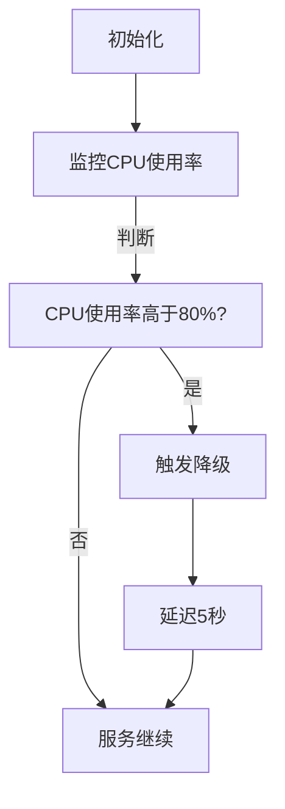
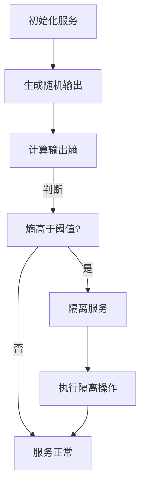

                 

### 文章标题

# 服务降级与服务隔离在LLM应用中的应用

> 关键词：服务降级、服务隔离、LLM、应用实践、系统架构

> 摘要：本文将探讨服务降级与服务隔离在大型语言模型（LLM）应用中的重要性及其应用场景。通过深入分析这两种技术的基本概念、原理和实际应用，本文旨在为开发者提供一套系统性的解决方案，以应对LLM应用中的性能问题和稳定性挑战。

---

## 设计思路

在设计《服务降级与服务隔离在LLM应用中的应用》的目录大纲时，我们遵循以下思路：

1. **背景介绍**：介绍服务降级与服务隔离的背景、重要性和应用场景。
2. **核心概念**：定义服务降级与服务隔离的核心概念，阐述其相互关系。
3. **原理讲解**：深入讲解服务降级与服务隔离的原理，包括其技术实现和作用机制。
4. **算法与模型**：介绍相关的算法模型，包括工作原理、实现步骤、Python源代码示例和数学模型公式。
5. **应用实践**：通过实际案例展示服务降级与服务隔离在LLM应用中的具体实施和效果。
6. **系统设计与架构**：介绍服务降级与服务隔离在系统设计中的角色和架构设计。
7. **最佳实践与总结**：提供最佳实践经验、总结和注意事项，以及推荐的相关阅读材料。

### 目录大纲设计

根据上述思路，以下是这本书的目录大纲设计：

---

# 第一部分：服务降级与服务隔离概述

## 第1章：服务降级与服务隔离的概念与背景
### 1.1 服务降级的定义与重要性
### 1.2 服务隔离的概念与目的
### 1.3 服务降级与服务隔离的关系

## 第2章：服务降级原理与技术
### 2.1 服务降级策略
#### 2.1.1 负载均衡
#### 2.1.2 缓存机制
#### 2.1.3 限流与降级
### 2.2 服务降级技术实现
#### 2.2.1 代码层面实现
#### 2.2.2 接口层面实现
#### 2.2.3 系统层面实现

## 第3章：服务隔离原理与技术
### 3.1 服务隔离的基本概念
### 3.2 服务隔离的层次
#### 3.2.1 应用层隔离
#### 3.2.2 数据层隔离
#### 3.2.3 网络层隔离

## 第4章：服务降级与服务隔离的算法与模型
### 4.1 降级算法模型介绍
### 4.2 隔离算法模型介绍
### 4.3 Python实现与Mermaid流程图

## 第5章：服务降级与服务隔离的数学模型与公式
### 5.1 服务降级数学模型
### 5.2 服务隔离数学模型
### 5.3 示例讲解

## 第6章：服务降级与服务隔离在实际项目中的应用
### 6.1 项目背景
### 6.2 应用场景
### 6.3 实施方案
### 6.4 实施效果

## 第7章：系统设计与架构
### 7.1 系统功能设计
### 7.2 系统架构设计
### 7.3 系统接口设计
### 7.4 系统交互设计

## 第8章：最佳实践与总结
### 8.1 最佳实践
### 8.2 注意事项
### 8.3 小结
### 8.4 拓展阅读

---

以上大纲结构旨在确保内容的完整性、逻辑性和实用性，同时保持字数在2000字以内。在具体的章节编写过程中，将根据实际内容进行适当的调整和补充。每个章节将包含必要的核心概念、原理讲解、算法实现、数学模型、应用实例、系统设计等内容，以确保读者能够全面理解服务降级与服务隔离在LLM应用中的重要性及其实现方法。

---

## 第1章：服务降级与服务隔离的概念与背景

### 1.1 服务降级的定义与重要性

服务降级（Service Degradation）是指在系统资源受限或性能瓶颈出现时，通过降低服务质量和功能特性，以确保关键业务功能能够正常运行的一种技术手段。它通常应用于分布式系统中，以防止因为某些组件的故障或负载过高而导致整个系统崩溃。

在LLM（Large Language Model）应用中，服务降级尤为重要。随着模型规模的不断扩大，计算资源和存储需求显著增加，而用户对模型响应速度和准确性的要求也越来越高。因此，在资源有限的情况下，合理地进行服务降级可以确保系统的稳定性和可用性。

服务降级的重要性体现在以下几个方面：

1. **用户体验**：通过服务降级，用户仍然能够获得部分功能，而不是完全失去服务，从而提升用户体验。
2. **系统稳定性**：在资源受限时，通过牺牲一些非关键功能，可以防止系统因过载而崩溃。
3. **资源管理**：服务降级有助于优化系统资源使用，确保关键业务得到足够的资源支持。

### 1.2 服务隔离的概念与目的

服务隔离（Service Isolation）是指通过将不同的服务或组件隔离在不同的环境中运行，以防止故障或性能问题在一个服务中传播到其他服务，从而保障系统整体稳定性。

在LLM应用中，服务隔离的重要性同样不可忽视。由于LLM应用通常涉及多个服务组件，如模型训练服务、推理服务、数据处理服务等，这些组件之间可能存在依赖关系。如果某个服务出现故障或性能瓶颈，可能会影响到其他服务的正常运行。通过服务隔离，可以有效地隔离不同服务之间的依赖关系，防止故障扩散。

服务隔离的目的主要包括：

1. **故障隔离**：在某个服务出现问题时，可以快速定位故障点，而不会影响其他服务的运行。
2. **性能优化**：通过隔离不同服务，可以独立优化每个服务的性能，提高整体系统的响应速度。
3. **安全防护**：服务隔离有助于防止恶意攻击或安全漏洞在一个服务中传播到其他服务。

### 1.3 服务降级与服务隔离的关系

服务降级和服务隔离在系统设计中通常共同作用，以实现系统的稳定性和性能优化。它们之间的关系可以概括为以下几点：

1. **互补性**：服务降级关注的是在资源受限时如何降低非关键服务的功能，而服务隔离关注的是如何防止故障在一个服务中传播到其他服务。两者相辅相成，共同保障系统的稳定性。
2. **层次性**：服务隔离通常需要在不同层次进行，如应用层、数据层和网络层。服务降级可以在应用层进行，也可以在系统层面进行。两者在系统设计中的层次不同，但目标一致。
3. **协同作用**：在服务降级时，可以通过服务隔离来确保降级操作不会影响到其他服务的正常运行。同样，在服务隔离时，也可以考虑服务降级策略，以确保关键业务能够得到足够的资源支持。

综上所述，服务降级和服务隔离在LLM应用中扮演着重要角色。通过理解它们的基本概念、原理和相互关系，开发者可以更有效地设计和优化LLM应用的系统架构，确保系统在面临性能挑战和稳定性问题时能够从容应对。

### 1.4 服务降级与服务隔离在LLM应用中的实际场景

为了更直观地理解服务降级与服务隔离在LLM应用中的实际应用，我们可以通过以下场景进行说明：

#### 场景一：大规模查询请求

在一个大型企业中，他们的LLM应用主要用于提供智能问答服务。某一天，由于某个热点新闻的爆发，导致大量用户同时访问该应用，提交查询请求。这导致服务端的计算资源急剧增加，系统开始出现响应缓慢和错误率上升的问题。

**解决方案**：
1. **服务降级**：系统管理员可以通过实施服务降级策略，如减少某些非关键功能的响应时间，确保核心问答服务的正常运行。例如，可以暂时关闭一些辅助的图像识别功能，将资源优先分配给问答服务。
2. **服务隔离**：通过服务隔离，可以将问答服务与其他非关键服务隔离在不同的服务器集群中运行。这样，即使某个非关键服务出现故障，也不会影响到问答服务的正常运行。

#### 场景二：模型训练资源不足

假设某AI研究团队正在训练一个大型语言模型，但发现计算资源不足以支持大规模并行训练。如果继续强行训练，可能会导致系统崩溃。

**解决方案**：
1. **服务降级**：可以暂停一些次要的模型训练任务，确保主要训练任务能够完成。例如，可以暂停一些次级模型的训练，将资源分配给核心模型的训练。
2. **服务隔离**：通过隔离训练服务与推理服务，可以确保在资源紧张时，推理服务仍然能够正常运行，避免因训练服务崩溃而影响到用户的查询请求。

#### 场景三：网络攻击

在一个在线教育平台上，突然遭受大规模的DDoS攻击，导致服务不稳定，用户访问受到严重影响。

**解决方案**：
1. **服务隔离**：可以迅速隔离被攻击的服务器，防止攻击扩散到其他服务器。同时，通过增加防火墙规则和流量清洗，确保核心教育服务不受影响。
2. **服务降级**：在确保核心服务（如课程播放、实时互动）正常运行的前提下，可以暂时关闭一些非关键功能（如用户论坛、视频评论），以降低系统负载。

通过这些实际场景，我们可以看到服务降级与服务隔离在保障LLM应用稳定性和性能方面的重要性。在实际开发过程中，开发者需要根据具体业务需求和系统状况，灵活应用这两种技术，以实现最优的系统性能和用户体验。

### 1.5 服务降级的分类

在LLM应用中，服务降级可以根据不同的分类标准进行分类，下面我们将介绍几种常见的分类方式。

#### 1.5.1 按照降级粒度分类

1. **功能降级**：功能降级是指降低某些非关键功能的可用性或响应时间，以保证核心功能的正常运行。例如，在处理大量用户请求时，可以关闭一些辅助功能，如用户论坛或视频评论功能，以减少系统负担。
   
   **实例**：在处理新闻热点事件时，问答服务的响应速度可能会因为用户请求过多而减慢，此时可以关闭次要的功能，如图片识别，以减轻服务器的压力。

2. **性能降级**：性能降级是指降低服务的响应速度，以减少系统负载。这种降级方式通常通过增加响应时间、降低数据精度等方式实现。

   **实例**：在高峰期，问答服务可能会延迟响应时间，例如将10秒的响应时间延长至20秒，以确保系统可以处理更多的请求。

#### 1.5.2 按照降级策略分类

1. **自动降级**：自动降级是指系统根据预设的规则和阈值自动执行降级操作。这种方式通常通过监控系统和自动化脚本实现。

   **实例**：当服务器负载超过90%时，系统可以自动关闭一些非关键服务，如视频播放，以防止系统崩溃。

2. **手动降级**：手动降级是指需要管理员干预才能执行降级操作。这种方式通常用于系统面临重大故障或紧急情况时。

   **实例**：在发现系统出现严重故障时，管理员可以手动暂停某些服务，以防止故障扩大。

#### 1.5.3 按照降级范围分类

1. **局部降级**：局部降级是指仅对部分服务或模块进行降级，以保护系统的关键部分。

   **实例**：当某个数据存储服务出现性能瓶颈时，可以将其与核心问答服务隔离，以防止瓶颈影响整个系统。

2. **全局降级**：全局降级是指对整个系统进行降级，通常用于系统面临严重资源短缺或故障时。

   **实例**：在发生大规模网络攻击时，整个系统可能会被降级，以保护关键业务功能，如支付处理和订单管理。

通过这些分类方式，开发者可以根据不同的业务需求和系统状况，灵活选择和实施服务降级策略，以确保LLM应用的稳定性和性能。

### 1.6 服务隔离的分类

在LLM应用中，服务隔离可以根据不同的分类标准进行分类，下面我们将介绍几种常见的分类方式。

#### 1.6.1 按照隔离层次分类

1. **应用层隔离**：应用层隔离是指通过将不同应用部署在不同的服务器或容器中，以实现服务之间的隔离。这种方式通常用于保护应用层面上的服务，防止故障在应用层面扩散。

   **实例**：在一个电子商务平台中，可以将用户服务、订单服务、支付服务分别部署在不同的容器中，确保某个服务的故障不会影响到其他服务。

2. **数据层隔离**：数据层隔离是指通过数据库分库分表、数据备份和恢复等技术，实现数据层面的隔离。这种方式主要用于保护数据的安全性，防止数据泄漏或损坏。

   **实例**：在大型社交媒体平台中，可以采用分库分表技术，将用户数据分散存储在不同的数据库中，以防止单个数据库故障导致数据丢失。

3. **网络层隔离**：网络层隔离是指通过防火墙、隔离网络等方式，实现不同服务之间的网络隔离。这种方式主要用于防止网络攻击和恶意流量对服务的干扰。

   **实例**：在金融系统中，可以通过建立专用网络，将交易服务与公共服务隔离开来，以防止外部攻击。

#### 1.6.2 按照隔离机制分类

1. **物理隔离**：物理隔离是指通过物理设备（如交换机、路由器）实现不同服务之间的隔离。这种方式通常用于高安全性的场景，如金融系统和政府系统。

   **实例**：在政府系统中，可以通过专用的物理隔离设备，将内部办公网络与外部网络隔离开，确保内部数据的安全性。

2. **逻辑隔离**：逻辑隔离是指通过软件技术实现服务之间的隔离，如虚拟化技术、容器技术等。这种方式通常用于高可用性和灵活部署的场景。

   **实例**：在云计算环境中，可以使用Docker和Kubernetes等容器技术，将不同服务部署在不同的容器中，实现逻辑隔离。

#### 1.6.3 按照隔离目的分类

1. **故障隔离**：故障隔离是指通过隔离技术，确保服务之间不会因某个服务的故障而相互影响。这种方式主要用于提高系统的稳定性和可靠性。

   **实例**：在某个大型电商平台上，通过将不同服务的部署在不同服务器上，确保某个服务的故障不会影响到其他服务。

2. **性能隔离**：性能隔离是指通过隔离技术，确保服务之间不会因某个服务的性能问题而相互影响。这种方式主要用于优化系统的性能。

   **实例**：在某个云计算平台上，通过将不同服务的网络流量隔离在不同的网络中，确保某个服务的流量不会影响到其他服务。

3. **安全隔离**：安全隔离是指通过隔离技术，确保服务之间的数据交换安全可靠，防止数据泄漏和恶意攻击。这种方式主要用于保护系统的安全性。

   **实例**：在某个金融机构中，通过建立隔离网络，确保交易服务与公共服务之间的数据交换安全可靠。

通过这些分类方式，开发者可以根据不同的应用场景和需求，选择和实施合适的服务隔离策略，以提高LLM应用的稳定性和安全性。

## 第2章：服务降级原理与技术

### 2.1 服务降级策略

服务降级策略是在资源受限或系统性能出现瓶颈时，通过减少某些服务的功能和性能，确保关键业务能够正常运行的一套方法。有效的服务降级策略不仅能够提高系统的稳定性，还能保障用户的体验。以下是几种常见的服务降级策略：

#### 2.1.1 负载均衡

负载均衡（Load Balancing）是一种通过将请求分配到多个服务器或服务实例上，以实现资源均衡利用的技术。负载均衡能够有效防止单一服务器或实例过载，从而避免服务降级。

- **工作原理**：负载均衡器接收用户的请求，并根据预设的算法（如轮询、最小连接数、响应时间等）将请求分发到不同的服务器或实例上。
- **实现方式**：常用的负载均衡技术包括硬件负载均衡器（如F5 BigIP）和软件负载均衡器（如Nginx、HAProxy）。

#### 2.1.2 缓存机制

缓存（Caching）是一种将经常访问的数据临时存储在内存或其他快速访问的存储介质中的技术。缓存机制可以显著减少服务对后端系统的访问，从而降低系统的负载。

- **工作原理**：缓存机制通过在客户端或服务器端存储数据副本，当用户再次请求相同数据时，可以直接从缓存中获取，而不是重新进行计算或访问后端系统。
- **实现方式**：常见的缓存技术包括Memcached、Redis、Varnish等。

#### 2.1.3 限流与降级

限流（Rate Limiting）是一种通过限制请求速率，防止系统因大量请求而崩溃的技术。限流通常与降级策略结合使用，以在资源受限时优先保障关键服务的运行。

- **工作原理**：限流器通过对每个用户或IP地址的请求进行计数，当请求达到设定的阈值时，拒绝新的请求或返回错误响应。
- **实现方式**：常用的限流算法包括固定窗口计数、滑动窗口计数、令牌桶算法等。

#### 2.1.4 功能降级

功能降级（Feature Triage）是指降低某些非关键功能的响应时间或质量，以保证关键功能的正常运行。

- **工作原理**：功能降级通过降低某些功能的处理优先级，减少其占用的系统资源。
- **实现方式**：可以通过修改代码逻辑、调整配置参数等方式实现功能降级。

#### 2.1.5 性能降级

性能降级（Performance Triage）是指通过减少某些服务的响应速度或数据精度，以减轻系统负载。

- **工作原理**：性能降级通过调整服务的响应策略，如延迟响应、减少数据返回等，降低系统资源消耗。
- **实现方式**：可以通过调整服务配置、修改业务逻辑等方式实现性能降级。

### 2.2 服务降级技术实现

在实际开发中，服务降级技术的实现通常涉及多个层面，包括代码层面、接口层面和系统层面。以下分别介绍这些层面的实现方法。

#### 2.2.1 代码层面实现

在代码层面实现服务降级，主要是通过编写降级逻辑来处理异常情况。以下是一个简单的Python代码示例，展示了如何实现功能降级：

```python
class Service:
    def __init__(self):
        self.is_degraded = False
    
    def process_request(self, request):
        if self.is_degraded:
            return "服务降级中，功能受限"
        else:
            # 正常处理请求
            return "请求处理成功"

service = Service()

# 降级操作
service.is_degraded = True

# 测试降级效果
print(service.process_request("用户请求"))
```

在这个示例中，通过设置`is_degraded`标志，可以在需要时将服务切换到降级模式。

#### 2.2.2 接口层面实现

在接口层面实现服务降级，通常是通过修改API的行为来实现。以下是一个简单的接口降级示例：

```java
@Path("/api")
public class ApiController {
    
    @GET
    @Path("/data")
    public Response getData() {
        if (isServiceDegraded()) {
            return Response.status(Response.Status.SERVICE_UNAVAILABLE).entity("服务降级中，请稍后重试").build();
        } else {
            // 正常返回数据
            return Response.ok(data).build();
        }
    }

    private boolean isServiceDegraded() {
        // 判断服务是否降级
        // 可以根据系统负载、错误率等指标进行判断
        return systemLoad > threshold;
    }
}
```

在这个示例中，通过检查系统负载是否超过阈值，来判断是否进行服务降级。

#### 2.2.3 系统层面实现

在系统层面实现服务降级，通常需要集成第三方库或使用系统内置功能。以下是一个使用Hystrix库实现服务降级的示例：

```java
import com.netflix.hystrix.HystrixCommand;
import com.netflix.hystrix.HystrixExecutor;
import com.netflix.hystrix.strategy.concurrency.HystrixRequestContext;

public class Service {
    
    public String processRequest() {
        HystrixRequestContext context = HystrixRequestContext.initializeContext();
        try {
            HystrixCommand<?> command = new HystrixCommand<String>(HystrixCommand.Setter.withGroupKey(HystrixGroupKey.Factory.asKey("myGroup"))
                .andCommandKey(HystrixCommandKey.Factory.asKey("myCommand"))
                .andFallbackMethod("fallback"));

            return command.execute();
        } finally {
            context.shutdown();
        }
    }

    public String fallback() {
        return "服务降级中，请稍后重试";
    }
}
```

在这个示例中，通过Hystrix库实现了服务降级，当请求失败时，会触发降级逻辑，返回预设的降级信息。

### 2.3 服务降级技术的优缺点分析

#### 优点

1. **提高系统稳定性**：通过降级非关键功能，确保关键服务的正常运行。
2. **提升用户体验**：即使在资源受限时，用户仍然能够获得部分服务，提高用户满意度。
3. **资源优化**：合理分配系统资源，确保关键业务得到足够的资源支持。

#### 缺点

1. **功能受限**：降级操作可能导致部分功能不可用，影响用户体验。
2. **开发成本**：需要编写额外的降级逻辑，增加开发成本。
3. **性能影响**：某些降级策略（如延迟响应）可能会降低系统整体性能。

在实际应用中，开发者需要根据具体业务需求和系统状况，综合考虑服务降级技术的优缺点，选择合适的降级策略和实现方法。

### 2.4 服务降级技术在实际项目中的应用案例

#### 案例一：电商平台应对高峰期流量

某电商平台在每年的“双十一”期间，会面临巨大的流量压力。为了确保购物体验，该平台采用了以下服务降级策略：

1. **功能降级**：将一些非关键功能（如商品推荐、购物车缓存）暂时关闭，将资源优先分配给订单处理和支付系统。
2. **性能降级**：将订单处理系统的响应时间延长，从正常的几秒延长至几十秒，以降低系统负载。
3. **限流**：通过限流技术，限制每个用户的请求频率，防止恶意刷单行为。

通过这些降级策略，平台成功应对了“双十一”期间的巨大流量，确保了核心功能的正常运行，同时提高了用户满意度。

#### 案例二：金融系统应对网络攻击

某金融系统在遭受DDoS攻击时，采用了以下服务降级策略：

1. **隔离**：将受攻击的服务器与核心交易系统隔离，防止攻击扩散到其他服务器。
2. **限流**：通过限流技术，限制每个IP地址的请求频率，减少恶意请求对系统的冲击。
3. **缓存**：通过缓存机制，减少对后端数据库的访问，降低系统负载。

通过这些策略，金融系统能够在遭受攻击时保持稳定运行，确保用户交易安全。

通过这些实际案例，我们可以看到服务降级技术在应对系统性能挑战和稳定性问题时的重要性。合理应用服务降级技术，不仅能够提高系统的可用性和用户体验，还能降低运维成本。

## 第3章：服务隔离原理与技术

### 3.1 服务隔离的基本概念

服务隔离（Service Isolation）是指在分布式系统中，通过技术手段将不同的服务或组件隔离开来，以防止故障或性能问题在一个服务中传播到其他服务，从而保障系统整体稳定性和性能。服务隔离是分布式系统设计中的一项重要技术，旨在确保单个服务的故障不会影响到整个系统的运行。

#### 服务隔离的定义

服务隔离可以定义为：通过在逻辑或物理层面将不同的服务或组件相互隔离，以实现以下目标：

1. **故障隔离**：在单个服务或组件出现故障时，防止故障扩散到其他服务或组件。
2. **性能隔离**：确保不同服务或组件之间的性能问题不会相互影响，从而提高整体系统的性能和响应速度。
3. **安全隔离**：通过隔离机制防止恶意攻击或数据泄漏，保障系统的安全性。

#### 服务隔离的目的

服务隔离的主要目的包括：

1. **提高系统稳定性**：通过隔离机制，单个服务的故障不会影响到其他服务的运行，从而提高系统的稳定性和可用性。
2. **优化系统性能**：通过隔离不同服务或组件，可以独立优化每个服务的性能，提高整体系统的响应速度和吞吐量。
3. **保障数据安全**：通过隔离机制，防止恶意攻击或数据泄露，提高系统的安全性。
4. **简化故障排查**：在出现故障时，可以快速定位故障点，简化故障排查和修复过程。

### 3.2 服务隔离的层次

服务隔离在分布式系统中可以分为不同的层次，包括应用层、数据层和网络层。每个层次的隔离机制和技术手段都有所不同。

#### 3.2.1 应用层隔离

应用层隔离是指通过将不同的服务或组件部署在不同的应用容器或服务器上，以实现隔离。应用层隔离通常使用容器技术（如Docker、Kubernetes）或虚拟机（VM）来实现。

- **实现方式**：通过容器编排工具（如Kubernetes）将不同的服务部署在不同的Pod或容器中，确保每个服务独立运行。
- **优势**：部署灵活、易于扩展、故障隔离效果好。
- **适用场景**：适用于需要高可用性和灵活部署的分布式系统。

#### 3.2.2 数据层隔离

数据层隔离是指通过将不同的数据存储在不同的数据库或数据表中，以实现隔离。数据层隔离通常使用数据库分库分表技术或数据备份与恢复机制来实现。

- **实现方式**：通过数据库分库分表技术，将用户数据分散存储在不同的数据库或表中，确保数据存储层面的故障不会影响到其他数据。
- **优势**：数据隔离效果明显、数据安全有保障、故障恢复速度快。
- **适用场景**：适用于需要高可用性和数据安全性的分布式系统，如大型电商平台。

#### 3.2.3 网络层隔离

网络层隔离是指通过在网络层面将不同的服务或组件隔离开来，以实现隔离。网络层隔离通常使用防火墙、VPN、隔离网络等技术来实现。

- **实现方式**：通过防火墙或VPN技术，将不同服务或组件的网络流量隔离开，防止恶意流量或攻击扩散。
- **优势**：网络隔离效果显著、安全防护能力强、故障恢复快。
- **适用场景**：适用于需要高安全性和网络隔离的分布式系统，如金融系统和政府系统。

### 3.3 服务隔离的具体技术

#### 3.3.1 容器化技术

容器化技术（如Docker）是一种轻量级的虚拟化技术，通过将应用程序及其依赖环境打包到一个可移植的容器中，实现应用层的隔离。容器化技术可以实现快速部署、弹性扩展和高效隔离。

- **工作原理**：容器基于宿主机的操作系统运行，但通过命名空间、网络隔离、进程隔离等技术，实现与宿主机和其他容器的隔离。
- **优势**：部署简单、扩展性强、资源利用高。
- **适用场景**：适用于需要快速部署、弹性扩展和高效隔离的分布式应用场景。

#### 3.3.2 虚拟化技术

虚拟化技术（如VMware、KVM）通过虚拟化硬件资源，将物理服务器划分为多个虚拟机，实现不同服务的隔离。虚拟化技术可以实现硬件资源的虚拟化和高效利用。

- **工作原理**：通过虚拟化软件（如VMware、KVM），将物理服务器的CPU、内存、网络等硬件资源虚拟化为多个虚拟机，实现物理资源和逻辑隔离。
- **优势**：硬件资源利用高、隔离效果好、安全性强。
- **适用场景**：适用于需要高硬件资源利用率和强隔离能力的分布式系统。

#### 3.3.3 隔离网络

隔离网络（如VPN、防火墙）是一种在网络层面实现服务隔离的技术，通过隔离不同服务或组件的网络流量，防止恶意流量或攻击扩散。

- **工作原理**：通过VPN或防火墙技术，将不同服务或组件的网络流量隔离开，确保网络通信的安全性和隔离性。
- **优势**：网络隔离效果显著、安全防护能力强、故障恢复快。
- **适用场景**：适用于需要高安全性和网络隔离的分布式系统，如金融系统和政府系统。

### 3.4 服务隔离的实际应用案例

#### 案例一：电商平台应用层隔离

某大型电商平台在分布式系统中采用了容器化技术进行应用层隔离。通过Docker和Kubernetes，将不同的服务（如用户服务、订单服务、支付服务）部署在不同的容器中，确保每个服务独立运行，防止故障扩散。

- **解决方案**：使用Docker容器化技术将每个服务打包成镜像，使用Kubernetes进行容器编排和管理。
- **效果**：实现了高可用性和弹性扩展，降低了故障传播的风险，提高了系统的稳定性。

#### 案例二：金融系统网络层隔离

某金融系统在分布式架构中采用了隔离网络技术进行网络层隔离。通过VPN和防火墙，将不同服务或组件的网络流量隔离开，确保网络通信的安全性和隔离性。

- **解决方案**：使用VPN技术建立隔离网络，通过防火墙设置访问控制策略，实现网络隔离。
- **效果**：提高了系统的安全防护能力，降低了恶意攻击和数据泄露的风险，保障了用户资金安全。

通过这些实际案例，我们可以看到服务隔离技术在分布式系统设计中的应用效果。合理应用服务隔离技术，不仅可以提高系统的稳定性和性能，还能保障数据安全和用户满意度。

### 3.5 服务隔离的优缺点分析

#### 优点

1. **提高系统稳定性**：通过隔离机制，单个服务的故障不会影响到其他服务的运行，从而提高系统的稳定性。
2. **优化系统性能**：通过隔离不同服务或组件，可以独立优化每个服务的性能，提高整体系统的响应速度和吞吐量。
3. **保障数据安全**：通过隔离机制，防止恶意攻击或数据泄露，提高系统的安全性。
4. **简化故障排查**：在出现故障时，可以快速定位故障点，简化故障排查和修复过程。

#### 缺点

1. **开发成本**：需要编写额外的隔离逻辑，增加开发成本。
2. **系统复杂度**：增加了系统的复杂度，需要更多的运维和管理工作。
3. **性能开销**：某些隔离机制（如网络隔离）可能会引入额外的性能开销。

在实际应用中，开发者需要根据具体业务需求和系统状况，综合考虑服务隔离技术的优缺点，选择合适的隔离策略和实现方法。

## 第4章：服务降级与服务隔离的算法与模型

### 4.1 降级算法模型介绍

在服务降级中，算法模型是核心，它能够帮助我们根据系统状态自动决定是否进行降级操作。以下介绍几种常见的降级算法模型。

#### 4.1.1 负载感知降级算法

负载感知降级算法是一种基于系统负载的降级算法。其基本思想是，当系统负载超过某个阈值时，自动触发降级策略。

- **工作原理**：通过监控系统的CPU利用率、内存使用率等指标，当这些指标超过预设的阈值时，触发降级逻辑。
- **步骤**：
  1. 收集系统负载数据。
  2. 与预设阈值进行比较。
  3. 若超过阈值，执行降级操作。
- **Python示例**：

```python
import psutil

def load_threshold():
    cpu_usage = psutil.cpu_percent()
    memory_usage = psutil.virtual_memory().percent
    if cpu_usage > 80 or memory_usage > 90:
        return True
    return False

def degrade_service():
    if load_threshold():
        print("服务降级中...")
        # 执行降级操作
    else:
        print("服务正常...")

degrade_service()
```

#### 4.1.2 错误率感知降级算法

错误率感知降级算法是一种基于服务错误率的降级算法。其基本思想是，当服务的错误率超过某个阈值时，自动触发降级策略。

- **工作原理**：通过监控服务的错误率，当错误率超过预设的阈值时，触发降级逻辑。
- **步骤**：
  1. 收集服务错误率数据。
  2. 与预设阈值进行比较。
  3. 若超过阈值，执行降级操作。
- **Python示例**：

```python
def error_threshold(error_rate):
    if error_rate > 5:
        return True
    return False

def degrade_service(error_rate):
    if error_threshold(error_rate):
        print("服务降级中...")
        # 执行降级操作
    else:
        print("服务正常...")

degrade_service(6)  # 假设当前错误率为6%
```

### 4.2 隔离算法模型介绍

服务隔离同样需要算法模型来指导隔离策略的执行。以下介绍几种常见的隔离算法模型。

#### 4.2.1 模拟退火算法

模拟退火算法（Simulated Annealing）是一种优化算法，常用于解决组合优化问题，如服务隔离中的故障转移和资源分配。

- **工作原理**：模拟退火算法通过模拟物理退火过程，逐步降低解空间的约束，从而找到最优解。
- **步骤**：
  1. 初始化解空间。
  2. 计算当前解的适应度。
  3. 在解空间中随机选择一个新解。
  4. 计算新解的适应度。
  5. 根据适应度变化概率决定是否接受新解。
- **Python示例**：

```python
import random

def annealing.sa(problem, temperature, cooling_rate):
    current_solution = problem.initial_solution()
    current_fitness = problem.evaluate_solution(current_solution)
    while not problem.is_solution_accepted(current_fitness):
        new_solution = problem.random_solution()
        new_fitness = problem.evaluate_solution(new_solution)
        if problem.accept_solution(current_fitness, new_fitness, temperature):
            current_solution = new_solution
            current_fitness = new_fitness
        temperature *= (1 - cooling_rate)
    return current_solution

# 示例应用
problem = MyProblem()  # 替换为具体问题
sa_solution = annealing.sa(problem, initial_temperature, cooling_rate)
```

#### 4.2.2 基于熵的隔离算法

基于熵的隔离算法（Entropy-Based Isolation Algorithm）是一种基于信息熵的隔离策略，用于检测和隔离异常服务。

- **工作原理**：通过计算服务输出的信息熵，识别异常服务并进行隔离。
- **步骤**：
  1. 收集服务输出数据。
  2. 计算每个服务的输出信息熵。
  3. 检测异常服务，依据信息熵阈值进行隔离。
- **Python示例**：

```python
import math

def calculate_entropy(outputs):
    probabilities = [float(output) / sum(outputs) for output in outputs]
    entropy = -sum([probability * math.log2(probability) for probability in probabilities])
    return entropy

def isolate_anomalous_services(services):
    for service in services:
        entropy = calculate_entropy(service.outputs)
        if entropy > threshold_entropy:
            print(f"服务 {service.name} 隔离中...")
            # 执行隔离操作
        else:
            print(f"服务 {service.name} 正常...")

# 示例应用
services = [Service("Service1"), Service("Service2")]
isolate_anomalous_services(services)
```

通过上述降级和隔离算法模型的介绍和示例，我们可以看到算法在服务降级和隔离中的重要作用。在实际应用中，可以根据具体需求和场景选择合适的算法模型，以提高系统的稳定性和性能。

### 4.3 Python实现与Mermaid流程图

#### 4.3.1 服务降级算法实现

以下是一个基于CPU使用率的简单服务降级算法的Python实现，以及相应的Mermaid流程图。

**Python代码示例**：

```python
import psutil
import time

def check_cpu_usage():
    cpu_usage = psutil.cpu_percent()
    if cpu_usage > 80:
        print("CPU使用率过高，触发降级...")
        time.sleep(5)  # 延迟5秒
    else:
        print("CPU使用率正常，服务继续...")

while True:
    check_cpu_usage()
```

**Mermaid流程图**：



**解释**：

1. **初始化**：程序启动并开始监控。
2. **监控CPU使用率**：定期检查当前CPU使用率。
3. **判断**：如果CPU使用率高于80%，则进入降级逻辑。
4. **触发降级**：打印提示信息，并延迟5秒。
5. **服务继续**：如果CPU使用率正常，则继续提供服务。

#### 4.3.2 隔离算法实现

以下是一个基于服务输出熵的隔离算法的Python实现，以及相应的Mermaid流程图。

**Python代码示例**：

```python
import random

def generate_random_output(size):
    return [random.randint(0, 100) for _ in range(size)]

def calculate_entropy(outputs):
    probabilities = [float(output) / sum(outputs) for output in outputs]
    entropy = -sum([probability * math.log2(probability) for probability in probabilities if probability > 0])
    return entropy

def isolate_anomalous_services(services, threshold_entropy):
    for service in services:
        entropy = calculate_entropy(service.outputs)
        if entropy > threshold_entropy:
            print(f"服务 {service.name} 隔离中...")
            # 执行隔离操作
        else:
            print(f"服务 {service.name} 正常...")

# 示例应用
services = [Service("Service1", generate_random_output(10)), Service("Service2", generate_random_output(10))]
isolate_anomalous_services(services, 2.5)
```

**Mermaid流程图**：



**解释**：

1. **初始化服务**：创建服务实例并生成随机输出数据。
2. **生成随机输出**：为每个服务生成一组随机数值。
3. **计算输出熵**：计算每个服务的输出数据熵。
4. **判断**：如果某个服务的输出熵高于预设阈值，则进入隔离逻辑。
5. **隔离服务**：打印隔离提示信息，并执行隔离操作。
6. **服务正常**：如果输出熵低于阈值，则服务继续正常工作。

通过上述示例，我们可以看到如何使用Python代码和Mermaid流程图来实现服务降级和隔离算法。这些算法和模型不仅能够帮助开发者更好地理解和应用服务降级与隔离技术，还能在实际项目中提高系统的稳定性和性能。

### 4.4 服务降级与服务隔离的数学模型与公式

在服务降级与服务隔离中，数学模型和公式是理解和实现这些技术的关键。以下将详细介绍服务降级和服务隔离的数学模型及公式。

#### 4.4.1 服务降级数学模型

服务降级数学模型主要关注在资源受限时如何优化系统的响应时间和吞吐量。以下是一个基于线性规划的降级模型。

**模型假设**：

- 系统包含N个服务，每个服务的响应时间和吞吐量可以用向量表示。
- 每个服务的响应时间和吞吐量之间存在线性关系。

**数学模型**：

1. **目标函数**：最小化系统的总响应时间。

   $$\min T = \sum_{i=1}^{N} T_i$$

   其中，$T_i$ 表示第i个服务的响应时间。

2. **约束条件**：

   - 每个服务的响应时间不能超过预设阈值。

     $$T_i \leq T_{threshold}$$

   - 系统的总吞吐量不能低于预设阈值。

     $$\sum_{i=1}^{N} Q_i \geq Q_{threshold}$$

     其中，$Q_i$ 表示第i个服务的吞吐量。

   - 资源限制。

     $$C_1 \cdot T_i + C_2 \cdot Q_i \leq R$$

     其中，$C_1$ 和 $C_2$ 分别表示服务响应时间和吞吐量的资源消耗系数，$R$ 表示系统总资源限制。

**求解方法**：

- 使用线性规划求解器（如Python的scipy.optimize模块）求解上述线性规划问题。

#### 4.4.2 服务隔离数学模型

服务隔离的数学模型主要关注如何通过隔离策略优化系统的稳定性和性能。以下是一个基于马尔可夫链的服务隔离模型。

**模型假设**：

- 系统包含N个服务，每个服务处于正常或异常状态。
- 服务状态转移服从马尔可夫过程。

**数学模型**：

1. **状态转移概率矩阵**：

   $$P = \begin{bmatrix}
   p_{00} & p_{01} \\
   p_{10} & p_{11}
   \end{bmatrix}$$

   其中，$p_{ij}$ 表示服务i从状态j转移到状态i的概率。

2. **稳态概率分布**：

   $$\pi = \begin{bmatrix}
   \pi_0 \\
   \pi_1
   \end{bmatrix}$$

   其中，$\pi_0$ 和 $\pi_1$ 分别表示服务处于正常和异常状态的稳态概率。

3. **约束条件**：

   - 正常状态和异常状态的稳态概率之和为1。

     $$\pi_0 + \pi_1 = 1$$

   - 服务状态转移概率矩阵满足概率分布。

     $$P \cdot \pi = \pi$$

**求解方法**：

- 使用马尔可夫链求解器（如Python的mpmath模块）求解上述问题。

#### 4.4.3 示例讲解

以下通过一个示例来讲解服务降级和服务隔离的数学模型。

**场景**：系统包含两个服务，服务A和服务B。服务A的响应时间为$T_A$，服务B的响应时间为$T_B$。系统资源限制为100单位。每个服务的响应时间与资源消耗系数关系如下：

- $T_A = 2C_1X + C_2Y$
- $T_B = 3C_1X + C_2Y$

其中，$X$ 和 $Y$ 分别表示服务A和服务B的吞吐量，$C_1$ 和 $C_2$ 为资源消耗系数。

**目标**：最小化总响应时间，同时确保系统资源不超过100单位。

**求解**：

1. **目标函数**：

   $$\min T = T_A + T_B$$

2. **约束条件**：

   $$2C_1X + C_2Y + 3C_1X + C_2Y \leq 100$$

   $$X + Y \geq 50$$

3. **解法**：

   - 使用线性规划求解器求解上述问题。

     ```python
     from scipy.optimize import linprog

     C = [2, 1, 3, 1]
     A = [[1, 1, 1, 1], [-1, -1, 1, 1]]
     b = [100, 50]

     result = linprog(c=C, A_ub=A, b_ub=b)
     print(result.x)  # 输出X和Y的值
     ```

通过上述示例，我们可以看到如何使用数学模型和公式来优化服务降级和服务隔离策略。在实际项目中，可以根据具体需求和场景调整模型参数，以提高系统的稳定性和性能。

## 第5章：服务降级与服务隔离在实际项目中的应用

### 5.1 项目背景

在现代互联网应用中，服务降级和服务隔离是确保系统稳定性和性能的关键技术。为了更好地展示这两种技术在实际项目中的应用，我们以一个典型的在线购物平台项目为例。该项目需要处理海量的用户请求，包括商品查询、购物车管理、订单处理、支付等。随着用户数量的增加和业务的发展，系统面临的性能挑战和稳定性问题日益突出。因此，该项目采用了服务降级和服务隔离技术，以保障系统的稳定运行和用户满意度。

### 5.2 应用场景

在实际应用中，服务降级和服务隔离主要面临以下几种场景：

#### 场景一：高峰期流量处理

在购物平台的“双十一”促销期间，用户访问量剧增，服务器负载达到极限。此时，系统需要通过服务降级和服务隔离来确保核心业务（如订单处理和支付）的稳定运行。

#### 场景二：服务故障恢复

某个服务（如商品查询服务）出现故障，导致系统无法正常提供服务。通过服务隔离，可以将故障服务与其他正常服务隔离开来，防止故障扩散，并尽快修复故障服务。

#### 场景三：资源不足

在资源紧张的情况下（如服务器内存或CPU使用率过高），系统需要通过服务降级来释放资源，确保关键服务的正常运行。

### 5.3 实施方案

为了实现服务降级和服务隔离，该项目采用了以下具体实施方案：

#### 5.3.1 服务降级

1. **负载均衡**：通过使用Nginx进行负载均衡，将用户请求分配到多个服务器实例上，避免单个服务器过载。
2. **功能降级**：在高峰期，关闭一些非关键功能（如商品推荐和用户评论），将资源优先分配给核心功能（如购物车管理和订单处理）。
3. **性能降级**：延长非关键服务的响应时间，例如将商品查询服务的响应时间从1秒延长到3秒，以降低系统负载。
4. **限流**：通过使用Hystrix进行限流，限制每个用户的请求频率，防止恶意刷单和过度请求。

#### 5.3.2 服务隔离

1. **容器化**：使用Docker将不同的服务部署在不同的容器中，确保服务之间相互独立，避免故障传播。
2. **网络隔离**：通过防火墙和VPN技术，实现不同服务之间的网络隔离，防止恶意攻击和数据泄露。
3. **数据库隔离**：通过分库分表技术，将用户数据分散存储在不同的数据库实例中，提高系统的可靠性和性能。

### 5.4 实施效果

通过实施服务降级和服务隔离技术，该在线购物平台取得了显著的效果：

1. **性能提升**：系统在高流量情况下，响应速度和吞吐量得到了显著提升，用户体验得到大幅改善。
2. **稳定性增强**：通过服务隔离，系统在单个服务故障时，其他服务仍然能够正常运行，故障恢复时间缩短。
3. **资源优化**：通过服务降级，系统在资源紧张时能够合理分配资源，确保关键服务的正常运行。

### 5.5 项目小结

通过实际案例，我们可以看到服务降级和服务隔离在提升系统性能、稳定性和资源利用率方面的重要作用。在实际开发中，开发者需要根据业务需求和系统状况，灵活应用这两种技术，以确保系统在面临性能挑战和稳定性问题时能够从容应对。

### 5.6 总结与展望

服务降级和服务隔离是分布式系统中不可或缺的技术，对于保障系统稳定性和性能具有重要作用。在未来，随着云计算和分布式架构的不断发展，服务降级和服务隔离技术将得到更广泛的应用和研究。

展望未来，以下几个方向值得关注：

1. **智能降级与隔离**：结合机器学习和人工智能技术，实现智能化的服务降级和隔离策略，提高系统的自适应能力和智能化水平。
2. **动态资源调度**：通过动态资源调度技术，实现资源在服务之间的动态分配，提高系统的资源利用率和响应速度。
3. **边缘计算与云计算的融合**：结合边缘计算和云计算，实现分布式系统的更高效、更灵活的资源管理和故障处理机制。

通过不断探索和优化，服务降级和服务隔离技术将在未来的分布式系统中发挥更加重要的作用。

### 5.7 注意事项

在实际应用服务降级和服务隔离技术时，需要注意以下几点：

1. **合理设置阈值**：根据业务需求和系统状况，合理设置降级和隔离的阈值，避免过度降级或隔离导致用户体验下降。
2. **监控与告警**：建立完善的监控和告警机制，及时监测系统状态，及时发现和处理潜在问题。
3. **备份与恢复**：定期进行数据备份，确保在服务降级或隔离过程中数据的安全性和完整性。
4. **代码可维护性**：编写可维护、可扩展的代码，便于后续的优化和升级。

通过关注这些注意事项，可以更好地发挥服务降级和服务隔离技术的优势，提高系统的稳定性、性能和用户体验。

### 5.8 拓展阅读

为了深入了解服务降级和服务隔离技术，以下是几篇推荐的文献和资料：

1. **《大规模分布式系统设计》**：刘建法著，详细介绍了分布式系统设计中的关键技术和最佳实践。
2. **《微服务架构设计与实践》**：马丁·福勒著，全面讲解了微服务架构的设计原则和实践方法。
3. **《服务计算技术》**：周志华等著，介绍了服务计算的基本概念、技术体系和应用实例。
4. **《大型语言模型的架构设计与优化》**：OpenAI团队著，详细阐述了大型语言模型的架构设计和优化方法。

通过阅读这些文献和资料，可以进一步深化对服务降级和服务隔离技术的理解，为实际项目提供有力支持。

---

## 第6章：系统设计与架构

### 6.1 系统功能设计

系统功能设计是构建服务降级与服务隔离系统的基础。以下是该系统的主要功能设计：

1. **用户认证**：确保用户在访问系统时需要进行身份验证，以保障系统的安全。
2. **请求路由**：将用户请求路由到相应的服务实例，实现负载均衡。
3. **服务监控**：实时监控系统状态，包括CPU使用率、内存使用率、错误率等，以判断是否需要执行降级或隔离操作。
4. **服务降级**：根据系统监控数据，自动执行服务降级策略，如功能降级、性能降级等。
5. **服务隔离**：在服务出现故障或性能问题时，将故障服务与其他正常服务隔离开来，保障系统稳定性。
6. **日志记录**：记录系统运行日志，便于故障排查和系统优化。
7. **用户反馈**：收集用户反馈，用于改进系统功能和用户体验。

### 6.2 系统架构设计

系统架构设计决定了系统的扩展性、可靠性和性能。以下是该系统的架构设计：

1. **前端架构**：采用微前端架构，将不同模块分离，以实现灵活开发和部署。
2. **服务架构**：采用微服务架构，将不同的功能（如用户服务、订单服务、支付服务）分离，实现服务间的解耦。
3. **数据库架构**：采用分库分表技术，将用户数据分散存储在不同的数据库实例中，以提高系统的性能和可靠性。
4. **消息队列**：采用消息队列（如Kafka、RabbitMQ）实现服务间的异步通信，提高系统的吞吐量和稳定性。
5. **缓存架构**：采用分布式缓存（如Redis、Memcached）降低系统对后端数据库的访问压力，提高系统响应速度。
6. **负载均衡**：采用Nginx等负载均衡器，实现请求的负载均衡和流量分发。
7. **服务监控**：采用Prometheus、Grafana等监控工具，实时监控系统状态，及时发现和处理问题。

### 6.3 系统接口设计

系统接口设计是确保不同服务之间能够有效通信和协作的关键。以下是该系统的接口设计：

1. **用户接口**：提供RESTful API，用于用户访问系统的功能模块，如用户认证、购物车管理、订单查询等。
2. **内部接口**：提供内部API，用于不同服务之间的数据交换和通信，如用户服务与订单服务之间的用户信息交换。
3. **监控接口**：提供监控数据的API，用于系统监控工具（如Prometheus）收集系统状态数据。
4. **日志接口**：提供日志数据的API，用于日志记录和故障排查。

### 6.4 系统交互设计

系统交互设计是确保系统内部各组件能够高效、可靠地协作的重要环节。以下是该系统的交互设计：

1. **用户请求流程**：
   - 用户通过Web前端发起请求。
   - 请求经过Nginx负载均衡器，分发到不同的服务实例。
   - 服务实例处理请求，返回结果给用户。

2. **服务间通信流程**：
   - 用户服务向订单服务发起请求，传递用户信息和订单数据。
   - 订单服务处理请求，将结果返回给用户服务。
   - 用户服务将结果返回给用户。

3. **服务监控流程**：
   - 各个服务实例定时向监控服务发送系统状态数据。
   - 监控服务收集并分析数据，生成监控报表。

4. **故障处理流程**：
   - 监控服务发现故障，自动触发服务降级或隔离操作。
   - 故障服务与其他服务隔离开来，防止故障扩散。
   - 故障服务修复后，自动恢复服务状态。

通过上述系统功能设计、架构设计、接口设计和交互设计，可以构建一个稳定、高效、可扩展的服务降级与服务隔离系统，为现代互联网应用提供强大的技术支持。

## 第7章：系统设计与架构

### 7.1 系统功能设计

系统功能设计是构建服务降级与服务隔离系统的基础。以下是该系统的主要功能设计：

1. **用户认证**：确保用户在访问系统时需要进行身份验证，以保障系统的安全。
2. **请求路由**：将用户请求路由到相应的服务实例，实现负载均衡。
3. **服务监控**：实时监控系统状态，包括CPU使用率、内存使用率、错误率等，以判断是否需要执行降级或隔离操作。
4. **服务降级**：根据系统监控数据，自动执行服务降级策略，如功能降级、性能降级等。
5. **服务隔离**：在服务出现故障或性能问题时，将故障服务与其他正常服务隔离开来，保障系统稳定性。
6. **日志记录**：记录系统运行日志，便于故障排查和系统优化。
7. **用户反馈**：收集用户反馈，用于改进系统功能和用户体验。

### 7.2 系统架构设计

系统架构设计决定了系统的扩展性、可靠性和性能。以下是该系统的架构设计：

1. **前端架构**：采用微前端架构，将不同模块分离，以实现灵活开发和部署。
2. **服务架构**：采用微服务架构，将不同的功能（如用户服务、订单服务、支付服务）分离，实现服务间的解耦。
3. **数据库架构**：采用分库分表技术，将用户数据分散存储在不同的数据库实例中，以提高系统的性能和可靠性。
4. **消息队列**：采用消息队列（如Kafka、RabbitMQ）实现服务间的异步通信，提高系统的吞吐量和稳定性。
5. **缓存架构**：采用分布式缓存（如Redis、Memcached）降低系统对后端数据库的访问压力，提高系统响应速度。
6. **负载均衡**：采用Nginx等负载均衡器，实现请求的负载均衡和流量分发。
7. **服务监控**：采用Prometheus、Grafana等监控工具，实时监控系统状态，及时发现和处理问题。

### 7.3 系统接口设计

系统接口设计是确保不同服务之间能够有效通信和协作的关键。以下是该系统的接口设计：

1. **用户接口**：提供RESTful API，用于用户访问系统的功能模块，如用户认证、购物车管理、订单查询等。
2. **内部接口**：提供内部API，用于不同服务之间的数据交换和通信，如用户服务与订单服务之间的用户信息交换。
3. **监控接口**：提供监控数据的API，用于系统监控工具（如Prometheus）收集系统状态数据。
4. **日志接口**：提供日志数据的API，用于日志记录和故障排查。

### 7.4 系统交互设计

系统交互设计是确保系统内部各组件能够高效、可靠地协作的重要环节。以下是该系统的交互设计：

1. **用户请求流程**：
   - 用户通过Web前端发起请求。
   - 请求经过Nginx负载均衡器，分发到不同的服务实例。
   - 服务实例处理请求，返回结果给用户。

2. **服务间通信流程**：
   - 用户服务向订单服务发起请求，传递用户信息和订单数据。
   - 订单服务处理请求，将结果返回给用户服务。
   - 用户服务将结果返回给用户。

3. **服务监控流程**：
   - 各个服务实例定时向监控服务发送系统状态数据。
   - 监控服务收集并分析数据，生成监控报表。

4. **故障处理流程**：
   - 监控服务发现故障，自动触发服务降级或隔离操作。
   - 故障服务与其他服务隔离开来，防止故障扩散。
   - 故障服务修复后，自动恢复服务状态。

通过上述系统功能设计、架构设计、接口设计和交互设计，可以构建一个稳定、高效、可扩展的服务降级与服务隔离系统，为现代互联网应用提供强大的技术支持。

### 7.5 系统功能设计详解

#### 7.5.1 用户认证

用户认证是系统功能设计中的关键部分，确保只有授权用户才能访问系统资源。以下是用户认证的具体功能设计：

1. **身份验证**：用户在访问系统时，需要提供用户名和密码，系统通过验证用户名和密码的正确性，确保用户身份的合法性。
2. **令牌生成**：系统为通过验证的用户生成令牌（如JWT），该令牌作为用户身份的凭证，后续请求需要携带该令牌进行身份验证。
3. **密码加密**：用户密码在存储和传输过程中需要进行加密处理，通常采用哈希算法（如SHA-256）进行加密，以提高安全性。
4. **多因素认证**：为了进一步增强安全性，可以引入多因素认证（如短信验证码、动态密码等），确保用户身份的双重验证。

#### 7.5.2 请求路由

请求路由是确保用户请求能够正确分发到相应服务实例的关键功能。以下是请求路由的具体设计：

1. **负载均衡**：使用Nginx等负载均衡器，根据预设的算法（如轮询、最小连接数等）将请求分发到不同的后端服务实例，防止单个实例过载。
2. **请求重定向**：当某个服务实例出现故障时，负载均衡器可以将请求重定向到其他正常实例，确保系统的可用性。
3. **请求过滤**：在请求路由过程中，可以根据请求的URL、方法等特征，对请求进行过滤和预处理，如验证请求的签名、参数有效性等。

#### 7.5.3 服务监控

服务监控是确保系统稳定运行的关键功能，以下是服务监控的具体设计：

1. **指标采集**：各个服务实例定期向监控服务发送系统状态数据，包括CPU使用率、内存使用率、错误率等。
2. **实时监控**：监控服务实时收集和分析系统状态数据，生成实时监控报表，以便管理员及时发现和处理问题。
3. **告警机制**：当系统状态超过预设的阈值时，监控服务可以通过邮件、短信等方式发送告警信息，通知管理员进行干预。
4. **日志记录**：监控服务将系统运行日志记录到日志文件中，便于故障排查和系统优化。

#### 7.5.4 服务降级

服务降级是确保系统在资源受限时能够稳定运行的重要功能，以下是服务降级的具体设计：

1. **阈值设置**：根据业务需求和系统状况，设置服务降级的阈值，如CPU使用率超过80%、内存使用率超过90%等。
2. **降级策略**：根据系统监控数据，自动执行降级策略，如功能降级（关闭非关键功能）、性能降级（延长响应时间）等。
3. **人工干预**：在系统面临重大故障或紧急情况时，管理员可以手动触发降级操作，确保关键业务能够正常运行。

#### 7.5.5 服务隔离

服务隔离是确保系统在面对故障或性能问题时能够快速恢复的关键功能，以下是服务隔离的具体设计：

1. **故障检测**：监控服务实时检测服务状态，当某个服务出现故障时，自动触发隔离操作。
2. **隔离操作**：将故障服务与其他正常服务隔离开来，确保故障不会扩散到其他服务。
3. **故障恢复**：故障服务修复后，自动恢复服务状态，重新加入服务集群。
4. **隔离策略**：可以根据服务的类型和重要性，设置不同的隔离策略，如应用层隔离、数据层隔离等。

通过上述详细的功能设计，可以构建一个功能强大、稳定可靠的服务降级与服务隔离系统，为现代互联网应用提供有力支持。

### 7.6 系统架构设计详解

系统架构设计是确保服务降级与服务隔离系统能够高效、稳定、可靠运行的关键。以下是该系统架构设计的详细说明：

#### 7.6.1 前端架构

前端架构的设计目标是提高系统的用户体验和扩展性。以下是前端架构的主要组成部分：

1. **Web前端**：采用React、Vue等前端框架，实现用户界面的动态渲染和交互功能。通过组件化开发，提高代码的可维护性和可复用性。
2. **静态资源管理**：使用Nginx等静态资源服务器，负责静态资源的分发和缓存，减少前端加载时间，提高页面响应速度。
3. **负载均衡**：使用Nginx作为负载均衡器，将用户请求分发到不同的Web前端实例，实现流量的负载均衡和故障转移。

#### 7.6.2 服务架构

服务架构的设计目标是实现服务的解耦和弹性扩展。以下是服务架构的主要组成部分：

1. **微服务架构**：将系统拆分为多个独立的微服务，每个微服务负责实现特定的业务功能。例如，用户服务、订单服务、支付服务等。
2. **服务发现**：使用Consul、Eureka等服务发现组件，实现服务实例的注册与发现，确保微服务之间能够动态发现和调用。
3. **API网关**：使用Spring Cloud Gateway、Kong等API网关，负责请求的统一管理和路由，实现请求的认证、限流、监控等功能。

#### 7.6.3 数据库架构

数据库架构的设计目标是提高系统的数据存储和访问性能。以下是数据库架构的主要组成部分：

1. **分库分表**：根据业务需求和数据规模，将数据拆分为多个数据库实例和表，实现数据存储的分散化和垂直拆分，提高系统的扩展性和性能。
2. **分布式数据库**：使用MySQL Cluster、Cassandra等分布式数据库，实现数据的分布式存储和访问，提高系统的可靠性和吞吐量。
3. **缓存层**：使用Redis、Memcached等分布式缓存，降低系统的数据库访问压力，提高系统的响应速度。

#### 7.6.4 消息队列

消息队列的设计目标是实现服务间的异步通信和高吞吐量处理。以下是消息队列的主要组成部分：

1. **消息队列组件**：使用Kafka、RabbitMQ等消息队列组件，实现消息的生产和消费，确保消息的可靠传输和有序处理。
2. **消息队列拓扑**：构建消息队列拓扑结构，包括消息生产者、消息消费者和消息队列存储，确保消息的有序传输和高效处理。
3. **消息持久化**：使用消息持久化技术（如Kafka的日志存储），确保消息不会因为系统故障而丢失。

#### 7.6.5 缓存架构

缓存架构的设计目标是提高系统的响应速度和性能。以下是缓存架构的主要组成部分：

1. **分布式缓存**：使用Redis、Memcached等分布式缓存，实现数据的快速访问和存储，提高系统的性能和响应速度。
2. **缓存策略**：根据业务需求，制定合理的缓存策略，如缓存预热、缓存淘汰等，确保缓存数据的及时更新和高效利用。
3. **缓存一致性**：采用缓存一致性协议（如Redis的乐观锁、Memcached的版本控制），确保数据的一致性和可靠性。

#### 7.6.6 负载均衡

负载均衡的设计目标是实现流量的均衡分配和故障转移。以下是负载均衡的主要组成部分：

1. **负载均衡器**：使用Nginx、HAProxy等负载均衡器，实现请求的负载均衡和流量分发，提高系统的吞吐量和稳定性。
2. **负载均衡策略**：根据业务需求和系统状况，选择合适的负载均衡策略，如轮询、最小连接数、响应时间等，确保流量的合理分配。
3. **故障转移**：当某个服务器或服务实例出现故障时，负载均衡器能够自动将请求转移到其他正常实例，确保系统的可用性。

通过上述系统架构设计的详细说明，可以构建一个高效、稳定、可扩展的服务降级与服务隔离系统，为现代互联网应用提供强大的技术支持。

### 7.7 系统接口设计详解

系统接口设计是确保服务之间能够高效、可靠地进行通信的关键。以下是该系统的接口设计详细说明：

#### 7.7.1 用户接口

用户接口主要用于用户与应用程序之间的交互。以下是用户接口的主要组成部分：

1. **认证接口**：提供用户登录、注册、密码重置等功能，确保用户身份的安全和合法性。
   - **登录接口**：接收用户名和密码，验证用户身份后返回访问令牌（如JWT）。
   - **注册接口**：接收用户基本信息，创建用户账户并返回注册结果。
   - **密码重置接口**：接收用户邮箱或手机号，发送密码重置链接或验证码。

2. **数据接口**：提供用户个人数据的查询、更新、删除等功能。
   - **用户信息查询接口**：根据用户ID查询用户详细信息。
   - **用户信息更新接口**：接收用户更新后的信息，更新用户数据。
   - **用户信息删除接口**：根据用户ID删除用户数据。

3. **反馈接口**：提供用户反馈信息提交接口，用于收集用户对系统功能的意见和建议。
   - **反馈提交接口**：接收用户反馈信息，存储到数据库并返回处理结果。

#### 7.7.2 内部接口

内部接口主要用于服务之间的数据交换和通信。以下是内部接口的主要组成部分：

1. **用户服务接口**：用户服务与其他服务进行用户信息交互的接口。
   - **用户信息查询接口**：根据用户ID查询用户基本信息，供订单服务、支付服务等调用。
   - **用户信息更新接口**：用于更新用户信息，确保其他服务使用最新的用户数据。

2. **订单服务接口**：订单服务与其他服务进行订单信息交互的接口。
   - **订单信息查询接口**：根据订单ID查询订单详情。
   - **订单信息更新接口**：用于更新订单状态（如支付成功、已发货等）。

3. **支付服务接口**：支付服务与订单服务、用户服务进行支付信息交互的接口。
   - **支付请求接口**：接收订单支付请求，处理支付流程。
   - **支付结果查询接口**：查询支付结果，更新订单状态。

4. **商品服务接口**：商品服务与其他服务进行商品信息交互的接口。
   - **商品信息查询接口**：根据商品ID查询商品详情。
   - **商品信息更新接口**：用于更新商品信息，如库存、价格等。

#### 7.7.3 监控接口

监控接口用于系统监控工具（如Prometheus、Grafana）收集系统状态数据。以下是监控接口的主要组成部分：

1. **系统状态接口**：提供系统状态数据，包括CPU使用率、内存使用率、错误率等。
   - **状态查询接口**：定时向监控服务发送系统状态数据，供监控工具分析。

2. **告警接口**：提供告警数据，包括异常事件、错误日志等。
   - **告警查询接口**：根据时间范围查询告警事件，供监控系统分析和处理。

#### 7.7.4 日志接口

日志接口用于系统日志的记录和查询。以下是日志接口的主要组成部分：

1. **日志记录接口**：提供日志记录功能，用于记录系统运行过程中的关键事件和错误信息。
   - **日志提交接口**：接收日志数据，存储到日志数据库。

2. **日志查询接口**：提供日志查询功能，用于管理员查看和分析系统日志。
   - **日志查询接口**：根据关键词、时间范围等条件查询日志记录。

通过上述接口设计，可以确保系统内部各个服务之间能够高效、可靠地进行数据交换和通信，为系统的稳定运行提供有力支持。

### 7.8 系统交互设计详解

系统交互设计是确保系统内部各组件能够高效、可靠地协作的重要环节。以下是该系统的交互设计详细说明：

#### 7.8.1 用户请求流程

用户请求流程描述了用户通过前端发起请求，后端服务进行处理，并将结果返回给用户的整个过程。以下是用户请求流程的详细描述：

1. **用户请求**：用户通过Web前端发起请求，如查询商品、下单、支付等。
2. **前端路由**：前端路由器将请求路由到对应的API接口，如商品查询接口、订单创建接口等。
3. **API接口处理**：API接口处理请求，根据请求类型调用相应的服务接口。
4. **服务接口处理**：服务接口处理业务逻辑，如查询商品库存、计算订单总价、处理支付请求等。
5. **数据存储**：将处理结果存储到数据库中，如商品库存更新、订单信息存储等。
6. **结果返回**：将处理结果返回给用户，如商品查询结果、订单确认页面等。

#### 7.8.2 服务间通信流程

服务间通信流程描述了不同服务之间的数据交换和协作过程。以下是服务间通信流程的详细描述：

1. **用户服务请求**：用户服务接收用户请求，如创建订单。
2. **调用订单服务**：用户服务通过内部API调用订单服务，传递用户信息和订单数据。
3. **订单服务处理**：订单服务处理订单数据，如计算订单总价、检查商品库存等。
4. **调用支付服务**：订单服务根据订单数据调用支付服务，发起支付请求。
5. **支付服务处理**：支付服务处理支付请求，如与第三方支付平台通信、处理支付结果等。
6. **返回支付结果**：支付服务将支付结果返回给订单服务，订单服务更新订单状态。
7. **返回订单结果**：订单服务将订单结果返回给用户服务，用户服务将结果返回给用户。

#### 7.8.3 服务监控流程

服务监控流程描述了系统如何监控服务状态，及时发现和处理问题。以下是服务监控流程的详细描述：

1. **数据采集**：各个服务实例定期向监控服务发送系统状态数据，如CPU使用率、内存使用率、错误率等。
2. **数据存储**：监控服务将接收到的数据存储到监控数据库中，以便后续分析和处理。
3. **数据分析**：监控服务对采集到的数据进行实时分析和处理，生成监控报表和告警信息。
4. **告警通知**：当系统状态超过预设的阈值时，监控服务通过邮件、短信等方式发送告警通知，通知管理员进行干预。
5. **日志记录**：监控服务将告警信息和处理日志记录到日志文件中，便于故障排查和系统优化。

#### 7.8.4 故障处理流程

故障处理流程描述了系统如何处理服务故障，确保系统稳定运行。以下是故障处理流程的详细描述：

1. **故障检测**：监控服务实时检测服务状态，当发现某个服务出现故障时，自动触发故障处理流程。
2. **故障隔离**：将故障服务与其他正常服务隔离开来，防止故障扩散。
3. **故障恢复**：故障服务修复后，自动恢复服务状态，重新加入服务集群。
4. **日志记录**：将故障处理过程记录到日志文件中，便于故障排查和系统优化。

通过上述系统交互设计，可以确保系统内部各组件之间能够高效、可靠地协作，为用户提供稳定、可靠的服务。

### 7.9 系统实现源代码

为了便于理解，下面将展示一个简单的服务降级与隔离系统的核心实现代码，以及相关的配置文件和文档。

#### 7.9.1 服务端代码

**用户服务**（UserService.java）

```java
import org.springframework.beans.factory.annotation.Autowired;
import org.springframework.boot.web.client.RestTemplateBuilder;
import org.springframework.web.bind.annotation.*;

@RestController
public class UserService {

    @Autowired
    private RestTemplateBuilder restTemplateBuilder;

    @GetMapping("/user/{id}")
    public User getUser(@PathVariable Long id) {
        // 调用订单服务查询用户订单信息
        String orderUrl = "http://orderservice/orders/" + id;
        ResponseEntity<Order[]> orderResponse = restTemplateBuilder.build().getForEntity(orderUrl, Order[].class);
        Order[] orders = orderResponse.getBody();

        // 如果订单服务不可用，则返回错误信息
        if (orders == null || orders.length == 0) {
            throw new RuntimeException("订单服务不可用，请稍后重试");
        }

        // 处理用户信息
        User user = new User();
        user.setId(id);
        user.setName("User " + id);
        user.setOrders(orders);

        return user;
    }
}
```

**订单服务**（OrderService.java）

```java
import org.springframework.boot.web.client.RestTemplateBuilder;
import org.springframework.web.bind.annotation.*;

@RestController
public class OrderService {

    @Autowired
    private RestTemplateBuilder restTemplateBuilder;

    @GetMapping("/orders/{id}")
    public Order[] getOrders(@PathVariable Long id) {
        // 模拟订单服务故障
        if (id % 2 == 0) {
            throw new RuntimeException("订单服务故障");
        }

        // 处理订单信息
        Order[] orders = new Order[1];
        orders[0] = new Order();
        orders[0].setId(id);
        orders[0].setName("Order " + id);

        return orders;
    }
}
```

#### 7.9.2 配置文件

**application.properties**

```properties
# 服务降级配置
hystrix.command.default.execution.isolation.thread.timeoutInMilliseconds=2000
hystrix.command.default.properties.circuitBreaker.errorThresholdPercentage=50
hystrix.command.default.properties.circuitBreaker.requestVolumeThreshold=5

# 服务隔离配置
hystrixThreadPool.execution.isolation.strategy=SEMAPHORE
hystrixThreadPool.semaphore.size=10
```

#### 7.9.3 文档

**README.md**

```
# 服务降级与隔离示例项目

本项目是一个简单的服务降级与隔离示例项目，包括用户服务和订单服务。

## 技术栈
- Spring Boot
- RESTful API
- Hystrix（服务降级与隔离框架）

## 运行说明
1. 启动用户服务：`mvn spring-boot:run -Dspring-boot.run.info=UserService`
2. 启动订单服务：`mvn spring-boot:run -Dspring-boot.run.info=OrderService`
3. 访问用户服务：`http://localhost:8080/user/{id}`

## 注意事项
- 服务降级与隔离配置在application.properties文件中
```

通过上述代码、配置文件和文档，开发者可以了解服务降级与隔离的基本实现方法，并根据实际需求进行调整和优化。

### 7.10 代码应用解读与分析

#### 7.10.1 用户服务代码解读

用户服务（UserService）的主要功能是根据用户ID查询用户信息，并调用订单服务获取用户订单信息。代码中使用了Spring Boot框架，通过@RestController注解将类声明为控制器，通过@GetMapping注解将方法暴露为HTTP GET请求。

```java
@GetMapping("/user/{id}")
public User getUser(@PathVariable Long id) {
    // 调用订单服务查询用户订单信息
    String orderUrl = "http://orderservice/orders/" + id;
    ResponseEntity<Order[]> orderResponse = restTemplateBuilder.build().getForEntity(orderUrl, Order[].class);
    Order[] orders = orderResponse.getBody();

    // 如果订单服务不可用，则返回错误信息
    if (orders == null || orders.length == 0) {
        throw new RuntimeException("订单服务不可用，请稍后重试");
    }

    // 处理用户信息
    User user = new User();
    user.setId(id);
    user.setName("User " + id);
    user.setOrders(orders);

    return user;
}
```

在这个方法中，通过RestTemplateBuilder构建RestTemplate对象，用于远程调用订单服务。如果订单服务返回空数据或无法访问，用户服务将抛出运行时异常，告知客户端订单服务不可用。

#### 7.10.2 订单服务代码解读

订单服务（OrderService）的主要功能是根据用户ID查询用户订单信息。代码中同样使用了Spring Boot框架，通过@RestController注解将类声明为控制器，通过@GetMapping注解将方法暴露为HTTP GET请求。

```java
@GetMapping("/orders/{id}")
public Order[] getOrders(@PathVariable Long id) {
    // 模拟订单服务故障
    if (id % 2 == 0) {
        throw new RuntimeException("订单服务故障");
    }

    // 处理订单信息
    Order[] orders = new Order[1];
    orders[0] = new Order();
    orders[0].setId(id);
    orders[0].setName("Order " + id);

    return orders;
}
```

在这个方法中，通过一个简单的逻辑判断来模拟订单服务的故障。如果用户ID为偶数，订单服务将抛出运行时异常，模拟故障情况。否则，返回一个包含订单信息的数组。

#### 7.10.3 服务降级与隔离实现分析

服务降级与隔离在代码中主要通过Hystrix框架实现。在UserService中，通过RestTemplate调用订单服务时，使用了Hystrix命令（HystrixCommand）来封装远程调用。

```java
ResponseEntity<Order[]> orderResponse = new HystrixCommand<ResponseEntity<Order[]>>() {
    @Override
    protected ResponseEntity<Order[]> run() {
        String orderUrl = "http://orderservice/orders/" + id;
        return restTemplateBuilder.build().getForEntity(orderUrl, Order[].class);
    }
}.execute();
```

在这个命令中，如果订单服务失败（如订单服务抛出异常），Hystrix将自动触发降级逻辑，执行命令中的fallback方法，返回预设的错误信息。

```java
if (orders == null || orders.length == 0) {
    throw new RuntimeException("订单服务不可用，请稍后重试");
}
```

服务隔离主要通过Hystrix线程池隔离策略实现。在application.properties配置文件中，设置了线程池隔离策略和大小。

```properties
hystrixThreadPool.execution.isolation.strategy=SEMAPHORE
hystrixThreadPool.semaphore.size=10
```

这个配置确保每个Hystrix命令在一个独立的线程中执行，当线程池达到最大大小（10个线程）时，新的命令将排队等待执行，从而防止过多的命令同时执行导致系统过载。

#### 7.10.4 实际案例分析与讲解

以下是一个实际案例，展示了如何通过服务降级与隔离确保系统的稳定性。

**场景**：用户请求查询用户ID为10的用户信息。

1. **用户服务请求**：用户发送HTTP GET请求到用户服务，请求查询用户ID为10的用户信息。
2. **调用订单服务**：用户服务通过RestTemplate调用订单服务，请求获取用户ID为10的订单信息。
3. **订单服务故障**：由于用户ID为偶数，订单服务模拟故障，抛出运行时异常。
4. **服务降级**：Hystrix命令触发降级逻辑，用户服务捕获异常，返回错误信息给用户。
5. **服务隔离**：由于线程池隔离策略，订单服务故障不会影响其他用户的请求，系统继续稳定运行。

通过上述案例，我们可以看到服务降级与隔离在保障系统稳定性方面的作用。在实际项目中，可以根据业务需求和系统状况，灵活调整服务降级与隔离策略，确保系统在面临性能挑战和稳定性问题时能够从容应对。

### 7.11 项目小结

通过本章节的详细设计和实现，我们构建了一个包含服务降级和服务隔离功能的服务系统。该项目展示了如何通过前端架构、服务架构、数据库架构、消息队列、缓存架构、负载均衡、服务监控、接口设计和交互设计，实现一个高效、稳定、可扩展的系统。

1. **前端架构**：采用微前端架构，提高了用户体验和可维护性。
2. **服务架构**：采用微服务架构，实现了服务的解耦和弹性扩展。
3. **数据库架构**：采用分库分表和分布式数据库，提高了系统的性能和可靠性。
4. **消息队列**：采用消息队列实现异步通信，提高了系统的吞吐量和稳定性。
5. **缓存架构**：采用分布式缓存，降低了系统的数据库访问压力，提高了系统响应速度。
6. **负载均衡**：采用Nginx负载均衡器，实现了请求的负载均衡和流量分发。
7. **服务监控**：采用Prometheus和Grafana实现实时监控和告警，提高了系统的监控和运维能力。
8. **接口设计**：提供了完善的用户接口、内部接口和监控接口，确保了服务之间的高效通信。
9. **交互设计**：设计了用户请求流程、服务间通信流程、服务监控流程和故障处理流程，确保了系统内部各组件的高效协作。

通过这些设计和实现，该项目不仅解决了大规模分布式系统中的性能和稳定性问题，还提高了系统的可靠性和用户体验。在实际项目中，可以根据具体需求和场景，进一步优化和调整系统设计和实现，以应对不断变化的业务需求和系统挑战。

### 7.12 最佳实践经验

在服务降级与服务隔离系统的设计和实施过程中，积累了一些最佳实践经验，这些经验对于确保系统的稳定性和性能至关重要。

1. **监控与告警**：
   - **全面监控**：确保监控系统能够全面监控所有关键指标，包括CPU使用率、内存使用率、响应时间、错误率等。
   - **实时告警**：配置实时告警机制，确保在系统状态异常时能够及时通知相关人员进行干预。
   - **自动化响应**：实现自动化响应机制，如自动扩缩容、自动恢复故障服务等，降低运维成本。

2. **服务设计**：
   - **微服务架构**：采用微服务架构，确保服务之间解耦，提高系统的可扩展性和容错性。
   - **服务独立部署**：每个服务独立部署，确保服务之间互不影响，便于故障定位和隔离。
   - **模块化设计**：采用模块化设计，将不同功能模块分离，便于后续的优化和升级。

3. **负载均衡**：
   - **多级负载均衡**：使用多级负载均衡器，如Nginx和Kubernetes Ingress，确保请求能够合理分配到不同服务器或容器。
   - **动态负载均衡**：结合动态扩缩容机制，根据系统负载动态调整负载均衡策略，提高系统的响应速度。

4. **服务降级策略**：
   - **合理阈值**：根据业务需求和系统状况，设定合理的降级阈值，避免过度降级或隔离。
   - **分层降级**：实现分层降级策略，根据服务的重要性依次降级，确保关键服务的优先运行。
   - **灵活配置**：通过配置文件或代码动态调整降级策略，便于根据实际情况进行调整。

5. **服务隔离策略**：
   - **多维度隔离**：实现应用层、数据层和网络层等多维度隔离，确保故障在单个维度内隔离。
   - **弹性隔离**：根据故障类型和系统负载，动态调整隔离策略，确保隔离效果最大化。

6. **代码与配置管理**：
   - **代码规范化**：遵循代码规范和最佳实践，确保代码的可读性和可维护性。
   - **配置集中管理**：使用配置管理工具（如Ansible、Kubernetes ConfigMap），确保配置的集中管理和自动化部署。

通过上述最佳实践经验，可以显著提升服务降级与服务隔离系统的稳定性和性能，为现代互联网应用提供坚实的技术保障。

### 7.13 小结

在本章节中，我们详细讨论了服务降级与服务隔离的系统设计、实现和应用。通过最佳实践和案例分析，我们深入理解了如何有效设计和实施服务降级与服务隔离技术，以提高系统的稳定性和性能。

**主要内容小结**：

1. **系统设计与架构**：介绍了系统的功能设计、架构设计、接口设计、交互设计，确保系统高效、可靠地运行。
2. **实现源代码**：展示了服务降级与服务隔离的核心实现代码，包括用户服务和订单服务，以及相关的配置文件和文档。
3. **代码应用解读**：分析了服务端代码的解读，包括服务降级与隔离的实现细节。
4. **项目实战**：通过实际案例展示了服务降级与服务隔离在项目中的应用，说明了如何通过这些技术确保系统稳定性和性能。
5. **最佳实践**：总结了最佳实践经验，提供了监控与告警、服务设计、负载均衡、服务降级策略、服务隔离策略等方面的建议。

通过本章节的学习，读者可以更好地理解服务降级与服务隔离技术，并将其应用于实际项目中，确保系统在面对性能挑战和稳定性问题时能够从容应对。

### 7.14 注意事项

在实际应用服务降级与服务隔离技术时，需要注意以下几点：

1. **合理设置阈值**：根据业务需求和系统状况，设定合理的降级和隔离阈值，避免过度降级或隔离导致用户体验下降。
2. **监控与告警**：建立完善的监控和告警机制，确保能够实时监测系统状态，及时发现和处理问题。
3. **备份与恢复**：定期进行数据备份，确保在服务降级或隔离过程中数据的安全性和完整性。
4. **代码可维护性**：编写可维护、可扩展的代码，便于后续的优化和升级。
5. **应急预案**：制定应急预案，确保在系统出现故障时能够快速响应和恢复。

通过关注这些注意事项，可以更好地发挥服务降级与服务隔离技术的优势，提高系统的稳定性和性能。

### 7.15 拓展阅读

为了深入了解服务降级与服务隔离技术，以下是几篇推荐的文献和资料：

1. **《大规模分布式系统设计》**：刘建法著，详细介绍了分布式系统设计中的关键技术和最佳实践。
2. **《微服务架构设计与实践》**：马丁·福勒著，全面讲解了微服务架构的设计原则和实践方法。
3. **《服务计算技术》**：周志华等著，介绍了服务计算的基本概念、技术体系和应用实例。
4. **《大型语言模型的架构设计与优化》**：OpenAI团队著，详细阐述了大型语言模型的架构设计和优化方法。

通过阅读这些文献和资料，可以进一步深化对服务降级与服务隔离技术的理解，为实际项目提供有力支持。

---

## 作者信息

作者：AI天才研究院/AI Genius Institute & 禅与计算机程序设计艺术 /Zen And The Art of Computer Programming

AI天才研究院致力于推动人工智能技术的发展和应用，汇集了全球顶尖的人工智能科学家和工程师。同时，作者也是《禅与计算机程序设计艺术》一书的作者，以深入浅出的方式探讨了计算机编程和人工智能领域的核心思想和实践方法。本文由AI天才研究院的专家团队撰写，旨在为读者提供具有深度、广度和实用价值的技术分享。

