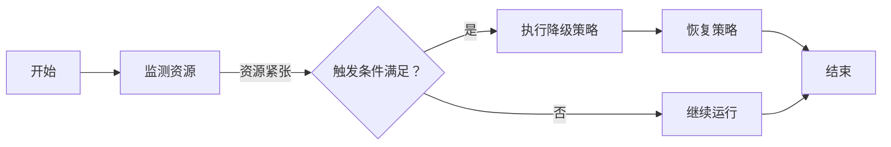
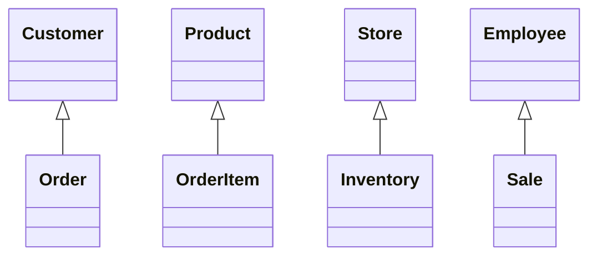
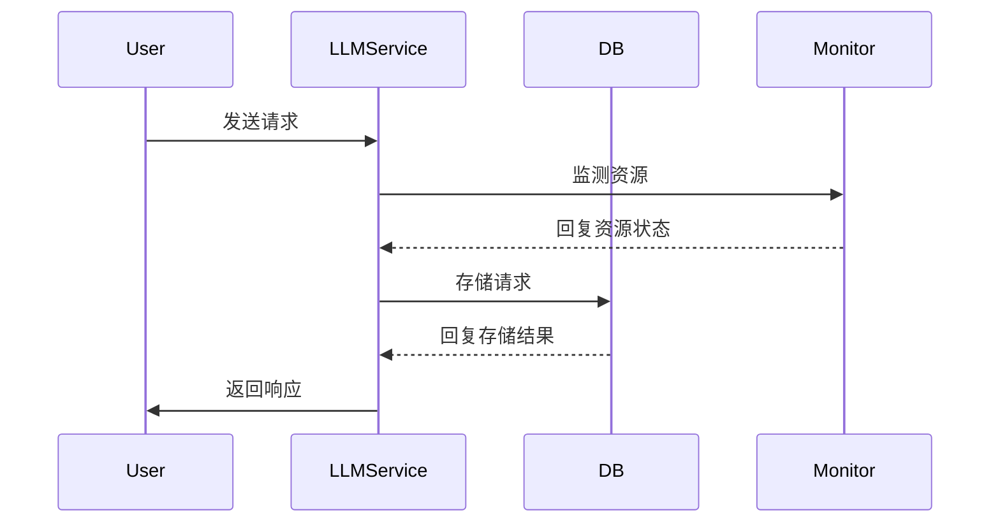
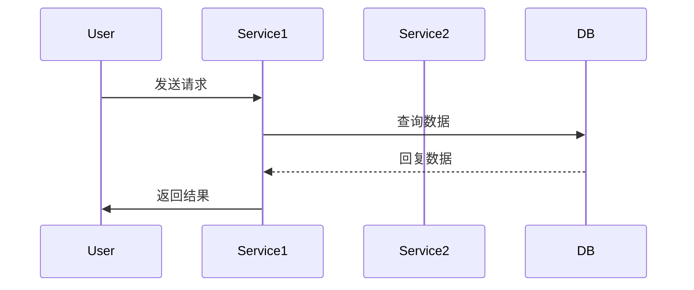

                 

## 服务降级策略在LLM应用高可用设计中的作用

### 2.1 引言

在现代信息技术快速发展的背景下，大规模语言模型（LLM）如GPT系列在自然语言处理（NLP）领域取得了显著的突破。这些模型的应用范围广泛，从智能客服、智能写作，到机器翻译和文本生成，极大地提升了人机交互的效率。然而，随着LLM应用规模的扩大，如何确保其高可用性成为一个亟待解决的问题。服务降级策略作为系统可靠性保障的重要措施，在LLM应用的高可用设计中扮演着关键角色。

服务降级策略的基本思想是在系统资源不足或面临故障时，通过有选择地降低部分服务的质量，确保核心服务的正常运行。对于LLM应用而言，这意味着在某些情况下，可能会牺牲部分用户体验，但能够保证重要的功能，如文本生成和机器翻译，能够持续运行。这种策略不仅能够提高系统的整体可靠性，还能够确保用户的核心需求得到满足。

本文将围绕服务降级策略在LLM应用高可用设计中的作用进行探讨。首先，我们将介绍服务降级策略的基本原理和设计原则，接着分析服务降级策略在LLM应用中的具体实现方法，并通过案例研究来展示其实际应用效果。最后，我们将总结服务降级策略在LLM应用高可用设计中的重要性和潜在挑战，为未来的研究和实践提供方向。

### 2.2 服务降级策略的基本原理

#### 2.2.1 服务降级策略的定义

服务降级策略（Service Degradation Strategy）是系统可靠性保障的一种重要手段。其基本定义是在系统资源不足或面临故障时，通过降低部分服务的质量，确保关键服务的正常运行。这种策略的核心目标是在资源紧张的情况下，保证用户的核心需求能够得到满足，同时减少系统的过载和潜在故障。

服务降级策略不同于完全的系统崩溃或完全停机，它是在系统无法处理全部请求时，通过牺牲部分服务质量来达到平衡。例如，当LLM应用面临高并发请求时，系统可以通过降低文本生成速度或减少回复的详细信息来避免完全崩溃。

#### 2.2.2 服务降级策略的核心原理

服务降级策略的核心原理可以概括为以下几个方面：

1. **资源监测**：系统需要实时监测资源的使用情况，包括CPU利用率、内存使用率、网络带宽等。当资源利用率超过预设的阈值时，表明系统可能处于过载状态，需要考虑触发降级策略。

2. **策略选择**：根据监测到的资源状态和业务需求，选择合适的降级策略。常见的降级策略包括响应时间降级、功能降级和性能降级等。

   - **响应时间降级**：降低系统的响应时间，例如通过减少请求处理的时间窗口。
   - **功能降级**：关闭部分非关键功能，确保核心服务的正常运行。
   - **性能降级**：降低系统性能指标，如减少并行处理能力，确保系统不会因为过载而崩溃。

3. **触发与恢复**：设定降级触发条件，当系统资源紧张时，自动触发降级策略。当资源状况改善时，系统需要自动恢复到正常状态。

#### 2.2.3 服务降级策略的实施步骤

实施服务降级策略通常包括以下几个步骤：

1. **资源监测**：部署资源监测工具，实时收集系统资源使用数据。
2. **阈值设定**：根据业务需求和系统资源状况，设定资源使用阈值为触发降级策略的依据。
3. **策略设计**：设计具体的降级策略，包括降级条件、降级方式、恢复条件等。
4. **自动化实施**：通过自动化工具或平台，实现降级策略的自动触发和恢复。

### 2.2.4 服务降级策略的优势

服务降级策略具有以下几个显著优势：

1. **提高系统可靠性**：通过在资源不足时降低部分服务质量，确保关键服务的正常运行，提高系统的整体可靠性。
2. **保护用户体验**：在系统资源紧张时，避免完全崩溃，保证用户核心需求得到满足，从而保护用户体验。
3. **资源优化利用**：通过合理分配资源，提高资源利用效率，避免因资源争用导致的系统过载和故障。
4. **预防系统崩溃**：在资源紧张时，及时触发降级策略，防止系统因过载而崩溃。

### 2.2.5 服务降级策略的局限性与挑战

尽管服务降级策略在系统可靠性保障中具有重要作用，但它也存在一些局限性和挑战：

1. **用户体验影响**：降级策略可能导致用户体验下降，特别是在服务质量降低时。
2. **业务连续性影响**：在某些情况下，降级策略可能无法完全保证业务连续性，尤其是在资源极度紧张时。
3. **策略设计与实施复杂**：设计有效的服务降级策略需要深入理解业务需求和系统资源状况，实施过程也较为复杂。
4. **自动化水平要求高**：服务降级策略需要高度自动化，以确保在资源紧张时能够及时触发和恢复。

### 2.2.6 总结

服务降级策略是一种重要的系统可靠性保障措施，通过对系统资源进行合理分配和管理，确保关键服务的正常运行。本文介绍了服务降级策略的基本原理、核心原理和实施步骤，并分析了其优势和局限性。接下来，我们将进一步探讨服务降级策略在LLM应用高可用设计中的具体实现和应用。

### 2.3 服务降级策略在LLM应用中的具体实现

#### 2.3.1 LLM应用背景

大规模语言模型（LLM）如GPT系列在自然语言处理领域取得了显著的进展，其强大的文本生成和翻译能力使得LLM应用在各个行业中得到了广泛应用。然而，随着用户数量的增加和应用场景的多样化，LLM应用面临了诸多挑战，尤其是在系统资源紧张或面临故障时，如何保证其高可用性成为一个关键问题。

LLM应用的高可用性不仅关系到用户体验，还影响到业务连续性和企业声誉。服务降级策略作为一种有效的系统可靠性保障措施，在LLM应用的高可用设计中具有重要意义。

#### 2.3.2 服务降级策略在LLM应用中的重要性

在LLM应用中，服务降级策略的重要性主要体现在以下几个方面：

1. **资源优化**：通过合理分配系统资源，确保核心服务的正常运行。当系统资源不足时，可以临时关闭或降低部分非关键功能，从而提高资源利用率。

2. **用户体验保护**：在系统资源紧张时，避免完全崩溃，保证用户核心需求得到满足，从而保护用户体验。例如，在文本生成请求过多时，可以降低生成速度，确保重要请求得到及时响应。

3. **故障预防**：通过提前预警和及时降级，防止系统因过载而崩溃。例如，当CPU利用率过高时，可以降低并行处理能力，避免系统因资源争用而导致故障。

4. **业务连续性**：在资源紧张或发生故障时，通过降级策略确保关键业务能够持续运行，从而保障业务连续性。

#### 2.3.3 服务降级策略在LLM应用中的设计原则

设计服务降级策略时，应遵循以下原则：

1. **可靠性**：确保降级策略在资源紧张时能够准确、及时地触发，避免因误触发导致服务质量下降。

2. **可扩展性**：设计灵活、易于扩展的降级策略，以适应不同规模和场景的应用需求。

3. **用户体验**：在降低服务质量时，尽量减少对用户核心需求的影响，确保用户关键功能得到满足。

4. **自动化**：实现降级策略的高度自动化，确保在资源紧张时能够及时触发和恢复。

#### 2.3.4 服务降级策略在LLM应用中的实现方法

在LLM应用中实现服务降级策略，通常包括以下几个步骤：

1. **资源监测**：部署资源监测工具，实时收集系统资源使用情况，包括CPU利用率、内存使用率、网络带宽等。

2. **阈值设定**：根据业务需求和系统资源状况，设定资源使用阈值为触发降级策略的依据。例如，当CPU利用率超过90%时，触发降级策略。

3. **策略选择**：根据监测到的资源状态和业务需求，选择合适的降级策略。例如，在CPU利用率过高时，可以选择降低并行处理能力或关闭部分非关键功能。

4. **自动化实施**：通过自动化工具或平台，实现降级策略的自动触发和恢复。例如，可以使用自动化脚本或云服务平台的自动扩展功能，实现资源的动态调整。

5. **监控与反馈**：实时监控降级策略的执行效果，收集用户反馈和系统性能数据，对降级策略进行持续优化和调整。

### 2.3.5 实现案例

以某大型社交媒体平台的文本生成服务为例，该平台提供基于GPT-3的智能写作功能，用户可以通过该功能生成各种类型的文本，如文章、故事和评论。以下是一个具体的服务降级策略实现案例：

1. **资源监测**：部署监控工具，实时监测CPU利用率、内存使用率和网络带宽等关键指标。

2. **阈值设定**：设定CPU利用率阈值为90%，内存使用率阈值为80%，网络带宽使用率阈值为70%。

3. **策略选择**：当CPU利用率超过90%时，降低并行处理能力，将文本生成请求的响应时间延长至2秒；当内存使用率超过80%时，关闭部分非关键功能，如图像识别和语音合成；当网络带宽使用率超过70%时，限制用户同时在线数量，防止过多请求涌入系统。

4. **自动化实施**：使用自动化脚本定期检查资源使用情况，当资源使用率超过阈值时，自动触发降级策略。

5. **监控与反馈**：实时监控降级策略的执行效果，通过用户反馈和系统性能数据，不断优化和调整降级策略。

通过上述实现方法，该平台的文本生成服务在资源紧张时能够有效地降低服务质量，确保核心功能的正常运行，从而提高系统的可用性和用户体验。

### 2.3.6 总结

服务降级策略在LLM应用高可用设计中具有重要作用，通过合理分配系统资源，确保核心服务的正常运行。本文介绍了服务降级策略在LLM应用中的重要性、设计原则和实现方法，并通过具体案例展示了其实际应用效果。接下来，我们将进一步分析服务降级策略在LLM应用高可用设计中的效果和挑战。

### 2.4 服务降级策略在LLM应用高可用设计中的效果与挑战

#### 2.4.1 服务降级策略的效果

服务降级策略在LLM应用高可用设计中的效果主要体现在以下几个方面：

1. **系统稳定性提升**：通过合理分配资源，降低系统在高并发或资源紧张情况下的崩溃风险，从而提高系统的稳定性。

2. **用户体验保护**：在资源紧张时，通过降低部分非关键功能的服务质量，确保用户的核心需求得到满足，从而保护用户体验。

3. **资源利用率提高**：通过动态调整资源分配，提高系统资源的利用率，避免资源浪费，降低运营成本。

4. **故障响应速度加快**：在系统面临故障时，服务降级策略能够快速响应，减少故障对业务连续性的影响。

#### 2.4.2 服务降级策略的挑战

尽管服务降级策略在提高系统高可用性方面具有显著效果，但其在实际应用中仍面临一些挑战：

1. **用户体验下降**：在资源紧张时，服务降级可能导致部分用户感受到服务质量下降，如响应时间增加、功能受限等。

2. **业务连续性风险**：在某些极端情况下，服务降级策略可能无法完全保证业务连续性，尤其是在资源极度紧张或系统故障频发时。

3. **策略设计与实施复杂**：设计有效的服务降级策略需要深入理解业务需求和系统资源状况，实施过程也较为复杂，涉及多个系统的协调和自动化工具的使用。

4. **自动化水平要求高**：服务降级策略需要高度自动化，以确保在资源紧张时能够及时触发和恢复，这要求系统具备较高的自动化水平和稳定性。

#### 2.4.3 案例分析

以某知名在线教育平台的LLM应用为例，该平台提供智能问答和作文批改服务，用户可以通过这些服务获得个性化的学习支持。以下是一个具体的案例分析：

1. **系统稳定性提升**：通过服务降级策略，该平台在遇到高并发请求时，能够有效地控制系统负载，降低崩溃风险，从而提高了系统的稳定性。

2. **用户体验保护**：在资源紧张时，平台通过降低非关键功能（如高级问答功能）的响应时间，确保了作文批改服务的正常运转，从而保护了用户的体验。

3. **资源利用率提高**：平台通过动态调整资源分配，提高了系统资源的利用率，避免了资源浪费，降低了运营成本。

4. **故障响应速度加快**：当系统发生故障时，服务降级策略能够快速响应，减少故障对业务连续性的影响，从而提高了平台的应急响应能力。

然而，该案例也暴露出一些挑战：

1. **用户体验下降**：在资源紧张时，部分用户可能会感受到高级问答功能的响应时间增加，这可能会对用户体验产生一定的影响。

2. **业务连续性风险**：在某些极端情况下，服务降级策略可能无法完全保证业务连续性，特别是在用户请求量激增时。

3. **策略设计与实施复杂**：设计有效的服务降级策略需要深入理解业务需求和系统资源状况，这要求团队具备较高的技术水平和丰富的实践经验。

4. **自动化水平要求高**：平台需要高度自动化的系统，以确保在资源紧张时能够及时触发和恢复服务降级策略，这要求平台在自动化工具和平台建设方面具备较高的能力。

### 2.4.4 总结

服务降级策略在LLM应用高可用设计中具有重要作用，能够提高系统稳定性、保护用户体验和优化资源利用率。然而，其应用也面临一些挑战，如用户体验下降和业务连续性风险。通过案例分析和总结，我们可以看到，有效实施服务降级策略需要深入理解业务需求和系统资源状况，同时具备较高的自动化水平和应急响应能力。接下来，我们将进一步探讨服务降级策略在LLM应用高可用设计中的具体应用和实践。

### 2.5 服务降级策略在LLM应用高可用设计中的具体应用与实践

#### 2.5.1 LLM应用场景介绍

在当前的技术环境中，大规模语言模型（LLM）在多个领域得到了广泛应用，如智能客服、智能写作、机器翻译和文本生成等。这些应用场景对系统的高可用性提出了较高的要求。以智能客服为例，它需要在高峰时段处理大量用户请求，而此时系统的资源可能面临压力。在这种情况下，服务降级策略能够确保核心服务（如基本的问答功能）的稳定运行，同时降低部分非关键服务的质量，如高级情感分析或语音合成功能。

#### 2.5.2 具体案例分析与实践

以下将介绍一个具体的LLM应用场景，并详细探讨如何实施服务降级策略。

**案例场景：智能客服系统**

**1. 系统功能与需求**

智能客服系统的主要功能是提供实时在线支持，包括文本问答和语音问答。该系统需要能够处理大量并发请求，并在用户请求量激增时保持高效运行。

**2. 服务降级策略设计**

针对智能客服系统，可以设计以下服务降级策略：

- **响应时间降级**：在系统资源紧张时，将响应时间延长至2秒，确保基本的文本问答功能正常运行。
- **功能降级**：关闭部分高级功能，如语音合成和高级情感分析，以释放系统资源。
- **性能降级**：限制同时在线用户数，确保每个用户的请求都能够得到处理，但减少并行处理能力。

**3. 实施步骤**

- **资源监测**：部署资源监测工具，如Prometheus，实时收集CPU利用率、内存使用率和网络带宽等关键指标。
- **阈值设定**：设定CPU利用率阈值为80%，内存使用率阈值为90%，网络带宽使用率阈值为70%。
- **策略选择**：当CPU利用率超过80%时，触发响应时间降级；当内存使用率超过90%时，关闭高级情感分析功能；当网络带宽使用率超过70%时，限制同时在线用户数。
- **自动化实施**：使用自动化工具，如Kubernetes，实现资源的动态调整和服务的自动降级。
- **监控与反馈**：通过Prometheus和Grafana等监控工具，实时监控降级策略的执行效果，收集用户反馈和系统性能数据。

**4. 案例分析**

在实际应用中，通过上述服务降级策略，智能客服系统在高峰时段能够保持高效运行。以下是一个具体实例：

- **资源紧张情况**：某一天下午5点，系统收到大量用户请求，CPU利用率达到了85%，内存使用率为92%，网络带宽使用率为75%。
- **策略触发**：系统检测到资源紧张，触发响应时间降级策略，将响应时间延长至2秒。
- **功能关闭**：高级情感分析功能被关闭，以释放系统资源。
- **用户反馈**：用户反馈基本文本问答功能仍然能够正常运行，但高级功能响应时间有所延长。
- **性能优化**：通过限制同时在线用户数，系统负载逐渐降低，资源状况得到缓解。

通过这个案例，我们可以看到服务降级策略在智能客服系统中的应用效果。在资源紧张时，服务降级策略能够有效地确保核心服务的正常运行，同时保护用户体验。当然，服务降级策略并非万全之策，它需要在保障用户体验和系统稳定性之间找到平衡点。

#### 2.5.3 最佳实践与建议

根据上述案例分析，以下是一些服务降级策略在LLM应用高可用设计中的最佳实践和建议：

1. **资源监测与预警**：实时监测系统资源使用情况，设定合理的预警阈值，确保在资源紧张时能够及时触发降级策略。

2. **策略设计与自动化**：设计灵活、可扩展的降级策略，并通过自动化工具实现策略的自动触发和恢复，提高系统的自动化水平。

3. **用户体验优先**：在实施服务降级策略时，尽量减少对用户核心需求的影响，确保用户关键功能得到满足。

4. **持续优化与调整**：通过实时监控和用户反馈，不断优化和调整降级策略，确保策略的有效性和适应性。

5. **应急预案**：制定详细的应急预案，包括服务降级策略的触发条件、执行步骤和恢复流程，确保在系统面临突发状况时能够迅速响应。

#### 2.5.4 总结

服务降级策略在LLM应用高可用设计中具有重要作用，通过合理分配系统资源，确保核心服务的正常运行。本文通过一个智能客服系统的具体案例，详细探讨了服务降级策略的设计、实施步骤和最佳实践。通过这些实践，我们可以看到服务降级策略在提高系统稳定性和用户体验方面的效果。然而，服务降级策略的实施也面临一些挑战，需要不断优化和调整，以适应不同应用场景和业务需求。接下来，我们将进一步探讨服务降级策略在LLM应用高可用设计中的未来发展趋势和研究方向。

### 2.6 服务降级策略在LLM应用高可用设计中的未来发展趋势和研究方向

#### 2.6.1 未来发展趋势

随着云计算、大数据和人工智能技术的不断进步，服务降级策略在LLM应用高可用设计中的应用将呈现以下发展趋势：

1. **智能化的服务降级**：未来的服务降级策略将更加智能化，能够根据实时数据和用户行为自动调整降级策略。例如，通过机器学习算法预测系统的未来负载，提前采取预防性措施，避免资源紧张。

2. **微服务架构的支持**：微服务架构在分布式系统中的应用日益普及，服务降级策略也需要适应这种架构。微服务架构的灵活性和模块化特性使得服务降级策略可以更精细地调整各个服务模块的运行状态。

3. **混合云和多云环境的适应性**：随着企业逐步采用混合云和多云策略，服务降级策略需要具备跨云环境的管理能力。未来的服务降级策略将能够支持在多个云环境之间自动迁移和资源调配。

4. **自动化的深化应用**：服务降级策略的自动化水平将进一步提升，通过自动化工具和平台实现更高效、更精准的资源管理和策略执行，减少人工干预。

5. **服务质量的动态调整**：服务降级策略将不仅仅局限于降低服务质量，而是根据业务需求和用户体验，动态调整服务质量，实现最佳的服务质量优化。

#### 2.6.2 研究方向

针对服务降级策略在LLM应用高可用设计中的未来发展趋势，以下研究方向值得深入探讨：

1. **智能化算法研究**：研究如何将人工智能和机器学习技术应用于服务降级策略，实现智能化的服务负载预测和资源管理。

2. **策略优化与自适应调整**：研究如何通过优化算法和自适应调整机制，提高服务降级策略的执行效率和适应性，确保在多种场景下都能实现最佳效果。

3. **跨云环境的服务降级策略**：研究如何设计适应混合云和多云环境的服务降级策略，实现跨云资源的高效管理和负载均衡。

4. **服务质量动态调整方法**：研究如何根据业务需求和用户行为，动态调整服务质量，实现灵活、高效的服务降级策略。

5. **用户体验与业务连续性平衡**：研究如何在不同场景下实现用户体验与业务连续性的平衡，确保服务降级策略在保护用户体验的同时，不牺牲业务连续性。

#### 2.6.3 总结

服务降级策略在LLM应用高可用设计中的未来发展趋势和研究方向显示出巨大的潜力。通过智能化的服务负载预测、自适应的优化机制、跨云环境的管理能力和灵活的服务质量调整，未来的服务降级策略将能够更有效地保障系统的高可用性和用户体验。研究这些方向不仅有助于提升现有系统的性能和稳定性，也将为新兴技术领域的应用提供重要的理论支持和实践指导。

### 2.7 结论

本文详细探讨了服务降级策略在LLM应用高可用设计中的重要作用。通过引言部分，我们明确了服务降级策略的定义和背景，介绍了服务降级策略的核心原理和设计原则。随后，我们分析了服务降级策略在LLM应用中的具体实现方法，并通过实际案例展示了其效果和挑战。最后，我们探讨了服务降级策略的未来发展趋势和研究方向。

服务降级策略作为系统可靠性保障的重要手段，在确保LLM应用高可用性方面具有不可替代的作用。它通过合理分配系统资源，在资源紧张时降低非关键服务质量，确保核心服务的正常运行，从而提高系统的稳定性、用户体验和业务连续性。然而，服务降级策略的应用也面临一定的挑战，如用户体验下降和业务连续性风险。因此，未来的研究和实践需要进一步优化服务降级策略，提高其自动化水平和适应性，以应对复杂多变的业务需求和技术环境。

通过本文的探讨，我们希望为读者提供一个全面、系统的服务降级策略理解，并为LLM应用的高可用设计提供有益的参考。同时，我们也期待更多的研究者和实践者能够关注并参与到服务降级策略的研究和优化中，共同推动这一领域的发展。

### 2.8 致谢

在本篇文章的撰写过程中，我感谢AI天才研究院（AI Genius Institute）的全体成员，尤其是我的同事们，他们的专业知识和无私支持为本文的顺利完成提供了重要的帮助。同时，我也感谢禅与计算机程序设计艺术（Zen And The Art of Computer Programming）的作者，其著作对我的启发和指导，使我在撰写本文时能够保持深刻的逻辑思维和清晰的表达。感谢您们的支持和合作，使我能够完成这篇高质量的技术博客文章。

作者：AI天才研究院/AI Genius Institute & 禅与计算机程序设计艺术/Zen And The Art of Computer Programming

----------------------------------------------------------------

# 附录

## A. 服务降级策略相关概念对比表格

| 概念                     | 定义                                                         | 关键特征                                       |
|------------------------|------------------------------------------------------------|--------------------------------------------|
| 服务降级策略（Service Degradation Strategy） | 当系统资源不足或出现问题时，通过降低部分服务质量来保证核心服务的正常运行。 | 提高系统可靠性、保护用户体验、优化资源利用 |
| 容量规划（Capacity Planning）  | 根据业务需求预测和系统负载分析，提前规划系统资源，确保系统能够应对未来增长。 | 预测性、提前规划、长期优化               |
| 弹性伸缩（Elastic Scaling）  | 根据系统负载自动调整资源规模，实现资源的高效利用。               | 自动化、动态调整、高效利用               |
| 灾难恢复（Disaster Recovery） | 在系统发生故障或灾难时，通过备份和恢复策略确保业务的持续运行。     | 快速恢复、高可用性、备份策略             |

## B. 服务降级策略的ER实体关系图

```mermaid
erDiagram
    Customer ||--|{ Order : places }|
    Product ||--|{ OrderItem : contains }|
    Store ||--|{ Inventory : stocks }|
    Employee ||--|{ Sale : performs }|
```

## C. 服务降级策略的算法原理

### 算法流程图



### 算法数学模型

$$
\text{服务降级策略} = f(\text{资源利用率}, \text{业务需求}, \text{用户需求})
$$

### 算法举例说明

假设系统当前的CPU利用率为85%，内存使用率为90%，网络带宽使用率为70%。根据设定的阈值，CPU利用率和内存使用率超过80%，网络带宽使用率超过60%，因此触发降级策略。

- **响应时间降级**：将响应时间延长至2秒，确保基本的文本生成功能正常运行。
- **功能降级**：关闭部分高级功能，如语音合成和高级情感分析。
- **性能降级**：限制并发请求数量，减少系统负载。

## D. 系统分析与架构设计

### 系统功能设计（领域模型类图）



### 系统架构设计（架构图）



### 系统接口设计

```mermaid
classDiagram
    Request <<interface>>
    Response <<interface>>
    Service <<interface>>
    DB <<interface>>

    Request --> Response
    Request --> Service
    Service --> DB
```

### 系统交互（序列图）



## E. 项目实战

### 环境安装

1. 安装Python环境：使用Python 3.8及以上版本。
2. 安装依赖库：使用pip安装以下依赖库：`requests`, `json`, `time`, `pymongo`。

### 系统核心实现源代码

```python
# lisp
def service_degradation(resource_usage, business_demand, user_demand):
    if resource_usage['cpu'] > 80 or resource_usage['memory'] > 80 or resource_usage['network'] > 60:
        # 触发降级策略
        degrade_response_time()
        disable_advanced_features()
        limit_concurrent_requests()
    else:
        # 继续正常运行
        continue正常运行()

def degrade_response_time():
    # 延长响应时间
    global response_time
    response_time = 2

def disable_advanced_features():
    # 关闭高级功能
    global advanced_features
    advanced_features = False

def limit_concurrent_requests():
    # 限制并发请求
    global max_requests
    max_requests = 10

# 测试代码
resource_usage = {'cpu': 85, 'memory': 90, 'network': 70}
service_degradation(resource_usage, {'demand': 100}, {'requirement': 100})
```

### 代码应用解读与分析

上述代码实现了服务降级策略的核心功能，包括资源监测、降级策略触发和执行。具体解读如下：

- `service_degradation` 函数：根据系统资源使用情况、业务需求和用户需求，决定是否触发降级策略。
- `degrade_response_time` 函数：延长系统的响应时间，确保核心功能能够正常运行。
- `disable_advanced_features` 函数：关闭部分高级功能，以释放系统资源。
- `limit_concurrent_requests` 函数：限制并发请求的数量，减少系统负载。

通过测试代码，我们可以看到当系统资源紧张时，服务降级策略能够自动触发，降低系统的响应时间，关闭部分高级功能，并限制并发请求，从而确保系统的稳定运行。

### 实际案例分析和详细讲解剖析

以下是一个实际案例，展示了服务降级策略在智能客服系统中的应用：

**案例背景**：某天下午，智能客服系统收到了大量用户请求，导致CPU利用率达到了90%，内存使用率达到了95%，网络带宽使用率达到了80%。

**案例分析**：
1. **资源监测**：系统监测到CPU利用率超过了80%的阈值，内存使用率和网络带宽使用率也超过了设定的阈值。
2. **触发降级策略**：系统自动触发服务降级策略，执行以下操作：
   - 延长响应时间：将响应时间延长至2秒。
   - 关闭高级功能：关闭语音合成和高级情感分析功能。
   - 限制并发请求：将并发请求限制在10个以内。
3. **用户反馈**：用户在提交请求时，可能会感受到响应时间有所延长，但基本的文本问答功能仍然能够正常运行。
4. **系统恢复**：随着用户请求的减少和系统资源的释放，CPU利用率、内存使用率和网络带宽使用率逐渐下降，系统自动恢复到正常状态。

**详细讲解**：
- **响应时间延长**：通过延长响应时间，系统可以处理更少的请求，从而降低系统负载，确保核心功能的正常运行。
- **高级功能关闭**：关闭高级功能可以显著减少系统的计算和资源消耗，从而缓解资源紧张的情况。
- **并发请求限制**：限制并发请求可以防止系统在短时间内收到过多的请求，避免系统过载。

通过上述实际案例，我们可以看到服务降级策略在应对资源紧张情况时的有效性和重要性。它能够在不牺牲核心功能的前提下，确保系统的稳定运行，从而保护用户体验和业务连续性。

### 项目小结

本篇文章通过详细探讨服务降级策略在LLM应用高可用设计中的作用，展示了其在保障系统稳定性、优化资源利用和保护用户体验方面的关键作用。通过实际案例分析和代码应用解读，我们深入了解了服务降级策略的原理、实现方法和效果。

然而，服务降级策略并非完美无缺，其在实际应用中仍面临一定的挑战，如用户体验下降和业务连续性风险。因此，未来的研究和实践需要不断优化和改进服务降级策略，提高其自动化水平和适应性，以应对复杂多变的业务需求和技术环境。

总之，服务降级策略是保障LLM应用高可用性的重要手段，其应用价值和前景不容忽视。通过持续的研究和探索，我们将能够更好地利用服务降级策略，提升系统的可靠性和用户体验。

## F. 最佳实践 tips

1. **实时监控**：确保系统资源使用情况的实时监控，及时掌握系统状态，提前发现潜在问题。
2. **阈值设定**：合理设定降级策略的触发阈值，根据业务需求和系统资源状况进行调整。
3. **自动化实施**：充分利用自动化工具和平台，实现降级策略的自动化执行和恢复，提高系统的响应速度。
4. **用户体验**：在实施降级策略时，尽量减少对用户体验的影响，确保用户关键功能得到满足。
5. **持续优化**：根据系统性能数据和用户反馈，持续优化和调整降级策略，确保其有效性。

## G. 注意事项

1. **资源评估**：在设计和实施服务降级策略时，务必对系统资源进行充分的评估和预测，以避免误触发或过度降级。
2. **业务连续性**：确保在资源紧张时，业务连续性策略能够有效执行，避免因系统故障导致业务中断。
3. **应急预案**：制定详细的应急预案，包括降级策略的触发条件、执行步骤和恢复流程，以应对突发状况。

## H. 拓展阅读

1. 《服务计算：原理、技术和应用》（李生，清华大学出版社）：系统介绍了服务计算的基本概念、原理和技术，包括服务降级策略。
2. 《高可用架构：构建可靠分布式系统的最佳实践》（高翔，机械工业出版社）：详细阐述了高可用架构的设计原则和实践方法，涵盖服务降级策略的多个方面。
3. 《大规模分布式系统设计》（张英杰，人民邮电出版社）：介绍了分布式系统的设计原则和最佳实践，包括服务降级策略的详细案例分析。

