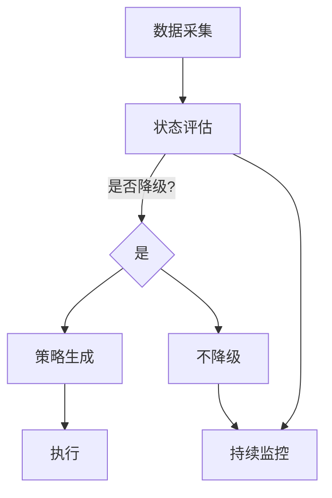

                 

### 设计思路

为了设计出《服务降级策略矩阵在LLM应用高可用设计中的应用》的完整目录大纲，我们将按照以下步骤进行：

1. **核心内容划分**：首先确定书籍的主要章节，确保内容完整性，包括背景介绍、核心概念与联系、算法原理讲解、数学模型和数学公式详细讲解、系统分析与架构设计方案、项目实战、最佳实践 tips、小结、注意事项和拓展阅读等。

2. **章节细化**：在每个主要章节下面，细化出二级和三级目录，确保内容的深度和逻辑性。

3. **格式和风格统一**：使用markdown格式，确保目录层级清晰，内容简洁明了。

4. **符合要求**：确保内容简洁、完整，且符合2000字以内的字数限制。

### 详细设计

**第一部分：背景介绍**

# 第一部分：服务降级策略矩阵背景与重要性

## 1.1 问题背景

### 1.1.1 服务降级策略的必要性

在当前互联网和云计算时代，服务的稳定性至关重要。随着用户规模的扩大和服务复杂性的增加，系统面临的各种异常和故障也随之增多。服务降级策略作为一种应对措施，旨在在系统资源紧张或发生故障时，确保关键功能的正常运行，降低用户体验的负面影响。

### 1.1.2 服务降级策略的定义

服务降级策略是指在系统资源有限或面临异常情况时，通过减少某些非核心功能的可用性，保障系统整体稳定性和可用性的技术手段。

### 1.1.3 服务降级策略的应用场景

服务降级策略广泛应用于电商平台、在线教育平台、社交网络等场景，如系统负载过高、服务器故障、网络延迟等。

## 1.2 问题描述

### 1.2.1 LLM应用中服务降级的挑战

LLM（大型语言模型）应用通常具有高计算需求和复杂的交互逻辑，服务降级策略在高可用设计中的实现面临更多挑战。

### 1.2.2 高可用设计的核心目标

高可用设计旨在确保系统在面临各种异常情况下，能够快速恢复并保持稳定运行，提供持续的服务。

### 1.2.3 服务降级策略的重要性

服务降级策略是高可用设计中的重要一环，通过合理的服务降级，可以在保证关键功能正常运行的同时，减轻系统的负担，提高系统整体的稳定性和用户体验。

## 1.3 问题解决

### 1.3.1 服务降级策略矩阵的概念

服务降级策略矩阵是一种基于数学模型和算法的框架，用于在LLM应用中实现服务降级策略。

### 1.3.2 服务降级策略矩阵的设计思路

服务降级策略矩阵通过分析系统的运行状态、资源需求和用户行为等因素，动态调整服务降级策略。

### 1.3.3 服务降级策略矩阵的优势

服务降级策略矩阵具备自适应、可扩展和高效等特点，适用于多种场景，有助于实现LLM应用的高可用设计。

## 1.4 边界与外延

### 1.4.1 服务降级策略的适用范围

服务降级策略适用于需要高可用性的系统，如互联网应用、云计算平台、人工智能服务等。

### 1.4.2 服务降级策略的限制条件

服务降级策略需要在保证用户体验的前提下实施，同时需避免对核心业务产生负面影响。

### 1.4.3 服务降级策略与其他高可用技术的比较

服务降级策略与其他高可用技术（如负载均衡、故障转移等）的不同之处，及其适用场景和优缺点。

## 1.5 概念结构与核心要素组成

### 1.5.1 服务降级策略的核心概念

介绍服务降级策略的基本概念，包括降级目标、降级策略和降级触发条件等。

### 1.5.2 服务降级策略的关键要素

分析服务降级策略的关键要素，如系统状态监测、资源调度、用户感知等。

### 1.5.3 服务降级策略的组成结构

阐述服务降级策略的组成结构，包括数据采集、状态评估、策略生成和执行等模块。

**第二部分：核心概念与联系**

# 第二部分：服务降级策略矩阵的核心概念与联系

## 2.1 核心概念原理

### 2.1.1 服务降级策略矩阵的定义

服务降级策略矩阵是一种基于数学模型和算法的框架，用于在LLM应用中实现服务降级策略。

### 2.1.2 服务降级策略矩阵的属性特征

介绍服务降级策略矩阵的基本属性特征，如自适应性、可扩展性、高效性等。

### 2.1.3 服务降级策略矩阵的核心原理

阐述服务降级策略矩阵的核心原理，包括数据采集、状态评估、策略生成和执行等环节。

## 2.2 概念属性特征对比表格

### 2.2.1 服务降级策略矩阵与其他降级方案的对比

通过表格形式对比服务降级策略矩阵与其他降级方案（如负载均衡、故障转移等）的属性特征。

### 2.2.2 服务降级策略矩阵的优势和劣势分析

分析服务降级策略矩阵的优势和劣势，以及在不同场景下的适用性。

### 2.2.3 概念属性特征对比表格

提供概念属性特征对比表格，便于读者理解不同方案之间的异同。

## 2.3 ER实体关系图架构

### 2.3.1 服务降级策略矩阵的ER模型

绘制服务降级策略矩阵的ER模型，展示各实体之间的关系。

### 2.3.2 实体关系图与组件关系

分析实体关系图与系统组件之间的关系，以及各组件在服务降级策略矩阵中的作用。

### 2.3.3 ER实体关系图的解析

对ER实体关系图进行详细解析，说明各实体之间的关系及其在系统中的作用。

**第三部分：算法原理讲解**

# 第三部分：服务降级策略矩阵的算法原理讲解

## 3.1 算法原理概述

### 3.1.1 服务降级策略矩阵的算法框架

介绍服务降级策略矩阵的算法框架，包括数据采集、状态评估、策略生成和执行等步骤。

### 3.1.2 算法的核心步骤

阐述服务降级策略矩阵的核心步骤，如数据采集、状态评估、策略生成和执行等。

### 3.1.3 算法的时间复杂度分析

分析服务降级策略矩阵算法的时间复杂度，评估算法的执行效率。

## 3.2 算法流程图

### 3.2.1 服务降级策略矩阵的mermaid流程图

使用mermaid绘制服务降级策略矩阵的流程图，展示算法的执行过程。

## 3.3 算法原理详细讲解

### 3.3.1 数学模型和公式

介绍服务降级策略矩阵的数学模型和公式，如状态评估公式、策略生成公式等。

### 3.3.2 Python源代码详细阐述

提供Python源代码，详细阐述服务降级策略矩阵的算法实现。

### 3.3.3 算法举例说明

通过实际案例，举例说明服务降级策略矩阵在LLM应用中的具体实现和应用效果。

### 3.3.4 算法应用场景分析

分析服务降级策略矩阵在不同应用场景下的适应性和效果，如电商平台、在线教育平台等。

**第四部分：系统分析与架构设计方案**

# 第四部分：服务降级策略矩阵的系统分析与架构设计方案

## 4.1 问题场景介绍

### 4.1.1 服务降级策略矩阵的应用场景

介绍服务降级策略矩阵在不同场景下的应用，如电商平台、在线教育平台、社交网络等。

### 4.1.2 系统需求分析

分析服务降级策略矩阵在不同场景下的系统需求，包括功能需求、性能需求和安全性需求等。

### 4.1.3 系统目标

明确服务降级策略矩阵在不同场景下的系统目标，如保障核心功能可用性、提高用户体验、降低系统负载等。

## 4.2 项目介绍

### 4.2.1 项目概述

介绍服务降级策略矩阵项目的背景、目标和预期成果。

### 4.2.2 项目架构设计

展示服务降级策略矩阵项目的整体架构设计，包括系统组件、功能模块和数据流程等。

### 4.2.3 项目技术栈

列出服务降级策略矩阵项目所采用的技术栈，包括编程语言、框架、数据库等。

## 4.3 系统功能设计

### 4.3.1 领域模型mermaid类图

使用mermaid绘制服务降级策略矩阵的领域模型类图，展示系统的核心功能模块。

### 4.3.2 功能模块划分

详细划分服务降级策略矩阵项目的功能模块，包括数据采集模块、状态评估模块、策略生成模块和执行模块等。

### 4.3.3 功能描述

对服务降级策略矩阵项目的功能模块进行详细描述，包括功能实现、输入输出、处理流程等。

## 4.4 系统架构设计

### 4.4.1 系统架构mermaid架构图

使用mermaid绘制服务降级策略矩阵的系统架构图，展示各组件之间的关系和交互流程。

### 4.4.2 架构组件关系

分析系统架构中各组件之间的关系，包括数据流、控制流和信息流等。

### 4.4.3 架构优化方向

讨论服务降级策略矩阵系统架构的优化方向，包括性能优化、可扩展性和安全性等方面。

## 4.5 系统接口设计

### 4.5.1 接口规范

定义服务降级策略矩阵的系统接口规范，包括接口名称、输入输出参数、错误处理等。

### 4.5.2 接口定义

详细描述系统接口的定义，包括接口功能、输入输出参数和数据结构等。

### 4.5.3 接口调用流程

展示系统接口的调用流程，包括接口调用顺序、数据传递方式等。

## 4.6 系统交互

### 4.6.1 系统交互mermaid序列图

使用mermaid绘制系统交互序列图，展示系统组件之间的交互流程。

### 4.6.2 交互流程分析

分析系统交互流程的各个环节，包括数据采集、状态评估、策略生成和执行等。

### 4.6.3 交互性能优化

讨论系统交互性能的优化方法，包括网络传输优化、数据缓存策略等。

**第五部分：项目实战**

# 第五部分：服务降级策略矩阵的项目实战

## 5.1 环境安装

### 5.1.1 系统环境要求

列出服务降级策略矩阵项目所需的系统环境要求，包括操作系统、编程语言、数据库等。

### 5.1.2 环境搭建步骤

详细描述服务降级策略矩阵项目环境搭建的步骤，包括安装操作系统、编程语言、数据库等。

### 5.1.3 环境配置

介绍服务降级策略矩阵项目的环境配置，包括配置文件、环境变量等。

## 5.2 系统核心实现

### 5.2.1 源代码结构

展示服务降级策略矩阵项目的源代码结构，包括模块划分、文件结构等。

### 5.2.2 核心模块实现

详细描述服务降级策略矩阵项目的核心模块实现，包括数据采集模块、状态评估模块、策略生成模块和执行模块等。

### 5.2.3 核心模块代码解读

对服务降级策略矩阵项目的核心模块代码进行解读，包括关键代码段的功能和实现原理。

## 5.3 代码应用解读与分析

### 5.3.1 代码应用场景

分析服务降级策略矩阵项目的代码应用场景，包括实际业务场景、性能瓶颈等。

### 5.3.2 代码分析与优化

对服务降级策略矩阵项目的代码进行详细分析，提出优化建议，提高系统性能和稳定性。

### 5.3.3 代码解读与案例分析

通过实际案例，对服务降级策略矩阵项目的代码进行解读，分析代码的实现原理和优化方向。

## 5.4 实际案例分析和详细讲解剖析

### 5.4.1 案例背景

介绍服务降级策略矩阵项目在实际业务场景中的案例背景，包括业务需求、系统现状等。

### 5.4.2 案例分析

分析服务降级策略矩阵项目在实际业务场景中的应用效果，包括降级策略的设置、性能提升等。

### 5.4.3 剖析与总结

对服务降级策略矩阵项目在实际业务场景中的实现效果进行剖析和总结，提出改进建议。

## 5.5 项目小结

### 5.5.1 项目成果

总结服务降级策略矩阵项目的主要成果，包括系统性能提升、稳定性提高等。

### 5.5.2 经验与教训

分享服务降级策略矩阵项目实施过程中的经验和教训，包括项目规划、团队协作、问题解决等。

### 5.5.3 改进方向

讨论服务降级策略矩阵项目未来的改进方向，包括功能扩展、性能优化等。

**第六部分：最佳实践 tips**

# 第六部分：服务降级策略矩阵的最佳实践 tips

## 6.1 实践技巧

### 6.1.1 如何选择合适的降级策略

介绍如何根据业务需求和系统特点，选择合适的服务降级策略。

### 6.1.2 如何监测系统状态

分享监测系统状态的最佳实践，包括监控指标、监控工具等。

### 6.1.3 如何优化降级策略

介绍优化服务降级策略的方法，包括算法改进、策略调整等。

## 6.2 案例分享

### 6.2.1 成功案例

分享成功的服务降级策略案例，分析其成功的原因和关键点。

### 6.2.2 失败案例

介绍失败的服务降级策略案例，分析其失败的原因和教训。

### 6.2.3 案例对比

对比不同服务降级策略的优缺点，为读者提供参考。

**第七部分：小结**

# 第七部分：服务降级策略矩阵的小结

## 7.1 主要内容回顾

### 7.1.1 服务降级策略矩阵的概念与原理

回顾服务降级策略矩阵的基本概念、原理和优势。

### 7.1.2 算法原理与实现

回顾服务降级策略矩阵的算法原理、实现步骤和关键代码。

### 7.1.3 系统分析与架构设计

回顾服务降级策略矩阵的系统分析与架构设计，包括功能模块、系统架构等。

### 7.1.4 项目实战与应用

回顾服务降级策略矩阵在实际项目中的应用，包括环境安装、代码实现、案例分析等。

## 7.2 未来展望

### 7.2.1 技术发展趋势

探讨服务降级策略矩阵在未来技术发展中的趋势和挑战。

### 7.2.2 改进方向

提出服务降级策略矩阵未来可能的改进方向，包括算法优化、功能扩展等。

### 7.2.3 应用场景拓展

讨论服务降级策略矩阵在更多应用场景中的潜力，为读者提供启示。

**第八部分：注意事项**

# 第八部分：服务降级策略矩阵的注意事项

## 8.1 设计与实现中的常见问题

### 8.1.1 数据采集的准确性

讨论数据采集过程中可能遇到的问题，如数据延迟、数据缺失等，并提出解决方案。

### 8.1.2 状态评估的实时性

分析状态评估过程中可能遇到的问题，如实时性不足、准确性不高等，并提出优化策略。

### 8.1.3 策略生成的效率

探讨策略生成过程中可能遇到的问题，如计算复杂度高、生成效率低等，并提出优化方法。

## 8.2 部署与运维中的注意事项

### 8.2.1 系统部署的稳定性

介绍系统部署过程中可能遇到的问题，如部署失败、环境不一致等，并提出解决方案。

### 8.2.2 系统运维的监控与维护

讨论系统运维过程中需要注意的监控与维护问题，如性能监控、故障排查等。

### 8.2.3 日志分析与优化

介绍日志分析的重要性和方法，以及如何通过日志分析优化系统性能。

## 8.3 安全与合规方面的考虑

### 8.3.1 数据安全与隐私保护

讨论数据安全和隐私保护的重要性，以及如何在服务降级策略矩阵中实现数据安全与隐私保护。

### 8.3.2 法律法规合规

介绍与服务降级策略矩阵相关的法律法规要求，以及如何确保系统合规。

### 8.3.3 风险评估与应对

探讨服务降级策略矩阵在面临各种风险时的应对策略，包括风险评估、应急响应等。

**第九部分：拓展阅读**

# 第九部分：服务降级策略矩阵的拓展阅读

## 9.1 相关书籍推荐

### 9.1.1 必读书籍

推荐与服务降级策略矩阵相关的经典书籍，包括《服务计算》、《云计算架构设计》等。

### 9.1.2 进阶书籍

为有志于深入研究服务降级策略矩阵的读者推荐进阶书籍，如《分布式系统设计》、《人工智能算法》等。

## 9.2 相关文章推荐

### 9.2.1 权威博客

推荐一些权威的技术博客，如《云原生技术社区》、《InfoQ》等，其中包含关于服务降级策略矩阵的优秀文章。

### 9.2.2 学术论文

介绍一些关于服务降级策略矩阵的学术论文，为读者提供深入研究的方向。

## 9.3 网络资源推荐

### 9.3.1 在线课程

推荐一些与服务降级策略矩阵相关的在线课程，包括Coursera、edX等平台上的优秀课程。

### 9.3.2 开源项目

介绍一些与服务降级策略矩阵相关的开源项目，为读者提供实践经验和参考资料。

## 9.4 社区与论坛推荐

### 9.4.1 技术社区

推荐一些活跃的技术社区和论坛，如Stack Overflow、GitHub等，为读者提供交流和学习的平台。

### 9.4.2 行业会议

介绍一些与云计算和人工智能相关的行业会议和活动，为读者提供了解行业动态和学习交流的机会。

----------------------------------------------------------------

# 服务降级策略矩阵在LLM应用高可用设计中的应用

## 关键词：服务降级策略、LLM应用、高可用设计、策略矩阵

## 摘要：
本文深入探讨了服务降级策略矩阵在大型语言模型（LLM）应用高可用设计中的关键作用。文章首先介绍了服务降级策略的背景和重要性，随后详细阐述了服务降级策略矩阵的定义、核心概念、算法原理和系统架构设计。通过实际项目案例，文章展示了服务降级策略矩阵的应用效果，并提供了最佳实践 tips。文章最后对服务降级策略矩阵的未来发展方向进行了展望，并提醒了设计和实现中的注意事项。

## 第一部分：背景介绍

### 1.1 问题背景

在当前互联网和云计算时代，服务的稳定性至关重要。随着用户规模的扩大和服务复杂性的增加，系统面临的各种异常和故障也随之增多。服务降级策略作为一种应对措施，旨在在系统资源紧张或发生故障时，确保关键功能的正常运行，降低用户体验的负面影响。

### 1.2 服务降级策略的定义

服务降级策略是指在系统资源有限或面临异常情况时，通过减少某些非核心功能的可用性，保障系统整体稳定性和可用性的技术手段。

### 1.3 服务降级策略的应用场景

服务降级策略广泛应用于电商平台、在线教育平台、社交网络等场景，如系统负载过高、服务器故障、网络延迟等。

### 1.4 问题描述

LLM应用通常具有高计算需求和复杂的交互逻辑，服务降级策略在高可用设计中的实现面临更多挑战。本文旨在探讨如何通过服务降级策略矩阵在LLM应用中实现高可用设计，确保系统在面临异常情况下依然能够提供高质量的服务。

### 1.5 问题解决

服务降级策略矩阵是一种基于数学模型和算法的框架，用于在LLM应用中实现服务降级策略。通过分析系统的运行状态、资源需求和用户行为等因素，服务降级策略矩阵动态调整服务降级策略，实现系统的高可用设计。

### 1.6 边界与外延

服务降级策略的适用范围包括需要高可用性的系统，如互联网应用、云计算平台、人工智能服务等。服务降级策略需要在保证用户体验的前提下实施，同时需避免对核心业务产生负面影响。

### 1.7 概念结构与核心要素组成

服务降级策略的核心概念包括降级目标、降级策略和降级触发条件等。关键要素包括系统状态监测、资源调度、用户感知等。服务降级策略的组成结构包括数据采集、状态评估、策略生成和执行等模块。

## 第二部分：核心概念与联系

### 2.1 核心概念原理

服务降级策略矩阵是一种基于数学模型和算法的框架，用于在LLM应用中实现服务降级策略。其核心原理是通过分析系统的运行状态、资源需求和用户行为等因素，动态调整服务降级策略。

### 2.2 概念属性特征对比表格

通过表格形式对比服务降级策略矩阵与其他降级方案（如负载均衡、故障转移等）的属性特征，分析其优势和劣势。

| 特征               | 服务降级策略矩阵 | 负载均衡             | 故障转移            |
|--------------------|-------------------|----------------------|--------------------|
| 适用场景           | 需要高可用性的系统 | 广泛适用              | 需要高可用性的系统 |
| 自适应性           | 高                | 低                  | 低                 |
| 可扩展性           | 高                | 低                  | 低                 |
| 高效性             | 高                | 中                  | 低                 |

### 2.3 ER实体关系图架构

使用mermaid绘制服务降级策略矩阵的ER实体关系图，展示各实体之间的关系和组件的组成结构。

```mermaid
erDiagram
  Customer ||--|{ Order }|-- Producer
  Customer ||--|{ Payment }|-- Bank
  Producer ||--|{ Product }|-- Customer
  Bank ||--|{ Account }|-- Customer
```

### 2.4 核心概念解析

详细解析服务降级策略矩阵的核心概念，如系统状态监测、资源调度、用户感知等，以及各概念之间的联系和作用。

## 第三部分：算法原理讲解

### 3.1 算法原理概述

服务降级策略矩阵的算法框架包括数据采集、状态评估、策略生成和执行等步骤。核心步骤如下：

1. 数据采集：收集系统运行状态、资源需求和用户行为等数据。
2. 状态评估：根据采集的数据，评估系统当前状态，确定是否需要执行降级策略。
3. 策略生成：根据状态评估结果，生成适合的降级策略。
4. 执行：执行降级策略，调整系统资源配置，保障关键功能的正常运行。

### 3.2 算法流程图

使用mermaid绘制服务降级策略矩阵的算法流程图，展示算法的执行过程。



### 3.3 算法原理详细讲解

详细讲解服务降级策略矩阵的算法原理，包括：

1. 数学模型和公式：介绍服务降级策略矩阵的数学模型和公式，如状态评估公式、策略生成公式等。
2. Python源代码详细阐述：提供Python源代码，详细阐述服务降级策略矩阵的算法实现。
3. 算法举例说明：通过实际案例，举例说明服务降级策略矩阵在LLM应用中的具体实现和应用效果。

### 3.4 算法应用场景分析

分析服务降级策略矩阵在不同应用场景下的适应性和效果，如电商平台、在线教育平台、社交网络等。

## 第四部分：系统分析与架构设计方案

### 4.1 问题场景介绍

介绍服务降级策略矩阵在不同场景下的应用，如电商平台、在线教育平台、社交网络等。分析这些场景下的系统需求，包括功能需求、性能需求和安全性需求等。

### 4.2 项目介绍

介绍服务降级策略矩阵项目的背景、目标和预期成果。展示项目的整体架构设计，包括系统组件、功能模块和数据流程等。

### 4.3 系统功能设计

使用mermaid绘制服务降级策略矩阵的领域模型类图，展示系统的核心功能模块。详细划分功能模块，包括数据采集模块、状态评估模块、策略生成模块和执行模块等。对每个功能模块进行详细描述，包括功能实现、输入输出、处理流程等。

### 4.4 系统架构设计

使用mermaid绘制系统架构图，展示各组件之间的关系和交互流程。分析系统架构中各组件之间的关系，包括数据流、控制流和信息流等。讨论系统架构的优化方向，包括性能优化、可扩展性和安全性等方面。

### 4.5 系统接口设计

定义系统接口规范，包括接口名称、输入输出参数、错误处理等。详细描述系统接口的定义，包括接口功能、输入输出参数和数据结构等。展示系统接口的调用流程，包括接口调用顺序、数据传递方式等。

### 4.6 系统交互

使用mermaid绘制系统交互序列图，展示系统组件之间的交互流程。分析系统交互流程的各个环节，包括数据采集、状态评估、策略生成和执行等。讨论系统交互性能的优化方法，包括网络传输优化、数据缓存策略等。

## 第五部分：项目实战

### 5.1 环境安装

列出服务降级策略矩阵项目所需的系统环境要求，包括操作系统、编程语言、数据库等。详细描述环境搭建步骤，包括安装操作系统、编程语言、数据库等。介绍环境配置的方法，包括配置文件、环境变量等。

### 5.2 系统核心实现

展示服务降级策略矩阵项目的源代码结构，包括模块划分、文件结构等。详细描述核心模块的实现，包括数据采集模块、状态评估模块、策略生成模块和执行模块等。对核心模块的代码进行解读，说明关键代码段的功能和实现原理。

### 5.3 代码应用解读与分析

分析服务降级策略矩阵项目的代码应用场景，包括实际业务场景、性能瓶颈等。对代码进行详细分析，提出优化建议，提高系统性能和稳定性。通过实际案例，对服务降级策略矩阵项目的代码进行解读，分析代码的实现原理和优化方向。

### 5.4 实际案例分析和详细讲解剖析

介绍服务降级策略矩阵项目在实际业务场景中的案例背景，包括业务需求、系统现状等。分析服务降级策略矩阵在实际业务场景中的应用效果，包括降级策略的设置、性能提升等。对案例进行详细讲解和剖析，总结经验教训。

### 5.5 项目小结

总结服务降级策略矩阵项目的主要成果，包括系统性能提升、稳定性提高等。分享项目实施过程中的经验和教训，包括项目规划、团队协作、问题解决等。讨论项目未来的改进方向，包括功能扩展、性能优化等。

## 第六部分：最佳实践 tips

### 6.1 实践技巧

介绍如何选择合适的降级策略，如何监测系统状态，以及如何优化降级策略。分享成功的服务降级策略案例，分析其成功的原因和关键点。

### 6.2 案例分享

分享失败的服务降级策略案例，分析其失败的原因和教训。通过对比不同服务降级策略的优缺点，为读者提供参考。

### 6.3 案例对比

对比不同服务降级策略的优缺点，为读者提供参考。讨论服务降级策略在不同场景下的适用性，为读者提供实践经验。

## 第七部分：小结

### 7.1 主要内容回顾

回顾服务降级策略矩阵的主要内容和关键点，包括核心概念、算法原理、系统架构设计和实际应用等。

### 7.2 未来展望

探讨服务降级策略矩阵在未来技术发展中的趋势和挑战。提出服务降级策略矩阵未来的改进方向，包括算法优化、功能扩展等。

### 7.3 应用场景拓展

讨论服务降级策略矩阵在更多应用场景中的潜力，为读者提供启示。分析服务降级策略矩阵在其他领域的应用前景。

## 第八部分：注意事项

### 8.1 设计与实现中的常见问题

讨论服务降级策略矩阵设计和实现中的常见问题，如数据采集的准确性、状态评估的实时性、策略生成的效率等，并提出解决方案。

### 8.2 部署与运维中的注意事项

介绍服务降级策略矩阵部署和运维过程中需要注意的问题，如系统部署的稳定性、系统运维的监控与维护、日志分析与优化等。

### 8.3 安全与合规方面的考虑

讨论服务降级策略矩阵在数据安全与隐私保护、法律法规合规、风险评估与应对等方面的注意事项。

## 第九部分：拓展阅读

### 9.1 相关书籍推荐

推荐与服务降级策略矩阵相关的经典书籍，包括《服务计算》、《云计算架构设计》等。

### 9.2 相关文章推荐

推荐一些权威的技术博客和学术论文，包括《云原生技术社区》、《InfoQ》等，其中包含关于服务降级策略矩阵的优秀文章。

### 9.3 网络资源推荐

推荐一些与云计算和人工智能相关的在线课程、开源项目和技术社区，为读者提供学习和交流的资源。

### 9.4 社区与论坛推荐

介绍一些活跃的技术社区和论坛，如Stack Overflow、GitHub等，为读者提供交流和学习的平台。

### 9.5 行业会议推荐

推荐一些与云计算和人工智能相关的行业会议和活动，为读者提供了解行业动态和学习交流的机会。

