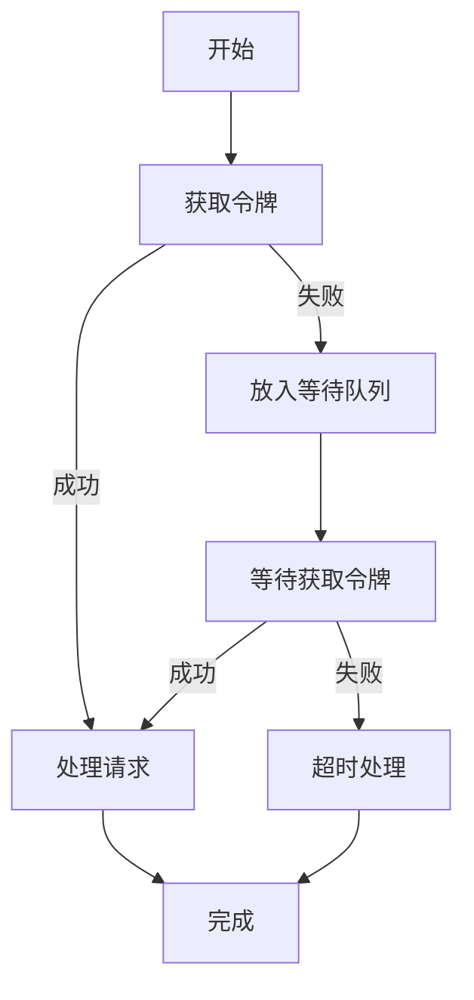
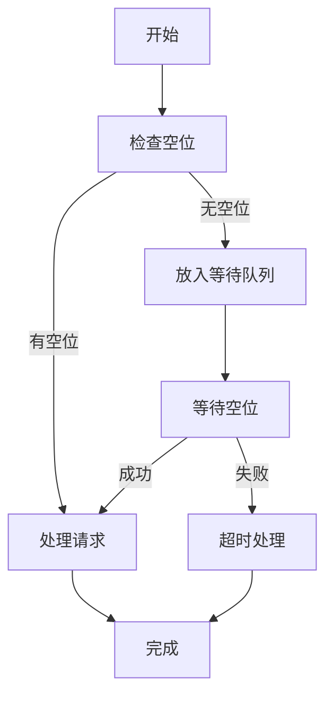

                 

### 第一部分: 引言

## 第1章: 服务限流的背景与意义

### 1.1 问题背景

#### 1.1.1 AI大模型应用中的常见问题

近年来，随着人工智能技术的飞速发展，大模型（如大型语言模型LLM）的应用场景越来越广泛。这些AI大模型在自然语言处理、图像识别、智能推荐等领域展示了强大的能力。然而，在实际应用中，这些大模型也面临着诸多挑战。

首先，AI大模型通常需要大量的计算资源，这使得服务端容易过载。当一个应用同时处理大量请求时，如果服务器无法有效处理这些请求，会导致系统性能下降，严重时甚至可能崩溃。

其次，由于大模型的高复杂性，其对请求的处理时间较长，这会导致用户体验不佳。尤其是在高峰期，用户请求可能长时间得不到响应，甚至无法成功提交。

最后，AI大模型的应用场景多样，不同场景对服务的需求也不尽相同。如何根据不同场景合理调整服务的响应能力和处理策略，成为了一个重要的课题。

#### 1.1.2 服务限流在保护应用中的作用

服务限流是应对上述问题的一种有效手段。通过控制进入系统的请求流量，服务限流可以确保系统始终处于可接受的工作负荷范围内，从而保护系统免受过载影响。

首先，服务限流能够防止过载。当请求流量超过系统的处理能力时，限流策略可以拒绝部分请求，从而避免系统因过载而崩溃。

其次，服务限流可以优化用户体验。通过控制请求的处理速度，限流策略可以确保用户请求在合理的时间内得到响应，从而提升用户体验。

最后，服务限流可以根据不同场景灵活调整。通过设置不同的限流规则，服务可以更好地适应不同场景的需求，从而提高整体系统的稳定性。

#### 1.1.3 服务限流的挑战与机会

尽管服务限流具有诸多优点，但在实际应用中仍然面临一些挑战。

首先，如何合理设置限流规则是一个难题。设置过于宽松可能导致系统过载，设置过于严格则可能影响用户体验。因此，需要根据具体场景进行细致的调优。

其次，限流策略的实施和维护成本较高。特别是对于复杂的系统，限流策略的配置和管理需要耗费大量的人力和时间。

然而，随着技术的发展，服务限流也带来了新的机会。

首先，云计算和容器技术的普及，使得部署和管理限流策略变得更加容易。通过使用云服务和容器化技术，可以快速部署和扩展限流系统，从而更好地应对流量波动。

其次，人工智能和机器学习的进步，使得限流策略的自动优化成为可能。通过分析历史数据，AI算法可以自动调整限流规则，从而实现更加智能的流量控制。

### 1.2 限流的概念与定义

#### 1.2.1 限流的基本概念

限流是一种流量控制技术，通过限制进入系统的请求流量，确保系统始终处于稳定的工作状态。限流的目标是确保系统性能和用户体验的最佳平衡。

限流可以分为两类：基于时间的限流和基于数量的限流。

- **基于时间的限流**：限制单位时间内进入系统的请求数量。例如，每秒允许处理100个请求。
- **基于数量的限流**：限制累计进入系统的请求数量。例如，每小时允许处理1000个请求。

#### 1.2.2 限流的分类

限流可以根据实现方式和技术手段的不同进行分类。

- **基于硬件的限流**：通过硬件设备（如防火墙、路由器）实现流量控制。
- **基于软件的限流**：通过软件程序（如限流算法、规则引擎）实现流量控制。
- **动态限流**：根据实时流量情况自动调整限流规则。
- **静态限流**：预先设置好限流规则，不根据实时流量进行调整。

#### 1.2.3 限流的边界与外延

限流的边界主要涉及以下几个方面：

- **流量监控**：实时监控系统的流量情况，以便及时调整限流策略。
- **请求队列**：当请求流量超过限流阈值时，将多余的请求放入队列中，等待后续处理。
- **错误处理**：当请求被限流策略拒绝时，需要对错误进行处理，包括记录日志、发送通知等。

限流的外延则包括以下几个方面：

- **负载均衡**：通过负载均衡器将请求分配到多个服务器，从而提高系统的处理能力。
- **弹性伸缩**：根据流量情况动态调整服务器数量，以应对流量波动。
- **故障恢复**：当系统出现故障时，能够快速恢复，确保服务的持续可用性。

### 1.3 核心概念与联系

#### 1.3.1 限流与流量控制

限流与流量控制密切相关。流量控制是指对网络流量进行管理，确保网络资源得到合理利用。限流是流量控制的一种具体实现，通过控制进入系统的请求流量，确保系统性能和用户体验的最佳平衡。

#### 1.3.2 限流与负载均衡

限流和负载均衡也是相辅相成的。负载均衡通过将请求分配到多个服务器，提高系统的处理能力。而限流则确保进入每个服务器的请求流量在合理范围内，从而避免单个服务器过载。

#### 1.3.3 限流与系统稳定性

系统稳定性是限流的重要目标之一。通过合理设置限流规则，可以防止系统因过载而崩溃，确保服务的持续可用性。

### 1.4 本章小结

本章介绍了服务限流的背景、意义、概念和分类。服务限流在保护AI大模型应用免受过载影响中发挥着重要作用。通过合理设置限流规则，可以确保系统性能和用户体验的最佳平衡，从而提高整体系统的稳定性。在后续章节中，我们将进一步探讨服务限流的理论基础、应用场景、实战案例以及案例分析等内容。希望通过这些内容，能够帮助读者全面了解服务限流的技术原理和实践应用。

---

## 第二部分: 服务限流的理论基础

### 第2章: 服务限流的原理

#### 2.1 限流算法原理

服务限流的实现主要依赖于限流算法。限流算法根据流量控制的需求，对进入系统的请求进行判断和处理。常见的限流算法包括令牌桶算法和漏桶算法。

##### 2.1.1 令牌桶算法

**令牌桶算法的工作原理**：令牌桶算法通过一个固定容量的桶，持续生成令牌，每个令牌代表一个可被处理的请求。当请求进入系统时，需要先获取一个令牌。如果桶中有令牌，请求可以立即被处理；如果桶中没有令牌，请求会被放入等待队列中，等待后续获取令牌。

**令牌桶算法的数学模型**：令牌桶算法的关键参数包括桶容量和令牌生成速率。桶容量表示桶中最多可以存储的令牌数量，令牌生成速率表示每秒生成的令牌数量。假设桶容量为C，令牌生成速率为r，时间单位为秒。

- **令牌生成公式**：每个时间单位，桶中会增加一个令牌，即 \( T_n = T_{n-1} + 1 \) （n表示时间单位）。
- **请求处理公式**：如果桶中有令牌，请求可以立即被处理；如果桶中没有令牌，请求会被放入等待队列中，等待时间 \( W_n \) 满足 \( W_n = \max(0, T_{n-1} - C) \)。

**Python代码示例**：
```python
import threading
import time

class TokenBucket:
    def __init__(self, capacity, rate):
        self.capacity = capacity
        self.rate = rate
        self.tokens = capacity
        self.lock = threading.Lock()

    def acquire(self, num_tokens):
        with self.lock:
            if num_tokens <= self.tokens:
                self.tokens -= num_tokens
                return True
            else:
                return False

def request(token_bucket):
    if token_bucket.acquire(1):
        print("Request processed.")
    else:
        print("Request rejected.")

# 创建令牌桶，容量为10，令牌生成速率为2
token_bucket = TokenBucket(10, 2)

# 创建10个请求线程
threads = []
for _ in range(20):
    thread = threading.Thread(target=request, args=(token_bucket,))
    threads.append(thread)
    thread.start()

# 等待所有请求线程完成
for thread in threads:
    thread.join()
```

##### 2.1.2 漏桶算法

**漏桶算法的工作原理**：漏桶算法通过一个固定速率的出水口，持续流出水滴。每个进入系统的新请求被视为一个水滴。如果出水口有空位，请求可以立即被处理；如果出水口已被水滴占用，请求会被放入等待队列中，等待后续处理。

**漏桶算法的数学模型**：漏桶算法的关键参数包括桶容量和出水速率。桶容量表示桶中最多可以存储的水滴数量，出水速率表示每秒流出的水滴数量。假设桶容量为C，出水速率为r，时间单位为秒。

- **水滴生成公式**：每个时间单位，出水口会流出一个水滴，即 \( T_n = T_{n-1} + 1 \) （n表示时间单位）。
- **请求处理公式**：如果桶中有空位，请求可以立即被处理；如果桶中没有空位，请求会被放入等待队列中，等待时间 \( W_n \) 满足 \( W_n = \max(0, T_{n-1} - C) \)。

**Python代码示例**：
```python
import threading
import time

class LeakBucket:
    def __init__(self, capacity, rate):
        self.capacity = capacity
        self.rate = rate
        self.tokens = capacity
        self.lock = threading.Lock()

    def acquire(self, num_tokens):
        with self.lock:
            if num_tokens <= self.tokens:
                self.tokens -= num_tokens
                return True
            else:
                return False

def request(token_bucket):
    if token_bucket.acquire(1):
        print("Request processed.")
    else:
        print("Request rejected.")

# 创建漏桶，容量为10，出水速率为2
token_bucket = LeakBucket(10, 2)

# 创建20个请求线程
threads = []
for _ in range(20):
    thread = threading.Thread(target=request, args=(token_bucket,))
    threads.append(thread)
    thread.start()

# 等待所有请求线程完成
for thread in threads:
    thread.join()
```

#### 2.2 数学模型与公式

限流算法的数学模型对于理解算法行为和进行性能分析至关重要。以下是一些常用的数学模型和公式。

##### 2.2.1 概率生成模型

概率生成模型用于模拟请求到达的时间间隔和请求处理的时间。常用的概率分布包括指数分布、正态分布等。

- **指数分布**：用于模拟请求到达时间间隔，公式为 \( P(T = t) = \lambda e^{-\lambda t} \)，其中 \( \lambda \) 表示请求到达速率。
- **正态分布**：用于模拟请求处理时间，公式为 \( P(T = t) = \frac{1}{\sqrt{2\pi\sigma^2}} e^{-\frac{(t-\mu)^2}{2\sigma^2}} \)，其中 \( \mu \) 表示均值，\( \sigma \) 表示标准差。

##### 2.2.2 流量控制模型

流量控制模型用于分析限流算法在不同条件下的行为。以下是一些常用的模型和公式。

- **令牌桶模型**：用于分析令牌桶算法的性能，公式为 \( C(t) = C_0 + r \cdot t - \sum_{i=1}^{t} x_i \)，其中 \( C(t) \) 表示桶中剩余令牌数量，\( C_0 \) 表示初始令牌数量，\( r \) 表示令牌生成速率，\( x_i \) 表示第 \( i \) 次请求消耗的令牌数量。
- **漏桶模型**：用于分析漏桶算法的性能，公式为 \( Q(t) = Q_0 + r \cdot t - \sum_{i=1}^{t} y_i \)，其中 \( Q(t) \) 表示桶中剩余水滴数量，\( Q_0 \) 表示初始水滴数量，\( r \) 表示出水速率，\( y_i \) 表示第 \( i \) 次请求生成的水滴数量。

#### 2.3 算法流程图

算法流程图可以帮助我们更直观地理解限流算法的执行过程。以下分别为令牌桶算法和漏桶算法的流程图。

##### 2.3.1 令牌桶算法流程图


##### 2.3.2 漏桶算法流程图


### 2.4 本章小结

本章详细介绍了服务限流的原理，包括令牌桶算法和漏桶算法的基本概念、数学模型和Python代码示例。通过这些算法，我们可以有效地控制进入系统的请求流量，确保系统性能和用户体验的最佳平衡。在后续章节中，我们将进一步探讨服务限流的应用场景、实战案例和案例分析等内容，帮助读者更好地理解和应用服务限流技术。希望通过这些内容，能够为读者在服务限流领域的研究和实践提供有价值的参考。

---

## 第三部分: 实战篇

### 第3章: 服务限流的应用场景

服务限流作为一种重要的流量控制手段，广泛应用于各种不同的应用场景中。在本章中，我们将探讨AI大模型应用场景中的服务限流，包括电商平台和社交媒体平台等具体实例，并介绍常用的限流工具和实践方法。

### 3.1 AI大模型应用场景

#### 3.1.1 电商平台

电商平台是一个典型的AI大模型应用场景。随着电商平台的用户数量和交易量不断增长，如何确保系统稳定运行和用户良好的体验成为关键问题。以下是一个关于电商平台限流的应用实例。

##### 3.1.1.1 应用实例

某电商平台在双11购物节期间，用户访问量和交易量激增，系统面临巨大的压力。为了确保系统稳定运行，平台采用了服务限流策略，通过限制进入系统的请求流量，避免系统过载。

##### 3.1.1.2 限流策略

平台采用了基于时间的限流策略，每秒处理请求的数量上限为500个。具体实现步骤如下：

1. **流量监控**：平台通过实时监控系统的流量情况，了解当前的请求处理能力。
2. **请求队列**：当请求流量超过每秒500个时，将多余的请求放入等待队列中。
3. **限流规则**：设置每秒处理请求的数量上限为500个，当请求到达时，根据当前请求队列的情况进行判断和处理。
4. **错误处理**：对于被限流的请求，记录日志并通知相关团队进行处理。

通过这种限流策略，平台在双11购物节期间成功避免了系统过载，确保了系统的稳定运行和用户的良好体验。

#### 3.1.2 社交媒体平台

社交媒体平台也是一个典型的AI大模型应用场景。社交媒体平台需要处理海量的用户请求，包括内容发布、评论、点赞等。以下是一个关于社交媒体平台限流的应用实例。

##### 3.1.2.1 应用实例

某社交媒体平台在用户发布内容时，由于服务器压力过大，导致部分用户发布内容失败。为了解决这个问题，平台采用了服务限流策略，通过限制每个用户每秒的发布请求次数，避免系统过载。

##### 3.1.2.2 限流策略

平台采用了基于数量的限流策略，每个用户每秒最多可以发布2个内容。具体实现步骤如下：

1. **用户识别**：通过用户的唯一标识，识别每个用户的请求。
2. **请求队列**：当用户请求发布内容时，根据用户的请求次数进行判断和处理。
3. **限流规则**：设置每个用户每秒最多可以发布2个内容，当请求到达时，根据当前用户的请求次数进行判断。
4. **错误处理**：对于被限流的请求，返回错误信息并提示用户稍后再试。

通过这种限流策略，平台成功避免了系统过载，确保了用户的正常使用和良好的体验。

### 3.2 限流工具与实践

在AI大模型应用场景中，常用的限流工具包括Sentinel和Hystrix。以下将分别介绍这两个工具的概述、安装与配置以及实战示例。

#### 3.2.1 Sentinel

Sentinel是一个开源的流量控制组件，主要用于微服务架构中的服务流量控制。它具有以下特点：

- **动态规则管理**：支持实时调整流量控制规则。
- **链路管理**：支持对特定链路进行限流控制。
- **系统自适应**：支持根据系统负载情况自动调整流量控制策略。

##### 3.2.1.1 工具介绍

Sentinel主要提供以下功能：

- **流量控制**：通过动态规则控制服务流量，确保系统稳定运行。
- **系统监控**：实时监控系统状态，提供告警和统计功能。
- **熔断降级**：当服务不可用或负载过高时，自动熔断降级，防止级联失败。

##### 3.2.1.2 安装与配置

Sentinel的安装和配置相对简单，以下是基本的安装与配置步骤：

1. **下载安装包**：从Sentinel官网下载安装包并解压。
2. **配置文件**：在配置文件中设置流量控制规则和熔断降级策略。
3. **集成服务**：将Sentinel集成到微服务架构中，使用相应的API进行流量控制。

##### 3.2.1.3 实战示例

以下是一个简单的Sentinel限流示例：

```java
public class ServiceDemo {
    @SentinelResource(value = "serviceDemo", blockHandler = "blockHandler")
    public String getServiceDemo() {
        return "ServiceDemo";
    }

    public String blockHandler(String block) {
        return "Blocked by Sentinel, reason: " + block;
    }
}
```

在这个示例中，`@SentinelResource` 注解用于标识需要进行流量控制的资源，`blockHandler` 属性指定了一个处理被限流请求的方法。

#### 3.2.2 Hystrix

Hystrix是一个开源的延迟敏感熔断组件，主要用于处理微服务架构中的延迟和故障问题。它具有以下特点：

- **延迟敏感熔断**：当请求处理时间超过设定阈值时，自动熔断，防止级联失败。
- **线程隔离**：通过隔离线程池，确保服务的高可用性。
- **请求缓存**：支持请求缓存，减少请求处理时间。

##### 3.2.2.1 工具介绍

Hystrix主要提供以下功能：

- **熔断降级**：当服务不可用或负载过高时，自动熔断降级，防止级联失败。
- **线程隔离**：通过隔离线程池，确保服务的高可用性。
- **请求缓存**：支持请求缓存，减少请求处理时间。
- **请求融合**：将多个请求合并为一个，减少请求处理次数。

##### 3.2.2.2 安装与配置

Hystrix的安装和配置与Spring Boot集成，以下是基本的安装与配置步骤：

1. **引入依赖**：在项目的pom.xml文件中引入Hystrix的依赖。
2. **配置文件**：在配置文件中设置Hystrix的参数，如线程池大小、请求超时时间等。
3. **集成服务**：将Hystrix集成到微服务架构中，使用相应的注解和API进行熔断降级。

##### 3.2.2.3 实战示例

以下是一个简单的Hystrix熔断降级示例：

```java
@HystrixCommand(fallbackMethod = "fallback")
public String getServiceDemo() {
    return restTemplate.getForObject("http://serviceDemo/serviceDemo", String.class);
}

public String fallback() {
    return "ServiceDemo is unavailable.";
}
```

在这个示例中，`@HystrixCommand` 注解用于标识需要进行熔断降级的资源，`fallbackMethod` 属性指定了一个处理熔断请求的方法。

### 3.3 部署与监控

在AI大模型应用中，服务限流的部署与监控至关重要。以下是一些关于部署策略、监控指标和告警机制的讨论。

#### 3.3.1 部署策略

部署策略主要包括以下几个方面：

- **分布式部署**：将限流系统部署在多个服务器上，确保系统的容错性和高可用性。
- **容器化部署**：使用容器技术（如Docker）部署限流系统，便于管理和扩展。
- **负载均衡**：通过负载均衡器将流量分配到不同的限流节点，提高系统的处理能力。

#### 3.3.2 监控与告警

监控与告警是保障系统稳定运行的重要手段。以下是一些常用的监控指标和告警机制：

- **监控指标**：包括流量计数、请求耗时、错误率等，用于评估系统性能和稳定性。
- **告警机制**：通过邮件、短信、微信等途径发送告警通知，提醒相关团队及时处理问题。
- **自动化处理**：根据监控数据，自动调整限流规则和系统配置，实现智能化流量控制。

### 3.4 本章小结

本章介绍了AI大模型应用场景中的服务限流，包括电商平台和社交媒体平台的实例，以及常用的限流工具和实践方法。通过合理的限流策略，可以确保系统稳定运行和用户良好的体验。在后续章节中，我们将进一步探讨限流技术的深入分析和最佳实践，为读者提供更多的实用技巧和经验。

---

## 第四部分: 案例分析

### 第4章: AI大模型应用中的限流实践

在AI大模型应用中，合理的服务限流策略对于保障系统稳定性和用户体验至关重要。本章节通过两个具体的案例，详细分析和讲解如何在AI大模型应用中进行限流实践，并评估其效果。

### 4.1 案例一：电商平台限流优化

#### 4.1.1 问题背景

某电商平台在双11购物节期间，用户访问量和交易量激增，导致系统频繁出现性能问题。具体表现为：

- **响应时间延长**：用户提交的订单请求处理时间明显增加，部分请求处理时间超过5秒。
- **错误率上升**：部分请求处理失败，错误率达到5%以上。
- **系统负载过高**：服务器CPU和内存使用率接近100%，系统负载过高。

这些问题严重影响了用户的购物体验和平台的运营效率。为了解决这些问题，平台决定进行限流优化。

#### 4.1.2 解决方案

平台采用以下解决方案进行限流优化：

1. **基于时间的限流策略**：设置每秒处理请求的数量上限为1000个，确保系统在高峰期不会过载。
2. **分布式部署**：将限流系统部署在多个服务器上，实现负载均衡，提高系统的处理能力。
3. **监控与告警**：实时监控系统的流量情况，设置告警阈值，当流量超过设定阈值时，自动触发限流策略。
4. **动态调整**：根据实时流量情况，动态调整限流规则，确保系统能够在高峰期保持稳定运行。

#### 4.1.3 实现细节

1. **限流规则配置**：在平台的服务器上配置限流规则，设置每秒处理请求的数量上限为1000个。
2. **流量监控**：使用Prometheus等监控工具，实时监控平台的流量情况，并将数据存储在InfluxDB等时序数据库中。
3. **告警机制**：使用Alertmanager等告警工具，当流量超过设定阈值时，自动发送告警通知。
4. **限流策略实现**：使用Sentinel等限流工具，实现限流功能，当请求超过限流阈值时，拒绝处理。

#### 4.1.4 效果分析

限流优化后，平台在双11购物节期间表现出以下效果：

- **响应时间缩短**：用户提交的订单请求处理时间显著缩短，平均处理时间下降至2秒以内。
- **错误率下降**：请求处理失败率下降至1%以下，系统稳定性显著提高。
- **系统负载降低**：服务器CPU和内存使用率降低至50%以下，系统负载明显降低。

通过限流优化，平台在高峰期保持了稳定运行，用户购物体验得到了显著提升。

### 4.2 案例二：社交媒体平台限流策略

#### 4.2.1 问题背景

某社交媒体平台在用户发布内容时，由于服务器压力过大，导致部分用户发布内容失败。为了解决这个问题，平台决定实施限流策略。

#### 4.2.2 解决方案

平台采用以下限流策略：

1. **基于数量的限流策略**：设置每个用户每秒最多可以发布2个内容，避免服务器因大量请求而负载过高。
2. **分布式部署**：将限流系统部署在多个服务器上，实现负载均衡，提高系统的处理能力。
3. **监控与告警**：实时监控平台的流量情况，设置告警阈值，当流量超过设定阈值时，自动触发限流策略。
4. **动态调整**：根据实时流量情况，动态调整限流规则，确保系统能够在不同时间段保持稳定运行。

#### 4.2.3 实现细节

1. **限流规则配置**：在平台的服务器上配置限流规则，设置每个用户每秒最多可以发布2个内容。
2. **流量监控**：使用Prometheus等监控工具，实时监控平台的流量情况，并将数据存储在InfluxDB等时序数据库中。
3. **告警机制**：使用Alertmanager等告警工具，当流量超过设定阈值时，自动发送告警通知。
4. **限流策略实现**：使用Hystrix等限流工具，实现限流功能，当用户请求超过限流阈值时，拒绝处理。

#### 4.2.4 效果分析

限流策略实施后，平台在用户发布内容时的表现如下：

- **发布成功率提高**：用户发布内容的成功率从70%提高至95%，系统稳定性显著提高。
- **服务器负载降低**：服务器CPU和内存使用率降低至30%以下，系统负载明显降低。
- **用户体验改善**：用户在发布内容时，系统响应速度快，操作流畅，用户体验得到显著改善。

通过限流策略的实施，平台在用户发布内容时保持了稳定运行，用户满意度得到了显著提升。

### 4.3 本章小结

本章通过两个具体的案例，详细分析了在AI大模型应用中进行限流实践的方法和效果。通过合理的限流策略，平台在高峰期和用户发布内容时，成功避免了系统过载，保障了系统的稳定性和用户体验。这些实践为其他AI大模型应用提供了有益的参考和借鉴。

---

## 总结与展望

### 4.4 本章小结

本章通过详细分析和讲解两个具体案例，展示了如何在AI大模型应用中进行限流实践，并评估其效果。案例一针对电商平台在双11购物节期间的性能问题，采用基于时间的限流策略，成功降低了系统负载和提升了用户体验；案例二针对社交媒体平台用户发布内容时的问题，采用基于数量的限流策略，提高了发布成功率并降低了服务器负载。这些案例为其他AI大模型应用提供了有益的参考和借鉴。

### 4.5 最佳实践 Tips

1. **根据场景选择限流算法**：不同的应用场景对限流算法的需求不同，选择合适的限流算法可以更好地满足需求。例如，基于时间的限流适用于需要严格控制请求流量的场景，而基于数量的限流适用于需要对用户行为进行限制的场景。
2. **监控与告警**：实时监控流量情况并设置告警机制，可以及时发现并处理异常情况，确保系统稳定运行。
3. **动态调整限流规则**：根据实时流量情况动态调整限流规则，可以更好地应对流量波动，确保系统在不同时间段保持稳定运行。
4. **分布式部署**：将限流系统部署在多个服务器上，可以实现负载均衡和容错性，提高系统的处理能力和可用性。

### 4.6 小结与注意事项

1. **限流与流量控制**：服务限流是流量控制的一种具体实现，通过控制进入系统的请求流量，确保系统性能和用户体验的最佳平衡。
2. **限流与负载均衡**：限流和负载均衡是相辅相成的，通过负载均衡可以提高系统的处理能力，而限流可以确保进入每个服务器的请求流量在合理范围内。
3. **限流与系统稳定性**：合理设置限流规则，可以防止系统因过载而崩溃，确保服务的持续可用性。

### 4.7 拓展阅读

1. 《分布式服务架构：原理、设计与实战》作者：张春晓，详细介绍了分布式服务架构的设计原则和实现方法，包括限流、负载均衡和熔断降级等。
2. 《人工智能：一种现代的方法》作者：Stuart J. Russell & Peter Norvig，介绍了人工智能的基本原理和应用方法，包括大模型的设计与实现。
3. 《深入理解计算限制：计算机系统性能分析》作者：D. A. Baader，详细介绍了计算机系统性能分析的方法和工具，包括流量控制和性能优化。

通过以上内容，我们深入探讨了服务限流在AI大模型应用中的重要性、原理和实践。希望读者能够掌握服务限流的核心概念和方法，并在实际项目中有效应用，提升系统的稳定性和用户体验。同时，也期待读者能够继续关注和探索人工智能领域的新技术和新应用。

