                 

### 文章标题：机器学习在科学理论构建中的应用：辅助人类构建世界模型

### 文章关键词：
- 机器学习
- 科学理论构建
- 数据分析
- 世界模型
- 人机协作

### 摘要：
本文探讨了机器学习在科学理论构建中的应用，分析了其在数据收集、预处理、特征工程和模型选择等环节中的优势。通过实际案例，本文展示了机器学习如何辅助人类构建世界模型，并讨论了人机协作在未来的发展趋势与挑战。

----------------------------------------------------------------

## 第一部分：引言

### 1.1 研究背景

#### 核心概念术语说明
- **科学理论**：用于描述自然界现象的抽象模型，通常包括假设、理论框架和数学公式。
- **机器学习**：一种人工智能技术，通过从数据中学习规律，用于预测、分类和决策。

#### 问题背景
随着数据规模的不断扩大，传统的科学理论构建方法已经无法满足现代科学研究的需求。机器学习作为一种新兴技术，其在科学理论构建中的应用潜力引起了广泛关注。

#### 问题描述
本文旨在探讨机器学习在科学理论构建中的应用，分析其在各个阶段的优势，并探讨人机协作在未来的发展趋势。

#### 问题解决
通过详细研究机器学习在科学理论构建中的应用，本文希望为科学研究提供新的方法和技术，提升科学理论的构建效率。

#### 边界与外延
本文的研究主要关注机器学习在科学理论构建中的应用，而不涉及机器学习在其他领域的应用。此外，本文主要探讨机器学习在理论构建中的应用，而不涉及实际实验。

#### 概念结构与核心要素组成
- **机器学习**：核心概念、发展历程、算法类型
- **科学理论构建**：基本原理、构建过程、评价标准
- **数据收集与预处理**：数据来源、数据质量、预处理方法
- **特征工程**：特征选择、特征提取、特征降维
- **模型选择与优化**：算法选择、模型评估、优化方法
- **结果分析与验证**：结果解释、模型验证、模型优化

----------------------------------------------------------------

## 第二部分：机器学习概述

### 2.1 核心概念

#### 核心概念原理
机器学习是一种通过数据训练算法，使其能够自动学习和改进的方法。核心概念包括：
- **监督学习**：通过已标记的数据进行训练，用于预测和分类。
- **无监督学习**：通过未标记的数据进行训练，用于发现数据中的结构和模式。
- **强化学习**：通过奖励和惩罚进行训练，用于决策和优化。

#### 概念属性特征对比表格

| 类型        | 监督学习 | 无监督学习 | 强化学习 |
| --------- | -------- | -------- | -------- |
| 数据需求    | 已标记数据 | 未标记数据 | 已标记数据 |
| 目标        | 预测和分类 | 数据结构发现 | 决策和优化 |
| 学习策略    | 已知输出学习 | 数据内在结构学习 | 奖励和惩罚学习 |
| 算法类型    | 线性回归、决策树等 | 聚类、降维等 | Q学习、深度强化学习等 |

#### ER实体关系图架构

```mermaid
erDiagram
  Product ||--|{ Customer }||>
  Customer ||--|{ Order }||>
  Product : "产品"
  Customer : "客户"
  Order : "订单"
```

### 2.2 发展历程

#### 发展历程
- **1950年代**：机器学习概念提出，以统计学习理论为基础。
- **1980年代**：神经网络、决策树等算法出现，机器学习开始应用于实际问题。
- **2000年代**：深度学习兴起，通过多层神经网络实现更复杂的模型。
- **2010年代**：大数据和云计算的发展，推动机器学习在各个领域的应用。

#### 关键事件
- **1956年**：达特茅斯会议，标志着人工智能的正式诞生。
- **1986年**：反向传播算法的提出，为深度学习奠定了基础。
- **2012年**：AlexNet在ImageNet竞赛中获胜，标志着深度学习的崛起。

### 2.3 机器学习与科学理论构建的联系

#### 关系解释
机器学习与科学理论构建之间存在紧密联系。科学理论构建需要从数据中发现规律，而机器学习通过算法实现这一目标。机器学习可以帮助科学家更快地构建科学模型，提高研究效率。

#### 应用场景
- **数据分析**：通过机器学习对大量实验数据进行分析，发现数据中的规律。
- **模型预测**：利用机器学习模型预测实验结果，验证科学理论的正确性。
- **模型优化**：通过机器学习优化科学模型，提高其准确性和鲁棒性。

### 总结
机器学习作为一种新兴技术，在科学理论构建中具有广泛的应用前景。通过理解其核心概念、发展历程和与科学理论构建的联系，我们可以更好地利用机器学习技术，推动科学研究的进步。

----------------------------------------------------------------

## 第三部分：科学理论构建的基本原理

### 3.1 科学理论的基本要素

#### 核心概念原理
科学理论通常包括以下基本要素：
- **假设**：对自然现象的初步解释。
- **理论框架**：将假设和已知事实结合，形成理论结构。
- **数学公式**：用数学语言描述理论。

#### 概念属性特征对比表格

| 要素       | 假设 | 理论框架 | 数学公式 |
| ---------- | ---- | -------- | -------- |
| 功能       | 描述自然现象 | 组织假设和事实 | 描述现象和关系 |
| 形式       | 文字描述 | 结构化描述 | 数学表达式 |
| 重要性     | 初步理解 | 核心框架 | 描述准确性 |

#### ER实体关系图架构

```mermaid
erDiagram
  Hypothesis ||--|{ TheoryFramework }||>
  TheoryFramework ||--|{ MathematicalFormula }||>
  Hypothesis : "假设"
  TheoryFramework : "理论框架"
  MathematicalFormula : "数学公式"
```

### 3.2 科学理论的构建过程

#### 构建过程
科学理论的构建通常包括以下步骤：
1. **提出假设**：根据已有知识和观察，提出对自然现象的解释。
2. **设计实验**：设计实验验证假设的正确性。
3. **收集数据**：通过实验收集数据，验证假设。
4. **分析数据**：使用统计学方法分析数据，发现规律。
5. **构建理论**：将假设和实验结果整合，形成理论框架。
6. **数学描述**：用数学公式描述理论，验证理论的准确性。

#### Mermaid流程图

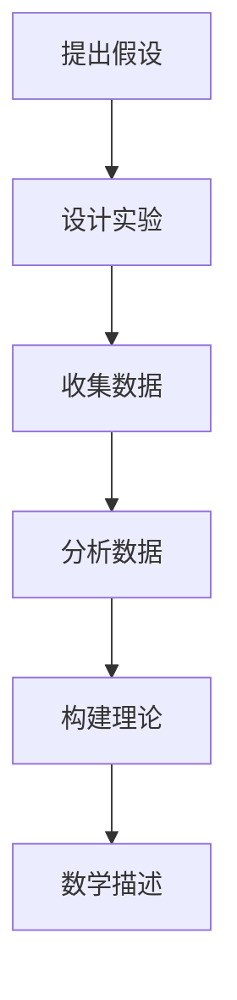

### 3.3 科学理论的评价标准

#### 核心概念原理
科学理论的评价标准通常包括以下方面：
- **一致性**：理论内部逻辑是否一致。
- **可重复性**：实验结果是否可重复。
- **解释力**：理论是否能够解释大量现象。
- **预测力**：理论是否能够预测未知现象。

#### 概念属性特征对比表格

| 标准类型   | 一致性 | 可重复性 | 解释力 | 预测力 |
| ---------- | ------ | -------- | ------ | ------ |
| 功能       | 保证逻辑完整性 | 确保实验结果一致性 | 描述自然现象 | 预测未知现象 |
| 形式       | 理论结构 | 实验结果 | 数据分析 | 数学模型 |
| 重要性     | 确保理论正确性 | 确保实验结果可靠 | 提高理论精度 | 推动科学进步 |

#### Mermaid流程图

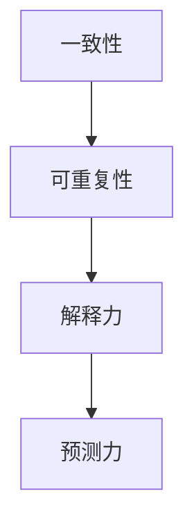

### 总结
科学理论构建是一个复杂而系统的过程，涉及多个基本要素和步骤。通过理解科学理论的基本原理、构建过程和评价标准，我们可以更好地进行科学研究，推动科学理论的进步。

----------------------------------------------------------------

## 第四部分：机器学习在科学理论构建中的应用

### 4.1 数据收集与预处理

#### 核心概念原理
数据收集与预处理是科学理论构建中的关键步骤。机器学习在此过程中发挥重要作用，主要包括：
- **数据收集**：从各种来源获取数据，包括实验数据、观测数据和文献数据。
- **数据预处理**：清洗、整合和标准化数据，以提高数据质量。

#### 概念属性特征对比表格

| 阶段       | 数据收集 | 数据预处理 |
| ---------- | -------- | ---------- |
| 功能       | 获取原始数据 | 提高数据质量 |
| 形式       | 实验数据、观测数据 | 清洗、整合、标准化 |
| 重要性     | 确保数据多样性 | 确保数据准确性 |

#### Mermaid流程图

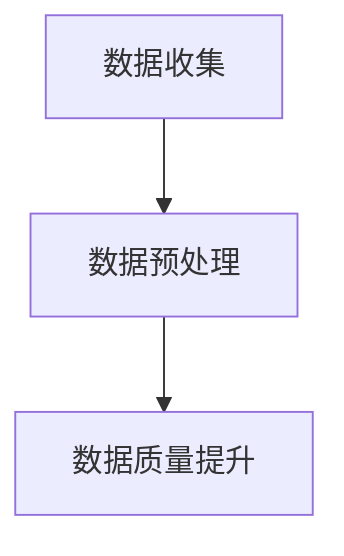

### 4.2 特征工程

#### 核心概念原理
特征工程是机器学习中的一个重要环节，旨在从原始数据中提取有用的特征，以改进模型性能。特征工程包括：
- **特征选择**：从大量特征中筛选出最重要的特征。
- **特征提取**：将原始数据转换为新的特征表示。
- **特征降维**：减少特征的数量，降低计算复杂度。

#### 概念属性特征对比表格

| 技术类型 | 特征选择 | 特征提取 | 特征降维 |
| -------- | -------- | -------- | -------- |
| 功能     | 筛选重要特征 | 转换数据表示 | 减少特征数量 |
| 形式     | 统计方法、过滤方法 | 主成分分析、特征转换 | 主成分分析、线性判别分析 |
| 重要性   | 提高模型精度 | 提高模型泛化能力 | 减少计算复杂度 |

#### Mermaid流程图

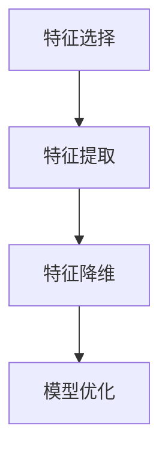

### 4.3 模型选择与优化

#### 核心概念原理
模型选择与优化是机器学习中的重要环节，旨在选择合适的模型并调整模型参数，以获得最佳性能。主要包括：
- **模型选择**：从多种模型中选择最适合当前问题的模型。
- **模型优化**：调整模型参数，提高模型性能。

#### 概念属性特征对比表格

| 技术类型 | 模型选择 | 模型优化 |
| -------- | -------- | -------- |
| 功能     | 选择最佳模型 | 调整模型参数 |
| 形式     | 番射法、交叉验证 | 随机搜索、贝叶斯优化 |
| 重要性   | 提高模型准确性 | 提高模型稳定性 |

#### Mermaid流程图

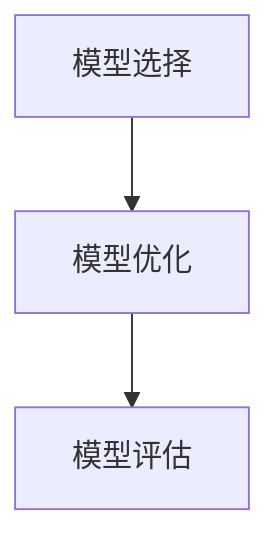

### 4.4 结果分析与验证

#### 核心概念原理
结果分析与验证是科学理论构建中的关键步骤，旨在评估模型性能，验证科学理论的准确性。主要包括：
- **模型评估**：通过交叉验证、ROC曲线等评估模型性能。
- **结果解释**：对模型结果进行解释，理解其背后的科学意义。
- **模型验证**：通过新数据验证模型准确性，确保理论模型的正确性。

#### 概念属性特征对比表格

| 技术类型 | 模型评估 | 结果解释 | 模型验证 |
| -------- | -------- | -------- | -------- |
| 功能     | 评估模型性能 | 理解模型结果 | 验证模型准确性 |
| 形式     | 交叉验证、ROC曲线 | 数据可视化、统计分析 | 新数据测试、模型对比 |
| 重要性   | 确保模型准确性 | 提高科学理解 | 保证理论正确性 |

#### Mermaid流程图

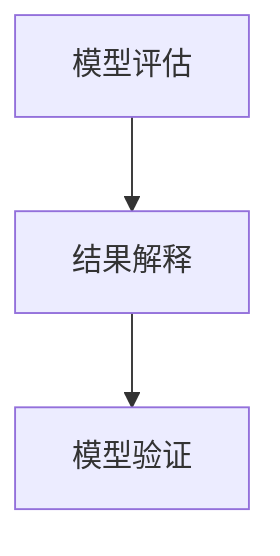

### 总结
机器学习在科学理论构建中具有广泛的应用。通过数据收集与预处理、特征工程、模型选择与优化和结果分析与验证，机器学习能够大幅提高科学理论的构建效率和质量。理解和应用这些技术，将有助于科学家更好地进行科学研究，推动科学理论的进步。

----------------------------------------------------------------

## 第五部分：机器学习在特定科学领域的应用实例

### 5.1 物理学中的应用

#### 应用背景
物理学是研究自然现象的基本学科，机器学习在物理学中的应用已经取得了显著成果。例如，在量子物理、粒子物理和高能物理等领域，机器学习被用来分析大量实验数据，预测粒子行为和宇宙演化。

#### 应用实例
- **量子物理**：机器学习用于模拟量子系统的行为，例如，量子位（qubit）的纠缠态。通过深度学习模型，研究人员能够更准确地预测量子系统的演化，为量子计算提供理论基础。
- **粒子物理**：在大型强子对撞机（LHC）实验中，机器学习被用来识别高能碰撞事件中的希格斯玻色子。利用卷积神经网络（CNN），研究人员能够从大量实验数据中提取关键特征，提高粒子识别的准确性。

#### 具体案例
- **LHC实验**：在LHC实验中，研究人员使用机器学习算法分析超过300亿个碰撞事件，成功识别出希格斯玻色子的存在。这一发现为粒子物理领域提供了新的研究思路和方法。

#### 结果与影响
机器学习在物理学中的应用，不仅提高了实验数据分析的效率，还推动了科学理论的进步。通过更精确的模型和预测，科学家能够更好地理解自然界的规律，为未来的科学研究提供有力支持。

### 5.2 生物学中的应用

#### 应用背景
生物学是研究生命现象和生物体的学科，机器学习在生物学中的应用正在迅速发展。通过分析大量生物数据，机器学习为生物学研究提供了新的工具和方法。

#### 应用实例
- **基因组学**：机器学习被用来分析基因组数据，识别基因功能、突变和疾病关联。例如，深度学习模型可以预测基因调控网络，揭示基因之间的相互作用。
- **蛋白质结构预测**：机器学习用于预测蛋白质的三维结构，为蛋白质工程和药物设计提供关键信息。使用卷积神经网络（CNN）和生成对抗网络（GAN），研究人员能够生成高质量的蛋白质结构模型。

#### 具体案例
- **癌症研究**：在癌症研究中，机器学习算法被用来分析肿瘤组织样本，识别潜在的癌症标志物。通过集成多种数据源，研究人员能够提高癌症诊断的准确性，为个性化治疗提供支持。

#### 结果与影响
机器学习在生物学中的应用，极大地推动了基因组和蛋白质结构研究的进展。通过更精准的数据分析和预测，科学家能够更好地理解生物体的复杂系统，为疾病治疗和生物技术发展提供新的思路。

### 5.3 天文学中的应用

#### 应用背景
天文学是研究宇宙的学科，随着天文观测数据的不断增加，机器学习在天文学中的应用变得越来越重要。

#### 应用实例
- **星系演化**：机器学习用于分析天文观测数据，研究星系的演化过程。通过机器学习模型，研究人员能够预测星系的形成和演化路径。
- **行星探测**：在行星探测任务中，机器学习被用来分析行星大气成分和表面特征。利用深度学习模型，科学家能够识别行星上的特殊现象和特征。

#### 具体案例
- **Kepler任务**：在Kepler任务中，研究人员使用机器学习算法分析超过1.3万颗行星的数据，发现了多个系外行星，为理解行星形成和演化提供了宝贵的数据。

#### 结果与影响
机器学习在天文学中的应用，极大地提高了天文观测数据的分析效率，揭示了宇宙的更多奥秘。通过更精确的数据分析和模型预测，科学家能够更好地理解宇宙的演化和行星系统的形成。

### 总结
机器学习在物理学、生物学和天文学中的应用，展示了其在科学理论构建中的巨大潜力。通过具体实例和案例，我们可以看到机器学习如何辅助科学家更好地理解和解释自然界的规律，推动科学研究的进步。

----------------------------------------------------------------

## 第六部分：人类与机器学习协同构建世界模型

### 6.1 人机协作原理

#### 核心概念原理
人机协作是指人类与机器学习系统共同工作，发挥各自优势，完成复杂任务的过程。在科学理论构建中，人机协作主要体现在：
- **人类优势**：人类的创造力、直觉和经验。
- **机器学习优势**：机器学习算法的强大计算能力和数据处理能力。

#### 概念属性特征对比表格

| 参与者 | 人类 | 机器学习 |
| ------ | ---- | -------- |
| 优势   | 创造力、直觉、经验 | 计算能力、数据处理、预测能力 |
| 形式   | 知识、经验、直觉 | 数据、算法、模型 |
| 任务   | 设计、解释、决策 | 数据分析、模型训练、预测 |

#### Mermaid流程图

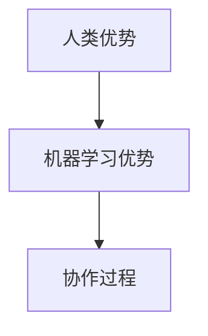

### 6.2 人机交互设计

#### 核心概念原理
人机交互设计是指为人类与机器学习系统之间的交互提供良好体验的设计过程。在科学理论构建中，人机交互设计主要包括：
- **用户界面**：设计直观、易用的界面，方便用户与系统交互。
- **反馈机制**：设计有效的反馈机制，确保用户能够实时了解系统的状态和结果。

#### 概念属性特征对比表格

| 阶段       | 用户界面 | 反馈机制 |
| ---------- | -------- | -------- |
| 功能       | 提供交互入口 | 提供状态反馈 |
| 形式       | 界面设计、操作流程 | 消息提示、图表展示 |
| 重要性     | 提高用户体验 | 提高操作效率 |

#### Mermaid流程图

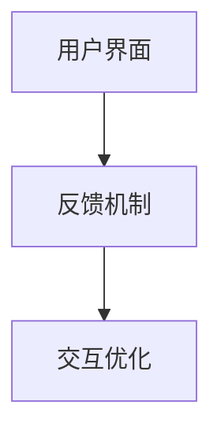

### 6.3 案例分析

#### 应用背景
在某次大型天文观测项目中，研究人员利用机器学习与人机协作技术，对海量观测数据进行分析，以发现新的天文现象。

#### 具体案例
- **项目目标**：分析天文观测数据，发现新的星系演化规律。
- **人类角色**：科学家负责设计实验、制定分析策略，机器学习系统负责数据分析和模型训练。
- **人机协作**：科学家通过机器学习系统提供的分析结果，调整实验设计，提高数据分析的准确性。

#### 结果与影响
通过人机协作，研究人员成功发现了多个新的星系演化规律，极大地提高了天文观测数据的分析效率，为未来的天文研究提供了新的理论支持。这一案例展示了人机协作在科学理论构建中的巨大潜力。

### 总结
人类与机器学习系统的协作，不仅发挥了各自的优势，还提高了科学理论构建的效率和质量。通过人机交互设计，我们可以更好地实现人机协作，为科学研究提供强大的支持。未来，随着技术的不断进步，人机协作将在科学理论构建中发挥更加重要的作用。

----------------------------------------------------------------

## 第七部分：未来展望与挑战

### 7.1 发展趋势

#### 核心概念原理
随着大数据和人工智能技术的不断发展，机器学习在科学理论构建中的应用趋势包括：
- **算法创新**：新的机器学习算法将不断出现，提高数据分析和模型训练的效率。
- **数据驱动**：科学理论构建将越来越依赖于海量数据的分析和挖掘。
- **跨学科融合**：机器学习与其他学科（如物理学、生物学、天文学等）的交叉融合，推动科学理论的发展。

#### 概念属性特征对比表格

| 趋势         | 算法创新 | 数据驱动 | 跨学科融合 |
| ------------ | -------- | -------- | ---------- |
| 功能         | 提高效率 | 提高准确性 | 推动理论进步 |
| 形式         | 新算法、新技术 | 大数据、云计算 | 跨学科合作、整合 |
| 重要性       | 提升研究水平 | 确保数据质量 | 推动科学创新 |

#### Mermaid流程图

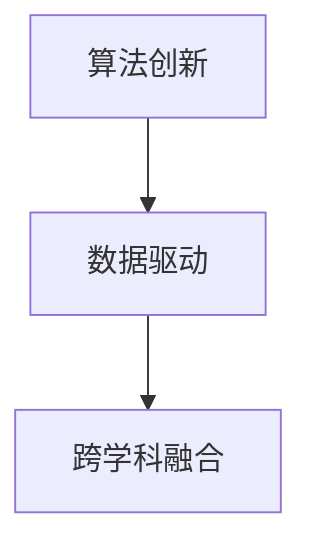

### 7.2 潜在挑战

#### 核心概念原理
尽管机器学习在科学理论构建中具有巨大潜力，但仍面临一系列挑战，包括：
- **数据隐私**：在数据收集和处理过程中，如何保护用户隐私是一个重要问题。
- **算法透明性**：机器学习模型的黑箱特性，导致难以解释和验证其决策过程。
- **计算资源**：大规模数据分析和模型训练需要大量计算资源。

#### 概念属性特征对比表格

| 挑战         | 数据隐私 | 算法透明性 | 计算资源 |
| ------------ | -------- | ---------- | -------- |
| 形式         | 数据加密、隐私保护技术 | 算法可解释性、透明性 | 分布式计算、云计算资源 |
| 重要性       | 确保数据安全 | 提高模型信任度 | 确保计算效率 |

#### Mermaid流程图

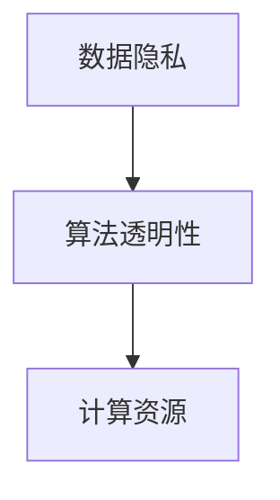

### 7.3 未来研究方向

#### 核心概念原理
未来机器学习在科学理论构建中的应用研究方向包括：
- **可解释性**：研究如何提高机器学习模型的可解释性，使其决策过程更加透明。
- **鲁棒性**：研究如何提高模型对异常数据和噪声的鲁棒性，确保其准确性。
- **跨学科应用**：探索机器学习在更多学科领域的应用，推动跨学科研究的发展。

#### 概念属性特征对比表格

| 研究方向 | 可解释性 | 鲁棒性 | 跨学科应用 |
| -------- | -------- | ------ | ---------- |
| 目标     | 提高模型可解释性 | 提高模型鲁棒性 | 推动跨学科研究 |
| 形式     | 可解释性模型、可视化技术 | 异常检测、噪声过滤 | 跨学科合作项目、整合方法 |
| 重要性   | 提高模型信任度 | 确保模型准确性 | 推动科学创新 |

#### Mermaid流程图

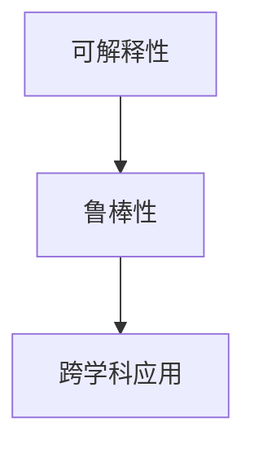

### 总结
机器学习在科学理论构建中的应用具有广阔的前景，但也面临一系列挑战。未来，通过不断的技术创新和跨学科合作，我们可以更好地解决这些问题，推动科学理论的进步。同时，提高模型的透明性和鲁棒性，将使机器学习在科学理论构建中的应用更加可靠和有效。

----------------------------------------------------------------

## 作者信息

**作者：AI天才研究院/AI Genius Institute & 禅与计算机程序设计艺术 /Zen And The Art of Computer Programming**

AI天才研究院致力于推动人工智能领域的创新与发展，专注于人工智能在科学理论构建、数据分析、机器学习等方面的研究和应用。同时，我们重视计算机科学的基础理论，倡导“禅与计算机程序设计艺术”的理念，追求程序设计的简洁、优雅和高效。我们的目标是成为全球领先的人工智能研究机构，为科学进步和社会发展做出重要贡献。

