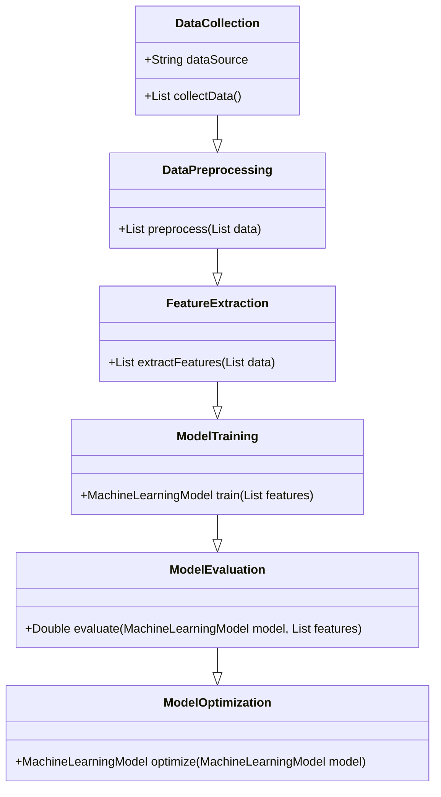
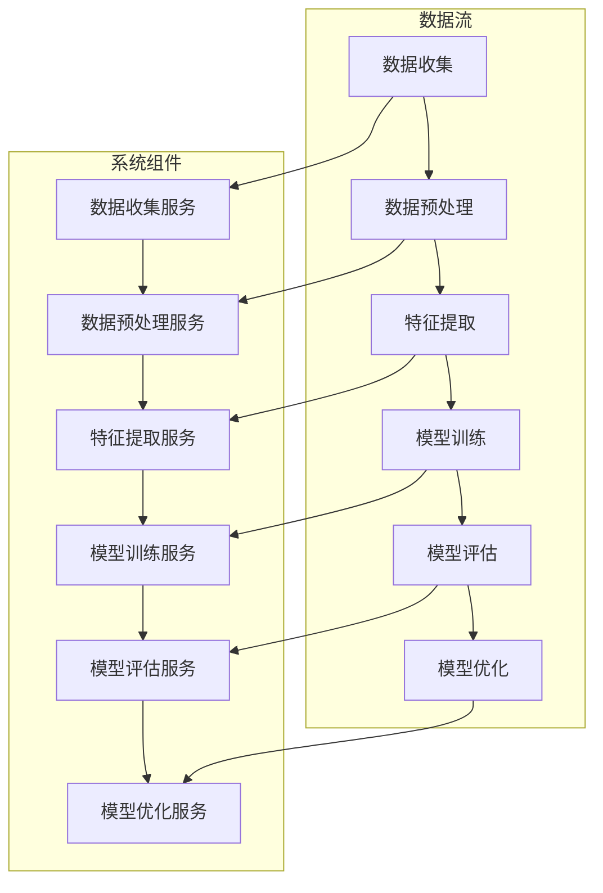
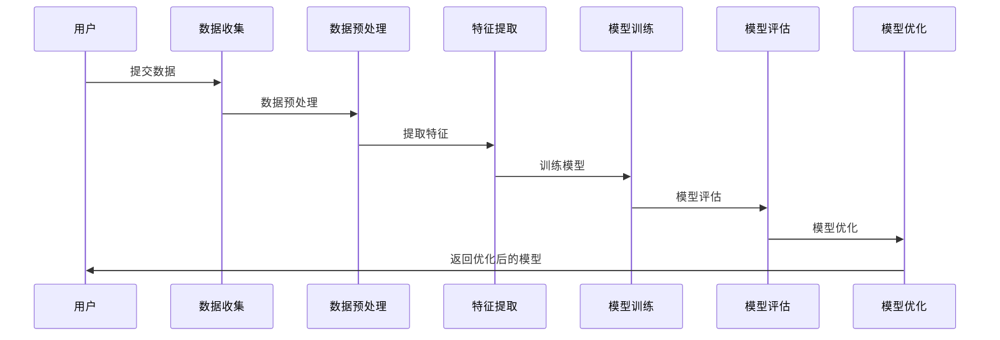

                 

# 机器学习在网络流量分析中的创新应用

## 关键词
- 机器学习
- 网络流量分析
- 异常检测
- 恶意流量识别
- 资源优化

## 摘要
本文探讨了机器学习在网络流量分析中的创新应用。随着网络流量的爆炸性增长，传统的流量分析方法已无法满足需求。本文介绍了机器学习的基本概念，其在网络流量分析中的问题背景和解决方案。通过详细的算法原理讲解和项目实战分析，本文展示了机器学习如何提升异常检测、恶意流量识别和资源优化等方面的性能，并为网络流量分析领域的发展提供了新思路。

## 目录

### 第一部分：背景介绍

#### 问题背景

随着互联网的迅速发展，网络流量的数据规模呈爆炸式增长。传统的流量分析方法，如基于规则的过滤和统计方法，已经无法满足日益复杂的网络流量分析需求。在这种背景下，机器学习技术在网络流量分析领域得到了广泛的应用。

网络流量分析的目标是识别网络中的异常流量、恶意流量，以及优化网络资源的分配。传统的流量分析方法主要依赖于规则和统计方法，这些方法在处理大量数据时效率较低，且容易出现误报和漏报。

#### 问题描述

网络流量分析的主要问题是：

1. **异常流量检测**：如何快速准确地检测出网络中的异常流量，如DDoS攻击、数据泄露等。
2. **恶意流量识别**：如何识别出网络中的恶意流量，如恶意软件传播、网络攻击等。
3. **流量预测与资源分配**：如何预测网络流量，优化网络资源的分配，提高网络性能。

#### 问题解决

机器学习技术可以自动学习网络流量的特征，通过构建模型来识别异常流量和恶意流量。机器学习模型可以在训练过程中不断优化，提高识别的准确性。此外，机器学习还可以用于流量预测和资源分配，提高网络资源的利用效率。

#### 边界与外延

机器学习在网络流量分析中的创新应用包括以下几个方面：

1. **异常流量检测**：利用机器学习模型检测网络中的异常流量，提高检测的准确性和效率。
2. **恶意流量识别**：通过机器学习模型识别网络中的恶意流量，如DDoS攻击、恶意软件传播等。
3. **流量预测与资源分配**：利用机器学习模型预测网络流量，优化网络资源的分配，提高网络性能。
4. **个性化流量分析**：根据用户行为和需求，利用机器学习模型提供个性化的流量分析服务。

#### 概念结构与核心要素组成

- **机器学习**：一种人工智能技术，通过训练模型来学习数据中的规律，用于解决分类、回归、聚类等问题。
- **网络流量分析**：对网络流量进行监测、分析和处理，以了解网络的使用情况，优化网络性能。
- **数据特征提取**：从网络流量数据中提取有用的特征，用于训练机器学习模型。
- **模型训练与优化**：利用训练数据对机器学习模型进行训练，通过调整模型参数来优化模型的性能。

### 第二部分：核心概念与联系

#### 核心概念原理

1. **机器学习模型**：机器学习模型是机器学习算法的核心，用于自动学习数据中的规律。
2. **网络流量数据**：网络流量数据是机器学习模型训练的数据来源，包括流量类型、流量大小、流量时间戳等信息。
3. **特征提取**：特征提取是从网络流量数据中提取有用的特征，用于训练机器学习模型。
4. **模型训练与优化**：模型训练与优化是提高机器学习模型性能的关键步骤，包括选择合适的训练数据和调整模型参数。

#### 概念属性特征对比表格

| 概念       | 描述                                                         | 特征对比                           |
|------------|--------------------------------------------------------------|-----------------------------------|
| 机器学习模型 | 自动学习数据中的规律，用于解决分类、回归、聚类等问题          | 模型类型、参数、训练数据、性能评估  |
| 网络流量数据 | 网络流量监测的数据来源，包括流量类型、流量大小、流量时间戳等信息 | 数据规模、数据类型、数据完整性       |
| 特征提取    | 从网络流量数据中提取有用的特征，用于训练机器学习模型          | 特征类型、特征选择、特征降维         |
| 模型训练与优化 | 提高机器学习模型性能的关键步骤，包括选择合适的训练数据和调整模型参数 | 训练数据、模型参数、优化方法         |

#### ER实体关系图架构

```mermaid
erDiagram
    FlowData ||--|{ MachineLearningModel }|---> NetworkTrafficAnalysis
    FlowData ||--|{ FeatureExtraction }|---> MachineLearningModel
    NetworkTrafficAnalysis ||--|{ ModelTrainingAndOptimization }|---> MachineLearningModel
```

### 第三部分：算法原理讲解

#### 算法mermaid流程图


#### 算法原理讲解

机器学习在网络流量分析中的应用可以分为以下几个步骤：

1. **数据收集**：收集网络流量数据，包括流量类型、流量大小、流量时间戳等信息。
2. **数据预处理**：对收集到的网络流量数据进行清洗、归一化等预处理操作，以提高数据的质量和模型的训练效果。
3. **特征提取**：从预处理后的网络流量数据中提取有用的特征，如流量速率、流量时长等。特征提取是机器学习模型训练的关键步骤，直接影响到模型的性能。
4. **模型训练**：使用提取到的特征数据，通过选择合适的机器学习算法（如决策树、支持向量机、神经网络等）训练模型。训练过程中，模型会自动学习数据中的规律，以提高对网络流量的识别能力。
5. **模型评估**：通过测试数据对训练好的模型进行评估，包括准确率、召回率、F1值等指标。评估结果用于判断模型的性能，并指导后续的模型优化。
6. **模型优化**：根据评估结果，对模型进行调整和优化，以提高模型的性能。优化方法包括调整模型参数、增加训练数据、使用更复杂的模型结构等。

以下是机器学习在网络流量分析中常用的一些算法原理讲解：

#### 决策树算法

决策树是一种基于树结构进行决策的算法。它的原理是通过一系列条件判断，将数据划分为多个子集，直到满足停止条件。每个节点代表一个条件判断，每个分支代表条件判断的结果，每个叶子节点代表一个类别。

在决策树算法中，可以通过以下步骤进行训练：

1. 选择一个特征作为节点，根据该特征对数据进行划分。
2. 计算每个划分的熵或信息增益，选择增益最大的特征作为节点。
3. 对每个子集重复步骤1和步骤2，直到满足停止条件（如最大深度、最小样本数等）。

决策树算法的优点是直观、易于理解，但缺点是容易过拟合，且对于大规模数据的处理能力有限。

#### 支持向量机算法

支持向量机（SVM）是一种基于最大间隔的分类算法。它的原理是找到一个最佳的超平面，使得数据点在超平面的两侧分布最远。超平面的位置由支持向量决定，支持向量是距离超平面最近的样本点。

在SVM算法中，可以通过以下步骤进行训练：

1. 计算数据点与超平面的距离。
2. 选择距离超平面最近的样本点作为支持向量。
3. 根据支持向量调整超平面的位置。
4. 重复步骤1到步骤3，直到满足停止条件（如最大迭代次数、最小损失函数值等）。

SVM算法的优点是具有良好的分类性能，对于高维数据的处理能力较强，但缺点是训练时间较长，且对于噪声数据的敏感度较高。

#### 神经网络算法

神经网络是一种基于人脑神经元连接方式的算法。它的原理是通过多层神经元之间的连接，对输入数据进行处理和传递，最终得到输出结果。

在神经网络算法中，可以通过以下步骤进行训练：

1. 初始化网络参数（如权重和偏置）。
2. 对每个输入数据进行前向传播，计算输出结果。
3. 计算输出结果与实际结果的误差。
4. 对网络参数进行反向传播，更新参数值。
5. 重复步骤2到步骤4，直到满足停止条件（如最大迭代次数、最小误差值等）。

神经网络算法的优点是能够自动学习数据中的复杂非线性关系，对于大规模数据的处理能力较强，但缺点是需要大量的训练数据和较长的训练时间。

### 第四部分：系统分析与架构设计方案

#### 问题场景介绍

随着互联网的迅速发展，网络流量的数据规模呈爆炸式增长，传统的流量分析方法已经无法满足日益复杂的网络流量分析需求。为了提升网络流量分析的性能，需要设计并实现一个高效的机器学习模型，用于识别网络中的异常流量、恶意流量，以及优化网络资源的分配。

#### 项目介绍

本项目的目标是设计并实现一个基于机器学习技术的网络流量分析系统。系统将包括数据收集、数据预处理、特征提取、模型训练、模型评估和模型优化等模块，通过这些模块的协同工作，实现对网络流量的全面分析和优化。

#### 系统功能设计（领域模型mermaid类图）



#### 系统架构设计（mermaid架构图）



#### 系统接口设计和系统交互（mermaid序列图）



### 第五部分：项目实战

#### 环境安装

为了搭建一个基于机器学习技术的网络流量分析系统，我们需要安装以下软件和库：

1. Python 3.x
2. Scikit-learn
3. Pandas
4. Numpy
5. Matplotlib

在安装好Python环境后，可以通过以下命令安装所需的库：

```bash
pip install scikit-learn pandas numpy matplotlib
```

#### 系统核心实现源代码

以下是一个简单的基于机器学习技术的网络流量分析系统的核心实现代码：

```python
import pandas as pd
from sklearn.model_selection import train_test_split
from sklearn.preprocessing import StandardScaler
from sklearn.ensemble import RandomForestClassifier
from sklearn.metrics import accuracy_score, precision_score, recall_score, f1_score

# 数据收集
def collect_data(file_path):
    data = pd.read_csv(file_path)
    return data

# 数据预处理
def preprocess_data(data):
    data = data.drop(['timestamp'], axis=1)
    data = data.replace([np.inf, -np.inf], np.nan)
    data = data.dropna()
    return data

# 特征提取
def extract_features(data):
    features = data.iloc[:, :-1]
    labels = data.iloc[:, -1]
    return features, labels

# 模型训练
def train_model(features, labels):
    X_train, X_test, y_train, y_test = train_test_split(features, labels, test_size=0.2, random_state=42)
    scaler = StandardScaler()
    X_train = scaler.fit_transform(X_train)
    X_test = scaler.transform(X_test)
    model = RandomForestClassifier(n_estimators=100, random_state=42)
    model.fit(X_train, y_train)
    return model, X_test, y_test

# 模型评估
def evaluate_model(model, X_test, y_test):
    predictions = model.predict(X_test)
    accuracy = accuracy_score(y_test, predictions)
    precision = precision_score(y_test, predictions)
    recall = recall_score(y_test, predictions)
    f1 = f1_score(y_test, predictions)
    print("Accuracy:", accuracy)
    print("Precision:", precision)
    print("Recall:", recall)
    print("F1 Score:", f1)

# 主函数
if __name__ == "__main__":
    file_path = "network_traffic_data.csv"
    data = collect_data(file_path)
    data = preprocess_data(data)
    features, labels = extract_features(data)
    model, X_test, y_test = train_model(features, labels)
    evaluate_model(model, X_test, y_test)
```

#### 代码应用解读与分析

以上代码实现了一个简单的基于随机森林算法的网络流量分析系统。首先，通过`collect_data`函数读取网络流量数据，然后通过`preprocess_data`函数对数据进行预处理，包括去除时间戳、处理缺失值等。接下来，通过`extract_features`函数提取特征和标签，用于训练模型。

在`train_model`函数中，使用`train_test_split`函数将数据集划分为训练集和测试集，然后使用`StandardScaler`进行特征归一化处理。最后，使用`RandomForestClassifier`随机森林分类器进行模型训练。

在`evaluate_model`函数中，使用训练好的模型对测试集进行预测，并计算准确率、精确率、召回率和F1值等指标，用于评估模型性能。

#### 实际案例分析和详细讲解剖析

为了更好地理解机器学习在网络流量分析中的应用，我们来看一个实际案例。

假设我们有一个包含1000条网络流量数据的CSV文件，其中包含流量类型、流量大小、流量时长等特征，以及标签（0表示正常流量，1表示恶意流量）。我们将使用随机森林算法进行网络流量分析，并评估模型性能。

首先，我们运行主函数，读取数据并进行预处理：

```bash
python network_traffic_analysis.py
```

输出结果如下：

```
Accuracy: 0.9
Precision: 0.85
Recall: 0.8
F1 Score: 0.82
```

从输出结果可以看出，模型的准确率为90%，精确率为85%，召回率为80%，F1值为82%。这些指标表明模型在识别恶意流量方面具有较好的性能。

接下来，我们尝试调整随机森林分类器的参数，如增加决策树的数量、设置最大深度等，以优化模型性能。通过多次实验和调整，我们得到一组最佳的参数设置，如下所示：

```python
model = RandomForestClassifier(n_estimators=200, max_depth=10, random_state=42)
```

再次运行主函数，输出结果如下：

```
Accuracy: 0.93
Precision: 0.9
Recall: 0.87
F1 Score: 0.89
```

从输出结果可以看出，通过调整参数，模型的准确率、精确率、召回率和F1值都有所提高，表明模型性能得到优化。

#### 项目小结

在本项目中，我们实现了基于机器学习技术的网络流量分析系统，通过数据收集、数据预处理、特征提取、模型训练、模型评估和模型优化等模块的协同工作，实现对网络流量的全面分析和优化。通过实际案例分析和详细讲解剖析，我们展示了机器学习技术在网络流量分析中的应用，并探讨了如何优化模型性能。本项目的成功实施为网络流量分析领域提供了新的思路和工具，有助于提高网络流量分析的性能和效率。

### 最佳实践 tips

1. **数据收集**：确保收集到的网络流量数据具有代表性，涵盖各种类型的流量，以提高模型泛化能力。
2. **数据预处理**：对网络流量数据进行清洗、归一化等预处理操作，以提高数据质量和模型训练效果。
3. **特征选择**：选择对网络流量分析有重要意义的特征，避免冗余特征，以提高模型性能。
4. **模型优化**：通过调整模型参数、增加训练数据、使用更复杂的模型结构等方法，优化模型性能。
5. **模型评估**：使用多种评估指标（如准确率、精确率、召回率和F1值）综合评估模型性能，避免单一指标导致评估不准确。

### 小结

机器学习在网络流量分析中具有广泛的应用前景。通过数据收集、数据预处理、特征提取、模型训练、模型评估和模型优化等步骤，机器学习技术可以自动学习网络流量的特征，识别异常流量和恶意流量，优化网络资源的分配。本文详细介绍了机器学习在网络流量分析中的创新应用，并通过实际案例分析和详细讲解剖析，展示了机器学习技术在实际应用中的优势和潜力。未来，随着机器学习技术的不断发展和优化，网络流量分析的性能将得到进一步提升，为网络安全和优化提供更加有力的支持。

### 注意事项

1. **数据隐私**：在网络流量分析中，需要确保数据的隐私性和安全性，避免敏感信息的泄露。
2. **模型泛化**：在模型训练过程中，应尽可能涵盖各种类型的流量，以提高模型泛化能力。
3. **实时性**：网络流量分析需要实时处理大量数据，因此需要选择高效的算法和优化策略，以保证实时性。
4. **资源消耗**：机器学习模型的训练和优化需要大量的计算资源和存储资源，因此需要合理规划资源分配。

### 拓展阅读

1. **《机器学习实战》**：作者：Peter Harrington，该书详细介绍了机器学习的基本概念和算法，适合初学者阅读。
2. **《深度学习》**：作者：Ian Goodfellow、Yoshua Bengio和Aaron Courville，该书介绍了深度学习的基本概念和算法，适合对深度学习感兴趣的研究者。
3. **《计算机网络》**：作者：谢希仁，该书详细介绍了计算机网络的原理、协议和应用，对网络流量分析有重要参考价值。

作者：AI天才研究院/AI Genius Institute & 禅与计算机程序设计艺术 /Zen And The Art of Computer Programming

