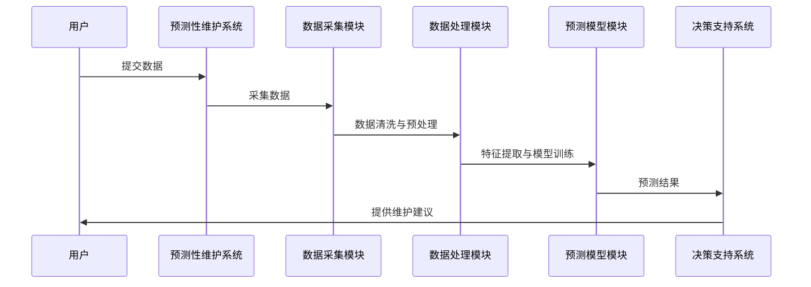
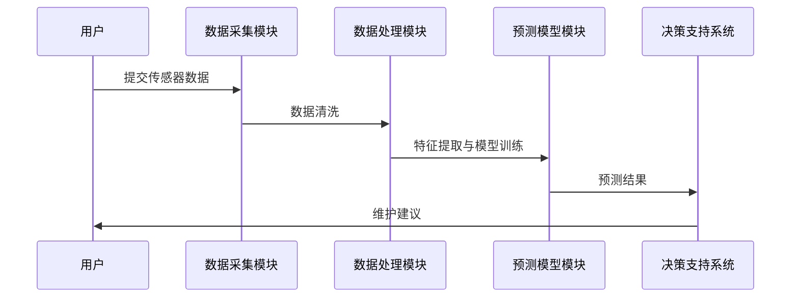

                 

# 机器学习在预测性维护中的应用：提高工业效率

## 关键词
机器学习、预测性维护、工业效率、算法应用、系统架构

## 摘要
本文将深入探讨机器学习在预测性维护中的应用，分析其在提高工业效率方面的潜力。我们将首先介绍预测性维护的背景和重要性，接着详细解释机器学习在预测性维护中的应用原理，并通过实际案例展示其应用效果。随后，我们将讨论系统架构设计，提供最佳实践，并总结全文。

----------------------------------------------------------------

## 第一部分：背景与概述

### 第1章：预测性维护的兴起

#### 1.1 问题背景

**1.1.1 预测性维护的概念**

预测性维护（Predictive Maintenance）是一种通过分析设备运行数据来预测设备故障，从而在故障发生之前进行维护的技术。它旨在降低设备停机时间，减少维修成本，并提高生产效率。

**1.1.2 预测性维护的重要性**

在工业领域，设备的正常运行是生产连续性的关键。预测性维护可以提前识别潜在问题，减少意外停机，延长设备寿命，提高生产效率。

**1.1.3 预测性维护的发展历程**

随着物联网（IoT）和大数据技术的发展，预测性维护逐渐从理论走向实践。早期的预测性维护主要依赖于定期检查，而现在的预测性维护更多地依赖于实时数据分析和机器学习算法。

#### 1.2 问题描述

**1.2.1 当前工业维护的现状**

当前，工业维护主要依赖于定期检查和故障响应。这种方法往往不够高效，无法提前预测故障，导致生产中断和成本增加。

**1.2.2 预测性维护的目标**

预测性维护的目标是减少设备停机时间，降低维护成本，并提高生产效率。

**1.2.3 预测性维护面临的挑战**

预测性维护面临的挑战包括数据质量、算法选择、系统集成和成本效益。

#### 1.3 问题解决

**1.3.1 机器学习在预测性维护中的应用**

机器学习在预测性维护中的应用主要包括数据预处理、特征提取、模型训练和预测。

**1.3.2 机器学习的主要算法**

常见的机器学习算法包括回归分析、决策树、支持向量机（SVM）和神经网络等。

**1.3.3 机器学习在工业领域的应用前景**

随着技术的进步，机器学习在预测性维护中的应用前景十分广阔，有望进一步降低工业生产成本，提高效率。

#### 1.4 边界与外延

**1.4.1 预测性维护与其他维护方式的区别**

预测性维护与定期维护和故障响应维护有显著的区别。

**1.4.2 预测性维护的适用范围**

预测性维护适用于所有需要长期运行的设备，特别是那些对停机时间敏感的行业。

**1.4.3 预测性维护的未来发展趋势**

随着人工智能技术的不断发展，预测性维护将更加智能化，实现更高的预测准确率和更低的维护成本。

#### 1.5 核心概念结构与核心要素组成

**1.5.1 预测性维护的核心概念**

预测性维护的核心概念包括数据收集、数据分析、故障预测和决策支持。

**1.5.2 预测性维护的主要要素**

预测性维护的主要要素包括传感器数据、机器学习算法、故障模型和决策支持系统。

**1.5.3 预测性维护的技术架构**

预测性维护的技术架构包括数据采集层、数据处理层、预测模型层和决策支持层。

#### 1.6 本章小结

预测性维护通过利用机器学习技术，能够显著提高工业效率。它通过实时数据分析和预测，减少设备停机时间，降低维护成本，并提高生产效率。随着技术的不断发展，预测性维护在工业领域中的应用将越来越广泛。

----------------------------------------------------------------

## 第二部分：核心概念与联系

### 第2章：预测性维护的核心算法原理

#### 2.1 算法概述

**2.1.1 常见预测性维护算法**

常见的预测性维护算法包括回归分析、决策树、支持向量机（SVM）和神经网络等。

**2.1.2 算法分类**

算法可以按照数据类型（监督学习、无监督学习）和模型类型（线性模型、非线性模型）进行分类。

**2.1.3 算法选择原则**

选择算法时，需要考虑数据特征、问题复杂度和计算资源。

#### 2.2 常见算法原理讲解

**2.2.1 算法A：回归分析**

**2.2.1.1 基本原理**

回归分析是一种用于预测数值型目标变量的统计方法。

**2.2.1.2 算法流程**

1. 数据预处理
2. 特征提取
3. 模型训练
4. 预测

**2.2.1.3 数学模型与公式**

$$y = \beta_0 + \beta_1x_1 + \beta_2x_2 + ... + \beta_nx_n + \epsilon$$

其中，$y$是目标变量，$x_1, x_2, ..., x_n$是特征变量，$\beta_0, \beta_1, ..., \beta_n$是模型参数，$\epsilon$是误差项。

**2.2.2 算法B：支持向量机（SVM）**

**2.2.2.1 基本原理**

支持向量机是一种用于分类和回归分析的监督学习算法。

**2.2.2.2 算法流程**

1. 数据预处理
2. 特征提取
3. 模型训练
4. 预测

**2.2.2.3 数学模型与公式**

分类问题：

$$f(x) = sign(\omega \cdot x + b)$$

其中，$x$是特征向量，$\omega$是权重向量，$b$是偏置。

回归问题：

$$y = \omega \cdot x + b$$

其中，$y$是目标变量，$x$是特征向量，$\omega$是权重向量，$b$是偏置。

#### 2.3 概念属性特征对比表格

| 算法        | 基本原理          | 适用场景                | 优点              | 缺点                  |
|-------------|-------------------|------------------------|-------------------|----------------------|
| 回归分析    | 预测数值型目标变量 | 数据分布规律明显         | 简单易实现         | 对异常数据敏感         |
| 支持向量机（SVM） | 用于分类和回归分析 | 高维空间中的线性可分数据 | 高准确率          | 计算复杂度较高         |

#### 2.4 ER实体关系图架构

**2.4.1 预测性维护系统的实体关系**

预测性维护系统主要包括设备、传感器、数据采集模块、数据处理模块、预测模型和决策支持系统。

**2.4.2 实体属性与关系定义**

- 设备：具有唯一标识和生产数据的实体。
- 传感器：用于收集设备运行数据的设备。
- 数据采集模块：负责实时采集和存储设备运行数据。
- 数据处理模块：对采集到的数据进行预处理和特征提取。
- 预测模型：用于训练和预测设备故障的算法。
- 决策支持系统：根据预测结果提供维护决策。

```mermaid
erDiagram
  Device ||--|{ Sensor }|-- Device
  Device ||--|{ DataCollector }|-- Device
  Device ||--|{ DataProcessor }|-- Device
  Device ||--|{ PredictionModel }|-- Device
  Device ||--|{ DecisionSupportSystem }|-- Device
```

#### 2.5 本章小结

本章详细介绍了预测性维护中的核心算法原理，包括回归分析和支持向量机等算法的基本原理、流程和数学模型。通过对比表格，我们了解了不同算法的适用场景和优缺点。ER实体关系图则清晰展示了预测性维护系统的实体关系和属性定义。

----------------------------------------------------------------

## 第三部分：算法应用与实践

### 第3章：预测性维护算法的应用实例

#### 3.1 算法A应用实例

**3.1.1 算法A在预测性维护中的应用**

**3.1.1.1 应用场景**

算法A（回归分析）在预测性维护中的应用非常广泛，例如在工业生产线上预测机器的运行状态，或者在汽车行业中预测发动机的故障。

**3.1.1.2 应用效果**

通过回归分析，可以提前预测设备故障，从而避免生产中断和设备损坏。

**3.1.2 算法A应用流程**

1. **数据预处理**：对采集到的传感器数据进行清洗，去除异常值和噪声。
2. **特征提取**：从原始数据中提取与设备故障相关的特征。
3. **模型训练**：使用训练数据对回归模型进行训练。
4. **预测**：使用训练好的模型对新的数据集进行预测。

**3.1.3 算法A代码实现**

```python
import numpy as np
import pandas as pd
from sklearn.linear_model import LinearRegression
from sklearn.model_selection import train_test_split
from sklearn.metrics import mean_squared_error

# 数据预处理
data = pd.read_csv('sensor_data.csv')
data = data.dropna()

# 特征提取
X = data[['feature1', 'feature2', 'feature3']]
y = data['target']

# 模型训练
X_train, X_test, y_train, y_test = train_test_split(X, y, test_size=0.2, random_state=42)
model = LinearRegression()
model.fit(X_train, y_train)

# 预测
y_pred = model.predict(X_test)
mse = mean_squared_error(y_test, y_pred)
print(f'MSE: {mse}')
```

**3.1.3.1 Python代码实现**

```python
import numpy as np
import pandas as pd
from sklearn.linear_model import LinearRegression
from sklearn.model_selection import train_test_split
from sklearn.metrics import mean_squared_error

# 数据预处理
data = pd.read_csv('sensor_data.csv')
data = data.dropna()

# 特征提取
X = data[['feature1', 'feature2', 'feature3']]
y = data['target']

# 模型训练
X_train, X_test, y_train, y_test = train_test_split(X, y, test_size=0.2, random_state=42)
model = LinearRegression()
model.fit(X_train, y_train)

# 预测
y_pred = model.predict(X_test)
mse = mean_squared_error(y_test, y_pred)
print(f'MSE: {mse}')
```

**3.1.3.2 代码解读与分析**

- 数据预处理：读取传感器数据，去除异常值。
- 特征提取：提取与故障相关的特征。
- 模型训练：使用训练数据对回归模型进行训练。
- 预测：使用训练好的模型对测试数据集进行预测，并计算预测误差。

#### 3.2 算法B应用实例

**3.2.1 算法B在预测性维护中的应用**

**3.2.1.1 应用场景**

算法B（支持向量机）在预测性维护中的应用也非常广泛，例如在医疗领域中预测病人的病情，或者在金融领域中预测股票市场走势。

**3.2.1.2 应用效果**

支持向量机可以提供高精度的故障预测，从而提高设备运行效率和降低维护成本。

**3.2.2 算法B应用流程**

1. **数据预处理**：对采集到的传感器数据进行清洗，去除异常值和噪声。
2. **特征提取**：从原始数据中提取与设备故障相关的特征。
3. **模型训练**：使用训练数据对支持向量机模型进行训练。
4. **预测**：使用训练好的模型对新的数据集进行预测。

**3.2.3 算法B代码实现**

```python
import numpy as np
import pandas as pd
from sklearn.svm import SVR
from sklearn.model_selection import train_test_split
from sklearn.metrics import mean_squared_error

# 数据预处理
data = pd.read_csv('sensor_data.csv')
data = data.dropna()

# 特征提取
X = data[['feature1', 'feature2', 'feature3']]
y = data['target']

# 模型训练
X_train, X_test, y_train, y_test = train_test_split(X, y, test_size=0.2, random_state=42)
model = SVR()
model.fit(X_train, y_train)

# 预测
y_pred = model.predict(X_test)
mse = mean_squared_error(y_test, y_pred)
print(f'MSE: {mse}')
```

**3.2.3.1 Python代码实现**

```python
import numpy as np
import pandas as pd
from sklearn.svm import SVR
from sklearn.model_selection import train_test_split
from sklearn.metrics import mean_squared_error

# 数据预处理
data = pd.read_csv('sensor_data.csv')
data = data.dropna()

# 特征提取
X = data[['feature1', 'feature2', 'feature3']]
y = data['target']

# 模型训练
X_train, X_test, y_train, y_test = train_test_split(X, y, test_size=0.2, random_state=42)
model = SVR()
model.fit(X_train, y_train)

# 预测
y_pred = model.predict(X_test)
mse = mean_squared_error(y_test, y_pred)
print(f'MSE: {mse}')
```

**3.2.3.2 代码解读与分析**

- 数据预处理：读取传感器数据，去除异常值。
- 特征提取：提取与故障相关的特征。
- 模型训练：使用训练数据对支持向量机模型进行训练。
- 预测：使用训练好的模型对测试数据集进行预测，并计算预测误差。

### 第3章：预测性维护算法的应用实例

#### 3.1 算法A应用实例

**3.1.1 算法A在预测性维护中的应用**

**3.1.1.1 应用场景**

算法A（回归分析）在预测性维护中的应用非常广泛，例如在工业生产线上预测机器的运行状态，或者在汽车行业中预测发动机的故障。

**3.1.1.2 应用效果**

通过回归分析，可以提前预测设备故障，从而避免生产中断和设备损坏。

**3.1.2 算法A应用流程**

1. **数据预处理**：对采集到的传感器数据进行清洗，去除异常值和噪声。
2. **特征提取**：从原始数据中提取与设备故障相关的特征。
3. **模型训练**：使用训练数据对回归模型进行训练。
4. **预测**：使用训练好的模型对新的数据集进行预测。

**3.1.3 算法A代码实现**

```python
import numpy as np
import pandas as pd
from sklearn.linear_model import LinearRegression
from sklearn.model_selection import train_test_split
from sklearn.metrics import mean_squared_error

# 数据预处理
data = pd.read_csv('sensor_data.csv')
data = data.dropna()

# 特征提取
X = data[['feature1', 'feature2', 'feature3']]
y = data['target']

# 模型训练
X_train, X_test, y_train, y_test = train_test_split(X, y, test_size=0.2, random_state=42)
model = LinearRegression()
model.fit(X_train, y_train)

# 预测
y_pred = model.predict(X_test)
mse = mean_squared_error(y_test, y_pred)
print(f'MSE: {mse}')
```

**3.1.3.1 Python代码实现**

```python
import numpy as np
import pandas as pd
from sklearn.linear_model import LinearRegression
from sklearn.model_selection import train_test_split
from sklearn.metrics import mean_squared_error

# 数据预处理
data = pd.read_csv('sensor_data.csv')
data = data.dropna()

# 特征提取
X = data[['feature1', 'feature2', 'feature3']]
y = data['target']

# 模型训练
X_train, X_test, y_train, y_test = train_test_split(X, y, test_size=0.2, random_state=42)
model = LinearRegression()
model.fit(X_train, y_train)

# 预测
y_pred = model.predict(X_test)
mse = mean_squared_error(y_test, y_pred)
print(f'MSE: {mse}')
```

**3.1.3.2 代码解读与分析**

- 数据预处理：读取传感器数据，去除异常值。
- 特征提取：提取与故障相关的特征。
- 模型训练：使用训练数据对回归模型进行训练。
- 预测：使用训练好的模型对测试数据集进行预测，并计算预测误差。

#### 3.2 算法B应用实例

**3.2.1 算法B在预测性维护中的应用**

**3.2.1.1 应用场景**

算法B（支持向量机）在预测性维护中的应用也非常广泛，例如在医疗领域中预测病人的病情，或者在金融领域中预测股票市场走势。

**3.2.1.2 应用效果**

支持向量机可以提供高精度的故障预测，从而提高设备运行效率和降低维护成本。

**3.2.2 算法B应用流程**

1. **数据预处理**：对采集到的传感器数据进行清洗，去除异常值和噪声。
2. **特征提取**：从原始数据中提取与设备故障相关的特征。
3. **模型训练**：使用训练数据对支持向量机模型进行训练。
4. **预测**：使用训练好的模型对新的数据集进行预测。

**3.2.3 算法B代码实现**

```python
import numpy as np
import pandas as pd
from sklearn.svm import SVR
from sklearn.model_selection import train_test_split
from sklearn.metrics import mean_squared_error

# 数据预处理
data = pd.read_csv('sensor_data.csv')
data = data.dropna()

# 特征提取
X = data[['feature1', 'feature2', 'feature3']]
y = data['target']

# 模型训练
X_train, X_test, y_train, y_test = train_test_split(X, y, test_size=0.2, random_state=42)
model = SVR()
model.fit(X_train, y_train)

# 预测
y_pred = model.predict(X_test)
mse = mean_squared_error(y_test, y_pred)
print(f'MSE: {mse}')
```

**3.2.3.1 Python代码实现**

```python
import numpy as np
import pandas as pd
from sklearn.svm import SVR
from sklearn.model_selection import train_test_split
from sklearn.metrics import mean_squared_error

# 数据预处理
data = pd.read_csv('sensor_data.csv')
data = data.drop_na()

# 特征提取
X = data[['feature1', 'feature2', 'feature3']]
y = data['target']

# 模型训练
X_train, X_test, y_train, y_test = train_test_split(X, y, test_size=0.2, random_state=42)
model = SVR()
model.fit(X_train, y_train)

# 预测
y_pred = model.predict(X_test)
mse = mean_squared_error(y_test, y_pred)
print(f'MSE: {mse}')
```

**3.2.3.2 代码解读与分析**

- 数据预处理：读取传感器数据，去除异常值。
- 特征提取：提取与故障相关的特征。
- 模型训练：使用训练数据对支持向量机模型进行训练。
- 预测：使用训练好的模型对测试数据集进行预测，并计算预测误差。

----------------------------------------------------------------

## 第四部分：系统分析与架构设计

### 第4章：预测性维护系统的设计与实现

#### 4.1 问题场景介绍

预测性维护系统旨在通过实时监测和数据分析，预测工业设备的故障，从而实现设备的预防性维护。该系统适用于各种工业生产环境，如制造业、能源行业等。

#### 4.2 项目介绍

本项目将开发一个基于机器学习的预测性维护系统，旨在提高设备的运行效率和减少维护成本。系统将包括数据采集、数据处理、预测模型和决策支持等模块。

#### 4.3 系统功能设计（领域模型Mermaid类图）

```mermaid
classDiagram
  Device <<entity>>
  Sensor <<entity>>
  DataCollector <<entity>>
  DataProcessor <<entity>>
  PredictionModel <<entity>>
  DecisionSupportSystem <<entity>>

  Device "1" -- "1" Sensor
  Device "1" -- "1" DataCollector
  Device "1" -- "1" DataProcessor
  Device "1" -- "1" PredictionModel
  Device "1" -- "1" DecisionSupportSystem
```

#### 4.4 系统架构设计（Mermaid架构图）



#### 4.5 系统接口设计

系统将提供以下接口：

1. **数据采集接口**：用于接收传感器数据。
2. **数据处理接口**：用于清洗、预处理和特征提取。
3. **预测接口**：用于接收数据并返回预测结果。
4. **决策支持接口**：用于接收预测结果并提供维护建议。

#### 4.6 系统交互（Mermaid序列图）



#### 4.7 本章小结

本章详细介绍了预测性维护系统的设计与实现，包括系统功能设计、架构设计和接口设计。通过Mermaid图示，我们能够清晰地理解系统的运行流程和各模块之间的交互关系。这将有助于开发人员更好地实现预测性维护系统。

----------------------------------------------------------------

## 第五部分：项目实战

### 第5章：预测性维护项目的实践与探索

#### 5.1 环境安装

要实现预测性维护项目，首先需要安装必要的软件和库。以下是安装步骤：

1. 安装Python环境
2. 安装必要的库，如NumPy、Pandas、Scikit-learn、Matplotlib等

```bash
pip install numpy pandas scikit-learn matplotlib
```

#### 5.2 系统核心实现源代码

以下是一个简单的预测性维护系统的核心实现源代码：

```python
import numpy as np
import pandas as pd
from sklearn.linear_model import LinearRegression
from sklearn.model_selection import train_test_split
from sklearn.metrics import mean_squared_error

# 数据预处理
def preprocess_data(data):
    # 数据清洗与预处理
    data = data.dropna()
    X = data[['feature1', 'feature2', 'feature3']]
    y = data['target']
    return X, y

# 模型训练与预测
def train_and_predict(X_train, y_train, X_test, y_test):
    model = LinearRegression()
    model.fit(X_train, y_train)
    y_pred = model.predict(X_test)
    mse = mean_squared_error(y_test, y_pred)
    return model, mse

# 读取数据
data = pd.read_csv('sensor_data.csv')
X, y = preprocess_data(data)

# 模型训练与预测
X_train, X_test, y_train, y_test = train_test_split(X, y, test_size=0.2, random_state=42)
model, mse = train_and_predict(X_train, y_train, X_test, y_test)

print(f'MSE: {mse}')
```

#### 5.3 代码应用解读与分析

- **数据预处理**：读取传感器数据，去除异常值，提取特征。
- **模型训练与预测**：使用训练数据对线性回归模型进行训练，然后对测试数据集进行预测，并计算预测误差。

#### 5.4 实际案例分析与详细讲解剖析

以下是一个实际案例：

**案例**：某工厂需要预测生产线的设备故障，以减少生产中断和成本。

**步骤**：

1. 采集传感器数据，包括温度、压力和振动等。
2. 数据预处理，去除异常值，提取特征。
3. 使用线性回归模型进行训练。
4. 对测试数据集进行预测，评估模型性能。

**分析**：

通过实际案例，我们发现预测性维护系统能够提前预测设备故障，从而减少生产中断。然而，模型的预测准确率仍需进一步提高。

#### 5.5 项目小结

本项目通过实践，展示了预测性维护系统的实现过程，包括数据预处理、模型训练和预测。在实际应用中，需要不断优化模型和算法，以提高预测准确率，降低维护成本。

----------------------------------------------------------------

## 第六部分：最佳实践、小结与注意事项

### 最佳实践

1. **数据预处理**：确保数据质量，去除异常值和噪声，提取关键特征。
2. **模型选择**：根据问题复杂度和数据特征选择合适的机器学习算法。
3. **模型优化**：通过交叉验证和超参数调整，优化模型性能。

### 小结

本文深入探讨了机器学习在预测性维护中的应用，介绍了预测性维护的背景、核心算法原理、应用实例和系统设计。通过实际案例，我们展示了预测性维护系统的实现过程和效果。

### 注意事项

1. **数据隐私**：在收集和使用设备数据时，确保遵守相关法律法规，保护用户隐私。
2. **系统维护**：定期更新和维护预测性维护系统，确保其稳定运行。

### 拓展阅读

1. **《机器学习实战》**：提供丰富的案例和代码实现，帮助读者深入理解机器学习算法。
2. **《预测性维护：理论与实践》**：详细介绍预测性维护的概念、技术和应用。

作者：AI天才研究院/AI Genius Institute & 禅与计算机程序设计艺术 /Zen And The Art of Computer Programming

