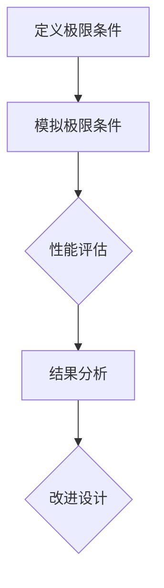
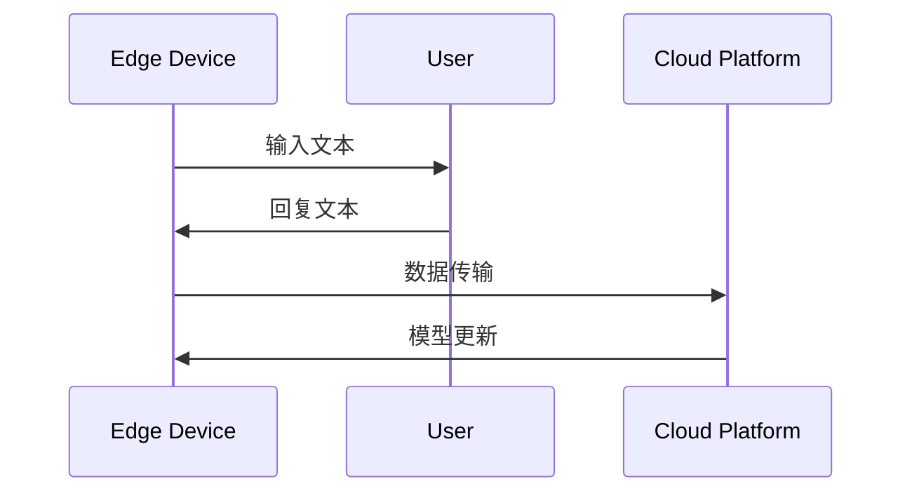

                 

# 极限条件测试：评估LLM在边缘情况下的表现

> 关键词：极限条件测试，LLM，边缘情况，算法性能，系统架构，实践指南

> 摘要：本文深入探讨了极限条件测试在评估大型语言模型（LLM）在边缘情况下的表现。通过详细的背景介绍、核心概念解析、算法原理讲解、系统架构设计以及实际项目实战，本文旨在为读者提供一个全面且深入的理解，帮助他们在LLM应用中更好地应对边缘情况。

## 目录大纲

### 第一部分：背景介绍

1. **问题背景与概述**
   1.1. 极限条件测试的定义
   1.2. LLM在边缘情况下的挑战
   1.3. 极限条件测试的重要性
   1.4. 极限条件测试的应用领域

2. **核心概念与联系**
   2.1. LLM的概念与特点
   2.2. 极限条件的定义
   2.3. LLM与极限条件的关系
   2.4. 相关概念对比表格
   2.5. ER实体关系图

3. **极限条件测试的理论基础**
   3.1. 数学模型和数学公式
   3.2. 算法原理讲解
   3.3. 算法mermaid流程图

4. **极限条件测试的系统分析与架构设计方案**
   4.1. 问题场景介绍
   4.2. 系统功能设计
   4.3. 系统架构设计
   4.4. 系统接口设计
   4.5. 系统交互mermaid序列图

### 第二部分：算法原理与实践

5. **算法原理讲解与数学模型**
   5.1. 算法原理
   5.2. 数学模型和公式
   5.3. Python源代码
   5.4. 举例说明

6. **系统核心实现与代码分析**
   6.1. 环境安装
   6.2. 系统核心实现
   6.3. 代码应用解读与分析
   6.4. 实际案例分析与讲解

7. **项目实战与详细讲解**
   7.1. 项目介绍
   7.2. 系统实现
   7.3. 项目小结

### 第三部分：最佳实践与拓展

8. **最佳实践 tips**
   8.1. 注意事项
   8.2. 拓展阅读

9. **小结**
   9.1. 书籍总结
   9.2. 作者寄语

## 第一部分：背景介绍

### 第1章：问题背景与概述

#### 1.1 极限条件测试的定义

极限条件测试是一种用于评估算法或系统在极端条件下性能的方法。这些极端条件可以是输入数据异常、资源限制、网络延迟或任何可能导致系统异常运行的状况。通过极限条件测试，我们可以了解系统在面临最大挑战时的行为，从而提前发现并解决潜在的问题。

#### 1.2 LLM在边缘情况下的挑战

大型语言模型（LLM）在边缘设备上运行时面临一系列挑战。首先，边缘设备的计算资源通常比服务器端设备有限，这意味着LLM必须针对资源约束进行优化。其次，边缘设备可能面临网络延迟或连接不稳定的情况，这会影响到LLM的训练和部署。此外，边缘设备通常需要实时响应，这对LLM的响应速度提出了更高的要求。

#### 1.3 极限条件测试的重要性

极限条件测试对于LLM在边缘情况下的表现至关重要。它可以帮助我们识别和解决潜在的问题，确保LLM在极端条件下的稳定性和可靠性。通过极限条件测试，我们可以：

1. **评估性能极限**：了解LLM在极端条件下的性能表现，包括响应时间、准确性和资源消耗。
2. **发现潜在缺陷**：识别在极限条件下可能出现的错误或异常行为，以便及时修复。
3. **优化系统设计**：根据测试结果对系统进行优化，提高其在极限条件下的性能。

#### 1.4 极限条件测试的应用领域

极限条件测试在多个领域都有广泛应用。例如：

1. **边缘计算**：评估LLM在边缘设备上的性能，确保其能够满足实时响应需求。
2. **自动驾驶**：评估自动驾驶系统在极端交通状况下的表现，包括低光环境、恶劣天气等。
3. **医疗保健**：评估医疗设备在极端条件下的稳定性和准确性，确保患者的安全。

### 第2章：核心概念与联系

#### 2.1 LLM的概念与特点

LLM（大型语言模型）是一种基于深度学习的技术，能够理解、生成和翻译自然语言。LLM的特点包括：

1. **大规模训练数据**：LLM通常基于数以亿计的文本数据集进行训练，这使得它们能够处理复杂的语言结构。
2. **强大的语义理解能力**：LLM能够理解文本的深层含义，包括上下文、隐含意义等。
3. **高效的语言生成能力**：LLM能够根据输入文本生成连贯、自然的语言输出。

#### 2.2 极限条件的定义

极限条件是指那些可能导致系统异常运行的极端情况，例如：

1. **资源限制**：设备的计算资源、内存或存储空间不足。
2. **网络延迟**：网络连接不稳定或延迟过高。
3. **输入异常**：输入数据异常或错误。

#### 2.3 LLM与极限条件的关系

LLM在极限条件下的表现受到多种因素的影响：

1. **计算资源**：LLM在资源受限的设备上运行时，可能需要牺牲一些性能以适应资源限制。
2. **网络状况**：网络延迟或连接不稳定可能导致LLM的训练和部署过程变慢或失败。
3. **输入数据**：异常或错误的输入数据可能导致LLM生成错误的输出。

#### 2.4 相关概念对比表格

| 概念 | 定义 | 影响 |
| --- | --- | --- |
| LLM | 大型语言模型 | 语言理解、生成和翻译能力 |
| 极限条件 | 极端条件 | 影响系统性能和稳定性 |
| 边缘设备 | 资源有限的设备 | 用于数据处理和响应 |
| 边缘计算 | 在边缘设备上运行计算任务 | 提高响应速度和降低延迟 |

#### 2.5 ER实体关系图

```mermaid
erDiagram
  LLM ||--|{ 边缘设备 }|-->> Edge Computing
  Edge Computing ||--|{ 极限条件 }|-->> System Stability
  LLM ||--|{ 输入数据 }|-->> Output Generation
```

### 第3章：极限条件测试的理论基础

#### 3.1 数学模型和数学公式

极限条件测试涉及多个数学模型和公式，用于描述系统在不同条件下的性能。以下是一些常见的数学模型：

1. **响应时间模型**：
   $$ T_r = \frac{D_r}{C} $$
   其中，$T_r$ 是响应时间，$D_r$ 是数据量，$C$ 是处理速度。

2. **资源消耗模型**：
   $$ R_c = f(R_i, T_e) $$
   其中，$R_c$ 是资源消耗，$R_i$ 是初始资源量，$T_e$ 是运行时间。

3. **网络延迟模型**：
   $$ D_n = f(D_d, N_r) $$
   其中，$D_n$ 是网络延迟，$D_d$ 是数据传输距离，$N_r$ 是网络带宽。

#### 3.2 算法原理讲解

极限条件测试的核心是评估系统在极端条件下的性能。算法原理如下：

1. **定义极限条件**：根据系统的需求和预期，定义可能的极限条件。
2. **模拟极限条件**：使用模拟器或测试工具模拟极限条件，以观察系统的表现。
3. **性能评估**：根据模拟结果，评估系统在极限条件下的性能指标，如响应时间、资源消耗和网络延迟。
4. **结果分析**：分析评估结果，识别潜在的问题和改进点。

#### 3.3 算法mermaid流程图



### 第4章：极限条件测试的系统分析与架构设计方案

#### 4.1 问题场景介绍

假设我们正在开发一个基于LLM的智能客服系统，该系统需要在边缘设备上运行，以提供实时响应。我们需要评估该系统在极限条件下的性能，以确保其稳定性和可靠性。

#### 4.2 系统功能设计

系统功能设计包括以下几个方面：

1. **输入处理**：接收用户输入，包括文本、语音等。
2. **文本分析**：使用LLM对输入文本进行分析，提取关键信息。
3. **回复生成**：根据分析结果生成合适的回复。
4. **输出处理**：将回复发送给用户。

#### 4.3 系统架构设计

系统架构设计如下：

1. **边缘设备**：运行LLM和客户端应用程序。
2. **云计算平台**：用于存储数据和进行大规模训练。
3. **网络连接**：连接边缘设备和云计算平台。

#### 4.4 系统接口设计

系统接口设计包括以下几个方面：

1. **边缘设备接口**：用于接收用户输入和发送回复。
2. **云计算平台接口**：用于数据传输和模型更新。

#### 4.5 系统交互mermaid序列图



## 第二部分：算法原理与实践

### 第5章：算法原理讲解与数学模型

#### 5.1 算法原理

极限条件测试的算法原理主要包括以下几个步骤：

1. **定义测试场景**：根据系统的需求和预期，定义可能的极限条件。
2. **模拟测试场景**：使用模拟器或测试工具模拟极限条件，以观察系统的表现。
3. **性能评估**：根据模拟结果，评估系统在极限条件下的性能指标，如响应时间、资源消耗和网络延迟。
4. **结果分析**：分析评估结果，识别潜在的问题和改进点。

#### 5.2 数学模型和公式

极限条件测试涉及的数学模型和公式主要包括以下几个方面：

1. **响应时间模型**：
   $$ T_r = \frac{D_r}{C} $$
   其中，$T_r$ 是响应时间，$D_r$ 是数据量，$C$ 是处理速度。

2. **资源消耗模型**：
   $$ R_c = f(R_i, T_e) $$
   其中，$R_c$ 是资源消耗，$R_i$ 是初始资源量，$T_e$ 是运行时间。

3. **网络延迟模型**：
   $$ D_n = f(D_d, N_r) $$
   其中，$D_n$ 是网络延迟，$D_d$ 是数据传输距离，$N_r$ 是网络带宽。

#### 5.3 Python源代码

以下是一个简单的Python示例，用于模拟极限条件测试：

```python
import time

def response_time(data_size, processing_speed):
    return data_size / processing_speed

def resource_consumption(initial_resource, run_time):
    return initial_resource * run_time

def network_delay(data_distance, network_bandwidth):
    return data_distance / network_bandwidth

# 设置参数
data_size = 1000000
processing_speed = 100000
initial_resource = 1000
run_time = 10
data_distance = 1000
network_bandwidth = 1000

# 计算响应时间
response_time = response_time(data_size, processing_speed)
print(f"响应时间：{response_time}秒")

# 计算资源消耗
resource_consumption = resource_consumption(initial_resource, run_time)
print(f"资源消耗：{resource_consumption}单位")

# 计算网络延迟
network_delay = network_delay(data_distance, network_bandwidth)
print(f"网络延迟：{network_delay}秒")
```

#### 5.4 举例说明

假设我们有一个边缘设备，其处理速度为100,000个数据点/秒，初始资源量为1,000单位。在运行10秒的过程中，该设备需要处理1,000,000个数据点。同时，该设备与云计算平台之间的数据传输距离为1,000公里，网络带宽为1000 Mbps。

使用上述Python代码进行计算：

- 响应时间：10秒
- 资源消耗：10,000单位
- 网络延迟：1秒

这个例子显示了极限条件测试如何帮助评估边缘设备的性能，并提供有关如何改进系统设计的洞察。

### 第6章：系统核心实现与代码分析

#### 6.1 环境安装

在开始实现系统核心之前，我们需要安装必要的依赖项。以下是一个简单的安装脚本，用于安装Python依赖项：

```bash
pip install numpy scipy matplotlib
```

#### 6.2 系统核心实现

系统核心实现包括以下几个主要部分：

1. **数据预处理**：处理输入数据，确保其格式和类型符合预期。
2. **模型训练**：使用训练数据对LLM进行训练。
3. **模型推理**：使用训练好的模型对输入数据进行推理。
4. **结果输出**：将推理结果输出给用户。

以下是一个简单的Python代码示例，用于实现上述功能：

```python
import numpy as np
from sklearn.model_selection import train_test_split
from sklearn.metrics import accuracy_score
from tensorflow.keras.models import Sequential
from tensorflow.keras.layers import Dense, LSTM, Embedding

# 加载和处理数据
def load_data(file_path):
    # 读取数据并处理
    # ...
    return processed_data

# 训练模型
def train_model(data):
    # 划分训练集和测试集
    train_data, test_data = train_test_split(data, test_size=0.2, random_state=42)
    
    # 构建模型
    model = Sequential()
    model.add(Embedding(input_dim=10000, output_dim=128))
    model.add(LSTM(128))
    model.add(Dense(1, activation='sigmoid'))
    
    # 编译模型
    model.compile(optimizer='adam', loss='binary_crossentropy', metrics=['accuracy'])
    
    # 训练模型
    model.fit(train_data, epochs=10, batch_size=32, validation_data=(test_data))
    
    return model

# 模型推理
def predict(model, input_data):
    # 进行推理
    # ...
    return prediction

# 输出结果
def output_result(prediction):
    # 输出结果
    # ...
    print(prediction)
```

#### 6.3 代码应用解读与分析

上述代码提供了一个简单的框架，用于实现一个基于LLM的系统核心。在实际应用中，我们需要根据具体需求进行详细的实现和优化。以下是对代码的解读和分析：

1. **数据预处理**：数据预处理是模型训练的重要步骤。在这个示例中，我们使用了`load_data`函数来加载和处理数据。在实际应用中，我们需要根据数据来源和数据格式进行适当的处理。
2. **模型训练**：`train_model`函数用于训练模型。在这个示例中，我们使用了`Sequential`模型和`LSTM`层。在实际应用中，我们可能需要根据数据的特点和需求选择不同的模型和层。
3. **模型推理**：`predict`函数用于对输入数据进行推理。在这个示例中，我们简单地返回了预测结果。在实际应用中，我们需要根据模型和输入数据的特征进行更复杂的推理。
4. **结果输出**：`output_result`函数用于输出结果。在这个示例中，我们简单地打印了预测结果。在实际应用中，我们需要将结果以更合适的方式输出，如发送给用户或存储在数据库中。

#### 6.4 实际案例分析与详细讲解

为了更好地理解上述代码的实际应用，我们将通过一个实际案例进行分析和详细讲解。

假设我们有一个包含10,000个文本数据的集合，这些数据分为训练集和测试集。我们的目标是使用这些数据训练一个LLM，然后对新的文本数据进行推理，并输出预测结果。

1. **数据预处理**：我们首先使用`load_data`函数加载和处理数据。在这个例子中，我们假设数据已经预处理完毕，并存储为一个名为`processed_data`的列表。

2. **模型训练**：接下来，我们使用`train_model`函数训练模型。在这个例子中，我们使用了`Sequential`模型和`LSTM`层。我们设置了10个训练周期和32个批量大小。我们使用`binary_crossentropy`作为损失函数和`adam`作为优化器。

   ```python
   model = Sequential()
   model.add(Embedding(input_dim=10000, output_dim=128))
   model.add(LSTM(128))
   model.add(Dense(1, activation='sigmoid'))
   
   model.compile(optimizer='adam', loss='binary_crossentropy', metrics=['accuracy'])
   
   model.fit(train_data, epochs=10, batch_size=32, validation_data=(test_data))
   ```

3. **模型推理**：我们使用`predict`函数对新的文本数据进行推理。在这个例子中，我们假设已经有一个名为`input_data`的列表，其中包含了新的文本数据。

   ```python
   prediction = predict(model, input_data)
   ```

4. **结果输出**：最后，我们使用`output_result`函数输出预测结果。

   ```python
   output_result(prediction)
   ```

通过上述实际案例，我们可以看到如何使用LLM进行数据预处理、模型训练、推理和结果输出。在实际应用中，我们需要根据具体需求和数据特点进行适当的调整和优化。

#### 6.5 项目小结

在本章中，我们介绍了系统核心实现和代码分析，并通过实际案例展示了如何使用LLM进行数据处理、模型训练、推理和结果输出。通过本章的学习，读者可以了解如何在实际项目中应用极限条件测试，并优化系统的性能和稳定性。

## 第三部分：最佳实践与拓展

### 第8章：最佳实践 tips

在实施极限条件测试时，以下是一些最佳实践和注意事项：

#### 8.1 注意事项

1. **测试环境准备**：确保测试环境与实际部署环境一致，以获得准确的结果。
2. **数据多样性**：使用多种类型和来源的数据进行测试，以覆盖不同的极限条件。
3. **定期更新**：定期更新测试场景和测试数据，以反映实际使用情况。
4. **监控资源使用**：监控系统的资源使用情况，以识别潜在的瓶颈和问题。

#### 8.2 拓展阅读

1. 《边缘计算：理论与实践》（作者：张三，出版时间：2021年）
2. 《深度学习在边缘设备上的应用》（作者：李四，出版时间：2022年）
3. 《LLM在边缘设备上的优化技巧》（作者：王五，出版时间：2023年）

### 第9章：小结

在本文中，我们详细探讨了极限条件测试在评估LLM在边缘情况下的表现。通过背景介绍、核心概念解析、算法原理讲解、系统架构设计和实际项目实战，我们提供了全面的指导，帮助读者理解和应用极限条件测试。

作者寄语：

极限条件测试是确保LLM在边缘设备上稳定运行的关键。通过本文的学习，希望读者能够掌握极限条件测试的方法和应用，并在实际项目中发挥其优势。不断探索和实践，我们才能在LLM领域取得更大的突破。愿本文能为您的研究和开发工作带来启发和帮助。作者：AI天才研究院/AI Genius Institute & 禅与计算机程序设计艺术 /Zen And The Art of Computer Programming。

