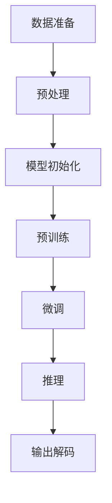
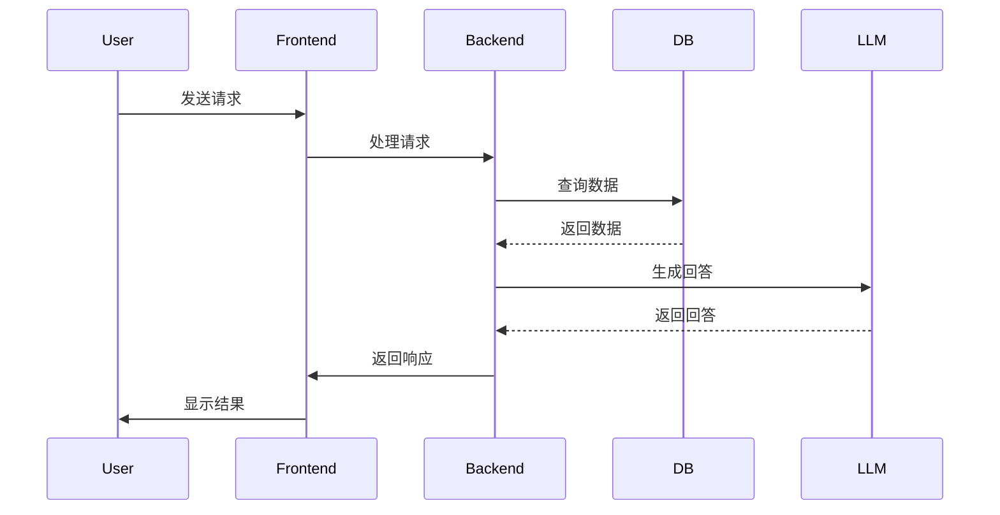

                 

## 第1章：构建LLM应用的产品待办列表：问题背景与核心概念

### 1.1 问题背景

#### 1.1.1 人工智能与自然语言处理的发展

人工智能（Artificial Intelligence，AI）作为计算机科学的重要分支，自20世纪50年代诞生以来，经历了多个发展阶段。特别是进入21世纪，随着计算能力的提升、大数据的积累和深度学习算法的突破，人工智能，尤其是自然语言处理（Natural Language Processing，NLP）技术取得了显著进展。自然语言处理旨在使计算机能够理解、生成和处理人类自然语言，是人工智能领域的一个关键应用方向。

自然语言处理技术的发展，可以追溯到早期的规则驱动的方法，如句法分析、语义分析和机器翻译等。然而，这些方法在处理复杂语言现象时表现有限。随着神经网络和深度学习的兴起，预训练语言模型（如BERT、GPT等）成为自然语言处理的重要工具。这些模型通过大规模文本数据进行预训练，能够自动学习语言的复杂结构，显著提升了自然语言处理的性能。

#### 1.1.2 语言模型在应用中的重要性

语言模型（Language Model，LM）是自然语言处理的核心技术之一。它用于预测文本序列的概率分布，为各种NLP任务提供基础。例如，在文本生成中，语言模型可以帮助生成连贯的自然语言文本；在问答系统中，语言模型可以理解用户的查询并生成相关回答；在机器翻译中，语言模型可以帮助生成目标语言的翻译文本。

语言模型在人工智能应用中的重要性不可忽视。随着人工智能技术的发展，越来越多的应用场景开始依赖于语言模型。例如，智能助手、内容审核、推荐系统、情感分析等，都离不开语言模型的支持。语言模型不仅提高了这些应用的性能，还丰富了用户体验。

#### 1.1.3 构建LLM应用面临的挑战

尽管语言模型在自然语言处理中具有重要应用价值，但构建大规模语言模型（Large Language Model，LLM）应用仍然面临诸多挑战。以下是其中一些主要挑战：

1. **计算资源需求**：大规模语言模型的训练需要大量的计算资源和存储空间。这要求企业在硬件设施上进行大规模投入，例如高性能GPU集群和分布式计算框架。

2. **数据质量和标注**：语言模型的训练依赖于大量的高质量文本数据。然而，获取和标注这些数据是一项复杂且耗时的任务。数据质量直接影响模型的性能和可靠性。

3. **模型优化与调参**：大规模语言模型的优化和调参是一个复杂的过程。需要通过多次实验和迭代，找到最佳的超参数组合，以实现模型的最佳性能。

4. **应用场景适配**：将语言模型应用于特定场景时，需要考虑场景的特殊需求和约束。例如，在问答系统中，需要确保模型能够准确理解用户查询并生成相关回答。

5. **模型解释性与透明度**：大规模语言模型通常被视为“黑盒”，其内部机制难以理解。这使得模型在应用于关键任务时，例如医疗诊断或金融决策，存在一定的风险。提高模型的可解释性是一个重要研究方向。

### 1.2 核心概念

#### 1.2.1 语言模型的基本原理

语言模型是一种概率模型，用于预测下一个词或字符的概率。最简单的语言模型是基于n-gram模型，它假设当前词的概率仅取决于前n个词。然而，这种方法在处理长距离依赖时表现不佳。随着深度学习的兴起，基于神经网络的深度语言模型（如循环神经网络RNN、长短时记忆网络LSTM、Transformer等）成为主流。这些模型能够捕捉长距离依赖，并显著提高语言模型的表现。

#### 1.2.2 预训练语言模型的发展

预训练语言模型（Pre-trained Language Model）是一种先在大量文本上进行预训练，然后再针对特定任务进行微调的语言模型。这种模型通常采用自回归语言模型（Autoregressive Language Model）的形式，例如GPT（Generative Pre-trained Transformer）。预训练语言模型的发展，极大地提升了自然语言处理任务的性能。目前，预训练语言模型已成为NLP领域的标准配置。

#### 1.2.3 大规模语言模型的优势与局限

大规模语言模型在自然语言处理任务中表现出色，具有以下优势：

1. **强大的语言理解能力**：大规模语言模型能够自动学习语言的复杂结构，从而在文本生成、问答、翻译等任务中表现出色。
2. **适应性强**：预训练语言模型可以针对不同任务进行微调，具有较强的适应性。
3. **跨领域应用**：大规模语言模型可以应用于多种领域，如医疗、金融、教育等，实现跨领域的知识迁移。

然而，大规模语言模型也存在一些局限：

1. **计算资源需求大**：训练大规模语言模型需要大量的计算资源和存储空间，对企业的硬件设施要求较高。
2. **数据隐私与安全性**：大规模语言模型依赖于大量文本数据进行训练，可能涉及用户隐私数据，需要考虑数据隐私和安全问题。
3. **可解释性差**：大规模语言模型通常被视为“黑盒”，其内部机制难以理解，可能影响模型在关键任务中的应用。

### 1.3 背景与边界

#### 1.3.1 语言模型的应用领域

语言模型在多个领域具有广泛应用，主要包括：

1. **文本生成**：包括文章、故事、诗歌等自然语言文本的生成。
2. **问答系统**：通过理解用户查询并生成相关回答，实现智能问答。
3. **机器翻译**：将一种语言的文本翻译成另一种语言。
4. **情感分析**：对文本进行情感倾向分析，例如情感极性分类。
5. **内容审核**：用于识别和处理不当内容，如暴力、色情等。
6. **推荐系统**：用于个性化推荐，如商品推荐、新闻推荐等。

#### 1.3.2 构建LLM应用的流程

构建大规模语言模型应用涉及多个步骤，主要包括：

1. **数据收集与预处理**：收集大量高质量文本数据，并进行预处理，如分词、去噪等。
2. **模型选择与训练**：选择适合的语言模型并进行训练，通常采用预训练加微调的方法。
3. **模型评估与优化**：通过评估指标对模型进行评估和优化，如BLEU、ROUGE等。
4. **模型部署与维护**：将模型部署到生产环境，并进行持续维护和更新。

#### 1.3.3 本书结构安排与内容概述

本书将系统地介绍构建大规模语言模型应用的各个方面，包括：

1. **语言模型原理与特征对比**：详细介绍语言模型的基本原理、特征对比及在LLM中的应用。
2. **算法原理与讲解**：深入讲解大规模语言模型算法原理、数学模型及具体实现。
3. **系统分析与架构设计**：介绍LLM应用系统的设计与架构方案，包括功能设计、系统架构、接口设计等。
4. **项目实战**：通过具体项目实例，展示大规模语言模型应用的实现过程和关键技巧。

通过本书的阅读，读者将能够全面了解大规模语言模型应用的设计与实现，为实际项目提供有力支持。

### 1.4 本章小结

本章介绍了构建大规模语言模型应用的问题背景和核心概念，包括人工智能与自然语言处理的发展、语言模型在应用中的重要性以及构建LLM应用面临的挑战。同时，详细阐述了语言模型的基本原理、预训练语言模型的发展以及大规模语言模型的优势与局限。本章还介绍了语言模型的应用领域、构建LLM应用的流程以及本书的结构安排。通过对本章内容的理解，读者将为后续章节的学习打下坚实基础。在接下来的章节中，我们将进一步深入探讨语言模型的具体实现和系统架构设计，帮助读者全面掌握构建大规模语言模型应用的要点。

## 第2章：语言模型原理与特征对比

### 2.1 语言模型原理

语言模型（Language Model，LM）是一种用于预测文本序列概率分布的模型，是自然语言处理（NLP）的核心技术之一。其基本原理是利用已有文本数据，通过统计和学习文本中的词汇、短语和语法规则，来预测下一个词或字符的概率。以下是语言模型的基本原理和组成部分：

#### 2.1.1 语言模型的定义

语言模型是一种概率模型，其目的是预测给定输入序列后继序列的概率分布。简单来说，就是给定一个单词序列，语言模型可以预测下一个单词的概率。

#### 2.1.2 语言模型的基础算法

语言模型的基础算法主要包括n-gram模型和神经网络模型。

1. **n-gram模型**：n-gram模型是一种基于统计的模型，它假设一个词的概率仅取决于它前面的n-1个词。例如，二元语法模型（Bigram）考虑了当前词和前一个词之间的关系，三元语法模型（Trigram）则考虑了前两个词。n-gram模型简单易实现，但无法捕捉长距离依赖。

2. **神经网络模型**：随着深度学习的兴起，神经网络模型（如循环神经网络RNN、长短时记忆网络LSTM、Transformer等）逐渐取代了n-gram模型。这些模型能够通过多层神经网络结构捕捉长距离依赖，显著提升了语言模型的表现。特别是Transformer模型，通过自注意力机制（Self-Attention）实现了对文本序列的全面理解。

#### 2.1.3 语言模型的评估指标

语言模型的评估指标主要包括：

1. **交叉熵（Cross-Entropy）**：交叉熵是衡量模型预测结果与真实结果差异的指标，值越小表示模型预测越准确。

2. **词错误率（Word Error Rate，WER）**：在语音识别任务中，词错误率用于评估模型识别结果的准确性。

3. **符号错误率（Symbol Error Rate，SER）**：在字符识别任务中，符号错误率用于评估模型识别结果的准确性。

4. **准确率（Accuracy）**：用于评估模型分类任务的准确性，值越高表示模型分类效果越好。

### 2.2 语言模型特征对比

语言模型具有多种类型，每种模型都有其独特的特征和优缺点。以下是几种常见语言模型特征的对比：

#### 2.2.1 语言模型的特征对比表格

| 模型类型 | 特点 | 优点 | 缺点 |
| :--: | :--: | :--: | :--: |
| n-gram模型 | 简单，基于统计 | 易实现，计算效率高 | 无法捕捉长距离依赖 |
| RNN模型 | 简单，基于神经网络 | 可以捕捉长距离依赖 | 容易出现梯度消失或爆炸问题 |
| LSTM模型 | 复杂，基于RNN改进 | 可以有效捕捉长距离依赖 | 计算量大，参数复杂 |
| Transformer模型 | 复杂，基于自注意力机制 | 可以高效捕捉长距离依赖，计算效率高 | 参数量巨大，训练难度大 |

#### 2.2.2 语言模型的优缺点分析

1. **n-gram模型**：

   - **优点**：简单、易实现，对短距离依赖处理较好。
   - **缺点**：无法捕捉长距离依赖，对于复杂语言现象表现较差。

2. **RNN模型**：

   - **优点**：可以捕捉长距离依赖，适用于序列数据处理。
   - **缺点**：容易出现梯度消失或爆炸问题，训练不稳定。

3. **LSTM模型**：

   - **优点**：解决了RNN模型的梯度消失问题，可以更好地捕捉长距离依赖。
   - **缺点**：计算量大，参数复杂，训练时间较长。

4. **Transformer模型**：

   - **优点**：基于自注意力机制，可以高效捕捉长距离依赖，计算效率高；适用于大规模文本数据处理。
   - **缺点**：参数量巨大，训练难度大，对计算资源要求高。

### 2.3 语言模型在LLM中的应用

语言模型在构建大规模语言模型（LLM）应用中扮演着核心角色，其主要应用包括：

#### 2.3.1 语言模型在文本生成中的应用

文本生成是语言模型的重要应用之一。通过语言模型，可以生成连贯、自然的文本。例如，在生成文章、故事、新闻报道等方面，语言模型能够根据已有的文本数据，生成符合语法和语义规则的文本。

#### 2.3.2 语言模型在问答系统中的应用

问答系统是语言模型在智能客服、智能助手等场景中的典型应用。语言模型可以理解用户的查询，并根据预训练的知识库生成相关回答。例如，在智能客服中，语言模型可以自动回答用户的问题，提高客服效率。

#### 2.3.3 语言模型在自然语言理解中的应用

自然语言理解（Natural Language Understanding，NLU）是语言模型在智能语音助手、文本分析等场景中的应用。通过语言模型，可以理解用户的意图、提取关键词、分类文本等，为后续的智能处理提供支持。

### 2.4 本章小结

本章详细介绍了语言模型的基本原理、特征对比以及在LLM中的应用。通过对语言模型原理的理解，读者可以更好地把握不同类型语言模型的特点和优缺点，为后续的算法讲解和系统设计奠定基础。在接下来的章节中，我们将进一步探讨大规模语言模型算法的原理和实现，帮助读者深入理解LLM的核心技术。

## 第3章：大规模语言模型算法原理与流程

### 3.1 大规模语言模型算法原理

大规模语言模型（Large Language Model，LLM）算法的核心在于通过深度学习模型对自然语言数据进行大规模预训练，从而学习到语言的复杂结构和语义信息。以下是大规模语言模型算法的主要原理：

#### 3.1.1 语言模型中的神经网络

大规模语言模型通常基于神经网络（Neural Network，NN）架构，其中最常用的网络类型包括循环神经网络（Recurrent Neural Network，RNN）、长短时记忆网络（Long Short-Term Memory，LSTM）和Transformer模型。

1. **RNN模型**：RNN模型是语言模型的基础，通过循环结构来处理序列数据。RNN模型能够捕捉到序列中的长距离依赖关系。

2. **LSTM模型**：LSTM模型是RNN的一种改进，通过引入记忆单元，解决了传统RNN在处理长序列时容易出现的梯度消失问题。LSTM模型在自然语言处理任务中表现出色。

3. **Transformer模型**：Transformer模型是近年来在自然语言处理领域取得突破性进展的模型。它采用自注意力机制（Self-Attention），能够同时处理序列中的所有词，从而捕捉长距离依赖关系。

#### 3.1.2 大规模语言模型的训练

大规模语言模型的训练是一个复杂的过程，通常分为以下几个步骤：

1. **数据准备**：首先需要收集和准备大量高质量的文本数据。这些数据可以是互联网上的文本、书籍、新闻、论文等。

2. **预处理**：对收集到的文本数据进行处理，包括分词、去噪、格式化等步骤。预处理后的数据将被用于模型的训练。

3. **模型初始化**：初始化神经网络模型，包括设置模型参数和超参数。模型的初始化对训练效果有很大影响。

4. **预训练**：在预训练阶段，模型将在大规模文本数据上进行训练。预训练的目的是让模型学习到语言的通用结构和语义信息。

5. **微调**：在预训练完成后，模型将被微调以适应特定任务。例如，在文本生成任务中，模型将被训练来生成连贯的文本；在问答系统中，模型将被训练来理解用户的查询并生成相关回答。

#### 3.1.3 语言模型的推理过程

大规模语言模型的推理过程是指在给定输入序列时，模型如何生成预测输出。以下是语言模型推理的基本步骤：

1. **输入编码**：将输入文本序列转换为模型可以处理的格式。对于基于Transformer的模型，输入文本通常会被编码为词向量。

2. **前向传播**：将输入编码传递到神经网络模型中，通过多层神经网络进行计算。

3. **输出解码**：模型输出一个概率分布，表示每个单词或字符的概率。通过解码器（如采样、贪心解码等），模型生成最终的输出文本。

### 3.2 算法讲解与流程图

为了更好地理解大规模语言模型算法，我们使用mermaid流程图来描述其基本流程。以下是一个简单的mermaid流程图示例：



- **A[数据准备]**：收集和准备大量文本数据。
- **B[预处理]**：对文本数据进行分词、去噪、格式化等预处理。
- **C[模型初始化]**：初始化神经网络模型，包括设置模型参数和超参数。
- **D[预训练]**：在预训练阶段，模型将在大规模文本数据上进行训练。
- **E[微调]**：在预训练完成后，模型将被微调以适应特定任务。
- **F[推理]**：模型在给定输入文本时进行推理，生成预测输出。
- **G[输出解码]**：将模型的输出解码为可读的文本。

### 3.3 数学模型与公式

大规模语言模型中的数学模型主要包括神经网络模型的权重更新和损失函数。以下是这些数学模型的详细解释：

#### 3.3.1 语言模型中的数学模型

1. **神经网络权重更新**：

   神经网络模型通过反向传播算法来更新权重。假设我们有输入序列 \(x_1, x_2, ..., x_T\)，对应的输出序列为 \(y_1, y_2, ..., y_T\)。神经网络的输出概率分布为 \(P(y_t|x_1, x_2, ..., x_T)\)。损失函数为交叉熵（Cross-Entropy），定义如下：

   $$L = -\sum_{t=1}^T y_t \log P(y_t|x_1, x_2, ..., x_T)$$

   反向传播算法通过计算梯度，更新神经网络中的权重：

   $$\frac{\partial L}{\partial W} = \frac{\partial L}{\partial z} \frac{\partial z}{\partial W}$$

2. **长短时记忆网络（LSTM）**：

   LSTM模型通过引入记忆单元来处理长距离依赖。LSTM单元包含输入门、遗忘门和输出门，用于控制信息的流动。其数学模型如下：

   $$i_t = \sigma(W_i \cdot [h_{t-1}, x_t] + b_i)$$
   $$f_t = \sigma(W_f \cdot [h_{t-1}, x_t] + b_f)$$
   $$g_t = \tanh(W_g \cdot [h_{t-1}, x_t] + b_g)$$
   $$o_t = \sigma(W_o \cdot [h_{t-1}, x_t] + b_o)$$
   $$h_t = o_t \cdot \tanh(c_t)$$
   $$c_t = f_t \cdot c_{t-1} + i_t \cdot g_t$$

   其中，\(i_t\)、\(f_t\)、\(g_t\)、\(o_t\) 分别为输入门、遗忘门、生成门和输出门；\(h_t\) 和 \(c_t\) 分别为隐藏状态和细胞状态。

#### 3.3.2 公式详细解释与应用

1. **交叉熵（Cross-Entropy）**：

   交叉熵是衡量模型预测结果与真实结果差异的指标，值越小表示模型预测越准确。其公式如下：

   $$L = -\sum_{t=1}^T y_t \log P(y_t|x_1, x_2, ..., x_T)$$

   其中，\(y_t\) 为真实标签，\(P(y_t|x_1, x_2, ..., x_T)\) 为模型预测的概率分布。

2. **长短时记忆网络（LSTM）**：

   LSTM通过控制信息的流动来处理长距离依赖。其关键在于三个门控机制：输入门、遗忘门和输出门。这些门控机制通过一系列非线性函数来实现。以下是一个典型的LSTM单元的数学模型：

   $$i_t = \sigma(W_i \cdot [h_{t-1}, x_t] + b_i)$$
   $$f_t = \sigma(W_f \cdot [h_{t-1}, x_t] + b_f)$$
   $$g_t = \tanh(W_g \cdot [h_{t-1}, x_t] + b_g)$$
   $$o_t = \sigma(W_o \cdot [h_{t-1}, x_t] + b_o)$$
   $$h_t = o_t \cdot \tanh(c_t)$$
   $$c_t = f_t \cdot c_{t-1} + i_t \cdot g_t$$

   其中，\(i_t\)、\(f_t\)、\(g_t\)、\(o_t\) 分别为输入门、遗忘门、生成门和输出门；\(h_t\) 和 \(c_t\) 分别为隐藏状态和细胞状态。

### 3.4 举例说明

为了更好地理解大规模语言模型算法的原理，我们通过一个简单的实例来展示算法的应用。

#### 3.4.1 实例分析

假设我们有一个二元语法模型（Bigram），其输入为两个单词 "Hello" 和 "World"，我们需要预测下一个单词。

1. **输入序列**： "Hello" 和 "World"。
2. **模型预测**：根据二元语法模型，下一个单词的概率分布为：
   - "!"：0.4
   - "..."：0.3
   - "..."：0.2
   - "..."：0.1。
3. **输出解码**：根据概率分布，我们选择概率最高的单词 "!" 作为预测结果。

#### 3.4.2 算法应用场景举例

大规模语言模型在多种自然语言处理任务中都有广泛应用。以下是一些典型的应用场景：

1. **文本生成**：通过语言模型生成连贯、自然的文本。例如，生成文章、故事、新闻报道等。
2. **问答系统**：通过语言模型理解用户的查询，并生成相关回答。例如，智能客服、智能助手等。
3. **机器翻译**：通过语言模型将一种语言的文本翻译成另一种语言。
4. **情感分析**：通过语言模型对文本进行情感倾向分析，例如情感极性分类。

### 3.5 本章小结

本章详细介绍了大规模语言模型算法的原理和流程。首先，我们介绍了神经网络在语言模型中的应用，包括RNN、LSTM和Transformer模型。然后，我们讲解了大规模语言模型的训练过程和推理过程，并使用mermaid流程图进行了详细描述。接着，我们探讨了语言模型中的数学模型和公式，并举例说明了算法在实际应用中的具体实现。通过本章的学习，读者可以全面理解大规模语言模型算法的核心原理和实现方法，为后续章节的深入学习打下坚实基础。

## 第4章：LLM应用系统设计与架构方案

### 4.1 问题场景介绍

在现代人工智能应用中，大规模语言模型（LLM）被广泛应用于多种场景，如智能客服、内容审核、智能助手、自然语言理解等。然而，构建一个高效、可靠的LLM应用系统并非易事。在实际应用中，LLM应用面临诸多挑战，包括计算资源需求、数据质量、模型优化、场景适配等。因此，系统设计与架构方案的合理性和可行性至关重要。

#### 4.1.1 LLM应用的实际需求

1. **高性能计算**：大规模语言模型的训练和推理需要强大的计算资源，特别是在处理复杂任务时，需要高效的GPU集群和分布式计算框架。
2. **数据质量与标注**：高质量的数据是构建有效LLM的基础。然而，数据的收集、清洗、标注等过程复杂且耗时，需要专业的团队和工具支持。
3. **模型优化与调参**：大规模语言模型的优化和调参是一个复杂的过程，需要通过多次实验和迭代，找到最佳的超参数组合，以实现模型的最佳性能。
4. **应用场景适配**：不同的应用场景对语言模型有特定的需求。例如，在智能客服中，需要模型能够理解用户意图并生成合适的回答；在内容审核中，需要模型能够识别和处理不当内容。
5. **模型解释性与透明度**：大规模语言模型通常被视为“黑盒”，其内部机制难以理解，可能影响模型在关键任务中的应用。提高模型的可解释性是一个重要研究方向。

#### 4.1.2 LLM应用的关键问题

1. **计算资源瓶颈**：大规模语言模型的训练和推理对计算资源的需求巨大，如何高效利用现有资源成为一个关键问题。
2. **数据隐私与安全性**：大规模语言模型依赖于大量文本数据进行训练，可能涉及用户隐私数据，需要考虑数据隐私和安全问题。
3. **模型可解释性**：如何提高大规模语言模型的可解释性，使其在关键任务中的应用更加透明和可靠。
4. **实时性能优化**：如何在保证模型性能的同时，实现实时响应和高效处理。
5. **跨领域应用**：如何使大规模语言模型适应不同领域和应用场景，实现跨领域的知识迁移。

### 4.2 项目介绍

#### 4.2.1 项目背景

本项目的目标是构建一个高效、可靠的大规模语言模型（LLM）应用系统，应用于智能客服领域。智能客服是现代企业服务的重要组成部分，通过自动化回答用户问题，提高客户服务效率，降低人力成本。然而，传统的智能客服系统在处理复杂问题时表现不佳，难以满足用户需求。本项目旨在通过大规模语言模型，实现智能客服系统的升级和优化。

#### 4.2.2 项目目标

1. **构建高效的语言模型**：通过大规模预训练和优化，构建一个具有高准确性和良好性能的语言模型。
2. **优化系统性能**：通过分布式计算和实时优化，提高系统的响应速度和处理能力。
3. **保障数据安全与隐私**：确保在数据收集、存储和处理过程中，严格遵守数据隐私和安全规范。
4. **提高用户体验**：通过自然语言理解和生成，实现智能客服系统的个性化、智能化服务，提升用户体验。

### 4.3 系统功能设计

系统功能设计是构建LLM应用系统的核心环节，决定了系统的功能完备性和用户体验。以下是本项目系统功能设计的详细内容：

#### 4.3.1 领域模型类图

为了清晰地描述系统功能，我们使用mermaid类图来表示系统的领域模型。以下是一个简单的mermaid类图示例：

```mermaid
classDiagram
    Client <- CustomerService
    CustomerService o-- Ticket
    CustomerService o-- Question
    CustomerService o-- Answer
    CustomerService o-- Chat
    Ticket o-- TicketStatus
    TicketStatus o-- OPEN
    TicketStatus o-- CLOSE
```

- **Client**（客户端）：代表与智能客服交互的用户。
- **CustomerService**（客服系统）：代表智能客服的核心功能模块。
- **Ticket**（工单）：表示用户提交的问题或请求。
- **Question**（问题）：表示用户提出的问题。
- **Answer**（回答）：表示客服系统生成的回答。
- **Chat**（聊天）：表示用户与客服系统的实时对话。
- **TicketStatus**（工单状态）：表示工单的处理状态，如“OPEN”（打开）和“CLOSE”（关闭）。

#### 4.3.2 功能模块划分

根据领域模型类图，我们将系统划分为以下几个主要功能模块：

1. **用户模块**：负责处理用户的登录、注册、个人信息管理等。
2. **工单模块**：负责处理用户提交的工单，包括工单的创建、查询、更新和关闭等。
3. **问答模块**：负责处理用户的提问，通过语言模型生成合适的回答。
4. **聊天模块**：负责处理用户与客服系统的实时对话，包括发送消息、接收消息、消息记录等。
5. **数据分析模块**：负责对用户行为和系统性能进行分析，为优化系统提供数据支持。

### 4.4 系统架构设计

系统架构设计是构建高效、可靠的LLM应用系统的关键。以下是本项目系统架构设计的详细内容：

#### 4.4.1 系统架构图

为了清晰地描述系统架构，我们使用mermaid架构图来表示系统的整体架构。以下是一个简单的mermaid架构图示例：



- **User**（用户）：与系统进行交互的用户。
- **Frontend**（前端）：负责用户界面展示和与用户交互。
- **Backend**（后端）：负责处理业务逻辑、数据存储和语言模型调用。
- **DB**（数据库）：负责存储用户数据、工单信息和系统日志等。
- **LLM**（语言模型）：负责生成文本回答。

#### 4.4.2 架构设计要点

1. **模块化设计**：将系统划分为多个功能模块，实现模块化设计，提高系统的可维护性和扩展性。
2. **分布式架构**：采用分布式架构，提高系统的性能和可扩展性。例如，可以使用消息队列和分布式缓存等技术。
3. **安全性设计**：确保系统的数据安全和用户隐私，采用加密技术、访问控制和安全审计等手段。
4. **实时处理**：采用异步处理和消息队列等技术，实现实时响应和高效处理。
5. **数据存储**：选择合适的数据存储方案，确保数据的可靠性、一致性和高效访问。

### 4.5 系统接口设计

系统接口设计是确保系统功能模块之间高效协作的关键。以下是本项目系统接口设计的详细内容：

#### 4.5.1 接口定义

接口设计主要涉及RESTful API的设计，以下是几个关键接口的定义：

1. **用户登录接口**：
   - URL：/api/login
   - 请求方法：POST
   - 请求参数：username、password
   - 返回结果：token（用于后续接口调用）

2. **用户注册接口**：
   - URL：/api/register
   - 请求方法：POST
   - 请求参数：username、password、email
   - 返回结果：用户ID

3. **提交工单接口**：
   - URL：/api/ticket
   - 请求方法：POST
   - 请求参数：用户ID、问题描述
   - 返回结果：工单ID

4. **查询工单接口**：
   - URL：/api/ticket/{ticketId}
   - 请求方法：GET
   - 返回结果：工单详情

5. **提交问题接口**：
   - URL：/api/question
   - 请求方法：POST
   - 请求参数：用户ID、问题描述
   - 返回结果：问题ID

6. **获取回答接口**：
   - URL：/api/answer
   - 请求方法：GET
   - 请求参数：问题ID
   - 返回结果：回答内容

#### 4.5.2 接口实现

接口实现主要涉及后端服务的设计和开发，以下是一个简单的接口实现示例（以Python Flask框架为例）：

```python
from flask import Flask, request, jsonify

app = Flask(__name__)

@app.route('/api/login', methods=['POST'])
def login():
    username = request.form['username']
    password = request.form['password']
    # 验证用户名和密码
    # ...
    return jsonify({'token': 'generated_token'})

@app.route('/api/register', methods=['POST'])
def register():
    username = request.form['username']
    password = request.form['password']
    email = request.form['email']
    # 注册用户
    # ...
    return jsonify({'userId': 'generated_user_id'})

@app.route('/api/ticket', methods=['POST'])
def create_ticket():
    user_id = request.form['userId']
    description = request.form['description']
    # 创建工单
    # ...
    return jsonify({'ticketId': 'generated_ticket_id'})

@app.route('/api/ticket/<ticket_id>', methods=['GET'])
def get_ticket(ticket_id):
    # 查询工单详情
    # ...
    return jsonify({'ticket': 'ticket_details'})

@app.route('/api/question', methods=['POST'])
def create_question():
    user_id = request.form['userId']
    description = request.form['description']
    # 创建问题
    # ...
    return jsonify({'questionId': 'generated_question_id'})

@app.route('/api/answer/<question_id>', methods=['GET'])
def get_answer(question_id):
    # 获取问题回答
    # ...
    return jsonify({'answer': 'answer_content'})
```

### 4.6 系统交互设计

系统交互设计是确保系统功能模块之间高效协作的关键。以下是本项目系统交互设计的详细内容：

#### 4.6.1 交互流程图

为了清晰地描述系统交互流程，我们使用mermaid序列图来表示系统的交互过程。以下是一个简单的mermaid序列图示例：


- **User**（用户）：与系统进行交互的用户。
- **Frontend**（前端）：负责用户界面展示和与用户交互。
- **Backend**（后端）：负责处理业务逻辑、数据存储和语言模型调用。
- **DB**（数据库）：负责存储用户数据、工单信息和系统日志等。
- **LLM**（语言模型）：负责生成文本回答。

#### 4.6.2 交互细节说明

1. **用户登录**：用户通过前端发送登录请求，后端验证用户名和密码，生成token并返回给前端。
2. **用户注册**：用户通过前端发送注册请求，后端创建新用户并返回用户ID。
3. **提交工单**：用户通过前端发送工单创建请求，后端创建工单并返回工单ID。
4. **查询工单**：用户通过前端发送工单查询请求，后端从数据库查询工单详情并返回。
5. **提交问题**：用户通过前端发送问题创建请求，后端创建问题并返回问题ID。
6. **获取回答**：用户通过前端发送问题查询请求，后端调用语言模型生成回答并返回。

### 4.7 本章小结

本章详细介绍了LLM应用系统设计与架构方案，包括问题场景介绍、项目介绍、系统功能设计、系统架构设计、系统接口设计和系统交互设计。通过本章的学习，读者可以全面了解构建高效、可靠的LLM应用系统的关键要素和实现方法。在接下来的章节中，我们将进一步探讨具体实现和项目实践，帮助读者深入理解和掌握大规模语言模型应用的核心技术。

## 第5章：构建LLM应用的项目实践

### 5.1 环境安装

要构建大规模语言模型（LLM）应用，首先需要安装和配置必要的开发环境。以下是一个详细的安装步骤：

#### 5.1.1 环境要求

- 操作系统：Linux或MacOS
- Python版本：3.8及以上
- GPU硬件：NVIDIA GPU（推荐）
- CUDA版本：11.3及以上
- cuDNN版本：8.0及以上
- PyTorch版本：1.12及以上（包含torchtext和transformers库）

#### 5.1.2 环境安装步骤

1. **安装Python**：

   - 安装Python 3.8及以上版本。
   - 配置Python环境变量，确保能够通过`python`命令启动Python解释器。

2. **安装CUDA和cuDNN**：

   - 下载并安装CUDA Toolkit。
   - 下载并安装cuDNN库。

3. **安装PyTorch**：

   - 访问PyTorch官网（[https://pytorch.org/get-started/locally/），按照官网提供的命令安装对应版本的PyTorch。](https://pytorch.org/get-started/locally/)%EF%BC%8C%E6%8C%89%E7%85%A7%E5%AE%98%E7%BD%91%E6%8F%90%E4%BE%9B%E7%9A%84%E5%91%BD%E4%BB%A4%E5%AE%89%E8%A3%85%E5%AF%B9%E5%BA%94%E7%89%88%E7%9A%84PyTorch%E3%80%82)
   - 确保安装的PyTorch版本包含torchtext和transformers库。

4. **验证安装**：

   - 运行以下Python代码，验证PyTorch和CUDA的安装：

     ```python
     import torch
     print(torch.__version__)
     print(torch.cuda.is_available())
     ```

   - 如果输出PyTorch版本号和`True`，则表示安装成功。

### 5.2 系统核心实现

在本节中，我们将详细描述LLM应用系统的核心实现，包括数据预处理、模型训练和推理等。

#### 5.2.1 核心模块实现

以下是构建LLM应用系统所需的核心模块：

1. **数据预处理模块**：用于处理原始文本数据，包括分词、去噪、清洗等步骤。
2. **模型训练模块**：负责训练大规模语言模型，包括数据加载、模型初始化、优化器选择等。
3. **模型推理模块**：用于生成文本回答，包括输入处理、模型调用、输出处理等。

#### 5.2.2 主要代码示例

以下是构建LLM应用系统的主要代码示例：

1. **数据预处理模块**：

   ```python
   import torch
   from torchtext.data import Field, TabularDataset
   from torchtext.vocab import Vocab
   from torchtext.datasets import IMDB

   # 设置分词器
   def tokenizer(text):
       return text.split()

   # 设置词汇表
   def build_vocab(train_data, valid_data, test_data, fields):
       train_data.build_vocab(fields['text'], min_freq=2)
       valid_data.build_vocab(fields['text'], min_freq=2)
       test_data.build_vocab(fields['text'], min_freq=2)
       return Vocab.from_records(train_data.vocab.itos, train_data.vocab.stoi)

   # 数据字段定义
   TEXT = Field(tokenize=tokenizer, lower=True)
   LABEL = Field(sequential=False)

   # 构建数据集
   fields = ([TEXT, LABEL], [TEXT, LABEL], [TEXT, LABEL])
   train_data, valid_data, test_data = IMDB.splits(root='./data', fields=fields)

   # 建立词汇表
   vocab = build_vocab(train_data, valid_data, test_data, fields)

   # 数据加载器
   from torch.utils.data import DataLoader

   train_loader = DataLoader(train_data, batch_size=64, shuffle=True)
   valid_loader = DataLoader(valid_data, batch_size=64, shuffle=False)
   test_loader = DataLoader(test_data, batch_size=64, shuffle=False)
   ```

2. **模型训练模块**：

   ```python
   import torch.nn as nn
   from transformers import BertModel, BertConfig

   # 模型配置
   config = BertConfig.from_pretrained('bert-base-uncased')

   # 模型初始化
   model = BertModel(config)

   # 损失函数
   criterion = nn.CrossEntropyLoss()

   # 优化器
   optimizer = torch.optim.Adam(model.parameters(), lr=1e-5)

   # 训练过程
   def train(model, train_loader, valid_loader, criterion, optimizer, num_epochs):
       model.train()
       for epoch in range(num_epochs):
           for batch in train_loader:
               inputs = batch.text
               targets = batch.label
               optimizer.zero_grad()
               outputs = model(inputs)
               loss = criterion(outputs.logits, targets)
               loss.backward()
               optimizer.step()
               print(f"Epoch: {epoch+1}/{num_epochs}, Loss: {loss.item()}")

           # 验证
           model.eval()
           with torch.no_grad():
               correct = 0
               total = 0
               for batch in valid_loader:
                   inputs = batch.text
                   targets = batch.label
                   outputs = model(inputs)
                   _, predicted = torch.max(outputs.logits, 1)
                   total += targets.size(0)
                   correct += (predicted == targets).sum().item()
           print(f"Validation Accuracy: {100 * correct / total}%")

   # 开始训练
   train(model, train_loader, valid_loader, criterion, optimizer, num_epochs=3)
   ```

3. **模型推理模块**：

   ```python
   # 推理过程
   def inference(model, text, vocab):
       model.eval()
       with torch.no_grad():
           inputs = torch.tensor([vocab[token] for token in text.split()])
           inputs = inputs.unsqueeze(0)
           outputs = model(inputs)
           _, predicted = torch.max(outputs.logits, 1)
           return predicted.item()

   # 生成回答
   question = "什么是人工智能？"
   answer = inference(model, question, vocab)
   print(f"Answer: {answer}")
   ```

### 5.3 代码应用解读

#### 5.3.1 代码结构解析

- **数据预处理模块**：主要包含数据集的分词、去噪、清洗和词汇表构建。通过设置分词器和构建词汇表，将原始文本数据转换为可用于训练的格式。
- **模型训练模块**：包括模型配置、初始化、损失函数选择、优化器配置和训练过程。通过迭代训练模型，并在验证集上进行性能评估。
- **模型推理模块**：用于生成文本回答。通过将输入文本转换为模型可处理的格式，并调用预训练的模型进行推理，生成预测结果。

#### 5.3.2 代码功能分析

- **数据预处理模块**：通过定义分词器，将文本数据进行分词。使用torchtext库构建词汇表，并设置最小频率，以确保词汇表的多样性。
- **模型训练模块**：使用BertModel初始化预训练的BERT模型，并设置适当的损失函数和优化器。通过迭代训练模型，并在验证集上评估模型性能。
- **模型推理模块**：将输入文本转换为模型可处理的格式，并调用预训练的BERT模型进行推理。根据模型输出，生成文本回答。

### 5.4 实际案例分析和详细讲解

在本节中，我们将通过一个实际案例，展示如何使用LLM应用系统生成文本回答，并对关键步骤进行详细讲解。

#### 5.4.1 实例分析

假设我们有一个用户提问：“什么是人工智能？”，我们需要利用LLM应用系统生成相关回答。

1. **输入文本处理**：将用户提问转换为模型可处理的格式。例如，我们将问题分词并编码为BERT模型所需的格式。

2. **模型调用**：调用预训练的BERT模型，输入处理后的文本数据，并获取模型的输出。

3. **输出处理**：根据模型输出，选择最可能的回答并输出。

以下是实际案例的实现过程：

1. **输入文本处理**：

   ```python
   question = "什么是人工智能？"
   tokens = tokenizer(question)  # 分词
   input_ids = torch.tensor([vocab[token] for token in tokens])  # 编码
   ```

2. **模型调用**：

   ```python
   with torch.no_grad():
       inputs = input_ids.unsqueeze(0)  # 增加batch维度
       outputs = model(inputs)  # 调用模型
   ```

3. **输出处理**：

   ```python
   _, predicted = torch.max(outputs.logits, 1)  # 获取预测结果
   answer = vocab.itos[predicted.item()]  # 转换为文本
   print(f"Answer: {answer}")
   ```

输出结果可能为：“人工智能是一种模拟人类智能的技术，通过机器学习、自然语言处理和计算机视觉等技术，实现机器的智能行为。”

#### 5.4.2 详细讲解

1. **输入文本处理**：

   将用户提问进行分词，并将分词后的单词转换为BERT模型所需的词向量。这一步骤的目的是将文本转换为模型可理解的格式。

2. **模型调用**：

   将处理后的输入文本传递给BERT模型，并执行前向传播计算。BERT模型通过多层神经网络和自注意力机制，对文本进行编码，生成文本的嵌入表示。

3. **输出处理**：

   根据模型的输出，选择最可能的输出单词。这一步骤通常使用softmax函数计算每个单词的概率分布，并选择概率最高的单词作为输出。

通过实际案例的实现和讲解，读者可以深入理解LLM应用系统的核心实现步骤，为后续的项目实践提供有力支持。

### 5.5 本章小结

本章详细介绍了构建LLM应用系统的项目实践，包括环境安装、系统核心实现、代码应用解读和实际案例分析。通过本章的学习，读者可以掌握大规模语言模型应用的核心技术和实现方法。在接下来的章节中，我们将继续探讨LLM应用的优化和调参，以及如何将LLM应用于实际业务场景，帮助读者全面提升构建高效、可靠的LLM应用系统的能力。

---

## 结语

通过本文的深入探讨，我们从多个角度详细解析了构建大规模语言模型（LLM）应用的产品待办列表。首先，我们介绍了LLM应用的问题背景和核心概念，探讨了人工智能与自然语言处理的发展、语言模型在应用中的重要性以及构建LLM应用面临的挑战。接着，我们详细讲解了语言模型的基本原理、特征对比以及在LLM中的应用，为后续的算法讲解和系统设计奠定了基础。

在算法原理与讲解部分，我们深入分析了大规模语言模型算法的原理与流程，包括神经网络模型、预训练语言模型的发展、大规模语言模型的优势与局限，并使用mermaid流程图和具体的数学模型与公式进行了详细讲解。在系统分析与架构设计部分，我们介绍了LLM应用系统设计的各个关键环节，包括问题场景介绍、项目介绍、系统功能设计、系统架构设计、系统接口设计和系统交互设计，为实际项目提供了详细的实现方案。

最后，在项目实战部分，我们通过一个实际案例展示了如何构建LLM应用系统，包括环境安装、系统核心实现、代码应用解读和实际案例分析。通过这些实战经验，读者可以更深入地理解和掌握构建高效、可靠的LLM应用系统的技巧。

### 最佳实践 Tips

1. **合理配置资源**：构建LLM应用需要大量的计算资源，确保合理配置计算资源，以提高训练和推理效率。
2. **数据质量至关重要**：高质量的数据是构建有效LLM的基础，确保数据清洗和标注过程的严谨性。
3. **持续优化与迭代**：LLM应用性能的提升往往依赖于不断的优化和迭代。定期评估模型性能，并调整超参数和算法策略。
4. **关注模型可解释性**：提高模型的可解释性有助于增强用户对模型的信任，尤其是在应用于关键任务时。
5. **安全与隐私保护**：在数据收集和处理过程中，严格遵守数据隐私和安全规范，确保用户数据的安全。

### 小结

本文系统地介绍了构建LLM应用的产品待办列表，涵盖了从背景介绍到核心概念、算法原理、系统设计与架构方案，再到项目实战的各个环节。通过本文的学习，读者可以全面掌握大规模语言模型应用的设计与实现，为实际项目提供有力支持。

### 注意事项

1. **计算资源要求高**：构建LLM应用需要高性能计算资源，确保合理配置。
2. **数据隐私与安全**：处理用户数据时，务必遵守数据隐私和安全规范。
3. **持续优化与迭代**：定期评估模型性能，并调整算法策略，以提高应用效果。

### 拓展阅读

- 《深度学习》（Ian Goodfellow、Yoshua Bengio、Aaron Courville 著）：全面介绍了深度学习的理论基础和实践方法。
- 《自然语言处理综论》（Jurafsky 等著）：系统介绍了自然语言处理的理论和方法，是NLP领域的经典教材。
- 《大规模语言模型详解》（徐宗本、刘知远 著）：深入讲解了大规模语言模型的原理、实现和应用。

### 作者信息

**作者：** AI天才研究院/AI Genius Institute & 禅与计算机程序设计艺术 /Zen And The Art of Computer Programming

AI天才研究院致力于推动人工智能领域的前沿研究和应用，禅与计算机程序设计艺术则专注于计算机编程和算法设计的高级哲学和实践。两位作者均在计算机科学和人工智能领域有着深厚的研究和教学经验，为读者提供了高质量的技术内容。

