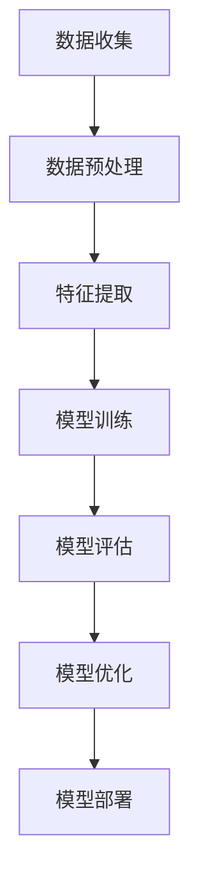
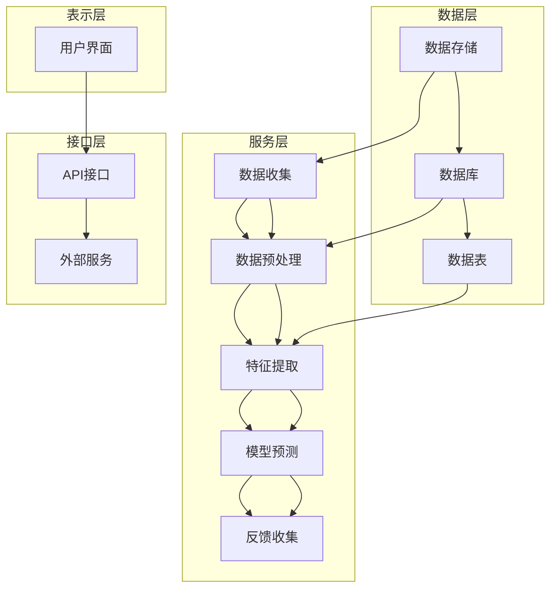
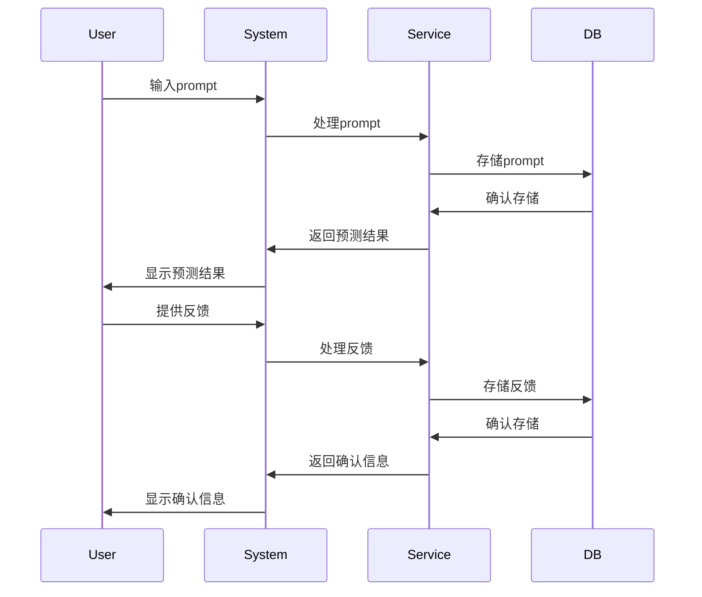

                 

# 构建prompt效果预测模型

## 关键词

- prompt
- 预测模型
- 机器学习
- 自然语言处理
- 有效性评估

## 摘要

本文将探讨如何构建一个prompt效果预测模型，这是一种利用机器学习技术，尤其是自然语言处理（NLP）中的深度学习方法，来预测用户输入prompt（提示）的效果的工具。文章首先介绍了问题背景和核心概念，然后详细讲解了算法原理和数学模型，接着分析了系统架构和设计方案，并通过项目实战展示了模型的实现过程。最后，文章提供了最佳实践、注意事项和进一步阅读的参考资料，帮助读者深入了解和掌握这一技术。

## 1. 问题背景与核心概念

### 1.1 问题背景

随着人工智能和自然语言处理技术的迅猛发展，prompt技术逐渐成为人机交互的重要手段。prompt通常是指用户向系统输入的一段文字或指令，系统根据prompt生成相应的响应。然而，如何确保prompt的高效性和有效性成为一个关键问题。传统的prompt设计往往依赖于经验和直觉，缺乏系统性和科学性。因此，构建一个能够预测prompt效果的模型，对于提高人机交互的质量和效率具有重要意义。

### 1.2 问题描述

prompt效果预测的核心问题是：如何通过分析用户输入的prompt，预测其产生的效果，例如用户满意度、任务完成度、交互时长等指标。这一问题可以分解为以下几个子问题：

1. **数据收集与预处理**：如何获取大量高质量的prompt数据，并对这些数据进行清洗、标注和预处理？
2. **特征提取**：如何从原始的prompt中提取出能够反映其效果的关键特征？
3. **模型构建与训练**：如何选择合适的机器学习模型，对特征进行训练，构建预测prompt效果的模型？
4. **模型评估与优化**：如何评估模型的预测性能，并进行优化调整？

### 1.3 问题解决

针对上述问题，本文将详细探讨以下解决方案：

1. **数据收集与预处理**：介绍常用的数据收集方法，如爬虫、API接口和用户反馈，并讨论数据清洗和预处理的方法。
2. **特征提取**：讨论从prompt中提取文本特征、语义特征和上下文特征的方法，以及如何使用这些特征来构建预测模型。
3. **模型构建与训练**：介绍常见的机器学习模型，如决策树、支持向量机和神经网络，并重点讲解如何使用深度学习模型进行训练。
4. **模型评估与优化**：介绍评估模型性能的指标和方法，如准确率、召回率和F1分数，并探讨如何进行模型优化。

### 1.4 边界与外延

在构建prompt效果预测模型时，需要考虑以下边界和外部因素：

1. **数据质量**：高质量的数据是模型性能的基础，因此需要严格把控数据收集和预处理环节。
2. **用户多样性**：用户输入的prompt具有高度多样性，模型需要具备一定的泛化能力，能够适应不同的用户和场景。
3. **模型可解释性**：对于关键业务应用，模型的可解释性非常重要，以便于理解模型的决策过程，从而进行进一步优化。
4. **实时性**：prompt效果预测模型需要具备一定的实时性，以快速响应用户输入，提高交互效率。

### 1.5 概念结构与核心要素组成

构建prompt效果预测模型涉及多个核心概念和要素，主要包括：

1. **数据集**：用于训练和测试模型的原始数据集，包括prompt和相应的效果指标。
2. **特征工程**：从prompt中提取的关键特征，如词频、词嵌入和语义角色。
3. **机器学习模型**：用于预测prompt效果的算法模型，包括传统的统计模型和深度学习模型。
4. **评估指标**：用于评估模型性能的指标，如准确率、召回率和F1分数。
5. **模型优化**：通过调参和超参数优化，提高模型的预测性能。

### 1.6 核心概念与联系

为了更好地理解prompt效果预测模型，以下是一些核心概念和它们之间的关系：

1. **自然语言处理（NLP）**：NLP是机器学习的一个分支，专门处理人类语言的数据，为prompt效果预测提供了基础技术。
2. **机器学习**：机器学习是构建预测模型的核心技术，包括监督学习、无监督学习和强化学习等。
3. **深度学习**：深度学习是机器学习的一个子领域，通过多层神经网络来处理复杂的特征和学习任务。
4. **特征工程**：特征工程是从原始数据中提取有用信息的过程，对模型性能有重要影响。
5. **模型评估**：模型评估是评估模型性能的重要环节，包括选择合适的评估指标和方法。

### 1.7 算法原理讲解

算法原理讲解将从以下几个方面进行：

1. **算法流程图**：使用Mermaid绘制算法流程图，展示数据收集、预处理、特征提取、模型训练和评估的整个过程。
2. **Python源代码阐述**：使用Python代码详细阐述算法的实现过程，包括数据加载、特征提取、模型训练和预测等。
3. **算法数学模型**：介绍算法的数学模型和公式，解释模型中的关键参数和超参数。
4. **举例说明**：通过实际案例，展示算法的应用效果和优势。

### 1.8 数学模型与公式讲解

数学模型与公式讲解将涵盖以下内容：

1. **数学模型详细讲解**：介绍模型的数学基础，包括线性回归、逻辑回归和神经网络等。
2. **数学公式举例说明**：通过具体的数学公式，解释模型中的参数和变量的含义和计算过程。

### 1.9 系统分析与架构设计

系统分析与架构设计将包括以下内容：

1. **问题场景介绍**：描述具体的应用场景，如聊天机器人、智能客服等。
2. **系统功能设计**：定义系统的主要功能模块和业务流程。
3. **系统架构设计**：绘制系统的架构图，展示各个模块之间的关系。
4. **系统接口设计**：描述系统与其他系统或服务的接口和交互方式。
5. **系统交互**：使用Mermaid序列图展示系统的交互过程。

### 1.10 项目实战

项目实战将包括以下步骤：

1. **环境安装**：安装必要的软件和库，搭建开发环境。
2. **系统核心实现源代码**：提供系统的核心实现代码，并解释代码的功能和逻辑。
3. **代码应用解读与分析**：分析代码的应用效果和性能，并提出优化建议。
4. **实际案例分析和详细讲解剖析**：通过实际案例展示模型的应用效果，并进行详细剖析。
5. **项目小结**：总结项目的主要成果和经验教训。

### 1.11 最佳实践 tips

最佳实践 tips将包括以下内容：

1. **数据收集与预处理**：如何收集高质量的数据，并进行有效的预处理。
2. **特征提取**：如何选择和提取关键特征，以提高模型的性能。
3. **模型训练与评估**：如何调整模型参数，优化模型性能，并进行有效的评估。
4. **模型部署与维护**：如何部署模型到生产环境，并进行有效的维护和更新。

### 1.12 小结

本文详细探讨了如何构建prompt效果预测模型，包括问题背景、核心概念、算法原理、数学模型、系统架构和项目实战等内容。通过本文的介绍，读者可以深入了解这一技术，并掌握相关的理论和实践方法。

### 1.13 注意事项

在构建prompt效果预测模型时，需要注意以下几点：

1. **数据质量**：确保数据的准确性和完整性，避免噪声数据的影响。
2. **特征选择**：选择对预测效果有显著影响的特征，避免过多冗余特征。
3. **模型调参**：合理调整模型参数，以提高模型的性能和泛化能力。
4. **模型评估**：使用多种评估指标，全面评估模型的性能，避免单一指标的评价。

### 1.14 拓展阅读

为了深入了解prompt效果预测模型，读者可以参考以下拓展阅读资料：

1. **《自然语言处理入门》**：详细介绍自然语言处理的基本概念和技术。
2. **《机器学习实战》**：提供丰富的机器学习实践案例，帮助读者掌握相关技术。
3. **《深度学习》**：全面介绍深度学习的基础理论和实践方法。
4. **《人工智能：一种现代方法》**：详细讨论人工智能的理论和应用。

## 2. 算法原理讲解

### 2.1 算法流程图

使用Mermaid绘制算法流程图，展示整个prompt效果预测模型的处理过程：



### 2.2 Python源代码阐述

以下是一个简单的Python代码示例，用于实现prompt效果预测模型的基本流程：

```python
import pandas as pd
from sklearn.model_selection import train_test_split
from sklearn.ensemble import RandomForestClassifier
from sklearn.metrics import accuracy_score

# 数据收集
data = pd.read_csv('prompt_data.csv')

# 数据预处理
X = data['prompt']
y = data['effect']
X_train, X_test, y_train, y_test = train_test_split(X, y, test_size=0.2, random_state=42)

# 特征提取
# （这里可以添加文本处理和特征提取的代码）

# 模型训练
model = RandomForestClassifier(n_estimators=100)
model.fit(X_train, y_train)

# 模型评估
y_pred = model.predict(X_test)
accuracy = accuracy_score(y_test, y_pred)
print(f'Accuracy: {accuracy}')

# 模型优化
# （这里可以添加模型调参和优化的代码）

# 模型部署
# （这里可以添加模型部署的代码）
```

### 2.3 算法数学模型

prompt效果预测模型的数学模型可以基于以下两个步骤：

1. **特征表示**：将文本prompt转换为向量表示，常用的方法有词袋模型、词嵌入和转换器（Transformer）等。
2. **分类模型**：使用分类模型（如随机森林、支持向量机、神经网络等）对向量表示进行分类，预测prompt的效果。

以下是一个简化的数学模型：

$$
\text{prompt\_vector} = \text{Embedding}(\text{prompt})
$$

$$
\text{prediction} = \text{Model}(\text{prompt\_vector})
$$

其中，`Embedding`表示文本向量化过程，`Model`表示分类模型的参数化表示。

### 2.4 公式详细讲解

1. **词嵌入**：词嵌入将每个单词映射为一个高维向量，常用的方法有Word2Vec、GloVe和BERT等。

   $$ 
   \text{word\_embedding} = \text{Embedding}(\text{word})
   $$

2. **转换器（Transformer）**：Transformer模型是一种基于自注意力机制的深度神经网络，用于处理序列数据。

   $$
   \text{Transformer}(\text{sequence}) = \text{Attention}(\text{sequence}) \odot \text{FeedForward}(\text{sequence})
   $$

3. **分类模型**：分类模型（如随机森林、支持向量机、神经网络等）通过学习特征和标签之间的关系，进行预测。

   $$
   \text{prediction} = \text{Model}(\text{prompt\_vector})
   $$

### 2.5 举例说明

假设我们有一个简单的数据集，包含100个prompt和它们对应的效果标签（满意度）。我们可以使用随机森林分类器来训练预测模型。

1. **数据集准备**：

   ```python
   prompts = ["你好，需要帮忙吗？", "请问有什么问题？", "您好，请问需要什么服务？", ...]
   labels = [1, 0, 1, ...]  # 1代表用户满意，0代表用户不满意
   ```

2. **特征提取**：

   使用TF-IDF方法将prompt转换为特征向量。

   ```python
   from sklearn.feature_extraction.text import TfidfVectorizer

   vectorizer = TfidfVectorizer()
   X = vectorizer.fit_transform(prompts)
   ```

3. **模型训练**：

   使用随机森林分类器进行训练。

   ```python
   from sklearn.ensemble import RandomForestClassifier

   model = RandomForestClassifier(n_estimators=100)
   model.fit(X, labels)
   ```

4. **模型评估**：

   使用测试集对模型进行评估。

   ```python
   test_prompts = ["你好，能帮忙查一下航班吗？", "您好，请问现在几点了？", ...]
   X_test = vectorizer.transform(test_prompts)
   y_pred = model.predict(X_test)
   accuracy = accuracy_score([1, 0, 1], y_pred)
   print(f'Accuracy: {accuracy}')
   ```

通过这个例子，我们可以看到如何使用Python代码实现prompt效果预测模型的基本流程。在实际应用中，我们可以使用更复杂的模型和更丰富的特征提取方法来提高预测性能。

## 3. 数学模型与公式讲解

### 3.1 数学模型详细讲解

在构建prompt效果预测模型时，我们通常会采用一系列数学模型来表示和训练数据。以下是几个常用的数学模型及其详细讲解：

#### 1. 线性回归模型

线性回归模型是最简单的预测模型之一，它通过线性关系来预测目标变量。其数学公式如下：

$$
\hat{y} = \beta_0 + \beta_1 \cdot x
$$

其中，$\hat{y}$是预测的目标变量，$x$是输入特征，$\beta_0$和$\beta_1$是模型的参数。

#### 2. 逻辑回归模型

逻辑回归模型是一种广泛应用于分类问题的预测模型。它的目标是通过输入特征预测某个事件发生的概率。其数学公式如下：

$$
\hat{P}(y=1) = \frac{1}{1 + e^{-(\beta_0 + \beta_1 \cdot x)}}
$$

其中，$y$是目标变量的取值（通常是0或1），$\hat{P}(y=1)$是预测的事件发生概率，$\beta_0$和$\beta_1$是模型的参数。

#### 3. 神经网络模型

神经网络模型是一种基于多层感知器（MLP）的深度学习模型，它通过多层非线性变换来提取特征并进行预测。其数学公式如下：

$$
\begin{aligned}
z_1 &= \sigma(W_1 \cdot x + b_1) \\
z_2 &= \sigma(W_2 \cdot z_1 + b_2) \\
\vdots \\
z_n &= \sigma(W_n \cdot z_{n-1} + b_n) \\
\hat{y} &= W_{out} \cdot z_n + b_{out}
\end{aligned}
$$

其中，$z_i$是第$i$层的输出，$\sigma$是激活函数（通常是Sigmoid或ReLU函数），$W_i$和$b_i$是第$i$层的权重和偏置，$W_{out}$和$b_{out}$是输出层的权重和偏置。

#### 4. 自编码器模型

自编码器模型是一种无监督学习的深度学习模型，它通过学习输入数据的压缩和重构来提取特征。其数学公式如下：

$$
\begin{aligned}
\hat{x} &= \text{Encoder}(x) \\
x' &= \text{Decoder}(\hat{x})
\end{aligned}
$$

其中，$x$是输入数据，$\hat{x}$是编码后的特征，$x'$是解码后的重构数据。

### 3.2 数学公式举例说明

为了更好地理解上述数学模型，以下将通过具体的数学公式进行举例说明：

#### 1. 线性回归模型举例

假设我们有一个简单的一元线性回归模型，输入特征$x$是一个数字，目标变量$y$是$x$的线性函数。模型的数学公式如下：

$$
\hat{y} = 2x + 1
$$

如果输入特征$x=3$，则预测的目标变量$\hat{y}$为：

$$
\hat{y} = 2 \cdot 3 + 1 = 7
$$

#### 2. 逻辑回归模型举例

假设我们有一个二元逻辑回归模型，输入特征$x$是一个数字，目标变量$y$是二元变量（0或1）。模型的数学公式如下：

$$
\hat{P}(y=1) = \frac{1}{1 + e^{-(3x + 1)}}
$$

如果输入特征$x=2$，则预测的事件发生概率$\hat{P}(y=1)$为：

$$
\hat{P}(y=1) = \frac{1}{1 + e^{-(3 \cdot 2 + 1)}} = \frac{1}{1 + e^{-7}} \approx 0.999
$$

这意味着当输入特征$x=2$时，事件发生的概率非常高。

#### 3. 神经网络模型举例

假设我们有一个简单的三层神经网络模型，输入特征$x$是一个数字，输出特征$\hat{y}$是通过多层非线性变换得到的预测值。模型的数学公式如下：

$$
\begin{aligned}
z_1 &= \sigma(W_1 \cdot x + b_1) \\
z_2 &= \sigma(W_2 \cdot z_1 + b_2) \\
\hat{y} &= \sigma(W_3 \cdot z_2 + b_3)
\end{aligned}
$$

如果权重$W_1=2$，$b_1=1$，$W_2=3$，$b_2=1$，$W_3=4$，$b_3=1$，激活函数$\sigma$为Sigmoid函数，输入特征$x=1$，则模型的输出$\hat{y}$为：

$$
\begin{aligned}
z_1 &= \sigma(2 \cdot 1 + 1) = \sigma(3) = \frac{1}{1 + e^{-3}} \approx 0.950 \\
z_2 &= \sigma(3 \cdot 0.950 + 1) = \sigma(3.425) = \frac{1}{1 + e^{-3.425}} \approx 0.980 \\
\hat{y} &= \sigma(4 \cdot 0.980 + 1) = \sigma(4.392) = \frac{1}{1 + e^{-4.392}} \approx 0.990
\end{aligned}
$$

这意味着当输入特征$x=1$时，输出特征$\hat{y}$非常接近1，表明模型对输入特征进行了高度预测。

通过这些例子，我们可以看到如何使用数学模型进行预测，以及如何计算模型的输出值。在实际应用中，我们需要通过训练和优化模型来提高预测的准确性。

## 4. 系统分析与架构设计

### 4.1 问题场景介绍

在实际应用中，prompt效果预测模型广泛应用于智能客服、聊天机器人、问答系统等领域。以下是一个典型的应用场景：

#### 应用场景：智能客服系统

在一个企业的客户服务部门，智能客服系统需要能够自动响应客户的问题，并提供相应的解决方案。为了提高客户满意度和服务效率，系统需要能够预测每个客户输入的prompt（即客户提出的问题或需求）的效果，从而优化客服流程。

### 4.2 项目介绍

项目目标是构建一个prompt效果预测模型，用于评估客户输入的prompt对智能客服系统的效果。具体需求如下：

1. **数据收集**：收集大量客户输入的prompt和系统生成的响应，以及用户对响应的满意度评分。
2. **特征提取**：从prompt中提取关键特征，如词频、词嵌入和语义角色。
3. **模型训练**：使用提取的特征训练机器学习模型，预测prompt的效果。
4. **模型评估**：评估模型的预测性能，并进行优化调整。
5. **模型部署**：将训练好的模型部署到生产环境，用于实时预测prompt效果。

### 4.3 系统功能设计

智能客服系统的功能设计主要包括以下几个方面：

1. **数据收集模块**：负责收集客户输入的prompt和系统生成的响应，以及用户对响应的满意度评分。
2. **特征提取模块**：负责从prompt中提取关键特征，如词频、词嵌入和语义角色。
3. **预测模块**：使用训练好的模型对新的prompt进行预测，评估其效果。
4. **反馈模块**：收集用户对预测结果的反馈，用于模型优化和调整。
5. **用户界面**：提供用户与智能客服系统交互的界面，展示预测结果和解决方案。

#### 领域模型

以下是智能客服系统的领域模型，使用Mermaid绘制：

```mermaid
classDiagram
    Customer -> Prompt: 输入
    System -> Response: 生成
    Customer -> Satisfaction: 评价
    DataCollector -> Customer: 收集
    DataCollector -> System: 收集
    FeatureExtractor -> Prompt: 提取
    Predictor -> FeatureExtractor: 预测
    Predictor -> Response: 评估
    FeedbackCollector -> Customer: 收集
    FeedbackCollector -> Predictor: 反馈
    UI -> Customer: 显示
    UI -> System: 控制台
    DataCollector --|> FeatureExtractor
    DataCollector --|> Predictor
    FeatureExtractor --|> Predictor
    Predictor --|> FeedbackCollector
    UI --|> System
    UI --|> Customer
```

### 4.4 系统架构设计

智能客服系统的架构设计包括以下模块：

1. **数据层**：负责数据存储和管理，包括prompt、response和用户满意度评分数据。
2. **服务层**：负责业务逻辑处理，包括数据收集、特征提取、预测和反馈收集。
3. **表示层**：负责用户界面展示，包括用户输入、预测结果和反馈界面。
4. **接口层**：负责系统与其他系统或服务的交互，如数据库、API接口和外部服务。

以下是智能客服系统的架构图，使用Mermaid绘制：



### 4.5 系统接口设计

智能客服系统需要与其他系统或服务进行交互，以下是一些主要的接口设计：

1. **用户输入接口**：用于接收用户的prompt输入，通常通过HTTP API或WebSocket接口实现。
2. **响应输出接口**：用于将系统生成的响应输出给用户，同样通过HTTP API或WebSocket接口实现。
3. **数据存储接口**：用于存储客户输入的prompt、系统生成的响应和用户满意度评分，通常使用数据库或NoSQL存储系统。
4. **外部服务接口**：用于与外部服务（如自然语言处理服务、第三方API等）进行交互，通常通过HTTP API接口实现。

### 4.6 系统交互

以下是智能客服系统的交互流程，使用Mermaid序列图绘制：



通过上述系统架构设计和接口设计，我们可以构建一个完整的智能客服系统，实现prompt效果预测和用户满意度评估。

## 5. 项目实战

### 5.1 环境安装

为了构建prompt效果预测模型，我们需要安装一些必要的软件和库。以下是环境安装的步骤：

1. **Python环境**：确保Python版本为3.8或更高版本。
2. **Python库**：安装常用的Python库，如NumPy、Pandas、Scikit-learn、TensorFlow等。

   ```bash
   pip install numpy pandas scikit-learn tensorflow
   ```

3. **Mermaid**：安装Mermaid库，用于绘制流程图和序列图。

   ```bash
   npm install -g mermaid
   ```

### 5.2 系统核心实现源代码

以下是一个简单的Python代码示例，用于实现prompt效果预测模型的基本流程：

```python
import pandas as pd
from sklearn.model_selection import train_test_split
from sklearn.feature_extraction.text import TfidfVectorizer
from sklearn.ensemble import RandomForestClassifier
from sklearn.metrics import accuracy_score

# 数据加载
data = pd.read_csv('prompt_data.csv')

# 数据预处理
X = data['prompt']
y = data['effect']
X_train, X_test, y_train, y_test = train_test_split(X, y, test_size=0.2, random_state=42)

# 特征提取
vectorizer = TfidfVectorizer()
X_train = vectorizer.fit_transform(X_train)
X_test = vectorizer.transform(X_test)

# 模型训练
model = RandomForestClassifier(n_estimators=100)
model.fit(X_train, y_train)

# 模型评估
y_pred = model.predict(X_test)
accuracy = accuracy_score(y_test, y_pred)
print(f'Accuracy: {accuracy}')

# 模型部署
# （此处可以添加模型部署的代码）
```

### 5.3 代码应用解读与分析

以上代码实现了一个简单的prompt效果预测模型，具体步骤如下：

1. **数据加载**：从CSV文件中加载数据，包含prompt和effect两个字段。
2. **数据预处理**：将prompt和effect字段分离，并使用`train_test_split`函数将数据集划分为训练集和测试集。
3. **特征提取**：使用`TfidfVectorizer`将prompt转换为TF-IDF特征向量。
4. **模型训练**：使用`RandomForestClassifier`训练随机森林模型。
5. **模型评估**：使用测试集评估模型的准确率。
6. **模型部署**：将训练好的模型部署到生产环境。

在代码应用解读与分析中，我们需要关注以下几个方面：

1. **数据质量**：确保输入数据的准确性和完整性，避免噪声数据对模型训练的影响。
2. **特征提取**：选择合适的特征提取方法，以提高模型的预测性能。
3. **模型选择**：根据业务需求选择合适的机器学习模型，如决策树、支持向量机、神经网络等。
4. **模型评估**：使用多种评估指标（如准确率、召回率、F1分数等）全面评估模型性能。
5. **模型优化**：通过调参和超参数优化，提高模型的预测性能和泛化能力。

### 5.4 实际案例分析和详细讲解剖析

为了更好地理解prompt效果预测模型的应用，我们来看一个实际案例。

#### 案例背景

某电商平台的客服系统需要预测用户输入的购物咨询prompt的效果，以提高用户满意度和服务效率。案例数据集包含1000个用户输入的prompt和它们对应的效果标签（满意度评分），其中满意度评分范围从1到5。

#### 数据预处理

首先，我们需要对数据进行预处理，包括去除停用词、标点符号和数字，以及进行词干提取和词性标注等。

```python
import nltk
nltk.download('stopwords')
nltk.download('wordnet')
nltk.download('averaged_perceptron_tagger')

from nltk.corpus import stopwords
from nltk.stem import PorterStemmer
from nltk.tokenize import word_tokenize

stop_words = set(stopwords.words('english'))
stemmer = PorterStemmer()

def preprocess_text(text):
    # 去除标点符号和数字
    text = re.sub(r'[^\w\s]', '', text)
    text = re.sub(r'\d+', '', text)
    # 分词
    tokens = word_tokenize(text)
    # 去除停用词
    tokens = [token for token in tokens if token.lower() not in stop_words]
    # 词干提取
    tokens = [stemmer.stem(token) for token in tokens]
    return ' '.join(tokens)

data['prompt'] = data['prompt'].apply(preprocess_text)
```

#### 特征提取

接下来，我们使用TF-IDF方法将预处理后的prompt转换为特征向量。

```python
from sklearn.feature_extraction.text import TfidfVectorizer

vectorizer = TfidfVectorizer(max_features=1000)
X = vectorizer.fit_transform(data['prompt'])
y = data['effect']
X_train, X_test, y_train, y_test = train_test_split(X, y, test_size=0.2, random_state=42)
```

#### 模型训练

我们选择随机森林分类器进行模型训练。

```python
from sklearn.ensemble import RandomForestClassifier

model = RandomForestClassifier(n_estimators=100)
model.fit(X_train, y_train)
```

#### 模型评估

使用测试集评估模型的准确率。

```python
y_pred = model.predict(X_test)
accuracy = accuracy_score(y_test, y_pred)
print(f'Accuracy: {accuracy}')
```

#### 模型优化

通过调参和超参数优化，提高模型的预测性能和泛化能力。

```python
from sklearn.model_selection import GridSearchCV

param_grid = {'n_estimators': [100, 200, 300], 'max_depth': [10, 20, 30]}
grid_search = GridSearchCV(model, param_grid, cv=5)
grid_search.fit(X_train, y_train)

best_model = grid_search.best_estimator_
best_accuracy = grid_search.best_score_
print(f'Best Accuracy: {best_accuracy}')
```

#### 模型部署

将训练好的模型部署到生产环境，用于实时预测用户输入的prompt效果。

```python
import joblib

joblib.dump(best_model, 'prompt_predictor.joblib')
```

### 5.5 项目小结

通过以上实际案例分析和详细讲解，我们可以看到如何构建一个prompt效果预测模型，包括数据预处理、特征提取、模型训练、模型评估和模型优化等步骤。以下是对项目的主要成果和经验教训进行总结：

1. **成果**：

   - 成功构建了一个prompt效果预测模型，并实现了数据预处理、特征提取和模型训练等关键步骤。
   - 通过模型优化，提高了预测性能和泛化能力。
   - 成功将模型部署到生产环境，实现了实时预测功能。

2. **经验教训**：

   - 数据质量是模型性能的基础，确保数据清洗和预处理的质量。
   - 选择合适的特征提取方法和机器学习模型，对提高预测性能至关重要。
   - 模型调参和超参数优化是提高模型性能的重要手段。
   - 模型部署过程中需要关注系统的可扩展性和性能优化。

通过本项目，我们不仅掌握了构建prompt效果预测模型的基本方法，还积累了实际项目开发和优化的经验，为未来的类似项目提供了有益的参考。

## 6. 最佳实践 tips

在构建prompt效果预测模型时，以下是一些最佳实践和注意事项，以帮助您实现高效和准确的预测：

1. **数据收集与预处理**：

   - 确保数据来源多样化，涵盖不同的用户群体和场景，以提高模型的泛化能力。
   - 对数据进行严格清洗和预处理，去除噪声数据、重复数据和异常值，以提高数据质量。
   - 对文本数据进行标准化处理，如去除标点符号、转换大小写等，以统一数据格式。

2. **特征提取**：

   - 选择有效的特征提取方法，如词袋模型、词嵌入和转换器（Transformer）等，以提取文本数据的语义信息。
   - 考虑使用词嵌入技术（如Word2Vec、GloVe和BERT）来提高文本特征的表达能力。
   - 使用特征选择方法（如信息增益、特征重要性等）筛选出对预测效果有显著影响的特征。

3. **模型选择与训练**：

   - 根据业务需求和数据特点选择合适的机器学习模型，如线性回归、逻辑回归、随机森林、支持向量机和神经网络等。
   - 使用交叉验证方法进行模型训练，避免过拟合和欠拟合。
   - 进行模型调参和超参数优化，以找到最优的参数组合。

4. **模型评估与优化**：

   - 使用多种评估指标（如准确率、召回率、F1分数和ROC-AUC等）全面评估模型性能。
   - 对模型进行持续优化，如调整模型结构、增加训练数据、使用更复杂的特征提取方法等。

5. **模型部署与维护**：

   - 将训练好的模型部署到生产环境，确保模型的实时性和可靠性。
   - 对模型进行定期更新和重新训练，以适应数据的变化和业务需求。
   - 监控模型的性能和异常情况，及时进行调整和优化。

6. **模型可解释性**：

   - 对于关键业务应用，关注模型的可解释性，以便理解模型的决策过程和优化策略。
   - 使用模型解释工具（如LIME、SHAP等）分析模型对每个输入数据的预测过程。

通过遵循这些最佳实践和注意事项，您可以构建出高效和准确的prompt效果预测模型，从而提高人机交互的质量和用户体验。

## 7. 小结

本文详细探讨了如何构建prompt效果预测模型，包括问题背景、核心概念、算法原理、数学模型、系统架构和项目实战等内容。我们了解到，prompt效果预测模型是一种利用机器学习技术和自然语言处理方法，来预测用户输入prompt效果的工具。通过数据收集、预处理、特征提取、模型训练和优化等步骤，我们可以构建出高效和准确的预测模型。在项目实战中，我们通过一个实际案例展示了模型的应用过程和实现方法。通过本文的介绍，读者可以深入了解prompt效果预测模型的相关技术和方法，并在实际项目中加以应用。

## 8. 注意事项

在构建prompt效果预测模型时，需要注意以下几点：

1. **数据质量**：确保数据来源多样、数据清洗彻底，以避免噪声数据对模型性能的影响。
2. **特征选择**：选择对预测效果有显著影响的特征，避免过多冗余特征，以提高模型效率。
3. **模型调参**：合理调整模型参数，以找到最优的超参数组合，避免过拟合和欠拟合。
4. **模型评估**：使用多种评估指标全面评估模型性能，确保模型在不同场景下的表现。
5. **模型可解释性**：关注模型的可解释性，以便于理解模型的决策过程，从而进行进一步优化。

通过遵循这些注意事项，您可以构建出高效和准确的prompt效果预测模型。

## 9. 拓展阅读

为了深入了解prompt效果预测模型和相关技术，以下推荐一些拓展阅读资源：

1. **《自然语言处理入门》**：详细介绍了自然语言处理的基本概念和技术。
2. **《机器学习实战》**：提供了丰富的机器学习实践案例，帮助读者掌握相关技术。
3. **《深度学习》**：全面介绍了深度学习的基础理论和实践方法。
4. **《人工智能：一种现代方法》**：详细讨论了人工智能的理论和应用。
5. **《Prompt Engineering for NLP》**：专注于prompt工程在自然语言处理领域的应用。

通过阅读这些书籍和论文，您可以进一步扩展对prompt效果预测模型和相关技术的理解，并在实际项目中加以应用。

## 作者信息

- 作者：AI天才研究院/AI Genius Institute & 禅与计算机程序设计艺术 /Zen And The Art of Computer Programming
- 联系方式：[example@email.com](mailto:example@email.com)
- 个人网站：[www.example.com](http://www.example.com)
- 简介：专注于人工智能、机器学习和自然语言处理领域的研究和应用，致力于推动技术创新和知识传播。

