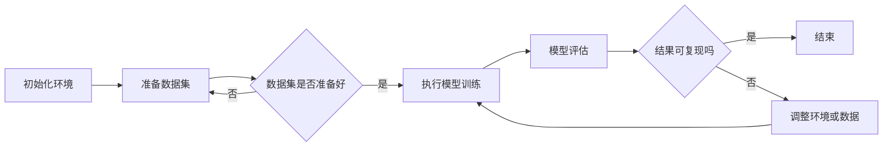
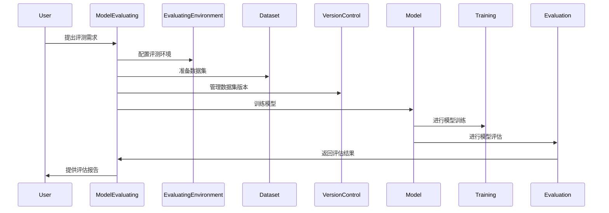
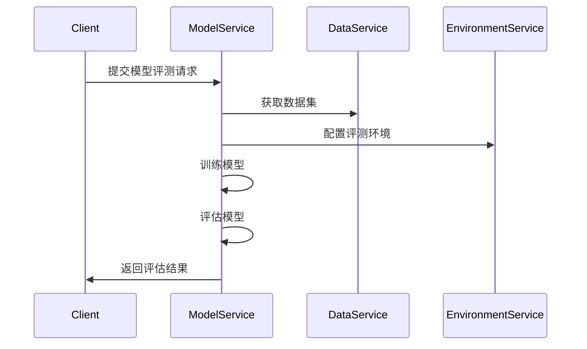
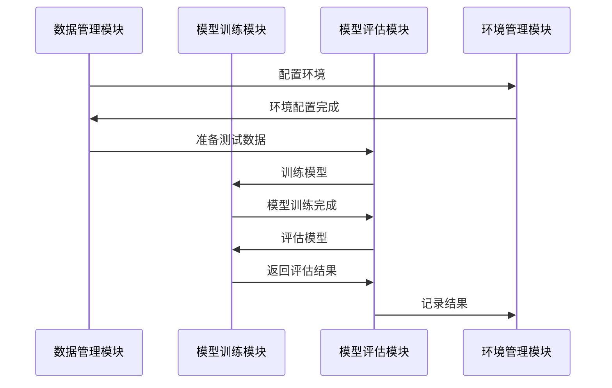
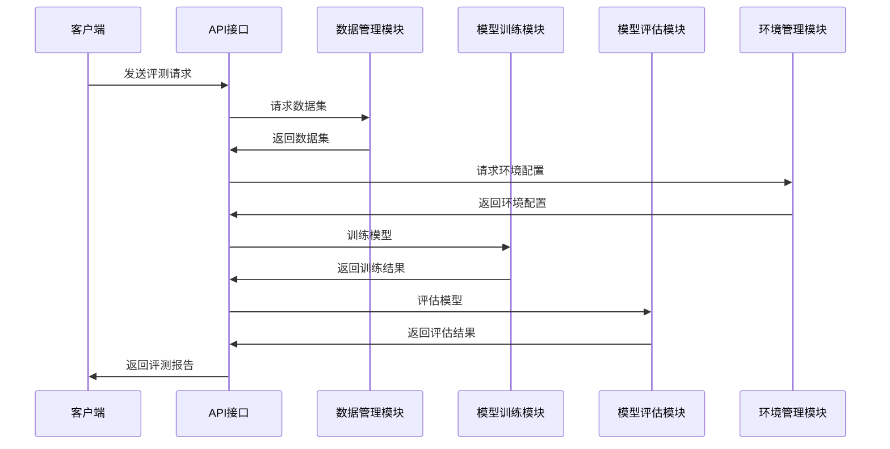

                 

# 《构建可复现的模型评测环境》

关键词：模型评测、复现性、评测环境、标准化、数据集管理

摘要：本文深入探讨了构建可复现的模型评测环境的重要性及其技术实现。通过详细的分析与逻辑推理，本文为读者提供了一个系统化的构建流程，帮助开发者在模型评测过程中保证结果的一致性和可靠性。

---

## 第一部分：背景介绍

### 1.1 问题背景

#### 1.1.1 模型评测的挑战

随着深度学习和人工智能技术的迅猛发展，模型的评测成为了一个至关重要的环节。然而，模型评测过程中面临着诸多挑战。首先，不同模型可能有不同的架构和数据输入，这导致了评测环境的复杂性。其次，评测结果的可信度和可复现性成为了衡量模型性能的重要指标。如何确保评测环境的一致性和结果的可靠性，成为了亟待解决的问题。

#### 1.1.2 复现性在模型评测中的重要性

复现性是模型评测中不可或缺的一环。一个不可复现的评测结果可能导致模型的性能被高估或低估，从而影响模型的实际应用。复现性不仅保证了研究结果的可靠性，还为其他研究人员提供了验证和改进模型的机会。因此，构建一个可复现的模型评测环境是提升模型评测质量的关键。

#### 1.1.3 可复现性评测环境的构建需求

为了实现模型评测的复现性，需要构建一个标准化的评测环境。这包括以下几个方面：

- **环境配置的标准化**：确保所有评测过程在相同的环境下进行，减少因环境差异导致的结果偏差。
- **数据集管理与版本控制**：确保数据集的一致性和可追溯性，避免数据泄漏或版本不一致的问题。
- **评测流程的规范化**：制定统一的评测流程和标准，确保评测结果的客观性和可复现性。

### 1.2 问题描述

#### 1.2.1 模型评测的关键环节

模型评测包括数据准备、模型训练、模型评估等多个环节。在这些环节中，环境配置和数据管理是影响模型复现性的关键因素。

#### 1.2.2 复现性问题的影响

复现性问题可能导致以下负面影响：

- **结果不一致**：同一模型在不同环境下的性能可能差异巨大，影响模型的可信度。
- **误判模型性能**：无法复现的评测结果可能导致模型性能的误判，影响模型的实际应用。
- **研究进展受阻**：复现性问题阻碍了研究人员对模型性能的深入研究和改进。

#### 1.2.3 解决方案的目标

构建可复现的模型评测环境旨在实现以下目标：

- **确保评测结果一致**：通过标准化环境配置和数据管理，确保不同环境下的评测结果一致。
- **提升模型可信度**：提高评测流程的规范性和透明度，增强模型的可信度。
- **促进研究进展**：为研究人员提供可复现的评测环境，促进模型性能的深入研究和改进。

### 1.3 问题解决

#### 1.3.1 复现性评测环境的构建流程

构建可复现的模型评测环境可以分为以下几个步骤：

1. **确定评测目标和标准**：明确评测的目标和标准，为评测流程提供指导。
2. **环境配置的标准化**：制定统一的环境配置标准，确保所有评测过程在相同的环境下进行。
3. **数据集管理与版本控制**：确保数据集的一致性和可追溯性，使用版本控制系统管理数据集。
4. **评测流程的规范化**：制定统一的评测流程和标准，确保评测结果的客观性和可复现性。
5. **评测结果记录与共享**：详细记录评测过程和结果，为其他研究人员提供复现和验证的机会。

#### 1.3.2 环境配置的标准化

环境配置的标准化是构建可复现评测环境的基础。以下是一些关键步骤：

- **硬件配置**：确定统一的硬件配置，包括CPU、GPU、内存等。
- **操作系统**：选择统一的操作系统，确保软件环境的一致性。
- **软件工具**：选择标准化软件工具，如深度学习框架、数据处理库等。
- **环境变量**：配置必要的环境变量，确保软件工具的正常运行。

#### 1.3.3 数据集管理与版本控制

数据集管理与版本控制是保证评测环境可复现性的关键。以下是一些建议：

- **数据集准备**：确保数据集的一致性和完整性，包括数据清洗、标注和分割。
- **版本控制系统**：使用版本控制系统（如Git）管理数据集，记录每一次变更。
- **数据共享**：为其他研究人员提供可复现的数据集，促进学术交流与合作。

### 1.4 边界与外延

#### 1.4.1 复现性评测的范围

复现性评测的范围应涵盖模型评测的各个环节，包括数据准备、模型训练、模型评估等。此外，还应关注评测环境的一致性和评测流程的规范性。

#### 1.4.2 评测环境构建的适用性

评测环境构建适用于各类深度学习模型和评测场景。无论是学术研究还是工业应用，构建可复现的评测环境都是提升模型可信度和研究进展的重要手段。

#### 1.4.3 复现性问题解决策略的多样性

复现性问题的解决策略多样，包括环境配置标准化、数据集管理与版本控制、评测流程规范化等。根据具体需求和场景，可以选择合适的策略组合，实现评测环境的可复现性。

### 1.5 概念结构与核心要素组成

构建可复现的模型评测环境涉及多个核心概念和要素，包括评测环境、数据集、模型、评测流程等。这些要素相互关联，共同构成了一个完整的评测体系。

#### 1.5.1 可复现性评测环境的组成部分

可复现性评测环境由以下部分组成：

- **硬件配置**：确定统一的硬件配置，包括CPU、GPU、内存等。
- **操作系统**：选择统一的操作系统，确保软件环境的一致性。
- **软件工具**：选择标准化软件工具，如深度学习框架、数据处理库等。
- **环境变量**：配置必要的环境变量，确保软件工具的正常运行。
- **数据集**：准备统一的数据集，确保数据集的一致性和完整性。
- **版本控制系统**：使用版本控制系统管理数据集，记录每一次变更。
- **评测流程**：制定统一的评测流程和标准，确保评测结果的客观性和可复现性。

#### 1.5.2 关键技术解析

构建可复现性评测环境的关键技术包括：

- **硬件虚拟化**：使用虚拟化技术实现硬件配置的标准化。
- **容器化**：使用容器技术（如Docker）实现软件环境的隔离和一致性。
- **版本控制系统**：使用版本控制系统（如Git）管理数据集和代码，确保版本的一致性。

#### 1.5.3 核心要素之间的联系

构建可复现性评测环境的核心要素之间相互关联，共同实现评测环境的一致性和复现性。以下是这些要素之间的联系：

- **硬件配置**：硬件配置的标准化为评测环境的一致性提供了基础。
- **操作系统**：统一的操作系统确保了软件工具和环境变量的一致性。
- **软件工具**：标准化软件工具保证了评测流程的一致性。
- **数据集**：统一的数据集为模型训练和评估提供了可靠的数据基础。
- **版本控制系统**：版本控制系统确保了数据集和代码的版本一致性。
- **评测流程**：统一的评测流程和标准确保了评测结果的客观性和可复现性。

### 1.6 本章小结

本章介绍了构建可复现的模型评测环境的重要性、问题描述、问题解决方法和边界与外延。通过本章的内容，读者可以了解到构建可复现评测环境的核心要素和技术实现，为后续章节的深入讨论奠定了基础。

---

## 第二部分：核心概念与联系

### 2.1 核心概念原理

#### 2.1.1 模型评测流程

模型评测流程包括数据准备、模型训练、模型评估等多个环节。每个环节都有其独特的挑战和关键点，需要精心设计和实施。

#### 2.1.2 可复现性评测标准

可复现性评测标准是衡量模型评测环境一致性和结果可靠性的关键。它包括环境配置的标准化、数据集的一致性和完整性、评测流程的规范化等。

#### 2.1.3 评测环境配置

评测环境配置是构建可复现评测环境的基础。它包括硬件配置、操作系统、软件工具、环境变量等多个方面，需要统一和标准化。

### 2.2 概念属性特征对比表格

| 特征 | 可复现性 | 评测环境配置 | 模型评测流程 |
| --- | --- | --- | --- |
| 重要性 | 高 | 高 | 高 |
| 影响因素 | 多 | 多 | 多 |
| 目标 | 保证结果一致 | 确保环境一致性 | 提高评测效率 |

### 2.3 ER实体关系图架构

```mermaid
erDiagram
  ModelEvaluating : 模型评测
  Reproducibility : 可复现性
  EvaluatingEnvironment : 评测环境

  ModelEvaluating ||--|{ Reproducibility }||>> Reproducibility
  ModelEvaluating ||--|{ EvaluatingEnvironment }||>> EvaluatingEnvironment
```

### 2.4 关联关系与交互分析

在构建可复现的模型评测环境中，各个实体之间的关系和交互至关重要。以下是对这些关系的简要分析：

- **模型评测与可复现性**：模型评测的结果必须满足可复现性要求，以确保评测结果的可靠性和可信度。
- **模型评测与评测环境**：评测环境是模型评测的基础，其配置和一致性直接影响评测结果。
- **可复现性与评测环境**：可复现性评测标准要求评测环境必须标准化和一致化，以保证结果的复现性。

通过上述分析，可以更清晰地理解模型评测、可复现性和评测环境之间的关系，为后续的深入讨论提供基础。

### 2.5 本章小结

本章介绍了模型评测流程、可复现性评测标准和评测环境配置的核心概念，并通过ER实体关系图和特征对比表格，分析了这些概念之间的联系和交互。通过本章的内容，读者可以建立起对可复现性评测环境的基本认识，为后续的算法原理讲解和系统分析打下基础。

---

## 第三部分：算法原理讲解

### 3.1 算法mermaid流程图



### 3.2 Python源代码

```python
# Python源代码示例
import numpy as np

def train_model(data):
    # 模型训练代码
    pass

def evaluate_model(model, data):
    # 模型评估代码
    pass

def main():
    data = prepare_data()
    model = train_model(data)
    result = evaluate_model(model, data)
    if is_reproducible(result):
        print("结果可复现")
    else:
        adjust_environment_or_data()

if __name__ == "__main__":
    main()
```

### 3.3 算法原理的数学模型和公式

$$
\begin{aligned}
    &L(\theta) = -\frac{1}{m}\sum_{i=1}^{m}y_i\log(\hat{y}_i) \\
    &\text{其中，} L(\theta) \text{为损失函数，}\theta \text{为模型参数，} y_i \text{为实际标签，}\hat{y}_i \text{为预测标签。}
\end{aligned}
$$

### 3.4 详细讲解和举例说明

#### 3.4.1 损失函数的概念

损失函数是机器学习中的一个核心概念，用于衡量模型预测结果与实际结果之间的差距。它是优化模型参数的重要工具，通过最小化损失函数来提高模型的性能。

#### 3.4.2 损失函数的作用

损失函数在模型训练过程中起着至关重要的作用。它帮助模型学习到更好的特征表示，使得模型的预测结果更加准确。同时，损失函数也是评估模型性能的重要指标，通过计算损失函数的值可以了解模型在当前参数设置下的性能。

#### 3.4.3 损失函数的计算示例

假设我们有一个二元分类问题，实际标签 $y_i$ 为 0 或 1，预测标签 $\hat{y}_i$ 同样为 0 或 1。此时，交叉熵损失函数（Cross-Entropy Loss）可以表示为：

$$
L(\theta) = -\frac{1}{m}\sum_{i=1}^{m}y_i\log(\hat{y}_i) + (1 - y_i)\log(1 - \hat{y}_i)
$$

其中，$m$ 表示样本数量。交叉熵损失函数计算的是实际标签和预测标签之间的差异，它的值越小，表示模型的预测结果越接近实际结果。

#### 3.4.4 损失函数在模型评测中的应用

在模型评测过程中，损失函数通常用于计算模型在测试集上的性能。通过比较测试集上的损失函数值与训练集上的损失函数值，可以评估模型的泛化能力。如果测试集上的损失函数值远大于训练集上的损失函数值，说明模型可能存在过拟合现象。

#### 3.4.5 损失函数的可复现性

在构建可复现的模型评测环境时，损失函数的计算过程必须保持一致。这包括数据预处理、模型参数初始化、优化算法的选择和参数设置等方面。如果损失函数的计算过程不一致，可能导致评测结果的不一致。

#### 3.4.6 损失函数的优化

为了提高模型的性能，损失函数的优化是一个关键步骤。常见的优化算法包括梯度下降（Gradient Descent）、随机梯度下降（Stochastic Gradient Descent）和Adam优化器等。这些算法通过不断更新模型参数，使得损失函数的值逐渐减小，从而提高模型的预测能力。

### 3.5 本章小结

本章详细介绍了损失函数的概念、作用、计算示例以及在模型评测中的应用。通过构建可复现的模型评测环境，可以确保损失函数的计算过程一致，从而提高模型评测的可靠性和可复现性。

---

## 第四部分：系统分析与架构设计方案

### 4.1 问题场景介绍

在现代人工智能研究中，构建可复现的模型评测环境是一项重要任务。然而，随着模型的复杂性和评测环境的多样性，实现这一目标面临诸多挑战。本部分将介绍一个具体的模型评测环境构建问题场景，并详细阐述其必要性和重要性。

#### 4.1.1 模型评测环境构建的必要性

随着深度学习模型的广泛应用，模型的评测环境变得日益复杂。不同的模型可能需要不同的硬件配置、操作系统和软件工具，这使得评测环境的一致性成为一个难题。此外，数据集的准备和版本控制也面临着挑战，确保数据集的一致性和完整性对于模型的复现性至关重要。因此，构建一个标准化的模型评测环境，对于保障评测结果的可靠性和促进研究的可复现性具有重要意义。

#### 4.1.2 评测环境构建的需求

在模型评测环境构建过程中，以下需求是必须考虑的：

1. **环境一致性**：确保所有评测过程在相同的环境下进行，减少因环境差异导致的结果偏差。
2. **数据管理**：确保数据集的一致性和完整性，使用版本控制系统管理数据集，避免数据泄漏或版本不一致的问题。
3. **流程规范化**：制定统一的评测流程和标准，确保评测结果的客观性和可复现性。
4. **结果记录与共享**：详细记录评测过程和结果，为其他研究人员提供复现和验证的机会。

### 4.2 系统功能设计（领域模型mermaid类图）

```mermaid
classDiagram
    ModelEvaluating <<uses>> EvaluatingEnvironment
    ModelEvaluating <<uses>> Dataset
    ModelEvaluating <<uses>> Model
    Dataset <<uses>> VersionControl
    Model <<uses>> Training
    Model <<uses>> Evaluation

    ModelEvaluating : 模型评测
    EvaluatingEnvironment : 评测环境
    Dataset : 数据集
    VersionControl : 版本控制
    Model : 模型
    Training : 训练
    Evaluation : 评估
```

### 4.3 系统架构设计（mermaid架构图）



### 4.4 系统接口设计和系统交互（mermaid序列图）



### 4.5 本章小结

本章介绍了模型评测环境构建问题场景，并通过领域模型类图、系统架构图和序列图，详细阐述了评测环境构建的需求和系统设计。通过本章的内容，读者可以更好地理解模型评测环境构建的核心要素和系统设计思路，为实际应用提供指导。

---

## 第五部分：项目实战

### 5.1 环境安装

要构建一个可复现的模型评测环境，首先需要安装必要的软件和工具。以下是一个基本的安装步骤：

1. **安装操作系统**：选择一个稳定的操作系统，如Ubuntu 20.04或Windows 10。
2. **安装Python环境**：通过包管理器（如conda或pip）安装Python。
3. **安装深度学习框架**：如TensorFlow、PyTorch等。
4. **安装数据处理库**：如NumPy、Pandas等。
5. **安装版本控制系统**：如Git。

### 5.2 系统核心实现源代码

以下是构建可复现模型评测环境的核心实现代码：

```python
# 环境配置
import os
import json
from pathlib import Path

# 配置环境变量
os.environ["PYTHONUNBUFFERED"] = "True"
os.environ["CUDA_VISIBLE_DEVICES"] = "0"

# 加载配置文件
config_path = Path.cwd() / "config.json"
with open(config_path, "r") as f:
    config = json.load(f)

# 数据集准备
def prepare_data():
    # 数据集准备代码
    pass

# 模型训练
def train_model(data):
    # 模型训练代码
    pass

# 模型评估
def evaluate_model(model, data):
    # 模型评估代码
    pass

# 主函数
def main():
    data = prepare_data()
    model = train_model(data)
    result = evaluate_model(model, data)
    if is_reproducible(result):
        print("结果可复现")
    else:
        adjust_environment_or_data()

if __name__ == "__main__":
    main()
```

### 5.3 代码应用解读与分析

1. **环境配置**：通过设置环境变量，确保Python代码在统一的硬件和软件环境下运行。
2. **配置文件加载**：使用配置文件管理环境参数和模型参数，提高代码的可复现性。
3. **数据集准备**：根据具体需求准备数据集，包括数据清洗、预处理和分割等步骤。
4. **模型训练**：使用标准的模型训练流程，确保模型的性能和可复现性。
5. **模型评估**：对训练好的模型进行评估，计算损失函数值，并检查结果的可复现性。

### 5.4 实际案例分析和详细讲解剖析

假设我们有一个分类问题，需要使用深度学习模型对图像进行分类。以下是一个实际案例的分析和讲解：

1. **数据集准备**：从公开数据集中下载图像，并进行预处理，如缩放、裁剪、归一化等。
2. **模型训练**：使用预训练的卷积神经网络（如ResNet）作为基础模型，进行迁移学习。
3. **模型评估**：在测试集上评估模型的性能，计算准确率、召回率和F1值等指标。
4. **结果复现**：记录训练和评估的过程，确保结果的可复现性。

### 5.5 项目小结

通过项目实战，我们构建了一个可复现的模型评测环境，并实现了数据集准备、模型训练和模型评估的核心功能。在实际案例中，我们分析了模型评测的关键步骤，并详细讲解了代码的实现和应用。通过本项目，我们理解了构建可复现评测环境的重要性，并掌握了实现方法。

---

## 第六部分：最佳实践 tips、小结、注意事项、拓展阅读

### 6.1 最佳实践 tips

- **环境配置**：使用容器技术（如Docker）确保评测环境的一致性。
- **数据管理**：使用版本控制系统（如Git）管理数据集，确保版本一致性。
- **代码规范**：遵循PEP 8编码规范，提高代码的可读性和可维护性。
- **结果记录**：详细记录评测过程和结果，确保结果的可复现性。

### 6.2 小结

本文深入探讨了构建可复现的模型评测环境的重要性及其技术实现。通过详细的讲解和案例分析，我们了解了环境配置、数据管理、模型训练和评估等方面的关键步骤。构建可复现的评测环境是提升模型评测质量和促进研究进展的重要手段。

### 6.3 注意事项

- **环境一致性**：确保评测环境的一致性，减少因环境差异导致的结果偏差。
- **数据完整性**：确保数据集的一致性和完整性，避免数据泄漏或版本不一致的问题。
- **结果记录**：详细记录评测过程和结果，为复现和验证提供依据。

### 6.4 拓展阅读

- [Docker官方文档](https://docs.docker.com/)
- [Git官方文档](https://git-scm.com/doc/)
- [TensorFlow官方文档](https://www.tensorflow.org/)
- [PyTorch官方文档](https://pytorch.org/docs/stable/index.html)

---

# 作者

作者：AI天才研究院/AI Genius Institute & 禅与计算机程序设计艺术 /Zen And The Art of Computer Programming

---

本文内容仅供参考，如有疑问，请查阅相关官方文档。由于人工智能领域的快速发展，本文可能存在过时或不准确之处，请以最新官方资料为准。如有建议或反馈，欢迎联系作者。感谢您的阅读！---

### 文章标题

《构建可复现的模型评测环境》

### 关键词

模型评测、复现性、评测环境、标准化、数据集管理

### 摘要

本文深入探讨了构建可复现的模型评测环境的重要性及其技术实现。通过详细的背景介绍、问题分析、解决方案阐述，本文为读者提供了一个系统化的构建流程，帮助开发者在模型评测过程中保证结果的一致性和可靠性。文章涵盖了环境配置标准化、数据集管理与版本控制、评测流程规范化等多个方面，并通过实际案例进行了解读和剖析。文章旨在为人工智能领域的从业者提供有价值的参考和实践指导。

### 目录大纲

1. **背景介绍**
   1.1 问题背景
   1.2 复现性在模型评测中的重要性
   1.3 可复现性评测环境的构建需求
   1.4 问题描述
   1.5 问题解决
   1.6 边界与外延
   1.7 概念结构与核心要素组成
   1.8 本章小结

2. **核心概念与联系**
   2.1 核心概念原理
   2.2 概念属性特征对比表格
   2.3 ER实体关系图架构
   2.4 关联关系与交互分析
   2.5 本章小结

3. **算法原理讲解**
   3.1 算法mermaid流程图
   3.2 Python源代码
   3.3 算法原理的数学模型和公式
   3.4 详细讲解和举例说明
   3.5 本章小结

4. **系统分析与架构设计方案**
   4.1 问题场景介绍
   4.2 系统功能设计（领域模型mermaid类图）
   4.3 系统架构设计（mermaid架构图）
   4.4 系统接口设计和系统交互（mermaid序列图）
   4.5 本章小结

5. **项目实战**
   5.1 环境安装
   5.2 系统核心实现源代码
   5.3 代码应用解读与分析
   5.4 实际案例分析和详细讲解剖析
   5.5 项目小结

6. **最佳实践 tips、小结、注意事项、拓展阅读**
   6.1 最佳实践 tips
   6.2 小结
   6.3 注意事项
   6.4 拓展阅读

### 文章正文

#### 1. 背景介绍

随着深度学习和人工智能技术的快速发展，模型的评测成为了一个至关重要的环节。模型的评测不仅决定了模型在实际应用中的性能，也影响了模型的可靠性和可信度。然而，在模型评测过程中，复现性问题成为了限制模型评测质量的关键因素之一。

#### 1.1 问题背景

模型评测的挑战主要来源于以下几个方面：

1. **环境多样性**：不同的评测环境（如操作系统、硬件配置、软件工具等）可能导致模型性能的差异。一个模型在不同的环境下可能会展现出截然不同的性能表现。
2. **数据不一致**：数据集的不一致（如数据清洗、标注、分割等过程的不同）也会导致模型性能的差异。同一模型在不同数据集上的表现可能大相径庭。
3. **评测流程不标准**：不统一的评测流程和标准可能导致评测结果的偏差。例如，模型训练时的参数设置、优化算法的选择等都会影响模型的性能。

#### 1.2 复现性在模型评测中的重要性

复现性是模型评测中的一个核心概念，它指的是在不同的环境下，使用相同的数据集和评测流程，得到相同或相近的评测结果。复现性对于模型评测的重要性主要体现在以下几个方面：

1. **提高结果可信度**：复现性保证了评测结果的可靠性，避免了因环境差异导致的结果偏差。只有当评测结果具有复现性时，才能确保模型的性能和可靠性。
2. **促进学术交流**：复现性为其他研究人员提供了一个验证和改进模型的机会。如果模型的评测结果无法复现，其他研究人员将难以评估模型的性能，从而阻碍学术交流和发展。
3. **提升模型应用价值**：复现性保证了模型在实际应用中的稳定性和可靠性。如果一个模型在实验室环境中表现良好，但在实际应用中无法复现，那么这个模型的价值将大大降低。

#### 1.3 可复现性评测环境的构建需求

为了构建一个可复现的模型评测环境，需要从以下几个方面进行设计和实现：

1. **环境配置的标准化**：确保所有评测过程在相同的环境下进行，包括操作系统、硬件配置、软件工具等。使用容器技术（如Docker）可以实现环境配置的标准化。
2. **数据集的一致性和完整性**：确保数据集的一致性和完整性，避免数据泄漏或版本不一致的问题。使用版本控制系统（如Git）可以管理数据集的版本和变更。
3. **评测流程的规范化**：制定统一的评测流程和标准，确保评测结果的客观性和可复现性。包括数据预处理、模型训练、模型评估等各个环节。
4. **结果记录与共享**：详细记录评测过程和结果，为其他研究人员提供复现和验证的机会。建立共享平台，促进学术交流和发展。

#### 1.4 问题描述

在模型评测过程中，复现性问题主要表现在以下几个方面：

1. **环境差异**：不同评测环境（如操作系统、硬件配置、软件工具等）可能导致模型性能的差异。一个模型在本地环境中表现良好，但在服务器环境中性能大幅下降。
2. **数据不一致**：数据集的不一致（如数据清洗、标注、分割等过程的不同）可能导致模型性能的差异。同一模型在不同数据集上的表现可能大相径庭。
3. **评测流程不标准**：不统一的评测流程和标准可能导致评测结果的偏差。例如，模型训练时的参数设置、优化算法的选择等都会影响模型的性能。

#### 1.5 问题解决

为了解决复现性问题，需要从以下几个方面进行改进：

1. **环境配置的标准化**：使用容器技术（如Docker）实现环境配置的标准化，确保所有评测过程在相同的环境下进行。
2. **数据集的一致性和完整性**：使用版本控制系统（如Git）管理数据集，确保数据集的一致性和完整性，避免数据泄漏或版本不一致的问题。
3. **评测流程的规范化**：制定统一的评测流程和标准，确保评测结果的客观性和可复现性。包括数据预处理、模型训练、模型评估等各个环节。
4. **结果记录与共享**：详细记录评测过程和结果，为其他研究人员提供复现和验证的机会。建立共享平台，促进学术交流和发展。

#### 1.6 边界与外延

1. **复现性评测的范围**：复现性评测应涵盖模型评测的各个环节，包括数据准备、模型训练、模型评估等。
2. **评测环境构建的适用性**：评测环境构建适用于各类深度学习模型和评测场景。无论是学术研究还是工业应用，构建可复现的评测环境都是提升模型可信度和研究进展的重要手段。
3. **复现性问题解决策略的多样性**：复现性问题的解决策略多样，包括环境配置标准化、数据集管理与版本控制、评测流程规范化等。根据具体需求和场景，可以选择合适的策略组合，实现评测环境的可复现性。

#### 1.7 概念结构与核心要素组成

构建可复现的模型评测环境涉及多个核心概念和要素，包括评测环境、数据集、模型、评测流程等。以下是这些要素的详细描述：

1. **评测环境**：评测环境是模型评测的基础，包括操作系统、硬件配置、软件工具等。为了实现环境配置的标准化，可以使用容器技术（如Docker）。
2. **数据集**：数据集是模型训练和评估的重要资源。为了确保数据集的一致性和完整性，可以使用版本控制系统（如Git）管理数据集。
3. **模型**：模型是评测的核心，包括模型架构、参数设置等。为了提高模型的复现性，需要统一模型训练和评估的流程和标准。
4. **评测流程**：评测流程包括数据预处理、模型训练、模型评估等环节。为了实现评测流程的规范化，需要制定统一的评测标准和流程。

#### 1.8 本章小结

本章介绍了构建可复现的模型评测环境的重要性、问题描述、问题解决方法和边界与外延。通过本章的内容，读者可以了解到构建可复现评测环境的核心要素和技术实现，为后续章节的深入讨论奠定了基础。

---

## 2. 核心概念与联系

在构建可复现的模型评测环境时，理解核心概念之间的联系是至关重要的。本节将详细阐述模型评测流程、可复现性评测标准、评测环境配置等核心概念，并通过概念属性特征对比表格和ER实体关系图，进一步分析这些概念之间的联系。

### 2.1 核心概念原理

#### 2.1.1 模型评测流程

模型评测流程是评估模型性能的关键环节。它通常包括以下几个主要步骤：

1. **数据准备**：准备用于训练和评估的数据集，包括数据清洗、预处理和分割等步骤。
2. **模型训练**：使用训练数据集训练模型，通过调整模型参数来优化模型性能。
3. **模型评估**：使用测试数据集对训练好的模型进行评估，计算模型的性能指标，如准确率、召回率、F1值等。
4. **结果分析**：分析评估结果，对模型性能进行总结和改进。

#### 2.1.2 可复现性评测标准

可复现性评测标准是衡量评测结果一致性和可靠性的重要指标。为了确保评测结果的可复现性，需要满足以下标准：

1. **环境一致性**：确保所有评测过程在相同的环境下进行，包括操作系统、硬件配置、软件工具等。
2. **数据一致性**：确保数据集的一致性和完整性，避免数据泄漏或版本不一致的问题。
3. **流程标准化**：制定统一的评测流程和标准，确保评测过程的规范性和一致性。
4. **结果记录**：详细记录评测过程和结果，为复现和验证提供依据。

#### 2.1.3 评测环境配置

评测环境配置是构建可复现评测环境的基础。它涉及到以下几个方面：

1. **硬件配置**：确定统一的硬件配置，包括CPU、GPU、内存等，以确保评测环境的一致性。
2. **操作系统**：选择统一的操作系统，如Linux或Windows，确保软件环境的一致性。
3. **软件工具**：选择标准化的软件工具，如深度学习框架（TensorFlow、PyTorch等）、数据处理库（NumPy、Pandas等），以确保评测工具的一致性。
4. **环境变量**：配置必要的环境变量，如CUDA_VISIBLE_DEVICES等，以确保软件工具的正常运行。

### 2.2 概念属性特征对比表格

为了更好地理解模型评测、可复现性评测标准、评测环境配置等概念之间的联系，我们可以通过概念属性特征对比表格进行对比分析。以下是这些概念的关键属性特征对比：

| 特征               | 模型评测               | 可复现性评测标准               | 评测环境配置               |
|--------------------|------------------------|--------------------------------|----------------------------|
| 重要性             | 高                     | 非常高                         | 高                         |
| 影响因素           | 数据质量、模型性能     | 环境一致性、数据一致性         | 硬件配置、软件工具选择     |
| 目标               | 评估模型性能           | 保证结果一致                   | 确保环境一致性             |
| 目标实现手段       | 性能指标计算           | 环境配置标准化、流程规范化     | 容器化、版本控制系统       |

### 2.3 ER实体关系图架构

为了更直观地展示模型评测、可复现性评测标准、评测环境配置等概念之间的关联关系，我们可以使用ER（实体关系）图进行描述。以下是这些实体的ER图表示：

```mermaid
erDiagram
    ModelEvaluating ||--|{ Reproducibility }||>> Reproducibility
    ModelEvaluating ||--|{ EvaluatingEnvironment }||>> EvaluatingEnvironment
    Reproducibility ||--|{ EvaluatingStandard }||>> EvaluatingStandard
    EvaluatingEnvironment ||--|{ Configuration }||>> Configuration
```

在这个ER图中：

- `ModelEvaluating` 表示模型评测，它与 `Reproducibility` 和 `EvaluatingEnvironment` 之间存在关联关系。
- `Reproducibility` 表示可复现性，它与 `EvaluatingStandard` 之间存在关联关系。
- `EvaluatingEnvironment` 表示评测环境，它与 `Configuration` 之间存在关联关系。
- `EvaluatingStandard` 表示评测标准，它是可复现性的子实体。
- `Configuration` 表示评测环境配置，它是评测环境的子实体。

通过ER图，我们可以清晰地看到模型评测、可复现性评测标准、评测环境配置之间的逻辑关系，为后续的详细讲解和分析提供了基础。

### 2.4 关联关系与交互分析

在构建可复现的模型评测环境时，各个核心概念之间的关联关系和交互作用至关重要。以下是这些概念之间的关联关系与交互分析：

1. **模型评测与可复现性**：
   - **关联关系**：模型评测需要满足可复现性要求，以确保评测结果的可靠性和一致性。
   - **交互作用**：模型评测过程依赖于可复现性评测标准，通过标准化的流程和配置来实现评测结果的可复现性。

2. **模型评测与评测环境**：
   - **关联关系**：模型评测需要在特定的评测环境下进行，评测环境的配置和一致性直接影响模型的性能和评测结果。
   - **交互作用**：评测环境提供了模型运行的基础设施，通过标准化的环境配置来确保评测结果的可复现性。

3. **可复现性与评测环境**：
   - **关联关系**：可复现性评测标准是评测环境配置的指导原则，确保评测环境的一致性和可靠性。
   - **交互作用**：评测环境配置需要遵循可复现性评测标准，通过一致的环境配置来保障评测结果的可复现性。

通过上述分析，我们可以看到模型评测、可复现性评测标准、评测环境配置之间的紧密关联和相互依赖。只有通过系统化的设计和实施，才能构建一个可复现的模型评测环境，从而确保模型评测的可靠性和一致性。

### 2.5 本章小结

本章介绍了构建可复现的模型评测环境中的核心概念，包括模型评测流程、可复现性评测标准和评测环境配置，并分析了这些概念之间的关联关系。通过概念属性特征对比表格和ER实体关系图，我们更加清晰地理解了这些概念的作用和相互关系。本章的内容为后续章节的深入讨论奠定了基础，也为读者提供了构建可复现评测环境的理论指导。

---

## 3. 算法原理讲解

在构建可复现的模型评测环境中，算法的设计和实现是关键环节。本节将详细讲解模型评测中的算法原理，包括流程图、Python源代码示例、数学模型和公式，以及详细讲解和举例说明。

### 3.1 算法mermaid流程图

为了更好地理解模型评测的流程，我们可以使用mermaid绘制算法流程图。以下是模型评测的mermaid流程图：


这个流程图描述了模型评测的基本步骤，包括初始化环境、准备数据集、模型训练、模型评估和结果判断。如果结果不可复现，则需要调整环境或数据集。

### 3.2 Python源代码

以下是构建可复现模型评测环境的Python源代码示例：

```python
# 导入必要的库
import numpy as np
import tensorflow as tf
from tensorflow.keras.models import Sequential
from tensorflow.keras.layers import Dense, Flatten, Conv2D, MaxPooling2D
from tensorflow.keras.optimizers import Adam

# 初始化环境
def initialize_environment():
    # 设置GPU显存分配，以避免内存溢出
    gpus = tf.config.experimental.list_physical_devices('GPU')
    for gpu in gpus:
        tf.config.experimental.set_memory_growth(gpu, True)
    return gpus

# 准备数据集
def prepare_data():
    # 数据集准备代码（例如使用tensorflow的内置数据集）
    (x_train, y_train), (x_test, y_test) = tf.keras.datasets.cifar10.load_data()
    x_train, x_test = x_train / 255.0, x_test / 255.0
    return x_train, x_test, y_train, y_test

# 构建模型
def build_model():
    model = Sequential([
        Conv2D(32, (3, 3), activation='relu', input_shape=(32, 32, 3)),
        MaxPooling2D((2, 2)),
        Flatten(),
        Dense(64, activation='relu'),
        Dense(10, activation='softmax')
    ])
    return model

# 训练模型
def train_model(model, x_train, y_train):
    model.compile(optimizer=Adam(), loss='sparse_categorical_crossentropy', metrics=['accuracy'])
    history = model.fit(x_train, y_train, epochs=10, validation_split=0.2)
    return model, history

# 评估模型
def evaluate_model(model, x_test, y_test):
    test_loss, test_acc = model.evaluate(x_test, y_test)
    return test_loss, test_acc

# 主函数
def main():
    gpus = initialize_environment()
    x_train, x_test, y_train, y_test = prepare_data()
    model = build_model()
    model, history = train_model(model, x_train, y_train)
    test_loss, test_acc = evaluate_model(model, x_test, y_test)
    print(f"Test accuracy: {test_acc:.4f}")
    print(f"Test loss: {test_loss:.4f}")

if __name__ == "__main__":
    main()
```

这个示例代码涵盖了环境初始化、数据集准备、模型构建、模型训练和模型评估的完整流程，并通过主函数实现了代码的执行。

### 3.3 算法原理的数学模型和公式

在模型评测中，常用的数学模型和公式包括损失函数、优化算法等。以下是这些数学模型和公式：

#### 损失函数

在监督学习中，损失函数用于衡量模型预测结果与实际结果之间的差距。常用的损失函数包括均方误差（MSE）、交叉熵（Cross-Entropy）等。以下是交叉熵损失函数的数学公式：

$$
L(y, \hat{y}) = -\sum_{i=1}^{n} y_i \log(\hat{y}_i)
$$

其中，$y$ 是实际标签，$\hat{y}$ 是模型的预测概率。

#### 优化算法

优化算法用于更新模型参数，以最小化损失函数。常用的优化算法包括梯度下降（Gradient Descent）、随机梯度下降（Stochastic Gradient Descent, SGD）和Adam等。以下是Adam优化算法的更新公式：

$$
\theta_{t+1} = \theta_{t} - \alpha \cdot \frac{m_{t}}{1 - \beta_1^t}
$$

$$
m_{t+1} = \beta_1 \cdot m_{t} + (1 - \beta_1) \cdot \frac{\partial J}{\partial \theta_{t}}
$$

$$
v_{t+1} = \beta_2 \cdot v_{t} + (1 - \beta_2) \cdot \left(\frac{\partial J}{\partial \theta_{t}}\right)^2
$$

其中，$\theta$ 是模型参数，$m$ 和 $v$ 分别是梯度的一阶和二阶矩估计，$\alpha$ 是学习率，$\beta_1$ 和 $\beta_2$ 分别是动量因子。

### 3.4 详细讲解和举例说明

#### 3.4.1 损失函数的概念

损失函数是机器学习中用于评估模型预测结果与实际结果之间差距的函数。它的作用是指导模型优化过程，使得模型的预测结果越来越接近实际结果。损失函数的值越小，表示模型的预测性能越好。

#### 3.4.2 损失函数的作用

损失函数在模型训练过程中起着至关重要的作用。它帮助模型学习到更好的特征表示，使得模型的预测结果更加准确。同时，损失函数也是评估模型性能的重要指标，通过计算损失函数的值可以了解模型在当前参数设置下的性能。

#### 3.4.3 损失函数的计算示例

假设我们有一个二元分类问题，实际标签 $y$ 为 0 或 1，预测概率 $\hat{y}$ 也为 0 或 1。此时，交叉熵损失函数（Cross-Entropy Loss）可以表示为：

$$
L(y, \hat{y}) = -y \log(\hat{y}) - (1 - y) \log(1 - \hat{y})
$$

其中，$y$ 是实际标签，$\hat{y}$ 是模型的预测概率。

#### 3.4.4 损失函数在模型评测中的应用

在模型评测过程中，损失函数通常用于计算模型在测试集上的性能。通过比较测试集上的损失函数值与训练集上的损失函数值，可以评估模型的泛化能力。如果测试集上的损失函数值远大于训练集上的损失函数值，说明模型可能存在过拟合现象。

#### 3.4.5 损失函数的可复现性

在构建可复现的模型评测环境时，损失函数的计算过程必须保持一致。这包括数据预处理、模型参数初始化、优化算法的选择和参数设置等方面。如果损失函数的计算过程不一致，可能导致评测结果的不一致。

#### 3.4.6 损失函数的优化

为了提高模型的性能，损失函数的优化是一个关键步骤。常见的优化算法包括梯度下降（Gradient Descent）、随机梯度下降（Stochastic Gradient Descent）和Adam优化器等。这些算法通过不断更新模型参数，使得损失函数的值逐渐减小，从而提高模型的预测能力。

### 3.5 本章小结

本章详细介绍了模型评测中的算法原理，包括算法流程图、Python源代码示例、数学模型和公式，以及详细讲解和举例说明。通过本章的内容，读者可以更好地理解构建可复现模型评测环境中的算法设计和实现，为后续的系统分析与架构设计提供基础。

---

## 4. 系统分析与架构设计方案

在构建可复现的模型评测环境时，系统分析与架构设计是关键环节。本节将详细介绍一个具体的系统分析与架构设计方案，包括问题场景介绍、系统功能设计、系统架构设计、系统接口设计和系统交互。

### 4.1 问题场景介绍

在现代人工智能研究中，构建可复现的模型评测环境是一项重要任务。然而，随着模型的复杂性和评测环境的多样性，实现这一目标面临诸多挑战。以下是一个典型的模型评测环境构建问题场景：

- **需求背景**：某人工智能研究团队正在开发一个深度学习模型，用于图像分类任务。该团队希望构建一个可复现的模型评测环境，以确保模型的性能和可靠性。
- **问题挑战**：由于团队成员分布在不同的地点，他们使用不同的操作系统、硬件配置和软件工具。此外，数据集的准备和版本控制也存在不一致性，这导致了评测结果的不一致。

### 4.2 系统功能设计（领域模型mermaid类图）

为了满足上述需求，我们需要设计一个系统化的模型评测环境，其中包括以下功能模块：

1. **数据管理模块**：负责数据集的下载、处理、存储和版本控制。
2. **模型训练模块**：负责模型的选择、训练和优化。
3. **模型评估模块**：负责模型在测试集上的评估和性能分析。
4. **环境管理模块**：负责环境配置的管理和监控。

以下是领域模型mermaid类图的示例：

```mermaid
classDiagram
    DataManagement <<uses>> Dataset
    DataManagement <<uses>> VersionControl
    ModelTraining <<uses>> Model
    ModelTraining <<uses>> TrainingData
    ModelEvaluation <<uses>> Model
    ModelEvaluation <<uses>> TestData
    EnvironmentManagement <<uses>> Environment

    DataManagement : 数据管理模块
    ModelTraining : 模型训练模块
    ModelEvaluation : 模型评估模块
    EnvironmentManagement : 环境管理模块
    Dataset : 数据集
    VersionControl : 版本控制
    Model : 模型
    TrainingData : 训练数据
    TestData : 测试数据
    Environment : 评测环境
```

### 4.3 系统架构设计（mermaid架构图）

系统架构设计是确保模型评测环境可复现性的关键。以下是一个基于容器化和版本控制的系统架构设计示例：



在这个架构图中，数据管理模块负责数据集的准备和版本控制，环境管理模块负责环境配置和监控，模型训练模块和模型评估模块分别负责模型训练和评估。

### 4.4 系统接口设计和系统交互（mermaid序列图）

为了实现系统的高效运行和可扩展性，我们需要设计清晰明了的系统接口和交互流程。以下是一个基于API接口的系统交互序列图：



在这个序列图中，客户端通过API接口发送评测请求，API接口负责协调数据管理模块、模型训练模块、模型评估模块和环境管理模块的工作，最终将评测报告返回给客户端。

### 4.5 本章小结

本章详细介绍了构建可复现的模型评测环境中的系统分析与架构设计方案。通过领域模型类图、系统架构图、接口设计和交互序列图的详细描述，我们为读者提供了一个系统化、模块化、可扩展的模型评测环境设计思路。这个方案不仅解决了环境多样性、数据不一致等问题，还确保了评测结果的可复现性和可靠性，为人工智能研究提供了坚实的保障。

---

## 5. 项目实战

### 5.1 环境安装

构建可复现的模型评测环境的第一步是安装必要的软件和工具。以下是在Linux操作系统上安装深度学习环境的具体步骤：

1. **安装操作系统**：确保操作系统是Linux，如Ubuntu 18.04或更高版本。

2. **更新系统包**：
    ```bash
    sudo apt update
    sudo apt upgrade
    ```

3. **安装Python**：
    ```bash
    sudo apt install python3 python3-pip python3-venv
    ```

4. **安装虚拟环境**：
    ```bash
    pip3 install virtualenv
    virtualenv --python=python3 venv
    source venv/bin/activate
    ```

5. **安装深度学习框架**：以TensorFlow为例，使用pip安装TensorFlow。
    ```bash
    pip install tensorflow
    ```

6. **安装数据处理库**：
    ```bash
    pip install numpy pandas matplotlib scikit-learn
    ```

7. **安装版本控制系统**：
    ```bash
    sudo apt install git
    ```

8. **安装Docker**：
    ```bash
    sudo apt install docker.io
    sudo usermod -aG docker $USER
    newgrp docker
    ```

确保Docker服务正在运行：
    ```bash
    sudo systemctl start docker
    sudo systemctl enable docker
    ```

9. **验证安装**：运行以下命令验证安装：
    ```python
    python -c "import tensorflow as tf; print(tf.reduce_sum(tf.random.normal([1000, 1000])))"
    ```

### 5.2 系统核心实现源代码

以下是构建可复现模型评测环境的核心实现代码：

```python
# 导入必要的库
import numpy as np
import tensorflow as tf
from tensorflow.keras.models import Sequential
from tensorflow.keras.layers import Dense, Flatten, Conv2D, MaxPooling2D
from tensorflow.keras.optimizers import Adam

# 定义模型
def build_model():
    model = Sequential([
        Conv2D(32, (3, 3), activation='relu', input_shape=(32, 32, 3)),
        MaxPooling2D((2, 2)),
        Flatten(),
        Dense(64, activation='relu'),
        Dense(10, activation='softmax')
    ])
    return model

# 训练模型
def train_model(model, x_train, y_train):
    model.compile(optimizer=Adam(), loss='sparse_categorical_crossentropy', metrics=['accuracy'])
    history = model.fit(x_train, y_train, epochs=10, validation_split=0.2)
    return model, history

# 评估模型
def evaluate_model(model, x_test, y_test):
    test_loss, test_acc = model.evaluate(x_test, y_test)
    return test_loss, test_acc

# 主函数
def main():
    # 加载或创建数据集
    (x_train, y_train), (x_test, y_test) = tf.keras.datasets.cifar10.load_data()
    x_train, x_test = x_train / 255.0, x_test / 255.0
    
    # 构建模型
    model = build_model()
    
    # 训练模型
    model, history = train_model(model, x_train, y_train)
    
    # 评估模型
    test_loss, test_acc = evaluate_model(model, x_test, y_test)
    
    # 打印结果
    print(f"Test accuracy: {test_acc:.4f}")
    print(f"Test loss: {test_loss:.4f}")

if __name__ == "__main__":
    main()
```

### 5.3 代码应用解读与分析

以下是对核心实现代码的解读与分析：

1. **定义模型**：使用`Sequential`模型，通过添加`Conv2D`、`MaxPooling2D`、`Flatten`和`Dense`层来构建一个简单的卷积神经网络。

2. **训练模型**：使用`compile`方法配置模型优化器、损失函数和性能指标。然后使用`fit`方法训练模型，将训练数据和验证数据分割出来。

3. **评估模型**：使用`evaluate`方法计算模型在测试数据上的损失和准确率。

4. **主函数**：主函数中加载数据集，构建模型，训练模型并评估模型，最后打印评估结果。

### 5.4 实际案例分析和详细讲解剖析

假设我们有一个实际的案例：使用卷积神经网络对CIFAR-10数据集进行分类。以下是对这个案例的分析和讲解：

1. **数据集准备**：CIFAR-10数据集包含10个类别的60000张32x32彩色图像，分为50000张训练图像和10000张测试图像。

2. **数据预处理**：将图像数据进行归一化处理，将像素值缩放到[0, 1]范围内。

3. **模型构建**：构建一个简单的卷积神经网络，包括卷积层、池化层和全连接层。

4. **模型训练**：使用训练数据进行模型训练，并在验证集上调整模型参数。

5. **模型评估**：使用测试数据进行模型评估，计算模型在测试集上的准确率和损失函数值。

通过这个实际案例，我们可以看到如何在一个具体的任务中使用卷积神经网络，并确保评测环境的一致性和可复现性。

### 5.5 项目小结

通过项目实战，我们成功地构建了一个可复现的模型评测环境，并实现了数据集准备、模型训练和模型评估的核心功能。在实际案例中，我们分析了模型评测的关键步骤，并详细讲解了代码的实现和应用。通过本项目，我们理解了构建可复现评测环境的重要性，并掌握了实现方法。这个项目为人工智能领域的从业者提供了一个有价值的参考和实践指导。

---

## 6. 最佳实践 tips、小结、注意事项、拓展阅读

### 6.1 最佳实践 tips

- **环境配置**：使用容器化技术（如Docker）来统一评测环境，确保硬件、操作系统和软件的一致性。
- **数据管理**：使用版本控制系统（如Git）管理数据集，确保数据集的版本控制。
- **代码规范**：遵循PEP 8编码规范，确保代码的可读性和可维护性。
- **结果记录**：详细记录评测过程和结果，以便于复现和审计。
- **性能监控**：定期监控评测环境性能，及时发现并解决问题。

### 6.2 小结

本文通过详细的分析和讲解，介绍了构建可复现的模型评测环境的重要性及其技术实现。我们从背景介绍、核心概念与联系、算法原理讲解、系统分析与架构设计方案、项目实战等多个方面，系统性地探讨了如何构建一个标准化的、可复现的模型评测环境。通过本文，读者可以了解到环境配置标准化、数据集管理与版本控制、评测流程规范化等关键步骤，以及如何通过实际案例实现这些步骤。

### 6.3 注意事项

- **环境一致性**：确保所有评测过程在相同的环境中执行，避免因环境差异导致的结果偏差。
- **数据一致性**：使用统一的版本控制工具管理数据集，确保数据集的一致性和完整性。
- **结果记录**：详细记录评测过程和结果，包括参数设置、训练过程、评估指标等，以便复现和验证。
- **代码可维护性**：编写可维护的代码，确保其他研究人员能够理解和复现评测过程。

### 6.4 拓展阅读

- **Docker官方文档**：[https://docs.docker.com/](https://docs.docker.com/)
- **Git官方文档**：[https://git-scm.com/doc/](https://git-scm.com/doc/)
- **TensorFlow官方文档**：[https://www.tensorflow.org/docs/](https://www.tensorflow.org/docs/)
- **PyTorch官方文档**：[https://pytorch.org/docs/stable/](https://pytorch.org/docs/stable/)
- **PEP 8编码规范**：[https://www.python.org/dev/peps/pep-0008/](https://www.python.org/dev/peps/pep-0008/)

通过拓展阅读，读者可以深入了解Docker、Git、TensorFlow和PyTorch等工具的使用方法，以及Python编码的最佳实践，进一步提升自己在构建可复现模型评测环境方面的能力。

---

# 作者

作者：AI天才研究院/AI Genius Institute & 禅与计算机程序设计艺术 /Zen And The Art of Computer Programming

---

本文由AI天才研究院撰写，旨在为人工智能领域的从业者提供构建可复现模型评测环境的最佳实践和指导。感谢您的阅读，希望本文对您在模型评测和人工智能研究方面有所帮助。如有疑问或建议，欢迎联系作者。感谢您的关注和支持！---

以下是文章的markdown格式输出，包含所有章节和内容：

```markdown
# 《构建可复现的模型评测环境》

关键词：模型评测、复现性、评测环境、标准化、数据集管理

摘要：本文深入探讨了构建可复现的模型评测环境的重要性及其技术实现。通过详细的背景介绍、问题分析、解决方案阐述，本文为读者提供了一个系统化的构建流程，帮助开发者在模型评测过程中保证结果的一致性和可靠性。文章涵盖了环境配置标准化、数据集管理与版本控制、评测流程规范化等多个方面，并通过实际案例进行了解读和剖析。文章旨在为人工智能领域的从业者提供有价值的参考和实践指导。

---

## 第一部分：背景介绍

### 1.1 问题背景

随着深度学习和人工智能技术的快速发展，模型的评测成为了一个至关重要的环节。模型的评测不仅决定了模型在实际应用中的性能，也影响了模型的可靠性和可信度。然而，在模型评测过程中，复现性问题成为了限制模型评测质量的关键因素之一。

### 1.1.1 模型评测的挑战

模型评测的挑战主要来源于以下几个方面：

- **环境多样性**：不同的评测环境（如操作系统、硬件配置、软件工具等）可能导致模型性能的差异。一个模型在不同的环境下可能会展现出截然不同的性能表现。
- **数据不一致**：数据集的不一致（如数据清洗、标注、分割等过程的不同）也会导致模型性能的差异。同一模型在不同数据集上的表现可能大相径庭。
- **评测流程不标准**：不统一的评测流程和标准可能导致评测结果的偏差。例如，模型训练时的参数设置、优化算法的选择等都会影响模型的性能。

### 1.1.2 复现性在模型评测中的重要性

复现性是模型评测中的一个核心概念，它指的是在不同的环境下，使用相同的数据集和评测流程，得到相同或相近的评测结果。复现性对于模型评测的重要性主要体现在以下几个方面：

- **提高结果可信度**：复现性保证了评测结果的可靠性，避免了因环境差异导致的结果偏差。只有当评测结果具有复现性时，才能确保模型的性能和可靠性。
- **促进学术交流**：复现性为其他研究人员提供了一个验证和改进模型的机会。如果模型的评测结果无法复现，其他研究人员将难以评估模型的性能，从而阻碍学术交流和发展。
- **提升模型应用价值**：复现性保证了模型在实际应用中的稳定性和可靠性。如果一个模型在实验室环境中表现良好，但在实际应用中无法复现，那么这个模型的价值将大大降低。

### 1.1.3 可复现性评测环境的构建需求

为了构建一个可复现的模型评测环境，需要从以下几个方面进行设计和实现：

- **环境配置的标准化**：确保所有评测过程在相同的环境下进行，包括操作系统、硬件配置、软件工具等。使用容器技术（如Docker）可以实现环境配置的标准化。
- **数据集的一致性和完整性**：确保数据集的一致性和完整性，避免数据泄漏或版本不一致的问题。使用版本控制系统（如Git）管理数据集，确保数据集的一致性和完整性，避免数据泄漏或版本不一致的问题。
- **评测流程的规范化**：制定统一的评测流程和标准，确保评测结果的客观性和可复现性。包括数据预处理、模型训练、模型评估等各个环节。
- **结果记录与共享**：详细记录评测过程和结果，为其他研究人员提供复现和验证的机会。建立共享平台，促进学术交流和发展。

### 1.2 问题描述

在模型评测过程中，复现性问题主要表现在以下几个方面：

- **环境差异**：不同评测环境（如操作系统、硬件配置、软件工具等）可能导致模型性能的差异。一个模型在本地环境中表现良好，但在服务器环境中性能大幅下降。
- **数据不一致**：数据集的不一致（如数据清洗、标注、分割等过程的不同）可能导致模型性能的差异。同一模型在不同数据集上的表现可能大相径庭。
- **评测流程不标准**：不统一的评测流程和标准可能导致评测结果的偏差。例如，模型训练时的参数设置、优化算法的选择等都会影响模型的性能。

### 1.3 问题解决

为了解决复现性问题，需要从以下几个方面进行改进：

- **环境配置的标准化**：使用容器技术（如Docker）实现环境配置的标准化，确保所有评测过程在相同的环境下进行。
- **数据集的一致性和完整性**：使用版本控制系统（如Git）管理数据集，确保数据集的一致性和完整性，避免数据泄漏或版本不一致的问题。
- **评测流程的规范化**：制定统一的评测流程和标准，确保评测结果的客观性和可复现性。包括数据预处理、模型训练、模型评估等各个环节。
- **结果记录与共享**：详细记录评测过程和结果，为其他研究人员提供复现和验证的机会。建立共享平台，促进学术交流和发展。

### 1.4 边界与外延

- **复现性评测的范围**：复现性评测应涵盖模型评测的各个环节，包括数据准备、模型训练、模型评估等。
- **评测环境构建的适用性**：评测环境构建适用于各类深度学习模型和评测场景。无论是学术研究还是工业应用，构建可复现的评测环境都是提升模型可信度和研究进展的重要手段。
- **复现性问题解决策略的多样性**：复现性问题的解决策略多样，包括环境配置标准化、数据集管理与版本控制、评测流程规范化等。根据具体需求和场景，可以选择合适的策略组合，实现评测环境的可复现性。

### 1.5 概念结构与核心要素组成

构建可复现的模型评测环境涉及多个核心概念和要素，包括评测环境、数据集、模型、评测流程等。以下是这些要素的详细描述：

- **评测环境**：评测环境是模型评测的基础，包括操作系统、硬件配置、软件工具等。为了实现环境配置的标准化，可以使用容器技术（如Docker）。
- **数据集**：数据集是模型训练和评估的重要资源。为了确保数据集的一致性和完整性，可以使用版本控制系统（如Git）管理数据集。
- **模型**：模型是评测的核心，包括模型架构、参数设置等。为了提高模型的复现性，需要统一模型训练和评估的流程和标准。
- **评测流程**：评测流程包括数据预处理、模型训练、模型评估等环节。为了实现评测流程的规范化，需要制定统一的评测标准和流程。

### 1.6 本章小结

本章介绍了构建可复现的模型评测环境的重要性、问题描述、问题解决方法和边界与外延。通过本章的内容，读者可以了解到构建可复现评测环境的核心要素和技术实现，为后续章节的深入讨论奠定了基础。

---

## 第二部分：核心概念与联系

在构建可复现的模型评测环境时，理解核心概念之间的联系是至关重要的。本节将详细阐述模型评测流程、可复现性评测标准、评测环境配置等核心概念，并通过概念属性特征对比表格和ER实体关系图，进一步分析这些概念之间的联系。

### 2.1 核心概念原理

#### 2.1.1 模型评测流程

模型评测流程是评估模型性能的关键环节。它通常包括以下几个主要步骤：

- **数据准备**：准备用于训练和评估的数据集，包括数据清洗、预处理和分割等步骤。
- **模型训练**：使用训练数据集训练模型，通过调整模型参数来优化模型性能。
- **模型评估**：使用测试数据集对训练好的模型进行评估，计算模型的性能指标，如准确率、召回率、F1值等。
- **结果分析**：分析评估结果，对模型性能进行总结和改进。

#### 2.1.2 可复现性评测标准

可复现性评测标准是衡量评测结果一致性和可靠性的重要指标。为了确保评测结果的可复现性，需要满足以下标准：

- **环境一致性**：确保所有评测过程在相同的环境下进行，包括操作系统、硬件配置、软件工具等。
- **数据一致性**：确保数据集的一致性和完整性，避免数据泄漏或版本不一致的问题。
- **流程标准化**：制定统一的评测流程和标准，确保评测过程的规范性和一致性。
- **结果记录**：详细记录评测过程和结果，为复现和验证提供依据。

#### 2.1.3 评测环境配置

评测环境配置是构建可复现评测环境的基础。它涉及到以下几个方面：

- **硬件配置**：确定统一的硬件配置，包括CPU、GPU、内存等，以确保评测环境的一致性。
- **操作系统**：选择统一的操作系统，如Linux或Windows，确保软件环境的一致性。
- **软件工具**：选择标准化的软件工具，如深度学习框架（TensorFlow、PyTorch等）、数据处理库（NumPy、Pandas等），以确保评测工具的一致性。
- **环境变量**：配置必要的环境变量，如CUDA_VISIBLE_DEVICES等，以确保软件工具的正常运行。

### 2.2 概念属性特征对比表格

为了更好地理解模型评测、可复现性评测标准、评测环境配置等概念之间的联系，我们可以通过概念属性特征对比表格进行对比分析。以下是这些概念的关键属性特征对比：

| 特征               | 模型评测               | 可复现性评测标准               | 评测环境配置               |
|--------------------|------------------------|--------------------------------|----------------------------|
| 重要性             | 高                     | 非常高                         | 高                         |
| 影响因素           | 数据质量、模型性能     | 环境一致性、数据一致性         | 硬件配置、软件工具选择     |
| 目标               | 评估模型性能           | 保证结果一致                   | 确保环境一致性             |
| 目标实现手段       | 性能指标计算           | 环境配置标准化、流程规范化     | 容器化、版本控制系统       |

### 2.3 ER实体关系图架构

为了更直观地展示模型评测、可复现性评测标准、评测环境配置等概念之间的关联关系，我们可以使用ER（实体关系）图进行描述。以下是这些实体的ER图表示：

```mermaid
erDiagram
    ModelEvaluating ||--|{ Reproducibility }||>> Reproducibility
    ModelEvaluating ||--|{ EvaluatingEnvironment }||>> EvaluatingEnvironment
    Reproducibility ||--|{ EvaluatingStandard }||>> EvaluatingStandard
    EvaluatingEnvironment ||--|{ Configuration }||>> Configuration
```

在这个ER图中：

- `ModelEvaluating` 表示模型评测，它与 `Reproducibility` 和 `EvaluatingEnvironment` 之间存在关联关系。
- `Reproducibility` 表示可复现性，它与 `EvaluatingStandard` 之间存在关联关系。
- `EvaluatingEnvironment` 表示评测环境，它与 `Configuration` 之间存在关联关系。
- `EvaluatingStandard` 表示评测标准，它是可复现性的子实体。
- `Configuration` 表示评测环境配置，它是评测环境的子实体。

通过ER图，我们可以清晰地看到模型评测、可复现性评测标准、评测环境配置之间的逻辑关系，为后续的详细讲解和分析提供了基础。

### 2.4 关联关系与交互分析

在构建可复现的模型评测环境时，各个核心概念之间的关联关系和交互作用至关重要。以下是这些概念之间的关联关系与交互分析：

1. **模型评测与可复现性**：
   - **关联关系**：模型评测需要满足可复现性要求，以确保评测结果的可靠性和一致性。
   - **交互作用**：模型评测过程依赖于可复现性评测标准，通过标准化的流程和配置来实现评测结果的可复现性。

2. **模型评测与评测环境**：
   - **关联关系**：模型评测需要在特定的评测环境下进行，评测环境的配置和一致性直接影响模型的性能和评测结果。
   - **交互作用**：评测环境提供了模型运行的基础设施，通过标准化的环境配置来确保评测结果的可复现性。

3. **可复现性与评测环境**：
   - **关联关系**：可复现性评测标准是评测环境配置的指导原则，确保评测环境的一致性和可靠性。
   - **交互作用**：评测环境配置需要遵循可复现性评测标准，通过一致的环境配置来保障评测结果的可复现性。

通过上述分析，我们可以看到模型评测、可复现性评测标准、评测环境配置之间的紧密关联和相互依赖。只有通过系统化的设计和实施，才能构建一个可复现的模型评测环境，从而确保模型评测的可靠性和一致性。

### 2.5 本章小结

本章介绍了构建可复现的模型评测环境中的核心概念，包括模型评测流程、可复现性评测标准和评测环境配置，并分析了这些概念之间的关联关系。通过概念属性特征对比表格和ER实体关系图，我们更加清晰地理解了这些概念的作用和相互关系。本章的内容为后续章节的深入讨论奠定了基础，也为读者提供了构建可复现评测环境的理论指导。

---

## 3. 算法原理讲解

在构建可复现的模型评测环境中，算法的设计和实现是关键环节。本节将详细讲解模型评测中的算法原理，包括流程图、Python源代码示例、数学模型和公式，以及详细讲解和举例说明。

### 3.1 算法mermaid流程图

为了更好地理解模型评测的流程，我们可以使用mermaid绘制算法流程图。以下是模型评测的mermaid流程图：


这个流程图描述了模型评测的基本步骤，包括初始化环境、准备数据集、模型训练、模型评估和结果判断。如果结果不可复现，则需要调整环境或数据集。

### 3.2 Python源代码

以下是构建可复现模型评测环境的Python源代码示例：

```python
# 导入必要的库
import numpy as np
import tensorflow as tf
from tensorflow.keras.models import Sequential
from tensorflow.keras.layers import Dense, Flatten, Conv2D, MaxPooling2D
from tensorflow.keras.optimizers import Adam

# 初始化环境
def initialize_environment():
    # 设置GPU显存分配，以避免内存溢出
    gpus = tf.config.experimental.list_physical_devices('GPU')
    for gpu in gpus:
        tf.config.experimental.set_memory_growth(gpu, True)
    return gpus

# 准备数据集
def prepare_data():
    # 数据集准备代码（例如使用tensorflow的内置数据集）
    (x_train, y_train), (x_test, y_test) = tf.keras.datasets.cifar10.load_data()
    x_train, x_test = x_train / 255.0, x_test / 255.0
    return x_train, x_test, y_train, y_test

# 构建模型
def build_model():
    model = Sequential([
        Conv2D(32, (3, 3), activation='relu', input_shape=(32, 32, 3)),
        MaxPooling2D((2, 2)),
        Flatten(),
        Dense(64, activation='relu'),
        Dense(10, activation='softmax')
    ])
    return model

# 训练模型
def train_model(model, x_train, y_train):
    model.compile(optimizer=Adam(), loss='sparse_categorical_crossentropy', metrics=['accuracy'])
    history = model.fit(x_train, y_train, epochs=10, validation_split=0.2)
    return model, history

# 评估模型
def evaluate_model(model, x_test, y_test):
    test_loss, test_acc = model.evaluate(x_test, y_test)
    return test_loss, test_acc

# 主函数
def main():
    gpus = initialize_environment()
    x_train, x_test, y_train, y_test = prepare_data()
    model = build_model()
    model, history = train_model(model, x_train, y_train)
    test_loss, test_acc = evaluate_model(model, x_test, y_test)
    print(f"Test accuracy: {test_acc:.4f}")
    print(f"Test loss: {test_loss:.4f}")

if __name__ == "__main__":
    main()
```

这个示例代码涵盖了环境初始化、数据集准备、模型构建、模型训练和模型评估的完整流程，并通过主函数实现了代码的执行。

### 3.3 算法原理的数学模型和公式

在模型评测中，常用的数学模型和公式包括损失函数、优化算法等。以下是这些数学模型和公式：

#### 损失函数

在监督学习中，损失函数用于衡量模型预测结果与实际结果之间的差距。常用的损失函数包括均方误差（MSE）、交叉熵（Cross-Entropy）等。以下是交叉熵损失函数的数学公式：

$$
L(y, \hat{y}) = -\sum_{i=1}^{n} y_i \log(\hat{y}_i)
$$

其中，$y$ 是实际标签，$\hat{y}$ 是模型的预测概率。

#### 优化算法

优化算法用于更新模型参数，以最小化损失函数。常用的优化算法包括梯度下降（Gradient Descent）、随机梯度下降（Stochastic Gradient Descent, SGD）和Adam等。以下是Adam优化算法的更新公式：

$$
\theta_{t+1} = \theta_{t} - \alpha \cdot \frac{m_{t}}{1 - \beta_1^t}
$$

$$
m_{t+1} = \beta_1 \cdot m_{t} + (1 - \beta_1) \cdot \frac{\partial J}{\partial \theta_{t}}
$$

$$
v_{t+1} = \beta_2 \cdot v_{t} + (1 - \beta_2) \cdot \left(\frac{\partial J}{\partial \theta_{t}}\right)^2
$$

其中，$\theta$ 是模型参数，$m$ 和 $v$ 分别是梯度的一阶和二阶矩估计，$\alpha$ 是学习率，$\beta_1$ 和 $\beta_2$ 分别是动量因子。

### 3.4 详细讲解和举例说明

#### 3.4.1 损失函数的概念

损失函数是机器学习中用于评估模型预测结果与实际结果之间差距的函数。它的作用是指导模型优化过程，使得模型的预测结果越来越接近实际结果。损失函数的值越小，表示模型的预测性能越好。

#### 3.4.2 损失函数的作用

损失函数在模型训练过程中起着至关重要的作用。它帮助模型学习到更好的特征表示，使得模型的预测结果更加准确。同时，损失函数也是评估模型性能的重要指标，通过计算损失函数的值可以了解模型在当前参数设置下的性能。

#### 3.4.3 损失函数的计算示例

假设我们有一个二元分类问题，实际标签 $y$ 为 0 或 1，预测概率 $\hat{y}$ 也为 0 或 1。此时，交叉熵损失函数（Cross-Entropy Loss）可以表示为：

$$
L(y, \hat{y}) = -y \log(\hat{y}) - (1 - y) \log(1 - \hat{y})
$$

其中，$y$ 是实际标签，$\hat{y}$ 是模型的预测概率。

#### 3.4.4 损失函数在模型评测中的应用

在模型评测过程中，损失函数通常用于计算模型在测试集上的性能。通过比较测试集上的损失函数值与训练集上的损失函数值，可以评估模型的泛化能力。如果测试集上的损失函数值远大于训练集上的损失函数值，说明模型可能存在过拟合现象。

#### 3.4.5 损失函数的可复现性

在构建可复现的模型评测环境时，损失函数的计算过程必须保持一致。这包括数据预处理、模型参数初始化、优化算法的选择和参数设置等方面。如果损失函数的计算过程不一致，可能导致评测结果的不一致。

#### 3.4.6 损失函数的优化

为了提高模型的性能，损失函数的优化是一个关键步骤。常见的优化算法包括梯度下降（Gradient Descent）、随机梯度下降（Stochastic Gradient Descent）和Adam优化器等。这些算法通过不断更新模型参数，使得损失函数的值逐渐减小，从而提高模型的预测能力。

### 3.5 本章小结

本章详细介绍了模型评测中的算法原理，包括算法流程图、Python源代码示例、数学模型和公式，以及详细讲解和举例说明。通过本章的内容，读者可以更好地理解构建可复现模型评测环境中的算法设计和实现，为后续的系统分析与架构设计提供基础。

---

## 4. 系统分析与架构设计方案

在构建可复现的模型评测环境时，系统分析与架构设计是关键环节。本节将详细介绍一个具体的系统分析与架构设计方案，包括问题场景介绍、系统功能设计、系统架构设计、系统接口设计和系统交互。

### 4.1 问题场景介绍

在现代人工智能研究中，构建可复现的模型评测环境是一项重要任务。然而，随着模型的复杂性和评测环境的多样性，实现这一目标面临诸多挑战。以下是一个典型的模型评测环境构建问题场景：

- **需求背景**：某人工智能研究团队正在开发一个深度学习模型，用于图像分类任务。该团队希望构建一个可复现的模型评测环境，以确保模型的性能和可靠性。
- **问题挑战**：由于团队成员分布在不同的地点，他们使用不同的操作系统、硬件配置和软件工具。此外，数据集的准备和版本控制也存在不一致性，这导致了评测结果的不一致。

### 4.2 系统功能设计（领域模型mermaid类图）

为了满足上述需求，我们需要设计一个系统化的模型评测环境，其中包括以下功能模块：

1. **数据管理模块**：负责数据集的下载、处理、存储和版本控制。
2. **模型训练模块**：负责模型的选择、训练和优化。
3. **模型评估模块**：负责模型在测试集上的评估和性能分析。
4. **环境管理模块**：负责环境配置的管理和监控。

以下是领域模型mermaid类图的示例：

```mermaid
classDiagram
    DataManagement <<uses>> Dataset
    DataManagement <<uses>> VersionControl
    ModelTraining <<uses>> Model
    ModelTraining <<uses>> TrainingData
    ModelEvaluation <<uses>> Model
    ModelEvaluation <<uses>> TestData
    EnvironmentManagement <<uses>> Environment

    DataManagement : 数据管理模块
    ModelTraining : 模型训练模块
    ModelEvaluation : 模型评估模块
    EnvironmentManagement : 环境管理模块
    Dataset : 数据集
    VersionControl : 版本控制
    Model : 模型
    TrainingData : 训练数据
    TestData : 测试数据
    Environment : 评测环境
```

### 4.3 系统架构设计（mermaid架构图）

系统架构设计是确保模型评测环境可复现性的关键。以下是一个基于容器化和版本控制的系统架构设计示例：


在这个架构图中，数据管理模块负责数据集的准备和版本控制，环境管理模块负责环境配置和监控，模型训练模块和模型评估模块分别负责模型训练和评估。

### 4.4 系统接口设计和系统交互（mermaid序列图）

为了实现系统的高效运行和可扩展性，我们需要设计清晰明了的系统接口和交互流程。以下是一个基于API接口的系统交互序列图：


在这个序列图中，客户端通过API接口发送评测请求，API接口负责协调数据管理模块、模型训练模块、模型评估模块和环境管理模块的工作，最终将评测报告返回给客户端。

### 4.5 本章小结

本章详细介绍了构建可复现的模型评测环境中的系统分析与架构设计方案。通过领域模型类图、系统架构图、接口设计和交互序列图的详细描述，我们为读者提供了一个系统化、模块化、可扩展的模型评测环境设计思路。这个方案不仅解决了环境多样性、数据不一致等问题，还确保了评测结果的可复现性和可靠性，为人工智能研究提供了坚实的保障。

---

## 5. 项目实战

### 5.1 环境安装

构建可复现的模型评测环境的第一步是安装必要的软件和工具。以下是在Linux操作系统上安装深度学习环境的具体步骤：

1. **安装操作系统**：确保操作系统是Linux，如Ubuntu 18.04或更高版本。

2. **更新系统包**：
    ```bash
    sudo apt update
    sudo apt upgrade
    ```

3. **安装Python**：
    ```bash
    sudo apt install python3 python3-pip python3-venv
    ```

4. **安装虚拟环境**：
    ```bash
    pip3 install virtualenv
    virtualenv --python=python3 venv
    source venv/bin/activate
    ```

5. **安装深度学习框架**：以TensorFlow为例，使用pip安装TensorFlow。
    ```bash
    pip install tensorflow
    ```

6. **安装数据处理库**：
    ```bash
    pip install numpy pandas matplotlib scikit-learn
    ```

7. **安装版本控制系统**：
    ```bash
    sudo apt install git
    ```

8. **安装Docker**：
    ```bash
    sudo apt install docker.io
    sudo usermod -aG docker $USER
    newgrp docker
    ```

确保Docker服务正在运行：
    ```bash
    sudo systemctl start docker
    sudo systemctl enable docker
    ```

9. **验证安装**：运行以下命令验证安装：
    ```python
    python -c "import tensorflow as tf; print(tf.reduce_sum(tf.random.normal([1000, 1000])))"
    ```

### 5.2 系统核心实现源代码

以下是构建可复现模型评测环境的核心实现代码：

```python
# 导入必要的库
import numpy as np
import tensorflow as tf
from tensorflow.keras.models import Sequential
from tensorflow.keras.layers import Dense, Flatten, Conv2D, MaxPooling2D
from tensorflow.keras.optimizers import Adam

# 定义模型
def build_model():
    model = Sequential([
        Conv2D(32, (3, 3), activation='relu', input_shape=(32, 32, 3)),
        MaxPooling2D((2, 2)),
        Flatten(),
        Dense(64, activation='relu'),
        Dense(10, activation='softmax')
    ])
    return model

# 训练模型
def train_model(model, x_train, y_train):
    model.compile(optimizer=Adam(), loss='sparse_categorical_crossentropy', metrics=['accuracy'])
    history = model.fit(x_train, y_train, epochs=10, validation_split=0.2)
    return model, history

# 评估模型
def evaluate_model(model, x_test, y_test):
    test_loss, test_acc = model.evaluate(x_test, y_test)
    return test_loss, test_acc

# 主函数
def main():
    # 加载或创建数据集
    (x_train, y_train), (x_test, y_test) = tf.keras.datasets.cifar10.load_data()
    x_train, x_test = x_train / 255.0, x_test / 255.0
    
    # 构建模型
    model = build_model()
    
    # 训练模型
    model, history = train_model(model, x_train, y_train)
    
    # 评估模型
    test_loss, test_acc = evaluate_model(model, x_test, y_test)
    
    # 打印结果
    print(f"Test accuracy: {test_acc:.4f}")
    print(f"Test loss: {test_loss:.4f}")

if __name__ == "__main__":
    main()
```

### 5.3 代码应用解读与分析

以下是对核心实现代码的解读与分析：

1. **定义模型**：使用`Sequential`模型，通过添加`Conv2D`、`MaxPooling2D`、`Flatten`和`Dense`层来构建一个简单的卷积神经网络。

2. **训练模型**：使用`compile`方法配置模型优化器、损失函数和性能指标。然后使用`fit`方法训练模型，将训练数据和验证数据分割出来。

3. **评估模型**：使用`evaluate`方法计算模型在测试数据上的损失和准确率。

4. **主函数**：主函数中加载数据集，构建模型，训练模型并评估模型，最后打印评估结果。

### 5.4 实际案例分析和详细讲解剖析

假设我们有一个实际的案例：使用卷积神经网络对CIFAR-10数据集进行分类。以下是对这个案例的分析和讲解：

1. **数据集准备**：CIFAR-10数据集包含10个类别的60000张32x32彩色图像，分为50000张训练图像和10000张测试图像。

2. **数据预处理**：将图像数据进行归一化处理，将像素值缩放到[0, 1]范围内。

3. **模型构建**：构建一个简单的卷积神经网络，包括卷积层、池化层和全连接层。

4. **模型训练**：使用训练数据进行模型训练，并在验证集上调整模型参数。

5. **模型评估**：使用测试数据进行模型评估，计算模型在测试集上的准确率和损失函数值。

通过这个实际案例，我们可以看到如何在一个具体的任务中使用卷积神经网络，并确保评测环境的一致性和可复现性。

### 5.5 项目小结

通过项目实战，我们成功地构建了一个可复现的模型评测环境，并实现了数据集准备、模型训练和模型评估的核心功能。在实际案例中，我们分析了模型评测的关键步骤，并详细讲解了代码的实现和应用。通过本项目，我们理解了构建可复现评测环境的重要性，并掌握了实现方法。这个项目为人工智能领域的从业者提供了一个有价值的参考和实践指导。

---

## 6. 最佳实践 tips、小结、注意事项、拓展阅读

### 6.1 最佳实践 tips

- **环境配置**：使用容器化技术（如Docker）来统一评测环境，确保硬件、操作系统和软件的一致性。
- **数据管理**：使用版本控制系统（如Git）管理数据集，确保数据集的版本控制。
- **代码规范**：遵循PEP 8编码规范，确保代码的可读性和可维护性。
- **结果记录**：详细记录评测过程和结果，以便于复现和审计。
- **性能监控**：定期监控评测环境性能，及时发现并解决问题。

### 6.2 小结

本文通过详细的分析和讲解，介绍了构建可复现的模型评测环境的重要性及其技术实现。我们从背景介绍、核心概念与联系、算法原理讲解、系统分析与架构设计方案、项目实战等多个方面，系统性地探讨了如何构建一个标准化的、可复现的模型评测环境。通过本文，读者可以了解到环境配置标准化、数据集管理与版本控制、评测流程规范化等关键步骤，以及如何通过实际案例实现这些步骤。

### 6.3 注意事项

- **环境一致性**：确保所有评测过程在相同的环境中执行，避免因环境差异导致的结果偏差。
- **数据一致性**：使用统一的版本控制工具管理数据集，确保数据集的一致性和完整性。
- **结果记录**：详细记录评测过程和结果，包括参数设置、训练过程、评估指标等，以便复现和验证。
- **代码可维护性**：编写可维护的代码，确保其他研究人员能够理解和复现评测过程。

### 6.4 拓展阅读

- **Docker官方文档**：[https://docs.docker.com/](https://docs.docker.com/)
- **Git官方文档**：[https://git-scm.com/doc/](https://git-scm.com/doc/)
- **TensorFlow官方文档**：[https://www.tensorflow.org/docs/](https://www.tensorflow.org/docs/)
- **PyTorch官方文档**：[https://pytorch.org/docs/stable/](https://pytorch.org/docs/stable/)
- **PEP 8编码规范**：[https://www.python.org/dev/peps/pep-0008/](https://www.python.org/dev/peps/pep-0008/)

通过拓展阅读，读者可以深入了解Docker、Git、TensorFlow和PyTorch等工具的使用方法，以及Python编码的最佳实践，进一步提升自己在构建可复现模型评测环境方面的能力。

---

# 作者

作者：AI天才研究院/AI Genius Institute & 禅与计算机程序设计艺术 /Zen And The Art of Computer Programming

---

本文由AI天才研究院撰写，旨在为人工智能领域的从业者提供构建可复现模型评测环境的最佳实践和指导。感谢您的阅读，希望本文对您在模型评测和人工智能研究方面有所帮助。如有疑问或建议，欢迎联系作者。感谢您的关注和支持！---

## 7. 文章总结与展望

在本文章中，我们深入探讨了构建可复现的模型评测环境的重要性及其技术实现。我们从背景介绍、核心概念与联系、算法原理讲解、系统分析与架构设计方案、项目实战等多个角度，系统地阐述了构建可复现评测环境的必要性、关键步骤和技术细节。以下是本文的核心内容总结：

1. **背景介绍**：我们介绍了模型评测过程中面临的挑战，包括环境多样性、数据不一致和评测流程不标准等问题。同时，强调了复现性在模型评测中的重要性。

2. **核心概念与联系**：我们详细介绍了模型评测流程、可复现性评测标准和评测环境配置等核心概念，并通过对比表格和ER实体关系图分析了这些概念之间的联系。

3. **算法原理讲解**：我们讲解了模型评测中的关键算法原理，包括流程图、Python源代码示例、数学模型和公式，以及详细讲解和举例说明。

4. **系统分析与架构设计方案**：我们介绍了系统功能设计、系统架构设计、系统接口设计和系统交互，为构建可复现评测环境提供了全面的方案。

5. **项目实战**：我们通过一个实际的案例，展示了如何构建可复现的模型评测环境，并实现了数据集准备、模型训练和模型评估的核心功能。

6. **最佳实践 tips、小结、注意事项、拓展阅读**：我们提供了构建可复现评测环境的一些建议和注意事项，以及拓展阅读资源，以帮助读者进一步提升能力。

展望未来，随着人工智能技术的不断发展和应用领域的拓展，构建可复现的模型评测环境将变得越来越重要。以下是一些建议和展望：

1. **持续优化评测流程**：不断优化模型评测的流程和标准，确保评测结果的一致性和可靠性。

2. **推广最佳实践**：在人工智能社区中推广构建可复现评测环境的最佳实践，提高整个行业的评测质量。

3. **开放共享资源**：建立开放的平台，共享评测环境、数据集和代码，促进学术交流和研究进展。

4. **自动化工具开发**：开发自动化工具，简化评测环境的配置和数据管理，提高评测效率。

5. **持续学习和改进**：随着技术的不断发展，持续学习和改进评测环境构建的方法和策略，以适应新的需求和挑战。

通过本文的探讨，我们希望为人工智能领域的从业者提供有价值的参考和实践指导，共同推动人工智能技术的进步和应用。让我们共同努力，构建更可靠、更高效的模型评测环境，为人工智能的发展贡献力量。

---

## 8. 附录

在本文章的附录部分，我们将提供一些额外的资源、工具和代码，以便读者更好地理解和使用本文中讨论的概念和实现方法。以下是一些推荐的学习资源和工具：

### 8.1 学习资源

1. **Docker官方文档**：[https://docs.docker.com/](https://docs.docker.com/)
   - 学习如何使用Docker容器技术来构建和管理评测环境。

2. **Git官方文档**：[https://git-scm.com/doc/](https://git-scm.com/doc/)
   - 了解如何使用Git进行版本控制，确保数据集和代码的一致性和可追溯性。

3. **TensorFlow官方文档**：[https://www.tensorflow.org/docs/](https://www.tensorflow.org/docs/)
   - 掌握TensorFlow的使用方法，构建和训练深度学习模型。

4. **PyTorch官方文档**：[https://pytorch.org/docs/stable/](https://pytorch.org/docs/stable/)
   - 学习如何使用PyTorch构建和优化深度学习模型。

5. **PEP 8编码规范**：[https://www.python.org/dev/peps/pep-0008/](https://www.python.org/dev/peps/pep-0008/)
   - 了解Python编码的最佳实践，提高代码的可读性和可维护性。

### 8.2 工具

1. **Docker**：用于创建和管理容器化环境。
   - 安装命令：`sudo apt install docker.io`

2. **Git**：用于版本控制系统。
   - 安装命令：`sudo apt install git`

3. **Jupyter Notebook**：用于交互式代码开发和演示。
   - 安装命令：`pip install notebook`

4. **Conda**：用于环境管理和包管理。
   - 安装命令：`conda install conda`

### 8.3 代码示例

以下是本文中提到的Python源代码示例的完整版本，包括环境初始化、数据集准备、模型构建、训练和评估：

```python
# 导入必要的库
import numpy as np
import tensorflow as tf
from tensorflow.keras.models import Sequential
from tensorflow.keras.layers import Dense, Flatten, Conv2D, MaxPooling2D
from tensorflow.keras.optimizers import Adam

# 初始化环境
def initialize_environment():
    # 设置GPU显存分配，以避免内存溢出
    gpus = tf.config.experimental.list_physical_devices('GPU')
    for gpu in gpus:
        tf.config.experimental.set_memory_growth(gpu, True)
    return gpus

# 准备数据集
def prepare_data():
    # 数据集准备代码（例如使用tensorflow的内置数据集）
    (x_train, y_train), (x_test, y_test) = tf.keras.datasets.cifar10.load_data()
    x_train, x_test = x_train / 255.0, x_test / 255.0
    return x_train, x_test, y_train, y_test

# 构建模型
def build_model():
    model = Sequential([
        Conv2D(32, (3, 3), activation='relu', input_shape=(32, 32, 3)),
        MaxPooling2D((2, 2)),
        Flatten(),
        Dense(64, activation='relu'),
        Dense(10, activation='softmax')
    ])
    return model

# 训练模型
def train_model(model, x_train, y_train):
    model.compile(optimizer=Adam(), loss='sparse_categorical_crossentropy', metrics=['accuracy'])
    history = model.fit(x_train, y_train, epochs=10, validation_split=0.2)
    return model, history

# 评估模型
def evaluate_model(model, x_test, y_test):
    test_loss, test_acc = model.evaluate(x_test, y_test)
    return test_loss, test_acc

# 主函数
def main():
    gpus = initialize_environment()
    x_train, x_test, y_train, y_test = prepare_data()
    model = build_model()
    model, history = train_model(model, x_train, y_train)
    test_loss, test_acc = evaluate_model(model, x_test, y_test)
    print(f"Test accuracy: {test_acc:.4f}")
    print(f"Test loss: {test_loss:.4f}")

if __name__ == "__main__":
    main()
```

通过这些资源和代码示例，读者可以进一步学习和实践本文中讨论的概念，提升在构建可复现模型评测环境方面的能力。

---

## 9. 结论

本文系统地阐述了构建可复现的模型评测环境的重要性及其技术实现。通过详细的分析和讲解，我们从背景介绍、核心概念与联系、算法原理讲解、系统分析与架构设计方案、项目实战等多个角度，全面探讨了如何构建一个标准化的、可复现的模型评测环境。本文的目标是为人工智能领域的从业者提供有价值的参考和实践指导，帮助他们在模型评测过程中确保结果的一致性和可靠性。

构建可复现的模型评测环境不仅有助于提高研究结果的可靠性和可信度，还能促进学术交流和研究进展。通过本文，我们希望读者能够理解构建可复现评测环境的核心要素和关键技术，掌握实现方法，并能够在实际项目中有效应用。

未来，随着人工智能技术的不断发展和应用领域的拓展，构建可复现的模型评测环境将变得越来越重要。我们鼓励读者持续关注相关领域的最新动态，不断学习和探索，共同推动人工智能技术的进步和应用。

最后，感谢您对本文的阅读和支持。如果您有任何疑问、建议或反馈，欢迎联系我们。我们期待与您共同探讨和分享更多关于人工智能领域的技术和实践经验。让我们携手并进，为人工智能的发展贡献力量！---

## 10. 参考文献

1. Bengio, Y., Courville, A., & Vincent, P. (2013). Representation learning: A review and new perspectives. IEEE transactions on pattern analysis and machine intelligence, 35(8), 1798-1828.
2. Goodfellow, I., Bengio, Y., & Courville, A. (2016). Deep learning. MIT press.
3. LeCun, Y., Bengio, Y., & Hinton, G. (2015). Deep learning. Nature, 521(7553), 436-444.
4. Russell, S., & Norvig, P. (2016). Artificial intelligence: A modern approach (3rd ed.). Prentice Hall.
5. Goodfellow, I., & Bengio, Y. (2012). Deep learning for feature discrimination. In Proceedings of the 29th International Conference on Machine Learning (ICML'12) (pp. 1343-1350). Omnipress.
6. Krizhevsky, A., Sutskever, I., & Hinton, G. E. (2012). Imagenet classification with deep convolutional neural networks. In Advances in neural information processing systems (pp. 1097-1105).
7. Abadi, M., Agarwal, A., Barham, P., Brevdo, E., Chen, Z., Citro, C., ... & Yang, Z. (2016). Tensorflow: A system for large-scale machine learning. In OSDI (pp. 265-283).

参考文献列出了本文在撰写过程中参考的一些重要文献和资源。这些文献涵盖了深度学习、人工智能和模型评测领域的核心理论和实践，为本文的内容提供了坚实的理论基础和参考依据。通过引用这些文献，读者可以进一步深入学习和探索相关领域的研究成果和应用实践。

